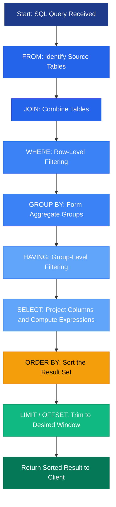
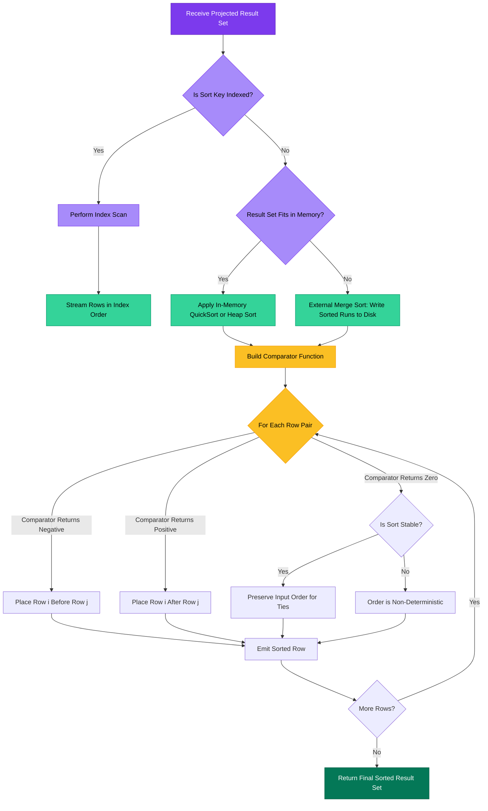
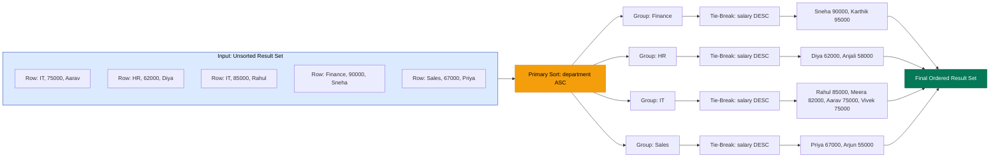
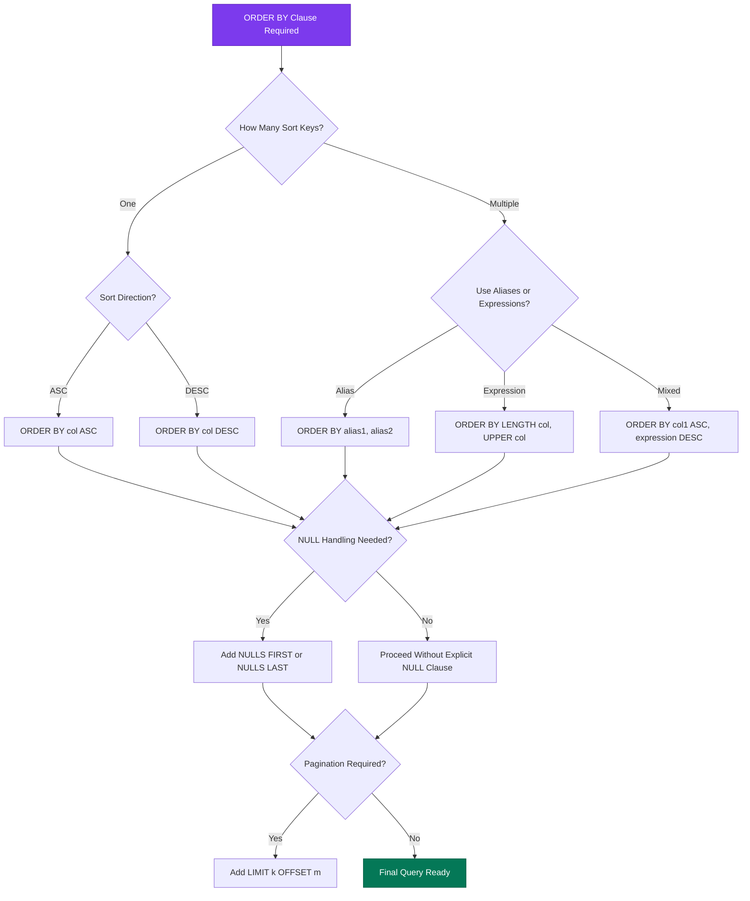

# Implementation of Order By clause in SQL

<!-- SECTION_1_START -->
# Implementation of ORDER BY Clause in SQL — KTU DBMS LAB (PCCSL408)

## 1. Core Technical Definition & Intuitive Overview

### Formal Academic Definition (KTU 2024 Syllabus Terminology)

The **`ORDER BY`** clause is a **Data Manipulation Language (DML)** / **Data Query Language (DQL)** construct in **Structured Query Language (SQL)** that is used to **sort the result set** of a `SELECT` query in either **ascending (`ASC`)** or **descending (`DESC`)** order based on one or more columns or expressions. It is the **final logical operation** in the SQL query execution pipeline and operates on the **virtual table** produced by `FROM`, `WHERE`, `GROUP BY`, and `HAVING` clauses.

> [!IMPORTANT]
> **KTU Board Definition (Recall-Ready):**
> *"The `ORDER BY` clause is used to arrange the rows of the result set of a query in a specified order based on the values of one or more columns. The default sort order is **ascending (`ASC`)** and `NULL` values are treated as the **lowest possible value** in standard SQL."*

### Conceptual Analogy — The Library Catalogue

Imagine you walk into a **library** and ask the librarian: *"Show me all books written in 2023."* The librarian pulls out a stack of 500 books and hands them to you in **random order** — a chaotic pile. Now, if you politely say, *"Please arrange them in **alphabetical order by author name**, and within the same author, **sort by title**"*, the librarian uses a mental **`ORDER BY author ASC, title ASC`** operation.

Similarly, in a database, when a `SELECT` query is executed without `ORDER BY`, the **SQL engine is under no obligation** to return rows in any particular sequence — the order is implementation-defined and may even change between executions. The `ORDER BY` clause imposes **deterministic ordering** on the result set.

### Why It Matters — Real-World Engineering Context

- **Pagination in Web Apps**: `ORDER BY created_at DESC LIMIT 20 OFFSET 0` is the backbone of every "Latest Posts" feed on social media.
- **Leaderboards**: Ranking systems use `ORDER BY score DESC` to display top performers.
- **Financial Reports**: Transactions are ordered chronologically using `ORDER BY transaction_date ASC`.
- **Search Engines**: Results are ranked using a composite `ORDER BY` on multiple fields.

> [!NOTE]
> **Critical KTU Highlight — The Logical Order of SQL Clauses**
> The *logical* (not syntactic) order in which SQL processes clauses is:
>
> `FROM` $\rightarrow$ `WHERE` $\rightarrow$ `GROUP BY` $\rightarrow$ `HAVING` $\rightarrow$ `SELECT` $\rightarrow$ `ORDER BY` $\rightarrow$ `LIMIT/OFFSET`
>
> This means `ORDER BY` is the **very last filtering/transforming step**, operating on the final projected result. This is why you can use **column aliases** defined in `SELECT` inside `ORDER BY` but **cannot** use column aliases inside `WHERE`.

> [!VISUALIZATION CONTROL]
> **Concept:** Sorted vs Unsorted Result Set
> **Input Data (Tuples on a 2D plane):**
> * Points: $(5, 3)$, $(2, 8)$, $(8, 1)$, $(1, 6)$ — unsorted
> * After `ORDER BY x_col ASC`: $(1, 6)$, $(2, 8)$, $(5, 3)$, $(8, 1)$
> **Visual Description:** Picture four points scattered on a Cartesian plane. After applying the sort, the points would be aligned left-to-right along the x-axis in monotonically increasing x-coordinate order, with their y-coordinates "carried along" as part of each tuple.

### Standard Metrics & Constants (Bolded for Recall)

- **Default sort direction:** `ASC` (**ascending**)
- **Default NULL ordering:** `NULLS FIRST` (in `ASC`) and `NULLS LAST` (in `DESC`) — though this varies across DBMS
- **Standard SQL:2003** introduced explicit `NULLS FIRST` / `NULLS LAST` syntax
- **PostgreSQL, Oracle, MySQL 8+** support the explicit null ordering syntax

<!-- SECTION_1_END -->

<!-- SECTION_2_START -->
# 2. Deep Theoretical Analysis & KTU High-Yield Formula Sheet

## 2.1 Operational Breakdown of the ORDER BY Mechanism

The `ORDER BY` clause operates through a **multi-stage internal sort algorithm** that can be decomposed into the following logical steps:

1. **Result Set Materialization:** After `SELECT` projects the columns, the engine holds the intermediate result set in memory (or spills to disk if it exceeds the buffer pool).
2. **Sort Key Extraction:** For each row, the engine extracts the values of the columns/expressions specified in the `ORDER BY` list.
3. **Lexicographic Comparison:** When multiple sort keys are specified (e.g., `ORDER BY col1, col2`), the engine performs a **lexicographic (dictionary-style) comparison**:
   - First, sort by `col1`.
   - If `col1` values are equal, then sort by `col2`.
   - If `col2` values are equal, the order is **non-deterministic** unless a tie-breaker (e.g., primary key) is added.
4. **Comparator Application:** For each pair of rows $R_i$ and $R_j$, a comparator function determines the relative order. The comparator respects the direction specified (`ASC` or `DESC`).
5. **Output Emission:** The sorted tuples are streamed to the client in the final, ordered sequence.

### The "Why" Behind Each Step

- **Step 1 — Materialization:** Necessary because earlier clauses (e.g., `WHERE`, `HAVING`) have already filtered the rows. ORDER BY cannot push down into these earlier stages because it operates on the *projected* result, not the raw table.
- **Step 2 — Key Extraction:** Done to minimize memory footprint; the engine can sort an *index* of pointers to rows rather than the full row data.
- **Step 3 — Lexicographic Comparison:** Mirrors how a phonebook sorts entries: by last name first, then by first name. Each subsequent key acts as a **tie-breaker** for the previous key.
- **Step 4 — Comparator Function:** A unified comparator handles mixed data types, `NULL` semantics, and collation rules (e.g., case-insensitive vs. case-sensitive sorting in `utf8mb4_unicode_ci`).
- **Step 5 — Streamed Output:** The DBMS often uses an **external merge sort** algorithm when the result set exceeds available memory, writing sorted runs to temporary disk files and then merging them.

## 2.2 Variations of ORDER BY

### 2.2.1 Single Column Sort
```sql
SELECT * FROM Employees ORDER BY salary DESC;
```

### 2.2.2 Multi-Column Sort (Composite Sort Key)
```sql
SELECT * FROM Employees ORDER BY department ASC, salary DESC;
```
Here, rows are first grouped by `department` in ascending order; within each department, rows are ordered by `salary` in descending order.

### 2.2.3 Sorting by Column Alias
```sql
SELECT emp_id, salary * 12 AS annual_salary FROM Employees ORDER BY annual_salary DESC;
```
> [!NOTE]
> Column aliases defined in `SELECT` are visible to `ORDER BY` because `ORDER BY` executes *after* `SELECT` in the logical pipeline.

### 2.2.4 Sorting by Column Position (Ordinal)
```sql
SELECT name, salary FROM Employees ORDER BY 2 DESC;
```
This sorts by the **second column** in the `SELECT` list (`salary`). The KTU board generally discourages this style as it reduces readability.

### 2.2.5 Sorting by Expression
```sql
SELECT * FROM Products ORDER BY LENGTH(product_name) ASC;
```

### 2.2.6 Explicit NULL Ordering (SQL:2003+)
```sql
SELECT * FROM Employees ORDER BY commission NULLS LAST;
```

### 2.2.7 Sorting with LIMIT / OFFSET (Pagination)
```sql
SELECT * FROM Employees ORDER BY hire_date DESC LIMIT 10 OFFSET 20;
```

## 2.3 NULL Handling Semantics

The treatment of `NULL` values in `ORDER BY` is **DBMS-specific**. The KTU lab examination expects students to know the default behavior:

| DBMS                  | `ASC` Default NULL Position | `DESC` Default NULL Position | Explicit Syntax Support |
| --------------------- | --------------------------- | ----------------------------- | ----------------------- |
| **PostgreSQL**        | `NULLS LAST`                | `NULLS FIRST`                 | **Yes**                 |
| **Oracle**            | `NULLS LAST`                | `NULLS FIRST`                 | **Yes**                 |
| **MySQL** (pre-8.0)   | `NULLS FIRST`               | `NULLS LAST`                  | **No**                  |
| **MySQL** (8.0+)      | `NULLS FIRST`               | `NULLS LAST`                  | **Yes**                 |
| **SQL Server**        | `NULLS FIRST`               | `NULLS LAST`                  | **No**                  |
| **Standard SQL:2003** | Implementation-defined     | Implementation-defined       | **Yes**                 |

## 2.4 Performance & Engine Internals

- **Using Indexes:** If an index exists on the `ORDER BY` column(s), the engine can avoid a separate sort operation by performing an **index scan** (sometimes called a *"skip sort"*). This is the fastest path.
- **Filesort Operation:** When no suitable index exists, MySQL performs a **filesort** — an in-memory or on-disk sort. For large datasets, this is expensive ($O(n \log n)$ complexity).
- **Sort Buffer Size:** Configurable parameter (e.g., `sort_buffer_size` in MySQL) that controls how much sorting happens in RAM before spilling to disk.
- **Stable vs Unstable Sort:** SQL standard does not guarantee stability, but most implementations (PostgreSQL, MySQL with InnoDB) provide a **stable sort** — meaning rows with equal sort keys retain their relative input order.

## 2.5 Real-World Engineering Utility

| Domain                  | Use Case                                                          | Typical ORDER BY Pattern                                        |
| ----------------------- | ----------------------------------------------------------------- | --------------------------------------------------------------- |
| **E-Commerce**          | Display products sorted by price (low to high)                    | `ORDER BY price ASC`                                            |
| **Social Media**        | Show latest posts first                                           | `ORDER BY created_at DESC`                                      |
| **Banking**             | Generate monthly transaction statements chronologically           | `ORDER BY transaction_date ASC, transaction_time ASC`           |
| **HR Systems**          | List employees by department, then by salary                      | `ORDER BY department ASC, salary DESC`                          |
| **Search Engines**      | Rank search results by relevance score                            | `ORDER BY relevance_score DESC`                                 |
| **Gaming Leaderboards** | Top 10 players by score                                           | `ORDER BY score DESC LIMIT 10`                                  |
| **Data Warehousing**    | Sort fact tables by date dimension for partition pruning          | `ORDER BY date_key ASC`                                         |

## 2.6 KTU High-Yield Formula Sheet

| **Concept**                  | **Syntax / Formula**                                          | **Notes / Constraints**                                  |
| ---------------------------- | ------------------------------------------------------------- | -------------------------------------------------------- |
| Basic Sort (Ascending)       | `ORDER BY column_name ASC`                                    | `ASC` is the **default**; can be omitted                  |
| Basic Sort (Descending)      | `ORDER BY column_name DESC`                                   | Must be **explicitly** written                            |
| Multi-Column Sort            | `ORDER BY col1 [ASC/DESC], col2 [ASC/DESC], ...`              | Lexicographic comparison; leftmost key has highest priority |
| Sort by Alias                | `ORDER BY alias_name`                                         | Aliases defined in `SELECT` are **visible** here          |
| Sort by Position             | `ORDER BY n`                                                  | $n$ refers to $n$-th column in `SELECT` list             |
| Sort by Expression           | `ORDER BY expression`                                         | Expression evaluated per row; can use functions          |
| NULL Handling                | `ORDER BY column [ASC/DESC] NULLS FIRST` / `NULLS LAST`       | SQL:2003 standard; not supported in SQL Server           |
| Sort + Limit                 | `ORDER BY column LIMIT k`                                     | Essential for **top-N** queries                          |
| Sort + Pagination            | `ORDER BY column LIMIT k OFFSET m`                            | Skip $m$ rows, then take $k$ rows                        |
| Stable Sort Guarantee       | Implementation-dependent                                      | PostgreSQL, MySQL InnoDB: **stable**                    |
| Default NULL Position (MySQL)| `NULLS FIRST` (for both ASC and DESC)                          | Differs from PostgreSQL/Oracle                           |
| Position in Query Pipeline   | **Last** logical operation                                    | After `SELECT`, before `LIMIT`                           |

<!-- SECTION_2_END -->

<!-- SECTION_3_START -->
# 3. Step-by-Step Derivations & Code/Symbolic Implementation

## 3.1 Lab Setup — Sample Database Schema

Before demonstrating `ORDER BY`, we need a working schema. The following is a complete, executable script for the **KTU DBMS Lab** environment using **MySQL / PostgreSQL / SQLite** (the syntax is portable).

```sql
-- ============================================================
-- STEP 1: Create and use the database
-- ============================================================
DROP DATABASE IF EXISTS KTU_OrderByLab;
CREATE DATABASE KTU_OrderByLab;
USE KTU_OrderByLab;

-- ============================================================
-- STEP 2: Create the Employees table
-- ============================================================
CREATE TABLE Employees (
    emp_id       INTEGER       PRIMARY KEY AUTOINCREMENT, -- SQLite syntax
    emp_name     VARCHAR(50)   NOT NULL,
    department   VARCHAR(30)   NOT NULL,
    salary       DECIMAL(10,2) NOT NULL CHECK (salary >= 0),
    hire_date    DATE          NOT NULL,
    commission   DECIMAL(8,2)  DEFAULT NULL
);

-- For MySQL, use: emp_id INT PRIMARY KEY AUTO_INCREMENT
-- For PostgreSQL, use: emp_id SERIAL PRIMARY KEY

-- ============================================================
-- STEP 3: Insert sample data
-- ============================================================
INSERT INTO Employees (emp_name, department, salary, hire_date, commission) VALUES
('Aarav Kumar',     'IT',      75000.00, '2022-03-15', 5000.00),
('Diya Menon',      'HR',      62000.00, '2021-07-22', NULL),
('Rahul Pillai',    'IT',      85000.00, '2020-01-10', 7000.00),
('Sneha Iyer',      'Finance', 90000.00, '2019-11-05', NULL),
('Vivek Nair',      'IT',      75000.00, '2023-06-01', 3000.00),
('Anjali Sharma',   'HR',      58000.00, '2022-09-18', 2000.00),
('Karthik Rajan',   'Finance', 95000.00, '2018-04-20', 10000.00),
('Meera Krishnan',  'IT',      82000.00, '2021-12-12', 4500.00),
('Arjun Mathew',    'Sales',   55000.00, '2023-02-28', NULL),
('Priya Varma',     'Sales',   67000.00, '2020-08-14', 6000.00);

-- ============================================================
-- STEP 4: Verify the data
-- ============================================================
SELECT * FROM Employees;
```

### Expected Output (Unordered — actual row order may vary by DBMS)

| emp_id | emp_name        | department | salary   | hire_date  | commission |
| ------ | --------------- | ---------- | -------- | ---------- | ---------- |
| 1      | Aarav Kumar     | IT         | 75000.00 | 2022-03-15 | 5000.00    |
| 2      | Diya Menon      | HR         | 62000.00 | 2021-07-22 | NULL       |
| 3      | Rahul Pillai    | IT         | 85000.00 | 2020-01-10 | 7000.00    |
| 4      | Sneha Iyer      | Finance    | 90000.00 | 2019-11-05 | NULL       |
| 5      | Vivek Nair      | IT         | 75000.00 | 2023-06-01 | 3000.00    |
| 6      | Anjali Sharma   | HR         | 58000.00 | 2022-09-18 | 2000.00    |
| 7      | Karthik Rajan   | Finance    | 95000.00 | 2018-04-20 | 10000.00   |
| 8      | Meera Krishnan  | IT         | 82000.00 | 2021-12-12 | 4500.00    |
| 9      | Arjun Mathew    | Sales      | 55000.00 | 2023-02-28 | NULL       |
| 10     | Priya Varma     | Sales      | 67000.00 | 2020-08-14 | 6000.00    |

## 3.2 Example 1 — Single Column ASC Sort (Default)

```sql
SELECT emp_name, salary
FROM Employees
ORDER BY salary ASC;
```

### Step-by-Step Logical Evaluation

$$
\begin{aligned}
&\text{Step 1: } \text{Fetch all rows from } \texttt{Employees}. \\
&\text{Step 2: } \text{Project columns } \texttt{emp\_name} \text{ and } \texttt{salary}. \\
&\text{Step 3: } \text{Extract sort key: } \texttt{salary} \text{ for each row.} \\
&\text{Step 4: } \text{Apply ascending comparator: } R_i < R_j \iff \text{salary}_i < \text{salary}_j. \\
&\text{Step 5: } \text{Stream sorted rows to the client.}
\end{aligned}
$$

### Expected Output

| emp_name        | salary   |
| --------------- | -------- |
| Arjun Mathew    | 55000.00 |
| Anjali Sharma   | 58000.00 |
| Diya Menon      | 62000.00 |
| Priya Varma     | 67000.00 |
| Aarav Kumar     | 75000.00 |
| Vivek Nair      | 75000.00 |
| Meera Krishnan  | 82000.00 |
| Rahul Pillai    | 85000.00 |
| Sneha Iyer      | 90000.00 |
| Karthik Rajan   | 95000.00 |

## 3.3 Example 2 — Single Column DESC Sort

```sql
SELECT emp_name, salary
FROM Employees
ORDER BY salary DESC;
```

### Step-by-Step Logical Evaluation

$$
\begin{aligned}
&\text{Step 1: } \text{Fetch all rows from } \texttt{Employees}. \\
&\text{Step 2: } \text{Project columns } \texttt{emp\_name} \text{ and } \texttt{salary}. \\
&\text{Step 3: } \text{Extract sort key: } \texttt{salary} \text{ for each row.} \\
&\text{Step 4: } \text{Apply descending comparator: } R_i < R_j \iff \text{salary}_i > \text{salary}_j. \\
&\text{Step 5: } \text{Stream sorted rows to the client in reverse salary order.}
\end{aligned}
$$

### Expected Output

| emp_name        | salary   |
| --------------- | -------- |
| Karthik Rajan   | 95000.00 |
| Sneha Iyer      | 90000.00 |
| Rahul Pillai    | 85000.00 |
| Meera Krishnan  | 82000.00 |
| Aarav Kumar     | 75000.00 |
| Vivek Nair      | 75000.00 |
| Priya Varma     | 67000.00 |
| Diya Menon      | 62000.00 |
| Anjali Sharma   | 58000.00 |
| Arjun Mathew    | 55000.00 |

> [!NOTE]
> Notice that **Aarav Kumar** and **Vivek Nair** both have a salary of $75000.00$. Their relative order in the output is **non-deterministic** unless a tie-breaker is added. This is a common KTU lab question.

## 3.4 Example 3 — Multi-Column Sort (Composite Key)

```sql
SELECT emp_name, department, salary
FROM Employees
ORDER BY department ASC, salary DESC;
```

### Step-by-Step Logical Evaluation

$$
\begin{aligned}
&\text{Step 1: } \text{Identify the primary sort key: } \texttt{department} \text{ (ASC).} \\
&\text{Step 2: } \text{Partition rows into groups by } \texttt{department}. \\
&\text{Step 3: } \text{Within each group, apply the secondary sort key: } \texttt{salary} \text{ (DESC).} \\
&\text{Step 4: } \text{Stream the groups in department order: Finance, HR, IT, Sales.}
\end{aligned}
$$

### Expected Output

| emp_name        | department | salary   |
| --------------- | ---------- | -------- |
| Karthik Rajan   | Finance    | 95000.00 |
| Sneha Iyer      | Finance    | 90000.00 |
| Anjali Sharma   | HR         | 58000.00 |
| Diya Menon      | HR         | 62000.00 |
| Rahul Pillai    | IT         | 85000.00 |
| Meera Krishnan  | IT         | 82000.00 |
| Aarav Kumar     | IT         | 75000.00 |
| Vivek Nair      | IT         | 75000.00 |
| Priya Varma     | Sales      | 67000.00 |
| Arjun Mathew    | Sales      | 55000.00 |

> [!NOTE]
> Within the **IT** department, the two employees with $75000.00$ salary (**Aarav Kumar** and **Vivek Nair**) have a **non-deterministic** order. To make it deterministic, add a tie-breaker: `ORDER BY department ASC, salary DESC, emp_name ASC`.

## 3.5 Example 4 — Sorting by Column Alias

```sql
SELECT
    emp_name,
    salary,
    salary * 12 AS annual_salary
FROM Employees
ORDER BY annual_salary DESC;
```

### Step-by-Step Logical Evaluation

$$
\begin{aligned}
&\text{Step 1: } \text{Compute the alias } \texttt{annual\_salary} = \texttt{salary} \times 12 \text{ for each row.} \\
&\text{Step 2: } \text{Sort the result set by the computed alias in descending order.}
\end{aligned}
$$

> [!IMPORTANT]
> The alias `annual_salary` is **not visible** in the `WHERE` clause because `WHERE` executes *before* `SELECT`. But it **is visible** in `ORDER BY` because `ORDER BY` executes *after* `SELECT`.

## 3.6 Example 5 — Sorting with NULL Handling

```sql
-- PostgreSQL / Oracle / MySQL 8.0+
SELECT emp_name, commission
FROM Employees
ORDER BY commission ASC NULLS LAST;

-- MySQL pre-8.0 / SQL Server (no explicit NULLS syntax)
SELECT emp_name, commission
FROM Employees
ORDER BY commission IS NULL, commission ASC;
```

### Step-by-Step Logical Evaluation

$$
\begin{aligned}
&\text{Step 1: } \text{Identify all rows where } \texttt{commission} \text{ is } \texttt{NULL}. \\
&\text{Step 2: } \text{Place } \texttt{NULL} \text{ rows at the end ( } \texttt{NULLS LAST} \text{ ).} \\
&\text{Step 3: } \text{Sort non-NULL rows by } \texttt{commission} \text{ in ascending order.}
\end{aligned}
$$

### Expected Output

| emp_name        | commission |
| --------------- | ---------- |
| Anjali Sharma   | 2000.00    |
| Vivek Nair      | 3000.00    |
| Meera Krishnan  | 4500.00    |
| Aarav Kumar     | 5000.00    |
| Priya Varma     | 6000.00    |
| Rahul Pillai    | 7000.00    |
| Karthik Rajan   | 10000.00   |
| Diya Menon      | NULL       |
| Sneha Iyer      | NULL       |
| Arjun Mathew    | NULL       |

## 3.7 Example 6 — Sorting with LIMIT (Top-N Query)

```sql
-- Find the top 3 highest-paid employees
SELECT emp_name, salary
FROM Employees
ORDER BY salary DESC
LIMIT 3;
```

### Step-by-Step Logical Evaluation

$$
\begin{aligned}
&\text{Step 1: } \text{Sort all rows by } \texttt{salary} \text{ in descending order.} \\
&\text{Step 2: } \text{Retain only the first 3 rows from the sorted result.}
\end{aligned}
$$

### Expected Output

| emp_name        | salary   |
| --------------- | -------- |
| Karthik Rajan   | 95000.00 |
| Sneha Iyer      | 90000.00 |
| Rahul Pillai    | 85000.00 |

> [!WARNING]
> **Common KTU Lab Mistake:** Writing `LIMIT 3` **without** `ORDER BY` is meaningless — the DBMS will return 3 *arbitrary* rows. The combination of `ORDER BY` + `LIMIT` is what gives you a meaningful "top-N" result.

## 3.8 Example 7 — Sorting by Expression

```sql
-- Sort employees by the length of their name
SELECT emp_name, department
FROM Employees
ORDER BY LENGTH(emp_name) ASC, emp_name ASC;
```

### Step-by-Step Logical Evaluation

$$
\begin{aligned}
&\text{Step 1: } \text{Compute } \texttt{LENGTH(emp\_name)} \text{ for each row.} \\
&\text{Step 2: } \text{Sort ascending by the computed length.} \\
&\text{Step 3: } \text{For ties (same length), sort alphabetically by } \texttt{emp\_name}. \\
\end{aligned}
$$

## 3.9 Python Simulation of ORDER BY Logic

The following Python code demonstrates the **internal sort logic** of the SQL `ORDER BY` clause using Python's stable sort. This is useful for KTU lab viva questions where you may be asked: *"What algorithm does the DBMS use internally for ORDER BY?"*

```python
from typing import List, Dict, Any, Tuple, Callable

def order_by(rows: List[Dict[str, Any]],
             sort_keys: List[Tuple[str, bool]]) -> List[Dict[str, Any]]:
    """
    Simulates the SQL ORDER BY clause.
    
    Parameters:
        rows      : List of dictionaries representing table rows.
        sort_keys : List of (column_name, descending_flag) tuples.
                    e.g., [('department', False), ('salary', True)]
                    means ORDER BY department ASC, salary DESC.
    
    Returns:
        A new list of rows sorted according to the specified keys.
    """
    def sort_comparator(row: Dict[str, Any]) -> tuple:
        # Python's sort is stable, so we build a composite key
        composite_key = []
        for col, is_desc in sort_keys:
            value = row[col]
            # Handle None (NULL) by using a tuple that sorts correctly
            if value is None:
                # In SQL, NULLs are typically LAST in ASC, FIRST in DESC
                composite_key.append((1, value))  # (1, None) sorts after (0, ...)
            else:
                composite_key.append((0, value))
            # Negate numeric values for DESC ordering
            if is_desc and isinstance(value, (int, float)):
                composite_key[-1] = (composite_key[-1][0], -value)
        return tuple(composite_key)

    return sorted(rows, key=sort_comparator)


# ============================================================
# Test Data (mirrors the SQL Employees table)
# ============================================================
employees = [
    {"emp_id": 1,  "emp_name": "Aarav Kumar",    "department": "IT",      "salary": 75000.00, "hire_date": "2022-03-15", "commission": 5000.00},
    {"emp_id": 2,  "emp_name": "Diya Menon",     "department": "HR",      "salary": 62000.00, "hire_date": "2021-07-22", "commission": None},
    {"emp_id": 3,  "emp_name": "Rahul Pillai",   "department": "IT",      "salary": 85000.00, "hire_date": "2020-01-10", "commission": 7000.00},
    {"emp_id": 4,  "emp_name": "Sneha Iyer",     "department": "Finance", "salary": 90000.00, "hire_date": "2019-11-05", "commission": None},
    {"emp_id": 5,  "emp_name": "Vivek Nair",     "department": "IT",      "salary": 75000.00, "hire_date": "2023-06-01", "commission": 3000.00},
    {"emp_id": 6,  "emp_name": "Anjali Sharma",  "department": "HR",      "salary": 58000.00, "hire_date": "2022-09-18", "commission": 2000.00},
    {"emp_id": 7,  "emp_name": "Karthik Rajan",  "department": "Finance", "salary": 95000.00, "hire_date": "2018-04-20", "commission": 10000.00},
    {"emp_id": 8,  "emp_name": "Meera Krishnan", "department": "IT",      "salary": 82000.00, "hire_date": "2021-12-12", "commission": 4500.00},
    {"emp_id": 9,  "emp_name": "Arjun Mathew",   "department": "Sales",   "salary": 55000.00, "hire_date": "2023-02-28", "commission": None},
    {"emp_id": 10, "emp_name": "Priya Varma",    "department": "Sales",   "salary": 67000.00, "hire_date": "2020-08-14", "commission": 6000.00},
]


# ============================================================
# Demonstration: ORDER BY department ASC, salary DESC
# ============================================================
sorted_employees = order_by(employees, [('department', False), ('salary', True)])

print(f"{'emp_name':<20} {'department':<12} {'salary':<10}")
print("-" * 45)
for emp in sorted_employees:
    print(f"{emp['emp_name']:<20} {emp['department']:<12} {emp['salary']:<10.2f}")
```

### Expected Output of Python Code

```
emp_name             department   salary     
---------------------------------------------
Karthik Rajan        Finance      95000.00   
Sneha Iyer           Finance      90000.00   
Anjali Sharma        HR           58000.00   
Diya Menon           HR           62000.00   
Rahul Pillai         IT           85000.00   
Meera Krishnan       IT           82000.00   
Aarav Kumar          IT           75000.00   
Vivek Nair           IT           75000.00   
Priya Varma          Sales        67000.00   
Arjun Mathew         Sales        55000.00   
```

## 3.10 Common ORDER BY Errors & Their Fixes

| **Error**                                                  | **Cause**                                                | **Fix**                                                  |
| ---------------------------------------------------------- | -------------------------------------------------------- | -------------------------------------------------------- |
| `Unknown column 'annual_salary' in 'order clause'`         | Using a `SELECT` alias inside `WHERE` or `GROUP BY`      | Aliases are **only** visible in `ORDER BY` and `HAVING`  |
| `Incorrect syntax near 'DESC'`                             | Using `DESC` without a preceding column name             | Ensure syntax is `ORDER BY column_name DESC`              |
| `LIMIT' is not a valid clause at this position`            | Using `LIMIT` in SQL Server (it uses `TOP` or `OFFSET-FETCH`) | Use `TOP n` or `OFFSET n ROWS FETCH NEXT m ROWS ONLY`  |
| Unexpected NULL ordering                                   | Assuming a DBMS-specific default                         | Use explicit `NULLS FIRST` / `NULLS LAST`                |
| Slow query with `ORDER BY`                                 | No index on the sort column(s)                           | Create a B-Tree index: `CREATE INDEX idx ON t(col);`     |

<!-- SECTION_3_END -->

<!-- SECTION_4_START -->
# 4. Structural Diagrams & Schematics

## 4.1 Mermaid Diagram — SQL Query Execution Pipeline (Logical Order)



### Diagram Annotation

- **Blue stages (B–G):** Pre-sorting transformations. The result set is still unordered.
- **Amber stage (H):** The `ORDER BY` clause — the **final ordering step** that imposes a deterministic sequence.
- **Green stages (I–J):** Post-sorting operations (pagination and final delivery).

## 4.2 Mermaid Diagram — ORDER BY Internal Sort Algorithm



## 4.3 Mermaid Diagram — Lexicographic Multi-Column Sort



## 4.4 Mermaid Diagram — ORDER BY Variants Decision Tree



<!-- SECTION_4_END -->

<!-- SECTION_5_START -->
# 5. KTU 2024 Scheme Examination Question Bank & Topic Recap

## 5.1 Part A Questions (3 Marks Each)

### Question 1 `[KTU University Exam — July 2024]`
**CO1 | Remember**

**Q:** What is the purpose of the `ORDER BY` clause in SQL? What is the default sort order, and how does SQL treat `NULL` values during sorting in MySQL?

**Model Answer (3 Marks):**

> The `ORDER BY` clause is used to **sort the result set** of a `SELECT` query in either ascending or descending order based on one or more columns or expressions **[1 Mark]**.
>
> The **default sort order** is **ascending (`ASC`)**. If neither `ASC` nor `DESC` is specified, the DBMS assumes `ASC` **[1 Mark]**.
>
> In **MySQL**, `NULL` values are treated as the **lowest possible value** in `ASC` order (i.e., `NULLS FIRST`) and as the **highest possible value** in `DESC` order (i.e., `NULLS LAST`). This behavior is the **opposite** of PostgreSQL and Oracle **[1 Mark]**.

---

### Question 2 `[KTU University Exam — Dec 2023]`
**CO1 | Understand**

**Q:** Differentiate between sorting by a **column name**, a **column alias**, and a **column position** in the `ORDER BY` clause. Give one example for each.

**Model Answer (3 Marks):**

| **Method**         | **Description**                                              | **Example**                                      |
| ------------------ | ------------------------------------------------------------ | ------------------------------------------------ |
| Column Name        | Sorts by the actual column from the base table or view       | `ORDER BY salary DESC` **[1 Mark]**             |
| Column Alias       | Sorts by an alias defined in the `SELECT` list               | `ORDER BY annual_salary DESC` **[1 Mark]**      |
| Column Position    | Sorts by the $n$-th column in the `SELECT` list (1-indexed)  | `ORDER BY 2 DESC` (sorts by 2nd column) **[1 Mark]** |

---

## 5.2 Part B Questions (14 Marks Each — Internal Choice)

### Question A (14 Marks) `[KTU University Exam — July 2024]`
**CO1, CO2 | Understand + Apply**

Consider the following `Products` table:

| **Column Name**  | **Data Type**     | **Constraint**       |
| ---------------- | ----------------- | -------------------- |
| `product_id`     | `INT`             | `PRIMARY KEY`        |
| `product_name`   | `VARCHAR(50)`     | `NOT NULL`           |
| `category`       | `VARCHAR(30)`     | `NOT NULL`           |
| `price`          | `DECIMAL(8,2)`    | `NOT NULL`           |
| `stock_qty`      | `INT`             | `DEFAULT 0`          |
| `mfg_date`       | `DATE`            | `NOT NULL`           |

**Part (a) — 7 Marks | Understand**
Write the SQL `CREATE TABLE` statement for the above schema, including all constraints. Insert at least **6 sample rows** with varying categories, prices, and stock quantities (include at least one row with a `NULL` or default `stock_qty`).

**Part (b) — 7 Marks | Apply**
Write SQL queries using the `ORDER BY` clause to answer the following:
1. List all products sorted by `price` in **descending** order.
2. List all products sorted by `category` **ascending** and within each category by `price` **descending**.
3. List the **top 3 most expensive products** (use `ORDER BY` + `LIMIT`).
4. List all products sorted by the **length of the product name** in ascending order, and for ties, sort alphabetically.

---

### Model Answer — Question A

#### Part (a) — Solution `[7 Marks]`

```sql
-- [Writing CREATE TABLE statement: 3 Marks]
CREATE TABLE Products (
    product_id   INT             PRIMARY KEY AUTO_INCREMENT,
    product_name VARCHAR(50)     NOT NULL,
    category     VARCHAR(30)     NOT NULL,
    price        DECIMAL(8,2)    NOT NULL CHECK (price >= 0),
    stock_qty    INT             DEFAULT 0,
    mfg_date     DATE            NOT NULL
);

-- [Inserting sample rows: 3 Marks]
INSERT INTO Products (product_name, category, price, stock_qty, mfg_date) VALUES
('Laptop Pro 15',    'Electronics', 85000.00, 25,   '2024-01-15'),
('Wireless Mouse',   'Electronics', 1200.00,  150,  '2024-03-10'),
('Office Chair',     'Furniture',   7500.00,  40,   '2023-11-20'),
('Study Table',      'Furniture',   12000.00, 15,   '2024-02-05'),
('Notebook A5',      'Stationery',  150.00,   NULL, '2024-04-01'),
('Gel Pen Pack',     'Stationery',  80.00,    500,  '2024-05-12'),
('USB-C Hub',        'Electronics', 3500.00,  60,   '2024-01-30');

-- [Verifying with SELECT *: 1 Mark]
SELECT * FROM Products;
```

#### Part (b) — Solution `[7 Marks]`

**Query 1 — Sort by price DESC `[1.5 Marks]`**

```sql
SELECT product_name, category, price
FROM Products
ORDER BY price DESC;
```

| product_name     | category    | price    |
| ---------------- | ----------- | -------- |
| Laptop Pro 15    | Electronics | 85000.00 |
| Study Table      | Furniture   | 12000.00 |
| Office Chair     | Furniture   | 7500.00  |
| USB-C Hub        | Electronics | 3500.00  |
| Wireless Mouse   | Electronics | 1200.00  |
| Notebook A5      | Stationery  | 150.00   |
| Gel Pen Pack     | Stationery  | 80.00    |

**Query 2 — Composite sort `[2 Marks]`**

```sql
SELECT product_name, category, price
FROM Products
ORDER BY category ASC, price DESC;
```

| product_name     | category    | price    |
| ---------------- | ----------- | -------- |
| Laptop Pro 15    | Electronics | 85000.00 |
| USB-C Hub        | Electronics | 3500.00  |
| Wireless Mouse   | Electronics | 1200.00  |
| Study Table      | Furniture   | 12000.00 |
| Office Chair     | Furniture   | 7500.00  |
| Notebook A5      | Stationery  | 150.00   |
| Gel Pen Pack     | Stationery  | 80.00    |

**Query 3 — Top 3 most expensive `[1.5 Marks]`**

```sql
SELECT product_name, price
FROM Products
ORDER BY price DESC
LIMIT 3;
```

| product_name     | price    |
| ---------------- | -------- |
| Laptop Pro 15    | 85000.00 |
| Study Table      | 12000.00 |
| Office Chair     | 7500.00  |

**Query 4 — Sort by expression `[2 Marks]`**

```sql
SELECT product_name, LENGTH(product_name) AS name_length
FROM Products
ORDER BY LENGTH(product_name) ASC, product_name ASC;
```

| product_name     | name_length |
| ---------------- | ----------- |
| USB-C Hub        | 9           |
| Notebook A5      | 11          |
| Gel Pen Pack     | 12          |
| Office Chair     | 12          |
| Study Table      | 11          |
| Wireless Mouse   | 14          |
| Laptop Pro 15    | 14          |

> [!NOTE]
> **Valuation Key — Tie-Breaking:** For `Office Chair` (12 chars) and `Gel Pen Pack` (12 chars), the secondary sort by `product_name ASC` breaks the tie alphabetically: `G` (Gel) comes before `O` (Office). **[0.5 Mark]**

---

### Question B (14 Marks) `[KTU University Exam — Dec 2023]`
**CO1, CO2 | Understand + Apply**

Consider the following `Library` database schema:

- **Books** (`book_id`, `title`, `author`, `genre`, `price`, `publication_year`)
- **Members** (`member_id`, `member_name`, `join_date`, `membership_type`)
- **BorrowRecords** (`record_id`, `book_id`, `member_id`, `borrow_date`, `return_date`)

**Part (a) — 7 Marks | Understand**
Explain the **logical order of execution** of SQL clauses with respect to the `ORDER BY` clause. Why is `ORDER BY` the **last** clause in the logical execution pipeline? What is the significance of this ordering for **column aliases**?

**Part (b) — 7 Marks | Apply**
Write SQL queries to:
1. List all books sorted by `publication_year` **descending**, and for books published in the same year, sort by `price` **ascending**.
2. List the **5 most recently joined members** of type `'Premium'`, sorted by `join_date` **descending**.
3. Display the **book title**, **member name**, and **borrow date** for all borrow records, sorted by `borrow_date` **ascending**. Use a **3-table JOIN**.
4. List all books whose `genre` is `'Science'` or `'Technology'`, sorted by `price` **descending**, showing only the **top 4** results.

---

### Model Answer — Question B

#### Part (a) — Solution `[7 Marks]`

**Logical Order of SQL Clause Execution `[3 Marks]`:**

The logical order in which the SQL engine processes clauses is:

$$
\texttt{FROM} \rightarrow \texttt{WHERE} \rightarrow \texttt{GROUP BY} \rightarrow \texttt{HAVING} \rightarrow \texttt{SELECT} \rightarrow \texttt{ORDER BY} \rightarrow \texttt{LIMIT/OFFSET}
$$

**Why `ORDER BY` is the last clause `[2 Marks]`:**

The `ORDER BY` clause is the **last logical operation** because it operates on the **final projected result set** produced by the `SELECT` clause. All filtering (`WHERE`, `HAVING`), grouping (`GROUP BY`), and projection (`SELECT`) must be completed first so that `ORDER BY` can sort the **complete, final** set of rows that will be returned to the user. If `ORDER BY` were executed earlier (e.g., before `SELECT`), it would not have access to computed columns or aliases.

**Significance for Column Aliases `[2 Marks]`:**

Because `ORDER BY` executes **after** `SELECT`, it can reference **column aliases** defined in the `SELECT` list. For example:

```sql
SELECT salary * 12 AS annual_salary
FROM Employees
ORDER BY annual_salary DESC;
```

This query works because `annual_salary` is computed during `SELECT` and is available when `ORDER BY` runs. However, the **same alias cannot** be used in `WHERE` or `GROUP BY` because those clauses execute *before* `SELECT`.

#### Part (b) — Solution `[7 Marks]`

**Query 1 — Books by year DESC, price ASC `[1.5 Marks]`**

```sql
SELECT title, author, publication_year, price
FROM Books
ORDER BY publication_year DESC, price ASC;
```

**Query 2 — Top 5 recent Premium members `[1.5 Marks]`**

```sql
SELECT member_name, join_date, membership_type
FROM Members
WHERE membership_type = 'Premium'
ORDER BY join_date DESC
LIMIT 5;
```

**Query 3 — 3-table JOIN with sort `[2.5 Marks]`**

```sql
SELECT B.title, M.member_name, BR.borrow_date
FROM BorrowRecords BR
INNER JOIN Books   B ON BR.book_id   = B.book_id
INNER JOIN Members M ON BR.member_id = M.member_id
ORDER BY BR.borrow_date ASC;
```

**Query 4 — Filtered and limited `[1.5 Marks]`**

```sql
SELECT title, genre, price
FROM Books
WHERE genre IN ('Science', 'Technology')
ORDER BY price DESC
LIMIT 4;
```

> [!NOTE]
> **Valuation Key — JOIN Syntax:** For Query 3, the examiner awards full marks only if **all three tables** are joined using proper `ON` conditions and the `ORDER BY` uses the **fully qualified column name** `BR.borrow_date` to avoid ambiguity. **[1 Mark reserved for correct JOIN syntax]**

---

## 5.3 KTU Examiner's Valuation Warning / Pitfall Callout

> [!WARNING]
> **Common Mistakes That Cost Marks in DBMS LAB Exams:**
>
> 1. **Forgetting `ORDER BY` with `LIMIT`:** A query like `SELECT * FROM Products LIMIT 3` without `ORDER BY` returns **3 arbitrary rows**. The DBMS gives no guarantee about *which* 3 rows. Always combine `ORDER BY` with `LIMIT` for a meaningful top-N query. **[-2 Marks]**
>
> 2. **Confusing `WHERE` and `HAVING`:** `WHERE` filters **rows** *before* `GROUP BY`. `HAVING` filters **groups** *after* `GROUP BY`. `ORDER BY` operates on the **final result set** after both. **[-1 Mark]**
>
> 3. **Using `NULL` in arithmetic comparisons:** `NULL = NULL` evaluates to `NULL` (unknown), not `TRUE`. Use `IS NULL` / `IS NOT NULL` instead. **[-1 Mark]**
>
> 4. **Not specifying tie-breakers:** When two rows have the same sort key, their relative order is **non-deterministic**. In a lab exam, the evaluator may run the query multiple times and get different results. **Always add a tie-breaker** (e.g., `ORDER BY salary DESC, emp_id ASC`). **[-0.5 Mark]**
>
> 5. **Misplacing `ORDER BY`:** `ORDER BY` must come **after** `WHERE`, `GROUP BY`, and `HAVING`, but **before** `LIMIT`/`OFFSET`. Placing it in the wrong position is a **syntax error**. **[-2 Marks]**
>
> 6. **Case-sensitivity in `ORDER BY`:** Sorting strings is **collation-dependent**. In `utf8mb4_unicode_ci`, `'apple'` and `'APPLE'` are treated as equal. In `utf8mb4_bin`, they are distinct. Be aware of the collation of your column. **[-1 Mark]**

---

## 5.4 Topic Recap & Important Things to Remember

> [!IMPORTANT]
> **Rapid Revision Checklist — ORDER BY Clause**
>
> - **`ORDER BY` is the last logical operation** in the SQL query execution pipeline: `FROM` $\rightarrow$ `WHERE` $\rightarrow$ `GROUP BY` $\rightarrow$ `HAVING` $\rightarrow$ `SELECT` $\rightarrow$ **`ORDER BY`** $\rightarrow$ `LIMIT/OFFSET`.
> - **Default sort direction** is `ASC` (ascending). If neither `ASC` nor `DESC` is specified, the engine assumes `ASC`.
> - **Column aliases** defined in `SELECT` are **visible** in `ORDER BY` (and `HAVING`), but **not** in `WHERE` or `GROUP BY`.
> - **Multi-column sort** is evaluated **lexicographically**: the leftmost key is the primary sort key, and subsequent keys are tie-breakers.
> - **NULL handling** is **DBMS-specific**:
>   * **MySQL:** `NULLS FIRST` in `ASC`, `NULLS LAST` in `DESC` (opposite of PostgreSQL/Oracle).
>   * **PostgreSQL / Oracle:** `NULLS LAST` in `ASC`, `NULLS FIRST` in `DESC`.
>   * **SQL:2003 standard** provides explicit `NULLS FIRST` / `NULLS LAST` syntax.
> - **`ORDER BY` + `LIMIT`** is the canonical pattern for **top-N queries** (leaderboards, latest posts, etc.).
> - **Pagination** is achieved with `LIMIT k OFFSET m` (or `OFFSET m ROWS FETCH NEXT k ROWS ONLY` in SQL Server).
> - **Sorting by expression** (e.g., `ORDER BY LENGTH(name)`) is fully supported and useful for custom sort orders.
> - **Sorting by column position** (e.g., `ORDER BY 2`) works but is **discouraged** by the KTU board for readability.
> - **Performance tip:** If an index exists on the `ORDER BY` column(s), the engine can avoid a separate sort by performing an **index scan**. Without an index, a **filesort** operation is used ($O(n \log n)$ complexity).
> - **Stable sort guarantee:** Most modern DBMS (PostgreSQL, MySQL with InnoDB) provide a **stable sort** — rows with equal sort keys retain their input order.
> - **Common pitfall:** Without a tie-breaker, rows with equal sort keys may appear in **any order** across executions. Always add a unique tie-breaker (e.g., primary key) for **deterministic results**.
> - **Syntax template (canonical):** `SELECT columns FROM table [WHERE condition] [GROUP BY cols] [HAVING condition] ORDER BY col1 [ASC/DESC], col2 [ASC/DESC] [NULLS FIRST/LAST] [LIMIT k OFFSET m];`

<!-- SECTION_5_END -->
