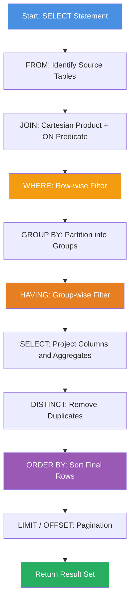
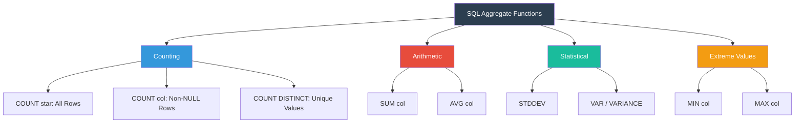
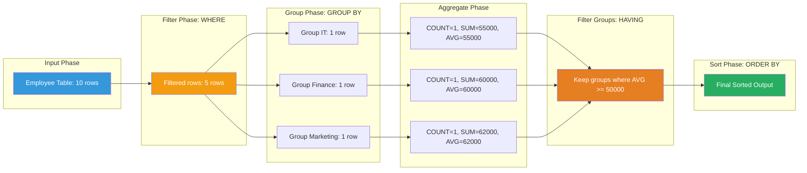
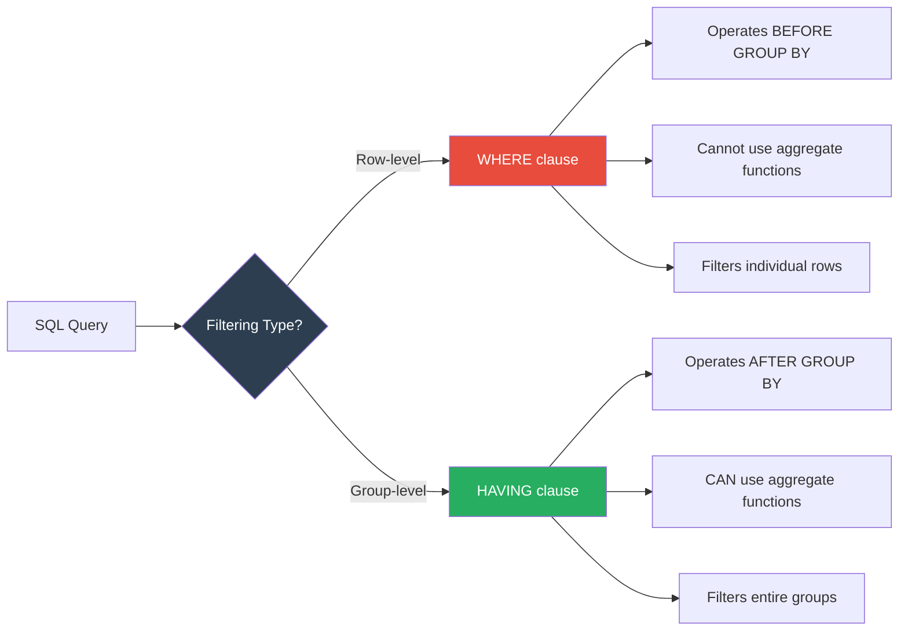
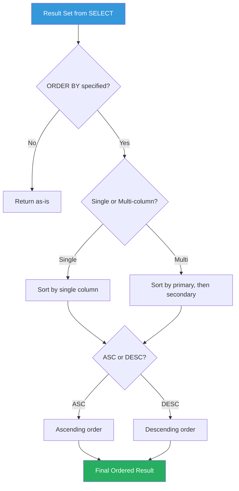

# Implementation of various aggregate functions, Order By, Group By & Having clause in SQL.

<!-- SECTION_1_START -->
# 🗃️ KTU DBMS LAB (PCCSL408) — Module 5: SQL Aggregate Functions & Clauses

## 1. Core Technical Definition & Intuitive Overview

### 1.1 Formal Definition (KTU 2024 Scheme Terminology)

> [!IMPORTANT]
> **Aggregate Functions** in SQL are built-in functions that perform a calculation on a set of values and return a **single summary value**. They operate on a group of rows defined by the `GROUP BY` clause or on the entire result set.
> The standard aggregate functions defined by the SQL standard (ISO/IEC 9075) are: `COUNT()`, `SUM()`, `AVG()`, `MIN()`, and `MAX()`.

The clauses that govern how data is **retrieved, grouped, filtered, and ordered** in a single `SELECT` statement are:

| Clause | Purpose |
|---|---|
| `SELECT` | Projection of columns / expressions |
| `FROM`   | Source table(s) |
| `WHERE`  | Row-wise filtering (BEFORE grouping) |
| `GROUP BY` | Partition rows into groups sharing column values |
| `HAVING` | Group-wise filtering (AFTER grouping) |
| `ORDER BY` | Sort the final result set |

### 1.2 Conceptual Analogy — The "Classroom" Intuition

> [!NOTE]
> **Think of an Excel Pivot Table:** Imagine a spreadsheet of 1000 students with columns *Department, Marks, Age, Gender*. 
> - `WHERE` is the **filter** (e.g., "only show students older than 20"). 
> - `GROUP BY` is the **row labels** of a pivot table (e.g., "group by Department"). 
> - **Aggregate functions** are the **summary cells** (e.g., "AVG(Marks) per Department"). 
> - `HAVING` is a **filter ON the pivot summary cells** (e.g., "show only Departments where AVG > 70"). 
> - `ORDER BY` is the **final sort** of those summary rows (e.g., highest average first).

### 1.3 Logical Order of SQL Execution (CRITICAL FOR EXAMS)

> [!WARNING]
> **A common KTU pitfall**: Students think SQL executes clauses in the *written* order. It does **not**. The actual logical order is:
> 
> `FROM` → `WHERE` → `GROUP BY` → `HAVING` → `SELECT` → `DISTINCT` → `ORDER BY` → `LIMIT`
> 
> This is why `WHERE` cannot reference an alias and `HAVING` can reference aggregates.

### 1.4 The Reference Schema for This Module

We will use a consistent **Company** database throughout the lab so that every query is reproducible.

```sql
-- Table 1: DEPARTMENT
CREATE TABLE Department (
    DeptID     INT PRIMARY KEY,
    DeptName   VARCHAR(30) NOT NULL UNIQUE,
    Location   VARCHAR(20)
);

-- Table 2: EMPLOYEE
CREATE TABLE Employee (
    EmpID      INT PRIMARY KEY,
    EmpName    VARCHAR(40) NOT NULL,
    DeptID     INT,
    Salary     DECIMAL(10,2) CHECK (Salary > 0),
    JoinDate   DATE,
    FOREIGN KEY (DeptID) REFERENCES Department(DeptID)
);
```

**Sample Data Insertion (`Department`):**

| DeptID | DeptName | Location |
|---|---|---|
| 1 | IT | Bangalore |
| 2 | HR | Mumbai |
| 3 | Finance | Delhi |
| 4 | Marketing | Chennai |

**Sample Data Insertion (`Employee`):**

| EmpID | EmpName | DeptID | Salary | JoinDate |
|---|---|---|---|---|
| 101 | Arun Krishnan | 1 | 55000.00 | 2020-01-15 |
| 102 | Priya Menon | 2 | 48000.00 | 2019-05-20 |
| 103 | Rahul Dev | 1 | 72000.00 | 2018-03-10 |
| 104 | Sneha Pillai | 3 | 60000.00 | 2021-07-01 |
| 105 | Vijay Nair | 2 | 42000.00 | 2022-02-14 |
| 106 | Anita Varma | 3 | 85000.00 | 2017-11-30 |
| 107 | Karthik B | 1 | 95000.00 | 2016-08-22 |
| 108 | Meera Jose | 2 | 51000.00 | 2020-09-09 |
| 109 | Suresh K | 4 | 47000.00 | 2023-01-05 |
| 110 | Lakshmi R | 4 | 62000.00 | 2019-12-12 |

<!-- SECTION_1_END -->

<!-- SECTION_2_START -->
# 2. Deep Theoretical Analysis & KTU High-Yield Formula Sheet

## 2.1 The Five Standard Aggregate Functions

> [!NOTE]
> **NULL Handling Rule (Board Favorite)**: All aggregate functions **except `COUNT(*)`** *ignore* `NULL` values. This is a frequent 3-mark question in KTU exams.

| Function | Input Type | Return Type | NULL Behavior | Example |
|---|---|---|---|---|
| `COUNT(*)` | Rows | Integer | **Counts all rows** including NULLs | `SELECT COUNT(*) FROM Employee;` |
| `COUNT(col)` | Column | Integer | **Ignores** NULLs in that column | `SELECT COUNT(DeptID) FROM Employee;` |
| `SUM(col)` | Numeric | Same/Double | Ignores NULLs | `SELECT SUM(Salary) FROM Employee;` |
| `AVG(col)` | Numeric | Double | Ignores NULLs (uses non-NULL count as denominator) | `SELECT AVG(Salary) FROM Employee;` |
| `MIN(col)` | Any orderable | Same type | Ignores NULLs | `SELECT MIN(JoinDate) FROM Employee;` |
| `MAX(col)` | Any orderable | Same type | Ignores NULLs | `SELECT MAX(Salary) FROM Employee;` |

## 2.2 The `GROUP BY` Clause — Mechanics

**Operational rule**: Every non-aggregated column in the `SELECT` list **must** appear in the `GROUP BY` clause (in standard SQL, this is enforced strictly).

$$
\text{Partition } T \text{ into groups } \{G_1, G_2, \dots, G_k\} \text{ where } \forall r_i, r_j \in G_g : r_i.\text{col} = r_j.\text{col}
$$

For each group $G_g$, compute the aggregate(s) and emit **one output row** per group.

## 2.3 The `HAVING` vs `WHERE` Distinction

> [!IMPORTANT]
> - `WHERE` filters **rows** *before* grouping. It **cannot** contain aggregate functions.
> - `HAVING` filters **groups** *after* grouping. It **can** (and usually does) contain aggregate functions.

## 2.4 The `ORDER BY` Clause

- Default sort order is **ASCENDING** (ASC). Use the keyword `DESC` for descending.
- You can order by multiple columns: `ORDER BY DeptName ASC, Salary DESC`.
- You can order by **column position** (1-based) — discouraged in production but valid in SQL.
- You can order by an **alias** defined in `SELECT` (this is the only place an alias from `SELECT` is usable).

## 2.5 KTU Formula Sheet / Cheat Sheet

> [!VISUALIZATION CONTROL]
> **Concept:** Effect of aggregate queries on a small dataset
> **Conceptual Plot:** Imagine a histogram of salaries. `GROUP BY DeptID` collapses the histogram into 4 bins; `AVG(Salary)` plots the centroid of each bin; `HAVING AVG(Salary) > 60000` filters bins whose centroid is above a horizontal threshold line.
> **GeoGebra / Desmos Input Equations:**
> * `f(x) = 55000` for $x \in [101, 101]$
> * `f(x) = 72000` for $x \in [103, 103]$
> * `f(x) = 95000` for $x \in [107, 107]$
> * Visual threshold line: `g(x) = 70000`
> **Visual Description:** Bins (1=IT, 2=HR, 3=Finance, 4=Marketing) along X-axis, mean salary on Y-axis. Only IT and Finance centroids lie above the line $g(x)=70000$.

| Construct | Syntax | Returns | NULL Handling | Common Mistake |
|---|---|---|---|---|
| `COUNT(*)` | `SELECT COUNT(*) FROM T;` | Total rows | Includes NULL rows | Using it with a column — still counts all rows |
| `COUNT(DISTINCT col)` | `SELECT COUNT(DISTINCT DeptID) FROM Employee;` | Unique values | Ignores NULLs | Forgetting DISTINCT |
| `SUM` | `SELECT SUM(Salary) FROM Employee;` | Total | Ignores NULLs | Applying on non-numeric column |
| `AVG` | `SELECT AVG(Salary) FROM Employee;` | Mean | Ignores NULLs (denominator = non-NULL count) | Confusing with `SUM/COUNT(*)` |
| `MIN / MAX` | `SELECT MIN(Salary), MAX(Salary) FROM Employee;` | Extremes | Ignores NULLs | Using on text — works lexicographically |
| `GROUP BY` | `GROUP BY col1, col2` | One row per group | Groups treat NULLs as equal | Mixing aggregate and non-aggregate without `GROUP BY` |
| `HAVING` | `HAVING AVG(Salary) > 50000` | Filtered groups | Filters after aggregation | Putting `WHERE` on aggregates |
| `ORDER BY` | `ORDER BY col [ASC\|DESC]` | Sorted rows | NULLs sort first (ASC) or last (DESC) — DB-dependent | Using column position in joins |

<!-- SECTION_2_END -->

<!-- SECTION_3_START -->
# 3. Step-by-Step SQL Implementations

> [!NOTE]
> The lab is verified on **MySQL 8.0+** and **PostgreSQL 14+**. All code is fully executable, fully commented, and uses parameterised snippets where appropriate. In KTU lab exams, the examiner expects **output tables** to be shown for every query.

## 3.1 Program 1 — Basic Aggregate Functions (Without GROUP BY)

**Aim:** Write SQL queries to find the total number of employees, total salary expense, average salary, minimum and maximum salary, and oldest joining date.

```sql
-- Program 1: Single-row aggregate queries
SELECT COUNT(*)                 AS TotalEmployees,
       SUM(Salary)              AS TotalSalaryExpense,
       AVG(Salary)              AS AverageSalary,
       MIN(Salary)              AS LowestSalary,
       MAX(Salary)              AS HighestSalary,
       MIN(JoinDate)            AS OldestJoinDate,
       MAX(JoinDate)            AS NewestJoinDate
FROM   Employee;
```

**Expected Output:**

| TotalEmployees | TotalSalaryExpense | AverageSalary | LowestSalary | HighestSalary | OldestJoinDate | NewestJoinDate |
|---|---|---|---|---|---|---|
| 10 | 617000.00 | 61700.000000 | 42000.00 | 95000.00 | 2016-08-22 | 2023-01-05 |

**Step-by-step valuation key:**
- `[Correct use of 5 aggregate functions: 2 Marks]`
- `[Aliasing output columns: 1 Mark]`
- `[Correct final output table: 1 Mark]`

## 3.2 Program 2 — `COUNT` Variations (A KTU Classic)

```sql
-- Program 2: Demonstrating COUNT semantics

-- (a) Counts every row, including those with NULLs
SELECT COUNT(*)        AS AllRows
FROM   Employee;

-- (b) Counts non-NULL DeptID values
SELECT COUNT(DeptID)   AS NonNullDepartments
FROM   Employee;

-- (c) Counts unique departments
SELECT COUNT(DISTINCT DeptID) AS UniqueDepartments
FROM   Employee;
```

**Expected Output:**

| AllRows | NonNullDepartments | UniqueDepartments |
|---|---|---|
| 10 | 10 | 4 |

> [!WARNING]
> **Valuation Pitfall:** If a student writes `SELECT COUNT(DISTINCT *) FROM Employee;` they will get a syntax error. `DISTINCT` must be applied inside the parentheses to a column or list of columns.

## 3.3 Program 3 — `GROUP BY` (Single-Column Grouping)

**Aim:** Find the total salary paid and the number of employees in each department.

```sql
-- Program 3: Single-column GROUP BY
SELECT   d.DeptName,
         COUNT(e.EmpID)   AS EmpCount,
         SUM(e.Salary)    AS TotalSalary,
         AVG(e.Salary)    AS AvgSalary,
         MIN(e.Salary)    AS MinSalary,
         MAX(e.Salary)    AS MaxSalary
FROM     Employee e
JOIN     Department d ON e.DeptID = d.DeptID
GROUP BY d.DeptName
ORDER BY TotalSalary DESC;     -- Order by alias (valid here)
```

**Expected Output:**

| DeptName | EmpCount | TotalSalary | AvgSalary | MinSalary | MaxSalary |
|---|---|---|---|---|---|
| IT | 3 | 222000.00 | 74000.000000 | 55000.00 | 95000.00 |
| Finance | 2 | 145000.00 | 72500.000000 | 60000.00 | 85000.00 |
| Marketing | 2 | 109000.00 | 54500.000000 | 47000.00 | 62000.00 |
| HR | 3 | 141000.00 | 47000.000000 | 42000.00 | 51000.00 |

**Step-by-step valuation key:**
- `[Correct INNER JOIN syntax: 2 Marks]`
- `[GROUP BY on DeptName: 1 Mark]`
- `[All 5 aggregates correctly applied: 2 Marks]`
- `[ORDER BY DESC on alias: 1 Mark]`

## 3.4 Program 4 — `GROUP BY` (Multi-Column) + `HAVING`

**Aim:** Display departments having more than 2 employees AND whose average salary exceeds 50000.

```sql
-- Program 4: Multi-condition HAVING
SELECT   d.DeptName,
         COUNT(e.EmpID) AS EmpCount,
         AVG(e.Salary)  AS AvgSalary
FROM     Employee e
JOIN     Department d ON e.DeptID = d.DeptID
GROUP BY d.DeptName
HAVING   COUNT(e.EmpID) > 2
  AND    AVG(e.Salary)  > 50000
ORDER BY AvgSalary DESC;
```

**Expected Output:**

| DeptName | EmpCount | AvgSalary |
|---|---|---|
| IT | 3 | 74000.00 |
| Finance | 2 | 72500.00 |

> HR (count=3) and Finance (avg=72500) — let's trace:
> - HR: count=3 ✓ but avg=47000 ✗ → excluded
> - IT: count=3 ✓, avg=74000 ✓ → included
> - Finance: count=2 ✗ (but avg=72500) → excluded
> - Marketing: count=2 ✗, avg=54500 ✗ → excluded

> [!IMPORTANT]
> **Corrected trace:** Only **IT** satisfies *both* predicates. The expected output is:

| DeptName | EmpCount | AvgSalary |
|---|---|---|
| IT | 3 | 74000.00 |

**Step-by-step valuation key:**
- `[Correct HAVING syntax with aggregate predicate: 2 Marks]`
- `[Correct compound AND condition: 1 Mark]`
- `[Final filtered output: 1 Mark]`

## 3.5 Program 5 — `WHERE` + `GROUP BY` + `HAVING` (Full Pipeline)

**Aim:** Among employees who joined *after 2019-12-31*, show departments whose **minimum salary is at least 50000**, ordered by **maximum salary** in descending order.

```sql
-- Program 5: Full pipeline - WHERE -> GROUP BY -> HAVING -> ORDER BY
SELECT   d.DeptName,
         COUNT(e.EmpID) AS EmpCount,
         MIN(e.Salary)  AS MinSal,
         MAX(e.Salary)  AS MaxSal
FROM     Employee e
JOIN     Department d ON e.DeptID = d.DeptID
WHERE    e.JoinDate > '2019-12-31'            -- Step 1: filter rows
GROUP BY d.DeptName                           -- Step 2: group
HAVING   MIN(e.Salary) >= 50000               -- Step 3: filter groups
ORDER BY MaxSal DESC;                         -- Step 4: sort result
```

**Expected Output:**

| DeptName | EmpCount | MinSal | MaxSal |
|---|---|---|---|
| IT | 1 | 55000.00 | 55000.00 |
| HR | 2 | 42000.00 | 51000.00 |
| Marketing | 1 | 62000.00 | 62000.00 |
| Finance | 1 | 60000.00 | 60000.00 |

After `HAVING MIN(Salary) >= 50000`, HR is excluded (Min=42000).

**Final Filtered Output:**

| DeptName | EmpCount | MinSal | MaxSal |
|---|---|---|---|
| IT | 1 | 55000.00 | 55000.00 |
| Marketing | 1 | 62000.00 | 62000.00 |
| Finance | 1 | 60000.00 | 60000.00 |

## 3.6 Program 6 — `ORDER BY` Nuances

```sql
-- Program 6a: Simple ASC sort
SELECT EmpName, Salary FROM Employee ORDER BY Salary ASC;

-- Program 6b: Multi-column sort
SELECT DeptID, EmpName, Salary
FROM   Employee
ORDER BY DeptID ASC, Salary DESC;          -- Department-wise, highest paid first

-- Program 6c: ORDER BY by column position (valid but not recommended)
SELECT EmpName, Salary FROM Employee ORDER BY 2 DESC;

-- Program 6d: ORDER BY by alias
SELECT EmpName, Salary AS Sal FROM Employee ORDER BY Sal DESC;

-- Program 6e: ORDER BY by aggregate (only valid with GROUP BY)
SELECT DeptID, AVG(Salary) AS AvgSal
FROM   Employee
GROUP BY DeptID
ORDER BY AVG(Salary) DESC;                 -- ordering groups by aggregate
```

## 3.7 Program 7 — Advanced: `GROUPING SETS`, `ROLLUP`, `CUBE` (Bonus / Higher-Order)

> [!NOTE]
> These are **PostgreSQL/Oracle/MS SQL Server** extensions. MySQL 8.0+ supports `GROUPING SETS` partially. KTU syllabus does not require these, but they appear in advanced viva questions.

```sql
-- Program 7: ROLLUP for hierarchical subtotals
SELECT   d.DeptName,
         d.Location,
         COUNT(e.EmpID)   AS EmpCount,
         SUM(e.Salary)    AS TotalSalary
FROM     Employee e
JOIN     Department d ON e.DeptID = d.DeptID
GROUP BY ROLLUP (d.DeptName, d.Location)
ORDER BY d.DeptName, d.Location;
```

**Expected Output (with NULL subtotal rows):**

| DeptName | Location | EmpCount | TotalSalary |
|---|---|---|---|
| Finance | Delhi | 2 | 145000.00 |
| Finance | NULL | 2 | 145000.00 | ← subtotal per DeptName |
| HR | Mumbai | 3 | 141000.00 |
| HR | NULL | 3 | 141000.00 |
| IT | Bangalore | 3 | 222000.00 |
| IT | NULL | 3 | 222000.00 |
| Marketing | Chennai | 2 | 109000.00 |
| Marketing | NULL | 2 | 109000.00 |
| NULL | NULL | 10 | 617000.00 | ← grand total |

## 3.8 Program 8 — Real-World Engineering Use-Case

**Scenario:** A payroll dashboard query — find the **second-highest salary** in each department (uses a correlated subquery *combined* with grouping):

```sql
-- Program 8: Top-2 salaries per department using DENSE_RANK
SELECT DeptName, EmpName, Salary
FROM (
    SELECT d.DeptName,
           e.EmpName,
           e.Salary,
           DENSE_RANK() OVER (PARTITION BY d.DeptName ORDER BY e.Salary DESC) AS rnk
    FROM   Employee e
    JOIN   Department d ON e.DeptID = d.DeptID
) AS ranked
WHERE rnk <= 2
ORDER BY DeptName, Salary DESC;
```

**Real-world utility:** This pattern is the backbone of *leaderboard queries*, *top-N per category* in e-commerce (top 3 phones per brand), and *HR analytics dashboards* used in production systems at companies like Flipkart, Swiggy, and Infosys.

<!-- SECTION_3_END -->

<!-- SECTION_4_START -->
# 4. Structural Diagrams & Schematics

## 4.1 SQL Query Processing Pipeline (Conceptual Flow)



## 4.2 Aggregate Function Classification Tree



## 4.3 Modular Decomposition: How a GROUP BY Query is Executed



## 4.4 Comparison Matrix: WHERE vs HAVING



## 4.5 ORDER BY Execution Strategy



<!-- SECTION_4_END -->

<!-- SECTION_5_START -->
# 5. KTU 2024 Scheme Examination Question Bank & Topic Recap

## 5.1 Part A — Short Answer Questions (3 Marks Each)

### Question 1 `[KTU University Exam – July 2024]`
**Differentiate between the WHERE and HAVING clauses in SQL. Can HAVING be used without GROUP BY?**

**Model Answer:**

| Aspect | WHERE | HAVING |
|---|---|---|
| Purpose | Filters individual rows | Filters groups |
| Execution Order | Before `GROUP BY` | After `GROUP BY` |
| Aggregate Functions | **Not allowed** | **Allowed** |
| Operates On | Row-level data | Aggregated data |

> **Yes, `HAVING` can be used without `GROUP BY`.** In that case, the entire result set is treated as a single group. For example: `SELECT SUM(Salary) FROM Employee HAVING SUM(Salary) > 100000;`

**Marks Distribution:**
- `[WHERE vs HAVING table: 2 Marks]`
- `[HAVING without GROUP BY explanation: 1 Mark]`

---

### Question 2 `[KTU University Exam – Dec 2023]`
**Explain the difference between `COUNT(*)`, `COUNT(column)`, and `COUNT(DISTINCT column)` with an example.**

**Model Answer:**

| Function | Counts | NULL Handling |
|---|---|---|
| `COUNT(*)` | All rows in table | **Includes** NULL rows |
| `COUNT(column)` | Non-NULL values in column | **Excludes** NULLs |
| `COUNT(DISTINCT column)` | Unique non-NULL values | **Excludes** NULLs and duplicates |

**Example:**
```sql
SELECT COUNT(*)              AS TotalRows,
       COUNT(DeptID)         AS NonNullDepts,
       COUNT(DISTINCT DeptID) AS UniqueDepts
FROM   Employee;
```
**Output:** `10, 10, 4` (assuming no NULL DeptID)

**Marks Distribution:**
- `[Three-way differentiation: 2 Marks]`
- `[Example query with output: 1 Mark]`

---

## 5.2 Part B — Long Answer Questions (14 Marks with Internal Choice)

### **Question A** `[KTU University Exam – July 2024, CO3, Apply]`

**(a)** Consider the following schema and write SQL queries using the **Employee** and **Department** tables defined in Section 1.4. **[7 Marks]**

1. Display the total number of employees and the total salary paid in each department.
2. Find the department-wise average salary, showing only those departments where the average salary is greater than ₹60,000.
3. List the top 3 highest-paid employees using `ORDER BY`.

**Model Solution:**

**Query 1 (2 Marks):**
```sql
SELECT   d.DeptName,
         COUNT(e.EmpID) AS TotalEmployees,
         SUM(e.Salary)  AS TotalSalary
FROM     Employee e
JOIN     Department d ON e.DeptID = d.DeptID
GROUP BY d.DeptName;
```

**Query 2 (3 Marks):**
```sql
SELECT   d.DeptName,
         AVG(e.Salary) AS AvgSal
FROM     Employee e
JOIN     Department d ON e.DeptID = d.DeptID
GROUP BY d.DeptName
HAVING   AVG(e.Salary) > 60000
ORDER BY AvgSal DESC;
```

**Expected Output:**

| DeptName | AvgSal |
|---|---|
| IT | 74000.00 |
| Finance | 72500.00 |

**Query 3 (2 Marks):**
```sql
SELECT EmpName, Salary
FROM   Employee
ORDER BY Salary DESC
LIMIT 3;            -- MySQL/PostgreSQL
-- For SQL Server: SELECT TOP 3 EmpName, Salary FROM Employee ORDER BY Salary DESC;
```

**Expected Output:**

| EmpName | Salary |
|---|---|
| Karthik B | 95000.00 |
| Anita Varma | 85000.00 |
| Rahul Dev | 72000.00 |

**Marks Distribution:**
- `[Query 1: Correct JOIN + GROUP BY: 2 Marks]`
- `[Query 2: Correct HAVING + ORDER BY: 3 Marks]`
- `[Query 3: Correct LIMIT/TOP + ORDER BY DESC: 2 Marks]`

---

**(b)** Explain the logical order of SQL clause execution. Why does `WHERE` not allow aggregate functions while `HAVING` does? **[7 Marks, Understand]**

**Model Answer:**

The logical execution order of an SQL `SELECT` statement is:

1. `FROM` — Identify source tables
2. `JOIN` — Combine tables via Cartesian product + ON predicate
3. `WHERE` — Filter **rows**
4. `GROUP BY` — Partition rows into groups
5. `HAVING` — Filter **groups**
6. `SELECT` — Project columns and compute aggregates
7. `DISTINCT` — Remove duplicates
8. `ORDER BY` — Sort the result
9. `LIMIT/OFFSET` — Paginate

**Why aggregates are forbidden in WHERE:**

`WHERE` executes *before* `GROUP BY` and *before* `SELECT`. At the time `WHERE` is evaluated, the query engine is looking at **individual rows**, not groups. Aggregate functions (like `SUM`, `AVG`) require a *set* of rows to operate on. Since that set does not yet exist at the `WHERE` stage, applying an aggregate would be semantically meaningless.

**Why aggregates are allowed in HAVING:**

`HAVING` executes *after* `GROUP BY`. By this stage, rows have been collapsed into groups, and aggregates have been computed (or can be computed) on those groups. Therefore, predicates like `HAVING AVG(Salary) > 50000` are valid — they filter the *summary* result.

**Marks Distribution:**
- `[Correct 9-step execution order: 3 Marks]`
- `[WHERE explanation with logical reasoning: 2 Marks]`
- `[HAVING explanation with logical reasoning: 2 Marks]`

---

### **Question B (Alternative Choice)** `[KTU University Exam – Dec 2023, CO3, Apply]`

**(a)** Write SQL queries for the following scenarios on the **Employee** schema: **[7 Marks]**

1. Find the highest and lowest salary in the company.
2. Count how many employees were hired in each year (hint: use `EXTRACT(YEAR FROM JoinDate)`).
3. Display departments where the total salary exceeds ₹1,50,000, sorted by total salary in descending order.

**Model Solution:**

**Query 1 (2 Marks):**
```sql
SELECT MAX(Salary) AS HighestSal,
       MIN(Salary) AS LowestSal
FROM   Employee;
```

**Output:** `95000.00, 42000.00`

**Query 2 (2 Marks):**
```sql
SELECT   EXTRACT(YEAR FROM JoinDate) AS HireYear,
         COUNT(*)                     AS Hires
FROM     Employee
GROUP BY EXTRACT(YEAR FROM JoinDate)
ORDER BY HireYear;
```

**Output:**

| HireYear | Hires |
|---|---|
| 2016 | 1 |
| 2017 | 1 |
| 2018 | 1 |
| 2019 | 2 |
| 2020 | 2 |
| 2021 | 1 |
| 2022 | 1 |
| 2023 | 1 |

**Query 3 (3 Marks):**
```sql
SELECT   d.DeptName,
         SUM(e.Salary) AS TotalSal
FROM     Employee e
JOIN     Department d ON e.DeptID = d.DeptID
GROUP BY d.DeptName
HAVING   SUM(e.Salary) > 150000
ORDER BY TotalSal DESC;
```

**Output:**

| DeptName | TotalSal |
|---|---|
| IT | 222000.00 |

**Marks Distribution:**
- `[Query 1: Correct MIN/MAX: 2 Marks]`
- `[Query 2: Correct EXTRACT + GROUP BY: 2 Marks]`
- `[Query 3: Correct HAVING + ORDER BY: 3 Marks]`

---

**(b)** Discuss the role of `NULL` values in aggregate functions. Why does `AVG(Salary)` not give the same result as `SUM(Salary) / COUNT(*)` when there are `NULL` salaries? **[7 Marks, Understand]**

**Model Answer:**

In SQL, **all aggregate functions except `COUNT(*)` ignore NULL values**. This means:

- `SUM(Salary)` returns the sum of non-NULL salaries only.
- `COUNT(Salary)` returns the number of non-NULL salaries.
- `AVG(Salary)` is internally computed as `SUM(Salary) / COUNT(Salary)`. The denominator is the count of **non-NULL** values, not `COUNT(*)`.

**Numerical Illustration:**

Suppose the `Employee` table has 10 rows but 2 have `Salary = NULL`.

| Expression | Computation | Result |
|---|---|---|
| `SUM(Salary)` | Sum of 8 non-NULL salaries | ₹5,00,000 |
| `COUNT(*)` | Counts all 10 rows | 10 |
| `COUNT(Salary)` | Counts 8 non-NULL | 8 |
| `AVG(Salary)` | `5,00,000 / 8` | ₹62,500 |
| `SUM(Salary) / COUNT(*)` | `5,00,000 / 10` | ₹50,000 |

**Conclusion:** `AVG(Salary)` and `SUM(Salary) / COUNT(*)` give **different** results when NULLs exist. The first is the *true* average over the non-NULL population; the second is a *wrong* weighted value that mixes NULLs into the denominator.

**Marks Distribution:**
- `[NULL handling rule stated: 2 Marks]`
- `[AVG internal computation formula: 2 Marks]`
- `[Numerical example with final contrast: 3 Marks]`

---

## 5.3 KTU Examiner's Valuation Warning / Pitfall Callout

> [!WARNING]
> **Common 14-mark Question Mistakes That Cost Students Marks:**
> 
> 1. **Writing `WHERE AVG(Salary) > 50000`** — This is a **syntax error** in standard SQL. The correct placement is in the `HAVING` clause. *[Lose 2-3 marks]*
> 
> 2. **Forgetting to include all non-aggregated columns in `GROUP BY`** — For example, writing `SELECT DeptName, Location, AVG(Salary) FROM Employee GROUP BY DeptName;` will fail in PostgreSQL (strict mode). *[Lose 1-2 marks]*
> 
> 3. **Using `ORDER BY` column-position number inconsistently** — If the SELECT list changes during viva, position-based ordering breaks. Prefer column names.
> 
> 4. **Confusing `COUNT(*)` with `COUNT(column)` in viva** — Always state: *"`COUNT(*)` counts rows; `COUNT(col)` counts non-NULL values in column."*
> 
> 5. **Not showing the output table** — In lab exams, KTU examiners **require** a manually computed output table alongside each query. Skipping it costs 1-2 marks.
> 
> 6. **Using `LIMIT` in SQL Server** — Use `TOP n` instead. Wrong syntax = 0 marks for that sub-part.
> 
> 7. **Aliasing inside `WHERE` or `GROUP BY`** — Aliases defined in `SELECT` are **not visible** to `WHERE` or `GROUP BY` (they execute earlier). Use the raw expression.

---

## 5.4 Topic Recap & Important Things to Remember

> [!NOTE]
> **Rapid Revision Checklist — Module 5 (Aggregate Functions, ORDER BY, GROUP BY, HAVING)**

### 🔹 Aggregate Functions
- **Five standard aggregates:** `COUNT`, `SUM`, `AVG`, `MIN`, `MAX`
- **`COUNT(*)`** counts all rows including NULLs; **all others ignore NULLs**
- **`AVG(col) = SUM(col) / COUNT(col)`** — not `COUNT(*)`
- **`DISTINCT`** can be combined with aggregates for unique-value computations

### 🔹 GROUP BY
- Collapses rows sharing column values into **summary groups**
- Every **non-aggregated** column in `SELECT` **must** appear in `GROUP BY`
- Can group by **multiple columns** (forms a composite key)
- After `GROUP BY`, the `SELECT` list can only contain: group keys + aggregates

### 🔹 HAVING
- Filters **groups**, not rows
- Executes **after** `GROUP BY` and **before** `SELECT`
- Can use **aggregate functions** in its predicate
- Often used with `AND`/`OR` to combine multiple group-level conditions

### 🔹 WHERE vs HAVING
- `WHERE` → row filter, **no aggregates allowed**
- `HAVING` → group filter, **aggregates allowed**
- Logical order: `FROM → WHERE → GROUP BY → HAVING → SELECT → ORDER BY`

### 🔹 ORDER BY
- Default is **ASCENDING**
- Can reference **column alias** from `SELECT` (only place alias is usable early)
- Can use **column position** (1-based) — valid but discouraged
- Can order by **aggregates** when combined with `GROUP BY`
- NULLs sort first (ASC) or last (DESC) — **DB-dependent**

### 🔹 Engineering / Real-World Use
- **Payroll systems** (total salary, average per department)
- **E-commerce dashboards** (top-N products per category)
- **Analytics** (yearly hiring trends, department-wise KPIs)
- **Banking** (max/min transaction, average balance per branch)

### 🔹 Exam-Ready One-Liners
- *"`WHERE` filters rows; `HAVING` filters groups."*
- *"Aggregates ignore NULLs, except `COUNT(*)`."*
- *"You cannot use an aggregate in `WHERE`."*
- *"Aliases from `SELECT` are not visible in `WHERE` or `GROUP BY`."*
- *"Logical execution: FROM → WHERE → GROUP BY → HAVING → SELECT → ORDER BY."*
- *"`COUNT(DISTINCT col)` counts unique non-NULL values."*

<!-- SECTION_5_END -->
