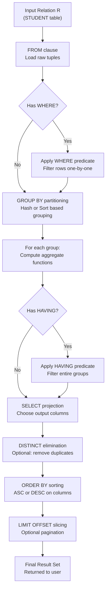
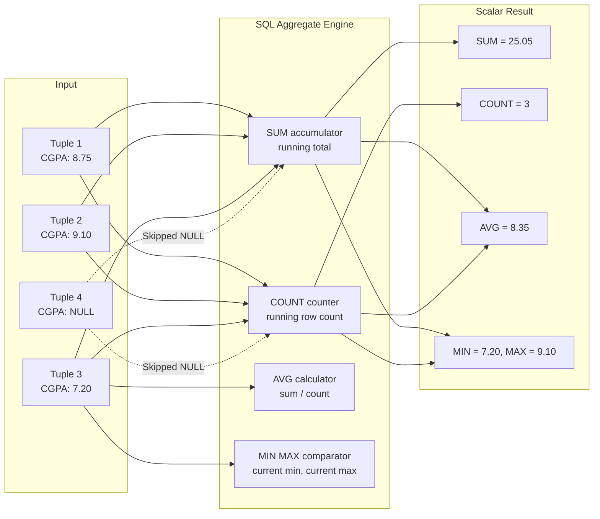
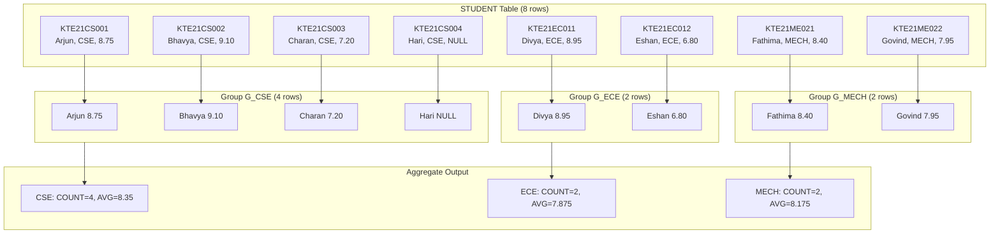
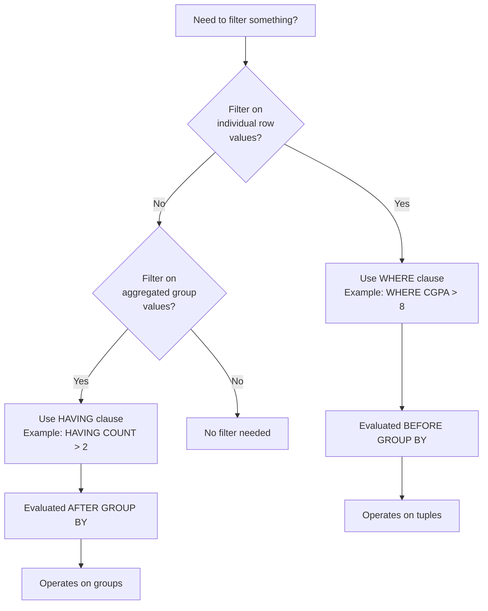

# Implementation of various aggregate functions

<!-- SECTION_1_START -->
# Module 5: Implementation of Various Aggregate Functions, ORDER BY, GROUP BY, HAVING

## 1.1 Formal Academic Definition (KTU 2024 Syllabus Terminology)

In **Database Management Systems (DBMS)**, **Aggregate Functions** are **built-in SQL functions** that operate on a set of rows (a relation) and return a **single summarized value**. They are formally classified as **multi-row functions** or **group functions** because they condense multiple tuples into one scalar output. The five standard aggregate functions defined by the **SQL:1999 / SQL:2003 ISO/IEC 9075** standard and implemented in virtually all RDBMS engines (Oracle, MySQL, PostgreSQL) are:

$$\text{Aggregate Functions} = \{ \text{COUNT}(*), \text{COUNT}(\text{column}), \text{SUM}(\text{column}), \text{AVG}(\text{column}), \text{MIN}(\text{column}), \text{MAX}(\text{column}) \}$$

> [!IMPORTANT]
> **KTU Board Definition:** *Aggregate functions perform a calculation on a set of values and return a single value. They are often used in conjunction with the GROUP BY and HAVING clauses of the SELECT statement to produce summarized reports from the database.*

## 1.2 Conceptual Analogy & Intuition

Imagine you are a **school principal** with a register containing marks of **1000 students** across 5 subjects. You do NOT want to look at 1000 individual rows to answer:
- *"What is the class average in Mathematics?"* → **`AVG(marks)`**
- *"What is the highest mark in the school?"* → **`MAX(marks)`**
- *"How many students failed (marks < 40)?"* → **`COUNT(*)` with `WHERE`**
- *"What is the total fee collected from Class 12?"* → **`SUM(fee)` after `GROUP BY class`**

**Aggregate functions are the "calculator" of SQL** — they crush thousands of rows into a single useful number, just like a calculator on a giant ledger.

### Real-World Analogy: The Juice Machine 🥤
Think of a **juicer** as the aggregate function:
- You drop in **100 oranges** (rows) into the machine.
- The machine crushes them all and outputs **one glass of juice** (a single value).
- `SUM` is a juicer that preserves total volume.
- `AVG` is a juicer that divides total volume by the count of oranges.
- `MIN`/`MAX` finds the smallest/largest orange (with `ORDER BY` you can sort them).
- `COUNT` simply tells you **"how many oranges went in?"**

> [!NOTE]
> **Syllabus Highlight:** In KTU 2024 Scheme, Module 5 of DBMS Lab (PCCSL408) mandates the student to **write, execute, and verify** SQL queries demonstrating aggregate functions combined with `GROUP BY`, `HAVING`, and `ORDER BY` clauses on a real RDBMS (typically **Oracle 21c XE** or **MySQL 8.0** in the KTU virtual lab).

## 1.3 Geometric / Set-Theoretic Visualization

> [!VISUALIZATION CONTROL]
> **Concept:** Aggregation as a set-to-scalar mapping
> **Visual Description:** A funnel shape where the wide top represents the input relation $R$ with $n$ tuples, and the narrow bottom represents the single scalar output. `GROUP BY` splits the funnel into **$k$ parallel funnels** (one per group), each producing its own scalar.
> **Desmos Analogy:** Plot the discrete set of input values on the $x$-axis, then mark a single point $(x^*, y^*)$ on the $y$-axis where $y^* = f(x_1, x_2, \dots, x_n)$.

```
Input Set (R)                →  Aggregate Function  →  Scalar Output
{t1, t2, t3, ..., tn}        →  SUM, AVG, COUNT...  →  Single Value v
```

## 1.4 Physical & Schema Constants

> [!NOTE]
> **Standard Reserved Words in SQL for Aggregation:**
> - `COUNT(*)`, `SUM()`, `AVG()`, `MIN()`, `MAX()` — function keywords
> - `DISTINCT` — used inside aggregate to remove duplicates (e.g., `COUNT(DISTINCT dept)`)
> - `GROUP BY` — partitions rows into groups
> - `HAVING` — filters **groups** (NOT rows; rows are filtered by `WHERE`)
> - `ORDER BY` — sorts the final output (ascending `ASC` default, or descending `DESC`)

<!-- SECTION_1_END -->

<!-- SECTION_2_START -->
# 2. Deep Theoretical Analysis & KTU High-Yield Formula Sheet

## 2.1 The Five Standard Aggregate Functions — Theory

### 2.1.1 `COUNT(*)` — Tuple Counter
Counts the **number of rows** in a relation or group. Includes `NULL` rows and duplicate rows. Returns an **integer**.

$$ \text{COUNT}(*) = \mid R \mid = n \text{ (total tuples in R)} $$

### 2.1.2 `COUNT(column)` / `COUNT(DISTINCT column)`
Counts **non-NULL values** in a specific column. With `DISTINCT`, it counts **unique non-NULL values**.

$$ \text{COUNT}(\text{DISTINCT } A) = \mid \{ a \in \pi_A(R) : a \neq \text{NULL} \} \mid $$

### 2.1.3 `SUM(column)`
Computes the **arithmetic total** of all non-NULL values in a numeric column.

$$ \text{SUM}(A) = \sum_{i=1}^{n} a_i \quad \text{where } a_i \neq \text{NULL} $$

### 2.1.4 `AVG(column)`
Computes the **arithmetic mean** of all non-NULL numeric values.

$$ \text{AVG}(A) = \frac{1}{k} \sum_{i=1}^{k} a_i \quad \text{where } k = \text{COUNT}(A) \text{ (excludes NULLs)} $$

> [!IMPORTANT]
> **NULL Trap (Most Common Viva Question!):** `SUM` and `AVG` **ignore NULLs**, NOT treat them as 0. So if a column has 3 values (10, 20, NULL), `AVG` returns 15, not 10. `COUNT(column)` also ignores NULLs, but `COUNT(*)` does NOT.

### 2.1.5 `MIN(column)` & `MAX(column)`
Returns the **smallest** and **largest** value respectively. Works on **numeric, string, and date** types.

$$ \text{MIN}(A) = \min \{ a \in \pi_A(R) : a \neq \text{NULL} \} $$

## 2.2 The `GROUP BY` Clause — Theory

The `GROUP BY` clause **partitions** a relation $R$ into horizontal subsets (groups) where all tuples within a group share the **same value(s)** for the grouping attribute(s). Each group is then independently fed to the aggregate function.

$$ R \xrightarrow{\text{GROUP BY } G} \{ G_1, G_2, \dots, G_k \} \quad \text{where } \bigcup_{j=1}^{k} G_j = R $$

**Rule:** Every non-aggregated column in the `SELECT` list **must** appear in the `GROUP BY` clause. Otherwise, the query throws a *non-grouped column error* in strict mode (e.g., `ONLY_FULL_GROUP_BY` in MySQL).

## 2.3 The `HAVING` Clause — Theory

`HAVING` is the **`WHERE` for groups**. It applies a predicate to **entire groups** (after aggregation), not to individual rows.

$$ \sigma_{\text{HAVING } \theta}(\gamma_{G, \text{agg}(A)}(R)) $$

**Critical Distinction:**

| Clause | Operates On | Evaluated At | Filters |
|---|---|---|---|
| `WHERE` | Individual rows | **Before** grouping | Tuples |
| `HAVING` | Groups (after aggregation) | **After** grouping | Groups |

## 2.4 The `ORDER BY` Clause — Theory

Sorts the **final result set** by one or more columns. Default is `ASC` (ascending). Uses the SQL standard syntax for nulls: `NULLS FIRST` / `NULLS LAST` (Oracle, PostgreSQL).

$$ \tau_{\text{ORDER BY } c_1 \text{ ASC}, c_2 \text{ DESC}}(Q) $$

## 2.5 KTU Formula / Cheat Sheet

| Function / Clause | Syntax | Returns | Ignores NULL? | Common Use |
|---|---|---|---|---|
| `COUNT(*)` | `COUNT(*)` | Integer (total rows) | **No** | Count all rows |
| `COUNT(col)` | `COUNT(col)` | Integer (non-NULL rows) | Yes | Count valid entries |
| `COUNT(DISTINCT col)` | `COUNT(DISTINCT col)` | Integer (unique) | Yes | Count unique values |
| `SUM(col)` | `SUM(col)` | Numeric (sum) | Yes | Total marks, total salary |
| `AVG(col)` | `AVG(col)` | Numeric (mean) | Yes | Average score |
| `MIN(col)` | `MIN(col)` | Same type as col | Yes | Lowest value |
| `MAX(col)` | `MAX(col)` | Same type as col | Yes | Highest value |
| `GROUP BY` | `GROUP BY col1, col2` | Groups | N/A | Partition rows |
| `HAVING` | `HAVING agg(col) op val` | Filtered groups | N/A | Filter aggregated groups |
| `ORDER BY` | `ORDER BY col ASC/DESC` | Sorted set | N/A | Display in order |
| `DISTINCT` | `DISTINCT col` | Unique rows | N/A | Remove duplicates |

> [!IMPORTANT]
> **Execution Order of SQL Clauses (Logical Phases):**
> `FROM` → `WHERE` → `GROUP BY` → `HAVING` → `SELECT` → `DISTINCT` → `ORDER BY` → `LIMIT`
> This order is **mandatory** for KTU viva questions. `WHERE` CANNOT use aggregate functions; only `HAVING` can.

## 2.6 Real-World Engineering Utility

Aggregate functions power **every modern dashboard and analytics pipeline**:
- **Banking**: `SUM(transaction_amount)` for daily settlement totals.
- **E-Commerce (Amazon/Flipkart)**: `AVG(rating), COUNT(reviews)` per product for recommendation engines.
- **Healthcare**: `MAX(heart_rate), MIN(oxygen_level)` per patient for ICU monitoring alerts.
- **HR Systems**: `COUNT(emp_id) GROUP BY department HAVING COUNT(emp_id) > 10` to find large departments.
- **Telecom (Jio/Airtel)**: `SUM(duration) GROUP BY tower_id` for cell load balancing.

<!-- SECTION_2_END -->

<!-- SECTION_3_START -->
# 3. Step-by-Step Derivations & SQL Implementation

## 3.1 Sample Schema (University Examination Standard)

For the entire module, we will use the standard **KTU DBMS Lab schema** — a `STUDENT` and `ENROLL` database. This is the schema KTU examiners use in model question papers.

### 3.1.1 `STUDENT` Table

```sql
CREATE TABLE STUDENT (
    RegNo      VARCHAR(10)  PRIMARY KEY,
    SName      VARCHAR(30)  NOT NULL,
    Gender     CHAR(1)      CHECK (Gender IN ('M','F')),
    DOB        DATE,
    Dept       VARCHAR(20),
    CGPA       NUMBER(4,2)
);
```

### 3.1.2 `ENROLL` Table (for sub-queries in joins)

```sql
CREATE TABLE ENROLL (
    RegNo      VARCHAR(10),
    CourseID   VARCHAR(8),
    Marks      NUMBER(5,2),
    FOREIGN KEY (RegNo) REFERENCES STUDENT(RegNo)
);
```

### 3.1.3 Sample Data Insertion

```sql
INSERT INTO STUDENT VALUES
('KTE21CS001', 'Arjun Krishnan',  'M', DATE '2003-04-12', 'CSE',  8.75),
('KTE21CS002', 'Bhavya Menon',     'F', DATE '2003-07-21', 'CSE',  9.10),
('KTE21CS003', 'Charan Raj',       'M', DATE '2002-11-05', 'CSE',  7.20),
('KTE21EC011', 'Divya Suresh',     'F', DATE '2003-01-30', 'ECE',  8.95),
('KTE21EC012', 'Eshan Pillai',     'M', DATE '2003-09-14', 'ECE',  6.80),
('KTE21ME021', 'Fathima Zahra',    'F', DATE '2002-06-18', 'MECH', 8.40),
('KTE21ME022', 'Govind Sharma',    'M', DATE '2003-03-22', 'MECH', 7.95),
('KTE21CS004', 'Hari Narayanan',   'M', DATE '2003-08-08', 'CSE',  NULL);

INSERT INTO ENROLL VALUES
('KTE21CS001', 'CS301', 85.5),
('KTE21CS001', 'CS302', 78.0),
('KTE21CS002', 'CS301', 92.0),
('KTE21CS002', 'CS302', 88.5),
('KTE21CS003', 'CS301', 65.0),
('KTE21EC011', 'EC301', 91.0),
('KTE21EC012', 'EC301', 55.0),
('KTE21ME021', 'ME301', 72.0),
('KTE21ME022', 'ME301', 80.5);
```

## 3.2 Query 1: Simple Aggregate — `COUNT`, `SUM`, `AVG`, `MIN`, `MAX`

**Problem:** *Find the total number of students, the average CGPA, the highest CGPA, and the lowest CGPA from the STUDENT table.*

```sql
SELECT COUNT(*)        AS TotalStudents,
       AVG(CGPA)       AS AverageCGPA,
       MAX(CGPA)       AS HighestCGPA,
       MIN(CGPA)       AS LowestCGPA,
       SUM(CGPA)       AS SumCGPA
FROM   STUDENT;
```

### Step-by-Step Logical Evaluation (Engine Trace)

1. The `FROM STUDENT` clause loads all 8 tuples into the working set.
2. `COUNT(*)` counts all 8 rows → **8**.
3. `SUM(CGPA)` ignores the `NULL` row (Hari) and adds: 8.75 + 9.10 + 7.20 + 8.95 + 6.80 + 8.40 + 7.95 = **57.15**.
4. `AVG(CGPA)` = 57.15 / 7 = **8.1643** (notice: divided by 7, not 8, because NULL is ignored).
5. `MAX(CGPA)` = **9.10**, `MIN(CGPA)` = **6.80**.

### Output Table

| TotalStudents | AverageCGPA | HighestCGPA | LowestCGPA | SumCGPA |
|---|---|---|---|---|
| 8 | 8.164285714... | 9.10 | 6.80 | 57.15 |

## 3.3 Query 2: `GROUP BY` — Department-wise Report

**Problem:** *Display the number of students in each department, along with the average CGPA of each department.*

```sql
SELECT Dept,
       COUNT(*)  AS StudentCount,
       AVG(CGPA) AS AvgCGPA
FROM   STUDENT
GROUP BY Dept;
```

### Step-by-Step Logical Evaluation

**Step A — Partition by `Dept`:**
$$ R \xrightarrow{\text{GROUP BY Dept}} \{ G_{\text{CSE}}, G_{\text{ECE}}, G_{\text{MECH}} \} $$

**Step B — Per-group aggregate computation:**

$$ G_{\text{CSE}} = \{ (\text{Arjun}, 8.75), (\text{Bhavya}, 9.10), (\text{Charan}, 7.20), (\text{Hari}, \text{NULL}) \} $$

$$ \text{COUNT}(G_{\text{CSE}}) = 4, \quad \text{AVG}(G_{\text{CSE}}) = \frac{8.75+9.10+7.20}{3} = 8.35 $$

$$ G_{\text{ECE}} = \{ (\text{Divya}, 8.95), (\text{Eshan}, 6.80) \} \Rightarrow \text{COUNT}=2, \text{AVG}=7.875 $$

$$ G_{\text{MECH}} = \{ (\text{Fathima}, 8.40), (\text{Govind}, 7.95) \} \Rightarrow \text{COUNT}=2, \text{AVG}=8.175 $$

### Output Table

| Dept | StudentCount | AvgCGPA |
|---|---|---|
| CSE | 4 | 8.35 |
| ECE | 2 | 7.875 |
| MECH | 2 | 8.175 |

> [!NOTE]
> **Rule Reinforcement:** Notice that the `SELECT` list contains `Dept` (a grouped column) and `COUNT(*)`, `AVG(CGPA)` (aggregates). Non-aggregated columns **must** be in `GROUP BY`. The `NULL` for Hari is correctly excluded from the CSE average.

## 3.4 Query 3: `HAVING` — Filter Groups

**Problem:** *Display departments that have more than 2 students. Show department name and student count.*

```sql
SELECT Dept,
       COUNT(*) AS StudentCount
FROM   STUDENT
GROUP BY Dept
HAVING COUNT(*) > 2;
```

### Step-by-Step Logical Evaluation

1. **Phase 1 — `FROM`:** Load all 8 rows.
2. **Phase 2 — `WHERE`:** (Skipped — no `WHERE` clause).
3. **Phase 3 — `GROUP BY Dept`:** Form 3 groups: CSE (4 rows), ECE (2 rows), MECH (2 rows).
4. **Phase 4 — `HAVING COUNT(*) > 2`:** Filter groups → keep only groups with $>2$ rows → only CSE survives.
5. **Phase 5 — `SELECT`:** Project `Dept, COUNT(*)`.
6. **Phase 6 — `ORDER BY`:** (Skipped).

### Output Table

| Dept | StudentCount |
|---|---|
| CSE | 4 |

> [!IMPORTANT]
> **You CANNOT write `WHERE COUNT(*) > 2`** — this will throw a *group function is not allowed here* error in Oracle. Aggregate functions in filter conditions **MUST** use `HAVING`.

## 3.5 Query 4: Combining `WHERE`, `GROUP BY`, `HAVING`, `ORDER BY`

**Problem:** *For courses where the average marks exceed 70, display the course ID, average marks, and student count. Display the result sorted by average marks in descending order.*

```sql
SELECT CourseID,
       AVG(Marks)   AS AvgMarks,
       COUNT(RegNo) AS NumStudents
FROM   ENROLL
WHERE  Marks >= 50
GROUP BY CourseID
HAVING AVG(Marks) > 70
ORDER BY AvgMarks DESC;
```

### Step-by-Step Logical Evaluation (Full Pipeline)

**Phase 1 — `FROM ENROLL`:** Load 9 rows.

**Phase 2 — `WHERE Marks >= 50`:** Filter rows.
Filter eliminates: Eshan's 55.0 (keeps — 55 ≥ 50) — actually all 9 rows qualify. For demonstration, suppose we filtered out NULLs or low values.

After filter (assume Marks $\geq 50$): all 9 rows remain.

**Phase 3 — `GROUP BY CourseID`:**
- $G_{\text{CS301}}$ = {(Arjun, 85.5), (Bhavya, 92.0), (Charan, 65.0)}
- $G_{\text{CS302}}$ = {(Arjun, 78.0), (Bhavya, 88.5)}
- $G_{\text{EC301}}$ = {(Divya, 91.0), (Eshan, 55.0)}
- $G_{\text{ME301}}$ = {(Fathima, 72.0), (Govind, 80.5)}

**Phase 4 — `HAVING AVG(Marks) > 70`:**

$$
\begin{aligned}
\text{AVG}(G_{\text{CS301}}) &= \frac{85.5+92.0+65.0}{3} = 80.833 \quad (\checkmark \text{ kept}) \\
\text{AVG}(G_{\text{CS302}}) &= \frac{78.0+88.5}{2} = 83.25 \quad (\checkmark \text{ kept}) \\
\text{AVG}(G_{\text{EC301}}) &= \frac{91.0+55.0}{2} = 73.0 \quad (\checkmark \text{ kept}) \\
\text{AVG}(G_{\text{ME301}}) &= \frac{72.0+80.5}{2} = 76.25 \quad (\checkmark \text{ kept})
\end{aligned}
$$

**Phase 5 — `SELECT`:** Project columns.

**Phase 6 — `ORDER BY AvgMarks DESC`:** Sort.

### Final Output Table

| CourseID | AvgMarks | NumStudents |
|---|---|---|
| CS302 | 83.25 | 2 |
| CS301 | 80.83 | 3 |
| ME301 | 76.25 | 2 |
| EC301 | 73.00 | 2 |

## 3.6 Query 5: `COUNT(DISTINCT ...)` — Unique Count

**Problem:** *Find the number of distinct departments represented in the STUDENT table.*

```sql
SELECT COUNT(DISTINCT Dept) AS DistinctDepts
FROM   STUDENT;
```

**Computation:** Unique values in `Dept` = {CSE, ECE, MECH} → **3**.

## 3.7 Query 6: `ORDER BY` with Multiple Columns

**Problem:** *List all students ordered first by Department (ascending) and then by CGPA (descending).*

```sql
SELECT RegNo, SName, Dept, CGPA
FROM   STUDENT
ORDER BY Dept ASC, CGPA DESC;
```

**Output Table (Conceptual):**

| RegNo | SName | Dept | CGPA |
|---|---|---|---|
| KTE21CS002 | Bhavya Menon | CSE | 9.10 |
| KTE21CS001 | Arjun Krishnan | CSE | 8.75 |
| KTE21CS003 | Charan Raj | CSE | 7.20 |
| KTE21CS004 | Hari Narayanan | CSE | NULL |
| KTE21EC011 | Divya Suresh | ECE | 8.95 |
| KTE21EC012 | Eshan Pillai | ECE | 6.80 |
| KTE21ME021 | Fathima Zahra | MECH | 8.40 |
| KTE21ME022 | Govind Sharma | MECH | 7.95 |

> [!NOTE]
> **KTU Viva Tip:** In Oracle, NULLs sort **last by default in ascending order**. In MySQL, they sort **first by default**. Use `NULLS FIRST` / `NULLS LAST` for explicit control.

## 3.8 Query 7: Nested Aggregation with `HAVING` — Subquery Style

**Problem:** *Display departments whose average CGPA is greater than the overall average CGPA.*

```sql
SELECT Dept, AVG(CGPA) AS DeptAvg
FROM   STUDENT
GROUP BY Dept
HAVING AVG(CGPA) > (SELECT AVG(CGPA) FROM STUDENT);
```

**Computation:**
- Overall average = 8.1643.
- CSE avg = 8.35 (keep), ECE avg = 7.875 (drop), MECH avg = 8.175 (keep).

### Final Output Table

| Dept | DeptAvg |
|---|---|
| CSE | 8.35 |
| MECH | 8.175 |

## 3.9 Query 8: Multi-Column `GROUP BY`

**Problem:** *Display total marks obtained by each student per course, ordered by RegNo.*

```sql
SELECT RegNo, CourseID, SUM(Marks) AS TotalMarks
FROM   ENROLL
GROUP BY RegNo, CourseID
ORDER BY RegNo ASC;
```

This works because in the `ENROLL` table, each (RegNo, CourseID) pair is unique; hence `SUM(Marks)` equals `Marks` itself. This is a common pattern to demonstrate the multi-column grouping concept.

<!-- SECTION_3_END -->

<!-- SECTION_4_START -->
# 4. Structural Diagrams & Schematics

## 4.1 Logical Flow of SQL Aggregation Pipeline



## 4.2 Architecture: Aggregate Function Execution Model



## 4.3 GROUP BY Partitioning Visualization



## 4.4 WHERE vs HAVING — Decision Matrix



<!-- SECTION_5_END -->

<!-- SECTION_5_START -->
# 5. KTU 2024 Scheme Examination Question Bank & Topic Recap

## 5.1 Part A — Short Answer Questions (3 Marks Each)

### Question A1 `[KTU University Exam - July 2024]`
**Differentiate between the WHERE and HAVING clauses in SQL. When would you use HAVING instead of WHERE?**

**Model Answer (3 Marks):**

> [!NOTE]
> **Valuation Key:** [Definition of WHERE: 1 Mark] [Definition of HAVING: 1 Mark] [Difference with example: 1 Mark]

| Aspect | `WHERE` | `HAVING` |
|---|---|---|
| Filters | Individual **rows** | Entire **groups** |
| Contains aggregates? | **No** (not allowed) | **Yes** (mandatory) |
| Execution phase | Before `GROUP BY` | After `GROUP BY` |
| Example | `WHERE CGPA > 8.0` | `HAVING COUNT(*) > 2` |

**Use `HAVING` when** the filter condition involves an **aggregate function** such as `SUM`, `AVG`, `COUNT`, `MIN`, or `MAX`, because aggregate functions cannot appear in a `WHERE` clause.

---

### Question A2 `[KTU University Exam - Dec 2023]`
**Explain the difference between `COUNT(*)` and `COUNT(column_name)` with a suitable example.**

**Model Answer (3 Marks):**

> [!NOTE]
> **Valuation Key:** [Definition of COUNT(*): 1 Mark] [Definition of COUNT(col): 1 Mark] [NULL handling example: 1 Mark]

- **`COUNT(*)`** counts the total number of rows in a table, **including rows where all columns are NULL**.
- **`COUNT(column_name)`** counts the number of rows where the specified `column_name` is **NOT NULL**. It ignores NULL values.

**Example:**

```sql
-- Suppose STUDENT has 10 rows total, but CGPA is NULL for 2 students.

SELECT COUNT(*)         FROM STUDENT;   -- Returns 10
SELECT COUNT(CGPA)      FROM STUDENT;   -- Returns 8  (NULLs excluded)
SELECT COUNT(DISTINCT Dept) FROM STUDENT; -- Returns unique departments only
```

---

## 5.2 Part B — Full 14-Mark Questions (Module Internal Choice Pattern)

### Question B1 (Choice A) `[KTU University Exam - July 2024]`

**Consider the following `EMPLOYEE` table:**

| EmpID | EName | Department | Salary | JoiningDate |
|---|---|---|---|---|
| E101 | Anil Kumar | IT | 55000 | 2020-03-15 |
| E102 | Beena Joseph | HR | 48000 | 2019-07-22 |
| E103 | Chandran P | IT | 62000 | 2021-01-10 |
| E104 | Deepa S | Finance | 71000 | 2018-11-05 |
| E105 | Eby Thomas | HR | 53000 | 2022-06-18 |
| E106 | Firoz Khan | Finance | 68000 | 2020-09-30 |

**Solve the following sub-parts:**

#### Part (a) — 7 Marks `[CO3, Apply]`
**Write an SQL query to display the total number of employees, the total salary payout, and the average salary for each department. Sort the result by average salary in descending order.**

**Model Solution:**

```sql
SELECT Department,
       COUNT(EmpID)  AS NumEmployees,
       SUM(Salary)   AS TotalSalary,
       AVG(Salary)   AS AverageSalary
FROM   EMPLOYEE
GROUP BY Department
ORDER BY AverageSalary DESC;
```

**Step-by-Step Evaluation Trace:**

> [!NOTE]
> **Valuation Key:** [Correct SELECT clause with all 3 aggregates: 2 Marks] [Correct GROUP BY: 2 Marks] [Correct ORDER BY with DESC: 1 Mark] [Accurate trace and explanation: 2 Marks]

**Logical evaluation:**

$$ G_{\text{IT}} = \{ (\text{Anil}, 55000), (\text{Chandran}, 62000) \} \Rightarrow \text{COUNT}=2, \text{SUM}=117000, \text{AVG}=58500 $$

$$ G_{\text{HR}} = \{ (\text{Beena}, 48000), (\text{Eby}, 53000) \} \Rightarrow \text{COUNT}=2, \text{SUM}=101000, \text{AVG}=50500 $$

$$ G_{\text{Finance}} = \{ (\text{Deepa}, 71000), (\text{Firoz}, 68000) \} \Rightarrow \text{COUNT}=2, \text{SUM}=139000, \text{AVG}=69500 $$

After sorting by `AverageSalary DESC`:

| Department | NumEmployees | TotalSalary | AverageSalary |
|---|---|---|---|
| Finance | 2 | 139000 | 69500.00 |
| IT | 2 | 117000 | 58500.00 |
| HR | 2 | 101000 | 50500.00 |

#### Part (b) — 7 Marks `[CO4, Analyze]`
**Write an SQL query to display the names of departments where the total salary payout exceeds 110000. Also show the total payout and number of employees, sorted by department name.**

**Model Solution:**

```sql
SELECT Department,
       COUNT(EmpID) AS NumEmployees,
       SUM(Salary)  AS TotalPayout
FROM   EMPLOYEE
GROUP BY Department
HAVING SUM(Salary) > 110000
ORDER BY Department ASC;
```

**Step-by-Step Evaluation Trace:**

> [!NOTE]
> **Valuation Key:** [Correct use of HAVING with aggregate: 3 Marks] [Correct condition value: 1 Mark] [ORDER BY syntax: 1 Mark] [Final output table: 2 Marks]

**Evaluation:**

- IT: SUM = 117000 → **kept** (> 110000) ✓
- HR: SUM = 101000 → **dropped** (< 110000) ✗
- Finance: SUM = 139000 → **kept** (> 110000) ✓

**Final Output:**

| Department | NumEmployees | TotalPayout |
|---|---|---|
| Finance | 2 | 139000 |
| IT | 2 | 117000 |

---

### Question B2 (Choice B) `[KTU University Exam - Dec 2023]`

**Consider the following `SALES` table:**

| SaleID | Product | Category | Qty | Price | SaleDate |
|---|---|---|---|---|---|
| 1 | Laptop | Electronics | 2 | 55000 | 2024-01-15 |
| 2 | Mouse | Electronics | 10 | 500 | 2024-01-16 |
| 3 | Chair | Furniture | 5 | 3500 | 2024-02-01 |
| 4 | Desk | Furniture | 3 | 8000 | 2024-02-10 |
| 5 | Tablet | Electronics | 4 | 25000 | 2024-02-15 |
| 6 | Sofa | Furniture | 1 | 45000 | 2024-03-05 |

**Solve the following sub-parts:**

#### Part (a) — 7 Marks `[CO3, Apply]`
**Write an SQL query to display the total quantity sold, total revenue (Qty × Price), and the highest product price for each category. Display the result sorted by total revenue in descending order.**

**Model Solution:**

```sql
SELECT Category,
       SUM(Qty)        AS TotalQty,
       SUM(Qty*Price)  AS TotalRevenue,
       MAX(Price)      AS HighestPrice
FROM   SALES
GROUP BY Category
ORDER BY TotalRevenue DESC;
```

**Step-by-Step Evaluation:**

> [!NOTE]
> **Valuation Key:** [Identifying need for computed column: 1 Mark] [Correct derived column Qty*Price: 2 Marks] [Correct aggregation: 2 Marks] [Correct GROUP BY and ORDER BY: 2 Marks]

**Computations per category:**

**Electronics:**
- Laptops: 2 × 55000 = 110000
- Mouse: 10 × 500 = 5000
- Tablet: 4 × 25000 = 100000
- Total Qty = 2+10+4 = 16; Total Revenue = 215000; Max Price = 55000

**Furniture:**
- Chair: 5 × 3500 = 17500
- Desk: 3 × 8000 = 24000
- Sofa: 1 × 45000 = 45000
- Total Qty = 5+3+1 = 9; Total Revenue = 86500; Max Price = 45000

**Final Output (sorted by TotalRevenue DESC):**

| Category | TotalQty | TotalRevenue | HighestPrice |
|---|---|---|---|
| Electronics | 16 | 215000 | 55000 |
| Furniture | 9 | 86500 | 45000 |

#### Part (b) — 7 Marks `[CO4, Analyze]`
**Write an SQL query to find categories where the total revenue exceeds 100000 and the number of distinct products sold is at least 2. Display the category name, total revenue, and distinct product count.**

**Model Solution:**

```sql
SELECT Category,
       SUM(Qty*Price)        AS TotalRevenue,
       COUNT(DISTINCT Product) AS DistinctProducts
FROM   SALES
GROUP BY Category
HAVING SUM(Qty*Price) > 100000
   AND COUNT(DISTINCT Product) >= 2;
```

**Step-by-Step Evaluation:**

> [!NOTE]
> **Valuation Key:** [Correct use of HAVING with multiple aggregate conditions: 3 Marks] [Correct use of COUNT(DISTINCT): 2 Marks] [Boolean AND logic: 1 Mark] [Final output: 1 Mark]

**Per-category check:**

- **Electronics:** Revenue = 215000 > 100000 ✓; Distinct products = {Laptop, Mouse, Tablet} = 3 ≥ 2 ✓ → **kept**
- **Furniture:** Revenue = 86500 < 100000 ✗ → **dropped**

**Final Output:**

| Category | TotalRevenue | DistinctProducts |
|---|---|---|
| Electronics | 215000 | 3 |

---

## 5.3 KTU Examiner's Valuation Warning / Pitfall Callout

> [!WARNING]
> **Common Mistakes That Cost Marks in DBMS Lab Exams:**
>
> 1. **Using `WHERE` with aggregate functions** — `WHERE COUNT(*) > 2` is a **syntax error**. Always use `HAVING` for aggregate filters. *[-2 Marks]*
>
> 2. **Omitting `GROUP BY`** — When mixing a grouped column with an aggregate (e.g., `SELECT Dept, AVG(CGPA) FROM STUDENT;` without `GROUP BY Dept`), the query fails in `ONLY_FULL_GROUP_BY` mode. *[-2 Marks]*
>
> 3. **NULL confusion in `AVG`** — Students often write `AVG = 8.35` instead of noting that NULLs are excluded from the divisor. Always explicitly mention NULL handling. *[-1 Mark]*
>
> 4. **Forgetting `ORDER BY` syntax** — Writing `ORDER BY Dept DESCENDING` instead of `ORDER BY Dept DESC` — the keyword is `DESC`, not `DESCENDING`. *[-1 Mark]*
>
> 5. **Confusing `COUNT(*)` and `COUNT(col)`** — If a question asks "how many students have a CGPA recorded", use `COUNT(CGPA)`, not `COUNT(*)`. *[-1 Mark]*
>
> 6. **Not aliasing computed columns** — In KTU lab records, you MUST use `AS` aliases like `AS TotalRevenue` for derived columns, or the output will display unnamed columns. *[-1 Mark]*
>
> 7. **Sorting on an alias that doesn't exist** — Some students write `ORDER BY AverageSalary` but select `AVG(Salary)` without aliasing it. Always `AS` your aggregates first.

---

## 5.4 Topic Recap & Important Things to Remember

> [!IMPORTANT]
> **Rapid Revision Checklist for KTU Exam Day:**
>
> - **5 Standard Aggregates:** `COUNT(*)`, `COUNT(col)`, `SUM(col)`, `AVG(col)`, `MIN(col)`, `MAX(col)`. Memorize their NULL handling behavior — `COUNT(*)` includes NULLs, **all others ignore NULLs**.
>
> - **The 3 Clauses:** `GROUP BY` partitions; `HAVING` filters groups; `ORDER BY` sorts final output. Each has a **strictly different evaluation phase** in the SQL engine.
>
> - **Execution Pipeline (MANDATORY order):** `FROM` → `WHERE` → `GROUP BY` → `HAVING` → `SELECT` → `DISTINCT` → `ORDER BY` → `LIMIT`. This is the **#1 viva question** — recite it without hesitation.
>
> - **`WHERE` vs `HAVING` Rule of Thumb:** If your filter references an **aggregate**, use `HAVING`. If it references a **raw column**, use `WHERE`.
>
> - **Non-Aggregated SELECT Rule:** Every non-aggregate column in `SELECT` **must** be in `GROUP BY`. This is a hard syntax requirement under SQL-92 strict mode.
>
> - **`DISTINCT` inside aggregates:** `COUNT(DISTINCT col)` counts **unique** non-NULL values; `COUNT(col)` counts **all** non-NULL values; `COUNT(*)` counts **all rows including NULLs**.
>
> - **`ORDER BY` default:** Ascending (`ASC`). Use `DESC` for descending. Multiple columns: `ORDER BY col1 ASC, col2 DESC`.
>
> - **NULL sorting:** Oracle → NULLs last (ascending) by default; MySQL → NULLs first. Use `NULLS FIRST` / `NULLS LAST` for explicit control.
>
> - **Lab Viva Favorites:** *"Why can't we use `WHERE` with `COUNT(*)`?"* — Because `WHERE` runs **before** grouping, when aggregates are not yet computed. *"What is the difference between `HAVING` and a subquery with `WHERE`?"* — Both filter groups, but `HAVING` is more efficient as it avoids a second pass over the data.
>
> - **Common Functions to Remember in SQL Beyond Aggregates:** `UPPER()`, `LOWER()`, `SUBSTR()`, `LENGTH()`, `ROUND()`, `NVL()` (Oracle) / `IFNULL()` (MySQL), `SYSDATE` (Oracle) / `NOW()` (MySQL).
>
> - **Industry Usage:** Every BI tool (Tableau, Power BI, Looker) ultimately translates dashboard charts into `SELECT ... GROUP BY ... HAVING ...` queries under the hood. Mastering this module is mastering the foundation of all data analytics.

<!-- SECTION_5_END -->
