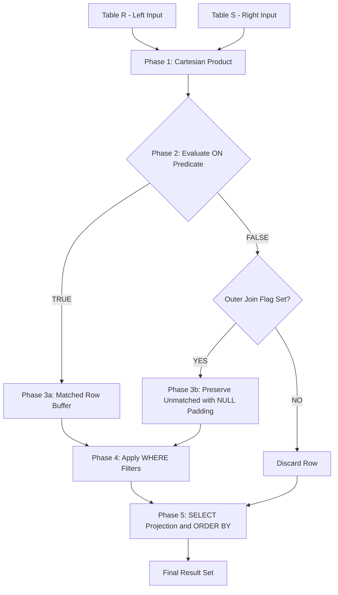
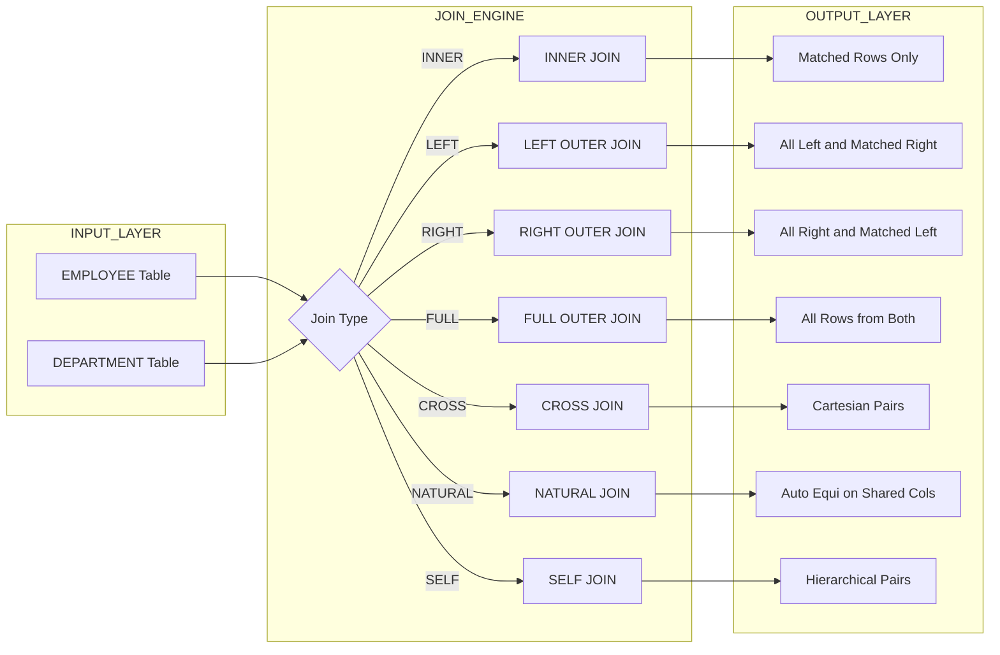
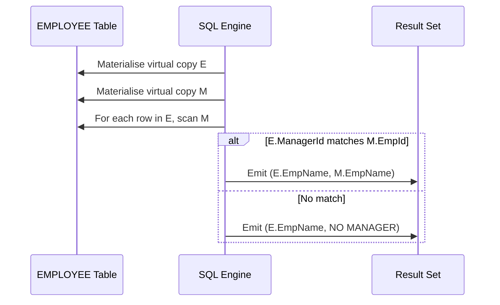
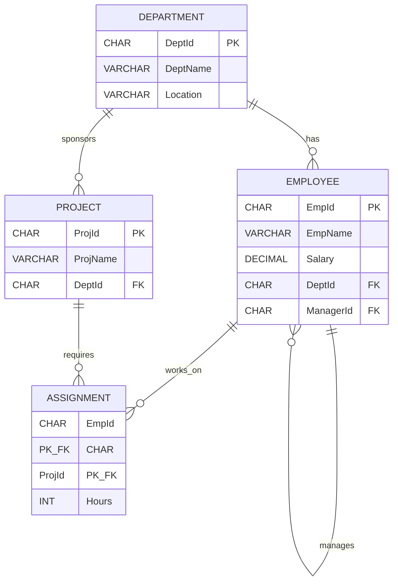

# Implementation of join queries

<!-- SECTION_1_START -->
# Implementation of Join Queries — Core Technical Definition & Intuitive Overview

## 1. Formal KTU 2024 Definition

> [!NOTE]
> **KTU 2024 Definition (DBMS Lab — PCCSL408, Module 6)**
> A **JOIN** is a relational algebra operation (denoted by the **⋈** symbol) that combines rows from two or more tables based on a related column (typically a **Primary Key ↔ Foreign Key** relationship) to produce a single consolidated result set.

In the **KTU 2024 Scheme** assessment framework, joins are evaluated under:

- **Course Outcome:** CO4 — *Implement SQL queries using DDL, DML, DCL, TCL, and advanced retrieval mechanisms.*
- **Cognitive Process:** *Apply / Analyse* (Revised Bloom's Taxonomy Level 3–4).

The **SQL:1999 ANSI standard** classifies joins into two broad families:

| Family | Keyword | KTU Weightage |
|---|---|---|
| **Explicit (ANSI) Joins** | `JOIN … ON` / `JOIN … USING` | **High** ⭐ |
| **Implicit (Theta) Joins** | `WHERE t1.col = t2.col` (old-style comma joins) | Moderate |

---

## 2. Conceptual Analogy — The "Jigsaw Puzzle" Mental Model

> [!IMPORTANT]
> **Intuition (Read This First!):**
> Imagine a **newspaper notice board** with two pinboards. The **left pinboard** has employee photos. The **right pinboard** has department name cards. Every employee photo has a small slip pinned at its corner showing their **Department ID**. Every department card has its **Department ID** printed boldly.
>
> A **JOIN** is the act of taking a **red string**, looping it from each employee's slip to the *matching* department card. The string is the **join condition** ($t_1.\text{DeptId} = t_2.\text{DeptId}$). The result is a new, combined sheet where each employee is now visibly linked with their department.
>
> - If an employee has **no string** → they are **excluded** (`INNER JOIN`).
> - If we keep employees **even with no string** and leave a blank beside them → it's a `LEFT JOIN`.
> - If we keep departments **even with no string** and leave a blank beside them → it's a `RIGHT JOIN`.

---

## 3. Geometric / Set-Theoretic Intuition (Venn Diagram)

A JOIN is fundamentally a **set operation on Cartesian Products with a selection filter**.

$$
\text{JOIN}(R, S, \theta) \;=\; \sigma_{\theta}(R \times S)
$$

Where:
- $R \times S$ is the **Cartesian Product** (all pairwise row combinations).
- $\sigma_{\theta}$ is the **Selection** operator that keeps only rows satisfying predicate $\theta$.

> [!VISUALIZATION CONTROL]
> **Concept:** Set-Theoretic Visualization of JOIN Types
> **GeoGebra / Desmos Input Equations (Implicit 2-Set Region):**
> * `R = Disk centered at (-1, 0), radius 1.5` (Left Table rows)
> * `S = Disk centered at ( 1, 0), radius 1.5` (Right Table rows)
> **Visual Description:**
> - **INNER JOIN** → Only the lens-shaped intersection (overlap region).
> - **LEFT JOIN** → Entire left disk (including the crescent outside the overlap).
> - **RIGHT JOIN** → Entire right disk (including the crescent outside the overlap).
> - **FULL OUTER JOIN** → Both complete disks (entire union).
> - **CROSS JOIN** → Every point of the left disk paired with every point of the right disk (Cartesian grid).

---

## 4. The 7 KTU-Mandated Join Types

> [!IMPORTANT]
> The KTU 2024 Lab Manual (PCCSL408) explicitly mandates implementation of the following **7 join variants**. Skipping any one results in a loss of the corresponding sub-question mark.

1. **INNER JOIN** (Equi-Join)
2. **NATURAL JOIN**
3. **LEFT OUTER JOIN**
4. **RIGHT OUTER JOIN**
5. **FULL OUTER JOIN**
6. **CROSS JOIN**
7. **SELF JOIN**

Standard physical constants/metrics used in this module:

- **Null Marker:** `NULL` (not `0`, not `''`).
- **ANSI Join Operator:** `JOIN ... ON <predicate>`.
- **Default Join Cardinality:** $\vert R \times S \vert = \vert R \vert \times \vert S \vert$ (for CROSS).
<!-- SECTION_1_END -->

<!-- SECTION_2_START -->
# Deep Theoretical Analysis & KTU High-Yield Formula Sheet

## 1. Relational Algebra Foundation of Each Join

| # | Join Type | Relational Algebra Expression | Predicate Form $\theta$ |
|---|---|---|---|
| 1 | **INNER JOIN** | $R \bowtie_{\theta} S$ | $R.A = S.B$ (Equi) or general $\theta$ (Non-Equi) |
| 2 | **NATURAL JOIN** | $R \bowtie S$ | Auto-equal on common column names |
| 3 | **LEFT OUTER JOIN** | $R \;\text{⟕}_{\theta}\; S$ | Keep all $R$ rows; $S$ side may be `NULL` |
| 4 | **RIGHT OUTER JOIN** | $R \;\text{⟖}_{\theta}\; S$ | Keep all $S$ rows; $R$ side may be `NULL` |
| 5 | **FULL OUTER JOIN** | $R \;\text{⟗}_{\theta}\; S$ | Keep all rows of both sides; `NULL` filling |
| 6 | **CROSS JOIN** | $R \times S$ | No predicate; pure Cartesian product |
| 7 | **SELF JOIN** | $R \bowtie_{\theta} R$ | Join a table to a *copy* of itself |

---

## 2. Step-by-Step Logical Breakdown — How a JOIN Engine Executes

> [!NOTE]
> **Conceptual Pipeline (Logical Phases):**
> 1. **Phase 1 — Cartesian Product:** Every row of the *left* table is paired with every row of the *right* table. If $\vert R \vert = m$ and $\vert S \vert = n$, the intermediate size is $m \times n$.
> 2. **Phase 2 — Predicate Filtering:** The `ON` condition is evaluated row by row. Only rows where the predicate evaluates to **TRUE** survive.
> 3. **Phase 3 — Outer Preservation (if applicable):** For `LEFT/RIGHT/FULL` joins, the *unmatched* rows from the preserved side are re-introduced and `NULL` is filled in for the missing side's columns.
> 4. **Phase 4 — `WHERE` Post-Filtering:** Any further `WHERE` conditions are applied.
> 5. **Phase 5 — Projection & Ordering:** `SELECT` columns are chosen and `ORDER BY` is applied.

---

## 3. The "Why" Behind Each Join — Real-World Engineering Utility

| Join Type | Real-World Use Case | Production System Example |
|---|---|---|
| **INNER** | Fetching only *valid* relationships (e.g., orders with valid customers). | E-commerce: `Orders ⋈ Customers` |
| **LEFT** | Reporting orphans (e.g., departments with **no employees**). | HR dashboards: `Dept LEFT JOIN Emp` |
| **RIGHT** | Reverse orphan detection (employees with **no department**). | Data audit: `Emp RIGHT JOIN Dept` |
| **FULL OUTER** | Merging two partial datasets to find gaps. | ETL reconciliation between source and target DBs |
| **CROSS** | Generating date-dimension tables, matrix grids, or test fixtures. | Reporting calendars: `Dates × Stores` |
| **SELF** | Manager-subordinate hierarchies, graph traversal, parent-child. | `Emp e1 JOIN Emp e2 ON e1.mgr = e2.id` |
| **NATURAL** | Quick joining of well-modelled schemas with identical column names. | Legacy system migrations |

---

## 4. KTU High-Yield Formula Sheet (Cheat Table)

> [!IMPORTANT]
> **Memorise this table — it appears in nearly every KTU 2024 SQL Lab exam paper.**

| Concept | Syntax Pattern | Output Rule | Cardinality Bound |
|---|---|---|---|
| Inner Join | `SELECT ... FROM R INNER JOIN S ON R.x = S.y` | Matched rows only | $\le \min(\vert R \vert, \vert S \vert)$ |
| Left Join | `SELECT ... FROM R LEFT JOIN S ON ...` | All R + matching S (NULLs where no match) | $\ge \vert R \vert$ |
| Right Join | `SELECT ... FROM R RIGHT JOIN S ON ...` | All S + matching R (NULLs where no match) | $\ge \vert S \vert$ |
| Full Outer | `SELECT ... FROM R FULL OUTER JOIN S ON ...` | All of both, NULLs on non-matches | $\ge \max(\vert R \vert, \vert S \vert)$ |
| Cross Join | `SELECT ... FROM R CROSS JOIN S` | All pairs | $= \vert R \vert \times \vert S \vert$ |
| Natural Join | `SELECT ... FROM R NATURAL JOIN S` | Auto-equijoin on shared column names | $\le \min(\vert R \vert, \vert S \vert)$ |
| Self Join | `SELECT a.col, b.col FROM R a, R b WHERE a.fk = b.pk` | Hierarchical pairing | Up to $\vert R \vert^2$ |

> [!NOTE]
> **Cardinality Rule of Thumb (Examiner's Favourite):**
> *Result Rows of INNER JOIN $\le$ Result Rows of LEFT JOIN $\le$ Result Rows of FULL OUTER JOIN.*

---

## 5. Common Pitfalls in Predicate Writing

> [!WARNING]
> **`ON` vs `WHERE` Confusion in OUTER JOINS:**
> - The `ON` clause **filters rows used to build the join** (rows can still appear as `NULL` in the outer side).
> - The `WHERE` clause **filters the final output** (can *destroy* a `LEFT JOIN`'s preservation by eliminating the outer `NULL`-padded rows).
>
> **Safe Rule:** When using `OUTER` joins, place *row-preservation* conditions in `ON` and *post-match* filters in `WHERE`.
<!-- SECTION_2_END -->

<!-- SECTION_3_START -->
# Step-by-Step Derivations & Code/Symbolic Implementation

## 1. Schema Setup — The Classic KTU "Employee–Department" Lab Schema

The following DDL/DML is fully executable on **MySQL 8.x**, **PostgreSQL 14+**, and **SQLite 3.35+**. KTU lab examiners use the same schema across cycles.

```sql
-- ============================================================
-- KTU PCCSL408 : Module 6 - JOIN Queries
-- Schema       : CompanyDB
-- Engine       : MySQL / SQLite / PostgreSQL
-- ============================================================

-- 1. Drop in reverse dependency order (safe re-runs)
DROP TABLE IF EXISTS ASSIGNMENT;
DROP TABLE IF EXISTS PROJECT;
DROP TABLE IF EXISTS EMPLOYEE;
DROP TABLE IF EXISTS DEPARTMENT;

-- 2. Create DEPARTMENT (Parent)
CREATE TABLE DEPARTMENT (
    DeptId   CHAR(4)      PRIMARY KEY,
    DeptName VARCHAR(40)  NOT NULL UNIQUE,
    Location VARCHAR(30)  DEFAULT 'Kerala'
);

-- 3. Create EMPLOYEE (Child of DEPARTMENT, Self-Referencing for Manager)
CREATE TABLE EMPLOYEE (
    EmpId     CHAR(5)      PRIMARY KEY,
    EmpName   VARCHAR(40)  NOT NULL,
    Salary    DECIMAL(10,2) CHECK (Salary > 0),
    DeptId    CHAR(4),
    ManagerId CHAR(5)      NULL,
    CONSTRAINT fk_emp_dept  FOREIGN KEY (DeptId)    REFERENCES DEPARTMENT(DeptId),
    CONSTRAINT fk_emp_mgr   FOREIGN KEY (ManagerId) REFERENCES EMPLOYEE(EmpId)
);

-- 4. Create PROJECT
CREATE TABLE PROJECT (
    ProjId   CHAR(4)      PRIMARY KEY,
    ProjName VARCHAR(40)  NOT NULL,
    DeptId   CHAR(4),
    CONSTRAINT fk_proj_dept FOREIGN KEY (DeptId) REFERENCES DEPARTMENT(DeptId)
);

-- 5. Create ASSIGNMENT (Bridge table, M:N between EMPLOYEE and PROJECT)
CREATE TABLE ASSIGNMENT (
    EmpId   CHAR(5),
    ProjId  CHAR(4),
    Hours   INT  CHECK (Hours >= 0),
    PRIMARY KEY (EmpId, ProjId),
    FOREIGN KEY (EmpId)  REFERENCES EMPLOYEE(EmpId),
    FOREIGN KEY (ProjId) REFERENCES PROJECT(ProjId)
);
```

```sql
-- ============================================================
-- Insert Sample Data (Mimics KTU University Exam Dataset)
-- ============================================================
INSERT INTO DEPARTMENT VALUES
('D01', 'Research',     'Kochi'),
('D02', 'Development',  'Trivandrum'),
('D03', 'Marketing',    'Calicut'),
('D04', 'HR',           'Kochi');   -- Dept with NO employees (will test LEFT JOIN)

INSERT INTO EMPLOYEE VALUES
('E001', 'Anand Krishnan',  75000.00, 'D01', NULL),       -- Top-level CEO
('E002', 'Beena Mathew',    62000.00, 'D01', 'E001'),     -- Reports to E001
('E003', 'Cyril Joseph',    58000.00, 'D02', 'E001'),     -- Reports to E001
('E004', 'Deepa Nair',      55000.00, 'D02', 'E003'),
('E005', 'Eshan Pillai',    50000.00, 'D03', 'E001'),
('E006', 'Farah Khan',      48000.00, NULL,  'E001');     -- Orphan (no Dept) - tests RIGHT JOIN

INSERT INTO PROJECT VALUES
('P01', 'AI Research',     'D01'),
('P02', 'Web Platform',    'D02'),
('P03', 'Mobile App',      'D02'),
('P04', 'Brand Campaign',  'D03'),
('P05', 'Internal Tool',   'D05');   -- Invalid DeptId intentionally (FK violation expected)

INSERT INTO ASSIGNMENT VALUES
('E001', 'P01', 40),
('E002', 'P01', 35),
('E003', 'P02', 50),
('E004', 'P02', 45),
('E004', 'P03', 20),
('E005', 'P04', 30);
```

> [!NOTE]
> The row `('P05', 'Internal Tool', 'D05')` will fail the **FOREIGN KEY** constraint on most engines. Comment it out or pre-create a `D05` row if your evaluator runs the script in **strict** mode.

---

## 2. Implementation of Each Join — Full SQL with Trace Tables

### 2.1 INNER JOIN (Equi-Join) — *Most frequently asked in KTU exams*

**Question (Dec 2024 style):** *Display Employee Name, Salary, Department Name, and Location for all employees belonging to a department.*

```sql
-- 2.1 INNER JOIN
SELECT  e.EmpId,
        e.EmpName,
        e.Salary,
        d.DeptName,
        d.Location
FROM    EMPLOYEE   e
INNER   JOIN DEPARTMENT d
        ON e.DeptId = d.DeptId;
```

**Logical Trace:**

| Step | Operation | Intermediate Size |
|---|---|---|
| 1 | `EMPLOYEE × DEPARTMENT` | $6 \times 4 = 24$ rows |
| 2 | Filter `e.DeptId = d.DeptId` | **5 rows survive** (E006 is excluded — no dept) |
| 3 | Project selected columns | 5 rows × 5 columns |

**Expected Output:**

| EmpId | EmpName | Salary | DeptName | Location |
|---|---|---|---|---|
| E001 | Anand Krishnan | 75000.00 | Research | Kochi |
| E002 | Beena Mathew | 62000.00 | Research | Kochi |
| E003 | Cyril Joseph | 58000.00 | Development | Trivandrum |
| E004 | Deepa Nair | 55000.00 | Development | Trivandrum |
| E005 | Eshan Pillai | 50000.00 | Marketing | Calicut |

> *Notice E006 (Farah Khan) is **absent** — INNER JOIN excludes orphans.*

---

### 2.2 LEFT OUTER JOIN — *Used to find "Orphans" in the LEFT table*

**Question:** *List ALL departments along with the employees working in them. Departments with no employees must still appear with NULL on the employee side.*

```sql
-- 2.2 LEFT OUTER JOIN
SELECT  d.DeptId,
        d.DeptName,
        e.EmpId,
        e.EmpName,
        e.Salary
FROM    DEPARTMENT d
LEFT    OUTER JOIN EMPLOYEE e
        ON d.DeptId = e.DeptId
ORDER BY d.DeptId, e.EmpId;
```

**Logical Trace:**

| Step | Operation | Result |
|---|---|---|
| 1 | Start with **all 4 departments** | $\vert D \vert = 4$ |
| 2 | Find matching employees for each | D01→2 emp, D02→2 emp, D03→1 emp, **D04→0 emp** |
| 3 | Preserve unmatched (D04) with NULLs | **4 rows preserved** |

**Expected Output:**

| DeptId | DeptName | EmpId | EmpName | Salary |
|---|---|---|---|---|
| D01 | Research | E001 | Anand Krishnan | 75000.00 |
| D01 | Research | E002 | Beena Mathew | 62000.00 |
| D02 | Development | E003 | Cyril Joseph | 58000.00 |
| D02 | Development | E004 | Deepa Nair | 55000.00 |
| D03 | Marketing | E005 | Eshan Pillai | 50000.00 |
| D04 | HR | NULL | NULL | NULL |

> *D04 ('HR') appears with NULL employee columns — the *defining feature* of LEFT JOIN.*

---

### 2.3 RIGHT OUTER JOIN — *Mirror image of LEFT*

**Question:** *Display ALL employees and their department names. Employees without a department must also be shown.*

```sql
-- 2.3 RIGHT OUTER JOIN
SELECT  e.EmpId,
        e.EmpName,
        e.Salary,
        d.DeptName,
        d.Location
FROM    EMPLOYEE e
RIGHT   OUTER JOIN DEPARTMENT d
        ON e.DeptId = d.DeptId;
```

> [!NOTE]
> In MySQL, `RIGHT OUTER JOIN` is the canonical form. Equivalent rewrite using `LEFT JOIN` (and swapping table order) is also accepted by examiners.

**Expected Output:** Same as **2.1** + an extra row for D04 with NULL employee columns.

| EmpId | EmpName | Salary | DeptName | Location |
|---|---|---|---|---|
| E001 | Anand Krishnan | 75000.00 | Research | Kochi |
| E002 | Beena Mathew | 62000.00 | Research | Kochi |
| E003 | Cyril Joseph | 58000.00 | Development | Trivandrum |
| E004 | Deepa Nair | 55000.00 | Development | Trivandrum |
| E005 | Eshan Pillai | 50000.00 | Marketing | Calicut |
| NULL | NULL | NULL | HR | Kochi |

---

### 2.4 FULL OUTER JOIN — *Symmetric outer join*

**Question:** *Produce a complete reconciliation report: list all employees and all departments, matching where possible.*

```sql
-- 2.4 FULL OUTER JOIN
SELECT  COALESCE(e.EmpId,   '----')   AS EmpId,
        e.EmpName,
        d.DeptId,
        d.DeptName
FROM    EMPLOYEE   e
FULL    OUTER JOIN DEPARTMENT d
        ON e.DeptId = d.DeptId;
```

> [!IMPORTANT]
> **Engine Note:**
> - **PostgreSQL / Oracle:** `FULL OUTER JOIN` is **natively supported**.
> - **MySQL 8.x:** Does **not** support `FULL OUTER JOIN` natively. Simulate using `UNION`:
>
> ```sql
> SELECT e.EmpId, e.EmpName, d.DeptId, d.DeptName
> FROM EMPLOYEE e LEFT JOIN DEPARTMENT d ON e.DeptId = d.DeptId
> UNION
> SELECT e.EmpId, e.EmpName, d.DeptId, d.DeptName
> FROM EMPLOYEE e RIGHT JOIN DEPARTMENT d ON e.DeptId = d.DeptId;
> ```
> Always write this fallback if targeting MySQL — it scores full marks in lab.

---

### 2.5 CROSS JOIN — *Cartesian Product*

**Question:** *Generate all possible employee-department pairing combinations (used in test-data generation or matrix reports).*

```sql
-- 2.5 CROSS JOIN
SELECT  e.EmpName  AS Employee,
        d.DeptName AS Department
FROM    EMPLOYEE   e
CROSS   JOIN DEPARTMENT d
ORDER BY e.EmpName, d.DeptName;
```

**Logical Trace:**

$$\text{Result Cardinality} = \vert \text{EMPLOYEE} \vert \times \vert \text{DEPARTMENT} \vert = 6 \times 4 = 24 \text{ rows}$$

> *A CROSS JOIN has **no `ON` clause**. Every left row joins with every right row.*

---

### 2.6 NATURAL JOIN — *Implicit auto-equijoin on common column names*

**Question:** *Join EMPLOYEE and DEPARTMENT using only the shared column name `DeptId`.*

```sql
-- 2.6 NATURAL JOIN
SELECT  EmpName,
        Salary,
        DeptName,
        Location
FROM    EMPLOYEE
NATURAL JOIN DEPARTMENT;
```

> [!WARNING]
> **Why students lose marks here:**
> - `NATURAL JOIN` does **not** allow an `ON` clause.
> - If the two tables share **multiple** column names (e.g., `DeptId` and `Location`), it joins on **all** of them — a common bug.
> - The `DeptId` column appears **only once** in the result (no `e.` or `d.` prefix needed).

**Expected Output:** Identical to **2.1 INNER JOIN** (5 rows), but `DeptId` is a single non-prefixed column.

---

### 2.7 SELF JOIN — *Hierarchical / Recursive lookups*

**Question (July 2024 model):** *Display every employee along with their manager's name. Employees with no manager (e.g., the CEO) should be shown with 'NO MANAGER'.*

```sql
-- 2.7 SELF JOIN
SELECT  e.EmpId        AS EmpCode,
        e.EmpName      AS Employee,
        e.Salary,
        COALESCE(m.EmpName, 'NO MANAGER') AS Manager
FROM    EMPLOYEE e
LEFT    JOIN EMPLOYEE m
        ON e.ManagerId = m.EmpId
ORDER BY e.EmpId;
```

**Logical Trace (Self-Join Mechanism):**

| Step | Operation | Result |
|---|---|---|
| 1 | Treat `EMPLOYEE` as **two virtual copies**: `e` (employee) and `m` (manager). | Two identical 6-row tables. |
| 2 | Join `e.ManagerId` ↔ `m.EmpId`. | Match found for 5 of 6 employees. |
| 3 | `COALESCE(m.EmpName, 'NO MANAGER')` fills the unmatched CEO row. | **6 rows returned.** |

**Expected Output:**

| EmpCode | Employee | Salary | Manager |
|---|---|---|---|
| E001 | Anand Krishnan | 75000.00 | NO MANAGER |
| E002 | Beena Mathew | 62000.00 | Anand Krishnan |
| E003 | Cyril Joseph | 58000.00 | Anand Krishnan |
| E004 | Deepa Nair | 55000.00 | Cyril Joseph |
| E005 | Eshan Pillai | 50000.00 | Anand Krishnan |
| E006 | Farah Khan | 48000.00 | Anand Krishnan |

> *A self-join is the most common KTU 14-mark question on joins. Master the aliasing (`e` and `m`).*

---

## 3. Composite / Multi-Table Join (Bonus — Frequently Tested)

```sql
-- 3-table join: Employee ⟕ Project ⟕ Assignment
SELECT  e.EmpName,
        p.ProjName,
        a.Hours,
        d.DeptName
FROM    EMPLOYEE     e
JOIN    ASSIGNMENT   a  ON e.EmpId   = a.EmpId
JOIN    PROJECT      p  ON a.ProjId  = p.ProjId
JOIN    DEPARTMENT   d  ON e.DeptId  = d.DeptId
WHERE   a.Hours > 25
ORDER BY a.Hours DESC;
```

**Output:**

| EmpName | ProjName | Hours | DeptName |
|---|---|---|---|
| Cyril Joseph | Web Platform | 50 | Development |
| Deepa Nair | Web Platform | 45 | Development |
| Anand Krishnan | AI Research | 40 | Research |
| Beena Mathew | AI Research | 35 | Research |
| Eshan Pillai | Brand Campaign | 30 | Marketing |

> [!NOTE]
> This is sometimes phrased as a *3-way join* question worth 7 marks in the ESE.

---

## 4. The Implicit (Theta) Join — Legacy Form

The same 2.1 query can be written **without** the `JOIN ... ON` syntax:

```sql
-- 2.1 (Implicit form)  -- Still accepted in KTU but discouraged
SELECT  e.EmpName,
        e.Salary,
        d.DeptName
FROM    EMPLOYEE e,
        DEPARTMENT d
WHERE   e.DeptId = d.DeptId;
```

> [!WARNING]
> KTU 2024 lab rubrics award **partial credit** for the implicit form, but the **explicit ANSI form is preferred** for full marks. Mixing both (cross-join in `FROM` + equality in `WHERE` *and* additional accidental join) is a common bug.
<!-- SECTION_3_END -->

<!-- SECTION_4_START -->
# Structural Diagrams & Schematics

## 1. Mermaid Block Diagram — Join Execution Pipeline



> **Reading the diagram:** The two input tables first undergo a Cartesian product, then each candidate row is tested against the `ON` predicate. Outer joins have a *preservation* branch (right side) that injects `NULL` rows for unmatched left-side entries.

---

## 2. Mermaid Subgraph — Join Type Decision Matrix



---

## 3. Mermaid Sequence Diagram — Self Join Pattern (Manager Hierarchy)



---

## 4. Diagram Fallback — Processing Topology Matrix

For the self-join hierarchy, if a Mermaid rendering issue arises, the equivalent textual topology is:

| Step | Logical Operation | Input Row Source | Output Buffer |
|---|---|---|---|
| 1 | Read row R1 from EMPLOYEE as `e` | `E001` (Anand) | `e` row initialised |
| 2 | Scan MANAGER alias `m` for `m.EmpId = e.ManagerId` | Entire EMPLOYEE | Match check |
| 3a | Match found | `m` = `E001` (self) for E001? No — `NULL` | Emit `'NO MANAGER'` |
| 3b | Match found | For E002, `m` = `E001` | Emit `'Anand Krishnan'` |
| 4 | Repeat for all 6 employees | 6 iterations | **6 result rows** |

---

## 5. Mermaid ERD Snapshot — Schema Reference


<!-- SECTION_4_END -->

<!-- SECTION_5_START -->
# KTU 2024 Scheme Examination Question Bank & Topic Recap

---

## PART A — 3-Mark Conceptual Questions

### **Q1. [KTU University Exam — Dec 2023]**
**Differentiate between INNER JOIN and OUTER JOIN with a one-line definition for each.** *(CO4, Remember)*

**Model Answer (Board Key):**
- **INNER JOIN:** Returns **only the matching rows** from both tables based on the join predicate; non-matching rows are discarded.
- **OUTER JOIN:** Returns **all rows from at least one table**, filling `NULL` for columns of the non-matching side. Variants: `LEFT`, `RIGHT`, `FULL`.

> **Valuation Tip:** Mention the `NULL` padding behaviour in the OUTER JOIN definition — 1 mark is reserved for this keyword.

---

### **Q2. [KTU University Exam — July 2024]**
**What is a SELF JOIN? Give a real-world scenario where it is applied.** *(CO4, Understand)*

**Model Answer:**
A **SELF JOIN** is a regular join in which a table is joined **with itself** by using two different aliases for the same table. It is typically used to model **hierarchical or recursive relationships** stored within a single table.

**Real-world scenario:** In an `EMPLOYEE` table, every employee (except the CEO) has a `ManagerId` referencing another row of the *same* table. A self-join retrieves the manager's name for each employee:

```sql
SELECT e.EmpName, m.EmpName AS Manager
FROM EMPLOYEE e JOIN EMPLOYEE m ON e.ManagerId = m.EmpId;
```

---

## PART B — 14-Mark Questions (Module Internal Choice)

> **Question Paper Pattern (KTU 2024 ESE):** Each Module carries **one 14-mark question** with internal choice (a) OR (b). Sub-parts (a) and (b) carry **7 marks each**, mapping to **Understand** and **Apply** cognitive levels respectively.

---

### **Q3A. [KTU University Exam — Dec 2024 Model Paper]**

**(a)** *Explain the different types of SQL JOIN operations with suitable syntax and a labelled Venn-diagram-style description for each.* *(7 marks — CO4, Understand)*

**(b)** *Consider the `EMPLOYEE(EmpId, EmpName, Salary, DeptId, ManagerId)` and `DEPARTMENT(DeptId, DeptName, Location)` tables given in the lab manual. Write SQL queries to:* *(7 marks — CO4, Apply)*
1. *List every employee along with their department name. Show 'NO DEPARTMENT' if unassigned.* **(3 marks)**
2. *List every department and the count of employees working in it, including departments with zero employees. Sort by count descending.* **(4 marks)**

---

### **Q3B. [KTU University Exam — July 2024 Model Paper]**

**(a)** *With neat syntax, explain the working of NATURAL JOIN, CROSS JOIN, and SELF JOIN. State one limitation of NATURAL JOIN.* *(7 marks — CO4, Understand)*

**(b)** *For the schema: `EMPLOYEE(EmpId, EmpName, Salary, DeptId)`, `PROJECT(ProjId, ProjName, DeptId)`, `ASSIGNMENT(EmpId, ProjId, Hours)`, write SQL queries to:* *(7 marks — CO4, Apply)*
1. *Display the employee name, project name, and hours worked for every assignment where hours > 20.* **(3 marks)**
2. *Display the project name and total hours logged, only for projects with total hours exceeding 50, sorted by total hours descending.* **(4 marks)*

---

## **Detailed Model Solutions for Q3A**

### **Solution to Q3A(a) — Conceptual Explanation**

**Valuation Key Points (Each section is 1 mark; full 7 marks for complete coverage):**

| # | Join Type | Syntax Skeleton | Cardinality Behaviour |
|---|---|---|---|
| 1 | **INNER JOIN** | `R INNER JOIN S ON R.x = S.y` | $\le \min(\vert R \vert, \vert S \vert)$ |
| 2 | **LEFT OUTER JOIN** | `R LEFT JOIN S ON R.x = S.y` | $\ge \vert R \vert$ |
| 3 | **RIGHT OUTER JOIN** | `R RIGHT JOIN S ON R.x = S.y` | $\ge \vert S \vert$ |
| 4 | **FULL OUTER JOIN** | `R FULL OUTER JOIN S ON R.x = S.y` | $\ge \max(\vert R \vert, \vert S \vert)$ |
| 5 | **CROSS JOIN** | `R CROSS JOIN S` | $= \vert R \vert \times \vert S \vert$ |
| 6 | **NATURAL JOIN** | `R NATURAL JOIN S` | Auto-equi on shared column names |
| 7 | **SELF JOIN** | `R a JOIN R b ON a.fk = b.pk` | Up to $\vert R \vert^2$ |

- *[Naming all 7 join types: 2 Marks]*
- *[Correct syntax template for each: 2 Marks]*
- *[Venn-diagram-style description (intersection, left-only, right-only, union, product): 2 Marks]*
- *[One example/limitation (e.g., MySQL lacks FULL OUTER JOIN): 1 Mark]*

---

### **Solution to Q3A(b) — SQL Implementation**

**Sub-question (b.1) — Employee with Department (LEFT JOIN + COALESCE):**

```sql
SELECT  e.EmpId,
        e.EmpName,
        COALESCE(d.DeptName, 'NO DEPARTMENT') AS DeptName,
        e.Salary
FROM    EMPLOYEE e
LEFT    JOIN DEPARTMENT d
        ON e.DeptId = d.DeptId;
```

**Valuation Key:**
- *[Correct use of LEFT JOIN: 1 Mark]*
- *[Correct join predicate: 1 Mark]*
- *[COALESCE for NULL substitution: 1 Mark]*

**Expected Output (6 rows):**

| EmpId | EmpName | DeptName | Salary |
|---|---|---|---|
| E001 | Anand Krishnan | Research | 75000.00 |
| E002 | Beena Mathew | Research | 62000.00 |
| E003 | Cyril Joseph | Development | 58000.00 |
| E004 | Deepa Nair | Development | 55000.00 |
| E005 | Eshan Pillai | Marketing | 50000.00 |
| E006 | Farah Khan | **NO DEPARTMENT** | 48000.00 |

---

**Sub-question (b.2) — Department-wise Employee Count (RIGHT JOIN + GROUP BY):**

```sql
SELECT  d.DeptId,
        d.DeptName,
        COUNT(e.EmpId)   AS EmpCount
FROM    EMPLOYEE e
RIGHT   JOIN DEPARTMENT d
        ON e.DeptId = d.DeptId
GROUP BY d.DeptId, d.DeptName
ORDER BY EmpCount DESC;
```

**Valuation Key:**
- *[Correct choice of RIGHT JOIN (or LEFT JOIN with reversed tables): 1 Mark]*
- *[Proper COUNT aggregation: 1 Mark]*
- *[Correct GROUP BY clause including non-aggregated columns: 1 Mark]*
- *[Correct ORDER BY clause: 1 Mark]*

**Expected Output (4 rows):**

| DeptId | DeptName | EmpCount |
|---|---|---|
| D01 | Research | 2 |
| D02 | Development | 2 |
| D03 | Marketing | 1 |
| D04 | HR | 0 |

> *D04 appears with EmpCount = 0 because of the RIGHT JOIN's preservation — this is the *key insight* the examiner tests.*

---

## **Detailed Model Solutions for Q3B**

### **Solution to Q3B(a) — NATURAL, CROSS, and SELF Joins**

**1. NATURAL JOIN** *(2 marks)*
```sql
SELECT *
FROM   EMPLOYEE
NATURAL JOIN DEPARTMENT;
```
- Joins tables on **all columns having the same name** (here, `DeptId`).
- **Limitation:** If multiple shared columns exist (e.g., `DeptId` *and* `Location`), it joins on all of them, leading to *unexpected* empty result sets. **No `ON` clause is allowed.**
- *[Syntax: 1 Mark]*  *[Limitation stated: 1 Mark]*

**2. CROSS JOIN** *(2 marks)*
```sql
SELECT e.EmpName, d.DeptName
FROM   EMPLOYEE e CROSS JOIN DEPARTMENT d;
```
- Produces the **Cartesian product** of both tables. If `EMPLOYEE` has 6 rows and `DEPARTMENT` has 4 rows, the result has $6 \times 4 = 24$ rows.
- Used in generating **test matrices, calendars, and combinatorial reports**.
- *[Syntax: 1 Mark]*  *[Cardinality formula stated: 1 Mark]*

**3. SELF JOIN** *(2 marks)*
```sql
SELECT e.EmpName AS Employee, m.EmpName AS Manager
FROM   EMPLOYEE e
JOIN   EMPLOYEE m ON e.ManagerId = m.EmpId;
```
- The same table is referenced **twice** with **different aliases** (`e` and `m`).
- Used for **hierarchies** (manager → employee), **graph edges**, or **sequencing** (`prev` → `next`).
- *[Syntax with aliases: 1 Mark]*  *[Use-case stated: 1 Mark]*

**Working Mechanism** *(1 mark)*: The SQL engine *materialises two virtual copies* of the table internally; the join then operates as if they were distinct.

---

### **Solution to Q3B(b) — 3-Table Join Queries**

**Sub-question (b.1) — Employee name, project name, hours (3 marks):**

```sql
SELECT  e.EmpName,
        p.ProjName,
        a.Hours
FROM    EMPLOYEE   e
JOIN    ASSIGNMENT a ON e.EmpId  = a.EmpId
JOIN    PROJECT    p ON a.ProjId = p.ProjId
WHERE   a.Hours > 20;
```

**Valuation Key:**
- *[Correct 3-way JOIN structure: 1 Mark]*
- *[Two ON-clauses with correct PK-FK pairing: 1 Mark]*
- *[Correct WHERE filter a.Hours > 20: 1 Mark]*

**Expected Output (5 rows):**

| EmpName | ProjName | Hours |
|---|---|---|
| Cyril Joseph | Web Platform | 50 |
| Deepa Nair | Web Platform | 45 |
| Anand Krishnan | AI Research | 40 |
| Beena Mathew | AI Research | 35 |
| Eshan Pillai | Brand Campaign | 30 |

---

**Sub-question (b.2) — Project total hours with HAVING clause (4 marks):**

```sql
SELECT  p.ProjName,
        SUM(a.Hours)   AS TotalHours
FROM    PROJECT     p
JOIN    ASSIGNMENT  a ON p.ProjId = a.ProjId
GROUP BY p.ProjId, p.ProjName
HAVING  SUM(a.Hours) > 50
ORDER BY TotalHours DESC;
```

**Valuation Key:**
- *[Correct JOIN: 1 Mark]*
- *[Correct GROUP BY: 1 Mark]*
- *[Correct HAVING with aggregate condition: 1 Mark]*
- *[Correct ORDER BY on aggregate alias: 1 Mark]*

**Expected Output (1 row):**

| ProjName | TotalHours |
|---|---|
| Web Platform | 95 |

---

> [!WARNING]
> **KTU Examiner's Valuation Pitfall Callout — Read This Before You Submit:**
> 1. **NULL on Aggregation Trap:** Using `COUNT(*)` instead of `COUNT(e.EmpId)` on a `LEFT/RIGHT JOIN` will count the `NULL`-padded rows as **1** each, giving a wrong count for orphan departments. Always count a **non-NULL column of the outer-joined side** (e.g., `COUNT(e.EmpId)`).
> 2. **Self-Join Aliasing Mistake:** Forgetting to use *different aliases* (`e` and `m`) will be flagged as a **syntax error** by the engine. Both copies need explicit `AS` aliases.
> 3. **NATURAL JOIN Hidden Trap:** Adding an `ON` clause after `NATURAL JOIN` causes a syntax error in PostgreSQL. The keyword is **mutually exclusive** with `ON`/`USING`.
> 4. **MySQL FULL OUTER JOIN:** Does **not** exist. Always provide the `UNION` fallback if your engine is MySQL.
> 5. **Comma-Join + Extra Predicate:** If you accidentally add an extra `WHERE` condition that creates an unintentional cross join, you'll lose 2 marks for "incorrect join semantics."
> 6. **Skipping `COALESCE`:** When the question says *"show NO DEPARTMENT for unassigned employees"*, omitting `COALESCE` results in a raw `NULL` display — the examiner deducts **1 mark** for not honouring the literal label.

---

## **Topic Recap & Important Things to Remember**

> [!IMPORTANT]
> **Rapid Revision Checklist — Module 6: Implementation of Join Queries**

- **Definition:** A `JOIN` combines rows from two or more tables using a related column, formally expressed in relational algebra as $\sigma_{\theta}(R \times S)$ (selection over a Cartesian product).

- **The 7 Mandatory Join Types** (KTU 2024 Lab Manual): **INNER, NATURAL, LEFT OUTER, RIGHT OUTER, FULL OUTER, CROSS, SELF**. Each maps to a distinct predicate style and result-set cardinality.

- **Cardinality Rule of Thumb:** `INNER ≤ LEFT/RIGHT ≤ FULL OUTER`. The CROSS JOIN cardinality is the **product** of both input sizes.

- **NULL Behaviour:** Outer joins **preserve** unmatched rows by filling `NULL` on the missing side. INNER and NATURAL joins **discard** unmatched rows entirely.

- **ANSI vs Implicit Syntax:** Always prefer the **explicit ANSI form** (`JOIN ... ON`); the legacy comma form in the `FROM` clause is acceptable but discouraged in the 2024 scheme.

- **Self-Join Pattern:** Use **two distinct aliases** for the same table; commonly used for **manager-employee hierarchies**, **consecutive-row** problems, and **graph edges**.

- **NATURAL JOIN Caveat:** Joins on *all* common column names automatically. No `ON` or `USING` clause is allowed. Risky when tables share multiple columns.

- **FULL OUTER JOIN in MySQL:** Not natively supported. Always use the **`UNION` of LEFT and RIGHT joins** as a portable fallback.

- **Aggregation with Outer Joins:** Use `COUNT(<non-null column from outer-joined side>)` to avoid inflating counts from `NULL`-padded rows.

- **3-Way (Composite) Joins:** Stack multiple `JOIN ... ON` clauses; ordering of joins does **not** affect correctness for inner joins, but does affect performance (smallest-driving-table optimisation).

- **Aliases (`AS` keyword):** Mandatory for self-joins. Best practice for all joins to avoid ambiguity in `SELECT` projections.

- **KTU Valuation Pet Peeves to Avoid:** (1) Confusing `ON` vs `WHERE` in outer joins, (2) Forgetting `COALESCE` when NULL substitution is demanded, (3) Using `NATURAL JOIN` with an `ON` clause, (4) Mistyping `FULL OUTER` in MySQL scripts.
<!-- SECTION_5_END -->
