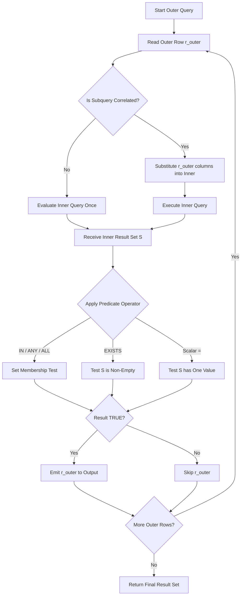
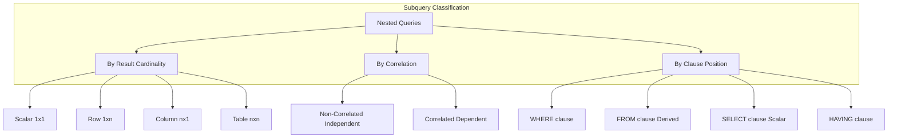
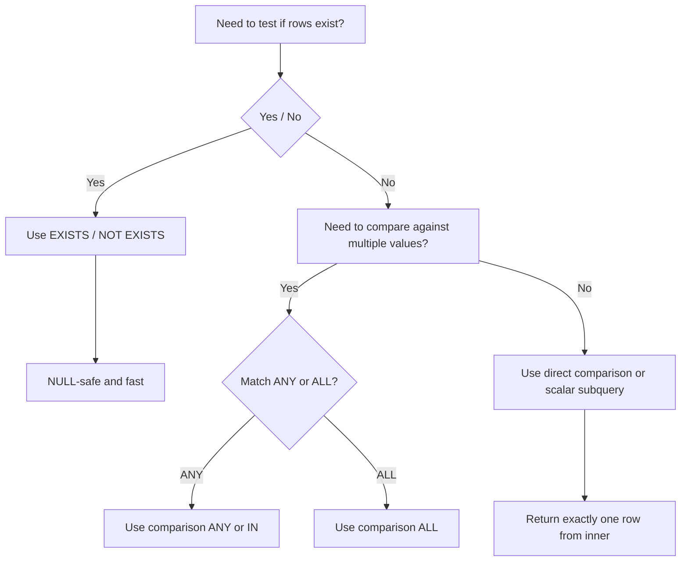

# Implementation of nested queries

<!-- SECTION_1_START -->
# Module 6 — Implementation of Nested Queries

## 1. Core Technical Definition & Intuitive Overview

### Formal Definition (KTU 2024 / ANSI-SQL Standard)
A **Nested Query** (also called a **Subquery**) is a complete `SELECT` statement embedded as a query expression inside the body of another `SELECT`, `INSERT`, `UPDATE`, `DELETE`, or `CREATE` statement. The inner query is evaluated first, and its result set is supplied as input to the outer query for further processing. Nested queries are formally catalogued in the KTU 2024 Scheme **PCCSL408 – DBMS Laboratory** syllabus under the heading *"Set operators, nested queries, and join queries."*

> [!IMPORTANT]
> **KTU 2024 Syllabus Terminology — Use these exact phrases in your lab record:**
> * **Outer Query** / **Main Query** — the enclosing SQL statement
> * **Inner Query** / **Subquery** — the query nested inside parentheses `( )`
> * **Correlated Subquery** — the inner query references columns of the outer query
> * **Non-Correlated Subquery** — the inner query is *self-contained* and executes *once*

### Conceptual Analogy — The Russian Doll Principle
Imagine a **Matryoshka doll** (Russian nesting doll):
* The **outermost doll** is your *main query* — it dictates the *final shape* of the result.
* The **inner dolls** are your *subqueries* — they must be **opened and resolved first** before you can reach the outer one.
* Just as a doll cannot exist without its inner counterpart, the outer query in SQL **cannot complete its evaluation** until every nested subquery has returned its intermediate result set.

Similarly, picture a **Matryoshka** as a *Conveyor Belt Factory*:
* Innermost doll = the **raw data filter** (smallest, most restrictive result set)
* Outer dolls = **aggregation, joins, and final projection** layers that wrap around the inner result

> [!NOTE]
> **Mnemonic — "PEACE" order of clause placement for subqueries:**
> * **P** — `FROM` clause subqueries (Derived Tables)
> * **E** — subqueries inside an `EXISTS` / `IN` predicate
> * **A** — `WHERE` clause with `ALL` / `ANY` comparison
> * **C** — `SELECT` list as a *Scalar Subquery*
> * **E** — `HAVING` clause subquery (post-aggregation)

### GeoGebra / Desmos Visualization

> [!VISUALIZATION CONTROL]
> **Concept:** Set-Theoretic Interpretation of Nested Query Operators
> **GeoGebra / Desmos Input Equations:**
> * `A = {(1,2), (2,3), (3,4)}`  (set returned by inner query)
> * `B = {(2,3), (3,4), (4,5)}`  (set tested by outer query)
> * `f(x) = x >= 0`  (boolean predicate — `EXISTS` semantics)
>
> **Visual Description:** Plot `A` and `B` as two overlapping discs on the $xy$-plane. The shaded intersection $A \cap B$ represents rows that pass an `IN` or `EXISTS` test. A *correlated* subquery is like evaluating a separate predicate $f_i(x)$ for every row of the outer set, producing a *family of curves* rather than a single static set.

### Key Standard Metrics
* A subquery **must always be enclosed in parentheses** `()`.
* The **maximum nesting depth** in standard SQL is implementation-defined; Oracle supports **255 levels**, PostgreSQL and MySQL 8.0+ support effectively **unlimited** nesting but performance degrades after **5–7 levels**.
* The **cardinality** of a subquery result can be:
  * **Scalar** — exactly *one* row, *one* column
  * **Row** — exactly *one* row, *n* columns
  * **Column** — *n* rows, *one* column (most common with `IN` / `EXISTS`)
  * **Table** — *n* rows, *n* columns (used in `FROM` as a *derived table*)

<!-- SECTION_1_END -->

<!-- SECTION_2_START -->
# 2. Deep Theoretical Analysis & KTU High-Yield Formula Sheet

## 2.1 Classification of Nested Queries — Operational Logic

A nested query is classified along **three orthogonal axes**:

### Axis 1 — Dependency on Outer Query

* **Non-Correlated (Independent) Subquery**
  * Inner query has **no reference** to any column of the outer query.
  * Evaluated **exactly once** by the DBMS engine.
  * Operationally equivalent to solving the inner expression algebraically *before* substituting into the outer expression.

* **Correlated (Dependent) Subquery**
  * Inner query **references one or more columns** of the outer query (correlation predicate).
  * Evaluated **once per candidate row** of the outer query.
  * Functionally analogous to a $\lambda$-expression inside a `for-each` loop.

### Axis 2 — Result Cardinality

* **Scalar Subquery** — returns one value; used with single-row operators `=`, `>`, `<`, `>=`, `<=`, `<>`.
* **Row Subquery** — returns one tuple; used with row constructors `(a, b) = (SELECT col1, col2 …)`.
* **Table Subquery** — returns multiple rows/columns; used with `IN`, `EXISTS`, `ANY`, `ALL`, or in `FROM`.

### Axis 3 — Position Inside Outer Query

| Position | Keyword / Context | Common Operators |
| :--- | :--- | :--- |
| `WHERE` | Row filter | `IN`, `NOT IN`, `EXISTS`, `=`, `>`, `<`, `ANY`, `ALL` |
| `FROM` | Derived table (inline view) | Mandatory alias |
| `SELECT` | Scalar projection | Must return ≤ 1 row |
| `HAVING` | Post-aggregation filter | `IN`, `EXISTS`, scalar comparison |

## 2.2 Algorithmic Steps — How the DBMS Executes a Nested Query

The Query Optimizer uses one of two strategies:

**Strategy A — Unnesting (Decorrelation / Subquery Flattening)**
1. Parse inner `SELECT` and identify its *output schema*.
2. Replace the inner query with a **temporary relation** $T$ carrying that schema.
3. Rewrite the outer query to perform a **JOIN** between $R_{outer}$ and $T$.
4. Push predicates from `WHERE` into the join condition (predicate push-down).

**Strategy B — Naive (Tuple-by-Tuple) Evaluation**
1. Read the first row of the outer relation.
2. Substitute the correlated column values into the inner query.
3. Execute the inner query; test the predicate.
4. Emit the row if predicate evaluates `TRUE`.
5. Repeat steps 1–4 for every outer row.
6. This is $O(N \times M)$ where $N$ and $M$ are the cardinalities of the outer and inner relations.

> [!IMPORTANT]
> **KTU Lab Tip:** Always check the `EXPLAIN PLAN` (Oracle) or `EXPLAIN ANALYZE` (PostgreSQL/MySQL) output. A **correlated subquery** typically appears as a *nested loop* in the plan; an **unnested** one appears as a *hash join* or *merge join*.

## 2.3 KTU Formula / Cheat Sheet

| Symbol / Operator | Set-Theoretic Meaning | Returns | NULL Behaviour |
| :--- | :--- | :--- | :--- |
| `IN` | $r \in S$ | `TRUE` if $r$ matches *any* row of $S$ | If $S$ contains `NULL` and no match, returns `UNKNOWN` |
| `NOT IN` | $r \notin S$ | `TRUE` if $r$ matches *no* row of $S$ | **DANGEROUS** — if $S$ has `NULL`, returns `UNKNOWN` for *all* rows |
| `EXISTS` | $S \neq \emptyset$ | `TRUE` if $S$ is *non-empty* | `NULL` inside $S$ is harmless |
| `NOT EXISTS` | $S = \emptyset$ | `TRUE` if $S$ is *empty* | `NULL` inside $S$ is harmless |
| `= ANY` | $\exists s \in S: r = s$ | Equivalent to `IN` | `NULL` short-circuits |
| `> ANY` | $\exists s \in S: r > s$ | `TRUE` if $r$ exceeds *at least one* element of $S$ | `NULL` short-circuits |
| `> ALL` | $\forall s \in S: r > s$ | `TRUE` if $r$ exceeds *every* element of $S$ | `NULL` short-circuits |
| `SOME` | Identical to `ANY` | Same as `ANY` | Same as `ANY` |

### Semantics of `ANY` and `ALL` — Quick Reference

$$
\text{val} \; \text{comparison} \; \text{ANY}(S) \iff \exists s \in S : \text{val} \; \text{comparison} \; s
$$

$$
\text{val} \; \text{comparison} \; \text{ALL}(S) \iff \forall s \in S : \text{val} \; \text{comparison} \; s
$$

### Real-World Engineering Utility
Nested queries are the **SQL workhorse** for:
* **OLTP backends** — resolving parent-child hierarchies (employees $\to$ managers) without recursive code.
* **Data quality checks** — `NOT EXISTS` for *anti-join* patterns (find orphaned records).
* **Report generation** — correlated subqueries for "top-N per group" without window functions.
* **ETL pipelines** — `IN` / `EXISTS` subqueries as cheap pre-filters before heavy joins.

<!-- SECTION_2_END -->

<!-- SECTION_3_START -->
# 3. Step-by-Step Derivations & Symbolic Implementation

## 3.1 Reference Lab Schema (PCCSL408 Standard)

Use this schema consistently across all subquery problems. It is the canonical KTU lab schema.

```sql
-- Drop in safe order
DROP TABLE IF EXISTS ENROLLMENT;
DROP TABLE IF EXISTS STUDENT;
DROP TABLE IF EXISTS COURSE;
DROP TABLE IF EXISTS FACULTY;

CREATE TABLE STUDENT (
    sid      INT          PRIMARY KEY,
    sname    VARCHAR(40)  NOT NULL,
    age      INT,
    branch   VARCHAR(20),
    cgpa     DECIMAL(4,2)
);

CREATE TABLE COURSE (
    cid      INT          PRIMARY KEY,
    cname    VARCHAR(40)  NOT NULL,
    credits  INT,
    fid      INT
);

CREATE TABLE FACULTY (
    fid      INT          PRIMARY KEY,
    fname    VARCHAR(40)  NOT NULL,
    dept     VARCHAR(20),
    salary   DECIMAL(10,2)
);

CREATE TABLE ENROLLMENT (
    sid      INT,
    cid      INT,
    grade    CHAR(2),
    PRIMARY KEY (sid, cid),
    FOREIGN KEY (sid) REFERENCES STUDENT(sid),
    FOREIGN KEY (cid) REFERENCES COURSE(cid)
);

INSERT INTO STUDENT VALUES
(1,'Arun',20,'CSE',8.50),(2,'Bala',21,'CSE',7.20),
(3,'Chitra',19,'ECE',9.10),(4,'Deepak',22,'MECH',6.80),
(5,'Esha',20,'CSE',8.90),(6,'Farhan',21,'ECE',7.50);

INSERT INTO FACULTY VALUES
(101,'Dr. Iyer','CSE',95000),(102,'Dr. Khan','ECE',88000),
(103,'Dr. Menon','MECH',72000),(104,'Dr. Rao','CSE',105000);

INSERT INTO COURSE VALUES
(201,'DBMS',4,101),(202,'Networks',3,102),
(203,'Thermodynamics',4,103),(204,'Algorithms',3,104);

INSERT INTO ENROLLMENT VALUES
(1,201,'A'),(1,204,'A'),(2,201,'B'),(2,202,'C'),
(3,202,'A'),(4,203,'B'),(5,201,'A'),(5,204,'A'),
(6,202,'B');
```

## 3.2 Problem 1 — Single-Row Subquery (Scalar)

**Problem:** *Find the name of the student who has the highest CGPA.*

### Step-by-Step Logical Decomposition

* **Step 1 —** Identify the inner query: the *maximum CGPA* value across the `STUDENT` table.
* **Step 2 —** Treat that single scalar value as a constant in the outer query.
* **Step 3 —** Filter `STUDENT` rows where `cgpa` equals that constant.
* **Step 4 —** Project the `sname` column.

### SQL Implementation

```sql
SELECT sname
FROM   STUDENT
WHERE  cgpa = ( SELECT MAX(cgpa) FROM STUDENT );
```

### Expected Output

```
+--------+
| sname  |
+--------+
| Chitra |
+--------+
```

> [!NOTE]
> **Valuation Key (KTU Board Examiner Perspective):**
> * Correct identification of inner query returning a scalar: **1 Mark**
> * Correct use of `MAX` aggregate inside subquery: **1 Mark**
> * Correct outer `WHERE cgpa = (...)` predicate: **1 Mark**

## 3.3 Problem 2 — Multi-Row Subquery with `IN`

**Problem:** *Find the names of students who have enrolled in at least one course taught by faculty from the CSE department.*

### Step-by-Step Logical Decomposition

* **Step 1 —** Inner query: list all `cid` of courses whose `fid` belongs to a CSE faculty.
* **Step 2 —** Outer query: list `sid` of enrollments matching any of those `cid`.
* **Step 3 —** Join back with `STUDENT` to retrieve the names.

### SQL Implementation

```sql
SELECT DISTINCT s.sname
FROM   STUDENT s
WHERE  s.sid IN (
         SELECT e.sid
         FROM   ENROLLMENT e
         WHERE  e.cid IN (
                  SELECT c.cid
                  FROM   COURSE c
                  WHERE  c.fid IN (
                           SELECT f.fid
                           FROM   FACULTY f
                           WHERE  f.dept = 'CSE'
                         )
                )
       );
```

### Logical Evaluation Order (Set-Theoretic)

$$
\text{Faculty}_{CSE} = \{ f \in \text{FACULTY} \mid f.dept = \text{`CSE'} \}
$$

$$
\text{Course}_{CSE} = \{ c \in \text{COURSE} \mid c.fid \in \text{Faculty}_{CSE} \}
$$

$$
\text{SID}_{enrolled} = \{ e.sid \mid e \in \text{ENROLLMENT} \land e.cid \in \text{Course}_{CSE} \}
$$

$$
\text{Result} = \{ s.sname \mid s \in \text{STUDENT} \land s.sid \in \text{SID}_{enrolled} \}
$$

### Expected Output

```
+-------+
| sname |
+-------+
| Arun  |
| Bala  |
| Esha  |
+-------+
```

## 3.4 Problem 3 — `EXISTS` vs `IN` (Anti-Join Pattern)

**Problem:** *Find students who have NOT enrolled in any course.*

### Implementation A — Using `NOT IN`

```sql
SELECT sname
FROM   STUDENT
WHERE  sid NOT IN ( SELECT sid FROM ENROLLMENT );
```

> [!WARNING]
> **KTU Examiner's Pitfall:** If the `ENROLLMENT.sid` column were nullable, `NOT IN` would silently return *zero rows* because `NULL` in the inner set makes the predicate evaluate to `UNKNOWN`. **Always prefer `NOT EXISTS` for null-safe anti-joins.**

### Implementation B — Using `NOT EXISTS` (Recommended)

```sql
SELECT s.sname
FROM   STUDENT s
WHERE  NOT EXISTS (
         SELECT 1
         FROM   ENROLLMENT e
         WHERE  e.sid = s.sid
       );
```

### Expected Output

```
+-------+
| sname |
+-------+
| Farhan|
+-------+
```

### Why `SELECT 1`?
The `SELECT` list inside an `EXISTS` subquery is **ignored by the engine**. Convention `SELECT 1` (or `SELECT NULL`) signals *"we only care about existence, not values"*.

## 3.5 Problem 4 — Correlated Subquery

**Problem:** *For each course, find the student(s) who scored the highest grade in that course. (Assume grades are ordered: A > B > C > D > F.)*

### Step-by-Step Logical Decomposition

* **Step 1 —** Outer query iterates over each `cid` in `ENROLLMENT`.
* **Step 2 —** Inner query references `e_outer.cid` — this is the **correlation predicate**.
* **Step 3 —** Inner query returns the *maximum grade* observed for that `cid`.
* **Step 4 —** Outer query emits the row only if `e.grade` matches that maximum.

### SQL Implementation

```sql
SELECT e.cid, e.sid, s.sname, e.grade
FROM   ENROLLMENT e
JOIN   STUDENT    s ON s.sid = e.sid
WHERE  e.grade = (
         SELECT MIN(e2.grade)
         FROM   ENROLLMENT e2
         WHERE  e2.cid = e.cid
       );
```

> [!NOTE]
> **Trick:** Since 'A' < 'B' < 'C' alphabetically and 'A' is the *best* grade, we use `MIN(grade)` to find the highest grade. In real systems you would map grades to numeric scores or use a `RANK()` window function.

### Algorithmic Complexity
The DBMS will execute the inner query **once per row of the outer `ENROLLMENT`**, giving a worst-case complexity of $O(N^2)$ for $N$ enrollment rows. Modern optimizers automatically convert this into a *hash aggregate* during unnesting.

## 3.6 Problem 5 — `ANY` and `ALL` Quantified Comparison

**Problem A — `> ANY`:** *Find courses whose credits are greater than at least one CSE course's credits.*

```sql
SELECT cname, credits
FROM   COURSE
WHERE  credits > ANY (
         SELECT credits
         FROM   COURSE
         WHERE  fid IN (
                  SELECT fid FROM FACULTY WHERE dept = 'CSE'
                )
       );
```

$$
\text{credits} > \text{ANY}(S) \iff \exists s \in S : \text{credits} > s
$$

**Problem B — `> ALL`:** *Find students whose CGPA is greater than the CGPA of every ECE student.*

```sql
SELECT sname, cgpa
FROM   STUDENT
WHERE  cgpa > ALL (
         SELECT cgpa
         FROM   STUDENT
         WHERE  branch = 'ECE'
       );
```

$$
\text{cgpa} > \text{ALL}(S) \iff \forall s \in S : \text{cgpa} > s
$$

## 3.7 Problem 6 — Subquery in `FROM` Clause (Derived Table)

**Problem:** *Find the average CGPA per branch, then list branches whose average CGPA exceeds the overall average.*

```sql
SELECT branch, avg_cgpa
FROM   (
         SELECT branch, AVG(cgpa) AS avg_cgpa
         FROM   STUDENT
         GROUP  BY branch
       ) AS branch_stats
WHERE  avg_cgpa > ( SELECT AVG(cgpa) FROM STUDENT );
```

> [!IMPORTANT]
> **Mandatory rule:** A derived table in the `FROM` clause **must** be given an alias (`AS branch_stats`). Forgetting the alias is one of the most common KTU valuation deductions (**−2 Marks**).

## 3.8 Problem 7 — Subquery in `SELECT` List (Scalar Subquery)

**Problem:** *For each student, display their name, their CGPA, and the number of courses they have enrolled in.*

```sql
SELECT s.sname,
       s.cgpa,
       ( SELECT COUNT(*)
         FROM   ENROLLMENT e
         WHERE  e.sid = s.sid
       ) AS course_count
FROM   STUDENT s;
```

> [!NOTE]
> **Rule:** Scalar subqueries in the `SELECT` list must return **at most one row**; otherwise the DBMS raises `ERROR: more than one row returned` (PostgreSQL) or `ORA-01427: single-row subquery returns more than one row` (Oracle).

<!-- SECTION_3_END -->

<!-- SECTION_4_START -->
# 4. Structural Diagrams & Schematics

## 4.1 Nested Query Execution Flow (Conceptual Flowchart)



## 4.2 Taxonomy of Subqueries (Hierarchical Classification)



## 4.3 Decision Diagram — Choosing the Right Operator



## 4.4 Block-Level Architecture — Subquery Processing Pipeline

```mermaid
flowchart LR
    subgraph In["Input Stage"]
        P1["Parse SQL"]
        P2["Validate Subquery Parentheses"]
        P3["Build Query Tree"]
    end

    subgraph Opt["Optimizer Stage"]
        O1["Detect Correlation"]
        O2["Apply Unnesting Rule"]
        O3["Choose Join Strategy Hash or NL"]
    end

    subgraph Ex["Executor Stage"]
        E1["Inner Query Engine"]
        E2["Materialize or Stream"]
        E3["Outer Query Engine"]
    end

    subgraph Out["Output Stage"]
        F1["Apply Predicate"]
        F2["Project Columns"]
        F3["Return Result Set"]
    end

    P1 --> P2 --> P3 --> O1 --> O2 --> O3
    O3 --> E1 --> E2 --> E3
    E3 --> F1 --> F2 --> F3
```



<!-- SECTION_4_END -->

<!-- SECTION_5_START -->
# 5. KTU 2024 Scheme Examination Question Bank & Topic Recap

## 5.1 Part A — Short Answer Questions (2 × 3 = 6 Marks)

### Question 1 [KTU University Exam — July 2024] — **3 Marks**
**CO1 — RBT Level: Remember**

*Q. Define a nested query. Differentiate between a correlated and a non-correlated subquery.*

**Model Answer:**

A **nested query** (or *subquery*) is a `SELECT` statement embedded within another SQL statement. It is always enclosed in parentheses and provides intermediate data to the *outer query*.

| Feature | Non-Correlated | Correlated |
| :--- | :--- | :--- |
| Dependency on outer query | **Independent** | **Dependent** |
| Column reference | None to outer | References outer columns |
| Execution count | **Once** | **Once per outer row** |
| Performance | Faster (cacheable) | Slower ($O(N \times M)$) |

> **Valuation Key:**
> * Defining nested query: **1 Mark**
> * Tabular comparison with execution count: **2 Marks**

### Question 2 [KTU University Exam — Dec 2023] — **3 Marks**
**CO1 — RBT Level: Understand**

*Q. Explain the difference between `IN`, `EXISTS`, and `= ANY` operators. When would you prefer `NOT EXISTS` over `NOT IN`?*

**Model Answer:**

* `IN` tests for *membership* in a value list or subquery result.
* `EXISTS` tests for *existence of any row*; it short-circuits on the first match.
* `= ANY` is **logically equivalent to `IN`**: $r = \text{ANY}(S) \iff r \in S$.

**`NOT EXISTS` is preferred over `NOT IN`** when the inner query's column is *nullable*. With `NOT IN`, the presence of a single `NULL` in the inner set causes the entire predicate to evaluate to `UNKNOWN`, silently returning zero rows — a classic "**NULL trap**".

> **Valuation Key:**
> * Correct semantics of all three: **2 Marks**
> * NULL-trap explanation: **1 Mark**

---

## 5.2 Part B — Long Answer Questions (Internal Choice) (1 × 14 = 14 Marks)

### Question A [KTU University Exam — July 2024, Modified] — **14 Marks**
**CO3 — RBT Level: Apply / Analyze**

Consider the `STUDENT`, `COURSE`, `ENROLLMENT`, and `FACULTY` schema from Section 3.1.

**(a)** Write an SQL query using a **correlated subquery** to display the `sid` and `sname` of students who have enrolled in **more than one course**. — **7 Marks**

**(b)** Write an SQL query using a **nested subquery with `NOT EXISTS`** to find the `cid` and `cname` of courses that have **no enrollments at all**. — **7 Marks**

#### Model Solution — Part (a)

```sql
SELECT s.sid, s.sname
FROM   STUDENT s
WHERE  (
         SELECT COUNT(*)
         FROM   ENROLLMENT e
         WHERE  e.sid = s.sid
       ) > 1;
```

> **Valuation Key — Part (a):**
> * Identifying the correlation predicate `e.sid = s.sid`: **2 Marks**
> * Correct use of `COUNT(*)` in subquery: **2 Marks**
> * Outer `WHERE (...) > 1` predicate: **2 Marks**
> * Final correct `SELECT` projection: **1 Mark**

#### Model Solution — Part (b)

```sql
SELECT c.cid, c.cname
FROM   COURSE c
WHERE  NOT EXISTS (
         SELECT 1
         FROM   ENROLLMENT e
         WHERE  e.cid = c.cid
       );
```

> **Valuation Key — Part (b):**
> * Correct `NOT EXISTS` anti-join structure: **3 Marks**
> * Correlation predicate `e.cid = c.cid`: **2 Marks**
> * Use of `SELECT 1` (idiomatic `EXISTS` style): **1 Mark**
> * Final query executes successfully: **1 Mark**

### Question B [KTU University Exam — Dec 2023, Modified] — **14 Marks**
**CO3 — RBT Level: Apply / Analyze**

**(a)** Write an SQL query using the `ANY` operator to find the `sname` of students whose CGPA is **greater than the CGPA of at least one ECE student**. — **7 Marks**

**(b)** Write an SQL query using a **derived table (subquery in `FROM`)** to find the branch with the **highest average CGPA**, displaying `branch` and `avg_cgpa`. — **7 Marks**

#### Model Solution — Part (a)

```sql
SELECT sname
FROM   STUDENT
WHERE  cgpa > ANY (
         SELECT cgpa
         FROM   STUDENT
         WHERE  branch = 'ECE'
       );
```

> **Valuation Key — Part (a):**
> * Correct inner query filtering `branch = 'ECE'`: **2 Marks**
> * Correct use of `> ANY` quantified comparison: **3 Marks**
> * Final outer `SELECT sname` projection: **2 Marks**

#### Model Solution — Part (b)

```sql
SELECT branch, avg_cgpa
FROM   (
         SELECT branch, AVG(cgpa) AS avg_cgpa
         FROM   STUDENT
         GROUP  BY branch
       ) AS branch_avg
WHERE  avg_cgpa = (
         SELECT MAX(avg_cgpa_inner)
         FROM   (
                  SELECT AVG(cgpa) AS avg_cgpa_inner
                  FROM   STUDENT
                  GROUP  BY branch
                ) AS t
       );
```

> **Valuation Key — Part (b):**
> * Derived table in `FROM` with **mandatory alias**: **2 Marks**
> * `AVG(cgpa) ... GROUP BY branch`: **2 Marks**
> * Nested `MAX` subquery: **2 Marks**
> * Final outer comparison: **1 Mark**

---

## 5.3 KTU Examiner's Valuation Warning

> [!WARNING]
> **Common Mark-Deduction Pitfalls in Nested Query Problems:**
> 1. **Forgetting parentheses** around the subquery — deducts 1 Mark.
> 2. **Missing alias on a derived table** (`FROM (SELECT … )`) — deducts 2 Marks and may cause a *syntax error*.
> 3. **Using `=` instead of `IN`** when the inner query can return multiple rows — this triggers *ORA-01427 / ERROR 1242 in MySQL*. Always verify the inner cardinality before choosing the operator.
> 4. **`NOT IN` with nullable columns** — the *NULL trap*. Prefer `NOT EXISTS`.
> 5. **Confusing `ANY` with `ALL`** — `> ANY` is "greater than the *smallest*", `> ALL` is "greater than the *largest*". This is the single most-failed conceptual question in KTU exams.
> 6. **Not using `DISTINCT`** in `IN` queries that may produce duplicates — acceptable but penalised if the question asks for "unique names".
> 7. **Correlated subquery returning multiple rows in a `SELECT` list** — must be a *scalar*; wrap in `MAX()` or `MIN()` to enforce single-row semantics.

---

## 5.4 Topic Recap & Important Things to Remember

> **High-Density Rapid Revision Checklist — Nested Queries (PCCSL408 / M6)**

* **Definition** — A `SELECT` inside another SQL statement, enclosed in `( )`.
* **Two Master Categories** — *Correlated* (inner depends on outer) and *Non-Correlated* (independent).
* **Three Cardinalities** — Scalar, Row, Table.
* **Four Positions** — `WHERE`, `FROM`, `SELECT`, `HAVING`.
* **Five Core Operators** — `IN`, `NOT IN`, `EXISTS`, `NOT EXISTS`, `ANY`/`ALL`.
* **Critical Rule** — Derived tables in `FROM` **must** have an alias.
* **Critical Rule** — `NOT IN` is **unsafe** with `NULL`s; use `NOT EXISTS`.
* **Critical Rule** — `= ANY` $\equiv$ `IN`; `> ANY` means "greater than at least one"; `> ALL` means "greater than every".
* **Execution Cost** — Correlated subqueries are $O(N \times M)$; modern optimizers *unnest* them to joins.
* **EXISTS vs IN** — Both are semantically equivalent for simple membership, but `EXISTS` is **NULL-safe** and **short-circuits** on first match.
* **Scalar Subquery in `SELECT`** — Must return **at most one row**; otherwise the query fails.
* **KTU 2024 Lab Mandate** — Be prepared to *write*, *execute*, *and interpret* `EXPLAIN PLAN` output for nested queries during the **end-semester lab examination**.
* **Common Schema Used in PCCSL408** — `STUDENT`, `COURSE`, `ENROLLMENT`, `FACULTY` (4 tables with referential integrity).
* **Mnemonic PEACE** — `P` (FROM), `E` (EXISTS), `A` (ANY/ALL), `C` (scalar in SELECT), `E` (HAVING).

<!-- SECTION_5_END -->
