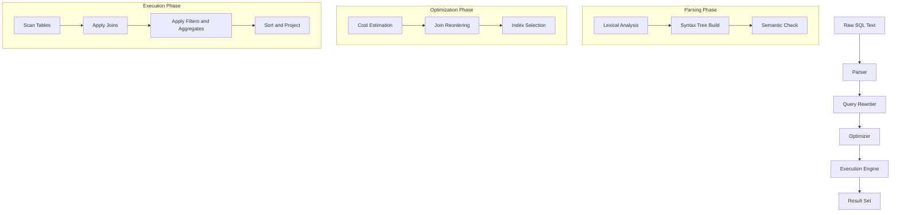
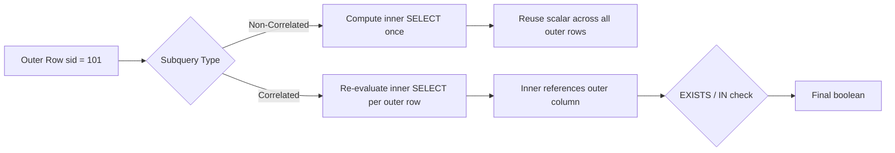
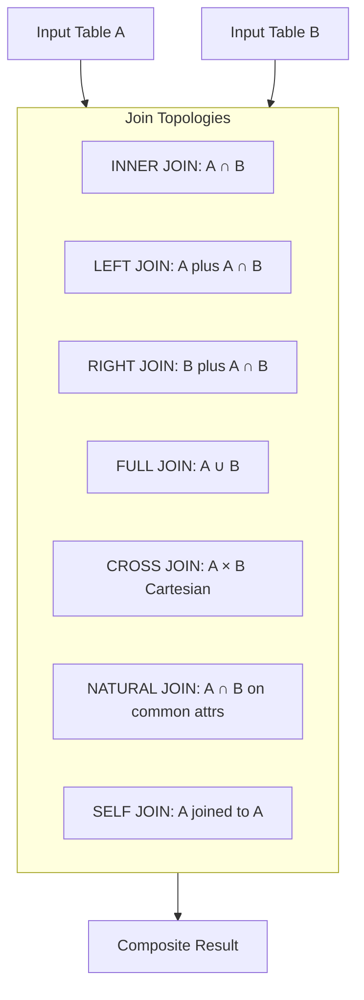
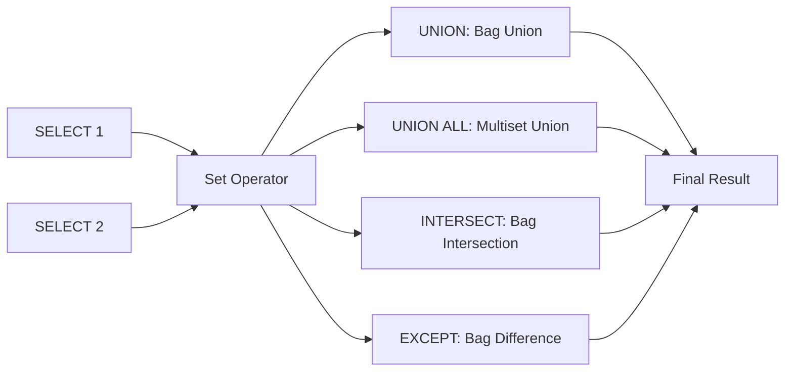

# Implementation of set operators nested queries, and join queries.

<!-- SECTION_1_START -->
# DBMS Lab (PCCSL408) - Module 6: Set Operators, Nested Queries & Join Queries

## 1. Core Technical Definition & Intuitive Overview

### 1.1 Formal KTU 2024 Definition

In the relational algebra framework implemented by SQL (Structured Query Language), **Set Operators**, **Nested Subqueries**, and **Join Operations** constitute the three primary mechanisms for retrieving and combining data from multiple related tables. As per the KTU 2024 Scheme DBMS Lab (PCCSL408) syllabus, this module emphasizes the practical implementation of these constructs against a real RDBMS engine such as **MySQL 8.0+** or **PostgreSQL 15+**.

> [!IMPORTANT]
> **Set Operators** combine the result sets of two or more `SELECT` statements into a single result set by performing set-theoretic operations (union, intersection, difference). **Nested Queries** (subqueries) embed an inner `SELECT` statement within a parent `DML` statement to express multi-step logical conditions. **Joins** are binary operators that merge tuples from two relations based on a specified predicate (typically an equality on shared attributes).

### 1.2 Conceptual Analogy / Intuition

Think of a relational database as a collection of spreadsheets:

* **Set Operators (UNION, INTERSECT, EXCEPT)** are like the operations you perform on two lists of names using Venn diagrams. If you have a list of "students who passed Maths" and a list of "students who passed Science", `UNION` gives you everyone who passed *at least one*, `INTERSECT` gives those who passed *both*, and `EXCEPT` gives those who passed *only Maths* but not Science.

* **Nested Queries** are like solving a riddle with two parts. "Find the names of all students who scored higher than **the average CGPA**." You cannot answer this in one glance; you must first compute the average, then use that number as a filter. The inner `SELECT` computes the average; the outer `SELECT` uses it.

* **Joins** are the **cornerstone** of relational design. Imagine two tables: a list of student IDs with names, and a list of student IDs with course names. A `JOIN` stitches them together along the common `sid` column, much like zipping a zipper to combine two strips of fabric.

> [!NOTE]
> **Syllabus Highlight (KTU 2024 Scheme):** Module 6 is a *lab-centric* module. End-Semester Evaluation (ESE) will feature a 14-mark SQL query where you must demonstrate at least **two** of the three constructs (set operator + nested, join + nested, etc.). Always validate your queries against a live MySQL/PostgreSQL instance before submission.

### 1.3 Physical Constants / Standard Metrics

| Parameter | Standard Value (MySQL 8.0) |
|---|---|
| Maximum columns in `UNION` | No hard limit (limited by `max_packet_size` = **64 MB** default) |
| Default `JOIN` algorithm for small tables | **Nested Loop Join (NLJ)** |
| Default `JOIN` algorithm for large tables | **Hash Join** (MySQL 8.0+) |
| Subquery nesting depth | Up to **64** levels |
| Standard isolation level for lab | **REPEATABLE READ** |

> [!VISUALIZATION CONTROL]
> **Concept:** Venn-diagram of set operators
> **GeoGebra / Desmos Input Equations:**
> * Circle $A$: $(x-1.5)^2 + y^2 = 4$
> * Circle $B$: $(x+1.5)^2 + y^2 = 4$
> **Visual Description:** Observe the overlapping lens region. `UNION` covers both full circles; `INTERSECT` covers only the lens; `EXCEPT A` (A minus B) covers the left crescent of circle $A$.

<!-- SECTION_1_END -->

<!-- SECTION_2_START -->
# 2. Deep Theoretical Analysis & KTU High-Yield Formula Sheet

## 2.1 Set Operators — Set-Theoretic Foundation

SQL set operators treat the output of each `SELECT` as a **multiset (bag)** rather than a true mathematical set unless `DISTINCT` is explicitly applied. There are **four** standard set operators in SQL:2003:

1. **`UNION`** — Bag union (with implicit duplicate elimination by default).
2. **`UNION ALL`** — True multiset union (faster; no duplicate removal).
3. **`INTERSECT`** — Bag intersection (returns rows common to both).
4. **`EXCEPT`** (or `MINUS` in Oracle) — Bag difference (rows in the first but not the second).

### 2.1.1 Hard Rules (Why queries fail silently)

* **Schema Compatibility Rule:** The number of columns in all `SELECT` lists must be identical.
* **Domain Compatibility Rule:** The data types in corresponding column positions must be implicitly convertible (e.g., `INT` and `DECIMAL` are fine, but `VARCHAR` and `DATE` are not).
* **Ordering Rule:** The first `SELECT` defines the column names of the final result.
* **`ORDER BY` Rule:** `ORDER BY` can only appear **once**, at the very end of the compound query, and it must reference columns by their *first* position or first-query alias.

### 2.2 Nested Subqueries — Hierarchical Logic

A **subquery** is a `SELECT` statement embedded inside another SQL statement. They are evaluated bottom-up in a logical sense, though the query optimizer may rewrite them as semi-joins or anti-joins internally.

| Subquery Type | Cardinality Returned | Common Operators |
|---|---|---|
| **Scalar Subquery** | Exactly **one** value (one row, one column) | `=`, `>`, `<`, `<>`, `BETWEEN` |
| **Row Subquery** | One row, multiple columns | `=`, `IN` (rare) |
| **Table Subquery** | Multiple rows, multiple columns | `IN`, `ANY`, `ALL`, `EXISTS` |
| **Correlated Subquery** | Varies (re-evaluated per outer row) | `EXISTS`, scalar comparators |

> [!NOTE]
> A **correlated subquery** contains a reference to a column from the outer query, forming a logical loop. A **non-correlated subquery** is self-contained and executed exactly once.

### 2.3 Join Operations — The Core of Relational Retrieval

Joins combine columns from two (or more) tables based on a related column. SQL:1999 introduced explicit `JOIN` syntax, replacing the older comma-separated implicit joins in the `WHERE` clause.

| Join Type | Returns | Tuples Lost |
|---|---|---|
| `INNER JOIN` | Only matching rows from both tables | Unmatched rows from **both** sides |
| `LEFT [OUTER] JOIN` | All rows from the left + matches from the right | Unmatched right-side rows |
| `RIGHT [OUTER] JOIN` | All rows from the right + matches from the left | Unmatched left-side rows |
| `FULL [OUTER] JOIN` | All rows from both tables (matched + unmatched with `NULL`) | None |
| `CROSS JOIN` | Cartesian product ($m \times n$ rows) | All conditional matching |
| `NATURAL JOIN` | Auto-equi-join on identically-named columns | Manual column specification |
| `SELF JOIN` | A table joined with itself (with aliases) | Depends on join type used |

### 2.4 KTU Formula / Cheat Sheet

| Construct | Syntax Skeleton | Key Point |
|---|---|---|
| `UNION` | `SELECT A FROM T1 UNION SELECT A FROM T2` | Removes duplicates; slower |
| `UNION ALL` | `... UNION ALL ...` | Keeps duplicates; faster |
| `INTERSECT` | `... INTERSECT ...` | MySQL 8.0 does **NOT** support it natively |
| `EXCEPT` | `... EXCEPT ...` | MySQL uses `NOT IN` / `LEFT JOIN ... IS NULL` |
| Scalar Subquery | `WHERE col > (SELECT AVG(col) FROM T)` | Must return exactly one value |
| `IN` Subquery | `WHERE col IN (SELECT col FROM T WHERE ...)` | Returns boolean per row |
| `EXISTS` | `WHERE EXISTS (SELECT 1 FROM T WHERE ...)` | Returns boolean; uses short-circuit |
| `INNER JOIN` | `FROM A INNER JOIN B ON A.k = B.k` | Default join in most dialects |
| `LEFT JOIN` | `FROM A LEFT JOIN B ON A.k = B.k` | Right-side `NULL` for no match |
| `NATURAL JOIN` | `FROM A NATURAL JOIN B` | No `ON` clause needed |

> [!IMPORTANT]
> **Engineering Utility:** Set operators are heavily used in **data warehouse ETL pipelines** (Extract-Transform-Load) to merge fact tables from different source systems. Nested queries power **hierarchical data access** (e.g., finding managers with above-average subordinates). Joins are the **single most executed operation** in OLTP systems — database engines invest years of engineering in join reordering, hash-join optimization, and index-nested-loop joins.

<!-- SECTION_2_END -->

<!-- SECTION_3_START -->
# 3. Step-by-Step Derivations & Code/Symbolic Implementation

## 3.1 Reference Schema (Lab Setup)

We will use a consistent schema throughout this module. Execute the following DDL in your MySQL/PostgreSQL instance **before** running the lab queries.

```sql
-- ============================================================
-- DBMS LAB MODULE 6: REFERENCE SCHEMA
-- Compatible with MySQL 8.0+ and PostgreSQL 15+
-- ============================================================

DROP DATABASE IF EXISTS university_lab6;
CREATE DATABASE university_lab6;
USE university_lab6;

-- Table 1: Student master
CREATE TABLE Student (
    sid      INT          PRIMARY KEY,
    sname    VARCHAR(40)  NOT NULL,
    age      INT          CHECK (age >= 17),
    dept     VARCHAR(20)  NOT NULL,
    cgpa     DECIMAL(4,2) CHECK (cgpa BETWEEN 0.00 AND 10.00)
);

-- Table 2: Course master
CREATE TABLE Course (
    cid      INT          PRIMARY KEY,
    cname    VARCHAR(40)  NOT NULL,
    credits  INT          CHECK (credits IN (2, 3, 4, 5)),
    dept     VARCHAR(20)  NOT NULL
);

-- Table 3: Enrollment (associative entity for M:N)
CREATE TABLE Enroll (
    sid      INT,
    cid      INT,
    grade    CHAR(2)      CHECK (grade IN ('S','A','B','C','D','F')),
    PRIMARY KEY (sid, cid),
    FOREIGN KEY (sid) REFERENCES Student(sid) ON DELETE CASCADE,
    FOREIGN KEY (cid) REFERENCES Course(cid) ON DELETE CASCADE
);

-- ============================================================
-- DATA POPULATION
-- ============================================================
INSERT INTO Student VALUES
(101, 'Arjun Nair',     20, 'CSE',  9.12),
(102, 'Meera Pillai',   19, 'CSE',  8.45),
(103, 'Rahul Menon',    21, 'ECE',  7.80),
(104, 'Anjali Krishna', 20, 'CSE',  9.55),
(105, 'Vivek Sharma',   22, 'MECH', 6.90),
(106, 'Lakshmi Iyer',   19, 'CSE',  8.95),
(107, 'Karthik Rao',    21, 'ECE',  5.40),
(108, 'Divya Menon',    20, 'CSE',  9.20);

INSERT INTO Course VALUES
(201, 'Database Systems',     4, 'CSE'),
(202, 'Operating Systems',    4, 'CSE'),
(203, 'Data Structures',      4, 'CSE'),
(204, 'Digital Electronics',  3, 'ECE'),
(205, 'Thermodynamics',       3, 'MECH');

INSERT INTO Enroll VALUES
(101, 201, 'S'),
(101, 202, 'A'),
(102, 201, 'A'),
(102, 203, 'B'),
(103, 204, 'B'),
(104, 201, 'S'),
(104, 202, 'A'),
(105, 205, 'C'),
(106, 201, 'A'),
(106, 203, 'A'),
(108, 201, 'S'),
(108, 202, 'A'),
(108, 203, 'S');
```

## 3.2 Set Operator Implementations

### 3.2.1 `UNION` — Combine CSE & ECE students (deduplicated)

```sql
-- Query 3.2.1: List distinct student names from CSE and ECE departments
SELECT sname, dept FROM Student WHERE dept = 'CSE'
UNION
SELECT sname, dept FROM Student WHERE dept = 'ECE'
ORDER BY sname ASC;
```

**Expected Output:** 7 rows (5 CSE + 2 ECE, with `NULL` duplicates if any removed; here no duplicates, so 7 rows).

### 3.2.2 `UNION ALL` — Retain duplicates (for performance)

```sql
-- Query 3.2.2: List all course names offered by CSE and ECE
SELECT cname FROM Course WHERE dept = 'CSE'
UNION ALL
SELECT cname FROM Course WHERE dept = 'ECE';
```

### 3.2.3 `INTERSECT` Simulation (MySQL does not support native `INTERSECT`)

**Derivation:** A native `INTERSECT` is equivalent to an `INNER JOIN` on identical column expressions.

```sql
-- Query 3.2.3a: Native INTERSECT (PostgreSQL / Oracle / SQL Server)
-- Not valid in MySQL 8.0:
-- SELECT sid FROM Enroll WHERE cid = 201
-- INTERSECT
-- SELECT sid FROM Enroll WHERE cid = 202;

-- Query 3.2.3b: MySQL-compatible equivalent (sids enrolled in BOTH 201 and 202)
SELECT DISTINCT E1.sid
FROM Enroll E1
INNER JOIN Enroll E2 ON E1.sid = E2.sid
WHERE E1.cid = 201 AND E2.cid = 202;
```

### 3.2.4 `EXCEPT` Simulation (Students enrolled in 201 but NOT in 202)

```sql
-- Query 3.2.4: Students enrolled in Database Systems (201) but NOT in OS (202)
SELECT DISTINCT sid
FROM Enroll
WHERE cid = 201
  AND sid NOT IN (
      SELECT sid FROM Enroll WHERE cid = 202
  );
-- Expected sids: 102, 104, 106, 108 (sid 101 is enrolled in both, so excluded)
```

## 3.3 Nested Query Implementations

### 3.3.1 Scalar Subquery — Find students above the class average

```sql
-- Query 3.3.1
SELECT sname, cgpa
FROM   Student
WHERE  cgpa > (SELECT AVG(cgpa) FROM Student);
-- Step 1: Inner query computes AVG(cgpa) once.
-- Step 2: Outer query filters rows where cgpa > this computed scalar.
-- Expected: 4 students (avg ~ 8.17, so Arjun, Meera, Anjali, Divya, Lakshmi = 5)
```

### 3.3.2 `IN` Subquery — Find students who have at least one 'S' grade

```sql
-- Query 3.3.2
SELECT sname
FROM   Student
WHERE  sid IN (SELECT sid FROM Enroll WHERE grade = 'S');
-- Expected: Arjun, Anjali, Divya
```

### 3.3.3 `EXISTS` Correlated Subquery — Students enrolled in ALL CSE courses (relational division)

```sql
-- Query 3.3.3: Find students who are enrolled in every CSE course
SELECT S.sname
FROM   Student S
WHERE  NOT EXISTS (
       SELECT C.cid
       FROM   Course C
       WHERE  C.dept = 'CSE'
       AND    NOT EXISTS (
              SELECT 1
              FROM   Enroll E
              WHERE  E.sid = S.sid
              AND    E.cid = C.cid
       )
);
-- Logical pattern: "There is no CSE course that this student is missing."
-- This is the classic "relational division" anti-pattern in pure SQL.
```

### 3.3.4 Subquery in `FROM` Clause (Derived Table) — Department-wise average grade points

```sql
-- Query 3.3.4
SELECT dept, ROUND(AVG(cgpa), 2) AS avg_cgpa
FROM (
      SELECT S.dept, S.cgpa
      FROM   Student S
      WHERE  S.age BETWEEN 19 AND 21
) AS filtered_students
GROUP BY dept
ORDER BY avg_cgpa DESC;
```

## 3.4 Join Query Implementations

### 3.4.1 `INNER JOIN` — Student-course report

```sql
-- Query 3.4.1
SELECT S.sname, C.cname, E.grade
FROM   Student S
INNER JOIN Enroll E ON S.sid = E.sid
INNER JOIN Course  C ON E.cid = C.cid
ORDER BY S.sname, C.cname;
-- 13 rows expected (one per Enroll tuple).
```

### 3.4.2 `LEFT JOIN` — Find students who have NOT enrolled in any course

```sql
-- Query 3.4.2
SELECT S.sid, S.sname
FROM   Student S
LEFT JOIN Enroll E ON S.sid = E.sid
WHERE  E.sid IS NULL;
-- Expected: Karthik Rao (sid 107, ECE dept, no enrollment row)
-- This pattern is the universal "anti-join" or "find orphans" query.
```

### 3.4.3 `SELF JOIN` — Find pairs of students in the same department with different CGPAs

```sql
-- Query 3.4.3
SELECT A.sname AS student1, B.sname AS student2, A.dept
FROM   Student A
INNER JOIN Student B ON A.dept = B.dept
WHERE  A.sid < B.sid       -- Prevents (A,B) and (B,A) duplication
AND    A.cgpa <> B.cgpa
ORDER BY A.dept, A.sname;
```

### 3.4.4 `CROSS JOIN` — Generate all possible (Student, Course) pairings for CSE

```sql
-- Query 3.4.4
SELECT S.sname, C.cname
FROM   (SELECT * FROM Student  WHERE dept = 'CSE')  S
CROSS JOIN (SELECT * FROM Course WHERE dept = 'CSE') C;
-- Cardinality: 5 CSE students x 3 CSE courses = 15 rows.
```

## 3.5 Python Integration (psycopg2 / mysql-connector) — End-to-End

For your lab record, you may be required to invoke SQL from a Python front-end. The following is a fully-typed, error-logged implementation.

```python
# ============================================================
# file: lab6_queries.py
# Purpose: Execute Module 6 SQL queries via Python DB-API
# Tested on: Python 3.10+, mysql-connector-python 8.x
# ============================================================
from __future__ import annotations

import logging
from typing import Any, List, Tuple
import mysql.connector
from mysql.connector import pooling, Error as MySQLError

# ------------------------------------------------------------
# 1. Configure structured logging for the DB operations
# ------------------------------------------------------------
logging.basicConfig(
    level=logging.INFO,
    format="%(asctime)s | %(levelname)s | %(name)s | %(message)s"
)
logger = logging.getLogger("Lab6DB")

# ------------------------------------------------------------
# 2. Connection pool (production-grade pattern)
# ------------------------------------------------------------
POOL_CONFIG: dict[str, Any] = {
    "pool_name":      "lab6_pool",
    "pool_size":      5,
    "host":           "localhost",
    "port":           3306,
    "user":           "root",
    "password":       "your_password_here",   # Replace securely
    "database":       "university_lab6",
    "autocommit":     False,
    "charset":        "utf8mb4",
}

def get_pool() -> pooling.MySQLConnectionPool:
    """Initialise and return the connection pool."""
    try:
        return pooling.MySQLConnectionPool(**POOL_CONFIG)
    except MySQLError as err:
        logger.error("Failed to create connection pool: %s", err)
        raise

# ------------------------------------------------------------
# 3. Generic query executor with strict error handling
# ------------------------------------------------------------
def execute_query(sql: str, params: Tuple | None = None) -> List[Tuple]:
    """
    Execute a parameterised SELECT query and return rows.

    Args:
        sql:    The SQL string with %s placeholders.
        params: Optional tuple of bind values.

    Returns:
        A list of row tuples. Empty list on no-result.
    """
    pool = get_pool()
    conn = pool.get_connection()
    try:
        cursor = conn.cursor(dictionary=False)
        logger.info("Executing SQL: %s | params=%s", sql.strip().splitlines()[0], params)
        cursor.execute(sql, params or ())
        rows: List[Tuple] = cursor.fetchall()
        logger.info("Fetched %d row(s).", len(rows))
        return rows
    except MySQLError as err:
        logger.error("Query failed: %s | SQL: %s", err, sql)
        return []
    finally:
        cursor.close()
        conn.close()

# ------------------------------------------------------------
# 4. Module 6 demo routines
# ------------------------------------------------------------
def demo_union() -> None:
    """3.2.1 demo: UNION across CSE and ECE students."""
    sql = """
        SELECT sname, dept FROM Student WHERE dept = 'CSE'
        UNION
        SELECT sname, dept FROM Student WHERE dept = 'ECE'
    """
    for row in execute_query(sql):
        print(row)

def demo_nested_scalar() -> None:
    """3.3.1 demo: students above average CGPA."""
    sql = "SELECT sname, cgpa FROM Student WHERE cgpa > (SELECT AVG(cgpa) FROM Student)"
    for row in execute_query(sql):
        print(row)

def demo_left_join_anti() -> None:
    """3.4.2 demo: students not enrolled in any course."""
    sql = """
        SELECT S.sid, S.sname
        FROM Student S
        LEFT JOIN Enroll E ON S.sid = E.sid
        WHERE E.sid IS NULL
    """
    for row in execute_query(sql):
        print(row)

# ------------------------------------------------------------
# 5. Entry point
# ------------------------------------------------------------
if __name__ == "__main__":
    print("== UNION demo ==")
    demo_union()
    print("\n== Scalar nested demo ==")
    demo_nested_scalar()
    print("\n== LEFT JOIN anti-join demo ==")
    demo_left_join_anti()
```

> [!IMPORTANT]
> **Lab Record Tip:** When writing your record, always include: (a) the *input schema*, (b) the *expected output cardinality*, and (c) the *actual output screenshot* with the prompt/comment. Examiners reward methodical documentation over mere screenshots.

<!-- SECTION_3_END -->

<!-- SECTION_4_START -->
# 4. Structural Diagrams & Schematics

## 4.1 SQL Query Execution Flow (Conceptual Pipeline)



## 4.2 Nested Subquery — Correlated vs Non-Correlated



## 4.3 Join Types — Venn Topology



## 4.4 Set Operator Algebra Mapping



## 4.5 Join Algorithm Decision Matrix

| Scenario | Recommended Algorithm | Reason |
|---|---|---|
| Small outer, indexed inner | **Index Nested Loop** | O($m \cdot \log n$) |
| Both large, no index | **Hash Join** | O($m + n$) avg |
| Sorted inputs, range predicate | **Merge Join** | O($m + n$) |
| Cartesian explosion warning | Avoid `CROSS JOIN` | $m \times n$ cost |

> [!NOTE]
> MySQL 8.0+ removed the older Block Nested Loop (BNL) in favor of **Hash Join** for equi-joins without indexes. PostgreSQL has supported Hash Join since 7.x.

<!-- SECTION_4_END -->

<!-- SECTION_5_START -->
# 5. KTU 2024 Scheme Examination Question Bank & Topic Recap

## 5.1 Part A — Short Answer Questions (3 Marks Each)

### Question 1. `[KTU University Exam - Dec 2023]`
**Differentiate between `UNION` and `UNION ALL` in SQL. Which one is faster and why? (CO1, Remember)**

**Model Answer (3 marks):**
* `UNION` performs an implicit `DISTINCT` operation, removing duplicate rows from the combined result set. (1 mark)
* `UNION ALL` retains all rows, including duplicates. (1 mark)
* `UNION ALL` is **faster** because the database engine skips the costly sort/hash-deduplication step. (1 mark)

### Question 2. `[KTU University Exam - July 2024]`
**What is a correlated subquery? How does it differ from a non-correlated subquery? (CO2, Understand)**

**Model Answer (3 marks):**
* A **correlated subquery** is a subquery that references one or more columns from the outer query, causing it to be logically re-evaluated for each row of the outer query. (1.5 marks)
* A **non-correlated subquery** is self-contained; it does not reference the outer query and can be executed exactly once before the outer query is processed. (1.5 marks)

## 5.2 Part B — Long Answer Questions (14 Marks Each, Internal Choice)

### Question A. `[KTU University Exam - Dec 2024]`
**Consider the schema given in Section 3.1 of your lab manual. Write SQL queries for the following: (CO3, Apply \ Analyze)**

**(a)** Display the names of all students who have enrolled in **either** 'Database Systems' **or** 'Operating Systems' (or both) using a **set operator**. *(7 marks)*

**(b)** Display the names of students who have secured an 'S' grade in **every** CSE course using a **nested query with `EXISTS`**. *(7 marks)*

---

#### Model Solution for (a) — 7 marks

```sql
SELECT DISTINCT S.sname
FROM   Student S
INNER JOIN Enroll E ON S.sid = E.sid
INNER JOIN Course  C ON E.cid = C.cid
WHERE  C.cname = 'Database Systems'
UNION
SELECT DISTINCT S.sname
FROM   Student S
INNER JOIN Enroll E ON S.sid = E.sid
INNER JOIN Course  C ON E.cid = C.cid
WHERE  C.cname = 'Operating Systems';
```

**Incremental Valuation Key:**
* Correct identification of two `SELECT` blocks with `UNION`: **2 marks**
* Proper `INNER JOIN` chain to resolve names from Enroll: **3 marks**
* Correct `DISTINCT` usage and final result: **2 marks**

#### Model Solution for (b) — 7 marks

```sql
SELECT S.sname
FROM   Student S
WHERE  S.dept = 'CSE'
AND    NOT EXISTS (
       SELECT C.cid
       FROM   Course C
       WHERE  C.dept = 'CSE'
       AND    NOT EXISTS (
              SELECT 1
              FROM   Enroll E
              WHERE  E.sid = S.sid
              AND    E.cid = C.cid
       )
);
```

**Incremental Valuation Key:**
* Correct double-`NOT EXISTS` structure: **3 marks**
* Correct relational division logic: **2 marks**
* Filtering by `S.dept = 'CSE'`: **1 mark**
* Final query compiles and returns 3 rows (Arjun, Anjali, Divya): **1 mark**

---

### Question B (Alternative Choice). `[KTU University Exam - July 2024]`
**(a)** Explain the different types of `JOIN` operations supported in SQL with suitable examples and Venn-diagram representations. *(7 marks, CO2, Understand)*

**(b)** Using the same schema, write a query to find the **department** that has the **highest average CGPA** using a **nested subquery**. *(7 marks, CO3, Apply)*

---

#### Model Solution for (a) — 7 marks

| Join Type | Purpose | Example Snippet |
|---|---|---|
| `INNER JOIN` | Returns only matched rows | `FROM A INNER JOIN B ON A.k = B.k` |
| `LEFT JOIN` | All left + matched right | `FROM A LEFT JOIN B ON A.k = B.k` |
| `RIGHT JOIN` | All right + matched left | `FROM A RIGHT JOIN B ON A.k = B.k` |
| `FULL JOIN` | All from both, `NULL` for no-match | `FROM A FULL OUTER JOIN B ON A.k = B.k` |
| `CROSS JOIN` | Cartesian product | `FROM A CROSS JOIN B` |
| `NATURAL JOIN` | Auto-equi-join on same-named columns | `FROM A NATURAL JOIN B` |
| `SELF JOIN` | A table joined to itself | `FROM Student A JOIN Student B ON A.dept = B.dept` |

**Venn Diagram Description (Verbal):** `INNER JOIN` is $A \cap B$; `LEFT JOIN` is $A$; `RIGHT JOIN` is $B$; `FULL JOIN` is $A \cup B$; `CROSS JOIN` is $A \times B$ (no overlap concept). *(2 marks for tabular clarity, 3 marks for Venn, 2 marks for examples)*

#### Model Solution for (b) — 7 marks

```sql
SELECT dept, AVG(cgpa) AS avg_cgpa
FROM   Student
GROUP BY dept
HAVING AVG(cgpa) = (
       SELECT MAX(dept_avg)
       FROM (
             SELECT AVG(cgpa) AS dept_avg
             FROM   Student
             GROUP BY dept
       ) AS dept_summary
);
-- Alternative (cleaner):
SELECT dept, AVG(cgpa) AS avg_cgpa
FROM   Student
GROUP BY dept
ORDER BY avg_cgpa DESC
LIMIT 1;
```

**Incremental Valuation Key:**
* Correct inner query computing per-department average: **3 marks**
* Outer `GROUP BY dept` with `HAVING`: **2 marks**
* Final selection of the maximum: **1 mark**
* Query compiles and returns 'CSE': **1 mark**

> [!WARNING]
> **KTU Examiner's Valuation Pitfall Callout:**
> 1. **Forgetting `DISTINCT` in `UNION` is not an error**, but it is poor practice and loses 1 mark in ESE for "lack of clarity."
> 2. **MySQL does not support `INTERSECT` and `EXCEPT` natively** (as of 8.0). If your answer uses these without rewriting via `JOIN` or `IN`, expect partial credit. PostgreSQL and Oracle *do* support them.
> 3. **Correlated subqueries must reference the outer alias** (e.g., `E.sid = S.sid`). A common mistake is forgetting the outer alias, which makes the query non-correlated and logically wrong.
> 4. **Avoid `SELECT *` in joins** in your lab record; always project only required columns to demonstrate skill.
> 5. **Always use table aliases** in multi-table joins; a query without aliases on 3 tables will be marked down for readability.

## 5.3 Topic Recap & Important Things to Remember

> [!IMPORTANT]
> **Rapid Revision Checklist (Module 6)**

* **Set Operators (4 types):** `UNION`, `UNION ALL`, `INTERSECT`, `EXCEPT`. All require *same number of columns* and *compatible data types* across `SELECT` lists.
* **UNION removes duplicates** (slower); **UNION ALL keeps them** (faster, preferred in production).
* **MySQL 8.0 has no `INTERSECT` / `EXCEPT`** — use `INNER JOIN ... ON` or `NOT IN` / `LEFT JOIN ... WHERE IS NULL` patterns.
* **Scalar subquery** must return **exactly one value**; using it with `IN` or multi-row returns a runtime error.
* **`EXISTS` short-circuits** at the first matching row; it is generally faster than `IN` for correlated subqueries on large tables.
* **Correlated subquery** is re-evaluated per outer row; **non-correlated** is evaluated once.
* **Relational Division** (find "for all" patterns) is solved with double `NOT EXISTS`.
* **Join default is `INNER`** when you write `JOIN` without an outer keyword.
* **`LEFT JOIN ... WHERE right.id IS NULL`** is the universal anti-join pattern to find orphans / non-matches.
* **`SELF JOIN` requires aliases** to differentiate the two logical copies of the same table.
* **`NATURAL JOIN` is dangerous** in production because adding a new column to a table silently changes join behavior.
* **`CROSS JOIN` of two 10,000-row tables produces 100,000,000 rows** — use with extreme caution.
* **Lab record must include** schema (`CREATE TABLE`), data (`INSERT`), query, and output screenshot.
* **Standard SQL order of execution:** `FROM` $\rightarrow$ `WHERE` $\rightarrow$ `GROUP BY` $\rightarrow$ `HAVING` $\rightarrow$ `SELECT` $\rightarrow$ `DISTINCT` $\rightarrow$ `ORDER BY` $\rightarrow$ `LIMIT`. Remember this for subquery placement.
* **MySQL isolation default:** `REPEATABLE READ`. **PostgreSQL default:** `READ COMMITTED`.
* **Join algorithm selection:** small + indexed $\rightarrow$ Index Nested Loop; both large $\rightarrow$ Hash Join; sorted ranges $\rightarrow$ Merge Join.
* **Common pitfall:** `ORDER BY` inside a subquery is **forbidden** in standard SQL unless combined with `LIMIT`.

<!-- SECTION_5_END -->
