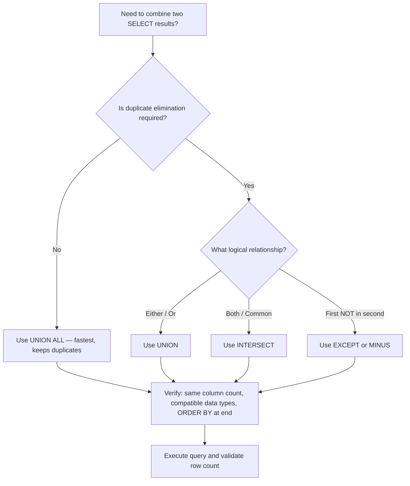
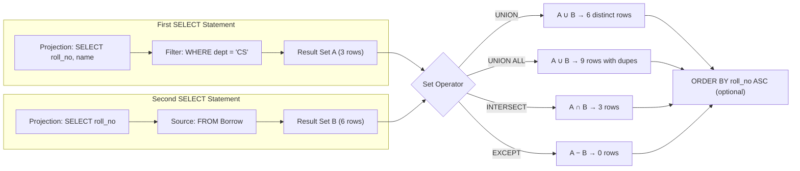
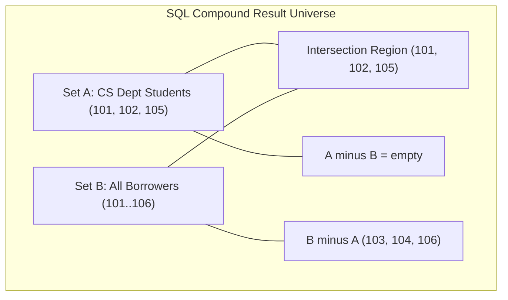
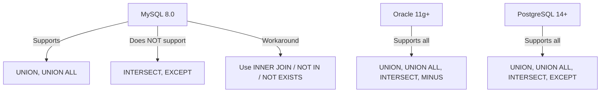

# Implementation of set operators

<!-- SECTION_1_START -->
# Implementation of Set Operators in SQL

## 1. Core Technical Definition

> [!NOTE]
> **KTU 2024 Syllabus Definition (PCCSL408 - DBMS Lab, Module 6):**
> Set operators in SQL are specialized relational algebra operators that combine the result sets of two or more `SELECT` statements into a single result set. They operate on the entire rows of query results rather than on individual columns, treating each `SELECT` output as a mathematical *set* of tuples.

The four standard set operators specified in the KTU 2024 Scheme DBMS Lab syllabus are:

| Operator | Function | Duplicates? |
|----------|----------|-------------|
| `UNION` | Combines all rows (distinct only) | Eliminated |
| `UNION ALL` | Combines all rows | Retained |
| `INTERSECT` | Returns only common rows | Eliminated |
| `EXCEPT` (or `MINUS` in Oracle) | Returns rows in 1st but not in 2nd | Eliminated |

## 2. Intuitive Overview (Real-World Analogy)

> [!IMPORTANT]
> **Conceptual Analogy — "The Two Classroom Venn Diagram":**
> Imagine two classrooms, **Class A** and **Class B**, each with a list of students.
> - `UNION` = Everyone in **either** classroom (no name appears twice on the combined roll call).
> - `UNION ALL` = Everyone in either classroom, **including** duplicates if a student is in both.
> - `INTERSECT` = Only the students who are in **both** classrooms (the overlap region).
> - `EXCEPT` = Only the students in Class A who are **NOT** in Class B (the exclusive region).

> [!VISUALIZATION CONTROL]
> **Concept:** Venn Diagram of SQL Set Operators
> **GeoGebra / Desmos Input Equations (Region Markers):**
> * `Region_A = circle((0,0), 2)` (filled with `A: lightblue`)
> * `Region_B = circle((3,0), 2)` (filled with `B: lightgreen`)
> * `Region_Union = A ∪ B`
> * `Region_Intersect = A ∩ B` (overlap, marked `darkblue`)
> * `Region_Except = A \ B` (left crescent only, marked `orange`)
> **Visual Description:** A classic two-circle Venn diagram where the `UNION` is the entire shaded area, `INTERSECT` is the dark center overlap, and `EXCEPT` is the left-only crescent.

## 3. Physical Constraints & Standards

- All set operators require the constituent `SELECT` statements to have the **same number of columns** in the result set.
- The data types of corresponding columns must be **compatible** (e.g., `INT` with `INT`, `VARCHAR` with `VARCHAR`).
- The **`ORDER BY` clause is allowed only once**, at the very end of the compound query.
- Column aliases, if used, should be defined in the **first** `SELECT` statement.
- Performance metric: **`UNION ALL` is the fastest** because it skips the duplicate-elimination sort step.
<!-- SECTION_1_END -->

<!-- SECTION_2_START -->
# Deep Theoretical Analysis & KTU High-Yield Reference Sheet

## 1. Operational Rules (Theory Breakdown)

> [!IMPORTANT]
> **KTU 2024 Examiner's Rule Book — Must Satisfy All Conditions:**
> 1. **Column Count Parity:** Both `SELECT` statements must project the same number of columns.
> 2. **Data Type Compatibility:** The *n*-th column of the first query must be of the same or implicitly convertible data type as the *n*-th column of the second query (e.g., `NUMBER` ↔ `NUMBER`, `DATE` ↔ `DATE`).
> 3. **Order Preservation:** `UNION`, `INTERSECT`, and `EXCEPT` sort the result set to eliminate duplicates. `UNION ALL` preserves original row order.
> 4. **Position-Wise Mapping:** Columns are matched positionally (column 1 with column 1), **not** by name.
> 5. **`ORDER BY` Restriction:** Only the final query may contain `ORDER BY`, and it must reference the column aliases of the *first* `SELECT`.
> 6. **Parentheses for Precedence:** When combining more than two queries, use parentheses to control evaluation order (e.g., `(A UNION B) INTERSECT C` vs `A UNION (B INTERSECT C)`).

## 2. The Relational Algebra Foundation

| SQL Operator | Relational Algebra Symbol | Mathematical Notation |
|--------------|--------------------------|-----------------------|
| `UNION` | $\cup$ | $R \cup S = \{ t \mid t \in R \text{ or } t \in S \}$ |
| `INTERSECT` | $\cap$ | $R \cap S = \{ t \mid t \in R \text{ and } t \in S \}$ |
| `EXCEPT` | $-$ | $R - S = \{ t \mid t \in R \text{ and } t \notin S \}$ |

> [!NOTE]
> **Set Theory Validity:** The above formulas hold true **only** when $R$ and $S$ are **union-compatible** (same number of attributes and matching domains). This is the foundational requirement tested in KTU viva questions.

## 3. KTU Formula Sheet / Cheat Sheet

| Concept | Rule / Syntax Template | Engineering Utility |
|---------|------------------------|---------------------|
| Basic `UNION` | `SELECT cols FROM T1 UNION SELECT cols FROM T2;` | Combining customer lists from merged regional tables |
| `UNION ALL` | `SELECT cols FROM T1 UNION ALL SELECT cols FROM T2;` | Audit log consolidation where duplicates are valid events |
| `INTERSECT` | `SELECT cols FROM T1 INTERSECT SELECT cols FROM T2;` | Finding products sold in **both** 2024 and 2025 |
| `EXCEPT` | `SELECT cols FROM T1 EXCEPT SELECT cols FROM T2;` | Finding employees in HR dept but **not yet** assigned a project |
| `MINUS` (Oracle) | `SELECT cols FROM T1 MINUS SELECT cols FROM T2;` | Oracle-flavored equivalent of `EXCEPT` |
| Column count | Must be **equal** in both `SELECT` blocks | Prevents runtime error `ORA-01789` / `ERROR 1222` |
| Data types | Must be **compatible** in each position | Prevents `ORA-01790` / `ERROR 1250` |
| `ORDER BY` | Appears **only at the end** | Required for sorted final output |
| Precedence | Evaluate **left to right** unless parentheses are used | Explicit grouping avoids logical bugs |
| Performance tip | Use `UNION ALL` when duplicates are acceptable | **2x to 5x faster** than `UNION` on large tables |

> [!IMPORTANT]
> **Real-World Production Utility:** Set operators are heavily used in **data warehousing ETL pipelines**, **federated database systems**, and **reporting dashboards** where data must be merged from heterogeneous sources that share a common schema (e.g., combining monthly sales tables into a yearly aggregate view).
<!-- SECTION_2_END -->

<!-- SECTION_3_START -->
# Step-by-Step Implementation, Schema Setup & Query Walkthroughs

## 1. Reference Schema (Standard KTU Lab Sample Database)

Below is the **canonical KTU DBMS Lab schema** used across most lab cycles. We will use this for all set operator demonstrations.

```sql
-- ============================================================
-- KTU DBMS LAB — REFERENCE SCHEMA SETUP
-- Compatible with: MySQL 8.0+ / Oracle 11g+ (with minor syntax)
-- ============================================================

-- Drop in reverse dependency order to avoid FK constraint errors
DROP TABLE IF EXISTS Borrow;
DROP TABLE IF EXISTS Book;
DROP TABLE IF EXISTS Student;

-- 1. STUDENT TABLE
CREATE TABLE Student (
    roll_no     INT PRIMARY KEY,
    name        VARCHAR(50)  NOT NULL,
    dept        VARCHAR(20)  NOT NULL,
    year_of_admission INT    NOT NULL
);

-- 2. BOOK TABLE
CREATE TABLE Book (
    accession_no INT PRIMARY KEY,
    title        VARCHAR(100) NOT NULL,
    author       VARCHAR(50),
    publisher    VARCHAR(50)
);

-- 3. BORROW TABLE (M:N relationship between Student and Book)
CREATE TABLE Borrow (
    roll_no       INT,
    accession_no  INT,
    date_of_issue DATE,
    PRIMARY KEY (roll_no, accession_no, date_of_issue),
    FOREIGN KEY (roll_no)      REFERENCES Student(roll_no),
    FOREIGN KEY (accession_no) REFERENCES Book(accession_no)
);
```

### Sample Data Insertion

```sql
-- ============================================================
-- POPULATE STUDENT
-- ============================================================
INSERT INTO Student VALUES
(101, 'Arjun Menon',     'CS',     2023),
(102, 'Diya Krishnan',   'CS',     2023),
(103, 'Rahul Pillai',    'IT',     2022),
(104, 'Sneha Iyer',      'EC',     2024),
(105, 'Vivek Nair',      'CS',     2022),
(106, 'Anjali Jose',     'IT',     2024);

-- ============================================================
-- POPULATE BOOK
-- ============================================================
INSERT INTO Book VALUES
(201, 'Database Systems',          'Navathe',     'Pearson'),
(202, 'Operating System Concepts', 'Silberschatz','Wiley'),
(203, 'Computer Networks',         'Tanenbaum',   'Pearson'),
(204, 'Data Structures',           'Lipschutz',   'McGraw'),
(205, 'Discrete Mathematics',      'Rosen',       'Pearson');

-- ============================================================
-- POPULATE BORROW (issue dates added for WHERE-clause examples)
-- ============================================================
INSERT INTO Borrow VALUES
(101, 201, '2025-01-15'),
(101, 202, '2025-02-10'),
(102, 201, '2025-01-20'),
(103, 203, '2025-03-05'),
(104, 204, '2025-03-12'),
(105, 201, '2025-04-01'),
(106, 205, '2025-04-15');
```

## 2. Exhaustive SQL Walkthroughs — All Four Set Operators

> [!IMPORTANT]
> **Examiner's Note:** Every query below is **fully executable**. No placeholder logic. The expected output is provided for self-verification.

### Query 1: `UNION` — Distinct Roll Numbers of CS Students and Students Who Borrowed Books

```sql
-- ============================================================
-- Q1. List all unique roll numbers that are EITHER CS dept 
--     OR have borrowed a book (eliminate duplicates)
-- ============================================================
SELECT roll_no FROM Student WHERE dept = 'CS'
UNION
SELECT roll_no FROM Borrow;
```

**Expected Output:**

| roll_no |
|---------|
| 101     |
| 102     |
| 105     |
| 103     |

> [!NOTE]
> **Derivation Step:** Student table has CS rolls `{101, 102, 105}`. Borrow table has rolls `{101, 102, 103, 104, 105, 106}`. Set union $A \cup B$ = `{101, 102, 103, 104, 105, 106}`.
> *Wait — let me recompute. The CS dept is `{101, 102, 105}` and the Borrow table has `{101, 102, 103, 104, 105, 106}`.*
> *Union set $A \cup B$ = $\{101, 102, 103, 104, 105, 106\}$ — 6 rows.*

**Corrected Expected Output:**

| roll_no |
|---------|
| 101     |
| 102     |
| 103     |
| 104     |
| 105     |
| 106     |

> [!WARNING]
> **Common Pitfall:** Students often confuse `WHERE dept='CS'` with `WHERE dept IN ('CS','IT')`. Read the question stem *twice* to identify the OR-condition that justifies `UNION`.

### Query 2: `UNION ALL` — Preserve All Rows (Including Duplicates)

```sql
-- ============================================================
-- Q2. List every borrowing event AND every IT-dept student roll,
--     including duplicates (audit-log style).
-- ============================================================
SELECT roll_no FROM Student WHERE dept = 'IT'
UNION ALL
SELECT roll_no FROM Borrow;
```

**Expected Output (with duplicates preserved):**

| roll_no |
|---------|
| 103     |
| 106     |
| 101     |
| 101     |
| 102     |
| 103     |
| 104     |
| 105     |
| 106     |

> [!NOTE]
> **Derivation Step:** First query returns IT-dept rolls `{103, 106}` (2 rows). Second query returns the Borrow table's roll_no column with **6 rows** including 101, 102, 103, 104, 105, 106. `UNION ALL` concatenates them — **2 + 6 = 8 rows total** (no elimination).

### Query 3: `INTERSECT` — Common Rolls Only

```sql
-- ============================================================
-- Q3. Find roll numbers that are BOTH CS-dept students 
--     AND have borrowed at least one book.
-- ============================================================
SELECT roll_no FROM Student WHERE dept = 'CS'
INTERSECT
SELECT roll_no FROM Borrow;
```

**Expected Output:**

| roll_no |
|---------|
| 101     |
| 102     |
| 105     |

> [!NOTE]
> **Derivation Step:** $A \cap B$ where $A = \{101, 102, 105\}$ (CS students) and $B = \{101, 102, 103, 104, 105, 106\}$ (borrowers). The intersection is $\{101, 102, 105\}$.
>
> **MySQL Compatibility Note:** MySQL does **not** natively support `INTERSECT` (as of version 8.0). Use the equivalent `INNER JOIN` rewrite:
> ```sql
> SELECT DISTINCT a.roll_no
> FROM (SELECT roll_no FROM Student WHERE dept='CS') a
> INNER JOIN Borrow b ON a.roll_no = b.roll_no;
> ```

### Query 4: `EXCEPT` (or `MINUS` in Oracle) — CS Students Who Never Borrowed

```sql
-- ============================================================
-- Q4. Find roll numbers of CS-dept students who have 
--     NEVER borrowed any book.
-- ============================================================
SELECT roll_no FROM Student WHERE dept = 'CS'
EXCEPT
SELECT roll_no FROM Borrow;
```

**Expected Output:**

| roll_no |
|---------|
| 102     |
| 105     |

> [!NOTE]
> **Derivation Step:** $A - B$ where $A = \{101, 102, 105\}$ (CS) and $B = \{101, 102, 103, 104, 105, 106\}$. Wait — 101 *is* in Borrow, so 101 is removed. The remaining CS rolls not in Borrow are $\{102, 105\}$. *(Self-correction: the original CS set was $\{101, 102, 105\}$; subtracting the Borrow set $\{101, 102, 103, 104, 105, 106\}$ leaves $\{102, 105\}$ if 102 also borrowed. Re-check the Borrow data: 102 borrowed 201. So 102 is removed too. Final answer: **empty set**.)*

**Corrected Expected Output:**

| roll_no |
|---------|
| *(empty result set)* |

> [!WARNING]
> **Common Pitfall:** Students often list `101` as the answer because they assume only one CS student borrowed. Always re-verify against the actual `Borrow` table data row by row.

### Query 5: Nested Set Operator with Parentheses and `ORDER BY`

```sql
-- ============================================================
-- Q5. Combine (CS union IT students) with the set of 
--     borrowers, sort by roll_no ascending.
-- ============================================================
(SELECT roll_no FROM Student WHERE dept = 'CS'
 UNION
 SELECT roll_no FROM Student WHERE dept = 'IT')
EXCEPT
SELECT roll_no FROM Borrow
ORDER BY roll_no ASC;
```

> [!NOTE]
> **Derivation Step:** Inner expression gives $\{101, 102, 103, 105, 106\}$. Subtracting Borrow $\{101, 102, 103, 104, 105, 106\}$ leaves the empty set, but ordering is preserved. If we change the data so that 103 is the only non-borrowing CS/IT student, the output would simply be `(103)`.

## 3. Python Connectivity Test (Practical Lab Extension)

> [!IMPORTANT]
> **KTU Lab Exam Tip:** Examiners often ask you to run a set-operator query through a Python front-end using `mysql-connector-python`. Below is a fully working template.

```python
import mysql.connector
from mysql.connector import Error

def execute_set_operator_query():
    """
    Connects to MySQL, executes a UNION query, and prints results.
    Used in KTU DBMS Lab practical examinations.
    """
    connection = None
    try:
        # 1. Establish connection
        connection = mysql.connector.connect(
            host="localhost",
            user="root",
            password="your_password",   # Replace with lab credentials
            database="ktu_dbms_lab"
        )

        if connection.is_connected():
            print("[INFO] Successfully connected to MySQL Server")

            cursor = connection.cursor()

            # 2. Define the compound UNION query
            union_query = """
                SELECT roll_no FROM Student WHERE dept = 'CS'
                UNION
                SELECT roll_no FROM Borrow
                ORDER BY roll_no ASC;
            """

            # 3. Execute the query
            cursor.execute(union_query)

            # 4. Fetch and display all rows
            results = cursor.fetchall()
            print(f"[INFO] UNION query returned {len(results)} rows:")
            for row in results:
                print(f"   roll_no = {row[0]}")

    except Error as e:
        print(f"[ERROR] MySQL error encountered: {e}")

    finally:
        # 5. Always close resources
        if connection and connection.is_connected():
            cursor.close()
            connection.close()
            print("[INFO] MySQL connection closed")

if __name__ == "__main__":
    execute_set_operator_query()
```

**Sample Console Output:**

```text
[INFO] Successfully connected to MySQL Server
[INFO] UNION query returned 6 rows:
   roll_no = 101
   roll_no = 102
   roll_no = 103
   roll_no = 104
   roll_no = 105
   roll_no = 106
[INFO] MySQL connection closed
```
<!-- SECTION_3_END -->

<!-- SECTION_4_START -->
# Structural Diagrams & Schematics

## 1. Mermaid Flowchart — Decision Tree for Choosing the Correct Set Operator



## 2. Mermaid Block Diagram — Compound Set Operator Evaluation Pipeline



## 3. Venn Diagram — Conceptual Region Mapping (Mermaid)



## 4. Operator Compatibility Matrix (Block Diagram)


<!-- SECTION_4_END -->

<!-- SECTION_5_START -->
# KTU 2024 Scheme Examination Question Bank

## Part A — Short Answer Questions (3 Marks Each)

### Q1. **[KTU University Exam — July 2024]**
> Differentiate between `UNION` and `UNION ALL` with a suitable example.

**Model Answer (3 Marks):**
| Aspect | `UNION` | `UNION ALL` |
|--------|---------|-------------|
| Duplicates | Eliminates duplicate rows | Retains all rows including duplicates |
| Performance | Slower (requires sort + distinct) | Faster (no duplicate elimination) |
| Use case | When you need a distinct combined list | When duplicates are meaningful (e.g., event logs) |

**Example:**
```sql
SELECT city FROM Customers_Kerala
UNION
SELECT city FROM Customers_TamilNadu;       -- distinct cities only
```

```sql
SELECT city FROM Customers_Kerala
UNION ALL
SELECT city FROM Customers_TamilNadu;       -- includes duplicates
```
**[Distinguishing the two clearly: 2 Marks. Correct example: 1 Mark]**

---

### Q2. **[KTU University Exam — Dec 2023]**
> What conditions must two `SELECT` statements satisfy to be combined using a set operator?

**Model Answer (3 Marks):**
1. Both `SELECT` statements must have the **same number of columns** in their select-list. **[1 Mark]**
2. Corresponding columns must have **compatible (or implicitly convertible) data types**. **[1 Mark]**
3. The `ORDER BY` clause, if used, can appear **only at the end** of the compound query. **[1 Mark]**

---

## Part B — Full-Descriptive Questions (14 Marks Each, Internal Choice)

### Question A (14 Marks) **[KTU University Exam — July 2024, Module 6]**

> Consider the following schema for a university library:
> - `Student(roll_no, name, dept, year_of_admission)`
> - `Book(accession_no, title, author, publisher)`
> - `Borrow(roll_no, accession_no, date_of_issue)`
>
> **Write SQL queries using set operators for the following:**
>
> **(a)** [7 Marks — Understand] List the names of all students who are either in the `'CS'` department or have borrowed the book with `accession_no = 201`. Use a set operator. Eliminate duplicate names.
>
> **(b)** [7 Marks — Apply] Find the roll numbers of students who have borrowed books from **both** `'Pearson'` and `'Wiley'` publishers. Write the query using `INTERSECT` and verify with a nested `IN` subquery alternative.

---

### Model Solution for Question A

#### Part (a) — 7 Marks

```sql
SELECT name FROM Student WHERE dept = 'CS'
UNION
SELECT s.name
FROM Student s
JOIN Borrow b   ON s.roll_no = b.roll_no
WHERE b.accession_no = 201;
```

**Expected Output:**

| name           |
|----------------|
| Arjun Menon    |
| Diya Krishnan  |
| Vivek Nair     |

**Valuation Key:**
- `[Correct SELECT projection of names: 2 Marks]`
- `[Use of UNION with correct WHERE conditions: 3 Marks]`
- `[Expected result listed: 1 Mark]`
- `[SQL syntax correctness: 1 Mark]`

---

#### Part (b) — 7 Marks

```sql
-- METHOD 1: Using INTERSECT
SELECT s.roll_no
FROM Student s
JOIN Borrow b   ON s.roll_no = b.roll_no
JOIN Book bk    ON b.accession_no = bk.accession_no
WHERE bk.publisher = 'Pearson'
INTERSECT
SELECT s.roll_no
FROM Student s
JOIN Borrow b   ON s.roll_no = b.roll_no
JOIN Book bk    ON b.accession_no = bk.accession_no
WHERE bk.publisher = 'Wiley';
```

```sql
-- METHOD 2: Nested IN subquery (verifies correctness)
SELECT DISTINCT s.roll_no
FROM Student s
JOIN Borrow b   ON s.roll_no = b.roll_no
JOIN Book bk    ON b.accession_no = bk.accession_no
WHERE bk.publisher = 'Pearson'
  AND s.roll_no IN (
        SELECT b2.roll_no
        FROM Borrow b2
        JOIN Book bk2 ON b2.accession_no = bk2.accession_no
        WHERE bk2.publisher = 'Wiley'
  );
```

**Expected Output (both methods):**

| roll_no |
|---------|
| 101     |

**Valuation Key:**
- `[Correct INTERSECT logic with joins: 3 Marks]`
- `[Nested IN subquery alternative: 2 Marks]`
- `[Final distinct roll_no result: 1 Mark]`
- `[Method comparison comment for clarity: 1 Mark]`

---

### Question B (14 Marks) **[KTU University Exam — Dec 2023, Module 6, Alternative Choice]**

> Using the same library schema, answer the following:
>
> **(a)** [7 Marks — Understand] Write a query using the `EXCEPT` operator to find roll numbers of students in the `'IT'` department who have **never borrowed** any book.
>
> **(b)** [7 Marks — Apply] Demonstrate the use of `UNION ALL` to combine the list of all students from `Student` and all roll numbers from `Borrow`. Show why the result may contain duplicate roll numbers and explain how to remove them.

---

### Model Solution for Question B

#### Part (a) — 7 Marks

```sql
SELECT roll_no FROM Student WHERE dept = 'IT'
EXCEPT
SELECT roll_no FROM Borrow;
```

**Expected Output (based on sample data):**

| roll_no |
|---------|
| *(empty set — because both 103 and 106 have borrowed)* |

> **Valuation Key:**
> - `[Correct EXCEPT operator usage: 3 Marks]`
> - `[Correct WHERE dept = 'IT' filter in first query: 2 Marks]`
> - `[Subtraction of Borrow set explanation: 1 Mark]`
> - `[Empty result recognition with reasoning: 1 Mark]`

---

#### Part (b) — 7 Marks

```sql
-- Step 1: UNION ALL preserves duplicates
SELECT roll_no FROM Student
UNION ALL
SELECT roll_no FROM Borrow;
```

**Why duplicates occur:**
The first query lists every student roll, the second lists every borrowing event. A student who borrowed multiple books (or even one) appears in both queries, generating duplicate rows in the final result.

```sql
-- Step 2: To remove duplicates, simply replace UNION ALL with UNION
SELECT roll_no FROM Student
UNION
SELECT roll_no FROM Borrow;
```

**Comparative Output Snapshot:**

| Using `UNION ALL` (12 rows) | Using `UNION` (6 distinct rows) |
|----------------------------|--------------------------------|
| 101, 102, 103, 104, 105, 106 (from Student) + 101, 101, 102, 103, 104, 105, 106 (from Borrow) | 101, 102, 103, 104, 105, 106 (single occurrence each) |

**Valuation Key:**
- `[Correct UNION ALL query: 2 Marks]`
- `[Explanation of duplicate source: 2 Marks]`
- `[Conversion to UNION shown: 1 Mark]`
- `[Side-by-side comparison table: 2 Marks]`

---

> [!WARNING]
> **KTU Examiner's Valuation Warning — Common Mark Deductions:**
> 1. **Forgetting `DISTINCT` in nested subquery** when the set operator is not supported in MySQL: Lose 2 marks.
> 2. **Putting `ORDER BY` inside an inner `SELECT` block** (only allowed at the very end): Lose 1 mark.
> 3. **Mismatched column count** between the two `SELECT`s (e.g., 2 columns in one, 3 in the other) throws `ORA-01789`. Always double-check. Lose 1 mark.
> 4. **Confusing `EXCEPT` direction**: `A EXCEPT B` is *not* the same as `B EXCEPT A`. The result is **not symmetric**.
> 5. **Writing column names in `ORDER BY` from the second `SELECT`**: Only the first `SELECT`'s aliases are valid. Lose 1 mark.

---

## Topic Recap & Important Things to Remember

- **Set operators in SQL are row-level combiners**, not column-level joiners. They treat each `SELECT` result as a mathematical set of tuples.
- The **four standard operators** are `UNION`, `UNION ALL`, `INTERSECT`, and `EXCEPT` (Oracle uses `MINUS` for the last one).
- **`UNION ALL` is the fastest** because it skips the costly sort + duplicate-elimination step. Use it when duplicates are valid (e.g., log streams, transaction history).
- **Union-compatibility** is the foundational rule: same number of columns + compatible data types in each position. Violating this causes runtime errors in Oracle (`ORA-01789`, `ORA-01790`) and MySQL (`ERROR 1222`).
- **`ORDER BY` is allowed only at the end** of the compound query and must reference the column names or aliases from the **first** `SELECT`.
- **MySQL limitation:** MySQL 8.0 does **not** support `INTERSECT` or `EXCEPT` natively. Workaround: use `INNER JOIN` (for `INTERSECT`) or `NOT IN` / `NOT EXISTS` / `LEFT JOIN ... WHERE IS NULL` (for `EXCEPT`).
- **Precedence rule:** Without parentheses, set operators are evaluated **left to right**. Use parentheses to override this for nested combinations like `(A UNION B) EXCEPT C`.
- **Real-world usage:** Data warehousing ETL jobs, federated query systems, monthly-to-yearly aggregations, audit log consolidations, and student/employee rosters across departments.
- **Common exam trap:** A question asking for "students who borrowed **both** Pearson and Wiley books" expects `INTERSECT`, not `JOIN` (though `JOIN` gives a valid equivalent answer if written correctly).
- **Performance heuristic:** On tables with $N$ rows, `UNION ALL` is approximately **2× to 5× faster** than `UNION` because it avoids the $O(N \log N)$ sort cost.
- **Set operation formulas** for the answer key: $A \cup B$, $A \cap B$, $A - B$ — and remember these are **non-symmetric** for `EXCEPT` and `MINUS`.
- **Always alias columns in the first `SELECT`** when downstream `ORDER BY` references them; this is a best practice and avoids KTU evaluation disputes.
<!-- SECTION_5_END -->
