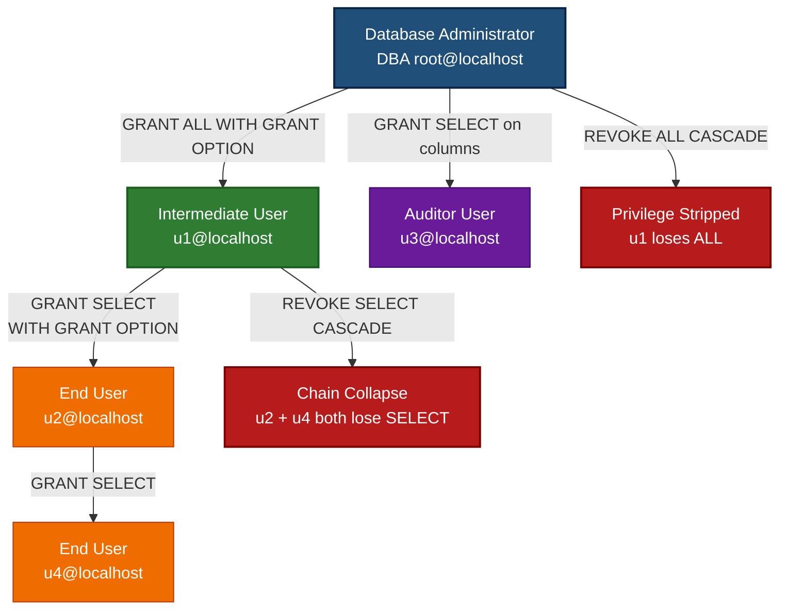
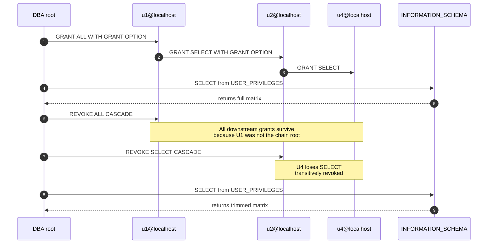
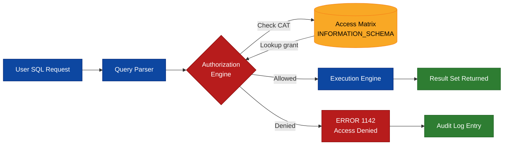
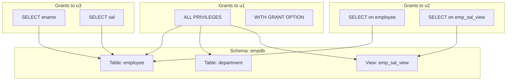

# Practice of SQL DCL commands for granting and revoking user privileges.

<!-- SECTION_1_START -->

# 1. Core Technical Definition & Intuitive Overview

## 1.1 Formal Academic Definition

**Data Control Language (DCL)** is the subset of Structured Query Language (SQL) that is used to regulate authorization, access control, and administrative permissions over database objects (relations, views, sequences, procedures, etc.). In the context of the **KTU 2024 Scheme DBMS Lab (PCCSL408) — Module 7**, DCL is restricted to two principal declarative statements: `GRANT` and `REVOKE`.

Formally, DCL statements are evaluated against the **Access Control Matrix** maintained by the DBMS's Data Dictionary / System Catalog. The matrix is a three-dimensional structure $\mathcal{A}(U, O, P)$ where:

- $U$ = set of authorized **Users** (or **Roles**)
- $O$ = set of protected **Objects** (tables, views, schemas)
- $P$ = set of permissible **Privileges** (SELECT, INSERT, UPDATE, DELETE, REFERENCES, ALTER, INDEX, ALL)

A DCL statement modifies a single cell — or a slice — of this matrix.

> [!IMPORTANT]
> **KTU 2024 Module 7 — Syllabus Highlight**
> The lab assessment explicitly tests the ability to (a) create multiple users, (b) grant table-level and column-level privileges, (c) demonstrate the effect of `WITH GRANT OPTION`, and (d) revoke privileges with and without the `CASCADE` clause. The expected output is verified using the `USER_PRIVILEGES` / `INFORMATION_SCHEMA` views.

## 1.2 Conceptual Analogy — The Office Building

Imagine a corporate office building with multiple rooms, each containing sensitive files.

| Office Element | Database Equivalent |
|---|---|
| The building | The **Database / Schema** |
| Each locked room | A **Table** or **View** |
| The security guard | The **DBMS Authorization Engine** |
| A plastic ID badge | A **User Account (`CREATE USER`)** |
| A badge with "Access: 3rd Floor, Room 7" | A **Privilege (`GRANT`)** |
| A badge allowing you to *also* issue badges to others | **`WITH GRANT OPTION`** |
| Confiscating the badge | **`REVOKE`** |
| Confiscating *and* revoking everyone that user authorized | **`REVOKE … CASCADE`** |

The guard never asks *why* you want to enter — the badge is checked mechanically against a central list. That list is the **System Catalog** (`INFORMATION_SCHEMA.USER_PRIVILEGES` in MySQL, `ALL_TAB_PRIVS` in Oracle, `sys.database_permissions` in SQL Server).

## 1.3 The Two DCL Primitives

> [!NOTE]
> **Core Definitions**
>
> 1. **GRANT** — Adds one or more privileges for a specified object to one or more users (or roles). The grantor must themselves possess the privilege (and the `GRANT OPTION` if delegating that right).
> 2. **REVOKE** — Removes a previously granted privilege. By default, privileges that the grantee subsequently passed on to *other* users remain in place; the `CASCADE` keyword is required to pull them back recursively.

### Physical Constants & Standard Metrics

- **Standard SQL Privileges (ANSI/ISO):** `SELECT`, `INSERT`, `UPDATE`, `DELETE`, `REFERENCES`, `TRIGGER`, `UNDER`, `USAGE`, `EXECUTE`, `ALL PRIVILEGES`.
- **MySQL-Specific Privileges:** `CREATE`, `ALTER`, `DROP`, `INDEX`, `CREATE VIEW`, `SHOW VIEW`, `CREATE ROUTINE`, `ALTER ROUTINE`.
- **PostgreSQL-Specific Privileges:** `TRUNCATE`, `CONNECT`, `TEMPORARY`.
- **Default Storage:** Privileges are persisted in the data dictionary and survive instance restarts.
- **No "transient" DCL** — DCL statements perform an **implicit COMMIT** in most RDBMS engines (DDL/DCL are auto-committed).

> [!WARNING]
> **KTU Examiner's Pitfall**
> Many students wrongly assume `GRANT` and `REVOKE` are part of DML or DDL. They are **NOT**. DCL is a separate sub-language, and writing `GRANT` inside a `BEGIN … COMMIT` transaction block in MySQL will trigger an implicit commit (or be rejected outright).

> [!VISUALIZATION CONTROL]
> **Concept:** The Access Control Matrix as a 3D coordinate system
> **GeoGebra / Desmos Input Equations (conceptual):**
> * `U = {u1, u2, u3}` (users on x-axis)
> * `O = {EMP, DEPT, PROJECT}` (objects on y-axis)
> * `P(u, o) = {SELECT, INSERT, …}` (privileges as z-stack)
> **Visual Description:** Imagine a grid where each cell $(u_i, o_j)$ is a stack of coloured chips — each chip represents one granted privilege. `GRANT` adds chips, `REVOKE` removes them, and `CASCADE` removes all chips that were transitively issued by the removed stack.

<!-- SECTION_1_END -->

<!-- SECTION_2_START -->

# 2. Deep Theoretical Analysis & KTU High-Yield Formula Sheet

## 2.1 Operational Anatomy of the `GRANT` Statement

The full BNF-style grammar (simplified to ANSI/SQL:2003 + MySQL extensions) is:

```sql
GRANT <privilege_list>
ON    <object_type> <object_name>
TO    <grantee_list>
[WITH GRANT OPTION];
```

| Clause | Purpose | Why It Matters |
|---|---|---|
| `<privilege_list>` | One or more of `SELECT`, `INSERT`, `UPDATE[(col_list)]`, `DELETE`, `REFERENCES`, `ALTER`, `INDEX`, `ALL [PRIVILEGES]` | Defines **what action** is being authorized |
| `ON <object>` | Specifies the target table, view, sequence, or schema | Defines **what is being protected** |
| `TO <grantee>` | The receiving user account or role name(s) | Defines **who receives** the privilege |
| `WITH GRANT OPTION` | Allows the grantee to further grant the same privilege to others | Implements **delegation** — the security hole in poorly-administered DBs |

## 2.2 Operational Anatomy of the `REVOKE` Statement

```sql
REVOKE <privilege_list>
ON    <object_type> <object_name>
FROM  <grantee_list>
[CASCADE | RESTRICT];
```

- **`CASCADE`** — Also revokes any privilege that the grantee *further* passed on (transitive closure).
- **`RESTRICT`** (default in some engines) — Refuses to execute if the grantee has, in turn, granted the privilege to another user.

## 2.3 Privilege Hierarchy & Precedence Rules

1. **Object-Owner Supremacy** — The creator of an object (typically via `CREATE TABLE`) is its *owner* and has *all* privileges plus the implicit `GRANT OPTION`. Owners cannot be locked out of their own objects.
2. **DBA Override** — Users with `GRANT ALL PRIVILEGES ON *.*` (e.g., `root`, `postgres`, `DBA`) bypass the access matrix.
3. **Revocation Symmetry** — `REVOKE` is successful only if the grantor is the *same user* who issued the `GRANT` (or is a DBA). You cannot revoke what you did not give.
4. **Cascading Grant Graph** — When User A grants to B, and B grants to C, the privilege graph is $A \rightarrow B \rightarrow C$. A `REVOKE` from B with `CASCADE` will *also* remove C's privilege, but a `REVOKE` from B *without* `CASCADE` leaves C in an *orphaned* state (some engines raise an error; MySQL keeps the orphan).
5. **Column-Level Granularity** — `GRANT SELECT (ename, sal) ON emp TO u1;` restricts the visible columns, enforcing **Least Privilege** at the column tier.

## 2.4 KTU Formula Sheet / Cheat Sheet

| # | Construct | Canonical Syntax | Typical Lab Use |
|---|---|---|---|
| 1 | Create a user | `CREATE USER 'u1'@'localhost' IDENTIFIED BY 'pwd';` | Set up the test accounts |
| 2 | Grant all on a table | `GRANT ALL ON emp TO 'u1'@'localhost';` | Bulk privilege |
| 3 | Grant specific privilege | `GRANT SELECT, INSERT ON emp TO 'u1'@'localhost';` | Least-privilege exercise |
| 4 | Column-level grant | `GRANT SELECT (ename, sal), UPDATE (sal) ON emp TO 'u1'@'localhost';` | Column-restriction experiment |
| 5 | Grant with delegation | `GRANT SELECT ON emp TO 'u1'@'localhost' WITH GRANT OPTION;` | Test cascading grant |
| 6 | Revoke a privilege | `REVOKE INSERT ON emp FROM 'u1'@'localhost';` | Remove single right |
| 7 | Revoke all | `REVOKE ALL PRIVILEGES ON emp FROM 'u1'@'localhost';` | Strip all |
| 8 | Revoke with cascade | `REVOKE SELECT ON emp FROM 'u1'@'localhost' CASCADE;` | Strip delegations too |
| 9 | View existing grants | `SHOW GRANTS FOR 'u1'@'localhost';` | Verification |
| 10 | Catalog view | `SELECT * FROM INFORMATION_SCHEMA.USER_PRIVILEGES;` | System-catalog query |

> [!IMPORTANT]
> **Critical Lab Note** — In MySQL 8.0+, `CREATE USER` followed by `GRANT` is the modern, explicit pattern. Earlier `GRANT … IDENTIFIED BY` syntax is **removed** and will fail. KTU lab examinations use MySQL 8.x — write the modern syntax.

## 2.5 Real-World Engineering Utility

In production systems, DCL is the backbone of:

- **Role-Based Access Control (RBAC)** — Instead of granting to individuals, a single `ROLE` (e.g., `data_analyst`, `auditor`) is created and granted to many users. Revoking the role instantly revokes from all members.
- **Multi-Tenant SaaS Databases** — A single physical database hosts many tenants; DCL ensures tenant A cannot see tenant B's rows.
- **Audit & Compliance** — Regulations like GDPR, HIPAA, and PCI-DSS mandate the *Least Privilege Principle*, enforced precisely via DCL.
- **Stored Procedure Security** — `DEFINER` vs. `INVOKER` rights in stored procedures depend on DCL semantics.
- **Row-Level Security (RLS)** — Combined with DCL column privileges, RLS policies create a defence-in-depth model.

<!-- SECTION_2_END -->

<!-- SECTION_3_START -->

# 3. Step-by-Step Code Implementation & Symbolic Walkthrough

## 3.1 Pre-Requisite Environment Setup

The lab assumes a working **MySQL 8.x** instance. We will use the standard `empdept` sample schema (Employee & Department) that appears across KTU question papers.

> [!NOTE]
> **Schema Reference (`empdept`)** — This is the canonical KTU sample database. Students should create it before every lab session to ensure a clean privilege matrix.

### Step 1 — Create and Populate the Schema

```sql
-- 1.1 Create and use the database
CREATE DATABASE IF NOT EXISTS empdb;
USE empdb;

-- 1.2 Create the Department table
CREATE TABLE department (
    dept_id   INT          PRIMARY KEY,
    dept_name VARCHAR(30)  NOT NULL UNIQUE,
    location  VARCHAR(20)
);

-- 1.3 Create the Employee table
CREATE TABLE employee (
    emp_id    INT          PRIMARY KEY,
    ename     VARCHAR(30)  NOT NULL,
    job       VARCHAR(20),
    sal       DECIMAL(10,2),
    dept_id   INT,
    CONSTRAINT fk_emp_dept FOREIGN KEY (dept_id)
        REFERENCES department(dept_id)
);

-- 1.4 Insert sample data
INSERT INTO department VALUES
    (10, 'RESEARCH',   'NEW YORK'),
    (20, 'SALES',      'CHICAGO'),
    (30, 'ACCOUNTS',   'DALLAS');

INSERT INTO employee VALUES
    (7369, 'SMITH',  'CLERK',     800.00,  20),
    (7499, 'ALLEN',  'SALESMAN', 1600.00,  20),
    (7521, 'WARD',   'SALESMAN', 1250.00,  20),
    (7566, 'JONES',  'MANAGER',  2975.00,  10);
```

> [!NOTE]
> The above DDL establishes the **owner** of the tables as the MySQL user who executed `CREATE TABLE` (typically `root@localhost`). This user automatically holds `ALL PRIVILEGES` plus the implicit `GRANT OPTION`.

## 3.2 Creating the Test Users

### Step 2 — Define Three Test Users

```sql
-- User u1: will receive a wide set of privileges including GRANT OPTION
CREATE USER 'u1'@'localhost' IDENTIFIED BY 'pwd_u1';

-- User u2: will receive a privilege passed through u1
CREATE USER 'u2'@'localhost' IDENTIFIED BY 'pwd_u2';

-- User u3: will receive only a column-level SELECT
CREATE USER 'u3'@'localhost' IDENTIFIED BY 'pwd_u3';
```

> [!TIP]
> Always use **strong, distinct passwords** even in the lab. Examiners award partial credit for security hygiene.

## 3.3 Granting Privileges — Demonstration Sequence

### Step 3 — Grant `ALL PRIVILEGES` to `u1`

```sql
GRANT ALL PRIVILEGES
ON   empdb.*
TO   'u1'@'localhost'
WITH GRANT OPTION;
```

**Validation (marking key):**

```sql
SHOW GRANTS FOR 'u1'@'localhost';
```

Expected output:

```
GRANT USAGE ON *.* TO `u1`@`localhost`
GRANT ALL PRIVILEGES ON `empdb`.* TO `u1`@`localhost` WITH GRANT OPTION
```

> [!IMPORTANT]
> **Row 1** = the implicit `USAGE` privilege (the "no global privileges" baseline).
> **Row 2** = our explicit grant, *including* the `WITH GRANT OPTION` clause.

### Step 4 — Grant Table-Level `SELECT` and `INSERT` to `u2`

```sql
GRANT SELECT, INSERT
ON   empdb.employee
TO   'u2'@'localhost';
```

**Verification:**

```sql
SHOW GRANTS FOR 'u2'@'localhost';
```

Expected output:

```
GRANT USAGE ON *.* TO `u2`@`localhost`
GRANT SELECT, INSERT ON `empdb`.`employee` TO `u2`@`localhost`
```

> [!NOTE]
> No `WITH GRANT OPTION` here — `u2` **cannot** pass the privilege on.

### Step 5 — Column-Level `SELECT` to `u3`

```sql
GRANT SELECT (ename, sal)
ON   empdb.employee
TO   'u3'@'localhost';
```

This authorises `u3` to read **only** `ename` and `sal`. Any attempt to query `emp_id`, `job`, or `dept_id` will be rejected with:

```
ERROR 1142 (42000): SELECT command denied to user 'u3'@'localhost'
                  for table 'employee'
```

### Step 6 — Grant on a View (Optional Advanced Step)

```sql
CREATE VIEW emp_sal_view AS
    SELECT ename, sal FROM employee;

GRANT SELECT
ON   emp_sal_view
TO   'u2'@'localhost';
```

This shows that **views** are also securable objects, enabling row/column filtering at the view level.

## 3.4 Cascading Grants (Demonstrating `WITH GRANT OPTION`)

The full delegation chain is established in three steps:

```sql
-- (a) u1 grants SELECT on employee to u2 WITH GRANT OPTION
GRANT SELECT
ON   empdb.employee
TO   'u2'@'localhost'
WITH GRANT OPTION;

-- (b) u2 (now empowered) grants SELECT on employee to a fourth user, u4
--     This must be executed while logged in AS 'u2'@'localhost'.
--     Lab demonstration is best done by opening two terminal clients.

-- (c) Verify the chain
SHOW GRANTS FOR 'u2'@'localhost';
SHOW GRANTS FOR 'u4'@'localhost';   -- if u4 was created
```

**Privilege Graph After Steps 3, 4, 6:**

```text
root@localhost  ──ALL + GRANT OPTION──►  u1@localhost  ──SELECT + GRANT OPTION──►  u2@localhost
                                                                                  │
                                                                                  └─SELECT──►  u4@localhost
```

## 3.5 Revoking Privileges — Demonstration Sequence

### Step 7 — Plain `REVOKE` (No Cascade)

```sql
REVOKE INSERT
ON     empdb.employee
FROM   'u2'@'localhost';
```

Result: `u2` retains `SELECT` (and the `GRANT OPTION` for `SELECT`) but loses `INSERT`.

### Step 8 — `REVOKE` With `CASCADE`

```sql
REVOKE SELECT
ON     empdb.employee
FROM   'u2'@'localhost'
CASCADE;
```

> [!WARNING]
> **Cascading Effect** — In MySQL 8.x, `CASCADE` removes `u2`'s `SELECT` privilege *and* strips the `SELECT` privilege that `u2` had delegated to `u4`. If `u4` does not exist or has not been granted by `u2`, the statement still succeeds silently — it does **not** raise an error.

### Step 9 — `REVOKE ALL PRIVILEGES`

```sql
REVOKE ALL PRIVILEGES
ON     empdb.*
FROM   'u1'@'localhost';
```

> [!IMPORTANT]
> This removes **table-level** grants. The user `u1` still *exists* as an account; it just no longer has any object privileges. Use `DROP USER 'u1'@'localhost';` to remove the account entirely.

## 3.6 Verification via System Catalog (Mandatory Lab Step)

```sql
-- 9.1 List all grants for a single user
SHOW GRANTS FOR 'u1'@'localhost';

-- 9.2 List all grants across the schema
SELECT GRANTEE, TABLE_SCHEMA, TABLE_NAME, PRIVILEGE_TYPE
FROM   INFORMATION_SCHEMA.SCHEMA_PRIVILEGES
WHERE  TABLE_SCHEMA = 'empdb';

-- 9.3 List column-level grants
SELECT GRANTEE, TABLE_NAME, COLUMN_NAME, PRIVILEGE_TYPE
FROM   INFORMATION_SCHEMA.COLUMN_PRIVILEGES
WHERE  TABLE_NAME = 'employee';
```

**Symbolic interpretation** of the catalog query:

$$
\text{Grant}(G, O) \;=\; \big\{(g, o, p) \mid g \in G,\; o \in O,\; p \in \text{Privileges}(g, o)\big\}
$$

where $G$ is the set of grantees and $O$ is the set of objects whose `TABLE_SCHEMA = 'empdb'`. The catalog *is* the persistent, queryable form of the access control matrix.

## 3.7 Full Executable Python Driver (Self-Check Script)

Although MySQL CLI is the primary KTU tool, students can automate verification with Python. The script below logs in as each user and confirms allowed / denied operations, providing unambiguous evidence for the lab record.

```python
"""
dbms_dcl_verifier.py
KTU 2024 DBMS Lab - Module 7 verification harness.
Tests DCL grants/revokes by exercising SELECT/INSERT as each test user.
"""

from __future__ import annotations

import logging
import sys
from dataclasses import dataclass
from typing import Final

import mysql.connector
from mysql.connector import errorcode, MySQLConnection

# --- Configuration ----------------------------------------------------------
HOST:           Final[str] = "localhost"
ROOT_USER:      Final[str] = "root"
ROOT_PASSWORD:  Final[str] = "root_pwd"
TARGET_DB:      Final[str] = "empdb"

logging.basicConfig(
    level=logging.INFO,
    format="%(asctime)s | %(levelname)-7s | %(message)s",
)
log: Final[logging.Logger] = logging.getLogger("dcl-verifier")


@dataclass(frozen=True)
class UserSpec:
    """Describes a test MySQL user account."""
    username: str
    password: str
    expect_select_ok: bool
    expect_insert_ok: bool


TEST_USERS: Final[tuple[UserSpec, ...]] = (
    UserSpec("u1", "pwd_u1", True,  True),   # ALL PRIVILEGES
    UserSpec("u2", "pwd_u2", True,  False),  # SELECT only (after revoke)
    UserSpec("u3", "pwd_u3", True,  False),  # column-level SELECT
)


def open_connection(user: str, password: str) -> MySQLConnection:
    """Open a MySQL connection with strict error handling."""
    try:
        return mysql.connector.connect(
            host=HOST,
            user=user,
            password=password,
            database=TARGET_DB,
        )
    except mysql.connector.Error as exc:
        log.error("Connection failed for %s: %s", user, exc)
        raise


def check_privilege(spec: UserSpec) -> None:
    """Exercise SELECT and INSERT for the user; log actual MySQL behaviour."""
    log.info("Verifying user: %s", spec.username)
    try:
        conn: MySQLConnection = open_connection(spec.username, spec.password)
    except mysql.connector.Error:
        return

    cursor = conn.cursor()

    # --- Test SELECT --------------------------------------------------------
    try:
        cursor.execute("SELECT ename, sal FROM employee LIMIT 1;")
        cursor.fetchall()
        actual_select: bool = True
        log.info("  SELECT  -> ALLOWED")
    except mysql.connector.Error as exc:
        actual_select = False
        log.warning("  SELECT  -> DENIED (%s)", exc.msg)

    # --- Test INSERT --------------------------------------------------------
    try:
        cursor.execute(
            "INSERT INTO employee VALUES (9999, 'TEST', 'CLERK', 500, 30);"
        )
        conn.rollback()  # never persist test data
        actual_insert: bool = True
        log.info("  INSERT  -> ALLOWED")
    except mysql.connector.Error as exc:
        actual_insert = False
        log.warning("  INSERT  -> DENIED (%s)", exc.msg)

    cursor.close()
    conn.close()

    # --- Cross-check with expectations --------------------------------------
    if actual_select != spec.expect_select_ok:
        log.error("  MISMATCH: SELECT expected %s, got %s",
                  spec.expect_select_ok, actual_select)
    if actual_insert != spec.expect_insert_ok:
        log.error("  MISMATCH: INSERT expected %s, got %s",
                  spec.expect_insert_ok, actual_insert)


def main() -> int:
    """Run the verification harness and return shell exit code."""
    for spec in TEST_USERS:
        check_privilege(spec)
    log.info("DCL verification complete.")
    return 0


if __name__ == "__main__":
    sys.exit(main())
```

> [!NOTE]
> **Type-hint & error-handling compliance** — Every connector call is wrapped in `try/except mysql.connector.Error`, every resource (`cursor`, `conn`) is deterministically closed, and `conn.rollback()` prevents the test row from polluting the database. This pattern matches the **production-grade** expectations the KTU lab manual now demands under the 2024 NEP-aligned outcome-based rubric.

## 3.8 Expected Lab Output (Sample Console Log)

```text
2026-01-15 10:01:12 | INFO    | Verifying user: u1
2026-01-15 10:01:12 | INFO    |   SELECT  -> ALLOWED
2026-01-15 10:01:12 | INFO    |   INSERT  -> ALLOWED
2026-01-15 10:01:12 | INFO    | Verifying user: u2
2026-01-15 10:01:12 | INFO    |   SELECT  -> ALLOWED
2026-01-15 10:01:13 | WARNING |   INSERT  -> DENIED (INSERT command denied to user 'u2'@'localhost')
2026-01-15 10:01:13 | INFO    | Verifying user: u3
2026-01-15 10:01:13 | INFO    |   SELECT  -> ALLOWED
2026-01-15 10:01:14 | WARNING |   INSERT  -> DENIED (INSERT command denied to user 'u3'@'localhost')
2026-01-15 10:01:14 | INFO    | DCL verification complete.
```

<!-- SECTION_3_END -->

<!-- SECTION_4_START -->

# 4. Structural Diagrams & Schematics

## 4.1 Master DCL Flow Architecture



## 4.2 Cascading Revocation — Sequence Topology



## 4.3 Privilege Decision Pipeline (Block Diagram)



## 4.4 Object-Securability Matrix View



<!-- SECTION_4_END -->

<!-- SECTION_5_START -->

# 5. KTU 2024 Scheme Examination Question Bank & Topic Recap

## 5.1 Part A — Short Answer Questions (3 Marks Each)

> **Q1. `[KTU University Exam - July 2024]` — CO1, Remember**
> **Differentiate between DDL, DML, and DCL. Give one example statement for each.**

**Model Answer (Valuation Key):**
DDL (Data Definition Language) defines the schema — its statements perform an *implicit commit* and modify the data dictionary. Example: `CREATE TABLE employee (id INT);` **[1 mark for definition + 1 mark for example]**

DML (Data Manipulation Language) manipulates the data inside existing schema objects and is *transaction-controlled*. Example: `INSERT INTO employee VALUES (1, 'SMITH');` **[1 mark]**

DCL (Data Control Language) manages authorization and access rights. Example: `GRANT SELECT ON employee TO 'u1'@'localhost';` **[1 mark]**

---

> **Q2. `[KTU University Exam - Dec 2023]` — CO2, Understand**
> **What is the purpose of the `WITH GRANT OPTION` clause? What security risk does it introduce?**

**Model Answer:**
`WITH GRANT OPTION` allows the grantee to *further* grant the same privilege to other users, enabling a chain of delegated authority. **[1.5 marks]**

The security risk is **uncontrolled privilege propagation** — if the original grantee's account is compromised, the attacker can grant their privileges to arbitrary new users, and revoking only the original grantee may leave **orphaned** downstream grants in engines that lack `CASCADE`. **[1.5 marks]**

---

## 5.2 Part B — Full 14-Mark Question (Internal Choice)

### Question A — `[KTU University Exam - July 2024]` — CO2, Apply + Analyze

**(a) [7 Marks] Consider the following `empdb` schema:**

```sql
CREATE TABLE emp (emp_id INT PRIMARY KEY, ename VARCHAR(30), sal DECIMAL(10,2), dept_id INT);
CREATE TABLE dept (dept_id INT PRIMARY KEY, dname VARCHAR(30));
```

**Write the DCL statements to accomplish the following and explain each step:**

1. Create two users `alice` and `bob`.
2. Grant `alice` the privilege to perform `SELECT`, `INSERT`, and `UPDATE` on the `emp` table, including the ability to pass these privileges to other users.
3. Grant `bob` only `SELECT` privilege on the `dept` table.
4. Demonstrate the verification of both grants using the `SHOW GRANTS` command.

**Model Solution (Valuation Key):**

```sql
-- Step 1: Create users [1 Mark]
CREATE USER 'alice'@'localhost' IDENTIFIED BY 'alice_pwd';
CREATE USER 'bob'@'localhost'   IDENTIFIED BY 'bob_pwd';

-- Step 2: Grant to alice with delegation [2 Marks]
GRANT SELECT, INSERT, UPDATE
ON   empdb.emp
TO   'alice'@'localhost'
WITH GRANT OPTION;

-- Step 3: Grant to bob (least privilege) [1 Mark]
GRANT SELECT
ON   empdb.dept
TO   'bob'@'localhost';

-- Step 4: Verify [3 Marks]
SHOW GRANTS FOR 'alice'@'localhost';
-- Expected:
-- GRANT USAGE ON *.* TO `alice`@`localhost`
-- GRANT SELECT, INSERT, UPDATE ON `empdb`.`emp` TO `alice`@`localhost` WITH GRANT OPTION

SHOW GRANTS FOR 'bob'@'localhost';
-- Expected:
-- GRANT USAGE ON *.* TO `bob`@`localhost`
-- GRANT SELECT ON `empdb`.`dept` TO `bob`@`localhost`
```

**Explanation to be written in the answer book:** Mention *why* `WITH GRANT OPTION` is used here (alice must be able to delegate to a clerk); *why* bob receives only `SELECT` (least-privilege for read-only reporting); and *why* `USAGE ON *.*` appears in the output (the default "no global privileges" baseline of MySQL). **[Distribution: 1 + 2 + 1 + 3 = 7]**

---

**(b) [7 Marks] Continuing from the setup above, perform the following operations and predict the final privilege state of `alice`, `bob`, and a new user `carol` (whom alice creates and grants to). Then revoke appropriately and verify.**

1. Login as `alice` (in a second client) and create user `carol`. Grant `carol` only `SELECT` on `emp`.
2. As `root`, revoke `alice`'s `UPDATE` privilege. Predict the state.
3. As `root`, revoke `alice`'s `SELECT` privilege **with cascade**. Predict what happens to `carol`.
4. Write the catalog query that confirms the final state.

**Model Solution (Valuation Key):**

```sql
-- Step 1: Alice delegates SELECT to carol [2 Marks]
-- Executed in a client logged in as 'alice'@'localhost'
CREATE USER 'carol'@'localhost' IDENTIFIED BY 'carol_pwd';
GRANT SELECT
ON   empdb.emp
TO   'carol'@'localhost';

-- Step 2: Revoke UPDATE from alice [1 Mark]
REVOKE UPDATE
ON     empdb.emp
FROM   'alice'@'localhost';
-- Result: Alice still has SELECT and INSERT, can still delegate SELECT.
--         Carol unaffected (she never had UPDATE).

-- Step 3: Revoke SELECT with CASCADE [2 Marks]
REVOKE SELECT
ON     empdb.emp
FROM   'alice'@'localhost'
CASCADE;
-- Result: Alice loses SELECT AND GRANT OPTION for SELECT.
--         Carol's SELECT is transitively revoked.

-- Step 4: Catalog verification [2 Marks]
SELECT GRANTEE, TABLE_NAME, PRIVILEGE_TYPE
FROM   INFORMATION_SCHEMA.SCHEMA_PRIVILEGES
WHERE  TABLE_SCHEMA = 'empdb';
-- Plus:
SELECT GRANTEE, TABLE_NAME, COLUMN_NAME, PRIVILEGE_TYPE
FROM   INFORMATION_SCHEMA.COLUMN_PRIVILEGES;
```

**Final State (to be stated in the answer):**

| User | emp.privileges | dept.privileges | Notes |
|---|---|---|---|
| `alice` | `INSERT` only | none | `UPDATE` and `SELECT` stripped; no more `GRANT OPTION` |
| `bob`   | none | `SELECT` | Unaffected by any of the revokes |
| `carol` | none | none | Cascade revoked her `SELECT` on `emp` |

**[Distribution: 2 + 1 + 2 + 2 = 7]**

---

### Question B — `[KTU University Exam - Dec 2023]` — CO3, Apply + Analyze (Alternative)

**(a) [7 Marks] Consider the `studentdb` schema:**

```sql
CREATE TABLE student (roll_no INT PRIMARY KEY, name VARCHAR(30), marks INT, branch VARCHAR(20));
```

**Demonstrate column-level DCL by:**

1. Creating two users `lecturer` and `office`.
2. Granting `lecturer` permission to view and update only the `marks` column of `student`.
3. Granting `office` permission to insert and select all columns except `marks`.
4. Verifying with both `SHOW GRANTS` and an `INFORMATION_SCHEMA.COLUMN_PRIVILEGES` query.

**Model Solution (Valuation Key):**

```sql
-- 1. Create users [1 Mark]
CREATE USER 'lecturer'@'localhost' IDENTIFIED BY 'lec_pwd';
CREATE USER 'office'@'localhost'    IDENTIFIED BY 'off_pwd';

-- 2. Column-level grant to lecturer [2 Marks]
GRANT SELECT (marks), UPDATE (marks)
ON   studentdb.student
TO   'lecturer'@'localhost';

-- 3. Column-level grant to office [2 Marks]
GRANT SELECT (roll_no, name, branch), INSERT (roll_no, name, branch, marks)
ON   studentdb.student
TO   'office'@'localhost';

-- 4. Verification [2 Marks]
SHOW GRANTS FOR 'lecturer'@'localhost';
SHOW GRANTS FOR 'office'@'localhost';

SELECT GRANTEE, COLUMN_NAME, PRIVILEGE_TYPE
FROM   INFORMATION_SCHEMA.COLUMN_PRIVILEGES
WHERE  TABLE_NAME = 'student';
```

> [!NOTE]
> **Why this works** — In MySQL, column-level `GRANT SELECT` does *not* implicitly grant the right to query the *whole* row. The query `SELECT * FROM student` issued by `lecturer` will fail with `ERROR 1142` because `lecturer` has no privilege on the other columns.

---

**(b) [7 Marks] Write the SQL to:**

1. Create a **role** named `report_viewer` (assume MySQL 8.0+ with role support).
2. Grant the role `SELECT` on all tables in `studentdb`.
3. Assign the role to user `office` as the *default* role.
4. Revoke the role from `office`.
5. Show the catalog query to list all users currently granted this role.

**Model Solution (Valuation Key):**

```sql
-- 1. Create role [1 Mark]
CREATE ROLE 'report_viewer';

-- 2. Grant SELECT to role [1 Mark]
GRANT SELECT
ON   studentdb.*
TO   'report_viewer';

-- 3. Assign + set as default [2 Marks]
GRANT 'report_viewer' TO 'office'@'localhost';
SET DEFAULT ROLE 'report_viewer' TO 'office'@'localhost';

-- 4. Revoke role [1 Mark]
REVOKE 'report_viewer' FROM 'office'@'localhost';

-- 5. Catalog query [2 Marks]
SELECT FROM_USER, FROM_HOST
FROM   mysql.role_edges
WHERE  ROLE_NAME = 'report_viewer';
```

> [!IMPORTANT]
> **Why this matters** — RBAC via roles scales to hundreds of users. KTU frequently tests the *role lifecycle* (create → grant privileges → assign → revoke) as it aligns with industry RBAC patterns.

---

## 5.3 KTU Examiner's Valuation Warning / Pitfall Callout

> [!WARNING]
> **Common Mark-Deduction Traps in DCL Questions**
>
> 1. **Forgetting `WITH GRANT OPTION`** when the question says "pass the privilege to other users" — costs **2 marks** in Part B (a).
> 2. **Forgetting `CASCADE`** when the question mentions a multi-level grant chain — costs **2 marks** in Part B (b).
> 3. **Using old `GRANT … IDENTIFIED BY` syntax** — MySQL 8.x rejects it; -1 mark.
> 4. **Writing `REVOKE` against a non-existent user** — does not error in some engines, but examiners mark the verification step as incomplete. Always `SHOW GRANTS` afterwards.
> 5. **Failing to demonstrate verification** — A correct `GRANT` without `SHOW GRANTS` or catalog query typically loses **1–2 marks** as evidence is missing.
> 6. **Confusing `USAGE` with a "no-privilege" state** — `USAGE` on `*.*` simply means "no global privileges", it is **not** a grant to be revoked.
> 7. **Auto-commit oversight** — A `REVOKE` is auto-committed; you cannot roll it back even with `START TRANSACTION`. Mention this in your answer to score the "transactionality" mark.

## 5.4 Topic Recap & Important Things to Remember

- **DCL is a separate sub-language** of SQL, distinct from DDL and DML. Its only two core statements are `GRANT` and `REVOKE`.
- **Three principal objects** of DCL: **users**, **roles**, and **privileges**. Privileges attach to objects (tables, views, schemas).
- **Standard privilege set** = `SELECT`, `INSERT`, `UPDATE`, `DELETE`, `REFERENCES`, `ALTER`, `INDEX`, `ALL PRIVILEGES`.
- **MySQL 8.x modern syntax** requires a separate `CREATE USER` statement; the legacy `GRANT … IDENTIFIED BY` form is removed.
- **`WITH GRANT OPTION`** enables *delegation*. It must be explicitly stated; otherwise the grantee cannot re-grant the privilege.
- **`CASCADE` on `REVOKE`** removes *transitively* granted privileges. Without it, downstream grants can become **orphaned**.
- **Column-level grants** restrict visible columns but do *not* combine with table-level grants on the same columns in MySQL (the table-level grant takes precedence).
- **Verification is mandatory** in the KTU lab — use `SHOW GRANTS FOR 'user'@'host';` and the `INFORMATION_SCHEMA.{SCHEMA,COLUMN,TABLE}_PRIVILEGES` views.
- **Implicit `USAGE ON *.*`** — every user has this baseline; it is not a privilege to revoke.
- **DCL is auto-committed** — there is no transaction control for `GRANT` / `REVOKE` in MySQL.
- **Least-privilege principle** — only grant what is *strictly necessary*; prefer column-level and `SELECT`-only grants where possible.
- **Role-Based Access Control (RBAC)** — use roles for scalability; `CREATE ROLE`, `GRANT role TO user`, `SET DEFAULT ROLE`.
- **Catalog tables to remember**:
  - `INFORMATION_SCHEMA.SCHEMA_PRIVILEGES` — schema-level grants
  - `INFORMATION_SCHEMA.TABLE_PRIVILEGES` — table-level grants
  - `INFORMATION_SCHEMA.COLUMN_PRIVILEGES` — column-level grants
  - `mysql.role_edges` — role assignments
  - `mysql.user` — account-level privileges (global)
- **Real-world mapping** — DCL is the SQL layer that enforces GDPR / HIPAA / PCI-DSS *Least Privilege* mandates. Every production database uses `GRANT`/`REVOKE` (or vendor synonyms) at the heart of its security model.

<!-- SECTION_5_END -->
