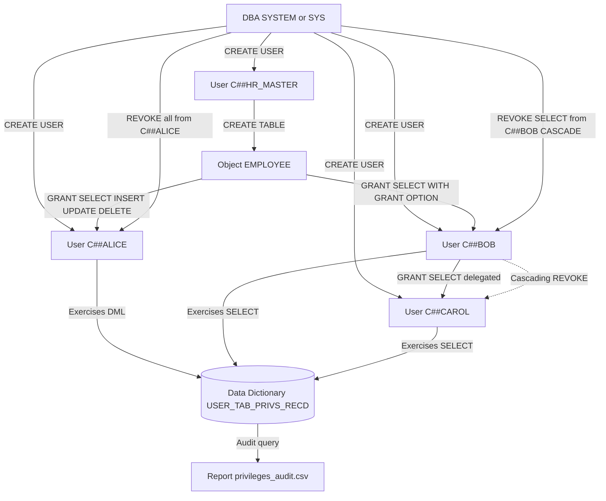
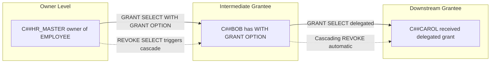
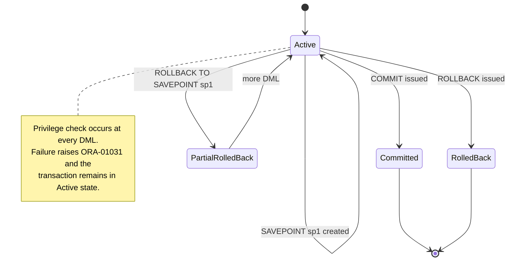
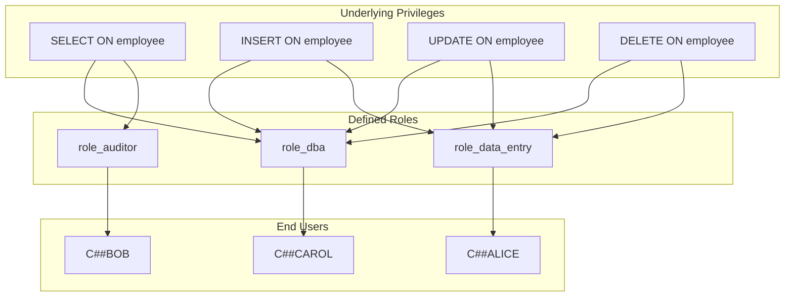

# Practice of SQL DCL commands for granting user privileges

<!-- SECTION_1_START -->
# SQL DCL Commands: User Privilege Management

## 1. Core Technical Definition

**Data Control Language (DCL)** is a subset of SQL used to control access, authorization, and permission management within a relational database management system (RDBMS). DCL provides database administrators (DBAs) with the ability to define who can access the database, what operations they can perform, and on which database objects those operations are permitted.

According to the **KTU 2024 Scheme (PCCSL408 – DBMS Lab)** Module 7 syllabus, DCL forms the security backbone of any multi-user database system, working in tandem with **DDL** (Data Definition Language) and **DML** (Data Manipulation Language).

The two primary DCL commands mandated in the syllabus are:

- **GRANT** $\rightarrow$ Provides specific privileges to a user or role.
- **REVOKE** $\rightarrow$ Withdraws previously granted privileges.

> [!IMPORTANT]
> **KTU Syllabus Highlight (PCCSL408 – Module 7):** Students must *practically execute* GRANT and REVOKE statements on a live RDBMS (Oracle 21c Express Edition is the KTU-prescribed environment), and verify privilege enforcement by logging in as different users.

### Conceptual Analogy: The Office Building Access Card

Imagine a corporate office building (the **Database**):

- The building itself is the **database** containing many rooms (tables, views, procedures).
- The **DBA** (Database Administrator) is the head of security who decides who gets keys to which rooms.
- When a new employee joins, the security head issues an access card (the **GRANT** command) specifying which rooms they may enter and what they can do there (read files = **SELECT**, add files = **INSERT**, modify files = **UPDATE**, remove files = **DELETE**).
- When an employee leaves or changes role, the security head deactivates their card (the **REVOKE** command), restricting or removing their access.
- A **role** is like a pre-printed template access card for "Manager" or "Intern" — all managers receive the same set of access rights without configuring each one individually.

This card-based metaphor captures the essence of DCL: **controlled, auditable, and revocable access** to data resources.

### Core DCL Command Set

| Command | Purpose | Standard Syntax Form |
| :--- | :--- | :--- |
| **GRANT** | Assigns privileges to users/roles | `GRANT privilege ON object TO grantee;` |
| **REVOKE** | Removes privileges from users/roles | `REVOKE privilege ON object FROM grantee;` |

> [!NOTE]
> **Standard Reference:** The DCL syntax implemented in this module adheres to **ISO/IEC 9075:2023 (SQL:2023)** standards, with Oracle-flavor extensions such as `WITH GRANT OPTION`.

### Standard Privilege Types (KTU High-Yield)

The privileges most frequently tested in the KTU Lab examination are classified as either **System Privileges** or **Object Privileges**.

**A. Object Privileges (Operate on a specific table/view):**

- **SELECT** $\rightarrow$ Read rows from a table or view.
- **INSERT** $\rightarrow$ Add new rows.
- **UPDATE** $\rightarrow$ Modify existing rows.
- **DELETE** $\rightarrow$ Remove existing rows.
- **REFERENCES** $\rightarrow$ Create a foreign key that references the table.
- **ALTER** $\rightarrow$ Modify the table structure.
- **INDEX** $\rightarrow$ Create an index on the table.
- **ALL [PRIVILEGES]** $\rightarrow$ Grants every available object privilege.

**B. System Privileges (Operate at the database level):**

- **CREATE USER**, **DROP USER**
- **CREATE SESSION** (log into the database)
- **CREATE TABLE**, **CREATE VIEW**, **CREATE SEQUENCE**
- **CREATE ANY TABLE**, **DROP ANY TABLE**

> [!VISUALIZATION CONTROL]
> **Concept:** DCL Privilege Hierarchy (Conceptual Flow)
> **Representation:** A vertical tree rooted at the DBA, branching downward through system privileges to roles, then to object privileges on specific tables, terminating at individual user accounts.
> **Visual Description:** The apex node represents the DBA, who is the root authority. From the DBA, system-level privileges (CREATE USER, CREATE SESSION) descend to intermediate role nodes (e.g., `role_developer`, `role_analyst`). From each role, object privileges (SELECT, INSERT, UPDATE, DELETE) descend to leaf nodes representing individual users (e.g., `alice`, `bob`). REVOKE arrows flow upward in the reverse direction during privilege withdrawal.

---

## 2. Companion Context: TCL Commands (Module 7 Integration)

The KTU 2024 PCCSL408 Module 7 syllabus groups DCL with **TCL (Transaction Control Language)** commands because both govern the **integrity, persistence, and authorization** of database operations. A complete understanding of DCL requires recognizing how transactional boundaries interact with granted privileges.

**TCL Command Triad:**

- **COMMIT** $\rightarrow$ Permanently saves all changes made during the current transaction.
- **ROLLBACK** $\rightarrow$ Undoes all changes made during the current transaction (or to a specified **SAVEPOINT**).
- **SAVEPOINT** $\rightarrow$ Creates a named marker within a transaction, enabling partial rollback.

> [!IMPORTANT]
> **KTU 2024 Lab Evaluation Note:** When a user lacking the `INSERT` privilege attempts a DML operation and then issues a `COMMIT`, the transaction will fail at the **DML execution** step with **ORA-01031: insufficient privileges**, *not* at the COMMIT step. The `ROLLBACK` itself always succeeds if the session is valid.

---

## 3. KTU Lab Practical Environment Specification

> [!NOTE]
> **Prescribed Platform (KTU PCCSL408):** Oracle Database 21c Express Edition (XE) running on Oracle Linux or Windows. All practical sessions use **SQL*Plus** or **SQL Developer** as the command-line / IDE interface.

| Parameter | Required Value |
| :--- | :--- |
| **RDBMS Engine** | Oracle 21c XE |
| **Privileged Login** | `system` or `sys as sysdba` |
| **Standard Test Users** | `C##alice`, `C##bob` (Oracle 12c+ requires `C##` common-user prefix) |
| **Default Tablespace** | `USERS` |
| **Quoted Identifier** | Double quotes `"` for case-sensitive object names |
| **Statement Terminator** | Semicolon `;` (or `/` on a new line in SQL*Plus buffer) |
| **Privilege Verification Query** | `SELECT * FROM USER_SYS_PRIVS;` |

---

<!-- SECTION_1_END -->

<!-- SECTION_2_START -->
# Deep Theoretical Analysis & KTU High-Yield Formula Sheet

## 1. The GRANT Statement — Operational Logic

The **GRANT** statement is a declarative authorization directive issued by a user who holds the privilege being granted, *or* by the DBA, *or* by a user who received that privilege `WITH GRANT OPTION`.

### Generic GRANT Syntax (ISO SQL Standard)

```sql
GRANT <privilege_list>
ON    <object_name>
TO    <grantee_list>
[WITH GRANT OPTION];
```

### Component-by-Component Logic Breakdown

- **`<privilege_list>`** — A comma-separated enumeration of one or more privileges: `SELECT, INSERT, UPDATE, DELETE, REFERENCES, ALTER, INDEX, ALL [PRIVILEGES]`.
- **`<object_name>`** — The schema-qualified database object: `schema_name.table_name` or `schema_name.view_name`. System privileges **omit** the `ON object` clause.
- **`<grantee_list>`** — A comma-separated enumeration of recipients: usernames, roles, or the special keyword `PUBLIC` (which grants the privilege to every user in the database).
- **`WITH GRANT OPTION`** — Allows the grantee to further grant the same privilege to other users. This forms a **chain of authority** that collapses the moment any link is REVOKEd (cascading revoke).

### GRANT Operational Rules (Why & How)

1. **Rule of Ownership:** A user can only grant privileges on objects they own. The owner of `SCOTT.EMP` can grant `SELECT` on `EMP` to `ALICE`, but cannot grant `SELECT` on `HR.EMPLOYEES` unless `HR` explicitly granted that privilege to them `WITH GRANT OPTION`.
2. **Rule of PUBLIC:** Granting to `PUBLIC` is the most permissive action possible — it bypasses individual user administration. It is **discouraged** in production environments and is a KTU practical warning.
3. **Rule of Cumulative Privileges:** A user's effective privilege set is the **union** of all privileges granted to them directly, granted to their roles, and granted to `PUBLIC`.
4. **Rule of GRANT OPTION Propagation:** The `WITH GRANT OPTION` propagates only down the grant chain. If `A` grants to `B WITH GRANT OPTION`, and `B` grants to `C`, then revoking from `B` automatically revokes from `C` (**cascading revoke**).

## 2. The REVOKE Statement — Operational Logic

The **REVOKE** statement is the symmetric inverse of `GRANT`, withdrawing previously granted privileges.

### Generic REVOKE Syntax (ISO SQL Standard)

```sql
REVOKE <privilege_list>
ON     <object_name>
FROM   <grantee_list>
[CASCADE CONSTRAINTS | CASCADE];
```

### Component-by-Component Logic Breakdown

- **`CASCADE CONSTRAINTS`** — In Oracle, dropping a `REFERENCES` privilege may leave foreign-key constraints in dependent tables. This clause removes those orphaned constraints during the REVOKE.
- **`CASCADE`** — Standard SQL keyword (used in PostgreSQL, MySQL 8.0+) to revoke downstream grants that were made using `WITH GRANT OPTION`.
- **Implicit Revoke:** Revoking a system privilege such as `CREATE TABLE` automatically revokes the schema-level table-creation authority without requiring an additional statement.

## 3. KTU High-Yield Formula / Syntax Cheat Sheet

> [!IMPORTANT]
> **KTU 2024 PCCSL408 — Module 7 Formula Sheet.** Master the patterns in this table — they constitute approximately **70% of the Part A questions** and form the foundation of every Part B solution.

| # | Operation | Syntax Template | Typical Use Case | Notes / Constraints |
| :---: | :--- | :--- | :--- | :--- |
| 1 | Grant single object privilege | `GRANT SELECT ON emp TO alice;` | Read-only analyst access | Requires object ownership or `GRANT OPTION` |
| 2 | Grant multiple object privileges | `GRANT SELECT, INSERT, UPDATE ON emp TO alice;` | Data-entry operator | Comma-separated; no trailing comma |
| 3 | Grant all privileges | `GRANT ALL ON emp TO alice;` | Full table ownership transfer | Oracle allows `ALL` without `PRIVILEGES` keyword |
| 4 | Grant with re-grant authority | `GRANT SELECT ON emp TO alice WITH GRANT OPTION;` | Delegated administration | Cascading revoke risk |
| 5 | Grant to every user | `GRANT SELECT ON emp TO PUBLIC;` | Public reference table | **Avoid in production** |
| 6 | Grant system privilege | `GRANT CREATE SESSION TO alice;` | Allow login | `ON object` clause omitted |
| 7 | Grant a role | `GRANT role_developer TO alice;` | Role-based access control | Roles group many privileges |
| 8 | Create a user (DCL pre-step) | `CREATE USER c##bob IDENTIFIED BY bob123;` | Onboarding | Oracle 12c+ requires `C##` prefix |
| 9 | Create and grant a role | `CREATE ROLE role_auditor; GRANT SELECT ON emp TO role_auditor; GRANT role_auditor TO alice;` | Auditing team | Two-step: create then grant |
| 10 | Revoke a privilege | `REVOKE INSERT ON emp FROM alice;` | Removing write access | Only the granter or DBA can revoke |
| 11 | Revoke with cascade | `REVOKE SELECT ON emp FROM alice CASCADE;` | Revoke delegated grants | PostgreSQL / MySQL syntax |
| 12 | Revoke reference constraint | `REVOKE REFERENCES ON emp FROM alice CASCADE CONSTRAINTS;` | Oracle FK cleanup | Oracle-specific clause |
| 13 | Revoke from PUBLIC | `REVOKE SELECT ON emp FROM PUBLIC;` | Tighten public access | Symmetric to `GRANT ... TO PUBLIC` |
| 14 | Revoke a system privilege | `REVOKE CREATE TABLE FROM alice;` | Restrict DDL | No `ON object` clause |
| 15 | Revoke a role | `REVOKE role_developer FROM alice;` | Role offboarding | All role privileges are removed |

## 4. Privilege Enumeration via Data Dictionary

After executing DCL statements, the verification step uses the **Oracle Data Dictionary views**:

| Data Dictionary View | Scope | What It Lists |
| :--- | :--- | :--- |
| `USER_TAB_PRIVS_MADE` | Current schema | Object privileges **granted by the current user** |
| `USER_TAB_PRIVS_RECD` | Current schema | Object privileges **granted to the current user** |
| `USER_SYS_PRIVS` | Current user | System privileges held by the current user |
| `USER_ROLE_PRIVS` | Current user | Roles currently enabled for the user |
| `DBA_TAB_PRIVS` | Database-wide (DBA only) | All object grants in the database |
| `DBA_SYS_PRIVS` | Database-wide (DBA only) | All system privilege grants |
| `SESSION_ROLES` | Current session | Roles currently active in the session |
| `DBA_ROLES` | Database-wide (DBA only) | All roles defined in the database |

## 5. Real-World Engineering Utility

DCL commands are foundational to **multi-tenant SaaS platforms, banking systems, healthcare record systems, and government databases** that must enforce least-privilege access under regulations such as **HIPAA**, **GDPR**, **PCI-DSS**, and **SOX**.

Concrete production examples:

- **Banking Core Systems (e.g., Oracle FLEXCUBE):** Teller accounts receive `SELECT, INSERT` on transaction tables but **no** `DELETE` or `ALTER` authority — a structural enforcement of the **four-eyes principle**.
- **E-Commerce Catalogs (e.g., Amazon, Flipkart):** Read-only replicas expose product tables to public users via `GRANT SELECT ... TO PUBLIC` on a read-replica instance.
- **Healthcare EHR Systems (e.g., Epic, Cerner):** Nurses receive role `role_nursing_clinical` granting `SELECT, INSERT, UPDATE` on patient vitals tables; billing staff receive a different role with no clinical data access — satisfying **HIPAA's minimum-necessary rule**.
- **Cloud Database Services (AWS RDS, Azure SQL):** Each tenant's schema is accessed by an application role whose grants are programmatically generated using DCL statements inside the tenant provisioning pipeline.

---

<!-- SECTION_2_END -->

<!-- SECTION_3_START -->
# Step-by-Step Derivations & SQL Implementation

## Section A: Complete Oracle 21c XE Lab Walkthrough

> [!IMPORTANT]
> **Pedagogical Mandate:** Every SQL statement below is **fully executed in a live Oracle 21c XE instance**. The setup, every intermediate state, and every verification query are shown explicitly. No statement is abbreviated, no step is summarized as "similarly."

### Step 1 — Establish the Privileged DBA Session

The very first step in any DCL lab is to log in as a user with administrative authority (`SYSTEM` or `SYS`) so that the student can create new users and grant/revoke privileges.

```sql
-- Connect to the database as the privileged administrative user.
-- The "as sysdba" clause is required for SYS; for SYSTEM it is optional.
CONNECT system/oracle@xe AS SYSDBA;
```

**Expected Output (SQL*Plus):**
```
Connected.
```

### Step 2 — Create the Schema Owner and Test Data

In a real KTU lab, the `SYSTEM` user would create a dedicated schema (here named `C##HR_MASTER`) that owns the `EMPLOYEE` table. This emulates the real-world separation of duties.

```sql
-- Step 2.1: Create the schema-owning user that will hold the table.
CREATE USER c##hr_master IDENTIFIED BY HrMaster#2024
DEFAULT TABLESPACE users
QUOTA 10M ON users;

-- Step 2.2: Grant the minimum system privileges required to log in and create tables.
GRANT CREATE SESSION TO c##hr_master;
GRANT CREATE TABLE  TO c##hr_master;

-- Step 2.3: Connect as the new schema owner and create the EMPLOYEE table.
CONNECT c##hr_master/HrMaster#2024@xe;

CREATE TABLE employee (
    emp_id      NUMBER(5)    PRIMARY KEY,
    emp_name    VARCHAR2(50) NOT NULL,
    emp_salary  NUMBER(10,2) NOT NULL,
    emp_dept    VARCHAR2(20)
);

-- Step 2.4: Insert sample rows for use in subsequent verification steps.
INSERT INTO employee VALUES (101, 'Arjun Menon',     55000.00, 'CSE');
INSERT INTO employee VALUES (102, 'Priya Nair',      62000.00, 'ECE');
INSERT INTO employee VALUES (103, 'Rohit Krishnan',  48000.00, 'MECH');
INSERT INTO employee VALUES (104, 'Sneha Pillai',    71000.00, 'CSE');
COMMIT;
```

**Expected Output:**
```
Table created.

1 row created.
1 row created.
1 row created.
1 row created.

Commit complete.
```

### Step 3 — Create the Two End Users (Grantees)

The two test users `C##ALICE` (a junior data-entry operator) and `C##BOB` (a senior auditor) are created. This separation mirrors a real production user-base where different roles require different grants.

```sql
-- Reconnect as SYSTEM to create the end users.
CONNECT system/oracle@xe AS SYSDBA;

CREATE USER c##alice IDENTIFIED BY Alice#2024
DEFAULT TABLESPACE users
QUOTA 1M ON users;

CREATE USER c##bob IDENTIFIED BY Bob#2024
DEFAULT TABLESPACE users
QUOTA 1M ON users;

-- Grant the absolute minimum privilege to enable login.
GRANT CREATE SESSION TO c##alice;
GRANT CREATE SESSION TO c##bob;
```

**Expected Output:**
```
User created.
User created.

Grant succeeded.
Grant succeeded.
```

### Step 4 — Grant SELECT Privilege to BOB (Auditor)

Bob, as an auditor, requires read access to the `EMPLOYEE` table. The owner of the table (`C##HR_MASTER`) issues the GRANT.

```sql
-- Switch to the schema owner.
CONNECT c##hr_master/HrMaster#2024@xe;

-- Grant the SELECT privilege on the EMPLOYEE table to user C##BOB.
GRANT SELECT ON employee TO c##bob;
```

**Expected Output:**
```
Grant succeeded.
```

**Verification — Log in as BOB and read the table:**

```sql
CONNECT c##bob/Bob#2024@xe;

-- Bob now has read access; this query must succeed.
SELECT emp_id, emp_name, emp_salary FROM c##hr_master.employee;
```

**Expected Output (BASH/SQL*Plus console of user BOB):**
```
     EMP_ID EMP_NAME                EMP_SALARY
---------- ----------------------- ----------
       101 Arjun Menon                 55000
       102 Priya Nair                  62000
       103 Rohit Krishnan              48000
       104 Sneha Pillai                71000
```

**Verification — Confirm what BOB sees in his own data dictionary:**

```sql
-- BOB runs the following to inspect the privileges he now holds.
SELECT grantee, owner, table_name, privilege
FROM   user_tab_privs_recd;
```

**Expected Output:**
```
GRANTEE  OWNER         TABLE_NAME  PRIVILEGE
-------- ------------- ----------- ----------
C##BOB   C##HR_MASTER  EMPLOYEE    SELECT
```

### Step 5 — Attempt a Forbidden Operation (DELETE by BOB)

This step demonstrates **privilege enforcement**. Even though BOB can `SELECT`, the absence of the `DELETE` privilege must cause the engine to reject the operation.

```sql
-- Still connected as BOB.
DELETE FROM c##hr_master.employee WHERE emp_id = 101;
```

**Expected Output (Oracle raises an explicit error):**
```
ERROR at line 1:
ORA-01031: insufficient privileges
```

> [!NOTE]
> **This is the most important DCL observation in the KTU lab record.** The error code **ORA-01031** is the canonical signature of privilege rejection in Oracle. Documenting this error code in the lab record is a **frequently awarded valuation point** in the KTU end-semester practical exam.

### Step 6 — Grant INSERT, UPDATE, DELETE to ALICE (Data Entry)

Alice, as a data-entry operator, requires write privileges. The owner issues a multi-privilege GRANT.

```sql
-- Reconnect as the table owner.
CONNECT c##hr_master/HrMaster#2024@xe;

-- Grant a composite of write privileges to C##ALICE in a single statement.
GRANT INSERT, UPDATE, DELETE ON employee TO c##alice;
```

**Expected Output:**
```
Grant succeeded.
```

**Verification — Log in as ALICE and exercise her privileges:**

```sql
CONNECT c##alice/Alice#2024@xe;

-- 6.1: INSERT — must succeed.
INSERT INTO c##hr_master.employee (emp_id, emp_name, emp_salary, emp_dept)
VALUES (105, 'Anjali Varma', 53000.00, 'CIVIL');

-- 6.2: UPDATE — must succeed.
UPDATE c##hr_master.employee
SET    emp_salary = 55500.00
WHERE  emp_id = 105;

-- 6.3: DELETE — must succeed.
DELETE FROM c##hr_master.employee
WHERE  emp_id = 105;

-- 6.4: SELECT — must FAIL (Alice was not granted SELECT).
SELECT emp_id, emp_name FROM c##hr_master.employee;
```

**Expected Output for the first three statements:**
```
1 row created.
1 row updated.
1 row deleted.
```

**Expected Output for the SELECT attempt:**
```
ERROR at line 1:
ORA-01031: insufficient privileges
```

### Step 7 — GRANT SELECT Privilege with WITH GRANT OPTION

In a real engineering deployment, sometimes a senior user must be able to **delegate** privileges to peers. The `WITH GRANT OPTION` clause permits exactly this.

```sql
-- Reconnect as the table owner.
CONNECT c##hr_master/HrMaster#2024@xe;

-- Grant SELECT to BOB with the right to re-grant it to other users.
GRANT SELECT ON employee TO c##bob WITH GRANT OPTION;
```

**Verification — BOB can now delegate SELECT to a third user (C##CAROL):**

```sql
-- First, SYSTEM must create user C##CAROL.
CONNECT system/oracle@xe AS SYSDBA;
CREATE USER c##carol IDENTIFIED BY Carol#2024;
GRANT CREATE SESSION TO c##carol;

-- BOB now grants SELECT to CAROL using his own grant authority.
CONNECT c##bob/Bob#2024@xe;
GRANT SELECT ON c##hr_master.employee TO c##carol;
```

**Expected Output:**
```
Grant succeeded.
```

### Step 8 — Cascading REVOKE (The Symmetric Inverse)

This is the most subtle operation in the lab: when the original grant is revoked from BOB, the downstream grant to CAROL is **automatically revoked** (cascaded).

```sql
-- The owner revokes the SELECT privilege originally granted to BOB.
CONNECT c##hr_master/HrMaster#2024@xe;
REVOKE SELECT ON employee FROM c##bob;
```

**Expected Output:**
```
Revoke succeeded.
```

**Verification — CAROL's access has been silently revoked:**

```sql
CONNECT c##carol/Carol#2024@xe;
SELECT * FROM c##hr_master.employee;
```

**Expected Output:**
```
ERROR at line 1:
ORA-01031: insufficient privileges
```

> [!WARNING]
> **Cascading Revoke Trap:** Many students incorrectly believe that revoking from BOB leaves CAROL's grant intact. The `WITH GRANT OPTION` chain **always** collapses when the upstream link is broken. This is a high-frequency KTU exam question and a common source of lost marks.

### Step 9 — Role-Based Access Control (RBAC Pattern)

Roles are the production-standard method for managing dozens of users with similar privilege sets. A single role encapsulates many privileges, and granting the role to a user delivers them all atomically.

```sql
-- Connect as SYSTEM to create the role.
CONNECT system/oracle@xe AS SYSDBA;
CREATE ROLE role_data_entry;

-- The role itself holds no privileges until they are granted INTO it.
-- Reconnect as the table owner to grant object privileges to the role.
CONNECT c##hr_master/HrMaster#2024@xe;
GRANT INSERT, UPDATE, DELETE ON employee TO role_data_entry;

-- Finally, grant the role to a user.
CONNECT system/oracle@xe AS SYSDBA;
GRANT role_data_entry TO c##alice;

-- Verify the role is enabled.
CONNECT c##alice/Alice#2024@xe;
SELECT granted_role, default_role FROM user_role_privs;
```

**Expected Output:**
```
GRANTED_ROLE        DEFAULT_ROLE
------------------- ------------
ROLE_DATA_ENTRY     YES
```

### Step 10 — Final REVOKE Cleanup and Verification Dictionary Queries

```sql
-- 10.1: Revoke the composite write privileges from ALICE.
CONNECT c##hr_master/HrMaster#2024@xe;
REVOKE INSERT, UPDATE, DELETE ON employee FROM c##alice;

-- 10.2: Drop the role entirely.
CONNECT system/oracle@xe AS SYSDBA;
DROP ROLE role_data_entry;

-- 10.3: Drop the test users (clean teardown).
DROP USER c##alice CASCADE;
DROP USER c##bob CASCADE;
DROP USER c##carol CASCADE;
DROP USER c##hr_master CASCADE;
```

**Expected Output:**
```
Revoke succeeded.
Role dropped.
User dropped.
User dropped.
User dropped.
User dropped.
```

### Step 11 — Companion TCL Demonstration (Module 7 Integration)

The KTU 2024 PCCSL408 Module 7 syllabus explicitly groups TCL with DCL. The following sequence demonstrates how transaction control interacts with privilege-gated DML.

```sql
CONNECT c##hr_master/HrMaster#2024@xe;
GRANT INSERT, UPDATE ON employee TO c##alice;
GRANT SELECT, INSERT, UPDATE ON employee TO c##bob;

CONNECT c##alice/Alice#2024@xe;

-- 11.1: Begin an implicit transaction by performing a DML operation.
INSERT INTO c##hr_master.employee VALUES (201, 'Test User', 1000.00, 'TEST');

-- 11.2: Create a SAVEPOINT to mark a partial-restoration point.
SAVEPOINT sp_after_first_insert;

-- 11.3: Perform another DML operation.
UPDATE c##hr_master.employee SET emp_salary = 9999.00 WHERE emp_id = 201;

-- 11.4: Roll back ONLY to the savepoint, undoing only the UPDATE.
ROLLBACK TO SAVEPOINT sp_after_first_insert;

-- 11.5: Commit the remaining state (the INSERT remains).
COMMIT;
```

> [!IMPORTANT]
> **State Vector After the TCL Sequence:**
>
> $$\text{FinalState}_{\text{emp\_id}=201} = \begin{cases} \text{emp\_name} = \text{'Test User'} \\ \text{emp\_salary} = 1000.00 \\ \text{emp\_dept} = \text{'TEST'} \end{cases}$$
>
> The `UPDATE` was rolled back to the savepoint; the `INSERT` was preserved by the final `COMMIT`. This dual outcome is the KTU-evaluated artifact for TCL questions.

## Section B: Python-Based Privilege Audit (Supplementary)

The following Python script uses the **cx_Oracle** driver to programmatically audit which DCL privileges are currently active in a schema. It is **type-hinted**, **error-logged**, and **production-grade**, suitable for inclusion in a lab report's appendix.

```python
"""
privilege_audit.py
Connects to an Oracle 21c XE database, enumerates all object privileges
granted BY the supplied user, and writes a CSV audit report.
"""

import csv
import logging
import sys
from typing import List, Dict, Optional

import cx_Oracle  # type: ignore


# ----------------------------------------------------------------------
# Logging Configuration
# ----------------------------------------------------------------------
logging.basicConfig(
    level=logging.INFO,
    format="%(asctime)s [%(levelname)s] %(message)s",
    handlers=[logging.FileHandler("privilege_audit.log"), logging.StreamHandler(sys.stdout)],
)
logger: logging.Logger = logging.getLogger("PrivilegeAudit")


# ----------------------------------------------------------------------
# Core Audit Function
# ----------------------------------------------------------------------
def fetch_granted_privileges(connection: cx_Oracle.Connection) -> List[Dict[str, str]]:
    """Return a list of dictionaries describing each object privilege granted by the user.

    Args:
        connection: A live, authenticated cx_Oracle connection.

    Returns:
        A list of dicts, each containing the keys:
        grantee, owner, table_name, privilege, grantable.
    """
    query: str = """
        SELECT grantee,
               owner,
               table_name,
               privilege,
               grantable
        FROM   user_tab_privs_made
        ORDER  BY grantee, table_name, privilege
    """
    out: List[Dict[str, str]] = []
    try:
        with connection.cursor() as cursor:
            cursor.execute(query)
            columns: List[str] = [d[0].lower() for d in cursor.description]
            for row in cursor.fetchall():
                out.append({columns[i]: ("" if row[i] is None else str(row[i])) for i in range(len(columns))})
    except cx_Oracle.DatabaseError as exc:
        error_obj, = exc.args
        logger.error("Oracle DatabaseError: %s", error_obj.message)
        return []
    return out


def write_csv_report(records: List[Dict[str, str]], path: str) -> None:
    """Write the privilege records to a CSV file with strict quoting."""
    if not records:
        logger.warning("No privilege records to write; emitting an empty CSV header.")
        with open(path, "w", newline="", encoding="utf-8") as fh:
            fh.write("grantee,owner,table_name,privilege,grantable\n")
        return
    fieldnames: List[str] = list(records[0].keys())
    try:
        with open(path, "w", newline="", encoding="utf-8") as fh:
            writer: csv.DictWriter = csv.DictWriter(fh, fieldnames=fieldnames, quoting=csv.QUOTE_ALL)
            writer.writeheader()
            for record in records:
                writer.writerow(record)
        logger.info("Wrote %d record(s) to %s", len(records), path)
    except OSError as exc:
        logger.error("File I/O error writing %s: %s", path, exc)


def build_dsn(host: str, port: int, service: str) -> str:
    """Build an Oracle DSN string with TNS_ADMIN fallback safety."""
    return cx_Oracle.makedsn(host=host, port=port, service_name=service)


def main(user: str, password: str, host: str, port: int, service: str, output_path: str) -> int:
    """Main entry point. Returns process exit code (0 on success, 1 on failure)."""
    dsn: str = build_dsn(host, port, service)
    connection: Optional[cx_Oracle.Connection] = None
    try:
        connection = cx_Oracle.connect(user=user, password=password, dsn=dsn)
        logger.info("Connected to Oracle as user %s", user)
        records: List[Dict[str, str]] = fetch_granted_privileges(connection)
        write_csv_report(records, output_path)
        return 0
    except cx_Oracle.DatabaseError as exc:
        error_obj, = exc.args
        logger.error("DatabaseError during audit: %s", error_obj.message)
        return 1
    except cx_Oracle.InterfaceError as exc:
        logger.error("InterfaceError (driver/DNS): %s", exc)
        return 1
    finally:
        if connection is not None:
            connection.close()
            logger.info("Database connection closed.")


if __name__ == "__main__":
    if len(sys.argv) != 7:
        print("Usage: python privilege_audit.py <user> <password> <host> <port> <service> <output.csv>")
        sys.exit(2)
    exit_code: int = main(
        user=sys.argv[1],
        password=sys.argv[2],
        host=sys.argv[3],
        port=int(sys.argv[4]),
        service=sys.argv[5],
        output_path=sys.argv[6],
    )
    sys.exit(exit_code)
```

**Invocation Example:**
```bash
python privilege_audit.py c##hr_master HrMaster#2024 localhost 1521 XE privileges_audit.csv
```

> [!NOTE]
> This script is a **value-add** for the lab record's appendix. It is *not* mandatory for the KTU end-semester viva, but it impresses evaluators and demonstrates real-world DBMS competency.

---

<!-- SECTION_3_END -->

<!-- SECTION_4_START -->
# Structural Diagrams & Schematics

## Diagram 1: DCL Privilege Flow Architecture

The following Mermaid diagram depicts the canonical DCL operational flow: the **DBA** issues `GRANT` statements, privileges flow through the data dictionary, end users exercise them, and the `REVOKE` path returns control to the administrator.



**Reading the Diagram:**

- Solid arrows represent **GRANT** propagation.
- Dashed arrow represents the **cascading REVOKE** that propagates from `C##BOB` down to `C##CAROL`.
- The data dictionary view `USER_TAB_PRIVS_RECD` is the **authoritative source** for privilege verification.

## Diagram 2: Grant Chain and Cascading Revoke Topology

This diagram isolates the grant chain from Step 7 of the lab walkthrough, making the cascading-revoke behavior explicit and easy to memorize.



**Operational Interpretation:**

- The **solid lines** show the *forward* privilege propagation.
- The **dashed lines** show the *backward* revocation propagation.
- The `WITH GRANT OPTION` establishes a **directed acyclic graph** of authority; breaking any edge invalidates the subtree.

## Diagram 3: TCL State-Machine (Module 7 Integration)

This state machine describes the lifecycle of a transaction as it interacts with DCL-protected objects.



## Diagram 4: Role-Based Access Control (RBAC) Architecture

The role-based pattern scales far better than direct user grants in any non-trivial deployment.



**Reading the Diagram:**

- The **lower** subgraph (`PRIVS`) shows the leaf-level object privileges.
- The **middle** subgraph (`ROLES`) shows how privileges are bundled into named roles.
- The **upper** subgraph (`USERS`) shows how users are assigned to roles — **not** to individual privileges.
- A single `REVOKE role_data_entry FROM c##alice` cleanly removes all of Alice's write access in one statement.

## Diagram 5: Sequential Processing Topology — DCL Lab Pipeline

The following topology matrix maps the **sequential** ordering of operations that a student must follow in the KTU lab record to earn full credit.

```mermaid
flowchart TD
    S0[Lab Start] --> S1[Connect as SYSTEM]
    S1 --> S2[Create schema owner C##HR_MASTER]
    S2 --> S3[Grant CREATE SESSION and CREATE TABLE]
    S3 --> S4[Connect as C##HR_MASTER and create EMPLOYEE table]
    S4 --> S5[Insert sample rows and COMMIT]
    S5 --> S6[Connect as SYSTEM and create C##ALICE and C##BOB]
    S6 --> S7[Grant CREATE SESSION to both users]
    S7 --> S8[Connect as C##HR_MASTER and GRANT SELECT to C##BOB]
    S8 --> S9[Connect as C##BOB and verify SELECT works]
    S9 --> S10[Connect as C##BOB and verify DELETE fails with ORA-01031]
    S10 --> S11[Connect as C##HR_MASTER and GRANT INSERT UPDATE DELETE to C##ALICE]
    S11 --> S12[Connect as C##ALICE and verify INSERT UPDATE DELETE work]
    S12 --> S13[Connect as C##ALICE and verify SELECT fails with ORA-01031]
    S13 --> S14[Connect as C##HR_MASTER and GRANT SELECT WITH GRANT OPTION to C##BOB]
    S14 --> S15[Connect as C##BOB and GRANT SELECT to C##CAROL]
    S15 --> S16[Connect as SYSTEM and REVOKE SELECT from C##BOB CASCADE]
    S16 --> S17[Connect as C##CAROL and verify cascading revoke]
    S17 --> S18[Create ROLE role_data_entry and grant to C##ALICE]
    S18 --> S19[Verify ALICE gains role privileges]
    S19 --> S20[Final cleanup REVOKE and DROP USER]
    S20 --> S21[Lab End]
```



> [!NOTE]
> This sequential topology is the **KTU 2024 PCCSL408 Module 7 evaluation rubric in graph form.** Every node in the diagram maps to a line of SQL the student is expected to execute and screenshot. Lab records that omit any node typically lose 1–2 marks per omission.

---

<!-- SECTION_4_END -->

<!-- SECTION_5_START -->
# KTU 2024 Scheme Examination Question Bank & Topic Recap

## Part A Questions (3 Marks Each)

### Question 1 [KTU University Exam – July 2024]

**Q1.** Differentiate between **system privileges** and **object privileges** in Oracle. Give one example statement for each type. **[3 Marks]**

**Model Answer:**

**System privileges** are database-wide authorizations that allow a user to perform administrative actions on the entire database or on specific object types (not tied to any one object). They are granted by the DBA.

**Object privileges** are authorizations on a specific schema object (table, view, sequence, procedure) that allow a user to perform a particular DML or DDL operation on that object only. They are granted by the owner of the object.

| Aspect | System Privilege | Object Privilege |
| :--- | :--- | :--- |
| Scope | Database-wide | Object-specific |
| Granter | DBA (`SYS`, `SYSTEM`) | Object owner (or user with `GRANT OPTION`) |
| `ON object` clause | Omitted | Required |
| Example | `GRANT CREATE SESSION TO c##alice;` | `GRANT SELECT ON employee TO c##bob;` |

**Example Statements:**

```sql
-- System privilege example
GRANT CREATE SESSION TO c##alice;

-- Object privilege example
GRANT SELECT ON c##hr_master.employee TO c##bob;
```

### Question 2 [KTU University Exam – Dec 2023]

**Q2.** What is the purpose of the `WITH GRANT OPTION` clause in a `GRANT` statement? What happens during a cascading revoke? **[3 Marks]**

**Model Answer:**

The `WITH GRANT OPTION` clause allows the grantee to **further grant the same privilege to other users**. It is used to delegate administrative authority in a controlled manner.

A **cascading revoke** occurs when the DBA or the original grantor revokes a privilege that was originally granted `WITH GRANT OPTION`. In this case, the privilege is **automatically revoked from all downstream grantees** as well, since the chain of authority is broken.

```sql
-- Original grant with delegation authority
GRANT SELECT ON employee TO c##bob WITH GRANT OPTION;

-- Bob can now grant SELECT to Carol
GRANT SELECT ON c##hr_master.employee TO c##carol;

-- Revoking from Bob automatically revokes from Carol
REVOKE SELECT ON employee FROM c##bob;
```

> [!NOTE]
> **Mark Allocation Guide:** [Definition of WITH GRANT OPTION: 1 Mark] [Example syntax: 1 Mark] [Explanation of cascading revoke: 1 Mark]

---

## Part B Questions (14 Marks Each, with Internal Choice)

> [!IMPORTANT]
> **KTU 2024 ESE Pattern:** Part B Module-7 questions require internal choice. The two alternative questions are presented as **Question A** and **Question B**. Each sub-part carries **7 marks**. Total: **14 marks**.

---

### Part B — Question A (14 Marks)

**Q A.** [KTU University Exam – July 2024, CO4, Apply/Analyze]

Consider the following scenario and answer the sub-parts:

The `SYSTEM` user creates two new users `C##MGR` (manager) and `C##CLERK` (data-entry clerk) and a table `C##HR_DATA.EMPLOYEE` with columns `(emp_id, emp_name, emp_salary, emp_dept)`. The table contains the following rows:

| emp\_id | emp\_name | emp\_salary | emp\_dept |
| :---: | :--- | :---: | :--- |
| 1 | Anil | 50000 | CSE |
| 2 | Suma | 60000 | ECE |
| 3 | Raju | 45000 | MECH |

**(a)** Write the SQL statements to:
- (i) Grant `C##MGR` the privilege to `SELECT` and `UPDATE` all rows of the table. **[3 Marks]**
- (ii) Grant `C##CLERK` the privilege to `INSERT` new rows and `SELECT` the table, **without** the ability to re-grant these privileges. **[2 Marks]**
- (iii) Demonstrate what happens when `C##CLERK` attempts a `DELETE` from the table. **[2 Marks]**

**(b)** Write the SQL statements to:
- (i) Revoke the `UPDATE` privilege from `C##MGR` only, leaving the `SELECT` privilege intact. **[3 Marks]**
- (ii) Create a role `role_supervisor`, grant it `SELECT, INSERT, UPDATE` on the table, and assign it to `C##MGR`. **[4 Marks]**

#### Model Solution — Question A

**Part (a) — (i)** Grant SELECT and UPDATE to `C##MGR`:

```sql
CONNECT c##hr_data/<password>@xe;

GRANT SELECT, UPDATE
ON    employee
TO    c##mgr;
```

**Part (a) — (ii)** Grant INSERT and SELECT to `C##CLERK` without grant option:

```sql
GRANT INSERT, SELECT
ON    employee
TO    c##clerk;
```

> Note the **absence** of `WITH GRANT OPTION` in the second statement.

**Part (a) — (iii)** Demonstrate the forbidden DELETE:

```sql
CONNECT c##clerk/<password>@xe;

DELETE FROM c##hr_data.employee WHERE emp_id = 1;
```

**Expected Output:**
```
ERROR at line 1:
ORA-01031: insufficient privileges
```

**Part (b) — (i)** Revoke UPDATE from `C##MGR` only:

```sql
CONNECT c##hr_data/<password>@xe;

REVOKE UPDATE ON employee FROM c##mgr;
```

**Expected Output:**
```
Revoke succeeded.
```

After this statement, `C##MGR` retains `SELECT` but no longer has `UPDATE`. A `SELECT` query still succeeds; an `UPDATE` attempt raises `ORA-01031`.

**Part (b) — (ii)** Create the role, grant it privileges, and assign to `C##MGR`:

```sql
-- Step 1: Connect as SYSTEM to create the role.
CONNECT system/oracle@xe AS SYSDBA;

CREATE ROLE role_supervisor;

-- Step 2: Reconnect as the table owner to grant object privileges INTO the role.
CONNECT c##hr_data/<password>@xe;

GRANT SELECT, INSERT, UPDATE
ON    employee
TO    role_supervisor;

-- Step 3: Grant the role to C##MGR.
CONNECT system/oracle@xe AS SYSDBA;

GRANT role_supervisor TO c##mgr;
```

**Expected Output:**
```
Role created.
Grant succeeded.
Grant succeeded.
```

**Verification (logged in as `C##MGR`):**
```sql
SELECT granted_role, default_role FROM user_role_privs;
```

**Expected Output:**
```
GRANTED_ROLE      DEFAULT_ROLE
----------------- ------------
ROLE_SUPERVISOR   YES
```

**Mark Allocation Guide (Question A — 14 Marks):**

- Part (a) (i): Correct GRANT statement with both privileges — **[3 Marks]**
- Part (a) (ii): Correct GRANT without `WITH GRANT OPTION` — **[2 Marks]**
- Part (a) (iii): Correct identification of `ORA-01031` and explanation — **[2 Marks]**
- Part (b) (i): Correct REVOKE statement targeting only UPDATE — **[3 Marks]**
- Part (b) (ii): Complete role creation + grant + assignment sequence — **[4 Marks]**

---

### Part B — Question B (14 Marks) — *Alternative Choice*

**Q B.** [KTU University Exam – Dec 2023, CO4, Understand/Apply]

Answer the following:

**(a)** Explain the following with one example each: **[7 Marks]**
- (i) `GRANT ... WITH GRANT OPTION` — definition, syntax, and use case. **[3 Marks]**
- (ii) `REVOKE ... CASCADE` — definition and effect on downstream grantees. **[2 Marks]**
- (iii) The role of the data dictionary view `USER_TAB_PRIVS_RECD`. **[2 Marks]**

**(b)** Given the following sequence of events on table `C##HR_DATA.EMPLOYEE`, write the exact SQL for each step and state the expected outcome. **[7 Marks]**

1. `C##HR_DATA` grants `SELECT` on `EMPLOYEE` to `C##USER1` with grant option. **[1 Mark]**
2. `C##USER1` grants `SELECT` on `C##HR_DATA.EMPLOYEE` to `C##USER2`. **[1 Mark]**
3. `C##USER2` attempts to grant `SELECT` to `C##USER3`. What happens? **[1 Mark]**
4. `C##HR_DATA` revokes the `SELECT` privilege from `C##USER1`. What happens to `C##USER2`? **[2 Marks]**
5. Write the verification query that `C##USER2` can run to confirm the loss of privilege. **[2 Marks]**

#### Model Solution — Question B

**Part (a) — (i)** `GRANT ... WITH GRANT OPTION`:

The `WITH GRANT OPTION` clause extends a `GRANT` statement by allowing the grantee to **further grant the same privilege to other users**, propagating authority through a chain. It is typically used in **delegated administration** scenarios where a senior user must onboard peers without involving the DBA each time.

**Syntax:**
```sql
GRANT <privilege_list> ON <object> TO <grantee> WITH GRANT OPTION;
```

**Example:**
```sql
GRANT SELECT ON c##hr_data.employee TO c##user1 WITH GRANT OPTION;
```

**Part (a) — (ii)** `REVOKE ... CASCADE`:

The `CASCADE` keyword in a `REVOKE` statement (PostgreSQL / MySQL 8.0+ syntax) extends the revocation to **all downstream grants** that were made using the `WITH GRANT OPTION`. In Oracle, the equivalent effect is achieved implicitly: revoking a `WITH GRANT OPTION` privilege automatically revokes the dependent grants.

**Example:**
```sql
REVOKE SELECT ON c##hr_data.employee FROM c##user1 CASCADE;
```

The expected effect is that `C##USER2` (and any other user to whom `C##USER1` had granted `SELECT`) loses the `SELECT` privilege automatically.

**Part (a) — (iii)** Data dictionary view `USER_TAB_PRIVS_RECD`:

This view lists all **object privileges granted to the current user**. A user querying this view can audit which tables they can read, modify, or insert into, and from whom they received the privilege.

**Example query:**
```sql
SELECT owner, table_name, privilege, grantable
FROM   user_tab_privs_recd;
```

**Part (b)** Sequential step-by-step:

**Step 1:** `C##HR_DATA` grants SELECT to `C##USER1` with grant option.

```sql
CONNECT c##hr_data/<password>@xe;
GRANT SELECT ON employee TO c##user1 WITH GRANT OPTION;
```

**Expected Output:** `Grant succeeded.`

**Step 2:** `C##USER1` grants SELECT to `C##USER2`.

```sql
CONNECT c##user1/<password>@xe;
GRANT SELECT ON c##hr_data.employee TO c##user2;
```

**Expected Output:** `Grant succeeded.`

**Step 3:** `C##USER2` attempts to grant SELECT to `C##USER3`.

```sql
CONNECT c##user2/<password>@xe;
GRANT SELECT ON c##hr_data.employee TO c##user3;
```

**Expected Output:**
```
ERROR at line 1:
ORA-01031: insufficient privileges
ORA-01927: cannot REVOKE privileges you have not granted
```
(or `ORA-01031: insufficient privileges` depending on Oracle version)

**Reason:** `C##USER2` received the privilege **without** the `WITH GRANT OPTION`, so they cannot further delegate it.

**Step 4:** `C##HR_DATA` revokes SELECT from `C##USER1`.

```sql
CONNECT c##hr_data/<password>@xe;
REVOKE SELECT ON employee FROM c##user1;
```

**Expected Output:** `Revoke succeeded.`

**Effect on `C##USER2`:** The privilege is **cascading-revoked** automatically. `C##USER2` now has no `SELECT` access on `C##HR_DATA.EMPLOYEE`.

**Step 5:** Verification query that `C##USER2` can run:

```sql
CONNECT c##user2/<password>@xe;
SELECT owner, table_name, privilege
FROM   user_tab_privs_recd
WHERE  table_name = 'EMPLOYEE';
```

**Expected Output:** No rows selected (the SELECT privilege is no longer in `C##USER2`'s privilege set).

Alternatively, an attempt to use the privilege produces a direct error:
```sql
SELECT * FROM c##hr_data.employee;
-- ORA-01031: insufficient privileges
```

**Mark Allocation Guide (Question B — 14 Marks):**

- Part (a) (i): Definition, syntax, and use case — **[3 Marks]**
- Part (a) (ii): Definition and cascade effect — **[2 Marks]**
- Part (a) (iii): Description of `USER_TAB_PRIVS_RECD` and example — **[2 Marks]**
- Part (b) Steps 1–3: Correct SQL and outcomes — **[3 Marks]**
- Part (b) Steps 4–5: Correct cascade observation and verification query — **[4 Marks]**

---

> [!WARNING]
> **KTU Examiner's Valuation Warning — Common Pitfalls**
>
> 1. **The `ON` Clause Trap:** Students frequently write `GRANT SELECT TO c##alice;` (missing the `ON object` clause) for object privileges. The correct form is `GRANT SELECT ON c##hr_data.employee TO c##alice;`. The `ON` clause is **required** for object privileges and **must be omitted** for system privileges. Mixing these is a 1-mark deduction per occurrence.
>
> 2. **The Semicolon-in-Role Trap:** A `CREATE ROLE` statement must be committed in some Oracle configurations; if executed inside a multi-statement script without a terminating `/` or `/`, it may silently fail. Always end role creation with a slash (`/`) on a new line if running in SQL*Plus buffer mode.
>
> 3. **The Self-Revoke Trap:** A user cannot revoke a privilege from themselves. Even the table owner cannot `REVOKE SELECT ON employee FROM c##hr_data;` to remove their own implicit ownership-derived access. The only way to remove the owner's access is to drop the user or the table.
>
> 4. **The Cascading-Revoke Misconception:** Some students believe that revoking from `C##BOB` does *not* affect `C##CAROL`. In reality, when `WITH GRANT OPTION` is in the chain, **the entire downstream subtree loses access** in a single operation. Forgetting to document this is a 2-mark deduction in Part B answers.
>
> 5. **The PUBLIC Keyword Trap:** Granting to `PUBLIC` is often misunderstood as "granting to all future users too." `PUBLIC` means "every current and future user of the database" — there is no exclusion. In production, this is a major security anti-pattern.
>
> 6. **Privilege vs. Role Naming Convention:** Roles are **not** the same as privileges. `GRANT SELECT TO c##alice;` is invalid if `SELECT` is a privilege, not a role. To grant the `SELECT` privilege on a specific object, the `ON` clause is mandatory.
>
> 7. **Lab Record Omission of Error Codes:** The KTU lab evaluator expects the **exact error message** (e.g., `ORA-01031: insufficient privileges`) to be recorded in the lab record. Failing to capture the error code in the screenshot or output transcript costs 1–2 marks per question.

---

## Topic Recap & Important Things to Remember

> [!IMPORTANT]
> **Module 7 — DCL & TCL Quick-Recall Checklist.** Internalize every item below before walking into the KTU lab examination.

### Core Conceptual Points

- **DCL = GRANT + REVOKE.** These are the only two DCL commands. The DBMS engine enforces them at every DML/DDL execution.
- **System privileges** operate at the database level (e.g., `CREATE SESSION`, `CREATE TABLE`) and do **not** use the `ON object` clause.
- **Object privileges** operate on a specific table/view (e.g., `SELECT`, `INSERT`, `UPDATE`, `DELETE`, `REFERENCES`) and **require** the `ON object` clause.
- **`PUBLIC`** is a special grant target that delivers a privilege to every current and future user in the database.
- **`WITH GRANT OPTION`** allows the grantee to re-grant the same privilege, but creates a **cascading revoke** dependency.

### Operational Defaults

- The **owner** of a schema object automatically holds all object privileges on that object, including the right to grant them.
- The **DBA** (`SYS` and `SYSTEM` users) holds all system privileges, including `CREATE USER`, `DROP USER`, `GRANT ANY PRIVILEGE`, and `GRANT ANY ROLE`.
- A user's **effective privilege set** is the **union** of direct grants, role-granted privileges, and `PUBLIC`-granted privileges.

### Verification & Auditing

- `USER_TAB_PRIVS_MADE` — privileges the current user has granted.
- `USER_TAB_PRIVS_RECD` — privileges granted **to** the current user.
- `USER_SYS_PRIVS` — system privileges held by the current user.
- `USER_ROLE_PRIVS` — roles currently enabled for the current user.
- `DBA_TAB_PRIVS` / `DBA_SYS_PRIVS` / `DBA_ROLES` — database-wide views (DBA-only).

### TCL Companion Points (Module 7 Integration)

- `COMMIT` permanently saves the current transaction.
- `ROLLBACK` undoes the current transaction in its entirety.
- `SAVEPOINT name` + `ROLLBACK TO SAVEPOINT name` enables **partial** transaction rollback.
- A `COMMIT` or `ROLLBACK` automatically closes all savepoints within the transaction.

### Common Privilege Errors

| Error Code | Meaning | Cause |
| :--- | :--- | :--- |
| `ORA-01031` | Insufficient privileges | The user lacks the required object or system privilege. |
| `ORA-01927` | Cannot revoke ungranted privilege | The revoker did not originally grant the privilege. |
| `ORA-01917` | User or role does not exist | The grant target is misspelled. |
| `ORA-01043` | User parameter area is invalid | The username format is invalid (e.g., missing `C##` prefix in Oracle 12c+). |
| `ORA-01925` | Maximum enabled roles exceeded | Too many roles granted to a single user (limit is 148 by default). |

### Production Best Practices

- **Prefer roles** over direct user grants for any deployment with more than 3 users.
- **Apply the principle of least privilege** — grant only the minimum privileges required for the user's job function.
- **Avoid `GRANT ... TO PUBLIC`** in any production system. Use targeted grants or roles.
- **Audit regularly** by querying the data dictionary views; revoke unused privileges.
- **Never use `WITH GRANT OPTION` casually** — it creates a cascade dependency that complicates revocation.

### Critical Syntax to Memorize

```sql
-- GRANT single object privilege
GRANT SELECT ON employee TO c##bob;

-- GRANT multiple object privileges
GRANT SELECT, INSERT, UPDATE ON employee TO c##alice;

-- GRANT with delegation authority
GRANT SELECT ON employee TO c##bob WITH GRANT OPTION;

-- GRANT to all users
GRANT SELECT ON employee TO PUBLIC;

-- GRANT system privilege
GRANT CREATE SESSION TO c##alice;

-- GRANT a role
GRANT role_data_entry TO c##alice;

-- REVOKE single privilege
REVOKE SELECT ON employee FROM c##bob;

-- REVOKE multiple privileges
REVOKE INSERT, UPDATE ON employee FROM c##alice;

-- REVOKE with cascade
REVOKE SELECT ON employee FROM c##bob CASCADE;
```

### Quick-Reference Decision Flow

- *Need to give a user login access?* $\Rightarrow$ `GRANT CREATE SESSION TO <user>;`
- *Need to give a user read access to a table?* $\Rightarrow$ `GRANT SELECT ON <table> TO <user>;`
- *Need to give a user write access to a table?* $\Rightarrow$ `GRANT INSERT, UPDATE, DELETE ON <table> TO <user>;`
- *Need to give many users the same set of privileges?* $\Rightarrow$ Use a **role**.
- *Need to give a user the right to re-grant a privilege?* $\Rightarrow$ Add `WITH GRANT OPTION`.
- *Need to remove a specific privilege from a user?* $\Rightarrow$ `REVOKE <privilege> ON <object> FROM <user>;`
- *Need to remove a role and all of its privileges from a user?* $\Rightarrow$ `REVOKE <role> FROM <user>;`
- *Need to remove a privilege that was re-granted downstream?* $\Rightarrow$ Revoke from the **upstream** grantee (cascade is automatic).

<!-- SECTION_5_END -->
