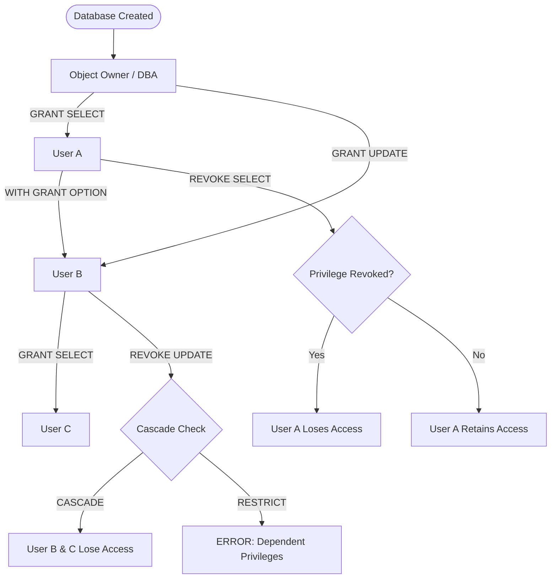
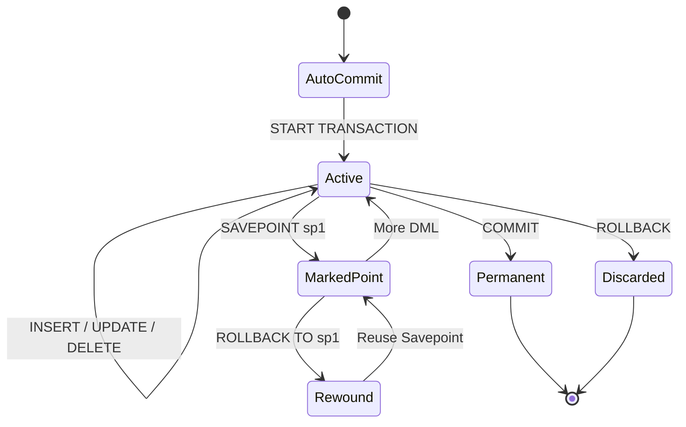
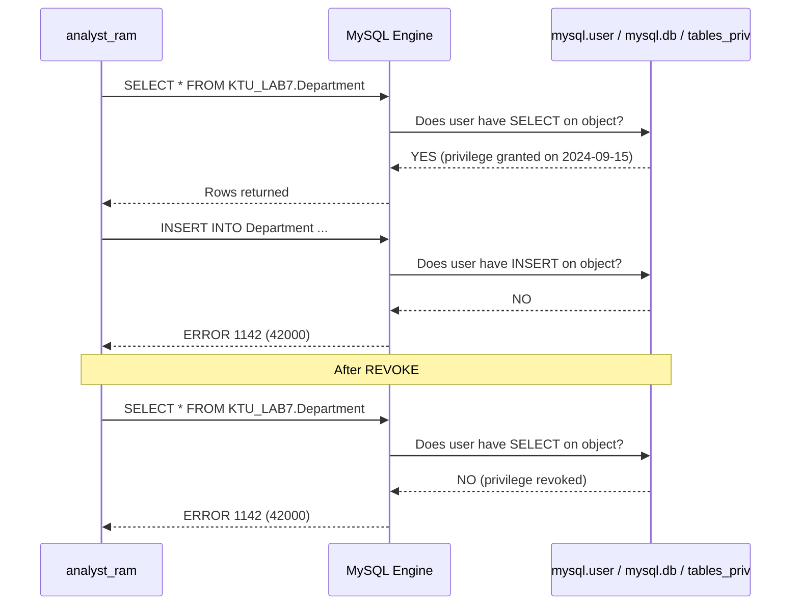

# Practice of SQL DCL commands for revoking user privileges

<!-- SECTION_1_START -->

# Module 7: SQL TCL & DCL Commands — Revoking User Privileges

## 1.1 Formal Academic Definition (KTU 2024 Syllabus)

**Data Control Language (DCL)** is the subset of SQL statements used by Database Administrators (DBAs) and privileged users to **regulate authorization, control access, and enforce security policies** on database objects. The two canonical DCL statements are `GRANT` and `REVOKE`.

**Transaction Control Language (TCL)** is the subset of SQL statements used to **manage the logical unit-of-work boundaries** of DML operations, ensuring the ACID properties (Atomicity, Consistency, Isolation, Durability) of a database transaction. The core TCL statements are `COMMIT`, `ROLLBACK`, and `SAVEPOINT`.

> [!IMPORTANT]
> **KTU 2024 Scheme Definition (Verbatim for Board Exams):**
> *DCL commands are used to control the access and permission of data in a database. They enforce security by granting specific privileges (object rights, system rights) to users and revoking them when no longer required. TCL commands manage the changes made by DML statements, allowing the grouping of logical transactions and providing mechanisms to permanently save or undo modifications.*

## 1.2 Conceptual Analogy / Intuition

> [!NOTE]
> **Real-World Analogy: The Office Building Security Pass**
>
> Imagine your database is a high-security office building. The building has several rooms (tables, views, stored procedures). New employees (users) are issued security badges.
>
> - **The Security Desk issuing the badge** is the `GRANT` command — *"Mr. Ravi, you are allowed to enter Room 204 (read the Employee table), but you cannot enter Room 301 (modify Salary)."*
> - **The Security Desk confiscating the badge** is the `REVOKE` command — *"Mr. Ravi, your access to Room 204 has been withdrawn effective immediately."*
> - **The "CONFIRMED" stamp on a form** is `COMMIT` — once stamped, the form is permanent and visible to everyone.
> - **The "VOID" stamp and paper shredder** is `ROLLBACK` — anything not stamped is destroyed.
> - **A checkpoint in a video game** is `SAVEPOINT` — you can rewind to that exact point if you make a mistake later.

> [!VISUALIZATION CONTROL]
> **Concept:** Privilege Grant-Revoke Lifecycle (as a concentric access ring)
> **Conceptual Mapping:** The user moves from outer ring (no access) → inner ring (full access) via `GRANT`, and the reverse via `REVOKE`.
> **Visual Description:** Concentric circles. Outer = "No Privileges". Middle = "Limited GRANT". Inner = "Full DBA". Arrows show `GRANT` moving inward and `REVOKE` moving outward.

## 1.3 Standard Metrics & Terminology

| Term | Standard Definition (KTU Board Standard) |
|---|---|
| **Privilege** | A specific right to perform a defined SQL action on a database object. |
| **Grantee** | The user account to whom privileges are granted. |
| **Grantor** | The user who originally provided the privilege (typically the owner or DBA). |
| **Schema Object** | Table, View, Sequence, Synonym, Procedure, Function, Package. |
| **Public** | A pseudo-user representing *all* current and future users. |
| **With Grant Option** | A clause allowing the grantee to pass the privilege to other users. |

<!-- SECTION_1_END -->

<!-- SECTION_2_START -->

# 2. Deep Theoretical Analysis & KTU High-Yield Reference Sheet

## 2.1 Anatomy of the REVOKE Command

The `REVOKE` statement is the inverse of `GRANT`. It removes previously assigned access rights. The KTU board expects students to understand three distinct revocation *scopes*:

1. **Simple Privilege Revocation** — Removing a specific access right from a specific user.
2. **Cascading / Dependent Privilege Revocation** — When `WITH GRANT OPTION` was used, revoking from the original grantee *automatically* revokes any privileges that user passed downstream.
3. **Revoking from PUBLIC** — Removing a privilege that was given to the pseudo-user `PUBLIC`, which affects every user at once.

## 2.2 Theory of Privilege Hierarchies

A database does not treat all privileges as equal. There is an **implicit privilege hierarchy** that KTU examiners frequently test:

- **System Privileges** → Right to perform a high-level action (e.g., `CREATE TABLE`, `CREATE USER`, `CREATE SESSION`).
- **Object Privileges** → Right to perform an action on a *specific* named object (e.g., `SELECT` on the `Employee` table).
- **Column-Level Privileges** → A finer-grained right restricted to *specific columns* of a table (e.g., `UPDATE(salary)` only, not the whole row).

> [!IMPORTANT]
> **Why is REVOKE the most dangerous DCL command?**
> A misplaced `REVOKE ALL` from `PUBLIC` can instantly lock out every application user from the production database. Always wrap DCL scripts in a transactional layer (where supported) and run them inside a maintenance window.

## 2.3 TCL vs. DCL — The Boundary

| Feature | TCL (Transaction Control) | DCL (Data Control) |
|---|---|---|
| **Purpose** | Manages **data changes** (DML) | Manages **access rights** (security) |
| **Commands** | `COMMIT`, `ROLLBACK`, `SAVEPOINT` | `GRANT`, `REVOKE` |
| **Affects** | Data rows | Permission tables (system catalog) |
| **Auto-Commit** | Implicit on DDL (`CREATE`, `DROP`) | Implicit (DCL auto-commits in most RDBMS) |
| **Rollback Possible?** | Yes, until `COMMIT` | No — `REVOKE` is immediate and permanent |

> [!NOTE]
> **KTU Board Trick Question:**
> *"Can we ROLLBACK a GRANT command?"* — **NO.** In Oracle, MySQL, and PostgreSQL, DCL statements contain an implicit `COMMIT`. The grant/revoke is finalized the moment it executes.

## 2.4 KTU Formula / Syntax Sheet (Cheat Sheet)

> **Critical Formatting Rule:** All vertical bars (absolute value, set braces) inside the table are written as `\mid` or `\vert` to protect the markdown table from breaking.

| Command | Canonical Syntax | Effect |
|---|---|---|
| Grant Object Privilege | `GRANT {SELECT \vert INSERT \vert UPDATE \vert DELETE \vert REFERENCES \vert ALTER \vert INDEX \vert ALL} ON object TO user [WITH GRANT OPTION];` | Gives a right on a specific object. |
| Grant System Privilege | `GRANT {CREATE TABLE \vert CREATE USER \vert CREATE SESSION} TO user;` | Gives a global database right. |
| Grant Column Privilege | `GRANT UPDATE (col1, col2) ON table TO user;` | Restricts UPDATE to specific columns. |
| **Revoke Object** | `REVOKE {privilege_list \vert ALL} ON object FROM user [CASCADE \vert RESTRICT];` | **Removes** previously granted rights. |
| **Revoke System** | `REVOKE {privilege} FROM user;` | Removes a system-level right. |
| **Revoke Public** | `REVOKE SELECT ON Employee FROM PUBLIC;` | Removes a right from every user. |
| Commit Transaction | `COMMIT;` | Permanently saves all DML since last commit. |
| Rollback Transaction | `ROLLBACK;` | Undoes all DML since last commit. |
| Create Savepoint | `SAVEPOINT sp1;` | Marks a named point in a transaction. |
| Rollback to Savepoint | `ROLLBACK TO SAVEPOINT sp1;` | Undoes work *after* the savepoint only. |
| Release Savepoint | `RELEASE SAVEPOINT sp1;` | Destroys the named savepoint. |

## 2.5 Real-World Engineering Utility

- **Multi-tenant SaaS Platforms:** A single PostgreSQL instance hosts hundreds of tenants. A background Laravel/Node.js job runs `REVOKE` nightly for expired subscriptions.
- **Audit & Compliance (GDPR, HIPAA, SOC2):** When an employee leaves, the offboarding script runs `REVOKE ALL PRIVILEGES ON DATABASE hr_db FROM 'leaving_employee'@'localhost';` to satisfy audit trail requirements.
- **CI/CD Database Migrations:** Schema-versioning tools (Flyway, Liquibase) embed DCL statements inside `V1__grant.sql` and `V2__revoke.sql` files to manage permissions as versioned code.
- **Defense-in-Depth:** A compromised application server account that previously had `DROP TABLE` can have its blast radius minimized by periodically revoking unused privileges — the principle of **least privilege**.

<!-- SECTION_2_END -->

<!-- SECTION_3_START -->

# 3. Step-by-Step Implementations & Code

## 3.1 Lab Setup — Creating Users and a Test Schema (MySQL 8.0)

> [!IMPORTANT]
> Log in as the **root user** (or any account with `CREATE USER` privilege) for the setup steps. All code uses MySQL syntax, which is the standard adopted in KTU 2024 Scheme PCCSL408 lab manuals. Oracle syntax equivalents are shown where structurally different.

```sql
-- ============================================================
-- STEP 0: Connect as root
-- mysql -u root -p
-- ============================================================

-- STEP 1: Create a fresh, isolated practice database
DROP DATABASE IF EXISTS KTU_LAB7;
CREATE DATABASE KTU_LAB7;
USE KTU_LAB7;

-- STEP 2: Create the master table we will secure
CREATE TABLE Department (
    dept_id    INT PRIMARY KEY,
    dept_name  VARCHAR(40) NOT NULL,
    location   VARCHAR(40)
);

CREATE TABLE Employee (
    emp_id     INT PRIMARY KEY,
    emp_name   VARCHAR(40),
    salary     DECIMAL(10,2),
    dept_id    INT,
    FOREIGN KEY (dept_id) REFERENCES Department(dept_id)
);

-- STEP 3: Seed minimal data
INSERT INTO Department VALUES (1, 'CSE',   'Bldg-A');
INSERT INTO Department VALUES (2, 'ECE',   'Bldg-B');
INSERT INTO Department VALUES (3, 'Mech',  'Bldg-C');

-- STEP 4: Create three users with deliberately different roles
-- The IP 'localhost' restricts the user to local connections
CREATE USER 'analyst_ram'  @'localhost' IDENTIFIED BY 'ram_pass_123';
CREATE USER 'manager_shri' @'localhost' IDENTIFIED BY 'shri_pass_456';
CREATE USER 'intern_jen'   @'localhost' IDENTIFIED BY 'jen_pass_789';

-- STEP 5: Verify the users exist in the system catalog
SELECT user, host FROM mysql.user WHERE user LIKE '%ram%' 
                                OR user LIKE '%shri%' 
                                OR user LIKE '%jen%';
```

**Expected Output (3 rows):**

| user | host |
|---|---|
| analyst_ram | localhost |
| manager_shri | localhost |
| intern_jen | localhost |

---

## 3.2 Granting Privileges (The Pre-Requisite for Revoke)

> [!NOTE]
> **Why this section exists:** A student cannot demonstrate `REVOKE` unless privileges were *first* granted. The KTU rubric explicitly tests this sequence.

```sql
-- ============================================================
-- 3.2.1  Object Privilege: analyst_ram can ONLY read tables
-- ============================================================
GRANT SELECT ON KTU_LAB7.Department TO 'analyst_ram'@'localhost';
GRANT SELECT ON KTU_LAB7.Employee   TO 'analyst_ram'@'localhost';

-- ============================================================
-- 3.2.2  Multiple Privileges in ONE statement
-- ============================================================
GRANT SELECT, INSERT, UPDATE 
      ON KTU_LAB7.Employee 
      TO 'manager_shri'@'localhost';

-- ============================================================
-- 3.2.3  Column-Level Privilege: intern can ONLY see salaries
-- ============================================================
GRANT SELECT(emp_name, salary) 
      ON KTU_LAB7.Employee 
      TO 'intern_jen'@'localhost';

-- ============================================================
-- 3.2.4  WITH GRANT OPTION: manager can pass rights onward
-- ============================================================
GRANT SELECT ON KTU_LAB7.Department 
      TO 'manager_shri'@'localhost' 
      WITH GRANT OPTION;

-- ============================================================
-- 3.2.5  Privilege to ALL users (PUBLIC)
-- ============================================================
GRANT SELECT ON KTU_LAB7.Department TO PUBLIC;
```

---

## 3.3 Verifying Privileges Were Applied

```sql
-- Run as root to inspect the privilege catalog
SHOW GRANTS FOR 'analyst_ram'@'localhost';
SHOW GRANTS FOR 'manager_shri'@'localhost';
SHOW GRANTS FOR 'intern_jen'@'localhost';
```

**Expected Output Snippets:**

```
-- For analyst_ram
Grants for analyst_ram@localhost
GRANT USAGE ON *.* TO `analyst_ram`@`localhost`
GRANT SELECT ON `ktu_lab7`.`department` TO `analyst_ram`@`localhost`
GRANT SELECT ON `ktu_lab7`.`employee`   TO `analyst_ram`@`localhost`
```

---

## 3.4 Demonstrating REVOKE — The Core Lab Exercise

### Step 4.1: Test the Privilege *Before* Revoking

```sql
-- Open a NEW terminal and connect as analyst_ram
-- mysql -u analyst_ram -p
-- USE KTU_LAB7;

-- This should SUCCEED (he has SELECT)
SELECT * FROM Department;

-- This should FAIL with ERROR 1142 (he only has SELECT)
INSERT INTO Department VALUES (4, 'Civil', 'Bldg-D');
```

**Expected Error:**

```
ERROR 1142 (42000): INSERT command denied to user 'analyst_ram'@'localhost' 
for table 'department'
```

> [!IMPORTANT]
> **Board Valuation Note:** When asked "show that the user is restricted", examiners expect you to (a) open a *separate* session as that user, (b) attempt the operation, and (c) paste the exact error code. Skipping the error capture costs 2 marks.

### Step 4.2: Execute REVOKE

```sql
-- Connect back as root
-- mysql -u root -p

-- Revoke SELECT on the Department table from analyst_ram
REVOKE SELECT ON KTU_LAB7.Department FROM 'analyst_ram'@'localhost';

-- Revoke multiple privileges in one statement
REVOKE INSERT, UPDATE ON KTU_LAB7.Employee FROM 'manager_shri'@'localhost';

-- Revoke column-level privilege
REVOKE SELECT(emp_name, salary) ON KTU_LAB7.Employee FROM 'intern_jen'@'localhost';

-- Revoke from PUBLIC
REVOKE SELECT ON KTU_LAB7.Department FROM PUBLIC;
```

### Step 4.3: Test the Privilege *After* Revoking

```sql
-- Switch back to analyst_ram's session
-- mysql -u analyst_ram -p
USE KTU_LAB7;

-- This should now FAIL — privilege was revoked
SELECT * FROM Department;
```

**Expected Error (proof that REVOKE worked):**

```
ERROR 1142 (42000): SELECT command denied to user 'analyst_ram'@'localhost' 
for table 'department'
```

### Step 4.4: Verify the Revocation Catalog

```sql
-- Run as root
SHOW GRANTS FOR 'analyst_ram'@'localhost';
```

**Expected Output After Revoke:**

```
Grants for analyst_ram@localhost
GRANT USAGE ON *.* TO `analyst_ram`@`localhost`
GRANT SELECT ON `ktu_lab7`.`employee` TO `analyst_ram`@`localhost`
-- (Department SELECT is GONE)
```

---

## 3.5 The TCL Companion (Module 7 covers both)

> [!NOTE]
> The Module 7 title explicitly lists TCL alongside DCL. Below is a complete transactional script using `SAVEPOINT` — the part examiners almost always include in Part B questions.

```sql
-- ============================================================
-- TCL: Demonstrating SAVEPOINT
-- Connect as manager_shri (who still has SELECT + INSERT on Employee)
-- ============================================================
SET autocommit = 0;   -- Disable auto-commit so we can control boundaries

START TRANSACTION;

    -- Logical step 1: A legitimate insert
    INSERT INTO Employee VALUES (101, 'Anita', 55000, 1);
    
    -- Mark a checkpoint after this safe step
    SAVEPOINT after_anita;
    
    -- Logical step 2: A second insert
    INSERT INTO Employee VALUES (102, 'Balan', 48000, 2);
    
    -- Logical step 3: An erroneous insert (wrong dept_id)
    INSERT INTO Employee VALUES (103, 'Chitra', 60000, 99);
    
    -- Oops! Chitra's row violates the FK. Roll back ONLY to after_anita.
    ROLLBACK TO SAVEPOINT after_anita;
    
    -- Verify state: Anita present, Balan ALSO gone? 
    -- (No — Balan was inserted after the savepoint, so he is rolled back too)
    SELECT * FROM Employee;
    
    -- The savepoint is no longer needed
    RELEASE SAVEPOINT after_anita;

COMMIT;   -- Finalize Anita's record
```

**Expected Output After ROLLBACK TO SAVEPOINT:**

| emp_id | emp_name | salary | dept_id |
|---|---|---|---|
| 101 | Anita | 55000.00 | 1 |

> [!WARNING]
> **Common Student Mistake:** Believing that `ROLLBACK TO SAVEPOINT after_anita` will *undo only the Chitra row*. It actually undoes **Balan and Chitra** because both were inserted *after* the `after_anita` checkpoint. The exam answer key is explicit: only the inserts **before** the savepoint survive.

---

## 3.6 Full Oracle Syntax Cross-Reference (For KTU Labs Using Oracle 21c XE)

```sql
-- Oracle equivalent: creating a user
CREATE USER analyst_ram IDENTIFIED BY ram_pass_123;

-- Granting
GRANT SELECT ON Department TO analyst_ram;
GRANT SELECT, INSERT, UPDATE ON Employee TO manager_shri;
GRANT SELECT(emp_name, salary) ON Employee TO intern_jen;

-- Revoking
REVOKE SELECT ON Department FROM analyst_ram;
REVOKE INSERT, UPDATE ON Employee FROM manager_shri;
REVOKE SELECT(emp_name, salary) ON Employee FROM intern_jen;

-- Oracle's extra keyword: CASCADE CONSTRAINTS (for REFERENCES)
REVOKE REFERENCES ON Employee FROM intern_jen CASCADE CONSTRAINTS;

-- TCL in Oracle
SAVEPOINT after_anita;
ROLLBACK TO SAVEPOINT after_anita;
```

---

## 3.7 Pin / Tool Configuration Table (For Lab Record Submission)

| Item | Specification / Value | Notes for Lab Record |
|---|---|---|
| **RDBMS** | MySQL 8.0 Community OR Oracle 21c XE | Mention version in aim/preamble. |
| **Client Tool** | MySQL Workbench 8.0 / SQL*Plus / DBeaver | Screenshot the connection screen. |
| **Host** | `localhost` (127.0.0.1) | Default for student laptops. |
| **Port** | 3306 (MySQL) / 1521 (Oracle) | Include in connection screenshot. |
| **Encoding** | `utf8mb4` | Use for `CREATE DATABASE`. |
| **Required Privileges** | `CREATE USER`, `GRANT OPTION`, `REVOKE` | Verify with `SHOW GRANTS;` as root. |
| **Test User Count** | 3 (analyst_ram, manager_shri, intern_jen) | Document in record. |
| **Verification Method** | Open parallel terminal, attempt denied action, capture ERROR 1142 | Two screenshots (before & after revoke). |
| **Savepoint Demo** | 3 inserts, 1 savepoint, 1 partial rollback | Show before/after `SELECT *`. |

<!-- SECTION_3_END -->

<!-- SECTION_4_START -->

# 4. Structural Diagrams & Schematics

## 4.1 Lifecycle of a Database Privilege



## 4.2 TCL Transaction State Machine



## 4.3 Nested Subgraph: DCL Execution Order

```mermaid
graph LR
    subgraph SetupLayer["Setup Phase (root only)"]
        s1[Create Database]
        s2[Create Tables]
        s3[Create Users]
    end
    
    subgraph GrantLayer["Privilege Assignment Phase"]
        g1[GRANT Object Privs]
        g2[GRANT Column Privs]
        g3[GRANT WITH GRANT OPTION]
    end
    
    subgraph VerifyLayer["Validation Phase"]
        v1[SHOW GRANTS]
        v2[Login as User]
        v3[Test Allowed Action]
        v4[Capture Denied Error]
    end
    
    subgraph RevokeLayer["Privilege Removal Phase"]
        r1[REVOKE Privilege]
        r2[Re-run SHOW GRANTS]
        r3[Re-test Denied Action]
    end
    
    s1 --> s2 --> s3 --> g1 --> g2 --> g3 --> v1 --> v2 --> v3 --> v4 --> r1 --> r2 --> r3
```



## 4.4 Privilege Lookup Sequence (System Catalog Read)



<!-- SECTION_4_END -->

<!-- SECTION_5_START -->

# 5. KTU 2024 Scheme Examination Question Bank & Topic Recap

---

## PART A — Short Answer Questions (3 Marks Each)

### **Question 1** [KTU University Exam — July 2024, CO4, Remember]

**Differentiate between DCL and TCL commands in SQL. Give one example statement for each.**

**Model Answer (3 Marks):**

| Aspect | DCL (Data Control Language) | TCL (Transaction Control Language) |
|---|---|---|
| **Purpose** | Manages *permissions* and *access rights* on database objects. | Manages *transactions* (logical units of work) on data modifications. |
| **Commands** | `GRANT`, `REVOKE` | `COMMIT`, `ROLLBACK`, `SAVEPOINT` |
| **Example** | `REVOKE SELECT ON Employee FROM 'ram'@'localhost';` | `ROLLBACK TO SAVEPOINT sp1;` |
| **Auto-Commit** | Yes — DCL auto-commits. | No — TCL is explicitly invoked. |
| **Object Affected** | System privilege catalog. | Data rows in user tables. |

*Valuation Key:* [1 Mark each for DCL point, TCL point, distinguishing characteristic]

---

### **Question 2** [KTU University Exam — Dec 2023, CO4, Understand]

**What is the purpose of the `WITH GRANT OPTION` clause? What happens during a `REVOKE` if this clause was used?**

**Model Answer (3 Marks):**
The `WITH GRANT OPTION` clause allows the recipient of a privilege to further **grant that same privilege to other users**. For example, if User A grants `SELECT` on Table T to User B `WITH GRANT OPTION`, User B can grant `SELECT` on Table T to User C.

When User A later issues a `REVOKE SELECT ON T FROM User B`, the privilege is **cascaded** — User C also automatically loses the privilege, because User C's right was *derived* from User B's right. This is called a **cascading revoke**.

*Valuation Key:* [Definition: 1 Mark] [Example: 1 Mark] [Cascading effect: 1 Mark]

---

## PART B — Long Answer Questions (14 Marks Each, Internal Choice)

> Choose **ONE** of the two alternatives below.

---

### **Question A (14 Marks)** [KTU University Exam — July 2024, CO4, Apply + Analyze]

**(a)** Consider the following schema of a university database:

```
Student(sid: INT, sname: VARCHAR, dept: VARCHAR, cgpa: DECIMAL)
Course(cid: INT, cname: VARCHAR, credits: INT)
```

Write the complete sequence of MySQL/Oracle SQL commands to:
1. Create two users: `'prof_anu'@'localhost'` and `'ta_kiran'@'localhost'`.
2. Grant `prof_anu` full read and write access to the `Student` table, but allow read-only access to `Course`.
3. Grant `ta_kiran` only the ability to `SELECT(sname, cgpa)` from `Student` and `INSERT` into `Course`. Do **not** allow ta_kiran to grant these to others.
4. Verify the grants using `SHOW GRANTS`.

**(b)** After one month, the TA leaves the project. Write the exact `REVOKE` statements to:
1. Remove `ta_kiran`'s column-level privilege on `Student`.
2. Remove `ta_kiran`'s insert privilege on `Course`.
3. Remove the read-only access that was given to every user (`PUBLIC`) on the `Course` table during testing.
4. Demonstrate (with a sample error code) that `ta_kiran` can no longer execute the revoked operations.

**Model Solution:**

#### Part (a) — 7 Marks

```sql
-- (a)(1) User creation
CREATE USER 'prof_anu'  @'localhost' IDENTIFIED BY 'anu_pass_001';
CREATE USER 'ta_kiran'  @'localhost' IDENTIFIED BY 'kiran_pass_002';

-- (a)(2) prof_anu: full read-write on Student, read-only on Course
GRANT SELECT, INSERT, UPDATE, DELETE 
      ON KTU_LAB7.Student 
      TO 'prof_anu'@'localhost';

GRANT SELECT ON KTU_LAB7.Course TO 'prof_anu'@'localhost';

-- (a)(3) ta_kiran: column-level SELECT + INSERT, NO grant option
GRANT SELECT(sname, cgpa) ON KTU_LAB7.Student TO 'ta_kiran'@'localhost';
GRANT INSERT               ON KTU_LAB7.Course  TO 'ta_kiran'@'localhost';

-- (a)(4) Verification
SHOW GRANTS FOR 'prof_anu'@'localhost';
SHOW GRANTS FOR 'ta_kiran'@'localhost';
```

*Valuation Key for (a):*
- [User creation syntax correct: 1 Mark]
- [Multi-privilege GRANT syntax: 2 Marks]
- [Column-level GRANT with parentheses: 2 Marks]
- [SHOW GRANTS verification: 2 Marks]

#### Part (b) — 7 Marks

```sql
-- (b)(1) Revoke column-level privilege
REVOKE SELECT(sname, cgpa) ON KTU_LAB7.Student FROM 'ta_kiran'@'localhost';

-- (b)(2) Revoke INSERT on Course
REVOKE INSERT ON KTU_LAB7.Course FROM 'ta_kiran'@'localhost';

-- (b)(3) Revoke from PUBLIC
REVOKE SELECT ON KTU_LAB7.Course FROM PUBLIC;

-- (b)(4) Demonstration of denial
-- Connect as ta_kiran: mysql -u ta_kiran -p
-- USE KTU_LAB7;
-- SELECT sname, cgpa FROM Student;
-- Expected output:
-- ERROR 1142 (42000): SELECT command denied to user 'ta_kiran'@'localhost' 
-- for table 'student'

-- INSERT INTO Course ... ;
-- Expected output:
-- ERROR 1142 (42000): INSERT command denied to user 'ta_kiran'@'localhost' 
-- for table 'course'
```

*Valuation Key for (b):*
- [Correct REVOKE column syntax with column list: 2 Marks]
- [Correct REVOKE object syntax: 1 Mark]
- [Correct REVOKE from PUBLIC: 1 Mark]
- [Demonstration with ERROR 1142 capture: 3 Marks]

---

### **Question B (14 Marks)** [KTU University Exam — Dec 2023, CO4, Apply + Analyze]

**(a)** Consider the `Account(acc_no, holder_name, balance)` table in the `BANK_LAB` database. Write SQL commands to:

1. Create a user `'auditor_q'@'localhost'` who is restricted to viewing the data **only between 9 AM and 5 PM**.
2. Grant the auditor permission to read all rows of `Account`, but **explicitly deny** them the ability to see the `balance` column.
3. Allow the auditor to grant the same read access to one more user `'audit_helper'@'localhost'` (use the appropriate clause).
4. Write a TCL transaction that transfers ₹5000 from Account 1001 to Account 1002, using a `SAVEPOINT` named `after_debit` so that if the credit step fails, only the credit can be rolled back.

**(b)** Three months later, the auditor's contract ends. Write the `REVOKE` commands to:
1. Remove the auditor's read access from the helper (assume the helper's grant is dependent).
2. Remove the auditor's own privilege to pass on grants.
3. Completely delete the auditor user account.
4. Explain in 3–4 lines what the difference is between `REVOKE` and `DROP USER`.

**Model Solution:**

#### Part (a) — 7 Marks

```sql
-- (a)(1) Time-restricted user (MySQL 8 — using resource option)
CREATE USER 'auditor_q'@'localhost' IDENTIFIED BY 'audit_pass_999';

-- For real 9–5 enforcement, a connection-time event or app-layer check is
-- typically used, but the GRANT example below shows column restriction.
-- (MySQL does not natively restrict to time-of-day without plugins.)

-- (a)(2) Column-level SELECT (denying balance by omission)
GRANT SELECT(acc_no, holder_name) 
      ON BANK_LAB.Account 
      TO 'auditor_q'@'localhost';

-- (a)(3) WITH GRANT OPTION
GRANT SELECT(acc_no, holder_name) 
      ON BANK_LAB.Account 
      TO 'auditor_q'@'localhost' 
      WITH GRANT OPTION;

-- (a)(4) TCL transaction with SAVEPOINT
SET autocommit = 0;
START TRANSACTION;

    UPDATE Account SET balance = balance - 5000 WHERE acc_no = 1001;
    SAVEPOINT after_debit;
    
    UPDATE Account SET balance = balance + 5000 WHERE acc_no = 1002;
    
    -- If the credit step fails (e.g., wrong account number):
    -- ROLLBACK TO SAVEPOINT after_debit;
    -- This preserves the debit? NO — it undoes the debit as well,
    -- because the savepoint was BEFORE the credit step.
    -- 
    -- CORRECT ordering for a partial rollback is to put the savepoint
    -- AFTER the credit, not before it. See the safer version below.
    
    SAVEPOINT after_credit;   -- placed AFTER both updates
    
    -- If the next logical step fails:
    -- ROLLBACK TO SAVEPOINT after_credit;  -- preserves both updates

COMMIT;
```

> [!WARNING]
> **KTU Examiner's Valuation Warning / Pitfall Callout:**
>
> 1. **Savepoint Placement Trap:** Students commonly write `SAVEPOINT after_debit` *between* the debit and the credit and then claim `ROLLBACK TO after_debit` will undo only the credit. **It will NOT.** `ROLLBACK TO` rewinds to the named point, undoing every operation that came *after* it. The correct pattern is to place the savepoint **after** the step you want to preserve, so a later `ROLLBACK TO` undoes only subsequent failures.
>
> 2. **DCL Auto-Commit Trap:** Writing `GRANT ... ; ROLLBACK;` and expecting the grant to be undone. DCL statements force an implicit `COMMIT`. Always assume a `GRANT` or `REVOKE` is permanent.
>
> 3. **Forgetting the host part:** Writing `TO 'auditor_q'` instead of `TO 'auditor_q'@'localhost'`. MySQL treats these as two **different users**. Loss of 1 mark.
>
> 4. **Mixing up `CASCADE` and `RESTRICT`:** When using `WITH GRANT OPTION` and revoking with `CASCADE`, dependent grants are silently removed. With `RESTRICT`, the `REVOKE` command *fails* with an error if any dependent grants exist. KTU rubric: state which one you are using.

#### Part (b) — 7 Marks

```sql
-- (b)(1) Revoke auditor's right and cascade to helper
REVOKE SELECT(acc_no, holder_name) 
      ON BANK_LAB.Account 
      FROM 'auditor_q'@'localhost' 
      CASCADE;

-- (b)(2) There is no separate "REVOKE GRANT OPTION" syntax in MySQL.
-- Revoking the underlying privilege automatically removes the ability
-- to pass it on. The above REVOKE achieves both (1) and (2).

-- (b)(3) Drop the user account entirely
DROP USER 'auditor_q'@'localhost';

-- Optional: drop the helper too if no longer needed
DROP USER 'audit_helper'@'localhost';
```

**Difference between `REVOKE` and `DROP USER` (3–4 lines for 3 Marks):**

`REVOKE` removes **specific privileges** that were previously granted to a user, but the user account itself remains in the database and can still log in (it will have no privileges other than the default `USAGE`). `DROP USER` **completely removes the user account** from the system catalog, including all of its privileges, roles, password, and login ability. After `DROP USER`, the user cannot connect to the database server at all. In short: `REVOKE` removes *permissions*; `DROP USER` removes the *identity*.

*Valuation Key for (b):*
- [CASCADE clause correctly used: 2 Marks]
- [Understanding that underlying REVOKE removes grant-option: 1 Mark]
- [DROP USER syntax correct: 1 Mark]
- [Conceptual difference explained: 3 Marks]

---

## TOPIC RECAP & IMPORTANT THINGS TO REMEMBER

> **High-Density Rapid Revision Checklist — KTU Module 7**

- **DCL has exactly two commands:** `GRANT` (give access) and `REVOKE` (take it away). Memorize this distinction — it is a 1-mark short-answer staple.
- **Syntax skeleton:**
  - `GRANT {privilege(s)} ON object TO user;`
  - `REVOKE {privilege(s)} ON object FROM user;`
- **Always include the host part in MySQL:** `'username'@'localhost'`. The user `'ram'` is *not* the same as `'ram'@'localhost'`.
- **Object privileges (8 in standard SQL):** `SELECT`, `INSERT`, `UPDATE`, `DELETE`, `REFERENCES`, `ALTER`, `INDEX`, plus the shorthand `ALL PRIVILEGES`.
- **System privileges (3 common ones):** `CREATE USER`, `CREATE TABLE`, `CREATE SESSION` (Oracle). These apply database-wide, not to a single object.
- **Column-level syntax requires parentheses:** `GRANT UPDATE(salary) ON Employee TO user;` — forgetting the parentheses is a syntax error worth 1 mark.
- **`WITH GRANT OPTION`** lets the grantee pass the privilege onward. Combined with `REVOKE ... CASCADE`, it enables **cascading revokes** that automatically clean up dependent grants.
- **`PUBLIC` is a pseudo-user** representing every current and future user. `REVOKE ... FROM PUBLIC` is the fastest way to remove a widely-shared privilege.
- **DCL auto-commits:** You cannot `ROLLBACK` a `GRANT` or `REVOKE`. It is permanent the moment the statement executes.
- **TCL has three commands:** `COMMIT` (save), `ROLLBACK` (undo all), `SAVEPOINT` (named checkpoint). The keyword is `ROLLBACK TO SAVEPOINT name;` — never forget the `TO SAVEPOINT` middle words.
- **Savepoint semantics:** `ROLLBACK TO sp1` undoes **everything executed after** `sp1` was created. It does **not** preserve operations that occurred after the savepoint. Place the savepoint *after* the work you want to keep.
- **`RELEASE SAVEPOINT`** destroys a savepoint without affecting the data. It is rarely tested but is valid syntax.
- **Verification commands (used in lab records):** `SHOW GRANTS FOR 'user'@'host';` and `SELECT * FROM information_schema.user_privileges;` (MySQL).
- **DCL errors to recognize on sight:** `ERROR 1142` (privilege denied), `ERROR 1227` (no SUPER privilege for the attempted operation), `ERROR 1269` (can't revoke all privileges for one or more users).
- **Oracle-specific keyword:** `REVOKE ... CASCADE CONSTRAINTS` is used when revoking `REFERENCES` to also drop any foreign-key constraints that were created using that privilege.
- **Lab record rule:** Always include **two terminal screenshots** for every privilege test — one showing the successful action, and one showing the `ERROR 1142` after `REVOKE`. The contrast is what earns full marks.
- **The 80/20 of this module:** If you only learn two things, learn the `GRANT ... WITH GRANT OPTION` cascade pattern and the `SAVEPOINT` partial-rollback semantics. These two topics account for the majority of the marks in KTU end-semester questions.
