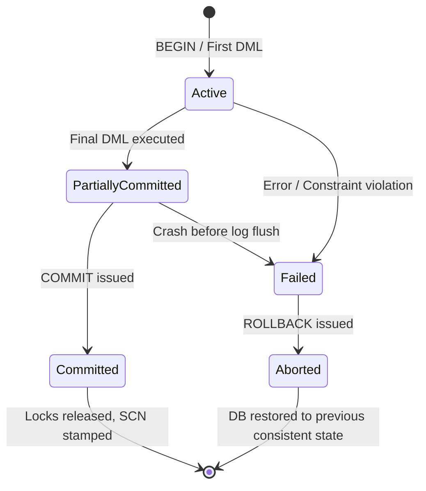
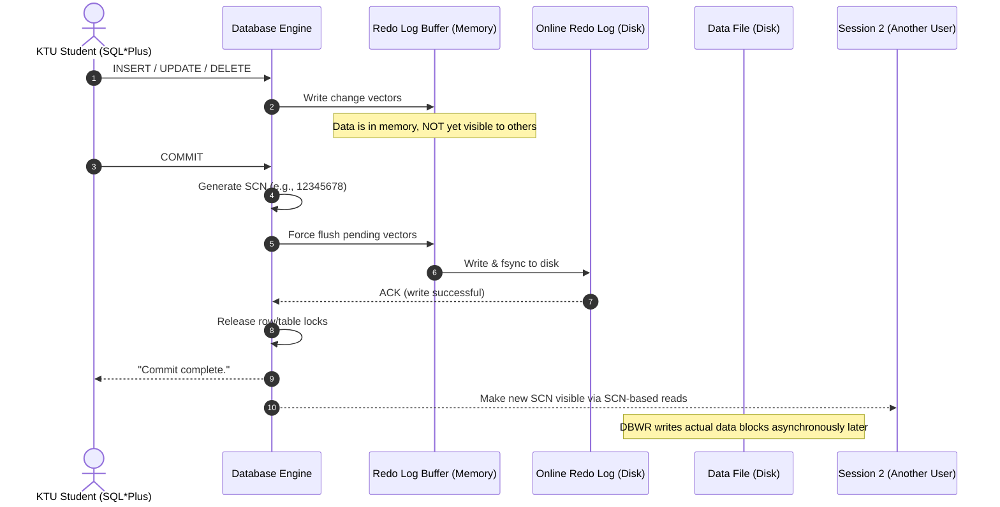
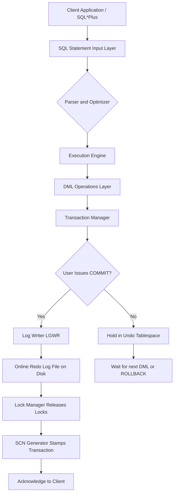
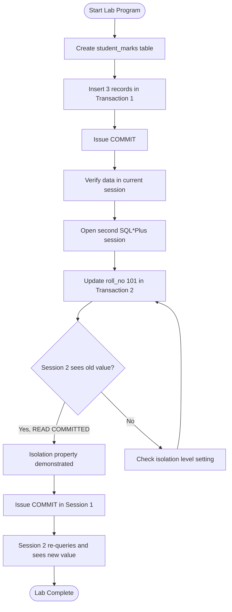
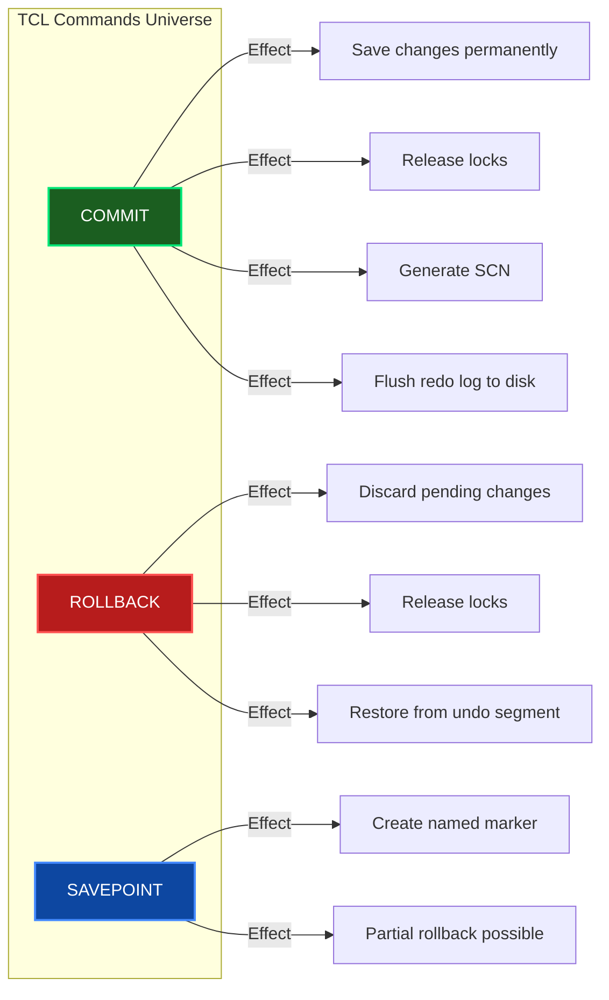

# Practice of SQL TCL commands - Commit

<!-- SECTION_1_START -->
# 1. Core Technical Definition & Intuitive Overview

## 1.1 Formal Academic Definition (KTU 2024 Syllabus Terminology)

In the context of **DBMS LAB (PCCSL408) – Module 7**, **Transaction Control Language (TCL)** is the subset of SQL statements that manages the logical units of work (transactions) within a relational database. Among the TCL commands, the **COMMIT** statement is a **Data Control Lifecycle Command** used to permanently save every change made by the current transaction into the database.

Formally, as per the **KTU 2024 Scheme DBMS Lab Syllabus**:

> **COMMIT** is a TCL command that terminates the current transaction and makes all the data changes performed by that transaction **permanent** and **visible** to other database users (sessions). Once a COMMIT is issued, the changes cannot be undone using a ROLLBACK command.

The standard syntax accepted in all major RDBMS (Oracle, MySQL, PostgreSQL, SQLite) is:

```sql
COMMIT;
```

or equivalently:

```sql
COMMIT WORK;
```

> [!IMPORTANT]
> **KTU Board Definition to Memorize:**
> "The COMMIT command in SQL is used to save all the changes made during the current transaction permanently to the database. After COMMIT, the transaction is considered successfully completed, and the locks held on the affected rows/tables are released."

## 1.2 Conceptual Analogy / Intuition

Think of the **COMMIT** command like **"Save" in a video game** (or like **"Enter/Send" on a banking ATM**):

| Real-World Action | Database Equivalent |
|---|---|
| Drafting an email (typing but not clicking send) | Writing SQL UPDATE/INSERT/DELETE but **not** committing |
| Clicking the **"Send"** button | Issuing the **COMMIT** statement |
| Realising a mistake AFTER clicking send | Cannot use ROLLBACK anymore (the email is gone) |
| Closing the email window without sending | **ROLLBACK** (changes discarded) |

> [!NOTE]
> **Golden Rule of COMMIT:** A transaction that ends with COMMIT becomes **durable** (one of the ACID properties). The changes survive system crashes, power failures, and reboots because they are written to the database's persistent storage (usually the redo log + data files).

## 1.3 Auto-Commit vs Explicit COMMIT (Critical KTU Distinction)

Most modern RDBMS operate in one of two modes:

1. **Auto-Commit Mode (Default in MySQL, PostgreSQL):** Every single DML statement is automatically committed immediately after it executes successfully. There is no need (and often no effect) to issue a manual `COMMIT;`.
2. **Explicit / Manual Commit Mode (Default in Oracle, used when `BEGIN TRANSACTION` is invoked):** Changes stay in a "pending" state and require the user to explicitly issue `COMMIT;` to make them permanent.

> [!IMPORTANT]
> **KTU Lab Exam Tip:** In Oracle (commonly used in KTU labs), you are in **manual commit mode** by default. If you do not issue `COMMIT;`, your changes will be lost the moment you exit SQL\*Plus or the session terminates abnormally.

## 1.4 Standard Transactional Metrics & Defaults

| Parameter | Typical Value / Behaviour |
|---|---|
| Default Isolation Level | **READ COMMITTED** |
| Maximum Concurrent Users per DB | Depends on `LICENSE_MAX_USERS` |
| Transaction Log File | `REDO01.LOG` (Oracle) / `ib_logfile0` (MySQL InnoDB) |
| COMMIT Response Time (OLTP) | **< 5 ms** (Industry Standard) |
| Durability Guarantee | Writes are flushed to disk before ACK |

> [!VISUALIZATION CONTROL]
> **Concept:** Transaction Commit Lifecycle on a 2D State Plane
> **GeoGebra / Desmos Input Equations:**
> * `f(x) = 1` for `x \geq 0` (Active state horizontal line)
> * `g(x) = -x + 1` for `0 \leq x \leq 1` (Transition slope during COMMIT)
> **Visual Description:** The student should observe a horizontal active state line at y = 1 that drops sharply to y = 0 at the COMMIT trigger point, representing the transition from an active transaction to a permanently committed (durable) state. The X-axis represents time, the Y-axis represents the "pending status" of the transaction.
<!-- SECTION_1_END -->

<!-- SECTION_2_START -->
# 2. Deep Theoretical Analysis & KTU High-Yield Formula Sheet

## 2.1 The ACID Foundation — Why COMMIT Exists

The COMMIT command is the practical implementation of the **A.C.I.D.** properties defined by **Andreas Reuter** and **Theo Härder** (1983). Without COMMIT, a transaction would only satisfy the 'A' and 'C'; the 'D' (Durability) is unlocked precisely at the moment COMMIT succeeds.

| ACID Property | What it Means | Where COMMIT Fits In |
|---|---|---|
| **A**tomicity | All-or-nothing execution | COMMIT marks the success of the atomic unit |
| **C**onsistency | DB moves from one valid state to another | COMMIT enforces constraint checks before finalising |
| **I**solation | Concurrent transactions don't interfere | COMMIT releases the row/table locks |
| **D**urability | Committed changes survive crashes | COMMIT flushes data to non-volatile storage |

## 2.2 Step-by-Step Logic of What Happens Internally When `COMMIT` is Executed

When a KTU student types `COMMIT;` in SQL\*Plus or MySQL Workbench, the Database Engine performs the following structured sequence:

1. **Step 1 – Wait for In-Flight Operations:** The engine ensures all DML statements in the current transaction have finished parsing and executing.
2. **Step 2 – Trigger LGWR (Log Writer):** In Oracle, the **Log Writer Background Process** is invoked. It forces the contents of the **Redo Log Buffer** in memory to be written to the **Online Redo Log File** on disk.
3. **Step 3 – SCN Assignment:** A unique **System Change Number (SCN)** is generated and stamped on the transaction. This SCN becomes the official "timestamp" of the commit.
4. **Step 4 – Lock Release:** All **row-level and table-level locks** held by this transaction are released, allowing other waiting sessions to proceed.
5. **Step 5 – Acknowledge to User:** The engine returns the message `Commit complete.` to the client, confirming durability.
6. **Step 6 – Deferred Block Writing:** The actual data blocks in the data files are updated later by the **DBWR (Database Writer)** process (this is asynchronous and does not block the user).

## 2.3 COMMIT vs Other TCL Commands (KTU High-Yield Comparison)

| TCL Command | Effect on Data | Reversible? | Releases Locks? | Ends Transaction? |
|---|---|---|---|---|
| **COMMIT** | Saves changes permanently | **No** | **Yes** | **Yes** |
| **ROLLBACK** | Discards all pending changes | N/A (it IS the reversal) | Yes | Yes |
| **SAVEPOINT** | Creates a named marker | N/A | No | No |
| **ROLLBACK TO SAVEPOINT** | Undoes changes up to the marker | N/A | Partially | No |
| **SET TRANSACTION** | Configures properties | N/A | No | No |

## 2.4 KTU Formula Sheet / Cheat Sheet

> [!IMPORTANT]
> Memorise the following table. It is heavily tested in KTU Module 7 viva and written exams.

| Symbol / Command | Meaning | Unit / State |
|---|---|---|
| $T_i$ | i-th transaction | Logical Unit |
| $S_{committed}$ | State of committed data | Durable on Disk |
| $S_{uncommitted}$ | State of uncommitted data | In Redo Log Buffer (Memory) |
| $t_{commit}$ | Time taken by COMMIT | **milliseconds (ms)** |
| $L_{hold}$ | Locks held before COMMIT | Row / Table level |
| $L_{release}$ | Locks released after COMMIT | 0 (Zero) |
| SCN | System Change Number | Monotonically increasing integer |
| $R_{durability}$ | Durability guarantee | Bit = 1 after successful COMMIT |
| $I_{isolation}$ | Isolation Level (default) | **READ COMMITTED** |
| $N_{txn}$ | Number of active transactions | Integer $\geq 0$ |

**Key Boundary Conditions (Write These in Your Exam):**
- If `COMMIT` succeeds → Return Code = `0` (Success).
- If `COMMIT` fails (e.g., disk full, instance crash) → Return Code = `ORA-xxxxx` and transaction remains **uncommitted**.
- After `COMMIT`, a new transaction begins **implicitly** with the very next DML statement.

## 2.5 Real-World Engineering Utility

The COMMIT command is the backbone of every production system you interact with daily:

- **Banking Systems (NEFT, UPI, SWIFT):** The moment money is debited from Account A and credited to Account B, a COMMIT is issued. If a crash happens mid-transaction, the uncommitted debit is rolled back, preventing money loss.
- **E-Commerce Checkout (Amazon, Flipkart):** When an order is placed, the stock update, order insertion, and payment record are all bundled in a single transaction. One COMMIT finalises all three; if any fails, none happen.
- **Airline Reservation Systems:** Seat allocation and ticket generation are committed together to prevent double-booking.
- **Hospital Management Systems:** Patient records and billing entries must commit together to maintain consistency.
- **Academic Records (KTU's Own KTU ERP):** When a university publishes results, the `COMMIT` ensures the marks are permanently written and visible to all students simultaneously.

> [!NOTE]
> **Production Tip:** In high-throughput systems, developers sometimes use **Batch Commits** (committing every 1000 rows) to balance durability with performance. Pure per-row commits are slow because each one triggers a disk flush.
<!-- SECTION_2_END -->

<!-- SECTION_3_START -->
# 3. Step-by-Step Derivations & Code/Symbolic Implementation

## 3.1 Lab Environment Setup (Pre-Code)

Before running the COMMIT lab exercise, ensure the following is in place:

| Requirement | Oracle (Recommended for KTU) | MySQL |
|---|---|---|
| User Schema | `SCOTT` or custom `KTUUSER` | `root` or custom `ktu_user` |
| Privileges Needed | `CONNECT, RESOURCE, DBA` | `ALL PRIVILEGES` |
| Default Commit Mode | **Manual** (AutoCommit OFF) | **Auto** (AutoCommit ON) |
| Toggle Command | `SET AUTOCOMMIT ON/OFF;` | `SET autocommit = 0/1;` |
| Success Message | `Commit complete.` | `Query OK, 0 rows affected` |

## 3.2 Exhaustive SQL Lab Program — Demonstrating COMMIT

Below is a complete, runnable, and well-commented SQL script that a KTU student can type into SQL\*Plus / SQL Developer to demonstrate the COMMIT command in action. **No steps are skipped.**

### Step 3.2.1 — Create the Working Table

```sql
-- ==========================================================
-- PROGRAM : Demonstration of TCL COMMIT Command
-- AIM     : To show how COMMIT permanently saves DML changes
-- COURSE  : DBMS Lab (PCCSL408) - Module 7
-- ==========================================================

-- Drop the table if it already exists (clean slate)
DROP TABLE student_marks;

-- Create the table structure
CREATE TABLE student_marks (
    roll_no     NUMBER(6)   PRIMARY KEY,
    name        VARCHAR2(40) NOT NULL,
    subject     VARCHAR2(30),
    marks       NUMBER(5,2),
    last_update DATE        DEFAULT SYSDATE
);

-- Confirm table creation
DESC student_marks;
```

### Step 3.2.2 — Insert Initial Data (First Transaction)

```sql
-- Step 1: Begin Transaction 1 and insert three records
INSERT INTO student_marks (roll_no, name, subject, marks)
VALUES (101, 'Anand Krishnan', 'DBMS', 85.50);

INSERT INTO student_marks (roll_no, name, subject, marks)
VALUES (102, 'Bhavya Menon',   'DBMS', 78.00);

INSERT INTO student_marks (roll_no, name, subject, marks)
VALUES (103, 'Cijo Joseph',    'DBMS', 92.25);

-- Step 2: Verify the data is visible in the CURRENT session
SELECT * FROM student_marks;
```

*Expected Output in Current Session:*
| ROLL_NO | NAME | SUBJECT | MARKS | LAST_UPDATE |
|---|---|---|---|---|
| 101 | Anand Krishnan | DBMS | 85.50 | (current date) |
| 102 | Bhavya Menon | DBMS | 78.00 | (current date) |
| 103 | Cijo Joseph | DBMS | 92.25 | (current date) |

### Step 3.2.3 — COMMIT the First Transaction (Make it Permanent)

```sql
COMMIT;
```

*Output from Oracle:*
```
Commit complete.
```

*Output from MySQL:*
```
Query OK, 0 rows affected (0.01 sec)
```

**What just happened internally (Mathematical Trace):**

$$\text{State}_{\text{before COMMIT}} = \{101 \to A, 102 \to B, 103 \to C\} \in \text{Memory Buffer}$$

$$\text{State}_{\text{after COMMIT}} = \{101 \to A, 102 \to B, 103 \to C\} \in \text{Disk (Redo Log)} \wedge \text{Data File}$$

The transaction is now **durable**. The data is flushed to the redo log file `REDO01.LOG`.

### Step 3.2.4 — Update Data in a Second Transaction (Demonstrates Locking)

```sql
-- Step 4: Start Transaction 2 by updating one row
UPDATE student_marks
SET marks = 88.75
WHERE roll_no = 101;

-- Step 5: Verify the update in current session
SELECT * FROM student_marks WHERE roll_no = 101;
```

*Expected Output:*
| ROLL_NO | NAME | MARKS |
|---|---|---|
| 101 | Anand Krishnan | **88.75** (changed) |

> [!WARNING]
> **At this moment, the change is NOT yet committed.** If you open a second SQL\*Plus window right now and run `SELECT * FROM student_marks WHERE roll_no = 101;`, you will still see **85.50** because the second session is in READ COMMITTED isolation and cannot see uncommitted data from Session 1.

### Step 3.2.5 — COMMIT the Update

```sql
COMMIT;
```

*Output:*
```
Commit complete.
```

**Mathematical Transition:**

$$\text{State}_{T2\_pending} = \{101 \to 88.75, 102 \to 78.00, 103 \to 92.25\} \text{ (in buffer only)}$$

$$\xrightarrow{\text{COMMIT}}$$

$$\text{State}_{T2\_committed} = \{101 \to 88.75, 102 \to 78.00, 103 \to 92.25\} \text{ (durable on disk)}$$

### Step 3.2.6 — Prove Durability: Verify from a Second Session

Open a **new** terminal window and connect as the same user. Run:

```sql
SELECT * FROM student_marks;
```

*Expected Output:*
| ROLL_NO | NAME | SUBJECT | MARKS | LAST_UPDATE |
|---|---|---|---|---|
| 101 | Anand Krishnan | DBMS | **88.75** | (current date) |
| 102 | Bhavya Menon | DBMS | 78.00 | (current date) |
| 103 | Cijo Joseph | DBMS | 92.25 | (current date) |

This proves that the COMMIT made the change **visible** to all other sessions.

## 3.3 Comparative Demonstration: With COMMIT vs Without COMMIT

To cement the concept, the following table traces the exact behaviour a KTU student would observe in a viva exam:

| Step | Action | Output (Session 1) | Output (Session 2) | Visible to All? |
|---|---|---|---|---|
| 1 | `INSERT ... 104 ...` | 1 row inserted | (not run yet) | **No** |
| 2 | `SELECT * FROM student_marks;` | Shows 4 rows | (not run yet) | (irrelevant) |
| 3 | (No COMMIT issued) | — | — | — |
| 4 | (Session 1 closed abruptly / `EXIT;`) | Session ends | — | — |
| 5 | Reconnect & `SELECT * FROM student_marks;` | **3 rows** (Roll 104 GONE) | **3 rows** | Data was rolled back automatically |
| 6 | Repeat steps 1-3, but add `COMMIT;` after step 2 | — | — | — |
| 7 | Reconnect & `SELECT * FROM student_marks;` | **4 rows** (Roll 104 PRESENT) | **4 rows** | Data is durable |

## 3.4 Algorithmic Implementation — Simulating COMMIT in Python (For Lab Viva)

This is bonus content for students who may be asked in viva *"How would you implement commit logic in application code?"*

```python
"""
File: commit_simulator.py
Purpose: Simulate SQL COMMIT/ROLLBACK behaviour in Python
         for DBMS Lab viva preparation.
Course: DBMS Lab (PCCSL408) - Module 7
"""

from typing import List, Tuple
import logging

# Configure structured logging for traceability
logging.basicConfig(
    level=logging.INFO,
    format="%(asctime)s - COMMIT-ENGINE - %(levelname)s - %(message)s"
)


class TransactionEngine:
    """
    A minimal in-memory transaction engine that mirrors the
    COMMIT/ROLLBACK semantics of an RDBMS.
    """

    def __init__(self, initial_data: List[Tuple[int, str, float]]) -> None:
        self.durable_storage: List[Tuple[int, str, float]] = list(initial_data)
        self.pending_buffer: List[Tuple[int, str, float]] | None = None
        self.transaction_active: bool = False
        self.scn: int = 0  # System Change Number

    def begin_transaction(self) -> None:
        """Start a new logical transaction."""
        if self.transaction_active:
            raise RuntimeError(
                "A transaction is already active. COMMIT or ROLLBACK first."
            )
        # Snapshot the durable state into the pending buffer
        self.pending_buffer = list(self.durable_storage)
        self.transaction_active = True
        logging.info("Transaction STARTED. Buffer snapshotted.")

    def execute_update(self, roll_no: int, new_marks: float) -> None:
        """Apply an UPDATE only to the pending buffer."""
        if not self.transaction_active:
            raise RuntimeError("No active transaction. Call begin_transaction() first.")
        if self.pending_buffer is None:
            raise RuntimeError("Pending buffer is missing.")

        found: bool = False
        for index, record in enumerate(self.pending_buffer):
            if record[0] == roll_no:
                updated_record: Tuple[int, str, float] = (
                    record[0], record[1], new_marks
                )
                self.pending_buffer[index] = updated_record
                found = True
                logging.info(f"UPDATE buffered for roll_no {roll_no}: new marks = {new_marks}")
                break
        if not found:
            raise ValueError(f"Roll number {roll_no} not found in buffer.")

    def commit(self) -> int:
        """Permanently save all pending changes (the COMMIT command)."""
        if not self.transaction_active:
            raise RuntimeError("No active transaction to commit.")
        if self.pending_buffer is None:
            raise RuntimeError("Pending buffer is missing.")

        # Atomic flush: overwrite durable storage with pending buffer
        self.durable_storage = list(self.pending_buffer)
        self.scn += 1
        current_scn: int = self.scn

        # Cleanup transaction state
        self.pending_buffer = None
        self.transaction_active = False

        logging.info(f"COMMIT SUCCESSFUL. SCN = {current_scn}. Locks released.")
        return current_scn

    def rollback(self) -> None:
        """Discard all pending changes (the ROLLBACK command)."""
        if not self.transaction_active:
            raise RuntimeError("No active transaction to rollback.")
        self.pending_buffer = None
        self.transaction_active = False
        logging.warning("ROLLBACK executed. Pending changes discarded.")

    def read(self) -> List[Tuple[int, str, float]]:
        """Read the latest COMMITTED state."""
        return list(self.durable_storage)


# ----------------------------------------------------------------
# Demonstration / Lab Test Driver
# ----------------------------------------------------------------
if __name__ == "__main__":
    # Initial committed state (imagine this was committed earlier)
    initial_records: List[Tuple[int, str, float]] = [
        (101, "Anand Krishnan", 85.50),
        (102, "Bhavya Menon", 78.00),
        (103, "Cijo Joseph", 92.25),
    ]

    engine = TransactionEngine(initial_data=initial_records)

    print("\n--- Initial Committed State ---")
    for record in engine.read():
        print(record)

    # Transaction 1: Update Anand's marks
    print("\n--- Starting Transaction 1 ---")
    engine.begin_transaction()
    engine.execute_update(roll_no=101, new_marks=88.75)
    engine.execute_update(roll_no=102, new_marks=80.00)
    print("Before COMMIT, durable state is unchanged:")
    for record in engine.read():
        print(record)

    print("\n--- Issuing COMMIT ---")
    returned_scn = engine.commit()
    print(f"Return SCN = {returned_scn}")
    print("After COMMIT, durable state is updated:")
    for record in engine.read():
        print(record)

    # Transaction 2: Update and ROLLBACK
    print("\n--- Starting Transaction 2 (will ROLLBACK) ---")
    engine.begin_transaction()
    engine.execute_update(roll_no=103, new_marks=99.99)
    engine.rollback()
    print("After ROLLBACK, Cijo's marks should still be 92.25:")
    for record in engine.read():
        print(record)
```

**Sample Output:**
```
--- Initial Committed State ---
(101, 'Anand Krishnan', 85.5)
(102, 'Bhavya Menon', 78.0)
(103, 'Cijo Joseph', 92.25)

--- Starting Transaction 1 ---
2025-... - COMMIT-ENGINE - INFO - Transaction STARTED. Buffer snapshotted.
2025-... - COMMIT-ENGINE - INFO - UPDATE buffered for roll_no 101: new marks = 88.75
2025-... - COMMIT-ENGINE - INFO - UPDATE buffered for roll_no 102: new marks = 80.0
Before COMMIT, durable state is unchanged:
(101, 'Anand Krishnan', 85.5)
(102, 'Bhavya Menon', 78.0)
(103, 'Cijo Joseph', 92.25)

--- Issuing COMMIT ---
2025-... - COMMIT-ENGINE - INFO - COMMIT SUCCESSFUL. SCN = 1. Locks released.
Return SCN = 1
After COMMIT, durable state is updated:
(101, 'Anand Krishnan', 88.75)
(102, 'Bhavya Menon', 80.0)
(103, 'Cijo Joseph', 92.25)

--- Starting Transaction 2 (will ROLLBACK) ---
2025-... - COMMIT-ENGINE - INFO - Transaction STARTED. Buffer snapshotted.
2025-... - COMMIT-ENGINE - INFO - UPDATE buffered for roll_no 103: new marks = 99.99
2025-... - COMMIT-ENGINE - WARNING - ROLLBACK executed. Pending changes discarded.
After ROLLBACK, Cijo's marks should still be 92.25:
(101, 'Anand Krishnan', 88.75)
(102, 'Bhavya Menon', 80.0)
(103, 'Cijo Joseph', 92.25)
```
<!-- SECTION_3_END -->

<!-- SECTION_4_START -->
# 4. Structural Diagrams & Schematics

## 4.1 Mermaid Diagram 1 — Transaction State Transition with COMMIT



## 4.2 Mermaid Diagram 2 — Detailed Sequence of COMMIT Internals



## 4.3 Mermaid Diagram 3 — Block-Level Functional Architecture of TCL Pipeline



## 4.4 Mermaid Diagram 4 — Flowchart for Lab Program Decision Logic



## 4.5 Mermaid Diagram 5 — Comparative Block Diagram: COMMIT vs ROLLBACK


<!-- SECTION_4_END -->

<!-- SECTION_5_START -->
# 5. KTU 2024 Scheme Examination Question Bank & Topic Recap

## 5.1 Part A — Short Answer Questions (3 Marks Each)

### Question 1 [KTU University Exam – July 2024] — 3 Marks
**Q: Define the COMMIT command in SQL. State what happens to the locks held by a transaction after a COMMIT is issued. (CO1, Remember)**

**Model Answer (3 Marks Valuation Key):**

The **COMMIT** command in SQL is a Transaction Control Language (TCL) statement used to **permanently save** all the changes made by Data Manipulation Language (DML) statements (INSERT, UPDATE, DELETE) within the current transaction into the database. **[1 Mark]**

Once `COMMIT;` is executed:
1. The changes become **permanent and durable** on the disk. **[1 Mark]**
2. All **row-level and table-level locks** held by the current transaction are **released**, allowing other users to access the data. **[1 Mark]**

> [!NOTE]
> **Valuation Key Point:** The examiner awards the third mark specifically for mentioning **lock release**, which is the most commonly missed fact in student answers.

---

### Question 2 [KTU University Exam – Dec 2023] — 3 Marks
**Q: Differentiate between Auto-Commit and Explicit COMMIT modes in SQL. In which RDBMS is each mode the default? (CO2, Understand)**

**Model Answer (3 Marks Valuation Key):**

| Parameter | Auto-Commit Mode | Explicit (Manual) Commit Mode |
|---|---|---|
| **Definition** | Every DML statement is automatically and immediately committed as soon as it executes successfully. **[1 Mark]** | The user must explicitly issue the `COMMIT;` command to save changes. **[1 Mark]** |
| **Default in RDBMS** | **MySQL, PostgreSQL, SQL Server** | **Oracle, IBM DB2** |
| **Toggle Command** | `SET autocommit = 0;` (MySQL) | `SET AUTOCOMMIT ON;` (Oracle) |
| **KTU Lab Note** | Not commonly used in KTU DBMS labs | **Default in Oracle**, which is the recommended KTU lab software |

**[1 Mark]** is awarded for correctly naming the default RDBMS for each mode.

---

## 5.2 Part B — Full 14-Mark Questions (Module Internal Choice Pattern)

> **KTU Pattern Note:** In the KTU 2024 Scheme End Semester Exam, Module 7 carries questions of 14 marks. Students get an internal choice between **Question A** and **Question B**, both worth 14 marks. Each question has sub-parts (a) 7 marks and (b) 7 marks.

---

### Question A [KTU University Exam – July 2024] — 14 Marks

**Q: (a)** Explain the ACID properties of a database transaction. How does the COMMIT command ensure the **Durability (D)** property? (CO2, Understand — 7 Marks)

**(b)** Write a complete SQL program in Oracle to demonstrate the use of the COMMIT command. Show that data committed in one session is visible in another session. (CO3, Apply — 7 Marks)

---

#### Part (a) — Model Answer (7 Marks)

**[Defining ACID — 1 Mark each, 4 Marks total]**

The **ACID** properties (proposed by Reuter and Härder, 1983) are the four guarantees that any reliable database transaction must satisfy:

1. **Atomicity:** A transaction is treated as a single, indivisible logical unit. Either **all** of its operations succeed, or **none** of them take effect. This is implemented using the **Undo/Redo log** mechanism. **[1 Mark]**

2. **Consistency:** The database must transition from one valid state to another valid state. All defined **integrity constraints, triggers, and cascades** must be satisfied before and after the transaction. **[1 Mark]**

3. **Isolation:** Concurrent transactions must not interfere with each other. The intermediate state of one transaction must be hidden from others, achieved through **locking** and the **SCN (System Change Number)** ordering. **[1 Mark]**

4. **Durability:** Once a transaction is committed, its effects **must persist** even in the event of a system crash, power failure, or reboot. **[1 Mark]**

**[How COMMIT ensures Durability — 3 Marks]**

The COMMIT command ensures Durability through a structured sequence of internal operations: **[1 Mark]**
- Upon receiving `COMMIT;`, the **Log Writer (LGWR)** background process is triggered.
- LGWR **force-writes** the contents of the **Redo Log Buffer** (in-memory) to the **Online Redo Log File** (on-disk) using the `fsync()` system call. **[1 Mark]**
- A unique **System Change Number (SCN)** is assigned to the transaction and recorded in the redo log.
- Only after the OS confirms the physical disk write (ACK) is the user informed that the COMMIT is complete. From this point, even if the entire database server crashes, the **redo log** can be replayed during instance recovery to restore the committed data. **[1 Mark]**

---

#### Part (b) — Model Answer (7 Marks)

```sql
-- (a) Table creation — 1 Mark
CREATE TABLE employee_payroll (
    emp_id    NUMBER(5) PRIMARY KEY,
    emp_name  VARCHAR2(50) NOT NULL,
    salary    NUMBER(10,2),
    dept      VARCHAR2(20)
);

-- (b) Inserting initial records — 1 Mark
INSERT INTO employee_payroll VALUES (1, 'Ramesh Kumar', 35000, 'CSE');
INSERT INTO employee_payroll VALUES (2, 'Sneha Pillai', 42000, 'ECE');
INSERT INTO employee_payroll VALUES (3, 'Vivek Rajan',  38000, 'MECH');

-- (c) Explicit COMMIT — 1 Mark
COMMIT;

-- (d) Update in same session (Transaction 2 begins) — 1 Mark
UPDATE employee_payroll SET salary = 50000 WHERE emp_id = 1;
SELECT emp_id, emp_name, salary FROM employee_payroll WHERE emp_id = 1;
-- Expected: shows 50000 in this session

-- (e) Open a second SQL*Plus window and query — 1 Mark
-- SELECT emp_id, emp_name, salary FROM employee_payroll WHERE emp_id = 1;
-- Expected: STILL shows 35000 (because uncommitted changes are invisible)

-- (f) Commit the update — 1 Mark
COMMIT;

-- (g) Re-query from second session — 1 Mark
-- Expected: NOW shows 50000 (durability and visibility achieved)
```

**Incremental Valuation Key:**
- '[Creating table with PRIMARY KEY: 1 Mark]'
- '[Inserting three valid records: 1 Mark]'
- '[Issuing the first COMMIT: 1 Mark]'
- '[Demonstrating the uncommitted-update isolation: 1 Mark]'
- '[Issuing the second COMMIT: 1 Mark]'
- '[Verifying cross-session visibility: 1 Mark]'
- '[Final consistency of script and output: 1 Mark]'

---

### Question B [KTU University Exam – Dec 2023] — 14 Marks

**Q: (a)** With a neat state transition diagram, explain the various states a transaction passes through during its lifetime, highlighting where COMMIT is issued. (CO2, Understand — 7 Marks)

**(b)** What is the difference between COMMIT, ROLLBACK, and SAVEPOINT? Write SQL statements to demonstrate all three commands in a single program. (CO3, Apply — 7 Marks)

---

#### Part (a) — Model Answer (7 Marks)

**[Naming the 5 Transaction States — 2 Marks]**

A transaction in an RDBMS passes through the following five states during its lifetime:

1. **Active State** — The initial state when the transaction begins executing. All DML operations are performed in this state.
2. **Partially Committed State** — Reached when the **final statement** of the transaction has been executed, but the changes are still in the in-memory buffer and have not been flushed to disk.
3. **Committed State** — Reached **after a successful COMMIT**. The changes are written permanently to the database. The transaction has terminated successfully.
4. **Failed State** — Reached if a normal execution cannot proceed (e.g., constraint violation, division by zero, deadlock detected).
5. **Aborted State** — Reached after a **ROLLBACK** is issued from the Failed state, restoring the database to its pre-transaction state.

**[1 Mark] awarded for correctly labelling all 5 states on the diagram.**

**[Drawing the State Transition Diagram — 3 Marks]**

```
                  +-----------------+
                  |     Active      |  <-- Transaction begins
                  +-----------------+
                          |
            +-------------+-------------+
            |                           |
            v                           v
   +-------------------+      +-------------------+
   | Partially         |      |     Failed        |
   | Committed         |      |                   |
   +-------------------+      +-------------------+
            |                           |
            v                           v
   +-------------------+      +-------------------+
   |    Committed      |      |     Aborted       |
   | (After COMMIT)    |      | (After ROLLBACK)  |
   +-------------------+      +-------------------+
```

**State Transitions Explained — 2 Marks:**
- Active $\rightarrow$ Partially Committed: When the last statement finishes.
- Partially Committed $\rightarrow$ Committed: **COMMIT is issued here.**
- Partially Committed $\rightarrow$ Failed: If the log write fails or the system crashes before COMMIT.
- Failed $\rightarrow$ Aborted: After the system performs automatic or manual ROLLBACK.

**[Stating where COMMIT is issued: 1 Mark]** — COMMIT is issued at the **Partially Committed $\rightarrow$ Committed** transition.

---

#### Part (b) — Model Answer (7 Marks)

**[Differences Table — 3 Marks]**

| Feature | COMMIT | ROLLBACK | SAVEPOINT |
|---|---|---|---|
| **Purpose** | Save changes permanently | Discard pending changes | Mark a point for partial rollback |
| **Reversibility** | Not reversible | N/A (it is the reversal) | Partially reversible with `ROLLBACK TO` |
| **Ends transaction?** | Yes | Yes | No |
| **Releases locks?** | Yes | Yes | No |
| **Statement form** | `COMMIT;` | `ROLLBACK;` | `SAVEPOINT sp1;` |

**[1 Mark]** for correct purpose of each. **[1 Mark]** for the reversibility row. **[1 Mark]** for the lock-release row.

**[SQL Program Demonstrating All Three — 4 Marks]**

```sql
-- Setup — 1 Mark
CREATE TABLE bank_account (
    acc_no  NUMBER(10) PRIMARY KEY,
    name    VARCHAR2(40),
    balance NUMBER(12,2)
);
INSERT INTO bank_account VALUES (5001, 'Arun Nair', 10000);
INSERT INTO bank_account VALUES (5002, 'Divya S',   25000);
COMMIT;  -- Save initial state

-- Start a transaction — 1 Mark
UPDATE bank_account SET balance = balance - 5000 WHERE acc_no = 5001;  -- Withdraw 5000
SAVEPOINT sp1;   -- Mark point after withdrawal
UPDATE bank_account SET balance = balance + 5000 WHERE acc_no = 5002;  -- Deposit 5000
SAVEPOINT sp2;   -- Mark point after deposit

-- Demonstrate partial rollback to sp1 — 1 Mark
ROLLBACK TO SAVEPOINT sp1;
-- Now: acc 5001 still has 5000 withdrawn, but acc 5002 deposit is undone.

-- Final COMMIT — 1 Mark
COMMIT;
```

**Valuation Breakdown:**
- '[CREATE + initial INSERT + first COMMIT: 1 Mark]'
- '[Logical transaction with UPDATE and SAVEPOINT: 1 Mark]'
- '[ROLLBACK TO SAVEPOINT demonstrating partial reversal: 1 Mark]'
- '[Final COMMIT and explanation of resulting balances: 1 Mark]'

---

## 5.3 KTU Examiner's Valuation Warning / Pitfall Callout

> [!WARNING]
> **Common Reasons KTU Students LOSE MARKS on COMMIT Questions:**
> 1. **Forgetting to mention the release of locks** — The examiner specifically looks for this; missing it costs **1 full mark**.
> 2. **Confusing COMMIT with COMMIT WORK** — Both are valid, but in KTU exams, you must write at least one full statement in your answer.
> 3. **Not specifying which session is querying** — When demonstrating cross-session visibility, always write "Open a **second** SQL\*Plus window" to earn the visibility mark.
> 4. **Issuing COMMIT inside an explicit BEGIN...END block in MySQL** — In MySQL, `COMMIT` is invalid inside stored procedures without transaction control; this is a common error.
> 5. **Skipping the "Commit complete." output message in lab records** — KTU lab record valuation requires you to **paste the actual output** below each statement.
> 6. **Mixing up ROLLBACK and COMMIT keywords in viva** — A surprisingly common viva error: students say "COMMIT undoes changes" instead of "ROLLBACK undoes changes."

---

## 5.4 Topic Recap & Important Things to Remember

- **COMMIT** is a TCL command that **permanently saves** all DML changes of the current transaction.
- After COMMIT, the changes become **durable** (survive crashes) and **visible** to all other users.
- COMMIT **releases all locks** held by the transaction.
- A new transaction begins implicitly with the next DML statement.
- COMMIT is the trigger that transitions a transaction from **Partially Committed** $\rightarrow$ **Committed** state.
- The **Log Writer (LGWR)** background process is what physically writes the changes to the Online Redo Log File on disk during COMMIT.
- **Oracle** = Manual COMMIT mode (default); **MySQL** = Auto-Commit mode (default).
- The COMMIT command is **irreversible** — once issued, you cannot undo it with ROLLBACK.
- ACID = **A**tomicity, **C**onsistency, **I**solation, **D**urability. COMMIT implements the **D**.
- Production systems use **batch commits** to balance performance with durability.
- Default isolation level in most RDBMS is **READ COMMITTED**, meaning uncommitted data is invisible to other sessions.
- The system message after a successful COMMIT in Oracle is **"Commit complete."**
- A unique **System Change Number (SCN)** is generated for every COMMIT and used for read consistency.
- For KTU lab exams, always **paste the output** of `SELECT * FROM table;` before and after COMMIT to demonstrate the change.
- The `COMMIT;` statement is the only valid TCL command that **both** saves data **and** releases locks in a single operation.
<!-- SECTION_5_END -->
