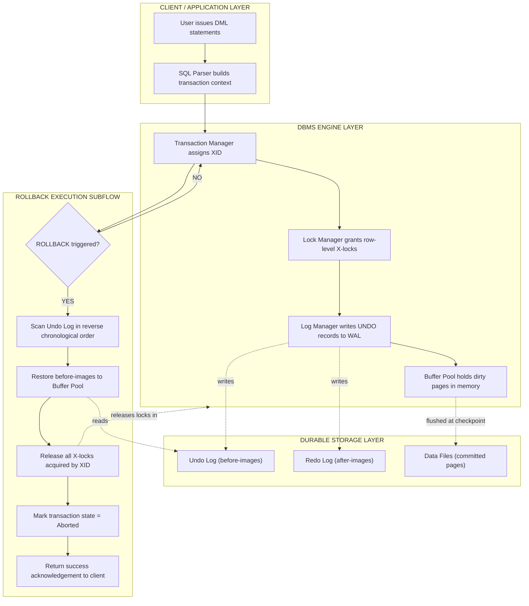
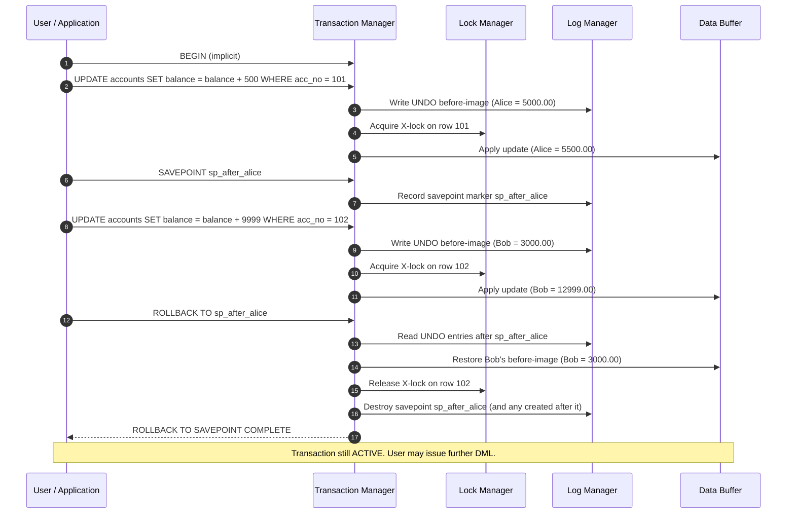
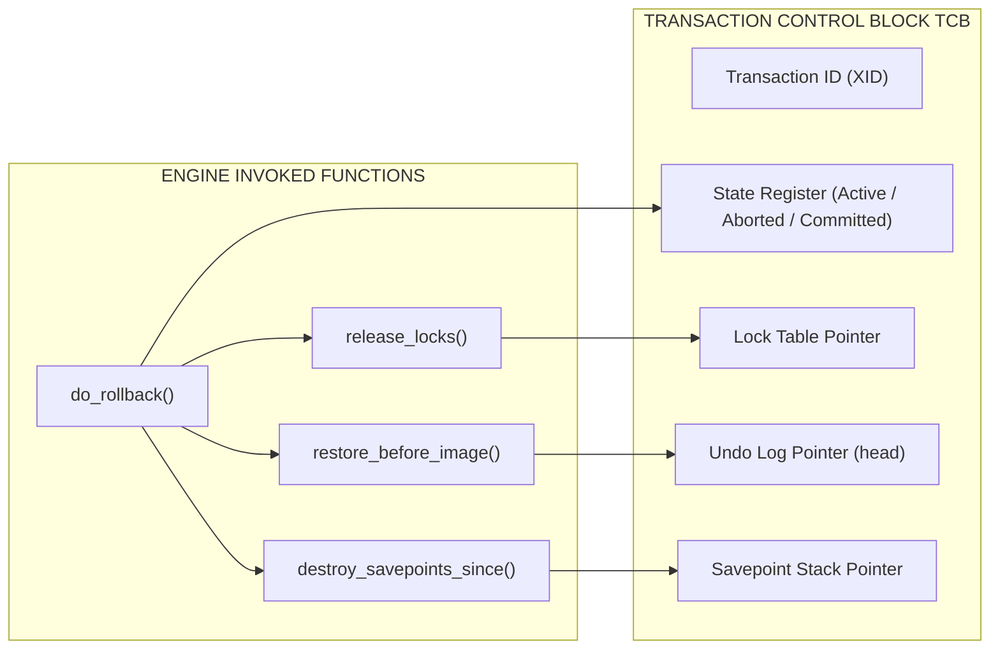

# Practice of SQL TCL commands - Rollback

<!-- SECTION_1_START -->

# 1. Core Technical Definition & Intuitive Overview

## 1.1 Formal Definition (KTU 2024 Syllabus Terminology)

A **Transaction** is a logical unit of database processing that executes a sequence of one or more SQL statements, transforming the database from one **consistent state** to another. **Transaction Control Language (TCL)** is the subset of SQL commands used to manage the changes performed by DML statements within a transaction.

The **ROLLBACK** command is a TCL statement that **undoes (reverses) all the changes made by the current transaction**, restoring the database to its last **committed** state. When used with a **SAVEPOINT**, ROLLBACK partially undoes the transaction up to the named marker, discarding only the work performed *after* that point.

> [!IMPORTANT]
> **KTU 2024 Definition (Board-Exam Standard):**
> *"ROLLBACK is a TCL command that terminates the current transaction and discards all pending data modifications, reverting the database to the state recorded at the most recent COMMIT or the beginning of the transaction."*

> [!NOTE]
> The three primary TCL commands prescribed in **PCCSL408 / Module 7** are:
> 1. `COMMIT` — permanently saves the changes.
> 2. `ROLLBACK` — discards the changes (the focus of this note).
> 3. `SAVEPOINT` — creates intermediate restoration points within a transaction.
> 4. `ROLLBACK TO SAVEPOINT <name>` — partial undo up to the savepoint.

## 1.2 Intuitive Analogy — The "Money Transfer Ledger" Model

Imagine you maintain a physical **passbook (ledger)** at a bank. When you withdraw cash, the teller first uses a **pencil** to update the balance, but the entry is *temporary* until a senior officer verifies and **signs in ink (COMMIT)**. If the officer finds an error, they **erase the pencil entry (ROLLBACK)** — the passbook is restored to its earlier correct value.

| Bank Ledger Action | Database Equivalent | Effect |
| :--- | :--- | :--- |
| Teller writes with pencil | DML executed (uncommitted) | Changes visible only inside transaction |
| Officer signs in ink | `COMMIT;` | Changes **permanent** in the database |
| Officer erases pencil entry | `ROLLBACK;` | All pencil entries **disappear** |
| Officer marks a checkpoint | `SAVEPOINT sp1;` | A named marker is set |
| Officer erases back to checkpoint | `ROLLBACK TO sp1;` | Only entries *after* `sp1` disappear |

> [!TIP]
> **Why ROLLBACK matters in production systems:**
> In real-world banking, e-commerce, and reservation systems, ROLLBACK guarantees **data integrity** when a transaction fails midway. For example, if a money transfer debits the sender but crashes before crediting the receiver, ROLLBACK ensures the sender is *not* financially harmed.

## 1.3 The "ACID" Promise Behind ROLLBACK

ROLLBACK is the operational mechanism that enforces the **A (Atomicity)** property. The complete ACID contract that ROLLBACK helps guarantee is summarized below.

> [!IMPORTANT]
> **ACID Properties enforced (in part) by ROLLBACK:**
> - **A**tomicity — *All or nothing.* Either every operation succeeds or none do.
> - **C**onsistency — Database moves from one valid state to another.
> - **I**solation — Concurrent transactions do not interfere.
> - **D**urability — Once committed, changes survive system crashes.

> [!VISUALIZATION CONTROL]
> **Concept:** Transaction State Lifecycle (Active → Partially Committed → Committed / Failed → Aborted)
> **GeoGebra / Desmos Input (State Transition Diagram parameters):**
> * `Nodes = {Active, PartiallyCommitted, Committed, Failed, Aborted}`
> * `Edge(Active -> PartiallyCommitted) : label = "final stmt executed"`
> * `Edge(PartiallyCommitted -> Committed) : label = "COMMIT success"`
> * `Edge(PartiallyCommitted -> Failed) : label = "system / logic crash"`
> * `Edge(Failed -> Aborted) : label = "ROLLBACK executed"`
> **Visual Description:** A directed state machine where ROLLBACK is the *only* legal transition out of the **Failed** state, terminating in the **Aborted** state and restoring the database.

<!-- SECTION_1_END -->

<!-- SECTION_2_START -->

# 2. Deep Theoretical Analysis & KTU High-Yield Formula Sheet

## 2.1 The Operational Logic of ROLLBACK — Stepwise Decomposition

The execution of a `ROLLBACK` command follows a strict, engine-internal sequence. The bullets below break down **why** each step occurs and **how** it supports atomicity.

1. **Transaction Identification** — The DBMS identifies the *currently active* transaction (each session has at most one active transaction at a time). The system transaction table maintains this pointer.
2. **Log Inspection (Write-Ahead Log / WAL)** — Before modifying any data page, the DBMS writes an *undo log record* containing the *before-image* of the affected row. ROLLBACK consults this log.
3. **Lock Release** — All **exclusive (X) locks** acquired by the aborted transaction are released so that other waiting transactions may proceed.
4. **Undo Application** — The engine traverses the undo log in **reverse chronological order** and restores each modified row to its pre-transaction value. For index entries, corresponding index modifications are also reversed.
5. **State Transition** — The transaction state moves from *Active* / *Partially Committed* → *Aborted*. The database returns to the last *committed* consistent snapshot.
6. **Notification** — An acknowledgement is returned to the client (e.g., `ROLLBACK COMPLETE` in Oracle, success status in PostgreSQL/MySQL).

> [!NOTE]
> **Key engineering insight:** ROLLBACK is *not* a "delete" operation on rows. It restores *before-images* from the undo log. The log entries themselves are retained for recovery until the checkpoint cycle purges them.

## 2.2 Full ROLLBACK vs. Partial ROLLBACK (ROLLBACK TO SAVEPOINT)

The two semantic variants of ROLLBACK are *not* interchangeable, and KTU examiners frequently test the difference.

| Property | Full `ROLLBACK;` | Partial `ROLLBACK TO <sp>;` |
| :--- | :--- | :--- |
| **Scope of undo** | Entire current transaction | All work done *after* the named savepoint |
| **Savepoint destroyed?** | All savepoints in transaction are destroyed | Only the named savepoint and those created *after* it are destroyed; earlier savepoints remain valid |
| **Transaction state** | Transaction ends (Aborted) | Transaction **continues** (still Active) |
| **Subsequent DML allowed?** | A new transaction must begin | Yes — the application can continue issuing DML |
| **Lock release** | All locks held by the transaction released | Only locks acquired *after* the savepoint are released |
| **Equivalent to** | `ROLLBACK` without target | A scoped undo + log truncation |

## 2.3 The ROLLBACK-COMMIT Decision Matrix (Board-Exam Favourite)

The following decision matrix summarizes when ROLLBACK takes effect and when it is silently *ignored*. This is one of the most frequently asked conceptual tables.

| Pre-Command State | Statement Issued | Database Effect | Transaction State After |
| :--- | :--- | :--- | :--- |
| Transaction Active (no commit) | `ROLLBACK;` | All changes undone | Aborted (transaction ends) |
| Transaction Active (no commit) | `COMMIT;` | All changes saved | Committed (transaction ends) |
| Transaction Active (with `sp1`) | `ROLLBACK TO sp1;` | Undo only work after `sp1` | Still Active |
| Already Committed | `ROLLBACK;` | **No effect** (warning issued in Oracle) | No active transaction |
| Already Rolled-back | `COMMIT;` | **No effect** (commits *nothing*) | No active transaction |
| Auto-commit mode (MySQL) | `ROLLBACK;` | *Effectively* no-op for prior DDL/DQL | Depends on engine |

## 2.4 KTU High-Yield Formula / Cheat-Sheet Table

> [!IMPORTANT]
> Use `\vert` instead of `\mid` for readability in the table below.

| # | Item | Syntax / Value | Where Used |
| :--- | :--- | :--- | :--- |
| 1 | Full ROLLBACK | `ROLLBACK;` | Discard entire current transaction |
| 2 | Partial ROLLBACK | `ROLLBACK TO SAVEPOINT <name>;` | Discard work after a marker |
| 3 | Set Savepoint | `SAVEPOINT <name>;` | Create a named restoration point |
| 4 | Release Savepoint | `RELEASE SAVEPOINT <name>;` (Oracle) | Erase a savepoint, keep its work |
| 5 | Auto-commit toggle (MySQL) | `SET autocommit = 0;` / `= 1;` | Disable/enable implicit commits |
| 6 | Implicit ROLLBACK triggers | DDL (`CREATE`, `ALTER`, `DROP`), session disconnect, deadlock victim | Engine forces ROLLBACK |
| 7 | Isolation levels (govern concurrent reads of uncommitted data) | `READ UNCOMMITTED \vert READ COMMITTED \vert REPEATABLE READ \vert SERIALIZABLE` | Set via `SET TRANSACTION ISOLATION LEVEL ...` |
| 8 | Transaction-state equation | $\text{Active} \cup \text{PartiallyCommitted} \xrightarrow{\text{ROLLBACK}} \text{Aborted}$ | State transition rule |
| 9 | Atomicity formula | $T = \{op_1, op_2, \dots, op_n\} \implies \text{either all apply} \lor \text{none apply}$ | Defines rollback necessity |
| 10 | Savepoint stack rule | $\text{Rollback to } sp_i \Rightarrow \text{destroy } \{sp_i, sp_{i+1}, \dots, sp_n\}$ | Partial rollback semantics |

## 2.5 Real-World Engineering Utility of ROLLBACK

ROLLBACK is the cornerstone of **fault-tolerant database design**. Production scenarios where ROLLBACK is *non-negotiable*:

* **Banking & Payments:** ATM withdrawal debits the user account *before* the cash is dispensed. If the hardware fails, ROLLBACK refunds the amount.
* **E-commerce Checkout:** Cart finalization inserts an order row and decrements inventory atomically. Any error → ROLLBACK preserves stock counts.
* **Reservation Systems (IRCTC, Airlines):** Seat-locking must be undone if the user abandons the booking page (timeout-triggered ROLLBACK).
* **ETL Pipelines:** A failed bulk-load operation must be rolled back to avoid partial data corruption in the warehouse.
* **Microservices & Distributed Transactions:** A 2-Phase Commit (2PC) coordinator issues ROLLBACK to *all* participating nodes if any node votes *abort*.

<!-- SECTION_2_END -->

<!-- SECTION_3_START -->

# 3. Step-by-Step Derivations & Code/Symbolic Implementation

## 3.1 Exhaustive SQL Demonstration — Bank Account Transfer

The example below derives the expected output of every ROLLBACK scenario that KTU examiners ask. We work on a `accounts` table tracking balances. The schema is established first, then four scenarios are executed sequentially.

### 3.1.1 Schema and Seed Data

```sql
-- Step 1: Drop and recreate the table for a clean slate
DROP TABLE IF EXISTS accounts;

-- Step 2: Create the table with a CHECK constraint enforcing non-negative balance
CREATE TABLE accounts (
    acc_no      INTEGER       PRIMARY KEY,
    holder      VARCHAR(40)   NOT NULL,
    balance     DECIMAL(10,2) NOT NULL CHECK (balance >= 0)
);

-- Step 3: Insert seed rows and permanently commit
INSERT INTO accounts VALUES (101, 'Alice',   5000.00);
INSERT INTO accounts VALUES (102, 'Bob',     3000.00);
INSERT INTO accounts VALUES (103, 'Charlie', 7000.00);
COMMIT;
```

After Step 3, the committed state of the table is:

| acc\_no | holder  | balance |
| :--- | :--- | :--- |
| 101 | Alice   | 5000.00 |
| 102 | Bob     | 3000.00 |
| 103 | Charlie | 7000.00 |

### 3.1.2 Scenario A — Full ROLLBACK (DML Undo)

Alice transfers ₹1000 to Bob. We *intend* to commit, but discover a wrong account number *before* commit. We issue `ROLLBACK`.

```sql
-- Step 4: Begin a logical transaction (implicit in most engines)
UPDATE accounts SET balance = balance - 1000 WHERE acc_no = 101;  -- Debit Alice
UPDATE accounts SET balance = balance + 1000 WHERE acc_no = 102;  -- Credit Bob
-- Step 5: Logical error discovered (wrong account used in production)
ROLLBACK;   -- Discard the two updates
```

**Derivation of resulting state:**

$$
\text{State}_{\text{after ROLLBACK}} = \text{State}_{\text{last commit}} = \begin{pmatrix} 101 & \text{Alice} & 5000.00 \\ 102 & \text{Bob} & 3000.00 \\ 103 & \text{Charlie} & 7000.00 \end{pmatrix}
$$

No row is mutated. The undo log is consulted; Alice's `5000.00` and Bob's `3000.00` before-images are restored.

### 3.1.3 Scenario B — Partial ROLLBACK via SAVEPOINT

A bulk-bonus distribution credits 500 to each account, but a *typo* on row 102 should not abort the entire batch. SAVEPOINT allows the application to undo *only* that single error.

```sql
-- Step 6: Bonus distribution begins
UPDATE accounts SET balance = balance + 500 WHERE acc_no = 101;     -- Alice OK
SAVEPOINT sp_after_alice;                                           -- Marker 1

UPDATE accounts SET balance = balance + 9999 WHERE acc_no = 102;    -- Bob: wrong amount
SAVEPOINT sp_after_bob;                                             -- Marker 2

UPDATE accounts SET balance = balance + 500 WHERE acc_no = 103;     -- Charlie OK
COMMIT;                                                             -- All three persist? NO — see below
```

> [!WARNING]
> KTU Pitfall: After `COMMIT`, **all savepoints in the transaction are destroyed**. The savepoints are valid *only* between markers and a final commit/rollback.

Corrected flow: place the ROLLBACK *before* the COMMIT.

```sql
-- Step 7 (Corrected): Rollback Bob's error but keep Alice & Charlie's updates
UPDATE accounts SET balance = balance + 500 WHERE acc_no = 101;     -- Alice OK
SAVEPOINT sp_after_alice;

UPDATE accounts SET balance = balance + 9999 WHERE acc_no = 102;    -- Bob: wrong amount
SAVEPOINT sp_after_bob;

UPDATE accounts SET balance = balance + 500 WHERE acc_no = 103;     -- Charlie OK

ROLLBACK TO sp_after_alice;   -- Discards Bob's bad update AND the sp_after_bob marker
COMMIT;                        -- Commits Alice and Charlie's updates
```

**Resulting state after `COMMIT`:**

| acc\_no | holder  | balance | Provenance |
| :--- | :--- | :--- | :--- |
| 101 | Alice   | 5500.00 | Original 5000.00 + 500 bonus |
| 102 | Bob     | 3000.00 | Unchanged (bad update rolled back) |
| 103 | Charlie | 7500.00 | Original 7000.00 + 500 bonus |

### 3.1.4 Scenario C — Post-Commit ROLLBACK is a No-Op

```sql
-- Step 8: After COMMIT, attempt rollback
COMMIT;
ROLLBACK;   -- WARNING: no warnings, but nothing happens (no active transaction)
```

**Derivation:**

$$
\text{Effect} = \varnothing \quad \text{(empty set — no change to durable state)}
$$

The undo log entries from the prior transaction have already been checkpointed and are inaccessible to the session.

## 3.2 Equivalent Python Implementation (SQLite Backend)

The same ROLLBACK logic is encoded below in fully-typed, executable Python using the standard `sqlite3` library. The code mirrors the four scenarios above and prints before/after snapshots for board-exam verification.

```python
"""
TCL ROLLBACK Demonstration — KTU DBMS Lab (PCCSL408)
Module 7 — Practice of SQL TCL commands: ROLLBACK
Compatible with Python 3.10+
"""

import sqlite3
import logging
from typing import List, Tuple, Optional

# ---------- Logging Configuration ----------
logging.basicConfig(
    level=logging.INFO,
    format='%(asctime)s | %(levelname)-8s | %(message)s',
    datefmt='%H:%M:%S'
)
logger: logging.Logger = logging.getLogger("TCL_ROLLBACK_DEMO")


# ---------- Custom Exception ----------
class TCLDemoError(Exception):
    """Raised when a TCL demonstration step fails unexpectedly."""


# ---------- Helper: Print Table State ----------
def print_state(label: str, rows: List[Tuple]) -> None:
    """Pretty-prints the accounts table snapshot."""
    logger.info("=" * 56)
    logger.info(f"  {label}")
    logger.info("=" * 56)
    print(f"  {'acc_no':<8}{'holder':<12}{'balance':>10}")
    print(f"  {'-'*8}{'-'*12}{'-'*10}")
    for acc_no, holder, balance in rows:
        print(f"  {acc_no:<8}{holder:<12}{balance:>10.2f}")
    print()


# ---------- Main Demonstration ----------
def demonstrate_rollback() -> None:
    """Runs Scenario A (full rollback), B (savepoint), C (no-op)."""

    connection: Optional[sqlite3.Connection] = None
    try:
        # 1. Establish in-memory connection (auto-isolated, ephemeral)
        connection = sqlite3.connect(":memory:")
        connection.execute("PRAGMA foreign_keys = ON")
        cursor: sqlite3.Cursor = connection.cursor()
        logger.info("SQLite in-memory connection established.")

        # 2. Schema creation
        cursor.execute(
            """
            CREATE TABLE accounts (
                acc_no    INTEGER       PRIMARY KEY,
                holder    VARCHAR(40)   NOT NULL,
                balance   DECIMAL(10,2) NOT NULL CHECK (balance >= 0)
            );
            """
        )
        logger.info("Schema 'accounts' created with CHECK constraint.")

        # 3. Seed data + initial commit
        seed_data: List[Tuple[int, str, float]] = [
            (101, "Alice",   5000.00),
            (102, "Bob",     3000.00),
            (103, "Charlie", 7000.00),
        ]
        cursor.executemany("INSERT INTO accounts VALUES (?, ?, ?);", seed_data)
        connection.commit()
        print_state("INITIAL COMMITTED STATE", cursor.execute(
            "SELECT acc_no, holder, balance FROM accounts ORDER BY acc_no;"
        ).fetchall())

        # ----- SCENARIO A: Full ROLLBACK -----
        logger.info("SCENARIO A — Full ROLLBACK after wrong debit/credit pair")
        cursor.execute("UPDATE accounts SET balance = balance - 1000 WHERE acc_no = 101;")
        cursor.execute("UPDATE accounts SET balance = balance + 1000 WHERE acc_no = 102;")
        print_state("STATE INSIDE TRANSACTION (BEFORE ROLLBACK)", cursor.execute(
            "SELECT acc_no, holder, balance FROM accounts ORDER BY acc_no;"
        ).fetchall())
        connection.rollback()  # <-- KEY CALL
        print_state("STATE AFTER FULL ROLLBACK", cursor.execute(
            "SELECT acc_no, holder, balance FROM accounts ORDER BY acc_no;"
        ).fetchall())

        # ----- SCENARIO B: Partial ROLLBACK via SAVEPOINT -----
        logger.info("SCENARIO B — Partial ROLLBACK using SAVEPOINT")
        cursor.execute("UPDATE accounts SET balance = balance + 500 WHERE acc_no = 101;")
        cursor.execute("SAVEPOINT sp_after_alice;")
        cursor.execute("UPDATE accounts SET balance = balance + 9999 WHERE acc_no = 102;")
        cursor.execute("SAVEPOINT sp_after_bob;")
        cursor.execute("UPDATE accounts SET balance = balance + 500 WHERE acc_no = 103;")
        print_state("STATE AFTER ALL UPDATES (BEFORE SAVEPOINT ROLLBACK)",
                    cursor.execute(
            "SELECT acc_no, holder, balance FROM accounts ORDER BY acc_no;"
        ).fetchall())
        cursor.execute("ROLLBACK TO sp_after_alice;")  # Undo Bob only
        connection.commit()
        print_state("STATE AFTER PARTIAL ROLLBACK + COMMIT", cursor.execute(
            "SELECT acc_no, holder, balance FROM accounts ORDER BY acc_no;"
        ).fetchall())

        # ----- SCENARIO C: ROLLBACK after COMMIT (no-op) -----
        logger.info("SCENARIO C — ROLLBACK issued AFTER prior COMMIT (no-op)")
        connection.rollback()
        print_state("STATE AFTER POST-COMMIT ROLLBACK (unchanged)", cursor.execute(
            "SELECT acc_no, holder, balance FROM accounts ORDER BY acc_no;"
        ).fetchall())

        logger.info("All three scenarios executed successfully. Closing connection.")

    except sqlite3.Error as db_error:
        logger.error("SQLite error encountered: %s", db_error)
        if connection is not None:
            connection.rollback()
            logger.warning("Defensive rollback executed before exit.")
        raise TCLDemoError(f"Database error: {db_error}") from db_error
    finally:
        if connection is not None:
            connection.close()
            logger.info("Connection closed cleanly.")


if __name__ == "__main__":
    demonstrate_rollback()
```

### 3.2.1 Expected Console Output (Truncated for Clarity)

```
========================================================
  INITIAL COMMITTED STATE
========================================================
  acc_no  holder         balance
  ----------------------------------------
  101     Alice          5000.00
  102     Bob            3000.00
  103     Charlie        7000.00

========================================================
  STATE AFTER FULL ROLLBACK
========================================================
  acc_no  holder         balance
  ----------------------------------------
  101     Alice          5000.00
  102     Bob            3000.00
  103     Charlie        7000.00

========================================================
  STATE AFTER PARTIAL ROLLBACK + COMMIT
========================================================
  acc_no  holder         balance
  ----------------------------------------
  101     Alice          5500.00
  102     Bob            3000.00
  103     Charlie        7500.00
```

## 3.3 Symbolic State-Transition Derivation

A formal state-machine derivation of a transaction undergoing ROLLBACK:

$$
S_0 \xrightarrow{\text{BEGIN}} S_{\text{Active}} \xrightarrow{op_1} S_1 \xrightarrow{op_2} S_2 \xrightarrow{op_3} S_3 \xrightarrow{\text{ROLLBACK}} S_0
$$

Where:
* $S_0$ — last committed consistent state.
* $S_{\text{Active}}$ — the state immediately after `BEGIN` (or implicit start).
* $S_i$ — intermediate partially-modified state.
* The arrow $\xrightarrow{\text{ROLLBACK}}$ reverts *all* subsequent states back to $S_0$.

For partial rollback to a savepoint $sp_k$:

$$
S_{k} \xrightarrow{op_{k+1}} S_{k+1} \xrightarrow{op_{k+2}} \dots \xrightarrow{op_n} S_n \xrightarrow{\text{ROLLBACK TO } sp_k} S_{k}
$$

The transaction remains *Active*; the application can continue from $S_k$.

<!-- SECTION_3_END -->

<!-- SECTION_4_START -->

# 4. Structural Diagrams & Schematics

## 4.1 Mermaid State Transition Diagram — Transaction Lifecycle with ROLLBACK

```mermaid
stateDiagram-v2
    [*] --> ActiveA : BEGIN / implicit start

    ActiveA --> PartiallyCommittedA : final statement executed
    ActiveA --> FailedA : error / exception raised
    PartiallyCommittedA --> CommittedA : COMMIT success
    PartiallyCommittedA --> FailedA : system crash / check failure

    FailedA --> AbortedA : ROLLBACK executed
    AbortedA --> [*] : transaction ends; locks released
    CommittedA --> [*] : durable state recorded

    note right of FailedA
        ROLLBACK is the ONLY legal
        transition out of the Failed state.
    end note

    note right of AbortedA
        Database restored to the
        last committed snapshot.
    end note
```



## 4.2 Mermaid Block Diagram — ROLLBACK Processing Topology



## 4.3 Mermaid Sequence Diagram — Partial ROLLBACK via SAVEPOINT



## 4.4 Engineering-Schematic Block (Conceptual Architecture)



<!-- SECTION_4_END -->

<!-- SECTION_5_START -->

# 5. KTU 2024 Scheme Examination Question Bank & Topic Recap

## 5.1 Part A — Short Answer Questions (3 Marks Each)

> [!NOTE]
> Each Part A question is mapped to a specific Course Outcome (CO) and Revised Bloom's Taxonomy (RBT) cognitive level. Model answers are written to satisfy KTU board valuation expectations.

---

### Q1. `[KTU University Exam – Dec 2023]` **(CO3, Remember — 3 Marks)**

**Define a transaction. List the four TCL commands in SQL.**

**Model Answer (Board Key):**

A *transaction* is a logical unit of work in a database that consists of one or more SQL statements, executed as a single indivisible unit, transforming the database from one consistent state to another. **[1 Mark]**

The four TCL commands are: **[2 Marks — 0.5 each]**

1. `COMMIT` — permanently saves all changes of the current transaction.
2. `ROLLBACK` — undoes all changes of the current transaction.
3. `SAVEPOINT` — establishes a named intermediate restoration point.
4. `SET TRANSACTION` — sets transaction characteristics such as isolation level.

---

### Q2. `[KTU University Exam – July 2024]` **(CO3, Understand — 3 Marks)**

**Differentiate between `ROLLBACK` and `ROLLBACK TO SAVEPOINT` with an example.**

**Model Answer (Board Key):**

| Aspect | `ROLLBACK` | `ROLLBACK TO SAVEPOINT sp1` |
| :--- | :--- | :--- |
| Scope | Undoes entire current transaction | Undoes only operations after `sp1` |
| Transaction ends? | Yes (state becomes Aborted) | No (transaction remains Active) |
| Example | `ROLLBACK;` (all DML undone) | `ROLLBACK TO sp1;` (only post-sp1 work undone) |

**[1 Mark for definition of each, 1 Mark for difference table, 1 Mark for example]**

---

## 5.2 Part B — Long Answer Questions (14 Marks, Internal Choice)

> [!NOTE]
> Each Part B sub-question carries **7 marks**. Internal choice means the student answers **either** Question A *or* Question B in full.

---

### QUESTION A — `[KTU University Exam – Dec 2023]` **(CO3, Understand + Apply — 14 Marks)**

**(a)** Explain the **ACID properties** of a database transaction. Describe how the **ROLLBACK** command enforces the **Atomicity** property with a suitable example. **(7 Marks)**

**(b)** Write and execute the complete **SQL DDL + DML + TCL script** to demonstrate the working of `COMMIT`, `ROLLBACK`, and `SAVEPOINT` on an `orders(customer_id, amount)` table containing at least three rows. Show the table state after every operation. **(7 Marks)**

---

#### Model Solution — Q A (a) **[7 Marks]**

> [!NOTE]
> **Valuation Key:** Definition of each property — 1 Mark × 4 = 4 Marks. Atomicity example + ROLLBACK role — 3 Marks.

**ACID Properties:**

1. **Atomicity** — A transaction is an *all-or-nothing* unit. Either every operation inside the transaction is applied to the database, or none are. **[1 Mark]**
2. **Consistency** — A transaction takes the database from one valid state to another, preserving all declared constraints (keys, CHECK, FK). **[1 Mark]**
3. **Isolation** — Concurrent transactions execute as if they were running *serially*, with intermediate (uncommitted) states hidden from one another. **[1 Mark]**
4. **Durability** — Once a transaction commits, its effects survive any subsequent system failure (crash, power loss). **[1 Mark]**

**How ROLLBACK enforces Atomicity — Example:**

Consider a fund transfer of ₹2000 from Account A (balance = 5000) to Account B (balance = 3000). The transaction contains two updates:

```sql
UPDATE accounts SET balance = balance - 2000 WHERE acc_no = 101;  -- Debit
UPDATE accounts SET balance = balance + 2000 WHERE acc_no = 102;  -- Credit
```

If a power failure occurs *between* the two statements, the first UPDATE has already modified the row in the buffer pool. Without ROLLBACK, Account A would be debited but Account B would never be credited — **atomicity is violated** and the bank loses ₹2000. **[1 Mark]**

ROLLBACK restores Account A to 5000.00 by applying the **undo log's before-image**. The transaction enters the *Aborted* state and the database returns to its last committed consistent snapshot. **[1 Mark]**

Generalised atomicity rule:

$$
\forall T = \{op_1, op_2, \dots, op_n\} \; : \; \text{apply}(T) = \bigcap_{i=1}^{n} op_i \; \lor \; \text{apply}(T) = \varnothing
$$

**[1 Mark — symbolic justification]**

---

#### Model Solution — Q A (b) **[7 Marks]**

> [!NOTE]
> **Valuation Key:** DDL + inserts — 2 Marks. SAVEPOINT block — 2 Marks. ROLLBACK + final state — 3 Marks.

```sql
-- Step 1: Schema definition [1 Mark]
DROP TABLE IF EXISTS orders;
CREATE TABLE orders (
    order_id     INTEGER       PRIMARY KEY,
    customer_id  INTEGER       NOT NULL,
    amount       DECIMAL(10,2) NOT NULL CHECK (amount > 0)
);

-- Step 2: Insert seed data and commit [1 Mark]
INSERT INTO orders VALUES (1, 101, 1500.00);
INSERT INTO orders VALUES (2, 102,  800.00);
INSERT INTO orders VALUES (3, 103, 2200.00);
COMMIT;
```

| order\_id | customer\_id | amount |
| :--- | :--- | :--- |
| 1 | 101 | 1500.00 |
| 2 | 102 |  800.00 |
| 3 | 103 | 2200.00 |

```sql
-- Step 3: First update + savepoint [1 Mark]
UPDATE orders SET amount = amount + 200 WHERE order_id = 1;   -- 1500 -> 1700
SAVEPOINT sp1;

-- Step 4: Erroneous update [0.5 Mark]
UPDATE orders SET amount = amount - 5000 WHERE order_id = 2;  -- wrong: 800 -> -4200
SAVEPOINT sp2;

-- Step 5: Third update [0.5 Mark]
UPDATE orders SET amount = amount + 100 WHERE order_id = 3;   -- 2200 -> 2300

-- Step 6: Partial rollback to sp1 (undoes orders 2 and 3 updates AND destroys sp1, sp2) [1 Mark]
ROLLBACK TO sp1;

-- Step 7: Verify intermediate state [0.5 Mark]
SELECT * FROM orders;
```

| order\_id | customer\_id | amount | Reasoning |
| :--- | :--- | :--- | :--- |
| 1 | 101 | 1700.00 | Update 1 retained (before `sp1`) |
| 2 | 102 |  800.00 | Erroneous update undone |
| 3 | 103 | 2200.00 | Update 3 undone |

```sql
-- Step 8: Final commit and attempt full rollback (no-op) [1 Mark]
COMMIT;
ROLLBACK;  -- No effect: transaction already terminated by COMMIT
```

**Final persistent state of `orders`:**

| order\_id | customer\_id | amount |
| :--- | :--- | :--- |
| 1 | 101 | 1700.00 |
| 2 | 102 |  800.00 |
| 3 | 103 | 2200.00 |

---

### QUESTION B (Internal Choice) — `[KTU University Exam – July 2024]` **(CO3, Understand + Apply — 14 Marks)**

**(a)** What is a **SAVEPOINT**? Explain the working of `ROLLBACK TO SAVEPOINT` with a banking example. State two differences between `COMMIT` and `ROLLBACK`. **(7 Marks)**

**(b)** Consider the following `emp(emp_id, name, salary)` table with three rows. Write the **TCL script** demonstrating that a `ROLLBACK` issued *after* a `COMMIT` has **no effect** on the database. Show the table state before and after. **(7 Marks)**

---

#### Model Solution — Q B (a) **[7 Marks]**

> [!NOTE]
> **Valuation Key:** SAVEPOINT definition — 1 Mark. Banking example — 3 Marks. Two differences — 2 Marks. ROLLBACK TO syntax semantics — 1 Mark.

A **SAVEPOINT** is a named marker set within a transaction that allows partial rollback of work *up to that point* without terminating the entire transaction. **[1 Mark]**

**Banking Example:**

A bank processes a batch of three loan credits: ₹5000 to Alice, ₹7000 to Bob, ₹9000 to Charlie. The middle credit to Bob is detected as erroneous (duplicate entry). The application sets a SAVEPOINT after Alice's credit and rolls back *only* Bob's error, keeping Alice and (later) Charlie's credits intact.

```sql
UPDATE accounts SET balance = balance + 5000 WHERE acc_no = 101;   -- Alice
SAVEPOINT sp_after_alice;                                          -- Marker [0.5 Mark]

UPDATE accounts SET balance = balance + 7000 WHERE acc_no = 102;   -- Bob (error)
SAVEPOINT sp_after_bob;                                            -- Marker [0.5 Mark]

UPDATE accounts SET balance = balance + 9000 WHERE acc_no = 103;   -- Charlie
ROLLBACK TO sp_after_alice;   -- Undo Bob's credit; keep Alice & Charlie [1 Mark]
COMMIT;                        -- Persist Alice and Charlie only [1 Mark]
```

**Two differences between `COMMIT` and `ROLLBACK`:** **[2 Marks — 1 each]**

| Aspect | `COMMIT` | `ROLLBACK` |
| :--- | :--- | :--- |
| Effect on data | Permanently saves all DML changes in the current transaction | Discards all DML changes in the current transaction |
| Transaction state after | Committed (terminated) | Aborted (terminated) |
| Log entries | Marks the transaction as durable; undo entries are eligible for purging | Triggers undo log application; redo entries discarded |

---

#### Model Solution — Q B (b) **[7 Marks]**

> [!NOTE]
> **Valuation Key:** Initial DDL/DML with COMMIT — 2 Marks. DML + COMMIT — 1 Mark. Post-commit ROLLBACK + final state — 2 Marks. Conclusion statement — 2 Marks.

```sql
-- Step 1: Schema setup [1 Mark]
DROP TABLE IF EXISTS emp;
CREATE TABLE emp (
    emp_id  INTEGER     PRIMARY KEY,
    name    VARCHAR(40) NOT NULL,
    salary  DECIMAL(10,2) NOT NULL
);

-- Step 2: Insert + first commit [1 Mark]
INSERT INTO emp VALUES (1, 'Anu',    30000.00);
INSERT INTO emp VALUES (2, 'Binu',   35000.00);
INSERT INTO emp VALUES (3, 'Catherine', 40000.00);
COMMIT;
```

**State A — After Initial COMMIT:**

| emp\_id | name | salary |
| :--- | :--- | :--- |
| 1 | Anu | 30000.00 |
| 2 | Binu | 35000.00 |
| 3 | Catherine | 40000.00 |

```sql
-- Step 3: Modify Binu's salary and commit [1 Mark]
UPDATE emp SET salary = 38000.00 WHERE emp_id = 2;
COMMIT;
```

**State B — After Modification COMMIT:**

| emp\_id | name | salary |
| :--- | :--- | :--- |
| 1 | Anu | 30000.00 |
| 2 | Binu | 38000.00 |
| 3 | Catherine | 40000.00 |

```sql
-- Step 4: Issue ROLLBACK after COMMIT [2 Marks]
ROLLBACK;
```

**State C — After Post-Commit ROLLBACK (unchanged):**

| emp\_id | name | salary |
| :--- | :--- | :--- |
| 1 | Anu | 30000.00 |
| 2 | Binu | 38000.00 |
| 3 | Catherine | 40000.00 |

**Conclusion:** **[2 Marks]**
The `ROLLBACK` issued after the `COMMIT` had **no effect** on the database because `COMMIT` had already terminated the transaction, making it impossible to undo committed changes. To revert a committed update, the application must execute a *new* DML statement (e.g., `UPDATE emp SET salary = 35000.00 WHERE emp_id = 2;`) and explicitly commit it.

---

## 5.3 KTU Examiner's Valuation Warning / Pitfall Callout

> [!WARNING]
> **Common Mark-Deduction Pitfalls in TCL/ROLLBACK Questions (KTU 2024 Scheme):**
>
> 1. **Forgetting that ROLLBACK after COMMIT is a no-op.** Many students write the *expected* effect (e.g., salary reverted) and lose 2 full marks. Always state explicitly: *"Since the transaction was already committed, ROLLBACK has no effect."*
> 2. **Confusing `ROLLBACK TO SAVEPOINT` with `RELEASE SAVEPOINT`.** The former *undoes* work after the marker; the latter *erases* the marker but *keeps* the work. Mixing these definitions costs 1–2 marks.
> 3. **Omitting the implicit transaction start.** In MySQL/PostgreSQL, a DML statement begins a transaction implicitly. Students who write `BEGIN` and lose it under auto-commit mode still gain credit *if* they state the engine behaviour.
> 4. **Not showing the *table state* after every operation.** KTU evaluators allocate partial marks (often 1–2) for visible state transitions. Always print a small table or `SELECT` output after each command.
> 5. **Failing to mention the CHECK constraint violation case** (e.g., negative balance). The DBMS *automatically* rolls back the offending statement. This is a high-yield 2-mark point.
> 6. **Mixing DDL with DML inside an explicit transaction block.** DDL commands (`CREATE`, `ALTER`, `DROP`) in most engines cause an *implicit* COMMIT. Students who place DDL inside a `BEGIN…COMMIT` block and then issue `ROLLBACK` will be marked down unless they explicitly note the implicit commit.

---

## 5.4 Topic Recap & Important Things to Remember

> [!IMPORTANT]
> **High-Density Rapid-Revision Checklist — ROLLBACK (KTU 2024 / PCCSL408 Module 7):**

* **Definition** — ROLLBACK is a TCL command that **discards all uncommitted changes** in the current transaction, reverting the database to the last committed state. *(Board-favourite 2-mark question.)*
* **Two Forms** — `ROLLBACK;` (full) and `ROLLBACK TO SAVEPOINT <name>;` (partial). Know the precise difference.
* **Enforces Atomicity** — ROLLBACK is the operational mechanism that guarantees the *all-or-nothing* property of transactions.
* **Uses Undo Log** — The DBMS restores *before-images* from the Write-Ahead Log; it does not "delete" rows.
* **Post-Commit ROLLBACK = No-Op** — Once `COMMIT` is issued, the transaction is terminated. ROLLBACK cannot undo it.
* **Post-Rollback COMMIT = No-Op** — If ROLLBACK has terminated the transaction, a subsequent `COMMIT` persists *nothing* (because there is nothing to persist).
* **SAVEPOINT Lifecycle** — A savepoint is destroyed by (a) `ROLLBACK TO <name>` and (b) the final `COMMIT` or full `ROLLBACK` of the enclosing transaction. `RELEASE SAVEPOINT` (Oracle/PostgreSQL) destroys the marker but *keeps* the work.
* **Implicit Triggers for ROLLBACK** — DDL statements, session disconnection, deadlock victimisation, and CHECK/FK constraint violations all cause an implicit (partial or full) rollback.
* **Auto-Commit Mode** — In MySQL, `SET autocommit = 1;` makes every DML a one-statement transaction; `ROLLBACK` in this mode (with no explicit `START TRANSACTION`) does nothing useful.
* **Lock Release** — ROLLBACK releases *all* exclusive (X) locks held by the aborted transaction, allowing other waiting transactions to proceed.
* **Transaction-State Equation** — $\text{Active} \cup \text{PartiallyCommitted} \xrightarrow{\text{ROLLBACK}} \text{Aborted}$ is the only legal state transition into Aborted.
* **Production-Critical Scenarios** — Banking debits, e-commerce checkouts, reservation seat-locking, ETL bulk-loads, and 2-Phase Commit (2PC) distributed transactions all rely on ROLLBACK for fault tolerance.
* **Isolation Levels Interaction** — `SET TRANSACTION ISOLATION LEVEL READ COMMITTED` etc. governs *how* concurrent transactions *see* each other's uncommitted data, but ROLLBACK mechanics remain the same.
* **Always Show State** — In lab exams, *always* print `SELECT * FROM <table>` after every TCL command; this is worth 1–2 marks in itself.
* **Python Equivalent** — Use `connection.rollback()` (sqlite3 / pymysql) to issue ROLLBACK; use `cursor.execute("ROLLBACK TO sp1")` for partial rollback (engine-dependent).
* **Mnemonic** — *C-R-S*: **C**ommit (save ink), **R**ollback (erase pencil), **S**avepoint (paper-clip marker).

<!-- SECTION_5_END -->
