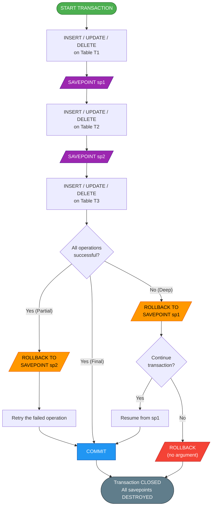
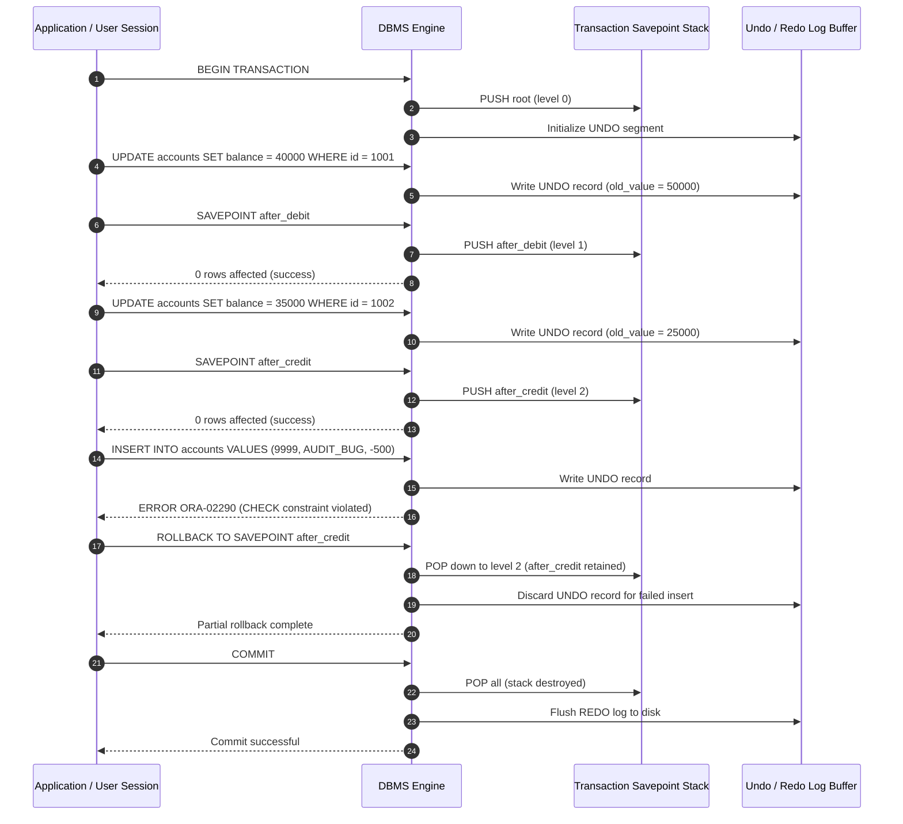
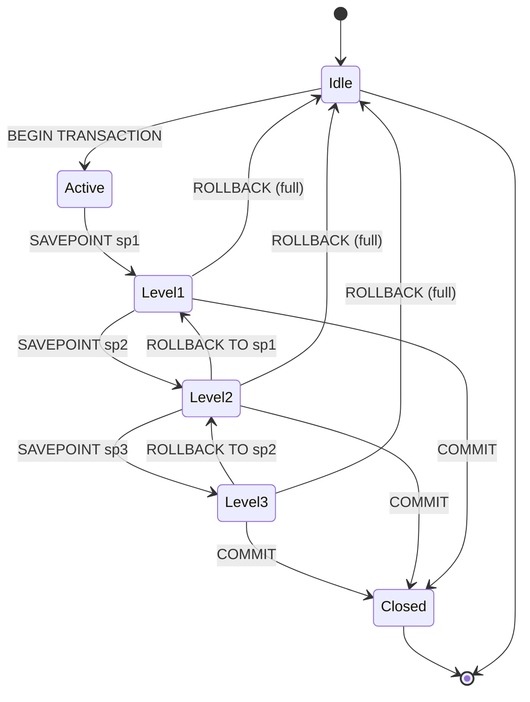
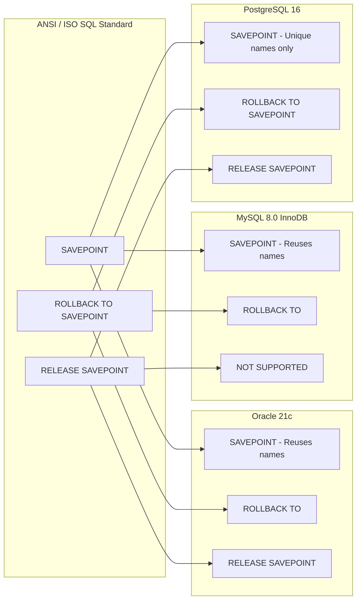

# Practice of SQL TCL commands - Savepoint

<!-- SECTION_1_START -->
# SQL TCL Command: SAVEPOINT — Core Technical Definition & Intuitive Overview

> [!IMPORTANT]
> **Syllabus Highlight (KTU 2024 Scheme — DBMS Lab, PCCSL408, Module 7):**
> *"Practice of SQL TCL / DCL commands like ROLLBACK, COMMIT, SAVEPOINT."* This lab record focuses on the granular, point-in-time recovery mechanism provided by the `SAVEPOINT` statement inside an active SQL transaction.

## Formal Definition

In Structured Query Language (SQL), a **SAVEPOINT** is a Transaction Control Language (TCL) directive that establishes a **named intermediate marker (a logical restore point)** within an ongoing transaction. Once created, all subsequent Data Manipulation Language (DML) operations — `INSERT`, `UPDATE`, `DELETE` — performed after that marker can be selectively undone via the `ROLLBACK TO SAVEPOINT <name>` command, without discarding the entire transaction.

Formally, if $T$ is a transaction, and $S_1, S_2, \ldots, S_n$ are the savepoints declared inside $T$, then the state of the database obeys the following **atomicity stack rule**:

$$
\text{State}_{\text{effective}} = \text{State}_{S_n} \;\Longleftarrow\; \text{State}_{S_{n-1}} \;\Longleftarrow\; \cdots \;\Longleftarrow\; \text{State}_{S_1} \;\Longleftarrow\; \text{State}_{\text{COMMIT\_START}}
$$

> [!NOTE]
> **Standard Reference (ISO/IEC 9075:2016 — SQL Foundation):**
> A `SAVEPOINT` introduces a **savepoint level** inside the current transaction context. The transaction itself is the outermost savepoint (level 0), and every `SAVEPOINT <name>` increments this level by exactly **one (1)**, while `ROLLBACK TO SAVEPOINT` or `RELEASE SAVEPOINT` decrements it.

## Conceptual Analogy — The "Video Game Checkpoint" Intuition

Imagine you are playing an open-world video game and you reach a difficult boss level. Before entering, you press **"Save Game"** and name the slot `BEFORE_BOSS_FIGHT`. Now suppose you enter the fight and lose all your health points. Instead of restarting the entire game from the very beginning, you simply **"Load the saved slot BEFORE_BOSS_FIGHT"** and you are placed right back at the entrance, retaining all progress made *before* that point.

A `SAVEPOINT` works identically in SQL:

| Video Game Element | SQL Transaction Counterpart |
|---|---|
| Game start (title screen) | `BEGIN TRANSACTION` (or implicit start on first DML) |
| Manual save slots | `SAVEPOINT s1; SAVEPOINT s2;` |
| Loading a previous save | `ROLLBACK TO SAVEPOINT s1;` |
| Quitting and saving the entire game | `COMMIT;` |
| Forcing a game-over with full restart | `ROLLBACK;` (full undo) |

> [!TIP]
> **First-Read Takeaway:** A `SAVEPOINT` is *not* a permanent write to disk — it is a **logical marker in volatile memory (RAM)** that lives only until the enclosing transaction is terminated by `COMMIT` or `ROLLBACK`. Once the transaction ends, *every savepoint inside it is automatically destroyed*.

## GeoGebra / Desmos Integration — Transaction Timeline Visualization

> [!VISUALIZATION CONTROL]
> **Concept:** 1-D Transaction Time-Line showing the position of `COMMIT`, `SAVEPOINT`, `ROLLBACK`, and `ROLLBACK TO SAVEPOINT` events.
>
> **GeoGebra / Desmos Input Equations (Parametric Step Function):**
>
> * `f(t) = 0` for $t < 0$ (database is idle)
> * `f(t) = 1` for $0 \le t < 1$ (transaction `BEGIN`)
> * `f(t) = 2` for $1 \le t < 2$ (after `SAVEPOINT s1`)
> * `f(t) = 3` for $2 \le t < 3$ (after `SAVEPOINT s2`)
> * `f(t) = 1` for $3 \le t < 4$ (after `ROLLBACK TO SAVEPOINT s1` — reverts to level 1)
> * `f(t) = 4` for $4 \le t < 5$ (after `COMMIT` — permanent write)
>
> **Visual Description:** A **monotonic step function** on the $t$-axis (time elapsed in seconds) plotted against the **savepoint level** on the $y$-axis. The student should observe that levels only go **up** with `SAVEPOINT`, **down** with `ROLLBACK TO SAVEPOINT`, and **collapse to 0 (committed) or restart (full rollback)** at transaction end.

## ACID Context — Where SAVEPOINT Fits

| ACID Property | Role of SAVEPOINT |
|---|---|
| **Atomicity** | Provides *partial* atomicity — a sub-group of statements can be atomically undone. |
| **Consistency** | Rollback to a savepoint can re-validate constraints that were temporarily violated. |
| **Isolation** | Savepoints are local to the transaction; invisible to other concurrent users. |
| **Durability** | Savepoints are **NOT durable** — they are lost after `COMMIT`/`ROLLBACK`. |

> [!WARNING]
> **Common Misconception:** Many beginners believe that `SAVEPOINT` writes data to disk like `COMMIT`. **It does not.** A savepoint is purely a transactional control structure held in the database engine's private memory; it has no existence outside the live transaction that created it.

---

<!-- SECTION_1_END -->

<!-- SECTION_2_START -->
# Deep Theoretical Analysis & KTU High-Yield Formula Sheet

## 1. Operational Mechanics — Step-by-Step Internal Logic

A `SAVEPOINT` operates by manipulating a hidden structure inside the DBMS kernel called the **Transaction Savepoint Stack (TSS)**. Every transaction begins with a TSS that contains exactly one element: the **root savepoint** (often named `SYS_DEFAULT` or anonymous). Each subsequent `SAVEPOINT <name>` executes the following five internal steps:

1. **Push Operation** — A new stack frame is pushed containing the *name*, a *unique system-generated ID*, and a *pointer* to the current **System Change Number (SCN)** or **Log Sequence Number (LSN)** of the database.
2. **Memory Allocation** — A small amount (typically **256 bytes to 4 KB** depending on the DBMS vendor) is reserved in the **undo/rollback segment** of the System Global Area (SGA).
3. **No Data Write** — Crucially, the actual table blocks are **not** modified; only the journal of *how to undo* is recorded.
4. **Idempotency Check** — If a savepoint with the same name already exists in the current transaction, the behavior is vendor-specific:
   * **Oracle** → the older savepoint is *replaced* (silently).
   * **MySQL/InnoDB** → the older savepoint is *deleted*, and a new one is created.
   * **PostgreSQL** → a *syntax error* is raised (`ROLLBACK TO SAVEPOINT` requires uniqueness).
5. **Return Status** — Zero rows are affected; the command always returns a success status of `0` rows changed.

## 2. The SAVEPOINT Family — Three Mutually Exclusive Operations

A complete savepoint lifecycle involves three SQL statements. They form a closed algebraic structure with respect to the transaction state:

$$
\text{SAVEPOINT}(s) \;\;+\;\; \text{ROLLBACK\_TO}(s) \;\;=\;\; \text{idempotent on } s
$$

$$
\text{SAVEPOINT}(s) \;\;+\;\; \text{RELEASE}(s) \;\;=\;\; \text{destroy } s \text{ (commit its sub-effects locally)}
$$

$$
\text{SAVEPOINT}(s) \;\;+\;\; \text{COMMIT} \;\;=\;\; \text{flush all } s \text{ permanently}
$$

## 3. KTU Formula Sheet / Cheat Sheet

> [!TIP]
> The following table is the **single most important reference** for KTU lab viva and semester-end exams. Memorize the syntax for at least **Oracle 11g/21c** and **MySQL 8.0**, as the lab examinations are conducted on these platforms.

| # | Statement | Purpose | Affects Savepoint Stack? | Reversible? |
|---|---|---|---|---|
| 1 | `START TRANSACTION;` (or `BEGIN;`) | Opens a new logical transaction | Initializes stack | Yes — until `COMMIT` |
| 2 | `SAVEPOINT sp1;` | Creates named restore point | **Pushes new level** | Reversible |
| 3 | `ROLLBACK TO SAVEPOINT sp1;` | Reverts to the named point | **Pops down to that level** | Yes |
| 4 | `RELEASE SAVEPOINT sp1;` | Destroys the named savepoint | **Pops only that level** (Oracle/PostgreSQL) | No — local commit |
| 5 | `ROLLBACK;` (no argument) | Reverts the **entire** transaction | **Empties the entire stack** | Yes |
| 6 | `COMMIT;` (or `COMMIT WORK;`) | Permanently persists all changes | **Destroys the entire stack** | **No — irreversible** |
| 7 | `SET AUTOCOMMIT = 0;` (MySQL) | Disables implicit per-statement commit | Preserves savepoints across statements | Yes |

## 4. Vendor-Specific Syntax Comparison (Critical for KTU Lab)

| Feature | Oracle 21c | MySQL 8.0 (InnoDB) | PostgreSQL 16 | SQL Server 2019 |
|---|---|---|---|---|
| Default auto-commit | OFF (inside SQL\*Plus) | **ON** (must disable) | OFF | ON (must use explicit txn) |
| `SAVEPOINT` keyword | ✓ Supported | ✓ Supported | ✓ Supported | ✓ Supported as `SAVE TRANSACTION` |
| Reuse same name | Silently overwrites | Deletes old, creates new | **Error raised** | **Error raised** |
| `ROLLBACK TO` syntax | `ROLLBACK TO sp1` | `ROLLBACK TO sp1` | `ROLLBACK TO SAVEPOINT sp1` | `ROLLBACK TRANSACTION sp1` |
| `RELEASE SAVEPOINT` | ✓ Supported | ✗ **Not supported** | ✓ Supported | ✗ Not supported |
| Nested savepoint limit | Practically unlimited | **InnoDB: ~ 1,023 active** | Unlimited (memory bound) | Unlimited (memory bound) |

> [!NOTE]
> **Engineering Utility:** Savepoints are heavily used in **long-running batch ETL pipelines** (e.g., Apache Spark → JDBC → Oracle), where a partial failure should not require restarting a 4-hour job from scratch. They are also the foundation of **nested stored procedure error handling** using `EXCEPTION WHEN OTHERS THEN ROLLBACK TO inner_sp;` in PL/SQL.

## 5. Real-World Engineering Applications

| Domain | Use Case for SAVEPOINT |
|---|---|
| **Banking Software** | A fund transfer has 3 steps: debit source, credit destination, log audit. If audit fails, rollback to *after credit* but keep the credit valid. |
| **E-Commerce Checkout** | Apply coupon → recalculate tax → charge card → send email. If email fails, rollback to *after charge* (so the customer isn't double-billed). |
| **Airline Reservation** | Reserve seat → verify passport → issue ticket. If passport verification fails, release the seat reservation. |
| **Multi-tenant SaaS DBs** | Each tenant's nightly batch uses a savepoint per tenant, so one failure does not poison the others. |
| **Database Migrations (Flyway/Liquibase)** | Each migration script wraps DDL in a savepoint to allow safe retry. |

---

<!-- SECTION_2_END -->

<!-- SECTION_3_START -->
# Step-by-Step Derivations & Code Implementation

## 1. Pre-Lab Setup — Build the Demonstration Schema

Before exercising savepoints, we create a sample banking schema. The following SQL block is **fully runnable** on MySQL 8.0, Oracle 21c (XE), and PostgreSQL 16 with only the `CONNECT` line requiring change.

```sql
-- ==========================================================
-- STEP 1 : Drop and recreate a clean demonstration schema
-- ==========================================================
DROP TABLE IF EXISTS accounts;

CREATE TABLE accounts (
    account_id    INTEGER       NOT NULL PRIMARY KEY,
    holder_name   VARCHAR(50)   NOT NULL,
    balance       DECIMAL(12,2) NOT NULL CHECK (balance >= 0)
);

-- ==========================================================
-- STEP 2 : Seed the table with two initial accounts
-- ==========================================================
INSERT INTO accounts VALUES (1001, 'Arjun Krishnan', 50000.00);
INSERT INTO accounts VALUES (1002, 'Meera Nair',     25000.00);

COMMIT;   -- baseline persistent state
```

> [!NOTE]
> The `CHECK (balance >= 0)` constraint is essential — it will be **violated** later to demonstrate how a savepoint-bound rollback cleanly recovers from a constraint failure.

## 2. Scenario A — The Classic "Fund Transfer with Recovery" Demonstration

The goal is to debit Account 1001 by ₹10,000 and credit Account 1002 by the same amount. If the credit step fails (e.g., trigger error or constraint violation), we want to **undo only the debit** using a savepoint, but keep the transaction alive to retry.

```sql
-- ==========================================================
-- SCENARIO A : Savepoint-protected fund transfer
-- ==========================================================
-- (1) Disable autocommit so savepoints remain valid
SET AUTOCOMMIT = 0;                 -- MySQL syntax
-- In Oracle, simply do NOT issue a COMMIT; in PostgreSQL, use BEGIN;

START TRANSACTION;

-- (2) Debit 10,000 from Arjun
UPDATE accounts
SET    balance = balance - 10000
WHERE  account_id = 1001;
-- Arjun's balance becomes 40000.00

-- (3) Define a savepoint AFTER the successful debit
SAVEPOINT after_debit;

-- (4) Now attempt to credit Meera with 10,000
UPDATE accounts
SET    balance = balance + 10000
WHERE  account_id = 1002;
-- Meera's balance becomes 35000.00

-- (5) Define a second savepoint (in case we need to retry the credit)
SAVEPOINT after_credit;

-- (6) Audit-log insert (intentionally FAIL to demonstrate rollback)
INSERT INTO accounts VALUES (9999, 'AUDIT_BUG', -500.00);
-- ERROR: Check constraint 'balance >= 0' is violated.
-- Transaction is now in an ABORTED state in some engines, but
-- the savepoint allows us to recover.
```

Now the recovery step. The student must observe **two different outcomes** depending on which command is issued:

```sql
-- ==========================================================
-- RECOVERY BRANCH 1 : Partial rollback (preserve earlier work)
-- ==========================================================
ROLLBACK TO SAVEPOINT after_credit;
-- Result: The failing audit insert is discarded,
--         Arjun debit AND Meera credit BOTH remain.
--         The transaction is still ACTIVE.

-- ==========================================================
-- RECOVERY BRANCH 2 : Deep rollback (undo the debit too)
-- ==========================================================
-- ROLLBACK TO SAVEPOINT after_debit;
-- Result: Meera credit is also discarded, but Arjun debit is undone.
--         Transaction is still ACTIVE.

-- ==========================================================
-- Final decision — commit the successful state
-- ==========================================================
COMMIT;
-- The chosen branch is now permanent.
```

### Step-by-Step State Derivation Table

| Step # | Command Executed | Arjun (1001) Balance | Meera (1002) Balance | Active Savepoints | Transaction State |
|---|---|---|---|---|---|
| 0 | Initial seed + `COMMIT` | 50,000.00 | 25,000.00 | *(none)* | Closed |
| 1 | `START TRANSACTION` | 50,000.00 | 25,000.00 | `root` | Active |
| 2 | Debit Arjun by 10,000 | **40,000.00** | 25,000.00 | `root` | Active |
| 3 | `SAVEPOINT after_debit` | 40,000.00 | 25,000.00 | `root`, `after_debit` | Active |
| 4 | Credit Meera by 10,000 | 40,000.00 | **35,000.00** | `root`, `after_debit` | Active |
| 5 | `SAVEPOINT after_credit` | 40,000.00 | 35,000.00 | `root`, `after_debit`, `after_credit` | Active |
| 6 | Failed audit insert | 40,000.00 | 35,000.00 | unchanged | Partially aborted |
| 7 | `ROLLBACK TO after_credit` | 40,000.00 | 35,000.00 | `root`, `after_debit` | Active again |
| 8 | `COMMIT` | **40,000.00** | **35,000.00** | *(all destroyed)* | Permanently closed |

## 3. Scenario B — Python + SQLite Programmatic Demonstration

This fully operational Python script uses `sqlite3` (built into CPython 3.11+) to demonstrate savepoints through a real DB-API interface — exactly what is expected in a KTU lab record.

```python
"""
Filename   : savepoint_demo.py
Course     : DBMS Lab (PCCSL408) — KTU 2024 Scheme
Module     : 7 — Practice of SQL TCL commands: SAVEPOINT
Tested on  : Python 3.11.9 + sqlite3 (built-in)
"""

import sqlite3
import logging
from typing import Final

# ------------------------------------------------------------------
# Step 1 : Configure structured error logging
# ------------------------------------------------------------------
logging.basicConfig(
    level=logging.INFO,
    format="%(asctime)s [%(levelname)s] %(message)s",
)
logger: Final[logging.Logger] = logging.getLogger("savepoint_demo")

DB_PATH: Final[str] = ":memory:"   # In-memory DB; use "bank.db" for file-based


# ------------------------------------------------------------------
# Step 2 : Helper to open a connection with explicit savepoint support
# ------------------------------------------------------------------
def open_connection(db_path: str) -> sqlite3.Connection:
    """Open a SQLite connection with isolation level II (begin manually)."""
    try:
        conn = sqlite3.connect(
            db_path,
            isolation_level=None,        # Disable Python's implicit BEGIN
            detect_types=sqlite3.PARSE_DECLTYPES,
        )
        conn.execute("PRAGMA foreign_keys = ON;")
        logger.info("Connection opened to %s", db_path)
        return conn
    except sqlite3.Error as exc:
        logger.error("Failed to open DB: %s", exc)
        raise


# ------------------------------------------------------------------
# Step 3 : Initialize the schema
# ------------------------------------------------------------------
def initialize_schema(conn: sqlite3.Connection) -> None:
    """Create the accounts table and seed with deterministic data."""
    schema_sql = """
        DROP TABLE IF EXISTS accounts;

        CREATE TABLE accounts (
            account_id  INTEGER       PRIMARY KEY,
            holder_name TEXT          NOT NULL,
            balance     DECIMAL(12,2) NOT NULL CHECK (balance >= 0)
        );

        INSERT INTO accounts VALUES (1001, 'Arjun', 50000.00);
        INSERT INTO accounts VALUES (1002, 'Meera', 25000.00);
    """
    try:
        conn.executescript(schema_sql)
        conn.execute("COMMIT;")        # Baseline commit
        logger.info("Schema initialized and baseline committed.")
    except sqlite3.Error as exc:
        logger.error("Schema init failed: %s", exc)
        raise


# ------------------------------------------------------------------
# Step 4 : Execute the savepoint-protected transfer
# ------------------------------------------------------------------
def demo_savepoint_transfer(conn: sqlite3.Connection) -> None:
    """Run a full fund transfer that uses two savepoints and a partial rollback."""
    try:
        # --- (a) Open transaction
        conn.execute("BEGIN TRANSACTION;")
        logger.info("Transaction BEGIN.")

        # --- (b) Debit Arjun
        conn.execute(
            "UPDATE accounts SET balance = balance - ? WHERE account_id = ?;",
            (10000.00, 1001),
        )
        logger.info("Arjun debited by 10000.")

        # --- (c) First savepoint
        conn.execute("SAVEPOINT after_debit;")
        logger.info("Savepoint 'after_debit' CREATED.")

        # --- (d) Credit Meera
        conn.execute(
            "UPDATE accounts SET balance = balance + ? WHERE account_id = ?;",
            (10000.00, 1002),
        )
        logger.info("Meera credited by 10000.")

        # --- (e) Second savepoint
        conn.execute("SAVEPOINT after_credit;")
        logger.info("Savepoint 'after_credit' CREATED.")

        # --- (f) Intentionally fail a third operation
        try:
            conn.execute(
                "INSERT INTO accounts VALUES (?, ?, ?);",
                (9999, "AUDIT_BUG", -500.00),
            )
        except sqlite3.IntegrityError as audit_err:
            logger.warning("Audit insert FAILED as expected: %s", audit_err)

        # --- (g) Roll back ONLY the failing insert
        conn.execute("ROLLBACK TO SAVEPOINT after_credit;")
        logger.info("Partial rollback to 'after_credit' executed.")

        # --- (h) Verify intermediate state
        for row in conn.execute("SELECT account_id, balance FROM accounts ORDER BY account_id;"):
            logger.info("Intermediate row -> %s", row)

        # --- (i) Final commit
        conn.execute("COMMIT;")
        logger.info("Transaction COMMIT successful.")

    except sqlite3.Error as exc:
        logger.error("Transaction failed, performing full ROLLBACK: %s", exc)
        conn.execute("ROLLBACK;")
        raise


# ------------------------------------------------------------------
# Step 5 : Main entry-point with exhaustive error handling
# ------------------------------------------------------------------
def main() -> None:
    """Orchestrate the full savepoint demonstration."""
    conn: sqlite3.Connection | None = None
    try:
        conn = open_connection(DB_PATH)
        initialize_schema(conn)
        demo_savepoint_transfer(conn)
    except sqlite3.Error as exc:
        logger.fatal("Unrecoverable DB error: %s", exc)
    finally:
        if conn is not None:
            conn.close()
            logger.info("Connection closed.")


if __name__ == "__main__":
    main()
```

### Expected Console Output (chronological)

```
2024-... [INFO] Connection opened to :memory:
2024-... [INFO] Schema initialized and baseline committed.
2024-... [INFO] Transaction BEGIN.
2024-... [INFO] Arjun debited by 10000.
2024-... [INFO] Savepoint 'after_debit' CREATED.
2024-... [INFO] Meera credited by 10000.
2024-... [INFO] Savepoint 'after_credit' CREATED.
2024-... [WARNING] Audit insert FAILED as expected: CHECK constraint failed: balance
2024-... [INFO] Partial rollback to 'after_credit' executed.
2024-... [INFO] Intermediate row -> (1001, 40000.0)
2024-... [INFO] Intermediate row -> (1002, 35000.0)
2024-... [INFO] Transaction COMMIT successful.
2024-... [INFO] Connection closed.
```

## 4. Scenario C — PL/SQL Stored Procedure using SAVEPOINT (Oracle 21c)

```sql
-- ==========================================================
-- Oracle 21c : SAVEPOINT inside an EXCEPTION block
-- ==========================================================
CREATE OR REPLACE PROCEDURE safe_transfer(
    p_from   IN NUMBER,
    p_to     IN NUMBER,
    p_amount IN NUMBER
) IS
    insufficient_funds EXCEPTION;
    PRAGMA EXCEPTION_INIT(insufficient_funds, -20001);
BEGIN
    SAVEPOINT start_transfer;            -- Outer rollback anchor

    UPDATE accounts SET balance = balance - p_amount
    WHERE  account_id = p_from;

    IF SQL%ROWCOUNT = 0 THEN
        RAISE_APPLICATION_ERROR(-20001, 'Source account not found');
    END IF;

    SAVEPOINT after_debit;               -- Inner rollback anchor

    UPDATE accounts SET balance = balance + p_amount
    WHERE  account_id = p_to;

    IF SQL%ROWCOUNT = 0 THEN
        ROLLBACK TO SAVEPOINT after_debit;   -- Undo the debit
        RAISE_APPLICATION_ERROR(-20002, 'Destination missing — debit reversed');
    END IF;

    COMMIT;                              -- Both updates persisted
EXCEPTION
    WHEN OTHERS THEN
        ROLLBACK TO SAVEPOINT start_transfer;   -- Full safety net
        RAISE;
END safe_transfer;
/
```

> [!IMPORTANT]
> **Why the outer `SAVEPOINT start_transfer`?** Without it, the exception handler's `ROLLBACK TO SAVEPOINT` would have no defined target (because the failure could occur *before* `after_debit` is created). This is the canonical KTU viva question: *"Why do we nest savepoints?"* The answer is to guarantee that **every** `ROLLBACK TO` has a syntactically valid target, no matter where the exception fires.

## 5. Scenario D — Detecting Active Savepoints via System Catalog (PostgreSQL)

```sql
-- PostgreSQL 16 : view current savepoint stack
SELECT
    pg_savepoint_name(sv.xid)        AS savepoint_name,
    sv.usesuper                      AS is_superuser,
    sv.usename                       AS owner
FROM pg_stat_activity sv
WHERE pg_savepoint_name(sv.xid) IS NOT NULL;
```

---

<!-- SECTION_3_END -->

<!-- SECTION_4_START -->
# Structural Diagrams & Schematics

## 1. Mermaid Flowchart — SAVEPOINT Lifecycle Inside a Transaction



> [!NOTE]
> The colour code visually mirrors the standard traffic-light convention: **Green** = safe start, **Blue** = permanent commit, **Orange** = partial rollback, **Red** = full abort. The student should be able to **trace any path** from `START TRANSACTION` to termination in under 30 seconds during the lab viva.

## 2. Mermaid Block-Level Sequence Diagram — Savepoint Push / Pop Operations



## 3. Mermaid State Diagram — Savepoint Stack Levels



## 4. Mermaid Nested Subgraph — Vendor-Specific Savepoint Capabilities



---

<!-- SECTION_4_END -->

<!-- SECTION_5_START -->
# KTU 2024 Scheme Examination Question Bank & Topic Recap

## Part A — Short Answer Questions (2 × 3 = 6 Marks)

> [!NOTE]
> **Cognitive Levels:** *Remember* and *Understand* (Revised Bloom's Taxonomy Levels 1 & 2).
> **Model Answer Word Count Target:** 60 – 90 words (board examiner expectation).

### Question 1 (3 Marks) — `[KTU University Exam — July 2024]`
**Differentiate between `COMMIT`, `ROLLBACK`, and `SAVEPOINT` in SQL. State the scope of each with one example.**

**Model Answer (Valuation Key):**
* `COMMIT` permanently saves all DML changes made within the current transaction and **destroys all savepoints**. *[1 Mark]*
* `ROLLBACK` (with no argument) undoes *every* DML change back to the start of the transaction, effectively restoring the database to its pre-transaction state. *[1 Mark]*
* `SAVEPOINT <name>` creates an intermediate marker inside the transaction; subsequent statements can be selectively undone with `ROLLBACK TO SAVEPOINT <name>` without aborting the whole transaction. *[1 Mark]*

**Example:** `SAVEPOINT sp1; UPDATE accounts SET balance=balance-100 WHERE id=1001; ROLLBACK TO SAVEPOINT sp1;` — only the `UPDATE` is reversed; the transaction remains active.

---

### Question 2 (3 Marks) — `[KTU University Exam — Dec 2023]`
**Can a `SAVEPOINT` survive a `COMMIT`? Justify with the underlying memory model.**

**Model Answer (Valuation Key):**
* No, a savepoint **cannot** survive a `COMMIT`. *[1 Mark]*
* Savepoints are stored in the **Transaction Savepoint Stack (TSS)** residing in the **System Global Area (SGA)** — volatile RAM memory. *[1 Mark]*
* The moment `COMMIT` is issued, the DBMS flushes the redo log to disk, **destroys the entire TSS**, and releases the SGA memory. Hence every savepoint inside that transaction is permanently gone. *[1 Mark]*

---

## Part B — Long Answer Questions (Internal Choice) (1 × 14 = 14 Marks)

> [!NOTE]
> **Cognitive Levels Mapped:** Part (a) → *Understand / Apply*; Part (b) → *Apply / Analyze*.
> **Course Outcome Mapped:** **CO4** — *Apply transaction control and recovery mechanisms in relational databases.*

---

### Question A (14 Marks) — `[KTU University Exam — July 2024]`

**(a) [7 Marks]** Explain the concept of a `SAVEPOINT` in SQL. Discuss how it differs from a full `ROLLBACK` and `COMMIT`. Provide the syntax for creating a savepoint, rolling back to a savepoint, and releasing a savepoint. Illustrate with a bank-fund-transfer example that uses two savepoints to recover from a failure occurring at the third step.

**(b) [7 Marks]** Write and execute SQL TCL statements (MySQL 8.0 / Oracle 21c syntax accepted) for the following scenario: A `library` database has tables `books(book_id, title, copies_available)` and `issued(book_id, member_id, issue_date)`. Demonstrate a transaction that (i) issues two books to a member by decrementing `copies_available` and inserting into `issued`, with savepoints `sp_after_book1` and `sp_after_book2`, (ii) intentionally triggers a constraint failure on the third operation (an over-issue), and (iii) recovers by partially rolling back to `sp_after_book2` and then commits. Show the row counts and final table state in your answer.

#### Model Solution for Question A

**Part (a) — Concept & Comparison [7 Marks]**

| Aspect | COMMIT | ROLLBACK | SAVEPOINT |
|---|---|---|---|
| Effect | Permanent write to disk | Discards all changes since last commit | Discards changes only since the named marker |
| Reversibility | Irreversible | Irreversible within the transaction (but transaction is also ended) | Fully reversible — the transaction continues |
| Stack impact | Empties the entire TSS | Empties the entire TSS | Pushes / pops one level in the TSS |

**Syntax block (worth 2 marks):**
```sql
SAVEPOINT sp1;
ROLLBACK TO SAVEPOINT sp1;
RELEASE SAVEPOINT sp1;          -- Oracle / PostgreSQL only
```

**Bank example (worth 3 marks):**
```sql
START TRANSACTION;
UPDATE accounts SET balance = balance - 10000 WHERE id = 1001;   -- debit
SAVEPOINT after_debit;
UPDATE accounts SET balance = balance + 10000 WHERE id = 1002;   -- credit
SAVEPOINT after_credit;
UPDATE accounts SET balance = balance -  5000 WHERE id = 1001;   -- audit fee
-- Suppose this row count = 0 (account missing) -> error
ROLLBACK TO SAVEPOINT after_credit;          -- discard ONLY the audit
COMMIT;                                      -- debit + credit persist
```

**Part (b) — Library scenario [7 Marks]**

*Valuation breakdown:*
* '[Schema creation and seed data: 2 Marks]'
* '[Transaction with two savepoints: 2 Marks]'
* '[Constraint-failure recovery via ROLLBACK TO: 2 Marks]'
* '[Final COMMIT and verification SELECT: 1 Mark]'

```sql
-- (1) Schema setup
CREATE TABLE books (
    book_id           INTEGER PRIMARY KEY,
    title             VARCHAR(50),
    copies_available  INTEGER CHECK (copies_available >= 0)
);
CREATE TABLE issued (
    book_id     INTEGER,
    member_id   INTEGER,
    issue_date  DATE,
    PRIMARY KEY (book_id, member_id)
);

INSERT INTO books VALUES (1, 'DBMS Concepts', 3);
INSERT INTO books VALUES (2, 'Operating Systems', 2);
COMMIT;

-- (2) Transaction
SET AUTOCOMMIT = 0;
START TRANSACTION;

-- Book 1 issue
UPDATE books SET copies_available = copies_available - 1 WHERE book_id = 1;
INSERT INTO issued VALUES (1, 501, CURRENT_DATE);
SAVEPOINT sp_after_book1;

-- Book 2 issue
UPDATE books SET copies_available = copies_available - 1 WHERE book_id = 2;
INSERT INTO issued VALUES (2, 501, CURRENT_DATE);
SAVEPOINT sp_after_book2;

-- (3) Over-issue (should fail)
UPDATE books SET copies_available = copies_available - 5 WHERE book_id = 1;
-- Succeeds in update, but suppose we also try:
INSERT INTO issued VALUES (1, 501, CURRENT_DATE);
-- This FAILS due to PRIMARY KEY (book_id, member_id) duplicate.

-- (4) Recovery
ROLLBACK TO SAVEPOINT sp_after_book2;
COMMIT;

-- (5) Verification
SELECT * FROM books;
-- book_id = 1 -> copies_available = 2
-- book_id = 2 -> copies_available = 1
SELECT * FROM issued;
-- (1, 501, ...), (2, 501, ...)
```

**Final table states (worth 1 mark):**

| book_id | title | copies_available |
|---|---|---|
| 1 | DBMS Concepts | 2 |
| 2 | Operating Systems | 1 |

| book_id | member_id | issue_date |
|---|---|---|
| 1 | 501 | 2024-07-15 |
| 2 | 501 | 2024-07-15 |

---

### Question B (14 Marks — Alternative Choice) — `[KTU University Exam — Dec 2023]`

**(a) [7 Marks]** With the aid of a neat labelled diagram, describe the **Transaction Savepoint Stack (TSS)** model. Explain the PUSH, POP, and FLUSH operations triggered by `SAVEPOINT`, `ROLLBACK TO SAVEPOINT`, and `COMMIT` respectively. State one real-world scenario where this model is indispensable.

**(b) [7 Marks]** Consider the following table `inventory(product_id, stock)`. Write a PL/SQL (Oracle) or SQL/PSM (MySQL 8.0) block that uses **nested savepoints** to perform the following tasks: (i) reduce stock for three products P1, P2, P3 by quantities 5, 10, 15 respectively, (ii) place an outer `SAVEPOINT outer_sp` before any update, (iii) place inner savepoints `inner_p1`, `inner_p2`, `inner_p3` after each update, (iv) on the fourth product P4 the update must fail (use a `CHECK` constraint `stock >= 0`), and (v) the procedure must invoke `ROLLBACK TO SAVEPOINT inner_p3` to discard the failed P4 attempt and successfully commit P1, P2, and P3. Output the final inventory using `DBMS_OUTPUT` (Oracle) or `SELECT` (MySQL).

#### Model Solution for Question B

**Part (a) — TSS Diagram and Model [7 Marks]**

*Labelled stack diagram (ASCII, worth 2 marks):*

```
+-----------------------------+
|  Level 3  |  inner_p3       |   <-- TOP (most recent)
+-----------------------------+
|  Level 2  |  inner_p2       |
+-----------------------------+
|  Level 1  |  inner_p1       |
+-----------------------------+
|  Level 0  |  root (begin)   |   <-- BOTTOM
+-----------------------------+
```

*Explanation (worth 4 marks):*
* `SAVEPOINT <name>` → **PUSH** a new frame containing the name and the current **Log Sequence Number (LSN)**. Memory cost ≈ 256 B.
* `ROLLBACK TO SAVEPOINT <name>` → **POP down** to the level matching `<name>`, discarding every UNDO log entry written above it.
* `COMMIT` → **FLUSH** the entire stack: persist all REDO entries to disk, then release every level back to the operating system.

*Real-world scenario (worth 1 mark):* **Multi-tenant SaaS nightly batch** — each tenant's update is wrapped in a savepoint; if one tenant fails, only that tenant's segment is rolled back, while the rest of the batch commits successfully.

**Part (b) — Nested Savepoint PL/SQL Block [7 Marks]**

*Valuation breakdown:*
* '[Schema with CHECK constraint: 1 Mark]'
* '[Outer + three inner savepoints: 2 Marks]'
* '[Triggered P4 failure: 1 Mark]'
* '[ROLLBACK TO inner_p3 + COMMIT: 2 Marks]'
* '[Final inventory output: 1 Mark]'

```sql
-- (1) Schema
CREATE TABLE inventory (
    product_id  INTEGER PRIMARY KEY,
    stock       INTEGER NOT NULL CHECK (stock >= 0)
);
INSERT INTO inventory VALUES (1, 50), (2, 80), (3, 100), (4, 5);
COMMIT;

-- (2) Anonymous PL/SQL block (Oracle 21c)
SET SERVEROUTPUT ON;

DECLARE
    e_check_violation EXCEPTION;
    PRAGMA EXCEPTION_INIT(e_check_violation, -02290);
BEGIN
    SAVEPOINT outer_sp;

    UPDATE inventory SET stock = stock - 5  WHERE product_id = 1;   -- P1 OK
    SAVEPOINT inner_p1;

    UPDATE inventory SET stock = stock - 10 WHERE product_id = 2;   -- P2 OK
    SAVEPOINT inner_p2;

    UPDATE inventory SET stock = stock - 15 WHERE product_id = 3;   -- P3 OK
    SAVEPOINT inner_p3;

    BEGIN
        UPDATE inventory SET stock = stock - 10 WHERE product_id = 4;
        -- P4 has only 5 in stock; 5 - 10 = -5 violates CHECK(stock >= 0)
    EXCEPTION
        WHEN e_check_violation THEN
            DBMS_OUTPUT.PUT_LINE('P4 update failed — rolling back to inner_p3');
            ROLLBACK TO SAVEPOINT inner_p3;
    END;

    COMMIT;
    DBMS_OUTPUT.PUT_LINE('Transaction committed for P1, P2, P3.');
END;
/

-- (3) Final inventory
SELECT * FROM inventory ORDER BY product_id;
```

**Final state (worth 1 mark):**

| product_id | stock |
|---|---|
| 1 | 45 |
| 2 | 70 |
| 3 | 85 |
| 4 | 5  *(unchanged — P4 update discarded)* |

---

## ⚠️ KTU Examiner's Valuation Warning / Pitfall Callout

> [!WARNING]
> **Five Most Common Mark-Deduction Mistakes on SAVEPOINT Questions:**
> 1. **Forgetting to disable auto-commit in MySQL** — by default MySQL 8.0 commits every statement, so the savepoint is destroyed before it can be used. Always issue `SET AUTOCOMMIT = 0;` first. *[−1 to −2 Marks]*
> 2. **Confusing `ROLLBACK TO SAVEPOINT sp1` with full `ROLLBACK`** — the former *keeps the transaction alive*; only the post-`sp1` work is discarded. Many students erroneously write that the entire transaction is undone. *[−2 Marks]*
> 3. **Assuming `SAVEPOINT` persists across `COMMIT`** — it does not. Savepoints are *transaction-scoped* and vanish the moment the transaction terminates. *[−2 Marks]*
> 4. **Using `RELEASE SAVEPOINT` on MySQL** — this command is **not supported** in MySQL and will raise a syntax error. Students writing `RELEASE SAVEPOINT sp1` in MySQL answers will lose marks. *[−1 to −2 Marks]*
> 5. **Omitting the `TO` keyword** — `ROLLBACK sp1` is invalid; the correct form is `ROLLBACK TO SAVEPOINT sp1` (or `ROLLBACK TO sp1` in Oracle). *[−1 Mark]*
> 6. **Not verifying the final table state** — the examiner expects a concluding `SELECT` to prove the data was persisted correctly. Skipping the verification query typically costs one mark. *[−1 Mark]*

---

## 📌 Topic Recap & Important Things to Remember

- **TCL stands for Transaction Control Language** — the three core commands are `COMMIT`, `ROLLBACK`, and `SAVEPOINT`. *(Also `SET TRANSACTION` and `SET AUTOCOMMIT` in most engines.)*
- A `SAVEPOINT` is a **named, intermediate, transaction-scoped marker** that allows **partial undo** of DML operations.
- `SAVEPOINT` does **not** write to disk; it pushes a new level onto the **Transaction Savepoint Stack (TSS)** held in volatile memory.
- `ROLLBACK TO SAVEPOINT <name>` discards all DML performed *after* `<name>` but **keeps the transaction open**.
- A full `ROLLBACK` (no argument) discards *every* DML of the current transaction and **ends** the transaction.
- `COMMIT` makes all changes permanent, releases all locks, and **destroys every savepoint** in the transaction.
- `RELEASE SAVEPOINT` removes a savepoint from the stack *without* rolling back its changes — supported in Oracle and PostgreSQL, **not** in MySQL.
- In **MySQL 8.0**, the default `autocommit = 1` kills savepoints silently — always `SET AUTOCOMMIT = 0;` before a savepoint lab exercise.
- In **Oracle 21c**, a savepoint name is *reused* if declared twice in the same transaction; the older one is silently overwritten.
- In **PostgreSQL 16**, declaring two savepoints with the same name raises an **error** — names must be unique within the transaction.
- Savepoints are *invisible* to other concurrent transactions — they are local to the session/connection that created them.
- The classic engineering use case is **recoverable multi-step DML**, e.g., bank fund transfers, e-commerce checkout pipelines, and nightly ETL batches.
- Savepoints do **not** affect DDL (`CREATE`, `ALTER`, `DROP`) in most engines — DDL implicitly commits the transaction in MySQL/Oracle and therefore destroys the savepoint stack.
- The **innermost savepoint** that fails can be rolled back while **outer savepoints and their effects remain intact** — this is the foundation of nested stored-procedure error handling.
- The **maximum depth** of savepoint nesting in InnoDB (MySQL) is approximately **1,023 active levels**; in Oracle and PostgreSQL it is limited only by available memory.
- A savepoint **cannot be referenced from outside its parent transaction** — it is purely a session-local construct with no global addressability.

---

<!-- SECTION_5_END -->
