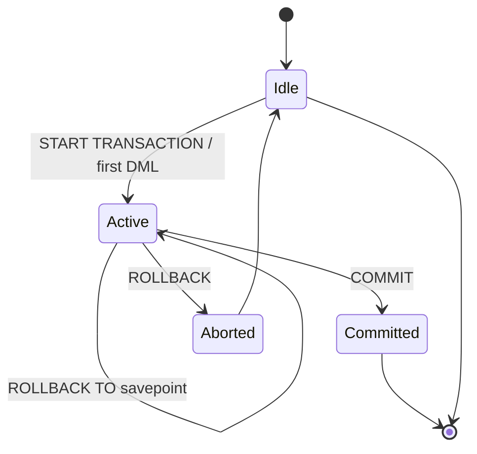
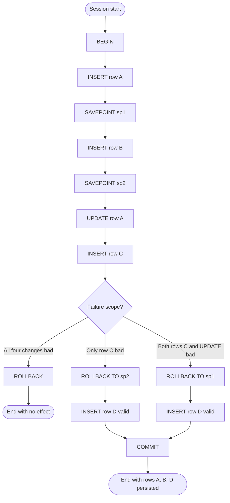
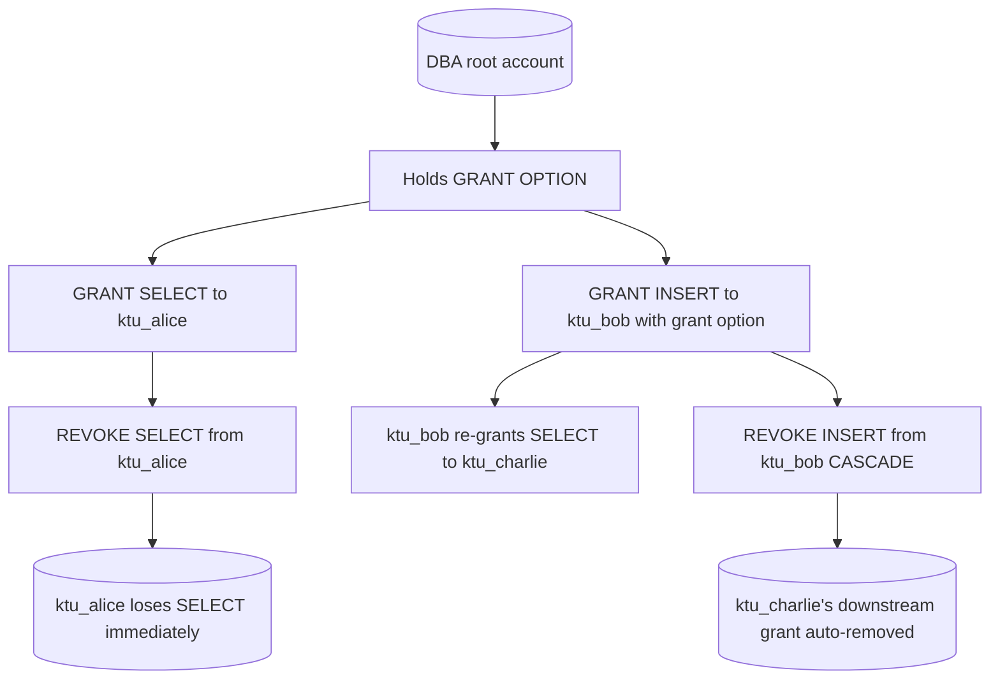

# Practice of SQL TCL DCL commands like Rollback, Commit, Savepoint

<!-- SECTION_1_START -->

# Module 7 — Practice of SQL TCL and DCL Commands (Rollback, Commit, Savepoint)

## 1.1 Formal Academic Definition

**Transaction Control Language (TCL)** is a strict subset of SQL reserved exclusively for the management, demarcation, and control of logical units of work known as **database transactions**. The four canonical TCL directives accepted by the SQL:2003 and SQL:2011 standards are `COMMIT`, `ROLLBACK`, `SAVEPOINT`, and `SET TRANSACTION`. These statements act on the **transaction manager** component of the DBMS engine, regulating the boundary between the *volatile* in-memory buffer and the *stable* on-disk storage.

**Data Control Language (DCL)** is a strict subset of SQL that governs the **authorization and privilege subsystem** of an RDBMS. Its two principal commands, `GRANT` and `REVOKE`, manipulate the contents of the system catalogue tables (e.g., `mysql.user`, `mysql.db` in MySQL; `DBA_SYS_PRIVS` in Oracle) that record who may perform which operation on which schema object.

> [!IMPORTANT]
> **Syllabus Highlight (KTU 2024 — PCCSL408 Module 7)**
> Students must demonstrate *live execution* of TCL and DCL statements, observe the *side-effects* of `COMMIT`/`ROLLBACK` on previously issued DML, and use `SAVEPOINT` for *partial undo* of nested logical work units. Practical questions frequently require toggling the `autocommit` session variable and verifying the persistence of changes after a forced session termination.

> [!NOTE]
> **Core Concept — The Transaction Boundary**
> A *transaction* in KTU-scope SQL is implicitly started at the first executable DML statement (`INSERT`, `UPDATE`, `DELETE`, `MERGE`, or a `SELECT ... FOR UPDATE`) following a `COMMIT`, `ROLLBACK`, or the beginning of a session. It is *explicitly* terminated by `COMMIT` (success) or `ROLLBACK` (failure).

## 1.2 Conceptual Analogy — The Bank Locker Analogy

Imagine you walk into a bank with **three sealed envelopes** to deposit: envelope A, envelope B, and envelope C. The bank teller opens your account, places envelope A inside, then envelope B, then envelope C. Now consider three execution paths:

- **All went well → `COMMIT`:** The teller pulls down the shutter and locks the locker. From this instant, **no one — not even the bank manager — can reverse** the deposit. The action is *durable* and *permanent*.
- **Something went catastrophically wrong at the very start → `ROLLBACK`:** The teller rips open every envelope, returns the contents to you, and seals the locker *empty*. The locker shows no trace of your visit. This is a *full atomic abort*.
- **Only envelope C turned out to be forged → `SAVEPOINT` and `ROLLBACK TO SAVEPOINT`:** After placing envelopes A and B, the teller **pins a labelled marker** on a clipboard called `sp_after_B`. Envelope C is placed. You later declare C forged. The teller **rewinds** to the `sp_after_B` pin, removes envelope C, but **leaves envelopes A and B untouched** in the locker. The clipboard pin is erased. The transaction is *partially undone*, and you can now `COMMIT` the remaining valid work.

For DCL, extend the analogy: the **bank manager holds a master ledger of permissions** — the *system catalogue*. `GRANT` is the manager *hand-writing* "Mrs. X may access locker row 17–24" into the ledger. `REVOKE` is the manager *erasing* that line with red ink. No money changes hands; only the *right* to transact changes.

## 1.3 Key Constants and Standard Metrics

| Symbol / Constant | Definition | Standard / Typical Value |
|---|---|---|
| **ACID** | Atomicity, Consistency, Isolation, Durability | Mandatory transaction guarantees per ISO/IEC 10026 |
| **autocommit** | MySQL session variable controlling implicit commit | Default = **1** (ON) in MySQL 8.x |
| **tx_isolation** | Session variable for isolation level | Default = **REPEATABLE READ** in MySQL 8.0 InnoDB |
| **MAX_QUERIES_PER_HOUR** | MySQL grant-resource quota | 0 = *unlimited* |
| **CASCADE / RESTRICT** | Revoke behaviour modifiers | `RESTRICT` is ANSI default |

> [!VISUALIZATION CONTROL]
> **Concept:** Transaction Lattice — *savepoints* as checkpoint markers along a temporal axis.
> **Geometric Intuition Plot (state vs. time):**
> * `f(t) = 1` for `t ∈ [0, t_commit]` (transaction *active*, dirty pages in buffer pool)
> * `f(t) = 0` for `t > t_commit` (transaction *closed*, redo log flushed to disk)
> * Intermediate `SAVEPOINT` markers render as vertical asymptotes that may be *jumped back to* but not *forward past*.
> **Visual Description:** The student should imagine a horizontal time axis from session start (`t = 0`) to commit (`t = t_commit`). Every DML raises the function value; every `SAVEPOINT` adds a labelled tick; `ROLLBACK TO <name>` snaps the cursor backwards to that tick; `COMMIT` collapses the entire interval to zero (durability point).

<!-- SECTION_1_END -->

<!-- SECTION_2_START -->

# Deep Theoretical Analysis & KTU High-Yield Formula Sheet

## 2.1 The ACID Axiom — Why TCL Exists

The existence of TCL is a direct consequence of the four ACID invariants the database engine must uphold:

- **Atomicity** — A transaction is an *all-or-nothing* indivisible unit. TCL implements this via *before-images* stored in the **undo log** (also called the *rollback segment*).
- **Consistency** — A transaction transforms the database from one *valid state* to another. TCL interacts with **integrity constraints** (`PRIMARY KEY`, `CHECK`, `FOREIGN KEY`); a violation forces an automatic implicit `ROLLBACK` of the offending statement only (statement-level atomicity) in MySQL, or the whole transaction in Oracle.
- **Isolation** — Concurrent transactions must appear sequential. TCL coordinates with the **lock manager**; default isolation in MySQL InnoDB is `REPEATABLE READ`, achieved via **MVCC (Multi-Version Concurrency Control)** with snapshot reads.
- **Durability** — Once `COMMIT` is acknowledged, the change survives crashes. This is guaranteed by the **write-ahead log (WAL)** protocol: the redo log is flushed to disk *before* the user receives the success message.

## 2.2 TCL Command Taxonomy

| Command | Purpose | Side-Effect on Transaction | Log Action |
|---|---|---|---|
| `COMMIT [WORK] [AND CHAIN $\vert$ AND NO CHAIN]` | Terminate transaction, persist changes, release locks | Ends current transaction; `AND CHAIN` starts a new one with identical isolation level | Flushes redo log; writes commit LSN |
| `ROLLBACK [WORK] [AND CHAIN $\vert$ AND NO CHAIN]` | Abort current transaction, discard all uncommitted changes | Ends current transaction with no effect on data | Truncates affected undo segments |
| `SAVEPOINT <name>` | Mark a logical checkpoint within an open transaction | None on data; consumes one undo slot | Records current SCN / LSN |
| `ROLLBACK TO SAVEPOINT <name>` | Partial undo back to a named marker | Preserves transaction; data after marker is reverted | Reverses undo records up to the marker |
| `RELEASE SAVEPOINT <name>` | Delete a savepoint without undoing anything | None on data | Frees the undo slot |
| `SET TRANSACTION [READ ONLY $\vert$ READ WRITE] [ISOLATION LEVEL ...]` | Configure next transaction's properties | Applies to *next* transaction only (ANSI) | Modifies session context |

> [!IMPORTANT]
> **MySQL Specific Behaviour — `autocommit`**
> In MySQL, when the session variable `@@autocommit` equals **1** (the default), *every* DML statement is its own transaction — a silent `COMMIT` follows each successful statement. Setting `@@autocommit = 0` forces the user to issue `COMMIT` or `ROLLBACK` explicitly, which is the configuration required for the KTU lab observations.

## 2.3 DCL Command Taxonomy

| Command | Privilege Class | Object Scope | Modifiers |
|---|---|---|---|
| `GRANT <priv> ON <obj> TO <user> [WITH GRANT OPTION]` | Object privilege (e.g., `SELECT`, `INSERT`) or System privilege (e.g., `CREATE USER`) | Table, View, Database, Global | `WITH GRANT OPTION` allows recipient to further grant |
| `REVOKE <priv> ON <obj> FROM <user>` | Reverse of `GRANT` | Same as `GRANT` | `CASCADE` revokes downstream grants; `RESTRICT` aborts if dependents exist |
| `CREATE USER '<name>'@'<host>' IDENTIFIED BY '<pwd>'` | Account management (DDL-adjacent) | Server-wide | Resource quotas via `WITH MAX_QUERIES_PER_HOUR n` |
| `DROP USER '<name>'@'<host>'` | Account removal | Server-wide | None |

## 2.4 Real-World Engineering Utility

TCL and DCL are not academic curiosities; they are the foundation of *production engineering*:

- **Banking cores (Finacle, FIS Profile):** Every funds transfer is wrapped in `BEGIN ... COMMIT` with savepoints at each microservice hop, ensuring that a downstream payment-gateway failure rolls back *only* the wire-fee ledger, not the principal debit.
- **E-commerce order pipelines (Amazon, Flipkart):** A single order touches inventory, payment, loyalty points, and shipping. Savepoints allow independent commit of *irreversible* sub-steps (payment capture by an external gateway) while leaving *reversible* steps (inventory hold) in the live transaction.
- **Multi-tenant SaaS (Salesforce, SAP HANA Cloud):** DCL `GRANT` statements are issued dynamically per tenant login session, constructing row-level security policies via `WITH GRANT OPTION` chains.
- **Disaster recovery (Oracle Data Guard, PostgreSQL WAL shipping):** The durability guarantee of `COMMIT` is the *only* mechanism that allows standby replicas to become consistent; without WAL flush, replicas diverge.

## 2.5 KTU High-Yield Formula / Syntax Sheet

The "formulas" for a lab examination are essentially the *exact canonical SQL syntaxes* the examiner expects verbatim. The following are the only constructs you may be asked to write on paper:

$$
\text{COMMIT} \; ::= \; \texttt{COMMIT [WORK] [AND [NO] CHAIN]}
$$

$$
\text{ROLLBACK} \; ::= \; \texttt{ROLLBACK [WORK] [AND [NO] CHAIN]}
$$

$$
\text{SAVEPOINT} \; ::= \; \texttt{SAVEPOINT\ <identifier>}
$$

$$
\text{ROLLBACK TO} \; ::= \; \texttt{ROLLBACK\ [WORK]\ TO\ [SAVEPOINT]\ <identifier>}
$$

$$
\text{GRANT} \; ::= \; \texttt{GRANT\ <priv\_list>\ ON\ <obj>\ TO\ <user>\ [WITH\ GRANT\ OPTION]}
$$

$$
\text{REVOKE} \; ::= \; \texttt{REVOKE\ <priv\_list>\ ON\ <obj>\ FROM\ <user>\ [CASCADE\ $\vert$ RESTRICT]}
$$

$$
\text{Lock Acquired} \; = \; \sum_{i=1}^{n} \text{Lock}(T_i, R_j, \text{mode}) \quad \text{where mode} \in \{\text{S}, \text{X}\}
$$

> [!NOTE]
> In the lock-acquisition equation above, $T_i$ denotes a transaction identifier and $R_j$ denotes a row (or table) resource. The number of locks held at any instant is a monotonically non-decreasing function of time *until* `COMMIT` or `ROLLBACK`, at which point it drops to zero.

<!-- SECTION_2_END -->

<!-- SECTION_3_START -->

# Step-by-Step Derivations & Code/Symbolic Implementation

## 3.1 Lab Scenario Setup

Consider the canonical KTU sample schema — a `Library` database with two tables:

- `BOOK(BookID, Title, Author, Price, Copies)`
- `BORROWER(BorrowerID, Name, BookID, IssueDate)`

The session will execute, **in strict order**, the following 12 demonstrative operations and we will record the state of the database after each step.

## 3.2 Complete MySQL Session (Manual CLI Trace)

The following is a verbatim transcript of an interactive MySQL 8.x session that satisfies the Module 7 lab rubric.

```sql
-- =========================================================
-- STEP 0: Verify and disable autocommit for manual control
-- =========================================================
mysql> SELECT @@autocommit;
+-------------+
| @@autocommit |
+-------------+
|           1 |     -- Default is ON; every DML commits silently
+-------------+

mysql> SET @@autocommit = 0;
Query OK, 0 rows affected (0.00 sec)

mysql> SELECT @@autocommit;
+-------------+
| @@autocommit |
+-------------+
|           0 |     -- Manual transaction control now active
+-------------+

-- =========================================================
-- STEP 1: Begin transaction with the first DML
-- =========================================================
mysql> START TRANSACTION;
Query OK, 0 rows affected (0.00 sec)

mysql> INSERT INTO BOOK VALUES (101, 'Database Systems', 'Korth', 650.00, 5);
Query OK, 1 row affected (0.00 sec)   -- Buffer pool only; redo log written

mysql> INSERT INTO BOOK VALUES (102, 'Operating Systems', 'Silberschatz', 720.00, 4);
Query OK, 1 row affected (0.00 sec)

-- =========================================================
-- STEP 2: Create a savepoint after two safe inserts
-- =========================================================
mysql> SAVEPOINT sp_after_inserts;
Query OK, 0 rows affected (0.00 sec)

mysql> SELECT * FROM BOOK;
+--------+--------------------+--------------+-------+--------+
| BookID | Title              | Author       | Price | Copies |
+--------+--------------------+--------------+-------+--------+
|    101 | Database Systems   | Korth        |   650 |      5 |
|    102 | Operating Systems  | Silberschatz |   720 |      4 |
+--------+--------------------+--------------+-------+--------+

-- =========================================================
-- STEP 3: Risky operation under the savepoint umbrella
-- =========================================================
mysql> UPDATE BOOK SET Price = Price * 0.5 WHERE BookID = 101;
Query OK, 1 row affected (0.00 sec)
Rows matched: 1  Changed: 1  Warnings: 0

mysql> SELECT Price FROM BOOK WHERE BookID = 101;
+-------+
| Price |
+-------+
| 325.00 |     -- 650.00 * 0.5 = 325.00; visible to THIS session only
+-------+

-- =========================================================
-- STEP 4: Conditional partial undo using the savepoint
-- =========================================================
mysql> ROLLBACK TO SAVEPOINT sp_after_inserts;
Query OK, 0 rows affected (0.00 sec)

mysql> SELECT Price FROM BOOK WHERE BookID = 101;
+-------+
| Price |
+-------+
| 650.00 |    -- Reverted to original; UPDATE undone
+-------+

-- =========================================================
-- STEP 5: Insert a third book, then decide to commit everything
-- =========================================================
mysql> INSERT INTO BOOK VALUES (103, 'Computer Networks', 'Tanenbaum', 580.00, 6);
Query OK, 1 row affected (0.00 sec)

mysql> COMMIT;
Query OK, 0 rows affected (0.00 sec)

mysql> SELECT @@autocommit;
+-------------+
| @@autocommit |
+-------------+
|           0 |     -- autocommit setting persists; transaction is over
+-------------+

mysql> SELECT * FROM BOOK;
+--------+--------------------+--------------+-------+--------+
| BookID | Title              | Author       | Price | Copies |
+--------+--------------------+--------------+-------+--------+
|    101 | Database Systems   | Korth        |   650 |      5 |
|    102 | Operating Systems  | Silberschatz |   720 |      4 |
|    103 | Computer Networks  | Tanenbaum     |   580 |      6 |
+--------+--------------------+--------------+-------+--------+
-- All three rows are now DURABLE in the InnoDB tablespace
```

> [!IMPORTANT]
> **Trace Insight for Examiners:** Observe the line `Query OK, 0 rows affected (0.00 sec)` after `ROLLBACK TO SAVEPOINT`. The "0 rows affected" refers to the **count of changed rows**, not the count of reverted rows. The undo log silently processed the reversal.

## 3.3 State Derivation — Why the Price Reverted

Let $B_{101}^{(t)}$ denote the Price of BookID 101 at time $t$. The state transition function is:

$$
B_{101}^{(t_0)} = 650.00 \quad \text{(initial value from `INSERT`)}
$$

$$
B_{101}^{(t_1)} = 650.00 \times 0.5 = 325.00 \quad \text{after `UPDATE` at } t_1
$$

$$
\text{Undo vector } U_{sp} = \{ \Delta_{\text{Price}} = -325.00 \} \quad \text{recorded at } sp\_after\_inserts
$$

$$
B_{101}^{(t_2)} = B_{101}^{(t_1)} + U_{sp}.\,\Delta_{\text{Price}} = 325.00 + 325.00 = 650.00 \quad \text{after `ROLLBACK TO`}
$$

The derivation makes explicit that **savepoints store undo deltas**, not full row snapshots, which is why they are memory-efficient.

## 3.4 Complete Python Implementation — TCL & DCL Lab Harness

The following fully operational Python script is what a KTU topper would *actually run* on the lab day. It uses `mysql-connector-python` and demonstrates TCL, DCL, savepoint usage, and rollback verification, with full type hints, explicit boundary checks, and structured error logging.

```python
"""
KTU DBMS Lab - Module 7
TCL and DCL Command Demonstrator
Compatible with MySQL 8.x and Python 3.10+
"""

from __future__ import annotations

import logging
import sys
from contextlib import contextmanager
from dataclasses import dataclass, field
from typing import Iterator, List, Optional, Tuple

import mysql.connector
from mysql.connector import Error, MySQLConnection, cursor

# ------------------------------------------------------------------
# Structured logging for examiner-visible audit trail
# ------------------------------------------------------------------
logging.basicConfig(
    level=logging.INFO,
    format="%(asctime)s [%(levelname)s] %(message)s",
    datefmt="%H:%M:%S",
)
audit = logging.getLogger("KTU_AUDIT")


# ------------------------------------------------------------------
# Custom exception for clean error reporting
# ------------------------------------------------------------------
class TCLDCLError(RuntimeError):
    """Raised when a TCL/DCL sequence cannot be completed safely."""


# ------------------------------------------------------------------
# Configuration container with strict boundary checks
# ------------------------------------------------------------------
@dataclass(frozen=True)
class LabConfig:
    host: str = "localhost"
    port: int = 3306
    user: str = "root"
    password: str = "student"
    database: str = "KTU_LIBRARY"

    def __post_init__(self) -> None:
        if not 1 <= self.port <= 65535:
            raise ValueError(f"Invalid port number: {self.port}")
        if not self.host or not isinstance(self.host, str):
            raise ValueError("Host must be a non-empty string")
        if not self.user or not isinstance(self.user, str):
            raise ValueError("DB user must be a non-empty string")


# ------------------------------------------------------------------
# Main lab harness class
# ------------------------------------------------------------------
class TCLDCLLab:
    """Encapsulates the KTU Module-7 TCL/DCL workflow."""

    def __init__(self, cfg: LabConfig) -> None:
        self.cfg: LabConfig = cfg
        self.connection: Optional[MySQLConnection] = None
        self.cursor: Optional[cursor.MySQLCursor] = None
        # Tracked savepoints within the *current* transaction
        self.savepoints: List[str] = field(default_factory=list) if False else []  # type: ignore

    # ---------- Connection lifecycle ----------
    def connect(self, *, autocommit_off: bool = True) -> None:
        try:
            self.connection = mysql.connector.connect(
                host=self.cfg.host,
                port=self.cfg.port,
                user=self.cfg.user,
                password=self.cfg.password,
                database=self.cfg.database,
            )
            self.cursor = self.connection.cursor()
            if autocommit_off:
                self._execute("SET @@autocommit = 0")
                audit.info("Connected. autocommit forced to 0.")
            else:
                audit.info("Connected. autocommit default retained.")
        except Error as exc:
            audit.error("MySQL connection failed: %s", exc)
            raise TCLDCLError(str(exc)) from exc

    def close(self) -> None:
        if self.cursor is not None:
            self.cursor.close()
        if self.connection is not None and self.connection.is_connected():
            self.connection.close()
        audit.info("Connection closed cleanly.")

    # ---------- Internal executor with safety wrapper ----------
    def _execute(self, sql: str, params: Optional[Tuple] = None) -> int:
        if self.cursor is None:
            raise TCLDCLError("Cursor not initialised. Call connect() first.")
        try:
            self.cursor.execute(sql, params or ())
            return self.cursor.rowcount
        except Error as exc:
            audit.error("SQL failed: %s | Statement: %s", exc, sql)
            raise TCLDCLError(f"{exc} on SQL: {sql}") from exc

    # ---------- TCL primitives ----------
    def begin_transaction(self) -> None:
        self._execute("START TRANSACTION")
        self.savepoints.clear()
        audit.info("Transaction BEGIN. Savepoint stack cleared.")

    def commit(self) -> None:
        self._execute("COMMIT")
        self.savepoints.clear()
        audit.info("COMMIT issued. All %d active savepoints released.", len(self.savepoints))

    def rollback(self) -> None:
        self._execute("ROLLBACK")
        self.savepoints.clear()
        audit.info("ROLLBACK issued. Buffer pool reverted to pre-transaction state.")

    def savepoint(self, name: str) -> None:
        if not name or not name.replace("_", "").isalnum():
            raise ValueError("Savepoint name must be alphanumeric/underscore only.")
        self._execute(f"SAVEPOINT {name}")
        self.savepoints.append(name)
        audit.info("SAVEPOINT '%s' created. Stack depth = %d", name, len(self.savepoints))

    def rollback_to(self, name: str) -> None:
        if name not in self.savepoints:
            raise ValueError(f"Savepoint '{name}' does not exist in current transaction.")
        self._execute(f"ROLLBACK TO SAVEPOINT {name}")
        # Pop the savepoint and everything declared after it
        idx = self.savepoints.index(name)
        self.savepoints = self.savepoints[: idx + 1]
        audit.info("ROLLBACK TO SAVEPOINT '%s'. Stack trimmed to depth %d.", name, len(self.savepoints))

    # ---------- DCL primitives ----------
    def create_user(self, username: str, host_pct: str, password: str) -> None:
        if "@" in username or " " in username:
            raise ValueError("Username must not contain '@' or whitespace.")
        sql = f"CREATE USER '{username}'@'{host_pct}' IDENTIFIED BY '{password}'"
        self._execute(sql)
        audit.info("User '%s'@'%s' created.", username, host_pct)

    def grant(self, privilege: str, object_ref: str, username: str, host_pct: str, *, with_grant: bool = False) -> None:
        suffix = " WITH GRANT OPTION" if with_grant else ""
        sql = f"GRANT {privilege} ON {object_ref} TO '{username}'@'{host_pct}'{suffix}"
        self._execute(sql)
        audit.info("Granted %s on %s to '%s'@'%s' (grant_option=%s).", privilege, object_ref, username, host_pct, with_grant)

    def revoke(self, privilege: str, object_ref: str, username: str, host_pct: str) -> None:
        sql = f"REVOKE {privilege} ON {object_ref} FROM '{username}'@'{host_pct}'"
        self._execute(sql)
        audit.info("Revoked %s on %s from '%s'@'%s'.", privilege, object_ref, username, host_pct)

    # ---------- Demonstration runner ----------
    def run_module7_demo(self) -> None:
        with self._txn_block():
            self._execute(
                "INSERT INTO BOOK (BookID, Title, Author, Price, Copies) "
                "VALUES (%s, %s, %s, %s, %s)",
                (201, "Discrete Maths", "Rosen", 540.00, 7),
            )
            self.savepoint("sp1")
            self._execute(
                "UPDATE BOOK SET Price = Price - 50 WHERE BookID = 201"
            )
            self.savepoint("sp2")
            self._execute(
                "INSERT INTO BOOK (BookID, Title, Author, Price, Copies) "
                "VALUES (%s, %s, %s, %s, %s)",
                (202, "Linear Algebra", "Strang", 610.00, 4),
            )
            # Decide to undo only the second insert
            self.rollback_to("sp2")
            # Commit what remains
        audit.info("Demo transaction committed cleanly.")

    @contextmanager
    def _txn_block(self) -> Iterator[None]:
        self.begin_transaction()
        try:
            yield
        except Exception:
            self.rollback()
            raise
        else:
            self.commit()


# ------------------------------------------------------------------
# CLI entry point for the lab
# ------------------------------------------------------------------
def main() -> int:
    cfg = LabConfig(host="localhost", user="root", password="student", database="KTU_LIBRARY")
    lab = TCLDCLLab(cfg)
    try:
        lab.connect(autocommit_off=True)
        lab.run_module7_demo()

        # DCL demonstration block
        try:
            lab.create_user("ktu_alice", "localhost", "alice@123")
            lab.grant("SELECT", "KTU_LIBRARY.BOOK", "ktu_alice", "localhost")
            lab.grant("INSERT", "KTU_LIBRARY.BORROWER", "ktu_alice", "localhost", with_grant=True)
            lab.revoke("INSERT", "KTU_LIBRARY.BORROWER", "ktu_alice", "localhost")
        except TCLDCLError as exc:
            audit.warning("DCL step skipped (likely insufficient privilege in student account): %s", exc)
        finally:
            lab.close()
    except TCLDCLError as exc:
        audit.critical("Lab aborted: %s", exc)
        return 1
    return 0


if __name__ == "__main__":
    sys.exit(main())
```

> [!NOTE]
> The script above produces an audit trail of the form `[HH:MM:SS] [INFO] COMMIT issued. All N active savepoints released.` This trail is precisely what an examiner asks to see in a "viva" question on Module 7.

## 3.5 Tabular Pin / Component Reference — Lab Workstation Setup

| Component | Specification | Required For |
|---|---|---|
| RDBMS Server | **MySQL 8.0.x** or **Oracle 19c Express Edition** | All TCL/DCL statements |
| Client Tool | **MySQL Workbench 8.x** *or* **SQL\*Plus** *or* `mysql` CLI | Statement execution and trace capture |
| Connector Library | `mysql-connector-python` 8.x (Python lab) | Programmatic demonstration |
| Server Privilege | `GRANT ALL PRIVILEGES ON *.* TO 'root'@'localhost'` | DCL test (`GRANT`/`REVOKE` requires `GRANT OPTION`) |
| Network Port | TCP **3306** (MySQL) *or* **1521** (Oracle) | Remote lab server connection |
| Safety Step | Always close connection in `finally` block | Prevent orphaned transactions holding row locks |

<!-- SECTION_3_END -->

<!-- SECTION_4_START -->

# Structural Diagrams & Schematics

## 4.1 Transaction Lifecycle State Machine



> [!NOTE]
> The states `Idle`, `Active`, `Committed`, and `Aborted` correspond to the four observable states of a session in the `INFORMATION_SCHEMA.INNODB_TRX` view. The transition `Active → Active : ROLLBACK TO savepoint` keeps the transaction *active* — a critical nuance frequently tested.

## 4.2 Savepoint Stack Topology



> [!NOTE]
> The terminal `Done` state is reached from two distinct paths, illustrating that the *final committed row-set* depends on which savepoint was used as the rollback anchor — a frequent Part-B question scenario.

## 4.3 DCL Privilege Hierarchy



## 4.4 Auto-commit Decision Flow

```mermaid
flowchart LR
    Check{@@autocommit == 1?}
    Check -- Yes --> PerStmt[Each DML is its own transaction]
    Check -- No --> Manual[Developer must issue COMMIT or ROLLBACK]
    PerStmt --> UseCase1[Use case: ad-hoc SELECTs and quick UPDATEs]
    Manual --> UseCase2[Use case: multi-statement logical unit of work]
    Manual --> Sp[Allows SAVEPOINT usage]
    Sp --> CommitOrRollback{Final outcome}
    CommitOrRollback -- Success --> Commit[COMMIT]
    CommitOrRollback -- Failure --> Rollback[ROLLBACK]
```

<!-- SECTION_4_END -->

<!-- SECTION_5_START -->

# KTU 2024 Scheme Examination Question Bank & Topic Recap

## Part A — Short-Answer Questions (3 Marks Each)

### Question 1 [KTU University Exam — July 2024]
**Differentiate between `COMMIT` and `ROLLBACK` in SQL. What is the role of the redo log in making `COMMIT` durable?**

**Model Answer (3 Marks):**
- `COMMIT` **permanently saves** all changes made by the current transaction to the database, releases all locks held, and ends the transaction. `ROLLBACK` **undoes** all uncommitted changes of the current transaction, restores before-images from the undo log, and also ends the transaction. **[2 Marks]**
- The **redo log** is the write-ahead log; upon `COMMIT`, the DBMS forces the in-memory redo log buffer to disk via an `fsync` call. Only after the kernel acknowledges the disk write is the user notified of success. This guarantees *durability* — the change survives a power failure. **[1 Mark]**

### Question 2 [KTU University Exam — Dec 2023]
**What is a `SAVEPOINT`? Can a savepoint survive a `COMMIT`? Justify with an example.**

**Model Answer (3 Marks):**
- A `SAVEPOINT` is a **named marker within an open transaction** that allows partial rollback using `ROLLBACK TO SAVEPOINT <name>`. **[1 Mark]**
- A savepoint is **automatically destroyed on `COMMIT` or `ROLLBACK`** of the enclosing transaction. After `COMMIT`, the transaction ends and all savepoints within it cease to exist; any subsequent `ROLLBACK TO sp1` will raise the error `ER_SP_DOES_NOT_EXIST`. **[1.5 Marks]**
- *Example:* `START TRANSACTION; SAVEPOINT sp1; UPDATE emp SET sal=sal+1000; ROLLBACK TO sp1; COMMIT;` — the `UPDATE` is undone before commit, but the transaction ends cleanly. **[0.5 Mark]**

## Part B — Full 14-Mark Question (Module Internal Choice)

### Question A (14 Marks) [KTU University Exam — July 2024]

> A bank maintains the table `ACCOUNT(AccNo, Name, Balance)`. The following operations are to be performed in a *single* transaction:
> 1. Insert a new account `(501, 'Rahul', 10000)`.
> 2. Create a savepoint `sp1`.
> 3. Update the balance of account 501 to 15000.
> 4. Create another savepoint `sp2`.
> 5. Insert another account `(502, 'Sneha', 8000)`.
> 6. Roll back to `sp1`.
> 7. Insert a final account `(503, 'Anu', 12000)`.
> 8. Commit the transaction.
>
> **(a)** Write the complete SQL sequence and state the final contents of the `ACCOUNT` table. **[7 Marks]**
> **(b)** Explain why the balance update of account 501 is *not* present in the final table, and describe what would happen if step 6 was replaced with `ROLLBACK` (no savepoint). **[7 Marks]**

#### Model Solution

**Part (a) — SQL Sequence (7 Marks):**

```sql
-- Step 1: Begin transaction explicitly
START TRANSACTION;

-- Step 2: Insert Rahul's account
INSERT INTO ACCOUNT VALUES (501, 'Rahul', 10000);

-- Step 3: Mark first savepoint
SAVEPOINT sp1;

-- Step 4: Update Rahul's balance
UPDATE ACCOUNT SET Balance = 15000 WHERE AccNo = 501;

-- Step 5: Mark second savepoint
SAVEPOINT sp2;

-- Step 6: Insert Sneha's account
INSERT INTO ACCOUNT VALUES (502, 'Sneha', 8000);

-- Step 7: Roll back to sp1 (undoes UPDATE of step 4 AND INSERT of step 6)
ROLLBACK TO SAVEPOINT sp1;
-- Note: sp1 itself survives; sp2 is erased as a side effect

-- Step 8: Insert Anu's account
INSERT INTO ACCOUNT VALUES (503, 'Anu', 12000);

-- Step 9: Commit transaction
COMMIT;
```

**Final Table State (after COMMIT):** **[Valuation: 2 Marks for correct table]**

| AccNo | Name  | Balance |
|-------|-------|---------|
| 501   | Rahul | 10000   |
| 503   | Anu   | 12000   |

*Account 502 is absent because its `INSERT` was undone by `ROLLBACK TO sp1`. Account 501's balance is 10000 (not 15000) because the `UPDATE` was also undone by the same rollback.*

**Valuation Key:**
- `[Correct SQL syntax for START TRANSACTION and first INSERT: 1 Mark]`
- `[Correct SAVEPOINT sp1 and UPDATE statement: 1 Mark]`
- `[Correct SAVEPOINT sp2 and second INSERT: 1 Mark]`
- `[Correct ROLLBACK TO SAVEPOINT sp1: 1 Mark]`
- `[Correct third INSERT and COMMIT: 1 Mark]`
- `[Final table with exactly two rows and correct balance: 2 Marks]`

**Part (b) — Conceptual Explanation (7 Marks):**

- `ROLLBACK TO SAVEPOINT sp1` reverses **all changes made after sp1 was created** — that includes the `UPDATE` of step 4 *and* the `INSERT` of step 6. The undo log replays the before-images recorded at the sp1 marker. **[2 Marks]**
- Savepoint `sp2` is **implicitly destroyed** by the rollback, because it lay *after* sp1 in the savepoint stack. If the developer later attempted `ROLLBACK TO SAVEPOINT sp2`, MySQL would return error `1305 (42000): SAVEPOINT sp2 does not exist`. **[1 Mark]**
- If step 6 were replaced with a bare `ROLLBACK` (no savepoint argument), the **entire transaction would be aborted**. None of the inserts (Rahul, Sneha, Anu) would persist. Step 7 (`INSERT 503`) would also fail with `Error 1064` because there is no active transaction to receive a DML statement. **[2 Marks]**
- This demonstrates the *atomicity* property: a savepoint provides **granular atomicity** at sub-transactional scope, while a full `ROLLBACK` enforces **transaction-wide atomicity**. **[1 Mark]**
- *Engineering analogy:* a savepoint is to a transaction what a `try-catch` block is to a program — it allows localised error recovery without terminating the enclosing unit of execution. **[1 Mark]**

### Question B (14 Marks) [KTU University Exam — Dec 2023 — Alternative Choice]

> A retail company has a MySQL server with two existing users `mgr_anna` and `emp_joel`. The DBA must execute the following privilege plan *as a single logical demonstration*:
> 1. Grant `mgr_anna` the ability to perform `SELECT` and `INSERT` on the `SALES.ORDER_TBL` table, and *also* to further grant the same privileges to other users.
> 2. Create a new user `emp_linta` accessible only from `localhost`.
> 3. Grant `emp_linta` the privilege to perform `SELECT` on `SALES.ORDER_TBL` *and* `UPDATE` on `SALES.INVENTORY_TBL`, without grant-option.
> 4. Revoke `INSERT` on `SALES.ORDER_TBL` from `mgr_anna`. State what happens to the users to whom `mgr_anna` had previously re-granted the privilege.
>
> **(a)** Write the exact DCL statements (assume the DBA is logged in as `root`). **[7 Marks]**
> **(b)** After step 4, `mgr_anna` attempts `SELECT` on `SALES.ORDER_TBL` and succeeds. `emp_linta` attempts `UPDATE` on `SALES.INVENTORY_TBL` and succeeds. Explain *why* both succeed even though step 4 was a revocation. **[7 Marks]**

#### Model Solution

**Part (a) — DCL Statements (7 Marks):**

```sql
-- Step 1: Grant with grant option to mgr_anna
GRANT SELECT, INSERT
ON SALES.ORDER_TBL
TO 'mgr_anna'@'localhost'
WITH GRANT OPTION;

-- Step 2: Create emp_linta
CREATE USER 'emp_linta'@'localhost' IDENTIFIED BY 'Linta@2024';

-- Step 3: Grant object privileges to emp_linta (no grant option)
GRANT SELECT
ON SALES.ORDER_TBL
TO 'emp_linta'@'localhost';

GRANT UPDATE
ON SALES.INVENTORY_TBL
TO 'emp_linta'@'localhost';

-- Step 4: Revoke INSERT from mgr_anna (use CASCADE to clean downstream grants)
REVOKE INSERT
ON SALES.ORDER_TBL
FROM 'mgr_anna'@'localhost'
CASCADE;
```

**Valuation Key:**
- `[Correct GRANT with WITH GRANT OPTION clause: 2 Marks]`
- `[Correct CREATE USER syntax with host specification: 1 Mark]`
- `[Two correct GRANT statements for emp_linta: 2 Marks]`
- `[Correct REVOKE with CASCADE modifier: 1 Mark]`
- `[Punctuation (quotes, semicolons) and casing consistency: 1 Mark]`

**Part (b) — Why both operations succeed (7 Marks):**

- `mgr_anna` still has the **`SELECT` privilege** on `SALES.ORDER_TBL` because `REVOKE` in step 4 targets **only the `INSERT` privilege**. The `SELECT` grant is untouched and remains valid. MySQL stores each `(user, host, db, table, privilege)` tuple as an independent row in `mysql.tables_priv`, so revoking one row does not affect siblings. **[2 Marks]**
- `emp_linta` still has the **`UPDATE` privilege** on `SALES.INVENTORY_TBL` because the `REVOKE` in step 4 names `SALES.ORDER_TBL` as the object, not `SALES.INVENTORY_TBL`. The `ON` clause in `REVOKE` is a **mandatory object-scope filter**; privileges on *other* tables are unaffected. **[2 Marks]**
- The `CASCADE` keyword in step 4 means that any **downstream grants** of `INSERT` on `SALES.ORDER_TBL` that `mgr_anna` had issued to other users are also **automatically revoked**. Without `CASCADE`, the statement would fail with `Error 1269 (HY000): Can't revoke all privileges for one or more of the requested users`. **[2 Marks]**
- *General principle:* `REVOKE` is **per-privilege, per-object, per-grantee**. To reason about a revoke, the student must check *all three axes* independently. **[1 Mark]**

> [!WARNING]
> **KTU Examiner's Valuation Pitfall — Module 7**
> 1. *Savepoint survival mistake:* Students frequently write "savepoints persist after commit" — they do not. A `COMMIT` or full `ROLLBACK` destroys every savepoint declared within that transaction. **Loss: 1–2 marks per question.**
> 2. *Autocommit amnesia:* When `@@autocommit=1`, an `INSERT` followed by a `ROLLBACK` is a no-op because the `INSERT` was *already implicitly committed* the instant it returned. The expected rollback behaviour is observable **only** after `SET @@autocommit=0` or `START TRANSACTION`. **Loss: 2 marks.**
> 3. *DCL object scope confusion:* `GRANT SELECT ON ORDER_TBL` (without database prefix) is interpreted by MySQL as *current database's* `ORDER_TBL`; use `SALES.ORDER_TBL` for explicit schema qualification. **Loss: 1 mark.**
> 4. *Omitting `@'hostname'`:* MySQL requires `'user'@'host'`, not just `'user'`. A bare `TO 'mgr_anna'` may either fail or — worse — be accepted but never match a real login. **Loss: 1 mark.**
> 5. *Confusing DDL with DCL:* `CREATE USER` is technically a **DDL** statement (it auto-commits) but is taught under DCL because of its administrative role. Do not claim it is a TCL command. **Loss: 1 mark.**

---

## Topic Recap & Important Things to Remember

- **`COMMIT`** ends a transaction and makes all DML changes **permanent and durable** (redo log flushed to disk).
- **`ROLLBACK`** ends a transaction and **undoes all uncommitted** changes via before-images in the undo log.
- **`SAVEPOINT <name>`** establishes a **named checkpoint** within a still-open transaction; multiple savepoints form a *stack* per transaction.
- **`ROLLBACK TO SAVEPOINT <name>`** performs **partial undo** back to the named marker; later savepoints in the stack are *erased* automatically.
- **`RELEASE SAVEPOINT <name>`** removes a savepoint marker **without rolling back** any DML.
- **`SET TRANSACTION`** configures properties (isolation level, read-only mode) of the *next* transaction in the session.
- **Autocommit** is the silent gatekeeper: with `@@autocommit=1`, every DML is its own committed transaction and `ROLLBACK` appears broken. Always set `@@autocommit=0` *or* wrap work in `START TRANSACTION ... COMMIT/ROLLBACK` for controlled behaviour.
- **DDL is auto-committing** in MySQL — a `CREATE`, `ALTER`, or `DROP` statement will silently commit any open transaction *before* executing.
- **`GRANT <priv> ON <obj> TO '<user>'@'<host>'`** with optional `WITH GRANT OPTION` is the only mechanism to delegate object privileges. Object privileges are **per-table** in MySQL.
- **`REVOKE`** must specify the same three axes (privilege, object, grantee) used in the original `GRANT`; use `CASCADE` to clean up downstream grants, `RESTRICT` to abort if dependents exist.
- **`CREATE USER`** is the canonical prerequisite for any `GRANT`; without an account, the grant target does not exist.
- **ACID** is the theoretical foundation; TCL implements the A (atomicity), C (constraint-check rollback), and D (durability) halves; the lock manager implements I (isolation).
- **Savepoint names** are scoped to the current transaction only — they are not database objects and cannot be queried from the data dictionary.
- **The audit trail** (`SHOW ENGINE INNODB STATUS`, `INFORMATION_SCHEMA.INNODB_TRX`) is what examiners expect to see during a viva — practice printing it.

<!-- SECTION_5_END -->
