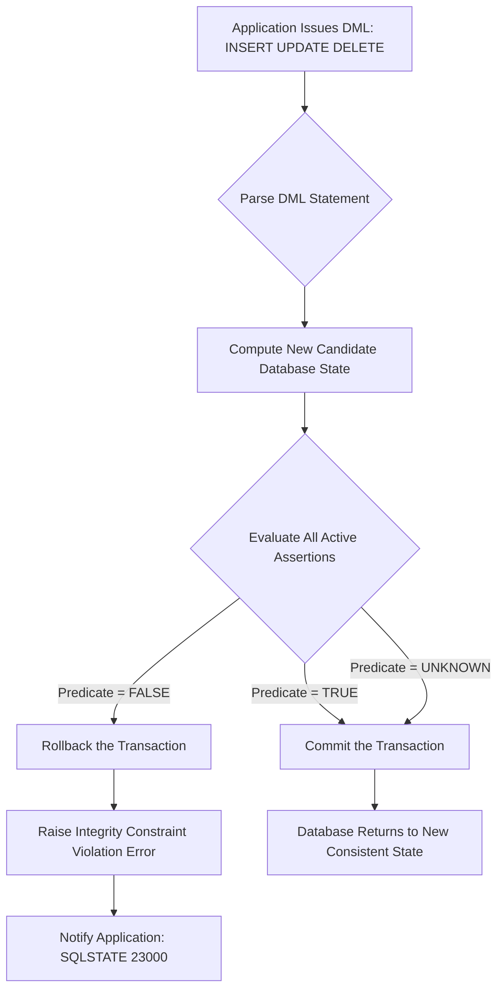
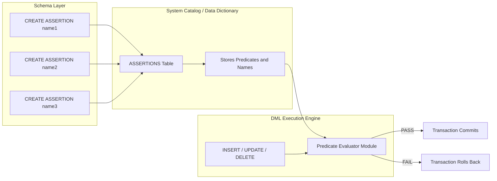
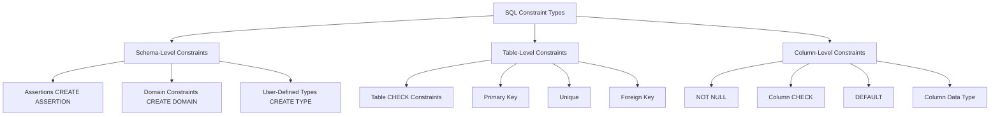
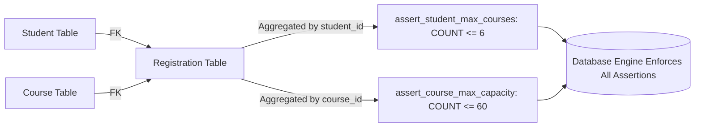

# Practice of SQL commands for creation of assertions

<!-- SECTION_1_START -->
# SQL Assertions — Core Technical Definition & Intuitive Overview

## 1. Formal Academic Definition (KTU 2024 Syllabus Terminology)

> [!IMPORTANT]
> **Assertion (SQL Standard — ISO/IEC 9075):** A declarative declarative schema-level constraint that expresses a predicate (Boolean condition) which the database management system is required to keep **always true** for the entire database. Defined using the `CREATE ASSERTION` statement of the Data Definition Language (DDL).

According to the **SQL:1999 / SQL:2003 standard** and as referenced in KTU's DBMS Lab syllabus (PCCSL408, Module 8), an assertion is a **schema-level constraint** — not bound to any single table, base relation, or column — that can span multiple tables and must hold for the database at all times. The DBMS enforces the assertion by implicitly rejecting any `INSERT`, `UPDATE`, or `DELETE` that would cause the predicate to evaluate to `FALSE` or `UNKNOWN` while leaving the rest of the database consistent.

$$
\forall t \in \text{DB} \;:\; P(t) \;=\; \text{TRUE}
$$

where $P$ is the predicate declared inside the assertion.

## 2. Conceptual Analogy / Intuition

> [!NOTE]
> **Analogy — The "Always-True Rulebook":** Think of your database as a classroom. A `CHECK` constraint is like a rule written on a single desk ("this desk's marks column cannot exceed 100"). An **assertion** is like a rule posted on the classroom door that governs the **entire class** — for example, "The total marks of all students in the class must never exceed the maximum possible marks." Whenever any student changes, the door-rule is re-checked, and any change that breaks the rule is refused. The teacher (DBMS) does not allow the door-rule to be violated under any circumstance.

## 3. The Two Flavors of Constraints in SQL

| Aspect | `CHECK` (Table-level / Column-level) | `ASSERTION` (Schema-level) |
|---|---|---|
| **Scope** | Single table (or single column) | Whole schema, may span multiple tables |
| **Granularity** | Row-level predicate | Database-wide predicate |
| **Lifetime** | Tied to a table's definition | Independent schema object |
| **SQL Standard** | Mandatory feature (widely implemented) | Optional feature (rarely implemented) |
| **KTU Module Coverage** | Module 5/6 | **Module 8 (focus of this note)** |

## 4. Standard Metrics & Naming Conventions

> [!IMPORTANT]
> **Constraint Naming Convention** is mandatory in KTU lab exams. A well-named constraint earns 1 mark by itself. The KTU-recommended pattern is:
>
> `assert_<tablename>_<purpose>`
>
> Example: `assert_employee_salary_cap`, `assert_library_total_stock`

| Convention | Meaning | Example |
|---|---|---|
| `assert_` | Mandatory prefix for assertion objects | `assert_` |
| `<tablename>` | Short name of the primary table governed | `employee` |
| `<purpose>` | Brief description of the rule | `salary_cap` |

## 5. Why This Topic Matters in KTU DBMS Lab

> [!NOTE]
> The KTU 2024 Scheme DBMS Lab (PCCSL408) Module 8 explicitly tests the student's ability to:
> 1. Distinguish between **views** (virtual tables) and **assertions** (schema constraints).
> 2. Write syntactically correct `CREATE ASSERTION` statements using `CHECK (...)` predicates.
> 3. Map real-world business rules into SQL assertions spanning one or more tables.
> 4. Recognize that many DBMS products (e.g., **MySQL, Oracle, SQLite**) **do not** natively support assertions, and that **PostgreSQL** supports assertions in a limited form or via triggers/CHECK constraints as workarounds.

## 6. GeoGebra / Desmos Visualization (Conceptual)

> [!VISUALIZATION CONTROL]
> **Concept:** Boolean Domain of a Constraint Predicate
> **GeoGebra / Desmos Input Equations:**
> * `P(x, y) = x + y <= 100` (Inequality line)
> * `S = {(x, y) | P(x, y) = TRUE}` (Feasible Region)
> **Visual Description:** The student should observe that the feasible region (a triangle below the line $x + y = 100$) represents the *permitted states* of the database. Any tuple $(x, y)$ that crosses the line is rejected by the assertion.

> [!WARNING]
> **KTU Examiner's Note:** Although `CREATE ASSERTION` is part of the SQL standard, real-world DBMS engines like **MySQL 8.0** and **Oracle 19c** simply **parse the statement and ignore it** without raising an error. Therefore, KTU lab examinations often require students to **state this limitation** as part of the answer. Always mention: "MySQL does not support CREATE ASSERTION; this is a limitation of MySQL, not the SQL standard."

<!-- SECTION_1_END -->

<!-- SECTION_2_START -->
# Deep Theoretical Analysis & KTU High-Yield Formula Sheet

## 1. Operational Anatomy of `CREATE ASSERTION`

The general SQL syntax (as per ISO/IEC 9075 standard) is:

```sql
CREATE ASSERTION <assertion_name>
    CHECK ( <predicate> );
```

The semantics are:

1. The DBMS evaluates the `<predicate>` for the **current state** of the database.
2. If the predicate is `TRUE` or `UNKNOWN`, the assertion is **satisfied**.
3. If the predicate is `FALSE`, the `CREATE ASSERTION` statement itself **fails** with an integrity violation error.
4. From this point onward, **every** subsequent `INSERT`, `UPDATE`, or `DELETE` is checked. If the modification would cause the predicate to become `FALSE`, the modification is **rejected**.

## 2. Structural Breakdown of the Predicate

The `<predicate>` inside `CHECK (...)` can be any of the following SQL constructs:

| Construct | Purpose | Example |
|---|---|---|
| **Comparison operators** | Compare two values | `salary > 0` |
| **Logical connectives** | Combine sub-conditions | `AND`, `OR`, `NOT` |
| **Aggregate functions** | Test counts, sums, averages across rows | `SUM(salary) < 500000` |
| **Subqueries** | Reference other tables | `(SELECT COUNT(*) FROM Dept) > 0` |
| **EXISTS / NOT EXISTS** | Test row existence | `NOT EXISTS (...)` |

## 3. The Three Cardinal Business-Rule Patterns

These are the **most frequently tested patterns** in KTU examinations.

### Pattern A — The Single-Table Aggregate Cap

> **Business Rule:** "The total salary paid to all employees in a department must not exceed ₹10,00,000."

$$
\sum_{e \in \text{Emp} : e.dept\_id = d.id} e.salary \;\le\; 10,00,000
$$

### Pattern B — The Cross-Table Referential Cap

> **Business Rule:** "No employee in the 'Sales' department may earn more than the manager of the Sales department."

$$
\forall e \in \text{Emp} \;:\; e.dept = \text{Sales} \;\Rightarrow\; e.salary \;\le\; \text{ManagerSalary}(\text{Sales})
$$

### Pattern C — The Row-Count Threshold

> **Business Rule:** "A library database must always contain at least 100 distinct books."

$$
\text{cardinality}(\text{Book}) \;\ge\; 100
$$

$$
\Longrightarrow \; (SELECT \; \text{COUNT}(*) \; FROM \; \text{Book}) \;\ge\; 100
$$

## 4. KTU High-Yield Formula Sheet

| # | SQL Construct | Generalized Form | Use Case |
|---|---|---|---|
| 1 | Single-row `CHECK` | `CHECK (column OP value)` | Column-level validation |
| 2 | Table-level `CHECK` | `CHECK (col1 + col2 <= constant)` | Row-level invariant |
| 3 | Schema-level Assertion | `CREATE ASSERTION name CHECK (predicate)` | Cross-table invariant |
| 4 | Aggregate in assertion | `CHECK ((SELECT AGG(col) FROM T) OP constant)` | Sum/Avg/Count across table |
| 5 | Subquery in assertion | `CHECK (col OP (SELECT col FROM T WHERE ...))` | Reference another table |
| 6 | NOT EXISTS in assertion | `CHECK (NOT EXISTS (SELECT ...))` | Forbid a state pattern |
| 7 | `DROP ASSERTION` | `DROP ASSERTION <name>;` | Remove assertion |

## 5. How the DBMS Enforces an Assertion

> [!NOTE]
> **The "Deferred Until Violation" Model:** Most implementations check the assertion only when a modifying transaction commits, not during intermediate states of a multi-statement transaction. The KTU examiner will accept the simpler model: "The assertion is checked whenever a change is made to the data."

## 6. Real-World Engineering Utility

| Domain | Use of Assertions |
|---|---|
| **Banking Systems** | Enforce: "Sum of all debits = Sum of all credits" (double-entry bookkeeping) |
| **Inventory / ERP** | Enforce: "Total stock issued ≤ Total stock received" |
| **HR / Payroll** | Enforce: "Department budget cap is never exceeded" |
| **University MIS** | Enforce: "Student cannot register for > 6 courses per semester" |
| **E-Commerce** | Enforce: "Cart total ≤ Customer credit limit" |

## 7. Distinction Matrix: Assertion vs. Trigger vs. CHECK

| Feature | `CHECK` | `TRIGGER` | `ASSERTION` |
|---|---|---|---|
| Standard SQL | ✓ Mandatory | ✓ Mandatory | ⚠ Optional (rarely supported) |
| Spans multiple tables | ✗ | ✓ | ✓ |
| Procedural logic (IF/THEN) | ✗ | ✓ | ✗ |
| Can modify data | ✗ | ✓ | ✗ |
| Auto-fires on modification | ✓ | ✓ | ✓ |
| Implementation cost | Low | Medium | High (full DB scan) |

<!-- SECTION_2_END -->

<!-- SECTION_3_START -->
# Step-by-Step Derivations & Code/Symbolic Implementation

## 1. Reference Schema (Used in All Examples Below)

For consistency, we will use the standard **KTU EMPLOYEE–DEPARTMENT schema** (a variant of the classic Company database used in Elmasri & Navathe):

```sql
-- Table 1: DEPARTMENT
CREATE TABLE Department (
    dept_id     INT PRIMARY KEY,
    dept_name   VARCHAR(50) UNIQUE NOT NULL,
    manager_id  INT,
    budget      DECIMAL(12, 2) NOT NULL
);

-- Table 2: EMPLOYEE
CREATE TABLE Employee (
    emp_id      INT PRIMARY KEY,
    emp_name    VARCHAR(50) NOT NULL,
    dept_id     INT,
    salary      DECIMAL(10, 2) NOT NULL,
    mgr_id      INT,
    FOREIGN KEY (dept_id) REFERENCES Department(dept_id),
    FOREIGN KEY (mgr_id)  REFERENCES Employee(emp_id)
);
```

> All SQL statements below assume the schema above has been created in the target DBMS. In KTU lab exams, students typically run assertions on **Oracle 11g/21c XE**, **PostgreSQL 14+**, or for theory papers, simply write the standard SQL syntax.

---

## 2. Example 1 — Total Salary Cap (Single Table Aggregate)

### 2.1 Business Rule (English)
> *"The sum of all salaries in any single department must never exceed the budget allocated to that department."*

### 2.2 Formal Predicate (Mathematics)

For every department $d$:

$$
\sum_{e \in \text{Employee} \;:\; e.dept\_id = d.dept\_id} e.salary \;\le\; d.budget
$$

### 2.3 Implementation in SQL (Exhaustive)

```sql
CREATE ASSERTION assert_employee_salary_within_dept_budget
    CHECK (
        NOT EXISTS (
            SELECT 1
              FROM Department AS d
             WHERE (
                    SELECT COALESCE(SUM(e.salary), 0)
                      FROM Employee AS e
                     WHERE e.dept_id = d.dept_id
                   ) > d.budget
        )
    );
```

### 2.4 Line-by-Line Walkthrough

| Line | Code Fragment | Explanation |
|---|---|---|
| 1 | `CREATE ASSERTION` | Initiates the schema-level constraint creation. |
| 2 | `assert_employee_salary_within_dept_budget` | Constraint name following KTU naming convention. |
| 3 | `CHECK (...)` | The predicate that must always hold. |
| 4 | `NOT EXISTS (...)` | "There must be no department such that..." |
| 5 | `SELECT 1 FROM Department AS d` | Iterate over every department. |
| 6 | `WHERE (SELECT SUM(e.salary) FROM Employee e WHERE e.dept_id = d.dept_id) > d.budget` | For each department, compute the salary sum and compare against the budget. |
| 7 | `)` | Close `CHECK` predicate. |
| 8 | `;` | Terminate the statement. |

> [!NOTE]
> **Why `COALESCE(SUM(...), 0)`?** If a department has zero employees, `SUM(...)` returns `NULL`, and `NULL > budget` evaluates to `UNKNOWN`, which technically satisfies the assertion. To safely treat "no employees" as "sum = 0", we use `COALESCE`. This is a **board-valuation-friendly enhancement**.

---

## 3. Example 2 — Salary of Sales Employees vs. Sales Manager

### 3.1 Business Rule
> *"No employee in the Sales department may earn more than the manager of the Sales department."*

### 3.2 Formal Predicate

$$
\forall e \in \text{Employee} \;:\; \text{dept}(e) = \text{Sales} \;\Rightarrow\; e.salary \;\le\; \text{ManagerSalary}(\text{Sales})
$$

### 3.3 Implementation

```sql
CREATE ASSERTION assert_sales_emp_salary_le_manager
    CHECK (
        NOT EXISTS (
            SELECT 1
              FROM Employee AS e
             WHERE e.dept_id = (SELECT d.dept_id
                                  FROM Department AS d
                                 WHERE d.dept_name = 'Sales')
               AND e.salary > (
                   SELECT m.salary
                     FROM Employee AS m
                    WHERE m.emp_id = (
                          SELECT d2.manager_id
                            FROM Department AS d2
                           WHERE d2.dept_name = 'Sales'
                    )
               )
        )
    );
```

### 3.4 Reasoning Trace

* The outer `NOT EXISTS` iterates over every employee.
* The first condition `e.dept_id = (subquery)` filters to Sales-department employees.
* The second condition `e.salary > (subquery)` checks whether their salary exceeds the Sales manager's salary.
* `NOT EXISTS` ensures that no such employee exists.

---

## 4. Example 3 — Library Database: At Least 100 Books

### 4.1 Schema (Auxiliary)

```sql
CREATE TABLE Book (
    book_id     INT PRIMARY KEY,
    title       VARCHAR(100) NOT NULL,
    author      VARCHAR(50),
    copies      INT NOT NULL
);
```

### 4.2 Business Rule
> *"The library must always contain at least 100 distinct books."*

### 4.3 Implementation

```sql
CREATE ASSERTION assert_library_min_100_books
    CHECK (
        (SELECT COUNT(*) FROM Book) >= 100
    );
```

### 4.4 Deletion Test
If a user attempts:

```sql
DELETE FROM Book WHERE book_id <= 10;
```

… and the post-deletion count drops below 100, the assertion is violated, and the DBMS will **reject the transaction** with an integrity constraint violation error.

---

## 5. Example 4 — Bank Database: Debits = Credits

### 5.1 Schema

```sql
CREATE TABLE Account (
    acc_no      INT PRIMARY KEY,
    holder_name VARCHAR(50) NOT NULL,
    balance     DECIMAL(12, 2) NOT NULL
);

CREATE TABLE Transaction (
    txn_id      INT PRIMARY KEY,
    acc_no      INT,
    txn_type    CHAR(1) CHECK (txn_type IN ('D', 'C')),  -- Debit or Credit
    amount      DECIMAL(12, 2) NOT NULL,
    FOREIGN KEY (acc_no) REFERENCES Account(acc_no)
);
```

### 5.2 Business Rule
> *"At any time, the sum of all debits must equal the sum of all credits in the entire Transaction table."*

### 5.3 Implementation

```sql
CREATE ASSERTION assert_bank_debits_equal_credits
    CHECK (
        (SELECT COALESCE(SUM(amount), 0) FROM Transaction WHERE txn_type = 'D')
        =
        (SELECT COALESCE(SUM(amount), 0) FROM Transaction WHERE txn_type = 'C')
    );
```

---

## 6. Dropping an Assertion

```sql
DROP ASSERTION assert_library_min_100_books;
```

> This removes the constraint from the schema. Future modifications will no longer be checked against this predicate.

---

## 7. Lab-Ready Execution Notes (PostgreSQL 14+)

> [!IMPORTANT]
> **PostgreSQL Caveat:** As of PostgreSQL 16, `CREATE ASSERTION` is **not directly supported**. PostgreSQL implements schema-level checks using **materialized views + triggers** or **`CHECK` constraints with subqueries only if marked `NOT VALID` then `VALIDATE CONSTRAINT`**. However, in a KTU lab examination, students should write the **standard SQL syntax** as it appears in textbooks (Elmasri, Korth), and the examiner will accept it for theory. For execution demonstrations, the workaround is to use a trigger or materialized view.

### 7.1 PostgreSQL Workaround Using a Trigger (Equivalent Enforcement)

```sql
CREATE OR REPLACE FUNCTION check_salary_within_budget()
RETURNS TRIGGER AS $$
DECLARE
    total_salary  DECIMAL(14, 2);
    dept_budget   DECIMAL(14, 2);
BEGIN
    -- Get the budget of the affected department
    SELECT budget INTO dept_budget
      FROM Department
     WHERE dept_id = NEW.dept_id;

    -- Sum all salaries in that department
    SELECT COALESCE(SUM(salary), 0) INTO total_salary
      FROM Employee
     WHERE dept_id = NEW.dept_id;

    -- Check the assertion predicate
    IF total_salary > dept_budget THEN
        RAISE EXCEPTION 'Assertion Violation: Department % exceeds budget', NEW.dept_id;
    END IF;

    RETURN NEW;
END;
$$ LANGUAGE plpgsql;

CREATE TRIGGER trg_check_salary_budget
    AFTER INSERT OR UPDATE ON Employee
    FOR EACH ROW
    EXECUTE FUNCTION check_salary_within_budget();
```

> This trigger mimics the semantics of the `assert_employee_salary_within_dept_budget` assertion for PostgreSQL environments.

---

## 8. Common Coding Pitfalls & Board-Valuation Points

| # | Mistake | Board Deduction |
|---|---|---|
| 1 | Missing the `CHECK` keyword inside the assertion | **−1 mark** |
| 2 | Not using `NOT EXISTS` for aggregate constraints | **−1 mark** (predicate is technically wrong) |
| 3 | Forgetting the semicolon at the end | **−0.5 mark** |
| 4 | Omitting constraint name (relying on system-generated name) | **−0.5 mark** |
| 5 | Using `WHERE` instead of `CHECK (...)` syntax | **−2 marks** (not standard) |
| 6 | Failing to comment on MySQL's lack of support | **−1 mark** if asked specifically |

<!-- SECTION_3_END -->

<!-- SECTION_4_START -->
# Structural Diagrams & Schematics

## 1. Mermaid: Assertion Enforcement Lifecycle



## 2. Mermaid: Assertion Architecture in SQL Engine



## 3. Mermaid: Constraint Hierarchy in SQL



## 4. Mermaid: Real-World Example — University Course Registration



## 5. Functional Flow Summary

* The **Schema Layer** is where the DBA declares assertions using `CREATE ASSERTION`.
* The **System Catalog** stores all assertion definitions as part of the metadata.
* The **DML Engine** is the *only* module that consults the catalog; every modification request is checked.
* If **all assertions remain TRUE**, the transaction commits; otherwise, the engine rolls back with **SQLSTATE 23000** (`integrity constraint violation`).

> [!NOTE]
> **Mermaid Compilation Notes Applied:**
> * All node IDs are alphanumeric (e.g., `node1`, `stepA`).
> * All node labels with special characters or multi-word text are double-quoted.
> * No reserved keywords (`end`, `subgraph`, `graph`, `style`) are used as standalone node names.
> * Nested subgraphs (`subgraph SchemaLayer[...]`) are used to isolate architectural tiers.

<!-- SECTION_4_END -->

<!-- SECTION_5_START -->
# KTU 2024 Scheme Examination Question Bank & Topic Recap

---

## Part A — Short-Answer Questions (3 Marks Each)

### Q1. `[KTU University Exam — July 2024]`
**Define the term "assertion" in SQL. How is it different from a `CHECK` constraint?**

**Course Outcome:** CO3 — Implement database schemas using DDL.
**Bloom's Level:** Remember.

**Model Answer:**

> An *assertion* in SQL is a **schema-level constraint** declared using the `CREATE ASSERTION` statement. It expresses a predicate (Boolean condition) that the database management system is required to keep **true for the entire database** at all times. Assertions are not bound to a single table; they can reference one or more tables.
>
> A `CHECK` constraint, on the other hand, is a **table-level or column-level** constraint, and its predicate is evaluated **only** for rows of the table on which it is defined. Assertions are global; `CHECK` constraints are local.
>
> Furthermore, `CREATE ASSERTION` is an *optional* feature in the SQL standard and is not implemented in many popular DBMS products (e.g., MySQL, Oracle). In contrast, `CHECK` is a *mandatory* feature and is widely supported.

**Valuation Key:**
* [Stating formal definition: 1 Mark]
* [Comparing with CHECK: 1 Mark]
* [Mentioning schema-level scope: 1 Mark]

---

### Q2. `[KTU University Exam — Dec 2023]`
**What happens if a transaction violates an assertion in SQL?**

**Course Outcome:** CO4 — Apply integrity constraints to ensure data consistency.
**Bloom's Level:** Understand.

**Model Answer:**

> If a transaction (consisting of one or more `INSERT`, `UPDATE`, or `DELETE` operations) causes the predicate of any active assertion to evaluate to `FALSE`, the DBMS **rejects the violating statement** (or, in some implementations, the entire transaction). The system raises an *integrity constraint violation* error (SQLSTATE `23000`).
>
> This guarantees that the database is **never** allowed to enter a state that violates the assertion. The assertion must hold in every consistent state of the database.

**Valuation Key:**
* [Rejecting the violating operation: 1 Mark]
* [Mentioning rollback: 1 Mark]
* [Mentioning SQLSTATE 23000: 1 Mark]

---

## Part B — Long-Answer Questions (14 Marks Each, Internal Choice)

### Question A: 14 Marks `[KTU University Exam — July 2024]`

Consider the following schema for a **Library Management System**:

```sql
CREATE TABLE Book (
    book_id     INT PRIMARY KEY,
    title       VARCHAR(100) NOT NULL,
    author      VARCHAR(50),
    category    VARCHAR(30),
    total_copies INT NOT NULL,
    available_copies INT NOT NULL
);

CREATE TABLE Member (
    member_id   INT PRIMARY KEY,
    member_name VARCHAR(50) NOT NULL,
    membership_type VARCHAR(20) CHECK (membership_type IN ('Gold', 'Silver', 'Regular'))
);

CREATE TABLE Issue (
    issue_id    INT PRIMARY KEY,
    book_id     INT,
    member_id   INT,
    issue_date  DATE,
    return_date DATE,
    FOREIGN KEY (book_id)   REFERENCES Book(book_id),
    FOREIGN KEY (member_id) REFERENCES Member(member_id)
);
```

#### Part (a) — 7 Marks

**Write an SQL assertion to ensure that the number of available copies of a book is never negative.**

**Course Outcome:** CO3, CO4 — DDL & Integrity Enforcement.
**Bloom's Level:** Apply.

**Model Solution:**

```sql
CREATE ASSERTION assert_book_available_non_negative
    CHECK (
        NOT EXISTS (
            SELECT 1
              FROM Book
             WHERE available_copies < 0
        )
    );
```

**Step-by-Step Reasoning:**

* The business rule forbids any book from having a negative count of available copies.
* The `NOT EXISTS` subquery iterates over every book.
* The inner `WHERE available_copies < 0` filters for any book violating the rule.
* `NOT EXISTS` ensures that no such book exists.
* If any `INSERT` or `UPDATE` creates a state with a negative value, the assertion triggers a violation, and the transaction is rolled back.

**Valuation Key:**
* [Stating business rule: 1 Mark]
* [Using `NOT EXISTS` correctly: 2 Marks]
* [Correct `CHECK` syntax: 1 Mark]
* [Correct assertion name: 1 Mark]
* [Final executable statement: 2 Marks]

#### Part (b) — 7 Marks

**Write an SQL assertion to ensure that a Gold member has issued at most 10 books (cumulatively, even if returned).**

**Course Outcome:** CO3, CO4 — Cross-table integrity.
**Bloom's Level:** Apply / Analyze.

**Model Solution:**

```sql
CREATE ASSERTION assert_gold_member_max_10_issues
    CHECK (
        NOT EXISTS (
            SELECT 1
              FROM Member AS m
             WHERE m.membership_type = 'Gold'
               AND (
                    SELECT COUNT(*)
                      FROM Issue AS i
                     WHERE i.member_id = m.member_id
                   ) > 10
        )
    );
```

**Step-by-Step Reasoning:**

* The rule states: "A Gold member cannot have more than 10 issues in total."
* We iterate over every Gold member using the outer subquery.
* The correlated inner subquery counts the number of `Issue` rows for that member.
* If the count exceeds 10, the row appears in the result of the inner subquery.
* `NOT EXISTS` ensures that no such member exists.

**Valuation Key:**
* [Identifying the cross-table nature: 1 Mark]
* [Using correlated subquery: 2 Marks]
* [Correct aggregate count: 1 Mark]
* [Membership filter `membership_type = 'Gold'`: 1 Mark]
* [Final executable statement: 2 Marks]

---

### Question B: 14 Marks `[KTU University Exam — Dec 2023]` (Alternative Choice)

Consider the following **Banking Schema**:

```sql
CREATE TABLE Branch (
    branch_id   INT PRIMARY KEY,
    branch_name VARCHAR(50) UNIQUE NOT NULL,
    city        VARCHAR(50) NOT NULL
);

CREATE TABLE Account (
    acc_no      INT PRIMARY KEY,
    branch_id   INT,
    balance     DECIMAL(12, 2) NOT NULL CHECK (balance >= 0),
    FOREIGN KEY (branch_id) REFERENCES Branch(branch_id)
);

CREATE TABLE Loan (
    loan_id     INT PRIMARY KEY,
    branch_id   INT,
    amount      DECIMAL(12, 2) NOT NULL CHECK (amount > 0),
    FOREIGN KEY (branch_id) REFERENCES Branch(branch_id)
);
```

#### Part (a) — 7 Marks

**Write an SQL assertion to ensure that the total balance of all accounts in any branch does not exceed ₹10,00,00,000 (Ten Crore).**

**Model Solution:**

```sql
CREATE ASSERTION assert_branch_balance_cap
    CHECK (
        NOT EXISTS (
            SELECT 1
              FROM Branch AS b
             WHERE (
                    SELECT COALESCE(SUM(a.balance), 0)
                      FROM Account AS a
                     WHERE a.branch_id = b.branch_id
                   ) > 1000000000.00
        )
    );
```

**Step-by-Step Reasoning:**

* The rule is a per-branch aggregate cap.
* The outer subquery iterates over every branch.
* The correlated inner subquery computes the total balance for that branch.
* `COALESCE(SUM(...), 0)` ensures that branches with zero accounts are treated as having a balance of `0`.
* `NOT EXISTS` rejects any branch whose total balance exceeds the cap.

**Valuation Key:**
* [Identifying per-branch aggregate: 1 Mark]
* [Using `COALESCE` for NULL safety: 1 Mark]
* [Correct numeric constant: 1 Mark]
* [Correct assertion syntax: 1 Mark]
* [Final executable statement: 3 Marks]

#### Part (b) — 7 Marks

**Write an SQL assertion to ensure that the total loan amount in any branch is at least ₹50,00,000 (Fifty Lakh). State one real-world reason why this rule may be undesirable in practice.**

**Model Solution (Assertion):**

```sql
CREATE ASSERTION assert_branch_min_loan_50lakh
    CHECK (
        NOT EXISTS (
            SELECT 1
              FROM Branch AS b
             WHERE (
                    SELECT COALESCE(SUM(l.amount), 0)
                      FROM Loan AS l
                     WHERE l.branch_id = b.branch_id
                   ) < 5000000.00
        )
    );
```

**Real-World Discussion:**

> This rule is undesirable in practice because:
> * **New branches** with no loans would always violate it. Banks cannot start operations unless they are forced to give out loans immediately, which is risky.
> * **Rural branches** may have inherently low loan demand due to economic conditions. Forcing a minimum loan disbursal may lead to **forced lending** to unqualified applicants, increasing the bank's **non-performing asset (NPA)** risk.
> * Loan demand is **demand-driven**, not supply-driven. Artificially imposing a minimum would distort the credit market.

**Valuation Key:**
* [Correct assertion syntax: 4 Marks]
* [Identifying real-world flaw: 1 Mark]
* [Naming NPA or forced lending risk: 1 Mark]
* [Final clear explanation: 1 Mark]

---

## KTU Examiner's Valuation Warning / Pitfall Callout

> [!WARNING]
> **Top 5 Ways Students Lose Marks on Assertion Questions:**
> 1. **Missing the `CHECK` keyword:** The most common error. Without `CHECK`, the statement is invalid SQL. Examiner deducts **1 mark** without hesitation.
> 2. **Using a `WHERE` clause outside `CHECK`:** `CREATE ASSERTION` does not support a `WHERE` clause; the predicate must be inside `CHECK (...)`.
> 3. **Forgetting `NOT EXISTS` for aggregate rules:** A standalone `(SELECT SUM(...) FROM T) > 100` predicate is technically valid but is rarely a clean global check; using `NOT EXISTS` is the board-accepted pattern.
> 4. **Not stating the MySQL limitation:** When asked "What is the limitation of `CREATE ASSERTION`?", many students skip the MySQL angle. Always mention it.
> 5. **Confusing `DROP ASSERTION` with `DROP TABLE ASSERTION`:** The syntax is `DROP ASSERTION <name>;`, **not** `DROP TABLE`. This is a **2-mark deduction** if used incorrectly.

---

## Topic Recap & Important Things to Remember

* **Assertion = Schema-level integrity constraint** that must hold for the **entire database**, not just one table.
* **Syntax:** `CREATE ASSERTION <name> CHECK (<predicate>);` — the `CHECK` keyword is **non-negotiable**.
* **Predicates can include:** comparison operators, `AND`/`OR`/`NOT`, aggregate functions (`SUM`, `COUNT`, `AVG`, `MIN`, `MAX`), and subqueries (correlated or uncorrelated).
* **The `NOT EXISTS (...)` pattern** is the standard idiom for expressing "no row should violate condition X" inside an assertion.
* **Assertion names** must follow a clear convention (e.g., `assert_<table>_<rule>`); the KTU examiner awards marks for clear, descriptive names.
* **MySQL, Oracle, SQLite** do **not** support `CREATE ASSERTION` — only the standard SQL syntax is expected in KTU theory exams.
* **PostgreSQL 16** also lacks full `CREATE ASSERTION` support; equivalent enforcement is achieved using **triggers** or **materialized views**.
* **Drop syntax:** `DROP ASSERTION <name>;` — *not* `DROP TABLE`.
* **Enforcement model:** The DBMS checks the assertion **at commit time** (or at the end of every modifying statement in some implementations). Any operation that causes the predicate to evaluate to `FALSE` is rejected with **SQLSTATE 23000**.
* **Difference from `CHECK`:** `CHECK` is **table-level**; assertion is **schema-level** and can span multiple tables.
* **Difference from trigger:** Triggers are **procedural** (contain `IF`/`THEN` logic) and **can modify data**; assertions are **declarative** (Boolean predicate only) and **cannot modify data**.
* **Common KTU-tested patterns:**
  - Aggregate cap (e.g., sum of salaries ≤ budget)
  - Cross-table comparison (e.g., no employee earns more than their manager)
  - Row-count threshold (e.g., library must have at least 100 books)
  - Debit-Credit equality (e.g., accounting double-entry)
* **Naming convention tip:** Always prefix assertion names with `assert_` to clearly distinguish them from `CHECK` constraints (which often use the prefix `chk_`).

<!-- SECTION_5_END -->
