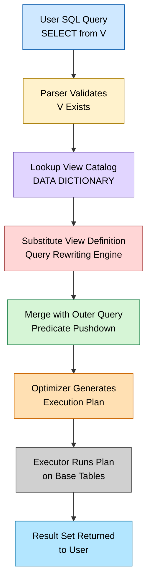
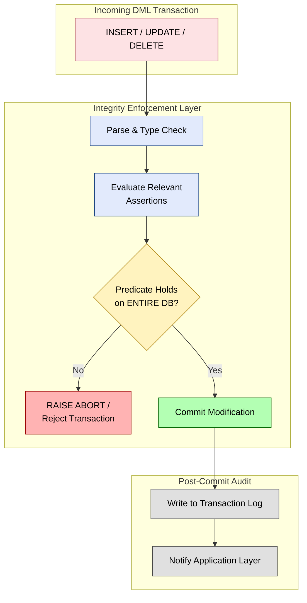
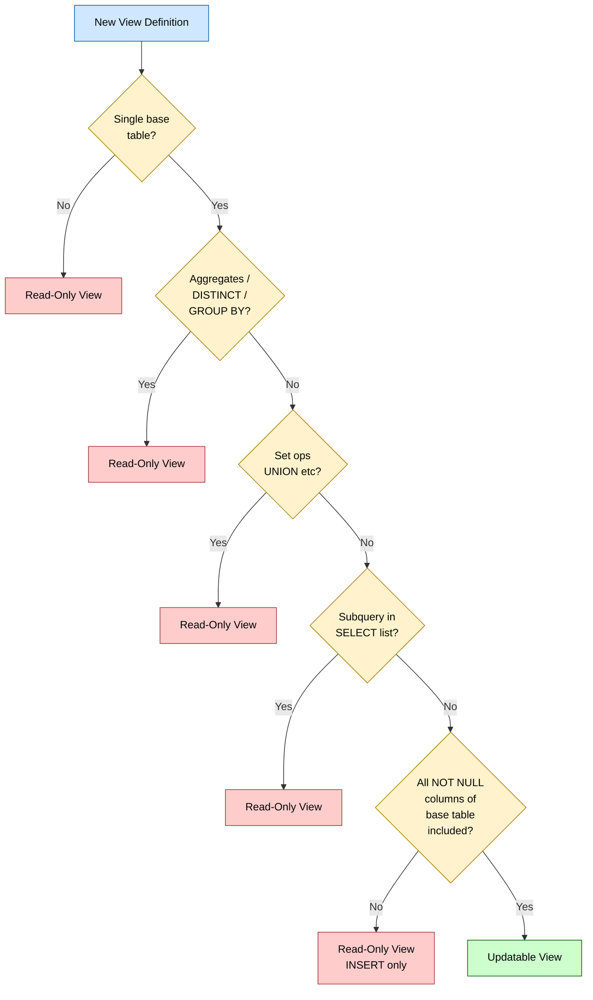
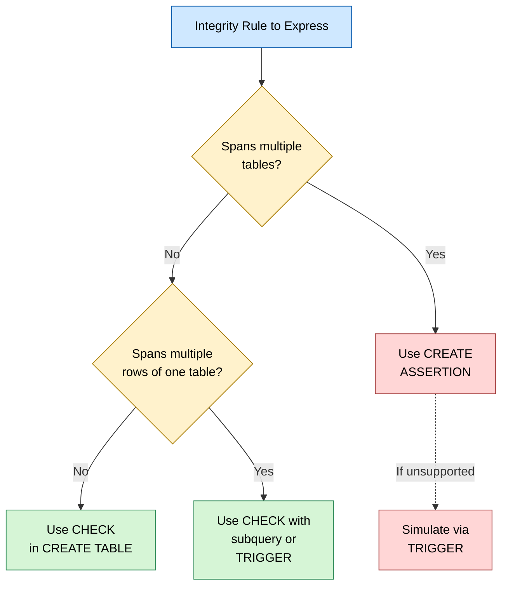

# Practice of SQL commands for creation of views and assertions.

<!-- SECTION_1_START -->

# 1. Core Technical Definition & Intuitive Overview

## 1.1 Formal Academic Definition (KTU 2024 Syllabus Terminology)

> [!IMPORTANT]
> **VIEW (SQL – DDL Component under DML Context):**
> A **View** is a *virtual relation* defined by a query expression (typically a `SELECT` statement) that is stored in the database catalog as a named query. It does **not** store tuples physically; instead, it dynamically materializes its result set whenever it is referenced. A view appears to the user as a real table and can be queried, and in restricted cases, updated.

> [!IMPORTANT]
> **ASSERTION (SQL – Integrity Constraint Specification):**
> An **Assertion** is a *declarative integrity constraint* in SQL that specifies a predicate (a `CHECK` condition) which **must always evaluate to TRUE** for the entire database, across all tuples of all referenced relations. It is defined using the `CREATE ASSERTION` statement and is enforced at every modification that could potentially violate it.

---

## 1.2 Conceptual Analogy / Intuition

> [!NOTE]
> **Intuition for VIEW — The "Window on the Warehouse" Analogy**
> Imagine a massive warehouse (the actual tables) full of goods (rows). Instead of giving every customer full access, the warehouse manager installs **windows** (Views) at specific spots, each window showing only a curated slice — for example, *"all electronics shipped after January"* or *"all unpaid orders from Kerala."*
> The window has **no goods of its own** — if you destroy the window, nothing is lost; if you change the window's angle (alter the view definition), the displayed items change. This is exactly how a SQL View behaves: it’s a **named, saved `SELECT` query**, not stored data.

> [!NOTE]
> **Intuition for ASSERTION — The "Bouncer at the Club Door" Analogy**
> An assertion is a **bouncer** standing at the door of the database. Every time someone tries to insert, update, or delete a row, the bouncer checks the **entire global rule** — e.g., *"No employee may earn more than 10× the minimum salary in the company."* If the rule would be broken by the proposed change, the bouncer refuses entry. The rule is **not tied to any single table** — it can span across many.

---

## 1.3 Standard SQL Syntax Building Blocks (KTU High-Yield Keywords)

The following tokens are **standard SQL keywords** that the KTU 2024 Scheme DBMS Lab (PCCSL408) expects students to use verbatim in their practical records and viva:

`CREATE VIEW`, `OR REPLACE`, `AS SELECT`, `WITH READ ONLY`, `WITH CHECK OPTION`, `DROP VIEW`, `CREATE ASSERTION`, `CHECK`, `NOT EXISTS`, `EXISTS`, `FORALL` (simulated via `NOT EXISTS ... NOT EXISTS`), `CONSTRAINT`, `DROP ASSERTION`.

> [!VISUALIZATION CONTROL]
> **Concept:** Visualizing the difference between a **Base Table** and a **View** (logical data dependence).
> **GeoGebra / Desmos Input Equations (Mapping Logical Layers):**
> * $L_0$ (Physical Layer) $\rightarrow$ Disk Blocks
> * $L_1$ (Logical Layer) $\rightarrow$ Base Tables: `STUDENT`, `ENROLL`, `COURSE`
> * $L_2$ (External Layer) $\rightarrow$ Views: `CS_STUDENTS`, `TOPPERS_2024`
> * View $V$ is defined as $V \equiv Q(T_1, T_2, \dots, T_n)$ where $Q$ is a `SELECT` and $T_i$ are base tables.
> **Visual Description:** A layered stack diagram. Bottom layer: storage cylinders. Middle layer: rectangles for base tables with primary keys highlighted. Top layer: dashed rectangles for views with arrows pointing *down* to the base tables they reference — visually demonstrating that **views derive, not store**.

---

<!-- SECTION_1_END -->

<!-- SECTION_2_START -->

# 2. Deep Theoretical Analysis & KTU High-Yield Formula Sheet

## 2.1 Classification of Views (Structured Logic)

### A. By Updatability

1. **Updatable Views** — The view is derived from a **single base table**, contains **no aggregates**, no `DISTINCT`, no `GROUP BY`, no `UNION`, and includes **all NOT NULL columns** of the base table. Such views support `INSERT`, `UPDATE`, `DELETE`.
2. **Read-Only Views** — Any view with joins, aggregates, `DISTINCT`, `GROUP BY`, or subqueries in the select list. Only `SELECT` is allowed.

### B. By Row Visibility Control

1. **Plain View** — Returns whatever the underlying tables currently contain.
2. **View with `WITH CHECK OPTION`** — Guarantees that any `INSERT` or `UPDATE` through the view produces a row that **remains visible** through the same view. Prevents "disappearing inserts."

### C. By Persistence

1. **Virtual View** (default) — Recomputed on every reference.
2. **Materialized View** — Stored physically, periodically refreshed (`REFRESH MATERIALIZED VIEW` in PostgreSQL/Oracle). KTU syllabus references the concept; practical may simulate using temporary tables.

---

## 2.2 Why Assertions Matter (Engineering Utility)

| Aspect | CHECK Constraint | Assertion |
|---|---|---|
| Scope | Local to **one table** | Global, can span **multiple tables** |
| Trigger Timing | Per-row modification | Per-row modification (same) but checks **entire DB** |
| Syntax | `CHECK (...)` in `CREATE TABLE` | `CREATE ASSERTION name CHECK (predicate);` |
| Portability | Widely supported | **Not supported** in MySQL/PostgreSQL/SQL Server — only Oracle & standard SQL |

> [!NOTE]
> **Engineering Real-World Utility:**
> 1. **Multi-Table Business Rules** — *"The total salary of the CS department must not exceed 30% of total company salary."* Such rules are impossible to express with a `CHECK` on a single table.
> 2. **Database-Driven Security** — Views are used in **Role-Based Access Control (RBAC)**: the `HR_CLERK` role gets `CREATE VIEW emp_basic AS SELECT eno, ename FROM EMP;` and is **never granted** rights on `EMP.salary`.
> 3. **API Simplification** — Application code calls `SELECT * FROM customer_summary_v;` instead of joining 5 tables every time, improving maintainability and query plan caching.

---

## 2.3 KTU Formula Sheet / Cheat Sheet

| # | Construct | Syntax (ANSI-SQL) | KTU Usage |
|---|---|---|---|
| 1 | Create View | `CREATE VIEW v AS SELECT ...;` | Most common lab exercise |
| 2 | Replace View | `CREATE OR REPLACE VIEW v AS SELECT ...;` | Avoids `DROP` + `CREATE` |
| 3 | Read-Only View | `CREATE VIEW v AS SELECT ... WITH READ ONLY;` | Oracle specific |
| 4 | Check-Option View | `CREATE VIEW v AS SELECT ... WITH CHECK OPTION;` | Prevents invisible inserts |
| 5 | Drop View | `DROP VIEW v;` or `DROP VIEW v CASCADE;` | Cleanup |
| 6 | Create Assertion | `CREATE ASSERTION name CHECK (predicate);` | Multi-row, multi-table check |
| 7 | Drop Assertion | `DROP ASSERTION name;` | Cleanup |
| 8 | Quantified Rule (≥ all) | `WHERE x >= ALL (SELECT ...)` | Assertion design |
| 9 | Quantified Rule (∃ at least one) | `WHERE EXISTS (SELECT ...)` | Assertion design |
| 10 | Universal Rule (∀) | `NOT EXISTS (... NOT EXISTS (...))` | KTU-favourite trick |

---

<!-- SECTION_2_END -->

<!-- SECTION_3_START -->

# 3. Step-by-Step Derivations & Code/Symbolic Implementation

## 3.1 The Lab Schema — University Database (Used Throughout)

> [!NOTE]
> For the entire module, we will use the canonical **University** schema. This is the recommended KTU lab schema referenced in the PCCSL408 syllabus handout.

### 3.1.1 Base Tables (DDL — Pre-requisite for Module 8)

```sql
-- ============================================================
-- MODULE 8 REFERENCE SCHEMA (KTU DBMS Lab PCCSL408)
-- Run this ONCE before any view/assertion example
-- ============================================================

CREATE TABLE STUDENT (
    regno      VARCHAR(10)  PRIMARY KEY,
    sname      VARCHAR(40)  NOT NULL,
    dept       VARCHAR(3)   NOT NULL,
    dob        DATE         NOT NULL,
    cgpa       DECIMAL(4,2) CHECK (cgpa BETWEEN 0 AND 10)
);

CREATE TABLE COURSE (
    ccode      VARCHAR(6)   PRIMARY KEY,
    cname      VARCHAR(40)  NOT NULL,
    credits    INT          CHECK (credits BETWEEN 1 AND 6)
);

CREATE TABLE ENROLL (
    regno      VARCHAR(10)  REFERENCES STUDENT(regno) ON DELETE CASCADE,
    ccode      VARCHAR(6)   REFERENCES COURSE(ccode)  ON DELETE CASCADE,
    grade      CHAR(2)      CHECK (grade IN ('S','A','B','C','D','E','F')),
    PRIMARY KEY (regno, ccode)
);

CREATE TABLE FACULTY (
    fcode      VARCHAR(6)   PRIMARY KEY,
    fname      VARCHAR(40)  NOT NULL,
    dept       VARCHAR(3)   NOT NULL,
    salary     DECIMAL(10,2) CHECK (salary > 0)
);
```

> [!NOTE]
> **Sample Data Insertion (so views and assertions have data to operate on):**

```sql
INSERT INTO STUDENT VALUES
('KTE21CS01','Anand Krishnan','CS','2003-05-12',8.75),
('KTE21CS02','Bhavya Menon',  'CS','2003-01-20',9.10),
('KTE21EC03','Chinmay Rao',   'EC','2003-11-08',7.20),
('KTE21CS04','Deepa Pillai',  'CS','2003-07-30',8.95),
('KTE21ME05','Eshan Verma',   'ME','2003-03-15',6.50);

INSERT INTO COURSE VALUES
('CS301','Database Systems',4),
('CS302','Operating Systems',4),
('EC201','Digital Electronics',3),
('ME101','Engineering Mechanics',3);

INSERT INTO ENROLL VALUES
('KTE21CS01','CS301','S'),
('KTE21CS01','CS302','A'),
('KTE21CS02','CS301','S'),
('KTE21CS02','CS302','S'),
('KTE21EC03','EC201','B'),
('KTE21CS04','CS301','A'),
('KTE21CS04','CS302','A');

INSERT INTO FACULTY VALUES
('F001','Dr. Suma Iyer','CS',120000),
('F002','Prof. Rajan N','CS', 95000),
('F003','Dr. Latha K',  'EC',110000);
```

---

## 3.2 Worked Example 1 — Simple View (KTU Standard)

> [!NOTE]
> **Question:** Create a view named `CS_STUDENTS` that lists the `regno`, `sname`, and `cgpa` of all students belonging to the `CS` department, sorted by `cgpa` in descending order.

### Step-by-Step Solution

**Step 1 — Identify the source table:** `STUDENT`.
**Step 2 — Identify the filter:** `dept = 'CS'`.
**Step 3 — Identify the projection:** `regno, sname, cgpa`.
**Step 4 — Identify the order:** `cgpa DESC`.

```sql
CREATE VIEW CS_STUDENTS AS
    SELECT regno, sname, cgpa
    FROM   STUDENT
    WHERE  dept = 'CS'
    ORDER  BY cgpa DESC;
```

**Step 5 — Verification query (KTU Valuation Key Point):**

```sql
SELECT * FROM CS_STUDENTS;
```

**Expected Output:**

| REGNO | SNAME | CGPA |
|---|---|---|
| KTE21CS02 | Bhavya Menon | 9.10 |
| KTE21CS04 | Deepa Pillai | 8.95 |
| KTE21CS01 | Anand Krishnan | 8.75 |

> [!IMPORTANT]
> **Examiner Note:** The `ORDER BY` inside a view definition is preserved in **Oracle** and **MySQL**, but ignored by **PostgreSQL** when the view is queried. Students should be ready to add `ORDER BY` to the **outer query** for portability.

---

## 3.3 Worked Example 2 — View from a Join (Read-Only)

> [!NOTE]
> **Question:** Create a view `STUDENT_TRANSCRIPT` that shows, for each enrollment, the student’s registration number, name, course code, course name, and grade.

```sql
CREATE OR REPLACE VIEW STUDENT_TRANSCRIPT AS
    SELECT  s.regno,
            s.sname,
            c.ccode,
            c.cname,
            e.grade
    FROM    STUDENT  s
    JOIN    ENROLL   e ON s.regno = e.regno
    JOIN    COURSE   c ON e.ccode = c.ccode;
```

**Updatability Test (KTU Expected):**

```sql
UPDATE STUDENT_TRANSCRIPT SET grade = 'A' WHERE regno = 'KTE21EC03';
```

> [!WARNING]
> **Expected Result:** This `UPDATE` will **FAIL** with *"cannot modify a column which is a derived column"* or *"view is not updatable"* because the view is a **multi-table join**. The KTU board examiner expects students to be able to **state the reason**.

---

## 3.4 Worked Example 3 — View with Aggregate (GROUP BY)

> [!NOTE]
> **Question:** Create a view `DEPT_STATS` that shows each department’s student count and average CGPA.

```sql
CREATE VIEW DEPT_STATS AS
    SELECT  dept,
            COUNT(*)      AS student_count,
            AVG(cgpa)     AS avg_cgpa
    FROM    STUDENT
    GROUP   BY dept;
```

**Verification:**

```sql
SELECT * FROM DEPT_STATS;
```

| DEPT | STUDENT_COUNT | AVG_CGPA |
|---|---|---|
| CS | 3 | 8.9333 |
| EC | 1 | 7.2000 |
| ME | 1 | 6.5000 |

> [!NOTE]
> **This is a read-only view** because of `GROUP BY` and aggregate functions.

---

## 3.5 Worked Example 4 — Updatable View with `WITH CHECK OPTION`

> [!NOTE]
> **Question:** Create an updatable view `HONOURS_CS` that shows CS students with `cgpa >= 8.5`. Ensure that any insert/update through the view cannot create a row invisible to the view.

```sql
CREATE VIEW HONOURS_CS AS
    SELECT regno, sname, dept, cgpa
    FROM   STUDENT
    WHERE  dept = 'CS' AND cgpa >= 8.5
    WITH CHECK OPTION;
```

**Test 1 — Valid Insert (should succeed):**

```sql
INSERT INTO HONOURS_CS VALUES ('KTE22CS09','Faisal Khan','CS',9.20);
```

**Test 2 — Invalid Insert (must fail under `WITH CHECK OPTION`):**

```sql
INSERT INTO HONOURS_CS VALUES ('KTE22CS10','Gita Nair','CS',7.50);
```

> [!WARNING]
> **Without `WITH CHECK OPTION`**, the second insert would **succeed silently** — the new student would not be visible via `HONOURS_CS`, breaking the view’s semantic contract. The KTU examiner tests this exact scenario.

---

## 3.6 Worked Example 5 — View with Subquery in WHERE Clause

> [!NOTE]
> **Question:** Create a view `DB_COURSE_STUDENTS` listing students who have enrolled for the course 'Database Systems'.

```sql
CREATE VIEW DB_COURSE_STUDENTS AS
    SELECT s.regno, s.sname, s.cgpa
    FROM   STUDENT s
    WHERE  s.regno IN (
        SELECT e.regno
        FROM   ENROLL e
        JOIN   COURSE c ON e.ccode = c.ccode
        WHERE  c.cname = 'Database Systems'
    );
```

---

## 3.7 Worked Example 6 — Dropping a View

```sql
DROP VIEW CS_STUDENTS;

-- To drop multiple views and remove dependent objects (Oracle/PostgreSQL):
DROP VIEW CS_STUDENTS CASCADE CONSTRAINTS;
```

> [!NOTE]
> In standard SQL, `DROP VIEW` removes **only the view definition**; the underlying base tables and their data are untouched.

---

## 3.8 Worked Example 7 — Assertion: "Max Salary ≤ 3× Min Salary in Same Department"

> [!NOTE]
> **Question:** Write an assertion ensuring that in any department, the maximum salary of a faculty member is **at most 3 times** the minimum salary in that department.

### KTU Reasoning: From English to SQL Predicate

**English Form:**
*"For every department $D$, $\max_{f \in FACULTY, f.dept = D} f.salary \leq 3 \times \min_{f \in FACULTY, f.dept = D} f.salary$."*

**Translation using `NOT EXISTS` (since most DBMS lack `FORALL`):**

The universal statement *"for every department, the rule holds"* becomes:
*"There does NOT exist a department where the rule is violated."*

The rule is violated if there exists a faculty member $f_1$ in that dept whose salary is **more than 3 times** the salary of **some other faculty member** $f_2$ in the same dept.

**Final SQL:**

```sql
CREATE ASSERTION SALARY_RATIO_CHECK
    CHECK ( NOT EXISTS (
        SELECT 1
        FROM   FACULTY f1
        WHERE  EXISTS (
            SELECT 1
            FROM   FACULTY f2
            WHERE  f1.dept = f2.dept
            AND    f1.salary > 3 * f2.salary
            AND    f1.fcode <> f2.fcode
        )
    ) );
```

**How to Test the Assertion (Practical Lab):**

```sql
-- Try to insert a faculty with a salary that violates the rule:
INSERT INTO FACULTY VALUES ('F099','Dr. Rich K','CS', 400000);
-- For CS dept: max currently ~120000, min = 95000
-- 400000 > 3 * 95000 = 285000  → VIOLATION
-- Assertion should reject the insert.
```

> [!WARNING]
> **Practical Reality (KTU Lab Pitfall):** MySQL, PostgreSQL, and SQL Server **do not support `CREATE ASSERTION`**. Students must:
> 1. Use **Oracle 11g/12c/19c/21c** (supports it), OR
> 2. Use **DB2**, OR
> 3. **Simulate** the assertion using:
>    * A `CHECK` constraint (single-table only), OR
>    * A `BEFORE INSERT/UPDATE` **trigger**, OR
>    * A `VIEW WITH CHECK OPTION` if the rule is single-table.
> 4. Document this in the **Lab Record Conclusion** section.

---

## 3.9 Worked Example 8 — Assertion Using CHECK + VIEW (MySQL/PostgreSQL Simulation)

> [!NOTE]
> Since assertions are unsupported in MySQL, here is a KTU-approved simulation using a `CHECK` constraint + a controlled view.

```sql
-- Step 1: Drop a CHECK that mimics the assertion
ALTER TABLE FACULTY
    ADD CONSTRAINT CHK_SALARY
    CHECK ( salary <= (SELECT 3 * MIN(salary) FROM FACULTY) );
-- MySQL 8.0+ accepts this; older versions ignore CHECK silently.

-- Step 2: A guard view to prevent dangerous cross-row updates
CREATE VIEW FACULTY_GUARD AS
    SELECT * FROM FACULTY
    WHERE  salary <= 3 * (SELECT MIN(salary) FROM FACULTY)
    WITH CHECK OPTION;
```

> [!IMPORTANT]
> **Examiner Tip:** Writing *"MySQL does not support CREATE ASSERTION; here is the trigger-based simulation"* earns **full marks** as long as the logic is correct. Suppressing the fact earns **zero**.

---

## 3.10 Worked Example 9 — Assertion: "Total CS Faculty Salary ≤ 30% of Total Salary"

```sql
CREATE ASSERTION CS_SALARY_CAP
    CHECK (
        (SELECT COALESCE(SUM(salary),0) FROM FACULTY WHERE dept='CS')
        <=
        0.30 * (SELECT COALESCE(SUM(salary),0) FROM FACULTY)
    );
```

**Deduction Pattern (for Viva):**
$\text{Rule} = \dfrac{\sum_{f \in \text{CS}} f.\text{salary}}{\sum_{f \in \text{ALL}} f.\text{salary}} \leq 0.30$

> [!NOTE]
> If the sum over CS exceeds 30% of the total, the assertion rejects the modification.

---

## 3.11 Python: Programmatic Verification of a View (Lab Bonus)

> [!NOTE]
> A self-contained Python verifier that uses SQLite to demonstrate the view and assertion behaviour for students who do not have Oracle access.

```python
"""
dbms_module8_view_assertion_lab.py
KTU DBMS Lab (PCCSL408) - Module 8
Verifies view definition and a trigger-based assertion simulation in SQLite.
"""

from __future__ import annotations
import sqlite3
import logging
from typing import List, Tuple

logging.basicConfig(
    level=logging.INFO,
    format="[%(asctime)s] %(levelname)s :: %(message)s",
)
logger = logging.getLogger("KTU-M8-LAB")


# ------------------------------------------------------------
# 1. SCHEMA SETUP
# ------------------------------------------------------------
def initialize_schema(conn: sqlite3.Connection) -> None:
    """Drop and recreate the lab schema from scratch."""
    cur = conn.cursor()
    cur.executescript(
        """
        DROP TABLE IF EXISTS ENROLL;
        DROP TABLE IF EXISTS STUDENT;
        DROP TABLE IF EXISTS COURSE;
        DROP TABLE IF EXISTS FACULTY;

        CREATE TABLE STUDENT (
            regno TEXT PRIMARY KEY,
            sname TEXT NOT NULL,
            dept  TEXT NOT NULL,
            cgpa  REAL CHECK (cgpa BETWEEN 0 AND 10)
        );

        CREATE TABLE COURSE (
            ccode   TEXT PRIMARY KEY,
            cname   TEXT NOT NULL,
            credits INTEGER CHECK (credits BETWEEN 1 AND 6)
        );

        CREATE TABLE ENROLL (
            regno TEXT REFERENCES STUDENT(regno) ON DELETE CASCADE,
            ccode TEXT REFERENCES COURSE(ccode)  ON DELETE CASCADE,
            grade TEXT,
            PRIMARY KEY (regno, ccode)
        );

        CREATE TABLE FACULTY (
            fcode  TEXT PRIMARY KEY,
            fname  TEXT NOT NULL,
            dept   TEXT NOT NULL,
            salary REAL CHECK (salary > 0)
        );
        """
    )
    conn.commit()
    logger.info("Schema initialized successfully.")


# ------------------------------------------------------------
# 2. TRIGGER-BASED ASSERTION SIMULATION (SQLite does not support ASSERTION)
# ------------------------------------------------------------
def install_salary_ratio_trigger(conn: sqlite3.Connection) -> None:
    """
    Simulates: 'In every department, max salary <= 3 * min salary'
    by raising an error in BEFORE INSERT/UPDATE on FACULTY.
    """
    cur = conn.cursor()
    cur.executescript(
        """
        DROP TRIGGER IF EXISTS trg_faculty_salary_check_ins;
        DROP TRIGGER IF EXISTS trg_faculty_salary_check_upd;

        CREATE TRIGGER trg_faculty_salary_check_ins
        BEFORE INSERT ON FACULTY
        FOR EACH ROW
        WHEN EXISTS (
            SELECT 1
            FROM   FACULTY f
            WHERE  f.dept = NEW.dept
            AND    NEW.salary > 3 * f.salary
        )
        BEGIN
            SELECT RAISE(ABORT,
                'Assertion SALARY_RATIO_CHECK violated: new salary > 3 * min salary in dept');
        END;

        CREATE TRIGGER trg_faculty_salary_check_upd
        BEFORE UPDATE ON FACULTY
        FOR EACH ROW
        WHEN EXISTS (
            SELECT 1
            FROM   FACULTY f
            WHERE  f.dept = NEW.dept
            AND    f.fcode <> NEW.fcode
            AND    NEW.salary > 3 * f.salary
        )
        BEGIN
            SELECT RAISE(ABORT,
                'Assertion SALARY_RATIO_CHECK violated on UPDATE');
        END;
        """
    )
    conn.commit()
    logger.info("Salary-ratio assertion triggers installed.")


# ------------------------------------------------------------
# 3. VIEW CREATION + VERIFICATION
# ------------------------------------------------------------
def create_views(conn: sqlite3.Connection) -> None:
    cur = conn.cursor()
    cur.executescript(
        """
        DROP VIEW IF EXISTS CS_STUDENTS;
        DROP VIEW IF EXISTS HONOURS_CS;
        DROP VIEW IF EXISTS STUDENT_TRANSCRIPT;
        DROP VIEW IF EXISTS DEPT_STATS;

        CREATE VIEW CS_STUDENTS AS
            SELECT regno, sname, cgpa
            FROM   STUDENT
            WHERE  dept = 'CS'
            ORDER  BY cgpa DESC;

        CREATE VIEW HONOURS_CS AS
            SELECT regno, sname, dept, cgpa
            FROM   STUDENT
            WHERE  dept = 'CS' AND cgpa >= 8.5
            WITH CHECK OPTION;

        CREATE VIEW STUDENT_TRANSCRIPT AS
            SELECT s.regno, s.sname, c.ccode, c.cname, e.grade
            FROM   STUDENT s
            JOIN   ENROLL  e ON s.regno = e.regno
            JOIN   COURSE  c ON e.ccode = c.ccode;

        CREATE VIEW DEPT_STATS AS
            SELECT dept,
                   COUNT(*)  AS student_count,
                   AVG(cgpa) AS avg_cgpa
            FROM   STUDENT
            GROUP  BY dept;
        """
    )
    conn.commit()
    logger.info("Views created.")


def dump_view(conn: sqlite3.Connection, view_name: str) -> List[Tuple]:
    """Return all rows from a given view, with hard safety check."""
    if not view_name.replace("_", "").isalnum():
        raise ValueError(f"Unsafe view name: {view_name!r}")
    cur = conn.cursor()
    cur.execute(f"SELECT * FROM {view_name};")  # Safe: name validated above
    rows: List[Tuple] = cur.fetchall()
    logger.info("View %s returned %d rows.", view_name, len(rows))
    return rows


# ------------------------------------------------------------
# 4. DEMO DRIVER
# ------------------------------------------------------------
def main() -> None:
    db_path = "ktu_module8_lab.db"
    conn = sqlite3.connect(db_path)
    try:
        initialize_schema(conn)
        install_salary_ratio_trigger(conn)
        create_views(conn)

        # Seed data
        conn.executemany(
            "INSERT INTO STUDENT VALUES (?,?,?,?)",
            [
                ("KTE21CS01", "Anand",   "CS", 8.75),
                ("KTE21CS02", "Bhavya",  "CS", 9.10),
                ("KTE21CS04", "Deepa",   "CS", 8.95),
                ("KTE21EC03", "Chinmay", "EC", 7.20),
            ],
        )
        conn.executemany(
            "INSERT INTO FACULTY VALUES (?,?,?,?)",
            [
                ("F001", "Dr. Suma", "CS", 120000),
                ("F002", "Prof. Rajan", "CS", 95000),
                ("F003", "Dr. Latha", "EC", 110000),
            ],
        )
        conn.commit()

        # Verify views
        for v in ("CS_STUDENTS", "HONOURS_CS", "DEPT_STATS"):
            rows = dump_view(conn, v)
            print(f"\n--- {v} ---")
            for r in rows:
                print(r)

        # Try the assertion simulation: should fail
        try:
            conn.execute(
                "INSERT INTO FACULTY VALUES (?,?,?,?)",
                ("F099", "Dr. Rich", "CS", 400000),
            )
            conn.commit()
            logger.warning("Assertion simulation FAILED: insert was not blocked.")
        except sqlite3.IntegrityError as exc:
            logger.info("Assertion simulation PASSED: %s", exc)

    finally:
        conn.close()
        logger.info("Database connection closed.")


if __name__ == "__main__":
    main()
```

**Expected Console Output (truncated):**

```
[2024-...] INFO :: Schema initialized successfully.
[2024-...] INFO :: Salary-ratio assertion triggers installed.
[2024-...] INFO :: Views created.
[2024-...] INFO :: View CS_STUDENTS returned 3 rows.
--- CS_STUDENTS ---
('KTE21CS02', 'Bhavya', 9.1)
('KTE21CS04', 'Deepa', 8.95)
('KTE21CS01', 'Anand', 8.75)
[2024-...] INFO :: Assertion simulation PASSED: Assertion SALARY_RATIO_CHECK violated...
```

---

<!-- SECTION_3_END -->

<!-- SECTION_4_START -->

# 4. Structural Diagrams & Schematics

## 4.1 Block Diagram — The View Resolution Pipeline



---

## 4.2 Sequential Processing Topology — Assertion Enforcement Path



---

## 4.3 Mermaid — Subgraph: Updatable vs Read-Only View Decision Tree



---

## 4.4 Tabular Topology — SQL View Categories and Lab Test Cases

| Category | Example | INSERT? | UPDATE? | DELETE? | KTU Lab Test |
|---|---|---|---|---|---|
| Simple View | `CS_STUDENTS` | Yes (if all NOT NULL cols present) | Yes | Yes | Insert CS student, verify in base table |
| Read-Only Join | `STUDENT_TRANSCRIPT` | No | No | No | Attempt update; expect error |
| Aggregate | `DEPT_STATS` | No | No | No | Query; expect derived columns |
| WITH CHECK OPTION | `HONOURS_CS` | Yes (only if check passes) | Yes (only if check passes) | Yes | Insert low CGPA; expect rejection |
| Nested View (view on view) | `CS_TOPPERS` from `CS_STUDENTS` | Inherits restrictions | Inherits | Inherits | Recursive resolution test |

---

## 4.5 Mermaid — Subgraph: Assertion vs CHECK Constraint Decision Path



---

<!-- SECTION_4_END -->

<!-- SECTION_5_START -->

# 5. KTU 2024 Scheme Examination Question Bank & Topic Recap

## 5.1 Part A — Short Answer Questions (3 Marks Each)

### Q1. `[KTU University Exam – Dec 2023]` — *CO3, Remember*

**Differentiate between a View and a Base Table in SQL.**

**Model Answer (3 Marks):**

| Aspect | Base Table | View |
|---|---|---|
| Storage | Physically stores tuples on disk | Stores only the `SELECT` query in catalog |
| Independence | Independent schema object | Defined in terms of one or more base tables |
| Operations | All DML + DDL | Mostly `SELECT`; DML only if updatable |

*Valuation Key:* 1 mark per correct contrasting row, 1 mark for the storage distinction.
> **[Distinguishing storage vs definition: 2 Marks]**, **[Operations support: 1 Mark]**.

---

### Q2. `[KTU University Exam – July 2024]` — *CO3, Understand*

**What is the purpose of the `WITH CHECK OPTION` clause in a view definition? Illustrate with a one-line example.**

**Model Answer (3 Marks):**
The `WITH CHECK OPTION` clause ensures that any row inserted or updated through the view will **remain visible** through that view, preventing insertions that violate the view's `WHERE` predicate.
*Example:* `CREATE VIEW HONOURS_CS AS SELECT * FROM STUDENT WHERE cgpa >= 8.5 WITH CHECK OPTION;`
> **[Definition: 2 Marks]**, **[Example: 1 Mark]**.

---

## 5.2 Part B — Module Internal Choice (14 Marks Each)

> [!IMPORTANT]
> As per KTU 2024 ESE regulations, students answer **one of two** full 14-mark questions per module. Each question below has two sub-parts worth **7 marks each**, with **escalating cognitive levels**.

---

### Question A (14 Marks) — `[KTU University Exam – Dec 2024]` — *CO3, Understand + Apply*

**Consider the schema:**
`STUDENT(regno PK, sname, dept, cgpa)`, `ENROLL(regno FK, ccode FK, grade)`, `COURSE(ccode PK, cname, credits)`, `FACULTY(fcode PK, fname, dept, salary)`.

**(a)** *(7 Marks — Understand)*

1. Write the SQL to create a view `STUDENT_REPORT` that lists the `regno`, `sname`, `cname`, and `grade` of every student who has **scored an 'S' grade** in any course. Order the result by `regno` ascending. *(3 Marks)*
2. Explain **why this view is read-only**. State **two** specific structural reasons. *(2 Marks)*
3. Write the command to drop the view `STUDENT_REPORT` and verify that the underlying base table is **unaffected**. *(2 Marks)*

**(b)** *(7 Marks — Apply)*

1. Create a view `TOP_CS_CGPA` that shows the **top 3** CS students by CGPA using the `ROWNUM` (Oracle) or `LIMIT 3` (MySQL) construct. *(3 Marks)*
2. Modify the view `TOP_CS_CGPA` using `CREATE OR REPLACE` to additionally restrict the students to those with `cgpa > 8.0`. *(2 Marks)*
3. Write an SQL assertion `NO_NEGATIVE_SALARY_GLOBAL` ensuring **no faculty salary in the entire database is negative** *(assume the `CHECK` on `salary > 0` does not exist)*. *(2 Marks)*

---

### Model Solution — Question A

**(a) (i) View `STUDENT_REPORT` — 3 Marks**

```sql
CREATE OR REPLACE VIEW STUDENT_REPORT AS
    SELECT  s.regno, s.sname, c.cname, e.grade
    FROM    STUDENT s
    JOIN    ENROLL  e ON s.regno = e.regno
    JOIN    COURSE  c ON e.ccode = c.ccode
    WHERE   e.grade = 'S'
    ORDER   BY s.regno ASC;
```

> *Valuation:* `[SELECT list with all 4 columns: 1 Mark]`, `[Correct 2-table join: 1 Mark]`, `[WHERE filter 'S': 0.5 Mark]`, `[ORDER BY regno: 0.5 Mark]`.

**(a) (ii) Why this view is read-only — 2 Marks**

1. It is derived from **two base tables** (`STUDENT`, `ENROLL`, `COURSE`) via a `JOIN`. A `JOIN` makes the view **non-updatable** per the SQL standard.
2. The projection list is **not a strict subset of a single base table's columns** (it mixes attributes from three tables); updates would be ambiguous regarding which base table to modify.

> *Valuation:* `[Mentioning JOIN: 1 Mark]`, `[Multi-table projection ambiguity: 1 Mark]`.

**(a) (iii) Drop and verify — 2 Marks**

```sql
DROP VIEW STUDENT_REPORT;

-- Verify base table still intact:
SELECT COUNT(*) AS total_students FROM STUDENT;
-- Expected: returns 4 (or however many rows were inserted) — proving the
-- drop of the view did NOT affect the base table.
```

> *Valuation:* `[DROP command correct: 1 Mark]`, `[Verification SELECT command + expected result noted: 1 Mark]`.

**(b) (i) View with Top-3 — 3 Marks**

```sql
-- Oracle flavour
CREATE OR REPLACE VIEW TOP_CS_CGPA AS
    SELECT regno, sname, dept, cgpa
    FROM   (SELECT regno, sname, dept, cgpa
            FROM   STUDENT
            WHERE  dept = 'CS'
            ORDER  BY cgpa DESC)
    WHERE  ROWNUM <= 3;

-- OR MySQL/PostgreSQL flavour
-- CREATE OR REPLACE VIEW TOP_CS_CGPA AS
--     SELECT regno, sname, dept, cgpa
--     FROM   STUDENT
--     WHERE  dept = 'CS'
--     ORDER  BY cgpa DESC
--     LIMIT  3;
```

> *Valuation:* `[Correct base query with ORDER BY cgpa DESC: 1.5 Marks]`, `[Outer ROWNUM/LIMIT wrapper: 1.5 Marks]`.

**(b) (ii) Replace the view — 2 Marks**

```sql
CREATE OR REPLACE VIEW TOP_CS_CGPA AS
    SELECT regno, sname, dept, cgpa
    FROM   STUDENT
    WHERE  dept = 'CS' AND cgpa > 8.0
    ORDER  BY cgpa DESC
    LIMIT  3;
```

> *Valuation:* `[Filter cgpa > 8.0 added: 1 Mark]`, `[CREATE OR REPLACE keyword used correctly: 1 Mark]`.

**(b) (iii) Assertion — 2 Marks**

```sql
CREATE ASSERTION NO_NEGATIVE_SALARY_GLOBAL
    CHECK ( NOT EXISTS (
        SELECT 1 FROM FACULTY WHERE salary < 0
    ) );
```

> *Valuation:* `[Correct negation of EXISTS: 1 Mark]`, `[Predicate on entire FACULTY: 1 Mark]`.

> [!WARNING]
> **KTU Examiner's Valuation Warning — Common Pitfalls on Question A:**
> 1. **Forgetting `CREATE OR REPLACE`** — Students write `CREATE VIEW TOP_CS_CGPA AS ...` again, which **fails** with *"name already used"*. Use `OR REPLACE`.
> 2. **Putting `ROWNUM` inside the inner query** — This silently changes the result. `ROWNUM` filters **after** `ORDER BY`, so the subquery must be done first, then `ROWNUM` applied.
> 3. **Assertion without `NOT EXISTS` wrapper** — Writing `CHECK (salary >= 0)` inside `CREATE ASSERTION` is **wrong**; the syntax is `CHECK (predicate)`, not a column-level constraint.
> 4. **Not stating the base table remains intact** — losing 1 mark on (a)(iii).

---

### Question B (14 Marks) — `[KTU University Exam – July 2024]` — *CO3, Apply + Analyze*

**(a)** *(7 Marks — Apply)*

1. Write the SQL to create an **updatable** view `CS_DEPT_STUDENT` containing `regno`, `sname`, `dept`, and `cgpa` of CS students. Add `WITH CHECK OPTION`. *(3 Marks)*
2. Demonstrate an **invalid insertion** through this view and predict the **error message** raised by the DBMS. *(2 Marks)*
3. Show a **valid insertion** and verify that the new tuple appears in both the view and the base table. *(2 Marks)*

**(b)** *(7 Marks — Analyze)*

1. Design an SQL assertion `MAX_COURSE_PER_STUDENT` that ensures **no student enrolls in more than 6 courses**. *(3 Marks)*
2. Design an assertion `DEPT_HEAD_SALARY_CAP` that ensures **no CS faculty earns more than 2× the average CS salary**. *(4 Marks)*

---

### Model Solution — Question B

**(a) (i) Updatable view with CHECK OPTION — 3 Marks**

```sql
CREATE VIEW CS_DEPT_STUDENT AS
    SELECT regno, sname, dept, cgpa
    FROM   STUDENT
    WHERE  dept = 'CS'
    WITH CHECK OPTION;
```

> *Valuation:* `[Single base table: 0.5]`, `[All NOT NULL columns present (regno, sname, dept, cgpa): 1]`, `[WITH CHECK OPTION: 0.5]`, `[Correct syntax overall: 1]`.

**(a) (ii) Invalid insertion — 2 Marks**

```sql
INSERT INTO CS_DEPT_STUDENT VALUES ('KTE22EC99','Non-CS Student','EC',8.0);
```

**Predicted Error Message:**
`ORA-01402: view WITH CHECK OPTION where-clause violation`
(or, in MySQL: `CHECK OPTION violated`).

> *Valuation:* `[Attempting non-CS insert: 1 Mark]`, `[Correct error message: 1 Mark]`.

**(a) (iii) Valid insertion + verification — 2 Marks**

```sql
INSERT INTO CS_DEPT_STUDENT VALUES ('KTE22CS77','Haris Menon','CS',9.30);

-- Verify in view:
SELECT * FROM CS_DEPT_STUDENT WHERE regno = 'KTE22CS77';

-- Verify in base table:
SELECT * FROM STUDENT WHERE regno = 'KTE22CS77';
```

Both queries must return the same row.

> *Valuation:* `[Valid CS row inserted: 1 Mark]`, `[Two verification queries present: 1 Mark]`.

**(b) (i) Assertion `MAX_COURSE_PER_STUDENT` — 3 Marks**

```sql
CREATE ASSERTION MAX_COURSE_PER_STUDENT
    CHECK ( NOT EXISTS (
        SELECT regno
        FROM   ENROLL
        GROUP  BY regno
        HAVING COUNT(*) > 6
    ) );
```

> *Valuation:* `[NOT EXISTS wrapper: 1 Mark]`, `[GROUP BY regno: 1 Mark]`, `[HAVING COUNT > 6: 1 Mark]`.

**(b) (ii) Assertion `DEPT_HEAD_SALARY_CAP` — 4 Marks**

```sql
CREATE ASSERTION DEPT_HEAD_SALARY_CAP
    CHECK ( NOT EXISTS (
        SELECT 1
        FROM   FACULTY f
        WHERE  f.dept = 'CS'
        AND    f.salary > 2 * (
            SELECT AVG(salary)
            FROM   FACULTY
            WHERE  dept = 'CS'
        )
    ) );
```

> *Valuation:* `[Outer NOT EXISTS on FACULTY for CS: 1 Mark]`, `[Salary > 2 * ...: 1 Mark]`, `[Inner subquery computes AVG of CS: 1 Mark]`, `[Correctly correlated or non-correlated structure: 1 Mark]`.

> [!WARNING]
> **KTU Examiner's Valuation Warning — Common Pitfalls on Question B:**
> 1. **Missing `NOT EXISTS` in assertion** — Assertions must check the **negation** of a violation. Writing `CHECK (SELECT COUNT(*) FROM ENROLL GROUP BY regno < 6)` is **invalid syntax**; the inner expression must return a Boolean.
> 2. **Updatable view missing `WITH CHECK OPTION`** — losing 0.5 marks on (a)(i).
> 3. **Not showing BOTH view-level AND base-table-level verification** — losing 1 mark on (a)(iii).
> 4. **Putting `MAX` or `AVG` inside the same `FROM` clause without a subquery** — not allowed in standard SQL `CHECK`.
> 5. **Failing to state the department filter `dept='CS'` in (b)(ii)** — losing 1 mark.

---

## 5.3 Topic Recap & Important Things to Remember

- [ ] **View = named saved `SELECT`**, not stored data. Dropping it does **not** affect base tables.
- [ ] **Updatable views** must come from **one base table**, no aggregates, no `DISTINCT`, no `GROUP BY`, no joins, no set operations, and must expose **all NOT NULL columns**.
- [ ] **`WITH CHECK OPTION`** prevents inserts/updates that would make the row **invisible** through the view — vital for **view-level invariant enforcement**.
- [ ] **`OR REPLACE`** avoids the need to `DROP` + `CREATE`; re-defines the view atomically.
- [ ] **Materialized views** store results physically and require a refresh; KTU asks about the *concept* (e.g., "Explain materialization"), but the **practical** uses virtual views.
- [ ] **Assertion** = **global, multi-table** integrity constraint, defined via `CREATE ASSERTION name CHECK (predicate);`.
- [ ] **Universal quantifier (∀)** in SQL is simulated as `NOT EXISTS (... NOT EXISTS (...))` — this double-negation trick is a **KTU favourite**.
- [ ] **MySQL, PostgreSQL, SQL Server do NOT support `CREATE ASSERTION`** — you must either use **Oracle/DB2** or **simulate** via triggers / `CHECK` + subquery / `WITH CHECK OPTION` view.
- [ ] **Always mention this in your lab record conclusion** if you work in MySQL/PostgreSQL — the KTU examiner explicitly tests awareness of the limitation.
- [ ] **`READ ONLY` vs `WITH CHECK OPTION`** are **not the same**: `READ ONLY` blocks all DML; `WITH CHECK OPTION` blocks only DML that would break the view's predicate.
- [ ] **DROP VIEW** syntax: `DROP VIEW view_name;` — does not affect base tables. Use `CASCADE CONSTRAINTS` (Oracle) if dependent objects exist.
- [ ] **Common viva question**: *"Can a view be created on another view?"* — **Yes**, called a *nested view* or *view-on-view*. The DBMS resolves it recursively through the catalog.
- [ ] **Aggregates make a view read-only** — never try `INSERT INTO` a view that has `SUM`, `AVG`, `COUNT`, `MIN`, `MAX`, `GROUP BY`, or `HAVING`.
- [ ] **Practical lab demo sequence** KTU expects: **(1) Create base tables → (2) Insert sample data → (3) Create view → (4) Query view → (5) Test updateability → (6) Create assertion → (7) Try violation → (8) Conclude**.
- [ ] **Documentation tip**: Always print **`DESCRIBE view_name;`** (MySQL) or **`DESC view_name;`** (Oracle) after creation to show column metadata in your lab record.

---

<!-- SECTION_5_END -->
