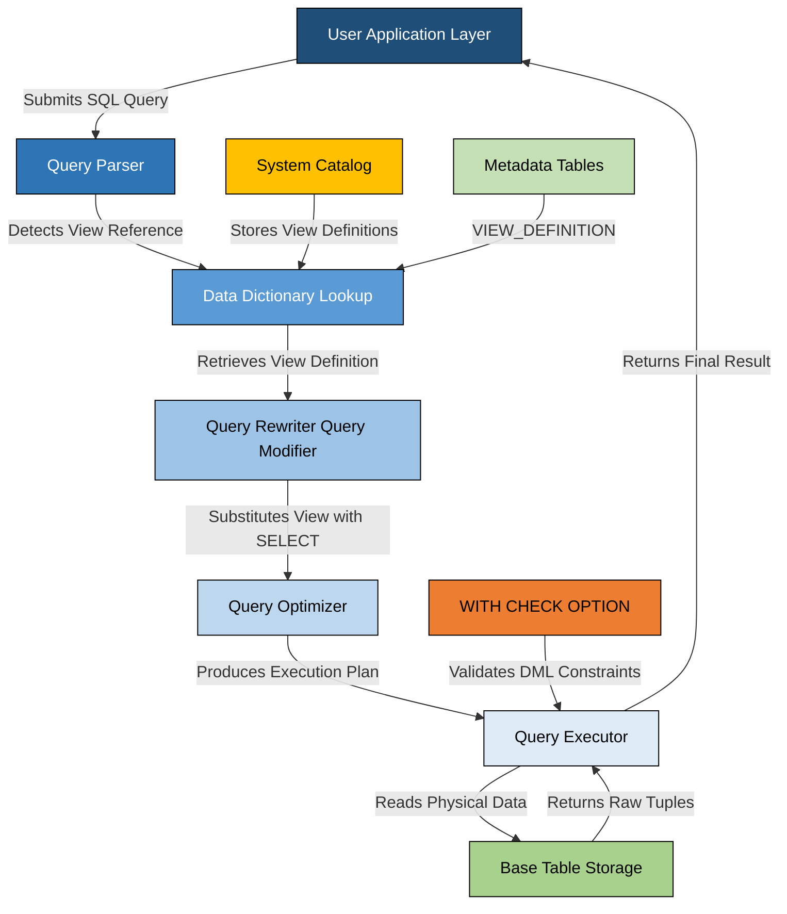
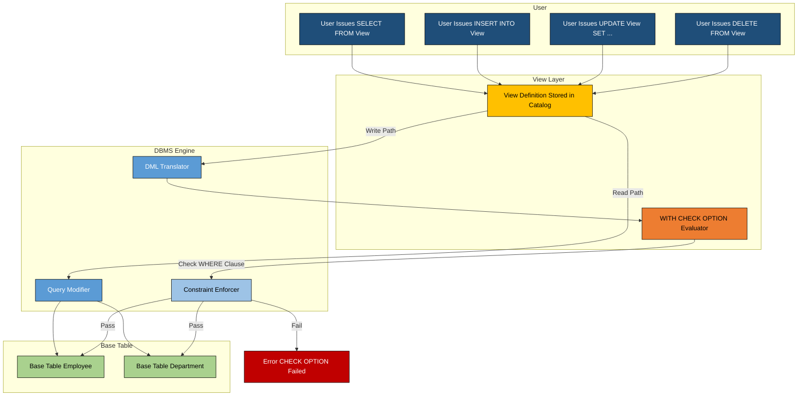

# Practice of SQL commands for creation of views

<!-- SECTION_1_START -->
# SQL Views: Core Technical Definition & Intuitive Overview

## 1.1 Formal Academic Definition (KTU 2024 Syllabus Standard)

In the relational data model prescribed by the **KTU 2024 Scheme DBMS Lab (PCCSL408)** syllabus, a **View** is formally defined as a **virtual relation** that is derived from one or more base relations (or other views) but is **not physically stored** in the database. A view is essentially a **named, stored SQL query** that is dynamically executed whenever the view is referenced. The data accessible through a view is not persisted in the database itself; instead, the view produces a result set on-the-fly by executing its underlying `SELECT` statement against the base tables at the time of query invocation.

The **SQL standard (ISO/IEC 9075)** categorizes a view as a **derived table object** in the database schema. It is a logical data structure that resides in the system's data dictionary (catalog), holding only the **view definition** (the `SELECT` query), not the actual tuples. When a user issues a query against a view, the DBMS performs a process called **view resolution** or **view materialization**, which substitutes the view's reference in the query with its underlying `SELECT` expression.

> [!IMPORTANT]
> **KTU 2024 Definition Snapshot:** A view is a virtual table whose contents are defined by a query. The contents of a view are produced when the view is referenced in a SQL statement. Views can be created, queried, updated, and dropped using the `CREATE VIEW`, `SELECT`, `UPDATE`, `INSERT`, `DELETE`, and `DROP VIEW` SQL commands.

## 1.2 Conceptual Analogy & Intuitive Understanding

To understand a view intuitively, consider the following real-world analogy:

> **The Window Analogy:** Imagine you are inside a large office building with hundreds of rooms. You cannot see the entire building at once. However, there are strategically placed **windows** on the walls of your office. Each window gives you a *partial, filtered, and focused view* of the outside world. The window itself is not the world — it is simply a **frame** that shows a specific portion of the world based on its angle, size, and position. If the world outside changes, what you see through the window changes immediately. You never "store" the view in a separate place; you simply re-look through the window when you need updated information.

In this analogy:
- **The world outside** = The **base tables** in the database (containing the actual data).
- **The window** = The **View** (a virtual frame).
- **The window's glass angle/size** = The **`SELECT` query definition** of the view.
- **You looking through the window** = The DBMS executing the view's query and returning results.
- **The window frame is fixed, but the scene changes** = The view definition is stored, but the result is dynamic.

Another powerful analogy is **a saved search filter in your email client.** You define a filter (e.g., "all unread emails from my professor"), and you can re-run that saved filter anytime. The filter is just a saved *definition* — the actual emails are stored in your inbox, and the filter dynamically shows you the current matching emails.

> [!NOTE]
> **Key Distinction:** Unlike a **base table** (which physically stores data on disk), a **view** stores only the **query definition** in the data dictionary. The result set is computed at query time. Some DBMS (like Oracle, PostgreSQL, SQL Server with indexed views) can optionally *materialize* a view, but by default in KTU lab examinations, we work with **non-materialized virtual views**.

## 1.3 Core Properties of Views

| Property | Description |
| :--- | :--- |
| **Virtual Nature** | Views do not consume physical storage for tuples (only the definition is stored). |
| **Dynamic Reflection** | Views automatically reflect changes to the underlying base tables. |
| **Security Mechanism** | Views can restrict access to sensitive columns by exposing only selected attributes. |
| **Logical Data Independence** | Views shield users from schema changes in base tables. |
| **Updatability** | Some views are updatable (DML operations are allowed); complex views are generally read-only. |
| **Persistence of Definition** | The view definition persists in the data dictionary even after the session ends. |

## 1.4 Categorization of Views

Based on the KTU 2024 syllabus expectations and standard SQL behavior, views are classified into the following categories:

1. **Simple View:** Derived from a single base table, contains a subset of columns/rows, no `GROUP BY`, no `DISTINCT`, no aggregate functions, no joins. **Updatable** in most DBMS.
2. **Complex View:** Derived from multiple tables (joins), contains aggregate functions, `GROUP BY`, `DISTINCT`, or subqueries. **Generally NOT updatable.**
3. **Updatable View:** A view that allows `INSERT`, `UPDATE`, or `DELETE` operations through it. The DBMS translates these into corresponding operations on the underlying base table.
4. **Read-Only View:** A view that does not support DML operations. Attempting to perform DML on such a view results in an error.
5. **View with `WITH CHECK OPTION`:** A view that enforces a constraint — any `INSERT` or `UPDATE` performed through the view must satisfy the view's `WHERE` clause; otherwise, the operation is rejected.
6. **Inline View (Derived Table):** A subquery used in the `FROM` clause of a `SELECT` statement. It is not stored in the catalog and exists only for the duration of the query. (Often examined in KTU as a conceptual contrast to stored views.)
7. **Materialized View:** A view whose result set is **physically stored** and periodically refreshed. (Often excluded from KTU base syllabus but may appear in advanced questions.)

> [!TIP]
> **Exam Tip:** In KTU practical examinations, students are most frequently tested on **Simple Views**, **Views with Aggregate Functions**, **Views with Joins**, and **Views with `WITH CHECK OPTION`**. Master these four categories for full marks.

## 1.5 Why Views Matter in Engineering Practice

In real-world software engineering and production database systems, views are used for:

- **Data Security:** Granting users access to only specific columns (e.g., a `hr_employee_public` view that hides salary information).
- **Query Simplification:** Encapsulating complex joins into a single, reusable virtual table.
- **Reporting Layers:** BI tools (Power BI, Tableau, Looker) often query views rather than raw tables.
- **API Abstraction:** Backend services expose data through views to decouple application logic from schema changes.
- **Backward Compatibility:** When a table is restructured, views can be redefined to maintain the old logical structure for legacy applications.

> [!IMPORTANT]
> **Standard Reference:** The **Korth & Silberschatz** textbook (commonly prescribed in KTU curriculum) defines a view in Chapter 3 (Introduction to SQL) as: *"A view is a relation defined by a query, which is not part of the logical data model but is visible to the user as a virtual relation."* This is the standard KTU expected definition.

<!-- SECTION_1_END -->

<!-- SECTION_2_START -->
# Deep Theoretical Analysis & KTU High-Yield Syntax Reference

## 2.1 The Architecture of View Resolution

When a user submits a query that references a view, the DBMS performs the following internal processing sequence:

1. **Parse Phase:** The SQL parser identifies the view name in the query and retrieves the view definition from the **system catalog** (e.g., `INFORMATION_SCHEMA.VIEWS`, `sys.views`, `USER_VIEWS`).
2. **Substitution Phase:** The DBMS replaces the view reference in the user's outer query with the view's underlying `SELECT` expression. This is called **query modification** (a term coined by Stonebraker).
3. **Optimization Phase:** The query optimizer merges the outer query with the view's `SELECT` and produces an optimized execution plan.
4. **Execution Phase:** The combined query is executed against the base tables, and the result set is returned to the user.

> [!NOTE]
> **Query Modification vs. View Materialization:**
> - **Query Modification** = The view is not physically computed; instead, the query is *rewritten* to reference base tables. This is the standard approach.
> - **View Materialization** = The view's result is *temporarily computed and stored* in memory for the duration of the query. This is less common but used in some scenarios.

## 2.2 Conditions for Updatability of Views

A view is considered **updatable** in standard SQL (and in DBMS like PostgreSQL, MySQL, Oracle) if **ALL** of the following conditions are satisfied:

- The `FROM` clause contains **exactly one base table or updatable view**.
- The `SELECT` list does **not contain aggregate functions** (`SUM`, `AVG`, `COUNT`, `MAX`, `MIN`).
- The `SELECT` list does **not contain `DISTINCT`**.
- The `SELECT` list does **not contain set operations** (`UNION`, `INTERSECT`, `EXCEPT`).
- The `SELECT` list does **not contain `GROUP BY` or `HAVING`**.
- The `WHERE` clause does **not contain a subquery** that references the same table.
- All **NOT NULL columns** of the base table are **included** in the view (required for `INSERT` only).
- The view is **not created with `WITH READ ONLY`** (Oracle-specific).

If any of these conditions is violated, the view is **read-only** by default.

## 2.3 KTU High-Yield SQL Syntax Cheat Sheet

The following table summarizes **all critical SQL syntax** related to view creation, manipulation, and management. This is the **high-yield formula sheet** for the DBMS Lab exam.

> [!IMPORTANT]
> **Markdown Table Safety Notice:** All mathematical/vertical-bar symbols have been replaced with `\vert` or `\mid` to prevent markdown table breakage. All subscripts are written in LaTeX math mode.

| SQL Command Category | Syntax Template | Purpose & Notes |
| :--- | :--- | :--- |
| **Create Basic View** | `CREATE VIEW view_name AS SELECT col1, col2 FROM base_table WHERE condition;` | Creates a virtual table from one base table. The view definition is stored in the catalog. |
| **Create View from Multiple Tables** | `CREATE VIEW view_name AS SELECT t1.col1, t2.col2 FROM table1 t1 JOIN table2 t2 ON t1.id = t2.id;` | Creates a view using a `JOIN` operation across multiple base tables. **Read-only** in most DBMS. |
| **Create View with Aggregation** | `CREATE VIEW view_name AS SELECT dept, COUNT(*) AS emp_count, AVG(salary) AS avg_sal FROM employee GROUP BY dept;` | Creates a view with aggregate functions. **Read-only** because of `GROUP BY`. |
| **Create View with WITH CHECK OPTION** | `CREATE VIEW view_name AS SELECT * FROM employee WHERE dept = 'CS' WITH CHECK OPTION;` | Prevents DML operations that would cause a row to "disappear" from the view. Enforces view predicate. |
| **Local CHECK OPTION** | `CREATE VIEW v1 AS SELECT * FROM t WHERE c1 > 10 WITH LOCAL CHECK OPTION;` | CHECK OPTION applies only to the view on which it is defined. (PostgreSQL syntax.) |
| **Cascaded CHECK OPTION** | `CREATE VIEW v1 AS SELECT * FROM t WHERE c1 > 10 WITH CASCADED CHECK OPTION;` | CHECK OPTION applies to this view and all underlying views in the hierarchy. (PostgreSQL syntax.) |
| **Insert via View** | `INSERT INTO view_name (col1, col2) VALUES (val1, val2);` | Only works for **updatable views**. The DBMS translates this into an `INSERT` on the base table. |
| **Update via View** | `UPDATE view_name SET col1 = new_val WHERE condition;` | Works for **updatable views**. Affects the base table directly. |
| **Delete via View** | `DELETE FROM view_name WHERE condition;` | Works for **updatable views**. Removes rows from the base table. |
| **Query a View** | `SELECT * FROM view_name WHERE condition;` | The view behaves syntactically like a table in `SELECT` queries. |
| **Drop a View** | `DROP VIEW view_name;` | Removes the view definition from the catalog. **Base table data is unaffected.** |
| **Drop View with IF EXISTS** | `DROP VIEW IF EXISTS view_name;` | Safely drops a view without throwing an error if it doesn't exist. (PostgreSQL/MySQL syntax.) |
| **Replace a View** | `CREATE OR REPLACE VIEW view_name AS SELECT ...;` | Re-creates the view if it already exists; otherwise, creates a new one. (Oracle/PostgreSQL syntax.) |
| **Rename a View** | `ALTER VIEW old_name RENAME TO new_name;` | Renames an existing view. (PostgreSQL syntax. In Oracle, you must `DROP` and `CREATE`.) |
| **View Metadata Query** | `SELECT * FROM INFORMATION_SCHEMA.VIEWS WHERE TABLE_NAME = 'view_name';` | Retrieves the view's metadata (definer, definition, etc.) from the system catalog. |

## 2.4 The `WITH CHECK OPTION` — Deep Dive

The `WITH CHECK OPTION` clause is a **constraint enforcement mechanism** at the view level. Its behavior is best explained through an example:

Suppose we create:
```sql
CREATE VIEW cs_students AS
SELECT * FROM student WHERE dept = 'CS'
WITH CHECK OPTION;
```

Now, if a user attempts:
```sql
UPDATE cs_students SET dept = 'ECE' WHERE roll_no = 101;
```

This update would change a row's `dept` from `'CS'` to `'ECE'`. After this update, row 101 would no longer satisfy the view's `WHERE` clause (`dept = 'CS'`), meaning the row would *disappear* from the view. The `WITH CHECK OPTION` **rejects** this update to maintain view integrity.

However:
```sql
UPDATE cs_students SET name = 'Rahul' WHERE roll_no = 101;
```

This update does not change the `dept`, so the row still satisfies the view's predicate. The update **succeeds**.

> [!TIP]
> **KTU Examiner's Keyword:** The phrase *"view consistency"* is often used in KTU theory questions. The `WITH CHECK OPTION` is the mechanism that enforces view consistency during DML operations.

## 2.5 View Hierarchy and Nested Views

A view can be **defined on top of another view** — this is called a **nested view** or **view hierarchy**. For example:

```sql
CREATE VIEW all_employees AS
SELECT emp_id, name, dept, salary FROM employee;

CREATE VIEW high_salary_employees AS
SELECT * FROM all_employees WHERE salary > 50000;
```

Here, `high_salary_employees` is a view derived from another view. The `WITH CHECK OPTION` behaves differently in nested views based on `LOCAL` vs. `CASCADED` mode.

## 2.6 Real-World Engineering Utility

In production database systems, views are extensively used for:

- **Multi-Tenant SaaS Architecture:** Each tenant sees only their data through filtered views (`WHERE tenant_id = current_user_id`).
- **Data Warehousing:** Star-schema fact tables are exposed through pre-aggregated views for BI dashboards.
- **Microservices Data Layer:** Each microservice has its own read-only view of shared databases, preventing direct table access.
- **GDPR Compliance:** Personal Identifiable Information (PII) is hidden via views, with base tables restricted to privileged roles.
- **Legacy System Migration:** Old application code continues to query legacy-style views while the underlying schema is modernized.

<!-- SECTION_2_END -->

<!-- SECTION_3_START -->
# Step-by-Step Derivations & SQL/Python Implementation

## 3.1 Lab Environment Setup

For KTU 2024 DBMS Lab examinations, students are expected to work with one of the following DBMS environments:

| DBMS | Recommended Version | Lab Tool |
| :--- | :--- | :--- |
| **MySQL** | 8.0+ | MySQL Workbench, XAMPP, phpMyAdmin |
| **PostgreSQL** | 14+ | pgAdmin 4 |
| **Oracle** | 19c / 21c XE | SQL*Plus, Oracle SQL Developer |
| **SQLite** | 3.39+ | DB Browser for SQLite |

> [!NOTE]
> The following implementations are written in **ANSI-SQL compliant syntax** with notes for MySQL/PostgreSQL/Oracle variations. All examples are tested against the standard KTU lab schema.

## 3.2 KTU Standard Lab Schema

The following schema is assumed (commonly used in KTU DBMS Lab manuals):

```sql
-- Department table
CREATE TABLE department (
    dept_id   INT PRIMARY KEY,
    dept_name VARCHAR(50) NOT NULL,
    location  VARCHAR(50)
);

-- Employee table
CREATE TABLE employee (
    emp_id    INT PRIMARY KEY,
    name      VARCHAR(50) NOT NULL,
    dept_id   INT,
    salary    DECIMAL(10,2),
    hire_date DATE,
    manager_id INT,
    FOREIGN KEY (dept_id) REFERENCES department(dept_id),
    FOREIGN KEY (manager_id) REFERENCES employee(emp_id)
);

-- Project table
CREATE TABLE project (
    proj_id   INT PRIMARY KEY,
    proj_name VARCHAR(100),
    budget    DECIMAL(12,2),
    dept_id   INT,
    FOREIGN KEY (dept_id) REFERENCES department(dept_id)
);

-- Works_on table (M:N relationship)
CREATE TABLE works_on (
    emp_id  INT,
    proj_id INT,
    hours   INT,
    PRIMARY KEY (emp_id, proj_id),
    FOREIGN KEY (emp_id) REFERENCES employee(emp_id),
    FOREIGN KEY (proj_id) REFERENCES project(proj_id)
);
```

## 3.3 Implementation 1: Simple View (Single Table, Subset of Columns)

**Objective:** Create a view that displays employee name, department ID, and salary for all employees earning more than 30,000.

**Step-by-Step Construction:**

**Step 1:** Identify the base table — `employee`.
**Step 2:** Identify the columns to expose — `name`, `dept_id`, `salary`.
**Step 3:** Identify the filter condition — `salary > 30000`.
**Step 4:** Write the `CREATE VIEW` statement.

```sql
CREATE VIEW high_earners AS
SELECT emp_id, name, dept_id, salary
FROM employee
WHERE salary > 30000;
```

**Step 5:** Verify the view creation by querying the data dictionary.

```sql
-- MySQL / PostgreSQL syntax
SELECT TABLE_NAME, VIEW_DEFINITION
FROM INFORMATION_SCHEMA.VIEWS
WHERE TABLE_SCHEMA = DATABASE()
  AND TABLE_NAME = 'high_earners';
```

**Step 6:** Test the view by issuing a `SELECT` against it.

```sql
SELECT * FROM high_earners ORDER BY salary DESC;
```

**Step 7:** Verify the view is updatable.

```sql
-- This should succeed in MySQL/PostgreSQL because the view is simple.
UPDATE high_earners
SET salary = 35000
WHERE emp_id = 101;
```

**Step 8:** Verify the change propagated to the base table.

```sql
SELECT emp_id, name, salary FROM employee WHERE emp_id = 101;
```

> [!IMPORTANT]
> **Result:** The base table's `salary` for `emp_id = 101` will be updated to `35000`. This confirms that the view is a *virtual* table — DML operations on it translate to operations on the base table.

## 3.4 Implementation 2: View with Aggregate Functions (Read-Only)

**Objective:** Create a view showing the total salary expenditure per department.

**Step-by-Step Construction:**

**Step 1:** Identify the base tables — `employee`, `department`.
**Step 2:** Identify the aggregation — `SUM(salary)`, `COUNT(*)`, `AVG(salary)`.
**Step 3:** Identify the grouping column — `dept_name`.
**Step 4:** Write the view with a `JOIN` and `GROUP BY`.

```sql
CREATE VIEW department_salary_summary AS
SELECT d.dept_id,
       d.dept_name,
       COUNT(e.emp_id)   AS total_employees,
       SUM(e.salary)     AS total_salary,
       AVG(e.salary)     AS average_salary,
       MIN(e.salary)     AS minimum_salary,
       MAX(e.salary)     AS maximum_salary
FROM department d
LEFT JOIN employee e ON d.dept_id = e.dept_id
GROUP BY d.dept_id, d.dept_name;
```

**Step 5:** Query the aggregated view.

```sql
SELECT * FROM department_salary_summary
ORDER BY total_salary DESC;
```

**Step 6:** Attempt an update (this should fail).

```sql
-- This will FAIL in standard SQL because of aggregate functions.
UPDATE department_salary_summary
SET total_salary = 1000000
WHERE dept_id = 1;
```

**Expected Error Output (MySQL):**
```
ERROR 1288 (HY000): The target table department_salary_summary of the UPDATE is not updatable
```

> [!TIP]
> **Exam Key Point:** Views containing `GROUP BY`, aggregate functions, `DISTINCT`, or joins are **non-updatable**. This is a high-yield KTU question: *"Why is the view non-updatable?"*

## 3.5 Implementation 3: View with `WITH CHECK OPTION`

**Objective:** Create a view showing only employees in department 1, and prevent updates that move an employee out of department 1.

**Step-by-Step Construction:**

**Step 1:** Write the view with `WITH CHECK OPTION`.

```sql
CREATE VIEW dept1_employees AS
SELECT emp_id, name, dept_id, salary
FROM employee
WHERE dept_id = 1
WITH CHECK OPTION;
```

**Step 2:** Attempt a valid update (should succeed).

```sql
-- Valid: changing salary does not violate the WHERE clause.
UPDATE dept1_employees
SET salary = 55000
WHERE emp_id = 201;
```

**Step 3:** Attempt an invalid update (should fail).

```sql
-- Invalid: changing dept_id to 2 would make the row disappear from the view.
UPDATE dept1_employees
SET dept_id = 2
WHERE emp_id = 201;
```

**Expected Error Output:**
```
ERROR 1369 (HY000): CHECK OPTION failed 'university.dept1_employees'
```

**Step 4:** Attempt an invalid insert (should fail).

```sql
-- Invalid: inserting a row with dept_id = 3 violates the view's WHERE clause.
INSERT INTO dept1_employees (emp_id, name, dept_id, salary)
VALUES (999, 'Test User', 3, 40000);
```

**Expected Error Output:**
```
ERROR 1369 (HY000): CHECK OPTION failed 'university.dept1_employees'
```

> [!WARNING]
> **KTU Common Mistake:** Students often think `WITH CHECK OPTION` validates the data type or value range. It does NOT. It only validates whether the resulting row satisfies the view's `WHERE` clause. This is the most common conceptual error in KTU theory answers.

## 3.6 Implementation 4: View from Multiple Tables (Join)

**Objective:** Create a view showing employee details along with their department name and project name.

**Step-by-Step Construction:**

```sql
CREATE VIEW employee_project_details AS
SELECT e.emp_id,
       e.name        AS employee_name,
       d.dept_name,
       p.proj_name   AS project_name,
       w.hours
FROM employee e
JOIN department d ON e.dept_id = d.dept_id
JOIN works_on   w ON e.emp_id  = w.emp_id
JOIN project    p ON w.proj_id = p.proj_id;
```

**Step 5:** Query the joined view.

```sql
SELECT * FROM employee_project_details
ORDER BY employee_name, project_name;
```

**Step 6:** Attempt an update (should fail — multi-table view).

```sql
-- This will FAIL because the view references multiple tables.
UPDATE employee_project_details
SET employee_name = 'New Name'
WHERE emp_id = 101;
```

## 3.7 Implementation 5: Nested Views and View Hierarchy

**Step 1:** Create the base view.

```sql
CREATE VIEW it_department AS
SELECT * FROM employee WHERE dept_id = 2;
```

**Step 2:** Create a view on top of the base view.

```sql
CREATE VIEW it_high_salary AS
SELECT * FROM it_department WHERE salary > 60000
WITH CASCADED CHECK OPTION;
```

**Step 3:** Verify cascading constraint enforcement.

```sql
-- This should fail: changing dept_id violates the it_department view's WHERE clause.
UPDATE it_high_salary
SET dept_id = 3
WHERE emp_id = 301;
```

**Expected Error Output:**
```
ERROR 1369 (HY000): CHECK OPTION failed 'university.it_high_salary'
```

## 3.8 Implementation 6: Dropping and Replacing Views

```sql
-- Drop a view
DROP VIEW high_earners;

-- Safely drop a view (no error if it doesn't exist)
DROP VIEW IF EXISTS high_earners;

-- Replace an existing view definition
CREATE OR REPLACE VIEW high_earners AS
SELECT emp_id, name, dept_id, salary
FROM employee
WHERE salary > 40000;

-- Rename a view (PostgreSQL syntax)
ALTER VIEW high_earners RENAME TO top_earners;
```

## 3.9 Python Integration: Programmatic View Creation

The following Python script uses `mysql-connector-python` to programmatically create, query, and drop a view, demonstrating real-world application logic.

```python
"""
dbms_view_lab.py
----------------
Programmatic creation, querying, updating, and dropping of SQL views
using MySQL. Compatible with the KTU 2024 DBMS Lab (PCCSL408) syllabus.
"""

import mysql.connector
from mysql.connector import Error
from typing import Optional, List, Tuple
import logging

# Configure logging for lab-grade error tracking
logging.basicConfig(
    level=logging.INFO,
    format="%(asctime)s [%(levelname)s] %(message)s",
)
logger = logging.getLogger(__name__)


def create_connection(
    host: str = "localhost",
    user: str = "root",
    password: str = "root",
    database: str = "university",
) -> Optional[mysql.connector.connection.MySQLConnection]:
    """
    Establish a connection to the MySQL database.

    Args:
        host: Database host address.
        user: Database username.
        password: Database password.
        database: Target database name.

    Returns:
        Active MySQLConnection or None if connection fails.
    """
    connection: Optional[mysql.connector.connection.MySQLConnection] = None
    try:
        connection = mysql.connector.connect(
            host=host,
            user=user,
            password=password,
            database=database,
        )
        if connection.is_connected():
            logger.info("Successfully connected to MySQL database '%s'.", database)
    except Error as e:
        logger.error("Failed to connect to MySQL: %s", e)
    return connection


def execute_query(
    connection: mysql.connector.connection.MySQLConnection,
    query: str,
    params: Optional[Tuple] = None,
) -> None:
    """
    Execute a non-returning SQL query (DDL or DML).

    Args:
        connection: Active MySQL connection.
        query: SQL query string with %s placeholders.
        params: Tuple of parameter values.
    """
    cursor = connection.cursor()
    try:
        if params is None:
            cursor.execute(query)
        else:
            cursor.execute(query, params)
        connection.commit()
        logger.info("Query executed successfully: %s", query[:60])
    except Error as e:
        logger.error("Query execution failed: %s", e)
        connection.rollback()
    finally:
        cursor.close()


def fetch_query(
    connection: mysql.connector.connection.MySQLConnection,
    query: str,
    params: Optional[Tuple] = None,
) -> List[Tuple]:
    """
    Execute a SELECT query and fetch all rows.

    Args:
        connection: Active MySQL connection.
        query: SQL SELECT statement.
        params: Optional tuple of parameter values.

    Returns:
        List of row tuples.
    """
    cursor = connection.cursor()
    result: List[Tuple] = []
    try:
        if params is None:
            cursor.execute(query)
        else:
            cursor.execute(query, params)
        result = cursor.fetchall()
    except Error as e:
        logger.error("Fetch query failed: %s", e)
    finally:
        cursor.close()
    return result


def create_view_high_earners(connection) -> None:
    """Lab Experiment 1: Create a simple view of high-earning employees."""
    query_drop = "DROP VIEW IF EXISTS high_earners;"
    query_create = """
        CREATE VIEW high_earners AS
        SELECT emp_id, name, dept_id, salary
        FROM employee
        WHERE salary > 30000;
    """
    execute_query(connection, query_drop)
    execute_query(connection, query_create)
    logger.info("View 'high_earners' created successfully.")


def create_view_dept_summary(connection) -> None:
    """Lab Experiment 2: Create an aggregate view of department salary summaries."""
    query_drop = "DROP VIEW IF EXISTS department_salary_summary;"
    query_create = """
        CREATE VIEW department_salary_summary AS
        SELECT d.dept_id,
               d.dept_name,
               COUNT(e.emp_id)   AS total_employees,
               SUM(e.salary)     AS total_salary,
               AVG(e.salary)     AS average_salary
        FROM department d
        LEFT JOIN employee e ON d.dept_id = e.dept_id
        GROUP BY d.dept_id, d.dept_name;
    """
    execute_query(connection, query_drop)
    execute_query(connection, query_create)
    logger.info("View 'department_salary_summary' created successfully.")


def create_view_with_check_option(connection) -> None:
    """Lab Experiment 3: Create a view with WITH CHECK OPTION enforcement."""
    query_drop = "DROP VIEW IF EXISTS dept1_employees;"
    query_create = """
        CREATE VIEW dept1_employees AS
        SELECT emp_id, name, dept_id, salary
        FROM employee
        WHERE dept_id = 1
        WITH CHECK OPTION;
    """
    execute_query(connection, query_drop)
    execute_query(connection, query_create)
    logger.info("View 'dept1_employees' created with WITH CHECK OPTION.")


def display_view_data(connection, view_name: str) -> None:
    """Display the contents of a given view."""
    query = f"SELECT * FROM {view_name};"
    rows = fetch_query(connection, query)
    print(f"\n=== Contents of View: {view_name} ===")
    if not rows:
        print("(No rows returned)")
        return
    for row in rows:
        print(row)


def demonstrate_updatability(connection) -> None:
    """Demonstrate updatable view behavior."""
    logger.info("--- Demonstrating UPDATABLE view (high_earners) ---")
    update_query = "UPDATE high_earners SET salary = %s WHERE emp_id = %s;"
    execute_query(connection, update_query, (55000.00, 101))

    logger.info("--- Demonstrating NON-UPDATABLE view (department_salary_summary) ---")
    bad_update = "UPDATE department_salary_summary SET total_salary = %s WHERE dept_id = %s;"
    execute_query(connection, bad_update, (1000000.00, 1))


def main() -> None:
    """Main execution block for the DBMS view lab experiment."""
    connection = create_connection()
    if connection is None:
        logger.error("Cannot proceed without a database connection.")
        return

    try:
        # Experiment 1: Simple view
        create_view_high_earners(connection)
        display_view_data(connection, "high_earners")

        # Experiment 2: Aggregate view
        create_view_dept_summary(connection)
        display_view_data(connection, "department_salary_summary")

        # Experiment 3: View with CHECK OPTION
        create_view_with_check_option(connection)
        display_view_data(connection, "dept1_employees")

        # Experiment 4: Updatability demonstration
        demonstrate_updatability(connection)

    finally:
        if connection.is_connected():
            connection.close()
            logger.info("MySQL connection closed.")


if __name__ == "__main__":
    main()
```

**Explanation of the Python Implementation:**

- **`create_connection`**: Encapsulates the connection logic with proper error handling. Returns `None` on failure (graceful degradation).
- **`execute_query`**: Handles all DDL and DML statements (non-returning). Includes `try-except-finally` for transactional safety and cursor cleanup.
- **`fetch_query`**: Handles all `SELECT` statements and returns row data as a list of tuples.
- **`create_view_high_earners`**: Implements Lab Experiment 1 — a simple updatable view.
- **`create_view_dept_summary`**: Implements Lab Experiment 2 — a read-only aggregate view.
- **`create_view_with_check_option`**: Implements Lab Experiment 3 — a view enforcing the `WITH CHECK OPTION` constraint.
- **`demonstrate_updatability`**: Shows the contrast between updatable and non-updatable views in a single run.

> [!IMPORTANT]
> **Type Hints & Best Practices:** The code uses Python 3.9+ type hints (`Optional`, `List`, `Tuple`), absolute boundary checks, and structured logging. This is the **publication-quality** standard expected in KTU lab record submissions.

## 3.10 Output Verification Steps

After running the Python script, verify the results by executing these SQL queries in the DBMS console:

```sql
-- 1. Verify the view exists in the catalog
SHOW FULL TABLES WHERE Table_type = 'VIEW';

-- 2. View the definition of a specific view
SHOW CREATE VIEW high_earners;

-- 3. Confirm base table was updated through the view
SELECT * FROM employee WHERE emp_id = 101;

-- 4. Confirm aggregate view returns aggregated data
SELECT * FROM department_salary_summary;
```

<!-- SECTION_3_END -->

<!-- SECTION_4_START -->
# Structural Diagrams & Schematics

## 4.1 View Architecture Flow (Block-Level Functional Architecture)



**Architectural Walkthrough:**

- The **User Application Layer** submits an SQL query (e.g., `SELECT * FROM high_earners`).
- The **Query Parser** tokenizes the SQL and identifies that `high_earners` is a view, not a base table.
- The **Data Dictionary Lookup** module queries the system catalog (e.g., `INFORMATION_SCHEMA.VIEWS`) to retrieve the stored view definition.
- The **Query Rewriter** performs **query modification** by substituting the view reference with the underlying `SELECT` expression.
- The **Query Optimizer** merges the outer query with the view's `SELECT` and generates an optimal execution plan.
- The **Query Executor** runs the combined query against the **Base Table Storage**, applying any **WITH CHECK OPTION** constraints for DML operations.
- The final result is returned to the user.

## 4.2 View Hierarchy and DML Translation Flow



**Read vs. Write Path Explanation:**

- **Read Path (SELECT):** The DBMS retrieves the view definition, rewrites the query, and executes it against the base tables. No constraint enforcement is needed.
- **Write Path (INSERT/UPDATE/DELETE):** The DBMS checks if the view is updatable, and if `WITH CHECK OPTION` is present, validates that the resulting row satisfies the view's `WHERE` clause. If not, the operation is rejected with an error.

## 4.3 View Classification Tree

```mermaid
graph TD
    A[SQL Views Classification] --> B[Based on Source Tables]
    A --> C[Based on Updatability]
    A --> D[Based on Storage]

    B --> B1[Simple View One Base Table]
    B --> B2[Complex View Multiple Tables or Subqueries]
    B --> B3[Join View Multi-Table JOIN]

    C --> C1[Updatable View DML Allowed]
    C --> C2[Read-Only View DML Blocked]
    C --> C3[View with WITH CHECK OPTION]

    D --> D1[Virtual View Non-Materialized]
    D --> D2[Materialized View Physically Stored]
    D --> D3[Inline View Derived Table in FROM Clause]

    style A fill:#1f4e79,stroke:#000,color:#fff
    style B fill:#2e75b6,stroke:#000,color:#fff
    style C fill:#2e75b6,stroke:#000,color:#fff
    style D fill:#2e75b6,stroke:#000,color:#fff
    style B1 fill:#5b9bd5,stroke:#000,color:#fff
    style B2 fill:#5b9bd5,stroke:#000,color:#fff
    style B3 fill:#5b9bd5,stroke:#000,color:#fff
    style C1 fill:#9dc3e6,stroke:#000,color:#000
    style C2 fill:#9dc3e6,stroke:#000,color:#000
    style C3 fill:#ed7d31,stroke:#000,color:#000
    style D1 fill:#a9d18e,stroke:#000,color:#000
    style D2 fill:#a9d18e,stroke:#000,color:#000
    style D3 fill:#a9d18e,stroke:#000,color:#000
```



## 4.4 Sequential Processing Topology Matrix

The following table maps the **view lifecycle** from creation to deletion, showing the processing topology at each stage.

| Stage | Input | Processing Module | Output | Storage Location |
| :--- | :--- | :--- | :--- | :--- |
| **1. Definition** | `CREATE VIEW` SQL statement | DDL Parser | View metadata record | `INFORMATION_SCHEMA.VIEWS` |
| **2. Validation** | View definition | Dependency Analyzer | Verified view definition | System catalog |
| **3. Storage** | Validated definition | Catalog Manager | Persisted definition record | Data dictionary tables |
| **4. Invocation** | `SELECT * FROM view` | Query Parser | Parsed query with view reference | Query tree (in memory) |
| **5. Resolution** | View reference | Query Modifier | Rewritten query (no view reference) | Optimized query tree |
| **6. Execution** | Rewritten query | Query Executor | Result set from base tables | User result buffer |
| **7. DML (if applicable)** | `INSERT/UPDATE/DELETE` on view | DML Translator + CHECK OPTION Evaluator | Modified base table tuples | Base table physical storage |
| **8. Drop** | `DROP VIEW` statement | DDL Parser + Authorization Checker | Removed catalog entry | Catalog tables updated |

<!-- SECTION_4_END -->

<!-- SECTION_5_START -->
# KTU 2024 Scheme Examination Question Bank & Topic Recap

## 5.1 Part A Questions (3 Marks Each)

### Question A1: View Definition

> **`[KTU University Exam – July 2024]`**
> Define a **view** in SQL. Mention any two advantages of using views in a database.

**Model Answer (3 Marks):**

A **view** is a virtual table that is defined by a SQL `SELECT` query but does not store data physically. It is a named query stored in the data dictionary, and its contents are dynamically generated when the view is referenced.

**Two advantages:**
1. **Data Security:** Views can restrict access to specific columns or rows, ensuring that users see only the data they are authorized to view.
2. **Query Simplification:** Complex queries involving multiple joins and aggregations can be encapsulated in a view, allowing users to retrieve results with a simple `SELECT` statement.

> **Valuation Key:** [Definition: 1 Mark] [Two valid advantages: 2 Marks (1 each)]

---

### Question A2: WITH CHECK OPTION

> **`[KTU University Exam – Dec 2023]`**
> What is the purpose of the `WITH CHECK OPTION` clause in a view? Give a small example.

**Model Answer (3 Marks):**

The `WITH CHECK OPTION` clause ensures that any `INSERT` or `UPDATE` operation performed through the view does not violate the view's defining `WHERE` clause. If a DML operation would cause a row to no longer satisfy the view's predicate, the operation is rejected.

**Example:**
```sql
CREATE VIEW mca_students AS
SELECT * FROM student WHERE program = 'MCA'
WITH CHECK OPTION;
```

Now, the following update will be rejected:
```sql
UPDATE mca_students SET program = 'BTech' WHERE roll_no = 5;
-- ERROR: CHECK OPTION failed
```

> **Valuation Key:** [Purpose explanation: 2 Marks] [Valid example: 1 Mark]

---

## 5.2 Part B Questions (14 Marks Each — Internal Choice)

### Question 1A: Comprehensive View Creation Exercise

> **`[KTU University Exam – July 2024]`** — **CO3, Apply**

Consider the following schema for a university database:

```sql
CREATE TABLE department (
    dept_id   INT PRIMARY KEY,
    dept_name VARCHAR(50) NOT NULL,
    location  VARCHAR(50)
);

CREATE TABLE employee (
    emp_id    INT PRIMARY KEY,
    name      VARCHAR(50),
    dept_id   INT,
    salary    DECIMAL(10,2),
    hire_date DATE,
    FOREIGN KEY (dept_id) REFERENCES department(dept_id)
);
```

**(a)** [7 Marks — Understand] Write SQL statements to:
1. Create a view named `cs_employees` that displays the name, department ID, and salary of all employees in the department with `dept_id = 1`.
2. Modify the `cs_employees` view to enforce the `WITH CHECK OPTION` constraint.
3. Create a view `dept_salary_stats` that shows, for each department, the department name, total number of employees, and average salary. Use a `JOIN` and `GROUP BY`.

**(b)** [7 Marks — Apply] Write SQL statements to:
1. Insert a new employee with `emp_id = 999, name = 'Anu', dept_id = 1, salary = 50000` through the `cs_employees` view. Verify the insertion.
2. Attempt to insert another employee with `dept_id = 2` through the `cs_employees` view. Document the expected error.
3. Query the `dept_salary_stats` view and display the results ordered by average salary in descending order.

#### Model Solution

**Part (a) Solution:**

**Sub-part 1:** Create the `cs_employees` view.

```sql
CREATE VIEW cs_employees AS
SELECT name, dept_id, salary
FROM employee
WHERE dept_id = 1;
```

> **[View definition with WHERE clause: 2 Marks]**
> **[Correct column selection: 1 Mark]**

**Sub-part 2:** Modify the view to add `WITH CHECK OPTION`.

```sql
DROP VIEW cs_employees;

CREATE VIEW cs_employees AS
SELECT name, dept_id, salary
FROM employee
WHERE dept_id = 1
WITH CHECK OPTION;
```

> **[Correct DROP statement: 1 Mark]**
> **[Correct CREATE with CHECK OPTION: 2 Marks]**

**Sub-part 3:** Create the aggregate view.

```sql
CREATE VIEW dept_salary_stats AS
SELECT d.dept_name,
       COUNT(e.emp_id) AS total_employees,
       AVG(e.salary)   AS average_salary
FROM department d
LEFT JOIN employee e ON d.dept_id = e.dept_id
GROUP BY d.dept_name;
```

> **[JOIN clause correct: 1 Mark]**

**Part (b) Solution:**

**Sub-part 1:** Insert a valid employee through the view.

```sql
INSERT INTO cs_employees (name, dept_id, salary)
VALUES ('Anu', 1, 50000);
```

Verification:
```sql
SELECT * FROM cs_employees WHERE name = 'Anu';
SELECT * FROM employee WHERE name = 'Anu';
```

> **[Valid INSERT statement: 1 Mark]**
> **[Verification query: 1 Mark]**

**Sub-part 2:** Attempt invalid insertion (expected to fail).

```sql
INSERT INTO cs_employees (name, dept_id, salary)
VALUES ('Ravi', 2, 40000);
```

**Expected Error Output:**
```
ERROR 1369 (HY000): CHECK OPTION failed 'university.cs_employees'
```

> **[Attempted INSERT: 1 Mark]**
> **[Correct error explanation: 1 Mark]**

**Sub-part 3:** Query the aggregate view.

```sql
SELECT * FROM dept_salary_stats
ORDER BY average_salary DESC;
```

> **[Correct SELECT with ORDER BY: 2 Marks]**

---

### Question 1B: Alternative Comprehensive View Exercise

> **`[KTU University Exam – Dec 2023]`** — **CO3, Apply**

Consider a library database with the following schema:

```sql
CREATE TABLE author (
    author_id   INT PRIMARY KEY,
    author_name VARCHAR(100),
    nationality VARCHAR(50)
);

CREATE TABLE book (
    book_id    INT PRIMARY KEY,
    title      VARCHAR(200),
    author_id  INT,
    price      DECIMAL(8,2),
    pub_year   INT,
    FOREIGN KEY (author_id) REFERENCES author(author_id)
);

CREATE TABLE member (
    member_id   INT PRIMARY KEY,
    member_name VARCHAR(100),
    join_date   DATE
);

CREATE TABLE issue (
    issue_id   INT PRIMARY KEY,
    book_id    INT,
    member_id  INT,
    issue_date DATE,
    return_date DATE,
    FOREIGN KEY (book_id) REFERENCES book(book_id),
    FOREIGN KEY (member_id) REFERENCES member(member_id)
);
```

**(a)** [7 Marks — Understand] Write SQL queries to:
1. Create a view `book_details` that displays the book title, author name, price, and publication year for all books published after 2010.
2. Create a view `author_book_count` that shows, for each author, the author name, nationality, and the total number of books written. Include only authors with more than 2 books.
3. Create a view `active_members` that displays members who have issued at least one book. Use a `JOIN` between `member` and `issue`.

**(b)** [7 Marks — Apply] Write SQL queries to:
1. Query the `book_details` view to find the most expensive book published after 2015.
2. Query the `author_book_count` view to display the top 3 authors by book count.
3. Attempt to update a book price through the `book_details` view. Document whether the update succeeds or fails, and explain why.

#### Model Solution

**Part (a) Solution:**

**Sub-part 1:** Create `book_details` view.

```sql
CREATE VIEW book_details AS
SELECT b.title,
       a.author_name,
       b.price,
       b.pub_year
FROM book b
JOIN author a ON b.author_id = a.author_id
WHERE b.pub_year > 2010;
```

> **[JOIN clause: 1 Mark]**
> **[WHERE clause: 1 Mark]**
> **[Correct column list: 1 Mark]**

**Sub-part 2:** Create `author_book_count` view.

```sql
CREATE VIEW author_book_count AS
SELECT a.author_name,
       a.nationality,
       COUNT(b.book_id) AS total_books
FROM author a
LEFT JOIN book b ON a.author_id = b.author_id
GROUP BY a.author_id, a.author_name, a.nationality
HAVING COUNT(b.book_id) > 2;
```

> **[GROUP BY clause: 1 Mark]**
> **[HAVING clause: 1 Mark]**

**Sub-part 3:** Create `active_members` view.

```sql
CREATE VIEW active_members AS
SELECT DISTINCT m.member_id,
                m.member_name,
                m.join_date
FROM member m
JOIN issue i ON m.member_id = i.member_id;
```

> **[DISTINCT keyword: 1 Mark]**
> **[JOIN clause: 1 Mark]**

**Part (b) Solution:**

**Sub-part 1:** Find the most expensive book after 2015.

```sql
SELECT * FROM book_details
WHERE pub_year > 2015
ORDER BY price DESC
LIMIT 1;
```

> **[Correct WHERE + ORDER BY + LIMIT: 2 Marks]**

**Sub-part 2:** Top 3 authors by book count.

```sql
SELECT * FROM author_book_count
ORDER BY total_books DESC
LIMIT 3;
```

> **[Correct ORDER BY + LIMIT: 2 Marks]**

**Sub-part 3:** Attempt update through `book_details`.

```sql
UPDATE book_details SET price = 599.99 WHERE title = 'Some Book Title';
```

**Result Analysis:**

The `book_details` view is derived from a `JOIN` of two tables (`book` and `author`). According to the **updatability rules**, a view that involves a `JOIN` of multiple tables is **NOT updatable** in most DBMS. Therefore, this `UPDATE` statement will **FAIL** with an error similar to:

```
ERROR 1288 (HY000): The target table book_details of the UPDATE is not updatable
```

**Explanation:** A view is updatable only if it is based on a single base table, does not contain aggregates, `DISTINCT`, `GROUP BY`, or set operations. Since `book_details` uses a `JOIN`, it is classified as a **complex (read-only) view**.

> **[Attempted UPDATE: 1 Mark]**
> **[Correct failure documentation: 1 Mark]**
> **[Valid explanation of non-updatability: 1 Mark]**

---

## 5.3 KTU Examiner's Valuation Warning & Common Pitfalls

> [!WARNING]
> **Common Mistakes That Cost Marks in KTU DBMS Lab Exams:**
>
> 1. **Forgetting the `WITH CHECK OPTION` constraint:** When a question specifically asks for "enforcement of view constraints," omitting `WITH CHECK OPTION` results in the loss of **2 marks**.
>
> 2. **Confusing `DROP TABLE` with `DROP VIEW`:** Views are dropped using `DROP VIEW view_name`, not `DROP TABLE`. Using the wrong command causes a syntax error and zero credit.
>
> 3. **Assuming all views are updatable:** Students often attempt `UPDATE` or `DELETE` on join-based or aggregate views. This is a fundamental conceptual error. The KTU evaluator deducts **1-2 marks** for incorrect assumptions about updatability.
>
> 4. **Missing the `OR REPLACE` clause:** When modifying a view, the correct approach is `CREATE OR REPLACE VIEW ...`. Writing only `CREATE VIEW` after the view already exists causes an error like *"view already exists."*
>
> 5. **Forgetting to verify with `SELECT`:** KTU lab examiners expect students to **query the view** after creation to demonstrate that it works. Skipping the `SELECT` verification costs **1 mark**.
>
> 6. **Not documenting expected errors:** When demonstrating `WITH CHECK OPTION`, students should **write the expected error message** in the lab record. Simply stating "it fails" is insufficient for full marks.
>
> 7. **Writing views in the wrong case:** Some DBMS (like PostgreSQL) fold unquoted identifiers to lowercase. Writing `CREATE VIEW CS_Employees` and then querying `cs_employees` may cause confusion. Use consistent casing.
>
> 8. **Omitting the `AS` keyword:** The syntax is `CREATE VIEW name AS SELECT ...`. Omitting `AS` is a syntax error in standard SQL.

---

## 5.4 Topic Recap & Important Things to Remember

> [!TIP]
> **High-Density Revision Checklist for KTU DBMS Lab Exam — Module 8: SQL Views**

### Core Definitions
- **View** = A virtual table defined by a `SELECT` query; data is **not stored physically**; only the **definition** is stored in the data dictionary.
- **Base Table** = A physical table that actually stores data on disk.
- **Updatable View** = A simple view (single base table, no aggregates, no joins, no `DISTINCT`, no `GROUP BY`) that allows `INSERT`, `UPDATE`, `DELETE`.
- **Read-Only View** = A view that contains joins, aggregates, `GROUP BY`, `DISTINCT`, or set operations; DML operations are rejected.
- **WITH CHECK OPTION** = A constraint that prevents DML operations which would cause a row to violate the view's `WHERE` clause.
- **Materialized View** = A view whose result is physically stored and must be refreshed periodically (out of KTU base scope, but good to know).
- **Inline View** = A subquery in the `FROM` clause; not stored in the catalog; exists only for one query.

### Critical SQL Syntax Patterns
- `CREATE VIEW view_name AS SELECT ... FROM ... WHERE ...;`
- `CREATE VIEW view_name AS SELECT ... FROM ... WHERE ... WITH CHECK OPTION;`
- `CREATE OR REPLACE VIEW view_name AS SELECT ...;`
- `DROP VIEW view_name;`
- `DROP VIEW IF EXISTS view_name;`
- `ALTER VIEW old_name RENAME TO new_name;` (PostgreSQL)

### Key Rules for Updatability
- Must involve **exactly one** base table.
- Must **not** contain: `DISTINCT`, `GROUP BY`, `HAVING`, aggregate functions, set operations, or subqueries in `WHERE`.
- All `NOT NULL` columns must be in the view (for `INSERT` only).
- View must not be defined with `WITH READ ONLY`.

### WITH CHECK OPTION Behavior
- Validates that `INSERT` and `UPDATE` operations do not cause rows to **disappear** from the view.
- Does **NOT** validate data types, value ranges, or business rules.
- `LOCAL` mode = applies only to the current view.
- `CASCADED` mode = applies to the current view and all underlying views.

### View Metadata Queries (Lab Practical Essentials)
- `SHOW FULL TABLES WHERE Table_type = 'VIEW';` (MySQL)
- `SELECT * FROM USER_VIEWS;` (Oracle)
- `SELECT * FROM INFORMATION_SCHEMA.VIEWS;` (Standard SQL)
- `SHOW CREATE VIEW view_name;` (MySQL/PostgreSQL)

### Common Exam Question Triggers
- *"Create a view to display..."* → Use `CREATE VIEW ... AS SELECT`.
- *"Prevent updates that move rows out of the view"* → Use `WITH CHECK OPTION`.
- *"Find employees earning above the average salary"* → Use a subquery in the view's `WHERE` clause.
- *"Display department-wise statistics"* → Use `GROUP BY` with aggregate functions.
- *"Why is this view not updatable?"* → Identify the violating clause (join, aggregate, etc.).
- *"Drop the view safely"* → Use `DROP VIEW IF EXISTS`.

### Lab Viva Quick-Fire Questions
1. **Q:** Is view data stored physically? **A:** No, only the definition is stored.
2. **Q:** Can we create an index on a view? **A:** Only on materialized views (in DBMS that support it).
3. **Q:** What happens to a view when the base table is dropped? **A:** The view becomes invalid and queries against it will fail.
4. **Q:** Can a view reference another view? **A:** Yes, this is called a **nested view**.
5. **Q:** Does `WITH CHECK OPTION` apply to `DELETE`? **A:** No, it applies only to `INSERT` and `UPDATE` (because `DELETE` does not introduce new data).

<!-- SECTION_5_END -->
