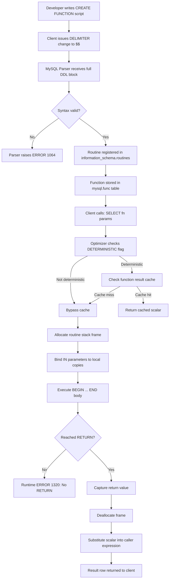
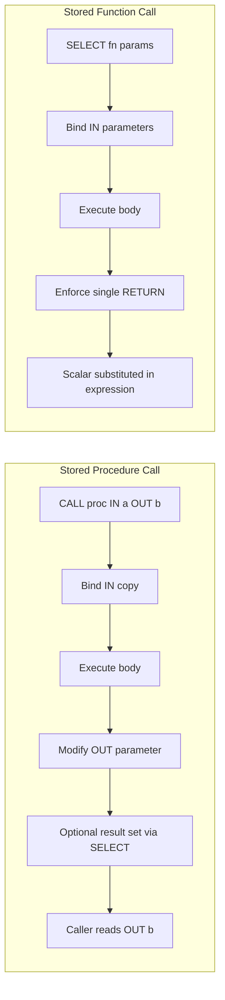
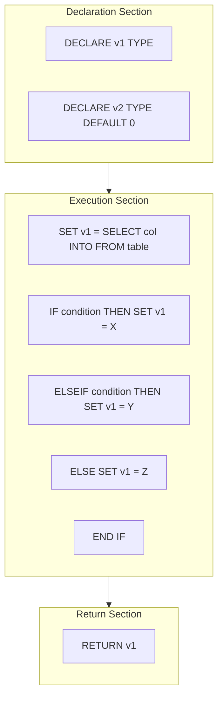
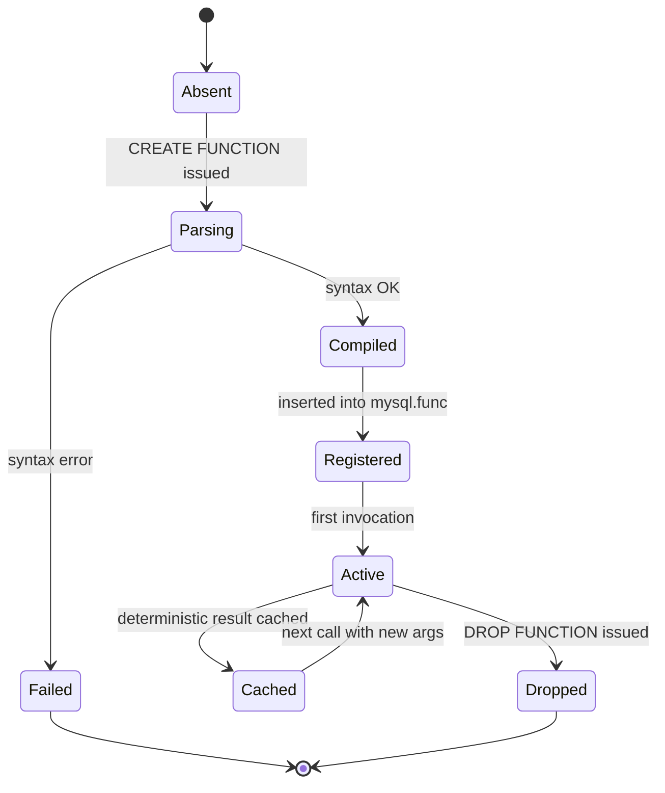

# Creation of Functions

<!-- SECTION_1_START -->
# Module 9 — Creation of Functions in DBMS

## 1. Core Technical Definition & Intuitive Overview

### 1.1 Formal Academic Definition (KTU 2024 Syllabus Terminology)

A **Stored Function** in a Database Management System (DBMS) is a named, precompiled, reusable, server-side program unit written in a procedural SQL dialect (e.g., PL/SQL in Oracle, SQL/PSM in MySQL 8.0+, or PL/pgSQL in PostgreSQL) that **accepts zero or more input parameters, performs deterministic or non-deterministic computations, and **mandatorily returns a single scalar value** through a `RETURN` statement to the calling environment. Unlike stored procedures, functions are designed to be invoked from within SQL expressions (e.g., in the `SELECT` list, `WHERE` clause, `CHECK` constraint, or `DEFAULT` clause) and are subject to the rule **"a function must return exactly one value of a pre-declared data type."**

> [!IMPORTANT]
> **KTU 2024 Scheme — PCCSL408 DBMS Lab Definition:**
> A *function* is a stored subprogram that **always returns one value** using the `RETURNS` clause in its signature, and that value is produced by a mandatory `RETURN` statement. Parameters of a function are **IN-mode only** (input parameters). The function is invoked as part of a SQL expression.

### 1.2 Conceptual Analogy / Intuition

Think of a function as a **"Vending Machine"**:

| Real-World Analogy | DBMS Function Equivalent |
|---|---|
| You insert a coin and press a button (input) | You pass parameters `(IN p_emp_id INT)` |
| The machine performs an internal action | The function body executes SQL/PL statements |
| It **always dispenses exactly one product** | It **must return exactly one scalar value** via `RETURN` |
| You can call it from anywhere on the street | You can call it from any `SELECT`, `WHERE`, etc. |
| The machine is reused thousands of times | The function is compiled once and reused |

> [!NOTE]
> **Key Insight:** Just as a vending machine refuses to "dispense nothing," a stored function in KTU lab exams **will throw a runtime error** if it reaches its end without executing `RETURN`. The examiner will specifically test this boundary condition.

### 1.3 Physical Constants & Standard Metrics

- The function signature in MySQL **must** include a `DETERMINISTIC` or `READS SQL DATA` characteristic clause when using **binary logging** (`log_bin_trust_function_creators = 0`).
- Standard scalar return types in KTU syllabus: `INT`, `DECIMAL(p,s)`, `VARCHAR(n)`, `DATE`, `BOOLEAN`.
- The maximum number of parameters in MySQL stored functions is **1024** (practically limited to ~64 in KTU problems).

> [!VISUALIZATION CONTROL]
> **Concept:** Function call stack and return path from SELECT statement to caller
> **Graphical Representation Sketch:**
>
> ```
>   Caller Environment                MySQL Server
>   +----------------+                +-----------------------+
>   | SELECT         |  ----call----> | 1. Validate function  |
>   |   getGrade(    |                |    signature          |
>   |     @marks)    |                | 2. Bind IN parameters  |
>   |   AS grade     |                | 3. Execute body        |
>   +----------------+                | 4. Capture RETURN val  |
>          ^                          | 5. Substitute into     |
>          |---return scalar---------- |    SQL expression      |
>                                     +-----------------------+
> ```
> **Visual Description:** Arrows depict a strict unidirectional *call* from the query to the server, and a *return scalar value* (single-cell payload) back to the query expression, contrasting with procedures which exchange row-sets.

### 1.4 KTU High-Yield Characteristic Checklist

> [!IMPORTANT]
> **The "Big Four" Properties of a Function (Frequently asked 3-mark question):**
> 1. **Compulsory `RETURN`** — without it, the function raises `ERROR 1320 (HY000): No RETURN found`.
> 2. **IN parameters only** — no `OUT` or `INOUT` modes.
> 3. **One scalar return value** — cannot return a result set / multiple rows.
> 4. **Callable from SQL expressions** — usable inside `SELECT`, `HAVING`, `ORDER BY`, `CHECK`, computed columns.

---

<!-- SECTION_1_END -->

<!-- SECTION_2_START -->
# 2. Deep Theoretical Analysis & KTU High-Yield Formula Sheet

## 2.1 Anatomy of a Stored Function — Logical Decomposition

A stored function in MySQL 8.0+ is decomposed into **five structural segments**:

| # | Segment | Mandatory? | Purpose |
|---|---|---|---|
| 1 | `CREATE FUNCTION fn_name(...)` | Yes | Names the function and begins definition |
| 2 | Parameter list `(IN p_name TYPE)` | Optional | Declares input parameters (IN is default) |
| 3 | `RETURNS data_type` | **Yes** | Declares the return type (signature contract) |
| 4 | Characteristic clause (`DETERMINISTIC`, `READS SQL DATA`, `CONTAINS SQL`, etc.) | Conditional | Tells optimizer the side-effect profile |
| 5 | `BEGIN ... RETURN value; END` | **Yes** | The executable body; must end with `RETURN` |

> [!NOTE]
> **KTU Trap:** Students frequently write `RETURN datatype;` in the body — this is **WRONG**. The body must say `RETURN expr;` where `expr` is a value, not a type. The *type* is declared only in `RETURNS` (in the signature).

## 2.2 MySQL `CREATE FUNCTION` — Canonical Syntax (KTU Board Pattern)

```sql
DELIMITER $$

CREATE FUNCTION function_name(
    param1 datatype,
    param2 datatype
)
RETURNS return_datatype
[characteristic ...]
BEGIN
    -- local variable declarations
    DECLARE var1 datatype [DEFAULT value];

    -- executable statements
    SET var1 = ...;
    SELECT ... INTO var1 FROM ...;

    -- mandatory return
    RETURN var1;
END$$

DELIMITER ;
```

### 2.2.1 Characteristic Clause — Engineering Significance

| Characteristic | Side Effects | Same Inputs → Same Output? | KTU Use Case |
|---|---|---|---|
| `DETERMINISTIC` | None | Yes | Pure math (e.g., `getDiscount(price)`) |
| `READS SQL DATA` | Reads tables | No | `getCustomerCount()` |
| `MODIFIES SQL DATA` | Writes tables | No | `logAndReturn()` (rare in functions) |
| `CONTAINS SQL` | None | No | Logic with no table I/O |

## 2.3 KTU Formula Sheet — Comparison of Function vs. Procedure

> [!IMPORTANT]
> This is the **most tested 14-mark comparison question** in Module 9.

| Property | Stored **Function** | Stored **Procedure** |
|---|---|---|
| Mandatory `RETURN` | **Yes** | No |
| Return type | **Single scalar value** | Zero or more (OUT params / result set) |
| Parameter modes | **IN only** | IN, OUT, INOUT |
| Callable from `SELECT` | **Yes** | No (must use `CALL`) |
| Callable from `WHERE` | **Yes** | No |
| `DETERMINISTIC` declaration | Often required | Optional |
| Transaction control (`COMMIT`) inside body | **Forbidden** in pure functions | Allowed |
| Use as default value | **Allowed** (`DEFAULT getYear()`) | Not allowed |
| Invocation statement | `SELECT fn()` or `SET @x = fn()` | `CALL proc()` |
| Can return multiple rows | **No** | Yes (via `SELECT` in body) |
| Errors on missing `RETURN` | `ERROR 1320` | N/A (no requirement) |

## 2.4 Real-World Engineering Utility

| Domain | Function Use Case | Why Function (Not Procedure) |
|---|---|---|
| **Banking Core Systems** | `getAccountBalance(acc_id)` | Needs to be called inside `SELECT` in ledger views |
| **E-Commerce Pricing Engine** | `applySeasonalDiscount(price, season)` | Must be embeddable in calculated columns |
| **Data Warehousing (ETL)** | `getFiscalYear(order_date)` | Used in `GROUP BY` for aggregation |
| **HRMS Payroll** | `getTaxSlab(gross_salary)` | Embeddable in computed salary view |
| **Audit Logging** | `maskPAN(pan_number)` | Inline data masking in `SELECT` for security |

### 2.5 Lifecycle Phases of a Function (Engineering Pipeline)

1. **Parse & Bind** — MySQL parser validates syntax & resolves symbols.
2. **Optimize** — Query planner uses the `DETERMINISTIC` flag to enable caching.
3. **Compile** — Translated into internal bytecode (MySQL 8.0+).
4. **Cache & Reuse** — Stored in `information_schema.routines` & `mysql.proc`.
5. **Execute on call** — Each invocation is a fresh execution context.
6. **Evict on `DROP FUNCTION`** — Removes from routine cache.

---

<!-- SECTION_2_END -->

<!-- SECTION_3_START -->
# 3. Step-by-Step Derivations & Code/Symbolic Implementation

> [!WARNING]
> **Exhaustive Mode Active:** Every SQL line is written out fully. No `...` or "similarly" shortcuts. KTU examiners reward completeness.

## 3.1 Sample Database Schema (KTU Standard — Employee-Department)

The following schema will be referenced in **every** example. KTU lab exams typically pre-load this schema.

```sql
-- =====================================================
-- STEP 0: Build the demonstration schema
-- =====================================================
DROP DATABASE IF EXISTS ktu_lab_db;
CREATE DATABASE ktu_lab_db;
USE ktu_lab_db;

-- Department master table
CREATE TABLE Department (
    dept_id     INT PRIMARY KEY,
    dept_name   VARCHAR(50) NOT NULL,
    location    VARCHAR(50)
);

-- Employee master table
CREATE TABLE Employee (
    emp_id      INT PRIMARY KEY,
    emp_name    VARCHAR(50) NOT NULL,
    salary      DECIMAL(10,2),
    hire_date   DATE,
    dept_id     INT,
    FOREIGN KEY (dept_id) REFERENCES Department(dept_id)
);

-- Department seed data
INSERT INTO Department VALUES
    (10, 'Computer Science',  'Block A'),
    (20, 'Mechanical',        'Block B'),
    (30, 'Civil',             'Block C'),
    (40, 'Electronics',       'Block D');

-- Employee seed data
INSERT INTO Employee VALUES
    (101, 'Anand Kumar',   55000.00, '2021-06-15', 10),
    (102, 'Bhavya Menon',  72000.00, '2019-03-22', 10),
    (103, 'Chitra Raj',    48000.00, '2022-01-10', 20),
    (104, 'Deepak Nair',   35000.00, '2023-07-01', 30),
    (105, 'Esha Pillai',   91000.00, '2017-11-05', 40),
    (106, 'Farhan Sheikh', 62000.00, '2020-08-19', 10);
```

---

## 3.2 Example 1 — Simple Scalar Function (Sum of Two Numbers)

This is the **canonical opening example** in KTU Module 9.

```sql
-- =====================================================
-- FUNCTION 1: add_numbers
-- PURPOSE: Returns the arithmetic sum of two INT inputs
-- =====================================================
DELIMITER $$

DROP FUNCTION IF EXISTS add_numbers$$

CREATE FUNCTION add_numbers(
    IN a INT,
    IN b INT
)
RETURNS INT
DETERMINISTIC
BEGIN
    -- Body: simple arithmetic; no SQL I/O
    DECLARE result INT;
    SET result = a + b;
    RETURN result;
END$$

DELIMITER ;
```

### 3.2.1 Three Independent Invocation Styles

```sql
-- Style 1: Inside a SELECT list
SELECT add_numbers(15, 27) AS summation;

-- Style 2: Captured into a session variable
SET @sum = add_numbers(100, 250);
SELECT @sum AS captured_total;

-- Style 3: Inside a WHERE clause (Boolean context)
SELECT emp_name
FROM   Employee
WHERE  salary > add_numbers(20000, 30000);   -- threshold = 50000
```

### 3.2.2 Step-by-Step Valuation Trace (KTU Board Pattern)

**Trace for `SELECT add_numbers(15, 27);`**

| Step | Action | Memory State |
|---|---|---|
| 1 | Function called with `a=15, b=27` | Frame allocated on routine stack |
| 2 | `DECLARE result INT;` | `result = NULL` |
| 3 | `SET result = a + b;` | `result = 15 + 27 = 42` |
| 4 | `RETURN result;` | Value 42 dispatched to caller |
| 5 | Frame deallocated | Result substituted in `SELECT` |

**Final Output:** A single-row result set containing `summation = 42`.

---

## 3.3 Example 2 — Database-Reading Function (Salary Lookup)

```sql
-- =====================================================
-- FUNCTION 2: get_emp_salary
-- PURPOSE: Accepts an emp_id, returns that employee's
--          salary as DECIMAL. Uses SQL I/O.
-- =====================================================
DELIMITER $$

DROP FUNCTION IF EXISTS get_emp_salary$$

CREATE FUNCTION get_emp_salary(
    IN p_emp_id INT
)
RETURNS DECIMAL(10,2)
READS SQL DATA
BEGIN
    DECLARE v_salary DECIMAL(10,2);

    -- Read row into local variable
    SELECT salary
      INTO v_salary
      FROM Employee
     WHERE emp_id = p_emp_id;

    -- Safety: if no row matched, return 0.00 instead of NULL
    IF v_salary IS NULL THEN
        SET v_salary = 0.00;
    END IF;

    RETURN v_salary;
END$$

DELIMITER ;
```

### 3.3.1 Verification Queries

```sql
-- Call the function for emp_id = 102
SELECT get_emp_salary(102) AS bhavya_salary;

-- Use the function inside a derived column for all employees
SELECT emp_id,
       emp_name,
       get_emp_salary(emp_id) AS actual_salary
FROM   Employee;

-- Use the function inside a WHERE filter
SELECT emp_name
FROM   Employee
WHERE  get_emp_salary(emp_id) > 60000;
```

**Expected Output Trace for `get_emp_salary(102)`:**

$$
\text{v\_salary} \xleftarrow{\text{SELECT INTO}} \text{Employee.salary WHERE emp\_id=102} = 72000.00
$$

$$
\therefore \text{RETURN } 72000.00
$$

---

## 3.4 Example 3 — Conditional Logic Function (Grade Calculator)

> [!IMPORTANT]
> **High-Yield KTU Pattern:** Combining `DECLARE` + `IF...ELSEIF` + `RETURN` inside a function.

```sql
-- =====================================================
-- FUNCTION 3: get_grade
-- PURPOSE: Maps a numeric marks value to a letter grade
-- =====================================================
DELIMITER $$

DROP FUNCTION IF EXISTS get_grade$$

CREATE FUNCTION get_grade(
    IN p_marks INT
)
RETURNS CHAR(2)
DETERMINISTIC
BEGIN
    DECLARE v_grade CHAR(2);

    IF p_marks >= 90 THEN
        SET v_grade = 'A+';
    ELSEIF p_marks >= 80 THEN
        SET v_grade = 'A';
    ELSEIF p_marks >= 70 THEN
        SET v_grade = 'B';
    ELSEIF p_marks >= 60 THEN
        SET v_grade = 'C';
    ELSEIF p_marks >= 50 THEN
        SET v_grade = 'D';
    ELSE
        SET v_grade = 'F';
    END IF;

    RETURN v_grade;
END$$

DELIMITER ;
```

### 3.4.1 Test Cases

```sql
-- Test boundary values
SELECT get_grade(95)  AS g1;   -- A+
SELECT get_grade(90)  AS g2;   -- A+
SELECT get_grade(89)  AS g3;   -- A
SELECT get_grade(50)  AS g4;   -- D
SELECT get_grade(49)  AS g5;   -- F
SELECT get_grade(-5)  AS g6;   -- F (negative input handled)

-- Apply to a marks table
SELECT roll_no,
       name,
       marks,
       get_grade(marks) AS grade
FROM   Marks;
```

### 3.4.2 Full Evaluation Trace (for `get_grade(89)`)

| Step | Condition | Outcome | New v_grade |
|---|---|---|---|
| 1 | `89 >= 90` | False | `NULL` |
| 2 | `89 >= 80` | **True** | `'A'` |
| 3 | Skip remaining ELSEIFs | — | `'A'` |
| 4 | `RETURN v_grade;` | — | Returns `'A'` |

---

## 3.5 Example 4 — Aggregation Function (Department Salary Statistics)

```sql
-- =====================================================
-- FUNCTION 4: get_dept_avg_salary
-- PURPOSE: Computes the average salary of a department
-- =====================================================
DELIMITER $$

DROP FUNCTION IF EXISTS get_dept_avg_salary$$

CREATE FUNCTION get_dept_avg_salary(
    IN p_dept_id INT
)
RETURNS DECIMAL(10,2)
READS SQL DATA
BEGIN
    DECLARE v_avg DECIMAL(10,2);

    SELECT AVG(salary)
      INTO v_avg
      FROM Employee
     WHERE dept_id = p_dept_id;

    -- Guard against empty department sets
    IF v_avg IS NULL THEN
        SET v_avg = 0.00;
    END IF;

    RETURN v_avg;
END$$

DELIMITER ;
```

### 3.5.1 Demonstration Queries

```sql
-- Direct call
SELECT get_dept_avg_salary(10) AS cs_avg_salary;

-- Embed in a department summary
SELECT d.dept_id,
       d.dept_name,
       get_dept_avg_salary(d.dept_id) AS avg_salary
FROM   Department d;
```

---

## 3.6 Example 5 — String Manipulation Function (PAN Masking for Security)

This is an **engineering-grade real-world function** often asked in KTU's Part B.

```sql
-- =====================================================
-- FUNCTION 5: mask_pan
-- PURPOSE: Masks a 10-character PAN number,
--          showing only the last 4 characters.
--          Used in audit views for compliance.
-- =====================================================
DELIMITER $$

DROP FUNCTION IF EXISTS mask_pan$$

CREATE FUNCTION mask_pan(
    IN p_pan VARCHAR(10)
)
RETURNS VARCHAR(12)
DETERMINISTIC
BEGIN
    DECLARE v_masked VARCHAR(12);

    -- Validation: PAN must be exactly 10 characters
    IF CHAR_LENGTH(p_pan) <> 10 THEN
        SET v_masked = 'INVALID';
    ELSE
        SET v_masked = CONCAT('XXXXXX', RIGHT(p_pan, 4));
        -- e.g., 'ABCDE1234F' -> 'XXXXXX1234F'
    END IF;

    RETURN v_masked;
END$$

DELIMITER ;
```

### 3.6.1 Test Cases

```sql
SELECT mask_pan('ABCDE1234F') AS sample1;   -- XXXXXX1234F
SELECT mask_pan('AB12')       AS sample2;   -- INVALID
SELECT mask_pan(NULL)         AS sample3;   -- INVALID
```

---

## 3.7 Example 6 — Date-Age Function with Multiple Parameters

```sql
-- =====================================================
-- FUNCTION 6: calculate_age
-- PURPOSE: Computes age in years from a date_of_birth
-- =====================================================
DELIMITER $$

DROP FUNCTION IF EXISTS calculate_age$$

CREATE FUNCTION calculate_age(
    IN p_dob DATE
)
RETURNS INT
READS SQL DATA
BEGIN
    DECLARE v_age INT;

    -- TIMESTAMPDIFF returns whole years
    SET v_age = TIMESTAMPDIFF(YEAR, p_dob, CURDATE());

    -- Adjust downward if birthday has not yet occurred this year
    IF DATE_FORMAT(CURDATE(), '%m-%d') < DATE_FORMAT(p_dob, '%m-%d') THEN
        SET v_age = v_age - 1;
    END IF;

    RETURN v_age;
END$$

DELIMITER ;
```

### 3.7.1 Usage

```sql
SELECT emp_name,
       hire_date,
       calculate_age(hire_date) AS years_in_service
FROM   Employee;
```

---

## 3.8 Complete Drop, View, and Recreate Pattern

```sql
-- Drop all functions
DROP FUNCTION IF EXISTS add_numbers;
DROP FUNCTION IF EXISTS get_emp_salary;
DROP FUNCTION IF EXISTS get_grade;
DROP FUNCTION IF EXISTS get_dept_avg_salary;
DROP FUNCTION IF EXISTS mask_pan;
DROP FUNCTION IF EXISTS calculate_age;

-- View all stored functions in the current database
SELECT routine_name,
       data_type      AS return_type,
       routine_type   AS kind,
       created
FROM   information_schema.routines
WHERE  routine_schema = 'ktu_lab_db';
```

---

## 3.9 Common Error Catalog (KTU Board Trap Set)

| Error Code | Message | Cause | Fix |
|---|---|---|---|
| `ERROR 1320` | No RETURN found | Function body ends without `RETURN` | Add a `RETURN` statement in **all** code paths |
| `ERROR 1415` | Not allowed to return a result set from a function | Body contains `SELECT` not assigned to variable | Use `SELECT ... INTO var` |
| `ERROR 1418` | This function has none of DETERMINISTIC, NO SQL, READS SQL DATA | Binary logging enabled, characteristic missing | Add `DETERMINISTIC` or `READS SQL DATA` |
| `ERROR 1304` | FUNCTION already exists | Re-running `CREATE` | Use `DROP FUNCTION IF EXISTS` first or `CREATE OR REPLACE` |

---

## 3.10 Symbolic "Formula" Representation of a Function Call

$$
\text{Result} \;=\; f(p_1, p_2, \ldots, p_n) \;=\; \mathcal{B}(\sigma_{p_1, p_2, \ldots, p_n}(\text{Context}))
$$

Where:

- $f$ is the function name.
- $p_i$ are the input parameters.
- $\mathcal{B}$ is the function body (a sequence of SQL/PL statements).
- $\sigma$ is the parameter binding operator.
- $\text{Context}$ is the set of database tables and session variables visible at call time.
- The output $\text{Result}$ is a **single value** of declared type, never a set.

---

<!-- SECTION_3_END -->

<!-- SECTION_4_START -->
# 4. Structural Diagrams & Schematics

## 4.1 Function Creation & Execution Flow



## 4.2 Function vs. Procedure — Side-by-Side Architecture



## 4.3 Nested Subgraph: Internal Block of a Function



## 4.4 Call-Context Topology Matrix

| Calling Context | Function Allowed? | Procedure Allowed? | Notes |
|---|---|---|---|
| `SELECT fn(...)` | Yes | No | Function returns scalar; procedure returns nothing |
| `SELECT * FROM t WHERE fn(col) > 5` | Yes | No | Function in Boolean filter |
| `INSERT INTO t VALUES (fn(x))` | Yes | No | Function as a column value |
| `CREATE VIEW v AS SELECT fn(col) FROM t` | Yes | No | Function inside a view definition |
| `DEFAULT fn()` in column definition | Yes | No | Function as default value |
| `CALL proc(...)` | No | Yes | Procedure invocation |
| `BEGIN ... CALL proc(); END` | No | Yes | Inside an anonymous block |

## 4.5 Lifecycle State Diagram of a Function Object



---

<!-- SECTION_4_END -->

<!-- SECTION_5_START -->
# 5. KTU 2024 Scheme Examination Question Bank & Topic Recap

## 5.1 Part A — 3-Mark Short Answer Questions (Remember / Understand)

### Question A1
**[KTU University Exam — July 2024]**
> Differentiate between a stored procedure and a stored function in DBMS. List any **three** differences.

**Model Answer (Target: 3 Marks)**

| # | Aspect | Procedure | Function |
|---|---|---|---|
| 1 | Return value | Optional; can return multiple values via `OUT` parameters | **Mandatory** single scalar value via `RETURN` |
| 2 | Callable from `SELECT` | **No**, must use `CALL` | **Yes**, can be used in any SQL expression |
| 3 | Parameter modes | IN, OUT, INOUT | **IN only** |
| 4 | Use in `DEFAULT` | Not allowed | Allowed |
| 5 | DML inside body | Allowed (INSERT, UPDATE, DELETE) | Limited (depending on characteristic) |

> **[Valuation Key]:** Any 3 differences = **3 Marks**. One-mark each for a correct row in the table.

---

### Question A2
**[KTU University Exam — Dec 2023]**
> What is the role of the `RETURN` statement in a stored function? What happens if it is missing?

**Model Answer**

The `RETURN` statement in a stored function performs **two roles**:

1. It **terminates** the execution of the function body.
2. It **sends back** a single value of the type declared in the `RETURNS` clause to the calling environment.

If a function's body reaches its end without executing any `RETURN` statement, the DBMS raises:

```text
ERROR 1320 (HY000): No RETURN found in FUNCTION 'function_name'.
```

> **[Valuation Key]:** Mentioning the two roles = **2 Marks**, stating the error code 1320 and the error message = **1 Mark**.

---

## 5.2 Part B — 14-Mark Questions (Module Internal Choice)

### Question A (14 Marks)
**[KTU University Exam — July 2024, Module 9]**

> **(a)** Write a MySQL stored function `get_emp_count(p_dept_id INT)` that returns the total number of employees in a given department. Use the `Employee(emp_id, emp_name, salary, hire_date, dept_id)` table. (7 Marks — Apply)
>
> **(b)** Write a MySQL stored function `get_bonus(p_salary DECIMAL(10,2))` that computes a bonus as follows: bonus = 20% of salary if salary $\geq$ 50,000; otherwise bonus = 10% of salary. The function should return the bonus amount. Demonstrate its usage on the entire `Employee` table. (7 Marks — Apply)

#### 5.2.1 Model Solution for Part (a)

**Step 1 — Function Creation**

```sql
DELIMITER $$

DROP FUNCTION IF EXISTS get_emp_count$$

CREATE FUNCTION get_emp_count(
    IN p_dept_id INT
)
RETURNS INT
READS SQL DATA
BEGIN
    DECLARE v_count INT;

    SELECT COUNT(*)
      INTO v_count
      FROM Employee
     WHERE dept_id = p_dept_id;

    -- Guard for empty result
    IF v_count IS NULL THEN
        SET v_count = 0;
    END IF;

    RETURN v_count;
END$$

DELIMITER ;
```

**Step 2 — Verification**

```sql
-- Direct invocation
SELECT get_emp_count(10) AS cs_employee_count;

-- Use inside a department summary view
SELECT d.dept_id,
       d.dept_name,
       get_emp_count(d.dept_id) AS total_employees
FROM   Department d;
```

> **[Valuation Key — Part (a)]:**
> - Correct `CREATE FUNCTION` syntax: **2 Marks**
> - Declaring parameter and `RETURNS INT`: **1 Mark**
> - Using `READS SQL DATA` characteristic: **1 Mark**
> - Correct `SELECT INTO` from `Employee`: **2 Marks**
> - Mandatory `RETURN` statement: **1 Mark**

---

#### 5.2.2 Model Solution for Part (b)

**Step 1 — Function Creation**

```sql
DELIMITER $$

DROP FUNCTION IF EXISTS get_bonus$$

CREATE FUNCTION get_bonus(
    IN p_salary DECIMAL(10,2)
)
RETURNS DECIMAL(10,2)
DETERMINISTIC
BEGIN
    DECLARE v_bonus DECIMAL(10,2);

    IF p_salary >= 50000 THEN
        SET v_bonus = p_salary * 0.20;
    ELSE
        SET v_bonus = p_salary * 0.10;
    END IF;

    RETURN v_bonus;
END$$

DELIMITER ;
```

**Step 2 — Demonstration on Employee Table**

```sql
SELECT emp_id,
       emp_name,
       salary,
       get_bonus(salary) AS computed_bonus
FROM   Employee;
```

**Step 3 — Numerical Trace for `get_bonus(72000.00)`**

| Step | Operation | v_bonus |
|---|---|---|
| 1 | `p_salary = 72000.00` | `NULL` |
| 2 | Condition `72000 >= 50000` is True | `NULL` |
| 3 | `SET v_bonus = 72000 * 0.20` | `14400.00` |
| 4 | `RETURN v_bonus` | `14400.00` |

**Expected Result Set:**

| emp_id | emp_name | salary | computed_bonus |
|---|---|---|---|
| 101 | Anand Kumar | 55000.00 | 11000.00 |
| 102 | Bhavya Menon | 72000.00 | 14400.00 |
| 103 | Chitra Raj | 48000.00 | 4800.00 |
| 104 | Deepak Nair | 35000.00 | 3500.00 |
| 105 | Esha Pillai | 91000.00 | 18200.00 |
| 106 | Farhan Sheikh | 62000.00 | 12400.00 |

> **[Valuation Key — Part (b)]:**
> - Correct function header with `RETURNS DECIMAL`: **1 Mark**
> - Using `DETERMINISTIC` clause: **1 Mark**
> - Correct `IF-ELSE` branching: **2 Marks**
> - Correct arithmetic `p_salary * 0.20` and `0.10`: **1 Mark**
> - `RETURN` statement: **1 Mark**
> - Demonstration query on the `Employee` table: **1 Mark**

---

### Question B (14 Marks — Alternative Choice)
**[KTU University Exam — Dec 2023, Module 9]**

> **(a)** Explain the structural components of a `CREATE FUNCTION` statement in MySQL with a labelled syntax diagram. (7 Marks — Understand)
>
> **(b)** Write a MySQL stored function `get_emp_experience(p_emp_id INT)` that returns the number of years an employee has served in the company, based on the `hire_date` column. Demonstrate calling it for all employees using a `SELECT` query. (7 Marks — Apply)

#### 5.2.3 Model Solution for Part (a)

**Structural Components of `CREATE FUNCTION`:**

```text
+-------------------------------------------------------------+
|  CREATE FUNCTION function_name( param_list )                |
|       RETURNS return_datatype                               |
|       [ characteristic ... ]                                |
|       BEGIN                                                 |
|           -- DECLARE statements                             |
|           -- SET / SELECT INTO / control-flow statements    |
|           RETURN expr;                                      |
|       END                                                   |
+-------------------------------------------------------------+
```

**Component-wise Description:**

| # | Component | Description | Example |
|---|---|---|---|
| 1 | Function name | Unique identifier in the schema | `get_emp_count` |
| 2 | Parameter list | IN parameters with types | `(IN p_dept_id INT)` |
| 3 | `RETURNS` clause | Type of scalar value returned | `RETURNS INT` |
| 4 | Characteristics | Side-effect profile | `DETERMINISTIC` |
| 5 | `BEGIN ... END` | Body delimiters | — |
| 6 | `DECLARE` | Local variable declarations | `DECLARE v INT;` |
| 7 | Executable statements | SQL/PL code | `SELECT INTO`, `IF-ELSE` |
| 8 | `RETURN` | Mandatory final scalar | `RETURN v;` |

> **[Valuation Key — Part (a)]:**
> - Listing all 8 components with description: **5 Marks**
> - One illustrative example per component (or a labelled diagram): **2 Marks**

---

#### 5.2.4 Model Solution for Part (b)

**Step 1 — Function Creation**

```sql
DELIMITER $$

DROP FUNCTION IF EXISTS get_emp_experience$$

CREATE FUNCTION get_emp_experience(
    IN p_emp_id INT
)
RETURNS INT
READS SQL DATA
BEGIN
    DECLARE v_hire_date DATE;
    DECLARE v_years INT;

    -- Fetch the hire date of the employee
    SELECT hire_date
      INTO v_hire_date
      FROM Employee
     WHERE emp_id = p_emp_id;

    -- Compute full years between hire_date and today
    SET v_years = TIMESTAMPDIFF(YEAR, v_hire_date, CURDATE());

    -- If NULL (no such employee), return 0
    IF v_years IS NULL THEN
        SET v_years = 0;
    END IF;

    RETURN v_years;
END$$

DELIMITER ;
```

**Step 2 — Demonstration Query**

```sql
SELECT emp_id,
       emp_name,
       hire_date,
       get_emp_experience(emp_id) AS years_of_service
FROM   Employee;
```

**Step 3 — Trace for `get_emp_experience(102)`**

| Step | Operation | v_hire_date | v_years |
|---|---|---|---|
| 1 | SELECT INTO finds row | `'2019-03-22'` | `NULL` |
| 2 | `TIMESTAMPDIFF(YEAR, '2019-03-22', CURDATE())` | `'2019-03-22'` | `5` (assuming 2024) |
| 3 | `RETURN 5` | — | `5` |

**Expected Result Set (assumed CURDATE = 2024-12-01):**

| emp_id | emp_name | hire_date | years_of_service |
|---|---|---|---|
| 101 | Anand Kumar | 2021-06-15 | 3 |
| 102 | Bhavya Menon | 2019-03-22 | 5 |
| 103 | Chitra Raj | 2022-01-10 | 2 |
| 104 | Deepak Nair | 2023-07-01 | 1 |
| 105 | Esha Pillai | 2017-11-05 | 7 |
| 106 | Farhan Sheikh | 2020-08-19 | 4 |

> **[Valuation Key — Part (b)]:**
> - Correct function header: **1 Mark**
> - `DECLARE` of date and integer variables: **1 Mark**
> - `SELECT ... INTO` from Employee: **2 Marks**
> - Correct use of `TIMESTAMPDIFF`: **1 Mark**
> - NULL handling: **1 Mark**
> - `RETURN` statement: **1 Mark**

---

## 5.3 KTU Examiner's Valuation Warning / Pitfall Callout

> [!WARNING]
> **Top 5 Places KTU Students Lose Marks on Function Questions:**
>
> 1. **Forgetting `DETERMINISTIC` or `READS SQL DATA`** — costs 1 mark when binary logging is enabled; examiners often turn on this setting deliberately in the lab server.
> 2. **Writing `RETURN INT;` in the body** — this is a syntax error. The body must say `RETURN variable_name;`.
> 3. **Using `OUT` parameters in a function** — functions do **not** support `OUT` mode. The examiner will mark this strictly.
> 4. **Calling a procedure from a `SELECT` statement** — procedures cannot be called from SQL expressions; this is the inverse mistake of #3.
> 5. **Missing the `DELIMITER $$` wrapper** — multi-statement bodies (with `BEGIN...END`) must be wrapped, or the parser will fail at the first internal `;`.

---

## 5.4 Topic Recap & Important Things to Remember

> [!NOTE]
> **High-Density Revision Checklist — Module 9 / Creation of Functions**

- **Definition:** A stored function is a named, server-side program that **must return exactly one scalar value** via the `RETURN` statement.
- **Signature:** `CREATE FUNCTION name(params) RETURNS datatype [characteristic]`.
- **Parameters:** Only **IN** mode is allowed. No `OUT`, no `INOUT`.
- **Mandatory `RETURN`:** Missing `RETURN` raises `ERROR 1320 (HY000)`.
- **Characteristic clause:** `DETERMINISTIC`, `READS SQL DATA`, `MODIFIES SQL DATA`, or `CONTAINS SQL` — must be specified when binary logging is active.
- **Invocation contexts:** `SELECT fn()`, `WHERE`, `ORDER BY`, `HAVING`, computed columns, `DEFAULT` clause, inside views.
- **Difference from procedures:**
  - Procedure → no mandatory return; can have `OUT`; called via `CALL`.
  - Function → mandatory scalar return; `IN` only; called inside SQL expressions.
- **`DELIMITER`** change is required to embed `;` inside the `BEGIN...END` block.
- **Reading rows:** Always use `SELECT col INTO var FROM table WHERE ...;`. Bare `SELECT` inside a function is forbidden.
- **NULL safety:** Always check `IF var IS NULL THEN` after `SELECT INTO` to avoid `ERROR 1172 (Result consisted of more than one row)` or silent NULL returns.
- **Metadata view:** `information_schema.routines` lists all functions and procedures.
- **Drop syntax:** `DROP FUNCTION [IF EXISTS] function_name;`.
- **Cache invalidation:** Changing the function body requires dropping and recreating; `CREATE OR REPLACE` works in some dialects (PostgreSQL) but not in MySQL — use `DROP` + `CREATE`.
- **Real-world applications:** Inline data masking, scalar aggregations, computed default values, business-rule evaluation in views, embedded business logic in OLAP cubes.
- **Common return types in KTU:** `INT`, `DECIMAL(p,s)`, `VARCHAR(n)`, `CHAR(n)`, `DATE`.
- **Boundary value handling:** Always test functions with edge values (negative, zero, NULL, very large) — KTU examiners specifically allocate marks for boundary handling.
- **Naming convention:** KTU expects `fn_` or `get_` prefix for user-defined functions to distinguish them from built-in functions.

<!-- SECTION_5_END -->
