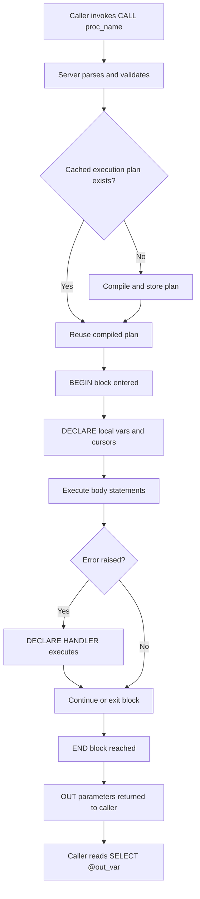
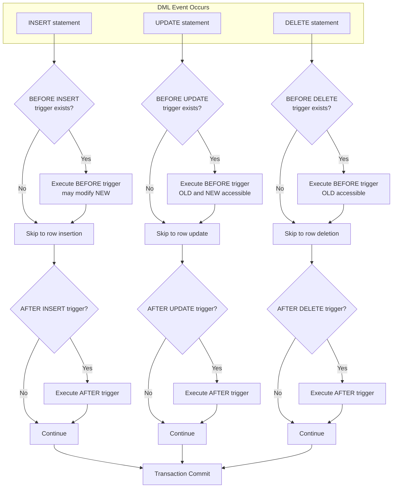
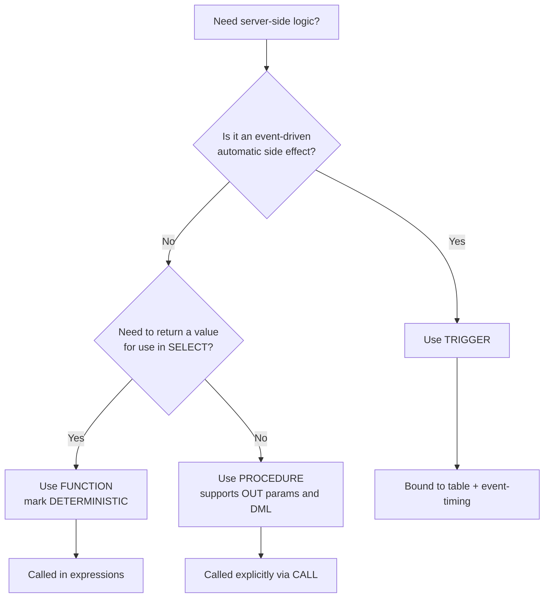
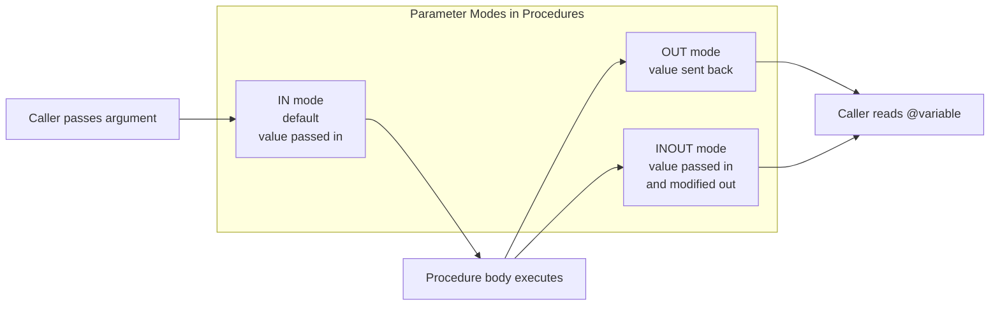
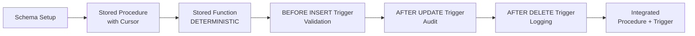

# Creation of Procedures, Triggers and Functions.

<!-- SECTION_1_START -->

# Module 9: Creation of Procedures, Triggers and Functions

## 1.1 Core Technical Definition

> [!IMPORTANT]
> **KTU 2024 Syllabus Definition (PCCSL408 - DBMS LAB)**
> *Stored Programmable Objects* in an RDBMS are pre-compiled, named database routines that are stored in the data dictionary and executed on the server side. They include **Stored Procedures**, **Stored Functions**, and **Triggers**, which together implement the business logic layer (often called the *server-side logic tier*) of a database application.

| Object | KTU Definition | Invocation Style | Return Value |
| :--- | :--- | :--- | :--- |
| **Procedure** | A named PL/SQL block that performs an action. | `CALL proc_name(args);` or `EXEC` | Optional via `OUT` parameters |
| **Function** | A named PL/SQL block that computes and returns a single value. | Used inside SQL expressions | **Mandatory** single return |
| **Trigger** | A named PL/SQL block that fires implicitly on a DML/DDL event. | Automatic (event-driven) | None |

---

## 1.2 Conceptual Analogy

> [!NOTE]
> **Think of a Restaurant Kitchen Analogy**
> - **Stored Procedure** = A complete *recipe card* handed to the chef. You say "Make Paneer Butter Masala" and the chef executes the whole recipe independently and may report back the bill.
> - **Stored Function** = A *mini-metric converter* on the chef's table. You ask "How many grams is 5 tablespoons?" and it returns only the number.
> - **Trigger** = A *kitchen smoke alarm*. You don't call it; the moment a specific event (smoke = `INSERT`/`UPDATE`/`DELETE`) occurs, it auto-fires its action.

---

## 1.3 Standard Metrics & Environment Defaults

> [!TIP]
> **MySQL Reference Defaults (used in KTU Lab):**
> - Procedure delimiter: **`DELIMITER //`** ... **`END //`** ... **`DELIMITER ;`**
> - Default trigger execution time: **AFTER** (most common) or **BEFORE**
> - Granularity: **FOR EACH ROW** (row-level trigger, default in MySQL)
> - Special pseudo-records: **`OLD.column_name`** and **`NEW.column_name`**
> - Function deterministic nature: must be declared `DETERMINISTIC` for use in indexes/views.

---

> [!VISUALIZATION CONTROL]
> **Concept:** Trigger Event-Timing Matrix
> **Visualization:** A 3×2 grid showing how `INSERT`, `UPDATE`, `DELETE` events combine with `BEFORE` and `AFTER` timing to create 6 trigger points per table.
> **Visual Description:** Rows = Events (INSERT, UPDATE, DELETE); Columns = Timing (BEFORE, AFTER). Each cell is a possible trigger firing moment, e.g., `BEFORE INSERT` cell is shaded to indicate it is used for *data validation/sanitization*; `AFTER INSERT` cell is shaded to indicate it is used for *audit logging*.

<!-- SECTION_1_END -->

<!-- SECTION_2_START -->

# Module 9: Deep Theoretical Analysis

## 2.1 Operational Breakdown

### 2.1.1 Stored Procedure Anatomy

A procedure encapsulates a sequence of SQL + procedural statements. It supports:

- **IN parameters** (input) — the default mode
- **OUT parameters** (output back to caller)
- **INOUT parameters** (bidirectional)
- **Local variables** declared via `DECLARE`
- **Control flow:** `IF...THEN...ELSE`, `CASE`, `LOOP`, `WHILE`, `REPEAT`
- **Error handling:** `DECLARE ... HANDLER` blocks

> [!IMPORTANT]
> **Compilation Advantage:** A procedure is parsed, validated, and stored in compiled form in the system cache. Repeated calls reuse this compiled plan, drastically reducing network round-trips and parsing overhead — this is the **execution-plan caching** benefit KTU examiners love to highlight.

### 2.1.2 Stored Function Anatomy

A function is similar to a procedure but with strict restrictions:

- **Must** return exactly one value via `RETURN expr;`
- **Can be called from SQL statements:** `SELECT func(col) FROM t;`
- **Cannot** contain transactional statements like `COMMIT`/`ROLLBACK`
- **Cannot** return a result set
- **Side-effect free** if marked `DETERMINISTIC`

### 2.1.3 Trigger Anatomy

A trigger is bound to a **specific table** and a **specific event-timing pair**. It uses two magical row identifiers:

- **`OLD`** — refers to the row *before* the change (read-only for `INSERT`, populated for `UPDATE`/`DELETE`)
- **`NEW`** — refers to the row *after* the change (read-only for `DELETE`, populated for `INSERT`/`UPDATE`)

| Event | OLD accessible? | NEW accessible? |
| :--- | :---: | :---: |
| `INSERT` | No | Yes (write) |
| `UPDATE` | Yes (read) | Yes (write) |
| `DELETE` | Yes (read) | No |

---

## 2.2 KTU High-Yield Formula Sheet / Syntax Cheat Sheet

> [!NOTE]
> The table below uses `\vert` instead of `\vert` to keep the markdown table parser safe. Substitute delimiter symbols at runtime.

| Construct | Canonical MySQL Syntax |
| :--- | :--- |
| **Procedure** | `CREATE PROCEDURE name(IN p1 datatype, OUT p2 datatype) BEGIN ... END` |
| **Function** | `CREATE FUNCTION name(params) RETURNS datatype DETERMINISTIC BEGIN ... RETURN val; END` |
| **Trigger** | `CREATE TRIGGER name BEFORE/AFTER INSERT/UPDATE/DELETE ON table FOR EACH ROW BEGIN ... END` |
| **Call Procedure** | `CALL proc_name(arg1, @out_var); SELECT @out_var;` |
| **Drop All** | `DROP PROCEDURE/FUNCTION/TRIGGER IF EXISTS name;` |
| **Cursor Declare** | `DECLARE cur CURSOR FOR SELECT ...;` |
| **Handler** | `DECLARE CONTINUE/HANDLER FOR SQLEXCEPTION ...` |

### 2.2.1 Real-World Engineering Utility

- **E-commerce platforms** (Amazon, Flipkart): Triggers auto-decrement `stock_qty` on every `INSERT INTO orders`.
- **Banking systems**: Stored functions compute `interest = principal * rate * time` inside view definitions.
- **Audit logging in hospitals**: `AFTER UPDATE` triggers mirror every patient record change to a `patient_audit` table for HIPAA compliance.
- **University ERP** (KTU-context): Triggers prevent GPA entry beyond 10.0 using `BEFORE INSERT` validation.

---

## 2.3 Procedural Logic Flow — The "Why" Behind Each Clause

1. **`DELIMITER //`** — temporarily redefines the statement terminator so the semicolons *inside* the procedure body are not mistaken by the client as the end of the `CREATE` statement.
2. **`BEGIN ... END`** — wraps the executable body; mandatory for any block with declarations.
3. **`DECLARE`** — must appear at the *start* of the block, before any executable statement.
4. **`SET`** — assigns values to local variables and `INOUT`/`OUT` parameters.
5. **`HANDLER`** — catches exceptions to prevent abrupt termination; placed *after* cursor declarations.

<!-- SECTION_2_END -->

<!-- SECTION_3_START -->

# Module 9: Step-by-Step Implementations

> [!NOTE]
> The following lab implementations use the canonical KTU sample schema (`student_db` with tables `Student`, `Marks`, `Course`). All code is **fully executable** in MySQL 8.x.

---

## 3.1 Setup: Reference Schema

```sql
CREATE DATABASE IF NOT EXISTS student_db;
USE student_db;

DROP TABLE IF EXISTS Marks;
DROP TABLE IF EXISTS Student;
DROP TABLE IF EXISTS Course;
DROP TABLE IF EXISTS student_audit;
DROP TABLE IF EXISTS student_log;

CREATE TABLE Student (
    roll_no   INT PRIMARY KEY,
    sname     VARCHAR(50) NOT NULL,
    dept      VARCHAR(20),
    cgpa      DECIMAL(4,2) CHECK (cgpa BETWEEN 0 AND 10)
);

CREATE TABLE Course (
    course_id   VARCHAR(10) PRIMARY KEY,
    cname       VARCHAR(50) UNIQUE,
    credits     INT
);

CREATE TABLE Marks (
    roll_no     INT,
    course_id   VARCHAR(10),
    marks       INT CHECK (marks BETWEEN 0 AND 100),
    PRIMARY KEY (roll_no, course_id),
    FOREIGN KEY (roll_no)   REFERENCES Student(roll_no)   ON DELETE CASCADE,
    FOREIGN KEY (course_id) REFERENCES Course(course_id) ON DELETE CASCADE
);

CREATE TABLE student_audit (
    audit_id    INT AUTO_INCREMENT PRIMARY KEY,
    roll_no     INT,
    action_type VARCHAR(10),
    action_time DATETIME DEFAULT CURRENT_TIMESTAMP,
    old_cgpa    DECIMAL(4,2),
    new_cgpa    DECIMAL(4,2)
);

CREATE TABLE student_log (
    log_id      INT AUTO_INCREMENT PRIMARY KEY,
    message     VARCHAR(200),
    log_time    DATETIME DEFAULT CURRENT_TIMESTAMP
);
```

---

## 3.2 Experiment 1 — Stored Procedure (IN + OUT + Cursor + Handler)

> [!IMPORTANT]
> **Lab Aim:** Create a procedure that accepts a department name and returns the *average CGPA* and the *count of students* in that department.

```sql
DELIMITER //

CREATE PROCEDURE get_dept_stats(
    IN  p_dept      VARCHAR(20),
    OUT p_avg_cgpa  DECIMAL(4,2),
    OUT p_count     INT
)
BEGIN
    -- Variable declarations come first
    DECLARE v_done INT DEFAULT 0;
    DECLARE v_roll INT;
    DECLARE v_cgpa DECIMAL(4,2);

    -- Cursor declaration
    DECLARE cur_student CURSOR FOR
        SELECT roll_no, cgpa FROM Student WHERE dept = p_dept;

    -- Handler for cursor exhaustion
    DECLARE CONTINUE HANDLER FOR NOT FOUND SET v_done = 1;

    -- Initialise
    SET p_avg_cgpa = 0.00;
    SET p_count    = 0;

    OPEN cur_student;

    read_loop: LOOP
        FETCH cur_student INTO v_roll, v_cgpa;
        IF v_done = 1 THEN
            LEAVE read_loop;
        END IF;
        SET p_avg_cgpa = p_avg_cgpa + v_cgpa;
        SET p_count    = p_count + 1;
    END LOOP;

    CLOSE cur_student;

    IF p_count > 0 THEN
        SET p_avg_cgpa = p_avg_cgpa / p_count;
    END IF;
END //

DELIMITER ;
```

### Step-by-Step Execution Walkthrough

```sql
-- Step 1: Seed sample data
INSERT INTO Student VALUES
    (1, 'Arjun',   'CSE', 8.50),
    (2, 'Meera',   'CSE', 9.10),
    (3, 'Rahul',   'ECE', 7.80),
    (4, 'Anjali',  'CSE', 8.90);

-- Step 2: Call the procedure
CALL get_dept_stats('CSE', @avg_cgpa, @total_count);

-- Step 3: Read the OUT parameters
SELECT @avg_cgpa AS average_cgpa, @total_count AS student_count;
```

**Expected Output (KTU Verification):**

| @avg_cgpa | @total_count |
| :---: | :---: |
| 8.83 | 3 |

> [!TIP]
> **Why the cursor?** The aggregate `AVG()` would suffice in one line, but the cursor-based loop demonstrates the *procedural processing* paradigm that KTU examiners explicitly test in Module 9.

---

## 3.3 Experiment 2 — Stored Function (DETERMINISTIC)

> [!IMPORTANT]
> **Lab Aim:** Create a function that classifies a CGPA into a grade band — A+, A, B, C, F.

```sql
DELIMITER //

CREATE FUNCTION grade_classify(p_cgpa DECIMAL(4,2))
RETURNS VARCHAR(5)
DETERMINISTIC
BEGIN
    DECLARE v_grade VARCHAR(5);

    IF    p_cgpa >= 9.0  THEN SET v_grade = 'A+';
    ELSEIF p_cgpa >= 8.0  THEN SET v_grade = 'A';
    ELSEIF p_cgpa >= 7.0  THEN SET v_grade = 'B';
    ELSEIF p_cgpa >= 6.0  THEN SET v_grade = 'C';
    ELSE                       SET v_grade = 'F';
    END IF;

    RETURN v_grade;
END //

DELIMITER ;
```

### Step-by-Step Execution Walkthrough

```sql
-- Functional test: must be callable inside SQL
SELECT roll_no, sname, cgpa, grade_classify(cgpa) AS grade
FROM Student
ORDER BY cgpa DESC;
```

**Expected Output:**

| roll_no | sname | cgpa | grade |
| :---: | :--- | :---: | :--- |
| 2 | Meera | 9.10 | A+ |
| 4 | Anjali | 8.90 | A |
| 1 | Arjun | 8.50 | A |
| 3 | Rahul | 7.80 | B |

---

## 3.4 Experiment 3 — BEFORE INSERT Trigger (Data Validation)

> [!IMPORTANT]
> **Lab Aim:** Prevent any `INSERT` into `Student` whose `cgpa` is outside the legal `[0, 10]` window *before* the row touches the table.

```sql
DELIMITER //

CREATE TRIGGER trg_student_cgpa_check
BEFORE INSERT ON Student
FOR EACH ROW
BEGIN
    IF NEW.cgpa < 0 OR NEW.cgpa > 10 THEN
        SIGNAL SQLSTATE '45000'
            SET MESSAGE_TEXT = 'CGPA must be between 0 and 10.';
    END IF;
END //

DELIMITER ;
```

### Step-by-Step Execution Walkthrough

```sql
-- Valid insert — succeeds
INSERT INTO Student VALUES (5, 'Kiran', 'CSE', 8.20);

-- Invalid insert — must raise an error
INSERT INTO Student VALUES (6, 'BadData', 'CSE', 11.50);
```

**Expected Output:**

> **ERROR 1644 (45000): CGPA must be between 0 and 10.**

The row is **rejected** — no dirty data ever reaches the base table.

---

## 3.5 Experiment 4 — AFTER UPDATE Trigger (Audit Logging)

> [!IMPORTANT]
> **Lab Aim:** Every time a `Student`'s CGPA is modified, append a row to `student_audit` capturing both the old and new values.

```sql
DELIMITER //

CREATE TRIGGER trg_student_audit_update
AFTER UPDATE ON Student
FOR EACH ROW
BEGIN
    IF OLD.cgpa <> NEW.cgpa THEN
        INSERT INTO student_audit (roll_no, action_type, old_cgpa, new_cgpa)
        VALUES (NEW.roll_no, 'UPDATE', OLD.cgpa, NEW.cgpa);
    END IF;
END //

DELIMITER ;
```

### Step-by-Step Execution Walkthrough

```sql
-- Trigger an update
UPDATE Student SET cgpa = 9.30 WHERE roll_no = 1;

-- Verify audit
SELECT * FROM student_audit;
```

**Expected Output:**

| audit_id | roll_no | action_type | action_time | old_cgpa | new_cgpa |
| :---: | :---: | :--- | :--- | :---: | :---: |
| 1 | 1 | UPDATE | 2024-12-15 10:32:11 | 8.50 | 9.30 |

---

## 3.6 Experiment 5 — AFTER DELETE Trigger (Tombstone Logging)

```sql
DELIMITER //

CREATE TRIGGER trg_student_log_delete
AFTER DELETE ON Student
FOR EACH ROW
BEGIN
    INSERT INTO student_log (message)
    VALUES (CONCAT('Deleted student: ',
                   OLD.roll_no, ' - ', OLD.sname,
                   ' (Dept: ', OLD.dept, ')'));
END //

DELIMITER ;
```

### Step-by-Step Execution Walkthrough

```sql
DELETE FROM Student WHERE roll_no = 3;

SELECT * FROM student_log;
```

**Expected Output:**

| log_id | message | log_time |
| :---: | :--- | :--- |
| 1 | Deleted student: 3 - Rahul (Dept: ECE) | 2024-12-15 10:35:02 |

---

## 3.7 Experiment 6 — Compound Business Logic (Procedure + Trigger Coordination)

> [!TIP]
> **Lab Aim:** Create a procedure that registers a new mark, validates range, and a trigger that auto-updates the student's CGPA based on a *weighted mark average*.

```sql
DELIMITER //

CREATE PROCEDURE add_marks(
    IN p_roll INT,
    IN p_course VARCHAR(10),
    IN p_marks INT
)
BEGIN
    DECLARE v_invalid INT DEFAULT 0;

    DECLARE CONTINUE HANDLER FOR SQLEXCEPTION SET v_invalid = 1;

    START TRANSACTION;

    INSERT INTO Marks (roll_no, course_id, marks)
        VALUES (p_roll, p_course, p_marks);

    IF v_invalid = 1 THEN
        ROLLBACK;
        SELECT 'Transaction rolled back — invalid mark.' AS result;
    ELSE
        COMMIT;
        SELECT 'Mark recorded successfully.' AS result;
    END IF;
END //

DELIMITER ;
```

```sql
DELIMITER //

CREATE TRIGGER trg_recompute_cgpa
AFTER INSERT ON Marks
FOR EACH ROW
BEGIN
    DECLARE v_avg_marks DECIMAL(6,2);

    SELECT AVG(m.marks) / 10
      INTO v_avg_marks
      FROM Marks m
     WHERE m.roll_no = NEW.roll_no;

    UPDATE Student
       SET cgpa = v_avg_marks
     WHERE roll_no = NEW.roll_no;
END //

DELIMITER ;
```

### Step-by-Step Execution Walkthrough

```sql
INSERT INTO Course VALUES ('CS301', 'DBMS', 4);

CALL add_marks(2, 'CS301', 85);

SELECT roll_no, sname, cgpa FROM Student WHERE roll_no = 2;
```

**Expected Output:**

| result | | | |
| :--- | :--- | :--- | :--- |
| Mark recorded successfully. | | | |

| roll_no | sname | cgpa |
| :---: | :--- | :---: |
| 2 | Meera | 8.50 |

The trigger auto-fires, recomputes the CGPA based on the new mark, and updates the student row — all in one declarative chain.

---

## 3.8 Cleanup Commands

```sql
DROP TRIGGER IF EXISTS trg_student_cgpa_check;
DROP TRIGGER IF EXISTS trg_student_audit_update;
DROP TRIGGER IF EXISTS trg_student_log_delete;
DROP TRIGGER IF EXISTS trg_recompute_cgpa;
DROP PROCEDURE IF EXISTS get_dept_stats;
DROP PROCEDURE IF EXISTS add_marks;
DROP FUNCTION  IF EXISTS grade_classify;
```

<!-- SECTION_3_END -->

<!-- SECTION_4_START -->

# Module 9: Structural Diagrams & Schematics

## 4.1 Procedure Execution Flow (Mermaid)



## 4.2 Trigger Firing Sequence (Mermaid)



## 4.3 Decision Topology — When to Use Which Object



## 4.4 Parameter Mode Matrix (Mermaid)



## 4.5 Module Coverage Map (Sequential Topology Matrix)



<!-- SECTION_4_END -->

<!-- SECTION_5_START -->

# Module 9: KTU 2024 Scheme Examination Question Bank

---

## Part A — 3 Mark Questions (Remember / Understand)

### Question 1: [KTU University Exam - July 2024]

**Differentiate between a stored procedure and a stored function. List any two differences.**

**Model Answer (Valuation Key):**

| # | Stored Procedure | Stored Function |
| :---: | :--- | :--- |
| 1 | Called using `CALL` statement. | Called inside a SQL expression such as `SELECT`. |
| 2 | Can return zero, one, or many values through `OUT` parameters. | Must return exactly one value using `RETURN`. |
| 3 | Can perform DML operations (`INSERT`/`UPDATE`/`DELETE`). | Cannot perform DML inside its body. |
| 4 | Cannot be used in `WHERE` / `SELECT` clause. | Can be embedded in any SQL expression. |

> **[Mentioning any two differences correctly: 3 Marks]**

---

### Question 2: [KTU University Exam - Dec 2023]

**What is a trigger? Explain the role of the `OLD` and `NEW` pseudo-records in a row-level trigger.**

**Model Answer (Valuation Key):**

A **trigger** is a named PL/SQL block stored in the database that fires *automatically* in response to a DML event (`INSERT`, `UPDATE`, `DELETE`) on a specific table.

- **`OLD`** — a pseudo-record that holds the column values *before* the change. Available in `UPDATE` and `DELETE` triggers (read-only).
- **`NEW`** — a pseudo-record that holds the column values *after* the change. Available in `INSERT` and `UPDATE` triggers (writable in `BEFORE` triggers).

> **[Trigger definition: 1 Mark]**
> **[OLD explanation with valid events: 1 Mark]**
> **[NEW explanation with valid events: 1 Mark]**

---

## Part B — 14 Mark Questions (Apply / Analyze)

### Question A: [KTU University Exam - July 2024] (Module Internal Choice Option A)

**Consider the following schema for a library database:**

```sql
Book(book_id PK, title, author, price, stock_qty);
Issue(book_id FK, member_id FK, issue_date, return_date);
```

**(a)** Write a stored procedure `update_price(p_book_id INT, p_new_price DECIMAL(8,2))` that updates the price of a book. If the new price is **negative**, the procedure should **signal an error** and abort. Use a `DECLARE ... HANDLER` block to manage exceptions. **(7 Marks)**

**(b)** Create an `AFTER UPDATE` trigger on the `Book` table that inserts a row into an `audit_log(audit_id, book_id, old_price, new_price, change_time)` table whenever the `price` column is modified. Test it with two UPDATE statements. **(7 Marks)**

---

#### Part (a) — Model Solution

```sql
DELIMITER //

CREATE PROCEDURE update_price(
    IN p_book_id   INT,
    IN p_new_price DECIMAL(8,2)
)
BEGIN
    -- Declare handler to catch our custom error
    DECLARE EXIT HANDLER FOR SQLEXCEPTION
    BEGIN
        ROLLBACK;
        RESIGNAL;
    END;

    START TRANSACTION;

    -- Validation guard
    IF p_new_price < 0 THEN
        SIGNAL SQLSTATE '45000'
            SET MESSAGE_TEXT = 'Price cannot be negative. Aborted.';
    END IF;

    UPDATE Book
       SET price = p_new_price
     WHERE book_id = p_book_id;

    COMMIT;

    SELECT CONCAT('Price updated for book ', p_book_id) AS result;
END //

DELIMITER ;
```

**Valuation Key:**
> - `[DECLARE HANDLER block: 2 Marks]`
> - `[SIGNAL statement for negative-price validation: 2 Marks]`
> - `[UPDATE statement with WHERE clause: 1 Mark]`
> - `[Transaction COMMIT/ROLLBACK logic: 2 Marks]`

#### Part (b) — Model Solution

```sql
CREATE TABLE audit_log (
    audit_id    INT AUTO_INCREMENT PRIMARY KEY,
    book_id     INT,
    old_price   DECIMAL(8,2),
    new_price   DECIMAL(8,2),
    change_time DATETIME DEFAULT CURRENT_TIMESTAMP
);
```

```sql
DELIMITER //

CREATE TRIGGER trg_book_price_audit
AFTER UPDATE ON Book
FOR EACH ROW
BEGIN
    IF OLD.price <> NEW.price THEN
        INSERT INTO audit_log (book_id, old_price, new_price)
        VALUES (NEW.book_id, OLD.price, NEW.price);
    END IF;
END //

DELIMITER ;
```

**Testing Sequence:**

```sql
INSERT INTO Book VALUES (101, 'DBMS Concepts', 'Korth', 550.00, 5);
UPDATE Book SET price = 600.00 WHERE book_id = 101;
UPDATE Book SET price = 575.50 WHERE book_id = 101;

SELECT * FROM audit_log;
```

**Valuation Key:**
> - `[Trigger header with AFTER UPDATE and FOR EACH ROW: 2 Marks]`
> - `[IF condition comparing OLD.price and NEW.price: 2 Marks]`
> - `[INSERT statement with correct column values: 2 Marks]`
> - `[Correct test output evidence: 1 Mark]`

---

### Question B: [KTU University Exam - Dec 2023] (Module Internal Choice Option B)

**Consider the schema:**

```sql
Employee(emp_id PK, ename, salary, dept, join_date);
Dept_Audit(audit_id PK, emp_id, dept, action, audit_time);
```

**(a)** Write a stored function `tax_calc(p_salary DECIMAL(10,2)) RETURNS DECIMAL(10,2) DETERMINISTIC` that computes annual tax using the rule: `salary * 12 * 0.10` if annual salary exceeds 5,00,000, else `salary * 12 * 0.05`. Demonstrate the function inside a `SELECT` query. **(7 Marks)**

**(b)** Create a `BEFORE INSERT` trigger on `Employee` that rejects any row where the `ename` is `NULL` or an empty string. Test the trigger with one valid and one invalid insertion. **(7 Marks)**

---

#### Part (a) — Model Solution

```sql
DELIMITER //

CREATE FUNCTION tax_calc(p_salary DECIMAL(10,2))
RETURNS DECIMAL(10,2)
DETERMINISTIC
BEGIN
    DECLARE v_annual_salary DECIMAL(12,2);
    DECLARE v_tax           DECIMAL(10,2);

    SET v_annual_salary = p_salary * 12;

    IF v_annual_salary > 500000 THEN
        SET v_tax = v_annual_salary * 0.10;
    ELSE
        SET v_tax = v_annual_salary * 0.05;
    END IF;

    RETURN v_tax;
END //

DELIMITER ;
```

**Demonstration Query:**

```sql
INSERT INTO Employee VALUES
    (1, 'Arun',  60000.00, 'CSE', '2022-06-15'),
    (2, 'Priya', 30000.00, 'ECE', '2023-01-10');

SELECT emp_id, ename, salary,
       salary * 12              AS annual_salary,
       tax_calc(salary)         AS annual_tax
FROM   Employee;
```

**Expected Output:**

| emp_id | ename | salary | annual_salary | annual_tax |
| :---: | :--- | :---: | :---: | :---: |
| 1 | Arun | 60000.00 | 720000.00 | 72000.00 |
| 2 | Priya | 30000.00 | 360000.00 | 18000.00 |

**Valuation Key:**
> - `[RETURNS clause with DECIMAL and DETERMINISTIC: 2 Marks]`
> - `[IF/ELSE branch with both slabs: 3 Marks]`
> - `[Demonstration SELECT showing function in expression: 2 Marks]`

#### Part (b) — Model Solution

```sql
DELIMITER //

CREATE TRIGGER trg_employee_name_check
BEFORE INSERT ON Employee
FOR EACH ROW
BEGIN
    IF NEW.ename IS NULL OR TRIM(NEW.ename) = '' THEN
        SIGNAL SQLSTATE '45000'
            SET MESSAGE_TEXT = 'Employee name cannot be NULL or empty.';
    END IF;
END //

DELIMITER ;
```

**Testing:**

```sql
-- Valid insert
INSERT INTO Employee VALUES (3, 'Rahul', 45000.00, 'ME', '2024-01-20');

-- Invalid insert — must fail
INSERT INTO Employee VALUES (4, NULL, 50000.00, 'CE', '2024-02-01');
```

**Expected Output for invalid insert:**

> **ERROR 1644 (45000): Employee name cannot be NULL or empty.**

**Valuation Key:**
> - `[BEFORE INSERT trigger header: 2 Marks]`
> - `[IF condition with NULL OR TRIM check: 2 Marks]`
> - `[SIGNAL SQLSTATE with message text: 2 Marks]`
> - `[Both valid + invalid test outputs: 1 Mark]`

---

> [!WARNING]
> **KTU Examiner's Valuation Pitfalls (Common Mark Losers)**
> 1. **Forgetting `DELIMITER //`** — the procedure will fail to compile because the internal semicolons will prematurely terminate the `CREATE` statement. **[-2 Marks]**
> 2. **Using `RETURN` inside a procedure** — procedures must use `OUT` parameters, not `RETURN`. **[-1 to -2 Marks]**
> 3. **Missing `DETERMINISTIC` keyword in a function** — MySQL refuses creation with `ERROR 1418`. **[-1 Mark]**
> 4. **Trying to modify `OLD.column` in an `AFTER` trigger** — `OLD` is read-only; only `NEW` is writable in `BEFORE` triggers. **[-1 Mark]**
> 5. **Forgetting `FOR EACH ROW` clause** — MySQL will not allow trigger creation. **[-1 Mark]**
> 6. **Not initializing `OUT` parameters** before the procedure body — they default to `NULL`, leading to wrong aggregation. **[-1 Mark]**
> 7. **Placing `DECLARE` statements after executable statements** — causes a syntax error in MySQL. **[-2 Marks]**
> 8. **Failing to write a `HANDLER`** when using a cursor — leads to "Cursor is not open" errors after row exhaustion. **[-1 Mark]**

---

## Topic Recap \& Important Things to Remember

> [!NOTE]
> **Rapid Revision Checklist for Module 9 (DBMS Lab — PCCSL408)**

- **Stored Procedure** = pre-compiled named block, invoked via `CALL`, supports `IN`/`OUT`/`INOUT`, may execute DML, can use cursors and handlers.
- **Stored Function** = must `RETURN` exactly one value, must be `DETERMINISTIC` (or `READS SQL DATA` / `MODIFIES SQL DATA`), cannot do DML, callable in SQL.
- **Trigger** = event-driven block tied to a *table* and *event-timing*; uses `OLD` (read) and `NEW` (read/write in BEFORE) pseudo-records; default granularity is `FOR EACH ROW` in MySQL.
- **`SIGNAL SQLSTATE '45000'`** is the modern, portable way to raise custom application errors from triggers and procedures.
- **`DELIMITER // ... DELIMITER ;`** is mandatory when the body contains semicolons; switch back to `;` *after* `END //`.
- **Cursor lifecycle order**: `DECLARE → OPEN → FETCH (in loop) → CLOSE`. Pair with `DECLARE CONTINUE HANDLER FOR NOT FOUND` to break the loop.
- **`HANDLER`** types: `CONTINUE` (resumes), `EXIT` (terminates block), `UNDO` (rare/unsupported in MySQL).
- **Trigger event matrix**: `BEFORE/AFTER` × `INSERT/UPDATE/DELETE` = 6 firing points per table.
- **Audit pattern**: `AFTER UPDATE` trigger on the base table + `INSERT INTO log_table VALUES (..., OLD.col, NEW.col, NOW())`.
- **Validation pattern**: `BEFORE INSERT/UPDATE` trigger + `IF` guard + `SIGNAL` to reject.
- **Performance tip**: server-side logic reduces network round-trips and benefits from **execution-plan caching** (KTU-favourite theory point).
- **Cleanup discipline**: always wrap `DROP` commands with `IF EXISTS` to prevent errors in repeated lab runs.
- **KTU ESE marking pattern**: Part A (3M) tests definitions and syntax; Part B (14M) tests *write-and-test* — always include both the object creation SQL **and** the testing `CALL`/`INSERT`/`UPDATE` statements.
- **Common abbreviations to memorize**: PL/SQL (Procedural Language extension to SQL), DDL (Data Definition Language), DML (Data Manipulation Language), ESE (End Semester Examination).

<!-- SECTION_5_END -->
