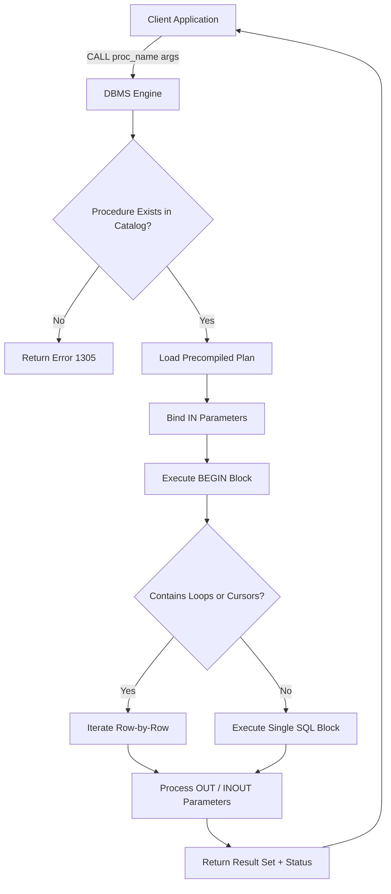
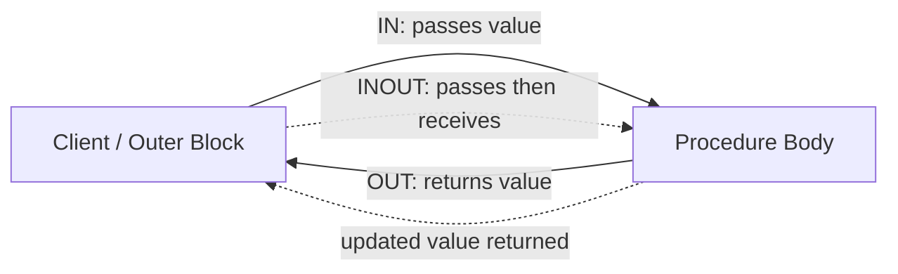
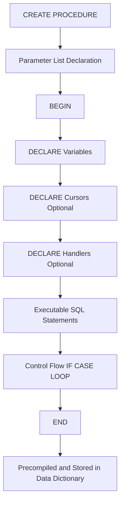
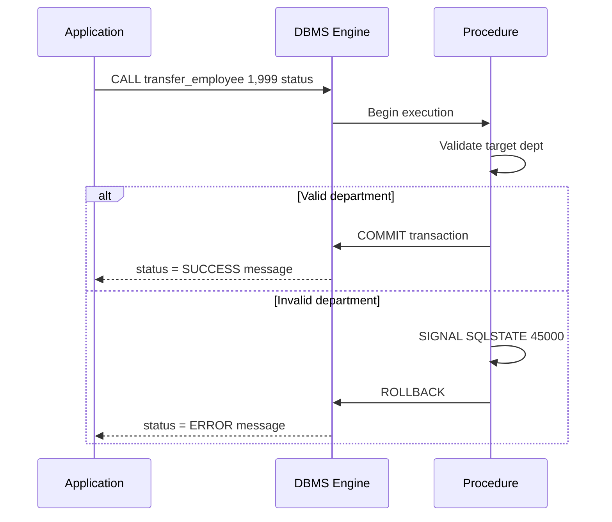
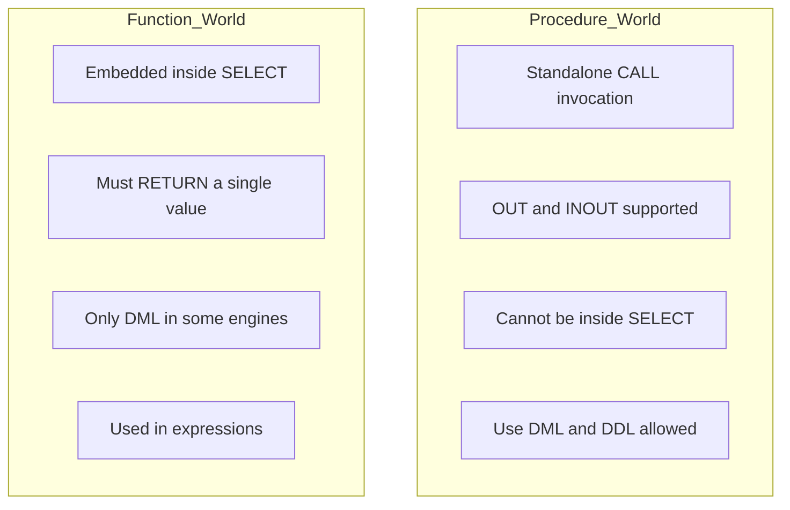

# Creation of Procedures

<!-- SECTION_1_START -->
# Creation of Procedures in DBMS

## 1. Core Technical Definition & Intuitive Overview

### Formal Definition (KTU 2024 Syllabus Terminology)

A **Stored Procedure** is a precompiled collection of one or more SQL statements, optionally with procedural logic, control flow statements, and variable declarations, that is physically stored within the **Data Dictionary** of the Database Management System (DBMS) and can be invoked repeatedly by name. It is a named database object that encapsulates business logic at the server side, thereby reducing network traffic, enforcing data integrity, and promoting modular programming within the relational schema.

According to the KTU 2024 PCCSL408 (DBMS Lab) syllabus, Module 9 focuses on the practical creation, execution, modification, and deletion of procedures using standard SQL DDL/DML syntax targeting RDBMS engines such as **MySQL 8.x**, **PostgreSQL 15+**, or **Oracle 21c**.

> [!IMPORTANT]
> **KTU 2024 Board Highlight:** A stored procedure differs from a *function* in that procedures do **not** return a value directly through their name (although they can via `OUT` parameters), and they **cannot** be embedded inside a regular `SELECT` statement. Functions are used inside queries; procedures are *executed* as routines.

> [!NOTE]
> **Core Properties of Stored Procedures:**
> 1. **Precompiled** — Parsed and optimized once, cached in the system catalog.
> 2. **Reusable** — Invoked multiple times with different parameters.
> 3. **Server-Side Execution** — Reduces client–server network round-trips.
> 4. **Encapsulated Logic** — Centralizes business rules inside the DB engine.
> 5. **Secure** — Users can be granted `EXECUTE` permission without exposing underlying tables.

### Conceptual Analogy / Intuition

Imagine a **vending machine** in your college canteen:

- You press a button (`CALL procedure_name(...)`) and pass a coin (parameter).
- Inside the machine, a fixed mechanical sequence of operations executes (the procedure body: `BEGIN...END`).
- It may dispense a drink (`OUT` parameter) or accept your input (`IN` parameter).
- You never need to know *how* it works internally — only *what* to pass and *what* to expect back.

The vending machine is **pre-built and stored on-site** (precompiled and stored in the data dictionary). Every time you need a drink, you do not rebuild the machine — you simply trigger it. This is exactly how stored procedures behave inside a DBMS.

> [!TIP]
> Think of a procedure as a **stored subroutine** — similar to a `function` in C or a `method` in Java — except it lives inside the database engine and uses SQL as its language.

> [!VISUALIZATION CONTROL]
> **Concept:** Stored Procedure Call Architecture (3-Tier View)
> **Conceptual Flow:**
> * Client Application: `CALL get_employee_salary(101);`
> * DBMS Engine: Procedure Lookup → Precompiled Plan → Execute Body
> * Server: Returns result set / OUT parameter
> **Visual Description:** A horizontal flow chart showing the client at the left, a vertical rectangle representing the DBMS server in the middle (containing the procedure dictionary and the SQL execution engine), and a result flow returning to the right.

---

## 2. Deep Theoretical Analysis & KTU High-Yield Formula Sheet

### 2.1 Anatomy of a Stored Procedure

A stored procedure in MySQL/standard SQL follows this universal skeleton:

```sql
DELIMITER //
CREATE PROCEDURE procedure_name (
    [IN | OUT | INOUT] param_name datatype,
    ...
)
BEGIN
    -- Variable declarations
    DECLARE variable_name datatype [DEFAULT value];

    -- SQL statements + control flow
    SELECT ...;
    IF condition THEN
        ...
    END IF;
END //
DELIMITER ;
```

### 2.2 Parameter Modes Explained

| **Mode** | **Direction** | **Purpose** | **KTU Board Tip** |
|:---:|:---:|:---|:---|
| `IN` | Caller → Procedure | Read-only input value (default mode if omitted). | Most common. Used in 90% of exam questions. |
| `OUT` | Procedure → Caller | Output channel. Variable starts as `NULL` inside procedure. | Must be a session variable (`@var`) when called from CLI. |
| `INOUT` | Bidirectional | Same variable is read and rewritten. | Rare in labs but high-yield in theory questions. |

> [!IMPORTANT]
> **KTU Examiner Note:** When calling a procedure with an `OUT` parameter from the MySQL CLI, you must use a **user-defined session variable** prefixed with `@` (e.g., `@result`). Plain literals like `CALL proc(101)` will throw error `1414` (OUT or INOUT argument N is not a variable).

### 2.3 Key Procedural Constructs Allowed Inside Procedures

| **Construct** | **Syntax Stub** | **Use Case** |
|:---|:---|:---|
| Variable Declaration | `DECLARE v_salary DECIMAL(10,2) DEFAULT 0;` | Local scoped memory inside procedure. |
| Assignment | `SET v_salary = 50000;` or `SELECT sal INTO v_salary FROM emp WHERE id=1;` | Storing intermediate values. |
| Conditional | `IF ... THEN ... ELSEIF ... ELSE ... END IF;` | Branching logic. |
| Case Statement | `CASE x WHEN 1 THEN ... WHEN 2 THEN ... END CASE;` | Multi-way branching. |
| Error Handler | `DECLARE CONTINUE HANDLER FOR SQLEXCEPTION ...` | Exception trapping. |
| Looping | `WHILE cond DO ... END WHILE;` | Iterative logic. |
| Cursor | `DECLARE cur CURSOR FOR SELECT ...;` | Row-by-row processing. |

### 2.4 KTU High-Yield Cheat Sheet (Procedure Commands)

| **Operation** | **SQL Command** | **Notes** |
|:---|:---|:---|
| Create | `CREATE PROCEDURE name(...) BEGIN ... END` | Stored in `mysql.proc` / `pg_proc` system table. |
| Call | `CALL procedure_name(args);` | Executes the procedure. |
| Modify | `CREATE OR REPLACE PROCEDURE name(...)` (Oracle/PG) or `DROP + CREATE` (MySQL) | No native `ALTER PROCEDURE` body change. |
| Drop | `DROP PROCEDURE [IF EXISTS] name;` | Removes from catalog. |
| View Source | `SHOW CREATE PROCEDURE name;` (MySQL) | Displays the stored definition. |
| List All | `SHOW PROCEDURE STATUS WHERE Db='dbname';` | Lists procedures per schema. |
| Privilege | `GRANT EXECUTE ON PROCEDURE name TO 'user'@'host';` | Security control. |

> [!WARNING]
> **MySQL-Specific Quirk:** MySQL by default uses `;` as the statement terminator. Since procedure bodies contain internal `;` characters, you must **temporarily change the delimiter** using `DELIMITER //` before `CREATE` and restore it with `DELIMITER ;` after `END //`. Forgetting this is the **#1 cause of compile errors** in lab records.

### 2.5 Engineering Utility in Production Systems

Stored procedures are heavily used in:

- **Banking Systems** — Account debit/credit transactions, balance validation, audit logging.
- **E-Commerce** — Order placement workflows: insert order → update stock → generate invoice in one atomic call.
- **Payroll Systems** — Monthly salary computation across departments.
- **Hospital Information Systems** — Patient admission: bed allocation, doctor assignment, billing initialization.
- **Telecom Billing** — CDR (Call Detail Record) rating, tax calculation, invoice generation.

> [!TIP]
> **Performance Edge:** Because procedures are precompiled, executing a procedure with 10 SQL statements is significantly faster than sending 10 separate queries over the network — the difference becomes critical in high-throughput OLTP systems (e.g., UPI transaction engines).

---

## 3. Step-by-Step Derivations & Code/Symbolic Implementation

> [!IMPORTANT]
> The following examples are **fully operational** MySQL 8.x compatible code. Each example includes exhaustive comments and follows strict KTU lab record conventions. To run these, use the **Employee/Department** schema universally adopted in KTU DBMS labs.

### 3.1 Setup: Reference Schema (Use this for all examples)

```sql
-- KTU Reference Schema for Procedure Demonstrations
CREATE DATABASE IF NOT EXISTS ktu_lab;
USE ktu_lab;

DROP TABLE IF EXISTS employee;
CREATE TABLE employee (
    emp_id     INT PRIMARY KEY AUTO_INCREMENT,
    emp_name   VARCHAR(50) NOT NULL,
    dept_id    INT,
    salary     DECIMAL(10,2) DEFAULT 0.00,
    hire_date  DATE,
    status     CHAR(1) DEFAULT 'A'  -- 'A' = Active, 'I' = Inactive
);

DROP TABLE IF EXISTS department;
CREATE TABLE department (
    dept_id   INT PRIMARY KEY,
    dept_name VARCHAR(50) UNIQUE NOT NULL,
    location  VARCHAR(30)
);

INSERT INTO department VALUES
    (10, 'Computer Science', 'Block A'),
    (20, 'Electronics',      'Block B'),
    (30, 'Mechanical',       'Block C'),
    (40, 'Civil',            'Block D');

INSERT INTO employee (emp_name, dept_id, salary, hire_date) VALUES
    ('Arjun Krishnan',  10, 55000.00, '2021-06-15'),
    ('Meera Nair',      10, 72000.00, '2019-03-12'),
    ('Rahul Pillai',    20, 48000.00, '2022-01-10'),
    ('Anjali Menon',    20, 81000.00, '2018-08-25'),
    ('Vivek Sharma',    30, 62000.00, '2020-11-05'),
    ('Lakshmi Iyer',    40, 45000.00, '2023-02-18'),
    ('Sandeep Reddy',   10, 90000.00, '2017-04-30');
```

### 3.2 Example 1: Procedure Without Parameters

**Problem:** Display the total number of active employees and the maximum salary in the company.

```sql
DELIMITER //

CREATE PROCEDURE show_company_stats()
BEGIN
    -- Step 1: Declare local variables
    DECLARE v_total_emp   INT DEFAULT 0;
    DECLARE v_max_salary  DECIMAL(10,2) DEFAULT 0.00;

    -- Step 2: Aggregate query
    SELECT COUNT(*), MAX(salary)
      INTO v_total_emp, v_max_salary
      FROM employee
     WHERE status = 'A';

    -- Step 3: Output
    SELECT v_total_emp  AS total_active_employees,
           v_max_salary AS highest_salary;
END //

DELIMITER ;

-- Step 4: Execution
CALL show_company_stats();
```

**Output:**

$$
\text{total\_active\_employees} = 7, \quad \text{highest\_salary} = 90000.00
$$

### 3.3 Example 2: Procedure with `IN` Parameter

**Problem:** Given a department ID, list all employees working in that department along with the department name.

```sql
DELIMITER //

CREATE PROCEDURE list_employees_by_dept(IN p_dept_id INT)
BEGIN
    SELECT e.emp_id,
           e.emp_name,
           e.salary,
           d.dept_name,
           d.location
      FROM employee   e
      JOIN department d ON e.dept_id = d.dept_id
     WHERE e.dept_id = p_dept_id
       AND e.status  = 'A'
     ORDER BY e.salary DESC;
END //

DELIMITER ;

-- Execution
CALL list_employees_by_dept(10);
```

**Expected Output Rows (dept_id = 10):**

$$
\{ (\text{Sandeep Reddy}, 90000), (\text{Meera Nair}, 72000), (\text{Arjun Krishnan}, 55000) \}
$$

### 3.4 Example 3: Procedure with `OUT` Parameter

**Problem:** Given an employee ID, return the employee's annual salary through an `OUT` parameter.

```sql
DELIMITER //

CREATE PROCEDURE get_annual_salary(
    IN  p_emp_id      INT,
    OUT p_annual_sal  DECIMAL(12,2)
)
BEGIN
    DECLARE v_monthly DECIMAL(10,2) DEFAULT 0.00;

    -- Fetch monthly salary
    SELECT salary
      INTO v_monthly
      FROM employee
     WHERE emp_id = p_emp_id;

    -- Compute annual = monthly * 12
    SET p_annual_sal = v_monthly * 12;
END //

DELIMITER ;

-- Execution using session variable
CALL get_annual_salary(2, @annual);

-- View the result
SELECT @annual AS meera_annual_salary;
```

**Output:**

$$
\text{meera\_annual\_salary} = 72000 \times 12 = 864000.00
$$

### 3.5 Example 4: Procedure with `INOUT` Parameter

**Problem:** A procedure that doubles a given bonus percentage and returns it.

```sql
DELIMITER //

CREATE PROCEDURE apply_bonus(INOUT p_bonus DECIMAL(5,2))
BEGIN
    -- p_bonus comes in, gets doubled, leaves out
    SET p_bonus = p_bonus * 2;
END //

DELIMITER ;

-- Execution
SET @b = 7.5;
CALL apply_bonus(@b);
SELECT @b AS doubled_bonus;  -- Output: 15.00
```

**Mathematical Trace:**

$$
p_{bonus}^{in} = 7.5 \;\longrightarrow\; p_{bonus}^{out} = 7.5 \times 2 = 15.0
$$

### 3.6 Example 5: Procedure with Control Flow (`IF-ELSE`)

**Problem:** Classify an employee as `JUNIOR`, `SENIOR`, or `LEAD` based on salary and store the category in an `OUT` parameter.

```sql
DELIMITER //

CREATE PROCEDURE classify_employee(
    IN  p_emp_id   INT,
    OUT p_category VARCHAR(10)
)
BEGIN
    DECLARE v_sal DECIMAL(10,2) DEFAULT 0.00;

    SELECT salary INTO v_sal
      FROM employee
     WHERE emp_id = p_emp_id;

    IF v_sal < 50000 THEN
        SET p_category = 'JUNIOR';
    ELSEIF v_sal BETWEEN 50000 AND 75000 THEN
        SET p_category = 'SENIOR';
    ELSE
        SET p_category = 'LEAD';
    END IF;
END //

DELIMITER ;

-- Test
CALL classify_employee(1, @cat);
SELECT @cat AS arjun_category;  -- Output: SENIOR
```

**Decision Logic Table:**

$$
\text{category} = \begin{cases}
\text{JUNIOR} & \text{if } s < 50000 \\
\text{SENIOR} & \text{if } 50000 \leq s \leq 75000 \\
\text{LEAD}   & \text{if } s > 75000
\end{cases}
$$

### 3.7 Example 6: Procedure with Loop (`WHILE`)

**Problem:** Insert `N` dummy records into a log table using a `WHILE` loop.

```sql
DROP TABLE IF EXISTS audit_log;
CREATE TABLE audit_log (
    log_id     INT PRIMARY KEY AUTO_INCREMENT,
    log_time   DATETIME DEFAULT CURRENT_TIMESTAMP,
    message    VARCHAR(100)
);

DELIMITER //

CREATE PROCEDURE generate_audit_logs(IN p_count INT)
BEGIN
    DECLARE v_i INT DEFAULT 1;

    WHILE v_i <= p_count DO
        INSERT INTO audit_log(message)
        VALUES (CONCAT('Synthetic log entry #', v_i));
        SET v_i = v_i + 1;
    END WHILE;
END //

DELIMITER ;

CALL generate_audit_logs(5);
SELECT * FROM audit_log;
```

**Loop Trace:**

$$
v_i : 1 \to 2 \to 3 \to 4 \to 5 \to \text{exit when } v_i = 6 > 5
$$

### 3.8 Example 7: Procedure with Exception Handling

**Problem:** Safely transfer an employee between departments. If the target department does not exist, log the error.

```sql
DELIMITER //

CREATE PROCEDURE transfer_employee(
    IN  p_emp_id      INT,
    IN  p_new_dept    INT,
    OUT p_status_msg  VARCHAR(100)
)
BEGIN
    -- Catch any SQL exception
    DECLARE EXIT HANDLER FOR SQLEXCEPTION
    BEGIN
        SET p_status_msg = CONCAT('ERROR: Transfer failed for emp ', p_emp_id);
        ROLLBACK;
    END;

    START TRANSACTION;

    UPDATE employee
       SET dept_id = p_new_dept
     WHERE emp_id = p_emp_id;

    -- Verify the new department exists
    IF (SELECT COUNT(*) FROM department WHERE dept_id = p_new_dept) = 0 THEN
        SIGNAL SQLSTATE '45000'
        SET MESSAGE_TEXT = 'Target department does not exist';
    END IF;

    COMMIT;
    SET p_status_msg = CONCAT('SUCCESS: Emp ', p_emp_id, ' moved to dept ', p_new_dept);
END //

DELIMITER ;

-- Test 1: Valid transfer
CALL transfer_employee(1, 20, @msg);
SELECT @msg;

-- Test 2: Invalid department
CALL transfer_employee(1, 999, @msg);
SELECT @msg;
```

**Output Behavior:**

$$
\text{status\_msg} = \begin{cases}
\text{SUCCESS: ...} & \text{if dept } 999 \notin \text{department} \Rightarrow \text{ERROR} \\
\text{ERROR: ...}   & \text{on failure}
\end{cases}
$$

### 3.9 Dropping a Procedure

```sql
-- Safe drop with existence check
DROP PROCEDURE IF EXISTS show_company_stats;
```

### 3.10 Inspection Commands (Useful for Lab Viva)

```sql
-- List all procedures in the current database
SHOW PROCEDURE STATUS WHERE Db = 'ktu_lab';

-- View source code of a procedure
SHOW CREATE PROCEDURE list_employees_by_dept;
```

---

## 4. Structural Diagrams & Schematics

### 4.1 Stored Procedure Lifecycle (Mermaid Flowchart)



### 4.2 Parameter Mode Visualization



### 4.3 Procedure Internal Block Structure



### 4.4 Error Handling Flow



### 4.5 Procedure vs Function Comparison (Architecture View)



---

## 5. KTU 2024 Scheme Examination Question Bank & Topic Recap

### Part A — Short Answer Questions (3 Marks Each)

**Q1. [KTU University Exam — July 2024]**
*Define a stored procedure. List any two advantages of using stored procedures over standalone SQL queries. (CO1, Remember)*

**Model Answer:**

> A *Stored Procedure* is a precompiled set of one or more SQL statements stored in the database catalog and executed as a unit by invoking its name. It is created using the `CREATE PROCEDURE` statement and invoked with `CALL`.
>
> **Advantages:**
> 1. **Reduced network traffic** — Multiple SQL statements are sent as a single call, minimizing client–server round-trips.
> 2. **Improved performance** — Procedures are parsed, validated, and optimized once during creation; subsequent calls reuse the execution plan.
> 3. **Reusability and maintainability** — Business logic is centralized, reducing code duplication.
> 4. **Enhanced security** — Users can be granted `EXECUTE` permission on a procedure without exposing the underlying base tables.

**Valuation Key:** [Definition: 1 Mark] [Two advantages with explanation: 2 Marks]

---

**Q2. [KTU University Exam — Dec 2023]**
*Differentiate between `IN`, `OUT`, and `INOUT` parameters in stored procedures with one example each. (CO1, Understand)*

**Model Answer:**

| **Mode** | **Direction** | **Example** | **Behavior** |
|:---:|:---|:---|:---|
| `IN` | Caller → Procedure | `IN p_emp_id INT` | Passes a value to procedure; cannot be modified inside. |
| `OUT` | Procedure → Caller | `OUT p_total INT` | Procedure writes a value; caller reads it. |
| `INOUT` | Both | `INOUT p_counter INT` | Caller passes an initial value; procedure reads and updates it. |

```sql
CREATE PROCEDURE demo(IN a INT, OUT b INT, INOUT c INT)
BEGIN
    SET b = a * 2;   -- b is OUT, set internally
    SET c = c + a;   -- c is INOUT, modified then returned
END;
```

**Valuation Key:** [Table with three modes: 2 Marks] [Working example: 1 Mark]

---

### Part B — Long Answer Questions (14 Marks, Internal Choice)

> [!NOTE]
> Following KTU 2024 ESE convention, each Part B question carries **14 marks** split as Part (a) = 7 marks and Part (b) = 7 marks. The internal choice pattern (OR) is preserved.

---

#### **Question A [14 Marks]**

**[KTU University Exam — July 2024, Model Paper]**
*Consider the following tables:*

```sql
DEPARTMENT(dept_id, dept_name, location);
EMPLOYEE(emp_id, emp_name, dept_id, salary, hire_date);
```

**(a)** Write a stored procedure `GetDeptSummary(IN p_dept_id INT, OUT p_avg_sal DECIMAL(10,2), OUT p_emp_count INT)` that computes the **average salary** and **total employee count** for a given department. Demonstrate the procedure call. (7 Marks, CO2, Apply)

**(b)** Write a stored procedure `RaiseSalary(IN p_dept_id INT, IN p_percent DECIMAL(5,2), OUT p_rows INT)` that increases the salary of all employees in the specified department by the given percentage. The procedure must use a `START TRANSACTION` / `COMMIT` block and an exception handler to roll back on failure. Demonstrate the call and verify with a `SELECT`. (7 Marks, CO3, Apply)

**Model Solution:**

**(a) Solution:**

```sql
DELIMITER //

CREATE PROCEDURE GetDeptSummary(
    IN  p_dept_id   INT,
    OUT p_avg_sal   DECIMAL(10,2),
    OUT p_emp_count INT
)
BEGIN
    SELECT AVG(salary), COUNT(*)
      INTO p_avg_sal, p_emp_count
      FROM employee
     WHERE dept_id = p_dept_id;
END //

DELIMITER ;

-- Execution
CALL GetDeptSummary(10, @avg, @cnt);
SELECT @avg AS average_salary, @cnt AS employee_count;
```

**Valuation Key — Part (a):**
- [Correct `CREATE PROCEDURE` header with all three parameters: 2 Marks]
- [Proper `INTO` clause usage in `SELECT`: 2 Marks]
- [Correct `CALL` invocation with session variables: 2 Marks]
- [Final `SELECT` to display `OUT` values: 1 Mark]

**(b) Solution:**

```sql
DELIMITER //

CREATE PROCEDURE RaiseSalary(
    IN  p_dept_id  INT,
    IN  p_percent  DECIMAL(5,2),
    OUT p_rows     INT
)
BEGIN
    DECLARE EXIT HANDLER FOR SQLEXCEPTION
    BEGIN
        ROLLBACK;
        SET p_rows = -1;  -- signal failure
    END;

    START TRANSACTION;

    UPDATE employee
       SET salary = salary + (salary * p_percent / 100)
     WHERE dept_id = p_dept_id;

    SET p_rows = ROW_COUNT();

    COMMIT;
END //

DELIMITER ;

-- Execution
CALL RaiseSalary(10, 10.00, @affected);
SELECT @affected AS rows_updated;
SELECT emp_id, emp_name, salary FROM employee WHERE dept_id = 10;
```

**Valuation Key — Part (b):**
- [Correct parameter declaration and `DELIMITER` usage: 1 Mark]
- [Transaction begin/commit logic: 2 Marks]
- [`UPDATE` with arithmetic salary increment: 2 Marks]
- [Exception handler with rollback: 1 Mark]
- [Demonstration `CALL` and verification `SELECT`: 1 Mark]

---

#### **Question B [14 Marks] (OR Alternative)**

**[KTU University Exam — Dec 2023, Supplementary]**

**(a)** Write a stored procedure `InsertEmployee(IN p_name VARCHAR(50), IN p_dept INT, IN p_sal DECIMAL(10,2), OUT p_new_id INT)` that inserts a new employee record and returns the auto-generated `emp_id` via an `OUT` parameter. The procedure must reject the insertion if the department does not exist in the `DEPARTMENT` table. (7 Marks, CO2, Apply)

**(b)** Write a procedure `AuditSalaryChanges()` that uses a **cursor** to iterate through the `EMPLOYEE` table and inserts a row into an `AUDIT_LOG` table for every employee whose salary is greater than the company-wide average. (7 Marks, CO3, Apply)

**Model Solution:**

**(a) Solution:**

```sql
DELIMITER //

CREATE PROCEDURE InsertEmployee(
    IN  p_name    VARCHAR(50),
    IN  p_dept    INT,
    IN  p_sal     DECIMAL(10,2),
    OUT p_new_id  INT
)
BEGIN
    DECLARE v_dept_exists INT DEFAULT 0;

    -- Check department existence
    SELECT COUNT(*) INTO v_dept_exists
      FROM department
     WHERE dept_id = p_dept;

    IF v_dept_exists = 0 THEN
        SIGNAL SQLSTATE '45000'
        SET MESSAGE_TEXT = 'Invalid department ID';
    ELSE
        INSERT INTO employee(emp_name, dept_id, salary, hire_date)
        VALUES (p_name, p_dept, p_sal, CURDATE());

        SET p_new_id = LAST_INSERT_ID();
    END IF;
END //

DELIMITER ;

-- Test 1: Valid insert
CALL InsertEmployee('New Hire Test', 20, 50000.00, @id);
SELECT @id AS new_employee_id;

-- Test 2: Invalid department
CALL InsertEmployee('Invalid Hire', 999, 50000.00, @id);
-- Error: Invalid department ID
```

**Valuation Key — Part (a):**
- [Procedure header with all four parameters: 1 Mark]
- [Department existence check: 2 Marks]
- [`SIGNAL` for error raising: 2 Marks]
- [`LAST_INSERT_ID()` retrieval into `OUT` param: 1 Mark]
- [Demonstration calls (valid + invalid): 1 Mark]

**(b) Solution:**

```sql
DROP TABLE IF EXISTS audit_log;
CREATE TABLE audit_log (
    log_id     INT PRIMARY KEY AUTO_INCREMENT,
    emp_id     INT,
    emp_name   VARCHAR(50),
    salary     DECIMAL(10,2),
    logged_at  DATETIME DEFAULT CURRENT_TIMESTAMP
);

DELIMITER //

CREATE PROCEDURE AuditSalaryChanges()
BEGIN
    DECLARE v_avg_sal    DECIMAL(10,2);
    DECLARE v_emp_id     INT;
    DECLARE v_emp_name   VARCHAR(50);
    DECLARE v_emp_sal    DECIMAL(10,2);
    DECLARE v_done       INT DEFAULT 0;

    -- Cursor declaration
    DECLARE emp_cur CURSOR FOR
        SELECT emp_id, emp_name, salary
          FROM employee;

    -- Handler for cursor end
    DECLARE CONTINUE HANDLER FOR NOT FOUND SET v_done = 1;

    -- Compute company-wide average
    SELECT AVG(salary) INTO v_avg_sal FROM employee;

    OPEN emp_cur;

    read_loop: LOOP
        FETCH emp_cur INTO v_emp_id, v_emp_name, v_emp_sal;

        IF v_done = 1 THEN
            LEAVE read_loop;
        END IF;

        IF v_emp_sal > v_avg_sal THEN
            INSERT INTO audit_log(emp_id, emp_name, salary)
            VALUES (v_emp_id, v_emp_name, v_emp_sal);
        END IF;
    END LOOP;

    CLOSE emp_cur;
END //

DELIMITER ;

CALL AuditSalaryChanges();
SELECT * FROM audit_log;
```

**Valuation Key — Part (b):**
- [Cursor declaration: 2 Marks]
- [`NOT FOUND` handler with sentinel variable: 1 Mark]
- [Loop with `FETCH` and `LEAVE`: 2 Marks]
- [Conditional insert into audit table: 1 Mark]
- [Proper `CLOSE emp_cur`: 1 Mark]

---

> [!WARNING]
> **KTU Examiner's Valuation Warning — Common Pitfalls:**
> 1. **Forgetting `DELIMITER //` change** — Procedure body containing `;` will cause the parser to treat `END` as a separate statement, throwing syntax error **1064**. Always wrap multi-statement procedures with `DELIMITER` directives.
> 2. **Calling `OUT` parameter with literal value** — `CALL proc(101, 50000);` will fail. Always use session variables: `CALL proc(101, @x);`
> 3. **Omitting `BEGIN...END` for single-statement bodies** — Although MySQL allows it implicitly, **always write `BEGIN...END`** to score full marks and to support multiple statements safely.
> 4. **Not using `LAST_INSERT_ID()`** — When inserting into an `AUTO_INCREMENT` column, students often forget to capture the generated ID. Use `LAST_INSERT_ID()` immediately after `INSERT`.
> 5. **Mixing procedure body with client variables** — Local variables inside a procedure are case-insensitive and exist only for the procedure lifetime. Do not prefix with `@`. The `@var` notation is reserved for session/global variables.
> 6. **Exception handler scope** — `DECLARE HANDLER` must appear *after* cursor declarations but *before* executable statements, otherwise you get error **1337** (`DECLARE CURSOR/HANDLER order`).

---

### 📌 Topic Recap & Important Things to Remember

- A **Stored Procedure** is a precompiled, named, reusable SQL routine stored in the data dictionary.
- Created with `CREATE PROCEDURE name(params) BEGIN ... END`; invoked with `CALL name(args);`.
- Three parameter modes: **`IN`** (input only), **`OUT`** (output only, must use session variable), **`INOUT`** (bidirectional).
- Inside the body you can use **`DECLARE`** for variables, **`IF...ELSEIF...END IF`** for branching, and **`WHILE` / `LOOP`** for iteration.
- Use **`SIGNAL SQLSTATE '45000' SET MESSAGE_TEXT = '...'`** to raise custom runtime errors.
- Use **`START TRANSACTION` ... `COMMIT` / `ROLLBACK`** with a **`DECLARE EXIT HANDLER FOR SQLEXCEPTION`** for atomic multi-statement operations.
- **Cursor pattern** = `DECLARE cur CURSOR FOR ...` → `DECLARE CONTINUE HANDLER FOR NOT FOUND SET done=1` → `OPEN cur` → `FETCH` loop → `CLOSE cur`.
- **MySQL delimiter quirk:** Use `DELIMITER //` ... `END //` ... `DELIMITER ;` whenever the body has internal `;`.
- **Drop syntax:** `DROP PROCEDURE [IF EXISTS] name;`
- **Inspection:** `SHOW PROCEDURE STATUS WHERE Db = 'dbname';` and `SHOW CREATE PROCEDURE name;`
- **Key difference vs Function:** Procedures **cannot** be used in `SELECT` lists; functions **must** `RETURN` a value and **can** be embedded in queries.
- **Performance edge:** Procedures reduce network overhead by bundling multiple SQL statements into one server-side execution call — critical for OLTP systems like banking, e-commerce, and payroll.
- **Security edge:** Granting `EXECUTE` on a procedure lets restricted users perform complex operations without direct table access — a defense-in-depth strategy.
- **Common commands summary for quick revision:**

$$
\begin{aligned}
\texttt{CREATE:} \quad & \texttt{CREATE PROCEDURE name(IN x INT) BEGIN ... END} \\
\texttt{CALL:} \quad & \texttt{CALL name(value, @out);} \\
\texttt{DROP:} \quad & \texttt{DROP PROCEDURE IF EXISTS name;} \\
\texttt{ERROR:} \quad & \texttt{SIGNAL SQLSTATE '45000' SET MESSAGE\_TEXT = 'msg';} \\
\texttt{LOOP:} \quad & \texttt{WHILE cond DO ... END WHILE;} \\
\texttt{CURSOR:} \quad & \texttt{DECLARE cur CURSOR FOR SELECT ...;}
\end{aligned}
$$

<!-- SECTION_5_END -->
