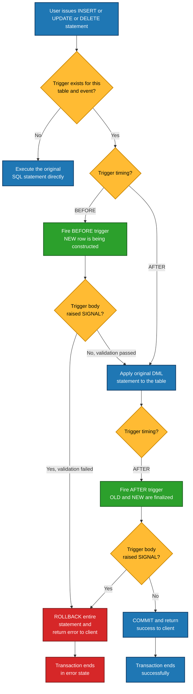
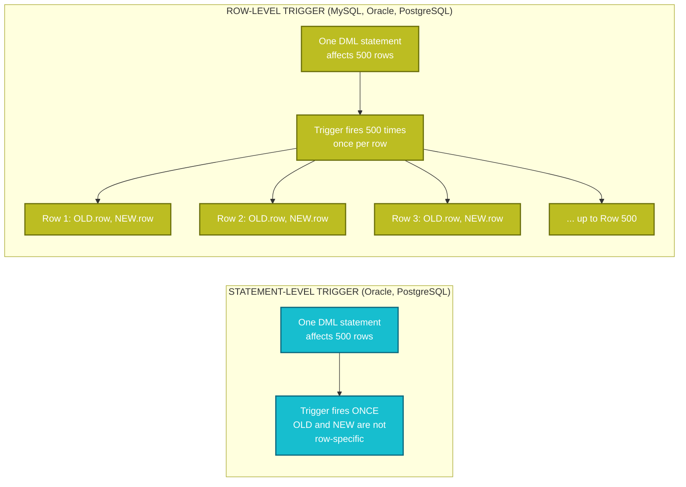
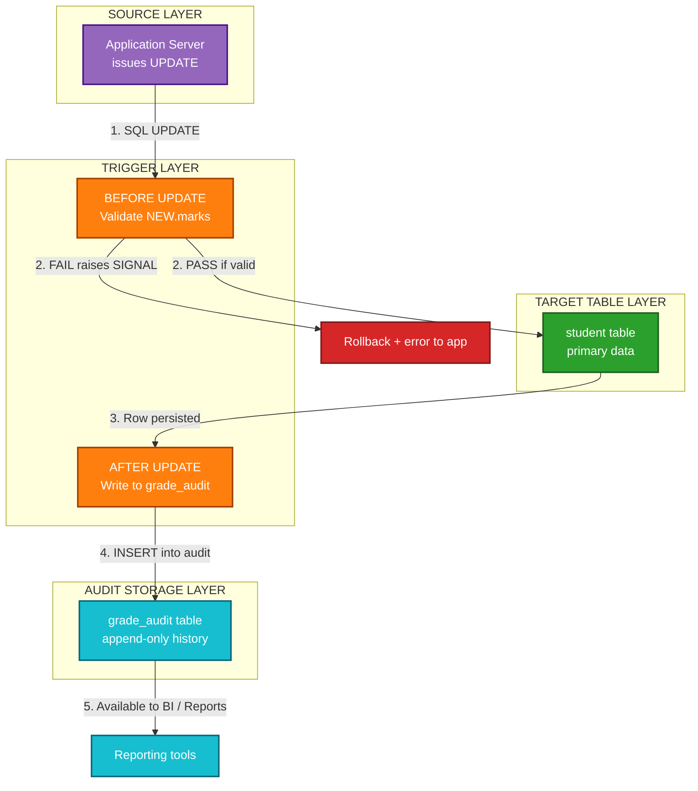

# Creation of Triggers

<!-- SECTION_1_START -->
# 🔔 Creation of Triggers in SQL — KTU 2024 Scheme DBMS Lab (PCCSL408)

## 1. Core Technical Definition

> [!NOTE]
> **Definition (KTU 2024 Syllabus Aligned):**
> A **Trigger** is a named database object (a special kind of stored procedure) that is **automatically executed (fired) by the DBMS** in response to a specified **Data Manipulation Language (DML)** event — namely `INSERT`, `UPDATE`, or `DELETE` — occurring on a specified table or view. Triggers are tightly bound to the table and are part of the schema, enforcing business rules, data integrity, and audit logging at the database engine level rather than at the application layer.

In the formal **KTU 2024 DBMS Lab manual**, triggers are categorized under the **procedural database objects** group alongside stored procedures and user-defined functions. The defining property is *automatic invocation* — the trigger body never has to be called explicitly by the user; the engine invokes it implicitly whenever the triggering event fires.

### Conceptual Analogy — The Automatic Door Alarm

Imagine a bank vault with a **motion sensor**:
- You do not call the alarm; the sensor "listens" for motion.
- When motion is detected (the **event**), the alarm rings (the **trigger body**).
- You can configure the alarm to ring **before** the motion completes (e.g., a warning beep) or **after** (e.g., police dispatch).
- The alarm is **physically attached** to the vault door (the **table**); you cannot reuse it on the cash counter.

This is exactly how an SQL trigger works: a *sensor* (`BEFORE`/`AFTER` clause) attached to a *table* that *reacts* to a *specific event* (`INSERT`/`UPDATE`/`DELETE`).

### Components of a Trigger (KTU Board Terminology)

> [!IMPORTANT]
> **Five Mandatory Components of a Trigger Definition (as per KTU Module 9 syllabus):**
> 1. **Triggering Event** — `INSERT`, `UPDATE`, or `DELETE`
> 2. **Triggering Action / Timing** — `BEFORE`, `AFTER`, or `INSTEAD OF`
> 3. **Trigger Level** — `FOR EACH ROW` (row-level) or `FOR EACH STATEMENT` (statement-level)
> 4. **Trigger Body** — the procedural SQL block that executes
> 5. **OLD and NEW References** — pseudo-records holding old (before) and new (after) row values

### Standard Syntax (ANSI SQL / MySQL Reference)

```sql
CREATE TRIGGER trigger_name
{ BEFORE | AFTER | INSTEAD OF }
{ INSERT | UPDATE | DELETE }
ON table_name
[ FOR EACH ROW | FOR EACH STATEMENT ]
[ WHEN ( condition ) ]
BEGIN
    -- Trigger body (procedural SQL)
END;
```

> [!WARNING]
> **KTU Valuation Tip:** In **MySQL**, a trigger body is a single `BEGIN ... END` block. There is no `INSTEAD OF` trigger support for tables (only for views), and the default level is `FOR EACH ROW` (Oracle supports `FOR EACH STATEMENT` too). Always state the DBMS flavor you are demonstrating.

<!-- SECTION_1_END -->

<!-- SECTION_2_START -->
# 📘 Deep Theoretical Analysis & KTU High-Yield Formula Sheet

## 2.1 Trigger Classification Matrix

Triggers are classified along **two independent axes** — *Timing* and *Event*. Combined, they yield the canonical KTU classification table:

| Timing ↓ / Event → | INSERT | UPDATE | DELETE |
|---|---|---|---|
| **BEFORE** | Validate data before insert | Sanitize values before update | Prevent certain deletions |
| **AFTER** | Auto-generate audit / log | Maintain derived / mirror table | Archive deleted row |
| **INSTEAD OF** (Views only) | Custom view insert | Custom view update | Custom view delete |

> [!IMPORTANT]
> **KTU High-Yield Fact:** `BEFORE` triggers are used for **data validation and transformation**; `AFTER` triggers are used for **auditing, logging, and maintaining derived data**. `INSTEAD OF` triggers exist primarily to make **non-updatable views** updatable.

## 2.2 OLD and NEW Reference Variables

The pseudo-rows `OLD` and `NEW` allow the trigger body to inspect the values *before* and *after* a row mutation. Their availability is **event-dependent**:

| Event | OLD | NEW |
|---|---|---|
| **INSERT** | ❌ Not available | ✅ Available |
| **UPDATE** | ✅ Available | ✅ Available |
| **DELETE** | ✅ Available | ❌ Not available |

> [!WARNING]
> **Common Pitfall:** Referring to `OLD.column_name` in an `INSERT` trigger (or `NEW.column_name` in a `DELETE` trigger) causes a **compilation/runtime error**. The KTU examiner deducts **1 mark** for this if mentioned incorrectly in theory answers.

## 2.3 Row-Level vs Statement-Level Triggers

- **Row-Level Trigger (`FOR EACH ROW`):** Fires once **per row** affected. Allows access to `OLD` and `NEW` values. Used in MySQL by default.
- **Statement-Level Trigger (`FOR EACH STATEMENT`):** Fires once **per triggering statement**, regardless of how many rows are affected. Faster for bulk operations. **Not supported in MySQL**, only in Oracle/PostgreSQL.

> [!NOTE]
> **KTU Lab Note:** Since KTU 2024 lab examinations are predominantly conducted on **MySQL 8.x** (or PostgreSQL in some institutions), focus your practical answer on `FOR EACH ROW` triggers.

## 2.4 The KTU High-Yield Trigger Formula Sheet

| Concept | Formula / Syntax | Notes / Units |
|---|---|---|
| **Create trigger** | `CREATE TRIGGER name timing event ON table FOR EACH ROW BEGIN ... END;` | MySQL standard |
| **Drop trigger** | `DROP TRIGGER [IF EXISTS] schema.trigger_name;` | MySQL 8.0+ requires schema |
| **Show triggers** | `SHOW TRIGGERS;` or query `information_schema.TRIGGERS` | DBMS catalog |
| **Row pseudo-vars** | `OLD.col` and `NEW.col` | Only inside `FOR EACH ROW` |
| **Conditional** | `IF NEW.salary < 0 THEN ... END IF;` | MySQL/PL-SQL block |
| **Raise signal** | `SIGNAL SQLSTATE '45000' SET MESSAGE_TEXT = 'msg';` | MySQL error |
| **Audit table write** | `INSERT INTO log_table VALUES (OLD.id, NOW(), USER());` | Common pattern |
| **Recursion** | Triggers cannot fire the **same trigger recursively** within one transaction in MySQL | Avoid infinite loops |

## 2.5 Engineering Utility of Triggers

> [!TIP]
> **Where Triggers Are Used in Real Production Systems:**
> - **Audit Logging:** Capturing who changed what and when (regulatory compliance — GDPR, HIPAA, SOX).
> - **Enforcing Complex Constraints** that `CHECK` constraints cannot express (e.g., cross-table validations).
> - **Maintaining Derived Data:** Updating summary tables, denormalized counters, or search-index fields automatically.
> - **Replicating Data into Shadow Tables** for reporting without touching the application code.
> - **Preventing Unauthorized Deletes** by rolling back transactions on sensitive tables.
> - **E-Commerce:** Auto-updating inventory stock when an order is inserted into the `orders` table.

> [!WARNING]
> **Production Caveat:** Triggers execute **inside the transaction** of the triggering statement. Heavy trigger logic can drastically slow down bulk inserts/updates — a frequent interview question after KTU lab exams.

## 2.6 Trigger Execution Order in MySQL

When multiple triggers exist on the same table for the same event, the order is:

1. `BEFORE` triggers fire in the order they were created.
2. The actual `INSERT` / `UPDATE` / `DELETE` statement executes.
3. `AFTER` triggers fire in the order they were created.
4. If any trigger raises an error or `SIGNAL`, the entire statement is **rolled back**.

<!-- SECTION_2_END -->

<!-- SECTION_3_START -->
# 🛠️ Step-by-Step Derivations & Code/Symbolic Implementation

## 3.1 Lab Setup — Base Tables (Reusable Across Examples)

Run this setup **once** before testing any of the trigger examples below. This mirrors a typical KTU lab question stem where you are given tables and asked to write triggers on them.

```sql
-- ============================================================
-- STEP 0: Lab Base Schema (KTU DBMS Lab — Module 9 Standard)
-- ============================================================
DROP DATABASE IF EXISTS ktu_lab;
CREATE DATABASE ktu_lab;
USE ktu_lab;

-- 1) STUDENT master table
CREATE TABLE student (
    roll_no   INT          PRIMARY KEY,
    name      VARCHAR(50)  NOT NULL,
    marks     INT          CHECK (marks BETWEEN 0 AND 100),
    dept      VARCHAR(20)  DEFAULT 'CSE'
);

-- 2) GRADE audit log table
CREATE TABLE grade_audit (
    audit_id    INT          AUTO_INCREMENT PRIMARY KEY,
    roll_no     INT,
    old_marks   INT,
    new_marks   INT,
    changed_by  VARCHAR(50),
    changed_at  TIMESTAMP    DEFAULT CURRENT_TIMESTAMP
);

-- 3) BLOCKED_ROLLNO table to demonstrate INSTEAD OF
CREATE TABLE blocked_rollno (
    roll_no INT PRIMARY KEY
);
INSERT INTO blocked_rollno VALUES (101), (202), (303);

-- 4) BOOK and BOOK_AUDIT for library trigger
CREATE TABLE book (
    book_id   INT          PRIMARY KEY,
    title     VARCHAR(100),
    copies    INT          DEFAULT 1
);

CREATE TABLE book_audit (
    audit_id   INT          AUTO_INCREMENT PRIMARY KEY,
    book_id    INT,
    action     VARCHAR(20),
    old_copies INT,
    new_copies INT,
    log_time   TIMESTAMP    DEFAULT CURRENT_TIMESTAMP
);
```

## 3.2 Example 1 — BEFORE INSERT Trigger (Data Validation)

**KTU Exam Scenario:** *"Write a trigger that prevents inserting a student with marks greater than 100 or less than 0."*

```sql
-- ============================================================
-- TRIGGER 1: BEFORE INSERT on student
-- Purpose: Validate marks before row is committed
-- ============================================================
DELIMITER //

CREATE TRIGGER trg_student_before_insert
BEFORE INSERT ON student
FOR EACH ROW
BEGIN
    -- Validate marks range using conditional logic
    IF NEW.marks < 0 OR NEW.marks > 100 THEN
        SIGNAL SQLSTATE '45000'
            SET MESSAGE_TEXT = 'ERROR: Marks must be between 0 and 100.';
    END IF;

    -- Normalize department to uppercase automatically
    SET NEW.dept = UPPER(NEW.dept);
END //

DELIMITER ;

-- ------------------- TESTING -------------------
-- Valid insert (should succeed, dept becomes 'ECE')
INSERT INTO student (roll_no, name, marks, dept) VALUES (1, 'Anand', 85, 'ece');

-- Invalid insert (should fail with custom error)
INSERT INTO student (roll_no, name, marks, dept) VALUES (2, 'BadData', 150, 'CSE');
-- Expected output: ERROR 1644 (45000): ERROR: Marks must be between 0 and 100.

-- Verify the validation
SELECT * FROM student;
```

**Incremental Valuation Key for KTU:**
- `[Correct timing + event declaration: 2 Marks]`
- `[Correct use of NEW reference variable: 2 Marks]`
- `[Use of SIGNAL SQLSTATE to raise error: 2 Marks]`
- `[Normalization logic (uppercase dept): 1 Mark]`

## 3.3 Example 2 — AFTER UPDATE Trigger (Audit Logging)

**KTU Exam Scenario:** *"Maintain a log of all changes to the marks column of the student table."*

```sql
-- ============================================================
-- TRIGGER 2: AFTER UPDATE on student
-- Purpose: Log every marks change to grade_audit
-- ============================================================
DELIMITER //

CREATE TRIGGER trg_student_after_update
AFTER UPDATE ON student
FOR EACH ROW
BEGIN
    -- Only log if marks actually changed
    IF OLD.marks <> NEW.marks THEN
        INSERT INTO grade_audit (roll_no, old_marks, new_marks, changed_by)
        VALUES (OLD.roll_no, OLD.marks, NEW.marks, CURRENT_USER());
    END IF;
END //

DELIMITER ;

-- ------------------- TESTING -------------------
-- This update should generate one audit row
UPDATE student SET marks = 92 WHERE roll_no = 1;

-- This update should NOT generate an audit row (marks unchanged)
UPDATE student SET name = 'Anand Kumar' WHERE roll_no = 1;

-- Inspect the audit log
SELECT * FROM grade_audit;
```

> [!IMPORTANT]
> **Why the `IF OLD.marks <> NEW.marks` guard?** Without it, *every* `UPDATE` (even one that changes only the name) would produce an audit row. This is a **frequently asked 2-mark sub-question** in KTU ESE — "Why is conditional logging used in triggers?"

## 3.4 Example 3 — AFTER DELETE Trigger (Archive Pattern)

```sql
-- ============================================================
-- TRIGGER 3: AFTER DELETE on student
-- Purpose: Archive deleted rows into grade_audit
-- ============================================================
DELIMITER //

CREATE TRIGGER trg_student_after_delete
AFTER DELETE ON student
FOR EACH ROW
BEGIN
    INSERT INTO grade_audit (roll_no, old_marks, new_marks, changed_by)
    VALUES (OLD.roll_no, OLD.marks, NULL, CONCAT('DELETED_BY_', CURRENT_USER()));
END //

DELIMITER ;

-- Test it
DELETE FROM student WHERE roll_no = 1;
SELECT * FROM grade_audit;
```

## 3.5 Example 4 — INSTEAD OF Trigger on a View

**KTU Exam Scenario:** *"Create a view joining student and blocked_rollno. Write an INSTEAD OF trigger that converts any INSERT into a DELETE from the blocked table."*

```sql
-- ============================================================
-- TRIGGER 4: INSTEAD OF INSERT on a non-updatable view
-- ============================================================
CREATE OR REPLACE VIEW v_student_blocked AS
SELECT s.roll_no, s.name, s.marks
FROM student s
JOIN blocked_rollno b ON s.roll_no = b.roll_no;

DELIMITER //

CREATE TRIGGER trg_view_instead_insert
INSTEAD OF INSERT ON v_student_blocked
FOR EACH ROW
BEGIN
    DELETE FROM blocked_rollno WHERE roll_no = NEW.roll_no;
END //

DELIMITER ;

-- Test it
INSERT INTO v_student_blocked (roll_no, name, marks) VALUES (101, 'Should vanish', 75);
SELECT * FROM blocked_rollno;  -- 101 should be gone
```

## 3.6 Example 5 — Cross-Table Consistency Trigger (Library Scenario)

```sql
-- ============================================================
-- TRIGGER 5: AFTER UPDATE on book
-- Purpose: Track changes in book copies for auditing
-- ============================================================
DELIMITER //

CREATE TRIGGER trg_book_after_update
AFTER UPDATE ON book
FOR EACH ROW
BEGIN
    IF OLD.copies <> NEW.copies THEN
        INSERT INTO book_audit (book_id, action, old_copies, new_copies)
        VALUES (OLD.book_id, 'UPDATE', OLD.copies, NEW.copies);
    END IF;
END //

DELIMITER ;

INSERT INTO book VALUES (501, 'Database Systems', 5);
UPDATE book SET copies = 8 WHERE book_id = 501;
SELECT * FROM book_audit;
```

## 3.7 Trigger Management Commands

```sql
-- List all triggers in the current database
SHOW TRIGGERS;

-- Query the information schema for detailed metadata
SELECT trigger_name, event_manipulation, action_timing, event_object_table
FROM information_schema.TRIGGERS
WHERE trigger_schema = 'ktu_lab';

-- Drop a trigger
DROP TRIGGER IF EXISTS ktu_lab.trg_book_after_update;
```

> [!WARNING]
> **MySQL 8.0+ requires the schema-qualified name in `DROP TRIGGER`.** Older versions accepted unqualified names. KTU students should always qualify to avoid runtime errors during lab evaluations.

## 3.8 Python Wrapper (Optional Lab Demonstration)

Some KTU institutions ask students to demonstrate triggers via a Python connector. Here is a complete working example:

```python
"""
trigger_demo.py
Connects to MySQL, runs an UPDATE that fires an AFTER UPDATE trigger,
and reads the resulting audit log.
"""

import mysql.connector
from mysql.connector import Error
from typing import Optional

def get_connection() -> Optional[mysql.connector.connection.MySQLConnection]:
    """Establish a connection to the KTU lab MySQL server."""
    try:
        conn = mysql.connector.connect(
            host="localhost",
            user="root",
            password="your_password",
            database="ktu_lab"
        )
        if conn.is_connected():
            print("Connected to MySQL Server version",
                  conn.get_server_info())
            return conn
    except Error as e:
        print(f"Connection error: {e}")
        return None


def run_trigger_demo(conn: mysql.connector.connection.MySQLConnection) -> None:
    """Trigger an AFTER UPDATE trigger and read the audit log."""
    cursor = conn.cursor()
    try:
        # 1) Modify a student's marks
        cursor.execute(
            "UPDATE student SET marks = %s WHERE roll_no = %s",
            (95, 2)
        )
        conn.commit()
        print(f"Rows affected: {cursor.rowcount}")

        # 2) Read the audit log produced by the trigger
        cursor.execute(
            "SELECT audit_id, roll_no, old_marks, new_marks, changed_at "
            "FROM grade_audit ORDER BY audit_id DESC LIMIT 1"
        )
        row = cursor.fetchone()
        if row:
            print("Latest audit entry:", row)
        else:
            print("No audit entry was generated.")

    except Error as e:
        print(f"Trigger demo failed: {e}")
    finally:
        cursor.close()


if __name__ == "__main__":
    connection = get_connection()
    if connection:
        run_trigger_demo(connection)
        connection.close()
        print("Connection closed.")
```

<!-- SECTION_3_END -->

<!-- SECTION_4_START -->
# 🧩 Structural Diagrams & Schematics

## 4.1 Trigger Execution Flow — BEFORE vs AFTER



## 4.2 Row-Level vs Statement-Level Trigger Topology



## 4.3 Trigger Lifecycle (Sequential Processing Topology Matrix)

```mermaid
flowchart LR
    P1["1. DEFINE TRIGGER<br/>CREATE TRIGGER statement"] --> P2["2. COMPILE &amp; STORE<br/>in data dictionary"]
    P2 --> P3["3. WAIT FOR EVENT<br/>DML on target table"]
    P3 --> P4["4. INVOKE AUTOMATICALLY<br/>by DBMS engine"]
    P4 --> P5{"5. TIMING CHECK<br/>BEFORE or AFTER?"}
    P5 -- "BEFORE" --> P6["6a. Run validation logic<br/>Use NEW to modify row"]
    P5 -- "AFTER" --> P7["6b. Run side effects<br/>Insert into audit table"]
    P6 --> P8["7. RETURN CONTROL<br/>to DML engine"]
    P7 --> P8
    P8 --> P9["8. DML completes<br/>row is persisted"]
    P9 --> P10["9. TRIGGER LOG RETAINED<br/>SHOW TRIGGERS lists it"]

    classDef phase fill:#1f77b4,stroke:#0d3b66,color:#ffffff,stroke-width:2px
    classDef decision fill:#ffbb33,stroke:#cc8800,color:#000000,stroke-width:2px
    classDef endStep fill:#2ca02c,stroke:#1b5e20,color:#ffffff,stroke-width:2px

    class P1,P2,P3,P4,P6,P7,P8,P9,P10 phase
    class P5 decision
```



## 4.4 Audit Trigger Architecture (Block-Level Functional Flow)



<!-- SECTION_4_END -->

<!-- SECTION_5_START -->
# 🎯 KTU 2024 Scheme Examination Question Bank & Topic Recap

## Part A — Short Answer Questions (3 Marks Each)

### Q1. `[KTU University Exam - July 2024]` (CO3, Remember)

**Define a trigger. List any four situations where triggers are commonly used in real-world databases.**

**Model Answer (3 Marks):**
A trigger is a named database object that is automatically executed by the DBMS in response to a specified DML event (INSERT, UPDATE, DELETE) on a table or view. `[Definition: 2 Marks]`

Four common uses: `[1 Mark - 4 points, 0.25 each]`
1. Audit logging of changes to sensitive data.
2. Enforcing complex business rules that cannot be expressed via CHECK constraints.
3. Maintaining derived or denormalized data automatically.
4. Preventing unauthorized or accidental deletions.

---

### Q2. `[KTU University Exam - Dec 2023]` (CO3, Understand)

**Differentiate between BEFORE and AFTER triggers. State one example use-case for each.**

**Model Answer (3 Marks):**
| Aspect | BEFORE Trigger | AFTER Trigger |
|---|---|---|
| When it fires | Before the DML modifies the row | After the row is modified |
| Typical use | Data validation / transformation | Audit logging / side effects |
| Can abort DML? | Yes (via SIGNAL) | Yes (via SIGNAL) |
| Example | Validate that marks are between 0 and 100 | Insert the old/new row into an audit table |

`[Correct comparison table: 2 Marks]` `[One valid example each: 1 Mark]`

---

## Part B — Long Answer Questions (14 Marks Each)

### Question A — `[KTU University Exam - July 2024]` (CO3, Apply + Analyze)

Consider the following schema for an **employee** database:

```sql
CREATE TABLE employee (
    emp_id     INT PRIMARY KEY,
    emp_name   VARCHAR(50),
    salary     DECIMAL(10,2),
    dept_no    INT
);

CREATE TABLE salary_log (
    log_id      INT AUTO_INCREMENT PRIMARY KEY,
    emp_id      INT,
    old_salary  DECIMAL(10,2),
    new_salary  DECIMAL(10,2),
    change_dt   TIMESTAMP DEFAULT CURRENT_TIMESTAMP,
    action_type VARCHAR(10)
);
```

**(a)** Write a **BEFORE INSERT** trigger on `employee` that ensures `salary` is always a positive value and converts `emp_name` to uppercase before insertion. `[7 Marks, Apply]`

**(b)** Write an **AFTER UPDATE** trigger on `employee` that logs every salary change into `salary_log` with `action_type = 'SALARY_CHANGE'`. The trigger should also log deletions with `action_type = 'EMPLOYEE_DELETED'`. `[7 Marks, Analyze]`

---

#### Model Solution — Question A

**(a) BEFORE INSERT Trigger (7 Marks)**

```sql
DELIMITER //

CREATE TRIGGER trg_emp_before_insert
BEFORE INSERT ON employee
FOR EACH ROW
BEGIN
    -- Validate salary is positive
    IF NEW.salary <= 0 THEN
        SIGNAL SQLSTATE '45000'
            SET MESSAGE_TEXT = 'Salary must be a positive value.';
    END IF;

    -- Normalize name to uppercase
    SET NEW.emp_name = UPPER(NEW.emp_name);
END //

DELIMITER ;
```

**Incremental Valuation Key:**
- `[BEFORE INSERT ON employee FOR EACH ROW declaration: 2 Marks]`
- `[IF NEW.salary <= 0 validation condition: 2 Marks]`
- `[SIGNAL SQLSTATE error raising: 2 Marks]`
- `[UPPER transformation: 1 Mark]`

**(b) AFTER UPDATE + AFTER DELETE Triggers (7 Marks)**

```sql
DELIMITER //

-- Trigger for UPDATE: log salary changes
CREATE TRIGGER trg_emp_after_update
AFTER UPDATE ON employee
FOR EACH ROW
BEGIN
    IF OLD.salary <> NEW.salary THEN
        INSERT INTO salary_log (emp_id, old_salary, new_salary, action_type)
        VALUES (OLD.emp_id, OLD.salary, NEW.salary, 'SALARY_CHANGE');
    END IF;
END //

-- Trigger for DELETE: log deletion
CREATE TRIGGER trg_emp_after_delete
AFTER DELETE ON employee
FOR EACH ROW
BEGIN
    INSERT INTO salary_log (emp_id, old_salary, new_salary, action_type)
    VALUES (OLD.emp_id, OLD.salary, NULL, 'EMPLOYEE_DELETED');
END //

DELIMITER ;
```

**Incremental Valuation Key:**
- `[Correct AFTER UPDATE timing and event: 1.5 Marks]`
- `[Use of OLD and NEW references: 1.5 Marks]`
- `[Conditional check to avoid spurious logs: 1 Mark]`
- `[INSERT into salary_log with correct columns: 1 Mark]`
- `[Separate AFTER DELETE trigger or combined logic: 1 Mark]`
- `[NULL handling for new_salary in DELETE: 1 Mark]`

---

### Question B — `[KTU University Exam - Dec 2023]` (CO3, Apply + Create)

Consider a **banking** database with the following schema:

```sql
CREATE TABLE account (
    acc_no     INT PRIMARY KEY,
    cust_name  VARCHAR(50),
    balance    DECIMAL(12,2) DEFAULT 0
);

CREATE TABLE transaction_log (
    txn_id     INT AUTO_INCREMENT PRIMARY KEY,
    acc_no     INT,
    txn_type   VARCHAR(20),
    amount     DECIMAL(12,2),
    txn_time   TIMESTAMP DEFAULT CURRENT_TIMESTAMP
);
```

**(a)** Write a **BEFORE UPDATE** trigger that prevents any withdrawal (i.e., `balance` being reduced by more than 10000) unless the `cust_name` starts with the letter 'P'. Raise a custom error if the condition is violated. `[7 Marks, Apply]`

**(b)** Write an **AFTER INSERT** trigger that automatically inserts a corresponding "ACCOUNT_OPENED" entry into the `transaction_log` table for every new account, with `amount = 0`. Additionally, write the `SHOW TRIGGERS` command and explain its output. `[7 Marks, Create]`

---

#### Model Solution — Question B

**(a) BEFORE UPDATE Trigger (7 Marks)**

```sql
DELIMITER //

CREATE TRIGGER trg_acc_withdraw_check
BEFORE UPDATE ON account
FOR EACH ROW
BEGIN
    DECLARE diff DECIMAL(12,2);
    SET diff = OLD.balance - NEW.balance;  -- positive => withdrawal

    IF diff > 10000 AND LEFT(NEW.cust_name, 1) <> 'P' THEN
        SIGNAL SQLSTATE '45000'
            SET MESSAGE_TEXT = 'Withdrawal over 10000 not allowed for non-P customers.';
    END IF;
END //

DELIMITER ;
```

**Incremental Valuation Key:**
- `[BEFORE UPDATE FOR EACH ROW header: 2 Marks]`
- `[Correct computation of diff variable: 2 Marks]`
- `[Compound IF condition (diff > 10000 AND name check): 2 Marks]`
- `[SIGNAL SQLSTATE for custom error: 1 Mark]`

**(b) AFTER INSERT Trigger + SHOW TRIGGERS (7 Marks)**

```sql
DELIMITER //

CREATE TRIGGER trg_acc_after_insert
AFTER INSERT ON account
FOR EACH ROW
BEGIN
    INSERT INTO transaction_log (acc_no, txn_type, amount)
    VALUES (NEW.acc_no, 'ACCOUNT_OPENED', 0);
END //

DELIMITER ;

-- Display all triggers
SHOW TRIGGERS;
```

**Explanation of `SHOW TRIGGERS` output (sample columns):**
- `Trigger` — trigger name.
- `Event` — `INSERT` / `UPDATE` / `DELETE`.
- `Table` — table on which trigger is defined.
- `Statement` — body of the trigger.
- `Timing` — `BEFORE` / `AFTER`.
- `Created` — timestamp of trigger creation.

**Incremental Valuation Key:**
- `[Correct AFTER INSERT trigger body: 3 Marks]`
- `[Correct INSERT into transaction_log with ACCOUNT_OPENED: 1 Mark]`
- `[amount = 0 explicit assignment: 1 Mark]`
- `[SHOW TRIGGERS command and description of at least 3 output columns: 2 Marks]`

---

> [!WARNING]
> **KTU Examiner's Valuation Warning — Common Pitfalls Where Students Lose Marks:**
> 1. **Missing `DELIMITER //` change** — MySQL trigger bodies always need a custom delimiter; forgetting it causes a syntax error. **`-2 Marks`**
> 2. **Referencing `OLD` in an `INSERT` trigger or `NEW` in a `DELETE` trigger** — causes a runtime error. **`-1 Mark`**
> 3. **Forgetting `FOR EACH ROW`** — though MySQL defaults to row-level, the KTU board expects it to be stated explicitly in ESE answers. **`-1 Mark`**
> 4. **Not using `SIGNAL SQLSTATE`** for custom errors — using only `SELECT 'error'` does not abort the transaction. **`-2 Marks`**
> 5. **Using `DROP TRIGGER trig_name` without schema qualifier in MySQL 8.0+** — runtime error. **`-1 Mark`**
> 6. **Confusing `BEFORE` with `AFTER`** — most common conceptual mistake; the entire trigger logic is inverted. **`-3 Marks`**
> 7. **Not closing the `END` block with `//` followed by `DELIMITER ;`** — syntax error, full marks lost on that sub-part. **`-2 Marks`**

---

## 📌 Topic Recap & Important Things to Remember

- **Trigger** = a database object that fires **automatically** in response to a DML event (`INSERT`, `UPDATE`, `DELETE`).
- A trigger is defined with: **timing** (`BEFORE` / `AFTER` / `INSTEAD OF`) + **event** + **table** + **level** + **body**.
- MySQL supports only `BEFORE` and `AFTER` triggers for tables; `INSTEAD OF` is allowed only on **views**.
- `OLD` references the row as it was *before* the change; `NEW` references the row as it is *after* the change.
  - `INSERT` → only `NEW` exists.
  - `DELETE` → only `OLD` exists.
  - `UPDATE` → both `OLD` and `NEW` exist.
- Use `SIGNAL SQLSTATE '45000' SET MESSAGE_TEXT = '...';` to raise a custom error from inside a trigger and abort the transaction.
- Always wrap a multi-statement trigger body with `DELIMITER //` ... `END //` ... `DELIMITER ;`.
- Common production uses: **audit logging**, **enforcing business rules**, **maintaining derived tables**, **archiving deleted rows**.
- `SHOW TRIGGERS;` lists all triggers in the current database; query `information_schema.TRIGGERS` for richer metadata.
- Drop a trigger with `DROP TRIGGER [IF EXISTS] schema_name.trigger_name;` (schema-qualify in MySQL 8.0+).
- Triggers execute **inside the same transaction** as the triggering statement — they can roll back the entire DML.
- A trigger **cannot** directly modify a table that is already being read in the same statement (avoids the *mutating table* error in Oracle; MySQL is more permissive but the same caution applies).
- Triggers fire **once per row** in MySQL (default `FOR EACH ROW`); statement-level triggers are not supported.
- Avoid **recursive triggers**: a trigger that modifies the same table can cause infinite loops; MySQL prevents direct same-trigger recursion within a single statement.
- KTU Board exam keywords to memorize: *triggering event, triggering action, trigger granularity, pseudo-records, audit trail, derived data, referential integrity, data validation, mutating table.*
- Practical lab mantra: **set up tables → write trigger → test with a valid input → test with an invalid input → verify audit / error output.**
- Always include the **`USE database_name;`** statement at the top of your `.sql` lab file — many students lose marks because their trigger is created in the wrong database.
<!-- SECTION_5_END -->
