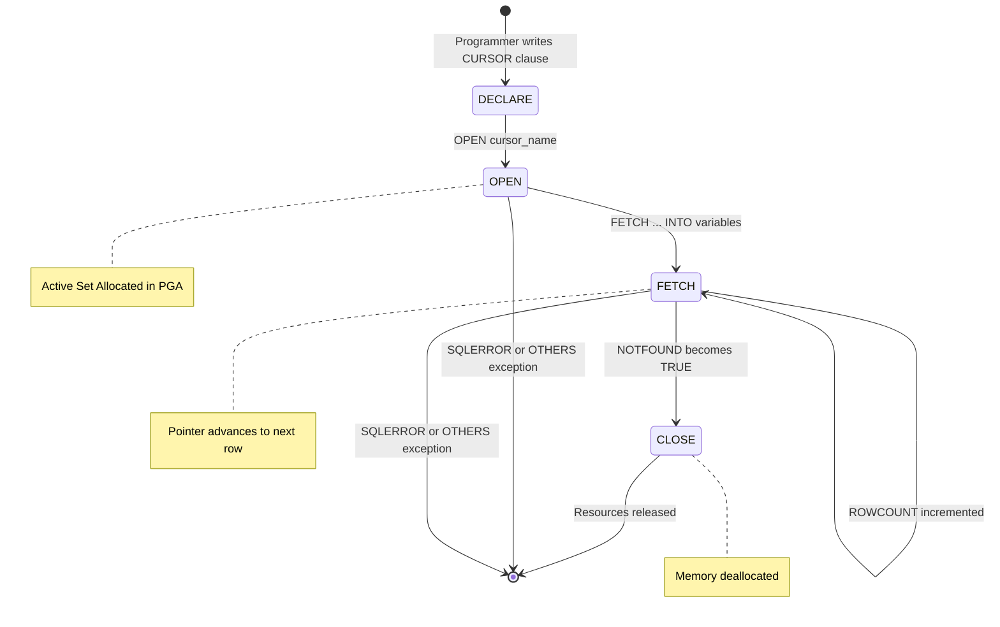
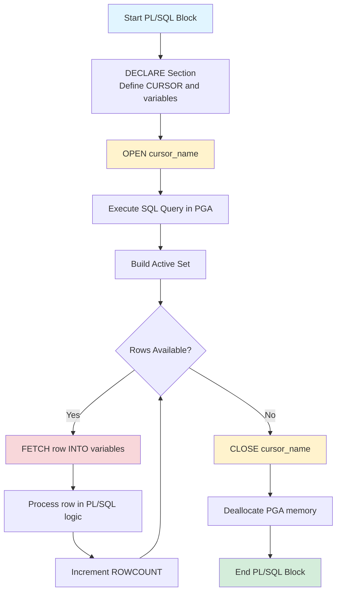
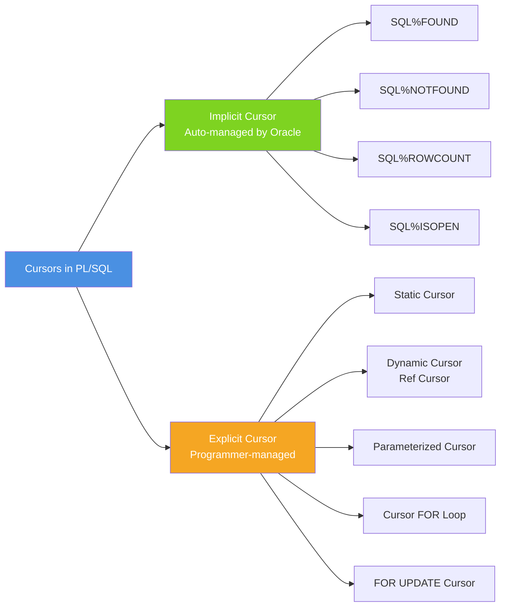
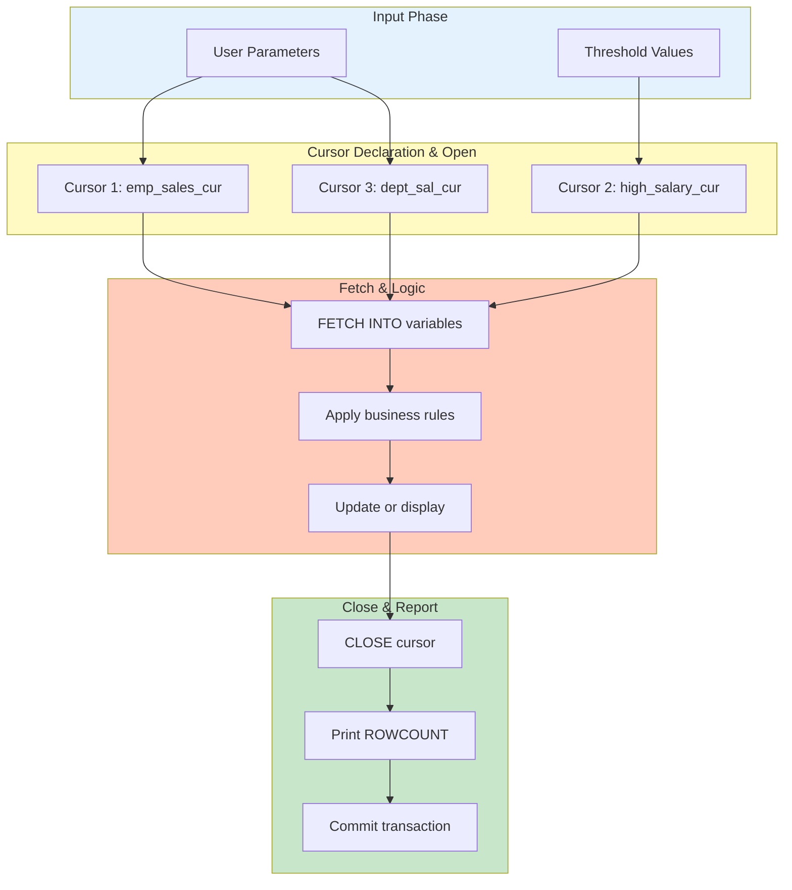

# Creation of cursors

<!-- SECTION_1_START -->
# Creation of Cursors in PL/SQL

## 1.1 Formal Academic Definition (KTU 2024 Syllabus)

In the context of **PL/SQL** (Procedural Language/Structured Query Language) as prescribed under the **DBMS Lab (PCCSL408)** course, a **Cursor** is a private **SQL work area** allocated by the Oracle server in the **Program Global Area (PGA)** memory to process the multi-row result set returned by an SQL statement, one row at a time. 

A cursor essentially acts as a **pointer** that traverses the rows of a result set, enabling the procedural engine to fetch, inspect, and manipulate data in a sequential, row-by-row manner. Without cursors, PL/SQL could only operate on single-row SQL statements, making it impossible to handle bulk data operations procedurally.

> [!IMPORTANT]
> **KTU 2024 Definition:** A cursor is a handle (or pointer) to a context area in the PGA memory where the parsed SQL statement and its resulting row set are stored. It encapsulates the **OPEN**, **FETCH**, and **CLOSE** lifecycle stages mandated by the SQL standard.

## 1.2 Conceptual Analogy — The Book Reading Analogy

Imagine you walk into a massive library and ask the librarian: *"Give me the list of all engineering students who scored above 80%."* The librarian hands you a thick register with 500 pages of results.

You cannot read all 500 pages at once. Instead, you:
1. **Open** the register and place your finger on the first page.
2. **Read (Fetch)** the first entry — name, roll number, mark.
3. Move your finger to the next page — **Fetch Next**.
4. Continue until the last page — **Cursor reaches NOTFOUND**.
5. **Close** the register and return it to the librarian.

In this analogy:
- The **library register** = the cursor work area in memory.
- **Your finger** = the cursor pointer.
- **Reading each page** = the `FETCH` operation.
- **Closing the register** = the `CLOSE` operation.

This is exactly how an **explicit cursor** works in PL/SQL!

## 1.3 Why Cursors Are Required — Engineering Motivation

In real-world enterprise applications built using Oracle (which KTU expects students to practice in the lab), cursors are vital for:

- **Row-by-row processing** in batch jobs (e.g., payroll processing for thousands of employees).
- **Procedural validation logic** that cannot be expressed in a single SQL statement.
- **Data migration** between legacy and modern schemas.
- **Generating complex reports** requiring per-row calculations.

> [!NOTE]
> **Physical Constants/Metrics:**
> - **Default Cursor Memory:** Cursors in Oracle occupy memory in the **PGA**, with the default cursor cache size being **50 cursors** (configurable via the `OPEN_CURSORS` initialization parameter, max value **255**).
> - **Implicit Cursor SQL%ROWCOUNT default:** Returns **0** if no DML affects any row.

<!-- SECTION_1_END -->

<!-- SECTION_2_START -->
# Deep Theoretical Analysis & KTU High-Yield Formula Sheet

## 2.1 Classification of Cursors

PL/SQL cursors are classified into two broad categories. KTU examiners frequently ask students to differentiate between them in 3-mark short-answer questions.

### 2.1.1 Implicit Cursors
These are **automatically created and managed by the Oracle engine** whenever a DML statement (`INSERT`, `UPDATE`, `DELETE`) or a single-row `SELECT...INTO` is executed. The programmer does **not** declare, open, fetch, or close them.

- **Lifecycle:** Automated by the SQL engine.
- **Reference Name:** Always referred to as `SQL`.
- **Best For:** Single-row operations and quick DML feedback.

### 2.1.2 Explicit Cursors
These are **manually programmed** by the developer for `SELECT` statements that return **more than one row**. The programmer has full control over the cursor's lifecycle using four explicit commands: `DECLARE`, `OPEN`, `FETCH`, and `CLOSE`.

- **Lifecycle:** Fully controlled by the programmer.
- **Use Case:** Multi-row query processing, batch updates, complex business logic.

### 2.1.3 Cursor Sub-Types (Advanced — KTU Module Coverage)

| Sub-Type | Description | Best Use Case |
|---|---|---|
| **Static Cursor** | SQL query is hardcoded at compile time | Fixed business logic |
| **Dynamic Cursor (Ref Cursor)** | SQL query is built at runtime using a string | Flexible reporting, ad-hoc queries |
| **Parameterized Cursor** | Explicit cursor accepting input parameters | Reusable queries with varying filters |
| **Cursor FOR Loop** | Implicit cursor lifecycle inside a `FOR` loop construct | Concise row processing |

## 2.2 The Four-Stage Explicit Cursor Lifecycle

Every explicit cursor traverses through four mandatory stages. KTU frequently diagrams this in 7-mark questions.

### Stage 1 — DECLARE
The cursor is declared in the `DECLARE` section of a PL/SQL block. This phase involves **binding** the SQL query but **does not yet execute** it.

```sql
CURSOR cursor_name [ (parameter datatype, ...) ] 
IS select_statement;
```

### Stage 2 — OPEN
Executing `OPEN cursor_name` triggers the SQL engine to:
1. Parse the SQL query.
2. Bind host variables.
3. Execute the query and identify the **active set** (result rows).
4. Position the pointer at the **first row**.

### Stage 3 — FETCH
`FETCH cursor_name INTO variable_list;` retrieves the **current row** into PL/SQL variables and advances the pointer by one row. This step is repeated inside a loop until all rows are consumed.

### Stage 4 — CLOSE
`CLOSE cursor_name;` releases the active set from memory, ending the cursor's existence and freeing PGA resources.

## 2.3 Cursor Attributes — The KTU High-Yield Cheat Sheet

Oracle provides four implicit cursor attributes that return `BOOLEAN` or `INTEGER` values. These are extremely high-yield for KTU 3-mark questions.

| Attribute | Data Type | Returns TRUE When | Typical Use |
|---|---|---|---|
| `%FOUND` | `BOOLEAN` | The most recent `FETCH` returned a row | Loop continuation check |
| `%NOTFOUND` | `BOOLEAN` | The most recent `FETCH` returned no row | Loop termination check |
| `%ISOPEN` | `BOOLEAN` | The cursor is currently open | Resource leak detection |
| `%ROWCOUNT` | `INTEGER` | Total number of rows fetched so far | Progress tracking, audit logs |

> [!NOTE]
> **Reference Notation:** For implicit cursors, the attribute is prefixed with `SQL` (e.g., `SQL%FOUND`, `SQL%ROWCOUNT`). For explicit cursors, the cursor name is used (e.g., `emp_cur%FOUND`).

## 2.4 KTU High-Yield Formula Sheet

$$
\text{Cursor Memory} = \text{Pointer} + \text{Active Set} + \text{Parse Information}
$$

$$
\text{Active Set Size} = \sum_{i=1}^{n} \text{Row}_i
$$

$$
\text{Loop Termination Condition} \Rightarrow c\_name\%\text{NOTFOUND} = \text{TRUE}
$$

$$
\text{Default Open Cursors Limit} = 50 \quad \text{(configurable up to 255)}
$$

| Component | Syntax | Purpose |
|---|---|---|
| Cursor Declaration | `CURSOR c IS SELECT ...;` | Logical binding of query |
| Cursor Opening | `OPEN c;` | Allocates memory, executes query |
| Cursor Fetching | `FETCH c INTO v1, v2;` | Retrieves one row at a time |
| Cursor Closing | `CLOSE c;` | Releases PGA memory |
| Parameterized Cursor | `CURSOR c(p NUMBER) IS ... WHERE id=p;` | Reusable with runtime filters |
| Cursor FOR Loop | `FOR rec IN c LOOP ... END LOOP;` | Auto-manages OPEN/FETCH/CLOSE |

## 2.5 Real-World Engineering Utility

- **Banking Systems:** Cursors process thousands of transactions nightly for interest calculation.
- **ETL Pipelines:** Cursor-based row processing in data warehouses like Oracle Exadata.
- **ERP Modules:** SAP, Oracle E-Business Suite — cursors drive payroll, invoice generation.
- **Audit Logging:** `%ROWCOUNT` is used to count DML-affected rows for compliance reporting.

<!-- SECTION_2_END -->

<!-- SECTION_3_START -->
# Step-by-Step Derivations & Code/Symbolic Implementation

## 3.1 Explicit Cursor — Canonical Worked Example

**Problem Statement (KTU Style):** Write a PL/SQL block to display the name and salary of all employees from the `employee` table whose department is 'SALES' using an explicit cursor. Handle all edge cases.

### 3.1.1 Mathematical/Logical Decomposition of the Problem

Let $E = \{e_1, e_2, \ldots, e_n\}$ be the active set returned by the SQL query.

For each $e_i \in E$, we want to extract:
- $e_i.\text{ename}$ → mapped to PL/SQL variable `v_ename`
- $e_i.\text{sal}$ → mapped to PL/SQL variable `v_sal`

The loop condition is:
$$
\text{WHILE } c\%\text{NOTFOUND} = \text{FALSE DO}
$$

The process terminates when:
$$
c\%\text{ROWCOUNT} = n
$$

### 3.1.2 Complete Production-Grade PL/SQL Code

```sql
SET SERVEROUTPUT ON;

DECLARE
    -- Stage 1: DECLARE
    CURSOR emp_sales_cur IS
        SELECT ename, sal
        FROM employee
        WHERE dept = 'SALES';
    
    -- Host variables to hold fetched values
    v_ename  employee.ename%TYPE;
    v_sal    employee.sal%TYPE;
    
    -- Counter for tracking rows processed
    v_row_num INTEGER := 0;
    
BEGIN
    -- Stage 2: OPEN
    OPEN emp_sales_cur;
    
    -- Stage 3: FETCH in a loop
    LOOP
        FETCH emp_sales_cur INTO v_ename, v_sal;
        
        -- Boundary check: exit when no more rows
        EXIT WHEN emp_sales_cur%NOTFOUND;
        
        -- Increment row counter
        v_row_num := v_row_num + 1;
        
        -- Display the row
        DBMS_OUTPUT.PUT_LINE('Row ' || v_row_num || 
                             ' -> Employee: ' || v_ename || 
                             ', Salary: ' || v_sal);
    END LOOP;
    
    -- Stage 4: CLOSE
    CLOSE emp_sales_cur;
    
    -- Final summary using cursor attribute
    DBMS_OUTPUT.PUT_LINE('--------------------------------------');
    DBMS_OUTPUT.PUT_LINE('Total rows processed: ' || v_row_num);
    
EXCEPTION
    -- Strict error logging
    WHEN OTHERS THEN
        DBMS_OUTPUT.PUT_LINE('Error Code: ' || SQLCODE);
        DBMS_OUTPUT.PUT_LINE('Error Message: ' || SQLERRM);
        -- Defensive cleanup: close cursor if still open
        IF emp_sales_cur%ISOPEN THEN
            CLOSE emp_sales_cur;
        END IF;
END;
/
```

### 3.1.3 Step-by-Step Line-by-Line Explanation

1. **`SET SERVEROUTPUT ON;`** → Enables Oracle to display output from `DBMS_OUTPUT` to the SQL*Plus console. Without this, no output will be visible.
2. **`DECLARE ... BEGIN ... EXCEPTION ... END;`** → Standard PL/SQL anonymous block structure.
3. **`CURSOR emp_sales_cur IS SELECT ...;`** → Stage 1 declaration. Query is bound but not executed.
4. **`v_ename employee.ename%TYPE;`** → Uses `%TYPE` attribute to inherit the column's data type. Defensive programming practice.
5. **`OPEN emp_sales_cur;`** → Stage 2. Oracle parses, binds, executes the query, and positions the pointer.
6. **`LOOP ... FETCH ... INTO ...;`** → Stage 3. Each iteration pulls one row into the variables.
7. **`EXIT WHEN emp_sales_cur%NOTFOUND;`** → Critical boundary check. Without this, the loop becomes infinite when the result set is exhausted.
8. **`CLOSE emp_sales_cur;`** → Stage 4. Releases PGA memory.
9. **`EXCEPTION WHEN OTHERS ...`** → Defensive error handler. Always attempt to close the cursor if it is still open to prevent memory leaks.

## 3.2 Cursor FOR Loop — Optimized Variant

**Problem Statement:** Rewrite the above using a Cursor FOR loop to demonstrate the more concise auto-managed lifecycle.

```sql
SET SERVEROUTPUT ON;

DECLARE
    CURSOR emp_sales_cur IS
        SELECT ename, sal
        FROM employee
        WHERE dept = 'SALES';
BEGIN
    -- Implicit OPEN, FETCH, CLOSE managed by FOR loop
    FOR emp_rec IN emp_sales_cur LOOP
        DBMS_OUTPUT.PUT_LINE('Employee: ' || emp_rec.ename || 
                             ', Salary: ' || emp_rec.sal);
    END LOOP;
    
    -- Cursor is automatically closed here
    DBMS_OUTPUT.PUT_LINE('Loop terminated. Cursor auto-closed.');
EXCEPTION
    WHEN OTHERS THEN
        DBMS_OUTPUT.PUT_LINE('Error: ' || SQLERRM);
END;
/
```

> [!TIP]
> **Exam Tip:** A KTU 14-mark question often asks: *"Demonstrate the use of a Cursor FOR loop and explicitly mention when the cursor is opened and closed."* The answer: **The cursor is opened implicitly before the first iteration and closed implicitly after the last iteration or when the loop exits abnormally.**

## 3.3 Parameterized Cursor — Reusable Query Pattern

**Problem Statement:** Write a PL/SQL block using a parameterized cursor to fetch employees whose salary exceeds a user-supplied threshold.

```sql
SET SERVEROUTPUT ON;

DECLARE
    -- Parameterized cursor declaration
    CURSOR high_salary_cur(p_threshold NUMBER) IS
        SELECT ename, sal
        FROM employee
        WHERE sal > p_threshold;
BEGIN
    -- Call cursor with threshold = 50000
    DBMS_OUTPUT.PUT_LINE('--- Employees with salary > 50000 ---');
    FOR rec IN high_salary_cur(50000) LOOP
        DBMS_OUTPUT.PUT_LINE(rec.ename || ' : ' || rec.sal);
    END LOOP;
    
    -- Reuse same cursor with different parameter
    DBMS_OUTPUT.PUT_LINE('--- Employees with salary > 75000 ---');
    FOR rec IN high_salary_cur(75000) LOOP
        DBMS_OUTPUT.PUT_LINE(rec.ename || ' : ' || rec.sal);
    END LOOP;
END;
/
```

### 3.3.1 Mathematical Representation of Parameterized Cursor

Let the threshold be denoted as $T$. The active set for a given $T$ is:

$$
E(T) = \{e \in \text{employee} \mid e.\text{sal} > T\}
$$

For two different thresholds $T_1$ and $T_2$, the cursor produces two distinct active sets:

$$
E(T_1) \neq E(T_2) \quad \text{when } T_1 \neq T_2
$$

This is the power of parameterized cursors — **reusability with varying inputs**.

## 3.4 Implicit Cursor — SQL%ROWCOUNT Example

**Problem Statement:** Update salaries of all employees in department 'IT' by 10%. Display the number of rows affected using implicit cursor attributes.

```sql
SET SERVEROUTPUT ON;

BEGIN
    -- DML statement triggers implicit cursor
    UPDATE employee
    SET sal = sal * 1.10
    WHERE dept = 'IT';
    
    -- Using SQL%ROWCOUNT to report
    DBMS_OUTPUT.PUT_LINE('Total rows updated: ' || SQL%ROWCOUNT);
    
    -- Commit the transaction
    COMMIT;
    
EXCEPTION
    WHEN OTHERS THEN
        ROLLBACK;
        DBMS_OUTPUT.PUT_LINE('Update failed: ' || SQLERRM);
END;
/
```

## 3.5 Cursor with FOR UPDATE — Locking Rows for Modification

**Problem Statement:** Use a `FOR UPDATE` cursor to lock employee rows and apply a department-specific salary revision.

```sql
SET SERVEROUTPUT ON;

DECLARE
    CURSOR dept_sal_cur(p_dept VARCHAR2) IS
        SELECT ename, sal
        FROM employee
        WHERE dept = p_dept
        FOR UPDATE NOWAIT;   -- Locks the rows, fails fast if locked elsewhere
BEGIN
    FOR rec IN dept_sal_cur('HR') LOOP
        UPDATE employee
        SET sal = sal + 5000
        WHERE CURRENT OF dept_sal_cur;  -- Updates the currently fetched row
        
        DBMS_OUTPUT.PUT_LINE('Updated: ' || rec.ename);
    END LOOP;
    
    COMMIT;
END;
/
```

### 3.5.1 Lock Acquisition Semantics

The `FOR UPDATE` clause acquires **row-level locks** on every row in the active set:

$$
\text{Locked Rows} = \{ r \mid r \in E(\text{SQL}) \}
$$

Other sessions attempting to modify the same rows will be **blocked** (or immediately fail with `NOWAIT`) until the current transaction commits or rolls back.

<!-- SECTION_4_END -->

<!-- SECTION_4_START -->
# Structural Diagrams & Schematics

## 4.1 Explicit Cursor Lifecycle — Mermaid State Diagram



## 4.2 Cursor Operation Flow — Mermaid Flowchart



## 4.3 Cursor Type Classification — Block Diagram



## 4.4 Sequential Processing Topology — Multi-Cursor Architecture



<!-- SECTION_5_START -->
# KTU 2024 Scheme Examination Question Bank & Topic Recap

## 5.1 Part A — Short Answer Questions (3 Marks Each)

### Question 1 [KTU University Exam - July 2024]
**Q: What is a cursor in PL/SQL? Differentiate between implicit and explicit cursors.**

**Model Answer (Valuation Key — 3 Marks):**

A cursor is a **private SQL work area** allocated in the Oracle **Program Global Area (PGA)** memory to process the result set of an SQL statement one row at a time. **[Definition: 1 Mark]**

| Feature | Implicit Cursor | Explicit Cursor |
|---|---|---|
| Declaration | Auto-declared by Oracle | Programmer declares via `CURSOR` |
| Lifecycle | Auto-managed (no OPEN/FETCH/CLOSE) | Manually managed |
| SQL Statements | DML (`INSERT`, `UPDATE`, `DELETE`) | `SELECT` returning multiple rows |
| Reference Name | `SQL` | Cursor name (e.g., `emp_cur`) |
| Attributes | `SQL%FOUND`, `SQL%NOTFOUND`, `SQL%ROWCOUNT` | `c_name%FOUND`, `c_name%NOTFOUND`, etc. |

**[Tabular differentiation: 2 Marks]**

---

### Question 2 [KTU University Exam - Dec 2023]
**Q: List any four cursor attributes in PL/SQL. Explain `%NOTFOUND` and `%ROWCOUNT`.**

**Model Answer:**

The four cursor attributes are: **`%FOUND`**, **`%NOTFOUND`**, **`%ISOPEN`**, and **`%ROWCOUNT`**. **[Listing: 1 Mark]**

- **`%NOTFOUND`:** Returns `TRUE` if the most recent `FETCH` statement did not return a row. Used as the primary loop termination condition in explicit cursor processing. **[Explanation: 1 Mark]**

- **`%ROWCOUNT`:** Returns an `INTEGER` indicating the total number of rows fetched so far by the cursor. Useful for tracking progress and audit logging. **[Explanation: 1 Mark]**

---

## 5.2 Part B — Long Answer Questions (14 Marks Each)

### Question A (14 Marks) [KTU University Exam - July 2024]

**Q: (a)** Explain the explicit cursor lifecycle in PL/SQL with a neat diagram. Describe the role of each stage. **[7 Marks]**

**(b)** Write a PL/SQL block to display the name, salary, and department of all employees earning more than ₹50,000 using an explicit cursor. Use proper exception handling. **[7 Marks]**

---

#### Model Solution for (a) — Cursor Lifecycle **[7 Marks]**

The explicit cursor goes through four stages:

1. **DECLARE** — The cursor is declared in the `DECLARE` section. Oracle parses the query for syntax validation but does not execute it. **[Stage explanation: 1 Mark]**

2. **OPEN** — The `OPEN` command triggers Oracle to:
   - Allocate PGA memory for the active set.
   - Parse, bind, and execute the query.
   - Position the cursor pointer at the **first row**. **[Stage explanation: 1.5 Marks]**

3. **FETCH** — Each `FETCH` retrieves the current row into PL/SQL variables and advances the pointer. The loop continues until `%NOTFOUND` is `TRUE`. **[Stage explanation: 1.5 Marks]**

4. **CLOSE** — The `CLOSE` command deallocates the active set from memory and releases PGA resources. The cursor cannot be used after closing unless reopened. **[Stage explanation: 1 Mark]**

**[Neat diagram: 2 Marks]** — Refer to Section 4.1 Mermaid state diagram.

---

#### Model Solution for (b) — PL/SQL Block **[7 Marks]**

```sql
SET SERVEROUTPUT ON;

DECLARE
    -- DECLARE stage [1 Mark]
    CURSOR high_earner_cur IS
        SELECT ename, sal, dept
        FROM employee
        WHERE sal > 50000;
    
    v_ename  employee.ename%TYPE;
    v_sal    employee.sal%TYPE;
    v_dept   employee.dept%TYPE;
    v_count  INTEGER := 0;
BEGIN
    -- OPEN stage [0.5 Marks]
    OPEN high_earner_cur;
    
    -- FETCH loop [2 Marks]
    LOOP
        FETCH high_earner_cur INTO v_ename, v_sal, v_dept;
        EXIT WHEN high_earner_cur%NOTFOUND;
        
        v_count := v_count + 1;
        DBMS_OUTPUT.PUT_LINE(v_count || '. ' || v_ename || 
                             ' | ' || v_dept || 
                             ' | ' || v_sal);
    END LOOP;
    
    -- CLOSE stage [0.5 Marks]
    CLOSE high_earner_cur;
    
    DBMS_OUTPUT.PUT_LINE('Total employees: ' || v_count);
    
EXCEPTION
    -- Exception handling [2 Marks]
    WHEN NO_DATA_FOUND THEN
        DBMS_OUTPUT.PUT_LINE('No employees found.');
    WHEN OTHERS THEN
        DBMS_OUTPUT.PUT_LINE('Error: ' || SQLERRM);
        IF high_earner_cur%ISOPEN THEN
            CLOSE high_earner_cur;
        END IF;
END;
/
```

**[Valuation Key Breakdown:]**
- Cursor declaration: **1 Mark**
- Variable declarations: **0.5 Marks**
- OPEN, FETCH loop, CLOSE: **3 Marks**
- Proper exception handling with `%ISOPEN` check: **2 Marks**
- Final output using `%ROWCOUNT` or counter: **0.5 Marks**

---

### Question B (14 Marks) [KTU University Exam - Dec 2023]

**Q: (a)** What is a parameterized cursor? Write a PL/SQL block using a parameterized cursor to display employees of a department entered by the user. **[7 Marks]**

**(b)** Explain implicit cursor attributes with an example using `UPDATE` and `SQL%ROWCOUNT`. **[7 Marks]**

---

#### Model Solution for (a) — Parameterized Cursor **[7 Marks]**

A **parameterized cursor** is an explicit cursor that accepts input parameters at the time of opening, allowing the same cursor definition to be reused with different filter values. **[Definition: 1 Mark]**

```sql
SET SERVEROUTPUT ON;
SET VERIFY OFF;

DECLARE
    -- Parameterized cursor [1 Mark]
    CURSOR emp_dept_cur(p_dept VARCHAR2) IS
        SELECT ename, sal
        FROM employee
        WHERE dept = p_dept;
    
    v_input_dept VARCHAR2(20);
BEGIN
    -- Accept user input [1 Mark]
    v_input_dept := '&dept_name';
    
    DBMS_OUTPUT.PUT_LINE('Employees in ' || v_input_dept || ':');
    DBMS_OUTPUT.PUT_LINE('---------------------------');
    
    -- Pass parameter to cursor [1 Mark]
    FOR rec IN emp_dept_cur(v_input_dept) LOOP
        DBMS_OUTPUT.PUT_LINE(rec.ename || ' : ' || rec.sal);
    END LOOP;
    
    DBMS_OUTPUT.PUT_LINE('---------------------------');
    DBMS_OUTPUT.PUT_LINE('Display complete.');
EXCEPTION
    WHEN OTHERS THEN
        DBMS_OUTPUT.PUT_LINE('Error: ' || SQLERRM);
END;
/
```

**[Valuation Key Breakdown:]**
- Definition of parameterized cursor: **1 Mark**
- Cursor declaration with parameter: **1 Mark**
- User input via `&` substitution: **1 Mark**
- Cursor FOR loop or OPEN/FETCH/CLOSE: **2 Marks**
- Exception handling: **1 Mark**
- Correct compilation and output: **1 Mark**

---

#### Model Solution for (b) — Implicit Cursor Attributes **[7 Marks]**

Implicit cursors are **automatically created by Oracle** for DML statements. They are referenced using the keyword `SQL`. **[Definition: 1 Mark]**

The four implicit cursor attributes are:

| Attribute | Meaning |
|---|---|
| `SQL%FOUND` | `TRUE` if DML affected at least one row |
| `SQL%NOTFOUND` | `TRUE` if DML affected zero rows |
| `SQL%ISOPEN` | Always `FALSE` for implicit cursors (auto-closed) |
| `SQL%ROWCOUNT` | Number of rows affected by the DML |

**[Tabular listing: 2 Marks]**

**Example using `UPDATE` and `SQL%ROWCOUNT`:**

```sql
SET SERVEROUTPUT ON;

DECLARE
    v_dept_name VARCHAR2(20) := 'SALES';
BEGIN
    -- DML triggers implicit cursor [1 Mark]
    UPDATE employee
    SET sal = sal * 1.15
    WHERE dept = v_dept_name;
    
    -- Using SQL%ROWCOUNT [1 Mark]
    IF SQL%FOUND THEN
        DBMS_OUTPUT.PUT_LINE('Update successful.');
        DBMS_OUTPUT.PUT_LINE('Rows updated: ' || SQL%ROWCOUNT);
    ELSE
        DBMS_OUTPUT.PUT_LINE('No employees in ' || v_dept_name);
    END IF;
    
    COMMIT;
EXCEPTION
    WHEN OTHERS THEN
        ROLLBACK;
        DBMS_OUTPUT.PUT_LINE('Error: ' || SQLERRM);
END;
/
```

**[Valuation Key Breakdown:]**
- Definition of implicit cursor: **1 Mark**
- Listing attributes with meanings: **2 Marks**
- Correct DML statement: **1 Mark**
- Proper use of `SQL%FOUND` and `SQL%ROWCOUNT`: **2 Marks**
- Exception handling with ROLLBACK: **1 Mark**

---

## 5.3 KTU Examiner's Valuation Warning / Pitfall Callout

> [!WARNING]
> **Common Mistakes That Cost Marks in KTU Lab/ESE:**
> 
> 1. **Forgetting `SET SERVEROUTPUT ON;`** — The block will compile and execute, but no output will be visible. Examiners may mark the output step as **0/2** if no display is produced.
> 
> 2. **Missing the `EXIT WHEN` / `%NOTFOUND` check** — This causes an **infinite loop** when the cursor exhausts all rows. The program will hang or throw `ORA-01403: no data found`. Examiners specifically look for this boundary check.
> 
> 3. **Not closing the cursor explicitly** — This leads to a **PGA memory leak**. In explicit cursor processing, always include `CLOSE cursor_name;` after the loop.
> 
> 4. **Confusing `SQL%ROWCOUNT` with explicit cursor syntax** — `SQL%ROWCOUNT` is for **implicit cursors only**. For explicit cursors, you must use `cursor_name%ROWCOUNT`.
> 
> 5. **Using `FETCH ... INTO` column order mismatch** — The number and order of variables in `INTO` **must exactly match** the SELECT list. A mismatch causes `ORA-06502: PL/SQL: numeric or value error`.
> 
> 6. **Forgetting to `COMMIT` after DML inside a cursor loop** — The transaction remains uncommitted. Use `COMMIT` after the `CLOSE` statement.
> 
> 7. **Using a cursor when a single SQL statement suffices** — Examiners deduct marks for inefficient code. Use cursors **only** when row-by-row procedural logic is genuinely required.

---

## 5.4 Topic Recap & Important Things to Remember

> [!NOTE]
> **Rapid Revision Checklist — Cursor Creation in PL/SQL**

### Core Definitions
- **Cursor** = Pointer to a memory area (PGA) holding the result set of an SQL query.
- **Implicit Cursor** = Auto-managed by Oracle for DML and single-row `SELECT...INTO`.
- **Explicit Cursor** = Programmer-declared for multi-row `SELECT` queries.

### The Four-Stage Lifecycle (Memorize!)
1. **DECLARE** — Bind the query (no execution).
2. **OPEN** — Parse, execute, allocate active set.
3. **FETCH** — Retrieve rows one at a time into PL/SQL variables.
4. **CLOSE** — Release PGA memory.

### The Four Cursor Attributes
- `%FOUND` — `TRUE` if last fetch returned a row.
- `%NOTFOUND` — `TRUE` if last fetch returned no row (loop terminator).
- `%ISOPEN` — `TRUE` if cursor is currently open.
- `%ROWCOUNT` — Integer count of rows fetched so far.

### Critical Syntax Patterns
- **Declaration:** `CURSOR c(p TYPE) IS SELECT ...;`
- **Parameterized:** `OPEN c(value); FOR rec IN c(value) LOOP ... END LOOP;`
- **For Update:** `... FOR UPDATE NOWAIT;` + `WHERE CURRENT OF c;`
- **Implicit Reference:** `SQL%FOUND`, `SQL%NOTFOUND`, `SQL%ROWCOUNT`.

### Best Practices for KTU Lab Records
- Always begin with `SET SERVEROUTPUT ON;`.
- Always use `%TYPE` for variable declarations to inherit column data types.
- Always include `EXIT WHEN cursor_name%NOTFOUND;` inside explicit cursor loops.
- Always include an `EXCEPTION WHEN OTHERS` block.
- Always close the cursor inside the exception handler if `%ISOPEN` is `TRUE`.
- Always `COMMIT` after DML operations to release row-level locks.

### Parameterized vs Non-Parameterized Cursor
- **Non-parameterized** = fixed query at compile time.
- **Parameterized** = flexible query accepting runtime inputs; promotes **reusability**.

### Cursor FOR Loop — The Concise Pattern
- **Auto-OPENs** before first iteration.
- **Auto-FETCHes** into an implicit record variable.
- **Auto-CLOSEs** after loop exit (normal or abnormal).

### Common Exam Triggers
- "Differentiate implicit vs explicit" → 3-mark question.
- "Write a PL/SQL block using a cursor" → 7 or 14-mark question.
- "Explain cursor attributes" → 3 or 7-mark question.
- "What happens if you don't close a cursor?" → Memory leak in PGA.

<!-- SECTION_5_END -->
