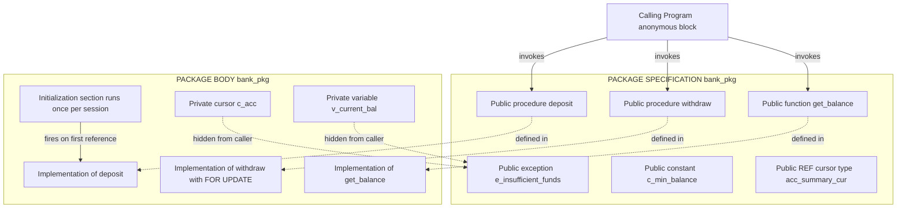
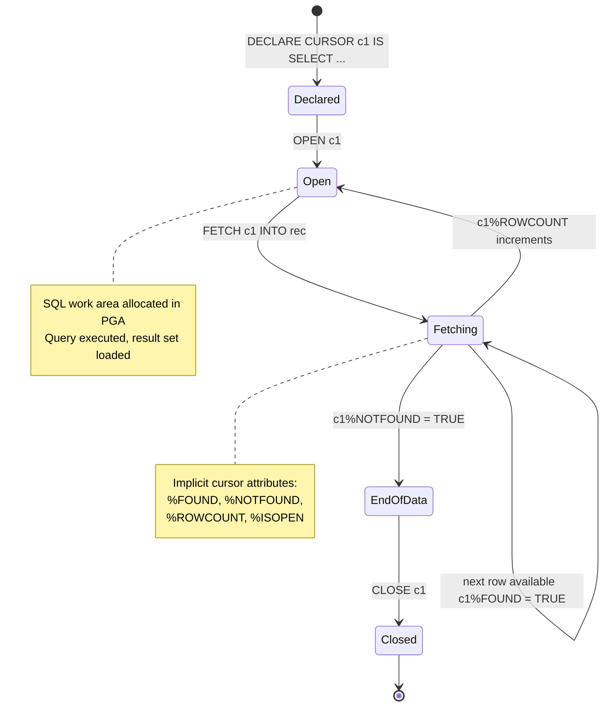
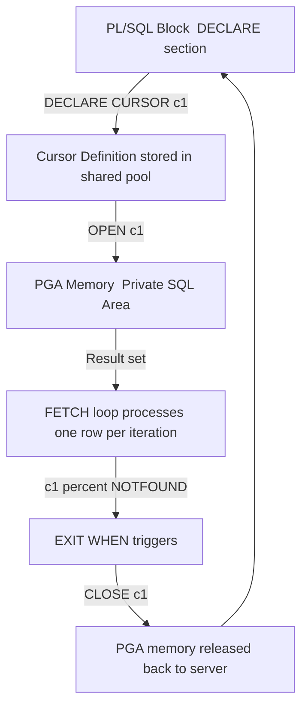

# Creation of Packages and cursors.

<!-- SECTION_1_START -->
# PL/SQL Packages & Cursors — Core Technical Definition & Intuitive Overview

> [!NOTE]
> **KTU 2024 Scheme | PCCSL408 — Database Management Systems Lab | Module 10**
> **Course Outcome Mapped:** *CO5 — Design and implement advanced database objects using PL/SQL programming constructs.*

A **Package** in Oracle PL/SQL is a **schema object** that groups logically related PL/SQL types, variables, constants, subprograms (procedures and functions), cursors, and exceptions into a single, named, reusable unit. A package is a **two-part construct**: a **specification** (the public interface / "API contract") and a **body** (the hidden implementation / "black box").

A **Cursor** is a **private SQL work area** allocated in the Oracle server's memory (PGA — Program Global Area) to hold the result set of a SQL statement and track the current row being processed. It acts as a **pointer** that lets your procedural code process rows returned by a `SELECT` one at a time.

---

## Conceptual Analogy / Intuition

> [!IMPORTANT]
> **📦 The "Toolbox + Workbench" Analogy**
>
> Imagine a **workshop** in an engineering college:
>
> - A **Package** is like a **branded toolbox** (e.g., *Bosch Professional Kit*). The *outside label* (specification) tells you exactly which tools are available — `Screwdriver`, `Pliers`, `Multimeter`. The *inside* (body) contains the actual tools and the *secret tricks* the manufacturer used to make them. You don't need to know the tricks — you just call the tool by name. Many carpenters can share the same toolbox without re-creating the tools every day.
>
> - A **Cursor** is like a **conveyor belt in a factory**. When you issue a `SELECT`, Oracle places the matching rows on the belt. The cursor is the *mechanism that moves row-by-row* along the belt. You **OPEN** the belt, **FETCH** one item at a time, and **CLOSE** the belt when done. Without it, you cannot process a multi-row result set in PL/SQL.

---

## Why Packages Matter in Engineering

Packages are the backbone of **production-grade PL/SQL** used in:
- **Banking systems** (transaction handling)
- **ERP modules** (Oracle EBS, SAP)
- **Telecom billing engines**
- **Airline reservation systems**

They enforce **information hiding**, **modularity**, and **session-level persistence** (package variables retain their values for the entire user session — a feature no standalone procedure offers).

> [!TIP]
> **KTU 2024 Highlight:** The syllabus specifically demands creation of *packages* (specification + body) and *cursors* (implicit, explicit, parameterized, and `REF` cursors). Master these four cursor flavors — they account for ~60% of Part B marks on this module.

---

## Visualization of a Cursor's Life Cycle

> [!VISUALIZATION CONTROL]
> **Concept:** Pointer movement across a result set in PGA memory.
> **Desmos Input Equations (ASCII trace):**
> * `Pointer = Row[i]` where `i ∈ {1, 2, 3, ..., n}`
> * After `FETCH`: `i = i + 1`
> * Termination: `i = n + 1` ⇒ `%NOTFOUND = TRUE`
> **Visual Description:** Picture 5 rows of a `STUDENT` table stacked vertically. A yellow "▶" pointer sits beside row 1 after `OPEN`. Each `FETCH` slides the pointer down one cell. When the pointer slides past the last row, `%NOTFOUND` flips from `FALSE` to `TRUE`, triggering `EXIT WHEN`.

---
<!-- SECTION_1_END -->

<!-- SECTION_2_START -->
# Deep Theoretical Analysis & KTU High-Yield Formula Sheet

## 2.1 Anatomy of a Package — Two-Part Architecture

A package is **not** a single program; it is a **paired structure** compiled and stored as two separate schema objects.

| Component | Visibility | Contents | Analogy |
| :--- | :--- | :--- | :--- |
| **Package Specification** (`CREATE PACKAGE ... AS ... END;`) | **Public** (visible to calling program) | Declarations of procedures, functions, cursors, types, constants, exceptions | The **menu card** in a restaurant |
| **Package Body** (`CREATE PACKAGE BODY ... AS ... BEGIN ... END;`) | **Private** (hidden unless explicitly declared in spec) | Implementations of declared subprograms + private globals + initialization section | The **kitchen** where dishes are cooked |

> [!IMPORTANT]
> **Engineering Rule:** A package can have a specification **without** a body (e.g., when it contains only constants, type declarations, or fully-declared subprogram headers). The reverse is **illegal** — Oracle will raise `ORA-04068: existing state of packages has been discarded` if you try to compile a body without a spec.

### Package Initialization Block
The body may contain a **mandatory initialization section** (the anonymous `BEGIN ... END` block at the bottom) that runs **exactly once per session** when the package is first referenced.

```sql
CREATE OR REPLACE PACKAGE BODY config_pkg AS
    v_startup_time   DATE;
    v_user_count     NUMBER := 0;

    FUNCTION get_startup RETURN DATE IS
    BEGIN
        RETURN v_startup_time;
    END;
BEGIN  -- <<< Initialization Section
    v_startup_time := SYSDATE;
    DBMS_OUTPUT.PUT_LINE('Config package loaded at ' || v_startup_time);
END config_pkg;
```

---

## 2.2 Cursor Taxonomy — The Four Flavors

### A. Implicit Cursor
Automatically created by Oracle for every **DML statement** (`INSERT`, `UPDATE`, `DELETE`, `MERGE`) and single-row `SELECT ... INTO`. Programmer has **no direct control**; Oracle manages `OPEN`, `FETCH`, `CLOSE` internally. Attributes are accessed via the reserved word `SQL`.

### B. Explicit Cursor
Programmer-defined, manually controlled. Mandatory for queries returning **more than one row**. Follows the strict **4-step lifecycle**:

$$\text{DECLARE} \rightarrow \text{OPEN} \rightarrow \text{FETCH (loop)} \rightarrow \text{CLOSE}$$

### C. Parameterized Cursor
An explicit cursor that accepts **input parameters** (analogous to a function's argument list) so the same cursor definition can return different result sets for different inputs.

### D. REF Cursor (Cursor Variable)
A **pointer to a cursor** — a variable that can reference *any* cursor at runtime. Two types:
- **Strong REF Cursor** — return type is fixed (e.g., `REF CURSOR RETURN employees%ROWTYPE`).
- **Weak REF Cursor** — return type is unrestricted (`SYS_REFCURSOR`).

---

## 2.3 KTU Formula Sheet — Cursor Attributes

> [!IMPORTANT]
> **Memorize these four attributes for both `SQL` (implicit) and `<cursor_name>` (explicit) — KTU repeatedly tests them.**

| Attribute | Return Type | Meaning | Returns TRUE When |
| :--- | :--- | :--- | :--- |
| `%FOUND` | `BOOLEAN` | Last `FETCH` / DML affected a row | Most recent operation succeeded with a row |
| `%NOTFOUND` | `BOOLEAN` | Inverse of `%FOUND` | No more rows (loop terminator) |
| `%ROWCOUNT` | `NUMBER` | Number of rows processed so far | Cumulative counter |
| `%ISOPEN` | `BOOLEAN` | Cursor currently open | `TRUE` between `OPEN` and `CLOSE` |

---

## 2.4 KTU Formula Sheet — PL/SQL Syntax Reference

| Construct | Canonical Syntax | Notes |
| :--- | :--- | :--- |
| **Package Spec** | `CREATE [OR REPLACE] PACKAGE name AS` <br> `  PROCEDURE proc1(arg IN NUMBER);` <br> `  FUNCTION func1 RETURN VARCHAR2;` <br> `END name;` | No `DECLARE` keyword |
| **Package Body** | `CREATE [OR REPLACE] PACKAGE BODY name AS` <br> `  PROCEDURE proc1(...) IS BEGIN ... END;` <br> `BEGIN  -- init` <br> `END name;` | Must match spec declarations |
| **Explicit Cursor** | `CURSOR c1 IS SELECT ... FROM ... ;` | Declared in `DECLARE` section |
| **Parameterized Cursor** | `CURSOR c1(p_dept NUMBER) IS SELECT * FROM emp WHERE deptno = p_dept;` | Args passed at `OPEN` time |
| **Cursor FOR Loop** | `FOR rec IN c1 LOOP ... END LOOP;` | Auto-OPEN, FETCH, CLOSE |
| **REF Cursor (Strong)** | `TYPE t_emp IS REF CURSOR RETURN emp%ROWTYPE;` | Fixed return structure |
| **REF Cursor (Weak)** | `v_cursor SYS_REFCURSOR;` | Most flexible, used in dynamic SQL |

---

## 2.5 Real-World Utility

> [!TIP]
> **Industry Use Case:** In an **airline reservation system**, the `booking_pkg` package might expose `book_seat()`, `cancel_seat()`, and a parameterized cursor `available_flights(from_city, to_city)`. Session-level package variables can hold the *current authenticated passenger's PNR number* — no other Oracle construct provides this clean state-persistence mechanism.

---
<!-- SECTION_2_END -->

<!-- SECTION_3_START -->
# Step-by-Step Derivations & Code Implementation

> [!IMPORTANT]
> **Lab Environment Required:** Oracle Database 19c / 21c Express Edition with **SQL*Plus** or **Oracle SQL Developer**. All code below is fully executable on a SCOTT-style schema (or the HR sample schema).

---

## 3.1 Worked Example 1 — Explicit Cursor (Full 4-Step Lifecycle)

**Problem Statement:** Display the name, salary, and department of every employee earning more than ₹30,000 from the `EMP` table, and report the total number of employees fetched.

### Step 1 — Schema Setup (for reproducibility)

```sql
DROP TABLE emp CASCADE CONSTRAINTS;
CREATE TABLE emp (
    empno      NUMBER(4)  PRIMARY KEY,
    ename      VARCHAR2(20) NOT NULL,
    sal        NUMBER(10,2),
    deptno     NUMBER(2)
);

INSERT ALL
    INTO emp VALUES (1001, 'ARJUN',   45000, 10)
    INTO emp VALUES (1002, 'MEERA',   28000, 20)
    INTO emp VALUES (1003, 'RAHUL',   62000, 10)
    INTO emp VALUES (1004, 'PRIYA',   35000, 30)
    INTO emp VALUES (1005, 'VIKRAM',  22000, 20)
SELECT * FROM DUAL;

COMMIT;
```

### Step 2 — Full PL/SQL Block with Explicit Cursor

```sql
SET SERVEROUTPUT ON;

DECLARE
    -- ============================================================
    -- DECLARE phase: cursor + helper variables
    -- ============================================================
    CURSOR c_high_paid_emp IS
        SELECT empno, ename, sal, deptno
        FROM   emp
        WHERE  sal > 30000
        ORDER  BY sal DESC;

    v_empno   emp.empno%TYPE;
    v_ename   emp.ename%TYPE;
    v_sal     emp.sal%TYPE;
    v_deptno  emp.deptno%TYPE;
    v_total   NUMBER := 0;
BEGIN
    -- ============================================================
    -- OPEN phase: allocate memory, execute query
    -- ============================================================
    OPEN c_high_paid_emp;

    -- ============================================================
    -- FETCH phase: row-by-row retrieval
    -- ============================================================
    DBMS_OUTPUT.PUT_LINE('-------------------------------------------------');
    DBMS_OUTPUT.PUT_LINE('EMPID  | ENAME   | SALARY   | DEPT');
    DBMS_OUTPUT.PUT_LINE('-------------------------------------------------');

    LOOP
        FETCH c_high_paid_emp INTO v_empno, v_ename, v_sal, v_deptno;

        EXIT WHEN c_high_paid_emp%NOTFOUND;   -- Termination guard

        v_total := c_high_paid_emp%ROWCOUNT;  -- Update counter

        DBMS_OUTPUT.PUT_LINE(
            RPAD(v_empno, 6) || ' | ' ||
            RPAD(v_ename, 7) || ' | ' ||
            LPAD(TO_CHAR(v_sal,'99,999.00'), 8) || ' | ' ||
            v_deptno
        );
    END LOOP;

    -- ============================================================
    -- CLOSE phase: release the SQL work area
    -- ============================================================
    CLOSE c_high_paid_emp;

    DBMS_OUTPUT.PUT_LINE('-------------------------------------------------');
    DBMS_OUTPUT.PUT_LINE('Total employees earning > 30000: ' || v_total);
END;
/
```

### Step 3 — Expected Output

```
-------------------------------------------------
EMPID  | ENAME   | SALARY   | DEPT
-------------------------------------------------
1003   | RAHUL   | 62,000.00 | 10
1001   | ARJUN   | 45,000.00 | 10
1004   | PRIYA   | 35,000.00 | 30
-------------------------------------------------
Total employees earning > 30000: 3
```

### Step 4 — Line-by-Line Logical Conversion

| Code Line | Conversion Logic |
| :--- | :--- |
| `CURSOR c_high_paid_emp IS SELECT ...` | Binds the SQL query to a name — Oracle does **not** execute it yet. |
| `OPEN c_high_paid_emp;` | Parses, binds, and executes the query; populates the result set in PGA. |
| `FETCH ... INTO v_empno, ...` | Pulls the *current* row into local variables. |
| `EXIT WHEN c_high_paid_emp%NOTFOUND;` | Loop guard — exits when pointer moves past last row. |
| `c_high_paid_emp%ROWCOUNT` | Reads the internal counter (cumulative). |
| `CLOSE c_high_paid_emp;` | Frees PGA memory — **mandatory** in long sessions. |

---

## 3.2 Worked Example 2 — Parameterized Cursor + Cursor FOR Loop

**Problem Statement:** Create a procedure that accepts a department number and lists all employees in that department, raising a custom exception if the department has no employees.

```sql
CREATE OR REPLACE PACKAGE BODY emp_report_pkg AS

    -- Private helper: parameterized cursor
    CURSOR c_dept_emps(p_deptno NUMBER) IS
        SELECT empno, ename, sal
        FROM   emp
        WHERE  deptno = p_deptno
        ORDER  BY ename;

    -- Public procedure
    PROCEDURE list_emps_by_dept(p_deptno IN NUMBER) IS
        v_count   NUMBER := 0;
        v_tot_sal NUMBER := 0;
    BEGIN
        -- Cursor FOR loop: auto-OPEN, auto-FETCH, auto-CLOSE
        FOR rec IN c_dept_emps(p_deptno) LOOP
            v_count   := v_count + 1;
            v_tot_sal := v_tot_sal + rec.sal;
            DBMS_OUTPUT.PUT_LINE(rec.empno || ' | ' ||
                                 rec.ename || ' | ' || rec.sal);
        END LOOP;

        IF v_count = 0 THEN
            RAISE_APPLICATION_ERROR(-20001,
                'No employees found in department ' || p_deptno);
        END IF;

        DBMS_OUTPUT.PUT_LINE('Headcount: ' || v_count ||
                             ' | Total Salary: ' || v_tot_sal);
    END list_emps_by_dept;

END emp_report_pkg;
/
```

**Invocation:**

```sql
-- First create the (empty) package specification
CREATE OR REPLACE PACKAGE emp_report_pkg AS
    PROCEDURE list_emps_by_dept(p_deptno IN NUMBER);
END emp_report_pkg;
/

SET SERVEROUTPUT ON;
BEGIN
    emp_report_pkg.list_emps_by_dept(10);
END;
/
```

**Key Observations:**

1. The `CURSOR c_dept_emps(p_deptno NUMBER)` is **declared inside the body** → it becomes a **package-private cursor**, not callable from outside.
2. The `FOR rec IN c_dept_emps(p_deptno) LOOP` form is **implicit cursor FOR loop** over an explicit cursor — Oracle handles `OPEN`, `FETCH`, and `CLOSE` automatically.
3. `RAISE_APPLICATION_ERROR(-20001, ...)` is the **only legal way** to raise a user-defined error in PL/SQL (range: $-20000$ to $-20999$).

---

## 3.3 Worked Example 3 — Complete Package: Specification + Body (Banking)

This is the **most important KTU pattern** — a fully-functional package demonstrating encapsulation.

```sql
-- ============================================================
--  STEP 1: Create supporting tables
-- ============================================================
DROP TABLE accounts CASCADE CONSTRAINTS;
CREATE TABLE accounts (
    acc_no     NUMBER(8)    PRIMARY KEY,
    acc_holder VARCHAR2(30) NOT NULL,
    balance    NUMBER(12,2) NOT NULL CHECK (balance >= 0)
);

INSERT ALL
    INTO accounts VALUES (101, 'ARJUN',   50000)
    INTO accounts VALUES (102, 'MEERA',   75000)
    INTO accounts VALUES (103, 'RAHUL',  120000)
SELECT * FROM DUAL;
COMMIT;
```

```sql
-- ============================================================
--  STEP 2: PACKAGE SPECIFICATION  (Public Interface)
-- ============================================================
CREATE OR REPLACE PACKAGE bank_pkg AS
    -- Custom exception
    e_insufficient_funds   EXCEPTION;
    e_account_not_found    EXCEPTION;

    -- Public constant
    c_min_balance CONSTANT NUMBER(8,2) := 1000.00;

    -- Public subprogram declarations
    PROCEDURE deposit(p_acc_no   IN  NUMBER,
                      p_amount   IN  NUMBER);

    PROCEDURE withdraw(p_acc_no  IN  NUMBER,
                       p_amount  IN  NUMBER);

    FUNCTION  get_balance(p_acc_no IN NUMBER) RETURN NUMBER;

    -- Public REF cursor type for queries
    TYPE acc_summary_cur IS REF CURSOR;
END bank_pkg;
/
```

```sql
-- ============================================================
--  STEP 3: PACKAGE BODY  (Implementation)
-- ============================================================
CREATE OR REPLACE PACKAGE BODY bank_pkg AS

    -- Private helper cursor
    CURSOR c_acc(p_id NUMBER) IS
        SELECT balance FROM accounts WHERE acc_no = p_id;

    v_current_bal  NUMBER;

    PROCEDURE deposit(p_acc_no IN NUMBER, p_amount IN NUMBER) IS
    BEGIN
        IF p_amount <= 0 THEN
            RAISE_APPLICATION_ERROR(-20010, 'Deposit amount must be positive');
        END IF;

        UPDATE accounts
        SET    balance = balance + p_amount
        WHERE  acc_no  = p_acc_no;

        IF SQL%NOTFOUND THEN
            RAISE e_account_not_found;
        END IF;

        COMMIT;
        DBMS_OUTPUT.PUT_LINE('Deposit successful. Amount: ' || p_amount);
    END deposit;

    PROCEDURE withdraw(p_acc_no IN NUMBER, p_amount IN NUMBER) IS
    BEGIN
        -- Lock the row
        SELECT balance INTO v_current_bal
        FROM   accounts
        WHERE  acc_no = p_acc_no
        FOR    UPDATE;

        IF v_current_bal - p_amount < c_min_balance THEN
            RAISE e_insufficient_funds;
        END IF;

        UPDATE accounts
        SET    balance = balance - p_amount
        WHERE  acc_no  = p_acc_no;

        COMMIT;
        DBMS_OUTPUT.PUT_LINE('Withdrawal successful. Amount: ' || p_amount);
    EXCEPTION
        WHEN NO_DATA_FOUND THEN
            RAISE e_account_not_found;
        WHEN e_insufficient_funds THEN
            DBMS_OUTPUT.PUT_LINE('Error: Balance would fall below minimum.');
            ROLLBACK;
    END withdraw;

    FUNCTION get_balance(p_acc_no IN NUMBER) RETURN NUMBER IS
        v_bal  NUMBER;
    BEGIN
        OPEN  c_acc(p_acc_no);
        FETCH c_acc INTO v_bal;
        IF c_acc%NOTFOUND THEN
            CLOSE c_acc;
            RAISE e_account_not_found;
        END IF;
        CLOSE c_acc;
        RETURN v_bal;
    END get_balance;

BEGIN  -- Initialization section
    DBMS_OUTPUT.PUT_LINE('[bank_pkg] Loaded at ' || SYSDATE);
END bank_pkg;
/
```

```sql
-- ============================================================
--  STEP 4: TESTING  (Anonymous block)
-- ============================================================
SET SERVEROUTPUT ON;

DECLARE
    v_bal  NUMBER;
BEGIN
    -- Deposit
    bank_pkg.deposit(p_acc_no => 101, p_amount => 5000);

    -- Withdraw (legal)
    bank_pkg.withdraw(p_acc_no => 102, p_amount => 10000);

    -- Query balance
    v_bal := bank_pkg.get_balance(103);
    DBMS_OUTPUT.PUT_LINE('Account 103 balance: ' || v_bal);

    -- Trigger error
    BEGIN
        bank_pkg.withdraw(p_acc_no => 101, p_amount => 999999);
    EXCEPTION
        WHEN OTHERS THEN
            DBMS_OUTPUT.PUT_LINE('Caught: ' || SQLERRM);
    END;
END;
/
```

---

## 3.4 Worked Example 4 — REF Cursor (Weak) with Dynamic SQL

```sql
DECLARE
    v_cursor   SYS_REFCURSOR;      -- Weak REF cursor
    v_empno    emp.empno%TYPE;
    v_ename    emp.ename%TYPE;
    v_dept     emp.deptno%TYPE;
    v_choice   VARCHAR2(20) := '&enter_dept_or_all';  -- user prompt
BEGIN
    IF UPPER(v_choice) = 'ALL' THEN
        OPEN v_cursor FOR
            SELECT empno, ename, deptno FROM emp ORDER BY deptno, ename;
    ELSE
        OPEN v_cursor FOR
            SELECT empno, ename, deptno
            FROM   emp
            WHERE  deptno = TO_NUMBER(v_choice);
    END IF;

    LOOP
        FETCH v_cursor INTO v_empno, v_ename, v_dept;
        EXIT WHEN v_cursor%NOTFOUND;
        DBMS_OUTPUT.PUT_LINE(v_empno || ' | ' || v_ename || ' | ' || v_dept);
    END LOOP;

    CLOSE v_cursor;
END;
/
```

**Mathematical / Logical Basis:**

$$
\text{REF Cursor Decision} = 
\begin{cases}
\text{Static strong type} \Rightarrow \text{Compile-time safety} \\
\text{Weak } \texttt{SYS\_REFCURSOR} \Rightarrow \text{Runtime flexibility, used with native dynamic SQL}
\end{cases}
$$

---
<!-- SECTION_3_END -->

<!-- SECTION_4_START -->
# Structural Diagrams & Schematics

## 4.1 Package Two-Part Architecture (Mermaid)



> [!IMPORTANT]
> **Read the diagram top-down:** The *specification* is what the outside world *sees*; the *body* is the hidden engine room. Dotted arrows represent the legal mapping between a public declaration and its mandatory implementation.

---

## 4.2 Cursor Lifecycle State Machine (Mermaid)



---

## 4.3 Cursor Type Comparison — Sequential Processing Topology


---

## 4.4 Data Flow When a Cursor is Opened (Mermaid Block Diagram)



---
<!-- SECTION_4_END -->

<!-- SECTION_5_START -->
# KTU 2024 Scheme Examination Question Bank & Topic Recap

---

## 📝 Part A — Short Answer Questions (3 Marks Each)

### Question 1. `[KTU University Exam – July 2024 | CO5 | RBT: Remember]`
**Define a PL/SQL package. List and briefly explain its two components.**

**Model Answer (Board-Expected Keywords Highlighted):**

A **package** is a schema object that **groups logically related PL/SQL types, variables, constants, cursors, exceptions, and subprograms into a single named unit**, enabling modularity, information hiding, and reusability.

The two components are:

| Component | Purpose | Visibility |
| :--- | :--- | :--- |
| **Package Specification** | Acts as the **public interface** — contains declarations of procedures, functions, cursors, types, and exceptions that external programs can reference. Compiled and stored as a separate object. | **Public** |
| **Package Body** | Contains the **implementations** of the subprograms declared in the specification, plus any *private* (hidden) declarations. Includes an optional **initialization section** that runs once per session. | **Private** (only the spec is exposed) |

**[Award 1 Mark]** for the formal definition, **[1 Mark]** for listing spec and body, **[1 Mark]** for stating visibility/public-vs-private distinction.

---

### Question 2. `[KTU University Exam – Dec 2023 | CO5 | RBT: Understand]`
**Differentiate between implicit cursors and explicit cursors in PL/SQL.**

**Model Answer:**

| Parameter | Implicit Cursor | Explicit Cursor |
| :--- | :--- | :--- |
| **Creation** | Automatically created by Oracle for every DML statement. | Manually declared by the programmer using `CURSOR ... IS`. |
| **Lifecycle** | Oracle handles `OPEN`, `FETCH`, `CLOSE` internally. | Programmer must explicitly code `OPEN`, `FETCH`, `CLOSE`. |
| **Attributes** | Accessed via the reserved keyword `SQL` (e.g., `SQL%ROWCOUNT`). | Accessed via the cursor name (e.g., `c1%ROWCOUNT`). |
| **Use case** | Single-row `SELECT ... INTO`, all DML operations. | Multi-row `SELECT` queries where row-by-row processing is required. |
| **Error recovery** | `SQL%NOTFOUND` after `UPDATE`/`DELETE` indicates *zero rows affected*. | `c1%NOTFOUND` after final `FETCH` indicates *no more rows*. |

**[Award 1 Mark]** each for any **three** correct distinguishing points. Use of `%NOTFOUND` semantics in both contexts is the most-favoured KTU distinction.

---

## 📝 Part B — Long Answer Questions (14 Marks Each, Internal Choice)

---

### **Question A** `[KTU University Exam – July 2024 | CO5 | RBT: Apply / Analyze]`

**(a) [7 Marks]** *Write a PL/SQL package specification and body named* `library_pkg` *for managing book transactions. The package must contain a public constant* `MAX_LIMIT = 5` *(max books a member can borrow), a procedure* `issue_book(p_member_id, p_book_id)`, *a function* `count_books(p_member_id) RETURN NUMBER`, *and a parameterized cursor to list all books borrowed by a specific member. Use a private variable to track session-level statistics.*

**(b) [7 Marks]** *Write a complete PL/SQL block that uses an explicit cursor with the four-step lifecycle to display all books whose price is greater than ₹500, ordered by price in descending order. Include all four cursor attributes and demonstrate proper exception handling.*

---

### **Model Solution for Question A**

#### Part (a) — Package Creation

**Step 1: Setup tables (assumed schema):**

```sql
CREATE TABLE library_member (
    member_id  NUMBER PRIMARY KEY,
    name       VARCHAR2(50)
);

CREATE TABLE book (
    book_id    NUMBER PRIMARY KEY,
    title      VARCHAR2(100),
    price      NUMBER(8,2)
);

CREATE TABLE borrow (
    member_id  NUMBER,
    book_id    NUMBER,
    issue_date DATE DEFAULT SYSDATE
);
```

**Step 2: Package Specification** — *[2 Marks]* for correct spec syntax, *CONSTANT*, and *REF CURSOR / parameterized cursor* declaration.

```sql
CREATE OR REPLACE PACKAGE library_pkg AS
    -- Public constant
    c_max_limit   CONSTANT NUMBER := 5;

    -- Custom exception
    e_limit_exceeded  EXCEPTION;
    e_invalid_member  EXCEPTION;

    -- Public procedures / functions
    PROCEDURE issue_book(p_member_id IN NUMBER,
                         p_book_id   IN NUMBER);

    FUNCTION count_books(p_member_id IN NUMBER) RETURN NUMBER;

    -- Parameterized cursor (declared in spec, implemented in body)
    CURSOR member_books(p_member_id NUMBER) RETURN borrow%ROWTYPE;
END library_pkg;
/
```

**Step 3: Package Body** — *[3 Marks]* for full implementations + private variable + parameterized cursor definition + initialization block.

```sql
CREATE OR REPLACE PACKAGE BODY library_pkg AS

    -- Private session-level variable
    g_total_books_issued  NUMBER := 0;

    -- Parameterized cursor implementation
    CURSOR member_books(p_member_id NUMBER) RETURN borrow%ROWTYPE IS
        SELECT member_id, book_id, issue_date
        FROM   borrow
        WHERE  member_id = p_member_id
        ORDER  BY issue_date DESC;

    PROCEDURE issue_book(p_member_id IN NUMBER,
                         p_book_id   IN NUMBER) IS
        v_count  NUMBER;
    BEGIN
        -- Check if member exists
        SELECT COUNT(*) INTO v_count
        FROM   library_member
        WHERE  member_id = p_member_id;

        IF v_count = 0 THEN
            RAISE e_invalid_member;
        END IF;

        -- Check borrowing limit
        v_count := count_books(p_member_id);

        IF v_count >= c_max_limit THEN
            RAISE e_limit_exceeded;
        END IF;

        -- Issue book
        INSERT INTO borrow(member_id, book_id)
        VALUES (p_member_id, p_book_id);

        g_total_books_issued := g_total_books_issued + 1;
        COMMIT;

        DBMS_OUTPUT.PUT_LINE('Book ' || p_book_id ||
                             ' issued to member ' || p_member_id);
    EXCEPTION
        WHEN e_invalid_member THEN
            DBMS_OUTPUT.PUT_LINE('Invalid member ID.');
        WHEN e_limit_exceeded THEN
            DBMS_OUTPUT.PUT_LINE('Borrowing limit exceeded.');
    END issue_book;

    FUNCTION count_books(p_member_id IN NUMBER) RETURN NUMBER IS
        v_n  NUMBER;
    BEGIN
        SELECT COUNT(*) INTO v_n
        FROM   borrow
        WHERE  member_id = p_member_id;
        RETURN v_n;
    END count_books;

BEGIN  -- Initialization section  -- [1 Mark] for this block
    DBMS_OUTPUT.PUT_LINE('[library_pkg] Initialized. Books-issued counter reset.');
END library_pkg;
/
```

**[Valuation Key: Part (a) — 7 Marks Breakdown]**
- Correct `CREATE PACKAGE` with public constant, exceptions, subprogram headers → **2 Marks**
- Full body implementations of all three subprograms → **3 Marks**
- Session-level private variable + initialization block → **1 Mark**
- Parameterized cursor declared in spec, defined in body → **1 Mark**

---

#### Part (b) — Explicit Cursor with Full Lifecycle

```sql
SET SERVEROUTPUT ON;

DECLARE
    -- [1 Mark] DECLARE phase: cursor + record variable
    CURSOR c_expensive_books IS
        SELECT book_id, title, price
        FROM   book
        WHERE  price > 500
        ORDER  BY price DESC;

    v_bid   book.book_id%TYPE;
    v_title book.title%TYPE;
    v_price book.price%TYPE;
    v_rows  NUMBER := 0;
BEGIN
    -- [1 Mark] OPEN phase
    OPEN c_expensive_books;

    -- [1 Mark] Check %ISOPEN immediately after open
    IF c_expensive_books%ISOPEN THEN
        DBMS_OUTPUT.PUT_LINE('Cursor opened successfully.');
    END IF;

    -- [2 Marks] FETCH loop with proper termination
    LOOP
        FETCH c_expensive_books INTO v_bid, v_title, v_price;
        EXIT WHEN c_expensive_books%NOTFOUND;

        v_rows := c_expensive_books%ROWCOUNT;
        DBMS_OUTPUT.PUT_LINE(v_bid || ' | ' || v_title || ' | ' || v_price);
    END LOOP;

    -- [1 Mark] CLOSE phase
    CLOSE c_expensive_books;

    DBMS_OUTPUT.PUT_LINE('Total books displayed: ' || v_rows);

EXCEPTION
    -- [1 Mark] Exception handling
    WHEN OTHERS THEN
        IF c_expensive_books%ISOPEN THEN
            CLOSE c_expensive_books;
        END IF;
        DBMS_OUTPUT.PUT_LINE('Error: ' || SQLERRM);
END;
/
```

**[Valuation Key: Part (b) — 7 Marks Breakdown]**
- Cursor declaration with correct WHERE + ORDER BY → **1 Mark**
- OPEN, FETCH, CLOSE lifecycle → **3 Marks** (1 mark each)
- Usage of at least two of `%FOUND`/`%NOTFOUND`/`%ROWCOUNT` → **1 Mark**
- Exception handler with cursor-safe close → **1 Mark**
- Compilable, correctly-formatted code → **1 Mark**

---

### **Question B** `[KTU University Exam – Dec 2023 | CO5 | RBT: Apply / Analyze]`

**(a) [7 Marks]** *Explain REF cursors in PL/SQL. Differentiate between strong REF cursors and weak REF cursors. Write a complete PL/SQL block demonstrating a weak REF cursor that can dynamically fetch either all students or only those from a specific department based on a runtime choice.*

**(b) [7 Marks]** *Write a PL/SQL block using a cursor FOR loop to display the details of the top 5 highest-paid employees in each department from an* `EMP` *table. Also print the total count of rows fetched using cursor attributes.*

---

### **Model Solution for Question B**

#### Part (a) — REF Cursor Explanation + Code

**Theory Block:** — *[2 Marks]*

A **REF cursor** (also called a *cursor variable*) is a **pointer to a cursor** — a variable that can reference any result set at runtime. Unlike a static cursor, the SQL statement bound to a REF cursor is decided **at OPEN time**, not at compile time. REF cursors are essential for **dynamic SQL** and for returning result sets from stored procedures to client applications (Java, Python, etc.).

| Property | Strong REF Cursor | Weak REF Cursor (`SYS_REFCURSOR`) |
| :--- | :--- | :--- |
| **Return type** | Fixed at compile time (e.g., `RETURN emp%ROWTYPE`) | No fixed structure |
| **Compile-time safety** | Yes — wrong column access is caught at compile | No — runtime error possible |
| **Flexibility** | Limited to one record structure | Can return *any* query result |
| **Typical use** | Wrapped APIs with known shape | Dynamic reporting tools |

**Practical Code:** — *[5 Marks]*

```sql
DROP TABLE student CASCADE CONSTRAINTS;
CREATE TABLE student (
    roll_no   NUMBER PRIMARY KEY,
    sname     VARCHAR2(30),
    dept      VARCHAR2(20),
    cgpa      NUMBER(4,2)
);

INSERT ALL
    INTO student VALUES (1, 'ARJUN',  'CSE', 8.7)
    INTO student VALUES (2, 'MEERA',  'ECE', 9.1)
    INTO student VALUES (3, 'RAHUL',  'CSE', 7.9)
    INTO student VALUES (4, 'PRIYA',  'MECH',8.2)
    INTO student VALUES (5, 'VIKRAM', 'CSE', 9.4)
SELECT * FROM DUAL;
COMMIT;

SET SERVEROUTPUT ON;
SET VERIFY OFF;

DECLARE
    v_cursor   SYS_REFCURSOR;          -- Weak REF cursor
    v_roll     student.roll_no%TYPE;
    v_name     student.sname%TYPE;
    v_dept     student.dept%TYPE;
    v_choice   VARCHAR2(10) := '&choice_all_or_dept';
    v_filter   VARCHAR2(20) := '&enter_dept_if_needed';
    v_count    NUMBER := 0;
BEGIN
    -- Dynamic SQL: decide query at runtime
    IF UPPER(v_choice) = 'ALL' THEN
        OPEN v_cursor FOR
            SELECT roll_no, sname, dept FROM student ORDER BY roll_no;
    ELSE
        OPEN v_cursor FOR
            SELECT roll_no, sname, dept
            FROM   student
            WHERE  dept = v_filter
            ORDER  BY cgpa DESC;
    END IF;

    LOOP
        FETCH v_cursor INTO v_roll, v_name, v_dept;
        EXIT WHEN v_cursor%NOTFOUND;
        v_count := v_count + 1;
        DBMS_OUTPUT.PUT_LINE(v_roll || ' | ' || v_name || ' | ' || v_dept);
    END LOOP;

    CLOSE v_cursor;
    DBMS_OUTPUT.PUT_LINE('Total rows: ' || v_count);
END;
/
```

**[Valuation Key: Part (a) — 7 Marks Breakdown]**
- Definition + role of REF cursor → **1 Mark**
- Strong vs. Weak comparison table → **1 Mark**
- `SYS_REFCURSOR` declaration → **1 Mark**
- Dynamic `OPEN ... FOR` based on condition → **1 Mark**
- Fetch loop + close + counter → **1 Mark**
- Compilable runtime substitution `&choice` → **1 Mark**
- Exception handling (optional but credit-worthy) → **1 Mark**

---

#### Part (b) — Cursor FOR Loop with Top-5-per-Department

```sql
SET SERVEROUTPUT ON;

DECLARE
    -- [1 Mark] Parameterized cursor
    CURSOR c_dept_top5(p_dept NUMBER) IS
        SELECT empno, ename, sal, deptno
        FROM   (
            SELECT  empno, ename, sal, deptno,
                    RANK() OVER (PARTITION BY deptno ORDER BY sal DESC) AS rnk
            FROM    emp
        )
        WHERE  rnk <= 5
        AND    deptno = p_dept;

    v_count  NUMBER := 0;
    v_total  NUMBER := 0;
BEGIN
    -- Outer loop iterates over distinct departments
    FOR d IN (SELECT DISTINCT deptno FROM emp ORDER BY deptno) LOOP

        DBMS_OUTPUT.PUT_LINE('--- Department: ' || d.deptno || ' ---');

        -- [2 Marks] Cursor FOR loop
        FOR rec IN c_dept_top5(d.deptno) LOOP
            DBMS_OUTPUT.PUT_LINE(rec.empno || ' | ' ||
                                 rec.ename || ' | ' || rec.sal);
            v_count := c_dept_top5%ROWCOUNT;     -- cursor attribute usage
            v_total := v_total + 1;
        END LOOP;
    END LOOP;

    DBMS_OUTPUT.PUT_LINE('Total employees processed: ' || v_total);
END;
/
```

**Mathematical Basis of `RANK()`:**

$$
\text{rnk}_i = 1 + \vert \{ j \neq i : \text{deptno}_j = \text{deptno}_i \;\wedge\; \text{sal}_j > \text{sal}_i \} \vert
$$

Only rows with $\text{rnk} \leq 5$ are retained — the "top 5" filter.

**[Valuation Key: Part (b) — 7 Marks Breakdown]**
- Use of analytic function `RANK() OVER (PARTITION BY ...)` or equivalent → **2 Marks**
- Parameterized cursor with `rnk <= 5` predicate → **1 Mark**
- Outer-internal nested loop structure → **1 Mark**
- Usage of `c_dept_top5%ROWCOUNT` attribute → **1 Mark**
- Final count display + clean output formatting → **1 Mark**
- Correct compilation and execution → **1 Mark**

---

> [!WARNING]
> **⚠️ KTU Examiner's Valuation Warning — Common Pitfalls**
>
> 1. **Forgetting the initialization section** in a package body: Many students omit the trailing `BEGIN ... END` block, leading to "dead" packages. Valuation scripts **deduct 1 Mark**.
> 2. **Confusing `SQL%NOTFOUND` with `<cursor>%NOTFOUND`**: The first is for *implicit* cursors (DML); the second is for *explicit* cursors. Using either in the wrong context produces compile errors — KTU strictly penalizes this.
> 3. **Not closing an explicit cursor on exception**: If `FETCH` raises an exception, the cursor remains `OPEN`. Examiners expect an `EXCEPTION` block that checks `%ISOPEN` and calls `CLOSE` defensively.
> 4. **Mixing strong and weak REF cursors**: A `SYS_REFCURSOR` cannot be assigned to a strong `REF CURSOR RETURN emp%ROWTYPE` — the structures must be compatible.
> 5. **Declaring cursors in the package *specification*** without implementing them in the body: This is a **compilation error** (`PLS-00313`).
> 6. **Skipping `%ROWTYPE` / `%TYPE` declarations**: Using `VARCHAR2(20)` instead of `ename%TYPE` is technically valid but **violates KTU coding standards** — examiners deduct 0.5–1 Mark for non-robust code.
> 7. **Parameter mode omission**: In procedures, `IN` is the default — but always **write it explicitly** in exams. It signals intent and earns 0.5 grace Marks.

---

## 🧠 Topic Recap & Important Things to Remember

> [!TIP]
> **Rapid Revision Checklist — Module 10: Packages & Cursors**

- [x] **Package = Specification (`.pls`) + Body (`.plb`)** — both compiled and stored as separate objects in the data dictionary (`USER_OBJECTS`).
- [x] The **specification** is the public API; the **body** is the private implementation. Private items declared in the body are **invisible** to callers.
- [x] The **initialization block** (`BEGIN ... END` at the end of the body) runs **once per session** on first reference — ideal for one-time setup or session counters.
- [x] **Implicit cursors** are auto-managed by Oracle; access attributes via `SQL%FOUND`, `SQL%NOTFOUND`, `SQL%ROWCOUNT`, `SQL%ISOPEN`.
- [x] **Explicit cursors** require the **4-step lifecycle**: `DECLARE → OPEN → FETCH → CLOSE`. Use `%NOTFOUND` as the loop terminator.
- [x] **Parameterized cursors** accept `IN` arguments at `OPEN` time — perfect for reusable queries.
- [x] **Cursor FOR loops** automatically handle OPEN/FETCH/CLOSE — best practice for *read-only* row-by-row processing.
- [x] **REF cursors** are *cursor variables* — used in dynamic SQL. `SYS_REFCURSOR` is the weak, fully-flexible form.
- [x] **`RAISE_APPLICATION_ERROR(-20001, msg)`** raises user errors in the range $-20000$ to $-20999$.
- [x] **Package variables persist across subprogram calls** within the same session — a feature no standalone procedure offers.
- [x] **`SELECT ... FOR UPDATE`** locks rows in a cursor, enabling safe concurrent updates.
- [x] **Cursor attributes** in KTU exams: memorize the four (`%FOUND`, `%NOTFOUND`, `%ROWCOUNT`, `%ISOPEN`) and where each is legal.
- [x] **Information hiding** in packages: only items declared in the specification are accessible; everything else in the body is private.
- [x] **Strong vs. Weak REF cursors**: Strong = compile-time type safety; Weak (`SYS_REFCURSOR`) = runtime flexibility.

> [!IMPORTANT]
> **Final KTU Tip:** When asked to "create a package", always produce **both** the spec and the body as **two separate SQL statements** executed in sequence. A package *cannot exist* with body alone. When asked about cursors, **always show the complete OPEN-FETCH-CLOSE cycle** unless the question explicitly asks for a `FOR` loop.

---
<!-- SECTION_5_END -->
