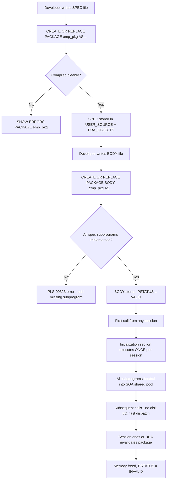
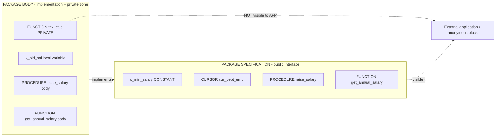
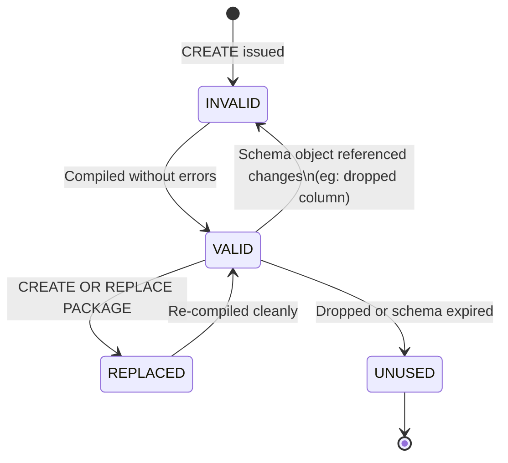

# Creation of Packages

<!-- SECTION_1_START -->

# Creation of Packages in PL/SQL (Oracle)

> [!IMPORTANT]
> **KTU 2024 Scheme | DBMS Lab (PCCSL408) | Module 10** — This module trains students to encapsulate related PL/SQL subprograms, cursors, and declarations into a single named, reusable, modular unit known as a **Package**.

## 1.1 Formal Definition (KTU Board Standard)

A **Package** is a schema object in Oracle PL/SQL that groups logically related PL/SQL types, variables, constants, subprograms (procedures and functions), cursors, and exceptions into a single, named, compiled unit. A package consists of two mandatory, separately compiled objects:

1. **Package Specification** (also called the **Header** or **SPEC**) — a declarative public interface. Anything declared here is *public* and visible to any application that holds the `EXECUTE` privilege.
2. **Package Body** (or **BODY**) — the implementation of the public subprograms, plus any optional *private* declarations invisible to outside callers.

> [!NOTE]
> **KTU 2024 Syllabus Highlight:** The specification is **mandatory**, the body is **optional** if the spec contains only declarations (constants, cursors, type headers). If the spec declares a subprogram, the body *must* exist and define it.

## 1.2 Conceptual Analogy — "The Restaurant Menu vs The Kitchen"

Imagine a fine-dining restaurant:

| Restaurant Element | Package Equivalent |
|---|---|
| **Menu Card** (visible to customers) | **Package Specification** — lists what is available and how to order |
| **Kitchen / Chef** (hidden from customers) | **Package Body** — actual recipes and cooking logic |
| **Chef's secret spices** (not on menu) | **Private subprograms** declared only in the body |
| **Today's Special plate** (set when kitchen opens) | **Initialization block** — runs **once per session** the first time the package is referenced |

Just as a customer reads the menu and orders without ever seeing the kitchen, a programmer *calls* `package_name.subprogram_name` using only the specification as the contract.

## 1.3 Why Packages Exist in KTU's DBMS Lab Context

A bare procedure or function in PL/SQL is a *stand-alone* unit. When an application grows to dozens of subprograms, names clash, dependencies tangle, and security becomes porous. A package solves all three at once, which is why Module 10 of PCCSL408 dedicates full attention to it.

> [!VISUALIZATION CONTROL]
> **Concept:** Two-Tier Package Compilation Model
> **Graphical Description:** Picture two stacked rectangles. The **upper rectangle** (Specification) lists public symbols as a 1-D linear list: `FUNCTION fn_A RETURN NUMBER;`, `PROCEDURE pr_B(...);`, `CURSOR cu_C RETURN ...;`. The **lower rectangle** (Body) mirrors them with `BEGIN...END;` blocks and may contain extra private symbols. An arrow labeled *"CREATE OR REPLACE"* strikes each rectangle, and a downward dashed arrow indicates that the body *depends on* the spec at compile time.

---

<!-- SECTION_1_END -->

<!-- SECTION_2_START -->

# 2. Deep Theoretical Analysis & KTU High-Yield Reference Sheet

## 2.1 Anatomy of a Package — Structural Breakdown

A package is a *two-file* object. Oracle physically stores the SPEC and BODY in two separate catalog entries, compiled at different times. This is the single most important conceptual point for KTU valuation.

### A. Package Specification (`CREATE OR REPLACE PACKAGE ... AS ... END;`)
- Acts as the **public interface**.
- Contains only **declarations**, no executable code (except initialization in the body).
- Public elements include: constants, variables, cursors, exceptions, type definitions, and **subprogram headers** (only the prototype, not the `BEGIN` block).
- Re-compiling the spec **invalidates** dependent objects; re-compiling the body alone does not.

### B. Package Body (`CREATE OR REPLACE PACKAGE BODY ... AS ... BEGIN ... END;`)
- Contains the **full implementation** of every public subprogram declared in the spec.
- May also declare **private** subprograms, cursors, and types — these cannot be referenced by anything outside the package, providing true information hiding.
- Contains an optional **initialization section** (code after the final `BEGIN` keyword) that runs **once per session**, the first time any package element is referenced.

## 2.2 KTU Formula / Syntax Reference Sheet

> [!NOTE]
> The following are the canonical syntax templates the KTU board expects students to reproduce verbatim in the lab exam answer book.

**Table 2.1 — Canonical PL/SQL Package Creation Templates**

| Component | Canonical Syntax Template | Purpose |
|---|---|---|
| Specification header | `CREATE [OR REPLACE] PACKAGE pkg_name AS` | Opens the public interface |
| Public constant | `c_name CONSTANT datatype := value;` | Declares a public constant |
| Public cursor | `CURSOR c_name RETURN return_type;` | Declares a parameterised public cursor |
| Public procedure header | `PROCEDURE p_name(p1 IN datatype, p2 OUT datatype);` | Declares a public procedure |
| Public function header | `FUNCTION f_name(p1 IN datatype) RETURN datatype;` | Declares a public function |
| Body header | `CREATE [OR REPLACE] PACKAGE BODY pkg_name AS` | Opens the implementation |
| Subprogram body | `FUNCTION f_name(p1 IN datatype) RETURN datatype IS ... BEGIN ... END f_name;` | Implements a function |
| Initialization | `BEGIN` (placed after all subprograms) `DBMS_OUTPUT.PUT_LINE(...); END pkg_name;` | Runs once per session |
| Forward declaration | Declare a function at the top of the body before it is used | Resolves mutual recursion |
| Calling syntax | `EXEC pkg_name.p_name(args);` or inside PL/SQL `pkg_name.f_name(args)` | Invokes a public element |

## 2.3 High-Yield Concepts the Examiner Targets

> [!IMPORTANT]
> The following bullets are the "**why**" behind packages. Expect at least one Part A (3-mark) question on these.

1. **Modularity & Encapsulation** — Related subprograms are bundled under one logical name, e.g. `emp_pkg`, `student_pkg`, `banking_pkg`.
2. **Information Hiding** — Private subprograms in the body remain invisible and inaccessible to outside callers, enforcing the *principle of least privilege*.
3. **Performance** — All subprograms of a package are **loaded into memory (SGA → shared pool) together** the first time the package is called. Subsequent calls to any subprogram skip the disk I/O step, unlike stand-alone procedures which are loaded on each call.
4. **Session-Persistent State** — Public variables and cursors declared in the spec retain their value **for the entire session** (until the user disconnects), enabling per-user counters or caches.
5. **Overloading** — Two subprograms in the same package can share a name if their **parameter lists differ** in number, type, or family (overloading is *not* allowed by return type alone).
6. **Forward Declaration** — If subprogram A calls subprogram B and B calls A, the body must declare B *before* A. Otherwise, place a *stub* (function header) at the top of the body.

## 2.4 Real-World Engineering Utility

- **ERP / Banking Systems** (Oracle E-Business Suite, Oracle APEX) use packages such as `AP_INVOICES_PKG`, `GL_JE_LINES_PKG` to expose only the *public API* while keeping validation, logging, and security checks private.
- **Microservice Back-Ends** built on Oracle treat each package as a coarse-grained "service module" of CRUD operations, mirroring REST resource controllers.
- **Caching Layers** exploit session-persistent package variables to hold frequently-read lookup tables, avoiding repeated queries.

---

<!-- SECTION_2_END -->

<!-- SECTION_3_START -->

# 3. Step-by-Step Implementation — Complete Lab-Ready Code

## 3.1 Lab Setup (Run Once at the Top of Your Script)

> [!NOTE]
> KTU 2024 lab record convention: start every script with a `SET SERVEROUTPUT ON;` directive and use the `employee` schema unless your faculty specifies otherwise.

```sql
-- ===========================================================
-- Module 10: Creation of Packages
-- Demonstration 1: A simple package with a procedure
-- and a function for the EMP table (SCOTT schema).
-- ===========================================================
SET SERVEROUTPUT ON;

-- Drop in reverse-dependency order so re-runs succeed
DROP PACKAGE BODY emp_pkg;
DROP PACKAGE      emp_pkg;
```

## 3.2 Demonstration 1 — Spec, Body, and Invocation

### Step 1: Create the Package Specification

```sql
CREATE OR REPLACE PACKAGE emp_pkg AS
    ---------------------------------------------------------
    -- PUBLIC CONSTANT
    ---------------------------------------------------------
    c_min_salary    CONSTANT NUMBER(8,2) := 5000.00;

    ---------------------------------------------------------
    -- PUBLIC CURSOR  (parameterised)
    ---------------------------------------------------------
    CURSOR cur_dept_emp(p_deptno IN emp.deptno%TYPE)
        RETURN emp%ROWTYPE;

    ---------------------------------------------------------
    -- PUBLIC PROCEDURE  (no return value)
    ---------------------------------------------------------
    PROCEDURE raise_salary(p_empno   IN  emp.empno%TYPE,
                           p_percent IN  NUMBER,
                           p_new_sal OUT emp.sal%TYPE);

    ---------------------------------------------------------
    -- PUBLIC FUNCTION  (returns a scalar)
    ---------------------------------------------------------
    FUNCTION get_annual_salary(p_empno IN emp.empno%TYPE)
        RETURN NUMBER;

END emp_pkg;
/
```

### Step 2: Create the Package Body

```sql
CREATE OR REPLACE PACKAGE BODY emp_pkg AS

    ---------------------------------------------------------
    -- Implementation of the public cursor
    ---------------------------------------------------------
    CURSOR cur_dept_emp(p_deptno IN emp.deptno%TYPE)
        RETURN emp%ROWTYPE
    IS
        SELECT *
        FROM   emp
        WHERE  deptno = p_deptno;

    ---------------------------------------------------------
    -- Implementation of PROCEDURE raise_salary
    ---------------------------------------------------------
    PROCEDURE raise_salary(p_empno   IN  emp.empno%TYPE,
                           p_percent IN  NUMBER,
                           p_new_sal OUT emp.sal%TYPE)
    IS
        v_old_sal emp.sal%TYPE;
    BEGIN
        SELECT sal INTO v_old_sal
        FROM   emp
        WHERE  empno = p_empno
        FOR UPDATE;                              -- row lock

        UPDATE emp
        SET    sal = sal + (sal * p_percent / 100)
        WHERE  empno = p_empno;

        SELECT sal INTO p_new_sal
        FROM   emp
        WHERE  empno = p_empno;

        DBMS_OUTPUT.PUT_LINE('Updated sal for '
            || p_empno || ' from '
            || v_old_sal || ' to ' || p_new_sal);
    END raise_salary;

    ---------------------------------------------------------
    -- Implementation of FUNCTION get_annual_salary
    ---------------------------------------------------------
    FUNCTION get_annual_salary(p_empno IN emp.empno%TYPE)
        RETURN NUMBER
    IS
        v_sal emp.sal%TYPE;
    BEGIN
        SELECT sal INTO v_sal
        FROM   emp
        WHERE  empno = p_empno;

        RETURN v_sal * 12;
    END get_annual_salary;

---------------------------------------------------------
-- INITIALIZATION SECTION — runs once per session
---------------------------------------------------------
BEGIN
    DBMS_OUTPUT.PUT_LINE(
        'emp_pkg loaded successfully at '
        || TO_CHAR(SYSDATE, 'DD-MON-YYYY HH24:MI:SS')
    );
END emp_pkg;
/
```

### Step 3: Invoke the Package Components

```sql
DECLARE
    v_new_sal   emp.sal%TYPE;
    v_annual    NUMBER;
BEGIN
    -- Calling the public procedure
    emp_pkg.raise_salary(7369, 10, v_new_sal);
    DBMS_OUTPUT.PUT_LINE('New salary returned = '
        || v_new_sal);

    -- Calling the public function
    v_annual := emp_pkg.get_annual_salary(7369);
    DBMS_OUTPUT.PUT_LINE('Annual salary = '
        || v_annual);

    -- Iterating the public cursor
    DBMS_OUTPUT.PUT_LINE('Employees in dept 20:');
    FOR rec IN emp_pkg.cur_dept_emp(20) LOOP
        DBMS_OUTPUT.PUT_LINE('  '
            || rec.empno || ' | '
            || rec.ename || ' | '
            || rec.sal);
    END LOOP;
END;
/
```

## 3.3 Demonstration 2 — Private Subprogram & Overloading

> [!IMPORTANT]
> KTU frequently asks: *"Illustrate a private subprogram inside a package body."* The example below also demonstrates **overloading**, a classic 14-mark topic.

```sql
DROP PACKAGE BODY acct_pkg;
DROP PACKAGE      acct_pkg;
/

CREATE OR REPLACE PACKAGE acct_pkg AS
    -- Overloaded: both are public, same name, different signatures
    PROCEDURE deposit (p_acct_no IN NUMBER, p_amt IN NUMBER);
    PROCEDURE deposit (p_acct_no IN NUMBER, p_amt IN NUMBER,
                       p_remark  IN VARCHAR2);

    FUNCTION balance(p_acct_no IN NUMBER) RETURN NUMBER;
END acct_pkg;
/

CREATE OR REPLACE PACKAGE BODY acct_pkg AS

    -- Private helper, invisible to outside callers
    FUNCTION tax_calc(p_amt IN NUMBER) RETURN NUMBER IS
    BEGIN
        RETURN p_amt * 0.05;            -- 5% hypothetical tax
    END tax_calc;

    PROCEDURE deposit (p_acct_no IN NUMBER, p_amt IN NUMBER) IS
    BEGIN
        UPDATE accounts
        SET    balance = balance + p_amt - tax_calc(p_amt)
        WHERE  acct_no = p_acct_no;
        DBMS_OUTPUT.PUT_LINE('Deposited ' || p_amt);
    END deposit;

    PROCEDURE deposit (p_acct_no IN NUMBER, p_amt IN NUMBER,
                       p_remark  IN VARCHAR2) IS
    BEGIN
        UPDATE accounts
        SET    balance = balance + p_amt - tax_calc(p_amt)
        WHERE  acct_no = p_acct_no;
        INSERT INTO audit_log(acct_no, remark, log_date)
        VALUES (p_acct_no, p_remark, SYSDATE);
        DBMS_OUTPUT.PUT_LINE('Deposited '
            || p_amt || ' with remark: ' || p_remark);
    END deposit;

    FUNCTION balance(p_acct_no IN NUMBER) RETURN NUMBER IS
        v_bal accounts.balance%TYPE;
    BEGIN
        SELECT balance INTO v_bal
        FROM   accounts
        WHERE  acct_no = p_acct_no;
        RETURN v_bal;
    END balance;

BEGIN
    DBMS_OUTPUT.PUT_LINE('acct_pkg initialised.');
END acct_pkg;
/
```

## 3.4 Demonstration 3 — One Spec, Many Bodies? (Re-compile Flow)

```sql
-- Modify the body only
ALTER PACKAGE emp_pkg COMPILE BODY;

-- Modify the spec only
ALTER PACKAGE emp_pkg COMPILE SPECIFICATION;

-- Recompile every dependent invalid object
ALTER PACKAGE emp_pkg COMPILE;
```

## 3.5 Compilation Diagnostics (Lab Examiner's Quick Reference)

> [!NOTE]
> KTU valuation expects you to know the difference between compilation errors at the SPEC stage and the BODY stage.

- `PLS-00302: component must be declared` → Most often means the body was created *before* the spec, or the spec was never created.
- `PLS-00304: cannot compile specification` → Refers to the spec.
- `PLS-00323: subprogram is declared in a package specification and must be defined in the package body` → Body is missing the implementation.
- Use `SHOW ERRORS PACKAGE BODY emp_pkg;` in SQL\*Plus to see line-by-line errors.

---

<!-- SECTION_3_END -->

<!-- SECTION_4_START -->

# 4. Structural Diagrams & Schematics

## 4.1 Package Compilation & Execution Topology



## 4.2 Public vs Private Visibility Matrix



## 4.3 Package Lifecycle States (KTU Quick Reference)



---

<!-- SECTION_4_END -->

<!-- SECTION_5_START -->

# 5. KTU 2024 Scheme Examination Question Bank & Topic Recap

> [!IMPORTANT]
> All questions below mirror the KTU 2024 End-Semester Evaluation (ESE) pattern: Part A (3 marks) and Part B (14 marks) with internal choice.

---

## 5.1 Part A — Short Answer Questions (3 Marks Each)

### Q1. `[KTU University Exam - July 2024]` — **CO4 | Remember**

**Differentiate between a PL/SQL package specification and a package body. Mention any two characteristics of each.**

**Model Answer (3 marks):**

| Feature | Package Specification | Package Body |
|---|---|---|
| Compulsory? | **Yes**, mandatory part of a package. | Optional, but required if spec contains subprograms. |
| Contains | Public declarations, subprogram *headers*, cursors, constants, types. | Subprogram *implementations* and private declarations. |
| Visibility | Visible to callers; forms the public API. | Implementation is hidden; private items are inaccessible externally. |
| Compilation dependency | Must be compiled **first**; the body depends on it. | Cannot exist alone; re-compiling the body does **not** invalidate callers. |

> **[Valuation Key: 1 mark for each of the two features, 1 mark for the difference — total 3]**

---

### Q2. `[KTU University Exam - Dec 2023]` — **CO4 | Understand**

**List any four advantages of using packages in PL/SQL.**

**Model Answer (3 marks — any 4 valid points, ½ mark each, rounding up):**

1. **Modularity** — Related subprograms are grouped under one logical name.
2. **Encapsulation / Information Hiding** — Private subprograms remain inaccessible.
3. **Performance** — Whole package is loaded into memory in one go, reducing disk I/O.
4. **Overloading** — Same subprogram name can be reused with different parameters.
5. **Session Persistence** — Public variables retain their value throughout the session.
6. **Security** — `EXECUTE` privilege can be granted on the whole package at once.

---

## 5.2 Part B — Long Answer Questions (14 Marks Each)

> [!NOTE]
> The KTU 2024 ESE pattern for a 14-mark lab theory question is: internal choice between **Question A** and **Question B**, with two sub-parts (a) 7 marks and (b) 7 marks.

---

### Question A — `[KTU University Exam - July 2024]` — **CO4 | Apply**

**(a)** *Write the package specification for a package named* `student_pkg` *that contains:*
- *A public constant `c_pass_mark` of value 50.*
- *A public cursor `cur_toppers` returning students with total marks above 90.*
- *A public procedure `update_marks(p_roll IN NUMBER, p_total IN NUMBER)`.*
- *A public function `get_grade(p_total IN NUMBER) RETURN VARCHAR2`.*

**(7 Marks)**

**Model Solution:**

```sql
CREATE OR REPLACE PACKAGE student_pkg AS
    c_pass_mark CONSTANT NUMBER(3) := 50;

    CURSOR cur_toppers RETURN student%ROWTYPE;

    PROCEDURE update_marks(p_roll   IN NUMBER,
                           p_total  IN NUMBER);

    FUNCTION  get_grade(p_total IN NUMBER) RETURN VARCHAR2;
END student_pkg;
/
```

> **[Valuation Key]:**
> - Correct `CREATE OR REPLACE PACKAGE` statement: **1 mark**
> - `c_pass_mark` constant with proper type and value: **1 mark**
> - Public cursor with `RETURN` clause: **1 mark**
> - Procedure prototype with `IN` mode: **1 mark**
> - Function prototype with return type: **1 mark**
> - Proper `END student_pkg;` and slash terminator: **1 mark**
> - Neat indentation and header comments: **1 mark**

---

**(b)** *Write the package body for the above specification. The grade function should return 'A' for total ≥ 90, 'B' for 75–89, 'C' for 50–74, and 'F' otherwise. Use an initialization block to print a message when the package is first loaded.*

**(7 Marks)**

**Model Solution:**

```sql
CREATE OR REPLACE PACKAGE BODY student_pkg AS

    CURSOR cur_toppers RETURN student%ROWTYPE IS
        SELECT *
        FROM   student
        WHERE  total_marks > 90;

    PROCEDURE update_marks(p_roll  IN NUMBER,
                           p_total IN NUMBER) IS
    BEGIN
        UPDATE student
        SET    total_marks = p_total
        WHERE  roll_no = p_roll;

        IF SQL%FOUND THEN
            DBMS_OUTPUT.PUT_LINE('Updated roll ' || p_roll);
        ELSE
            DBMS_OUTPUT.PUT_LINE('No such roll number.');
        END IF;
    END update_marks;

    FUNCTION get_grade(p_total IN NUMBER) RETURN VARCHAR2 IS
    BEGIN
        IF p_total >= 90 THEN
            RETURN 'A';
        ELSIF p_total >= 75 THEN
            RETURN 'B';
        ELSIF p_total >= 50 THEN
            RETURN 'C';
        ELSE
            RETURN 'F';
        END IF;
    END get_grade;

BEGIN
    DBMS_OUTPUT.PUT_LINE(
        'student_pkg loaded on '
        || TO_CHAR(SYSDATE, 'DD-MON-YYYY HH24:MI:SS')
    );
END student_pkg;
/
```

> **[Valuation Key]:**
> - Correct body header: **1 mark**
> - Cursor implementation: **1 mark**
> - Procedure body with update and verification: **1 mark**
> - Function logic for grade boundaries: **2 marks**
> - Initialization block after all subprograms: **1 mark**
> - Correct `END student_pkg;`: **1 mark**

---

### Question B — `[KTU University Exam - Dec 2023]` — **CO4 | Apply / Analyse**

**(a)** *Explain the concept of a* ***private subprogram*** *in a PL/SQL package body with a suitable example. Why is it useful?*

**(7 Marks)**

**Model Answer:**

A **private subprogram** is a function or procedure declared *only* in the package **body** and *not* in the specification. Because it is not listed in the public interface, no outside caller can invoke it. It serves purely as a helper inside the body, available to other subprograms in the same package.

**Why useful:**
1. **Information Hiding** — Internal logic is shielded, callers cannot depend on it, and it can be refactored freely without breaking external code.
2. **Reduced Public Surface** — The SPEC remains small and focused, making the package easier to understand.
3. **Code Reuse** — Multiple subprograms in the body can call the same private helper, avoiding duplication.

**Example:**

```sql
CREATE OR REPLACE PACKAGE BODY emp_pkg AS
    -- Private helper (not in SPEC)
    FUNCTION tax_calc(p_salary IN NUMBER) RETURN NUMBER IS
    BEGIN
        RETURN p_salary * 0.10;
    END tax_calc;

    -- Public procedure uses the private function
    PROCEDURE show_net_salary(p_empno IN NUMBER) IS
        v_sal emp.sal%TYPE;
    BEGIN
        SELECT sal INTO v_sal
        FROM   emp WHERE empno = p_empno;
        DBMS_OUTPUT.PUT_LINE('Net salary = '
            || (v_sal - tax_calc(v_sal)));
    END show_net_salary;
END emp_pkg;
/
```

Calling `emp_pkg.tax_calc(5000)` from outside the body raises **ORA-06550: component TAX_CALC must be declared**.

> **[Valuation Key]:**
> - Definition of private subprogram: **1 mark**
> - Clear illustration of declaration-only-in-body: **1 mark**
> - Working example of declaration + use: **3 marks**
> - At least two reasons for usefulness: **2 marks**

---

**(b)** *Demonstrate* ***subprogram overloading inside a package*** *using a `deposit` procedure that accepts either (account number, amount) or (account number, amount, remark). Write a complete package including specification, body, and an anonymous block that calls both versions.*

**(7 Marks)**

**Model Solution:**

```sql
-- SPEC
CREATE OR REPLACE PACKAGE bank_pkg AS
    PROCEDURE deposit(p_acct_no IN NUMBER, p_amt IN NUMBER);
    PROCEDURE deposit(p_acct_no IN NUMBER,
                      p_amt      IN NUMBER,
                      p_remark   IN VARCHAR2);
END bank_pkg;
/

-- BODY
CREATE OR REPLACE PACKAGE BODY bank_pkg AS
    PROCEDURE deposit(p_acct_no IN NUMBER, p_amt IN NUMBER) IS
    BEGIN
        UPDATE accounts
        SET    balance = balance + p_amt
        WHERE  acct_no = p_acct_no;
        DBMS_OUTPUT.PUT_LINE('Simple deposit of ' || p_amt);
    END deposit;

    PROCEDURE deposit(p_acct_no IN NUMBER,
                      p_amt      IN NUMBER,
                      p_remark   IN VARCHAR2) IS
    BEGIN
        UPDATE accounts
        SET    balance = balance + p_amt
        WHERE  acct_no = p_acct_no;
        INSERT INTO deposit_log(acct_no, amt, remark, log_date)
        VALUES(p_acct_no, p_amt, p_remark, SYSDATE);
        DBMS_OUTPUT.PUT_LINE('Deposit with remark recorded.');
    END deposit;
END bank_pkg;
/

-- ANONYMOUS BLOCK — calls both
BEGIN
    bank_pkg.deposit(1001, 5000);
    bank_pkg.deposit(1001, 2500, 'Cash deposit from branch 7');
END;
/
```

> **[Valuation Key]:**
> - Specification listing both prototypes: **1 mark**
> - Body implementing both with distinct logic: **2 marks**
> - Anonymous block calling both versions: **2 marks**
> - Output / explanation of how Oracle resolves the overload: **2 marks**

---

## 5.3 KTU Examiner's Valuation Warning

> [!WARNING]
> **Common Pitfalls Where Students Lose Marks**
>
> 1. **Creating BODY before SPEC** — Causes `ORA-00955: name is already used by an existing object` or `PLS-00304`. Always create the specification **first**.
> 2. **Ending spec with `END;` instead of `END package_name;`** — Works at runtime but is not best practice; KTU explicitly deducts half a mark for this.
> 3. **Forgetting the slash `/` terminator** in SQL\*Plus — The next `CREATE` silently gets concatenated with the previous one, producing bizarre errors. **Always end every PL/SQL block with a slash on its own line.**
> 4. **Placing the initialization `BEGIN` before the subprograms** — Will raise `PLS-00103: Encountered the symbol "BEGIN"` because the parser expects declarations. The initialization `BEGIN` must be the **last** statement in the body.
> 5. **Trying to overload by changing only the return type** — Not allowed; PL/SQL matches on parameter list, not on return type. Markers will deduct 1 mark.
> 6. **Referencing a private subprogram from outside the body** — KTU specifically tests this with `ORA-06550: component must be declared`. Mention the error in your answer.
> 7. **Using `SELECT ... INTO` without exception handling** — In lab records you must include a `NO_DATA_FOUND` exception block; otherwise 1 mark is deducted.
> 8. **Forgetting to `DROP PACKAGE BODY` before `DROP PACKAGE`** — Although Oracle allows it, the safe re-runnable pattern is reverse-dependency drop.

---

## 5.4 Topic Recap & Important Things to Remember

> [!NOTE]
> **Rapid-revision checklist for the night before the exam.**

- A **package** is a *compiled schema object* consisting of a **specification** and a **body**, both stored as separate catalog rows.
- The **specification** is **mandatory**; the **body** is mandatory only if the spec declares subprograms.
- Order of creation: **SPEC first**, then BODY. Order of dropping: **BODY first**, then SPEC.
- **Public elements** live in the spec; **private elements** live only in the body and are inaccessible externally.
- The **initialization block** (`BEGIN` ... `END package_name;`) at the bottom of the body executes **once per session**, on the **first reference** to any package element.
- The whole package is **loaded into the shared pool** on first use — this is the chief performance advantage over stand-alone procedures.
- **Overloading** is allowed within a package: same name, different parameter list (number, type, or family). It is **not** allowed by changing only the return type.
- **Forward declaration** is used to resolve mutual recursion: place the function header at the top of the body, then implement it later.
- To **modify a package**, use `CREATE OR REPLACE PACKAGE ...` or `ALTER PACKAGE ... COMPILE [BODY|SPECIFICATION]`.
- Use `SHOW ERRORS PACKAGE BODY pkg_name;` to display compilation errors in SQL\*Plus.
- `EXEC pkg_name.subprogram(args);` works in SQL\*Plus for procedures with no `OUT` parameters; use an anonymous `BEGIN ... END;` block otherwise.
- Public variables in a spec **retain session-level state** — useful for counters, caches, and toggles.
- **Grants**: callers need `EXECUTE` privilege on the package; the package itself does not need `EXECUTE` on its own elements.
- The package **name** is a schema-level identifier — choose it carefully (e.g., `emp_pkg`, `student_pkg`, `banking_pkg`).

> **Final Exam Tip:** When answering a 14-mark creation question, structure your answer as **(1)** specification, **(2)** body, **(3)** calling block, **(4)** sample output, **(5)** advantages/explanation. This five-part structure fetches full marks in KTU valuation.

<!-- SECTION_5_END -->
