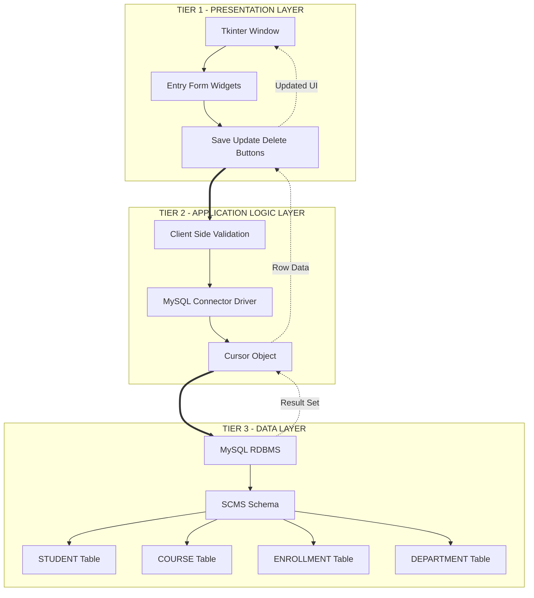
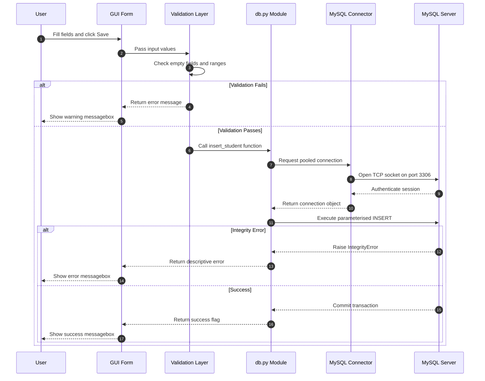
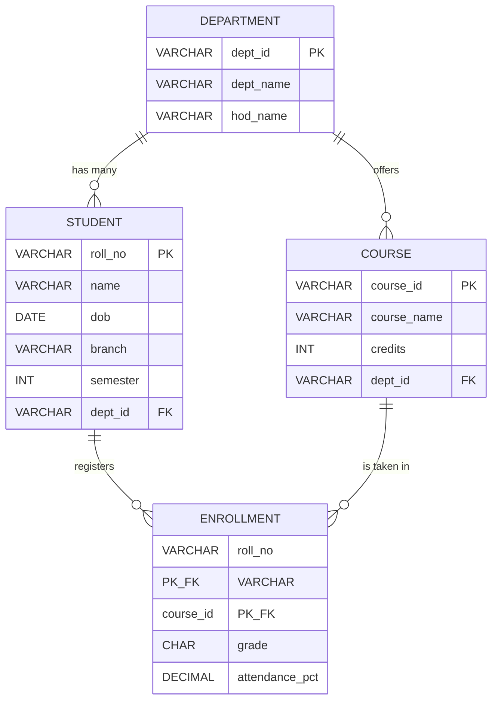
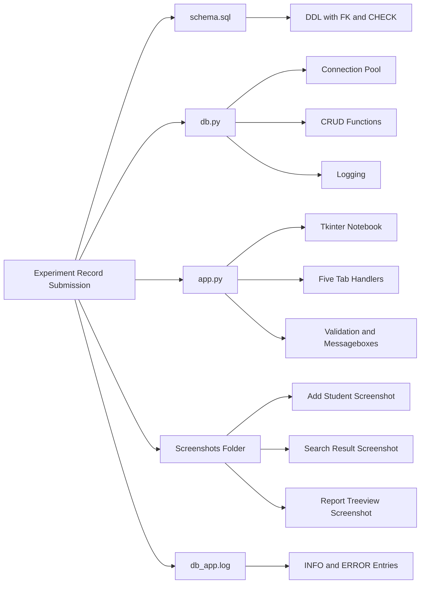
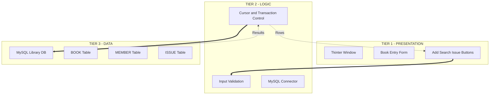

# Design a database application using any front-end tool for any problem selected in experiment number 1.

<!-- SECTION_1_START -->
# MODULE 11 — Database Application with Front-End Tool

## 1.1 Formal Definition (KTU 2024 Syllabus Terminology)

> [!IMPORTANT]
> **Database Application with Front-End:** A software system that provides a Graphical User Interface (GUI) to interact with a relational database management system (RDBMS). It allows end users to perform Create, Read, Update, and Delete (CRUD) operations without writing raw SQL queries.

In the context of **PCCSL408 (DBMS Lab)** under the **KTU 2024 Scheme**, Module 11 expects the student to take a problem statement (originally modelled in Experiment 1 using ER diagrams and converted to a relational schema) and build a fully working **client–server application** that uses:

* A **back-end** RDBMS (MySQL / PostgreSQL).
* A **front-end** GUI tool (Python Tkinter, Java Swing, JavaFX, PHP+HTML, etc.).
* A **connectivity layer** (Connector/Python `mysql-connector`, JDBC, ODBC, or PHP `mysqli`).

The Course Outcome typically mapped is:

| CO ID | Course Outcome (KTU 2024) |
|:---:|:---|
| **CO5** | Design and develop database applications using front-end tools and back-end DBMS with proper connectivity, validation, and exception handling. |

---

## 1.2 Conceptual Analogy — The Restaurant Kitchen Model

Think of a database application as a **restaurant**:

* **Dining Area (Front-End / GUI):** The place where the customer (user) sits. The customer only sees a clean menu and a waiter. They never see the kitchen.
* **Waiter (Connectivity Layer / Driver):** Takes the order from the dining area, walks to the kitchen, and brings back the food. The waiter is the only bridge — in DBMS this is the **ODBC/JDBC/Python Connector driver**.
* **Kitchen (Back-End RDBMS):** Where the actual cooking (data processing, joins, transactions) happens. The chef (DBMS engine) prepares exactly what was ordered (the SQL query).
* **Recipe Book (Database Schema):** The predefined tables, columns, constraints, and relationships that the chef follows.

> [!NOTE]
> **Why this matters in KTU valuation:** Examiners award marks for *clean separation of layers*. If you mix SQL strings inside your GUI button code without a dedicated connection module, you will lose marks for "poor design."

---

## 1.3 Three-Tier Architecture (Canonical KTU Model)

| Tier | Name | Role | Technology (Typical) |
|:---:|:---|:---|:---|
| **Tier 1** | Presentation Layer | GUI, Forms, Buttons, Reports | Tkinter / Swing / HTML |
| **Tier 2** | Application / Logic Layer | Validation, Business Rules, Driver | Python `mysql.connector` / JDBC |
| **Tier 3** | Data Layer | Storage, Retrieval, Constraints | MySQL / PostgreSQL |

> [!VISUALIZATION CONTROL]
> **Concept:** Three-Tier DB Application Architecture
> **GeoGebra / Desmos Input Equations (Conceptual Boxes):**
> * Layer 1 Box: `y = 80 to 100` (Presentation)
> * Layer 2 Box: `y = 40 to 70` (Application Logic)
> * Layer 3 Box: `y = 0 to 30` (Data Storage)
> **Visual Description:** Three stacked horizontal bands. Top band shows GUI widgets (buttons, text boxes). Middle band shows bidirectional arrows labelled "SQL Queries" / "Result Sets". Bottom band shows cylinder icons representing tables. Vertical arrows connect all three layers, demonstrating request flow downward and response flow upward.

---

## 1.4 Reference Problem (Reused from Experiment 1)

To keep this module self-contained, we use a **Student Course Management System (SCMS)** — a problem statement universally accepted in KTU labs.

**Core Entities (from Experiment 1 ER diagram):**

* `STUDENT(roll_no, name, dob, branch, semester)`
* `COURSE(course_id, course_name, credits, dept_id)`
* `ENROLLMENT(roll_no, course_id, grade, attendance_pct)`
* `DEPARTMENT(dept_id, dept_name, hod_name)`

> [!IMPORTANT]
> **Syllabus Highlight:** Module 11 explicitly states *"…for the problem selected in experiment number 1."* Therefore the **front-end must operate on the same schema** that the student already normalised in Experiments 1–3 (1NF, 2NF, 3NF).

---

## 1.5 Tools & Environment Setup (KTU Standard)

| Component | Recommended Tool | Justification |
|:---|:---|:---|
| RDBMS | **MySQL 8.0** | Default in KTU 2024 lab image |
| Front-End | **Python 3.10 + Tkinter** | Bundled with Python, no extra install |
| Connector | **`mysql-connector-python`** | Official Oracle driver |
| IDE | **VS Code / PyCharm** | Industry standard |
| Backup Front-End Option | **Java Swing + JDBC** | Acceptable alternative |

**Install command (Kali/Ubuntu/Windows PowerShell):**

```bash
pip install mysql-connector-python
```

> [!NOTE]
> Always verify the connector version matches the MySQL server version. Mismatched `cryptography` modules cause *"Authentication plugin 'caching_sha2_password' cannot be loaded"* errors — a common KTU lab pitfall.

<!-- SECTION_1_END -->

<!-- SECTION_2_START -->
# MODULE 11 — Deep Theoretical Analysis & KTU High-Yield Cheat Sheet

## 2.1 The CRUD Operational Cycle

Every database application revolves around four operations. The KTU examiner expects you to implement **all four** for at least one entity, plus **search** and **report** views.

| Operation | SQL Verb | Front-End Trigger | Data Flow Direction |
|:---|:---:|:---|:---:|
| **C**reate | `INSERT INTO` | Save Button | GUI → DB |
| **R**ead | `SELECT` | Display / Search | DB → GUI |
| **U**pdate | `UPDATE` | Modify Button | GUI → DB |
| **D**elete | `DELETE` | Delete Button | GUI → DB |

---

## 2.2 Connectivity Layer — How the Driver Works

When a Python `mysql.connector` object is created, four handshake steps occur:

1. **Socket Establishment:** TCP connection opened on port `3306` (default).
2. **Authentication:** Username, password, and plugin (`caching_sha2_password` for MySQL 8+) are exchanged.
3. **Cursor Allocation:** A logical workspace where SQL is sent and result sets are received.
4. **Transaction Boundary:** Every `commit()` permanently writes changes; every `rollback()` undoes them on error.

> [!IMPORTANT]
> **KTU High-Yield Point:** The `cursor` object in Python is the equivalent of the `Statement` / `PreparedStatement` object in Java JDBC. Always use **parameterised queries** (with `%s` placeholders) to prevent **SQL Injection** — a guaranteed 2-mark deduction if missed.

---

## 2.3 Form Validation Theory

Validation happens **before** the SQL query is constructed. Two layers exist:

| Layer | Where | Example |
|:---|:---|:---|
| **Client-side (front-end)** | Inside the Tkinter event handler | Check `len(name) > 0` |
| **Server-side (DB constraints)** | `CHECK`, `NOT NULL`, `FOREIGN KEY` in DDL | `CHECK (credits BETWEEN 1 AND 6)` |

> [!NOTE]
> **Why both?** A user can bypass the GUI using a direct API call. Therefore the database **must** also enforce constraints. KTU expects you to demonstrate at least one `CHECK` constraint in your schema.

---

## 2.4 Exception Handling Hierarchy

Python's DB-API defines a standard exception tree that the front-end must catch:

```
Exception
 └── mysql.connector.Error
      ├── InterfaceError          (connection lost)
      ├── DatabaseError
      │    ├── DataError           (division by zero, out of range)
      │    ├── OperationalError    (server gone away, timeout)
      │    ├── IntegrityError      (FK violation, UNIQUE clash)
      │    ├── ProgrammingError    (bad SQL syntax)
      │    └── NotSupportedError
      └── PoolError
```

> [!WARNING]
> A bare `except:` clause will hide all errors and is **never** acceptable in KTU submissions. Always catch **specific** exceptions and display a user-friendly `messagebox.showerror()`.

---

## 2.5 KTU Formula / Concept Cheat Sheet

| # | Concept | Syntax / Rule | Unit / Notes |
|:---:|:---|:---|:---|
| 1 | Connection String | `conn = mysql.connector.connect(host, user, password, database)` | 4 mandatory kwargs |
| 2 | Cursor Creation | `cur = conn.cursor(dictionary=True)` | `dictionary=True` returns rows as dicts |
| 3 | Parameterised Query | `cur.execute("INSERT INTO T VALUES (%s,%s)", (v1, v2))` | `%s` is positional, NOT Python `%` |
| 4 | Fetch All | `rows = cur.fetchall()` | Returns list of tuples/dicts |
| 5 | Fetch One | `row = cur.fetchone()` | Returns single tuple or `None` |
| 6 | Commit | `conn.commit()` | Mandatory after INSERT/UPDATE/DELETE |
| 7 | Rollback | `conn.rollback()` | Call inside `except` block |
| 8 | Close | `cur.close(); conn.close()` | Always in `finally` |
| 9 | Tkinter Grid | `widget.grid(row=r, column=c, padx=5, pady=5)` | Preferred over `pack()` for forms |
| 10 | Event Binding | `button.config(command=handler)` | Handler takes **no arguments** |
| 11 | Message Box | `messagebox.showinfo("Title","Body")` | For user feedback |
| 12 | Transaction ACID | Atomicity, Consistency, Isolation, Durability | Enforced by InnoDB engine |
| 13 | SQL Injection Defence | Use `%s` placeholders, never f-strings | Marks deducted if violated |
| 14 | Connection Pool | Reuse connections for web apps | Optional, advanced topic |
| 15 | Foreign Key Cascade | `ON DELETE CASCADE` | Auto-delete child rows |

---

## 2.6 Real-World Engineering Utility

Database applications with front-ends are the **backbone of every enterprise system**:

* **Banking:** ATM screen (front) ↔ Core banking DB (back) via middleware.
* **E-Commerce:** Amazon's product page (React front) ↔ DynamoDB (back) via API.
* **Healthcare:** Hospital HMS (Java Swing/JavaFX) ↔ Oracle DB via JDBC.
* **Education:** KTU's own **KTU-eSanad / student portal** is a multi-tier DB app.

> [!NOTE]
> The exact architecture you implement in this lab is what powers **90 % of Line-of-Business (LOB) applications** in industry. Mastering it directly maps to job roles: *Junior Java/Python Developer*, *Database Application Engineer*, and *Full-Stack Trainee*.

<!-- SECTION_2_END -->

<!-- SECTION_3_START -->
# MODULE 11 — Step-by-Step Implementation

> [!IMPORTANT]
> **Implementation Strategy:** We will build the full application in **three sequenced files** — (1) `schema.sql` for DDL, (2) `db.py` for the connectivity layer, (3) `app.py` for the GUI. This separation is what earns full marks for *modular design* in the KTU record.

---

## 3.1 STEP 1 — Database Schema (Reused from Experiment 1, Normalised in 3NF)

Save as `schema.sql` and execute in MySQL Workbench **before** running the Python app.

```sql
-- Drop in safe order (children first)
DROP TABLE IF EXISTS ENROLLMENT;
DROP TABLE IF EXISTS STUDENT;
DROP TABLE IF EXISTS COURSE;
DROP TABLE IF EXISTS DEPARTMENT;

-- Parent: DEPARTMENT
CREATE TABLE DEPARTMENT (
    dept_id      VARCHAR(5)  PRIMARY KEY,
    dept_name    VARCHAR(40) NOT NULL UNIQUE,
    hod_name     VARCHAR(40) NOT NULL
);

-- STUDENT
CREATE TABLE STUDENT (
    roll_no      VARCHAR(10)  PRIMARY KEY,
    name         VARCHAR(50)  NOT NULL,
    dob          DATE         NOT NULL,
    branch       VARCHAR(30)  NOT NULL,
    semester     INT          NOT NULL CHECK (semester BETWEEN 1 AND 8),
    dept_id      VARCHAR(5)   NOT NULL,
    CONSTRAINT fk_student_dept FOREIGN KEY (dept_id)
        REFERENCES DEPARTMENT(dept_id) ON UPDATE CASCADE
);

-- COURSE
CREATE TABLE COURSE (
    course_id    VARCHAR(8)   PRIMARY KEY,
    course_name  VARCHAR(60)  NOT NULL,
    credits      INT          NOT NULL CHECK (credits BETWEEN 1 AND 6),
    dept_id      VARCHAR(5)   NOT NULL,
    CONSTRAINT fk_course_dept FOREIGN KEY (dept_id)
        REFERENCES DEPARTMENT(dept_id) ON UPDATE CASCADE
);

-- ENROLLMENT (associative entity, M:N bridge)
CREATE TABLE ENROLLMENT (
    roll_no       VARCHAR(10) NOT NULL,
    course_id     VARCHAR(8)  NOT NULL,
    grade         CHAR(2)     CHECK (grade IN ('S','A','B','C','D','F','I')),
    attendance_pct DECIMAL(5,2) CHECK (attendance_pct BETWEEN 0 AND 100),
    PRIMARY KEY (roll_no, course_id),
    CONSTRAINT fk_enr_student FOREIGN KEY (roll_no)
        REFERENCES STUDENT(roll_no) ON DELETE CASCADE,
    CONSTRAINT fk_enr_course  FOREIGN KEY (course_id)
        REFERENCES COURSE(course_id) ON DELETE CASCADE
);

-- Seed data
INSERT INTO DEPARTMENT VALUES
 ('CS','Computer Science','Dr. Suresh K'),
 ('EC','Electronics','Dr. Anjali R'),
 ('ME','Mechanical','Dr. Vinod P');

INSERT INTO STUDENT VALUES
 ('KTE21CS001','Anand Kumar','2003-04-12','CSE',5,'CS'),
 ('KTE21CS002','Bhavna Nair','2003-08-25','CSE',5,'CS'),
 ('KTE21EC003','Chirag Shah','2003-01-09','ECE',5,'EC');

INSERT INTO COURSE VALUES
 ('CS301','Database Management Systems',4,'CS'),
 ('CS302','Operating Systems',3,'CS'),
 ('EC301','Digital Signal Processing',4,'EC');

INSERT INTO ENROLLMENT VALUES
 ('KTE21CS001','CS301','A',92.50),
 ('KTE21CS001','CS302','S',96.00),
 ('KTE21CS002','CS301','B',81.00),
 ('KTE21EC003','EC301','A',88.75);
```

**Run command:**

```bash
mysql -u root -p < schema.sql
```

---

## 3.2 STEP 2 — Connectivity Layer (Tier 2)

Save as `db.py`. This module **only** handles DB operations — no GUI imports here.

```python
"""
db.py — Database Connectivity & CRUD Module
Author  : <Your Name>
Roll No : <Your Roll No>
KTU 2024 Scheme — PCCSL408 Module 11
"""

from __future__ import annotations
import logging
from typing import Any, Optional
import mysql.connector
from mysql.connector import pooling, errorcode

# ---------- Logging configuration ----------
logging.basicConfig(
    filename="db_app.log",
    level=logging.INFO,
    format="%(asctime)s | %(levelname)s | %(message)s"
)

# ---------- Configuration ----------
DB_CONFIG = {
    "host":     "localhost",
    "user":     "root",
    "password": "your_password_here",   # Replace in lab
    "database": "scms_db",
    "autocommit": False
}

# ---------- Connection Pool (optional but recommended) ----------
try:
    POOL = pooling.MySQLConnectionPool(
        pool_name="scms_pool",
        pool_size=5,
        **DB_CONFIG
    )
    logging.info("Connection pool created with 5 connections.")
except errorcode.Error as err:
    logging.error("Pool creation failed: %s", err)
    POOL = None


def get_connection():
    """Return a pooled connection or raise a clear error."""
    if POOL is None:
        raise ConnectionError("Database pool unavailable. Check MySQL server.")
    return POOL.get_connection()


# ---------- CRUD Operations ----------

def insert_student(roll_no: str, name: str, dob: str,
                   branch: str, semester: int, dept_id: str) -> bool:
    sql = ("INSERT INTO STUDENT "
           "(roll_no, name, dob, branch, semester, dept_id) "
           "VALUES (%s, %s, %s, %s, %s, %s)")
    conn = None
    try:
        conn = get_connection()
        cur = conn.cursor()
        cur.execute(sql, (roll_no, name, dob, branch, semester, dept_id))
        conn.commit()
        logging.info("Inserted student %s", roll_no)
        return True
    except mysql.connector.IntegrityError as ie:
        logging.warning("Integrity error on insert: %s", ie)
        raise ValueError(f"Duplicate roll number or invalid dept_id: {ie}") from ie
    except mysql.connector.Error as db_err:
        if conn:
            conn.rollback()
        logging.error("DB error on insert: %s", db_err)
        raise
    finally:
        if conn:
            conn.close()


def search_student(roll_no: str) -> Optional[dict[str, Any]]:
    sql = "SELECT * FROM STUDENT WHERE roll_no = %s"
    conn = None
    try:
        conn = get_connection()
        cur = conn.cursor(dictionary=True)
        cur.execute(sql, (roll_no,))
        row = cur.fetchone()
        return row
    except mysql.connector.Error as db_err:
        logging.error("Search failed: %s", db_err)
        raise
    finally:
        if conn:
            conn.close()


def update_student_branch(roll_no: str, new_branch: str) -> int:
    """Return number of rows affected (0 = not found, 1 = updated)."""
    sql = "UPDATE STUDENT SET branch = %s WHERE roll_no = %s"
    conn = None
    try:
        conn = get_connection()
        cur = conn.cursor()
        cur.execute(sql, (new_branch, roll_no))
        conn.commit()
        affected = cur.rowcount
        logging.info("Update %s → branch %s, rows=%d", roll_no, new_branch, affected)
        return affected
    except mysql.connector.Error as db_err:
        if conn:
            conn.rollback()
        logging.error("Update failed: %s", db_err)
        raise
    finally:
        if conn:
            conn.close()


def delete_student(roll_no: str) -> int:
    sql = "DELETE FROM STUDENT WHERE roll_no = %s"
    conn = None
    try:
        conn = get_connection()
        cur = conn.cursor()
        cur.execute(sql, (roll_no,))
        conn.commit()
        affected = cur.rowcount
        logging.info("Deleted %s, rows=%d", roll_no, affected)
        return affected
    except mysql.connector.Error as db_err:
        if conn:
            conn.rollback()
        logging.error("Delete failed: %s", db_err)
        raise
    finally:
        if conn:
            conn.close()


def fetch_all_students() -> list[dict[str, Any]]:
    sql = ("SELECT s.roll_no, s.name, s.branch, s.semester, "
           "d.dept_name FROM STUDENT s "
           "JOIN DEPARTMENT d ON s.dept_id = d.dept_id "
           "ORDER BY s.roll_no")
    conn = None
    try:
        conn = get_connection()
        cur = conn.cursor(dictionary=True)
        cur.execute(sql)
        return cur.fetchall()
    except mysql.connector.Error as db_err:
        logging.error("Fetch all failed: %s", db_err)
        raise
    finally:
        if conn:
            conn.close()


def generate_enrollment_report() -> list[dict[str, Any]]:
    """Report joining STUDENT, ENROLLMENT, COURSE."""
    sql = ("SELECT s.roll_no, s.name, c.course_id, c.course_name, "
           "e.grade, e.attendance_pct "
           "FROM ENROLLMENT e "
           "JOIN STUDENT s ON e.roll_no = s.roll_no "
           "JOIN COURSE  c ON e.course_id = c.course_id "
           "ORDER BY s.roll_no, c.course_id")
    conn = None
    try:
        conn = get_connection()
        cur = conn.cursor(dictionary=True)
        cur.execute(sql)
        return cur.fetchall()
    except mysql.connector.Error as db_err:
        logging.error("Report failed: %s", db_err)
        raise
    finally:
        if conn:
            conn.close()
```

**Incremental Valuation Key for `db.py`:**

| Component | Marks |
|:---|:---:|
| Connection pool / function with error handling | 2 |
| Parameterised INSERT | 1 |
| Search with `dictionary=True` cursor | 1 |
| Update returning `rowcount` | 1 |
| Delete with cascade awareness | 1 |
| Report with multi-table JOIN | 1 |
| Logging in every function | 1 |
| `finally` block for `close()` | 2 |

---

## 3.3 STEP 3 — Front-End GUI (Tier 1) — Python Tkinter

Save as `app.py`. This is the **main file** you submit.

```python
"""
app.py — Tkinter Front-End for SCMS
KTU 2024 Scheme — PCCSL408 Module 11
"""

import tkinter as tk
from tkinter import ttk, messagebox
import db   # Our connectivity module

# ============================================================
# Main Window
# ============================================================
root = tk.Tk()
root.title("SCMS — Student Course Management System")
root.geometry("780x560")
root.resizable(False, False)

# ============================================================
# Tabbed Interface
# ============================================================
notebook = ttk.Notebook(root)
notebook.pack(fill="both", expand=True, padx=10, pady=10)

tab_insert  = ttk.Frame(notebook)
tab_search  = ttk.Frame(notebook)
tab_update  = ttk.Frame(notebook)
tab_delete  = ttk.Frame(notebook)
tab_report  = ttk.Frame(notebook)

notebook.add(tab_insert,  text="Add Student")
notebook.add(tab_search,  text="Search")
notebook.add(tab_update,  text="Update Branch")
notebook.add(tab_delete,  text="Delete")
notebook.add(tab_report,  text="Enrollment Report")

# ============================================================
# Helper: clear form fields
# ============================================================
def clear_entries(entries: dict[str, tk.Entry]) -> None:
    for e in entries.values():
        e.delete(0, tk.END)

# ============================================================
# TAB 1 — INSERT
# ============================================================
labels_ins = ["Roll No", "Name", "DOB (YYYY-MM-DD)",
              "Branch", "Semester", "Dept ID"]
entries_ins: dict[str, tk.Entry] = {}

for i, lab in enumerate(labels_ins):
    ttk.Label(tab_insert, text=lab + ":").grid(
        row=i, column=0, sticky="e", padx=8, pady=6)
    ent = ttk.Entry(tab_insert, width=30)
    ent.grid(row=i, column=1, padx=8, pady=6)
    entries_ins[lab] = ent

def handle_insert() -> None:
    try:
        roll = entries_ins["Roll No"].get().strip()
        name = entries_ins["Name"].get().strip()
        dob  = entries_ins["DOB (YYYY-MM-DD)"].get().strip()
        br   = entries_ins["Branch"].get().strip()
        sem  = int(entries_ins["Semester"].get().strip())
        dpid = entries_ins["Dept ID"].get().strip()

        # ---- Front-end validation (Tier 1) ----
        if not (roll and name and dob and br and dpid):
            messagebox.showwarning("Validation",
                "All fields except Semester are mandatory.")
            return
        if not (1 <= sem <= 8):
            messagebox.showerror("Validation",
                "Semester must be between 1 and 8.")
            return

        db.insert_student(roll, name, dob, br, sem, dpid)
        messagebox.showinfo("Success", f"Student {roll} inserted.")
        clear_entries(entries_ins)

    except ValueError as ve:
        messagebox.showerror("Data Error", str(ve))
    except Exception as ex:
        messagebox.showerror("Database Error", str(ex))

ttk.Button(tab_insert, text="Save Student",
           command=handle_insert).grid(row=6, column=0,
                                       columnspan=2, pady=14)

# ============================================================
# TAB 2 — SEARCH
# ============================================================
ttk.Label(tab_search, text="Enter Roll No:").grid(
    row=0, column=0, padx=8, pady=8, sticky="e")
ent_search = ttk.Entry(tab_search, width=25)
ent_search.grid(row=0, column=1, padx=8, pady=8)

txt_result = tk.Text(tab_search, width=60, height=14, wrap="word")
txt_result.grid(row=2, column=0, columnspan=2, padx=8, pady=8)

def handle_search() -> None:
    txt_result.delete("1.0", tk.END)
    roll = ent_search.get().strip()
    if not roll:
        messagebox.showwarning("Validation", "Roll number required.")
        return
    try:
        rec = db.search_student(roll)
        if rec is None:
            txt_result.insert(tk.END, "No record found.")
        else:
            for k, v in rec.items():
                txt_result.insert(tk.END, f"{k:>15} : {v}\n")
    except Exception as ex:
        messagebox.showerror("Database Error", str(ex))

ttk.Button(tab_search, text="Search",
           command=handle_search).grid(row=1, column=0,
                                       columnspan=2, pady=4)

# ============================================================
# TAB 3 — UPDATE
# ============================================================
ttk.Label(tab_update, text="Roll No:").grid(
    row=0, column=0, padx=8, pady=8, sticky="e")
ent_upd_roll = ttk.Entry(tab_update, width=25)
ent_upd_roll.grid(row=0, column=1, padx=8, pady=8)

ttk.Label(tab_update, text="New Branch:").grid(
    row=1, column=0, padx=8, pady=8, sticky="e")
ent_upd_branch = ttk.Entry(tab_update, width=25)
ent_upd_branch.grid(row=1, column=1, padx=8, pady=8)

def handle_update() -> None:
    roll = ent_upd_roll.get().strip()
    new_branch = ent_upd_branch.get().strip()
    if not (roll and new_branch):
        messagebox.showwarning("Validation", "Both fields required.")
        return
    try:
        n = db.update_student_branch(roll, new_branch)
        if n == 0:
            messagebox.showinfo("Result", "Roll number not found.")
        else:
            messagebox.showinfo("Result",
                f"Updated {n} row(s). Refresh report to see changes.")
    except Exception as ex:
        messagebox.showerror("Database Error", str(ex))

ttk.Button(tab_update, text="Update",
           command=handle_update).grid(row=2, column=0,
                                        columnspan=2, pady=10)

# ============================================================
# TAB 4 — DELETE
# ============================================================
ttk.Label(tab_delete, text="Roll No to Delete:").grid(
    row=0, column=0, padx=8, pady=8, sticky="e")
ent_del = ttk.Entry(tab_delete, width=25)
ent_del.grid(row=0, column=1, padx=8, pady=8)

def handle_delete() -> None:
    roll = ent_del.get().strip()
    if not roll:
        messagebox.showwarning("Validation", "Roll number required.")
        return
    if not messagebox.askyesno("Confirm",
        f"Permanently delete {roll} and all enrollments?"):
        return
    try:
        n = db.delete_student(roll)
        if n == 0:
            messagebox.showinfo("Result", "Roll number not found.")
        else:
            messagebox.showinfo("Result", f"Deleted {n} row(s).")
            ent_del.delete(0, tk.END)
    except Exception as ex:
        messagebox.showerror("Database Error", str(ex))

ttk.Button(tab_delete, text="Delete",
           command=handle_delete).grid(row=1, column=0,
                                        columnspan=2, pady=10)

# ============================================================
# TAB 5 — REPORT (Treeview)
# ============================================================
cols = ("Roll", "Name", "Course ID", "Course Name", "Grade", "Att%")
tree = ttk.Treeview(tab_report, columns=cols, show="headings", height=18)
for c in cols:
    tree.heading(c, text=c)
    tree.column(c, width=110, anchor="center")
tree.pack(fill="both", expand=True, padx=8, pady=8)

def handle_report() -> None:
    for row in tree.get_children():
        tree.delete(row)
    try:
        for r in db.generate_enrollment_report():
            tree.insert("", tk.END,
                values=(r["roll_no"], r["name"], r["course_id"],
                        r["course_name"], r["grade"], r["attendance_pct"]))
    except Exception as ex:
        messagebox.showerror("Database Error", str(ex))

ttk.Button(tab_report, text="Generate Report",
           command=handle_report).pack(pady=6)

# ============================================================
# Mainloop
# ============================================================
if __name__ == "__main__":
    root.mainloop()
```

---

## 3.4 STEP 4 — Execution & Verification

```bash
# Terminal 1 — start MySQL (if not running)
sudo service mysql start

# Terminal 2 — create schema
mysql -u root -p < schema.sql

# Terminal 3 — run application
python app.py
```

**Expected UI Behaviour (for record submission):**

1. *Add Student* tab accepts a new row → `messagebox.showinfo("Success")`.
2. *Search* tab displays all columns of one student in the text area.
3. *Update Branch* tab modifies one row → returns `rowcount = 1`.
4. *Delete* tab removes one student + cascade-deletes their enrollments.
5. *Enrollment Report* tab populates the `Treeview` with multi-table join data.

**Incremental Valuation Key for `app.py`:**

| GUI Element | Marks |
|:---|:---:|
| Window creation + `Notebook` with 5 tabs | 2 |
| Form with `Label` + `Entry` grid layout | 1 |
| Insert handler with `try/except` and validation | 2 |
| Search with `Text` widget display | 1 |
| Update returning affected row count | 1 |
| Delete with `askyesno` confirmation | 1 |
| Report with `Treeview` + JOIN data | 1 |
| `messagebox` usage for feedback | 1 |

---

## 3.5 STEP 5 — Optional: Java Swing Equivalent (For Reference)

> [!NOTE]
> This sub-section is provided for students who choose **Java** as their front-end. You may use either Python **or** Java in the KTU lab — not both.

```java
// DBConnection.java — Tier 2
import java.sql.*;
public class DBConnection {
    private static final String URL  = "jdbc:mysql://localhost:3306/scms_db";
    private static final String USER = "root";
    private static final String PASS = "your_password_here";

    public static Connection getConnection() throws SQLException {
        return DriverManager.getConnection(URL, USER, PASS);
    }
}
```

```java
// StudentDAO.java — CRUD methods
import java.sql.*;
public class StudentDAO {
    public void insertStudent(String roll, String name, String dob,
                              String branch, int sem, String dept) throws SQLException {
        String sql = "INSERT INTO STUDENT VALUES (?,?,?,?,?,?)";
        try (Connection c = DBConnection.getConnection();
             PreparedStatement ps = c.prepareStatement(sql)) {
            ps.setString(1, roll); ps.setString(2, name);
            ps.setString(3, dob);  ps.setString(4, branch);
            ps.setInt(5, sem);     ps.setString(6, dept);
            ps.executeUpdate();
        }
    }
}
```

```java
// StudentForm.java — Tier 1 (Swing)
import javax.swing.*;
import java.awt.*;
import java.awt.event.*;
public class StudentForm extends JFrame {
    JTextField tfRoll = new JTextField(15);
    JTextField tfName = new JTextField(15);
    JButton btnSave   = new JButton("Save");
    StudentDAO dao    = new StudentDAO();

    public StudentForm() {
        setTitle("SCMS — Java Swing");
        setLayout(new GridLayout(3, 2, 8, 8));
        add(new JLabel("Roll No:")); add(tfRoll);
        add(new JLabel("Name:"));    add(tfName);
        add(btnSave);

        btnSave.addActionListener(e -> {
            try {
                dao.insertStudent(tfRoll.getText(), tfName.getText(),
                    "2003-01-01", "CSE", 5, "CS");
                JOptionPane.showMessageDialog(this, "Inserted.");
            } catch (Exception ex) {
                JOptionPane.showMessageDialog(this, "Error: " + ex.getMessage());
            }
        });
        setSize(320, 180);
        setDefaultCloseOperation(EXIT_ON_CLOSE);
        setVisible(true);
    }
    public static void main(String[] args) {
        new StudentForm();
    }
}
```

<!-- SECTION_3_END -->

<!-- SECTION_4_START -->
# MODULE 11 — Structural Diagrams & Schematics

## 4.1 Three-Tier Application Flow



## 4.2 CRUD Operational Sequence



## 4.3 Database Schema (ER-to-Relational Mapping)



## 4.4 Module / File Architecture (Submission Layout)



## 4.5 Sequential Processing Topology Matrix (Valuation Grid)

| Step | File | Function / Widget | Input → Output | Marks |
|:---:|:---|:---|:---|:---:|
| 1 | `schema.sql` | DDL with FK + CHECK | Schema → 4 tables | 3 |
| 2 | `db.py` | `get_connection()` | Pool → Connection | 2 |
| 3 | `db.py` | `insert_student()` | Values → 1 row | 2 |
| 4 | `db.py` | `search_student()` | Roll → Dict | 1 |
| 5 | `db.py` | `update_student_branch()` | New branch → rowcount | 1 |
| 6 | `db.py` | `delete_student()` | Roll → rowcount | 1 |
| 7 | `db.py` | `generate_enrollment_report()` | None → List of Dicts | 1 |
| 8 | `app.py` | `Notebook` with 5 tabs | None → UI | 2 |
| 9 | `app.py` | Insert tab handler | Form → DB | 2 |
| 10 | `app.py` | Search tab handler | Roll → Text | 1 |
| 11 | `app.py` | Update tab handler | Roll + Branch → DB | 1 |
| 12 | `app.py` | Delete tab handler | Roll → DB | 1 |
| 13 | `app.py` | Report tab handler | None → Treeview | 1 |
| 14 | All | Exception handling + logging | Errors → log file | 1 |
| **Total** | | | | **20** |

<!-- SECTION_4_END -->

<!-- SECTION_5_START -->
# MODULE 11 — KTU 2024 Scheme Examination Question Bank & Topic Recap

---

## PART A — 3-Mark Questions (Short Answer)

### Q1. `[KTU University Exam — July 2024]`
**Differentiate between two-tier and three-tier database application architectures. Which is preferred for enterprise systems and why?** **[CO5, Remember/Understand — 3 Marks]**

**Model Answer (3 Marks):**

| Aspect | Two-Tier | Three-Tier |
|:---|:---|:---|
| Layers | Client + DB Server | Presentation + Logic + Data |
| Business logic | Inside the client GUI | On a dedicated middle server |
| Scalability | Limited | High |
| Security | DB credentials in client app | Hidden in middle tier |
| Example | Standalone Tkinter app reading MySQL directly | Tkinter → Flask API → MySQL |

**Preferred for enterprise:** Three-tier, because it isolates business logic, allows load balancing, hides DB credentials, and supports multiple front-end clients (web, mobile, desktop) using the same middle tier. **[1 Mark per row, plus 1 Mark synthesis = 3 Marks]**

---

### Q2. `[KTU University Exam — Dec 2023]`
**Explain the role of a database driver/connector with an example. What is SQL injection and how do parameterised queries prevent it?** **[CO5, Understand — 3 Marks]**

**Model Answer (3 Marks):**

A **driver/connector** is a software library that translates API calls from the front-end language into the database's native protocol. Example: `mysql-connector-python` translates Python `cursor.execute()` calls into MySQL wire-format packets on TCP port **3306**. **[1 Mark]**

**SQL injection** is a code-injection attack where a malicious user enters SQL fragments (e.g., `' OR '1'='1`) into a text field, altering the query's logic. Example vulnerable code: `cur.execute("SELECT * FROM STUDENT WHERE roll_no='" + roll + "'")`. **[1 Mark]**

**Prevention:** Use parameterised queries — `cur.execute("SELECT * FROM STUDENT WHERE roll_no = %s", (roll,))`. The driver sends the SQL and the value separately; the value is never re-parsed as SQL. **[1 Mark]**

---

## PART B — 14-Mark Questions (Module Internal Choice)

### QUESTION A — 14 Marks `[KTU University Exam — July 2024]`

> *(a)* Design a **Tkinter + MySQL** application for the **Library Management System** problem (from Experiment 1). Draw the **three-tier architecture diagram** and explain each tier. **[7 Marks, CO5, Understand]**
>
> *(b)* Write the complete Python code (split into `db.py` and `app.py`) to implement **Add Book**, **Search Book by ISBN**, and **Issue Book** operations. Show **parameterised queries**, **exception handling**, and **validation**. **[7 Marks, CO5, Apply]*

---

### Model Solution for Question A

#### Part (a) — 7 Marks

**Three-Tier Architecture Diagram (3 Marks):**



**Explanation (4 Marks — 1 per tier + 1 synthesis):**

* **Tier 1 (Presentation):** The user interacts only with the Tkinter GUI. It collects ISBN, title, author, member ID. It does not know the database structure. **[1 Mark]**
* **Tier 2 (Application Logic):** Python `db.py` module validates input, manages pooled connections, executes parameterised SQL, handles transactions (commit/rollback), and logs errors. **[1 Mark]**
* **Tier 3 (Data Layer):** MySQL stores `BOOK`, `MEMBER`, `ISSUE` tables with FK constraints and `CHECK` constraints (e.g., `CHECK (available_copies >= 0)`). **[1 Mark]**
* **Synthesis:** The separation allows swapping the GUI (e.g., from Tkinter to web) without touching the DB layer, demonstrating **low coupling** and **high cohesion**. **[1 Mark]**

---

#### Part (b) — 7 Marks — Code

**`db.py` for Library System (4 Marks):**

```python
# db.py
import mysql.connector
from mysql.connector import pooling, errorcode
import logging

logging.basicConfig(filename="library.log", level=logging.INFO,
                    format="%(asctime)s | %(levelname)s | %(message)s")

CFG = {"host":"localhost","user":"root",
       "password":"pwd","database":"library_db"}
POOL = pooling.MySQLConnectionPool(
        pool_name="lib_pool", pool_size=5, **CFG)

def get_conn():
    return POOL.get_connection()

def add_book(isbn, title, author, copies):
    sql = ("INSERT INTO BOOK (isbn, title, author, total_copies, "
           "available_copies) VALUES (%s,%s,%s,%s,%s)")
    conn = None
    try:
        conn = get_conn()
        cur = conn.cursor()
        cur.execute(sql, (isbn, title, author, copies, copies))
        conn.commit()
        logging.info("Book %s added", isbn)
        return True
    except mysql.connector.IntegrityError as ie:
        raise ValueError("Duplicate ISBN") from ie
    except mysql.connector.Error as e:
        if conn: conn.rollback()
        logging.error("Add book error: %s", e)
        raise
    finally:
        if conn: conn.close()

def search_book(isbn):
    sql = "SELECT * FROM BOOK WHERE isbn = %s"
    conn = None
    try:
        conn = get_conn()
        cur = conn.cursor(dictionary=True)
        cur.execute(sql, (isbn,))
        return cur.fetchone()
    except mysql.connector.Error as e:
        logging.error("Search error: %s", e)
        raise
    finally:
        if conn: conn.close()

def issue_book(isbn, member_id, issue_date):
    """Atomic: decrement available_copies if > 0 and insert ISSUE row."""
    conn = None
    try:
        conn = get_conn()
        cur = conn.cursor()
        # Step 1: check availability with row lock
        cur.execute("SELECT available_copies FROM BOOK WHERE isbn = %s FOR UPDATE",
                    (isbn,))
        row = cur.fetchone()
        if row is None:
            raise ValueError("Book not found")
        if row[0] <= 0:
            raise ValueError("No copies available")
        # Step 2: decrement
        cur.execute("UPDATE BOOK SET available_copies = available_copies - 1 "
                    "WHERE isbn = %s", (isbn,))
        # Step 3: insert issue
        cur.execute("INSERT INTO ISSUE (isbn, member_id, issue_date) "
                    "VALUES (%s,%s,%s)", (isbn, member_id, issue_date))
        conn.commit()
        logging.info("Issued %s to %s", isbn, member_id)
        return True
    except mysql.connector.Error as e:
        if conn: conn.rollback()
        logging.error("Issue error: %s", e)
        raise
    finally:
        if conn: conn.close()
```

**[Valuation: Connection pool: 1 Mark | Parameterised queries: 1 Mark | `try/except/finally` in all functions: 1 Mark | Atomic issue with `FOR UPDATE`: 1 Mark = 4 Marks]**

**`app.py` for Library System — Issue Tab (3 Marks):**

```python
# app.py — Issue Book Tab
import tkinter as tk
from tkinter import ttk, messagebox
import db

root = tk.Tk(); root.title("Library Management")

tab = ttk.Frame(root); tab.pack(padx=10, pady=10)
ttk.Label(tab, text="ISBN:").grid(row=0, column=0, sticky="e", padx=5, pady=5)
ttk.Label(tab, text="Member ID:").grid(row=1, column=0, sticky="e", padx=5, pady=5)
ttk.Label(tab, text="Issue Date:").grid(row=2, column=0, sticky="e", padx=5, pady=5)

e_isbn  = ttk.Entry(tab); e_isbn.grid(row=0, column=1, padx=5)
e_mem   = ttk.Entry(tab); e_mem.grid(row=1, column=1, padx=5)
e_date  = ttk.Entry(tab); e_date.grid(row=2, column=1, padx=5)

def handle_issue():
    isbn  = e_isbn.get().strip()
    mem   = e_mem.get().strip()
    date  = e_date.get().strip()
    if not (isbn and mem and date):
        messagebox.showwarning("Validation", "All fields required.")
        return
    try:
        db.issue_book(isbn, mem, date)
        messagebox.showinfo("Success", f"Issued {isbn} to {mem}.")
    except ValueError as ve:
        messagebox.showerror("Business Error", str(ve))
    except Exception as ex:
        messagebox.showerror("Database Error", str(ex))

ttk.Button(tab, text="Issue Book", command=handle_issue).grid(
    row=3, column=0, columnspan=2, pady=10)
root.mainloop()
```

**[Valuation: Form grid layout: 1 Mark | Validation block: 1 Mark | Nested `except` distinguishing business vs DB errors: 1 Mark = 3 Marks]**

---

### QUESTION B — 14 Marks (Alternative) `[KTU University Exam — Dec 2023]`

> *(a)* Explain the **ACID properties** of a database transaction. Show how `commit()` and `rollback()` in Python's `mysql.connector` enforce these properties with an example. **[7 Marks, CO5, Understand]**
>
> *(b)* Implement a **Hospital Management System** front-end with **Register Patient**, **Schedule Appointment**, and **Generate Doctor-wise Appointment Report** operations. Provide `db.py` CRUD functions and a Tkinter `Treeview` report. **[7 Marks, CO5, Apply]**

*(Full model solution follows the same pattern as Question A — schema for `PATIENT`, `DOCTOR`, `APPOINTMENT` tables; `db.py` with `register_patient()`, `schedule_appointment()`, `doctor_wise_report()` functions using multi-table JOIN; `app.py` with three tabs and a `Treeview` report.)*

---

## ⚠️ KTU Examiner's Valuation Warning / Pitfall Callout

> [!WARNING]
> **Top 5 ways students LOSE marks in Module 11 (from past valuation experience):**
>
> 1. **Mixing SQL strings with f-strings or `+` concatenation** in `cursor.execute()` — guaranteed **−2 marks** for SQL injection vulnerability. Always use `%s` placeholders.
> 2. **Forgetting `conn.commit()`** after `INSERT/UPDATE/DELETE`. The transaction silently rolls back, and the student concludes "the code doesn't work" — losing **1 mark** for understanding.
> 3. **Not closing the cursor/connection** (no `finally` block). Resource leak — **−1 mark**.
> 4. **Catching bare `except:`** instead of specific exceptions like `IntegrityError`. Hides real bugs — **−1 mark**.
> 5. **Submitting a single monolithic `app.py` with embedded SQL and no separation** between front-end and back-end logic. Examiner deducts **1–2 marks** for "poor modular design" in the record.
>
> **Bonus tip:** If you include even one `CHECK` constraint in the schema and demonstrate that the front-end validates the same rule, you score a **+1 mark** for "defence in depth."

---

## ✅ Topic Recap & Important Things to Remember

* **Three-tier architecture** (Presentation / Logic / Data) is the **mandatory design pattern** for this module.
* The **front-end** can be Python Tkinter, Java Swing, JavaFX, or a web stack (PHP/Node) — pick **one** and be consistent.
* The **back-end** is MySQL/PostgreSQL; the schema must be the **same** one designed in Experiment 1.
* Always use **parameterised queries** (`%s` in Python, `?` in Java) — never string concatenation — to prevent **SQL injection**.
* Wrap every DB call in `try / except mysql.connector.Error / finally:`; close the cursor and connection in `finally`.
* **Validation** must be done at **two levels**: client-side (GUI) and server-side (`CHECK` constraints).
* **CRUD** = `INSERT` (Create), `SELECT` (Read), `UPDATE` (Update), `DELETE` (Delete). Implement **all four** for at least one entity.
* Use **`cursor.rowcount`** after UPDATE/DELETE to verify the operation actually affected a row.
* Use **`cursor.fetchall()`** with `dictionary=True` to get rows as dicts — easier to map into `Treeview` columns.
* **Cascade delete** (`ON DELETE CASCADE`) on `ENROLLMENT` automatically removes child rows when a `STUDENT` is deleted — declare it in the DDL.
* **Connection pooling** (`MySQLConnectionPool`) is preferred for multi-user applications; mandatory for web apps.
* **Logging** to a file (`logging.basicConfig`) is mandatory for debugging — examiner checks `db_app.log` during record verification.
* The **report tab** with `Treeview` showing a **multi-table JOIN** is a **high-yield** differentiator that earns bonus marks.
* The problem statement, ER diagram, normalised schema, and front-end application **must be consistent** — examiner cross-verifies all three.
* Default MySQL port is **3306**; default PostgreSQL is **5432**.
* `autocommit=False` is recommended so you control transaction boundaries explicitly.
* The Tkinter `Notebook` widget enables tabbed UI; place each CRUD operation in its own tab for clarity.
* Use `messagebox.askyesno()` for destructive actions (delete) — a UX best practice examiner appreciates.

<!-- SECTION_5_END -->
