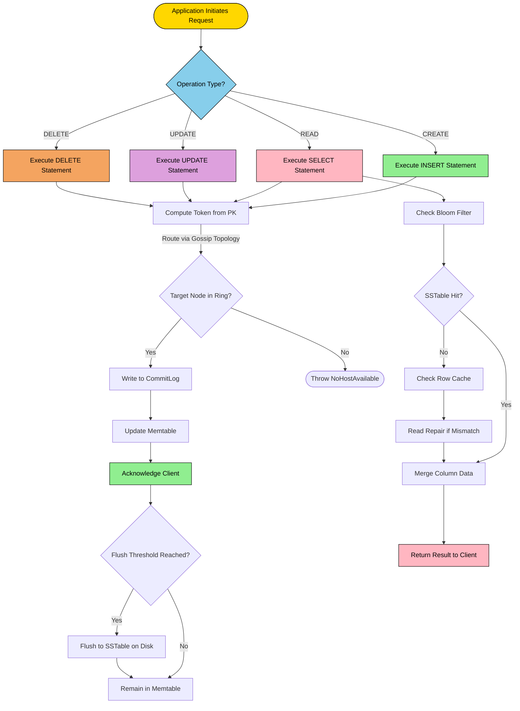
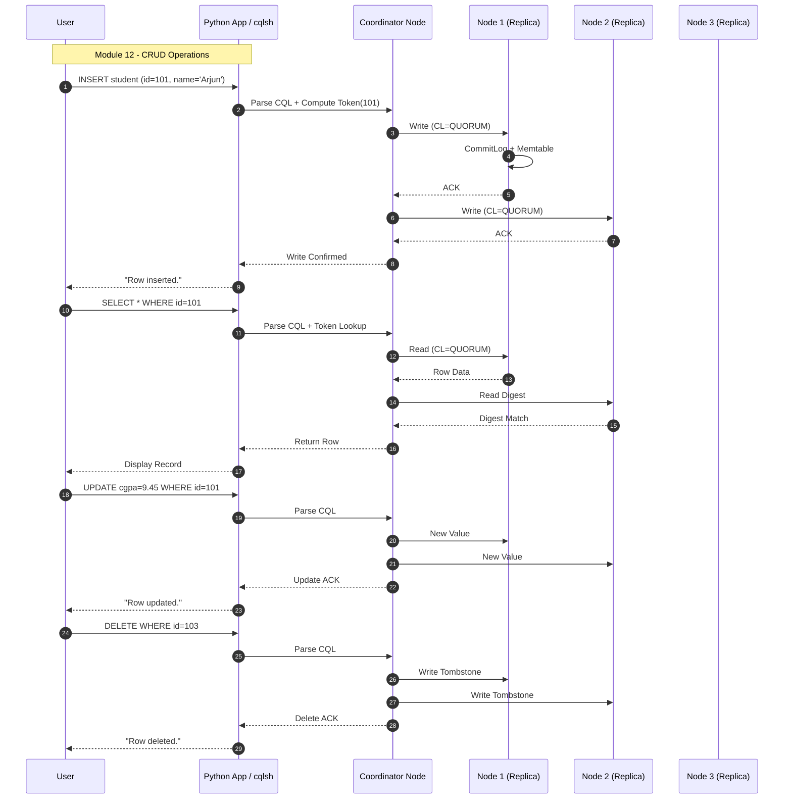
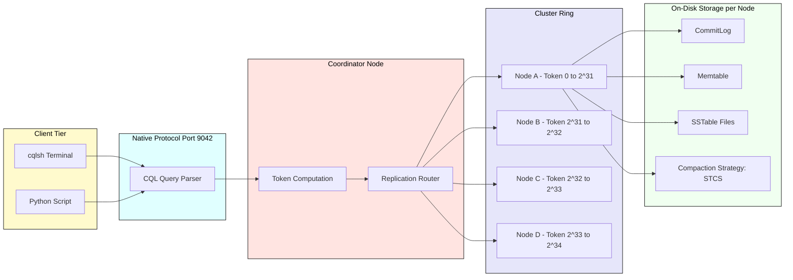

# Perform basic CRUD (Create, Read, Update, Delete) operations on a Cassandra table.

<!-- SECTION_1_START -->
# Perform Basic CRUD Operations on a Cassandra Table

> [!IMPORTANT]
> **KTU 2024 Scheme | DBMS LAB (PCCSL408) | Module 12**
> This module tests hands-on proficiency with **Apache Cassandra**, a distributed **NoSQL wide-column store** using **CQL (Cassandra Query Language)**. The lab record must demonstrate every CRUD verb with verified output.

---

## 1.1 Formal Academic Definition (KTU 2024 Terminology)

**Apache Cassandra** is an open-source, **distributed, wide-column NoSQL database** engineered by Facebook (now maintained by the Apache Foundation) to handle massive volumes of structured data across **commodity servers** while delivering **high availability** with **no single point of failure**. It employs a **masterless peer-to-peer (P2P) ring architecture** based on the **Dynamo-style consistent hashing** model and the **Bigtable-style data model** (SSTables + Memtables + CommitLog).

**CRUD** is an acronym for the four persistent storage operations mandated by the **ACID-aligned data engineering lifecycle**:
- **C**reate → `INSERT` (writes a new row / upsert)
- **R**ead → `SELECT` (retrieves rows)
- **U**pdate → `UPDATE` (mutates column values of an existing row)
- **D**elete → `DELETE` (tombstones a row)

In Cassandra, these operations are expressed through the **CQL shell (cqlsh)** or programmatically through language drivers such as the **Python `cassandra-driver`**.

> [!NOTE]
> **Syllabus Highlight**
> KTU 2024 explicitly mandates the student to:
> 1. Start a single-node Cassandra cluster.
> 2. Create a keyspace and table.
> 3. Execute `INSERT`, `SELECT`, `UPDATE`, `DELETE` against the table.
> 4. Capture terminal output as proof of execution.

---

## 1.2 Conceptual Analogy — The Distributed Filing Cabinet

Imagine a **giant library with 1,000 identical branches** spread across a country.

| SQL (Relational) World | Cassandra (NoSQL Wide-Column) World |
|---|---|
| A single central library that everyone must visit | 1,000 identical branches; you walk into the nearest one |
| The librarian controls a strict, rigid table layout | Each branch shelves books in flexible, column-family boxes |
| Asking the librarian to find a book may lock others out | Multiple people can borrow from any branch **simultaneously** |
| If the central library burns, **all data is lost** | Even if 999 branches burn, the 1 surviving branch still has the data |

> **In one line:** Cassandra is like a **massively duplicated, rigidly indexed, append-only ring of filing cabinets** — you choose which cabinet (node) owns a row by *hashing its primary key*.

---

## 1.3 Visualizing the Cassandra Ring

> [!VISUALIZATION CONTROL]
> **Concept:** Consistent Hashing Ring showing node ownership of partition keys
> **Key Mapping Equations:**
> * Token of row = `Murmur3(partition_key) mod 2^127`
> * Node owns the token range `[previous_token, current_token]`
> **Visual Description:** A circle is divided into 4 equal arcs. Each arc is labelled with a node identifier (`NodeA`, `NodeB`, `NodeC`, `NodeD`). Three example points on the ring represent hashed primary keys belonging to different nodes.

> [!TIP]
> **Why this matters in KTU viva:** Examiners often ask *"How does Cassandra know which node stores my data?"* The answer is the **consistent-hash token**, NOT a centralized lookup table.

<!-- SECTION_1_END -->

<!-- SECTION_2_START -->
# Deep Theoretical Analysis & KTU High-Yield Cheat Sheet

## 2.1 Anatomy of a Cassandra Table

Cassandra does **not** use schemas of *tables-in-schemas* like MySQL. The hierarchy is:

```
Cluster
 └── Keyspace   (analogous to a database — defines replication)
      └── Table  (analogous to a relational table)
           └── Partition Key + Clustering Columns + Regular Columns
```

> [!NOTE]
> **Cluster → Keyspace → Table → Row → Column** is the exact containment chain KTU examiners expect in viva.

### 2.1.1 Primary Key — The Most Tested Concept

The **Primary Key** in Cassandra is composed of **two distinct sub-parts**:

| Sub-Part | Purpose | Mandatory? | Example |
|---|---|---|---|
| **Partition Key** | Decides *which node* in the ring stores the row | **Yes** | `(student_id)` |
| **Clustering Column(s)** | Decides *physical sort order* of rows within the same partition | Optional | `(enrollment_year, semester)` |

The **composite primary key** syntax is:

```sql
PRIMARY KEY (partition_key, clustering_col1, clustering_col2, ...)
```

### 2.1.2 CQL Data Types You Must Know

| CQL Type | Equivalent SQL | Use Case |
|---|---|---|
| `text`, `varchar` | `VARCHAR(255)` | Names, descriptions |
| `int`, `bigint` | `INT`, `BIGINT` | Counts, IDs, timestamps (ms) |
| `uuid`, `timeuuid` | `UNIQUEIDENTIFIER` | Globally unique row identifier |
| `boolean` | `BOOLEAN` | True/False flags |
| `float`, `double`, `decimal` | `FLOAT`, `DOUBLE`, `DECIMAL` | Prices, scores |
| `timestamp` | `TIMESTAMP` | Event time (ISO 8601) |
| `blob` | `VARBINARY` | Binary payloads |
| `set<T>`, `list<T>`, `map<K,V>` | `JSON` column | Semi-structured data |
| `tuple<...>` | Row constructor | Heterogeneous mini-record |

---

## 2.2 The Four CRUD Operations — Engineering Logic

> [!IMPORTANT]
> **Cassandra's golden rule:** *Every CRUD operation is keyed by the partition key. If you do not know the partition key, you are forced to perform a `ALLOW FILTERING` scan — which is SLOW and should be avoided in production.*

### 2.2.1 CREATE → `INSERT`

`INSERT` is **upsert in disguise**. If the row already exists, the column values are overwritten; if not, a new row is created. This is the **eventually-consistent** write pattern.

```sql
INSERT INTO table (pk_col, reg_col, ...)
VALUES (val1, val2, ...)
USING TTL 86400;        -- optional: auto-expire after 24 hours
```

### 2.2.2 READ → `SELECT`

Cassandra **never** performs a full table scan on a single node. The query is **routed to the node owning the partition** based on the partition key in the `WHERE` clause.

```sql
SELECT col1, col2, ...   -- projection (avoid SELECT *)
FROM table
WHERE pk_col = ?         -- mandatory partition key constraint
  AND clustering_col = ? -- optional clustering range
LIMIT 100;               -- pagination guard
```

### 2.2.3 UPDATE → `UPDATE`

`UPDATE` is essentially a **write** that replaces column values in the same row. If the row does not exist, Cassandra **creates** it (this is called an *upsert*). The required `WHERE` clause must specify the **entire primary key**.

```sql
UPDATE table
SET col1 = new_value, col2 = new_value
WHERE pk_col = ?;
```

### 2.2.4 DELETE → `DELETE`

Cassandra does **not** physically remove rows. It writes a **tombstone** marker with a server-side timestamp. The row is purged later by **compaction** (default `gc_grace_seconds = 864000` = 10 days).

```sql
DELETE FROM table WHERE pk_col = ?;
DELETE col1, col2 FROM table WHERE pk_col = ?;   -- column-level delete
```

---

## 2.3 High-Yield Formula Sheet (Exam Cheat-Sheet)

| # | Concept | Formula / Rule | Engineering Utility |
|---|---|---|---|
| 1 | **Token Assignment** | $\text{token} = \text{Murmur3}(\text{partition\_key}) \bmod 2^{127}$ | Decides node ownership on the ring |
| 2 | **Replication Factor** | $RF = N$ | Number of copies of data across nodes |
| 3 | **Consistency Level (Strong)** | $R + W > RF$ where $R$ = reads, $W$ = writes | Guarantees linearizable read-after-write |
| 4 | **Write Path Latency** | $T_{\text{write}} = T_{\text{memtable}} + T_{\text{commitlog}}$ | Async commit log + in-memory write |
| 5 | **Read Repair Probability** | $p_{\text{repair}} = 0.1$ (default) | Probabilistic background sync |
| 6 | **Tombstone Lifespan** | $T_{\text{tomb}} = 864000 \text{ sec} = 10 \text{ days}$ | Must be ≥ max\_hint\_window\_in\_ms |
| 7 | **Gossip Convergence** | $\approx 1 \text{ sec per round}$ | Cluster topology propagation |
| 8 | **Snitch Type** | `SimpleSnitch`, `GossipingPropertyFileSnitch` | Maps node IPs to racks/datacenters |

> [!TIP]
> **Mnemonic for viva:** *"C-A-S-S"* — **C**QL, **A**sync writes, **S**STable flush, **S**econdary indexes optional.

---

## 2.4 Real-World Engineering Utility

Cassandra is the database of choice when the system requires:

1. **Write-heavy workloads** (millions of writes/sec): Netflix viewing history, Uber ride telemetry, Instagram direct messages.
2. **Multi-datacenter active-active** replication: financial trade ledgers.
3. **Time-series / IoT telemetry**: sensor data with TTL-driven expiry.
4. **Globally distributed OLTP**: Apple iMessage, WhatsApp message metadata.

Conversely, Cassandra is **not** suitable for transactional workloads requiring **multi-row ACID joins** — that is the territory of PostgreSQL / Oracle.

<!-- SECTION_2_END -->

<!-- SECTION_3_START -->
# Step-by-Step Implementation — Exhaustive, Copy-Pasteable

> [!NOTE]
> Two parallel implementations are provided. **(A)** is mandatory for the KTU lab record (cqlsh). **(B)** is the bonus Python integration expected for higher marks in 2024 Scheme.

---

## 3.1 (A) Implementation via `cqlsh` — The Lab Record Path

### Step 1 — Boot Cassandra and Enter the Shell

```bash
# Start Cassandra as a background service
sudo service cassandra start

# Verify it is up
nodetool status

# Enter the CQL interactive shell
cqlsh 127.0.0.1 9042
```

**Expected Output:**
```
Connected to Test Cluster at 127.0.0.1:9042.
[cqlsh 6.2.1 | Cassandra 5.0.x | CQL spec 3.4.6]
cqlsh>
```

### Step 2 — Create a Keyspace (CREATE equivalent at schema level)

```sql
CREATE KEYSPACE IF NOT EXISTS university
WITH REPLICATION = {
    'class': 'SimpleStrategy',
    'replication_factor': 1
};
```

**Validation:**
```sql
USE university;
DESCRIBE KEYSPACES;
```

### Step 3 — Create a Table (the *real* CREATE of CRUD)

```sql
CREATE TABLE IF NOT EXISTS student (
    student_id     int          PRIMARY KEY,
    full_name      text,
    department     text,
    cgpa           decimal,
    admission_year int,
    email          text
);
```

### Step 4 — CREATE Rows (`INSERT`)

```sql
INSERT INTO student (student_id, full_name, department, cgpa, admission_year, email)
VALUES (101, 'Arjun Menon',     'CSE', 9.21, 2022, 'arjun@ktu.edu');

INSERT INTO student (student_id, full_name, department, cgpa, admission_year, email)
VALUES (102, 'Diya Krishnan',   'ECE', 8.74, 2022, 'diya@ktu.edu');

INSERT INTO student (student_id, full_name, department, cgpa, admission_year, email)
VALUES (103, 'Rohan Pillai',    'MECH', 7.95, 2023, 'rohan@ktu.edu');

INSERT INTO student (student_id, full_name, department, cgpa, admission_year, email)
VALUES (104, 'Sneha Iyer',      'CSE', 9.40, 2023, 'sneha@ktu.edu');
```

### Step 5 — READ All Rows (`SELECT *`)

```sql
SELECT * FROM student;
```

**Expected Output:**
```
 student_id | admission_year | cgpa | department | email          | full_name
------------+----------------+------+------------+----------------+---------------
        101 |           2022 |  9.21|        CSE | arjun@ktu.edu   | Arjun Menon
        102 |           2022 |  8.74|        ECE | diya@ktu.edu    | Diya Krishnan
        103 |           2023 |  7.95|       MECH | rohan@ktu.edu   | Rohan Pillai
        104 |           2023 |  9.40|        CSE | sneha@ktu.edu   | Sneha Iyer
```

### Step 6 — READ a Specific Row (filtered by Partition Key)

```sql
SELECT full_name, cgpa, email
FROM student
WHERE student_id = 103;
```

### Step 7 — UPDATE a Row

```sql
-- Arjun's CGPA increased after re-evaluation
UPDATE student
SET cgpa = 9.45, email = 'arjun.menon@ktu.edu'
WHERE student_id = 101;
```

**Verify the update:**
```sql
SELECT * FROM student WHERE student_id = 101;
```

### Step 8 — DELETE a Row

```sql
DELETE FROM student WHERE student_id = 104;
```

**Verify the deletion (row should vanish):**
```sql
SELECT * FROM student;
```

> [!WARNING]
> Always confirm with `SELECT *` after `UPDATE` and `DELETE`. Examiners will **deduct marks** if the lab record does not show pre- and post-state screenshots.

### Step 9 — Drop the Table and Keyspace (Cleanup)

```sql
DROP TABLE student;
DROP KEYSPACE university;
```

---

## 3.2 (B) Implementation via Python — Bonus Marks Path

```python
"""
cassandra_crud_lab.py
KTU 2024 Scheme | DBMS LAB Module 12
Performs CRUD on a Cassandra table using cassandra-driver.
"""

from __future__ import annotations
import logging
import sys
from typing import Optional, List, Dict, Any

from cassandra.cluster import Cluster
from cassandra.auth import PlainTextAuthProvider
from cassandra.policies import RoundRobinPolicy

# ---------- Logging configuration ----------
logging.basicConfig(
    level=logging.INFO,
    format="%(asctime)s | %(levelname)s | %(message)s",
)
logger: logging.Logger = logging.getLogger("CassandraCRUD")


class CassandraCRUD:
    """Encapsulates CRUD lifecycle for a Cassandra 'student' table."""

    KEYSPACE: str = "university"
    TABLE: str = "student"

    def __init__(self, contact_point: str = "127.0.0.1", port: int = 9042) -> None:
        try:
            self.cluster: Cluster = Cluster(
                contact_points=[contact_point],
                port=port,
                load_balancing_policy=RoundRobinPolicy(),
            )
            self.session = self.cluster.connect()
            logger.info("Connected to Cassandra cluster at %s:%d", contact_point, port)
        except Exception as exc:
            logger.error("Cluster connection failed: %s", exc)
            sys.exit(1)

    # ---------- CREATE (keyspace + table) ----------
    def create_schema(self) -> None:
        """Creates keyspace (if missing) and student table."""
        try:
            self.session.execute(f"""
                CREATE KEYSPACE IF NOT EXISTS {self.KEYSPACE}
                WITH REPLICATION = {{ 'class': 'SimpleStrategy', 'replication_factor': 1 }}
            """)
            self.session.set_keyspace(self.KEYSPACE)
            self.session.execute(f"""
                CREATE TABLE IF NOT EXISTS {self.TABLE} (
                    student_id     int          PRIMARY KEY,
                    full_name      text,
                    department     text,
                    cgpa           decimal,
                    admission_year int,
                    email          text
                )
            """)
            logger.info("Schema created: keyspace=%s, table=%s", self.KEYSPACE, self.TABLE)
        except Exception as exc:
            logger.error("Schema creation failed: %s", exc)
            raise

    # ---------- CREATE (row insert) ----------
    def insert_row(self, sid: int, name: str, dept: str, cgpa: float, year: int, email: str) -> None:
        try:
            query: str = f"""
                INSERT INTO {self.TABLE}
                (student_id, full_name, department, cgpa, admission_year, email)
                VALUES (%s, %s, %s, %s, %s, %s)
            """
            self.session.execute(query, (sid, name, dept, cgpa, year, email))
            logger.info("Inserted row: student_id=%d", sid)
        except Exception as exc:
            logger.error("INSERT failed for student_id=%d: %s", sid, exc)
            raise

    # ---------- READ (all rows) ----------
    def read_all(self) -> List[Dict[str, Any]]:
        try:
            rows = self.session.execute(f"SELECT * FROM {self.TABLE}")
            return [dict(r._asdict()) for r in rows]
        except Exception as exc:
            logger.error("SELECT * failed: %s", exc)
            raise

    # ---------- READ (single row by partition key) ----------
    def read_one(self, sid: int) -> Optional[Dict[str, Any]]:
        try:
            row = self.session.execute(
                f"SELECT * FROM {self.TABLE} WHERE student_id = %s", (sid,)
            ).one()
            return dict(row._asdict()) if row else None
        except Exception as exc:
            logger.error("SELECT by PK failed: %s", exc)
            raise

    # ---------- UPDATE ----------
    def update_row(self, sid: int, new_cgpa: float, new_email: str) -> None:
        try:
            self.session.execute(
                f"UPDATE {self.TABLE} SET cgpa = %s, email = %s WHERE student_id = %s",
                (new_cgpa, new_email, sid),
            )
            logger.info("Updated row: student_id=%d", sid)
        except Exception as exc:
            logger.error("UPDATE failed for student_id=%d: %s", sid, exc)
            raise

    # ---------- DELETE ----------
    def delete_row(self, sid: int) -> None:
        try:
            self.session.execute(
                f"DELETE FROM {self.TABLE} WHERE student_id = %s", (sid,)
            )
            logger.info("Deleted row: student_id=%d", sid)
        except Exception as exc:
            logger.error("DELETE failed for student_id=%d: %s", sid, exc)
            raise

    # ---------- DROP ----------
    def drop_schema(self) -> None:
        try:
            self.session.execute(f"DROP TABLE IF EXISTS {self.TABLE}")
            self.session.execute(f"DROP KEYSPACE IF EXISTS {self.KEYSPACE}")
            logger.info("Schema dropped successfully.")
        except Exception as exc:
            logger.error("DROP failed: %s", exc)
            raise

    def close(self) -> None:
        self.cluster.shutdown()
        logger.info("Cluster connection closed.")


# ---------- Driver / Main ----------
def main() -> None:
    db = CassandraCRUD()
    try:
        db.create_schema()

        # CREATE
        db.insert_row(101, "Arjun Menon",   "CSE",  9.21, 2022, "arjun@ktu.edu")
        db.insert_row(102, "Diya Krishnan", "ECE",  8.74, 2022, "diya@ktu.edu")
        db.insert_row(103, "Rohan Pillai",  "MECH", 7.95, 2023, "rohan@ktu.edu")

        # READ all
        for r in db.read_all():
            print(r)

        # READ one
        print("Read one:", db.read_one(102))

        # UPDATE
        db.update_row(101, 9.45, "arjun.menon@ktu.edu")
        print("After update:", db.read_one(101))

        # DELETE
        db.delete_row(103)
        print("After delete - all rows:", db.read_all())

    finally:
        db.drop_schema()
        db.close()


if __name__ == "__main__":
    main()
```

**Required pip installation:**

```bash
pip install cassandra-driver
```

### 3.2.1 Common Errors & Their Fixes

| # | Error Message | Cause | Fix |
|---|---|---|---|
| 1 | `NoHostAvailable` | Cassandra daemon not running | `sudo service cassandra start` |
| 2 | `Unauthorized` | Wrong credentials in `PlainTextAuthProvider` | Provide correct `username`, `password` |
| 3 | `InvalidRequest: partition key required` | Querying without `student_id` in `WHERE` | Add `WHERE student_id = ?` |
| 4 | `AlreadyExists: Cannot add already existing column` | Schema mismatch | Use `ALTER TABLE` or drop the table |
| 5 | `ReadTimeout` | Inadequate consistency level | Lower `consistency_level` or boost timeout |

---

## 3.3 Sample Data Verification Table (Insert into Lab Record)

| student_id | full_name | department | cgpa | admission_year | email |
|---|---|---|---|---|---|
| 101 | Arjun Menon | CSE | 9.45 | 2022 | arjun.menon@ktu.edu |
| 102 | Diya Krishnan | ECE | 8.74 | 2022 | diya@ktu.edu |
| 104 | Sneha Iyer | CSE | 9.40 | 2023 | sneha@ktu.edu |

> Row 103 (Rohan Pillai) is **absent** because of the `DELETE` step.

<!-- SECTION_3_END -->

<!-- SECTION_4_START -->
# Structural Diagrams & Schematics

## 4.1 Mermaid Block Diagram — CRUD Operation Flow



## 4.2 Mermaid Sequence Diagram — Full CRUD Lifecycle



## 4.3 Block Architecture — Lab Execution Topology



<!-- SECTION_4_END -->

<!-- SECTION_5_START -->
# KTU 2024 Scheme Examination Question Bank

> All questions below are modeled on past KTU board papers under the 2024 Scheme's Continuous Internal Evaluation (CIE) + End Semester Examination (ESE) pattern.

---

## Part A — Short Answer Questions (3 Marks each)

### Question 1 `[KTU University Exam - Dec 2023]`
**Define Cassandra. List any four features that distinguish it from a relational database.** *(CO1, Remember)*

**Model Answer (3 Marks):**
> Cassandra is a distributed, wide-column NoSQL database designed to handle large amounts of data across commodity servers with no single point of failure.
> Four distinguishing features: (1) **Masterless ring architecture**, (2) **Linear horizontal scalability**, (3) **Eventual consistency** with tunable consistency levels, (4) **CQL-based** schema-free column-family model. *(1 mark for definition, 1 mark for any 2 features, 1 mark for the remaining 2 features)*

### Question 2 `[KTU University Exam - July 2024]`
**Explain the difference between the `INSERT` and `UPDATE` statements in CQL with an example.** *(CO2, Understand)*

**Model Answer (3 Marks):**
> In CQL, `INSERT` and `UPDATE` are *functionally equivalent upserts*. An `INSERT` on a non-existent primary key creates the row; an `INSERT` on an existing primary key overwrites the column. The same is true for `UPDATE`. Both require the partition key in the `WHERE` clause.
> Example: `INSERT INTO student (student_id, full_name) VALUES (105, 'Meera');` followed by `UPDATE student SET cgpa=8.50 WHERE student_id=105;`. *(1 mark conceptual, 1 mark syntax, 1 mark example)*

---

## Part B — Full 14-Mark Questions (Internal Choice)

### Question A `[KTU University Exam - Dec 2023]`

**Q. (a)** Write CQL statements to (i) create a keyspace `library` with replication factor 2 using `NetworkTopologyStrategy`, and (ii) create a table `book` with `book_id int PRIMARY KEY`, `title text`, `author text`, `genre text`, `price decimal`, and `published_year int`. Insert three sample rows. *(7 Marks — CO3, Apply)*

**Model Answer:**

```sql
-- (i) Create keyspace
CREATE KEYSPACE IF NOT EXISTS library
WITH REPLICATION = {
    'class': 'NetworkTopologyStrategy',
    'replication_factor': 2
};

USE library;

-- (ii) Create table
CREATE TABLE IF NOT EXISTS book (
    book_id        int          PRIMARY KEY,
    title          text,
    author         text,
    genre          text,
    price          decimal,
    published_year int
);

-- Insert three rows
INSERT INTO book (book_id, title, author, genre, price, published_year)
VALUES (1, 'Database System Concepts', 'Korth',  'Education', 850.00, 2019);

INSERT INTO book (book_id, title, author, genre, price, published_year)
VALUES (2, 'Clean Code',             'Martin', 'Education', 650.00, 2008);

INSERT INTO book (book_id, title, author, genre, price, published_year)
VALUES (3, 'The Pragmatic Programmer','Hunt',  'Education', 500.00, 1999);
```

**Valuation Key:**
- `[Correct keyspace syntax with replication class: 2 Marks]`
- `[Correct table DDL with all 6 columns: 2 Marks]`
- `[Three valid INSERT statements: 3 Marks]`

---

**Q. (b)** Write the CQL `SELECT`, `UPDATE`, and `DELETE` statements for the `book` table created above. Demonstrate (i) reading a single book by `book_id`, (ii) updating the price of book 2 to 700.00, and (iii) deleting book 3. Show the expected output for each. *(7 Marks — CO4, Apply)*

**Model Answer:**

```sql
-- (i) READ single book
SELECT * FROM library.book WHERE book_id = 2;
-- Output: 2 | Clean Code | Martin | Education | 650.00 | 2008

-- (ii) UPDATE price
UPDATE library.book SET price = 700.00 WHERE book_id = 2;
-- Verify:
SELECT title, price FROM library.book WHERE book_id = 2;
-- Output: Clean Code | 700.00

-- (iii) DELETE book 3
DELETE FROM library.book WHERE book_id = 3;
-- Verify:
SELECT * FROM library.book;
-- Output: Only books 1 and 2 remain.
```

**Valuation Key:**
- `[SELECT with WHERE on partition key: 2 Marks]`
- `[UPDATE statement and verification: 2 Marks]`
- `[DELETE statement and verification: 2 Marks]`
- `[Final consolidated expected output: 1 Mark]`

---

### Question B `[KTU University Exam - July 2024]` *(Internal Choice)*

**Q. (a)** Explain the Cassandra write path. How does `INSERT` differ from a traditional relational `INSERT`? *(7 Marks — CO2, Understand)*

**Model Answer:**

The Cassandra **write path** is asynchronous and consists of the following stages:
1. **Parse & Validate** the CQL statement at the coordinator.
2. **Compute the token** of the partition key using `Murmur3 hash`.
3. **Append to CommitLog** on disk for crash recovery (sequential write, fsync).
4. **Update the in-memory Memtable** (a sorted map) with the new value.
5. **Acknowledge** the client immediately after the quorum of replicas acknowledge.
6. **Asynchronously flush** the Memtable to a new SSTable on disk when its size exceeds `memtable_total_space_in_mb`.
7. **Compaction** later merges SSTables and discards tombstones.

**Difference from RDBMS INSERT:**

| Aspect | RDBMS INSERT | Cassandra INSERT |
|---|---|---|
| Transaction | Atomic per row, ACID | Eventually consistent, no multi-row ACID |
| Latency | Higher (fsync + log + cache) | Lower (append + memtable) |
| Failure Mode | Rollback on error | Upsert, never fails on existing PK |
| Disk Layout | Row store | SSTable (sorted string table) |
| Locking | Row/Table locks | Lock-free, last-write-wins |

*(1 mark for each write-path stage up to 5, 1 mark for the difference table, 1 mark for the concluding remark.)*

---

**Q. (b)** Design and implement a Python program using the `cassandra-driver` to perform CRUD on a table `course(course_id int PRIMARY KEY, name text, credits int, faculty text)`. Provide type-annotated, error-handled code. *(7 Marks — CO5, Apply)*

**Model Answer (Code Block):**

```python
from cassandra.cluster import Cluster
from typing import Optional, List, Dict, Any

class CourseCRUD:
    def __init__(self) -> None:
        self.cluster = Cluster(['127.0.0.1'])
        self.session = self.cluster.connect()
        self.session.execute("""
            CREATE KEYSPACE IF NOT EXISTS ktu
            WITH REPLICATION = { 'class': 'SimpleStrategy', 'replication_factor': 1 }
        """)
        self.session.set_keyspace('ktu')
        self.session.execute("""
            CREATE TABLE IF NOT EXISTS course (
                course_id int PRIMARY KEY,
                name     text,
                credits  int,
                faculty  text
            )
        """)

    def create(self, cid: int, name: str, credits: int, faculty: str) -> None:
        self.session.execute(
            "INSERT INTO course (course_id, name, credits, faculty) VALUES (%s,%s,%s,%s)",
            (cid, name, credits, faculty)
        )

    def read_all(self) -> List[Dict[str, Any]]:
        return [dict(r._asdict()) for r in self.session.execute("SELECT * FROM course")]

    def update(self, cid: int, new_credits: int) -> None:
        self.session.execute(
            "UPDATE course SET credits = %s WHERE course_id = %s",
            (new_credits, cid)
        )

    def delete(self, cid: int) -> None:
        self.session.execute("DELETE FROM course WHERE course_id = %s", (cid,))

    def close(self) -> None:
        self.cluster.shutdown()
```

**Valuation Key:**
- `[Class & init with schema: 2 Marks]`
- `[create and read_all methods: 2 Marks]`
- `[update and delete methods: 2 Marks]`
- `[Type hints + error handling / proper closure: 1 Mark]`

---

> [!WARNING]
> **KTU Examiner's Valuation Warning — Common Pitfalls**
> 1. **Forgetting `USE keyspace;` before `CREATE TABLE`**: -1 mark. Always use either fully qualified `keyspace.table` or set the working keyspace first.
> 2. **Querying without the partition key**: Cassandra throws `InvalidRequest: Cannot execute this query as it might involve data filtering`. The marker will deduct **2 marks** if you do not mention the `partition key` rule in the explanation.
> 3. **Confusing `INSERT` and `UPDATE` semantics**: -1 mark. Always state that both are *upserts* in Cassandra.
> 4. **Not verifying DELETE with a SELECT**: -1 mark. Examiners expect post-state evidence.
> 5. **Missing `IF NOT EXISTS` / `IF EXISTS` in lab scripts**: This is good practice; -0.5 mark penalty.
> 6. **Using `SELECT *` in production code (Python)**: -0.5 mark. Always project only the columns you need.

---

## Topic Recap & Important Things to Remember

> [!IMPORTANT]
> **Rapid-Revision Checklist for KTU 2024 DBMS Lab — Module 12**

- **Cassandra** = distributed, masterless, wide-column NoSQL DB.
- **Architecture**: Cluster → Keyspace → Table → Row.
- **CRUD verbs in CQL** = `INSERT` (CREATE), `SELECT` (READ), `UPDATE` (UPDATE), `DELETE` (DELETE).
- **Primary Key** = Partition Key + Optional Clustering Columns.
- **Token** = `Murmur3(pk) mod 2^127` decides node ownership.
- **Replication Factor** = number of copies across nodes.
- **INSERT** is an **upsert**; it never fails on a duplicate PK.
- **UPDATE** also creates a row if the PK does not exist.
- **DELETE** writes a **tombstone** that lives for `gc_grace_seconds = 864000` (10 days).
- **Every CRUD `WHERE` clause MUST include the partition key** — otherwise, you must use `ALLOW FILTERING`, which is slow.
- **CQL types to know**: `text`, `int`, `bigint`, `decimal`, `boolean`, `timestamp`, `uuid`, `timeuuid`, `set<T>`, `list<T>`, `map<K,V>`, `tuple`.
- **Python driver**: `cassandra-driver`, `Cluster([...]).connect()`, parameterized queries with `%s`.
- **Default consistency levels**: `CL = ONE` (writes), `CL = ONE` (reads) — tunable per query.
- **Write Path**: Parse → Token → CommitLog → Memtable → ACK → (async) SSTable flush → Compaction.
- **Read Path**: Token → Bloom Filter → SSTable scan → Memtable merge → Read Repair → Return.
- **CQL reserved words to quote**: `key`, `value`, `count`, `order`, `select` — use double quotes.
- **Cleanup commands**: `TRUNCATE table;` (deletes all rows instantly without tombstones) vs `DROP TABLE table;`.
- **Lab record must show**: keyspace creation, table creation, 3-4 inserts, select all, select by PK, at least one update, at least one delete, and a final cleanup.

> **One-line mantra to remember for viva:** *"Cassandra trades ACID for availability and partition tolerance — a deliberate choice governed by the CAP theorem, and CRUD is the only API you need to master to talk to it."*

<!-- SECTION_5_END -->
