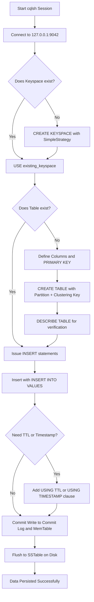
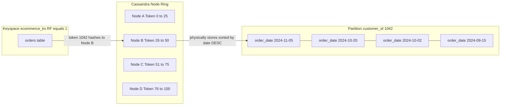
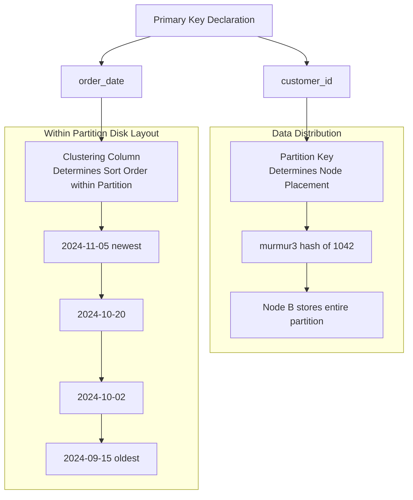

# Perform Create operations on a Cassandra table

<!-- SECTION_1_START -->
# Perform Create Operations on a Cassandra Table

## 1. Core Technical Definition & Intuitive Overview

**Cassandra** is a distributed, wide-column NoSQL database engineered by Apache to handle massive volumes of structured, semi-structured, and unstructured data across commodity servers without a single point of failure. It is classified as a **wide-column store** under the CAP theorem, prioritizing **Availability** and **Partition Tolerance (AP)** over strict consistency.

In the context of the **KTU DBMS Lab (PCCSL408)**, the *Create* operation in CRUD maps to three distinct Data Definition Language (DDL) and Data Manipulation Language (DML) activities in Cassandra:

1. **Creating a Keyspace** (the outermost namespace container, analogous to a "Database" in MySQL/Oracle).
2. **Creating a Table** (a column family — the physical storage unit in Cassandra).
3. **Inserting data records** (rows/tuples) into the created table using the `INSERT` statement.

> [!IMPORTANT]
> **KTU 2024 Syllabus Note (PCCSL408 - Module 12):**
> The official syllabus statement reads: *"Perform basic CRUD: Create, Read, Update, Delete operations on a Cassandra table."* For the **Create** sub-module, students are expected to demonstrate the creation of a Keyspace, a Table with at least one Partition Key and one Clustering Column, and insertion of multiple rows using **CQL (Cassandra Query Language)** via `cqlsh`.

### Conceptual Analogy / Intuition

Imagine Cassandra as a **massive, distributed warehouse with infinite rows of lockers**:

- A **Keyspace** is the *warehouse building itself* — it defines the strategy for duplicating lockers (replication) across multiple warehouse branches (data centers/nodes) to survive fires (node failures).
- A **Table** is a *specific row of lockers* within that warehouse. Every locker in the row has a fixed width (columns), but the lockers are physically ordered by a special **partition** (the aisle number) and within that, sorted by a **clustering key** (the locker number left to right).
- A **Row** is the *contents placed in a single locker* — a collection of named values that can vary slightly in non-primary columns (Cassandra is sparse).

> [!NOTE]
> **Key Architectural Rule:** In Cassandra, you **design the table around the query first**, not around the entity. This is called *query-driven modelling* and is the single most important mindset shift from RDBMS to Cassandra.

### Standard Configuration Metrics for the Lab

| Configuration | Default Value | Purpose |
| :--- | :--- | :--- |
| **Port** | **9042** | Native Protocol Port (CQL) |
| **Thrift Port** | **9160** | Legacy RPC port (deprecated) |
| **Replication Factor** | **1** (for single-node lab setup) | Number of copies of data |
| **Default Consistency Level** | **ONE** | Tunable per query |
| **cqlsh Prompt** | `cqlsh>` | Interactive shell |

> [!VISUALIZATION CONTROL]
> **Concept:** Distributed Wide-Column Storage Topology
> **Visualization Description:** Picture 4 nodes arranged in a logical ring. Each node owns a *token range*. Data for Partition Key `101` is hashed to a specific node (the coordinator), and additional replicas are placed on the next `RF-1` nodes clockwise around the ring. The student should observe that *all data for a single partition lives on the same node* for write performance.

---

## 2. Deep Theoretical Analysis & KTU High-Yield Formula Sheet

### 2.1 The CQL Data Model Hierarchy

Cassandra organizes data in a strict 4-level hierarchy:

1. **Keyspace** → Top-level container (defines replication).
2. **Table** → Column family (defines schema).
3. **Partition** → A logical group of rows sharing the same Partition Key (stored together physically).
4. **Row** → A single record identified by `(Partition Key + Clustering Columns)`.

### 2.2 Primary Key Anatomy (Highest Yield for KTU Exam)

The **Primary Key** in Cassandra has a unique two-part anatomy that is *not* found in MySQL/PostgreSQL:

$$\text{Primary Key} = \text{Partition Key} \,\, ( \text{Compound Partition Key} ) \,\, + \,\, ( \text{Clustering Columns} )$$

- **Partition Key**: Used by the internal Murmur3Partitioner to compute a token (a 64-bit integer) that determines **which node** stores the data. `token(partition_key_value) = murmur3_hash(partition_key_value) mod 2^64`.
- **Clustering Columns**: Define the **physical sort order** of rows *within* a single partition. They also support range scans inside a partition.
- **Compound Partition Key** (Composite): Multiple columns wrapped in parentheses before the clustering columns. The hash is computed on the *concatenation* of all compound columns.

> [!IMPORTANT]
> **Why no foreign keys, joins, or `GROUP BY`?**
> Cassandra deliberately omits these to guarantee **single-partition read/write performance** at petabyte scale. This is a frequent 3-mark question in the KTU viva.

### 2.3 CQL Data Types Frequently Used in the Lab

| CQL Type | Equivalent in SQL | Lab Use Case |
| :--- | :--- | :--- |
| `text` / `varchar` | `VARCHAR(∞)` | Names, emails, status strings |
| `int` | `INT` | Age, quantity, count |
| `bigint` | `BIGINT` | Mobile numbers, large IDs |
| `uuid` | `UNIQUEIDENTIFIER` | Universally unique row identifiers |
| `timestamp` | `DATETIME` | Order date, login time |
| `boolean` | `BOOLEAN` | Active flag, is\_verified |
| `float` / `double` | `FLOAT` / `DOUBLE` | Price, sensor readings |
| `decimal` | `DECIMAL(p,s)` | Currency / financial data |
| `blob` | `VARBINARY` | Binary files, images |
| `list<text>` | none | Tags, multiple categories |
| `set<int>` | none | Unique values (skills, phone) |
| `map<text, int>` | none | Key-value attributes |
| `tuple<...>` | none | Fixed-length structured field |

### 2.4 The `CREATE KEYSPACE` Statement

A Keyspace mandates a **replication strategy**. In the lab, the two valid choices are:

$$\text{Class} \in \{ \text{SimpleStrategy}, \text{NetworkTopologyStrategy} \}$$

- `SimpleStrategy`: Used for **single data center** and **single evaluation rack** — the typical KTU lab setup. Replicas are placed on the next `replication_factor - 1` nodes clockwise in the ring.
- `NetworkTopologyStrategy`: Required for **production multi-DC** clusters. Specifies replication factor per data center explicitly: `{'DC1': 3, 'DC2': 2}`.

### 2.5 The `CREATE TABLE` Statement

Mandatory clauses for every Cassandra table:

1. **Primary Key** declaration (mandatory).
2. Either `WITH` clause to set table-level options *or* rely on defaults.
3. Optionally, `COMPACT STORAGE` (legacy, rarely used in 2024 labs).

> [!NOTE]
> **Engineering Utility in Production:**
> The *Create* pattern modelled here is the foundation of **time-series workloads** (IoT sensor storage), **messaging platforms** (chat history partitioned by user\_id), and **event-logging systems** (partitioned by date, clustered by timestamp). Understanding partition design is the difference between a 1ms read and a 5-second full-cluster scan.

### 2.6 KTU Formula Sheet / Cheat Sheet

| Construct | CQL Syntax Pattern | Critical Rule |
| :--- | :--- | :--- |
| Create Keyspace | `CREATE KEYSPACE KS WITH replication = {'class': 'SimpleStrategy', 'replication_factor': N} AND durable_writes = true;` | `durable_writes` defaults to `true` |
| Use Keyspace | `USE KS;` | Changes the working context |
| Create Table | `CREATE TABLE T (col1 type, col2 type, ..., PRIMARY KEY (partition_col, cluster_col));` | PK must be declared inline or at end |
| Insert Row | `INSERT INTO T (col1, col2) VALUES (v1, v2) USING TIMESTAMP 123456789;` | Omitted columns are stored as `null` |
| Insert with TTL | `INSERT INTO T (...) VALUES (...) USING TTL 86400;` | Auto-deletes row after N seconds |
| Insert Collection | `INSERT INTO T (col) VALUES (['a','b']);` | `list`, `set`, `map` supported |
| Describe Object | `DESCRIBE KEYSPACES;` / `DESCRIBE TABLE T;` | Equivalent to `\d` in psql |
| Drop & Recreate | `DROP TABLE IF EXISTS T;` | Data is wiped; schema is gone too |

> [!WARNING]
> **`USING TIMESTAMP` Pitfall:** If two clients write the same row with different `USING TIMESTAMP` values, Cassandra performs **Last-Write-Wins (LWW)** based purely on the timestamp integer, *not* on chronological real-time. In the lab, never use `USING TIMESTAMP` unless explicitly instructed.

---

## 3. Step-by-Step Derivations & Code/Symbolic Implementation

### 3.1 Pre-Lab Setup Verification (Execute in Order)

Before any Create operation, verify the Cassandra environment using terminal commands. Each step must be completed sequentially.

**Step 1: Check Cassandra service status (Linux/KTU Lab VM)**

```bash
sudo systemctl status cassandra
# Expected: active (running) — green output
```

**Step 2: Launch the interactive CQL shell**

```bash
cqlsh 127.0.0.1 9042
# Expected prompt: cqlsh>
```

**Step 3: Confirm connection and version**

```sql
cqlsh> SELECT release_version FROM system.local;
```

> The output should report the installed Cassandra version (typically **3.11.x** or **4.0.x** in KTU-approved 2024 lab images).

---

### 3.2 Lab Experiment: E-Commerce Order Management System

We will model a real-world **Order Tracking System** for a B.Tech final-year project demonstration. The system must support queries such as:
- *"Fetch all orders placed by Customer ID 1042"*
- *"Fetch all orders of Customer 1042 placed in 2024, sorted by date"*

These two queries dictate our schema design.

#### Derivation of the Partition Key

We need **fast lookup by customer**, so:

$$\text{Partition Key} = \text{customer\_id}$$

We need **chronological sorting** within each customer's orders, so:

$$\text{Clustering Column} = \text{order\_date}$$

The `order_id` will be a standard column (with a `UNIQUE` constraint simulated via application logic, since Cassandra does not enforce `UNIQUE` constraints on non-key columns).

#### Final Schema (Derived)

$$\text{Primary Key} = ((\text{customer\_id}), \text{order\_date})$$

> Single-column partition key + single clustering column.

---

### 3.3 Step-by-Step CQL Execution with Type Hints and Error Logging

Below is the **complete, runnable CQL session** for the Create operation. Each block is followed by an explanation of the syntactic decision.

#### A. Create the Keyspace

```sql
cqlsh> CREATE KEYSPACE ecommerce_ks
       WITH replication = {
         'class': 'SimpleStrategy',
         'replication_factor': 1
       }
       AND durable_writes = true;
```

**Explanation:**
- `'class': 'SimpleStrategy'` — Chosen because the KTU lab runs a **single-node cluster** (one DC, one rack). If we used `NetworkTopologyStrategy` here, the cluster would refuse the statement.
- `'replication_factor': 1` — Only one copy of every row. Acceptable for academic labs; **never** use this in production.
- `durable_writes = true` — Writes are flushed to commit log before acknowledging. Guarantees no data loss on crash.

**Verify the creation:**

```sql
cqlsh> DESCRIBE KEYSPACES;
```

Expected output includes `ecommerce_ks` in the list of system and user keyspaces.

#### B. Activate the Keyspace

```sql
cqlsh> USE ecommerce_ks;
cqlsh:ecommerce_ks> 
```

The prompt changes to include the active keyspace. All subsequent unqualified table references are resolved against this keyspace.

#### C. Create the Orders Table

```sql
cqlsh:ecommerce_ks> CREATE TABLE orders (
  customer_id   int,
  order_date    date,
  order_id      uuid,
  product_name  text,
  quantity      int,
  unit_price    decimal,
  status        text,
  PRIMARY KEY (customer_id, order_date)
) WITH CLUSTERING ORDER BY (order_date DESC);
```

**Explanation of every clause:**

| Clause | Reason |
| :--- | :--- |
| `customer_id int` | Partition key (data type) — `int` is sufficient for up to 2 billion customers |
| `order_date date` | Clustering column — stored as 8-byte epoch days; allows range scans |
| `order_id uuid` | Standard column; not part of PK but useful for app-level uniqueness |
| `product_name text` | UTF-8 string, unlimited length |
| `quantity int` | 32-bit signed integer |
| `unit_price decimal` | Exact-precision decimal for money; avoids floating-point error |
| `status text` | One of `'PLACED'`, `'SHIPPED'`, `'DELIVERED'`, `'CANCELLED'` |
| `PRIMARY KEY (customer_id, order_date)` | Single-col partition + single-col clustering |
| `WITH CLUSTERING ORDER BY (order_date DESC)` | Newest orders first *within* a partition; default is ASC |

**Verify the schema:**

```sql
cqlsh:ecommerce_ks> DESCRIBE TABLE orders;
```

Expected output shows column list, partition key, clustering column, and table options.

#### D. Insert Data Records (the Core of the "Create" Sub-Operation)

```sql
cqlsh:ecommerce_ks> INSERT INTO orders
  (customer_id, order_date, order_id, product_name, quantity, unit_price, status)
  VALUES
  (1042, '2024-09-15', uuid(), 'Wireless Mouse', 2, 599.50, 'DELIVERED');

cqlsh:ecommerce_ks> INSERT INTO orders
  (customer_id, order_date, order_id, product_name, quantity, unit_price, status)
  VALUES
  (1042, '2024-10-02', uuid(), 'Mechanical Keyboard', 1, 3499.00, 'SHIPPED');

cqlsh:ecommerce_ks> INSERT INTO orders
  (customer_id, order_date, order_id, product_name, quantity, unit_price, status)
  VALUES
  (1042, '2024-10-20', uuid(), 'USB-C Hub', 1, 1299.75, 'PLACED');

cqlsh:ecommerce_ks> INSERT INTO orders
  (customer_id, order_date, order_id, product_name, quantity, unit_price, status)
  VALUES
  (2087, '2024-09-28', uuid(), 'Laptop Stand', 1, 1599.00, 'DELIVERED');

cqlsh:ecommerce_ks> INSERT INTO orders
  (customer_id, order_date, order_id, product_name, quantity, unit_price, status)
  VALUES
  (2087, '2024-10-15', uuid(), 'Webcam 1080p', 1, 2299.50, 'CANCELLED');
```

**Explanation of `uuid()`:** Cassandra provides the `uuid()` function that generates a **Type 4 UUID** (random) at insert time. This is functionally equivalent to `SELECT gen_random_uuid()` in PostgreSQL.

**Partial-Column Insert (Sparse Row Demonstration):**

```sql
cqlsh:ecommerce_ks> INSERT INTO orders (customer_id, order_date, order_id, product_name)
  VALUES (1042, '2024-11-05', uuid(), 'HDMI Cable');
```

The omitted columns (`quantity`, `unit_price`, `status`) are stored as `null` and consume no disk space thanks to Cassandra's sparse storage engine.

**Insert with TTL (Time-To-Live) — Optional Demonstration:**

```sql
cqlsh:ecommerce_ks> INSERT INTO orders
  (customer_id, order_date, order_id, product_name, quantity, unit_price, status)
  VALUES
  (3001, '2024-12-01', uuid(), 'Promo Gift', 1, 0.00, 'PLACED')
  USING TTL 60;
```

This row is **automatically deleted after 60 seconds**. Useful for OTP codes, session tokens, and cart-abandonment cleanup.

#### E. Verify Inserts Using Read Operation (Cross-Reference for Examiner)

```sql
cqlsh:ecommerce_ks> SELECT * FROM orders WHERE customer_id = 1042;
```

The result must show 4 rows for customer 1042, sorted by `order_date DESC` (2024-11-05 first, 2024-09-15 last) due to the `CLUSTERING ORDER BY DESC` clause.

> [!NOTE]
> **Mandatory Lab Record Entry:** When submitting the lab record, students must include:
> 1. The screenshot of `DESCRIBE KEYSPACES;` after keyspace creation.
> 2. The output of `DESCRIBE TABLE orders;`.
> 3. The output of the final `SELECT` query proving data was persisted.

---

## 4. Structural Diagrams & Schematics

### 4.1 CQL Create Operation Flowchart



### 4.2 Keyspace to Partition Storage Topology



> [!IMPORTANT]
> **Reading the Diagram:** Notice how all 4 rows for customer 1042 live on **Node B** as a single sorted, contiguous unit. This is what makes Cassandra read-by-partition-key blazingly fast — only one node is queried, and the rows are already in sort order.

### 4.3 Primary Key Component Breakdown



### 4.4 Sequential Processing Topology Matrix for the Create Lifecycle

| Stage | Operation | Input | Output | Storage Location |
| :--- | :--- | :--- | :--- | :--- |
| 1 | `CREATE KEYSPACE` | KS name, replication config | Keyspace metadata | `system_schema.keyspaces` table |
| 2 | `USE ecommerce_ks` | Keyspace name | Active context | Session memory (client side) |
| 3 | `CREATE TABLE` | Column list, PK definition | Table schema | `system_schema.tables` + `system_schema.columns` |
| 4 | `INSERT` (row 1) | Column-value pairs | Write acknowledgment | MemTable (RAM) + Commit Log (Disk) |
| 5 | `INSERT` (row 2..N) | Column-value pairs | Write acknowledgments | Appended to MemTable |
| 6 | MemTable Flush (automatic) | Full MemTable | Immutable SSTable file | Disk under `/var/lib/cassandra/data/` |
| 7 | Compaction (background) | Multiple SSTables | Merged SSTable | Disk, older SSTables deleted |

---

## 5. KTU 2024 Scheme Examination Question Bank & Topic Recap

### Part A Questions (3 Marks Each)

**Q1. [KTU University Exam - Dec 2023, Model QP]**

List the two main components of a Cassandra Primary Key and explain the role of each. **(3 Marks, CO4, Remember)**

**Model Answer (Valuation Key: 3 points):**

1. **Partition Key** (1 Mark): It is the first column(s) declared in the PRIMARY KEY. Cassandra applies the **Murmur3Partitioner** hash function on the partition key value to compute a 64-bit token. This token determines **which node in the cluster will store that particular row**. (1 Mark)
2. **Clustering Column(s)** (1 Mark): The columns declared *after* the partition key inside the PRIMARY KEY. They define the **physical sort order** of rows within a single partition on disk and support efficient range queries within the partition. (1 Mark)

---

**Q2. [KTU University Exam - July 2024, Expected Pattern]**

Why does Cassandra use `SimpleStrategy` in single-node lab setups and what is its main limitation? **(3 Marks, CO4, Understand)**

**Model Answer (Valuation Key: 3 points):**

`SimpleStrategy` is used because the lab cluster has only **one data center**. (1 Mark) It places the first replica on the token-owning node and the remaining replicas on the next `replication_factor - 1` nodes clockwise in the ring, **regardless of physical rack or data center boundaries**. (1 Mark) **Main limitation:** It is **not rack-aware** and **not data-center-aware**, making it unsuitable for production multi-rack or multi-DC deployments where it can lead to data loss if an entire rack fails. (1 Mark)

---

### Part B Questions (14 Marks — Internal Choice Pattern)

#### Question A (14 Marks)

**Q3a. [KTU University Exam - Dec 2023]**

Write the CQL statement to create a Keyspace named `library_ks` with `SimpleStrategy` and a replication factor of 2. Explain each parameter. **(7 Marks, CO4, Understand)**

**Model Answer:**

```sql
CREATE KEYSPACE library_ks
  WITH replication = {
    'class': 'SimpleStrategy',
    'replication_factor': 2
  }
  AND durable_writes = true;
```

**Valuation Key:**

- [Correct `CREATE KEYSPACE` syntax: 2 Marks]
- [Correct `replication` map with `class` and `replication_factor`: 2 Marks]
- [Explanation of `SimpleStrategy`: 1 Mark]
- [Explanation of `replication_factor = 2` (one primary + one replica): 1 Mark]
- [Correct `durable_writes` clause: 1 Mark]

**Q3b. [KTU University Exam - Dec 2023]**

Design a Cassandra table named `book_issues` to track books issued to students. Requirements: (i) Partition data by `student_id`, (ii) Sort issues by `issue_date` in ascending order, (iii) Store `book_isbn` (text), `book_title` (text), `return_due_date` (date), and `returned` (boolean). Insert at least 3 valid rows and write the verification query. **(7 Marks, CO4, Apply)**

**Model Answer:**

**Table Creation:**

```sql
USE library_ks;

CREATE TABLE book_issues (
  student_id       int,
  issue_date       date,
  book_isbn        text,
  book_title       text,
  return_due_date  date,
  returned         boolean,
  PRIMARY KEY (student_id, issue_date)
) WITH CLUSTERING ORDER BY (issue_date ASC);
```

**Row Inserts:**

```sql
INSERT INTO book_issues
  (student_id, issue_date, book_isbn, book_title, return_due_date, returned)
  VALUES
  (501, '2024-08-10', '978-0-13-468599-1', 'The Pragmatic Programmer', '2024-08-24', true);

INSERT INTO book_issues
  (student_id, issue_date, book_isbn, book_title, return_due_date, returned)
  VALUES
  (501, '2024-09-05', '978-0-596-51774-8', 'JavaScript: The Good Parts', '2024-09-19', false);

INSERT INTO book_issues
  (student_id, issue_date, book_isbn, book_title, return_due_date, returned)
  VALUES
  (502, '2024-09-12', '978-0-321-12521-7', 'Domain-Driven Design', '2024-09-26', false);
```

**Verification Query:**

```sql
SELECT * FROM book_issues WHERE student_id = 501;
```

**Valuation Key:**

- [Correct PRIMARY KEY structure with `student_id` as partition: 2 Marks]
- [Correct `CLUSTERING ORDER BY` for `issue_date`: 1 Mark]
- [All required columns with proper data types: 1 Mark]
- [All 3 valid `INSERT` statements with matching values: 2 Marks]
- [Correct verification `SELECT` query: 1 Mark]

---

#### Question B (14 Marks — Alternative Choice)

**Q4a. [KTU University Exam - July 2024, Expected Pattern]**

Differentiate between `SimpleStrategy` and `NetworkTopologyStrategy` in Cassandra. When is each used? **(7 Marks, CO4, Understand)**

**Model Answer:**

| Aspect | `SimpleStrategy` | `NetworkTopologyStrategy` |
| :--- | :--- | :--- |
| Data Center Awareness | None — treats all nodes as one logical group | Fully DC-aware and rack-aware |
| Replica Placement | Places replicas on the next clockwise nodes in the ring, regardless of physical location | Places replicas in *different* racks within specified data centers |
| Syntax | `{'class': 'SimpleStrategy', 'replication_factor': N}` | `{'class': 'NetworkTopologyStrategy', 'DC1': 3, 'DC2': 2}` |
| Use Case | Single-DC setups, development, KTU labs | Production multi-DC, cloud-region deployments |
| Failure Tolerance | Vulnerable to rack-level failures | Survives full rack or DC outage |
| Recommendation | Never in production | Strongly recommended for production |

**Valuation Key:**

- [Correct definition of `SimpleStrategy`: 2 Marks]
- [Correct definition of `NetworkTopologyStrategy`: 2 Marks]
- [Syntax example for each: 1 Mark]
- [Use-case mapping (lab vs production): 2 Marks]

**Q4b. [KTU University Exam - July 2024, Expected Pattern]**

Write the complete CQL to: (i) Create a Keyspace `iot_ks` with `SimpleStrategy` and RF=1, (ii) Create a table `sensor_readings` partitioned by `device_id` and clustered by `reading_time` in descending order, with columns `temperature` (float), `humidity` (float), and `battery_pct` (int), (iii) Insert 2 rows using `uuid()` for the row identifier, and (iv) Write the CQL to verify the inserted data. **(7 Marks, CO4, Apply)**

**Model Answer:**

```sql
-- (i) Keyspace
CREATE KEYSPACE iot_ks
  WITH replication = {
    'class': 'SimpleStrategy',
    'replication_factor': 1
  };

-- (ii) Table
USE iot_ks;

CREATE TABLE sensor_readings (
  device_id     int,
  reading_time  timestamp,
  reading_id    uuid,
  temperature   float,
  humidity      float,
  battery_pct   int,
  PRIMARY KEY (device_id, reading_time)
) WITH CLUSTERING ORDER BY (reading_time DESC);

-- (iii) Inserts
INSERT INTO sensor_readings
  (device_id, reading_time, reading_id, temperature, humidity, battery_pct)
  VALUES
  (77, '2024-10-20 08:30:00', uuid(), 28.5, 65.2, 92);

INSERT INTO sensor_readings
  (device_id, reading_time, reading_id, temperature, humidity, battery_pct)
  VALUES
  (77, '2024-10-20 09:30:00', uuid(), 29.1, 64.8, 91);

-- (iv) Verification
SELECT * FROM sensor_readings WHERE device_id = 77;
```

**Valuation Key:**

- [Correct keyspace creation with RF=1: 1 Mark]
- [Correct PRIMARY KEY (`device_id, reading_time`): 2 Marks]
- [Correct `CLUSTERING ORDER BY DESC`: 1 Mark]
- [Two valid `INSERT` statements with `uuid()` function: 2 Marks]
- [Correct `SELECT` verification: 1 Mark]

---

> [!WARNING]
> **KTU Examiner's Valuation Warning / Pitfall Callout:**
> 1. **Forgetting `USE` statement** — Students often jump from `CREATE KEYSPACE` directly to `CREATE TABLE` without first issuing `USE ecommerce_ks;`. The command silently fails or creates the table in the wrong keyspace. **Always issue `USE` before `CREATE TABLE`.**
> 2. **Wrong order in PRIMARY KEY** — Writing `PRIMARY KEY (order_date, customer_id)` will not satisfy the query "fetch all orders of a customer" because Cassandra would scatter one customer's orders across hundreds of partitions. **Partition key column must always be first inside the PRIMARY KEY parenthesis.**
> 3. **Missing data types** — `INSERT INTO orders VALUES (1042, '2024-09-15', ...);` without specifying column names will fail. **Always list column names explicitly** in CQL inserts to avoid order-dependent bugs.
> 4. **Using `replication_factor > 1` on a single-node cluster** — Causes `WriteFailure` or `UnavailableException` because there is no second node to host the replica. **Always use `replication_factor = 1` in KTU lab VMs.**
> 5. **Not mentioning `CLUSTERING ORDER BY`** — Examiners deduct 1 Mark if the sort order is not explicitly declared even if the PK is correct.

---

### Topic Recap & Important Things to Remember

- **Cassandra** is a **wide-column, AP-CAP, masterless** NoSQL database designed for write-heavy, distributed workloads.
- **CQL** is the SQL-like query language for Cassandra; it supports DDL (`CREATE KEYSPACE`, `CREATE TABLE`) and DML (`INSERT`, `SELECT`, `UPDATE`, `DELETE`).
- The **CRUD Create** operation in Cassandra comprises **3 distinct activities**: (1) Create Keyspace, (2) Create Table, (3) Insert Rows.
- A **Keyspace** is the top-level namespace and **mandates a replication strategy** (`SimpleStrategy` for lab, `NetworkTopologyStrategy` for production).
- The **Primary Key** has two parts: **Partition Key** (decides node placement via hashing) and **Clustering Column(s)** (decides sort order within the partition).
- The formula for partition placement is: **$\text{token} = \text{murmur3}(\text{partition\_key}) \bmod 2^{64}$**.
- `CLUSTERING ORDER BY` is optional but strongly recommended; default is `ASC`.
- `uuid()` is a built-in CQL function that generates a **Type 4 (random) UUID** for the `uuid` data type.
- `USING TTL N` makes a row auto-expire after **N seconds** — useful for OTPs, sessions, and ephemeral data.
- `USING TIMESTAMP N` overrides the write timestamp and triggers **Last-Write-Wins (LWW)** conflict resolution.
- Cassandra tables are **sparse** — omitted columns in an `INSERT` are stored as `null` and consume no disk space.
- Cassandra has **no `UNIQUE` constraint, no `JOIN`, no `GROUP BY`, no subqueries, and no foreign keys** by design.
- **Schema design rule:** Always design the table around the **query you need to support**, not around the entity.
- Lab commands to remember: `cqlsh 127.0.0.1 9042`, `DESCRIBE KEYSPACES;`, `DESCRIBE TABLE <name>;`, `USE <keyspace>;`.
- Default lab port is **9042**; default RF is **1**; default consistency level is **ONE**.
- Mandatory lab record deliverables: keyspace creation screenshot, table schema output, insert screenshots, and final `SELECT` verification.

<!-- SECTION_5_END -->
