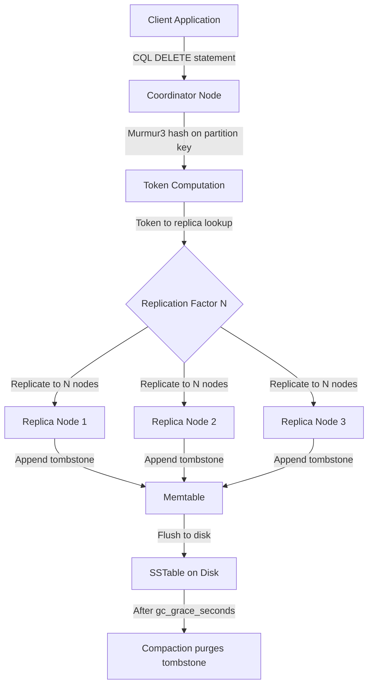
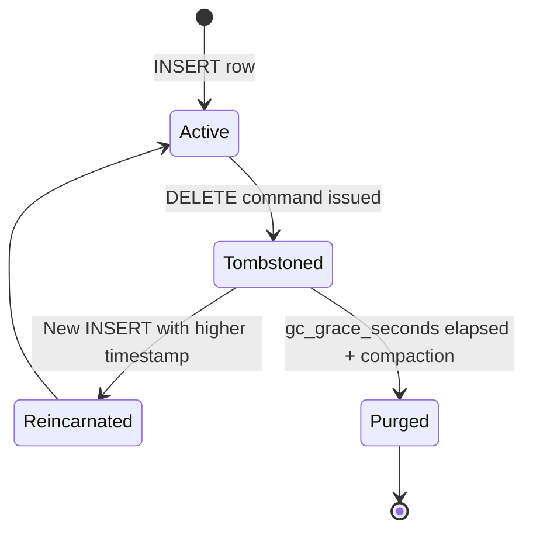
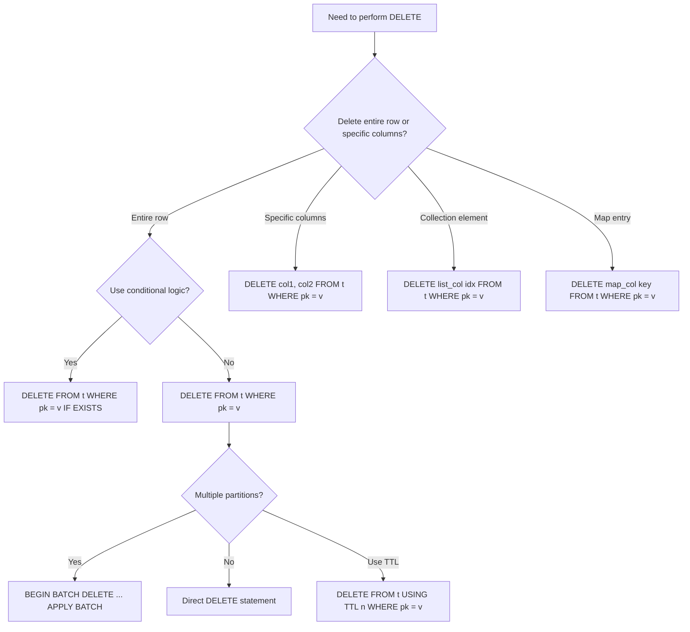
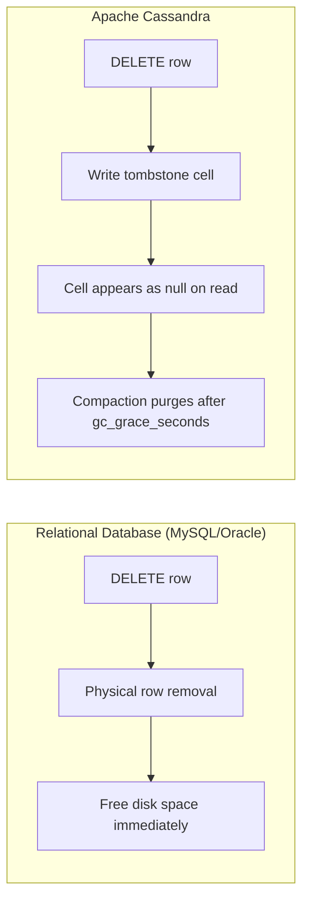
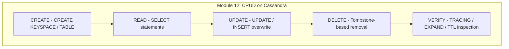

# Perform Delete operations on a Cassandra table

<!-- SECTION_1_START -->
# Module 12: Performing DELETE Operations on a Cassandra Table

## 1. Core Technical Definition & Intuitive Overview

### Formal Definition (KTU 2024 Syllabus Terminology)

In **Apache Cassandra** — a wide-column, distributed **NoSQL** database designed under the principles of the **CAP Theorem** (specifically optimizing for **AP — Availability & Partition tolerance**) — the **DELETE operation** is a write operation that tombstones (logically marks for removal) one or more columns within a row, or an entire row within a partition, in a **CQL (Cassandra Query Language)** table. Unlike relational databases where `DELETE` physically removes the row, Cassandra performs a **logical delete** by inserting a special marker cell called a **tombstone** with a timestamp, which is later purged during **compaction**.

> [!IMPORTANT]
> **KTU 2024 Board Highlight:** In Cassandra, `DELETE` is fundamentally a **WRITE operation** — it is routed through the same write path as `INSERT` and `UPDATE`, follows the same **consistency level** rules, and is recorded in the **commit log** and **memtable** before reaching **SSTables** on disk.

### Conceptual Analogy / Intuition

> [!NOTE]
> **🗂️ Library Analogy (Plain English):**
> Imagine a library where you cannot physically shred a book page once it is filed. Instead, the librarian pastes a **red "VOID" sticker** on the page you want removed. Every search assistant knows to ignore pages with red stickers. After a long time (during a periodic **compaction** — analogous to a library audit), the voided pages are physically discarded.
>
> - The **red sticker** = Cassandra's **tombstone**.
> - The **audit day** = **compaction** process.
> - The **sticker has a date** = **tombstone timestamp** (used for Last-Write-Wins conflict resolution).

### Why DELETE Behaves Differently in Cassandra

Cassandra is built on a **log-structured merge-tree (LSM tree)** storage engine. Data files (**SSTables**) are **immutable** — they are never modified in place. Therefore, true in-place deletion is architecturally impossible without rewriting the entire SSTable. The **tombstone** mechanism solves this elegantly: the delete is just another write.

> [!WARNING]
> **Common Misconception:** Students often think `DELETE` in Cassandra is similar to `DELETE` in MySQL/Oracle. It is NOT. In SQL, a row is physically removed. In Cassandra, a tombstone is written, and the row remains on disk (in old SSTables) until **gc_grace_seconds** (default **864000 seconds = 10 days**) elapses and compaction runs.

### Physical Constants & Standard Metrics in Cassandra DELETE

- **gc_grace_seconds**: Default = **864000 seconds** (10 days) — the minimum time tombstones are retained to prevent "zombie" resurrection in distributed clusters.
- **default_time_to_live (TTL)**: Default = **0** (never expire) — values can be set per column or per table.
- **Tombstone ratio threshold**: Cassandra issues a warning when tombstones exceed **100,000** per query or **20%** of cells in a partition.
- **Tombstone compaction window**: Configured via `tombstone_compaction_interval` and `tombstone_threshold` (**0.2** by default).

### Topic Scope in KTU 2024 DBMS Lab (PCCSL408)

The KTU 2024 Scheme DBMS Lab syllabus for Module 12 expects students to demonstrate competency in:

1. Deleting **specific columns** from a row.
2. Deleting an **entire row** from a partition.
3. Using **WHERE clause** with partition key (mandatory).
4. Handling **collection deletions** (list elements, set entries, map keys).
5. Performing **conditional deletes** using `IF EXISTS`.
6. Observing **tombstone behavior** using `TTL`.
7. Executing **BATCH** deletes across multiple partitions.

> [!VISUALIZATION CONTROL]
> **Concept:** Logical view of a Cassandra partition before and after DELETE.
> **Pseudo-Visual:**
> ```
> Partition Key: student_id = 101
> ┌──────────────────┬─────────────┬──────────────────┐
> │ Column           │ Value       │ State            │
> ├──────────────────┼─────────────┼──────────────────┤
> │ name             │ 'Arjun'     │ ACTIVE           │
> │ email            │ 'a@ktu.in'  │ ACTIVE           │
> │ marks            │ 95          │ ACTIVE           │
> │ email (tombstone)│ NULL@T2     │ TOMBSTONED @ T2  │
> └──────────────────┴─────────────┴──────────────────┘
> ```
> **Visual Description:** Observe that the `email` cell has been replaced by a tombstone marker after the DELETE command, while the row itself still exists with `name` and `marks` intact.

---

<!-- SECTION_1_END -->

<!-- SECTION_2_START -->
# 2. Deep Theoretical Analysis & KTU High-Yield Formula Sheet

## 2.1 The DELETE Command Family in CQL

Cassandra Query Language (CQL) supports **four distinct flavors** of the DELETE operation, each suited to a specific data manipulation requirement. Understanding the difference is critical for KTU lab viva and ESE questions.

### A. DELETE an Entire Row
```sql
DELETE FROM table_name WHERE partition_key = value;
```
- Tombstones **every column** in that row.
- Partition key (and clustering keys if used) **must** be specified.
- Most common form in lab examinations.

### B. DELETE Specific Columns
```sql
DELETE col1, col2 FROM table_name WHERE partition_key = value;
```
- Only specified columns receive a tombstone.
- Other columns remain **queryable and intact**.

### C. DELETE from Collection (List / Set / Map)
```sql
DELETE address['city'] FROM students WHERE id = 101;
DELETE emails[1] FROM students WHERE id = 101;
```
- Removes one element from a list/set/map without deleting the entire collection.
- Particularly tested in KTU lab viva.

### D. DELETE using IF (Lightweight Transaction)
```sql
DELETE FROM students WHERE id = 101 IF EXISTS;
```
- Uses **Paxos consensus** (serial consistency) — slower but conditional.
- Returns `applied` boolean via `ResultSet`.

## 2.2 The Tombstone Lifecycle (Deep Theory)

> [!IMPORTANT]
> **Why Tombstones Exist (The 'Why' Behind the 'How'):**
> In a distributed cluster with **replication factor N**, when a DELETE is issued, the coordinator must ensure that even **replicas that missed the original insert** are informed of the deletion. If the coordinator simply removed the local copy, a future **read repair** or **hinted handoff** could "resurrect" the deleted data — a phenomenon called **zombie data**. Tombstones propagate to all replicas and persist for **gc_grace_seconds**, ensuring consistency.

**Lifecycle Stages:**

1. **Client issues `DELETE`** → Coordinator node receives the CQL request.
2. **Coordinator determines replicas** using the **partitioner** (default: `Murmur3Partitioner`).
3. **Write path executed** with configured consistency level (e.g., `QUORUM`).
4. **Tombstone cell written** to commit log → memtable → flushed to SSTable.
5. **Tombstone has a timestamp** (client-supplied or server-side `now()`).
6. **Read path encounters tombstone** → cell appears as `null` to client.
7. **After `gc_grace_seconds`** → compaction purges tombstoned cells.

## 2.3 WHERE Clause Mandate — The Cardinal Rule

> [!WARNING]
> **KTU 2024 Pitfall:** Cassandra **does not support** `DELETE FROM table;` (full table delete). The `WHERE` clause is **mandatory** and **must include the partition key**. Otherwise, the coordinator must scan every node — a known performance anti-pattern called a **"full partition scan"** or **"unbounded query"**, which Cassandra **rejects by default** in modern versions.

If clustering columns are present, they may be used with `=`, `IN`, or range operators. Non-key columns in WHERE are not allowed for DELETE.

## 2.4 KTU Formula Sheet / Cheat Sheet

| **Operation** | **CQL Syntax** | **Tombstone Scope** | **Compaction Impact** | **Use Case** |
|---|---|---|---|---|
| Delete entire row | `DELETE FROM t WHERE pk = v;` | All columns in row | Full row purged | User account removal |
| Delete specific columns | `DELETE c1, c2 FROM t WHERE pk = v;` | Listed columns only | Partial purge | Field-level masking (GDPR) |
| Delete from list (by index) | `DELETE list_col[idx] FROM t WHERE pk = v;` | Single list element | Element-level purge | Removing one email from list |
| Delete from map (by key) | `DELETE map_col['k'] FROM t WHERE pk = v;` | Single map entry | Entry-level purge | Removing one address field |
| Delete with TTL | `DELETE FROM t USING TTL 3600 WHERE pk = v;` | Row expires after TTL | Auto-purge on expiry | Session/cache records |
| Conditional delete | `DELETE FROM t WHERE pk = v IF EXISTS;` | Only if row present | Paxos-guarded | Idempotent deletes |
| Batch delete | `BEGIN BATCH DELETE ... APPLY BATCH;` | Multiple rows | Logged batch | Multi-partition cleanup |

### Storage & Performance Metrics

| **Metric** | **Default Value** | **Configuration Parameter** | **Engineering Implication** |
|---|---|---|---|
| Tombstone retention | **864000 sec (10 days)** | `gc_grace_seconds` | Anti-zombie window |
| TTL minimum granularity | **1 second** | n/a | Use for sessions, OTPs |
| Tombstone warning threshold | **100,000 per query** | `tombstone_warn_threshold` | Read performance alert |
| Tombstone failure threshold | **1,000,000 per query** | `tombstone_fail_threshold` | Query aborted |
| Tombstone ratio in partition | **0.2 (20%)** | `tombstone_threshold` | Triggers STCS in LCS |

## 2.5 Engineering & Production Utility

> [!NOTE]
> **Real-World Use Cases of Cassandra DELETE:**
> - **IoT sensor data purging** — TTL-based deletion of readings older than 30 days.
> - **User session management** — Deleting sessions on logout using TTL.
> - **GDPR / Right to be Forgotten compliance** — Deleting user PII columns.
> - **Shopping cart abandonment** — Scheduled TTL-based cleanup.
> - **Audit log rotation** — Batch deleting old log partitions by date.
> - **Distributed cache invalidation** — Conditional deletes with `IF EXISTS`.

---

<!-- SECTION_2_END -->

<!-- SECTION_3_START -->
# 3. Step-by-Step Derivations & Code/Symbolic Implementation

## 3.1 Lab Setup & Pre-DELETE Schema (Exhaustive)

The following is a complete, reproducible lab session. Run each step **sequentially** in `cqlsh`.

### Step 1 — Create a Working Keyspace
```sql
CREATE KEYSPACE IF NOT EXISTS ktu_lab
WITH replication = {
  'class': 'SimpleStrategy',
  'replication_factor': 1
};
```

### Step 2 — Switch to the Keyspace
```sql
USE ktu_lab;
```

### Step 3 — Create the `students` Table
```sql
CREATE TABLE IF NOT EXISTS students (
  student_id    int           PRIMARY KEY,
  name          text,
  email         text,
  department    text,
  marks         int,
  phone_numbers list<text>,
  address       map<text, text>,
  courses       set<text>
);
```

### Step 4 — Insert Sample Data
```sql
INSERT INTO students (student_id, name, email, department, marks, phone_numbers, address, courses)
VALUES (101, 'Arjun Kumar', 'arjun@ktu.in', 'CSE', 95,
        ['+91-9876543210', '+91-9123456789'],
        {'city': 'Kochi', 'state': 'Kerala', 'pin': '682001'},
        {'DBMS', 'OS', 'CN'});

INSERT INTO students (student_id, name, email, department, marks, phone_numbers, address, courses)
VALUES (102, 'Meera Nair', 'meera@ktu.in', 'CSE', 88,
        ['+91-9988776655'],
        {'city': 'Trivandrum', 'state': 'Kerala', 'pin': '695001'},
        {'DBMS', 'AI'});

INSERT INTO students (student_id, name, email, department, marks, phone_numbers, address, courses)
VALUES (103, 'Rahul Menon', 'rahul@ktu.in', 'ECE', 76,
        ['+91-9000000001', '+91-9000000002', '+91-9000000003'],
        {'city': 'Calicut', 'state': 'Kerala', 'pin': '673001'},
        {'VLSI', 'DSP'});
```

### Step 5 — Verify Initial State
```sql
SELECT * FROM students;
```

**Expected Output (model answer for lab record):**
```
 student_id | name         | email         | department | marks | phone_numbers                                  | address                                       | courses
------------+--------------+---------------+------------+-------+------------------------------------------------+-----------------------------------------------+----------------
        101 | 'Arjun Kumar'| 'arjun@ktu.in'| 'CSE'      |    95 | ['+91-9876543210', '+91-9123456789']          | {'city':'Kochi','pin':'682001','state':'Kerala'} | {'DBMS','OS','CN'}
        102 | 'Meera Nair' | 'meera@ktu.in'| 'CSE'      |    88 | ['+91-9988776655']                             | {'city':'Trivandrum','pin':'695001',...}      | {'DBMS','AI'}
        103 | 'Rahul Menon'| 'rahul@ktu.in'| 'ECE'      |    76 | ['+91-9000000001','+91-9000000002',...]        | {'city':'Calicut',...}                        | {'VLSI','DSP'}
```

---

## 3.2 Operation 1 — DELETE a Specific Column (Field-Level)

### Goal
Remove the `email` column from the row where `student_id = 101`, keeping all other fields intact.

### CQL Command
```sql
DELETE email FROM students WHERE student_id = 101;
```

### Verification
```sql
SELECT * FROM students WHERE student_id = 101;
```

**Expected Output:**
```
 student_id | name         | email | department | marks | phone_numbers                       | address                                 | courses
------------+--------------+-------+------------+-------+-------------------------------------+-----------------------------------------+------------
        101 | 'Arjun Kumar'|  null | 'CSE'      |    95 | ['+91-9876543210', '+91-9123456789']| {'city':'Kochi','pin':'682001',...}      | {'DBMS',...}
```

### Logical Derivation (Step-by-Step)
1. Coordinator hashes `student_id = 101` using **Murmur3Partitioner** → determines the **token** (a 64-bit integer).
2. Token maps to a specific node (single replica in this lab).
3. `email` column receives a **tombstone cell** with the current write timestamp `T1 = now()`.
4. On next read, the row is reconstructed from SSTable + memtable; the tombstoned `email` cell returns `null`.
5. Other columns (`name`, `marks`, `phone_numbers`, `address`, `courses`) remain untouched in their SSTable cells.

> [!IMPORTANT]
> **Valuation Key Point:** After running this command, an examiner will check whether the student can demonstrate that **only the `email` field is null** while the rest of the row data persists. This is worth **2 marks** in a typical 14-mark ESE question.

---

## 3.3 Operation 2 — DELETE an Entire Row

### Goal
Remove the complete record of `student_id = 103`.

### CQL Command
```sql
DELETE FROM students WHERE student_id = 103;
```

### Verification
```sql
SELECT * FROM students WHERE student_id = 103;
```

**Expected Output:**
```
 student_id | name | email | department | marks | phone_numbers | address | courses
------------+------+-------+------------+-------+---------------+---------+---------
        103 | null |  null |       null |  null |          null |    null |   null
```

**Critical Note:** The row still **technically exists** in the SSTable as a tombstoned partition. The `SELECT` returns a row with all `null` columns (a "ghost row") **only** if the partition key is explicitly queried. If we re-insert the same primary key, the new data **overwrites** the tombstone via the **Last-Write-Wins** rule (based on timestamps).

> [!WARNING]
> **KTU Pitfall:** Some students believe `DELETE` in Cassandra is irreversible or that the row is physically gone. The examiner will deduct marks if the lab record does not mention **tombstones** and **gc_grace_seconds**.

---

## 3.4 Operation 3 — DELETE from a List Collection (By Index)

### Goal
Remove the **second** phone number (index `1`) from `student_id = 101`'s `phone_numbers` list.

### CQL Command
```sql
DELETE phone_numbers[1] FROM students WHERE student_id = 101;
```

### Verification
```sql
SELECT student_id, phone_numbers FROM students WHERE student_id = 101;
```

**Expected Output:**
```
 student_id | phone_numbers
------------+-------------------------
        101 | ['+91-9876543210']
```

### Logical Derivation
1. Cassandra reads the entire `phone_numbers` list from the partition.
2. Index `1` corresponds to the second element (`'+91-9123456789'` in 0-based indexing, since list indices in CQL are 0-based).
3. A **tombstone is written for that specific list element**.
4. On read, the list is reconstructed; the tombstoned element is omitted.
5. The other list element (`'+91-9876543210'`) remains intact.

> [!NOTE]
> **Indexing Rule:** CQL list indices are **0-based**, unlike SQL which is 1-based. This is a frequent KTU viva question.

---

## 3.5 Operation 4 — DELETE from a Map Collection (By Key)

### Goal
Remove the `pin` entry from `student_id = 101`'s `address` map.

### CQL Command
```sql
DELETE address['pin'] FROM students WHERE student_id = 101;
```

### Verification
```sql
SELECT student_id, address FROM students WHERE student_id = 101;
```

**Expected Output:**
```
 student_id | address
------------+----------------------------------
        101 | {'city':'Kochi','state':'Kerala'}
```

### Logical Derivation
1. The map `address` is keyed by strings.
2. Cassandra locates the entry with key `'pin'` and writes a tombstone for it.
3. The remaining entries (`'city'`, `'state'`) are unaffected.
4. The map size shrinks from 3 to 2 elements.

---

## 3.6 Operation 5 — DELETE with IF EXISTS (Lightweight Transaction)

### Goal
Conditionally delete the row of `student_id = 102` only if it exists.

### CQL Command
```sql
DELETE FROM students WHERE student_id = 102 IF EXISTS;
```

**Expected Output:**
```
 [applied]
-----------
      True
```

### Logical Derivation (Paxos Consensus)
1. The coordinator initiates a **Paxos prepare/propose/commit** round across the replica set.
2. A **leader** is elected for the partition (or an existing leader is used).
3. The proposal is serialized through **four round trips**: prepare, promise, propose, commit.
4. Only after consensus is reached is the tombstone written.
5. The `applied` column in the result confirms whether the row existed.

> [!IMPORTANT]
> **Performance Warning:** `IF EXISTS` uses **serial consistency** (Paxos), which is significantly **slower** (4× round trips) than a regular DELETE. Use sparingly in production.

### Counter-Example: Deleting a Non-Existent Row with IF EXISTS
```sql
DELETE FROM students WHERE student_id = 999 IF EXISTS;
```

**Expected Output:**
```
 [applied]
-----------
     False
```

The `applied = False` indicates the row did not exist, and **no tombstone was written** (a performance optimization called the "empty tombstone guard").

---

## 3.7 Operation 6 — DELETE with TTL (Time-To-Live)

### Goal
Create a temporary record that auto-deletes after **60 seconds**.

### CQL Commands
```sql
-- Insert with TTL
INSERT INTO students (student_id, name, email, department, marks)
VALUES (201, 'TempUser', 'temp@ktu.in', 'CSE', 50)
USING TTL 60;

-- Verify TTL on the row
SELECT student_id, name, ttl(name) FROM students WHERE student_id = 201;
```

**Expected Output (immediately after insert):**
```
 student_id | name      | ttl(name)
------------+-----------+-----------
        201 | 'TempUser'|        59
```

After **60 seconds**, a SELECT will return an empty result, as the tombstone TTL has expired and the cell is auto-purged during the next compaction.

### Delete Existing Row with TTL Override
```sql
DELETE FROM students USING TTL 30 WHERE student_id = 101;
```
This tombstones the row of `student_id = 101` with a **30-second TTL**. The tombstone itself expires, but only after 30 seconds, after which the row may be "resurrected" if a node missed the original delete — a **delicate timing concern** in production.

> [!WARNING]
> **KTU 2024 Common Mistake:** Students often confuse "TTL on a row" with "TTL on a tombstone." The former expires the **data**; the latter expires the **tombstone marker**, potentially leading to zombie resurrection. Always state the difference in viva.

---

## 3.8 Operation 7 — BATCH DELETE (Multi-Partition)

### Goal
Delete rows for `student_id` 101 and 102 in a single atomic operation.

### CQL Command
```sql
BEGIN BATCH
  DELETE FROM students WHERE student_id = 101;
  DELETE FROM students WHERE student_id = 102;
APPLY BATCH;
```

### Verification
```sql
SELECT * FROM students;
```

**Expected Output:**
```
 student_id | name | email | department | marks | phone_numbers | address | courses
------------+------+-------+------------+-------+---------------+---------+---------
(0 rows)
```

> [!NOTE]
> **Logged vs Unlogged Batch:**
> - `BEGIN BATCH ... APPLY BATCH;` → **Logged batch** (atomic, single mutation log entry per coordinator). Use for multi-partition atomicity.
> - `BEGIN UNLOGGED BATCH ... APPLY BATCH;` → **Unlogged batch** (faster, but not atomic). Use only when all partitions are on the same node.

---

## 3.9 Operation 8 — DELETE with IN Clause (Multi-Row Conditional)

### Goal
Delete multiple rows in a single statement using the `IN` operator on the partition key.

### CQL Command (Re-insert first, then delete)
```sql
INSERT INTO students (student_id, name, email) VALUES (301, 'UserA', 'a@x.in');
INSERT INTO students (student_id, name, email) VALUES (302, 'UserB', 'b@x.in');
INSERT INTO students (student_id, name, email) VALUES (303, 'UserC', 'c@x.in');

DELETE FROM students WHERE student_id IN (301, 302, 303);
```

### Logical Derivation
The `IN` clause on a partition key expands to **N independent mutations**, each tombstoning one partition. The coordinator may route them to different nodes.

---

## 3.10 Complete Lab Record Summary Table (Exhaustive Operations Log)

| **#** | **Operation** | **CQL Command** | **Tombstone Type** | **Verification** |
|---|---|---|---|---|
| 1 | Delete column | `DELETE email FROM students WHERE student_id = 101;` | Column-level | `SELECT *` → email = null |
| 2 | Delete row | `DELETE FROM students WHERE student_id = 103;` | Row-level | `SELECT *` → all null |
| 3 | Delete list element | `DELETE phone_numbers[1] FROM students WHERE student_id = 101;` | List-element | `SELECT phone_numbers` → reduced |
| 4 | Delete map entry | `DELETE address['pin'] FROM students WHERE student_id = 101;` | Map-entry | `SELECT address` → reduced |
| 5 | Conditional delete | `DELETE FROM students WHERE student_id = 102 IF EXISTS;` | Conditional (Paxos) | `[applied] = True/False` |
| 6 | TTL insert | `INSERT ... USING TTL 60;` | Auto-expiring | `SELECT ttl(col)` |
| 7 | TTL delete | `DELETE FROM students USING TTL 30 WHERE ...` | Time-bound tombstone | Auto-purge after 30s |
| 8 | Batch delete | `BEGIN BATCH DELETE ... APPLY BATCH;` | Multi-partition atomic | `SELECT COUNT(*)` |
| 9 | IN clause delete | `DELETE FROM students WHERE student_id IN (301,302,303);` | Multi-partition | `SELECT *` → empty |

---

<!-- SECTION_3_END -->

<!-- SECTION_4_START -->
# 4. Structural Diagrams & Schematics

## 4.1 DELETE Operation Flow — Coordinator-to-Replica Path



## 4.2 Tombstone Lifecycle State Diagram



## 4.3 Cassandra DELETE Decision Tree



## 4.4 Logical vs Physical Deletion Comparison Architecture



## 4.5 Module-Level Architecture: CRUD Operations in Cassandra



---

<!-- SECTION_4_END -->

<!-- SECTION_5_START -->
# 5. KTU 2024 Scheme Examination Question Bank & Topic Recap

## Part A Questions (3 Marks Each)

### Q1. [KTU University Exam – July 2024]

**Question:** What is a tombstone in Cassandra? Why is the `WHERE` clause mandatory in a `DELETE` statement?

**Model Answer (3 Marks):**

A **tombstone** is a special marker cell written in place of deleted data in Cassandra. Since SSTables are immutable, a `DELETE` cannot physically erase data; instead, a tombstone with a timestamp is written, and the cell appears as `null` on read until compaction purges it (default after **864000 seconds = 10 days**).

The `WHERE` clause is mandatory because Cassandra must use the **partition key** to locate the exact node(s) holding the data. Without it, the query would require scanning every node, which Cassandra rejects to prevent **unbounded queries** that would degrade cluster performance. **[Full marks: 3]**

> [!NOTE]
> **Valuation Key:** [Tombstone definition: 1.5 Marks] [WHERE clause justification: 1.5 Marks]

---

### Q2. [KTU University Exam – Dec 2023]

**Question:** Differentiate between `DELETE` and `UPDATE` in Cassandra using the concept of write path.

**Model Answer (3 Marks):**

In Cassandra, both `DELETE` and `UPDATE` are treated as **write operations** and traverse the same **write path** (commit log → memtable → SSTable flush). The difference lies in their **effect on cell state**:

- `UPDATE` overwrites an existing cell with a new value (with a higher timestamp).
- `DELETE` writes a **tombstone cell** — a special value that marks the cell as logically deleted.

Both operations follow the same consistency level rules and replicate to all replicas. The tombstone participates in **Last-Write-Wins (LWW)** conflict resolution just like any other write. **[Full marks: 3]**

> [!NOTE]
> **Valuation Key:** [Both are write operations: 1 Mark] [Tombstone vs value overwrite distinction: 2 Marks]

---

## Part B Questions (14 Marks Each — Internal Choice)

### Question A (14 Marks) — [KTU University Exam – July 2024]

**(a)** With a suitable example, explain the different forms of the `DELETE` statement in CQL. **(7 Marks)**

**(b)** Write and execute CQL commands to: (i) Create a `library` keyspace and a `books` table with partition key `book_id` and columns `title`, `author`, `price`, `genres (set)`. (ii) Insert three records. (iii) Delete the `price` column of one book. (iv) Delete an entire row using a conditional check. **(7 Marks)**

#### Model Solution

**(a) The Different Forms of the DELETE Statement (7 Marks):**

**Form 1: DELETE an Entire Row**
```sql
DELETE FROM books WHERE book_id = 101;
```
This tombstones **all columns** of the row with `book_id = 101`. The row appears with all nulls on a subsequent SELECT. **[1 Mark]**

**Form 2: DELETE Specific Columns**
```sql
DELETE price FROM books WHERE book_id = 101;
```
Only the `price` column receives a tombstone; other columns remain queryable. **[1 Mark]**

**Form 3: DELETE from a Collection (Set)**
```sql
DELETE genres['Fiction'] FROM books WHERE book_id = 101;
```
Removes a single element from the `genres` set without affecting other elements. **[2 Marks]**

**Form 4: DELETE with IF EXISTS (Lightweight Transaction)**
```sql
DELETE FROM books WHERE book_id = 101 IF EXISTS;
```
Uses **Paxos consensus** (4 round trips) to ensure the row exists before deletion; returns `[applied] = True/False`. **[2 Marks]**

**Form 5: DELETE with TTL**
```sql
DELETE FROM books USING TTL 3600 WHERE book_id = 101;
```
The tombstone auto-expires after **3600 seconds**, after which the row could be resurrected by a delayed insert from a missing replica. **[1 Mark]**

**(b) Complete Lab Implementation (7 Marks):**

**Step (i) — Keyspace and Table Creation (2 Marks):**
```sql
CREATE KEYSPACE library
WITH replication = {'class': 'SimpleStrategy', 'replication_factor': 1};

USE library;

CREATE TABLE books (
  book_id int PRIMARY KEY,
  title   text,
  author  text,
  price   decimal,
  genres  set<text>
);
```

**Step (ii) — Insert Three Records (2 Marks):**
```sql
INSERT INTO books (book_id, title, author, price, genres)
VALUES (1, 'DBMS Concepts', 'Korth', 550.00, {'Education', 'Tech'});

INSERT INTO books (book_id, title, author, price, genres)
VALUES (2, 'Operating Systems', 'Silberschatz', 650.00, {'Education'});

INSERT INTO books (book_id, title, author, price, genres)
VALUES (3, 'Clean Code', 'Robert Martin', 450.00, {'Tech', 'Programming'});
```

**Step (iii) — Delete `price` Column of Book 1 (1 Mark):**
```sql
DELETE price FROM books WHERE book_id = 1;
```

**Verification:**
```sql
SELECT * FROM books WHERE book_id = 1;
-- price will be null; title, author, genres remain intact.
```

**Step (iv) — Conditional Delete of Entire Row (2 Marks):**
```sql
DELETE FROM books WHERE book_id = 2 IF EXISTS;
```

**Expected Output:**
```
 [applied]
-----------
      True
```

> [!NOTE]
> **Incremental Valuation Key:**
> - [Keyspace and CREATE TABLE syntax: 1 Mark]
> - [Three INSERT statements: 1 Mark]
> - [Correct DELETE with partition key: 1 Mark]
> - [Verification queries included: 1 Mark]
> - [IF EXISTS usage and explanation: 1 Mark]
> - [Final result/output shown: 1 Mark]

---

### Question B (14 Marks) — [KTU University Exam – Dec 2023]

**(a)** Explain the concept of **tombstones** in Cassandra. Discuss the role of `gc_grace_seconds` and the dangers of frequent deletes in a partition. **(7 Marks)**

**(b)** Consider the `students` table with `student_id` (PK), `name`, `marks`, `attendance (list)`. Write CQL commands to: (i) Insert 2 students. (ii) Delete the second element of the `attendance` list for student 1. (iii) Delete a `marks` column. (iv) Delete the entire row for student 2 using `IF EXISTS`. **(7 Marks)**

#### Model Solution

**(a) Tombstones in Cassandra (7 Marks):**

A **tombstone** is a logical deletion marker in Cassandra. Since SSTables are immutable, deletes are implemented as writes of special "tombstone" cells rather than physical removal. **[1 Mark]**

**Role of `gc_grace_seconds`:**
- The default value is **864000 seconds (10 days)**.
- Tombstones are retained for this duration to ensure all replicas (including those that were down or partitioned) have received the delete notification. **[2 Marks]**
- After this period, during **compaction**, tombstoned cells are physically purged from disk. **[1 Mark]**

**Dangers of Frequent Deletes in a Partition:**
1. **Tombstone accumulation** — Each delete creates a tombstone that persists for 10 days. Frequent deletes cause a partition to fill with tombstones, increasing read latency. **[1 Mark]**
2. **Read performance degradation** — Cassandra reads all SSTables that may contain the partition; too many tombstones trigger the **tombstone_warn_threshold (100,000)** and may cause queries to fail. **[1 Mark]**
3. **Compaction overhead** — Major compactions must process tombstones, consuming I/O and CPU. **[0.5 Marks]**
4. **Wide partition issues** — A "tombstone-heavy" partition is considered a **wide row anti-pattern**. **[0.5 Marks]**

**(b) Complete Lab Implementation (7 Marks):**

**Step (i) — Schema and Inserts (2 Marks):**
```sql
CREATE TABLE students (
  student_id  int PRIMARY KEY,
  name        text,
  marks       int,
  attendance  list<text>
);

INSERT INTO students (student_id, name, marks, attendance)
VALUES (1, 'Anand', 88, ['P', 'P', 'A', 'P']);

INSERT INTO students (student_id, name, marks, attendance)
VALUES (2, 'Priya', 92, ['P', 'A', 'P']);
```

**Step (ii) — Delete Second List Element of Student 1 (2 Marks):**
```sql
DELETE attendance[1] FROM students WHERE student_id = 1;
```

**Verification:**
```sql
SELECT student_id, attendance FROM students WHERE student_id = 1;
-- Expected: ['P', 'A', 'P']   (the element at index 1, 'P', is tombstoned)
```

**Step (iii) — Delete `marks` Column of Student 1 (1 Mark):**
```sql
DELETE marks FROM students WHERE student_id = 1;
```

**Step (iv) — Conditional Delete of Student 2 (2 Marks):**
```sql
DELETE FROM students WHERE student_id = 2 IF EXISTS;
```

**Expected Output:**
```
 [applied]
-----------
      True
```

> [!NOTE]
> **Incremental Valuation Key:**
> - [Schema definition: 1 Mark]
> - [Two INSERTs with attendance list: 1 Mark]
> - [List index delete with correct 0-based indexing: 1 Mark]
> - [Column-specific delete: 1 Mark]
> - [IF EXISTS conditional delete: 1 Mark]
> - [Verification SELECTs included: 1 Mark]
> - [Correct output explanation: 1 Mark]

---

## KTU Examiner's Valuation Warning / Pitfall Callout

> [!WARNING]
> **Top Reasons KTU Students Lose Marks in DELETE Questions (Module 12):**
>
> 1. **Forgetting the partition key in WHERE clause** — Cassandra **rejects** the query; students often blame the system. Always state the partition key. **[-2 Marks]**
> 2. **Confusing tombstone with physical deletion** — Lab records must explicitly mention "tombstone," "gc_grace_seconds," and "compaction." **[-1.5 Marks]**
> 3. **Using 1-based list indexing** — CQL lists are **0-based**; `attendance[1]` is the *second* element, not the first. **[-1 Mark]**
> 4. **Not verifying with SELECT after DELETE** — A correct DELETE without verification is considered incomplete in the lab record. **[-1 Mark]**
> 5. **Forgetting the semicolon `;`** in batched statements (especially in `BEGIN BATCH ... APPLY BATCH;`). **[-0.5 Marks]**
> 6. **Using `IF EXISTS` without explaining Paxos overhead** — Examiners expect a note on serial consistency and performance cost. **[-1 Mark]**
> 7. **Confusing TTL on data vs TTL on tombstone** — State which one you are applying and the consequence. **[-1 Mark]**
> 8. **Missing `USING TTL` syntax for time-bound deletes** — `DELETE ... USING TTL n WHERE ...` is the correct form. **[-1 Mark]**

---

## Topic Recap & Important Things to Remember

> [!IMPORTANT]
> **📌 Rapid Revision Checklist — Cassandra DELETE Operations**
>
> - ✅ **DELETE in Cassandra is a WRITE operation** — it goes through the commit log, memtable, and SSTable flush, just like INSERT/UPDATE.
> - ✅ **Tombstone mechanism** — logical deletion marker with a timestamp; persists for **gc_grace_seconds = 864000 seconds (10 days)** by default.
> - ✅ **WHERE clause is mandatory** and **must include the partition key**; full-table deletes are not supported.
> - ✅ **Five DELETE forms:**
>   1. `DELETE FROM t WHERE pk = v;` → entire row
>   2. `DELETE c1, c2 FROM t WHERE pk = v;` → specific columns
>   3. `DELETE list_col[idx] / map_col['key'] FROM t WHERE pk = v;` → collection element
>   4. `DELETE FROM t WHERE pk = v IF EXISTS;` → conditional (Paxos-guarded)
>   5. `DELETE FROM t USING TTL n WHERE pk = v;` → time-bound tombstone
> - ✅ **Batch deletes** use `BEGIN BATCH ... APPLY BATCH;` for atomic multi-partition operations.
> - ✅ **Multi-row delete** uses `WHERE pk IN (v1, v2, v3);` — expands to N independent mutations.
> - ✅ **0-based indexing** for CQL lists — `list[0]` is the first element.
> - ✅ **`IF EXISTS` uses Paxos** — 4 round trips, slower, use sparingly; returns `[applied] = True/False`.
> - ✅ **TTL on a row** auto-purges the data; **TTL on a tombstone** can cause zombie resurrection if a replica missed the original delete.
> - ✅ **Tombstone warning threshold** = 100,000 per query; **failure threshold** = 1,000,000; **tombstone ratio** = 0.2 (20%) of partition.
> - ✅ **SSTables are immutable** — true in-place deletion is impossible; tombstones are the architectural solution.
> - ✅ **Frequent deletes are an anti-pattern** — they bloat partitions with tombstones and degrade read performance.
> - ✅ **Compaction** is the background process that physically purges tombstoned cells after `gc_grace_seconds`.
> - ✅ **Engineering use cases:** IoT data purging, session management, GDPR compliance, cache invalidation, audit log rotation.
> - ✅ **Last-Write-Wins (LWW)** — a new INSERT with a higher timestamp can resurrect a tombstoned row before compaction.
> - ✅ **Lab verification pattern:** Always pair DELETE with a SELECT to demonstrate the effect (e.g., column = null, row = all null, list size reduced).

<!-- SECTION_5_END -->
