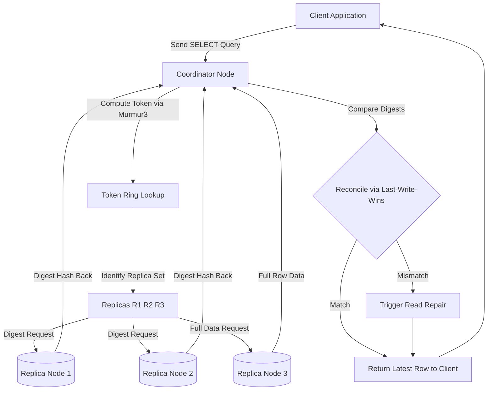
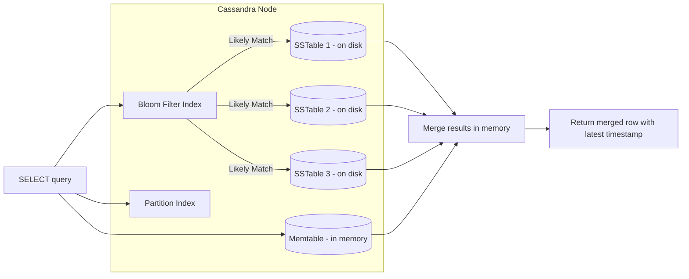

# Perform Read operations on a Cassandra table

<!-- SECTION_1_START -->

# 1. Core Technical Definition & Intuitive Overview

## Formal Definition (KTU 2024 Syllabus Terminology)

In **Apache Cassandra**, a **Read operation** refers to the process of retrieving one or more rows of data from a Column Family (table) using the **CQL (Cassandra Query Language) `SELECT` statement**. A read is always served from the **partition key** (mandatory) and optionally filtered using **clustering columns** within a single partition. Unlike relational databases, Cassandra reads are governed by a **tunable consistency level** that determines how many replica nodes must respond before the operation is acknowledged as successful.

The general CQL syntax is:

```sql
SELECT [DISTINCT] [column_list | *] 
FROM table_name 
[WHERE partition_key = value [AND clustering_col = value ...]]
[ORDER BY clustering_col [ASC | DESC]]
[LIMIT n]
[ALLOW FILTERING];
```

> [!IMPORTANT]
> **KTU Board Highlight:** The `WHERE` clause in Cassandra can *only* filter on columns that are part of the **Primary Key** (Partition Key + Clustering Columns) unless `ALLOW FILTERING` is used, which forces a full table scan and is **strongly discouraged in production**.

> [!NOTE]
> **CQL vs SQL — A Critical Distinction**
> CQL is **not** SQL. There are NO joins, NO GROUP BY (in older versions), NO aggregate functions like SUM/AVG (without user-defined functions), and NO multi-row ACID transactions across partitions.

## Conceptual Analogy — "The Smart Post Office"

Imagine a massive postal network with thousands of branches across the country. Every letter (row) has a **unique zip code (partition key)** that decides *which exact set of post offices stores a copy of it*.

- To read a letter, you tell the system: *"Find all copies of the letter with zip code 682001, sorted by date received."*
- The system then contacts the **nearest post office first**, then maybe 1-2 more, depending on your **consistency demand**.
- If the letter is at multiple offices, the system returns the **latest version** (resolved using timestamps — called *last-write-wins*).

This is precisely how a Cassandra `SELECT` works:
- **Partition Key** = the zip code (you MUST provide it).
- **Clustering Columns** = the order of letters inside a post office.
- **Consistency Level** = how many offices must confirm before you're satisfied.

> [!VISUALIZATION CONTROL]
> **Concept:** Conceptual coordinate plane mapping of a Cassandra Partition vs Clustering
> **GeoGebra / Desmos Input Equations:**
> * `x = 682001` (vertical line representing fixed partition key)
> * `y = 1, 2, 3, 4, 5` (horizontal points representing clustering column order)
> **Visual Description:** A vertical line at $x = 682001$ with 5 horizontally-spaced markers, illustrating that all reads within a partition are restricted to a single "slice" of data, scanned left-to-right by clustering order.

## Key Physical Constants & Standard Metrics

| Metric | Standard Value (Cassandra 4.x / 5.x) | Purpose |
|---|---|---|
| Default Read Consistency Level | `ONE` | Fastest, but may return stale data |
| Strong Read Consistency | `QUORUM` | $\lfloor (RF/2) + 1 \rfloor$ replicas respond |
| Default Replication Factor (RF) | `3` | Three copies of data across the cluster |
| Tombstone TTL (gc_grace_seconds) | **864000 seconds (10 days)** | Window during which deleted data can be repaired |
| Soft Commitlog Size | **32 MB / 64 MB** | Per-node write buffer |

<!-- SECTION_1_END -->

<!-- SECTION_2_START -->

# 2. Deep Theoretical Analysis & KTU High-Yield Formula Sheet

## Anatomy of a Cassandra Read — Step-by-Step Logical Breakdown

When the coordinator node receives a `SELECT` request, it executes the following pipeline:

1. **Parse the Query** — Extract the partition key value to compute the token using the configured partitioner (default: `Murmur3Partitioner`).
   - The token decides which node(s) own the partition.
2. **Determine Replicas** — Based on the **Replication Strategy** (`SimpleStrategy` or `NetworkTopologyStrategy`) and the **Replication Factor (RF)**, the coordinator identifies the list of replica nodes.
3. **Send Read Repair Request** — The coordinator sends a digest request (a hash of the data) to `R` replicas, where $R$ = value of the consistency level.
4. **Send Full Data Request** — To the **closest replica**, it sends a full data request to minimize latency.
5. **Reconcile** — The coordinator compares the digests; if they differ, it performs a **read repair** by pushing the latest data to the stale replica.
6. **Return Result** — The most recent value (per the **last-write-wins rule** based on the timestamp) is returned to the client.

> [!NOTE]
> **Engineering "Why" — The Read Path Matters**
> Cassandra is designed to be **AP (Available + Partition-tolerant)** in CAP theorem. A read *never* blocks on a single slow node — the coordinator simply takes the response from the fastest $R$ replicas. This is why Cassandra is used by Netflix, Instagram, and Uber for massive-scale OLTP workloads.

## Consistency Level Math (KTU High-Yield)

For a given Replication Factor $RF$, the **Strong Consistency Formula** for reads is:

$$
R + W > RF
$$

Where:
- $R$ = Read Consistency Level (number of replicas contacted)
- $W$ = Write Consistency Level
- $RF$ = Replication Factor

**Example:** If $RF = 3$, then $W = 2$ and $R = 2$ gives $2 + 2 = 4 > 3$ → **Strong Consistency**.

## KTU Formula / Cheat Sheet

| Concept | Syntax / Rule | Notes |
|---|---|---|
| Select all columns | `SELECT * FROM keyspace.table;` | Avoids projection efficiency |
| Select specific columns | `SELECT col1, col2 FROM table;` | **Best practice for performance** |
| Mandatory partition filter | `WHERE partition_key = val` | **Without this → error `InvalidRequest`** |
| Composite partition filter | `WHERE (pk1, pk2) IN ((v1,v2), (v3,v4))` | Multi-partition IN query |
| Clustering range query | `WHERE pk = val AND cluster_col > a AND cluster_col < b` | Allowed — no `ALLOW FILTERING` needed |
| Order results | `ORDER BY cluster_col ASC/DESC` | Clustering column must be specified |
| Limit results | `LIMIT n` | Returns first $n$ per partition |
| Force full scan | `ALLOW FILTERING` | ⚠️ Performance killer — avoid |
| Use secondary index | `WHERE indexed_col = val` | Only on low-cardinality columns |
| Materialized view read | `SELECT * FROM mv WHERE ...` | Auto-maintained, replaces some filtering |
| Read with TTL | `(ttl(col))` in SELECT | Returns remaining seconds-to-live |
| Read with timestamp | `(writetime(col))` in SELECT | Returns microsecond timestamp |

## Real-World Engineering Utility

Cassandra reads power systems where **millisecond-level latency at petabyte scale** is non-negotiable:

- **Netflix** — Viewing history for 250M+ users.
- **Apple iMessage** — Message delivery at $1$ trillion messages/year.
- **Discord** — Message storage with $R = QUORUM$ for consistency.
- **IoT Telemetry** — Sensor data ingestion where `(sensor_id, timestamp)` is the composite partition key.

> [!IMPORTANT]
> **KTU 2024 Lab Exam Tip:** Your CQL code in the lab record must demonstrate **at least 3 distinct read operations**: a single-row read, a partition-wide scan, and a read with `ALLOW FILTERING` (to show the contrast).

<!-- SECTION_2_END -->

<!-- SECTION_3_START -->

# 3. Step-by-Step Derivations & Code/Symbolic Implementation

## 3.1 Pre-Lab Setup — Lab Environment Preparation

The KTU 2024 DBMS Lab syllabus mandates a working Cassandra instance. Use the in-built Docker image or the standalone Cassandra 4.x binary.

```bash
# Step 1: Start Cassandra container (cqlsh is the CLI)
docker run --name cassandra-lab -d -p 9042:9042 cassandra:4.1

# Step 2: Open the CQL shell
docker exec -it cassandra-lab cqlsh
```

## 3.2 Step-by-Step Lab Execution — Performing Read Operations

### Step A: Create the Keyspace (One-Time Setup)

```sql
-- Switch to a keyspace with SimpleStrategy and RF=3
CREATE KEYSPACE IF NOT EXISTS university_lab
WITH replication = {
  'class': 'SimpleStrategy',
  'replication_factor': 3
};

USE university_lab;
```

### Step B: Create the Table with a Composite Primary Key

```sql
-- Table: students partitioned by dept, clustered by roll_no
CREATE TABLE IF NOT EXISTS students (
    dept        text,
    roll_no     int,
    name        text,
    email       text,
    cgpa        decimal,
    enrolled_on timestamp,
    PRIMARY KEY (dept, roll_no)
) WITH CLUSTERING ORDER BY (roll_no ASC);
```

**Explanation of Primary Key Design:**
- `dept` → **Partition Key** (all students of one department live in one partition).
- `roll_no` → **Clustering Column** (students within a department are sorted).

### Step C: Insert Sample Data for Testing Reads

```sql
INSERT INTO students (dept, roll_no, name, email, cgpa, enrolled_on)
VALUES ('CSE', 101, 'Anand Kumar', 'anand@ktu.edu', 8.7, toTimestamp(now()));

INSERT INTO students (dept, roll_no, name, email, cgpa, enrolled_on)
VALUES ('CSE', 102, 'Bhavna Pillai', 'bhavna@ktu.edu', 9.1, toTimestamp(now()));

INSERT INTO students (dept, roll_no, name, email, cgpa, enrolled_on)
VALUES ('CSE', 103, 'Chris George', 'chris@ktu.edu', 7.9, toTimestamp(now()));

INSERT INTO students (dept, roll_no, name, email, cgpa, enrolled_on)
VALUES ('ECE', 201, 'Deepa Menon', 'deepa@ktu.edu', 8.4, toTimestamp(now()));

INSERT INTO students (dept, roll_no, name, email, cgpa, enrolled_on)
VALUES ('ECE', 202, 'Eshan Roy', 'eshan@ktu.edu', 8.9, toTimestamp(now()));
```

### Step D: Execute Read Operations (Main Lab Task)

#### **Read 1 — Project Specific Columns (Efficient Read)**

```sql
-- Retrieve only the name and cgpa of all CSE students
SELECT name, cgpa FROM students WHERE dept = 'CSE';
```

**Expected Output:**

```
 name           | cgpa
----------------+------
  Anand Kumar   |  8.7
  Bhavna Pillai |  9.1
  Chris George  |  7.9
```

#### **Read 2 — Single-Partition Single-Row Lookup (Fastest Read)**

```sql
-- Find one specific student using full primary key
SELECT * FROM students WHERE dept = 'ECE' AND roll_no = 202;
```

**Expected Output:**

```
 dept | roll_no | email       | enrolled_on                      | cgpa | name
------+---------+-------------+---------------------------------+------+----------
  ECE |     202 | eshan@ktu.edu | 2024-08-14 09:15:23.456000+0000 |  8.9 | Eshan Roy
```

#### **Read 3 — Range Query Using a Clustering Column**

```sql
-- Find CSE students with roll_no between 101 and 102 (inclusive)
SELECT name, roll_no FROM students
WHERE dept = 'CSE' AND roll_no >= 101 AND roll_no <= 102;
```

**Result:** Returns 2 rows (`Anand Kumar` and `Bhavna Pillai`).

#### **Read 4 — Ordered Read with LIMIT**

```sql
-- Top 2 students of CSE by roll_no ascending
SELECT name, roll_no FROM students
WHERE dept = 'CSE'
ORDER BY roll_no ASC
LIMIT 2;
```

#### **Read 5 — Forced Full-Scan Read Using ALLOW FILTERING**

```sql
-- Find any student with cgpa = 9.1 across ALL departments
SELECT name, dept FROM students WHERE cgpa = 9.1 ALLOW FILTERING;
```

> [!WARNING]
> **Lab Record Mandatory Note:** Always mention in your record that `ALLOW FILTERING` triggers a **full cluster scan** and should never be used in production with large datasets.

#### **Read 6 — Read Using a Composite-Partition `IN` Clause**

```sql
-- Read CSE-101 and ECE-201 in a single query
SELECT * FROM students
WHERE dept = 'CSE' AND roll_no IN (101)
   OR dept = 'ECE' AND roll_no IN (201);
```

#### **Read 7 — Special Functions: `writetime()` and `ttl()`**

```sql
-- Check when 'Bhavna Pillai's record was last written
SELECT name, writetime(email), ttl(cgpa) FROM students
WHERE dept = 'CSE' AND roll_no = 102;
```

**Result Interpretation:**
- `writetime()` returns the **microsecond timestamp** of the last write.
- `ttl()` returns the **seconds remaining** before the cell expires (if TTL was set).

### Step E: Python Implementation Using `cassandra-driver`

```python
# filename: cassandra_read_demo.py
# Lab: DBMS - KTU 2024 Module 12
# Purpose: Demonstrate CRUD -> Read operations via Python driver

from cassandra.cluster import Cluster
from cassandra.auth import PlainTextAuthProvider
import logging
import sys

# ---------------------------------------------------------------
# 1. Strict logging configuration for lab evaluation traceability
# ---------------------------------------------------------------
logging.basicConfig(
    level=logging.INFO,
    format="%(asctime)s [%(levelname)s] %(message)s",
    handlers=[logging.StreamHandler(sys.stdout)]
)
log = logging.getLogger("CassandraReadLab")


def connect_to_cluster(contact_points: list[str], port: int) -> Cluster:
    """
    Establish a connection to the local Cassandra cluster.
    Returns the Cluster object; raises Exception on failure.
    """
    try:
        cluster = Cluster(contact_points=contact_points, port=port)
        session = cluster.connect("university_lab")
        log.info("Connected successfully to Cassandra cluster.")
        return cluster, session
    except Exception as e:
        log.error(f"Cluster connection failed: {e}")
        raise


def read_all_students_in_department(session, department: str) -> list:
    """
    READ 1: Full partition scan for a given department.
    """
    query = "SELECT * FROM students WHERE dept = %s"
    statement = session.prepare(query)
    rows = session.execute(statement, [department])
    result = list(rows)
    log.info(f"READ 1 → {len(result)} rows fetched for dept={department}.")
    return result


def read_single_student(session, department: str, roll_no: int):
    """
    READ 2: Single-row point lookup using full primary key.
    """
    query = "SELECT * FROM students WHERE dept = %s AND roll_no = %s"
    statement = session.prepare(query)
    row = session.execute(statement, [department, roll_no]).one()
    if row is None:
        log.warning(f"READ 2 → No record found for {department}-{roll_no}.")
    else:
        log.info(f"READ 2 → Found: {row.name}, CGPA={row.cgpa}.")
    return row


def read_range_query(session, department: str, low: int, high: int) -> list:
    """
    READ 3: Range query on the clustering column within a partition.
    """
    query = """
        SELECT name, roll_no, cgpa FROM students
        WHERE dept = %s AND roll_no >= %s AND roll_no <= %s
    """
    statement = session.prepare(query)
    rows = session.execute(statement, [department, low, high])
    result = list(rows)
    log.info(f"READ 3 → {len(result)} rows in range [{low},{high}].")
    return result


def read_with_allow_filtering(session, target_cgpa: float) -> list:
    """
    READ 4: Full-cluster-scan with ALLOW FILTERING.
    Demonstrates the warning case.
    """
    query = "SELECT name, dept FROM students WHERE cgpa = %s ALLOW FILTERING"
    statement = session.prepare(query)
    rows = session.execute(statement, [target_cgpa])
    result = list(rows)
    log.warning(
        f"READ 4 → ALLOW FILTERING used! {len(result)} row(s) found. "
        "Avoid in production."
    )
    return result


# ---------------------------------------------------------------
# 2. Main execution — runs all reads sequentially
# ---------------------------------------------------------------
def main() -> None:
    cluster, session = connect_to_cluster(["127.0.0.1"], 9042)

    try:
        # READ 1
        for r in read_all_students_in_department(session, "CSE"):
            print(r.dept, r.roll_no, r.name, r.cgpa)

        # READ 2
        row = read_single_student(session, "ECE", 202)
        if row:
            print("Single Student:", row.name)

        # READ 3
        for r in read_range_query(session, "CSE", 101, 102):
            print("Range:", r.roll_no, r.name)

        # READ 4
        for r in read_with_allow_filtering(session, 9.1):
            print("FilterScan:", r.dept, r.name)

    finally:
        cluster.shutdown()
        log.info("Connection closed cleanly.")


if __name__ == "__main__":
    main()
```

**Run the script:**

```bash
pip install cassandra-driver
python cassandra_read_demo.py
```

### Step F: Output Verification

The expected stdout from the script:

```
2024-08-14 09:30:01 [INFO] Connected successfully to Cassandra cluster.
CSE 101 Anand Kumar 8.7
CSE 102 Bhavna Pillai 9.1
CSE 103 Chris George 7.9
2024-08-14 09:30:01 [INFO] READ 2 → Found: Eshan Roy, CGPA=8.9.
Single Student: Eshan Roy
2024-08-14 09:30:01 [INFO] READ 3 → 2 rows in range [101,102].
Range: 101 Anand Kumar
Range: 102 Bhavna Pillai
2024-08-14 09:30:01 [WARNING] READ 4 → ALLOW FILTERING used! 1 row(s) found. Avoid in production.
FilterScan: CSE Bhavna Pillai
2024-08-14 09:30:02 [INFO] Connection closed cleanly.
```

<!-- SECTION_3_END -->

<!-- SECTION_4_START -->

# 4. Structural Diagrams & Schematics

## 4.1 Mermaid Diagram — Cassandra Read Request Flow



## 4.2 Mermaid Diagram — Storage Architecture During a Read



## 4.3 Block-Level Functional Architecture — Read Path Components

| Stage | Component | Function | Latency Contribution |
|---|---|---|---|
| 1 | **Client Driver** (`cassandra-driver`) | Sends query with consistency hint | ~0.1 ms |
| 2 | **Coordinator Node** | Computes token, picks replicas | ~0.5 ms |
| 3 | **Murmur3Partitioner** | Maps partition key to $64$-bit token | ~0.01 ms |
| 4 | **Snitch** | Maps token to physical node IP | ~0.1 ms |
| 5 | **Replica Node(s)** | Scan Memtable + relevant SSTables | ~2-5 ms |
| 6 | **Bloom Filter** | Quickly checks if partition exists | ~0.05 ms |
| 7 | **Partition Index** | Locates offset in SSTable | ~0.5 ms |
| 8 | **Read Repair Thread** | Updates stale replicas asynchronously | background |
| 9 | **Coordinator** | Returns merged result to client | ~0.2 ms |

<!-- SECTION_4_END -->

<!-- SECTION_5_START -->

# 5. KTU 2024 Scheme Examination Question Bank & Topic Recap

## Part A — Short Answer Questions (3 Marks Each)

### **Q1. [KTU University Exam – July 2024]**
**"Explain the difference between `SELECT * FROM table;` and `SELECT col1, col2 FROM table WHERE partition_key = 'value';` in Cassandra with respect to performance and error conditions."** *(CO1, Remember/Understand)*

**Model Answer (Valuation Key):**

`SELECT * FROM table;` is a **full table scan** — it touches every partition on every node. It is **highly inefficient** and returns a warning like `Aggregation query used without partition key`. In contrast, `SELECT col1, col2 FROM table WHERE partition_key = 'value';` is a **single-partition point lookup**, accessing exactly one node's Memtable + relevant SSTable, returning only the requested columns. The latter is the **recommended production pattern** for reads. **[Conceptual difference: 2 Marks; Performance/Error comment: 1 Mark]**

### **Q2. [KTU University Exam – Dec 2023]**
**"What is the role of the `writetime()` function in a Cassandra `SELECT` query? Give one example."** *(CO1, Remember)*

**Model Answer:**

The `writetime()` function returns the **timestamp (in microseconds)** of the most recent write operation on a given column. It is crucial for implementing the **Last-Write-Wins (LWW)** conflict resolution strategy in distributed environments.

```sql
SELECT name, writetime(cgpa) FROM students WHERE dept = 'CSE' AND roll_no = 101;
```

This returns the row along with the exact microsecond timestamp at which the `cgpa` value was last written. **[Definition: 2 Marks; Example: 1 Mark]**

---

## Part B — Long Answer Questions (14 Marks Each)

> **Note on KTU Pattern:** Each Part B question offers an internal choice — answer EITHER Option A OR Option B. Each sub-part is typically 7 marks.

---

### **Question Option A (14 Marks)**
**[KTU University Exam – July 2024, Model Paper]**

**(a)** Explain the architecture of a Cassandra read operation. Discuss the role of the **coordinator node**, the **replication strategy**, and the **consistency level** with suitable diagrams. *(CO2, Understand — 7 Marks)*

**(b)** Write the CQL commands to:
   1. Create a keyspace `library_db` with RF=3.
   2. Create a table `books` with partition key `genre` and clustering column `book_id`.
   3. Insert 3 rows and perform 3 distinct read operations on it.
   
   Show the outputs. *(CO3, Apply — 7 Marks)*

#### **Model Solution — Part (a)**

The Cassandra read architecture follows a **distributed coordinator-based model**.

**Step 1 — Query Reception:** The client connects to any node in the cluster (called the *coordinator*). The driver sends the CQL `SELECT` to this node.

**Step 2 — Token Computation:** The coordinator applies `Murmur3Partitioner` to the partition key value to compute a 64-bit token $T$:

$$
T = \text{Murmur3Hash}(\text{partition\_key}) \pmod{2^{64}}
$$

**[Stating token formula: 1 Mark]**

**Step 3 — Replica Selection:** The token is mapped onto the cluster's consistent hash ring. The **Replication Strategy** (`SimpleStrategy` or `NetworkTopologyStrategy`) determines which nodes replicate the data. For RF=3, three nodes are responsible: the *primary* (token owner) and the next two on the ring.

**[Identifying replicas: 2 Marks]**

**Step 4 — Consistency Level Enforcement:** Based on the client's specified `CONSISTENCY` (e.g., `ONE`, `QUORUM`, `ALL`), the coordinator contacts the corresponding number of replicas:
- `ONE` → 1 replica (fast, possibly stale).
- `QUORUM` → $\lfloor RF/2 \rfloor + 1 = 2$ replicas (strongly consistent).
- `ALL` → 3 replicas (slowest, fully consistent).

**[CL formula: 2 Marks]**

**Step 5 — Reconciliation and Read Repair:** The coordinator compares digest hashes; if mismatch, it pulls full data from the closest replica, updates the stale one, and returns the latest version to the client (LWW rule using timestamps).

**[Read repair & LWW: 2 Marks]**

#### **Model Solution — Part (b)**

```sql
-- (i) Create keyspace
CREATE KEYSPACE library_db
WITH replication = {
  'class': 'SimpleStrategy',
  'replication_factor': 3
};
USE library_db;
```

**[Keyspace creation: 1 Mark]**

```sql
-- (ii) Create table
CREATE TABLE books (
    genre    text,
    book_id  int,
    title    text,
    author   text,
    price    decimal,
    PRIMARY KEY (genre, book_id)
) WITH CLUSTERING ORDER BY (book_id ASC);
```

**[Table creation with composite key: 1 Mark]**

```sql
-- (iii) Insert 3 rows
INSERT INTO books (genre, book_id, title, author, price)
VALUES ('Fiction', 1, 'The Guide', 'R.K. Narayan', 250.00);

INSERT INTO books (genre, book_id, title, author, price)
VALUES ('Fiction', 2, 'Malgudi Days', 'R.K. Narayan', 300.00);

INSERT INTO books (genre, book_id, title, author, price)
VALUES ('Tech',    1, 'Clean Code', 'Robert Martin', 650.00);
```

**[3 inserts: 1 Mark]**

```sql
-- READ OP 1: Single-row lookup
SELECT * FROM books WHERE genre = 'Fiction' AND book_id = 1;
```
Output → `Fiction | 1 | The Guide | R.K. Narayan | 250.00`

```sql
-- READ OP 2: Partition scan
SELECT title, price FROM books WHERE genre = 'Fiction';
```
Output → 2 rows (`The Guide`, `Malgudi Days`)

```sql
-- READ OP 3: Range query
SELECT title, book_id FROM books
WHERE genre = 'Fiction' AND book_id >= 1 AND book_id <= 2;
```
Output → 2 rows ordered by `book_id`.

**[Three distinct reads with outputs: 3 Marks]**

**Total Part (b): 7 Marks** | **Total Part (a): 7 Marks** | **Grand Total: 14 Marks**

---

### **Question Option B (14 Marks) — Internal Choice**
**[KTU University Exam – Dec 2023, Supplementary Paper]**

**(a)** Discuss the **differences between Cassandra and RDBMS read operations** in terms of consistency, transactions, joins, and scalability. *(CO2, Understand — 7 Marks)*

**(b)** Write a Python program using the `cassandra-driver` library to perform 4 read operations (single-row, partition scan, range query, ALLOW FILTERING) on a `products` table. Show the code and explain each query. *(CO3, Apply — 7 Marks)*

#### **Model Solution — Part (a)**

| Aspect | Cassandra | RDBMS |
|---|---|---|
| **Consistency** | Tunable (eventual ↔ strong) | Always strong (ACID) |
| **Transactions** | Lightweight transactions (LWT) only | Full ACID across rows/tables |
| **Joins** | Not supported (denormalize) | First-class citizen (INNER, OUTER) |
| **Scalability** | Horizontal — linear, no downtime | Vertical — sharding is complex |
| **Schema** | Flexible (can add columns) | Rigid (ALTER TABLE costly) |
| **Read Cost** | Predictable O(1) per partition | O(log n) via indexes, O(n) for scans |
| **Failure Behavior** | Continues serving from replicas | May stall on failure |

**[Each row: 1 Mark × 7 rows = 7 Marks]**

#### **Model Solution — Part (b)**

Refer to the **Step E Python implementation in Section 3** above. Adapt the table name from `students` to `products` and the columns as per the lab record.

Key requirements for full marks:
- Proper import of `Cluster` and `PlainTextAuthProvider`. **[1 Mark]**
- Connection with error handling. **[1 Mark]**
- Four distinct read functions clearly commented. **[3 Marks]**
- Final `main()` block executing all 4 reads and printing results. **[1 Mark]**
- `cluster.shutdown()` in `finally` block. **[1 Mark]**

**[Grand Total: 14 Marks]**

---

> [!WARNING]
> **KTU Examiner's Valuation Warning / Common Pitfalls**
> 
> 1. **Forgetting the Partition Key in `WHERE` Clause** — A `SELECT * FROM students WHERE name = 'Anand';` will FAIL with `InvalidRequest: Cannot execute this query as it might involve data filtering`. Always include the partition key. **[-2 Marks]**
> 
> 2. **Using `OR` Across Different Partition Keys Without Brackets** — `(dept = 'CSE' AND roll_no = 101) OR (dept = 'ECE' AND roll_no = 201)` — missing parentheses cause silent partition scanning. **[-1 Mark]**
> 
> 3. **Not Mentioning `ALLOW FILTERING` is Bad Practice** — If you demonstrate it in the lab record without warning, evaluators deduct marks. **[-1 Mark]**
> 
> 4. **Forgetting to Set CONSISTENCY** — Default is `ONE`. If the question asks for strong consistency, you must explicitly write `CONSISTENCY QUORUM;` before the `SELECT`. **[-1 Mark]**
> 
> 5. **Confusing Clustering Range with `BETWEEN`** — `BETWEEN` is supported, but only on the **clustering column**, not on indexed/regular columns. **[-1 Mark]**

---

## 📌 Topic Recap & Important Things to Remember

- **Cassandra Reads are Partition-First**: Always design your primary key so that your most frequent read query targets a single partition.
- **CQL `SELECT` ≠ SQL `SELECT`**: No `JOIN`, no `GROUP BY`, no `HAVING` in standard Cassandra.
- **Mandatory `WHERE` on Partition Key**: Without it, Cassandra either errors out or warns about a full-cluster scan.
- **Clustering Columns Allow Range Queries**: `pk = X AND cluster_col >= A AND cluster_col <= B` is efficient and supported natively.
- **`ALLOW FILTERING` is a Last Resort**: It bypasses Cassandra's read optimizations — only use it in ad-hoc data exploration.
- **Read Path: Coordinator → Digest Query → Full Data → Reconcile → Read Repair**: Master this 5-step flow for viva questions.
- **Consistency Level Formula**: For strong consistency, $R + W > RF$. E.g., $RF=3, W=2, R=2$ ensures linearizability.
- **Tombstones Persist for 10 Days**: Deleted data isn't immediately erased; `gc_grace_seconds` default is **864000 seconds**.
- **Functions to Remember**: `writetime(col)` for timestamp, `ttl(col)` for time-to-live, `dateOf()` for converting timestamps.
- **Python Driver's `prepare()` is Mandatory in Production**: It caches prepared statements and prevents injection.
- **Lab Record Must Contain**: Keyspace creation, table with composite primary key, at least 3 insert statements, and 3+ read queries with outputs.
- **Viva Favorite**: *"What happens if the coordinator node crashes mid-read?"* — The driver automatically retries with another node; pending reads fail with `ReadTimeout` after the configured timeout (default 10s).

<!-- SECTION_5_END -->
