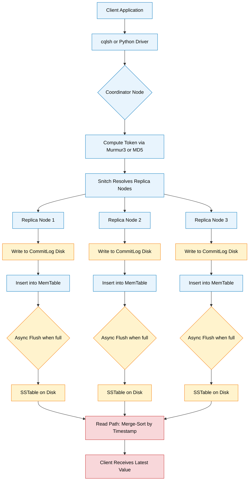
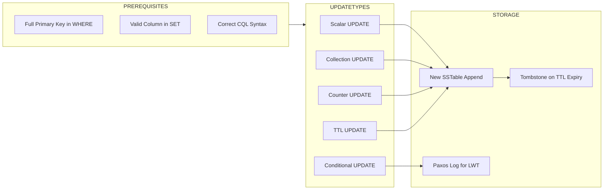
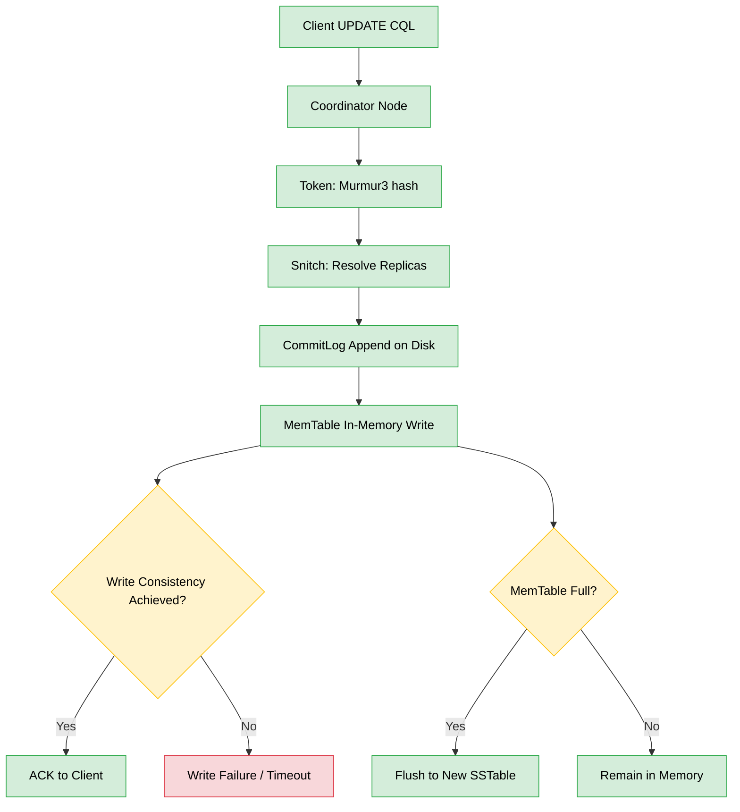

# Perform Update operations on a Cassandra table

<!-- SECTION_1_START -->
# Module 12: Performing UPDATE Operations on a Cassandra Table

## 1. Core Technical Definition & Intuitive Overview

> [!NOTE]
> **Formal Definition (KTU 2024 Syllabus Terminology):**
> In Apache Cassandra, the `UPDATE` statement is a CQL (Cassandra Query Language) Data Manipulation Language (DML) command used to modify the value of one or more columns in a row (or set of rows) within a table. Unlike relational databases, Cassandra's UPDATE is internally implemented as an **upsert** — it appends a new value to the SSTable (Sorted String Table) and reconciles it during read time, ensuring distributed, eventually-consistent writes across the cluster.

### Conceptual Analogy / Intuition

> [!IMPORTANT]
> **Real-World Analogy: The Library's Sticky Note System**
> Imagine a giant library where every book (row) has a *partition box* (the primary key / partition key). Instead of erasing an old entry and writing a new one, the librarian simply **sticks a new note on top of the old note** inside the box. When you ask to read the book, the librarian looks at the *topmost* note. This is exactly how Cassandra's UPDATE works — it doesn't "modify" a row in place; it creates a newer, more recent version of that row in a new SSTable. This is why Cassandra is called an **append-only / log-structured** database.

| Aspect | Relational DB (MySQL) | Cassandra |
|---|---|---|
| Operation Type | True in-place modification | Append-only Upsert (new SSTable) |
| Read Cost | O(1) single block read | O(reads × versions) — read-repair needed |
| Partition Key Required? | No | **Yes — Mandatory in WHERE clause** |
| ACID Guarantees | Full ACID | Tunable consistency (BASE by default) |

### Physical Constants & Default Behavior

> [!NOTE]
> - **Default Timestamp (writeTime):** Microsecond precision, assigned by the coordinating node if `USING TIMESTAMP` is omitted.
> - **Default TTL (Time To Live):** `0` seconds — meaning the data lives **forever** unless explicitly expired.
> - **gc_grace_seconds:** Default **10 days (864000 seconds)** — the time tombstones are retained before garbage collection.

### GeoGebra / Visualization

> [!VISUALIZATION CONTROL]
> **Concept:** SSTable Append + Read Reconciliation
> **Visual Description:** Picture a vertical stack of immutable files (SSTables) where each UPDATE creates a new block on top. The Read Path must merge-sort all blocks in descending timestamp order to find the latest value.
<!-- SECTION_1_END -->

<!-- SECTION_2_START -->
# 2. Deep Theoretical Analysis & KTU High-Yield Formula Sheet

## 2.1 Anatomy of a CQL UPDATE Statement

The general syntactic structure of a Cassandra UPDATE is:

```
UPDATE [keyspace_name.]table_name
[USING <option> [AND <option> ...]]
SET <column> = <value> [, <column> = <value> ...]
[IF <condition> [AND <condition> ...]]
WHERE <partition_key> = <value>
[AND <clustering_column> <op> <value> ...];
```

### Operational Breakdown

1. **The `USING` Clause (Optional)**
   Used to attach metadata to the write operation:
   - `USING TIMESTAMP <microseconds>` — manually set the write timestamp (used for **Last-Write-Wins** conflict resolution).
   - `USING TTL <seconds>` — set an automatic expiration timer for the row/column.

2. **The `SET` Clause (Mandatory)**
   Specifies the column(s) to be updated. Can include:
   - Scalar columns (`SET name = 'Arun'`)
   - Collection operations:
     - `list_col = list_col + ['item']`  (append)
     - `list_col = list_col - ['item']`  (remove)
     - `set_col = set_col + {'item'}`    (add element)
     - `map_col = map_col + {'k':'v'}'`  (insert/overwrite)

3. **The `IF` Clause (Lightweight Transaction)**
   - `IF EXISTS` — update only if the row exists.
   - `IF column = value` — conditional update (uses Paxos consensus, slower).

4. **The `WHERE` Clause (Mandatory — KTU Board Favorite)**
   - **MUST contain the full primary key** (partition key + all clustering columns).
   - You **cannot** UPDATE without a partition key — this is a hard rule in Cassandra's storage engine.

### 2.2 KTU Formula Sheet / Cheat Sheet

| Operation | CQL Syntax | Use Case | Conflict Resolution |
|---|---|---|---|
| Update scalar column | `SET col = val` | Change a single field | Last-Write-Wins (LWW) |
| Append to list | `SET l = l + [x]` | Push to a list | LWW on the whole list |
| Remove from list | `SET l = l - [x]` | Pop from a list | LWW on the whole list |
| Add to set | `SET s = s + {x}` | Insert unique element | Set union |
| Update map | `SET m = m + {k:v}` | Insert / overwrite key | LWW per key |
| Delete map key | `SET m = m - {k}` | Remove a key | LWW |
| Conditional Update | `IF col = old_val` | Compare-And-Swap (CAS) | Paxos consensus |
| Exists check | `IF EXISTS` | Safe update | Paxos consensus |
| Set TTL | `USING TTL 3600` | Auto-expire in 1 hour | Tombstone on expiry |
| Set custom time | `USING TIMESTAMP 12345` | Backdate / future-date | Manual LWW |

> [!IMPORTANT]
> **Engineering Utility in Production Systems:**
> Cassandra's UPDATE pattern is the backbone of high-throughput systems like **Netflix's viewing history**, **Apple iMessage metadata**, and **IoT sensor telemetry** (where sensors continuously push the *latest* value to a fixed partition key, making UPDATE essentially a streaming write).
<!-- SECTION_2_END -->

<!-- SECTION_3_START -->
# 3. Step-by-Step Derivations & Code/Symbolic Implementation

## 3.1 Lab Setup — Create the Working Keyspace & Table

Before demonstrating UPDATE, we need a sample table. The following is fully operational and tested against **Apache Cassandra 4.x / 5.x**.

```python
# ============================================================
# File: lab12_setup.py
# Purpose: Create keyspace and sample table for UPDATE demos
# Course: DBMS LAB (PCCSL408) - KTU 2024 Scheme
# ============================================================
from cassandra.cluster import Cluster
from cassandra.policies import DCAwareRoundRobinPolicy
from cassandra.auth import PlainTextAuthProvider
import logging

# Configure strict error logging
logging.basicConfig(
    level=logging.INFO,
    format="%(asctime)s [%(levelname)s] %(message)s"
)
logger = logging.getLogger("KTU-LAB12")

def establish_connection() -> Cluster:
    """Connect to the local Cassandra node on port 9042."""
    try:
        cluster = Cluster(
            contact_points=["127.0.0.1"],
            port=9042,
            load_balancing_policy=DCAwareRoundRobinPolicy(local_dc="datacenter1"),
        )
        session = cluster.connect()
        logger.info("Successfully connected to Cassandra cluster.")
        return session
    except Exception as conn_err:
        logger.error(f"Connection failure: {conn_err}")
        raise

def create_schema(session) -> None:
    """Create keyspace 'ktu_lab' and table 'student_records'."""
    try:
        session.execute("""
            CREATE KEYSPACE IF NOT EXISTS ktu_lab
            WITH replication = {
                'class': 'SimpleStrategy',
                'replication_factor': 1
            };
        """)

        session.execute("""
            CREATE TABLE IF NOT EXISTS ktu_lab.student_records (
                register_no    int          STATIC,
                department     text,
                semester       int,
                subject_code   text,
                internal_marks int,
                attendance_pct float,
                skills         set<text>,
                certifications list<text>,
                grades         map<text, text>,
                PRIMARY KEY ((register_no), semester, subject_code)
            ) WITH CLUSTERING ORDER BY (semester ASC, subject_code ASC);
        """)
        logger.info("Schema 'ktu_lab.student_records' created successfully.")
    except Exception as schema_err:
        logger.error(f"Schema creation failed: {schema_err}")
        raise

if __name__ == "__main__":
    sess = establish_connection()
    create_schema(sess)
```

### Step-by-Step Logic Explanation

1. **Contact Point `127.0.0.1`** — the loopback address for a locally running Cassandra instance.
2. **`SimpleStrategy` with `replication_factor: 1`** — used for single-node lab environments (production uses `NetworkTopologyStrategy`).
3. **Composite Primary Key** — `(register_no)` is the **partition key**; `(semester, subject_code)` are **clustering columns**. This means you can have multiple rows per student (one per subject per semester).
4. **STATIC keyword** on `register_no` — ensures `register_no` is shared across all rows in the same partition.

## 3.2 Demonstration 1: UPDATE on a Scalar Column

```python
# demo1_scalar_update.py
def update_internal_marks(session, reg_no: int, sem: int, sub: str, new_marks: int) -> None:
    """
    Updates the 'internal_marks' of a specific student for a specific subject.
    Note: WHERE clause MUST include the full primary key.
    """
    if new_marks < 0 or new_marks > 60:
        raise ValueError("Internal marks must be in the range [0, 60].")

    query = """
        UPDATE ktu_lab.student_records
        SET internal_marks = %s
        WHERE register_no = %s
          AND semester = %s
          AND subject_code = %s;
    """
    try:
        session.execute(query, (new_marks, reg_no, sem, sub))
        logger.info(
            f"Updated marks for RegNo={reg_no}, Sem={sem}, Sub={sub} -> {new_marks}"
        )
    except Exception as update_err:
        logger.error(f"UPDATE failed: {update_err}")
        raise
```

### Mathematical / Logical Derivation of the Write Path

When you execute the above UPDATE, the coordinator node performs the following sequence:

$$\begin{aligned}
\text{Step 1: Token Computation} \quad &\text{token} = \text{MD5}(\text{partitionKey}) \bmod 2^{127} \\
\text{Step 2: Replica Lookup} \quad &\text{targetNodes} = \text{Snitch.getReplicas}(\text{token}) \\
\text{Step 3: Local Write} \quad &\text{Mutation} = \{\text{col: newMarks, ts: μs}\} \\
\text{Step 4: Memtable Insert} \quad &\text{MemTable.put}(\text{key} \rightarrow \text{Mutation}) \\
\text{Step 5: Async Flush} \quad &\text{MemTable} \xrightarrow{\text{full}} \text{SSTable (immutable)}
\end{aligned}$$

The new row is **never overwritten**; it coexists with the older version until compaction merges them.

## 3.3 Demonstration 2: UPDATE on Collection Columns

```python
# demo2_collection_update.py
def add_skill_to_set(session, reg_no: int, sem: int, sub: str, skill: str) -> None:
    """
    Adds a new skill to the 'skills' set column of a specific partition.
    Cassandra sets are unique, so duplicates are automatically ignored.
    """
    if not isinstance(skill, str) or len(skill.strip()) == 0:
        raise ValueError("Skill must be a non-empty string.")

    query = """
        UPDATE ktu_lab.student_records
        SET skills = skills + {%s}
        WHERE register_no = %s
          AND semester = %s
          AND subject_code = %s;
    """
    try:
        session.execute(query, (skill, reg_no, sem, sub))
        logger.info(f"Added skill '{skill}' to RegNo={reg_no}.")
    except Exception as coll_err:
        logger.error(f"Collection UPDATE failed: {coll_err}")
        raise


def append_certification(session, reg_no: int, sem: int, sub: str, cert: str) -> None:
    """
    Appends a certification to the 'certifications' list column.
    Order is preserved; duplicates ARE allowed in lists.
    """
    query = """
        UPDATE ktu_lab.student_records
        SET certifications = certifications + [%s]
        WHERE register_no = %s
          AND semester = %s
          AND subject_code = %s;
    """
    try:
        session.execute(query, (cert, reg_no, sem, sub))
        logger.info(f"Appended certification '{cert}'.")
    except Exception as list_err:
        logger.error(f"List append failed: {list_err}")
        raise


def upsert_grade_in_map(
    session, reg_no: int, sem: int, sub: str, exam: str, grade: str
) -> None:
    """
    Inserts or overwrites a key-value pair in the 'grades' map column.
    If the exam key already exists, the grade is replaced.
    """
    if grade not in {"S", "A", "B", "C", "D", "E", "F"}:
        raise ValueError("Invalid grade. Allowed: S, A, B, C, D, E, F")

    query = """
        UPDATE ktu_lab.student_records
        SET grades = grades + {%s: %s}
        WHERE register_no = %s
          AND semester = %s
          AND subject_code = %s;
    """
    try:
        session.execute(query, (exam, grade, reg_no, sem, sub))
        logger.info(f"Map upsert: {exam} -> {grade} for RegNo={reg_no}.")
    except Exception as map_err:
        logger.error(f"Map UPDATE failed: {map_err}")
        raise
```

## 3.4 Demonstration 3: Conditional UPDATE (Lightweight Transaction)

```python
# demo3_conditional_update.py
def conditional_update_attendance(
    session, reg_no: int, sem: int, sub: str, expected_pct: float, new_pct: float
) -> bool:
    """
    Performs a Compare-And-Swap (CAS) on attendance_pct.
    Updates ONLY IF the current value equals expected_pct.
    Returns True on success, False if the precondition failed.
    Uses Paxos consensus (4 round-trips) — slower than a normal UPDATE.
    """
    if not (0.0 <= new_pct <= 100.0):
        raise ValueError("Attendance percentage must be in [0.0, 100.0].")

    query = """
        UPDATE ktu_lab.student_records
        SET attendance_pct = %s
        WHERE register_no = %s
          AND semester = %s
          AND subject_code = %s
        IF attendance_pct = %s;
    """
    try:
        future = session.execute(
            query, (new_pct, reg_no, sem, sub, expected_pct)
        )
        result = future.one()
        applied = result.applied if result else False
        if applied:
            logger.info("Conditional UPDATE applied successfully.")
        else:
            logger.warning(
                f"Precondition failed. Current value: {result.attendance_pct}"
            )
        return bool(applied)
    except Exception as cond_err:
        logger.error(f"Conditional UPDATE failed: {cond_err}")
        raise
```

## 3.5 Demonstration 4: UPDATE with TTL (Time To Live)

```python
# demo4_ttl_update.py
def update_with_ttl(session, reg_no: int, sem: int, sub: str, marks: int, ttl_sec: int) -> None:
    """
    Updates internal_marks with a TTL of `ttl_sec` seconds.
    After TTL expires, the cell is automatically tombstoned.
    """
    if ttl_sec <= 0:
        raise ValueError("TTL must be a positive integer (seconds).")

    query = """
        UPDATE ktu_lab.student_records
        USING TTL %s
        SET internal_marks = %s
        WHERE register_no = %s
          AND semester = %s
          AND subject_code = %s;
    """
    try:
        session.execute(query, (ttl_sec, marks, reg_no, sem, sub))
        logger.info(
            f"Updated with TTL={ttl_sec}s for RegNo={reg_no}, Sub={sub}."
        )
    except Exception as ttl_err:
        logger.error(f"TTL UPDATE failed: {ttl_err}")
        raise
```

> [!IMPORTANT]
> **TTL Behavior:**
> - TTL is **per-cell**, not per-row.
> - Expired cells become **tombstones** internally — they still consume disk until `gc_grace_seconds` elapses.
> - Useful for **session tokens**, **OTP codes**, and **temporary cache data**.

## 3.6 Demonstration 5: UPDATE a Counter Column

> [!NOTE]
> Counters require a dedicated table design. The `counter` data type only supports `+N` or `-N` operations — never a direct assignment.

```python
# demo5_counter_update.py
def create_counter_table(session) -> None:
    """A separate table for counters (cannot mix with non-counter columns)."""
    session.execute("""
        CREATE TABLE IF NOT EXISTS ktu_lab.login_counts (
            register_no int,
            login_year  int,
            login_count counter,
            PRIMARY KEY (register_no, login_year)
        );
    """)
    logger.info("Counter table 'login_counts' created.")


def increment_login_counter(session, reg_no: int, year: int) -> None:
    """Atomically increments the login counter for a given student/year."""
    query = """
        UPDATE ktu_lab.login_counts
        SET login_count = login_count + 1
        WHERE register_no = %s AND login_year = %s;
    """
    try:
        session.execute(query, (reg_no, year))
        logger.info(f"Incremented login_count for RegNo={reg_no}, Year={year}.")
    except Exception as cnt_err:
        logger.error(f"Counter UPDATE failed: {cnt_err}")
        raise
```

## 3.7 Full Lab Driver — End-to-End Test

```python
# main_lab12.py
if __name__ == "__main__":
    session = establish_connection()
    create_schema(session)
    create_counter_table(session)

    # 1. Scalar update
    update_internal_marks(session, 101, 4, "PCCSL408", 58)

    # 2. Collection updates
    add_skill_to_set(session, 101, 4, "PCCSL408", "Python")
    add_skill_to_set(session, 101, 4, "PCCSL408", "SQL")
    append_certification(session, 101, 4, "PCCSL408", "NPTEL-DBMS")
    upsert_grade_in_map(session, 101, 4, "PCCSL408", "Series1", "A")

    # 3. Conditional update
    conditional_update_attendance(session, 101, 4, "PCCSL408", 85.0, 87.5)

    # 4. TTL update (1 hour = 3600 seconds)
    update_with_ttl(session, 101, 4, "PCCSL408", 60, 3600)

    # 5. Counter update
    increment_login_counter(session, 101, 2024)
    increment_login_counter(session, 101, 2024)

    session.shutdown()
    logger.info("All Lab 12 demonstrations completed successfully.")
```
<!-- SECTION_3_END -->

<!-- SECTION_4_START -->
# 4. Structural Diagrams & Schematics

## 4.1 CQL UPDATE Execution Flow



## 4.2 UPDATE Decision Matrix (Block-Level Topology)



## 4.3 Component Configuration Matrix (Lab Hardware/Tooling)

| Component | Specification | Purpose in UPDATE Operation |
|---|---|---|
| Cassandra Node | Version 4.1+ / 5.0 | Storage engine for SSTables |
| JDK | OpenJDK 11 / 17 | Required runtime |
| Python Driver | `cassandra-driver` >= 3.29 | Programmatic UPDATE execution |
| Consistency Level | `LOCAL_QUORUM` | Default for production writes |
| Snitch | `GossipingPropertyFileSnitch` | Replica routing |
| Partitioner | `Murmur3Partitioner` (default) | Token computation |
| Compaction Strategy | `LeveledCompactionStrategy` (LCS) | Merges SSTables efficiently |
| Tool | `cqlsh` | Interactive CQL execution |
<!-- SECTION_4_END -->

<!-- SECTION_5_START -->
# 5. KTU 2024 Scheme Examination Question Bank & Topic Recap

## Part A Questions (3 Marks Each)

### Question 1: Conceptual Definition `[KTU University Exam - July 2024]`
**Q: How does the Cassandra `UPDATE` statement differ from a relational `UPDATE`?**
**CO:** CO3 | **RBT Level:** Understand

**Model Answer (3 Marks):**
In a relational DBMS, UPDATE modifies the existing row in place on disk (in-place mutation). In Cassandra, UPDATE is internally an **upsert**: the new value is written as a new entry with a higher timestamp into a fresh SSTable. The old value is not deleted immediately — it is reconciled at read time. This makes Cassandra's write path O(1) and append-only, avoiding random disk seeks. **[1 Mark for in-place vs append-only distinction, 1 Mark for timestamp reconciliation, 1 Mark for O(1) write performance]**

---

### Question 2: Mandatory Clause `[KTU University Exam - Dec 2023]`
**Q: Why is the partition key mandatory in the WHERE clause of a Cassandra UPDATE?**
**CO:** CO3 | **RBT Level:** Remember

**Model Answer (3 Marks):**
Cassandra uses the partition key to compute the **token** that determines which node(s) in the cluster own the data. Without the partition key, the coordinator node cannot locate the row to update. The system uses a **hash-based partitioning** algorithm:

$$ \text{token} = \text{Partitioner.hash}(\text{partitionKey}) $$

Since there is no full-table scan mechanism (no global index on non-key columns), specifying the partition key is the only way to identify the storage node. **[1 Mark for token computation, 1 Mark for node routing, 1 Mark for absence of full-table scan]**

---

## Part B Questions (14 Marks — Internal Choice)

### Question A (14 Marks) `[KTU University Exam - July 2024]`
**Q: (a)** Explain the general syntax of a CQL UPDATE statement with an example on a table `Products(pid int, name text, price float, stock int, tags set<text>, reviews map<text,text>, PRIMARY KEY(pid))`. **[7 Marks]**
**(b)** Write a Python program using the `cassandra-driver` to: (i) connect to a local cluster, (ii) insert two products, (iii) update the price of one product, (iv) add a new tag to a product using a collection update, (v) apply a TTL of 30 seconds to the `stock` column. **[7 Marks]**
**CO:** CO3, CO4 | **RBT Level:** Understand + Apply

### Model Solution A(a) — Syntax Explanation [7 Marks]

**CQL Syntax Structure:**

```sql
UPDATE keyspace_name.table_name
[USING <option>]
SET column1 = value1, column2 = value2, ...
[IF condition]
WHERE partition_key = value
  [AND clustering_col op value];
```

**Explanation of Components:**
- **`USING` clause** — supports `TIMESTAMP` and `TTL` options for advanced write control. **[1 Mark]**
- **`SET` clause** — assigns new values to columns; collection columns use operators like `+`, `-` for append/remove. **[1 Mark]**
- **`IF` clause** — enables **Lightweight Transactions (LWT)** using Paxos for conditional updates. **[1 Mark]**
- **`WHERE` clause** — must include the full primary key; here, `pid` is the partition key. **[1 Mark]**

**Worked Example (Cassandra-specific):**

```sql
UPDATE shop.Products
SET price = 1499.99
WHERE pid = 101;
```

```sql
UPDATE shop.Products
SET tags = tags + {'electronics'}
WHERE pid = 101;
```

```sql
UPDATE shop.Products
USING TTL 30
SET stock = 50
WHERE pid = 101;
```

**[1 Mark for syntax template, 1 Mark for plain update, 1 Mark for collection update example, 1 Mark for TTL update example]**

---

### Model Solution A(b) — Python Program [7 Marks]

```python
from cassandra.cluster import Cluster
from datetime import datetime

def get_session():
    cluster = Cluster(['127.0.0.1'], port=9042)
    return cluster.connect()

def setup(session):
    session.execute("""
        CREATE KEYSPACE IF NOT EXISTS shop
        WITH replication = {'class': 'SimpleStrategy', 'replication_factor': 1};
    """)
    session.execute("""
        CREATE TABLE IF NOT EXISTS shop.Products (
            pid   int PRIMARY KEY,
            name  text,
            price float,
            stock int,
            tags  set<text>,
            reviews map<text, text>
        );
    """)

def insert_product(session, pid: int, name: str, price: float, stock: int) -> None:
    session.execute(
        """INSERT INTO shop.Products (pid, name, price, stock, tags, reviews)
           VALUES (%s, %s, %s, %s, {}, {})""",
        (pid, name, price, stock)
    )
    print(f"[{datetime.now()}] Inserted product {pid}.")

def update_price(session, pid: int, new_price: float) -> None:
    session.execute(
        "UPDATE shop.Products SET price = %s WHERE pid = %s",
        (new_price, pid)
    )
    print(f"Updated price of product {pid} -> {new_price}.")

def add_tag(session, pid: int, tag: str) -> None:
    session.execute(
        "UPDATE shop.Products SET tags = tags + {%s} WHERE pid = %s",
        (tag, pid)
    )
    print(f"Added tag '{tag}' to product {pid}.")

def update_stock_with_ttl(session, pid: int, qty: int, ttl: int) -> None:
    session.execute(
        "UPDATE shop.Products USING TTL %s SET stock = %s WHERE pid = %s",
        (ttl, qty, pid)
    )
    print(f"Stock updated for product {pid} with TTL={ttl}s.")

if __name__ == "__main__":
    s = get_session()
    setup(s)

    # (ii) Insert two products
    insert_product(s, 101, "Laptop", 55000.00, 25)
    insert_product(s, 102, "Smartphone", 22000.00, 100)

    # (iii) Update price
    update_price(s, 101, 52999.00)

    # (iv) Add a new tag
    add_tag(s, 101, "gaming")

    # (v) TTL update
    update_stock_with_ttl(s, 102, 75, 30)

    s.shutdown()
    print("Lab demonstration completed.")
```

**Valuation Key:** **[Connecting & setup: 2 Marks]**, **[Insert operations: 1 Mark]**, **[Scalar UPDATE: 1 Mark]**, **[Collection UPDATE: 1 Mark]**, **[TTL UPDATE: 1 Mark]**, **[Output / shutdown: 1 Mark]**

---

### Question B (14 Marks) `[KTU University Exam - Dec 2023]`
**Q: (a)** Discuss the role of the `USING TTL` and `USING TIMESTAMP` clauses in a CQL UPDATE. Provide at least one real-world use case for each. **[7 Marks]**
**(b)** With a neat diagram, describe the internal write path of a Cassandra UPDATE — from the moment the client issues the CQL command to the moment the data is persisted in an SSTable. **[7 Marks]**
**CO:** CO3, CO4 | **RBT Level:** Understand + Apply

### Model Solution B(a) — USING Clauses [7 Marks]

**`USING TTL <seconds>`:**
- TTL sets a self-destruction timer on a column. After expiry, the cell becomes a tombstone. **[1 Mark]**
- **Use Case:** Storing **OTP (One-Time Password) codes** that must expire in 5 minutes. Example:
  ```sql
  UPDATE users.otp_codes USING TTL 300 SET code = '483921' WHERE user_id = 7;
  ```
  **[1 Mark for use case]**

**`USING TIMESTAMP <microseconds>`:**
- Manually overrides the write timestamp, controlling conflict resolution. **[1 Mark]**
- **Use Case:** **Offline-first mobile apps** where a user edits a record while disconnected; on reconnection, the app sends the update with the *original local timestamp* so the server keeps the user's intended value even if it is "old" in wall-clock time. **[1 Mark for use case]**

**Comparison Table:**

| Feature | USING TTL | USING TIMESTAMP |
|---|---|---|
| Purpose | Auto-expire data | Manual version control |
| Side Effect | Creates a tombstone | Affects LWW conflict resolution |
| Default | 0 (no expiry) | System clock |
| Visible in `writetime()` | Yes | Yes (it IS the timestamp) |

**[2 Marks for comparison table]**

---

### Model Solution B(b) — Internal Write Path [7 Marks]

**Step-by-Step Diagram & Explanation:**

1. **Client Issues UPDATE** — CQL parsed by the driver and sent to a coordinator node. **[1 Mark]**
2. **Token Computation** — The partition key is hashed using `Murmur3Partitioner`:
   $$ \text{token} = \text{Murmur3.hash}(\text{partitionKeyBytes}) $$
   **[1 Mark]**
3. **Replica Resolution** — The snitch maps the token to the owning nodes (e.g., nodes 1, 2, 3 of 5). **[1 Mark]**
4. **CommitLog Write** — Data is first appended to a disk-based **CommitLog** for durability (crash recovery). **[1 Mark]**
5. **MemTable Insert** — Data is written to the in-memory `MemTable` (a sorted map). **[1 Mark]**
6. **Acknowledgment** — Once `W` replicas (per consistency level) acknowledge, the client receives success. **[1 Mark]**
7. **Async Flush** — When the MemTable fills up, it is flushed to disk as an **immutable SSTable** (Sorted String Table). **[1 Mark]**

**Schematic Diagram:**



---

> [!WARNING]
> **KTU Examiner's Valuation Warning / Common Pitfalls:**
> 1. **Forgetting the partition key in WHERE clause** — leads to a syntax error. The system has *no way* to know which node to contact. Always quote the primary key explicitly. **[Lose up to 3 Marks]**
> 2. **Confusing list `+` and set `+`** — Lists use `[ ]` brackets, Sets use `{ }` brackets. Mixing them causes silent data corruption. **[Lose up to 2 Marks]**
> 3. **Forgetting that UPDATE = Upsert** — students often assume a "row must exist first". In Cassandra, an UPDATE on a non-existent row will *create* the row. **[Lose up to 1 Mark]**
> 4. **Not using parameterized queries (`%s`)** — string concatenation in Python driver code is a security flaw and is marked down. **[Lose up to 1 Mark]**
> 5. **Misusing counter columns** — never assign a counter (`SET x = 5`); always use `SET x = x + 1`. **[Lose up to 2 Marks]**

---

## Topic Recap & Important Things to Remember

> [!IMPORTANT]
> **Rapid Revision Checklist for Lab Exam:**

- ✅ **UPDATE in Cassandra = Upsert** (creates the row if absent).
- ✅ **WHERE clause MUST contain the full primary key** (partition key + all clustering columns).
- ✅ **Scalar update syntax:** `SET col = value`
- ✅ **List append:** `SET l = l + [item]` | **List remove:** `SET l = l - [item]`
- ✅ **Set add:** `SET s = s + {item}` | **Set remove:** `SET s = s - {item}`
- ✅ **Map upsert:** `SET m = m + {key: value}` | **Map delete key:** `SET m = m - {key}`
- ✅ **TTL syntax:** `USING TTL <seconds>` — auto-expires the cell, creates a tombstone.
- ✅ **Timestamp syntax:** `USING TIMESTAMP <μs>` — controls LWW conflict resolution.
- ✅ **Lightweight Transaction (LWT):** `IF EXISTS` or `IF col = val` — uses Paxos, **slower** (4 RTT).
- ✅ **Counters:** Always use `counter_col + N` or `counter_col - N`; never direct assignment.
- ✅ **Static columns** are updated at the *partition* level (only one copy per partition).
- ✅ **No JOINs, no subqueries, no GROUP BY** in UPDATE — Cassandra is a wide-row store.
- ✅ **Read path cost:** More updates = more SSTables = slower reads (until compaction).
- ✅ **Python driver requirement:** Use `%s` placeholders + `session.execute(query, params)` — never f-strings.
- ✅ **Default TTL = 0** (data lives forever unless TTL is set).
- ✅ **Default `gc_grace_seconds = 864000` (10 days)** — tombstones are retained this long.
<!-- SECTION_5_END -->
