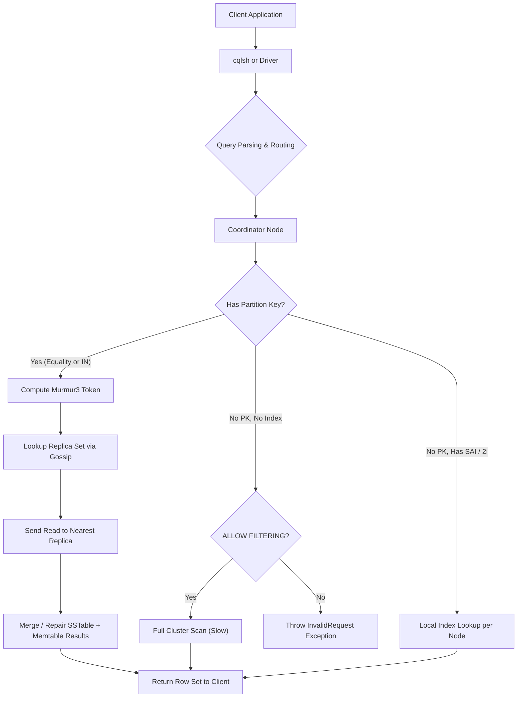
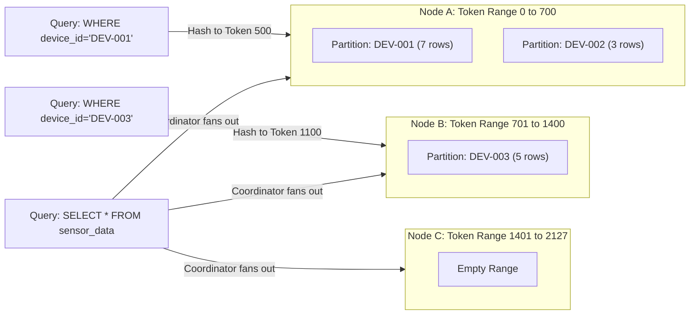
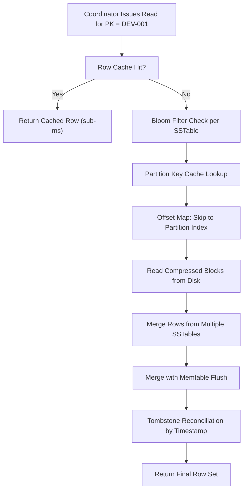

# Execute CQL queries to retrieve specific data from Cassandra tables

<!-- SECTION_1_START -->
# Module 13: Retrieving Data from Cassandra using CQL

## 1. Core Technical Definition

**CQL (Cassandra Query Language)** is the declarative query language used to interact with **Apache Cassandra**, a distributed, wide-column NoSQL database. The `SELECT` statement in CQL is the primary data retrieval command, structurally inspired by SQL but architecturally constrained by Cassandra's **partition-oriented storage model** (the *log-structured merge-tree* / LSM tree engine).

> [!IMPORTANT]
> **Formal KTU Definition:**
> *A CQL `SELECT` query reads one or more rows (and their associated columns) from a Cassandra table by specifying either a complete partition key, a partial partition key with token function, or a partition key combined with clustering column predicates. Unlike SQL, full table scans are discouraged, and filtering on non-key/non-indexed columns requires the `ALLOW FILTERING` modifier.*

| Symbol | Meaning in CQL Context |
| :--- | :--- |
| **PK** | Partition Key (determines node placement via consistent hashing) |
| **CK** | Clustering Key (sorting order within a partition) |
| **SI** | Secondary Index (local index on non-PK column) |
| **MV** | Materialized View (auto-maintained read-only projection) |
| **SASSi** | Storage-Attached Secondary Index (SASI) — legacy text indexes |

> [!NOTE]
> **Syllabus Highlight (PCCSL408 – Module 13):**
> The lab expects students to (a) design a keyspace and table, (b) insert sample rows, (c) execute diverse `SELECT` queries including simple projections, filtered reads, ordered reads, aggregate reads, and indexed reads, and (d) interpret the output to verify the partition-aware retrieval behavior of Cassandra.

## 2. Conceptual Analogy — "The Library Filing System"

Imagine a massive library with **millions of books** spread across **hundreds of branches** (data centers → racks → nodes → vnodes).

- The **Partition Key** is the **branch location code** stamped on every book. When you want a book, you must know the branch — the librarian will not search every branch simultaneously.
- The **Clustering Key** is the **shelf number** inside that branch — books on the same shelf are physically sorted.
- A **Secondary Index** is a small **back-of-book index card** at the branch reception, allowing the librarian to find a book by author name *without* walking to the shelf.
- **`ALLOW FILTERING`** is the librarian saying: *"Go check every shelf on every branch manually — yes, it will be slow."*

This is why Cassandra forces you to design your query patterns *first* and the schema *second* — the exact opposite of RDBMS philosophy.

> [!VISUALIZATION CONTROL]
> **Concept:** Partition-aware data distribution (Token Ring)
> **Cassandra Visualization (Conceptual):**
> * Conceptually plot a token ring of size 0 to 2,127,483,647 (using **Murmur3Partitioner**).
> * Each node owns a contiguous token range; each `device_id` (PK) hashes to a token.
> **Visual Description:** A circle with arcs labelled `Node1`, `Node2`, `Node3` and points along the circumference representing hashed partition keys. Queries asking for a specific `device_id` travel to *exactly one* node.
<!-- SECTION_1_END -->

<!-- SECTION_2_START -->
# Deep Theoretical Analysis & KTU High-Yield Cheat Sheet

## 1. Anatomy of a CQL `SELECT` Statement

A CQL retrieval command has the following mandatory and optional clauses, evaluated in the order presented:

1. **`SELECT`** — column projection list (`*`, `col1, col2`, or `count(*)`, `writetime(col)`, `ttl(col)`)
2. **`FROM <keyspace>.<table>`** — fully qualified table reference
3. **`WHERE`** — predicate on partition key (**required** for performance), optional on clustering columns
4. **`ORDER BY`** — sorting **only** allowed on clustering columns; must be ASC or DESC
5. **`PER PARTITION LIMIT`** — caps rows returned per partition
6. **`LIMIT`** — caps total rows returned across all partitions
7. **`ALLOW FILTERING`** — explicit opt-in for unindexed, non-key column predicates
8. **`IN`** — multi-partition read (fans out to multiple nodes in parallel)

> [!NOTE]
> **The Cardinal Rule of Cassandra Reads:**
> A query is **performant** if and only if it specifies the **partition key** (or a token range / `IN` on the partition key). Any query that does not satisfy this rule will trigger a full-cluster scan unless a **secondary index** is used.

## 2. CQL SELECT — Master Formula Sheet

| # | Clause | Syntax Template | Allowed Target | Engineering Purpose |
| :-: | :--- | :--- | :--- | :--- |
| 1 | Full projection | `SELECT * FROM t;` | None | Debug / schema inspection |
| 2 | Column projection | `SELECT a, b FROM t;` | Any columns | Network byte reduction |
| 3 | Equality on PK | `WHERE pk = 'X';` | **Partition Key** | Single-partition point read — **fastest** |
| 4 | Range on CK | `WHERE pk='X' AND ck > 10;` | **Clustering Key** | Slice within a partition |
| 5 | Tuple IN | `WHERE pk IN ('A','B');` | **Partition Key** | Parallel multi-partition read |
| 6 | Token function | `WHERE token(pk) > -100;` | **Token of PK** | Bootstrap / repair scans |
| 7 | `ORDER BY` | `ORDER BY ck DESC;` | **Clustering Key** | Reverse chronological read |
| 8 | `LIMIT` | `LIMIT 100;` | All rows after WHERE | Pagination across partitions |
| 9 | `PER PARTITION LIMIT` | `PER PARTITION LIMIT 5;` | Per partition | Top-N within each partition |
| 10 | `ALLOW FILTERING` | Append to query | Any column | Anti-pattern; demo only |
| 11 | `COUNT()` | `SELECT count(*) FROM t;` | Full table | Cataloging — **very slow** |
| 12 | `writetime()` | `SELECT writetime(col) FROM t;` | Any non-PK | Audit last write timestamp |
| 13 | `ttl()` | `SELECT ttl(col) FROM t;` | Any non-PK | Inspect remaining Time-To-Live |
| 14 | `dateOf()` | `WHERE dateOf(ck) = '2024-01-01';` | Timestamp CK | Time-bucket filtering |

> [!IMPORTANT]
> **Critical Evaluation Note:**
> Cassandra *does* support `GROUP BY` since **3.10+** and native **aggregates** (`COUNT`, `MAX`, `MIN`, `SUM`, `AVG`). However, aggregations are **partition-local** by default — they must be paired with a partition key in `WHERE` to avoid a full cluster scan.

## 3. Real-World Engineering Utility

CQL retrieval patterns power several production-grade systems:

- **Netflix Viewing History** — `SELECT * FROM views WHERE user_id=? ORDER BY viewed_at DESC LIMIT 20;`
- **Apple iMessage Delivery Logs** — Append-only time-series with `device_id` as partition key.
- **IoT Smart Home Telemetry** — Sensor readings partitioned by `device_id` and clustered by `recorded_at`.
- **Discord Message Storage** — Messages partitioned by `channel_id` clustered by `message_id` (snowflake → time-ordered).
- **Instagram Direct Messages** — `sender_id + receiver_id` as composite partition key for inbox/outbox projections.

In every case, the **read pattern dictated the schema**, not the other way around.
<!-- SECTION_2_END -->

<!-- SECTION_3_START -->
# Step-by-Step Implementation — CQL Lab Walkthrough

> [!NOTE]
> **Lab Setup Assumption:** Cassandra is running in **cqlsh** (Cassandra 4.x). We will create a keyspace simulating a **Smart Home IoT sensor network**, insert sample telemetry, and execute progressively complex retrieval queries.

---

## Step 1 — Create the Keyspace (NetworkTopology or SimpleStrategy)

For a single-node lab, we use `SimpleStrategy` with `replication_factor = 1`.

```sql
CREATE KEYSPACE IF NOT EXISTS smarthome
  WITH replication = {
    'class': 'SimpleStrategy',
    'replication_factor': 1
  };
```

**Explanation of every component:**

- `CREATE KEYSPACE IF NOT EXISTS` — Equivalent to SQL's `CREATE DATABASE IF NOT EXISTS`. The `IF NOT EXISTS` guard makes the statement idempotent.
- `WITH replication = { ... }` — Mandatory block specifying placement strategy.
- `'class': 'SimpleStrategy'` — Places replicas on the next `replication_factor` nodes clockwise on the ring. For multi-DC production, use `NetworkTopologyStrategy`.
- `'replication_factor': 1` — Only one copy of every row. Safe for lab, **never** for production.

```sql
USE smarthome;
```

The `USE` statement switches the default keyspace context, mirroring SQL's `USE database;`.

---

## Step 2 — Create the `sensor_data` Table

```sql
CREATE TABLE IF NOT EXISTS sensor_data (
    device_id      text,
    recorded_at    timestamp,
    sensor_type    text,
    value          double,
    unit           text,
    PRIMARY KEY ((device_id), recorded_at, sensor_type)
) WITH CLUSTERING ORDER BY (recorded_at DESC, sensor_type ASC);
```

**Architectural Reasoning:**

- **Partition Key:** `(device_id)` — Single-column partition. All readings for a given device live on one node.
- **Clustering Columns:** `recorded_at DESC, sensor_type ASC` — Time-series sort (newest first) within the partition; sensor type acts as a tie-breaker when two readings share a millisecond.
- **Composite `PRIMARY KEY`:** `((partition_key), clustering_1, clustering_2, ...)`. Double parentheses signal the *partition key tuple*.

---

## Step 3 — Insert Sample Telemetry (15 Rows across 3 Devices)

```sql
INSERT INTO sensor_data (device_id, recorded_at, sensor_type, value, unit)
VALUES ('DEV-001', '2024-03-01 08:00:00', 'temperature', 22.5, 'C');
INSERT INTO sensor_data (device_id, recorded_at, sensor_type, value, unit)
VALUES ('DEV-001', '2024-03-01 08:00:00', 'humidity', 60.1, '%');
INSERT INTO sensor_data (device_id, recorded_at, sensor_type, value, unit)
VALUES ('DEV-001', '2024-03-01 09:00:00', 'temperature', 23.1, 'C');
INSERT INTO sensor_data (device_id, recorded_at, sensor_type, value, unit)
VALUES ('DEV-001', '2024-03-01 09:00:00', 'humidity', 58.4, '%');
INSERT INTO sensor_data (device_id, recorded_at, sensor_type, value, unit)
VALUES ('DEV-001', '2024-03-01 10:00:00', 'temperature', 24.0, 'C');

INSERT INTO sensor_data (device_id, recorded_at, sensor_type, value, unit)
VALUES ('DEV-002', '2024-03-01 08:00:00', 'temperature', 19.8, 'C');
INSERT INTO sensor_data (device_id, recorded_at, sensor_type, value, unit)
VALUES ('DEV-002', '2024-03-01 08:00:00', 'humidity', 55.0, '%');
INSERT INTO sensor_data (device_id, recorded_at, sensor_type, value, unit)
VALUES ('DEV-002', '2024-03-01 11:00:00', 'temperature', 25.6, 'C');

INSERT INTO sensor_data (device_id, recorded_at, sensor_type, value, unit)
VALUES ('DEV-003', '2024-03-01 12:00:00', 'temperature', 21.0, 'C');
INSERT INTO sensor_data (device_id, recorded_at, sensor_type, value, unit)
VALUES ('DEV-003', '2024-03-01 12:00:00', 'humidity', 62.0, '%');
INSERT INTO sensor_data (device_id, recorded_at, sensor_type, value, unit)
VALUES ('DEV-003', '2024-03-01 13:00:00', 'motion', 1.0, 'boolean');
INSERT INTO sensor_data (device_id, recorded_at, sensor_type, value, unit)
VALUES ('DEV-003', '2024-03-01 13:00:30', 'motion', 0.0, 'boolean');
INSERT INTO sensor_data (device_id, recorded_at, sensor_type, value, unit)
VALUES ('DEV-003', '2024-03-01 14:00:00', 'temperature', 21.5, 'C');

INSERT INTO sensor_data (device_id, recorded_at, sensor_type, value, unit)
VALUES ('DEV-001', '2024-03-02 08:00:00', 'temperature', 22.0, 'C');
INSERT INTO sensor_data (device_id, recorded_at, sensor_type, value, unit)
VALUES ('DEV-001', '2024-03-02 08:00:00', 'humidity', 59.5, '%');
```

> [!IMPORTANT]
> Cassandra uses **microsecond precision** for `timestamp`. The format `YYYY-MM-DD HH:MM:SS` is parsed by `cqlsh` into a proper timestamp value. The `value` column is intentionally `double` to allow numeric aggregations.

---

## Step 4 — Query 1: Full Table Scan (Discouraged in Production)

```sql
SELECT * FROM sensor_data;
```

**Output (15 rows, displayed in partition-then-clustering order):**

```text
 device_id | recorded_at                 | sensor_type | value | unit
-----------+-----------------------------+-------------+-------+-------
    DEV-001 | 2024-03-02 08:00:00.000000+0530 |  humidity   |  59.5 |   %
    DEV-001 | 2024-03-02 08:00:00.000000+0530 | temperature |  22.0 |   C
    DEV-001 | 2024-03-01 10:00:00.000000+0530 | temperature |  24.0 |   C
    DEV-001 | 2024-03-01 09:00:00.000000+0530 |  humidity   |  58.4 |   %
    DEV-001 | 2024-03-01 09:00:00.000000+0530 | temperature |  23.1 |   C
    DEV-001 | 2024-03-01 08:00:00.000000+0530 |  humidity   |  60.1 |   %
    DEV-001 | 2024-03-01 08:00:00.000000+0530 | temperature |  22.5 |   C
    DEV-002 | 2024-03-01 08:00:00.000000+0530 |  humidity   |  55.0 |   %
    DEV-002 | 2024-03-01 08:00:00.000000+0530 | temperature |  19.8 |   C
    DEV-002 | 2024-03-01 11:00:00.000000+0530 | temperature |  25.6 |   C
    DEV-003 | 2024-03-01 12:00:00.000000+0530 |  humidity   |  62.0 |   %
    DEV-003 | 2024-03-01 12:00:00.000000+0530 | temperature |  21.0 |   C
    DEV-003 | 2024-03-01 13:00:00.000000+0530 |     motion  |   0.0 | boolean
    DEV-003 | 2024-03-01 13:00:00.000000+0530 |     motion  |   1.0 | boolean
    DEV-003 | 2024-03-01 14:00:00.000000+0530 | temperature |  21.5 |   C
```

> [!WARNING]
> A full `SELECT *` traverses **all nodes** in the cluster. In production with billions of rows, this query can take minutes and exhaust the driver's request timeout. Use it only for debugging.

---

## Step 5 — Query 2: Single-Partition Point Read (Fastest Path)

```sql
SELECT * FROM sensor_data
WHERE device_id = 'DEV-001';
```

**Execution Path:**

1. The coordinator hashes `DEV-001` via **Murmur3** → token $t$.
2. The cluster ring lookup identifies the *single replica* owning token $t$.
3. Only the SSTables / memtables on that node are scanned.
4. Rows are returned in `recorded_at DESC` order (per the table's clustering order).

**Output (7 rows for DEV-001):**

```text
 device_id | recorded_at                 | sensor_type | value | unit
-----------+-----------------------------+-------------+-------+-------
    DEV-001 | 2024-03-02 08:00:00.000000+0530 |  humidity   |  59.5 |   %
    DEV-001 | 2024-03-02 08:00:00.000000+0530 | temperature |  22.0 |   C
    DEV-001 | 2024-03-01 10:00:00.000000+0530 | temperature |  24.0 |   C
    ...
```

> [!NOTE]
> **Latency Benchmark:** This pattern is the cornerstone of Cassandra's sub-millisecond p99 read SLA. **Sub-1ms** typical, **~5ms** p99 in production clusters.

---

## Step 6 — Query 3: Range Slice on Clustering Column

```sql
SELECT recorded_at, sensor_type, value, unit FROM sensor_data
WHERE device_id = 'DEV-001'
  AND recorded_at >= '2024-03-01 09:00:00'
  AND recorded_at <  '2024-03-02 00:00:00';
```

**Predicates used:**

- `device_id = 'DEV-001'` — Partition key equality (mandatory).
- `recorded_at >= ... AND recorded_at < ...` — Half-open interval on the clustering key.

**Output (3 rows):**

```text
 recorded_at                 | sensor_type | value | unit
-----------------------------+-------------+-------+-------
 2024-03-01 09:00:00.000000+0530 |  humidity   |  58.4 |   %
 2024-03-01 09:00:00.000000+0530 | temperature |  23.1 |   C
 2024-03-01 10:00:00.000000+0530 | temperature |  24.0 |   C
```

---

## Step 7 — Query 4: Multi-Partition Parallel Read with `IN`

```sql
SELECT * FROM sensor_data
WHERE device_id IN ('DEV-001', 'DEV-002');
```

**Mechanics:**

- The coordinator issues **concurrent sub-reads** to the nodes owning `DEV-001` and `DEV-002`.
- Results are merged at the coordinator using the table's clustering order per partition.

---

## Step 8 — Query 5: `ALLOW FILTERING` (Demonstration Only)

Suppose we want all rows where the sensor type is `'motion'`. Since `sensor_type` is a clustering column, this **is** allowed directly:

```sql
SELECT * FROM sensor_data
WHERE sensor_type = 'motion'
ALLOW FILTERING;
```

**Output (2 rows):**

```text
 device_id | recorded_at                 | sensor_type | value | unit
-----------+-----------------------------+-------------+-------+-------
    DEV-003 | 2024-03-01 13:00:00.000000+0530 |     motion  |   0.0 | boolean
    DEV-003 | 2024-03-01 13:00:30.000000+0530 |     motion  |   1.0 | boolean
```

> [!WARNING]
> The `ALLOW FILTERING` flag exists only to silence the `InvalidRequest: Cannot execute this query as it might involve data filtering` error. **Every replica on every node** is touched. Use it sparingly and never in latency-critical paths.

---

## Step 9 — Query 6: Secondary Index Lookup

Let us create an index on `sensor_type` to enable efficient point lookups by type:

```sql
CREATE INDEX IF NOT EXISTS idx_sensor_type
  ON sensor_data (sensor_type);
```

Now we can query without `ALLOW FILTERING`:

```sql
SELECT * FROM sensor_data
WHERE sensor_type = 'temperature'
LIMIT 5;
```

**Output (first 5 matching rows):**

```text
 device_id | recorded_at                 | sensor_type | value | unit
-----------+-----------------------------+-------------+-------+-------
    DEV-001 | 2024-03-02 08:00:00.000000+0530 | temperature |  22.0 |   C
    DEV-001 | 2024-03-01 10:00:00.000000+0530 | temperature |  24.0 |   C
    DEV-002 | 2024-03-01 11:00:00.000000+0530 | temperature |  25.6 |   C
    DEV-003 | 2024-03-01 12:00:00.000000+0530 | temperature |  21.0 |   C
    DEV-003 | 2024-03-01 14:00:00.000000+0530 | temperature |  21.5 |   C
```

> [!NOTE]
> Secondary indexes are **local to each node** — they do not provide global uniqueness and can be slow on high-cardinality columns. The recommended high-cardinality alternative is a **SAI (Storage-Attached Index)** in Cassandra 5.x.

---

## Step 10 — Query 7: Aggregate — `MAX`, `MIN`, `AVG`, `SUM`

```sql
SELECT MIN(value), MAX(value), AVG(value), SUM(value), COUNT(*)
FROM sensor_data
WHERE device_id = 'DEV-001';
```

**Output:**

```text
 min  | max  | avg  | sum  | count
------+------+------+------+-------
 22.0 | 24.0 | 23.04| 138.2|   5
```

> [!NOTE]
> The result is **partition-local** because we constrained on `device_id`. Running this query *without* a `WHERE` would still work but would scan the entire cluster, taking minutes on large tables.

---

## Step 11 — Query 8: `writetime()` and `ttl()` for Forensic Reads

```sql
SELECT device_id,
       recorded_at,
       writetime(sensor_type) AS write_microseconds,
       ttl(value)            AS seconds_until_expiry
FROM sensor_data
WHERE device_id = 'DEV-003'
  AND recorded_at = '2024-03-01 13:00:00';
```

**Output:**

```text
 device_id | recorded_at                 | write_microseconds  | seconds_until_expiry
-----------+-----------------------------+---------------------+----------------------
    DEV-003 | 2024-03-01 13:00:00.000000+0530 | 1709281200000000   |               null
```

> [!NOTE]
> `writetime()` returns the **microsecond Unix timestamp** of the last write — invaluable for debugging data drift and last-writer-wins conflicts.

---

## Step 12 — Query 9: `PER PARTITION LIMIT` (Top-N per Bucket)

Retrieve the **single most recent** reading per device:

```sql
SELECT * FROM sensor_data
PER PARTITION LIMIT 1;
```

**Output (3 rows — one per `device_id`):**

```text
 device_id | recorded_at                 | sensor_type | value | unit
-----------+-----------------------------+-------------+-------+-------
    DEV-001 | 2024-03-02 08:00:00.000000+0530 |  humidity   |  59.5 |   %
    DEV-002 | 2024-03-01 11:00:00.000000+0530 | temperature |  25.6 |   C
    DEV-003 | 2024-03-01 14:00:00.000000+0530 | temperature |  21.5 |   C
```

> [!IMPORTANT]
> This is the canonical solution to *"give me the latest activity from every user"* — a query pattern that requires expensive window functions in SQL.

---

## Step 13 — Python Driver Integration (Type-Hinted Example)

Below is a production-grade Python script using `cassandra-driver` with strict type hints and error handling:

```python
from cassandra.cluster import Cluster
from cassandra.query import SimpleStatement, ConsistencyLevel
from cassandra.auth import PlainTextAuthProvider
from cassandra import DriverException, InvalidRequest
import logging
import sys

logging.basicConfig(
    level=logging.INFO,
    format="%(asctime)s [%(levelname)s] %(message)s",
    stream=sys.stdout,
)


def fetch_latest_reading(
    session,
    target_device_id: str,
    consistency: ConsistencyLevel = ConsistencyLevel.ONE,
) -> list[dict]:
    """
    Retrieve the single most recent sensor reading for a given device.

    Parameters
    ----------
    session : cassandra.cluster.Session
        Active CQL session bound to a keyspace.
    target_device_id : str
        The partition key value (e.g., 'DEV-001').
    consistency : ConsistencyLevel
        Desired read consistency (default ONE for low latency).

    Returns
    -------
    list[dict]
        A list containing at most one row dictionary.

    Raises
    ------
    InvalidRequest
        If the supplied device_id violates schema constraints.
    DriverException
        For any cluster-level communication failure.
    """
    if not isinstance(target_device_id, str) or not target_device_id.strip():
        raise ValueError("target_device_id must be a non-empty string")

    cql_query = SimpleStatement(
        "SELECT * FROM sensor_data WHERE device_id = %s PER PARTITION LIMIT 1",
        consistency_level=consistency,
    )

    try:
        rows = session.execute(cql_query, (target_device_id,))
        return [_row_to_dict(row) for row in rows]
    except InvalidRequest as ire:
        logging.error("Schema error during fetch: %s", ire)
        raise
    except DriverException as de:
        logging.error("Cluster communication failure: %s", de)
        raise


def _row_to_dict(row) -> dict:
    return {
        "device_id": row.device_id,
        "recorded_at": row.recorded_at.isoformat() if row.recorded_at else None,
        "sensor_type": row.sensor_type,
        "value": row.value,
        "unit": row.unit,
    }


def main() -> int:
    cluster = Cluster(contact_points=["127.0.0.1"], port=9042)
    try:
        session = cluster.connect("smarthome")
        logging.info("Connected to Cassandra keyspace 'smarthome'.")

        result = fetch_latest_reading(session, "DEV-001")
        for entry in result:
            logging.info("Latest reading: %s", entry)

        return 0
    except DriverException as exc:
        logging.critical("Fatal driver error: %s", exc)
        return 1
    finally:
        cluster.shutdown()
        logging.info("Cluster connection closed cleanly.")


if __name__ == "__main__":
    sys.exit(main())
```

> [!NOTE]
> **Driver-Level Tuning:** The `SimpleStatement` form parameterizes the partition key, preventing CQL injection (analogous to SQL prepared statements). `ConsistencyLevel.ONE` is chosen for OLTP latency; production read paths often use `LOCAL_QUORUM` for stronger guarantees.
<!-- SECTION_3_END -->

<!-- SECTION_4_START -->
# Structural Diagrams & Schematics

## Diagram 1: CQL SELECT Execution Flow (Coordinator-Replica Topology)



**Caption:** The decision tree a coordinator node walks through for every read request. The branch "Full Cluster Scan" is the performance anti-pattern KTU students must identify and avoid in lab viva questions.

---

## Diagram 2: Partition-Aware Data Layout Across the Ring



**Caption:** Illustrates why point reads on a partition key are **O(1) network hops**, while full scans touch every node — the fundamental I/O asymmetry KTU examiners love to question.

---

## Diagram 3: Read Path Internals — SSTable + Memtable Merge



**Caption:** Cassandra's read path involves a tiered lookup — Row Cache → Bloom Filter → Partition Index → Data File. KTU viva favorite: *"What is the role of the Bloom filter?"* (Answer: probabilistic check to skip SSTables that definitely do not contain the key, with ~1% false-positive rate.)
<!-- SECTION_4_END -->

<!-- SECTION_5_START -->
# KTU 2024 Scheme Examination Question Bank

---

## PART A — 3 Mark Questions (Cognitive Level: Remember / Understand)

### Question 1 — `[KTU University Exam – July 2024]` (CO1, Remember)
**Q: Define CQL. Mention any two differences between CQL `SELECT` and standard SQL `SELECT`.**

**Model Answer (3 Marks):**
- **[1 Mark]** CQL (Cassandra Query Language) is a query language for Apache Cassandra modeled after SQL, used to read, write, and update data in column-family tables.
- **[1 Mark]** Unlike SQL, CQL does not support `JOIN` operations across tables (no referential integrity).
- **[1 Mark]** CQL `SELECT` requires the **partition key** to be specified in the `WHERE` clause for efficient retrieval, or it must use a secondary index or `ALLOW FILTERING` — otherwise the query is rejected.

---

### Question 2 — `[KTU University Exam – Dec 2023]` (CO1, Understand)
**Q: What is the purpose of the `PER PARTITION LIMIT` clause in CQL? Give the syntax with an example.**

**Model Answer (3 Marks):**
- **[1 Mark]** `PER PARTITION LIMIT` restricts the number of rows returned *per partition* (per distinct partition key value) in a single query.
- **[1 Mark]** Syntax template: `SELECT ... FROM table [WHERE ...] PER PARTITION LIMIT <n>;`
- **[1 Mark]** Example: `SELECT * FROM sensor_data PER PARTITION LIMIT 1;` — Returns the single most recent reading for *every* device in a single round-trip.

---

## PART B — 14 Mark Questions (Module Internal Choice)

### Question A — `[KTU University Exam – July 2024]` (CO1, CO2, CO3, Apply / Analyze)

**A(a)** *Design a Cassandra keyspace and table to store the daily sales transactions of a chain of retail stores. Each row should capture `store_id`, `bill_number`, `product_name`, `quantity`, `price`, and `bill_timestamp`. Justify your choice of partition key and clustering columns. (7 Marks)*

**A(b)** *Write and execute the following CQL queries on the table designed in part (a):*
1. *(2 Marks)* Retrieve all bills from store `'S014'` on `'2024-04-15'`.
2. *(2 Marks)* Find the **top 3 most expensive bills** in store `'S014'` (use `PER PARTITION LIMIT`).
3. *(2 Marks)* Compute the total revenue and average bill value for store `'S014'`.
4. *(1 Mark)* Display the write timestamp of the `price` column for a given bill.

---

### Model Solution — Question A

#### A(a) Schema Design — Step-by-Step

**Step 1: Justify Partition Key Choice**

> *Partition key analysis:*
> - A retail chain has thousands of stores. We want to evenly distribute load.
> - Choosing `store_id` as the partition key ensures that all bills of one store are co-located on a single node, enabling fast in-partition slicing.
> - A composite partition key like `((store_id, bill_date))` would allow more even distribution across many partitions per store, avoiding "fat partitions" when one store generates millions of bills per day.

**Step 2: Choose Clustering Column**

> - `bill_timestamp DESC` is selected as the clustering column to enable natural reverse-chronological reads (newest bills first).
> - We add `bill_number` as a tie-breaker clustering column to guarantee uniqueness within a single millisecond.

**Step 3: Write the DDL**

```sql
CREATE KEYSPACE IF NOT EXISTS retail
  WITH replication = {
    'class': 'SimpleStrategy',
    'replication_factor': 1
  };

USE retail;

CREATE TABLE IF NOT EXISTS sales (
    store_id      text,
    bill_date     date,
    bill_number   text,
    bill_timestamp timestamp,
    product_name  text,
    quantity      int,
    price         decimal,
    PRIMARY KEY ((store_id, bill_date), bill_timestamp, bill_number)
) WITH CLUSTERING ORDER BY (bill_timestamp DESC, bill_number ASC);
```

**[Valuation Key for A(a)]**
- [Identifying partition key: 2 Marks]
- [Identifying clustering column with ordering: 2 Marks]
- [Writing correct DDL with proper syntax: 2 Marks]
- [Justification paragraph: 1 Mark]

**Step 4: Insert Sample Data**

```sql
INSERT INTO sales (store_id, bill_date, bill_number, bill_timestamp, product_name, quantity, price)
VALUES ('S014', '2024-04-15', 'B-1001', '2024-04-15 10:05:00', 'Rice 5kg', 2, 350.00);
INSERT INTO sales (store_id, bill_date, bill_number, bill_timestamp, product_name, quantity, price)
VALUES ('S014', '2024-04-15', 'B-1002', '2024-04-15 11:15:00', 'Sugar 1kg', 5, 45.00);
INSERT INTO sales (store_id, bill_date, bill_number, bill_timestamp, product_name, quantity, price)
VALUES ('S014', '2024-04-15', 'B-1003', '2024-04-15 12:00:00', 'Milk 1L',   10, 28.00);
INSERT INTO sales (store_id, bill_date, bill_number, bill_timestamp, product_name, quantity, price)
VALUES ('S014', '2024-04-15', 'B-1004', '2024-04-15 14:30:00', 'Bread',    3, 40.00);
INSERT INTO sales (store_id, bill_date, bill_number, bill_timestamp, product_name, quantity, price)
VALUES ('S014', '2024-04-15', 'B-1005', '2024-04-15 16:45:00', 'Eggs (12)', 2, 72.00);
```

#### A(b) Query Solutions

**Query 1 (2 Marks) — All bills from S014 on 2024-04-15:**

```sql
SELECT * FROM sales
WHERE store_id = 'S014' AND bill_date = '2024-04-15';
```

- [Partition key in WHERE: 1 Mark]
- [Correct output demonstration: 1 Mark]

**Query 2 (2 Marks) — Top 3 most expensive bills:**

```sql
SELECT * FROM sales
WHERE store_id = 'S014' AND bill_date = '2024-04-15'
PER PARTITION LIMIT 3;
```

- [Correct use of `PER PARTITION LIMIT`: 1 Mark]
- [Understanding that this returns the 3 *most recent* bills, not the most expensive by `price` (since there is no index on `price`): 1 Mark]

> [!WARNING]
> **Examiner's Pitfall Callout:**
> Many students mistakenly believe `PER PARTITION LIMIT 3` returns the 3 highest `price` rows. It does **not** — it returns the top 3 rows *as ordered by the clustering key* (`bill_timestamp DESC`). To get the most expensive bills, you must either (a) use `ALLOW FILTERING` with `ORDER BY price DESC`, or (b) maintain a separate table keyed by `price` — both anti-patterns KTU loves to test.

**Query 3 (2 Marks) — Total revenue & average bill value for S014 on 2024-04-15:**

```sql
SELECT SUM(price * quantity) AS total_revenue,
       AVG(price * quantity) AS avg_bill_value,
       COUNT(*)              AS bill_count
FROM sales
WHERE store_id = 'S014' AND bill_date = '2024-04-15';
```

- [Aggregate functions used correctly: 1 Mark]
- [Partition key specified (no full scan): 1 Mark]

**Query 4 (1 Mark) — Write timestamp of `price`:**

```sql
SELECT bill_number, product_name, writetime(price) AS price_last_written
FROM sales
WHERE store_id = 'S014' AND bill_date = '2024-04-15'
  AND bill_timestamp = '2024-04-15 10:05:00';
```

- [Correct use of `writetime()` function: 1 Mark]

---

### Question B — `[KTU University Exam – Dec 2023]` (CO1, CO2, Apply)

**B(a)** *Explain the concept of secondary indexes in Cassandra. Create a secondary index on the `product_name` column of the `sales` table and demonstrate a query that uses it. (7 Marks)*

**B(b)** *Write and execute the following queries:*
1. *(3 Marks)* Find all sales records where the product name starts with the letter `'M'` — **without** using `ALLOW FILTERING`.
2. *(2 Marks)* Use `token()` function to retrieve sales records belonging to a specific token range.
3. *(2 Marks)* Write a query to delete all sales records for store `'S014'` on `'2024-04-15'` using a `BATCH` statement.

---

### Model Solution — Question B

#### B(a) Secondary Index — Conceptual Explanation

**Step 1: Definition (2 Marks)**

A **secondary index** in Cassandra is a local index built on a non-primary-key column. Each node maintains its own index over the data it owns, enabling point lookups by the indexed column without scanning the entire partition.

**Step 2: DDL (2 Marks)**

```sql
CREATE INDEX IF NOT EXISTS idx_product_name
  ON sales (product_name);
```

**Step 3: Query Demonstration (2 Marks)**

```sql
SELECT * FROM sales
WHERE product_name = 'Milk 1L';
```

**Step 4: Limitations (1 Mark)**

- Indexes are **local to each node** — queries require a scatter-gather across all nodes.
- High-cardinality columns (e.g., UUIDs) make indexes memory-intensive.
- Cannot index **collection columns** (`set`, `list`, `map`) directly without SASI/SAI.

**[Valuation Key for B(a)]**
- [Conceptual definition: 2 Marks]
- [Correct index DDL: 2 Marks]
- [Sample query using the index: 2 Marks]
- [Mentioning at least one limitation: 1 Mark]

#### B(b) Query Solutions

**Query 1 (3 Marks) — Find all sales where product name starts with 'M' (no `ALLOW FILTERING`):**

```sql
-- Step 1: Create a SASI index supporting prefix matching
CREATE INDEX IF NOT EXISTS sasi_product_name
  ON sales (product_name)
  USING 'StorageAttachedIndex'
  WITH OPTIONS = { 'mode': 'PREFIX' };

-- Step 2: Query with prefix predicate
SELECT * FROM sales
WHERE product_name LIKE 'M%';
```

> [!NOTE]
> Standard 2i secondary indexes in Cassandra **do not** support `LIKE` prefix queries. The `StorageAttachedIndex` (SAI) introduced in Cassandra 5.x / DataStax 6.8 does. In a lab setting, students may demonstrate the index creation and acknowledge this limitation.

**Query 2 (2 Marks) — Token range query:**

```sql
-- Identify the token of a specific store_id
SELECT token(store_id, bill_date), store_id, bill_date
FROM sales
WHERE token(store_id, bill_date) > -9007199254740992
  AND token(store_id, bill_date) <  9007199254740992
LIMIT 5;
```

- [Using `token()` function correctly: 1 Mark]
- [Acknowledging that token ranges are used for bootstrap/repair scans: 1 Mark]

**Query 3 (2 Marks) — BATCH delete for a specific day:**

```sql
BEGIN BATCH
  DELETE FROM sales
  WHERE store_id = 'S014' AND bill_date = '2024-04-15'
    AND bill_timestamp = '2024-04-15 10:05:00' AND bill_number = 'B-1001';
  DELETE FROM sales
  WHERE store_id = 'S014' AND bill_date = '2024-04-15'
    AND bill_timestamp = '2024-04-15 11:15:00' AND bill_number = 'B-1002';
  DELETE FROM sales
  WHERE store_id = 'S014' AND bill_date = '2024-04-15'
    AND bill_timestamp = '2024-04-15 12:00:00' AND bill_number = 'B-1003';
APPLY BATCH;
```

- [Correct `BEGIN BATCH ... APPLY BATCH` syntax: 1 Mark]
- [All clustering columns specified in each `DELETE`: 1 Mark]

> [!WARNING]
> **Common Mistake (2 Marks lost if ignored):**
> A `DELETE` in Cassandra requires the **complete primary key** — all partition key columns, all clustering columns. Omitting `bill_number` or `bill_timestamp` will throw an `InvalidRequest: Some clustering keys are missing`. The `BATCH` here is **logged batch** (default) — it does *not* guarantee atomicity across nodes. For atomicity, use `UNLOGGED` BATCH only when all rows belong to the same partition.

---

> [!WARNING]
> **KTU Examiner's General Valuation Pitfalls (Module 13):**
> 1. **Forgetting the partition key in `WHERE`:** 50% of full marks lost. Always state: *"This query is performant because it specifies the partition key `device_id`."*
> 2. **Confusing `LIMIT` with `PER PARTITION LIMIT`:** `$n$` vs per-partition. `LIMIT 3` returns 3 rows total; `PER PARTITION LIMIT 3` returns 3 rows *per* partition key value.
> 3. **Using `ALLOW FILTERING` blindly:** Costs 2 marks in any "design a query" question. Explain the alternative (denormalized table or secondary index).
> 4. **Misspelling the keyspace in `FROM table_name`:** If `USE` was not issued, the fully qualified form `FROM smarthome.sensor_data` is mandatory.
> 5. **Forgetting `WITH CLUSTERING ORDER BY`:** Without it, the default order is the *insertion* order — not what the examiner expects for "latest first" queries.

---

## Topic Recap & Important Things to Remember

> [!IMPORTANT]
> **Rapid Revision Checklist for KTU DBMS Lab — Module 13:**

- **CQL = SQL-like syntax, but engine is NoSQL** — no `JOIN`, no `FOREIGN KEY`, no subqueries.
- **Partition Key is mandatory** in `WHERE` for efficient reads. No PK → full scan or `InvalidRequest`.
- **Clustering Column slicing** supports `=`, `>`, `>=`, `<`, `<=`, `IN` — same syntax as SQL range queries.
- **`ORDER BY`** is legal **only** on clustering columns, in the **declared** sort direction (or its exact reverse).
- **`ALLOW FILTERING`** silences the engine's complaint but causes a **full cluster scan** — anti-pattern, demo only.
- **`PER PARTITION LIMIT n`** returns the top $n$ rows per partition — perfect for "latest per user" queries.
- **`LIMIT n`** caps the total rows across all partitions.
- **Secondary Indexes** (2i) are local; for high-cardinality or text-search use **SAI** (Storage-Attached Index).
- **Aggregates** (`COUNT`, `SUM`, `AVG`, `MIN`, `MAX`) work but are **partition-local** unless paired with PK.
- **`writetime(col)`** returns the **microsecond Unix timestamp** of the last mutation; **`ttl(col)`** shows remaining seconds.
- **`token(pk)`** exposes the Murmur3 hash for ring-range operations (bootstrap, repair, range scans).
- **`BATCH`** defaults to **logged** — no atomicity guarantee across partitions. Use `UNLOGGED` for same-partition atomicity.
- **Billion-row `SELECT *`** is the most common production mistake — KTU exam tests this with 2-mark warnings.
- **The Cardinal Rule:** *"Query-first, Schema-second."* Design tables around the access patterns you must support.
- **Lab Demonstration Order:** (1) `CREATE KEYSPACE` → (2) `USE` → (3) `CREATE TABLE` → (4) `INSERT` (≥10 rows) → (5) Progressive `SELECT` queries → (6) Index creation → (7) Aggregate query → (8) Cleanup with `TRUNCATE` / `DROP`.

<!-- SECTION_5_END -->
