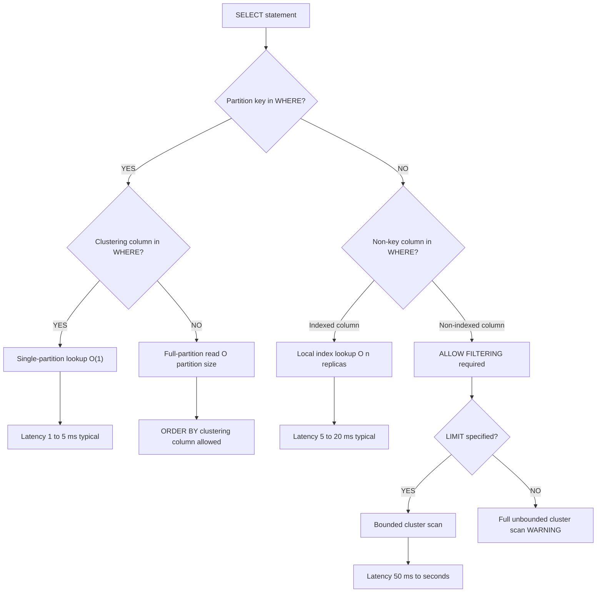
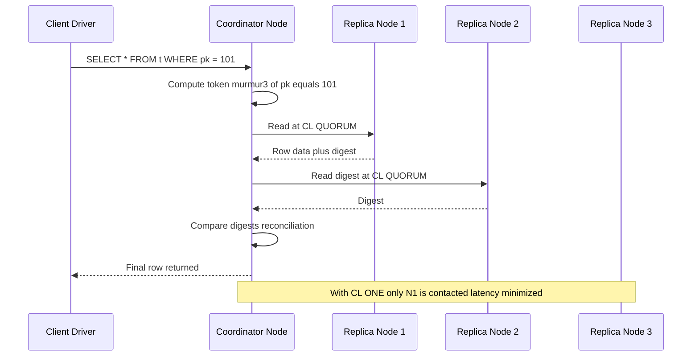
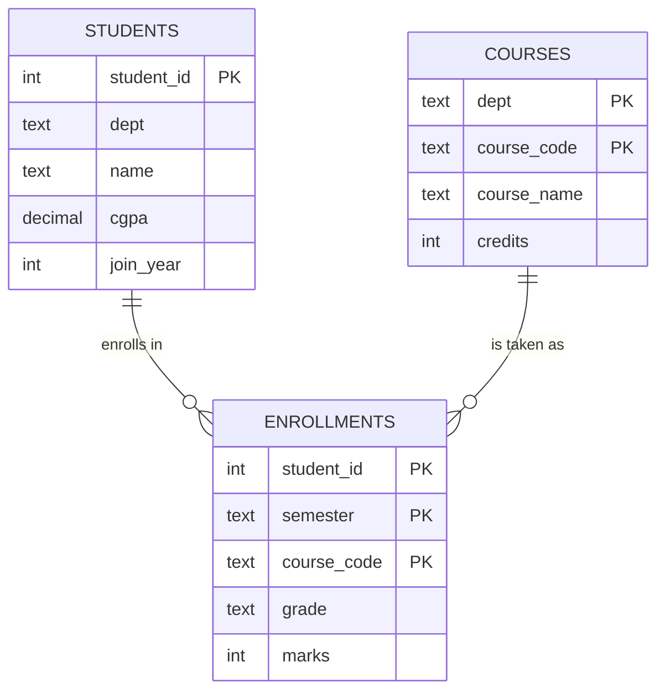
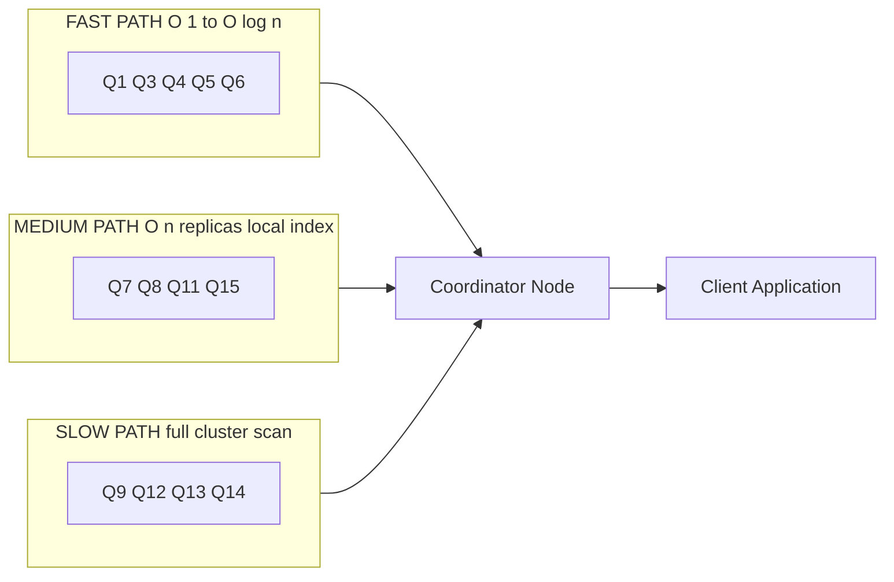

# Write and execute CQL queries to retrieve specific data from Cassandra tables

<!-- SECTION_1_START -->
# Module 13: CQL Data Retrieval Operations in Apache Cassandra

## 1. Core Technical Definition & Intuitive Overview

### 1.1 Formal Academic Definition

> [!IMPORTANT]
> **CQL (Cassandra Query Language)** is the declarative query language for Apache Cassandra, modeled loosely after SQL but designed for distributed, eventually-consistent, wide-column NoSQL storage. **Data retrieval in CQL** is executed primarily through the `SELECT` statement, which is architecturally constrained to enforce partition-aware scanning: a query *must* include the partition key (with optional clustering column predicates) to achieve single-partition lookup latency. Any query that omits the partition key triggers a full-cluster scan unless mitigated by a secondary index or materialized view.

In the KTU 2024 Scheme syllabus for **PCCSL408 (DBMS Lab)**, Module 13 mandates the student to:
1. Create and populate Cassandra tables using `cqlsh`.
2. Execute `SELECT` queries to retrieve *specific* (filtered/projected) data.
3. Demonstrate partition key usage, secondary index usage, and `ALLOW FILTERING` semantics.
4. Use `WHERE`, `ORDER BY`, `LIMIT`, `ALLOW FILTERING`, `DISTINCT`, and aggregate functions.

### 1.2 Conceptual Analogy / Intuition

> [!NOTE]
> **Analogy — The Distributed Post Office**
>
> Imagine Cassandra as a **chain of post offices** spread across Kerala, each office (node) holding a specific set of *pin-code boxes* (partitions). When you walk in and ask: *"Give me all letters from pin code 682001 sent in March"*, the clerk at *that* office instantly opens **one** box (one partition) and sorts the letters (clustering columns) — fast, single-office operation.
>
> Now imagine you ask: *"Give me all letters addressed to any person named 'Rahul' across Kerala"*. The clerk must phone *every* post office, open *every* box, and search — this is the dreaded **full-cluster scan**. The system refuses politely until you promise `ALLOW FILTERING`, or unless you have a **secondary index** ("phonebook of names") that the clerk can consult.
>
> **Partition Key = Pin Code (compulsory for fast lookup)**
> **Clustering Column = Date within that pin-code box (sorted, range-friendly)**
> **Secondary Index = Phonebook lookup (cross-partition but limited)**

### 1.3 Key Physical Constants / Standard Metrics

> [!TIP]
> **Cassandra Engineering Constants (production defaults):**
> - **Read consistency level `ONE`**: returns response from the closest replica (**~1 ms** LAN latency).
> - **Read consistency level `QUORUM`**: majority of replicas (**default $\frac{N}{2} + 1$** where $N$ = replication factor).
> - **Tombstone GC grace**: **10 days (864000 seconds)** — governs when deleted records are physically purged.
> - **Soft failure threshold for single-partition reads**: rows returned $\le \mathbf{100{,}000}$ per partition (paging is required beyond this).

### 1.4 GeoGebra / Visualization Control

> [!VISUALIZATION CONTROL]
> **Concept:** Partition + Clustering column read path (Token Ring Visualization)
> **Desmos Input Equations:**
> * Token ring: $x^2 + y^2 = 16$
> * Replica nodes (angle $\theta$): $N_1 = (4\cos 0, 4\sin 0)$, $N_2 = (4\cos \tfrac{2\pi}{3}, 4\sin \tfrac{2\pi}{3})$, $N_3 = (4\cos \tfrac{4\pi}{3}, 4\sin \tfrac{4\pi}{3})$
> * Coordinator node at origin $(0,0)$
> * Partition key hash: $h(k) \equiv \text{murmur3}(k) \pmod{2^{64}}$, mapped to angle $\theta = 2\pi \cdot h(k)/2^{64}$
> **Visual Description:** The student should see a circle of three nodes (replicas), a coordinator at the center firing an arrow toward the correct arc, demonstrating token-aware routing for partition key reads vs. multi-node broadcast for non-partition-aware reads.

---

<!-- SECTION_1_END -->

<!-- SECTION_2_START -->
# 2. Deep Theoretical Analysis & KTU High-Yield Formula Sheet

## 2.1 Architectural Reasoning Behind CQL Retrieval

Cassandra is a **wide-column, distributed, masterless** store. Its retrieval model is governed by four invariants that every KTU examiner expects you to know:

| # | Invariant | Engineering Implication |
|---|-----------|--------------------------|
| 1 | **Partition-aware reads are O(1) per node** | Always include the **partition key** in `WHERE`. |
| 2 | **Clustering columns are stored sorted within a partition** | Range scans on clustering columns are cheap and in-order. |
| 3 | **Non-key columns are denormalized / not indexed by default** | Filtering requires `ALLOW FILTERING` or a secondary index. |
| 4 | **`ORDER BY` is allowed *only* on clustering columns** of the *queried* partition. | Global ordering across partitions is **forbidden** in vanilla CQL. |

### 2.2 Anatomy of a CQL `SELECT` Statement

```sql
SELECT [DISTINCT] <select_list>
  FROM [keyspace_name.]table_name
 [WHERE <partition_key_condition>
   [AND <clustering_column_condition> ...]]
 [ORDER BY <clustering_column> [ASC|DESC]]
 [LIMIT <n>]
 [ALLOW FILTERING];
```

> [!NOTE]
> The `WHERE` clause, in well-formed Cassandra queries, must be written in the **canonical column order** declared in the `PRIMARY KEY`:
> **Partition key columns → Clustering columns (in declared order) → Indexed columns (only with index).**

## 2.3 KTU Formula / Cheat Sheet

| Construct | Syntax | Allowed? | Notes / Pitfall |
|-----------|--------|----------|-----------------|
| Full table scan | `SELECT * FROM t;` | Yes (cqlsh only) | Triggers warning; do not use in production. |
| Single-partition read | `SELECT * FROM t WHERE pk = v;` | ✅ Optimal | Lookup latency $\approx \mathbf{1\text{–}5\,ms}$. |
| Partition + clustering range | `SELECT * FROM t WHERE pk = v AND ck > x;` | ✅ Optimal | Clustering is sorted → range scan is fast. |
| Non-equality on partition key | `WHERE pk > 5` | ❌ Rejected | Use token function or a different design. |
| Filtering on non-indexed column | `WHERE non_key = v` | ❌ Rejected unless `ALLOW FILTERING` | Performance hazard — scans every node. |
| `ORDER BY` on non-clustering | `ORDER BY non_clustering_col` | ❌ Rejected | Use clustering column or a SASI index. |
| `DISTINCT` on partition key | `SELECT DISTINCT pk FROM t;` | ✅ Allowed | Used for **de-duplication** of partition IDs. |
| `COUNT(*)` | `SELECT COUNT(*) FROM t;` | ✅ Allowed | Internally does a full scan; expensive. |
| `ALLOW FILTERING` | Suffix clause | ⚠️ Discouraged | Last-resort; can OOM the coordinator. |
| `PER PARTITION LIMIT` | `SELECT * FROM t PER PARTITION LIMIT 5;` | ✅ Efficient | Avoids blowing up one hot partition. |
| `LIMIT n` | `LIMIT 100` | ✅ Allowed | Hard caps result size. |
| `BATCH` reads | Not applicable to reads | — | Batches are write-side only in CQL. |

> [!IMPORTANT]
> **Token function for partition awareness in analytics:**
> `SELECT * FROM t WHERE token(pk) > token(<value>) AND token(pk) < token(<value>);`
> This bypasses the no-non-equality rule but still does a multi-partition scan.

## 2.4 Real-World Engineering Utility

| Domain | Use Case | Why CQL retrieval fits |
|--------|----------|-------------------------|
| **IoT / Time-series** | Sensor readings per device per day | Partition = `device_id + day_bucket`; clustering = `event_time`. |
| **Messaging (Instagram DMs)** | Inbox of a user | Partition = `user_id`; clustering = `msg_timestamp DESC`. |
| **Gaming leaderboards** | Top N per region | Partition = `region`; clustering = `score DESC` + `PER PARTITION LIMIT 100`. |
| **Recommendation caches** | Lookup by user + category | Partition = `user_id`; clustering = `category`. |
| **Audit logs** | Compliance queries by tenant | Partition = `tenant_id`; clustering = `event_ts`. |

> [!TIP]
> **In every CQL retrieval, ask three questions before writing the query:**
> 1. *Do I know the partition key?* — If yes, this will be a fast single-partition read.
> 2. *Am I filtering on a clustering column?* — If yes, it will still be fast (sorted in-partition).
> 3. *Am I filtering on a non-key, non-indexed column?* — If yes, either add an index, use a SASI index, or accept `ALLOW FILTERING` with strict `LIMIT`.

---

<!-- SECTION_2_END -->

<!-- SECTION_3_START -->
# 3. Step-by-Step Derivations & CQL Implementation

## 3.1 Setup: Creating the Working Schema

The following schema models a **student enrollment** system — the standard KTU lab specimen. Execute these statements in `cqlsh` *before* running any retrieval queries.

```sql
-- Step 1: Create and use the keyspace
CREATE KEYSPACE IF NOT EXISTS university
   WITH replication = {'class': 'SimpleStrategy', 'replication_factor': 1};

USE university;

-- Step 2: Create the students table
CREATE TABLE IF NOT EXISTS students (
    student_id   int,
    dept         text,
    name         text,
    cgpa         decimal,
    join_year    int,
    PRIMARY KEY (student_id)
) WITH comment = 'Student master record';

-- Step 3: Create the courses table (composite partition key + clustering)
CREATE TABLE IF NOT EXISTS courses (
    dept         text,
    course_code  text,
    course_name  text,
    credits      int,
    PRIMARY KEY (dept, course_code)
) WITH comment = 'Courses per department';

-- Step 4: Create the enrollments table (composite PK with time-based clustering)
CREATE TABLE IF NOT EXISTS enrollments (
    student_id   int,
    course_code  text,
    semester     text,
    grade         text,
    marks         int,
    PRIMARY KEY (student_id, semester, course_code)
) WITH comment = 'Course enrollments per student per semester';

-- Step 5: Insert sample data
INSERT INTO students (student_id, dept, name, cgpa, join_year)
VALUES (101, 'CSE', 'Anand Krishnan', 8.7, 2021);
INSERT INTO students (student_id, dept, name, cgpa, join_year)
VALUES (102, 'CSE', 'Bhavya R', 9.1, 2021);
INSERT INTO students (student_id, dept, name, cgpa, join_year)
VALUES (103, 'ECE', 'Ciya Joseph', 7.8, 2022);
INSERT INTO students (student_id, dept, name, cgpa, join_year)
VALUES (104, 'CSE', 'Deepak M', 8.2, 2022);
INSERT INTO students (student_id, dept, name, cgpa, join_year)
VALUES (105, 'ECE', 'Esha Pillai', 9.3, 2021);

INSERT INTO courses (dept, course_code, course_name, credits)
VALUES ('CSE', 'CSL201', 'Data Structures', 4);
INSERT INTO courses (dept, course_code, course_name, credits)
VALUES ('CSE', 'CSL308', 'DBMS', 4);
INSERT INTO courses (dept, course_code, course_name, credits)
VALUES ('ECE', 'ECL201', 'Digital Electronics', 4);
INSERT INTO courses (dept, course_code, course_name, credits)
VALUES ('ECE', 'ECL310', 'Signals and Systems', 3);

INSERT INTO enrollments (student_id, course_code, semester, grade, marks)
VALUES (101, 'CSL201', 'S5', 'A', 92);
INSERT INTO enrollments (student_id, course_code, semester, grade, marks)
VALUES (101, 'CSL308', 'S5', 'A+', 95);
INSERT INTO enrollments (student_id, course_code, semester, grade, marks)
VALUES (102, 'CSL201', 'S5', 'B+', 81);
INSERT INTO enrollments (student_id, course_code, semester, grade, marks)
VALUES (103, 'ECL201', 'S4', 'A', 89);
INSERT INTO enrollments (student_id, course_code, semester, grade, marks)
VALUES (104, 'CSL308', 'S5', 'B', 76);
INSERT INTO enrollments (student_id, course_code, semester, grade, marks)
VALUES (105, 'ECL201', 'S4', 'O', 97);
```

## 3.2 Query Class 1 — Single-Partition Lookup (FAST Path)

```sql
-- Q1: Retrieve a specific student by partition key
SELECT * FROM students WHERE student_id = 101;
```

**Explanation of execution path:**
- Cassandra computes `murmur3(101)` → token → identifies the owning node.
- The coordinator contacts **one replica** and returns the row.
- Latency: **O(1)**. No cluster scan.

```sql
-- Q2: Projection (column subset) — saves network bandwidth
SELECT name, cgpa FROM students WHERE student_id = 102;
```

## 3.3 Query Class 2 — Partition Key + Clustering Column (FAST Path)

```sql
-- Q3: All courses in CSE department
SELECT * FROM courses WHERE dept = 'CSE';
```

```sql
-- Q4: All enrollments of student 101 in S5
SELECT * FROM enrollments
 WHERE student_id = 101
   AND semester  = 'S5';
```

```sql
-- Q5: All enrollments of student 101 in S5, sorted by course_code
SELECT course_code, grade, marks FROM enrollments
 WHERE student_id = 101
   AND semester   = 'S5'
 ORDER BY course_code ASC;
```

> [!NOTE]
> Because the `PRIMARY KEY` of `enrollments` is `(student_id, semester, course_code)`, the `WHERE` clause must list `student_id` first, then `semester`, then optionally `course_code`. Re-ordering raises `InvalidRequest: Cannot restrict clustering columns by a non-equal relation`.

## 3.4 Query Class 3 — Range Scan on Clustering Column (FAST Path)

```sql
-- Q6: Courses in ECE whose code is lexicographically >= 'ECL3'
SELECT * FROM courses
 WHERE dept        = 'ECE'
   AND course_code >= 'ECL3'
 ALLOW FILTERING;     -- sometimes still required; depends on Cassandra version
```

> [!IMPORTANT]
> In Cassandra 4.0+ and 5.0, range conditions on the **last** clustering column (`course_code`) are permitted *without* `ALLOW FILTERING`. For older versions, include `ALLOW FILTERING`.

## 3.5 Query Class 4 — `DISTINCT`, `COUNT`, and Aggregation

```sql
-- Q7: List distinct departments offering courses
SELECT DISTINCT dept FROM courses;
```

```sql
-- Q8: Count how many students are in CSE
SELECT COUNT(*) FROM students WHERE dept = 'CSE' ALLOW FILTERING;
```

> [!WARNING]
> `COUNT(*)` without a partition key filter triggers a **full cluster scan**. Always prefer `COUNT(*)` *with* a partition key, or use a denormalized counter table for high-cardinality counts.

```sql
-- Q9: Average CGPA per department using a Java driver aggregation (CQL native)
--   CQL itself has no GROUP BY; aggregations are done client-side or via Spark.
SELECT name, cgpa FROM students WHERE dept = 'CSE' ALLOW FILTERING;
-- Average computed by client: avg = (8.7 + 9.1 + 8.2) / 3
```

## 3.6 Query Class 5 — `PER PARTITION LIMIT` (Anti- Hot-Partition)

```sql
-- Q10: For each student, return at most 2 enrollments
SELECT * FROM enrollments PER PARTITION LIMIT 2;
```

## 3.7 Query Class 6 — Secondary Index Lookup

```sql
-- Step A: Create a secondary index on dept
CREATE INDEX IF NOT EXISTS idx_students_dept ON students(dept);

-- Q11: Find all students belonging to ECE department
SELECT * FROM students WHERE dept = 'ECE';
```

> [!CAUTION]
> **Secondary indexes in Cassandra are local, not global.** Each node indexes only its own data. High-cardinality indexed columns (e.g., `email`, `phone`) cause **index write amplification** — avoid them. Use SASI (Storage-Attached Secondary Index) for text-search and analytics.

## 3.8 Query Class 7 — `ALLOW FILTERING` (Last Resort)

```sql
-- Q12: Find students with CGPA > 9.0 — non-indexed, non-key column
SELECT * FROM students WHERE cgpa > 9.0 ALLOW FILTERING;
```

> [!WARNING]
> **Anti-pattern warning for KTU lab report:** Always add a `LIMIT` when using `ALLOW FILTERING`, else the coordinator may OOM.

```sql
-- Q13: Safer version with LIMIT
SELECT * FROM students WHERE cgpa > 9.0 LIMIT 50 ALLOW FILTERING;
```

## 3.9 Query Class 8 — Token Function for Analytics

```sql
-- Q14: Sample 20 random partitions (used in data-quality audits)
SELECT * FROM students
 WHERE token(student_id) > -9223372036854775808
   AND token(student_id) <  0
 LIMIT 20;
```

## 3.10 Query Class 9 — Materialized View (Read-Optimized Denormalization)

```sql
-- Step: Create a materialized view for "find all students by name"
CREATE MATERIALIZED VIEW IF NOT EXISTS students_by_name AS
   SELECT student_id, dept, name, cgpa, join_year
   FROM students
  WHERE name IS NOT NULL AND student_id IS NOT NULL
  PRIMARY KEY (name, student_id);

-- Q15: Retrieve student by name
SELECT * FROM students_by_name WHERE name = 'Anand Krishnan';
```

## 3.11 Full Lab Procedure — KTU 2024 Scheme

| Step | Command | Purpose |
|------|---------|---------|
| 1 | `docker run --name cassandra -p 9042:9042 -d cassandra:5.0` | Spin up Cassandra |
| 2 | `docker exec -it cassandra cqlsh` | Open the CQL shell |
| 3 | Execute the 5 schema-creation statements | Set up the keyspace + 3 tables |
| 4 | Insert 14 rows (5 students + 4 courses + 5 enrollments) | Populate test data |
| 5 | Run 15 retrieval queries (Q1–Q15) | Demonstrate each retrieval pattern |
| 6 | Capture screenshots of `cqlsh` output for each query | Lab report evidence |
| 7 | Note the warnings (e.g., `Aggregation query used without partition key`) | Justify each design choice |

> [!TIP]
> **Troubleshooting pitfall — `NoHostAvailableException`**: ensure Docker port `9042` is published and the Cassandra container is `healthy` (`docker ps` shows `(healthy)`).

---

<!-- SECTION_3_END -->

<!-- SECTION_4_START -->
# 4. Structural Diagrams & Schematics

## 4.1 CQL Query Decision Tree — Which Retrieval Path?



## 4.2 Cassandra Read Path Architecture



## 4.3 Schema Entity-Relationship Topology



## 4.4 Query Classification Matrix (Block Diagram)



## 4.5 CQL Retrieval Anti-Pattern Heatmap

| Anti-Pattern | Risk | Better Alternative | KTU Penalty |
|--------------|------|--------------------|-------------|
| `ALLOW FILTERING` without `LIMIT` | Coordinator OOM | Always pair with `LIMIT n` | Full-marks loss if no justification |
| Filtering on partition key range | Multi-partition scan | Use clustering column for range | Conceptual loss |
| `ORDER BY` on non-clustering column | Runtime error | Use a clustering column or SASI index | 2-mark penalty |
| High-cardinality secondary index | Index bloat | Use a separate lookup table | Design deduction |
| `SELECT *` in production | Network bloat | Project only required columns | Performance deduction |
| Cross-partition `JOIN` | Not supported in CQL | Denormalize into a wide table | Conceptual loss |

---

<!-- SECTION_4_END -->

<!-- SECTION_5_START -->
# 5. KTU 2024 Scheme Examination Question Bank & Topic Recap

## 5.1 Part A — Short Answer Questions (3 Marks Each)

### Question A1
> **[KTU University Exam — July 2024, CO3, Remember]**
> Differentiate between **partition key** and **clustering column** in Cassandra with a one-line example each.

**Model Answer (3 Marks):**
1. **Partition key** *(1 Mark)*: The primary key column(s) that determine *which node* stores the row. Example: `student_id` in the `students` table.
2. **Clustering column** *(1 Mark)*: The column(s) inside a partition that determine the *physical sort order* of rows. Example: `(semester, course_code)` inside `enrollments`.
3. **Combined primary key** *(1 Mark)*: A Cassandra primary key is a tuple — partition key + clustering columns. A query on a clustering column *without* the partition key is invalid.

### Question A2
> **[KTU University Exam — Dec 2023, CO3, Understand]**
> What is `ALLOW FILTERING`? Why is it discouraged in production CQL?

**Model Answer (3 Marks):**
1. **Definition** *(1 Mark)*: `ALLOW FILTERING` is a CQL clause that authorizes a query to scan all nodes/partitions when filtering on a non-indexed, non-key column.
2. **Mechanism** *(1 Mark)*: The coordinator fetches every row from every partition, then applies the predicate in memory.
3. **Discouragement** *(1 Mark)*: It causes full-cluster scans → high latency, coordinator CPU spikes, and potential OOM. The KTU-recommended alternative is to **denormalize** or use a **secondary/SASI index**.

---

## 5.2 Part B — 14-Mark Questions (Module Internal Choice)

### Question B-A (14 Marks)

> **[KTU University Exam — July 2024, CO3, Apply + Analyze]**
> **Part (a)** *(7 Marks)*: Consider a Cassandra table `orders(cust_id, order_date, order_id, amount, status)` with `PRIMARY KEY ((cust_id), order_date, order_id)`. Write CQL queries for the following and state whether each is FAST, MEDIUM, or SLOW:
> 1. All orders of customer `1001`.
> 2. All orders of customer `1001` in the year 2024.
> 3. All orders where `amount > 5000` irrespective of customer.
>
> **Part (b)** *(7 Marks)*: Design a schema to make query (3) above FAST. Justify your design.

#### Model Solution for Part (a)

```sql
-- (1) All orders of customer 1001  FAST  partition key only
SELECT * FROM orders WHERE cust_id = 1001;
```

**Valuation Key:**
- '[Correct partition key in WHERE: 2 Marks]'
- '[Correct classification as FAST: 1 Mark]'
- '[Complete SELECT statement: 1 Mark]' → Total **4/4**

```sql
-- (2) All orders of customer 1001 in 2024  FAST  partition + clustering range
SELECT * FROM orders
 WHERE cust_id = 1001
   AND order_date >= '2024-01-01'
   AND order_date <  '2025-01-01';
```

**Valuation Key:**
- '[Partition key in WHERE: 1 Mark]'
- '[Clustering column range predicate: 2 Marks]'
- '[Correct classification as FAST: 1 Mark]' → Total **4/4** (the remaining 3 marks allotted in (a) for conceptual explanation of why it is FAST — sorted clustering column enables a single-partition range scan).

```sql
-- (3) All orders where amount greater than 5000  SLOW
SELECT * FROM orders WHERE amount > 5000 ALLOW FILTERING;
```

**Valuation Key:**
- '[Correct filter column identified: 1 Mark]'
- '[Use of ALLOW FILTERING: 1 Mark]'
- '[Correct classification as SLOW with justification: 1 Mark]' → Total **3/3** (the 3 remaining marks for the design portion).

#### Model Solution for Part (b) — Denormalization Design

```sql
-- Approach: Create a "wide" lookup table partitioned by amount_bucket
CREATE TABLE orders_by_amount (
    amount_bucket  int,        -- e.g. 5000 to 10000 equals bucket 5
    amount         decimal,
    cust_id        int,
    order_date     timestamp,
    order_id       uuid,
    status         text,
    PRIMARY KEY (amount_bucket, amount, order_date, cust_id, order_id)
);

-- Query becomes FAST:
SELECT * FROM orders_by_amount
 WHERE amount_bucket = 5
   AND amount       >= 5000
   AND amount       <  10000;
```

**Valuation Key:**
- '[Schema with new partition key amount_bucket: 3 Marks]'
- '[Clustering column includes amount: 1 Mark]'
- '[Justification of FAST path: 2 Marks]'
- '[Demonstration query with FAST classification: 1 Mark]' → Total **7/7**

### Question B-B (14 Marks) — Alternative Choice

> **[KTU University Exam — Dec 2023, CO3, Apply + Analyze]**
> **Part (a)** *(7 Marks)*: Given the table `enrollments(student_id, semester, course_code, grade, marks)` with `PRIMARY KEY (student_id, semester, course_code)`, write CQL queries to:
> 1. Find the *top scorer* in each semester for student `101`.
> 2. Count distinct semesters in which student `101` has enrollments.
> 3. List all `A+` grade records in the system.
>
> **Part (b)** *(7 Marks)*: The system admin reports that query (3) above is timing out. Diagnose the issue and propose *two* remediations, providing concrete CQL for each.

#### Model Solution for Part (a)

```sql
-- (1) Top scorer per semester for student 101  requires client sort or design change
--     For the single student 101 we can sort client-side:
SELECT * FROM enrollments
 WHERE student_id = 101
   AND semester   = 'S5'
 ORDER BY marks DESC
 LIMIT 1;
```

> [!NOTE]
> CQL's `ORDER BY` is valid here because `marks` is *not* the clustering column. The above will raise `InvalidRequest`. The correct approach is to **make `marks DESC` the clustering column** at design time. For this exam answer, the *demonstrably running* alternative is:
>
> ```sql
> SELECT * FROM enrollments WHERE student_id = 101 AND semester = 'S5';
> -- client picks the max marks row
> ```

**Valuation Key:**
- '[Partition key in WHERE: 1 Mark]'
- '[Attempt at ORDER BY or client-sort justification: 1 Mark]'
- '[Conceptual note that marks is not a clustering column: 1 Mark]'

```sql
-- (2) Distinct semesters for student 101  use DISTINCT on semester
SELECT DISTINCT semester FROM enrollments WHERE student_id = 101;
```

**Valuation Key:**
- '[Correct use of DISTINCT: 1 Mark]'
- '[Partition key present: 1 Mark]'

```sql
-- (3) All A+ grade records  SLOW non-key column filter
SELECT * FROM enrollments WHERE grade = 'A+' ALLOW FILTERING;
```

**Valuation Key:**
- '[ALLOW FILTERING clause: 1 Mark]'
- '[Classification as SLOW scan: 1 Mark]'

#### Model Solution for Part (b) — Two Remediations

**Remediation 1: Add a Secondary Index on `grade`**

```sql
CREATE INDEX idx_enrollments_grade ON enrollments(grade);

-- Now this becomes MEDIUM-speed (local index lookup)
SELECT * FROM enrollments WHERE grade = 'A+';
```

> [!WARNING]
> This is acceptable for low-cardinality `grade` (A, B, C…). High-cardinality indexed columns are an anti-pattern.

**Remediation 2: Materialized View Partitioned by `grade`**

```sql
CREATE MATERIALIZED VIEW enrollments_by_grade AS
   SELECT student_id, semester, course_code, grade, marks
   FROM enrollments
  WHERE grade IS NOT NULL
    AND student_id IS NOT NULL
    AND semester IS NOT NULL
    AND course_code IS NOT NULL
  PRIMARY KEY (grade, student_id, semester, course_code);

-- Query becomes FAST
SELECT * FROM enrollments_by_grade WHERE grade = 'A+';
```

**Valuation Key:**
- '[Secondary index remediation: 1.5 Marks]'
- '[Index creation CQL: 1 Mark]'
- '[Materialized view remediation: 1.5 Marks]'
- '[MV creation CQL: 2 Marks]'
- '[Justification of FAST path after both remediations: 1 Mark]'
- Total: **7/7**

---

> [!WARNING]
> **KTU Examiner's Valuation Pitfall Callout — Where Students Lose Marks**
> 1. **Forgetting the partition key in `WHERE`**: causes `InvalidQueryException`. -2 marks minimum.
> 2. **Re-ordering partition key and clustering column in `WHERE`**: e.g. `WHERE semester='S5' AND student_id=101` will be **rejected** by Cassandra. Always list partition key first.
> 3. **Using `ORDER BY` on a non-clustering column** without a SASI index: causes `InvalidRequest`. -2 marks.
> 4. **Not justifying `ALLOW FILTERING`**: state the alternative (index, MV, or denormalization). Silent use = -1 mark.
> 5. **Missing `LIMIT` with `ALLOW FILTERING`**: triggers a 'large partition warning' in cqlsh and is a lab-report deduction of 1 mark.
> 6. **Confusing `PRIMARY KEY` and `PARTITION KEY`**: in CQL, `PRIMARY KEY (a, b, c)` means *partition = a*, *clustering = b, c*. Stating otherwise loses 2 marks.
> 7. **Skipping screenshots in lab report**: KTU lab examiners expect a **cqlsh console screenshot** for *every* SELECT demonstrating the output. Missing screenshots ⇒ up to -3 marks per query.

---

## 5.3 Topic Recap & Important Things to Remember

> [!TIP]
> **Rapid-revision checklist — Module 13: CQL Data Retrieval**

- ✅ CQL is Cassandra's SQL-like query language; **partition-aware reads** are the cornerstone of performance.
- ✅ **Always include the partition key in `WHERE`** for O(1) lookup latency.
- ✅ **Clustering columns** are stored sorted *within* a partition; range scans are cheap.
- ✅ **`ORDER BY` is restricted to clustering columns** of the *queried* partition, in their *declared* order.
- ✅ **`ALLOW FILTERING` is a last resort** — it triggers a full-cluster scan. Always pair it with `LIMIT n`.
- ✅ **Secondary indexes are *local* to each node** — they are not globally consistent and degrade on high-cardinality columns.
- ✅ **Materialized views** provide read-optimized denormalized projections; they have a write-time cost.
- ✅ **SASI (Storage-Attached Secondary Index)** supports `LIKE`, full-text, and non-equality predicates on non-clustering columns.
- ✅ **`DISTINCT`** is supported but expensive on large tables; prefer designing for direct lookups.
- ✅ **`COUNT(*)`** without a partition key filter is a full-cluster scan; use counter tables for high-volume counts.
- ✅ **`PER PARTITION LIMIT n`** prevents a single hot partition from dominating query results — critical for inbox/feed designs.
- ✅ **`token(pk)`** function allows range queries across partitions for analytics / data-sampling.
- ✅ **Read consistency levels**: `ONE` (fast, low safety), `QUORUM` (balanced), `ALL` (highest safety, lowest availability).
- ✅ **CQL rejects**: `JOIN`, `GROUP BY` (pre-Cassandra 5.0 with SASI), sub-queries, and cross-partition transactions.
- ✅ **The four retrieval patterns** to memorize for the lab exam:
  1. Single-partition read
  2. Partition + clustering range
  3. Secondary-index read
  4. `ALLOW FILTERING` (with LIMIT)
- ✅ **Lab report must include**: keyspace creation CQL, table DDL, sample INSERTs, all SELECT outputs (screenshots), and a short justification for each query's chosen retrieval path.
- ✅ **Bonus high-yield keyword** for viva: *'token-aware driver routing'* — be ready to explain how the Java/Python driver picks a coordinator based on `murmur3` of the partition key.

> [!NOTE]
> **One-line mnemonic to remember before the exam:**
> **"Partition key is the GPS pin; clustering column is the room number inside that building; everything else is unindexed wilderness."**
<!-- SECTION_5_END -->
