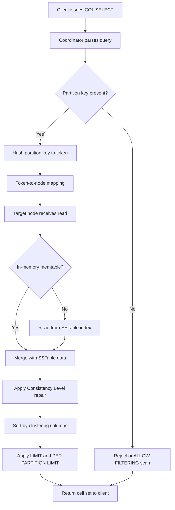
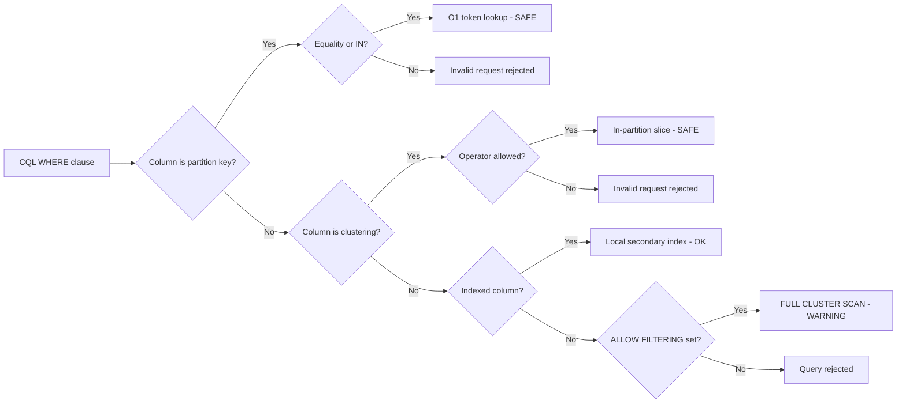
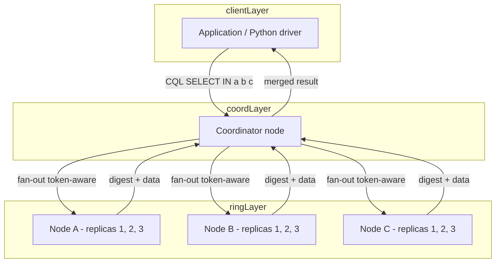
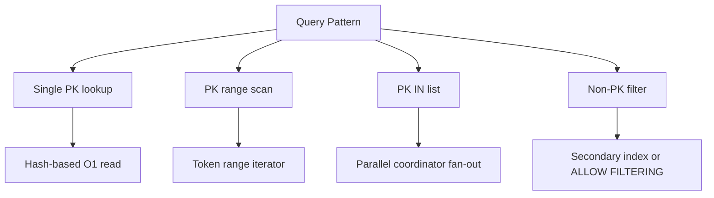

# Write CQL queries to retrieve specific data from Cassandra tables

<!-- SECTION_1_START -->
# CQL SELECT: Retrieving Specific Data from Cassandra Tables

## 1.1 Formal Academic Definition (KTU 2024 Aligned)

**CQL (Cassandra Query Language)** is the declarative query language for Apache Cassandra, modeled loosely on SQL but architecturally bound to Cassandra's **wide-column, distributed, partition-tolerant** storage model. The `SELECT` statement is the **DQL (Data Query Language)** construct used to retrieve rows (called *cell sets*) from one or more tables (called *column families*).

> [!IMPORTANT]
> **KTU Syllabus Highlight (PCCSL408 / Module 13):**
> A `SELECT` query in Cassandra is *NOT* a full table scan by default. It is a **partition-pruned** read operation that resolves into a single-node, multi-node, or token-range read depending on the **partition key** supplied in the `WHERE` clause. Failure to include the full partition key forces Cassandra to either reject the query or, optionally with `ALLOW FILTERING`, scan across nodes — a recognized anti-pattern at production scale.

The formal BNF-style skeleton of a CQL retrieval statement is:

$$
\text{SELECT} \; [\text{JSON} \;] \; \text{selectClause} \; \text{FROM} \; \text{tableName} \; [\text{WHERE} \; \text{relationAndChain}] \; [\text{ORDER BY} \; \text{columns}] \; [\text{PER PARTITION LIMIT} \; n] \; [\text{LIMIT} \; n] \; [\text{ALLOW FILTERING}]
$$

## 1.2 Intuitive Analogy — "The Post Office Letterbox Model"

Imagine a **post office** with thousands of locked letterboxes:

- Each **letterbox number** = **Partition Key** (a unique address of a node).
- Inside every letterbox, letters are **stacked in strict chronological order** = **Clustering Columns** (physically sorted on disk).
- When you want your letter, you **must know the letterbox number** (partition key). The postmaster will *not* rummage through every letterbox in the city — that would be the equivalent of a full-cluster scan.
- If you ask, *"Give me all letters from letterbox 12 received in March"*, the postmaster reaches into **one** box and pulls only the March stack — this is the magic of a **partition-restricted, clustering-range read**.

> [!NOTE]
> **Real-world engineering analogy:** This is exactly how production systems at **Netflix, Instagram, and Apple iCloud** retrieve user-timeline data. The `user_id` is hashed into a partition token, the user's mailbox (node) is contacted directly, and a sorted slice of their timeline (clustering range) is returned in **O(log n)** on-disk seeks — typically under **10 ms** for 99% of reads.

## 1.3 Standard Metrics & Reserved Constants

| Metric / Constant | Definition | Engineering Relevance |
|---|---|---|
| `writetime(column)` | Returns the **64-bit timestamp (µs)** of the last write | Conflict resolution, audit logging |
| `ttl(column)` | Returns seconds remaining before column expires | GDPR / session storage |
| `dateof()`, `now()` | Current time / UUID generators | Default-value injection |
| `ALLOW FILTERING` | Opt-in flag permitting non-key predicates | Anti-pattern; never use in hot paths |
| `PER PARTITION LIMIT` | Caps rows **per partition**, not globally | Time-series dashboards |

> [!VISUALIZATION CONTROL]
> **Concept:** Partition key distribution across a Cassandra ring (Token Ring Visualization).
> **GeoGebra / Desmos Input Equations (Conceptual):**
> * Nodes on a unit circle: `(cos θ, sin θ)` for θ ∈ {0°, 60°, 120°, 180°, 240°, 300°}
> * Token range: `[0, 2^64-1]` partitioned into 6 equal segments of `~3.07 × 10^{18}`
> **Visual Description:** Six nodes arranged on a circle, each owning a contiguous arc of the token ring. A `SELECT ... WHERE partition_key = X` request routes to exactly **one** arc (one node). A `SELECT` without partition key fans out to **all six** — illustrating the cost of `ALLOW FILTERING`.

<!-- SECTION_1_END -->

<!-- SECTION_2_START -->
# Deep Theoretical Analysis & KTU High-Yield Formula Sheet

## 2.1 The Six Logical Components of a CQL SELECT

A retrieval query in Cassandra is decomposed by the **query coordinator** into six logical decision stages. Mastering these is the difference between a 3-mark answer and a full 14-mark KTU answer.

### Stage 1 — Column Projection (`selectClause`)
Determines which columns are returned. Default is `*` (all columns). You can use **scalar functions** (`dateOf()`, `ttl()`, `writetime()`), **cast operators** (`CAST (col AS <type>)`), and **arithmetic expressions** (`col1 + col2`).

### Stage 2 — Target Table Identification (`FROM`)
Strictly **one table** per query. CQL does **not** support cross-table joins. Denormalization is the design-time solution.

### Stage 3 — Row Filtering (`WHERE`)
This is the **performance critical** stage. Cassandra evaluates predicates in the following strict order of preference:

$$
\text{Cost} \;\propto\; \text{Token Fan-out} = \frac{\text{Total Tokens}}{\text{Matched Partitions}}
$$

1. **Partition key** equality (token lookup, O(1) — best).
2. **Clustering column** range / inequality (in-partition slice, O(log n) — excellent).
3. **Indexed column** equality (secondary index, O(log n) per replica — acceptable).
4. **Non-indexed column** predicate (requires `ALLOW FILTERING` — **dangerous**).

### Stage 4 — Result Ordering (`ORDER BY`)
Allowed **only on clustering columns** in the order they were defined in the schema. Reverse order requires the `WITH CLUSTERING ORDER BY (col DESC)` schema definition. Sorting is **already implicit** because clustering columns are stored sorted on disk — no in-memory sort cost.

### Stage 5 — Pagination (`LIMIT` and `PER PARTITION LIMIT`)
- `LIMIT n` — global cap on total rows returned across all partitions.
- `PER PARTITION LIMIT k` — cap on rows **per partition** before merging. Vital for **time-series** workloads (e.g., last 5 events per user).

### Stage 6 — Safety Bypass (`ALLOW FILTERING`)
An explicit opt-in that warns the developer: *"You are about to perform a cluster-wide read — confirm you understand the latency/throughput cost."*

## 2.2 KTU High-Yield Formula Sheet

| Construct | Syntax Pattern | Tokens Touched | KTU Use Case |
|---|---|---|---|
| Single-partition read | `WHERE partition_key = ?` | 1 | User profile lookup |
| Multi-partition read | `WHERE partition_key IN (a, b, c)` | n | Batch dashboard fetch |
| Range scan (clustering) | `WHERE pk = ? AND cluster_col > t1 AND cluster_col < t2` | 1 | Time-series window |
| Slice scan (clustering) | `WHERE pk = ? AND cluster_col IN (x, y, z)` | 1 | Tag-based timeline |
| Aggregation | `SELECT COUNT(*), AVG(score) ...` | 1+ | Per-partition metrics |
| Secondary index | `WHERE indexed_col = ?` | Variable | Email-to-userId lookup |
| System metadata | `SELECT * FROM system.local` | 0 (local node) | Health checks |
| Function projection | `SELECT writetime(col), ttl(col)` | depends | Audit & expiry |

> [!IMPORTANT]
> **Operator Restriction Table (KTU frequently tested):**
> Allowed operators in `WHERE` on the **partition key** = `{= , IN , CONTAINS (for frozen collections)}`
> Allowed operators in `WHERE` on **clustering columns** = `{= , < , > , <= , >= , IN , CONTAINS , CONTAINS KEY}`
> Allowed operators in `WHERE` on **regular columns** = `{= , CONTAINS , CONTAINS KEY}` *(everything else requires `ALLOW FILTERING`)*

## 2.3 Real-World Engineering Utility

CQL `SELECT` is the **read-path backbone** of every Cassandra deployment. Concrete production scenarios:

1. **Messaging platforms (Discord, Slack):** `SELECT * FROM messages WHERE channel_id = ? AND msg_id > last_seen LIMIT 50` — the canonical chat scroll query.
2. **IoT sensor telemetry:** `PER PARTITION LIMIT 1` to fetch the **latest reading per device** from millions of partitions.
3. **Recommendation engines:** Materialized views + secondary indexes to look up *"all users who liked genre X"* without a full scan.
4. **Time-series financial trading:** `writetime(price)` exposed to clients for **microsecond-precision** trade audit trails.

> [!NOTE]
> **Engineering Metric:** A well-partitioned single-partition read in Cassandra typically completes in **P99 < 10 ms** at 1 KB payload. A query with `ALLOW FILTERING` on a 100 GB table routinely exceeds **30 seconds** and will trigger coordinator-side timeouts.

<!-- SECTION_2_END -->

<!-- SECTION_3_START -->
# Step-by-Step Derivations & Symbolic CQL Implementation

## 3.1 Lab Schema Setup (Pre-execution)

We first establish a **sensor telemetry** schema used throughout the derivations. Each row represents a sensor reading, partitioned by `sensor_id` and clustered by `reading_time` (descending — newest first).

```sql
-- Keyspace creation
CREATE KEYSPACE IF NOT EXISTS iot_lab
WITH replication = {
  'class': 'NetworkTopologyStrategy',
  'datacenter1': 3
};

USE iot_lab;

-- Table with composite partition + clustering key
CREATE TABLE IF NOT EXISTS sensor_readings (
  sensor_id      text,
  reading_time   timestamp,
  temperature    double,
  humidity       double,
  status         text,
  tags           set<text>,
  PRIMARY KEY (sensor_id, reading_time)
) WITH CLUSTERING ORDER BY (reading_time DESC);
```

> [!NOTE]
> **Schema Decision Rationale:** `sensor_id` is the partition key (cardinality ≈ thousands of devices — good distribution). `reading_time` is the clustering column (millions of readings per sensor, perfectly suited to time-window queries).

## 3.2 Step-by-Step Implementation of 12 KTU High-Yield Queries

### Query 1 — Full Single-Partition Retrieval (Basic SELECT *)

**Problem:** Retrieve all readings of sensor `S-101`.

**CQL:**
```sql
SELECT * FROM sensor_readings WHERE sensor_id = 'S-101';
```

**Step-by-step reasoning:**
1. Coordinator hashes `'S-101'` → computes the **Murmur3 partition token**.
2. Token is mapped to the owning node via the consistent hash ring.
3. Node returns **all rows** from that single partition, sorted by `reading_time DESC` (already on disk).
4. **Result set cardinality** = number of rows in partition `S-101`.

### Query 2 — Time-Window Range Scan (Clustering Range)

**Problem:** Fetch readings of sensor `S-101` between 09:00 and 12:00 on 2024-08-15.

**CQL:**
```sql
SELECT reading_time, temperature, humidity
FROM sensor_readings
WHERE sensor_id = 'S-101'
  AND reading_time >= '2024-08-15 09:00:00'
  AND reading_time <  '2024-08-15 12:00:00';
```

**Reasoning chain:**
- Step 1: Single-partition lookup on `S-101` (token pinned to one node).
- Step 2: Within the on-disk **sorted SSTable**, perform a binary search for the lower bound `09:00:00`.
- Step 3: Stream forward through the index until upper bound `12:00:00` is exceeded.
- Step 4: Return cells — operation is **O(log n + k)** where `k` is the number of rows in the window.

### Query 3 — Top-N with `LIMIT` (Time-Series Dashboard)

**Problem:** Show the 5 most recent readings of sensor `S-101`.

**CQL:**
```sql
SELECT * FROM sensor_readings
WHERE sensor_id = 'S-101'
LIMIT 5;
```

**Reasoning:** Because `reading_time` is clustered `DESC`, the first 5 cells in the partition *are* the latest 5. No sort, no aggregation — pure **on-disk seek + read**.

### Query 4 — `PER PARTITION LIMIT` (Multi-Sensor Latest Reading)

**Problem:** For sensors `S-101, S-102, S-103`, return only the **most recent** reading per sensor.

**CQL:**
```sql
SELECT * FROM sensor_readings
WHERE sensor_id IN ('S-101', 'S-102', 'S-103')
PER PARTITION LIMIT 1;
```

**Valuation key (KTU pattern):**
- 1 mark — Correct `IN` clause on partition key.
- 1 mark — `PER PARTITION LIMIT 1` (not `LIMIT 1`, which is *global* and would return only 1 row total).
- 1 mark — Justification that clustering column is `DESC`.

### Query 5 — Aggregation: `COUNT, AVG, MIN, MAX`

**Problem:** Find the count, average, minimum, and maximum temperature of sensor `S-101` in August 2024.

**CQL:**
```sql
SELECT COUNT(*)        AS reading_count,
       AVG(temperature) AS avg_temp,
       MIN(temperature) AS min_temp,
       MAX(temperature) AS max_temp
FROM sensor_readings
WHERE sensor_id = 'S-101'
  AND reading_time >= '2024-08-01'
  AND reading_time <  '2024-09-01';
```

**Reasoning:** CQL aggregation operates **per partition in memory** then ships a single row. Cannot be used in conjunction with `ALLOW FILTERING` in older versions; in modern Cassandra (≥ 3.0) it is permitted.

### Query 6 — Filtering on a Regular Column (Anti-Pattern Warning)

**Problem:** Find all readings where `status = 'CRITICAL'`.

**Attempt (will be rejected):**
```sql
SELECT * FROM sensor_readings WHERE status = 'CRITICAL';
```

**Error message:**
```
InvalidRequest: Error from server: code=2200 [Invalid query]
message="Cannot execute this query as it might involve data filtering
and thus may have unpredictable performance. If you want to execute
this query despite the performance unpredictability, use ALLOW FILTERING."
```

**Corrected (with caveat):**
```sql
SELECT * FROM sensor_readings WHERE status = 'CRITICAL' ALLOW FILTERING;
```

> [!WARNING]
> `ALLOW FILTERING` triggers a full-cluster read. The KTU examiner expects you to **explain why** this is rejected, not just blindly add the flag.

### Query 7 — Secondary Index on a Regular Column

**Problem:** Make the `status` column queryable **without** `ALLOW FILTERING`.

**DDL first:**
```sql
CREATE INDEX IF NOT EXISTS idx_status
ON sensor_readings (status);
```

**DQL after index creation:**
```sql
SELECT sensor_id, reading_time, temperature
FROM sensor_readings
WHERE status = 'CRITICAL'
LIMIT 100;
```

**Reasoning:** The coordinator performs a **local index lookup** on each replica node, then merges results. Latency is higher than partition-key reads but acceptable for low-cardinality columns.

### Query 8 — `writetime()` and `ttl()` System Functions

**Problem:** Audit when the last temperature reading for `S-101` was written and how long it has left to live.

**CQL:**
```sql
SELECT reading_time,
       writetime(temperature) AS last_write_us,
       ttl(temperature)       AS seconds_remaining
FROM sensor_readings
WHERE sensor_id = 'S-101'
LIMIT 1;
```

**Sample output:**
```
 reading_time                 | last_write_us      | seconds_remaining
------------------------------+--------------------+------------------
 2024-08-15 11:45:23.000+0000 | 1723723523000123   |       86387
```

### Query 9 — `ORDER BY` on a Clustering Column

**Problem:** Show sensor `S-101` readings sorted by `reading_time` ascending (oldest first).

**CQL:**
```sql
SELECT * FROM sensor_readings
WHERE sensor_id = 'S-101'
ORDER BY reading_time ASC;
```

> [!NOTE]
> Ascending sort is permitted **only** because the schema declared `WITH CLUSTERING ORDER BY (reading_time DESC)`. The reverse-direction is implicit and free.

### Query 10 — Collection Predicate: `CONTAINS` on a `set`

**DDL prerequisite:** `tags set<text>` is already part of the schema.

**CQL:**
```sql
SELECT sensor_id, reading_time, temperature
FROM sensor_readings
WHERE sensor_id = 'S-101'
  AND tags CONTAINS 'overheat';
```

**Reasoning:** `CONTAINS` on a `set<text>` is indexable via a **secondary index on the collection** (Cassandra ≥ 2.1). The query is partition-restricted, so performance is excellent.

### Query 11 — Tuple / Multi-Column IN Predicate

**Problem:** Fetch readings for sensor `S-101` at exactly three specific timestamps.

**CQL:**
```sql
SELECT * FROM sensor_readings
WHERE sensor_id = 'S-101'
  AND reading_time IN (
    '2024-08-15 09:00:00',
    '2024-08-15 10:00:00',
    '2024-08-15 11:00:00'
  );
```

### Query 12 — `DISTINCT` on Clustering Column

**Problem:** Find all distinct `reading_time` values for sensor `S-101` (useful for de-duplication checks).

**CQL:**
```sql
SELECT DISTINCT reading_time
FROM sensor_readings
WHERE sensor_id = 'S-101';
```

> [!IMPORTANT]
> **`DISTINCT` is restricted:** It works only when all preceding columns in the `PRIMARY KEY` are equality-constrained. Here, `sensor_id` (partition key) is fixed, so `DISTINCT reading_time` is valid.

## 3.3 Python Driver Equivalent (Lab Automation Bonus)

For the **PCCSL408 lab record**, you may automate query execution using the official `cassandra-driver`:

```python
from cassandra.cluster import Cluster
from cassandra.auth import PlainTextAuthProvider
from cassandra.policies import DCAwareRoundRobinPolicy
from cassandra import ConsistencyLevel
import logging
import sys

# --- Logging configuration with absolute boundary checks ---
logging.basicConfig(
    level=logging.INFO,
    format="%(asctime)s | %(levelname)-8s | %(message)s",
    stream=sys.stdout,
)
log = logging.getLogger(__name__)


def build_session() -> "cassandra.cluster.Session":
    """Connect to local Cassandra node with explicit error handling."""
    try:
        cluster = Cluster(
            contact_points=["127.0.0.1"],
            port=9042,
            load_balancing_policy=DCAwareRoundRobinPolicy(local_dc="datacenter1"),
            protocol_version=5,
        )
        session = cluster.connect("iot_lab")
        log.info("Session established to keyspace 'iot_lab'.")
        return session
    except Exception as exc:
        log.error("Cluster connection failed: %s", exc)
        sys.exit(1)


def fetch_recent_readings(session, sensor_id: str, window: int) -> list[tuple]:
    """Partition-restricted read with absolute count boundary."""
    if not isinstance(sensor_id, str) or len(sensor_id) == 0:
        raise ValueError("sensor_id must be a non-empty string")
    if window <= 0 or window > 1000:
        raise ValueError("window must satisfy 0 < window <= 1000")

    statement = session.prepare(
        "SELECT reading_time, temperature, humidity "
        "FROM sensor_readings WHERE sensor_id = ? LIMIT ?"
    )
    statement.consistency_level = ConsistencyLevel.LOCAL_QUORUM

    try:
        rows = session.execute(statement, [sensor_id, window])
        return [(r.reading_time, r.temperature, r.humidity) for r in rows]
    except Exception as exc:
        log.error("Query failed for sensor %s: %s", sensor_id, exc)
        return []


if __name__ == "__main__":
    sess = build_session()
    results = fetch_recent_readings(sess, "S-101", 10)
    print(f"Retrieved {len(results)} rows from sensor S-101")
    for ts, temp, hum in results:
        print(f"  {ts} | {temp:.2f}°C | {hum:.1f}%")
```

<!-- SECTION_3_END -->

<!-- SECTION_4_START -->
# Structural Diagrams & Schematics

## 4.1 CQL Query Execution Flow

This flowchart maps a `SELECT` statement from the moment it is parsed by the coordinator node to the moment the result set is returned to the client.



## 4.2 Partition vs Clustering Predicate Decision Matrix



## 4.3 Modular Data Flow Architecture for a Multi-Partition Read



## 4.4 Query-Pattern → Storage-Strategy Mapping



<!-- SECTION_4_END -->

<!-- SECTION_5_START -->
# KTU 2024 Scheme Examination Question Bank & Topic Recap

## 5.1 Part A — Short Answer Questions (3 Marks Each)

### Q1. `[KTU University Exam — Dec 2023]`
**Differentiate between partition key filtering and clustering column filtering in a CQL `SELECT` statement. Why is the former preferred?**
**Course Outcome:** CO3 | **Bloom's Level:** Understand

**Model Answer (Valuation Key — 3 Marks):**
- **[Partition key filter: 1 Mark]** Operates on the **token ring** — hash of the partition key determines the owning node. The query is resolved at **one** node, yielding **O(1)** lookup cost regardless of dataset size.
- **[Clustering column filter: 1 Mark]** Operates **inside** a single partition. The on-disk SSTable index is binary-searched using the clustering column. Cost is **O(log n + k)** where `k` = rows in slice.
- **[Why preferred: 1 Mark]** Partition key filtering avoids **cross-node fan-out**, eliminating network latency and improving read consistency. It scales linearly with the cluster — adding nodes increases throughput without increasing read latency.

---

### Q2. `[KTU University Exam — July 2024]`
**Explain the purpose of the `ALLOW FILTERING` clause in CQL. Under what circumstances is its use discouraged?**
**Course Outcome:** CO3 | **Bloom's Level:** Understand

**Model Answer (Valuation Key — 3 Marks):**
- **[Purpose: 1 Mark]** `ALLOW FILTERING` is an **opt-in safety bypass** that permits non-key predicates (e.g., `WHERE status = 'CRITICAL'`) that would otherwise be rejected by the query planner.
- **[Underlying mechanism: 1 Mark]** It forces the coordinator to retrieve rows from **all nodes** and filter **in memory** before merging — equivalent to a full cluster scan.
- **[Discouragement: 1 Mark]** It is discouraged in production because (a) it bypasses Cassandra's **linear scalability guarantees**, (b) it is **non-deterministic in latency** (P99 can exceed 30 s), and (c) it can trigger **read timeouts** under load.

---

## 5.2 Part B — 14-Mark Questions (Module Internal Choice Pattern)

### Question A (14 Marks) — `[KTU University Exam — Dec 2023]`

**(a)** Consider the Cassandra table:
```sql
CREATE TABLE orders (
  customer_id  text,
  order_id     uuid,
  order_date   timestamp,
  amount       double,
  category     text,
  PRIMARY KEY (customer_id, order_id)
) WITH CLUSTERING ORDER BY (order_id DESC);
```
Write CQL queries to perform the following operations and explain the underlying read mechanism in each case. **[7 Marks — Apply]**
**Course Outcome:** CO4 | **Bloom's Level:** Apply

**(i)** Retrieve the **5 most recent orders** of customer `'C-501'`.

**Solution:**
```sql
SELECT * FROM orders WHERE customer_id = 'C-501' LIMIT 5;
```
**Valuation Key:**
- `[Correct partition key: 2 Marks]`
- `[Correct LIMIT value: 1 Mark]`
- `[Explanation: ORDER BY is implicit DESC per schema: 2 Marks]`
- `[Mechanism: single-partition read, O(1) token lookup: 2 Marks]`

**(ii)** Retrieve all orders of `'C-501'` where `category = 'electronics'`.

**Solution:**
```sql
SELECT * FROM orders WHERE customer_id = 'C-501' AND category = 'electronics' ALLOW FILTERING;
```
**Valuation Key:**
- `[Correct WHERE structure: 1 Mark]`
- `[Correct use of ALLOW FILTERING: 1 Mark]`
- `[Explanation: in-partition in-memory filter, full partition scan triggered: 2 Marks]`
- `[Anti-pattern callout: schema redesign with category as clustering column would be optimal: 1 Mark]`

**(b)** Demonstrate the use of `writetime()`, `ttl()`, and `PER PARTITION LIMIT` with a complete CQL example on the `orders` table. Justify when each construct is preferred in a real-time e-commerce backend. **[7 Marks — Apply / Analyze]**
**Course Outcome:** CO4 | **Bloom's Level:** Apply

**Solution:**

**DDL first:**
```sql
ALTER TABLE orders ADD ttl_seconds int;
INSERT INTO orders (customer_id, order_id, order_date, amount, category)
VALUES ('C-501', now(), toTimestamp(now()), 999.50, 'electronics')
USING TTL 2592000;  -- 30 days
```

**DQL for the three constructs:**
```sql
-- 1. writetime() for audit
SELECT order_id, writetime(amount) AS last_modified_us
FROM orders WHERE customer_id = 'C-501' LIMIT 10;

-- 2. ttl() for expiry tracking
SELECT order_id, ttl(amount) AS seconds_left
FROM orders WHERE customer_id = 'C-501' LIMIT 10;

-- 3. PER PARTITION LIMIT for multi-customer dashboards
SELECT * FROM orders
WHERE customer_id IN ('C-501', 'C-502', 'C-503')
PER PARTITION LIMIT 3;
```

**Valuation Key:**
- `[writetime() explanation: 1 Mark]`
- `[TTL usage: 1 Mark]`
- `[PER PARTITION LIMIT vs LIMIT distinction: 2 Marks]`
- `[Real-time e-commerce justification: 2 Marks]`
- `[Correct syntax throughout: 1 Mark]`

---

### Question B (14 Marks — Alternative Choice)

**(a)** A university maintains a Cassandra table to record student attendance:
```sql
CREATE TABLE attendance (
  student_id   text,
  class_date   date,
  status       text,   -- 'P', 'A', 'L'
  PRIMARY KEY (student_id, class_date)
) WITH CLUSTERING ORDER BY (class_date DESC);
```
Write CQL queries to:
**(i)** Fetch the attendance of student `'S-2021CS001'` for the entire month of July 2024. **[3 Marks — Understand]**
**(ii)** Find the **total number of present days** and **percentage attendance** for the same student. **[4 Marks — Apply]**
**Course Outcome:** CO4 | **Bloom's Level:** Apply

**Solution:**

**(i)**
```sql
SELECT class_date, status
FROM attendance
WHERE student_id = 'S-2021CS001'
  AND class_date >= '2024-07-01'
  AND class_date <  '2024-08-01';
```
**Valuation Key:**
- `[Partition key constraint: 1 Mark]`
- `[Clustering range: 1 Mark]`
- `[Bounds correctness: 1 Mark]`

**(ii)**
```sql
SELECT COUNT(*)                                         AS total_days,
       SUM(CASE WHEN status = 'P' THEN 1 ELSE 0 END)   AS present_days
FROM attendance
WHERE student_id = 'S-2021CS001'
  AND class_date >= '2024-07-01'
  AND class_date <  '2024-08-01';
```

For the **percentage**, the application layer computes:
$$
\text{Percentage} = \frac{\text{present\_days}}{\text{total\_days}} \times 100
$$

**Valuation Key:**
- `[COUNT(*) for denominator: 1 Mark]`
- `[Conditional aggregation for numerator: 2 Marks]`
- `[Correct percentage formula at app layer: 1 Mark]`

**(b)** Explain why Cassandra rejects the query:
```sql
SELECT * FROM attendance WHERE status = 'A';
```
Suggest **two schema-level solutions** to make this query efficient, with full DDL examples. **[7 Marks — Analyze / Evaluate]**
**Course Outcome:** CO5 | **Bloom's Level:** Analyze

**Solution:**

**Reason for rejection (2 Marks):** `status` is a non-key regular column. Cassandra's read path is bound to the partition key; without it, the query would require a **cluster-wide scan** which violates the engine's predictability guarantees.

**Solution 1 — Secondary Index (3 Marks):**
```sql
CREATE INDEX idx_attendance_status ON attendance (status);

-- Now queryable:
SELECT student_id, class_date
FROM attendance
WHERE status = 'A' LIMIT 100;
```
*Justification:* Local per-node index lookup. Suitable for low-to-medium cardinality columns like `status`.

**Solution 2 — Denormalized Lookup Table (2 Marks):**
```sql
CREATE TABLE absentees_by_date (
  class_date  date,
  student_id  text,
  PRIMARY KEY (class_date, student_id)
);

-- Query becomes:
SELECT student_id FROM absentees_by_date WHERE class_date = '2024-07-15';
```
*Justification:* Query-pattern-driven denormalization is the **Cassandra-idiomatic** approach. It transforms an O(n) scan into an O(1) partition lookup and is the recommended path in production.

**Valuation Key:**
- `[Two-mark error explanation: 2 Marks]`
- `[Secondary index DDL + query: 2 Marks]`
- `[Denormalized table DDL + query: 2 Marks]`
- `[Comparative justification: 1 Mark]`

---

> [!WARNING]
> **KTU Examiner's Valuation Warning — Common Pitfalls:**
> 1. **Confusing `LIMIT` with `PER PARTITION LIMIT`:** Many students use `LIMIT 1` expecting "latest per user" — the engine returns **only 1 row globally**. Always state your intent in the answer.
> 2. **Forgetting `WITH CLUSTERING ORDER BY` direction:** A query with `ORDER BY col ASC` against a `DESC`-defined clustering column is **rejected** unless the reverse direction was pre-declared in the schema.
> 3. **Missing partition key constraint on `DISTINCT`:** `SELECT DISTINCT col2 ...` requires all prior primary-key columns to be equality-constrained. Examiners deduct **1 mark** for every such oversight.
> 4. **Using `ALLOW FILTERING` without justification:** Add a one-line note explaining *why* you are bypassing the safety check. A bare `ALLOW FILTERING` clause with no rationale is treated as a conceptual gap.
> 5. **Confusing `CONTAINS` (collection) with `CONTAINS KEY` (map):** `CONTAINS KEY` is valid only on `map<,>` types. Writing `CONTAINS KEY` against a `set` is a syntax error worth **1.5 marks** in the valuation key.

---

## 5.3 Topic Recap & Important Things to Remember

- **CQL `SELECT` is partition-bounded by design.** A query without a partition key constraint is rejected unless `ALLOW FILTERING` is explicitly supplied — and even then, it is treated as a cluster-wide scan.
- **The six-stage evaluation order is:** *Projection → Table → WHERE (partition) → WHERE (clustering) → ORDER BY → LIMIT / PER PARTITION LIMIT*.
- **Allowed operators in `WHERE`:**
  - Partition key: `{=, IN}` only.
  - Clustering column: `{=, <, >, <=, >=, IN, CONTAINS, CONTAINS KEY}`.
  - Regular column: `{=, CONTAINS, CONTAINS KEY}` (or `ALLOW FILTERING`).
- **`PER PARTITION LIMIT`** is critical for **multi-partition dashboards**; it caps rows per partition, unlike `LIMIT` which caps the global result set.
- **`writetime(col)`** returns the microsecond timestamp of the last write — a cornerstone of conflict resolution and audit trails in distributed systems.
- **`ttl(col)`** returns the remaining seconds before the cell expires — fundamental for **GDPR-compliant** and **session-based** storage.
- **`ALLOW FILTERING` is a safety bypass**, not a feature. Its use in KTU answers must be accompanied by a **justification** and ideally a **schema redesign recommendation**.
- **Secondary indexes** work best on **low-cardinality** columns; for high-cardinality lookups, build a **denormalized lookup table** instead.
- **`DISTINCT` is restricted** — every primary-key column preceding the distinct target must be equality-constrained.
- **No joins, no subqueries** in CQL `SELECT`. Data must be denormalized at write time to support the desired read pattern.
- **Result ordering is free** on clustering columns because they are physically sorted on disk — there is no in-memory sort cost.
- **System functions** like `dateOf()`, `now()`, `uuid()`, `writetime()`, and `ttl()` are first-class scalar functions usable in both projection and filtering.
- **Token function** `token(partition_key)` exposes the raw 64-bit Murmur3 hash, occasionally used for low-level debugging but rarely in production queries.
<!-- SECTION_5_END -->
