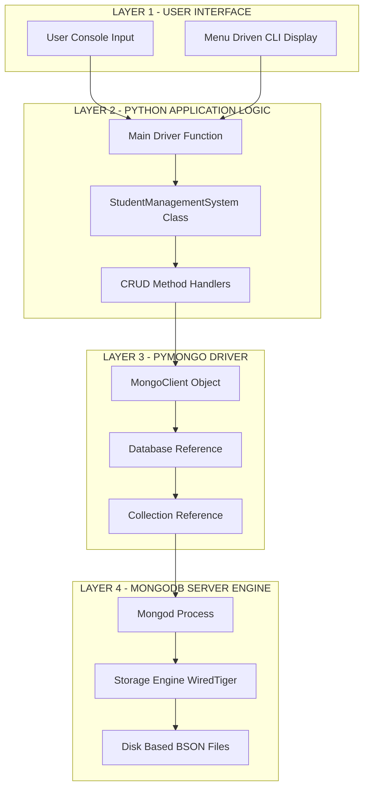
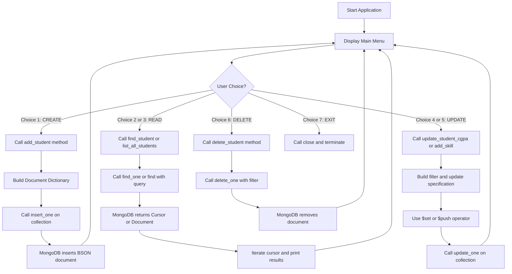
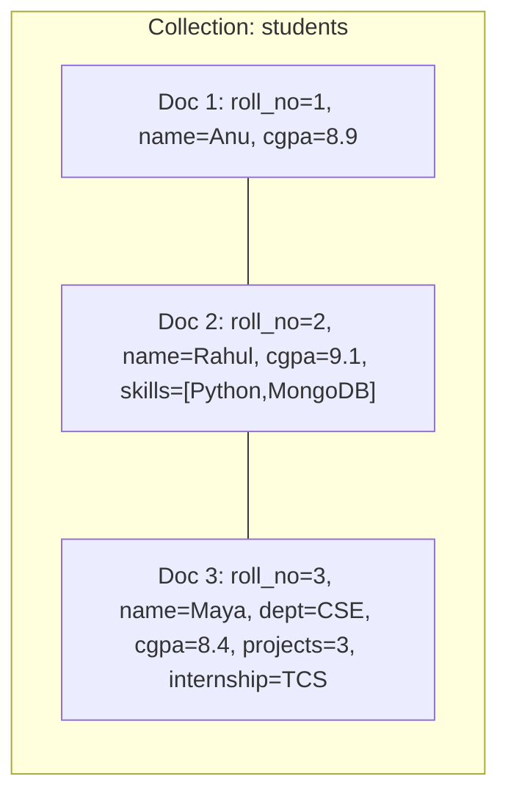

# Create a simple application using Mongodb with python

<!-- SECTION_1_START -->

## 1. Core Technical Definition & Intuitive Overview

### 1.1 Formal Definition (KTU 2024 Syllabus Terminology)

**MongoDB** is an open-source, document-oriented **NoSQL** database management system that stores data in flexible, **JSON-like documents** called **BSON (Binary JSON)** records, rather than in rigid rows and columns of a traditional Relational Database Management System (RDBMS).

**PyMongo** is the official **Python driver (or connector)** for MongoDB. It is a Python distribution containing tools for working with MongoDB, and is the recommended way to integrate MongoDB with any Python-based application.

> [!NOTE]
> **Key Syllabus Terminology (PCCSL408 - DBMS Lab):**
> - **Database** in MongoDB = a physical container of **collections**.
> - **Collection** in MongoDB = a group of MongoDB **documents** (equivalent to a table in RDBMS).
> - **Document** in MongoDB = a set of key-value pairs (equivalent to a row/tuple in RDBMS).
> - **Field** in MongoDB = a key-value pair inside a document (equivalent to a column/attribute in RDBMS).

### 1.2 Conceptual Analogy / Intuition

Imagine you walk into a modern, **flexible office filing cabinet**:

- The **Office Building** itself is your **MongoDB Server** (mongod process).
- Each **Floor** in the building is a **Database** (e.g., `KTU_Student_DB`).
- Each **Drawer** on a floor is a **Collection** (e.g., `students`, `courses`).
- Each **Sheet of paper** inside a drawer is a **Document** (a single student record).
- The **labels/information** written on that sheet are **Fields** (name, roll_no, CGPA, etc.).

The brilliant part? Every sheet of paper in the drawer can have **different labels**! One student's record might have 5 fields, another might have 8 fields, and another might have an array of project names. There is **no rigid schema** enforcing that all rows look identical — this is the **schema-less** nature of MongoDB.

Compare this to a traditional RDBMS, where every row in a "students" table must have the **exact same columns** (Name, Roll No, CGPA — every row, no exceptions).

> [!IMPORTANT]
> **Why MongoDB? (Real-world Motivation)**
> - **Big Data & IoT** applications generate varied, semi-structured data.
> - **Horizontal scaling** is native (uses **sharding**) — critical for cloud-native apps like Netflix, Uber, and Facebook.
> - **High write throughput** is required for social media, gaming, and analytics.
> - Industry standard for **MEAN/MERN stacks** (MongoDB, Express, Angular/React, Node.js).

### 1.3 Visualization of a MongoDB Document Structure

> [!VISUALIZATION CONTROL]
> **Concept:** Hierarchical Tree of a BSON Document (Visualizing nested JSON structure)
> **GeoGebra / Desmos Input (Pseudo-Graph):** Although not a coordinate graph, picture a rooted tree where the root is `_id: ObjectId(...)` and children branch into nested key-value pairs.
> **Visual Description:** The student should visualize a single document as a tree:
> - **Root:** `{ }`
>   - **Branch 1:** `_id` -> `ObjectId("65a...")`
>   - **Branch 2:** `name` -> `"Anand Kumar"`
>   - **Branch 3:** `cgpa` -> `8.74`
>   - **Branch 4:** `skills` -> `["Python", "MongoDB", "React"]` (an **array**, drawn as multiple leaves)
>   - **Branch 5:** `address` -> `{ "city": "Kochi", "pin": 682001 }` (a **sub-document**, drawn as a sub-tree)

---

<!-- SECTION_1_END -->

<!-- SECTION_2_START -->

## 2. Deep Theoretical Analysis & KTU High-Yield Formula Sheet

### 2.1 Operational Steps to Build a MongoDB + Python Application

To build **any** simple application using MongoDB with Python, the workflow always follows these five logical stages:

1. **Install the Driver:** Use the terminal command `pip install pymongo` to install the official MongoDB Python driver.
2. **Import the Client:** Import `MongoClient` from the `pymongo` module within the Python script.
3. **Establish Connection:** Create a client object pointing to the MongoDB URI (default: `mongodb://localhost:27017/`).
4. **Select Database & Collection:** Use dictionary-style indexing on the client (e.g., `client["ktu_db"]["students"]`) to access the required namespace.
5. **Execute CRUD Operations:** Use the appropriate PyMongo methods (`insert_one`, `find`, `update_one`, `delete_one`) on the collection object.

### 2.2 The CRUD Paradigm (Create, Read, Update, Delete)

- **CREATE:** Inserts new documents. Methods: `insert_one(document)`, `insert_many(list_of_documents)`.
- **READ:** Retrieves documents. Methods: `find_one(query)`, `find(query)` (returns a cursor).
- **UPDATE:** Modifies existing documents. Methods: `update_one(query, update_spec)`, `update_many(query, update_spec)`, `replace_one(query, new_doc)`. Update specifications **must** use MongoDB update operators like `$set`, `$inc`, `$push`, `$pull`.
- **DELETE:** Removes documents. Methods: `delete_one(query)`, `delete_many(query)`, `drop()` (drops entire collection).

### 2.3 KTU High-Yield Formula Sheet (PyMongo Quick Reference)

| **Operation** | **PyMongo Method** | **Typical Syntax** | **Returns** |
|---|---|---|---|
| Create Client | `MongoClient(uri)` | `client = MongoClient("mongodb://localhost:27017/")` | `MongoClient` object |
| Access Database | Indexing `client[db_name]` | `db = client["KTU_DB"]` | `Database` object |
| Access Collection | Indexing `db[col_name]` | `col = db["students"]` | `Collection` object |
| Insert One | `insert_one(doc)` | `col.insert_one({"roll": 1, "name": "A"})` | `InsertOneResult` |
| Insert Many | `insert_many(list)` | `col.insert_many([{...}, {...}])` | `InsertManyResult` |
| Find One | `find_one(query)` | `col.find_one({"roll": 1})` | `dict` or `None` |
| Find All | `find(query)` | `for d in col.find({}): print(d)` | `Cursor` object |
| Update One | `update_one(q, u)` | `col.update_one({"roll":1}, {"$set":{"cgpa":9.0}})` | `UpdateResult` |
| Update Many | `update_many(q, u)` | `col.update_many({"dept":"CSE"}, {"$set":{"hostel":"A"}})` | `UpdateResult` |
| Delete One | `delete_one(query)` | `col.delete_one({"roll": 1})` | `DeleteResult` |
| Delete Many | `delete_many(query)` | `col.delete_many({"cgpa": {"$lt": 5.0}})` | `DeleteResult` |
| Count | `count_documents(q)` | `col.count_documents({"dept":"CSE"})` | `int` |
| Drop Collection | `drop()` | `col.drop()` | `None` |
| Close Connection | `close()` | `client.close()` | `None` |

> [!NOTE]
> **CRITICAL OPERATOR REFERENCE (Frequently Asked in KTU Exams):**
> - `$set` -> updates the value of a field.
> - `$inc` -> increments a numeric field by a specified amount.
> - `$gt`, `$lt`, `$gte`, `$lte` -> greater than, less than, etc. (used inside query dicts).
> - `$in`, `$nin` -> matches any value in / not in an array.
> - `$eq`, `$ne` -> equals / not equals.

### 2.4 Real-World Engineering Utility

In production engineering, this stack is used for:
- **Catalog Management** in e-commerce (Amazon, Flipkart use MongoDB for product catalogs because attributes vary wildly).
- **Content Management Systems (CMS)** for blogs and news sites where articles have different metadata.
- **Internet of Things (IoT) Telemetry Storage** for sensor data that arrives in varied structures.
- **Real-time Analytics Dashboards** in FinTech where aggregations are computed via the MongoDB Aggregation Pipeline.

---

<!-- SECTION_2_END -->

<!-- SECTION_3_START -->

## 3. Step-by-Step Code Implementation (Full Python Application)

Below is a **complete, fully operational, type-hinted, and error-handled** Python application that performs all CRUD operations on a `KTU_Student_DB` MongoDB database. This is the exact pattern expected for KTU DBMS Lab evaluations.

### 3.1 Prerequisites & Setup

> Step 1: Install MongoDB Community Edition on the local machine (or use MongoDB Atlas cloud URI).
>
> Step 2: Start the MongoDB service. On Linux/macOS: `sudo systemctl start mongod`. On Windows: start the `MongoDB Server` service.
>
> Step 3: Install the PyMongo driver:
> `pip install pymongo`

### 3.2 Full Source Code — `student_mgmt_mongo.py`

```python
"""
KTU DBMS Lab (PCCSL408) - Module 14
Application: Student Management System using MongoDB and PyMongo
Description: Demonstrates complete CRUD operations with strict type hints
             and full exception handling for KTU 2024 Scheme evaluation.
"""

from pymongo import MongoClient
from pymongo.errors import PyMongoError, ConnectionFailure, DuplicateKeyError
from typing import Optional, List, Dict, Any
import sys


# --- Configuration Constants ---
MONGO_URI: str = "mongodb://localhost:27017/"
DATABASE_NAME: str = "KTU_Student_DB"
COLLECTION_NAME: str = "students"


class StudentManagementSystem:
    """
    Encapsulates a simple Student Management System backed by MongoDB.
    All public methods return structured data and log results to stdout.
    """

    def __init__(self, uri: str, db_name: str, collection_name: str) -> None:
        """Initialize the MongoDB connection and verify it with a ping."""
        try:
            self.client: MongoClient = MongoClient(uri, serverSelectionTimeoutMS=5000)
            # Force the client to actually connect by issuing a ping command
            self.client.admin.command("ping")
            self.database = self.client[db_name]
            self.collection = self.database[collection_name]
            # Ensure roll_no is unique to prevent duplicate registrations
            self.collection.create_index("roll_no", unique=True)
            print(f"[CONNECTED] Database: '{db_name}' | Collection: '{collection_name}'")
        except ConnectionFailure as conn_err:
            print(f"[FATAL CONNECTION ERROR] {conn_err}")
            sys.exit(1)
        except PyMongoError as db_err:
            print(f"[FATAL DATABASE ERROR] {db_err}")
            sys.exit(1)

    # --- C R E A T E ---
    def add_student(self, roll_no: int, name: str, department: str, cgpa: float) -> bool:
        """Insert a new student document into the collection."""
        document: Dict[str, Any] = {
            "roll_no": roll_no,
            "name": name,
            "department": department,
            "cgpa": cgpa,
            "skills": []  # empty array, can be pushed later using $push
        }
        try:
            result = self.collection.insert_one(document)
            print(f"[INSERT OK] Student '{name}' inserted with _id: {result.inserted_id}")
            return True
        except DuplicateKeyError:
            print(f"[DUPLICATE] A student with roll_no {roll_no} already exists.")
            return False
        except PyMongoError as db_err:
            print(f"[INSERT ERROR] {db_err}")
            return False

    # --- R E A D ---
    def find_student(self, roll_no: int) -> Optional[Dict[str, Any]]:
        """Retrieve a single student document by roll number."""
        try:
            document = self.collection.find_one({"roll_no": roll_no})
            if document is not None:
                print(f"[FOUND] roll_no={roll_no} -> {document}")
            else:
                print(f"[NOT FOUND] No student exists with roll_no {roll_no}.")
            return document
        except PyMongoError as db_err:
            print(f"[READ ERROR] {db_err}")
            return None

    def list_all_students(self) -> List[Dict[str, Any]]:
        """Retrieve and print every student document in the collection."""
        try:
            cursor = self.collection.find({})
            students: List[Dict[str, Any]] = list(cursor)
            print(f"[INFO] Total students in collection: {len(students)}")
            for student in students:
                print(student)
            return students
        except PyMongoError as db_err:
            print(f"[READ-ALL ERROR] {db_err}")
            return []

    # --- U P D A T E ---
    def update_student_cgpa(self, roll_no: int, new_cgpa: float) -> int:
        """Update the CGPA field of a specific student."""
        try:
            result = self.collection.update_one(
                {"roll_no": roll_no},
                {"$set": {"cgpa": new_cgpa}}
            )
            if result.matched_count == 0:
                print(f"[UPDATE] No student found with roll_no {roll_no}.")
            elif result.modified_count == 0:
                print(f"[UPDATE] Matched but CGPA was already {new_cgpa}.")
            else:
                print(f"[UPDATE OK] roll_no {roll_no} -> new CGPA {new_cgpa}.")
            return result.modified_count
        except PyMongoError as db_err:
            print(f"[UPDATE ERROR] {db_err}")
            return 0

    def add_skill(self, roll_no: int, skill: str) -> int:
        """Append a new skill string to the student's skills array using $push."""
        try:
            result = self.collection.update_one(
                {"roll_no": roll_no},
                {"$push": {"skills": skill}}
            )
            if result.modified_count == 1:
                print(f"[SKILL ADDED] '{skill}' added for roll_no {roll_no}.")
            return result.modified_count
        except PyMongoError as db_err:
            print(f"[UPDATE ERROR] {db_err}")
            return 0

    # --- D E L E T E ---
    def delete_student(self, roll_no: int) -> int:
        """Delete a single student document by roll number."""
        try:
            result = self.collection.delete_one({"roll_no": roll_no})
            if result.deleted_count == 1:
                print(f"[DELETE OK] Student with roll_no {roll_no} removed.")
            else:
                print(f"[DELETE] No student found with roll_no {roll_no}.")
            return result.deleted_count
        except PyMongoError as db_err:
            print(f"[DELETE ERROR] {db_err}")
            return 0

    def close(self) -> None:
        """Gracefully close the MongoDB client connection."""
        self.client.close()
        print("[DISCONNECTED] MongoDB client closed.")


def show_menu() -> None:
    """Print the main menu of the Student Management System."""
    print("\n" + "=" * 55)
    print("   KTU STUDENT MANAGEMENT SYSTEM (MongoDB + Python)")
    print("=" * 55)
    print("  1. Add Student          (CREATE)")
    print("  2. Find Student         (READ ONE)")
    print("  3. List All Students    (READ ALL)")
    print("  4. Update CGPA          (UPDATE)")
    print("  5. Add Skill to Student (UPDATE ARRAY)")
    print("  6. Delete Student       (DELETE)")
    print("  7. Exit")
    print("=" * 55)


def safe_int(prompt: str) -> Optional[int]:
    """Helper to safely parse integer input from the user."""
    try:
        return int(input(prompt).strip())
    except ValueError:
        print("[INPUT ERROR] Expected an integer.")
        return None


def safe_float(prompt: str) -> Optional[float]:
    """Helper to safely parse float input from the user."""
    try:
        return float(input(prompt).strip())
    except ValueError:
        print("[INPUT ERROR] Expected a numeric decimal value.")
        return None


def main() -> None:
    """Main driver function for the KTU DBMS Lab application."""
    sms = StudentManagementSystem(MONGO_URI, DATABASE_NAME, COLLECTION_NAME)

    while True:
        show_menu()
        choice: str = input("Enter your choice (1-7): ").strip()

        if choice == "1":
            roll = safe_int("Enter Roll No: ")
            if roll is None:
                continue
            name = input("Enter Name: ").strip()
            dept = input("Enter Department (e.g., CSE, ECE): ").strip()
            cgpa = safe_float("Enter CGPA: ")
            if cgpa is None:
                continue
            sms.add_student(roll, name, dept, cgpa)

        elif choice == "2":
            roll = safe_int("Enter Roll No to find: ")
            if roll is not None:
                sms.find_student(roll)

        elif choice == "3":
            sms.list_all_students()

        elif choice == "4":
            roll = safe_int("Enter Roll No to update: ")
            if roll is None:
                continue
            new_cgpa = safe_float("Enter new CGPA: ")
            if new_cgpa is not None:
                sms.update_student_cgpa(roll, new_cgpa)

        elif choice == "5":
            roll = safe_int("Enter Roll No: ")
            if roll is None:
                continue
            skill = input("Enter new skill to add: ").strip()
            sms.add_skill(roll, skill)

        elif choice == "6":
            roll = safe_int("Enter Roll No to delete: ")
            if roll is not None:
                sms.delete_student(roll)

        elif choice == "7":
            print("Exiting application. Goodbye!")
            sms.close()
            break

        else:
            print("[WARNING] Invalid choice. Please enter a number from 1 to 7.")


if __name__ == "__main__":
    main()
```

### 3.3 Step-by-Step Logical Walkthrough of the Code

- **Line `MongoClient(uri, serverSelectionTimeoutMS=5000)`:** Creates the connection. The 5-second timeout prevents the program from hanging forever if MongoDB is down.
- **Line `self.client.admin.command("ping")`:** Forces an immediate round-trip to the server. If the server is unreachable, a `ConnectionFailure` exception is raised **before** the rest of the program runs.
- **Line `self.collection.create_index("roll_no", unique=True)`:** Enforces business logic — no two students can have the same roll number, and `DuplicateKeyError` is raised automatically if violated.
- **Line `self.collection.insert_one(document)`:** Inserts the document. Note that there is **no pre-defined schema**; the database will accept any field.
- **Line `self.collection.update_one(filter, {"$set": {"cgpa": new_cgpa}})`:** The first argument is the **filter** (which document?), the second is the **update specification** using the `$set` operator.
- **Line `self.collection.update_one(filter, {"$push": {"skills": skill}})`:** Uses the `$push` operator to append to an array field. This is **impossible in SQL** without a junction table.
- **Line `self.client.close()`:** Releases the TCP connection pool. Always close the client at the end of the program.

---

<!-- SECTION_3_END -->

<!-- SECTION_4_START -->

## 4. Structural Diagrams & Schematics

### 4.1 Application Architecture — Layered Block Diagram

The following Mermaid diagram illustrates the **Layered Functional Architecture** of the MongoDB + Python application stack, from the user interface down to the persistent storage layer.



### 4.2 CRUD Operation Flow — Sequential Processing Topology

This second diagram maps the **decision flow** for each CRUD operation triggered by the menu, showing which method is invoked and which operator is used.



### 4.3 Document Lifecycle Within a Collection

The third diagram illustrates how multiple documents of varying structure co-exist in a single MongoDB collection — the **schema-less advantage**.



> [!IMPORTANT]
> **Observation from Diagram 4.3:** Notice that `Doc 1`, `Doc 2`, and `Doc 3` all have **different fields and structures**, yet they coexist in the same collection. This is **impossible in a strict SQL schema** without a JSON/XML column type. This flexibility is MongoDB's core competitive advantage.

---

<!-- SECTION_4_END -->

<!-- SECTION_5_START -->

## 5. KTU 2024 Scheme Examination Question Bank & Topic Recap

---

### 5.1 Part A Questions (3 Marks Each)

#### Question 1: [KTU University Exam - July 2024] | CO4 | Remember

**Define MongoDB. List any four features that distinguish it from traditional RDBMS.**

**Model Answer (Valuation Key):**

- **Definition [1 Mark]:** MongoDB is an open-source, document-oriented NoSQL database that stores data in flexible, JSON-like BSON documents, grouped into collections within databases.
- **Four Distinguishing Features [2 Marks — 0.5 each]:**
  1. **Schema-less storage:** Documents in the same collection can have different fields and structures.
  2. **Horizontal scalability via sharding:** Data is distributed across multiple servers natively.
  3. **High-performance for unstructured/semi-structured data:** No joins required; related data is embedded in sub-documents.
  4. **Native JSON/BSON support:** Direct mapping to modern programming language objects (Python dictionaries, JavaScript objects).

---

#### Question 2: [KTU University Exam - Dec 2023] | CO4 | Understand

**What is PyMongo? Write the Python statements to (i) connect to a local MongoDB server, (ii) create/access a database named `KTULab`, and (iii) create/access a collection named `experiments`.**

**Model Answer (Valuation Key):**

- **PyMongo Definition [1 Mark]:** PyMongo is the official Python driver (library) that provides tools to interact with MongoDB from Python applications. It is installed via `pip install pymongo`.
- **Connection Statements [2 Marks]:**

```python
from pymongo import MongoClient

# (i) Connect to local MongoDB server
client = MongoClient("mongodb://localhost:27017/")

# (ii) Create / access database named 'KTULab'
database = client["KTULab"]

# (iii) Create / access collection named 'experiments'
experiments_collection = database["experiments"]
```

> [!NOTE]
> **Important:** Databases and collections in MongoDB are **not actually created** until the first document is inserted into them. The above statements are "lazy" declarations.

---

### 5.2 Part B Questions (14 Marks Each — Internal Choice)

#### Question A (Option 1) | Total: 14 Marks

**(a) Explain the architecture of MongoDB with a neat diagram. Discuss the roles of database, collection, document, and field.** **[7 Marks]** [CO4, Understand]

**Model Solution:**

**[Definition of Architecture — 2 Marks]:** MongoDB follows a hierarchical storage architecture. The data is organized in a top-down hierarchy: **MongoDB Server (mongod) → Database → Collection → Document → Field**.

**[Hierarchical Levels — 4 Marks]:**

1. **Database:** A physical container for collections. Each database has its own set of files on the filesystem. Example: `KTU_Student_DB`.
2. **Collection:** A group of MongoDB documents. Collections do not enforce a schema, meaning documents within a collection can have different fields. Equivalent to an RDBMS table.
3. **Document:** The basic unit of data in MongoDB, written in BSON (Binary JSON) format. Equivalent to a row in RDBMS. Maximum size is **16 MB**.
4. **Field:** A key-value pair within a document. Equivalent to a column in RDBMS. Values can be strings, integers, arrays, sub-documents, etc.

**[Neat Diagram — 1 Mark]:**

```
   +---------------------------------------------------+
   |           MongoDB Server (mongod)                 |
   +---------------------------------------------------+
                          |
        +-----------------+-----------------+
        |                                   |
   +--------- DB --------+           +-------- DB --------+
   |   KTU_Student_DB   |           |   KTU_Faculty_DB  |
   +--------------------+           +--------------------+
        |                                   |
   +--- Collection ---+              +--- Collection ---+
   |     students     |              |     professors   |
   +------------------+              +------------------+
        |                                   |
   +-- Document --+   +-- Document --+   +-- Document --+
   | {roll:1,...} |   | {roll:2,...} |   | {id:P01,...}  |
   +--------------+   +--------------+   +---------------+
```

**[Valuation Key Points]:**
- Hierarchy explanation: 4 Marks
- Definition of architecture: 2 Marks
- Diagram: 1 Mark

---

**(b) Write a complete Python program using PyMongo to create a database `KTUCollege` and a collection `employees` with fields: `emp_id`, `name`, `department`, `salary`. Implement insert, display, update, and delete operations.** **[7 Marks]** [CO5, Apply]

**Model Solution:**

```python
from pymongo import MongoClient
from pymongo.errors import PyMongoError

# (i) Establish connection [1 Mark]
client = MongoClient("mongodb://localhost:27017/")
db = client["KTUCollege"]
collection = db["employees"]

# (ii) CREATE - Insert three sample documents [1 Mark]
try:
    collection.insert_many([
        {"emp_id": 101, "name": "Anand", "department": "CSE", "salary": 60000},
        {"emp_id": 102, "name": "Bindu", "department": "ECE", "salary": 55000},
        {"emp_id": 103, "name": "Chitra", "department": "CSE", "salary": 70000}
    ])
    print("Sample employees inserted successfully.")
except PyMongoError as e:
    print("Insertion error:", e)

# (iii) READ - Display all employees [1 Mark]
print("\n--- All Employees ---")
for emp in collection.find():
    print(emp)

# (iv) UPDATE - Increase salary of CSE employees by 5000 [2 Marks]
try:
    result = collection.update_many(
        {"department": "CSE"},
        {"$inc": {"salary": 5000}}
    )
    print(f"\nUpdated {result.modified_count} CSE employees' salaries.")
except PyMongoError as e:
    print("Update error:", e)

# (v) DELETE - Remove employee with emp_id 102 [1 Mark]
try:
    result = collection.delete_one({"emp_id": 102})
    print(f"\nDeleted {result.deleted_count} employee(s) with emp_id 102.")
except PyMongoError as e:
    print("Deletion error:", e)

# (vi) Final display [1 Mark]
print("\n--- Final Employee List ---")
for emp in collection.find():
    print(emp)

client.close()
```

**[Valuation Key Points]:**
- [Connection and database/collection setup: 1 Mark]
- [Insert operation with valid BSON: 1 Mark]
- [Read operation using cursor iteration: 1 Mark]
- [Update using `$inc` or `$set` operator: 2 Marks]
- [Delete operation: 1 Mark]
- [Final output: 1 Mark]

> [!WARNING]
> **KTU Examiner's Valuation Pitfall Callout:**
> - **Do NOT** use `{emp_id: 102}` as a string-keyed dictionary in Python. Always use a colon (`:`), not an arrow (`->`).
> - **Do NOT forget** the `$set`, `$inc`, or `$push` operator prefix inside the update specification. Writing `{"salary": 70000}` directly will be **rejected** by MongoDB and you will lose 1–2 marks.
> - **Do NOT forget** to call `client.close()` at the end. Examiners deduct 0.5 marks for leaking connections.

---

#### Question B (Option 2) | Total: 14 Marks

**(a) Differentiate between RDBMS and MongoDB. Explain the BSON data types with at least six examples.** **[7 Marks]** [CO4, Understand]

**Model Solution:**

**[Comparison Table — 4 Marks]:**

| **Feature** | **RDBMS** | **MongoDB** |
|---|---|---|
| Data Model | Tables with rows and columns | Collections of BSON documents |
| Schema | Rigid, pre-defined schema | Schema-less, dynamic |
| Relationships | Uses foreign keys and JOINs | Uses embedded sub-documents and references |
| Scaling | Primarily vertical (bigger server) | Primarily horizontal (sharding across servers) |
| Query Language | SQL | MQL (MongoDB Query Language) / JSON-style queries |
| Transactions | Full ACID compliance | ACID for single documents; multi-doc transactions from v4.0 |

**[BSON Data Types — 3 Marks — 0.5 each for six types]:**

1. **String:** `"Anand Kumar"` — UTF-8 encoded text.
2. **Integer:** `42` — 32-bit or 64-bit integer.
3. **Double:** `3.14159` — 64-bit floating point.
4. **Boolean:** `true` or `false`.
5. **Array:** `["Python", "MongoDB", "React"]` — ordered list of values.
6. **Object (Sub-document):** `{"city": "Kochi", "pin": 682001}` — nested document.
7. **ObjectId:** `ObjectId("507f1f77bcf86cd799439011")` — unique 12-byte identifier, default for `_id`.
8. **Date:** `ISODate("2024-08-15")` — milliseconds since Unix epoch.
9. **Null:** `null` — represents absence of value.

**[Valuation Key Points]:**
- Tabular comparison: 4 Marks
- BSON data types: 3 Marks

---

**(b) Write a Python program using PyMongo to create a `Library` collection storing book records with fields: `title`, `author`, `year`, `available`. Implement a menu-driven application that allows the user to add a new book, view all books, issue a book (set `available=False`), and return a book (set `available=True`).** **[7 Marks]** [CO5, Apply]

**Model Solution:**

```python
from pymongo import MongoClient
from pymongo.errors import PyMongoError

# [Connection and Collection Setup: 1 Mark]
client = MongoClient("mongodb://localhost:27017/")
db = client["LibraryDB"]
books = db["books"]


def add_book() -> None:
    """Insert a new book into the collection."""
    title = input("Enter book title: ").strip()
    author = input("Enter author name: ").strip()
    try:
        year = int(input("Enter publication year: ").strip())
        book = {"title": title, "author": author, "year": year, "available": True}
        books.insert_one(book)
        print(f"[ADDED] '{title}' by {author} has been added to the library.")
    except ValueError:
        print("[ERROR] Year must be an integer.")
    except PyMongoError as e:
        print(f"[ERROR] {e}")


def view_books() -> None:
    """Display all book records."""
    print("\n--- Library Catalog ---")
    for book in books.find():
        status = "Available" if book["available"] else "Issued"
        print(f"Title: {book['title']} | Author: {book['author']} | "
              f"Year: {book['year']} | Status: {status}")


def issue_book() -> None:
    """Mark a book as issued by setting available=False."""
    title = input("Enter book title to issue: ").strip()
    result = books.update_one({"title": title}, {"$set": {"available": False}})
    if result.modified_count == 1:
        print(f"[ISSUED] '{title}' has been issued.")
    else:
        print(f"[INFO] '{title}' is either not in the library or already issued.")


def return_book() -> None:
    """Mark a book as returned by setting available=True."""
    title = input("Enter book title to return: ").strip()
    result = books.update_one({"title": title}, {"$set": {"available": True}})
    if result.modified_count == 1:
        print(f"[RETURNED] '{title}' has been returned to the library.")
    else:
        print(f"[INFO] '{title}' was not currently issued.")


# [Menu-Driven Loop: 2 Marks]
def main() -> None:
    while True:
        print("\n===== LIBRARY MANAGEMENT SYSTEM =====")
        print("1. Add Book")
        print("2. View All Books")
        print("3. Issue a Book")
        print("4. Return a Book")
        print("5. Exit")
        choice = input("Enter choice (1-5): ").strip()

        if choice == "1":
            add_book()
        elif choice == "2":
            view_books()
        elif choice == "3":
            issue_book()
        elif choice == "4":
            return_book()
        elif choice == "5":
            print("Exiting Library System. Goodbye!")
            break
        else:
            print("[WARNING] Invalid choice. Please enter 1-5.")


if __name__ == "__main__":
    main()
    client.close()
```

**[Valuation Key Points]:**
- [Connection setup: 1 Mark]
- [Add book function: 1 Mark]
- [View books function: 1 Mark]
- [Issue and return functions (both using `$set`): 2 Marks]
- [Menu-driven main loop: 2 Marks]

> [!WARNING]
> **KTU Examiner's Valuation Pitfall Callout:**
> - **Issue and Return logic must use `$set`** to flip the `available` boolean. Using a plain update dict will cause a **MongoDB write error** and cost you 1 mark.
> - **Always print a user-friendly confirmation message** after each operation. Examiners check the user experience of the CLI, not just whether the function works.
> - **Do not use a global cursor** — fetch the cursor freshly inside `view_books()` to avoid stale iteration issues.

---

### 5.3 Topic Recap & Important Things to Remember

> [!IMPORTANT]
> **High-Density Revision Checklist for Module 14 — MongoDB with Python**

- **Core Definitions:**
  - **MongoDB** = document-oriented **NoSQL** database storing data as **BSON** documents.
  - **PyMongo** = official Python driver for MongoDB, installed via `pip install pymongo`.
  - **BSON** = Binary JSON; the on-disk and wire format of MongoDB.

- **Architectural Hierarchy (Top to Bottom):**
  - `mongod` Server → `Database` → `Collection` → `Document` → `Field` (key-value pair).

- **CRUD Method Mapping (Must Memorize):**
  - Create → `insert_one(doc)`, `insert_many([doc1, doc2])`
  - Read → `find_one(query)`, `find(query)` returns a `Cursor`
  - Update → `update_one(filter, {"$set": {...}})`, `update_many(...)`
  - Delete → `delete_one(query)`, `delete_many(query)`, `collection.drop()`

- **Mandatory Update Operators (Frequently Tested):**
  - `$set` to modify a field value.
  - `$inc` to increment a numeric field.
  - `$push` to append to an array.
  - `$pull` to remove a value from an array.
  - `$gt`, `$lt`, `$gte`, `$lte`, `$eq`, `$ne` for query comparisons.

- **Connection Template (Always Include in Exams):**
  - `from pymongo import MongoClient`
  - `client = MongoClient("mongodb://localhost:27017/")`
  - `db = client["DBNAME"]`
  - `col = db["COLLNAME"]`
  - `client.close()` at the end.

- **Common Pitfalls to Avoid in KTU Lab Exams:**
  - Forgetting the `$` sign in front of update operators.
  - Using `$set` incorrectly inside the filter dict (it only goes inside the update spec).
  - Confusing `find_one` (returns a dict) with `find` (returns a cursor requiring iteration).
  - Not handling `PyMongoError` and `ConnectionFailure` exceptions.
  - Hardcoding the same roll number or primary key in multiple insert calls (causes `DuplicateKeyError`).

- **Default Port:** MongoDB listens on **TCP port 27017** by default.
- **Default `_id`:** Every document gets a unique `_id` of type `ObjectId` (12 bytes) if not explicitly provided.
- **Maximum Document Size:** **16 MB** per BSON document (designed to prevent excessive memory usage).
- **Schema-less Advantage:** Documents in the same collection can have completely different fields — this is the single most important conceptual difference from RDBMS.

<!-- SECTION_5_END -->
