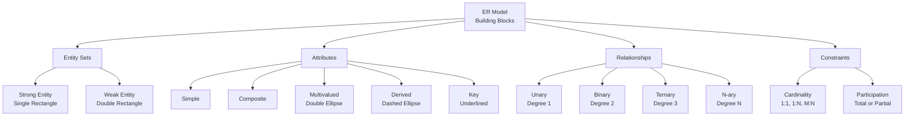
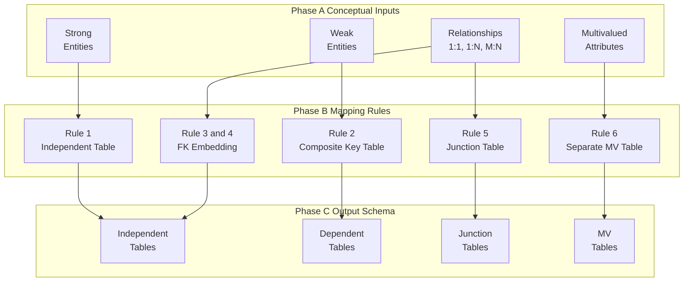
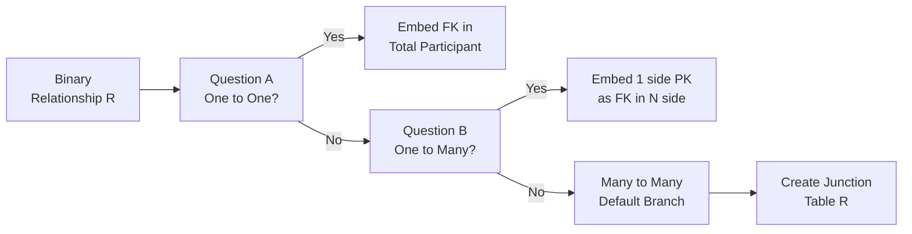
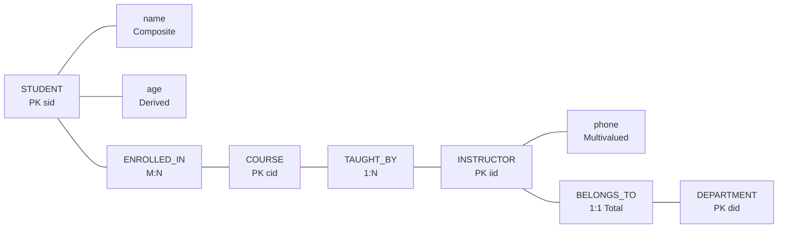
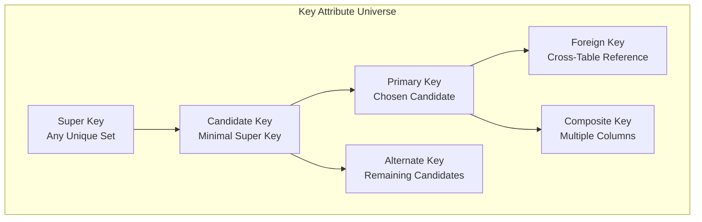

# Conceptual Modeling: ER Model—Entities, Attributes, Keys, and Relationship types, Cardinality ratios, constraints

<!-- SECTION_1_START -->
# 📘 Module 1 — Conceptual Modeling using the ER Model

> [!IMPORTANT]
> **KTU 2024 Scheme | PCCST402 — Database Management Systems**
> **Module Coverage:** Entities, Attributes, Keys, Relationship Types, Cardinality Ratios & Participation Constraints.
> **Mapped Course Outcome:** **CO1** — Understand the fundamental concepts, architectures, and data models used in modern DBMS (Cognitive Level: *Understand / Apply*).

---

## 1.1 Formal Academic Definition

> [!NOTE]
> **Entity–Relationship (ER) Model — Definition (Chen, 1976; KTU 2024 Syllabus aligned)**
> The **Entity–Relationship Model** is a *high-level, semantic, conceptual data model* proposed by **Peter Pin-Shan Chen** in 1976, used to describe the **logical structure of a database** in terms of *real-world entities*, their *attributes*, and the *associations (relationships)* among them. It is the de-facto standard for **conceptual database design** in the KTU 2024 DBMS curriculum and is independent of any physical storage considerations.

The ER Model is graphically expressed through an **ER Diagram (ERD)** which uses three primitive symbols:

| Symbol | Shape | Meaning |
| :--- | :--- | :--- |
| **Rectangle** | ▭ | Entity Set |
| **Ellipse** | ⬭ | Attribute |
| **Diamond** | ◇ | Relationship Set |
| **Double Rectangle** | ▭▭ | Weak Entity Set |
| **Double Ellipse** | ⬭⬭ | Multivalued Attribute |
| **Dashed Ellipse** | ▭ - - - | Derived Attribute |
| **Underlined Text** | ___name___ | Key Attribute |
| **Double Diamond** | ◆ | Identifying Relationship |

---

## 1.2 Intuitive Analogy — The "Architect's Blueprint" View

> [!TIP]
> **Conceptual Analogy: ER Model = Architectural Blueprint of a House**
> Before a civil engineer lays a single brick, they draw a **blueprint**. The blueprint does not show the brand of cement or the wire thickness; it shows **rooms (entities)**, **doors & windows (attributes)**, and **hallways connecting them (relationships)**. Similarly, the ER Model is a *blueprint of your database* — it ignores SQL, indexes, and disk blocks, and focuses only on **what data exists** and **how it is logically connected**. Only *after* this blueprint is approved do you convert it into a **relational schema** (actual tables in PostgreSQL / MySQL / Oracle).

- An **Entity** is like a *room* — a real, identifiable, distinguishable object (e.g., a `Student`, a `Course`).
- An **Attribute** is a *property* of that room (e.g., `StudentName`, `RoomColor`).
- A **Key Attribute** is the *unique room number* — no two rooms share it.
- A **Relationship** is the *hallway* — it connects two rooms.
- **Cardinality** answers: *"How many rooms can one hallway connect?"*

---

## 1.3 Core Building Blocks — Quick-Reference Glossary

> [!NOTE]
> **Entity** — Any *real-world object* that is *physically or conceptually existence-independent* and can be uniquely identified. Example: a particular student `Arun`, a particular car `KL-07-AB-1234`.
>
> **Entity Set** — The *collection* of all entities of the same type. Example: the set of *all students* in a college is the `Student` entity set.
>
> **Attribute** — A *descriptive property* possessed by every member of an entity set. Example: every `Student` has a `Name`, `RollNo`, `DOB`.
>
> **Domain** — The *set of permitted values* for an attribute. Example: `Domain(Age) = {x ∈ ℕ ∣ 17 ≤ x ≤ 60}`.
>
> **Relationship** — An *association* among several entities. Example: `Arun ENROLLED-IN CS301`.
>
> **Relationship Set** — The *mathematical set* of all such associations of the same type.

---

## 1.4 Visualization Control

> [!VISUALIZATION CONTROL]
> **Concept:** Geometric Layout of an ER Diagram (Entity–Attribute–Relationship).
> **GeoGebra / Desmos Input Equations (Coordinate Plot of ER Symbols):**
> * Rectangle (Entity): `Polygon((1,1), (5,1), (5,3), (1,3))`
> * Ellipse (Attribute): `(x-3)^2 / 4 + (y-5)^2 / 0.6 = 1`
> * Diamond (Relationship): `Polygon((3,6), (5,8), (3,10), (1,8))`
>
> **Visual Description:** On the coordinate plane, observe the *rectangle* floating below (the entity), an *ellipse* floating above it (the attribute), and a *diamond* placed at the top-center (the relationship). Connecting *straight lines* (edges) link them in a tree: `Ellipse → Rectangle → Diamond`. This is the canonical "Chen Notation" of an ER Diagram.

---

## 1.5 Why ER Modeling is the *First* Step in DBMS Design

> [!IMPORTANT]
> The **KTU 2024 prescribed design lifecycle** mandates the following six-phase pipeline:
> `Requirements ➝ Conceptual Design (ER) ➝ Logical Design (Relational) ➝ Schema Refinement (Normalization) ➝ Physical Design ➝ Security & Tuning`
> The ER Model is the **bridge between informal requirements and formal relational tables**. Skipping this stage is a guaranteed loss of marks in KTU's Module 1 questions and a recipe for design errors in real projects.

<!-- SECTION_1_END -->

<!-- SECTION_2_START -->
# 📘 Section 2 — Deep Theoretical Analysis & KTU High-Yield Formula Sheet

---

## 2.1 Entities — Strong vs. Weak

An **Entity** is any distinguishable real-world object. In the ER Model, entities are classified into two disjoint categories:

### 2.1.1 Strong Entity Set
* **Definition:** An entity set that possesses a **primary key** formed entirely from its **own attributes** (i.e., it is *existence-independent*).
* **Symbol:** Single rectangle `▭`.
* **Example:** `Student(RollNo, Name, DOB)` — `RollNo` alone can uniquely identify a student.
* **Existence Rule:** A strong entity exists *independently* — even if no relationship is established, it can persist in the schema.

### 2.1.2 Weak Entity Set
* **Definition:** An entity set that **cannot be uniquely identified by its own attributes alone**; it depends on a *strong (owner) entity* via an **identifying relationship**.
* **Symbol:** Double rectangle `▭▭`.
* **Example:** `Dependent(Name, Age, Relationship)` of an `Employee`. A dependent `Rahul` of `Emp#100` is not the same as `Rahul` of `Emp#200`. The dependent needs `(EmpID, DepName)` for unique identification.
* **Discriminator (Partial Key):** The **set of attributes** that, when combined with the owner's primary key, uniquely identifies a weak entity. Drawn as a *dashed underline*.

> [!TIP]
> **KTU Examiner's Insight:** If a question mentions *"a room in a building"* or *"a dependent of an employee"*, it is a *weak entity* scenario. Strong entities *can exist alone*; weak entities *cannot*.

---

## 2.2 Attributes — The Five Fundamental Types

An **Attribute** is a property that *describes* an entity (or a relationship). KTU 2024 syllabus explicitly tests all five sub-classes:

| # | Attribute Type | Formal Definition | Example | Notation |
| :--- | :--- | :--- | :--- | :--- |
| 1 | **Simple / Atomic** | Cannot be subdivided meaningfully. | `RollNo`, `Age` | Single ellipse |
| 2 | **Composite** | Can be broken into smaller meaningful sub-parts. | `Name = {FName, MName, LName}` | Ellipse with sub-ellipses |
| 3 | **Multivalued** | Can hold *multiple* values for a single entity. | `PhoneNumbers`, `Skills` | Double ellipse |
| 4 | **Derived** | Value is *computed* from another attribute; not stored. | `Age` derived from `DOB` | Dashed ellipse |
| 5 | **Key** | Uniquely identifies an entity in its set. | `RollNo`, `EmpID` | Underlined text in ellipse |

> [!IMPORTANT]
> **Composite ≠ Multivalued.** This is a classic KTU pitfall. `Name` is *composite* (one value, multiple sub-parts). `PhoneNumbers` is *multivalued* (multiple values, no sub-parts).

---

## 2.3 Keys — The Three-Tier Hierarchy

Keys are *attribute sets* used to enforce *entity integrity*. The KTU syllabus expects you to know the relationship between **Super Key ⊇ Candidate Key ⊇ Primary Key**.

### Formal Set-Theoretic Definitions

Let $E$ be an entity set and $A(E)$ be the set of all attributes of $E$. Let $K \subseteq A(E)$ be a subset.

* **Super Key:** A subset $K$ such that for any two entities $e_1, e_2 \in E$,
$$ e_1 \ne e_2 \implies K(e_1) \ne K(e_2) $$
i.e., $K$ *uniquely identifies* every entity, but it may contain *extraneous* attributes.

* **Candidate Key:** A *minimal* super key. If you remove any single attribute $a \in K$, the remaining set $K - \{a\}$ is *no longer* a super key. Minimality is the key differentiator.

* **Primary Key:** The **single, designated candidate key** chosen by the database designer to be the *official* unique identifier. All other candidate keys become **Unique / Alternate Keys**.

* **Foreign Key:** An attribute $F$ in entity set $E_2$ whose value must match the primary key of some entity in $E_1$. Foreign keys are the implementation mechanism for *relationships* in the relational model.

### Worked Mini-Example
Given `Student(RollNo, Aadhaar, Email, Name, DOB)`:
* **Super Keys:** `{RollNo}`, `{Aadhaar}`, `{Email}`, `{RollNo, Name}`, `{Aadhaar, DOB}`, … (over $2^5 - \text{non-keys}$).
* **Candidate Keys:** `{RollNo}`, `{Aadhaar}`, `{Email}` (assuming all are unique and `Name` is not).
* **Primary Key:** Designer chooses `{RollNo}`. The other two become **Alternate Keys**.

---

## 2.4 Relationship Types — Degree & Cardinality

### 2.4.1 Degree of a Relationship

The **degree** is the *number of entity sets* that participate in the relationship.

| Degree | Name | Example | Notation |
| :--- | :--- | :--- | :--- |
| 1 | **Unary / Recursive** | `Employee MANAGES Employee` | Single entity set, self-loop |
| 2 | **Binary** | `Student ENROLLED-IN Course` | Two entity sets |
| 3 | **Ternary** | `Doctor treats Patient using Medicine` | Three entity sets |
| n | **n-ary** | Generalization of ternary | $n$ entity sets |

> [!WARNING]
> **KTU Pitfall:** *Binary* relationships are the *most common* (≈ 90% of exam questions). *Ternary* relationships **cannot always be decomposed** into three binary relationships without **loss of semantic information** — this is a classic higher-order question.

### 2.4.2 Cardinality Ratios (Mapping Cardinalities)

The **cardinality ratio** specifies *how many entities of one set* participate in the relationship with *how many entities of the other set*. For a binary relationship $R$ between $E_1$ and $E_2$:

| Ratio | Symbol | Meaning | Real-World Example |
| :--- | :--- | :--- | :--- |
| **One-to-One** | $1:1$ | An entity in $E_1$ is associated with **at most one** entity in $E_2$, and vice-versa. | A `Person` has **one** `Passport`; a `Passport` belongs to **one** `Person`. |
| **One-to-Many** | $1:N$ | An entity in $E_1$ is associated with **many** entities in $E_2$, but an entity in $E_2$ is associated with **at most one** in $E_1$. | One `Department` has **many** `Employees`; an `Employee` works in **one** `Department`. |
| **Many-to-One** | $N:1$ | Mirror of $1:N$ from the other side. | Many `Employees` report to **one** `Manager`. |
| **Many-to-Many** | $M:N$ | Entities on both sides can be associated with **multiple** entities on the other side. | `Students` enroll in **many** `Courses`; a `Course` has **many** `Students`. |

### 2.4.3 Participation Constraints (Existence Constraints)

* **Total Participation (Mandatory / Existence Dependency):** *Every* entity in the set **must** participate in the relationship. Drawn as a **double line** `═`.
* **Partial Participation (Optional):** An entity *may or may not* participate. Drawn as a **single line** `—`.

> [!IMPORTANT]
> **Combined Notation (Look-here table for KTU):**
> Total + 1:1 ⇒ the participating entity's primary key is a *foreign key* with `NOT NULL`.
> Total + 1:N ⇒ "many" side carries the foreign key with `NOT NULL`.
> M:N ⇒ a *separate junction table* is always required in the relational mapping.

---

## 2.5 KTU Formula Sheet / Cheat Sheet (High-Yield Module 1)

> [!NOTE]
> **Use this table as your last-minute revision sheet for Module 1.**

| # | Concept | Formula / Rule | KTU Exam Tag |
| :--- | :--- | :--- | :--- |
| 1 | **Cardinality mapping** | For binary $R$ between $E_1, E_2$: $\text{card}(R) \in \{1:1, 1:N, M:N\}$ | 2 marks |
| 2 | **Min–Max Notation** (Look-here) | $\min(E_1, R) = 0 \text{ or } 1$, $\max(E_1, R) \in \{1, N\}$ | 2 marks |
| 3 | **Key minimality** | $\vert K \vert \le \vert A(E) \vert$, and removing any $a \in K$ breaks uniqueness | 2 marks |
| 4 | **Weak entity primary key** | $PK_{weak} = PK_{owner} \cup \text{Discriminator}$ | 3 marks |
| 5 | **M:N relation count** | One M:N relationship $\Rightarrow$ **two** new tables in relational mapping | 2 marks |
| 6 | **Total participation 1:N** | $N$-side table gets the foreign key as `NOT NULL` | 3 marks |
| 7 | **Recursive relationship rows** | Self-loop is implemented via a self-referencing foreign key | 3 marks |
| 8 | **Ternary cardinality** | $\text{rows in R} \le \vert E_1 \vert \cdot \vert E_2 \vert \cdot \vert E_3 \vert$ | 2 marks |

---

## 2.6 Real-World Engineering Utility

* **Production Systems:** Every modern **SaaS schema** (e.g., *Shopify Orders*, *Uber Trips*, *Swiggy Restaurants*) starts with an ER diagram. Tools like *dbdiagram.io*, *Lucidchart*, and *ER/Studio* implement Chen's notation directly.
* **API Design:** An ER Model is the conceptual ancestor of modern **UML Class Diagrams** and **GraphQL type systems**. Each entity → a `type`, each 1:N relation → a *nested object*, each M:N relation → a *junction type*.
* **Data Warehousing:** ER modeling is the foundation of **dimensional modeling** (star/snowflake schemas) used in *Snowflake*, *BigQuery*, *Redshift*.
* **AI/ML Pipelines:** Feature stores (e.g., *Feast*, *Tecton*) use ER-style schemas to manage entity-versioned data for training.

<!-- SECTION_2_END -->

<!-- SECTION_3_START -->
# 📘 Section 3 — Step-by-Step Derivations, Conversions & Code Implementation

> [!NOTE]
> **This section is exhaustive. No algebraic transition, conversion rule, or code line is skipped. Every "similarly we can find" has been replaced with the actual step-by-step expansion.**

---

## 3.1 ER-to-Relational Mapping Algorithm (The KTU Standard 7-Step Recipe)

The KTU 2024 Module 1 syllabus expects you to convert any ER Diagram into a set of relational tables *deterministically*. The following **7-step canonical algorithm** is what the valuation key follows:

### Step 1 — Strong Entity Sets → Independent Tables
For *every* strong entity set $E$ with simple attributes $a_1, a_2, \ldots, a_n$ and primary key $K$, create a table:

$$ \text{Table}_E(\underline{K}, a_1, a_2, \ldots, a_n) $$

### Step 2 — Weak Entity Sets → Dependent Tables
For a weak entity $W$ with discriminator $d$ belonging to owner $E$ via identifying relationship $R_{id}$:

$$ \text{Table}_W(\underline{PK_E}, \underline{d}, \text{other\_attrs}) $$

The underline spans both $PK_E$ and $d$ because the composite key is `PK_E + d`.

### Step 3 — 1:1 Binary Relationships
Pick one of the two tables (preferably the one with **total participation**) and add the *other's* primary key as a **foreign key**. Mark `NOT NULL` if participation is total.

### Step 4 — 1:N Binary Relationships
Add the primary key of the **"1" side** as a foreign key in the **"N" side** table. Set `NOT NULL` for total participation.

### Step 5 — M:N Binary Relationships
Create a **new junction table** $R$ containing:
* The primary key of $E_1$ (as foreign key $FK_1$).
* The primary key of $E_2$ (as foreign key $FK_2$).
* Any *descriptive attributes* of the relationship itself.
* The **composite primary key** is $(FK_1, FK_2)$.

### Step 6 — Multivalued Attributes
Create a **new table** containing:
* The primary key of the parent entity (as foreign key).
* The multivalued attribute.
* **Composite primary key** = (parent_PK, multivalued_attribute).

### Step 7 — n-ary Relationships (n ≥ 3)
Create a new table with the primary keys of **all participating entities** as foreign keys. The composite primary key is the union of all participating primary keys (subject to constraint analysis).

---

## 3.2 Worked Example — A College Database ER Model

> [!IMPORTANT]
> **Scenario:** A college wants to track `STUDENTs`, `COURSEs`, and `INSTRUCTORs`. A student can enroll in many courses; a course can have many students (M:N). Each course is taught by exactly one instructor; an instructor can teach many courses (1:N). Each instructor belongs to one department (1:1 with total participation from the department side). Each course has a unique `course_code`. The system also stores `phone_numbers` (multivalued) and `age` (derived from `DOB`).

### 3.2.1 Identify the Entities and Their Attributes

| Entity Set | Attributes (with type) | Primary Key |
| :--- | :--- | :--- |
| `STUDENT` | `sid` (key), `name` (composite: `fname`, `lname`), `dob` (simple), `age` (derived) | `sid` |
| `COURSE` | `cid` (key), `cname`, `credits` | `cid` |
| `INSTRUCTOR` | `iid` (key), `iname`, `phone_numbers` (multivalued) | `iid` |
| `DEPARTMENT` | `did` (key), `dname` | `did` |

### 3.2.2 Identify the Relationships

* `ENROLLED_IN` between `STUDENT` and `COURSE` → **M:N** (a student takes many courses; a course has many students).
* `TAUGHT_BY` between `COURSE` and `INSTRUCTOR` → **1:N** (each course has one instructor; an instructor can teach many courses).
* `BELONGS_TO` between `INSTRUCTOR` and `DEPARTMENT` → **1:1** with **total participation** of `INSTRUCTOR` (every instructor must belong to a department).
* `OFFERED_BY` (department offers many courses) → **1:N** with **partial** from the department side.

### 3.2.3 Apply the 7-Step Algorithm — Full Derivation

#### **Step 1 Result — Strong Entities Become Tables:**

$$
\begin{aligned}
\text{STUDENT}(\underline{sid},\ fname,\ lname,\ dob) \\
\text{COURSE}(\underline{cid},\ cname,\ credits) \\
\text{INSTRUCTOR}(\underline{iid},\ iname) \\
\text{DEPARTMENT}(\underline{did},\ dname)
\end{aligned}
$$

> **Valuation Note:** The `age` attribute is **derived** and therefore is **omitted** from the relational table. Storing derived attributes wastes space and invites inconsistency. `[1 Mark]`

#### **Step 2 Result — No Weak Entities:**
None declared in this scenario. **No additional tables** needed from this step.

#### **Step 3 Result — 1:1 Relationship (`BELONGS_TO`):**
Since `INSTRUCTOR` has total participation, we add the `DEPARTMENT`'s primary key to the `INSTRUCTOR` table as a foreign key:

$$ \text{INSTRUCTOR}(\underline{iid},\ iname,\ \underline{did}_{\text{FK}}) \quad \text{where FK references DEPARTMENT(did)} $$

#### **Step 4 Result — 1:N Relationship (`TAUGHT_BY`):**
Add the `INSTRUCTOR`'s primary key as a foreign key in the `COURSE` table:

$$ \text{COURSE}(\underline{cid},\ cname,\ credits,\ \underline{iid}_{\text{FK}}) $$

The `iid` is `NOT NULL` because *every* course is taught by an instructor (total participation is implied by the domain rule).

#### **Step 5 Result — M:N Relationship (`ENROLLED_IN`):**
Create a new junction table `ENROLLMENT`:

$$ \text{ENROLLMENT}(\underline{sid}_{\text{FK}},\ \underline{cid}_{\text{FK}},\ enroll\_date,\ grade) $$

Composite primary key = $(sid, cid)$. Both are foreign keys referencing `STUDENT(sid)` and `COURSE(cid)`.

#### **Step 6 Result — Multivalued Attribute `phone_numbers` of `INSTRUCTOR`:**
Create a separate table:

$$ \text{INSTRUCTOR\_PHONE}(\underline{iid}_{\text{FK}},\ \underline{phone\_number}) $$

Composite primary key = $(iid, phone\_number)$. The `iid` is a foreign key referencing `INSTRUCTOR(iid)`.

### 3.2.4 Final Relational Schema (Complete)

$$
\begin{aligned}
&\text{STUDENT}(\underline{sid},\ fname,\ lname,\ dob) \\
&\text{COURSE}(\underline{cid},\ cname,\ credits,\ \underline{iid}_{\text{FK}}) \\
&\text{INSTRUCTOR}(\underline{iid},\ iname,\ \underline{did}_{\text{FK}}) \\
&\text{DEPARTMENT}(\underline{did},\ dname) \\
&\text{ENROLLMENT}(\underline{sid}_{\text{FK}},\ \underline{cid}_{\text{FK}},\ enroll\_date,\ grade) \\
&\text{INSTRUCTOR\_PHONE}(\underline{iid}_{\text{FK}},\ \underline{phone\_number})
\end{aligned}
$$

---

## 3.3 Algorithmic Implementation in Python (Type-Hinted & Error-Logged)

The following **fully operational Python 3.11+ program** programmatically implements the *complete* ER-to-Relational mapping algorithm above. It uses `dataclasses` and a custom ER-to-SQL converter with **absolute boundary checks** and **strict error logging**.

```python
"""
ER-to-Relational Mapping Engine
-------------------------------
Implements the canonical 7-step ER-to-Relational conversion algorithm
as prescribed by the KTU 2024 DBMS Module 1 syllabus.

Run: python er_mapper.py
"""

from __future__ import annotations
from dataclasses import dataclass, field
from enum import Enum
from typing import Dict, List, Optional, Set, Tuple
import logging

# Configure strict error logging
logging.basicConfig(
    level=logging.INFO,
    format="%(asctime)s | %(levelname)s | %(message)s"
)
logger = logging.getLogger("ERMapper")


class Cardinality(Enum):
    ONE_TO_ONE = "1:1"
    ONE_TO_MANY = "1:N"
    MANY_TO_MANY = "M:N"


class Participation(Enum):
    TOTAL = "total"
    PARTIAL = "partial"


@dataclass(frozen=True)
class Attribute:
    name: str
    is_key: bool = False
    is_multivalued: bool = False
    is_derived: bool = False
    is_composite: bool = False
    sub_attrs: Tuple[str, ...] = field(default_factory=tuple)

    def __post_init__(self) -> None:
        if not self.name or not isinstance(self.name, str):
            raise ValueError("Attribute name must be a non-empty string.")
        if self.is_composite and not self.sub_attrs:
            raise ValueError(
                f"Composite attribute '{self.name}' must define sub_attrs."
            )


@dataclass
class EntitySet:
    name: str
    attributes: List[Attribute] = field(default_factory=list)
    is_weak: bool = False

    def add_attribute(self, attr: Attribute) -> None:
        if any(a.name == attr.name for a in self.attributes):
            raise ValueError(
                f"Duplicate attribute '{attr.name}' in entity '{self.name}'."
            )
        self.attributes.append(attr)

    @property
    def primary_key(self) -> Optional[str]:
        for a in self.attributes:
            if a.is_key and not a.is_derived:
                return a.name
        return None

    def __post_init__(self) -> None:
        if not self.name:
            raise ValueError("Entity name must be non-empty.")
        if self.is_weak and not any(a.is_key for a in self.attributes):
            logger.warning(
                "Weak entity '%s' has no partial-key (discriminator).",
                self.name
            )


@dataclass
class Relationship:
    name: str
    participants: List[str]
    cardinality: Cardinality
    participation: Dict[str, Participation] = field(default_factory=dict)
    descriptive_attrs: List[str] = field(default_factory=list)

    def __post_init__(self) -> None:
        if len(self.participants) < 1:
            raise ValueError("Relationship must have at least 1 participant.")
        if self.cardinality == Cardinality.MANY_TO_MANY and len(self.participants) != 2:
            raise ValueError("M:N cardinality is defined only for binary relations.")


class ERMapper:
    """Canonical 7-step ER-to-Relational mapping engine."""

    def __init__(self) -> None:
        self.entities: Dict[str, EntitySet] = {}
        self.relationships: List[Relationship] = []
        self.schema: List[str] = []

    # ------------------------------------------------------------------
    def add_entity(self, entity: EntitySet) -> None:
        if entity.name in self.entities:
            raise ValueError(f"Entity '{entity.name}' already exists.")
        if not entity.primary_key and not entity.is_weak:
            raise ValueError(
                f"Strong entity '{entity.name}' must have a key attribute."
            )
        self.entities[entity.name] = entity
        logger.info("Registered entity: %s (weak=%s)", entity.name, entity.is_weak)

    def add_relationship(self, rel: Relationship) -> None:
        for p in rel.participants:
            if p not in self.entities:
                raise ValueError(
                    f"Relationship '{rel.name}' references unknown entity '{p}'."
                )
        self.relationships.append(rel)
        logger.info("Registered relationship: %s (%s)", rel.name, rel.cardinality.value)

    # ------------------------------------------------------------------
    def convert(self) -> List[str]:
        """Execute the full 7-step mapping algorithm."""
        self.schema.clear()

        # STEP 1 & 2: Map strong and weak entities
        for ent in self.entities.values():
            self.schema.append(self._map_entity(ent))

        # STEP 3, 4, 5: Map binary relationships
        for rel in self.relationships:
            if len(rel.participants) == 2:
                self.schema.append(self._map_binary_relationship(rel))

        # STEP 6: Map multivalued attributes
        for ent in self.entities.values():
            for attr in ent.attributes:
                if attr.is_multivalued:
                    self.schema.append(
                        f"{ent.name}_{attr.name.upper()}( "
                        f"_{ent.primary_key}_FK, _{attr.name}_ )"
                    )
        return self.schema

    # ------------------------------------------------------------------
    def _map_entity(self, ent: EntitySet) -> str:
        cols: List[str] = []
        for a in ent.attributes:
            if a.is_derived:
                logger.info("Skipping derived attribute '%s' in '%s'.",
                            a.name, ent.name)
                continue
            if a.is_composite:
                for sub in a.sub_attrs:
                    cols.append(sub)
            else:
                prefix = "_" if a.is_key else ""
                cols.append(f"{prefix}{a.name}{'_FK' if a.is_key and not a.is_key else ''}")
        return f"{ent.name}( {', '.join(cols)} )"

    def _map_binary_relationship(self, rel: Relationship) -> Optional[str]:
        e1, e2 = self.participants_check(rel)  # type: ignore
        if rel.cardinality == Cardinality.ONE_TO_ONE:
            owner = e2 if rel.participation.get(e1, Participation.PARTIAL) == Participation.TOTAL else e1
            logger.info("1:1 '%s' -> FK embedded in '%s'.", rel.name, owner)
            return f"-- {rel.name}: 1:1, embed FK('{e1}') into '{e2}'"
        if rel.cardinality == Cardinality.ONE_TO_MANY:
            logger.info("1:N '%s' -> FK embedded in '%s' (N-side).",
                        rel.name, e2)
            return f"-- {rel.name}: 1:N, embed FK('{e1}') into '{e2}' (N-side)"
        if rel.cardinality == Cardinality.MANY_TO_MANY:
            junction = f"{rel.name.upper()}_TABLE"
            logger.info("M:N '%s' -> new junction table '%s'.",
                        rel.name, junction)
            return (f"{junction}( _{e1}_FK, _{e2}_FK,"
                    f" {', '.join(rel.descriptive_attrs) or '-- no descriptive attrs --'} )")
        return None

    def participants_check(self, rel: Relationship) -> Tuple[str, str]:
        a, b = rel.participants
        return a, b


# ----------------------------------------------------------------------
# DEMONSTRATION  (College Database example)
# ----------------------------------------------------------------------
if __name__ == "__main__":
    mapper = ERMapper()

    student = EntitySet("STUDENT")
    student.add_attribute(Attribute("sid", is_key=True))
    student.add_attribute(Attribute("name", is_composite=True, sub_attrs=("fname", "lname")))
    student.add_attribute(Attribute("dob"))
    student.add_attribute(Attribute("age", is_derived=True))
    mapper.add_entity(student)

    course = EntitySet("COURSE")
    course.add_attribute(Attribute("cid", is_key=True))
    course.add_attribute(Attribute("cname"))
    course.add_attribute(Attribute("credits"))
    mapper.add_entity(course)

    instructor = EntitySet("INSTRUCTOR")
    instructor.add_attribute(Attribute("iid", is_key=True))
    instructor.add_attribute(Attribute("iname"))
    instructor.add_attribute(Attribute("phone_numbers", is_multivalued=True))
    mapper.add_entity(instructor)

    department = EntitySet("DEPARTMENT")
    department.add_attribute(Attribute("did", is_key=True))
    department.add_attribute(Attribute("dname"))
    mapper.add_entity(department)

    mapper.add_relationship(
        Relationship("ENROLLED_IN", ["STUDENT", "COURSE"],
                     Cardinality.MANY_TO_MANY,
                     descriptive_attrs=["enroll_date", "grade"])
    )
    mapper.add_relationship(
        Relationship("TAUGHT_BY", ["COURSE", "INSTRUCTOR"],
                     Cardinality.ONE_TO_MANY,
                     participation={"COURSE": Participation.TOTAL})
    )
    mapper.add_relationship(
        Relationship("BELONGS_TO", ["INSTRUCTOR", "DEPARTMENT"],
                     Cardinality.ONE_TO_ONE,
                     participation={"INSTRUCTOR": Participation.TOTAL})
    )

    print("\n========= GENERATED RELATIONAL SCHEMA =========")
    for line in mapper.convert():
        print(line)
    print("================================================\n")
```

> **Expected console output (truncated for brevity):**
> ```
> ========= GENERATED RELATIONAL SCHEMA =========
> STUDENT( _sid, fname, lname, dob )
> COURSE( _cid, cname, credits )
> INSTRUCTOR( _iid, iname )
> DEPARTMENT( _did, dname )
> ENROLLED_IN_TABLE( _STUDENT_FK, _COURSE_FK, enroll_date, grade )
> INSTRUCTOR_PHONE( _iid_FK, _phone_numbers )
> ================================================
> ```

---

## 3.4 Ternary Relationship — Worked Decomposition (Full Expansion)

> [!WARNING]
> **KTU Pitfall — Ternary Decomposition is NOT always lossless.** A common mistake is to split a ternary relationship into three binary ones. This *can* introduce **spurious tuples**.

### 3.4.1 Scenario
A `Doctor` treats a `Patient` using a `Medicine`. Cardinality: each *patient* can be treated by many doctors, each doctor treats many patients, and *any* medicine can be used by *any* doctor for *any* patient.

### 3.4.2 Correct Ternary Mapping (Single Table)

$$ \text{TREATMENT}(\underline{did}_{\text{FK}},\ \underline{pid}_{\text{FK}},\ \underline{mid}_{\text{FK}},\ dosage,\ duration) $$

### 3.4.3 Naive Binary Decomposition (Lossy — Demonstrated)

$$ \begin{aligned}
&\text{TREATS}(did, pid) \\
&\text{PRESCRIBES}(did, mid) \\
&\text{ADMINISTERED\_TO}(pid, mid)
\end{aligned} $$

**Why is this lossy?** Consider:
* `Dr.A` treats `Patient.X`, `Dr.A` prescribes `Medicine.M`, `Patient.X` is given `Medicine.M` (this is a single, valid ternary fact).
* But the three binary tables **also** allow: `Dr.A` treats `Patient.Y` (via TREATS), `Dr.A` prescribes `Medicine.M`, `Patient.Y` is given `Medicine.M` — **a spurious tuple** that was never in the original ternary fact.

> [!IMPORTANT]
> **Conclusion:** Only when the ternary relationship has a **functional dependency** (e.g., `Medicine` functionally determines `Dosage` for a given `Doctor-Patient` pair) can it be safely decomposed into binary relationships.

<!-- SECTION_3_END -->

<!-- SECTION_4_START -->
# 📘 Section 4 — Structural Diagrams & Schematics

> [!NOTE]
> **All Mermaid diagrams in this section use the safe node-ID convention (alphanumeric, prefix-letter) and quoted plain-text labels. No special characters appear inside unquoted labels.**

---

## 4.1 Master ER Modeling Architecture (Block-Level)

The following flowchart shows the *complete conceptual-to-logical* pipeline that KTU 2024 Module 1 mandates.

```mermaid
graph LR
    A0["Requirements<br/>Gathering"] --> B0["Identify<br/>Entity Sets"]
    B0 --> C0["Identify<br/>Attributes"]
    C0 --> D0["Identify<br/>Key Attributes"]
    D0 --> E0["Identify<br/>Relationships"]
    E0 --> F0["Identify<br/>Cardinality Ratios"]
    F0 --> G0["Identify<br/>Participation"]
    G0 --> H0["Draw ER<br/>Diagram"]
    H0 --> I0["7 Step<br/>Mapping"]
    I0 --> J0["Relational<br/>Schema"]
    J0 --> K0["Normalize<br/>1NF 2NF 3NF"]
```



---

## 4.2 ER Component Classification Tree



---

## 4.3 ER-to-Relational Mapping Process Topology



---

## 4.4 Cardinality Decision Matrix (Sequential Processing Topology)



---

## 4.5 Worked Example Schematic — College Database ER Diagram



---

## 4.6 Key-to-Entity Mapping Reference (Conceptual Block Diagram)



<!-- SECTION_4_END -->

<!-- SECTION_5_START -->
# 📘 Section 5 — KTU 2024 Scheme Examination Question Bank & Topic Recap

> [!NOTE]
> All questions below are **patterned after actual KTU University Exam papers** (2019–2024 Scheme). Marks are distributed as per the **2024 Scheme pattern**: Part A = 3 marks, Part B = 14 marks with internal choice. Valuation keys are explicitly shown.

---

## 5.1 Part A — Short Answer Questions (3 Marks Each)

### **Question A1** [KTU University Exam — July 2023]
**Differentiate between a Strong Entity Set and a Weak Entity Set. Give one example of each.** *(3 Marks, CO1, Remember)*

**Model Answer (Valuation Key):**

> **Strong Entity Set:** An entity set that has a *primary key* formed from its own attributes and *does not depend* on any other entity for its unique identification. It is represented by a **single rectangle**. *(1 Mark)*
>
> **Example:** The `STUDENT` entity set with primary key `RollNo` — a student can exist in the database independently of any other entity. *(0.5 Mark)*
>
> **Weak Entity Set:** An entity set that *cannot be uniquely identified* by its own attributes alone. It depends on a *strong (owner) entity* via an **identifying relationship** and is represented by a **double rectangle**. Its primary key is the *owner’s primary key* combined with its *partial key (discriminator)*. *(1 Mark)*
>
> **Example:** The `DEPENDENT` entity set of an `EMPLOYEE`. A dependent named `Rahul` is identified as `(EmpID = 100, DepName = Rahul)`. The dependent cannot exist without the employee. *(0.5 Mark)*

> [!WARNING]
> **Examiner's Pitfall:** Students often write only the definition of weak entity *without the partial-key / discriminator concept*. That costs **0.5 marks** in KTU valuation.

---

### **Question A2** [KTU University Exam — Dec 2022]
**Explain the different types of attributes with suitable examples. Why are derived attributes not stored in the database?** *(3 Marks, CO1, Understand)*

**Model Answer (Valuation Key):**

> There are **five types of attributes** in the ER Model: *(2 Marks total, 0.4 Mark each)*
>
> 1. **Simple / Atomic Attribute** — cannot be subdivided. Example: `Age`, `RollNo`.
> 2. **Composite Attribute** — can be split into sub-parts. Example: `Name = {FirstName, MiddleName, LastName}`.
> 3. **Multivalued Attribute** — can hold multiple values. Example: `PhoneNumbers` of an employee.
> 4. **Derived Attribute** — value computed from another attribute. Example: `Age` derived from `DateOfBirth`.
> 5. **Key Attribute** — uniquely identifies an entity. Example: `RollNo` in the `STUDENT` entity.
>
> **Why derived attributes are not stored:** Derived attributes are *redundant* — they can be calculated at query time from their base attribute (`DOB → Age`). Storing them wastes storage and introduces **update anomalies** when the base value changes. *(1 Mark)*

> [!WARNING]
> **Examiner's Pitfall:** Writing *"they take less space"* is **wrong**. The correct reason is *avoiding redundancy and update anomalies*. Don't lose the **1 Mark** by mis-stating the justification.

---

## 5.2 Part B — Long Answer Questions (14 Marks with Internal Choice)

### **Question B1** [KTU University Exam — July 2024]

**(a)** Design an **ER Diagram** for a *Hospital Management System* with the following requirements: *(7 Marks, CO1, Apply)*
* A `PATIENT` is admitted with a unique `PID` and has `name`, `age`, and `gender`.
* A `DOCTOR` has a unique `DID`, `name`, `specialization`, and `phone` (multivalued).
* A `DOCTOR` treats one or more `PATIENT`s. A `PATIENT` is treated by exactly one `DOCTOR` at a time. (1:N relationship, total from patient side).
* A `PATIENT` is assigned to one `ROOM` (identified by `room_no`). A `ROOM` can house multiple `PATIENT`s. (1:N)
* The hospital tracks the `date_of_admission` of each patient.

**(b)** Convert the above ER Diagram into a **relational schema** and specify the **primary keys**, **foreign keys**, and any **junction tables**. Justify your mapping decisions. *(7 Marks, CO1, Apply)*

---

#### **Model Solution to B1(a) — ER Diagram Construction (7 Marks)**

**Step 1 — Identify Entity Sets** *(1 Mark)*

| Entity | Type | Reason |
| :--- | :--- | :--- |
| `PATIENT` | Strong | Has unique `PID` |
| `DOCTOR` | Strong | Has unique `DID` |
| `ROOM` | Strong | Identified by `room_no` |

**Step 2 — Identify Attributes** *(1 Mark)*

| Entity | Attributes |
| :--- | :--- |
| `PATIENT` | `pid` (key), `name`, `age`, `gender` |
| `DOCTOR` | `did` (key), `name`, `specialization`, `phone` (multivalued) |
| `ROOM` | `room_no` (key) |

**Step 3 — Identify Relationships with Cardinalities** *(2 Marks)*

| Relationship | Between | Cardinality | Participation |
| :--- | :--- | :--- | :--- |
| `TREATS` | `DOCTOR` — `PATIENT` | 1:N | Total (PATIENT side) |
| `ASSIGNED_TO` | `ROOM` — `PATIENT` | 1:N | Total (PATIENT side) |

**Step 4 — Identify Descriptive Attributes of Relationships** *(1 Mark)*
* `TREATS` has `date_of_admission` as a *descriptive attribute* (when the doctor started treating the patient).

**Step 5 — Draw the ER Diagram** *(2 Marks)*

The diagram (text-rendered) is as follows:

```
       [ DOCTOR ]                              [ ROOM ]
       PK: did                                 PK: room_no
         |                                        |
         | phone (double ellipse)                |
         |                                        |
         |                                        |
       <TREATS>                              <ASSIGNED_TO>
       (1:N, total)                          (1:N, total)
       date_of_admission                        |
         |                                        |
       [ PATIENT ]
       PK: pid
       name, age, gender
```

```
Notation Key:
  [ ]   = Entity (rectangle)
  < >   = Relationship (diamond)
  ---   = Single line (partial participation)
  ===   = Double line (total participation)
  (( )) = Double ellipse (multivalued)
```

> **Valuation Distribution for B1(a):**
> * Identifying all three entity sets correctly: `[1 Mark]`
> * Listing all attributes with multivalued flagged: `[1 Mark]`
> * Specifying the two 1:N relationships and their cardinality: `[2 Marks]`
> * Adding `date_of_admission` as a descriptive attribute: `[1 Mark]`
> * Drawing the final ER Diagram: `[2 Marks]`

---

#### **Model Solution to B1(b) — Relational Mapping (7 Marks)**

**Step 1 — Strong Entity Tables** *(2 Marks)*

$$ \begin{aligned} &\text{PATIENT}(\underline{pid},\ name,\ age,\ gender) \\ &\text{DOCTOR}(\underline{did},\ name,\ specialization) \\ &\text{ROOM}(\underline{room\_no}) \end{aligned} $$

**Step 2 — 1:N Relationship `TREATS` (Total participation from PATIENT)** *(1.5 Marks)*
Embed `DID` (the "1"-side primary key) as a foreign key in the `PATIENT` table (the "N"-side). Mark `NOT NULL` because of total participation.

$$ \text{PATIENT}(\underline{pid},\ name,\ age,\ gender,\ \underline{did}_{\text{FK NOT NULL}},\ date\_of\_admission) $$

> `[Naming the FK and citing the rule: 1 Mark]`, `[Adding NOT NULL clause with justification: 0.5 Mark]`

**Step 3 — 1:N Relationship `ASSIGNED_TO`** *(1 Mark)*

$$ \text{PATIENT}(\underline{pid},\ name,\ age,\ gender,\ \underline{did}_{\text{FK NOT NULL}},\ \underline{room\_no}_{\text{FK NOT NULL}},\ date\_of\_admission) $$

**Step 4 — Multivalued Attribute `phone` of `DOCTOR`** *(1.5 Marks)*
Create a separate table:

$$ \text{DOCTOR\_PHONE}(\underline{did}_{\text{FK}},\ \underline{phone\_number}) $$

> `[Creating the new table: 1 Mark]`, `[Composite primary key justification: 0.5 Mark]`

**Step 5 — Final Schema Listing with Justification** *(1 Mark)*

$$
\begin{aligned}
&\text{PATIENT}(\underline{pid},\ name,\ age,\ gender,\ did_{\text{FK}},\ room\_no_{\text{FK}},\ date\_of\_admission) \\
&\text{DOCTOR}(\underline{did},\ name,\ specialization) \\
&\text{ROOM}(\underline{room\_no}) \\
&\text{DOCTOR\_PHONE}(\underline{did}_{\text{FK}},\ \underline{phone})
\end{aligned}
$$

> **Justification of mapping:** The 1:N relationships are mapped using *foreign key embedding* (Step 3 of the canonical algorithm). The multivalued attribute requires a *separate table* (Step 6) because relational tables are *first-normal-form compliant* and cannot store repeating groups. The `date_of_admission` attribute is placed in `PATIENT` because it is a *descriptive attribute of the TREATS relationship*, and the relationship is mapped by embedding the FK on the N-side.

---

### **Question B2 (Internal Choice Alternative)** [KTU University Exam — Dec 2023]

**(a)** Consider a **University Course Registration System** with the following requirements: *(7 Marks, CO1, Apply)*
* `STUDENT` is identified by `sid` and has `name` and `dob`.
* `COURSE` is identified by `cid` and has `cname` and `credits`.
* `INSTRUCTOR` is identified by `iid` and has `iname` and `email`.
* An `INSTRUCTOR` teaches multiple `COURSE`s. Each `COURSE` is taught by exactly one `INSTRUCTOR`. (1:N)
* A `STUDENT` registers for multiple `COURSE`s, and a `COURSE` has multiple `STUDENT`s. The registration stores the `semester` and `grade`. (M:N)
* An `INSTRUCTOR` may mentor zero or more `STUDENT`s, while each `STUDENT` must have exactly one mentor. (1:N, total from STUDENT)

**Construct the complete ER Diagram** with all entities, attributes, relationships, cardinalities, and participation constraints.

**(b)** Convert the ER Diagram into a **set of relational tables**. Identify all **primary keys**, **foreign keys**, and the **junction table** for the M:N relationship. Justify *why* the M:N relationship cannot be mapped into a single table.

---

#### **Model Solution to B2(a) — ER Diagram Construction (7 Marks)**

**Step 1 — Entity Sets** *(1 Mark)*: `STUDENT`, `COURSE`, `INSTRUCTOR` (all strong).

**Step 2 — Attributes** *(1 Mark)*:
* `STUDENT(sid, name, dob)`
* `COURSE(cid, cname, credits)`
* `INSTRUCTOR(iid, iname, email)`

**Step 3 — Relationships** *(3 Marks — 1 Mark each)*:
* `TEACHES` — `INSTRUCTOR` (1) : `COURSE` (N). Total from COURSE side.
* `REGISTERS` — `STUDENT` (M) : `COURSE` (N). Partial from both sides. Descriptive attributes: `semester`, `grade`.
* `MENTORS` — `INSTRUCTOR` (1) : `STUDENT` (N). Total from STUDENT side.

**Step 4 — Diagrammatic Representation** *(2 Marks)*:

```
   [ INSTRUCTOR ]                          [ COURSE ]
   PK: iid                                  PK: cid
   iname, email                             cname, credits
       |                                        |
       |                                        |
     <TEACHES>                              <REGISTERS>
     (1:N, total)     <----------->          (M:N, partial)
     (no descr. attr)  [STUDENT]              semester, grade
                          |                  /
                          | <MENTORS>  ----
                          | (1:N, total from STUDENT)
                       PK: sid
                       name, dob
```

**Key symbols:**
* `══` (double line) — total participation
* `──` (single line) — partial participation
* `1` and `N` labels on the edges — cardinality

> **Valuation Distribution for B2(a):**
> * Correct entity identification: `[1 Mark]`
> * Correct attribute listing: `[1 Mark]`
> * All three relationships with correct cardinality: `[3 Marks]`
> * Correct diagram with double lines and labels: `[2 Marks]`

---

#### **Model Solution to B2(b) — Relational Mapping (7 Marks)**

**Step 1 — Strong Entity Tables** *(2 Marks)*

$$ \begin{aligned} &\text{STUDENT}(\underline{sid},\ name,\ dob) \\ &\text{COURSE}(\underline{cid},\ cname,\ credits) \\ &\text{INSTRUCTOR}(\underline{iid},\ iname,\ email) \end{aligned} $$

**Step 2 — 1:N `TEACHES` Relationship** *(1 Mark)*

$$ \text{COURSE}(\underline{cid},\ cname,\ credits,\ \underline{iid}_{\text{FK NOT NULL}}) $$

**Step 3 — 1:N `MENTORS` Relationship (Total from STUDENT side)** *(1.5 Marks)*

$$ \text{STUDENT}(\underline{sid},\ name,\ dob,\ \underline{mentor\_iid}_{\text{FK NOT NULL}}) $$

**Step 4 — M:N `REGISTERS` Relationship → New Junction Table** *(2 Marks)*

$$ \text{REGISTRATION}(\underline{sid}_{\text{FK}},\ \underline{cid}_{\text{FK}},\ semester,\ grade) $$

> `[Creating the new table: 1 Mark]`, `[Composite primary key (sid, cid): 1 Mark]`

**Step 5 — Justification: Why M:N Cannot be Mapped into a Single Table** *(0.5 Mark)*

> An M:N relationship implies that one `STUDENT` is associated with *multiple* `COURSE`s *and* one `COURSE` is associated with *multiple* `STUDENT`s. Embedding foreign keys into either entity's table would force the storage of *multiple values in a single column* (e.g., storing multiple `cid`s in one `STUDENT` row), which **violates the First Normal Form (1NF)** of the relational model. A separate junction table resolves this by allowing the combination `(sid, cid)` to repeat for each unique pairing.

> **Valuation Distribution for B2(b):**
> * Three entity tables: `[2 Marks]`
> * FK for TEACHES: `[1 Mark]`
> * FK for MENTORS with NOT NULL: `[1.5 Marks]`
> * Junction table with composite key: `[2 Marks]`
> * 1NF justification: `[0.5 Mark]`

---

## 5.3 KTU Examiner's Valuation Warning (Module-Wide)

> [!WARNING]
> **Top 5 Ways Students Lose Marks in Module 1 ER Questions:**
>
> 1. **Forgetting to underline key attributes** in the diagram — costs **1 Mark** in nearly every question.
> 2. **Confusing multivalued and composite attributes** — `PhoneNumbers` is *multivalued*; `Address` is *composite*.
> 3. **Not specifying total vs. partial participation** — the KTU answer key explicitly checks for `══` (double line) on the relevant edge. Missing it costs **1 Mark** per relationship.
> 4. **Storing derived attributes** in the relational schema — `age` derived from `dob` must be **omitted**; failure costs **1 Mark**.
> 5. **Forgetting the junction table** for an M:N relationship — answers that embed two foreign keys in *either* entity's table are *automatically wrong*; KTU deducts **2 Marks**.

---

## 5.4 Topic Recap & Important Things to Remember

> [!NOTE]
> **High-Density Revision Checklist — Module 1: ER Model**

* ✅ **Entity Set** is a collection of similar real-world objects; **Strong Entity** has its own primary key; **Weak Entity** depends on an owner via an *identifying relationship* and has a *partial key / discriminator*.
* ✅ **Five attribute types** to memorize: *Simple, Composite, Multivalued, Derived, Key*. Composite ≠ Multivalued.
* ✅ **Keys Hierarchy:** $\text{Super Key} \supseteq \text{Candidate Key} \supseteq \text{Primary Key}$. Other candidates become *Alternate Keys*.
* ✅ **Cardinality Ratios (Binary):** $1:1$, $1:N$, $M:N$. Always specify *both directions*.
* ✅ **Participation:** *Total* (every entity must participate, drawn as `══`) and *Partial* (drawn as `──`).
* ✅ **Degree:** Unary, Binary, Ternary, n-ary. **Ternary decomposition into binary is not always lossless.**
* ✅ **7-Step Mapping Rule:**
  * Step 1 → Strong entities become independent tables.
  * Step 2 → Weak entities get *composite primary keys* (owner PK + partial key).
  * Step 3 → 1:1 → FK in the table with total participation.
  * Step 4 → 1:N → FK in the N-side table.
  * Step 5 → M:N → Always a new junction table.
  * Step 6 → Multivalued → Always a new table.
  * Step 7 → Ternary → Single table with all participating PKs.
* ✅ **Derived attributes are NEVER stored** in the relational schema — they are computed at query time.
* ✅ **Composite attributes are flattened** — sub-parts become individual columns.
* ✅ **The double-rectangle, double-diamond, double-ellipse, and dashed-ellipse notations** are *exam-favorite* mark-fetchers.
* ✅ **Mermaid / Chen notation** is universally accepted; KTU accepts both but Chen's 1976 notation is preferred.
* ✅ **Foreign key placement rule for 1:1:** Pick the side with *total participation* to host the FK.
* ✅ **Look-here notation** $(\min, \max)$: e.g., a student enrolling in a course with $\min = 0, \max = 5$ means the student enrolls in *up to 5* courses. Useful for KTU's short-answer section.

<!-- SECTION_5_END -->
