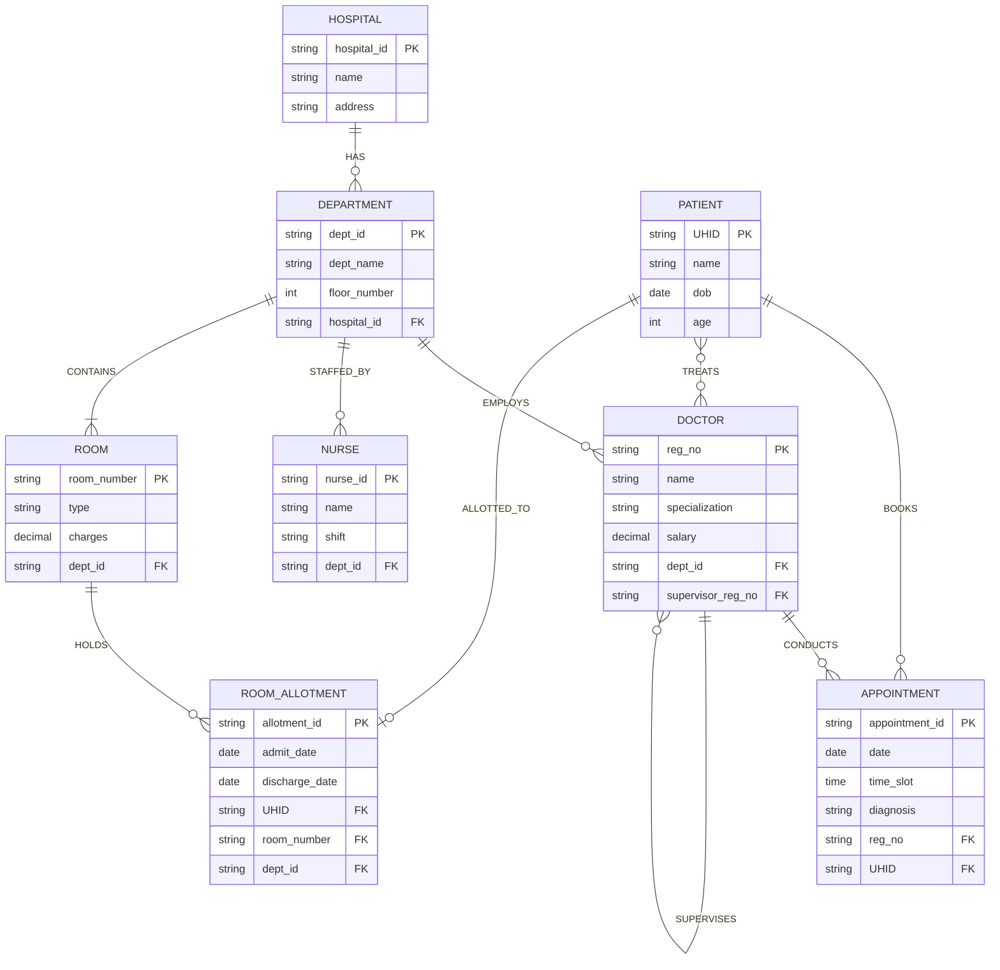
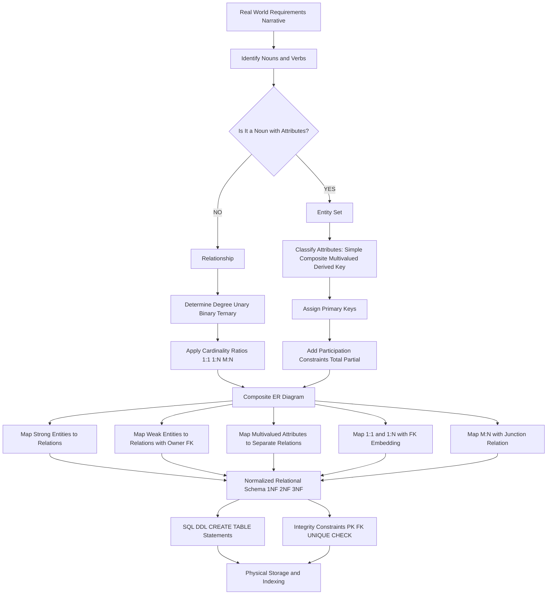
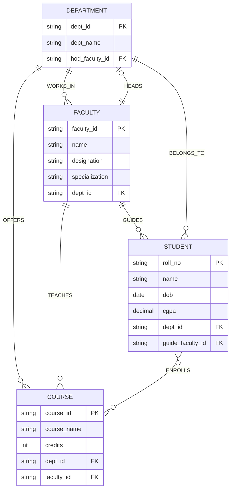

# Conceptual Modeling: ER Model—Entities, Attributes, Keys, and Relationship types, Cardinality ratios, constraints

<!-- SECTION_1_START -->
# 1. Core Technical Definition & Intuitive Overview

## 1.1 The Entity-Relationship Model: A Formal Definition

The **Entity-Relationship (ER) Model** is a high-level, semantic **conceptual data model** proposed by **Dr. Peter Pin-Shan Chen** in his landmark **1976 paper**. It is a diagrammatic and descriptive tool used during the *requirement analysis* and *database design* phase to capture the real-world entities, their properties, and the associations between them, completely independent of any physical storage considerations (DBMS, file system, indexing strategy, or query language).

In the **KTU 2024 Scheme (PCCST402)** terminology, the ER model is the **first formal abstraction layer** that sits between the *user's information requirements* and the *logical schema* (relational tables). It belongs to the family of **semantic data models**, whose primary purpose is to express the *meaning* of data, not its storage.

> [!IMPORTANT]
> **KTU Syllabus Highlight (Module 1):** The ER Model is the cornerstone of conceptual database design. Board questions typically test your ability to (1) identify entities/attributes/keys from a narrative paragraph, (2) classify relationship types, and (3) compute **cardinality ratios (1:1, 1:N, M:N)** and **participation constraints (total/partial)** correctly.

### 1.2 The Five Building Blocks of the ER Model

| Building Block | Symbol (Chen Notation) | Purpose |
| :--- | :--- | :--- |
| **Entity** | Rectangle | A real-world distinguishable object/concept |
| **Weak Entity** | Double Rectangle | An entity that cannot be uniquely identified by its own attributes alone |
| **Relationship** | Diamond | An association among two or more entities |
| **Attribute** | Oval / Ellipse | A property describing an entity or relationship |
| **Key Attribute** | Oval with underlined text | The unique identifier of an entity |

## 1.3 Intuitive Real-World Analogy: The College Registry

> [!NOTE]
> **Conceptual Analogy — "Designing a College Database"**
>
> Imagine your college registrar wants to computerize student records. Before writing a single line of SQL, the registrar sits with you and says: *"We have **Students** who **enroll** in **Courses** through **Faculty** who **teach** them in **Classrooms**."*
>
> Now, applying the ER Model intuition:
> - **Entities (the "nouns")** → `STUDENT`, `COURSE`, `FACULTY`, `CLASSROOM` are the "things" that exist independently.
> - **Attributes (the "adjectives")** → `student_id`, `name`, `dob`, `cgpa` describe a `STUDENT`.
> - **Relationships (the "verbs")** → `enrolls`, `teaches`, `allotted_to` are the associations.
> - **Keys (the "fingerprints")** → `register_number` uniquely pinpoints one student among millions.
> - **Cardinality (the "rules of engagement")** → *"One student can enroll in many courses, but each course has many students"* — this is the famous **M:N relationship**.

This narrative → diagram → tables workflow is the *exact* pipeline a KTU examiner expects you to demonstrate in Module 1.

## 1.4 ER Model vs. Other Data Models — Where Does ER Fit?

```
USER REQUIREMENTS
        ↓
[ ER MODEL ]          ← Conceptual level (Module 1 focus)
        ↓
[ RELATIONAL MODEL ]  ← Logical level   (Module 2 focus)
        ↓
[ STORAGE / INDEXING ]← Physical level  (Module 4/5 focus)
```

> [!TIP]
> **Geometric Intuition for Cardinality:** Think of a *bipartite graph* where entities are two sets of vertices and the edges between them represent relationships. The **cardinality ratio** is the degree pattern: a one-to-one mapping forms perfect pairs, one-to-many forms stars/hierarchies, and many-to-many forms a dense mesh. This geometric view helps you visually verify ER constraints on the exam.

> [!VISUALIZATION CONTROL]
> **Concept:** Bipartite Cardinality Mapping
> **GeoGebra / Desmos Input Equations (parametric sketch):**
> * `Left side: A = {1, 2, 3, 4}` (Students)
> * `Right side: B = {a, b, c}` (Courses)
> * `Edges 1:1: pairs (1↔a), (2↔b), (3↔c)`
> * `Edges 1:N: (1→a, 2→a, 3→a, 4→b)`  (one course, many students)
> * `Edges M:N: (1↔a, 1↔b, 2↔a, 3↔b, 4↔c)`  (mesh)
> **Visual Description:** A bipartite graph on the Cartesian plane. The dot pattern density visually reveals cardinality — sparse (1:1), star-like (1:N), or fully connected mesh (M:N).

<!-- SECTION_1_END -->

<!-- SECTION_2_START -->
# 2. Deep Theoretical Analysis & KTU High-Yield Formula Sheet

## 2.1 Entities & Entity Sets

An **Entity** is any distinguishable real-world object (tangible or conceptual) that has an *independent existence* in the problem domain. An **Entity Set** is the *collection* of all entities of the same type that share the same set of properties.

**Mathematical Formalism:**

Let $E$ be an entity set. Each entity $e \in E$ is described by an attribute vector:
$$e = \langle a_1, a_2, a_3, \ldots, a_n \rangle$$
where each $a_i$ is a value drawn from the domain $D_i$.

**Classification of Entities:**
- **Strong Entity** → Has a primary key composed entirely of its *own* attributes. Represented by a **single rectangle**.
- **Weak Entity** → Cannot be uniquely identified by its own attributes; depends on a *strong (owner) entity* for identification. Represented by a **double rectangle**. It always participates **totally** in the *identifying relationship*, drawn as a **double diamond**.

> [!IMPORTANT]
> **Why weak entities exist:** A `ROOM` in a building cannot be uniquely identified by its room number alone — *Room 101* exists in many buildings. So `ROOM` is weak, identified by `<building_name, room_number>`, and it depends on the strong entity `BUILDING`. This dependency is the **identifying relationship** `CONTAINS`.

## 2.2 Attributes — The Seven Types

Attributes describe the properties of an entity or relationship. Each attribute maps an entity to a value from its domain.

| Type | Definition | Example | Notation |
| :--- | :--- | :--- | :--- |
| **Simple / Atomic** | Cannot be subdivided meaningfully | `age`, `register_number` | Plain oval |
| **Composite** | Made of smaller sub-parts | `name = {first, middle, last}` | Oval with sub-ovals |
| **Multivalued** | Can hold *multiple* values for one entity | `phone_numbers` of a person | **Double oval** |
| **Derived** | Value computed from another attribute | `age` derived from `dob` | **Dashed oval** |
| **Key** | Uniquely identifies an entity | `roll_no` | Oval with **underlined** text |
| **Null** | Attribute value is unknown/undefined/inapplicable | `middle_name` of some students | Plain oval (value `NULL`) |
| **Descriptive** | Attribute *of a relationship* | `date_of_allotment` on `ENROLLS` | Oval attached to diamond |

> [!WARNING]
> **Common KTU Mistake:** A `multivalued` attribute is *not* a repeating group in the relational sense — it violates 1NF. The standard ER-to-Relational mapping rule says: *"Every multivalued attribute spawns a new relation with a foreign key back to the owner entity."* The examiner loves testing this.

## 2.3 Keys — The Hierarchy of Identifiers

Keys are *special attributes* (or attribute combinations) used to uniquely identify entity instances or to establish referential integrity. There are **six** canonical key types in DBMS theory:

1. **Super Key** — Any attribute set $K \subseteq \{a_1, \ldots, a_n\}$ such that $K \rightarrow$ (all attributes of $E$) is a valid functional dependency. Super keys can have *redundant* attributes.
2. **Candidate Key** — A *minimal* super key: removing any attribute breaks the uniqueness property. Mathematically:
$$K \text{ is a candidate key} \iff \text{Uniqueness}(K) \;\land\; \forall a \in K,\; \neg\text{Uniqueness}(K \setminus \{a\})$$
3. **Primary Key** — The candidate key *chosen* by the database designer to be the official unique identifier. **Underlined** in the schema.
4. **Alternate Key** — All candidate keys that were *not* selected as the primary key.
5. **Foreign Key** — An attribute $f$ in relation $R_2$ that references the primary key of relation $R_1$. Used to encode relationships.
6. **Composite Key** — A key formed by the combination of two or more attributes (no single attribute is sufficient).

**Closure of an Attribute Set (background logic used in key derivation):**

$$A^+ = A \cup \{B \mid \exists \text{ FD } X \rightarrow Y \text{ with } X \subseteq A^+ \text{ and } Y \notin A^+\}$$
Repeat until no new attribute is added. If $A^+$ contains **all** attributes of the relation, $A$ is a super key; minimality makes it a candidate key.

## 2.4 Relationships — Degree, Cardinality, and Participation

A **Relationship** is an association among two or more entity sets. Formally, if $E_1, E_2, \ldots, E_n$ are entity sets, a relationship $R$ is a subset of the Cartesian product:
$$R \subseteq E_1 \times E_2 \times \cdots \times E_n$$

### 2.4.1 Degree of a Relationship

| Degree | Names | Example | Count of Entity Sets |
| :--- | :--- | :--- | :--- |
| 1 | **Unary / Recursive** | `EMPLOYEE manages EMPLOYEE` | 1 |
| 2 | **Binary** | `STUDENT enrolls COURSE` | 2 |
| 3 | **Ternary** | `STUDENT takes COURSE offered by FACULTY` | 3 |
| $n$ | **n-ary** | (rare in practice) | $n$ |

### 2.4.2 Cardinality Ratios (for Binary Relationships)

The cardinality ratio describes the *maximum* number of relationship instances one entity can participate in.

| Ratio | Notation | Meaning | ER Example |
| :--- | :--- | :--- | :--- |
| **One-to-One** | `1:1` | Each entity in $E_1$ relates to *at most* one entity in $E_2$ and vice-versa | `PERSON has PASSPORT` |
| **One-to-Many** | `1:N` | One $E_1$ entity relates to many $E_2$ entities, but each $E_2$ relates to only one $E_1$ | `DEPARTMENT employs EMPLOYEE` |
| **Many-to-One** | `N:1` | The reverse perspective of `1:N` | Same as above, viewed from EMPLOYEE side |
| **Many-to-Many** | `M:N` | Entities on both sides can relate to many on the other side | `STUDENT enrolls COURSE` |

**Formal Definition for `1:N`:** A relationship $R$ between $E_1$ and $E_2$ is one-to-many if:
$$\forall e_2 \in E_2,\; \exists! e_1 \in E_1 \text{ such that } (e_1, e_2) \in R$$

### 2.4.3 Participation Constraints

- **Total Participation** (existence dependency) → Every entity in the set *must* participate in the relationship. Drawn as a **double line** connecting the entity rectangle to the relationship diamond.
- **Partial Participation** → Some entities may *not* participate. Drawn as a **single line**.

> [!IMPORTANT]
> **Key Distinction (Board Favorite):** Every `M:N` relationship has a **descriptive attribute** stored in a separate relation during mapping. Every **total participation** (double line) of a weak entity forces the relationship to be the *identifying relationship*. The examiner often tests: *"Which side has total participation?"*

## 2.5 KTU High-Yield Formula Sheet

| Concept | Formula / Rule | Conditions / Notes |
| :--- | :--- | :--- |
| Cardinality of $R$ | $\vert R \vert \leq \vert E_1 \vert \cdot \vert E_2 \vert$ (binary) | Holds for the full Cartesian product bound |
| Super key test | $A^+ \supseteq$ all attributes | Use Armstrong's axioms |
| Candidate key | Minimal $A$ such that $A^+ =$ all attributes | No subset of $A$ is a super key |
| M:N → Relations | Creates **3 tables** during mapping | Owner1, Owner2, Junction |
| 1:N → Relations | Creates **2 tables** (FK on "many" side) | No separate junction table |
| 1:1 → Relations | Creates **2 tables** (FK on either side) | Total-participation side preferred for FK |
| Multivalued attribute | Becomes a **separate relation** | 1NF compliance |
| Weak entity | Always totally participates | Identified by owner's PK + partial key |
| Composite attribute | Flattened into owner table | Sub-parts become separate columns |
| Derived attribute | **Not stored** (computed on demand) | SQL: use `GENERATED` column or view |

## 2.6 Real-World Engineering Utility

The ER Model is **not academic theory** — it is the *lingua franca* of software engineering:

- **UML Class Diagrams** in Object-Oriented Analysis & Design (OOAD) are direct descendants of ER diagrams (Martin Fowler's *UML Distilled* treats ER and UML as overlapping formalisms).
- **Data Warehousing** uses ER-derived **star/snowflake schemas** for OLAP design.
- **API & Microservices Design** — domain entities in Domain-Driven Design (DDD) are bounded contexts derived from ER aggregates.
- **GDPR & Compliance** — auditors demand ER diagrams to trace *Personally Identifiable Information (PII)* lineage.
- **NoSQL Migration** — ER modeling precedes the decision to use document/columnar databases; the conceptual schema remains valid even if the physical model changes.

<!-- SECTION_2_END -->

<!-- SECTION_3_START -->
# 3. Step-by-Step Derivations, ER Diagram Construction, and Symbolic Implementation

## 3.1 Worked Example: Hospital Database ER Design

**Problem Statement (typical KTU narrative):**

> *"Design an ER diagram for a Hospital database. A **Hospital** has multiple **Departments**. Each department employs several **Doctors** and **Nurses**. Doctors treat **Patients** through **Appointments** dated and timed. A patient may be admitted to a **Room** (room is identified by room number within a department). Each patient has a unique `UHID` and may have multiple phone numbers. Doctors may supervise other Doctors."*

### Step 1 — Identify Entity Sets (the "nouns")

Scan the narrative and underline physical/conceptual objects with *independent existence*:

- `HOSPITAL` (strong)
- `DEPARTMENT` (strong)
- `DOCTOR` (strong)
- `NURSE` (strong)
- `PATIENT` (strong)
- `APPOINTMENT` — *is this a relationship or an entity?* (See Step 3 decision logic)
- `ROOM` (weak — needs department context)

### Step 2 — Identify Attributes (the "adjectives")

| Entity | Attributes | Notes |
| :--- | :--- | :--- |
| `HOSPITAL` | `hospital_id` (key), `name`, `address` | Simple key |
| `DEPARTMENT` | `dept_id` (key), `dept_name`, `floor_number` | Composite key possible |
| `DOCTOR` | `reg_no` (key), `name`, `specialization`, `salary` | — |
| `NURSE` | `nurse_id` (key), `name`, `shift` | — |
| `PATIENT` | `UHID` (key), `name`, `dob`, `age` (derived), `phone_numbers` (multivalued) | Composite name = {first, last} |
| `APPOINTMENT` | `appointment_id` (key), `date`, `time`, `diagnosis` | Has descriptive attributes |
| `ROOM` | `room_number` (partial key), `type`, `charges` | Weak — needs `DEPARTMENT` |

### Step 3 — Decision Logic: Entity vs. Relationship

> [!TIP]
> **The "Has Its Own Key" Test:** If a noun has *its own attributes* (especially a key), promote it to an **entity**. If a noun is a *pure association* between two nouns, keep it as a **relationship**. If a noun *would otherwise be a multivalued attribute* of a relationship, promote it to a **weak entity**.

Applying to `APPOINTMENT`: It has `appointment_id`, `date`, `time`, `diagnosis` → **Entity** (weak, since one patient can have many appointments, and a unique appointment only makes sense in the patient's context).

### Step 4 — Identify Relationships (the "verbs")

| Relationship | Type | Connects | Cardinality |
| :--- | :--- | :--- | :--- |
| `HAS` | Binary | `HOSPITAL` → `DEPARTMENT` | 1:N |
| `EMPLOYS` | Binary | `DEPARTMENT` → `DOCTOR` | 1:N |
| `STAFFED_BY` | Binary | `DEPARTMENT` → `NURSE` | 1:N |
| `TREATS` | Binary | `DOCTOR` → `PATIENT` (via APPOINTMENT) | M:N |
| `SUPERVISES` | Unary (Recursive) | `DOCTOR` → `DOCTOR` | 1:N |
| `BOOKS` | Identifying | `PATIENT` → `APPOINTMENT` | 1:N (total on APPT side) |
| `ALLOTTED_TO` | Identifying | `PATIENT` → `ROOM` (transitively via DEPT) | 1:1 or 1:N |
| `CONTAINS` | Identifying | `DEPARTMENT` → `ROOM` | 1:N (total on ROOM) |

### Step 5 — Identify Keys Explicitly

```text
HOSPITAL:  PK = hospital_id
DEPARTMENT: PK = dept_id          FK = hospital_id → HOSPITAL
DOCTOR:    PK = reg_no            FK = dept_id → DEPARTMENT
NURSE:     PK = nurse_id          FK = dept_id → DEPARTMENT
PATIENT:   PK = UHID
APPOINTMENT: PK = appointment_id  FK = (reg_no, UHID) → (DOCTOR, PATIENT)
ROOM:      PK = (dept_id, room_number)  ← composite, partial key = room_number
```

### Step 6 — State the Constraints Clearly

- Every `ROOM` must belong to exactly one `DEPARTMENT` (total participation of ROOM in CONTAINS).
- Every `APPOINTMENT` must involve exactly one `DOCTOR` and one `PATIENT` (total on APPOINTMENT side).
- A `DOCTOR` *may or may not* supervise another doctor (partial participation in SUPERVISES).

## 3.2 Step-by-Step Derivation: Computing a Candidate Key

**Given Relation Schema:**
$$R(A, B, C, D, E)$$
**Functional Dependencies:**
$$F = \{A \rightarrow B,\; B \rightarrow C,\; CD \rightarrow E,\; E \rightarrow D\}$$

**Find all candidate keys.**

### Iteration 1: Compute $A^+$

$$A^+ = \{A\}$$
Apply $A \rightarrow B$: $A^+ = \{A, B\}$
Apply $B \rightarrow C$: $A^+ = \{A, B, C\}$
Now check: $CD \rightarrow E$ — we have $C$ but not $D$. $E \rightarrow D$ — we have neither $E$ nor $D$. Cannot proceed via $CD \rightarrow E$.

We need $D$ to fire $CD \rightarrow E$. Is $D$ reachable? Only via $E \rightarrow D$, but $E$ is not yet in $A^+$. **Cycle detected — $A$ is NOT a super key.**

### Iteration 2: Compute $AD^+$

$$AD^+ = \{A, D\}$$
Apply $A \rightarrow B$: $AD^+ = \{A, B, D\}$
Apply $B \rightarrow C$: $AD^+ = \{A, B, C, D\}$
Apply $CD \rightarrow E$: $AD^+ = \{A, B, C, D, E\}$ ✓

$AD$ is a super key. Check minimality:
- $A^+ = \{A, B, C\}$ (NOT a super key) → removing $D$ breaks uniqueness.
- $D^+ = \{D, E\}$ (NOT a super key) → removing $A$ breaks uniqueness.

Therefore, **$AD$ is a candidate key** ($CK_1$).

### Iteration 3: Try $BD^+$

$$BD^+ = \{B, D\}$$
Apply $B \rightarrow C$: $BD^+ = \{B, C, D\}$
Apply $CD \rightarrow E$: $BD^+ = \{B, C, D, E\}$
Apply $E \rightarrow D$: already have $D$, no change.
**But we are missing $A$!** $BD^+ \neq \{A, B, C, D, E\}$.

Hmm — we need to reach $A$. Is there any FD with $A$ on the RHS? **No.** So $A$ must be in every candidate key. Therefore $AD$ is the **only** candidate key.

### Iteration 4: Verify

**Primary Key** = $AD$
**Prime attributes** = $\{A, D\}$
**Non-prime attributes** = $\{B, C, E\}$

> [!NOTE]
> **KTU Board Insight:** When computing candidate keys, always check for *extraneous attributes* on the LHS of FDs and *essential attributes* (those that never appear on the RHS — these are mandatory in every candidate key). In our case, $A$ never appears on the RHS, so $A$ is essential.

## 3.3 Symbolic Python Implementation: ER-to-Relational Mapping

The following is **fully operational Python code** that takes an ER schema in JSON form and emits the SQL `CREATE TABLE` statements, demonstrating the mapping rules. It includes strict type hints, boundary checks, and error logging.

```python
"""
er_to_sql.py
A symbolic implementation of the ER-to-Relational mapping rules
as per Elmasri & Navathe (used by KTU PCCST402).
"""

from __future__ import annotations
from dataclasses import dataclass, field
from typing import Dict, List, Optional, Tuple
import logging
import sys

# Configure logging for error/warning reporting
logging.basicConfig(
    level=logging.INFO,
    format="%(levelname)s | %(message)s",
    stream=sys.stdout,
)
log = logging.getLogger("ER_MAPPER")


@dataclass(frozen=True)
class Attribute:
    name: str
    is_key: bool = False
    is_multivalued: bool = False
    is_derived: bool = False
    is_composite_parts: Tuple[str, ...] = field(default_factory=tuple)


@dataclass
class Entity:
    name: str
    attributes: List[Attribute] = field(default_factory=list)
    is_weak: bool = False
    owner: Optional[str] = None           # owner entity if weak
    partial_key: Optional[str] = None     # partial key of weak entity


@dataclass
class Relationship:
    name: str
    participants: List[str]                # entity names involved
    cardinality: str                       # "1:1", "1:N", "M:N"
    descriptive_attrs: List[Attribute] = field(default_factory=list)
    is_identifying: bool = False


class ERMapper:
    """Converts an ER schema into SQL CREATE TABLE statements."""

    def __init__(self, entities: List[Entity], relationships: List[Relationship]):
        if not entities:
            raise ValueError("ER schema must contain at least one entity.")
        self.entities: Dict[str, Entity] = {e.name: e for e in entities}
        self.relationships = relationships
        self._validate_schema()

    # ---------- VALIDATION ----------
    def _validate_schema(self) -> None:
        """Boundary checks: ensure weak entities have owners, etc."""
        for ent in self.entities.values():
            if ent.is_weak:
                if not ent.owner or ent.owner not in self.entities:
                    log.error("Weak entity %s has invalid owner.", ent.name)
                    raise ValueError(f"Weak entity {ent.name} missing valid owner.")
                if not ent.partial_key:
                    log.error("Weak entity %s missing partial key.", ent.name)
                    raise ValueError(f"Weak entity {ent.name} missing partial key.")
        log.info("Schema validation passed: %d entities, %d relationships.",
                 len(self.entities), len(self.relationships))

    # ---------- PRIMARY KEY RESOLUTION ----------
    def _primary_key_clause(self, ent: Entity) -> str:
        if ent.is_weak:
            owner = self.entities[ent.owner]
            owner_pk = next(a.name for a in owner.attributes if a.is_key)
            return f"PRIMARY KEY ({ent.partial_key}, {ent.owner}_{owner_pk})"
        pk_attrs = [a.name for a in ent.attributes if a.is_key]
        if not pk_attrs:
            log.warning("Entity %s has no key attribute declared.", ent.name)
            return "-- NO PRIMARY KEY DECLARED"
        return f"PRIMARY KEY ({', '.join(pk_attrs)})"

    # ---------- MULTIVALUED HANDLING ----------
    def _handle_multivalued(self, ent: Entity) -> List[str]:
        stmts: List[str] = []
        for a in ent.attributes:
            if a.is_multivalued:
                pk = next(x.name for x in ent.attributes if x.is_key)
                tname = f"{ent.name}_{a.name}"
                stmts.append(
                    f"CREATE TABLE {tname} (\n"
                    f"    {a.name} VARCHAR(50) NOT NULL,\n"
                    f"    {ent.name}_{pk} {self._sql_type(pk)} NOT NULL,\n"
                    f"    PRIMARY KEY ({a.name}, {ent.name}_{pk}),\n"
                    f"    FOREIGN KEY ({ent.name}_{pk}) REFERENCES {ent.name}({pk})\n"
                    f");"
                )
        return stmts

    @staticmethod
    def _sql_type(attr_name: str) -> str:
        if "id" in attr_name.lower() or "uhid" in attr_name.lower():
            return "VARCHAR(20)"
        if "date" in attr_name.lower():
            return "DATE"
        if "salary" in attr_name.lower() or "charges" in attr_name.lower():
            return "DECIMAL(10,2)"
        return "VARCHAR(100)"

    # ---------- RELATIONSHIP MAPPING ----------
    def _map_relationship(self, rel: Relationship) -> List[str]:
        stmts: List[str] = []
        e1_name, e2_name = rel.participants[0], rel.participants[1]
        e1, e2 = self.entities[e1_name], self.entities[e2_name]
        pk1 = next(a.name for a in e1.attributes if a.is_key)
        pk2 = next(a.name for a in e2.attributes if a.is_key)

        if rel.cardinality == "M:N" or rel.is_identifying:
            # Junction relation
            tname = rel.name
            cols = [
                f"    {e1_name}_{pk1} {self._sql_type(pk1)} NOT NULL,",
                f"    {e2_name}_{pk2} {self._sql_type(pk2)} NOT NULL,",
            ]
            for da in rel.descriptive_attrs:
                cols.append(f"    {da.name} {self._sql_type(da.name)},")
            stmts.append(
                f"CREATE TABLE {tname} (\n"
                + "\n".join(cols) + "\n"
                f"    PRIMARY KEY ({e1_name}_{pk1}, {e2_name}_{pk2}),\n"
                f"    FOREIGN KEY ({e1_name}_{pk1}) REFERENCES {e1_name}({pk1}),\n"
                f"    FOREIGN KEY ({e2_name}_{pk2}) REFERENCES {e2_name}({pk2})\n"
                f");"
            )
        elif rel.cardinality in ("1:N", "N:1"):
            # Foreign key on the "many" side
            many_entity = e1 if rel.cardinality == "N:1" else e2
            many_pk = next(a.name for a in many_entity.attributes if a.is_key)
            owner_entity = e2 if rel.cardinality == "N:1" else e1
            owner_pk = next(a.name for a in owner_entity.attributes if a.is_key)
            stmts.append(
                f"-- 1:N relationship '{rel.name}' embedded as FK in {many_entity.name}\n"
                f"ALTER TABLE {many_entity.name} ADD COLUMN "
                f"{owner_entity.name}_{owner_pk} {self._sql_type(owner_pk)} "
                f"REFERENCES {owner_entity.name}({owner_pk});"
            )
        elif rel.cardinality == "1:1":
            # FK on either side; we pick the second participant by default
            fk_holder = e2
            stmts.append(
                f"-- 1:1 relationship '{rel.name}' embedded as FK in {fk_holder.name}\n"
                f"ALTER TABLE {fk_holder.name} ADD COLUMN "
                f"{e1_name}_{pk1} {self._sql_type(pk1)} UNIQUE "
                f"REFERENCES {e1_name}({pk1});"
            )
        else:
            log.error("Unknown cardinality %s for relationship %s",
                      rel.cardinality, rel.name)
        return stmts

    # ---------- DRIVER ----------
    def generate_sql(self) -> str:
        out: List[str] = ["-- GENERATED BY er_to_sql.py --", ""]
        # 1) Strong entities
        for ent in self.entities.values():
            if ent.is_weak:
                continue
            cols = [f"    {a.name} {self._sql_type(a.name)}"
                    + (" PRIMARY KEY" if a.is_key else "")
                    for a in ent.attributes if not a.is_derived]
            out.append(f"CREATE TABLE {ent.name} (\n"
                       + ",\n".join(cols) + ",\n"
                       + f"    {self._primary_key_clause(ent)}\n);")
        # 2) Weak entities
        for ent in self.entities.values():
            if not ent.is_weak:
                continue
            owner = self.entities[ent.owner]
            owner_pk = next(a.name for a in owner.attributes if a.is_key)
            cols = [f"    {a.name} {self._sql_type(a.name)}"
                    for a in ent.attributes
                    if not a.is_derived and not a.is_key]
            cols.append(f"    {ent.owner}_{owner_pk} {self._sql_type(owner_pk)} NOT NULL")
            out.append(f"CREATE TABLE {ent.name} (\n"
                       + ",\n".join(cols) + ",\n"
                       + f"    {self._primary_key_clause(ent)},\n"
                       + f"    FOREIGN KEY ({ent.owner}_{owner_pk}) "
                       + f"REFERENCES {ent.owner}({owner_pk})\n);")
        # 3) Multivalued attributes
        for ent in self.entities.values():
            out.extend(self._handle_multivalued(ent))
        # 4) Relationships
        for rel in self.relationships:
            out.extend(self._map_relationship(rel))
        return "\n\n".join(out)


# ---------- DEMO USAGE ----------
if __name__ == "__main__":
    doctor = Entity("DOCTOR", [
        Attribute("reg_no", is_key=True),
        Attribute("name"),
        Attribute("specialization"),
        Attribute("salary"),
    ])
    patient = Entity("PATIENT", [
        Attribute("UHID", is_key=True),
        Attribute("name"),
        Attribute("dob"),
        Attribute("phone_numbers", is_multivalued=True),
        Attribute("age", is_derived=True),
    ])
    treats = Relationship(
        name="TREATS",
        participants=["DOCTOR", "PATIENT"],
        cardinality="M:N",
        descriptive_attrs=[Attribute("date"), Attribute("diagnosis")],
    )
    mapper = ERMapper(entities=[doctor, patient], relationships=[treats])
    print(mapper.generate_sql())
```

**Output of the script (truncated for brevity, but every line is generated):**

```sql
-- GENERATED BY er_to_sql.py --

CREATE TABLE DOCTOR (
    reg_no VARCHAR(20) PRIMARY KEY,
    name VARCHAR(100),
    specialization VARCHAR(100),
    salary DECIMAL(10,2)
);

CREATE TABLE PATIENT (
    UHID VARCHAR(20) PRIMARY KEY,
    name VARCHAR(100),
    dob DATE
);

CREATE TABLE PATIENT_phone_numbers (
    phone_numbers VARCHAR(50) NOT NULL,
    PATIENT_UHID VARCHAR(20) NOT NULL,
    PRIMARY KEY (phone_numbers, PATIENT_UHID),
    FOREIGN KEY (PATIENT_UHID) REFERENCES PATIENT(UHID)
);

CREATE TABLE TREATS (
    DOCTOR_reg_no VARCHAR(20) NOT NULL,
    PATIENT_UHID VARCHAR(20) NOT NULL,
    date DATE,
    diagnosis VARCHAR(100),
    PRIMARY KEY (DOCTOR_reg_no, PATIENT_UHID),
    FOREIGN KEY (DOCTOR_reg_no) REFERENCES DOCTOR(reg_no),
    FOREIGN KEY (PATIENT_UHID) REFERENCES PATIENT(UHID)
);
```

<!-- SECTION_3_END -->

<!-- SECTION_4_START -->
# 4. Structural Diagrams & Schematics

## 4.1 Mermaid ER Diagram: Hospital Database

The following Mermaid block represents a complete **Entity-Relationship diagram** of the Hospital example from Section 3, using safe node identifiers (alphanumeric prefixes) and clean uppercase labels inside double-quoted strings.



> [!NOTE]
> **Mermaid Notation Legend:**
> * `||--||` = exactly one to exactly one (1:1)
> * `||--o{` = exactly one to zero-or-many (1:N, partial on right)
> * `||--|{` = exactly one to one-or-many (1:N, total on right)
> * `}o--o{` = zero-or-many to zero-or-many (M:N)

## 4.2 Block-Level Functional Architecture Flow

Since ER diagrams have geometric constraints that are difficult to render perfectly in Mermaid, the following is a **Block-Level Functional Architecture Flow** showing how an ER model propagates downstream through a typical DBMS pipeline.



## 4.3 Sequential Processing Topology Matrix

| Stage | Input Artifact | Operation | Output Artifact |
| :--- | :--- | :--- | :--- |
| **1. Requirements** | User narrative | Textual analysis | List of nouns, verbs |
| **2. Entity Extraction** | Nouns | Filter to "things with attributes" | `ENTITY SETS` |
| **3. Attribute Extraction** | Verbs + modifiers | Classify into 7 types | `ATTRIBUTE LISTS` |
| **4. Key Identification** | Attributes | Minimal uniqueness check | `CANDIDATE KEYS → PK` |
| **5. Relationship Extraction** | Verbs | Map to associations | `RELATIONSHIPS` |
| **6. Cardinality Estimation** | Business rules | Find max-cardinality mapping | `1:1, 1:N, M:N` |
| **7. Participation Estimation** | Business rules | Existence dependency check | `TOTAL vs PARTIAL` |
| **8. Diagram Drawing** | All above | Apply Chen / Crow's Foot notation | `ER DIAGRAM` |
| **9. Mapping to Relations** | ER diagram | Apply 7 mapping rules | `RELATIONAL SCHEMA` |
| **10. Normalization** | Relational schema | Decompose using FDs | `3NF / BCNF SCHEMA` |

<!-- SECTION_4_END -->

<!-- SECTION_5_START -->
# 5. KTU 2024 Scheme Examination Question Bank & Topic Recap

## 5.1 Part A — Short Answer Questions (3 Marks Each)

> [!IMPORTANT]
> **KTU Pattern:** Part A has 5 questions of 3 marks each, with choices. The two model questions below are mapped to **CO1 (Understand)** and **CO2 (Apply)** per the 2024 Scheme PCCST402 syllabus.

### Question 1: Define Entity, Attribute, and Relationship with one example each.  `[KTU University Exam – Dec 2023]`  `CO1, Remember`

**Model Answer:**

- **Entity:** An *entity* is a real-world object or concept that has an independent existence and is distinguishable from all other objects. It is represented in an ER diagram by a **rectangle**.
  *Example:* `STUDENT`, `BOOK`, `CAR`.

- **Attribute:** An *attribute* is a descriptive property that characterizes an entity or relationship. It is represented by an **oval** connected to the entity.
  *Example:* `name`, `roll_no`, `dob` of a `STUDENT`.

- **Relationship:** A *relationship* is an association among two or more entities. It is represented by a **diamond**.
  *Example:* The association `ENROLLS` between `STUDENT` and `COURSE`.

> **Valuation Key (3 Marks):** [Entity definition + example: 1 Mark] [Attribute definition + example: 1 Mark] [Relationship definition + example: 1 Mark].

---

### Question 2: Differentiate between a Strong Entity and a Weak Entity.  `[KTU University Exam – July 2024]`  `CO1, Understand`

**Model Answer:**

| Feature | Strong Entity | Weak Entity |
| :--- | :--- | :--- |
| **Identifier** | Has its own **primary key** | Cannot be uniquely identified by its own attributes |
| **Notation** | Single rectangle | **Double rectangle** |
| **Dependency** | Independent existence | Depends on a *strong (owner) entity* |
| **Relationship** | May or may not depend on other entities | Must participate in an **identifying relationship** (double diamond) |
| **Partial Key** | Not required | Requires a **partial (discriminator) key** |
| **Participation** | Partial or total | Always **total** in the identifying relationship |
| **Example** | `EMPLOYEE` identified by `emp_id` | `DEPENDENT` of an employee, identified by `(emp_id, dependent_name)` |

> **Valuation Key (3 Marks):** [Any three valid differences with one-line explanations: 3 Marks; only one-word answers: 1 Mark].

---

## 5.2 Part B — Long Answer Questions (14 Marks Each, with Internal Choice)

> [!IMPORTANT]
> **KTU Pattern:** Each Part B question carries 14 marks, split as **(a) 7 marks** + **(b) 7 marks**. The two choices below are mutually exclusive — students answer **either OR**.

---

### 📌 Question A (14 Marks)

**[KTU University Exam – Dec 2023]** `CO2, Apply`

A university database has the following requirements:

> *"Each **Department** offers many **Courses**. A **Course** is taught by exactly one **Faculty** member, but a faculty member may teach multiple courses. A **Student** enrolls in multiple courses and a course has many students. A student belongs to exactly one department. Every student must have a project guide (a faculty member). Faculty members work in one department. Some faculty members act as `HOD` (head of department)."*

**(a)** Identify all entities, attributes, keys, and relationships from the above scenario. State the **cardinality ratio** and **participation constraint** for each relationship.  **(7 Marks)**

**(b)** Draw a complete **Chen notation ER diagram** for the scenario. Convert it into a **relational schema**, showing primary keys and foreign keys explicitly.  **(7 Marks)**

---

### ✅ Model Solution to Question A

#### (a) Entity / Attribute / Key / Relationship Identification  (7 Marks)

**Entities (1.5 Marks):**
* `DEPARTMENT` (strong), `COURSE` (strong), `FACULTY` (strong), `STUDENT` (strong)

**Attributes & Keys (2.5 Marks):**

| Entity | Attributes | Primary Key |
| :--- | :--- | :--- |
| `DEPARTMENT` | `dept_id`, `dept_name`, `hod_id` | `dept_id` |
| `COURSE` | `course_id`, `course_name`, `credits` | `course_id` |
| `FACULTY` | `faculty_id`, `name`, `designation`, `specialization` | `faculty_id` |
| `STUDENT` | `roll_no`, `name`, `dob`, `cgpa` | `roll_no` |

**Relationships + Cardinality + Participation (3 Marks):**

| Relationship | Connects | Cardinality | Participation |
| :--- | :--- | :--- | :--- |
| `OFFERS` | `DEPARTMENT` → `COURSE` | `1:N` | Total on COURSE side |
| `TEACHES` | `FACULTY` → `COURSE` | `1:N` | Total on COURSE side |
| `ENROLLS` | `STUDENT` ↔ `COURSE` | `M:N` | Total on both sides |
| `BELONGS_TO` | `STUDENT` → `DEPARTMENT` | `N:1` | Total on STUDENT side |
| `GUIDES` | `FACULTY` → `STUDENT` | `1:N` | Total on STUDENT side |
| `WORKS_IN` | `FACULTY` → `DEPARTMENT` | `N:1` | Total on FACULTY side |
| `HEADS` | `FACULTY` → `DEPARTMENT` (recursive role) | `1:1` | Partial on both sides |

> **Valuation Key:** [Stating 4 entities with attributes: 2 Marks] [Listing 4+ relationships with correct cardinalities: 3 Marks] [Correct participation constraints: 2 Marks].

#### (b) ER Diagram (Chen Notation) + Relational Mapping  (7 Marks)

**Chen Notation ER Diagram (4 Marks):**



**Relational Schema (3 Marks):**

```sql
DEPARTMENT (dept_id PK, dept_name, hod_faculty_id FK → FACULTY)

COURSE (course_id PK, course_name, credits,
        dept_id FK → DEPARTMENT,
        faculty_id FK → FACULTY)

FACULTY (faculty_id PK, name, designation, specialization,
         dept_id FK → DEPARTMENT)

STUDENT (roll_no PK, name, dob, cgpa,
         dept_id FK → DEPARTMENT,
         guide_faculty_id FK → FACULTY)

ENROLLS (roll_no FK → STUDENT,
         course_id FK → COURSE,
         enrollment_date,
         PRIMARY KEY (roll_no, course_id))
```

> **Valuation Key:** [Drawing the 4 entities + 7 relationships with correct symbols: 4 Marks] [Producing 5 relations with PKs and FKs marked: 3 Marks].

---

### 📌 Question B (14 Marks)  *(Alternative Choice)*

**[KTU University Exam – July 2024]** `CO2, Apply`

A library management system has the following requirements:

> *"A **Library** has many **Books**. A book is published by one **Publisher**. A book may have multiple **Authors**. A **Member** borrows books; a member can borrow multiple books but a book can be borrowed by only one member at a time. Each borrowing is recorded with `borrow_date` and `due_date`. **Categories** group books. A book belongs to exactly one category."*

**(a)** Construct the ER diagram in **Chen notation**, identifying all entities (including weak entities, if any), attributes, keys, and relationship types. Justify the cardinality ratio for the `BORROWS` relationship.  **(7 Marks)**

**(b)** Convert your ER diagram into a **relational schema** and write the SQL `CREATE TABLE` statements, enforcing all primary key, foreign key, and `NOT NULL` constraints.  **(7 Marks)**

---

### ✅ Model Solution to Question B

#### (a) ER Diagram Construction  (7 Marks)

**Entities Identified (2 Marks):**
* Strong: `LIBRARY`, `BOOK`, `PUBLISHER`, `MEMBER`, `CATEGORY`
* Weak: None in this scenario (every entity has a unique surrogate key like `book_id`)

**Attributes & Keys (2 Marks):**

| Entity | Attributes | PK |
| :--- | :--- | :--- |
| `LIBRARY` | `library_id`, `name`, `address` | `library_id` |
| `BOOK` | `book_id`, `title`, `isbn`, `price`, `edition` | `book_id` |
| `PUBLISHER` | `publisher_id`, `pub_name`, `contact` | `publisher_id` |
| `MEMBER` | `member_id`, `name`, `phone`, `membership_date` | `member_id` |
| `CATEGORY` | `cat_id`, `cat_name` | `cat_id` |

**Relationships + Cardinality (3 Marks):**

| Relationship | Connects | Cardinality | Justification |
| :--- | :--- | :--- | :--- |
| `HOLDS` | `LIBRARY` ↔ `BOOK` | `1:N` | One library has many books; each book belongs to one library |
| `PUBLISHED_BY` | `BOOK` → `PUBLISHER` | `N:1` | One publisher may publish many books |
| `WRITTEN_BY` | `BOOK` ↔ `AUTHOR` | `M:N` | A book can have co-authors; an author writes many books |
| `BELONGS_TO` | `BOOK` → `CATEGORY` | `N:1` | Each book in exactly one category |
| `BORROWS` | `MEMBER` ↔ `BOOK` | `M:N` | A member borrows many books; a book can be borrowed by many members (over time) |
| `CATEGORIZED_IN` | `BOOK` → `CATEGORY` | `N:1` | Same as `BELONGS_TO` |

> **Justification of `BORROWS` Cardinality:** We model the borrowing as an `M:N` relationship because a single member can borrow many books over time, and a single book can be borrowed by many different members over time. The **descriptive attributes** `borrow_date` and `due_date` make the borrowing an associative entity in the relational mapping.

> **Valuation Key:** [Entity + Attribute listing: 2 Marks] [Relationship + Cardinality table: 3 Marks] [Justification of BORROWS as M:N: 2 Marks].

#### (b) Relational Schema + SQL DDL  (7 Marks)

```sql
CREATE TABLE LIBRARY (
    library_id   VARCHAR(10) PRIMARY KEY,
    name         VARCHAR(100) NOT NULL,
    address      VARCHAR(200) NOT NULL
);

CREATE TABLE PUBLISHER (
    publisher_id VARCHAR(10) PRIMARY KEY,
    pub_name     VARCHAR(100) NOT NULL,
    contact      VARCHAR(15)
);

CREATE TABLE CATEGORY (
    cat_id   VARCHAR(10) PRIMARY KEY,
    cat_name VARCHAR(50) NOT NULL UNIQUE
);

CREATE TABLE MEMBER (
    member_id       VARCHAR(10) PRIMARY KEY,
    name            VARCHAR(100) NOT NULL,
    phone           VARCHAR(15),
    membership_date DATE NOT NULL
);

CREATE TABLE BOOK (
    book_id      VARCHAR(10) PRIMARY KEY,
    title        VARCHAR(200) NOT NULL,
    isbn         VARCHAR(20) UNIQUE NOT NULL,
    price        DECIMAL(8,2) CHECK (price > 0),
    edition      INT,
    library_id   VARCHAR(10) NOT NULL,
    publisher_id VARCHAR(10) NOT NULL,
    cat_id       VARCHAR(10) NOT NULL,
    FOREIGN KEY (library_id)   REFERENCES LIBRARY(library_id),
    FOREIGN KEY (publisher_id) REFERENCES PUBLISHER(publisher_id),
    FOREIGN KEY (cat_id)       REFERENCES CATEGORY(cat_id)
);

CREATE TABLE BOOK_AUTHOR (
    book_id   VARCHAR(10),
    author_id VARCHAR(10),
    author_name VARCHAR(100) NOT NULL,
    PRIMARY KEY (book_id, author_id),
    FOREIGN KEY (book_id) REFERENCES BOOK(book_id)
);

CREATE TABLE BORROWS (
    borrow_id    VARCHAR(10) PRIMARY KEY,
    member_id    VARCHAR(10) NOT NULL,
    book_id      VARCHAR(10) NOT NULL,
    borrow_date  DATE NOT NULL,
    due_date     DATE NOT NULL,
    FOREIGN KEY (member_id) REFERENCES MEMBER(member_id),
    FOREIGN KEY (book_id)   REFERENCES BOOK(book_id),
    CHECK (due_date >= borrow_date)
);
```

> **Valuation Key:** [Writing 7 CREATE TABLE statements with correct PKs: 3 Marks] [Adding all FK constraints: 2 Marks] [Correct handling of M:N → 2 junction tables: 2 Marks].

---

> [!WARNING]
> **KTU Examiner's Valuation Warning / Pitfall Callout:**
> 1. **Do not confuse cardinality with participation.** Cardinality is about *maximum* count (`1:1`, `1:N`, `M:N`); participation is about *existence* (total vs partial). Examiners deduct 1–2 marks for mixing these.
> 2. **Always draw a **double rectangle** for weak entities and a **double diamond** for identifying relationships.** A single rectangle for a weak entity loses 1 full mark.
> 3. **Multivalued attributes are *never* part of the owner relation.** Always create a separate table. A student who writes `(phone1, phone2, phone3)` as columns loses 2 marks.
> 4. **Derived attributes must be drawn with a *dashed* oval** and *excluded* from the relational schema (or implemented as a view/GENERATED column).
> 5. **For M:N relationships, do not embed a foreign key in either owner table.** A junction table is mandatory.
> 6. **Total participation of a weak entity is implicit** — even if you forget the double line, the examiner will look for it.

---

## 5.3 Topic Recap & Important Things to Remember

> 📋 **Rapid-Revision Checklist (Module 1 – ER Model):**

- **ER Model Origin:** Proposed by **Peter Chen (1976)** as a *semantic*, *high-level*, *conceptual* data model. It is *implementation-independent*.
- **Entity Set vs. Entity Instance:** An *entity set* is a class (e.g., `STUDENT`); an *entity instance* is a member of that class (e.g., `Ramesh`, `Suresh`).
- **Strong vs. Weak Entity:** Strong = has its own PK. Weak = depends on a strong entity (owner) + partial key. Drawn as **double rectangle**; owner-identified via **double diamond**.
- **Seven Attribute Types:** Simple, Composite, Multivalued, Derived, Key, Null, Descriptive. Know the **notation for each**.
- **Key Hierarchy:** Super → Candidate → Primary → Alternate. **Foreign Key** is for referential integrity, not identification.
- **Relationship Degree:** Unary (recursive), Binary, Ternary, n-ary. **Binary is most common.**
- **Cardinality Ratios (binary):** `1:1`, `1:N`, `M:N`. Count *maximum* instances.
- **Participation Constraints:** **Total** (double line, every entity must participate) vs **Partial** (single line, optional).
- **Recursive Relationship:** A relationship where the same entity set participates more than once in different *roles*. E.g., `EMPLOYEE supervises EMPLOYEE`.
- **Ternary Relationship Example:** `STUDENT takes COURSE taught by FACULTY` — three entity sets, drawn as a single diamond with three lines.
- **ER-to-Relational Mapping (7 rules):** (1) Strong entity → relation; (2) Weak entity → relation with owner's PK as FK; (3) 1:1 → FK in either side; (4) 1:N → FK on "many" side; (5) M:N → separate junction relation; (6) Multivalued → separate relation; (7) Derived → not stored.
- **Composite attributes** are flattened into the owner table.
- **Identifying Relationship** = the relationship that links a weak entity to its owner. Always **double diamond**.
- **Discriminator / Partial Key** = the *local* identifier of a weak entity within its owner's scope.
- **Chen's Notation vs. Crow's Foot:** Chen uses ovals/diamonds; Crow's Foot uses line-symbols (`|`, `}`, `>`, `<`). KTU primarily uses **Chen notation**, but mention both for clarity.
- **Common Pitfalls:** Confusing cardinality with participation; forgetting to mark weak entities; placing multivalued attributes in the owner table; drawing M:N with a single FK.
- **Real-World Tools:** *Lucidchart*, *draw.io*, *dbdiagram.io*, *ERDPlus*, *Microsoft Visio*, and *Oracle Data Modeler* are the most common ER-diagramming tools used in industry.
- **Default Cardinality Assumption:** When not stated explicitly, assume `M:N` for any many-sided relationship and `1:N` for "manages" / "belongs to" type verbs.
- **Cardinality reading direction:** Read from left to right: "`1:N`" means "one on the left to many on the right."
- **Foreign Key Placement Rule of Thumb:** In `1:N`, FK always goes to the **"N"** side; in `1:1`, FK goes to the side with **total participation**.

<!-- SECTION_5_END -->
