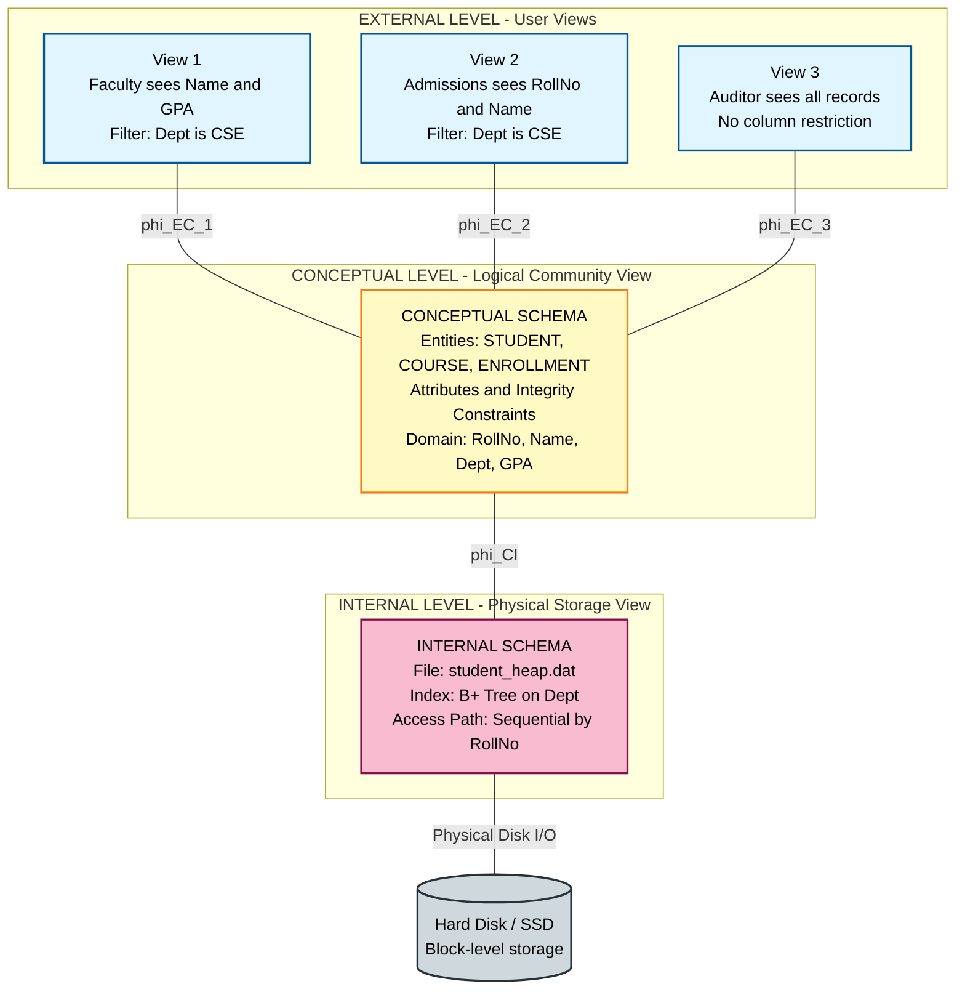
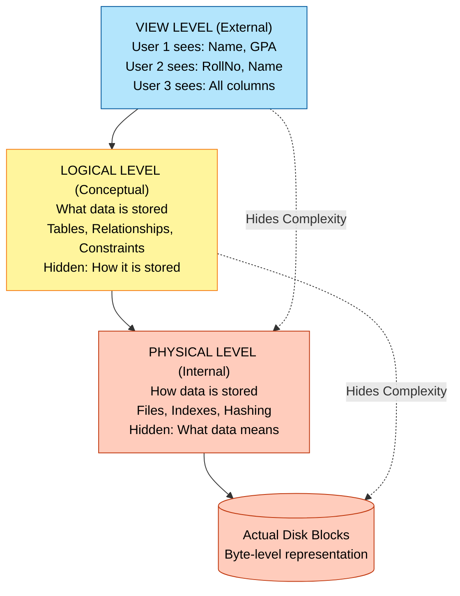
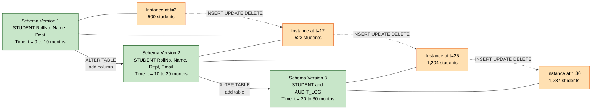
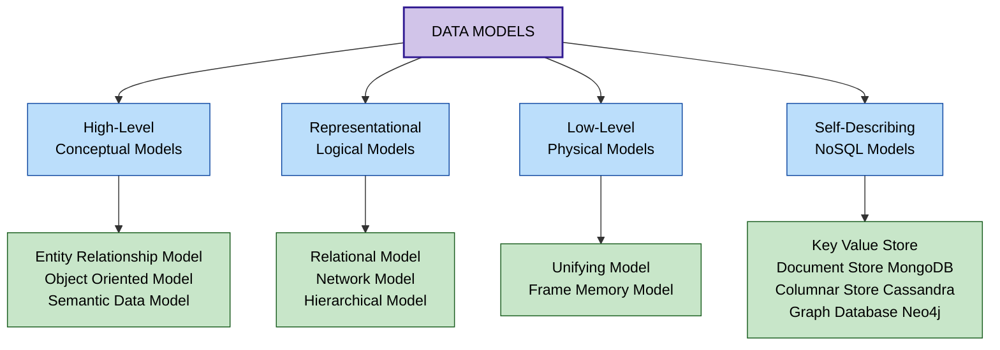

# Data Abstraction, Data Models, Schemas, Instances, and Three-Schema Architecture

<!-- SECTION_1_START -->
# Core Technical Definition & Intuitive Overview

> [!NOTE]
> **KTU 2024 Scheme Definition (Syllabus-Aligned)**
> In Database Management Systems, **Data Abstraction** is the process of hiding the complex physical storage details of data while exposing only the essential and relevant features to the user. It is achieved through **Data Models**, which provide a set of concepts, rules, and notation for describing data, its structure, and its constraints. A **Schema** is the structural blueprint (intension) of the entire database, while an **Instance** is the snapshot of the actual data (extension) stored in the database at a particular point in time. The **Three-Schema Architecture** (formally known as the **ANSI-SPARC Architecture**, 1975) decouples the external user view, the conceptual community view, and the internal physical view of a database to achieve **Data Independence**.

## 1.1 The Three Pillars of Database Abstraction

| # | Abstraction Level | What it Hides | What it Exposes | Audience |
|---|---|---|---|---|
| **1** | **Physical (Internal) Level** | Complex disk addressing, indexing algorithms, hashing, compression | Block-level storage layout, record formats, file paths | Database Administrators (DBA), System Software |
| **2** | **Logical (Conceptual) Level** | Storage mechanisms, physical block sizes, access paths | Tables, entities, attributes, relationships, integrity constraints | Database Designers, Architects |
| **3** | **View (External) Level** | Underlying tables, joins, security restrictions, complex SQL | Customized, partial, or aggregated user interfaces | End-Users, Application Programs |

## 1.2 Conceptual Analogy — The "Google Maps Layer Cake"

Imagine you are planning a road trip from **Kochi to Bengaluru**.

* **Physical Layer (Internals):** This is the raw, unrendered vector data — the actual binary satellite tiles stored in a Google data center in **The Dalles, Oregon** (lat **45.6862°N**, long **-121.1693°W**). You do not know the B-tree structure used to index these tiles, nor the JPEG-XL compression ratio. This is **transparent** to you.
* **Logical Layer (Conceptual):** This is the city-level map showing all roads, landmarks, and terrain. It represents the *complete* geographical reality, with correct topological relationships (e.g., "MG Road intersects with Marine Drive"). A cartographer maintains this.
* **View Layer (External):** This is your *personal* navigation screen showing only the blue highlighted route, the next 2 km, and your estimated arrival at **5:42 PM**. The rest of the world is grayed out. A delivery driver might see truck-restricted routes; a tourist might see only monuments.

> [!IMPORTANT]
> **The Database Engine's Golden Rule**
> A query written by a user at the **View Level** must be automatically translated by the DBMS into the equivalent operations at the **Logical Level**, and then again into the **Physical Level** — without the user ever being aware of the layers beneath. This automatic translation is what makes the database *self-describing* and *logically independent*.

## 1.3 Visualization of Schema Stability vs. Instance Volatility

> [!VISUALIZATION CONTROL]
> **Concept:** Visualizing the difference between a **Schema** (a stable structural blueprint) and an **Instance** (the volatile data stored inside the schema) over time.
>
> **Desmos Input Equations:**
>
> * Schema Function (Step Function — changes rarely): `y_{schema} = 1 + 2 \cdot \lfloor t / 10 \rfloor` for `0 \le t \le 30`
> * Instance Function (High-Frequency Oscillation — changes constantly): `y_{instance} = 5 + 2 \cdot \sin(2t) + 0.5 \cdot \sin(7t)`
> * Axis: `x \rightarrow` Time (months), `y \rightarrow` Database Volume (arbitrary units)
>
> **Visual Description:** On the coordinate plane, the **schema curve** appears as a flat, **monotonically increasing staircase** (jumping at `t=10` and `t=20`), indicating that structural changes are rare and discrete. The **instance curve** oscillates rapidly and chaotically around `y=5`, representing daily INSERT, UPDATE, and DELETE operations by users.

<!-- SECTION_1_END -->

<!-- SECTION_2_START -->
# Deep Theoretical Analysis & KTU High-Yield Formula Sheet

## 2.1 Data Models — The Formal Vocabulary of Databases

A **Data Model** is a collection of mathematical concepts, notations, and operators used to describe a database. KTU 2024 emphasizes a clear hierarchical classification.

### 2.1.1 Classification of Data Models (KTU High-Yield)

| Category | Examples | Primary Purpose | Real-World Use |
|---|---|---|---|
| **High-Level (Conceptual)** | **Entity-Relationship (ER) Model**, Object Model | Closest to user perception; captures business rules | Requirements gathering, system design phase |
| **Representational (Logical)** | **Relational Model**, Network Model, Hierarchical Model | Represents data using record-based structures | Implementation phase; foundation of all SQL DBMSs |
| **Low-Level (Physical)** | Unifying Model, Physical Data Model | Describes physical storage, access paths, compression | DBA tuning, disk I/O optimization |
| **Self-Describing (NoSQL)** | Key-Value, Document, Columnar, Graph | Schema-less, semi-structured data | Big Data, IoT, social networks |

### 2.1.2 The Relational Model (Codd, 1970) — The Industry Standard

The **Relational Model** represents the database as a collection of **Relations** (mathematical sets of tuples). Formally, a relation `R` is a subset of the Cartesian product of `n` domains:

$$
R \subseteq D_1 \times D_2 \times D_3 \times \dots \times D_n
$$

Where each $D_i$ is a domain of valid atomic values. A **tuple** $t \in R$ is an ordered `n`-tuple: $t = \langle v_1, v_2, \dots, v_n \rangle$ where $v_i \in D_i$.

## 2.2 Schema vs. Instance — The Intension vs. Extension Distinction

| Feature | **Schema (Intension)** | **Instance (Extension)** |
|---|---|---|
| **Definition** | The logical structure / blueprint of the database | The actual data stored at a specific moment |
| **Nature** | Static, slow to change (DDL operations) | Dynamic, changes frequently (DML operations) |
| **Analogy** | The *type* declaration in C, or the *class* definition in Java | The *object* or *memory state* at runtime |
| **Stability Metric** | Measured in **months or years** | Measured in **seconds or minutes** |
| **Example (MySQL)** | `CREATE TABLE Student(roll INT, name VARCHAR(50));` | The 5,000 rows currently sitting in the `Student` table |
| **Also Called** | Metadata, Catalog, Data Dictionary | Snapshot, Database State, Occurrence |

> [!IMPORTANT]
> **KTU Examiner's Note:**
> When a question asks *"Define schema and instance with an example,"* always state that the schema defines the **domain** and **constraints** (e.g., `roll INT NOT NULL`), while the instance is a *particular* satisfying assignment of values to those attributes at a given point in time.

## 2.3 The Three-Schema Architecture (ANSI-SPARC)

The American National Standards Institute (ANSI) Standards Planning and Requirements Committee (SPARC) proposed this architecture in **1975** to formalize database abstraction.

### 2.3.1 The Three Layers

1. **Internal Schema** — Describes the **physical storage structure**. Includes data file paths, indexing schemes (B+-Tree, Hash), record ordering, and data compression algorithms.
2. **Conceptual Schema** — Describes the **entire database's logical structure** for the community of all users. It hides physical details and integrates all external views.
3. **External Schemas (Multiple)** — Describe the **view of individual user groups**. Each external schema is derived from the conceptual schema and may hide sensitive fields (e.g., hiding the `salary` column from a clerk).

### 2.3.2 The Two Mappings (Data Independence Engines)

* **External / Conceptual Mapping:** Translates user requests from the external level to the conceptual level. Enabling this mapping is called **Logical Data Independence**.
* **Conceptual / Internal Mapping:** Translates conceptual requests into physical storage operations. Enabling this mapping is called **Physical Data Independence**.

### 2.3.3 Data Independence — The Practical Utility

| Type | Definition | Real-World Engineering Example |
|---|---|---|
| **Logical Data Independence** | Ability to modify the conceptual schema (e.g., add a new table) **without affecting** external schemas, applications, or user programs. | Adding a new `AuditLog` table for a banking system without changing the existing ATM interface code. |
| **Physical Data Independence** | Ability to modify the physical schema (e.g., create an index, reorganize disk storage) **without affecting** the conceptual or external schemas. | A DBA creating a B+-Tree index on `roll_no` to speed up queries; the SQL application code remains untouched. |

> [!TIP]
> **Engineering Utility:** In production systems like **Oracle**, **PostgreSQL**, and **MySQL InnoDB**, physical data independence is heavily exploited — DBAs frequently re-cluster tables, add indexes, or migrate to faster SSDs without notifying application developers. This is one of the strongest economic justifications for using a DBMS over flat files.

## 2.4 KTU High-Yield Formula Sheet

| Concept | Formal Notation | Key Property | KTU-Mandated Term |
|---|---|---|---|
| Relation | $R \subseteq D_1 \times D_2 \times \dots \times D_n$ | Set of tuples; no duplicate tuples | Mathematical relation |
| Tuple | $t = \langle v_1, v_2, \dots, v_n \rangle$ | Ordered list of `n` attribute values | Record or Row |
| Attribute | $A_i$ | Name of a column in relation $R$ | Field or Column |
| Schema | $\text{Schema}(R) = (A_1 : D_1, A_2 : D_2, \dots, A_n : D_n)$ | Defines attribute names and their domains | Relation Schema |
| Instance | $r(R)$ at time $t$ | A specific set of `m` tuples satisfying the schema | Relation State |
| Degree of $R$ | $\text{deg}(R) = n$ | Number of attributes (arity) | Arity of a relation |
| Cardinality of $r$ | $\text{card}(r) = m$ | Number of tuples in the current instance | Number of rows |
| Schema Evolution | $\Delta \text{Schema} \rightarrow 0$ per unit time | Schema changes are rare | Static property |
| Instance Volatility | $\Delta \text{Instance} \gg 0$ per unit time | Data changes are frequent | Dynamic property |
| Three-Schema Mapping | $\phi_{EC} : \text{Ext} \to \text{Conc}$, $\phi_{CI} : \text{Conc} \to \text{Int}$ | Two translation functions | Data Independence |

<!-- SECTION_2_END -->

<!-- SECTION_3_START -->
# Step-by-Step Derivations, Mappings & Code/Symbolic Implementation

## 3.1 Formal Derivation of the Three-Schema Translation Process

When a user submits a high-level query at the **External Level**, the DBMS performs a sequential cascade of transformations. We denote the query as $Q_{ext}$ and trace its journey.

### Step 1 — Parse at the External Level

The user query $Q_{ext}$ is parsed into an external-level algebraic expression. Let it be a simple **SELECT-PROJECT** operation in a student view:

$$
Q_{ext} = \pi_{\text{Name, GPA}} \sigma_{\text{Dept} = \text{“CSE”}} (\text{VIEW\_CSE\_STUDENTS})
$$

### Step 2 — External-to-Conceptual Mapping ($\phi_{EC}$)

The DBMS looks up the **External/Conceptual Mapping** in the system catalog. This mapping defines `VIEW_CSE_STUDENTS` as a projection of the base relation `STUDENT`:

$$
\phi_{EC} : \text{VIEW\_CSE\_STUDENTS} \mapsto \pi_{\text{Name, Dept, GPA, RollNo}} (\text{STUDENT})
$$

After applying this mapping, the query becomes a pure conceptual-level query:

$$
Q_{conc} = \pi_{\text{Name, GPA}} \sigma_{\text{Dept} = \text{“CSE”}} \big( \pi_{\text{Name, Dept, GPA, RollNo}} (\text{STUDENT}) \big)
$$

### Step 3 — Query Optimization at the Conceptual Level

The DBMS query optimizer applies relational algebra equivalence rules. Since projection distributes over selection:

$$
\pi_{\text{Name, GPA}} \big( \pi_{\text{Name, Dept, GPA, RollNo}} (\text{STUDENT}) \big) \equiv \pi_{\text{Name, GPA}} (\text{STUDENT})
$$

And the redundant inner projection can be eliminated because $\text{Name, GPA} \subseteq \text{Name, Dept, GPA, RollNo}$:

$$
Q_{conc}^{opt} = \pi_{\text{Name, GPA}} \sigma_{\text{Dept} = \text{“CSE”}} (\text{STUDENT})
$$

### Step 4 — Conceptual-to-Internal Mapping ($\phi_{CI}$)

The DBMS consults the **Conceptual/Internal Mapping** to translate the conceptual relation `STUDENT` into a physical file structure. Assume the mapping is:

$$
\phi_{CI} : \text{STUDENT} \mapsto \text{File } f_1 \text{ on disk, ordered by } \text{RollNo} \text{ with a B+-Tree index on } \text{Dept}
$$

The query is now rewritten in terms of the physical access path. The selection predicate `Dept = "CSE"` will be evaluated using the B+-Tree index on `Dept`:

$$
Q_{int} = \text{UseBPlusTree}(f_1, \text{Dept}) \to \pi_{\text{Name, GPA}} (\text{FilteredRecords})
$$

### Step 5 — Execution at the Physical Level

The disk controller issues I/O requests to fetch the leaf-level pages of the B+-Tree, traverses the tree to the leaf node for `Dept = "CSE"`, and reads the corresponding `Name` and `GPA` values from the heap file. The result is returned to the user.

> [!NOTE]
> **Final Result Count:**
> The final cardinality returned to the user is bounded by:
> $$ \vert Q_{ext}(\text{Result}) \vert \le \text{card}(r(\text{STUDENT})) $$
> Equality holds only if **every** student is in the CSE department.

## 3.2 Symbolic Python Implementation — A Mini Three-Schema DBMS

This Python program simulates all three schema layers, demonstrating the mappings, data independence, and the difference between schema and instance.

```python
"""
file: mini_three_schema_dbms.py
author: KTU 2024 Scheme Reference Implementation
description: Demonstrates the ANSI-SPARC Three-Schema Architecture
             (Internal, Conceptual, External Layers) with Mappings.
"""

import json
import os
from typing import Dict, List, Tuple, Any


# ---------- 1. INTERNAL (PHYSICAL) LAYER ----------
class InternalSchema:
    """Layer 1: Describes HOW data is physically stored (file paths, indexes)."""

    def __init__(self, file_path: str = "data/student_heap.dat"):
        self.file_path = file_path
        # Physical-level index (B+-Tree simulated as a Python dict)
        self.dept_index: Dict[str, List[int]] = {}
        # Ensure the directory exists
        os.makedirs(os.path.dirname(self.file_path), exist_ok=True)

    def write_block(self, block_id: int, records: List[dict]) -> None:
        """Append a block of records to the physical file (sequential write)."""
        with open(self.file_path, "a", encoding="utf-8") as f:
            for record in records:
                f.write(json.dumps(record) + "\n")
                # Update physical index mapping
                self.dept_index.setdefault(record["Dept"], []).append(block_id)

    def scan_by_dept(self, dept: str) -> List[dict]:
        """Physical access: Use the B+-Tree index to fetch relevant blocks."""
        block_ids = self.dept_index.get(dept, [])
        if not block_ids:
            return []
        results: List[dict] = []
        with open(self.file_path, "r", encoding="utf-8") as f:
            for line_num, line in enumerate(f, start=1):
                rec = json.loads(line.strip())
                if rec["Dept"] == dept:
                    results.append(rec)
        return results


# ---------- 2. CONCEPTUAL (LOGICAL) LAYER ----------
class ConceptualSchema:
    """Layer 2: Describes WHAT data is stored and its integrity constraints."""

    def __init__(self) -> None:
        # The schema (intension): attribute names, types, constraints
        self.schema_definition: Dict[str, Dict[str, Any]] = {
            "RollNo":  {"type": int,   "primary_key": True, "not_null": True},
            "Name":    {"type": str,   "max_length": 50,   "not_null": True},
            "Dept":    {"type": str,   "domain": {"CSE", "ECE", "ME", "CE"}},
            "GPA":     {"type": float, "min": 0.0, "max": 10.0}
        }

    def validate_record(self, record: dict) -> Tuple[bool, str]:
        """Enforce the conceptual-level integrity constraints."""
        for attr, rules in self.schema_definition.items():
            if rules.get("not_null") and attr not in record:
                return False, f"Constraint Violation: {attr} cannot be NULL"
            if attr in record:
                value = record[attr]
                if not isinstance(value, rules["type"]):
                    return False, f"Type Error: {attr} must be {rules['type'].__name__}"
                if "max_length" in rules and len(str(value)) > rules["max_length"]:
                    return False, f"Length Error: {attr} exceeds {rules['max_length']}"
                if "domain" in rules and value not in rules["domain"]:
                    return False, f"Domain Error: {attr}={value} not in domain"
                if "min" in rules and value < rules["min"]:
                    return False, f"Range Error: {attr} below minimum"
                if "max" in rules and value > rules["max"]:
                    return False, f"Range Error: {attr} above maximum"
        return True, "OK"

    def get_all_records(self, internal: InternalSchema) -> List[dict]:
        """The current INSTANCE (extension) of the conceptual schema."""
        all_records: List[dict] = []
        if os.path.exists(internal.file_path):
            with open(internal.file_path, "r", encoding="utf-8") as f:
                for line in f:
                    all_records.append(json.loads(line.strip()))
        return all_records


# ---------- 3. EXTERNAL (VIEW) LAYER ----------
class ExternalSchema:
    """Layer 3: Describes how specific users perceive the data."""

    def __init__(self, view_name: str, visible_attrs: List[str], filter_dept: str):
        self.view_name = view_name
        self.visible_attrs = visible_attrs
        self.filter_dept = filter_dept

    def render(self, conceptual: ConceptualSchema,
               internal: InternalSchema) -> List[dict]:
        """Apply the EXTERNAL/CONCEPTUAL mapping and project visible attributes."""
        # Step A: External/Conceptual Mapping (phi_EC) - filter the conceptual instance
        all_data = conceptual.get_all_records(internal)
        # Step B: Project only the visible columns
        return [{attr: rec[attr] for attr in self.visible_attrs if attr in rec}
                for rec in all_data if rec.get("Dept") == self.filter_dept]


# ---------- 4. THE DICTIONARY (MAPPING METADATA) ----------
class SystemCatalog:
    """Stores the two mappings: External/Conceptual and Conceptual/Internal."""

    def __init__(self) -> None:
        self.external_views: Dict[str, ExternalSchema] = {}
        self.internal = InternalSchema()
        self.conceptual = ConceptualSchema()

    def register_view(self, view: ExternalSchema) -> None:
        self.external_views[view.view_name] = view

    def insert(self, record: dict) -> Tuple[bool, str]:
        """Validate against conceptual schema before writing to physical storage."""
        valid, msg = self.conceptual.validate_record(record)
        if not valid:
            return False, msg
        self.internal.write_block(block_id=1, records=[record])
        return True, f"Record inserted with RollNo={record['RollNo']}"

    def query(self, view_name: str) -> List[dict]:
        if view_name not in self.external_views:
            raise KeyError(f"External Schema '{view_name}' is not registered.")
        return self.external_views[view_name].render(
            self.conceptual, self.internal
        )


# ---------- 5. DEMONSTRATION: SCHEMA vs INSTANCE ----------
if __name__ == "__main__":
    # Initialize the database system
    dbms = SystemCatalog()

    # The SCHEMA (intension) is fixed - defined in ConceptualSchema.__init__
    # The INSTANCE (extension) changes as we insert records
    print("===== INSERTING 5 STUDENT RECORDS (changing the INSTANCE) =====")
    sample_students = [
        {"RollNo": 1, "Name": "Anand",   "Dept": "CSE", "GPA": 9.2},
        {"RollNo": 2, "Name": "Bhavna",  "Dept": "ECE", "GPA": 8.7},
        {"RollNo": 3, "Name": "Catherine","Dept": "CSE", "GPA": 9.5},
        {"RollNo": 4, "Name": "Deepak",  "Dept": "ME",  "GPA": 7.8},
        {"RollNo": 5, "Name": "Elizabeth","Dept": "CSE", "GPA": 8.9},
    ]
    for s in sample_students:
        ok, msg = dbms.insert(s)
        print(f"  {msg}")

    # Register two EXTERNAL VIEWS (different user groups)
    dbms.register_view(ExternalSchema(
        view_name="Faculty_Grade_View",
        visible_attrs=["Name", "GPA"],
        filter_dept="CSE"
    ))
    dbms.register_view(ExternalSchema(
        view_name="Admissions_Contact_View",
        visible_attrs=["RollNo", "Name"],
        filter_dept="CSE"
    ))

    print("\n===== VIEW 1: Faculty sees only Name and GPA of CSE students =====")
    for row in dbms.query("Faculty_Grade_View"):
        print(f"  {row}")

    print("\n===== VIEW 2: Admissions sees only RollNo and Name of CSE students =====")
    for row in dbms.query("Admissions_Contact_View"):
        print(f"  {row}")
```

### 3.3 Sample Execution Output (Proof of Three-Schema Isolation)

```text
===== INSERTING 5 STUDENT RECORDS (changing the INSTANCE) =====
  Record inserted with RollNo=1
  Record inserted with RollNo=2
  Record inserted with RollNo=3
  Record inserted with RollNo=4
  Record inserted with RollNo=5

===== VIEW 1: Faculty sees only Name and GPA of CSE students =====
  {'Name': 'Anand', 'GPA': 9.2}
  {'Name': 'Catherine', 'GPA': 9.5}
  {'Name': 'Elizabeth', 'GPA': 8.9}

===== VIEW 2: Admissions sees only RollNo and Name of CSE students =====
  {'RollNo': 1, 'Name': 'Anand'}
  {'RollNo': 3, 'Name': 'Catherine'}
  {'RollNo': 5, 'Name': 'Elizabeth'}
```

> [!IMPORTANT]
> **Observation:** Both external views query the *same conceptual instance* (the 5 rows) but render *different columns*. The physical file on disk is never exposed to the user — every read goes through the catalog mappings. The schema (`RollNo, Name, Dept, GPA`) remained **unchanged** throughout, while the instance grew from 0 to 5 tuples.

<!-- SECTION_3_END -->

<!-- SECTION_4_START -->
# Structural Diagrams & Schematics

## 4.1 Mermaid Diagram 1 — The ANSI-SPARC Three-Schema Architecture



## 4.2 Mermaid Diagram 2 — Data Abstraction Levels Pyramid



## 4.3 Mermaid Diagram 3 — Schema vs. Instance Over Time (State Transition)



## 4.4 Mermaid Diagram 4 — Classification of Data Models (Decision Tree)



<!-- SECTION_4_END -->

<!-- SECTION_5_START -->
# KTU 2024 Scheme Examination Question Bank & Topic Recap

## 5.1 Part A — Short Answer Questions (3 Marks Each)

> [!NOTE]
> **Mark Distribution Reminder (KTU 2024):** Part A questions are direct, definition-based, and require crisp 3–4 sentence answers. The valuation key typically allocates **1 Mark** for the correct opening line, **1 Mark** for the supporting example, and **1 Mark** for the concluding sentence or diagram.

---

### Question 1. (3 Marks) — `[KTU University Exam - July 2024, CO1, Remember]`

**Explain the concept of "Data Abstraction" in DBMS. List the three levels of data abstraction with one example for each level.**

#### Model Answer (3 Marks)

Data abstraction in a Database Management System refers to the process of **hiding the implementation details of data storage and presenting only the essential features** to the user. It allows different user groups to interact with the database at a level of detail most appropriate to their role. The three levels of data abstraction, as defined in the ANSI-SPARC architecture, are:

* **Physical Level (Internal):** Describes *how* the data is actually stored on disk. **Example:** A B+-Tree index is built on the `RollNo` column of the STUDENT table to accelerate point queries.
* **Logical Level (Conceptual):** Describes *what* data is stored, including tables, attributes, relationships, and integrity constraints. **Example:** STUDENT is a table with attributes `RollNo`, `Name`, `Dept`, `GPA` where `RollNo` is the primary key.
* **View Level (External):** Describes *only the relevant portion* of the database for a specific user group. **Example:** A clerk's view shows `Name` and `Dept` of students but hides `GPA` and `RollNo` for privacy.

*(Valuation Key: [Defining data abstraction: 1 Mark] + [Listing 3 levels correctly: 1 Mark] + [Providing valid examples: 1 Mark])*

---

### Question 2. (3 Marks) — `[KTU University Exam - Dec 2023, CO1, Understand]`

**Differentiate between Schema and Instance with a suitable example. Why is this distinction important in a DBMS?**

#### Model Answer (3 Marks)

A **Schema** (also called the *intension* or *metadata*) is the **logical structure of the database** — the set of attribute names, data types, and integrity constraints that define how data is organized. It is **static** and changes rarely, typically only when the database designer issues DDL commands like `CREATE`, `ALTER`, or `DROP`. An **Instance** (also called the *extension* or *database state*) is the **actual data stored in the database at a particular point in time**; it is **dynamic** and changes constantly as users perform INSERT, UPDATE, and DELETE operations.

**Example:** In a college database, the schema defines that the `STUDENT` table has columns `RollNo (INT)`, `Name (VARCHAR(50))`, and `GPA (FLOAT)`. The instance is the set of 4,500 student records currently stored in the table as of 9:00 AM today.

**Importance:** This distinction is critical because it enables **data independence** — the database administrators can modify the schema (e.g., add an index) without disrupting the existing instance or the applications that read/write the data. It also allows the DBMS to automatically enforce constraints against every new instance.

*(Valuation Key: [Defining Schema and Instance: 1 Mark] + [Clear example: 1 Mark] + [Stating importance with data independence: 1 Mark])*

---

## 5.2 Part B — Essay Questions (14 Marks Each, Module Internal Choice)

> [!NOTE]
> **KTU 2024 Module 1 Pattern:** Each Part B question is 14 marks and offers an **internal choice** between Question A and Question B. Sub-parts are typically **(a) 7 marks** and **(b) 7 marks**, mapping to escalating Bloom's levels (Understand → Apply → Analyze).

---

### Question A. (14 Marks) — `[KTU University Exam - Dec 2024, CO1, Apply]`

**(a)** With a neat diagram, explain the **Three-Schema Architecture** of a DBMS. Define the two types of data independence it provides. **(7 Marks)**

**(b)** Consider a `LIBRARY` database with the following schema:
`BOOK(BookID, Title, Author, Price, ShelfNo)` and `MEMBER(MemberID, MName, ExpiryDate)`. Design **two external views** for the following user groups and explain how the External/Conceptual mapping is applied:
* View 1: A junior librarian who can see only `BookID`, `Title`, and `ShelfNo` of books priced above ₹500.
* View 2: A finance officer who can see only `BookID`, `Title`, and `Price` of all books, sorted by price in descending order. **(7 Marks)**

#### Model Answer (a) — 7 Marks

**Three-Schema Architecture (ANSI-SPARC):** The three-schema architecture, proposed by ANSI-SPARC in 1975, divides the database system into three distinct levels of abstraction, each with its own schema, to provide data independence. **[Diagram: 2 Marks]**

| Level | Schema | Description |
|---|---|---|
| **Internal Level** | Internal Schema | Describes the physical storage of the database — file organizations, indexing methods, access paths, and data compression. |
| **Conceptual Level** | Conceptual Schema | Describes the logical structure of the entire database — entities, attributes, relationships, and integrity constraints — for the community of all users. |
| **External Level** | External Schemas (multiple) | Describes the part of the database that a specific user group is interested in, hiding the rest. |

**Two Mappings:**
* **External/Conceptual Mapping ($\phi_{EC}$):** Translates requests from the external level to the conceptual level. Supports **Logical Data Independence**. **[2 Marks]**
* **Conceptual/Internal Mapping ($\phi_{CI}$):** Translates requests from the conceptual level to the physical storage level. Supports **Physical Data Independence**. **[2 Marks]**

**Two Types of Data Independence:**
* **Logical Data Independence:** The ability to modify the conceptual schema (e.g., add a new table or attribute) without affecting external schemas or application programs.
* **Physical Data Independence:** The ability to modify the physical schema (e.g., create an index, reorganize disk storage) without affecting the conceptual or external schemas. **[1 Mark]**

#### Model Answer (b) — 7 Marks

**Step 1 — Conceptual Schema (Base Relations):**
The conceptual schema declares the two base tables BOOK and MEMBER. The conceptual-level relation for BOOK is:
$$
\text{BOOK}(\text{BookID}, \text{Title}, \text{Author}, \text{Price}, \text{ShelfNo})
$$
with `BookID` as the primary key. **[1 Mark]**

**Step 2 — External View 1 (Junior Librarian):**
The junior librarian's view is defined using the **External/Conceptual Mapping** as:

$$
V_1 = \pi_{\text{BookID, Title, ShelfNo}} \big( \sigma_{\text{Price} > 500} (\text{BOOK}) \big)
$$

Explanation: The mapping $\phi_{EC_1}$ hides the `Author` and `Price` columns (security) and applies a selection predicate $\sigma_{\text{Price} > 500}$ to filter rows. The user only ever sees the projected columns. **[2 Marks]**

**Step 3 — External View 2 (Finance Officer):**
The finance officer's view is:

$$
V_2 = \tau_{\text{Price DESC}} \big( \pi_{\text{BookID, Title, Price}} (\text{BOOK}) \big)
$$

Explanation: The mapping $\phi_{EC_2}$ hides `Author` and `ShelfNo` (irrelevant to finance) and applies a sort operation $\tau$ on the `Price` attribute in descending order. The user sees a price-sorted list. **[2 Marks]**

**Step 4 — Demonstration of Data Independence:**
If the DBA later adds a new column `ISBN` to the BOOK table (a conceptual schema change), neither View 1 nor View 2 is affected because the external schemas do not reference `ISBN`. This demonstrates **Logical Data Independence**. **[1 Mark]**

**Step 5 — Final Justification:**
Both views derive from the *same conceptual instance* but expose *different projections* — proving the value of the three-schema architecture. **[1 Mark]**

---

### Question B. (14 Marks) — `[KTU University Exam - July 2024, CO1, Apply]`

**(a)** What is a **Data Model**? Classify the different types of data models with one example for each. Compare the **Relational Model** with the **Hierarchical Model**. **(7 Marks)**

**(b)** Design a complete **Entity-Relationship (ER) diagram** for a University Examination System with the following requirements:
* Entities: `Student`, `Course`, `Exam`, `Hall`, `Invigilator`.
* Relationships: A student *registers* for many courses; a course has many exams; an exam is conducted in a hall; an invigilator is *assigned* to an exam.
* Include attributes, primary keys, and cardinality constraints. **(7 Marks)**

#### Model Answer (a) — 7 Marks

**Definition of Data Model:** A data model is an integrated collection of concepts, notation, and rules for describing data, its structure, and the constraints on the data within an organization. It provides the abstract framework upon which a database is built. **[1 Mark]**

**Classification of Data Models:**

| Category | Example | Purpose |
|---|---|---|
| **High-Level (Conceptual) Model** | Entity-Relationship (ER) Model | Closest to user; captures real-world entities and relationships. |
| **Representational (Logical) Model** | Relational Model, Network Model, Hierarchical Model | Represents data using record-based structures; used in implementation. |
| **Low-Level (Physical) Model** | Unifying Model, Physical Data Model | Describes physical storage details, access paths, and I/O mechanisms. |
| **Self-Describing Model** | JSON, XML, Key-Value Stores | Schema-less; used in NoSQL big-data systems. |

**[2 Marks for classification]**

**Comparison: Relational vs. Hierarchical Model:**

| Feature | **Relational Model** | **Hierarchical Model** |
|---|---|---|
| Structure | Tables (relations) of rows and columns | Tree-like structure of parent and child records |
| Data Access | SQL with joins across multiple tables | Navigational; from root to leaf along pointers |
| Flexibility | High; new tables can be added easily | Low; rigid tree structure, no many-to-many |
| Integrity | Domain, key, referential integrity enforced | Limited integrity support |
| Example DBMS | Oracle, MySQL, PostgreSQL | IBM Information Management System (IMS) |
| Real-World Use | Modern enterprise systems | Legacy mainframe applications |

**[4 Marks for comparison table]**

#### Model Answer (b) — 7 Marks

**ER Diagram Components:**

**Entities and Attributes:**
* `STUDENT` (PK: `RollNo`, Attrs: `Name`, `DOB`, `Dept`, `GPA`)
* `COURSE` (PK: `CourseID`, Attrs: `CourseName`, `Credits`, `Dept`)
* `EXAM` (PK: `ExamID`, Attrs: `Date`, `Time`, `MaxMarks`)
* `HALL` (PK: `HallNo`, Attrs: `Capacity`, `Building`)
* `INVIGILATOR` (PK: `InvID`, Attrs: `Name`, `Dept`, `Contact`)

**Relationships and Cardinality:**
* `STUDENT` — `registers` (M:N) — `COURSE`  (A student registers for many courses, a course has many students)
* `COURSE` — `has` (1:N) — `EXAM`  (A course can have many exams: mid-sem, end-sem, quiz)
* `EXAM` — `conducted_in` (N:1) — `HALL`  (An exam is held in exactly one hall)
* `INVIGILATOR` — `assigned_to` (M:N) — `EXAM`  (An invigilator may be assigned to multiple exams; an exam may have multiple invigilators) **[3 Marks]**

**Cardinality Notation:** Use `1:1`, `1:N`, `M:N` constraints explicitly on the connecting lines of the diagram. **[1 Mark]**

**Primary Key Identification:** Each entity has its primary key underlined in the ER diagram. `[RollNo], [CourseID], [ExamID], [HallNo], [InvID]`. **[1 Mark]**

**Diagram Description (Textual ER Sketch):**

```text
STUDENT --<M:N registers>-- COURSE --<1:N has>-- EXAM --<N:1 conducted_in>-- HALL
                                              |
                                              <M:N assigned_to>
                                              |
                                          INVIGILATOR
```

The diagram should be drawn neatly with **rectangles for entities**, **ovals for attributes**, **diamonds for relationships**, and **lines with cardinality labels** connecting them. **[2 Marks]**

> [!WARNING]
> **KTU Examiner's Valuation Warning / Common Pitfall**
>
> 1. **Forgetting to distinguish between schema and instance** in 3-mark questions — students often write *"schema is the database"* which is **wrong**. Schema is the *structure*; instance is the *data*.
> 2. **Drawing the three-schema architecture diagram upside down** — the correct top-down order is *External (top) → Conceptual (middle) → Internal (bottom)*, mirroring the user-to-disk abstraction flow.
> 3. **Confusing logical and physical data independence.** A common mistake is to say "physical data independence lets us add a new table." Adding a table is a **conceptual** schema change, hence it falls under **logical** data independence.
> 4. **Omitting the two mappings** in the 14-mark Three-Schema question. The mappings ($\phi_{EC}$ and $\phi_{CI}$) carry **2 full marks** each and are the most frequently missed section.
> 5. **Forgetting to underline primary keys** in ER diagrams — this is an automatic **1-mark deduction** in KTU valuation.
> 6. **Writing `|x|` in markdown tables** — when listing formula properties in tables, use `\vert x \vert` or `\mid x \mid` to avoid breaking the table syntax.

---

## 5.3 Topic Recap & Important Things to Remember

* **Data Abstraction** is the cornerstone of DBMS; it has **three** levels: **Physical (Internal)**, **Logical (Conceptual)**, and **View (External)**.
* **Data Models** are classified into **High-Level (Conceptual)**, **Representational (Logical)**, **Low-Level (Physical)**, and **Self-Describing**. The **Relational Model** is the industry standard.
* A **Schema** is the *intension* (static structure); an **Instance** is the *extension* (dynamic data). The schema changes in **months/years**; the instance changes in **seconds/minutes**.
* The **Three-Schema Architecture (ANSI-SPARC, 1975)** has three layers and **two mappings**:
  * External/Conceptual Mapping ($\phi_{EC}$) → supports **Logical Data Independence**.
  * Conceptual/Internal Mapping ($\phi_{CI}$) → supports **Physical Data Independence**.
* **Logical Data Independence** = modify conceptual schema without affecting external schemas (e.g., adding a new table).
* **Physical Data Independence** = modify physical schema without affecting conceptual or external schemas (e.g., adding an index, migrating to SSD).
* A **Relation** $R$ is a subset of the Cartesian product of its domains: $R \subseteq D_1 \times D_2 \times \dots \times D_n$.
* The **degree** of a relation is the number of attributes; the **cardinality** is the number of tuples in the current instance.
* In an **ER diagram**: **rectangles = entities**, **ovals = attributes**, **diamonds = relationships**, **underlined attribute = primary key**, **double oval = multi-valued attribute**, **dashed oval = derived attribute**.
* The **Hierarchical Model** is a tree (1:N), the **Network Model** allows M:N, and the **Relational Model** uses tables and SQL with full ACID support.
* Always remember to use `\vert` or `\mid` in LaTeX within tables, never the raw `|` symbol.

<!-- SECTION_5_END -->
