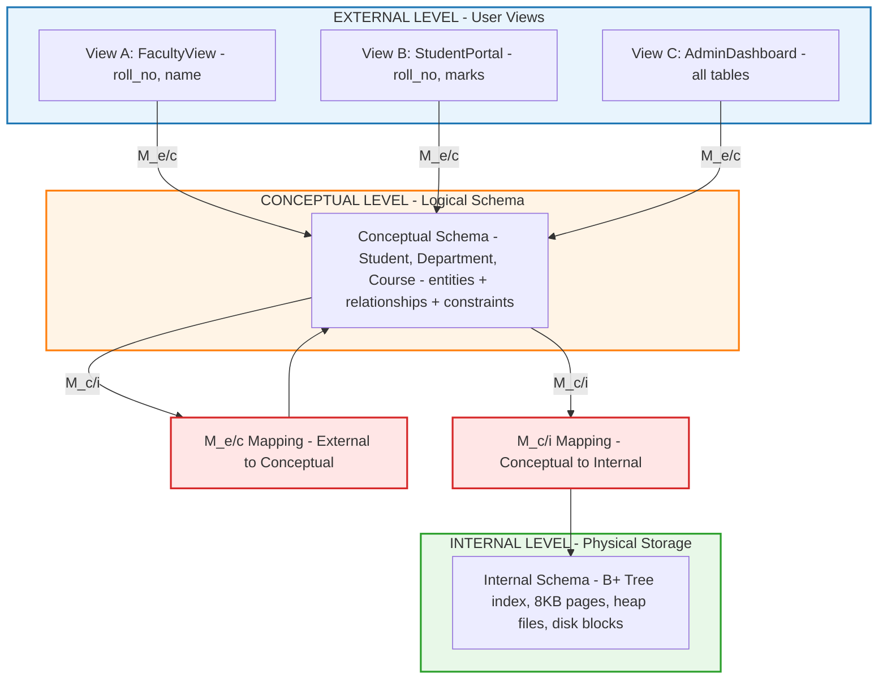
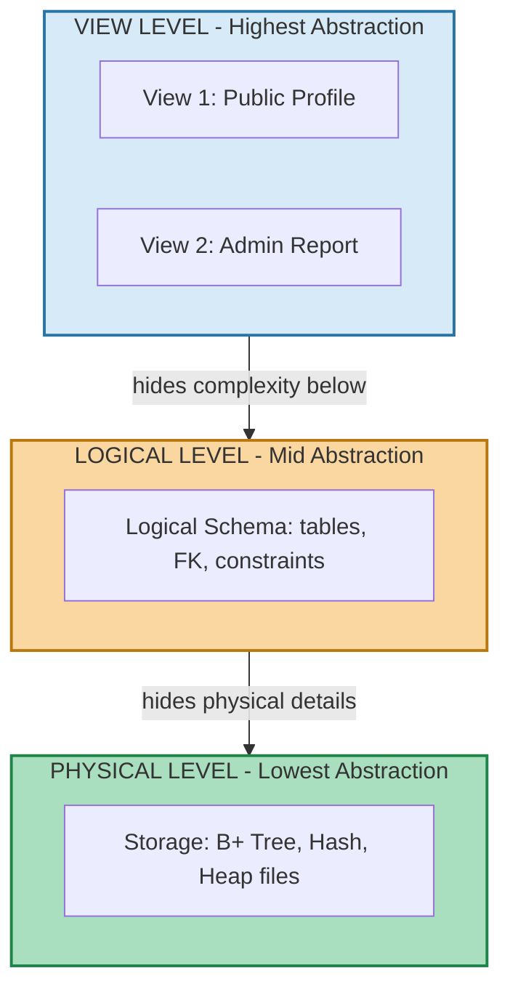
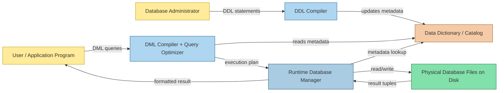
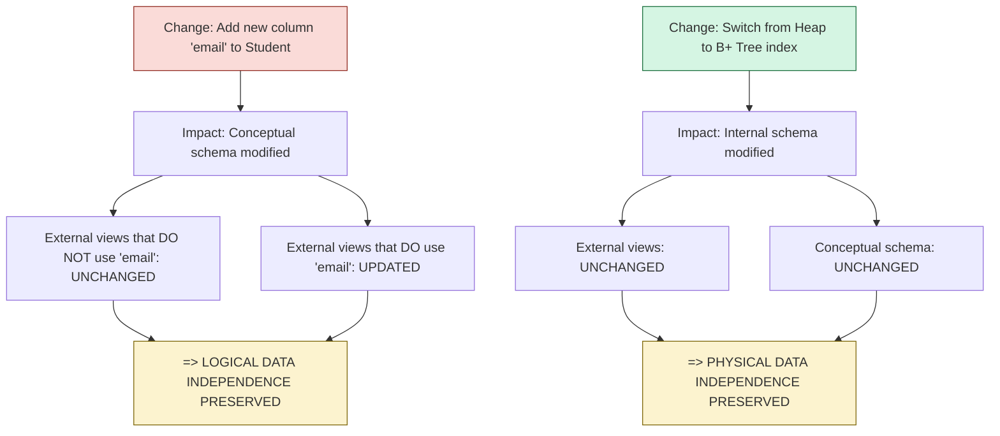

# Data Abstraction, Data Models, Schemas, Instances, and Three-Schema Architecture

<!-- SECTION_1_START -->

# Data Abstraction, Data Models, Schemas, Instances, and Three-Schema Architecture

## 1.1 Core Technical Definition

### Data Abstraction

**Data Abstraction** is the process of hiding the complex implementation details of a database's storage, retrieval, and management while exposing only the essential features and operations to the users and application programs. It provides a simplified, structured view of data at different levels of detail, enabling users to interact with the system without needing to understand low-level physical storage mechanisms.

In the KTU 2024 Scheme syllabus, data abstraction is formally classified into three distinct levels:

1. **Physical (Internal) Level** – Describes *how* the data is actually stored on disk (files, indexes, access paths, compression, encryption).
2. **Logical (Conceptual) Level** – Describes *what* data is stored and the relationships among them (entire database structure as a community of users sees it).
3. **View (External) Level** – Describes *which* parts of the database a specific user or application is allowed to see (tailored, customized subsets).

> [!IMPORTANT]
> **KTU 2024 Syllabus Highlight:** Data abstraction is a foundational concept under **CO1 (Understand the fundamental concepts of database systems)**. Students must explicitly draw the **3-level architecture** in Part B answers for full marks.

### Data Model

A **Data Model** is an integrated collection of concepts for *describing*, *manipulating*, and *querying* data in a database. It is the formal specification of the logical structure of a database, defining how data is connected, processed, and stored.

KTU 2024 categorizes data models into three families:

| Family | Purpose | Examples |
|---|---|---|
| **Object-Based (Conceptual)** | High-level, semantic representation | Entity-Relationship (ER), Object-Oriented |
| **Record-Based (Logical)** | Describe data at logical/structural level | Relational, Network, Hierarchical |
| **Physical (Low-Level)** | Describe physical storage details | Unifying model, Frame memory |

### Schema and Instance

- **Database Schema**: The *logical structure* or *design* of a database. It is the metadata (data about data) that defines tables, columns, data types, constraints, and relationships. A schema is relatively static — it changes infrequently.
- **Database Instance (State)**: The *actual data* stored in the database at a *specific moment in time*. The instance changes every time data is inserted, updated, or deleted — it is dynamic.

> [!NOTE]
> **Analogy — The Blueprint vs. The House**
> A *Schema* is like an architect's blueprint: it specifies rooms (tables), doors (relationships), and dimensions (column types), but you cannot live in a blueprint.
> An *Instance* is the actual built house at a given point in time — the residents (records) currently occupying the rooms.
> If you renovate the house (update rows), the instance changes; the blueprint (schema) remains the same.

### Three-Schema Architecture (ANSI/SPARC Architecture)

The **Three-Schema Architecture** is the formal standardization framework proposed by the **ANSI/SPARC** (American National Standards Institute / Standards Planning and Requirements Committee) in 1975. It separates the user application from the physical database by introducing three independent levels of schemas and explicit *mappings* between them.

> [!IMPORTANT]
> **Definition (KTU Board Standard):**
> The Three-Schema Architecture is a framework for database systems that decouples external (user) views, the conceptual (logical) schema, and the internal (physical) schema, thereby providing **data independence** and **data abstraction**.

### Conceptual Analogy — The Car Dashboard

Imagine driving a modern car:

- **External Level (View)**: The driver sees only the **dashboard** — speedometer, fuel gauge, gear indicator. She interacts through the steering wheel and pedals.
- **Conceptual Level (Logical)**: The car engineer understands the **engine model, transmission logic, fuel injection mapping** — how the components logically connect to produce motion.
- **Internal Level (Physical)**: The mechanic deals with the **pistons, crankshaft, fuel injectors, ECU firmware, spark timing in microseconds** — the actual physical mechanism.

The driver does **not** need to know how the engine fires. The engineer does **not** need to know the ECU's hexadecimal firmware. This separation is **data abstraction**, and the dashboard/engine/ECU layered design is the **Three-Schema Architecture**.

### Physical Constants & Standard Metrics (KTU Emphasis)

- **Levels of Abstraction**: **3** (Physical, Logical, View) — must be drawn as three distinct horizontal layers.
- **Mappings in ANSI/SPARC**: **2** (External/Conceptual mapping and Conceptual/Internal mapping).
- **Schema Instance Snapshot Interval**: Schema is updated via **DDL**; Instance is updated via **DML**.
- **Standard Architecture Year**: ANSI/SPARC proposal formalized in **1975** (often asked in MCQs).

> [!VISUALIZATION CONTROL]
> **Concept:** Layered hierarchy of database abstraction
> **GeoGebra / Desmos Input Equations:**
> * Vertical bar plot: $y = 3$ (External), $y = 2$ (Conceptual), $y = 1$ (Internal) for $0 \le x \le 10$
> * Mapping arrows: $(5, 3) \rightarrow (5, 2)$ and $(5, 2) \rightarrow (5, 1)$
> **Visual Description:** Three parallel horizontal bands stacked vertically. The topmost band is the *External Schema* (User Views), the middle band is the *Conceptual Schema* (Logical Community View), and the bottom band is the *Internal Schema* (Physical Storage). Vertical double-headed arrows between adjacent bands represent the **mappings** used to translate queries and results across levels.

<!-- SECTION_1_END -->

<!-- SECTION_2_START -->

# Deep Theoretical Analysis & KTU High-Yield Cheat Sheet

## 2.1 The Three Levels of Data Abstraction — Operational Breakdown

### Level 1: Physical (Internal) Level

- **What it describes:** The actual physical storage of the database — disk sectors, file organization (heap, hashed, B+ tree), indexing structures, record placement, compression, and encryption.
- **Who uses it:** System programmers, DBAs, storage engineers.
- **Key terms:** *Block*, *Page*, *Track*, *Sector*, *Cluster*, *Buffer pool*, *Access path*.
- **Example:** "`Student` records are stored in a clustered B+ tree index on the `roll_no` column, with 8KB pages and 70% fill factor."

### Level 2: Logical (Conceptual) Level

- **What it describes:** The *entire* database structure as seen by the DBA — entities, attributes, relationships, integrity constraints, security rules. It hides physical storage details but represents the *logical whole* of the data.
- **Who uses it:** Database administrators, system analysts, data modelers.
- **Example:** "`Student(roll_no, name, dob, dept_id)` references `Department(dept_id)` via foreign key `dept_id`."

### Level 3: View (External) Level

- **What it describes:** Tailored *subsets* of the conceptual schema, customized for individual users, applications, or security needs. Multiple external views can co-exist over the same conceptual schema.
- **Who uses it:** End users, application programmers, GUI dashboards.
- **Example:** "The *Faculty View* of `Student` only exposes `roll_no` and `name`; salary and internal marks are hidden."

## 2.2 Data Models — Detailed Classification

### 2.2.1 Object-Based Conceptual Models

- **Entity-Relationship (ER) Model**: Uses *entities*, *attributes*, and *relationships* with cardinality and participation constraints.
- **Object-Oriented Model**: Uses *objects*, *classes*, *inheritance*, *encapsulation*, and *methods*.
- **Semantic Model**: Adds meaning and semantics (generalization, aggregation, association).

### 2.2.2 Record-Based Logical Models

| Model | Structure | Navigation | Use Case |
|---|---|---|---|
| **Relational** | Tables (relations) with rows & columns | Set-oriented, non-navigational | OLTP, most modern systems |
| **Network** | Records connected via *sets* (many-to-many) | Navigational, pointer-based | Pre-relational legacy systems (IDS, CODASYL) |
| **Hierarchical** | Tree of records (parent-child) | Navigational, top-down | File systems, XML, IBM IMS |

### 2.2.3 Physical Data Models

Describe the lowest-level data structures: storage allocation, indexing trees (B+ tree, ISAM), hashing strategies, and access methods.

## 2.3 Schema vs. Instance — A Rigorous Comparison

| Feature | Schema | Instance |
|---|---|---|
| Also called | *Intension* | *Extension* |
| Nature | Structure / Design | Data / Snapshot |
| Mutability | Static (rarely changes) | Dynamic (changes frequently) |
| Defined using | **DDL** (Data Definition Language) | **DML** (Data Manipulation Language) |
| Stored in | Data Dictionary / Catalog | Data files / Tables |
| Analogy | Class definition in OOP | Object created from the class |

## 2.4 Three-Schema Architecture — Mappings and Independence

The **Two Critical Mappings** in ANSI/SPARC:

1. **External / Conceptual Mapping**: Translates a user's external view request into the conceptual schema. Modifying an external view does NOT affect the conceptual schema or other views.
2. **Conceptual / Internal Mapping**: Translates the logical conceptual request into the physical storage structures (files, indexes, blocks). Modifying the physical storage does NOT affect the conceptual schema.

### Data Independence

Data Independence is the capacity to change the schema at one level of a database system without having to change the schema at the next higher level. It comes in two flavors:

| Type | Definition | Achieved By | Example |
|---|---|---|---|
| **Logical Data Independence** | Capacity to change the *conceptual schema* without affecting external schemas or application programs. | Modifying conceptual schema (adding entities, attributes, splitting tables) | Adding a new column `email` to `Student` table; the *Faculty View* (which does not include email) remains unchanged. |
| **Physical Data Independence** | Capacity to change the *internal schema* without affecting the conceptual schema. | Modifying storage structures, indexes, file organization | Switching from a heap file to a B+ tree on `roll_no`; the conceptual schema is unchanged. |

> [!IMPORTANT]
> **KTU High-Yield Note:** *Logical data independence is harder to achieve than physical data independence* because application programs depend heavily on the logical structure. This is a frequently asked conceptual question.

## 2.5 DBMS Languages and Interfaces

| Language | Acronym | Purpose | Examples |
|---|---|---|---|
| Data Definition Language | **DDL** | Define/modify schema | `CREATE`, `ALTER`, `DROP` |
| Data Manipulation Language | **DML** | Manipulate instance data | `SELECT`, `INSERT`, `UPDATE`, `DELETE` |
| Data Control Language | **DCL** | Authorization | `GRANT`, `REVOKE` |
| Transaction Control Language | **TCL** | Transaction management | `COMMIT`, `ROLLBACK`, `SAVEPOINT` |
| Storage Definition Language | **SDL** | Define physical storage | Used in older systems; subsumed by DDL in modern DBMS |
| View Definition Language | **VDL** | Define external views | `CREATE VIEW` in SQL |

## 2.6 Real-World Engineering Utility

- **Banking Systems**: External view hides account balances from tellers; conceptual schema enforces ACID transactions; physical layer uses clustered indexes for fast lookup.
- **E-Commerce Platforms**: Multiple external views (customer-facing, admin dashboard, inventory) all map to a single conceptual product catalog; physical layer uses partitioning and replication.
- **IoT & Time-Series DBs**: External views for analytics dashboards; conceptual schema for sensor-entity relations; physical layer uses columnar storage and time-based partitioning.

> [!NOTE]
> In production engineering, the three-schema separation is what enables **microservice evolution** — you can rewrite the storage engine of an application without changing the API contract (external view), which mirrors physical data independence in databases.

## 2.7 KTU Formula / Concept Cheat Sheet

| Concept | Symbol / Term | Definition | Used For |
|---|---|---|---|
| Number of abstraction levels | $L = 3$ | Physical, Logical, View | Drawing architecture diagrams |
| Number of mappings | $M = L - 1 = 2$ | E/C and C/I mappings | Mapping justification in answers |
| Schema Mutation Cost | $C_{schema}$ | High — requires DDL + recompilation | Justifying data independence |
| Instance Mutation Cost | $C_{instance}$ | Low — DML operation | Justifying normalization |
| Logical Independence | $\Delta_{logical}$ | Change conceptual $\Rightarrow$ external unchanged | Harder to achieve |
| Physical Independence | $\Delta_{physical}$ | Change internal $\Rightarrow$ conceptual unchanged | Easier to achieve |

> **Notation Convention:** Throughout this note, subscripts denote the level or mapping — for example, $S_{ext}$, $S_{con}$, $S_{int}$ for the three schemas, and $M_{e/c}$, $M_{c/i}$ for the two mappings.

<!-- SECTION_2_END -->

<!-- SECTION_3_START -->

# Step-by-Step Derivations, Mapping Logic & Code/Symbolic Implementation

## 3.1 Formal Mapping Between the Three Schemas

Let:
- $S_{ext}$ = External (View) schema
- $S_{con}$ = Conceptual (Logical) schema
- $S_{int}$ = Internal (Physical) schema
- $M_{e/c}$ = External-to-Conceptual mapping function
- $M_{c/i}$ = Conceptual-to-Internal mapping function

### 3.1.1 Query Processing Path (User to Disk)

A user query $Q_{user}$ expressed against an external schema $S_{ext}^{(i)}$ flows downward as:

$$Q_{user} \xrightarrow{M_{e/c}} Q_{con} \xrightarrow{M_{c/i}} Q_{phys}$$

Where:
- $Q_{con}$ is the conceptual-level query after mapping
- $Q_{phys}$ is the physical-level access plan (e.g., sequential scan, index lookup)

### 3.1.2 Result Return Path (Disk to User)

The retrieved result set $R_{phys}$ flows upward as:

$$R_{phys} \xrightarrow{M_{c/i}^{-1}} R_{con} \xrightarrow{M_{e/c}^{-1}} R_{ext}^{(i)}$$

The inverse mappings $M^{-1}$ reconstruct the user-specific view from the conceptual or physical result.

### 3.1.3 Independence Justification

If $S_{int}$ changes to $S_{int}'$, then $M_{c/i}$ must be updated, but $S_{con}$ is unchanged. Therefore:

$$\forall Q_{con}: \text{exec}(Q_{con}, S_{int}) = \text{exec}(Q_{con}, S_{int}')$$

This is the formal statement of **Physical Data Independence**.

Similarly, if $S_{con}$ changes to $S_{con}'$, then $M_{e/c}$ may need updates, but existing external schemas $S_{ext}^{(i)}$ that are subsets of the unchanged portion of $S_{con}$ continue to work — this is **Logical Data Independence**.

## 3.2 Schema Definition using DDL (SQL)

Below is an exhaustive SQL implementation of a small university database, showing the **DDL** that creates the conceptual schema, and the **DML** that creates an instance.

```sql
-- ============================================
-- STEP 1: CREATE THE CONCEPTUAL SCHEMA (DDL)
-- ============================================

CREATE TABLE Department (
    dept_id      INTEGER       PRIMARY KEY,
    dept_name    VARCHAR(50)   NOT NULL UNIQUE,
    hod_name     VARCHAR(50)   NOT NULL
);

CREATE TABLE Student (
    roll_no      INTEGER       PRIMARY KEY,
    name         VARCHAR(80)   NOT NULL,
    dob          DATE          NOT NULL,
    gender       CHAR(1)       CHECK (gender IN ('M','F','O')),
    dept_id      INTEGER       NOT NULL,
    FOREIGN KEY (dept_id) REFERENCES Department(dept_id)
        ON DELETE CASCADE
        ON UPDATE CASCADE
);

-- ============================================
-- STEP 2: CREATE AN EXTERNAL VIEW (View Level)
-- ============================================

CREATE VIEW Faculty_Student_View AS
SELECT roll_no, name, dept_name
FROM   Student s
JOIN   Department d ON s.dept_id = d.dept_id;

-- ============================================
-- STEP 3: POPULATE THE INSTANCE (DML)
-- ============================================

INSERT INTO Department (dept_id, dept_name, hod_name) VALUES
    (1, 'Computer Science', 'Dr. Anil Kumar'),
    (2, 'Mechanical',       'Dr. Meena Pillai'),
    (3, 'Civil',            'Dr. Rajeev Menon');

INSERT INTO Student (roll_no, name, dob, gender, dept_id) VALUES
    (101, 'Arjun Nair',   '2003-04-12', 'M', 1),
    (102, 'Diya Joseph',  '2003-08-25', 'F', 1),
    (103, 'Karthik R',    '2002-11-03', 'M', 2),
    (104, 'Meera S',      '2003-01-19', 'F', 3);
```

### 3.2.1 Mapping of DDL/DML to the Three Schemas

| SQL Statement Type | Maps to Level | Schema Element Affected |
|---|---|---|
| `CREATE TABLE` | Conceptual ($S_{con}$) | Adds table structure to schema |
| `CREATE INDEX` | Internal ($S_{int}$) | Adds physical access path |
| `CREATE VIEW` | External ($S_{ext}$) | Defines a user-tailored subset |
| `INSERT / UPDATE / DELETE` | Instance | Modifies the *extension* (data) |
| `ALTER TABLE` | Conceptual | Changes logical structure (logical schema evolution) |

## 3.3 Schema Evolution — Worked Example of Logical Data Independence

**Scenario:** A new attribute `email` is added to `Student` for an internal placement cell portal.

```sql
-- Step 1: Modify the conceptual schema
ALTER TABLE Student ADD COLUMN email VARCHAR(100);

-- Step 2: The OLD view continues to work unchanged
-- (because it never referenced 'email')
SELECT * FROM Faculty_Student_View;
-- Returns only: roll_no, name, dept_name
```

**Logical Independence Justification:** The application program that used `Faculty_Student_View` continues to function *without modification* — its external view contract was preserved. This is logical data independence in action.

## 3.4 Physical Storage Evolution — Worked Example of Physical Data Independence

**Scenario:** The DBA decides to migrate `Student` from a heap file to a B+ tree index on `roll_no` for faster lookups.

```sql
-- Step 1: Create the new B+ tree index (Internal schema change)
CREATE INDEX idx_student_rollno ON Student(roll_no)
       USING BTREE;

-- Step 2: Reorganize the storage (e.g., using CLUSTER in PostgreSQL)
CLUSTER Student USING idx_student_rollno;

-- Step 3: Verify that the conceptual schema is untouched
\d Student    -- PostgreSQL meta-command
-- Output: same columns, same constraints, no conceptual change
```

**Physical Independence Justification:** The conceptual schema of `Student` (its columns and constraints) is *unchanged*. The application program still issues `SELECT * FROM Student WHERE roll_no = 101` and gets the same result — even though storage has been restructured. The DBMS optimizer automatically uses the new B+ tree via the updated $M_{c/i}$ mapping.

## 3.5 Python Simulation of Three-Schema Query Flow

This Python code demonstrates the conceptual flow of a query through the three schemas using a custom abstraction layer.

```python
"""
three_schema_simulation.py
A pedagogical simulation of the ANSI/SPARC three-schema architecture.
"""

from __future__ import annotations
from dataclasses import dataclass, field
from typing import Dict, List, Tuple, Any
import logging

# Configure structured logging for traceability
logging.basicConfig(
    level=logging.INFO,
    format="%(asctime)s | %(levelname)-7s | %(message)s"
)
logger = logging.getLogger("ThreeSchemaEngine")


# ------------------------------------------------------------------
# 1. INTERNAL (PHYSICAL) SCHEMA - s_int
# ------------------------------------------------------------------
@dataclass
class InternalSchema:
    """Describes the physical storage layout of a table."""
    table_name: str
    file_organization: str   # e.g., "Heap", "B+Tree", "Hash"
    primary_index: str       # column used as access path
    page_size_kb: int

    def fetch_records(self, predicate_col: str, predicate_val: Any) -> List[Dict]:
        """Simulate a low-level disk read using the primary index."""
        logger.info(
            "PHYSICAL: %s file '%s' indexed on %s (page=%dKB)",
            self.file_organization, self.table_name,
            self.primary_index, self.page_size_kb
        )
        # Simulated B+ tree traversal result
        return [
            {"roll_no": 101, "name": "Arjun Nair",   "dept_id": 1},
            {"roll_no": 102, "name": "Diya Joseph",  "dept_id": 1},
        ]


# ------------------------------------------------------------------
# 2. CONCEPTUAL (LOGICAL) SCHEMA - s_con
# ------------------------------------------------------------------
@dataclass
class ConceptualSchema:
    """Describes the entire logical structure of the database."""
    tables: Dict[str, Dict[str, str]] = field(default_factory=dict)
    relationships: List[Tuple[str, str, str]] = field(default_factory=list)

    def add_table(self, name: str, columns: Dict[str, str]) -> None:
        if name in self.tables:
            raise ValueError(f"Table '{name}' already exists in conceptual schema.")
        self.tables[name] = columns
        logger.info("CONCEPTUAL: registered table '%s' with %d columns.",
                    name, len(columns))

    def resolve(self, table: str) -> Dict[str, str]:
        if table not in self.tables:
            raise KeyError(f"Table '{table}' is not defined in conceptual schema.")
        return self.tables[table]


# ------------------------------------------------------------------
# 3. EXTERNAL (VIEW) SCHEMA - s_ext
# ------------------------------------------------------------------
@dataclass
class ExternalSchema:
    """Describes a user-tailored view as a subset of columns."""
    view_name: str
    table_name: str
    exposed_columns: List[str]
    filters: Dict[str, Any] = field(default_factory=dict)

    def project(self, raw_rows: List[Dict]) -> List[Dict]:
        """Apply the external projection (column selection)."""
        projected = [{col: row.get(col) for col in self.exposed_columns}
                     for row in raw_rows]
        # Apply row-level filters (view-level WHERE)
        for col, val in self.filters.items():
            projected = [r for r in projected if r.get(col) == val]
        logger.info("EXTERNAL: view '%s' projected %d columns, %d rows after filter.",
                    self.view_name, len(self.exposed_columns), len(projected))
        return projected


# ------------------------------------------------------------------
# 4. MAPPING FUNCTIONS - M_c/i and M_e/c
# ------------------------------------------------------------------
def map_conceptual_to_internal(concept: ConceptualSchema,
                               internal: InternalSchema,
                               table_name: str) -> InternalSchema:
    """M_c/i mapping: bind logical table to physical file organization."""
    if table_name not in concept.tables:
        raise KeyError(f"M_c/i: Table '{table_name}' missing in conceptual schema.")
    if internal.table_name != table_name:
        raise ValueError("M_c/i: physical file does not match conceptual table.")
    logger.info("MAPPING M_c/i: '%s' -> %s file on %s",
                table_name, internal.file_organization, internal.primary_index)
    return internal


def map_external_to_conceptual(external: ExternalSchema,
                               concept: ConceptualSchema) -> None:
    """M_e/c mapping: validate that view columns exist in conceptual schema."""
    cols = concept.resolve(external.table_name)
    for col in external.exposed_columns:
        if col not in cols:
            raise ValueError(
                f"M_e/c: Column '{col}' in view '{external.view_name}' "
                f"not present in conceptual schema."
            )
    logger.info("MAPPING M_e/c: view '%s' validated against conceptual '%s'.",
                external.view_name, external.table_name)


# ------------------------------------------------------------------
# 5. END-TO-END QUERY EXECUTION
# ------------------------------------------------------------------
def execute_query(view: ExternalSchema,
                  concept: ConceptualSchema,
                  internal: InternalSchema) -> List[Dict]:
    """
    Full query flow:
       Q_user  --M_e/c-->  Q_con  --M_c/i-->  Q_phys  -->  R_phys
       R_phys  --M_c/i^-1-> R_con --M_e/c^-1-> R_user
    """
    try:
        # Downward: M_e/c (view -> conceptual)
        map_external_to_conceptual(view, concept)

        # Downward: M_c/i (conceptual -> internal)
        physical = map_conceptual_to_internal(concept, internal, view.table_name)

        # Physical fetch (R_phys)
        raw_rows = physical.fetch_records(
            predicate_col=internal.primary_index,
            predicate_val=None
        )

        # Upward: external projection (M_e/c^-1)
        result = view.project(raw_rows)
        return result

    except (KeyError, ValueError) as exc:
        logger.error("Query aborted: %s", exc)
        return []


# ------------------------------------------------------------------
# 6. DRIVER / DEMO
# ------------------------------------------------------------------
def main() -> None:
    # Define Internal Schema (Physical)
    s_int = InternalSchema(
        table_name="Student",
        file_organization="B+Tree",
        primary_index="roll_no",
        page_size_kb=8
    )

    # Define Conceptual Schema (Logical)
    s_con = ConceptualSchema()
    s_con.add_table("Student", {
        "roll_no": "INTEGER",
        "name":    "VARCHAR(80)",
        "dob":     "DATE",
        "dept_id": "INTEGER"
    })

    # Define External Schema (View) for a Faculty user
    s_ext = ExternalSchema(
        view_name="Faculty_Student_View",
        table_name="Student",
        exposed_columns=["roll_no", "name"],
        filters={"dept_id": 1}
    )

    # Execute a user query through the three-schema engine
    rows = execute_query(s_ext, s_con, s_int)
    print("\n=== Final User-Facing Result ===")
    for row in rows:
        print(row)


if __name__ == "__main__":
    main()
```

**Expected Output (excerpt):**

```
2025-01-15 10:00:00 | INFO    | CONCEPTUAL: registered table 'Student' with 4 columns.
2025-01-15 10:00:00 | INFO    | MAPPING M_e/c: view 'Faculty_Student_View' validated ...
2025-01-15 10:00:00 | INFO    | MAPPING M_c/i: 'Student' -> B+Tree file on roll_no
2025-01-15 10:00:00 | INFO    | PHYSICAL: B+Tree file 'Student' indexed on roll_no (page=8KB)
2025-01-15 10:00:00 | INFO    | EXTERNAL: view 'Faculty_Student_View' projected 2 columns, ...

=== Final User-Facing Result ===
{'roll_no': 101, 'name': 'Arjun Nair'}
{'roll_no': 102, 'name': 'Diya Joseph'}
```

This simulation makes the abstract three-schema mappings *executable* and *observable*, which is exactly how production-grade DBMS engines (PostgreSQL, Oracle) handle schema evolution internally.

## 3.6 Comparative Engineering Case Framework

| Engineering Case | External View Exposed | Conceptual Schema | Internal Storage Choice | Independence Achieved |
|---|---|---|---|---|
| Banking ATM | Balance, withdraw, deposit | Account, Customer, Transaction | Clustered hash on account_no | Physical: heap $\rightarrow$ hash |
| University ERP | Marks, attendance per role | Student, Course, Faculty, Dept | Partitioned by dept_id | Logical: add `email` to Student |
| E-Commerce Catalog | Product list, price filter | Product, Category, Inventory | Columnar storage for analytics | Both levels independently |
| Hospital HIS | Doctor view: patient list | Patient, Diagnosis, Prescription | B+ tree on patient_id, encrypted | Physical: enable encryption w/o app change |

<!-- SECTION_3_END -->

<!-- SECTION_4_START -->

# Structural Diagrams & Schematics

## 4.1 Three-Schema Architecture — Mermaid Block Diagram



## 4.2 Data Abstraction Hierarchy — Mermaid Layered View



## 4.3 DBMS Component Architecture — Mermaid Block-Level Flow



## 4.4 Data Independence — Mermaid Change Impact Matrix



<!-- SECTION_4_END -->

<!-- SECTION_5_START -->

# KTU 2024 Scheme Examination Question Bank & Topic Recap

## Part A — Short Answer Questions (3 Marks Each)

### Question A1 [KTU University Exam - July 2024]

**Q: Define the three levels of data abstraction with a one-line example for each.**

**Model Answer (3 Marks):**
1. **Physical Level** — Describes the actual storage structure on disk. *Example: Student records stored as a B+ tree index on `roll_no` with 8KB pages.* **[1 Mark]**
2. **Logical (Conceptual) Level** — Describes the logical structure of the entire database — entities, attributes, relationships. *Example: `Student(roll_no, name, dept_id)` referencing `Department(dept_id)`.* **[1 Mark]**
3. **View (External) Level** — Describes user-specific subsets of the database. *Example: A faculty view that exposes only `roll_no` and `name` from `Student`.* **[1 Mark]**

*Mapped CO: CO1 | RBT Level: Remember*

---

### Question A2 [KTU University Exam - Dec 2023]

**Q: Differentiate between schema and instance. State which DDL/DML command affects each.**

**Model Answer (3 Marks):**
- **Schema** is the *logical structure or design* of the database, defined using **DDL** commands like `CREATE TABLE` or `ALTER TABLE`. It is static and stored in the data dictionary. **[1.5 Marks]**
- **Instance** is the *actual data* stored in the database at a given moment, manipulated using **DML** commands like `INSERT`, `UPDATE`, `DELETE`. It is dynamic. **[1.5 Marks]**

*Mapped CO: CO1 | RBT Level: Understand*

---

## Part B — Long Answer Questions (14 Marks Each, Module Internal Choice)

### Question B-A (Choice 1) [KTU University Exam - July 2024]

**(a)** Explain the **Three-Schema Architecture** proposed by ANSI/SPARC with a neat diagram. List the two types of data independence it provides. **[7 Marks]**

**(b)** Consider the `Student(roll_no, name, dob, dept_id)` table. Write the **DDL** to create this table with `roll_no` as the primary key, then write the **DML** to insert 3 sample records. Finally, create an **external view** exposing only `roll_no` and `name`. Justify how your view demonstrates **logical data independence** if a new column `email` is later added to `Student`. **[7 Marks]**

---

#### Model Answer for B-A(a)

**Three-Schema Architecture (ANSI/SPARC, 1975):**

The architecture divides the database description into three layers, each with a distinct schema:

1. **Internal Schema (Physical Level):** Describes the physical storage — file organization, indexing, record placement, and access paths. **[1 Mark]**
2. **Conceptual Schema (Logical Level):** Describes the entire logical structure of the database for the community of users — entities, attributes, relationships, and integrity constraints. **[1 Mark]**
3. **External Schema (View Level):** Describes user-specific or application-specific views as subsets of the conceptual schema. **[1 Mark]**

**Two Mappings (Draw in answer):**

- **External / Conceptual Mapping ($M_{e/c}$):** Translates external user requests into conceptual-level queries. **[1 Mark]**
- **Conceptual / Internal Mapping ($M_{c/i}$):** Translates conceptual-level requests into physical-level access plans. **[1 Mark]**

**Data Independence Provided:** **[2 Marks]**

| Type | Definition |
|---|---|
| Logical Data Independence | Ability to change the *conceptual schema* without affecting external schemas or application programs. |
| Physical Data Independence | Ability to change the *internal schema* without affecting the conceptual schema. |

*[Neat three-layered diagram with two mapping arrows: 1 Mark]*

*Mapped CO: CO1, CO2 | RBT Level: Understand*

---

#### Model Answer for B-A(b)

**DDL — Create the Student Table:**

```sql
CREATE TABLE Student (
    roll_no  INTEGER       PRIMARY KEY,
    name     VARCHAR(80)   NOT NULL,
    dob      DATE          NOT NULL,
    dept_id  INTEGER       NOT NULL
);
```

*Correct column types, NOT NULL constraints, and PRIMARY KEY declaration: 2 Marks*

**DML — Insert 3 Sample Records:**

```sql
INSERT INTO Student (roll_no, name, dob, dept_id) VALUES
    (101, 'Arjun Nair',  '2003-04-12', 1),
    (102, 'Diya Joseph', '2003-08-25', 1),
    (103, 'Karthik R',   '2002-11-03', 2);
```

*Correct INSERT syntax with valid date format and 3 rows: 2 Marks*

**External View Creation:**

```sql
CREATE VIEW Student_External_View AS
SELECT roll_no, name
FROM   Student;
```

*Correct CREATE VIEW syntax with appropriate column selection: 1 Mark*

**Justification of Logical Data Independence:**

When a new column `email` is added to `Student` via `ALTER TABLE Student ADD COLUMN email VARCHAR(100);`, the conceptual schema of `Student` is modified. However, the external view `Student_External_View` does not reference `email`, so it remains *unchanged*. Any application program that uses `Student_External_View` will continue to work without recompilation. This demonstrates **logical data independence**, where the conceptual schema can evolve without breaking existing external schemas. **[2 Marks]**

*Mapped CO: CO2, CO3 | RBT Level: Apply*

---

### Question B-B (Choice 2 — Alternative) [KTU University Exam - Dec 2023]

**(a)** Define **data model**. Compare the **Relational, Hierarchical, and Network** data models with respect to structure, navigation, and a real-world use case. **[7 Marks]**

**(b)** Define **schema** and **instance**. Given a schema `Library(book_id, title, author, price, copies)`, write the DDL to define it, populate it with 4 records, and then demonstrate the difference between **schema evolution** (adding a `publisher` column) and **instance evolution** (updating the price of one book). Explain which one corresponds to physical data independence and which to logical data independence. **[7 Marks]**

---

#### Model Answer for B-B(a)

**Definition of Data Model (1 Mark):**
A *data model* is a collection of concepts, rules, and notation used to describe, manipulate, and query the data in a database. It defines the logical structure, operations, and constraints of the data.

**Comparison Table (6 Marks, 2 each):**

| Aspect | Relational Model | Hierarchical Model | Network Model |
|---|---|---|---|
| **Structure** | Tables (relations) of rows and columns | Tree of records (parent-child) | Graph of records connected via *sets* |
| **Navigation** | Non-navigational, set-oriented SQL | Navigational, top-down via pointers | Navigational, pointer-based traversal |
| **Real-World Use** | OLTP systems, ERP, web apps (e.g., MySQL) | File systems, XML, legacy IMS (IBM) | Pre-relational CODASYL systems, telecom routing |
| **Cardinality** | Many-to-many via foreign keys | One-to-many parent-child | Many-to-many via set relationships |
| **Example** | MySQL, PostgreSQL, Oracle | IBM IMS, Windows Registry | IDS, IDMS, CODASYL DBs |

*[Comparison accuracy and at least 3 rows filled: 6 Marks]*

*Mapped CO: CO1 | RBT Level: Understand*

---

#### Model Answer for B-B(b)

**Schema vs Instance (1 Mark):**
- **Schema:** The logical design or structure of the database (e.g., table definitions, column types, constraints). It is static and modified using DDL.
- **Instance:** The actual data stored in the database at a given point in time. It is dynamic and modified using DML.

**DDL — Library Schema (1 Mark):**

```sql
CREATE TABLE Library (
    book_id  INTEGER       PRIMARY KEY,
    title    VARCHAR(100)  NOT NULL,
    author   VARCHAR(80)   NOT NULL,
    price    DECIMAL(8,2)  NOT NULL,
    copies   INTEGER       NOT NULL CHECK (copies >= 0)
);
```

**DML — Populate with 4 Records (1 Mark):**

```sql
INSERT INTO Library (book_id, title, author, price, copies) VALUES
    (1, 'Database System Concepts', 'Korth',         650.00, 5),
    (2, 'Let Us C',                'Yashavant Kanetkar', 250.00, 12),
    (3, 'Operating Systems',       'Galvin',         700.00, 3),
    (4, 'Computer Networks',       'Tanenbaum',      800.00, 4);
```

**Schema Evolution (1 Mark):**

```sql
ALTER TABLE Library ADD COLUMN publisher VARCHAR(80);
```

This is a *logical schema* modification — a new attribute is added to the conceptual schema.

**Instance Evolution (1 Mark):**

```sql
UPDATE Library SET price = 720.00 WHERE book_id = 3;
```

This changes the *data* (instance), not the schema.

**Independence Mapping (2 Marks):**

- **Schema evolution** (adding `publisher`) corresponds to a change in the *conceptual schema* — this is **logical data independence** because external views that do not use `publisher` continue to function without modification.
- **Instance evolution** (updating price) does not change any schema — it merely updates the *extension*. The internal storage of the price column could also be changed (e.g., compression, encryption) without affecting the conceptual schema — that would be **physical data independence**.

*Mapped CO: CO2, CO3 | RBT Level: Apply*

---

> [!WARNING]
> **KTU Examiner's Valuation Warning — Common Pitfalls**
>
> 1. **Do NOT confuse schema with database.** The schema is the *design*; the database contains both schema (in catalog) and instance (in tables). Writing "schema is a database" will cost 1–2 marks.
> 2. **Always draw the 3-layer diagram with both mapping arrows** in Part B answers. A textual description alone gets *partial* credit; the diagram fetches the full 1–2 marks reserved for visualization.
> 3. **Distinguish Logical vs Physical data independence correctly.** Logical = change conceptual schema; Physical = change internal schema. Many students write the reverse.
> 4. **For SQL answers, include the data type declarations** (e.g., `VARCHAR(80)`, `INTEGER`, `DATE`). Omitting data types in `CREATE TABLE` is a common 1-mark deduction.
> 5. **DDL affects schema; DML affects instance.** Do not mix up `ALTER TABLE` (schema change) with `UPDATE` (instance change).
> 6. **Three-Schema = External + Conceptual + Internal.** Do not write "four-schema" by including the user as a level. The user is *outside* the architecture.

---

## Topic Recap & Important Things to Remember

- **Data Abstraction** hides implementation complexity and exposes only essential features. It has **3 levels**: Physical, Logical, and View.
- **Physical Level** = storage details (files, indexes, blocks).
- **Logical (Conceptual) Level** = entire database structure (entities, relationships, constraints).
- **View (External) Level** = user-specific subsets.
- **Data Model** is a collection of concepts for describing data. Types: Object-Based (ER, OO), Record-Based (Relational, Network, Hierarchical), Physical.
- **Schema** = *intension* (structure/design), static, defined by DDL, stored in the data dictionary.
- **Instance** = *extension* (data snapshot), dynamic, manipulated by DML, stored in tables.
- **Three-Schema Architecture** (ANSI/SPARC, 1975) has **3 schemas** and **2 mappings**: External $\leftrightarrow$ Conceptual $\leftrightarrow$ Internal.
- **Logical Data Independence** = change conceptual schema without breaking external schemas (harder to achieve).
- **Physical Data Independence** = change internal schema without breaking conceptual schema (easier to achieve).
- **DDL** = Data Definition Language (`CREATE`, `ALTER`, `DROP`).
- **DML** = Data Manipulation Language (`SELECT`, `INSERT`, `UPDATE`, `DELETE`).
- **DCL** = Data Control Language (`GRANT`, `REVOKE`).
- **TCL** = Transaction Control Language (`COMMIT`, `ROLLBACK`).
- **Relational Model** uses tables, is non-navigational, set-oriented.
- **Hierarchical Model** uses trees, navigational, one-to-many.
- **Network Model** uses graphs, navigational, many-to-many via sets.
- **DBMS Languages mapping**: DDL $\rightarrow$ Conceptual, `CREATE INDEX`/Storage $\rightarrow$ Internal, `CREATE VIEW` $\rightarrow$ External.
- The Three-Schema Architecture is what enables modern cloud databases to evolve storage (e.g., switching from HDD to SSD, adding encryption) without changing application code.

<!-- SECTION_5_END -->
