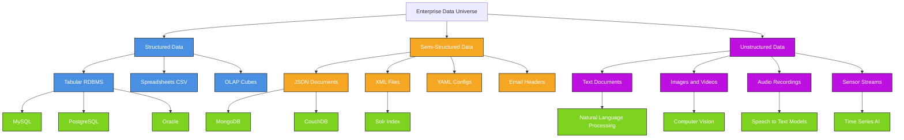
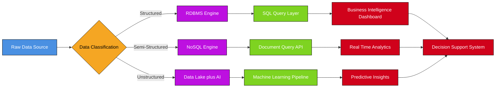

# Data classification: Structured, Semi-structured, and Unstructured data

<!-- SECTION_1_START -->

# Data Classification: Structured, Semi-Structured, and Unstructured Data

## 1.1 Formal Academic Definition

In the context of **Database Management Systems (DBMS)** and modern data engineering, **data classification** refers to the systematic categorization of data based on its **schema**, **format**, **storage representation**, and **ease of retrieval**. The KTU 2024 Scheme (PCCST402 — Module 1) categorizes data into three primary types:

> [!IMPORTANT]
> **Data Classification (KTU 2024 Definition):** The process of organizing data into categories based on its internal organization, schema rigidity, and the degree of human/machine interpretability, which directly determines the choice of database technology (RDBMS, NoSQL, Data Lake, etc.).

1. **Structured Data** — Data that adheres to a **predefined data model** or schema, typically stored in tabular form (rows and columns) within a **Relational Database Management System (RDBMS)**.
2. **Semi-Structured Data** — Data that does not conform to a strict tabular schema but contains **tags, markers, or hierarchical keys** that impose some organizational structure (e.g., JSON, XML, YAML).
3. **Unstructured Data** — Data that has **no predefined schema or format**, requiring advanced processing techniques like **Natural Language Processing (NLP)** or **Computer Vision (CV)** to extract meaning.

> [!NOTE]
> The **3V's of Big Data** — **Volume**, **Velocity**, and **Variety** — are deeply tied to data classification. The *Variety* dimension specifically describes the coexistence of these three data types in modern enterprise systems.

## 1.2 Conceptual Analogy & Intuitive Overview

Imagine you are organizing a **massive library**:

- **Structured Data** is like a library where every book is placed in a specific shelf, row, and column based on a strict **Dewey Decimal Classification** system. The librarian (RDBMS) knows exactly where each book is. *Example: A company's employee payroll table.*

- **Semi-Structured Data** is like a digital library where each book (record) has a **flexible metadata card** (tags). Some books have an "author" tag, others have a "publisher" tag, and some have both. The structure is present but flexible. *Example: An email with header fields like `From`, `To`, `Subject` and a free-form body.*

- **Unstructured Data** is like a stack of random photos, handwritten notes, and recorded conversations dumped into a box. There's no inherent organization, and a human (or AI) must interpret the content. *Example: CCTV footage, MRI scans, tweets, voice recordings.*

> [!TIP]
> **Quick Memory Trick:** "**S**tructured = **S**chema, **S**emi = **S**oft schema, **S**tructureless = **S**oup (Unstructured)."

## 1.3 Visual Representation of Data Classification

> [!VISUALIZATION CONTROL]
> **Concept:** Hierarchical view of data classification based on schema rigidity
> **GeoGebra / Desmos Input Equations:**
> * X-axis: `Schema Rigidity` (0 to 100)
> * Y-axis: `Ease of Querying` (0 to 100)
> * Point A: `(95, 95)` labeled "Structured"
> * Point B: `(60, 65)` labeled "Semi-Structured"
> * Point C: `(20, 30)` labeled "Unstructured"
> **Visual Description:** Students should observe that as schema rigidity decreases (moving right to left), the ease of querying also decreases, forming a positive correlation curve. Structured data sits in the top-right corner, while unstructured data occupies the bottom-left.

## 1.4 Engineering Significance

> [!IMPORTANT]
> According to **Gartner's industry reports**, approximately **80% to 90%** of enterprise data is **unstructured**, yet most traditional RDBMS are designed for the remaining **10%–20%** of structured data. This is precisely why modern systems like **MongoDB**, **ElasticSearch**, **Hadoop HDFS**, and **Amazon S3** have become critical infrastructure components.

<!-- SECTION_1_END -->

<!-- SECTION_2_START -->

# Deep Theoretical Analysis & KTU High-Yield Formula Sheet

## 2.1 Detailed Breakdown of Each Data Type

### 2.1.1 Structured Data

**Definition:** Data that follows a **rigid, predefined schema** defined by a Data Definition Language (DDL), typically arranged in **tables (relations)** consisting of **rows (tuples)** and **columns (attributes)**.

**Operational Characteristics:**

- Stored in **RDBMS** (MySQL, PostgreSQL, Oracle, SQL Server).
- Governed by **ACID properties** — Atomicity, Consistency, Isolation, Durability.
- Schema is defined **before** data insertion (schema-on-write).
- Supports **SQL** (Structured Query Language) for CRUD operations.
- Enforces **data integrity** through primary keys, foreign keys, unique constraints, and CHECK constraints.
- Theoretically rooted in **Edgar F. Codd's Relational Model (1970)**.

**Mathematical Foundation:**
A relation $R$ is a subset of the Cartesian product of domains $D_1 \times D_2 \times \ldots \times D_n$.

$$R \subseteq D_1 \times D_2 \times D_3 \times \ldots \times D_n$$

Each tuple $t \in R$ is an ordered list:

$$t = \langle v_1, v_2, v_3, \ldots, v_n \rangle$$

where $v_i \in D_i$.

**Real-World Examples:**

- Banking transaction records
- University student gradebooks
- Airline reservation systems
- Inventory management databases
- Employee payroll systems

---

### 2.1.2 Semi-Structured Data

**Definition:** Data that does not conform to a fixed schema but contains **self-describing tags, keys, or hierarchical markers** that provide partial structure.

**Operational Characteristics:**

- No rigid schema; each record can have **different attributes**.
- Stored in **NoSQL document stores** (MongoDB, CouchDB), **key-value stores** (Redis), or as **file formats** (JSON, XML, YAML, BSON, Parquet).
- Follows the **schema-on-read** paradigm (schema applied at query time).
- Highly **flexible** and **horizontally scalable**.
- Supports **nested data structures** (objects within objects, arrays within objects).
- Often used in **web APIs**, **IoT telemetry**, and **social media platforms**.

**Common Formats:**

- **JSON (JavaScript Object Notation)** — Lightweight, human-readable, used in REST APIs.
- **XML (eXtensible Markup Language)** — Older standard, used in SOAP web services, RSS feeds, and legacy enterprise systems.
- **YAML (YAML Ain't Markup Language)** — Used in configuration files (Kubernetes, Docker Compose).
- **BSON (Binary JSON)** — Binary-encoded JSON used internally by MongoDB.

**Real-World Examples:**

- Social media profiles (Facebook user data in JSON)
- Email metadata (headers + body)
- Sensor data from IoT devices
- Web server logs
- Product catalogs in e-commerce platforms

---

### 2.1.3 Unstructured Data

**Definition:** Data that has **no inherent schema, format, or structure**, requiring specialized techniques for storage, retrieval, and analysis.

**Operational Characteristics:**

- Stored in **Data Lakes** (Hadoop HDFS, Amazon S3, Azure Data Lake).
- Analyzed using **AI/ML pipelines** — NLP for text, CV for images, ASR for audio.
- Typically constitutes the **largest volume** of enterprise data (**80%–90%**).
- Cannot be queried using traditional SQL.
- Requires **metadata tagging** for basic indexing (e.g., adding tags like "medical", "2024", "MRI" to an MRI scan).
- Often stored in **binary format** or **raw file format**.

**Real-World Examples:**

- Images (JPEG, PNG, TIFF)
- Videos (MP4, AVI, MKV)
- Audio files (MP3, WAV, FLAC)
- Text documents (PDF, DOCX, TXT)
- Social media posts (tweets, comments)
- Satellite imagery
- Medical scans (DICOM)
- Surveillance footage

---

## 2.2 KTU High-Yield Comparison Cheat Sheet

| **Property** | **Structured** | **Semi-Structured** | **Unstructured** |
| :--- | :--- | :--- | :--- |
| **Schema** | Fixed (RDBMS DDL) | Flexible / Self-describing | None |
| **Storage Format** | Tables (rows & columns) | JSON, XML, YAML, BSON | Binary, text, multimedia |
| **Storage Technology** | MySQL, Oracle, PostgreSQL | MongoDB, Cassandra, CouchDB | Hadoop HDFS, S3, Data Lake |
| **Query Language** | SQL | NoSQL query APIs, XQuery, JSONPath | NLP, CV APIs, custom ML pipelines |
| **Schema Paradigm** | Schema-on-Write | Schema-on-Read | Schema-on-Read (with AI) |
| **Data Volume Share** | ~10%–20% | ~5%–10% | ~80%–90% |
| **ACID Compliance** | Full ACID | Eventual Consistency (BASE) | Not Applicable |
| **Scalability** | Vertical (Scale-Up) | Horizontal (Scale-Out) | Horizontal (Distributed) |
| **Example** | Student Marks Table | JSON API Response | YouTube Video File |
| **Analysis Method** | SQL Aggregation, JOINs | Parsers, XPath, MapReduce | AI/ML, Deep Learning |

> [!IMPORTANT]
> **BASE** stands for **Basically Available, Soft state, Eventual consistency** — the alternative to ACID commonly used in NoSQL systems handling semi-structured data.

## 2.3 Quantitative Data Growth Metrics

> [!NOTE]
> The **IDC (International Data Corporation)** predicts the global *datasphere* will reach **$175$ zettabytes (ZB)** by **2025**, with unstructured data dominating this growth.

$$1 \text{ ZB} = 10^{21} \text{ bytes} = 1,000,000,000 \text{ TB}$$

For perspective, if you stored $175$ ZB on standard 1 TB hard drives and stacked them, the stack would reach the moon and back **several times**.

## 2.4 Engineering Utility in Production Systems

| **Domain** | **Primary Data Type Used** | **Example System** |
| :--- | :--- | :--- |
| Banking & Finance | Structured | Core Banking Systems (Oracle FLEXCUBE) |
| Social Media | Semi-Structured | Facebook TAO, Twitter Manhattan |
| Healthcare (Imaging) | Unstructured | PACS (Picture Archiving System) |
| E-Commerce | Hybrid (All Three) | Amazon (RDBMS + DynamoDB + S3) |
| IoT & Smart Cities | Semi-Structured | MQTT Telemetry Streams |
| Autonomous Vehicles | Unstructured | LIDAR Point Clouds, Camera Feeds |

> [!TIP]
> Modern enterprises use a **Polyglot Persistence** strategy — choosing the right database for the right data type rather than forcing all data into a single system.

<!-- SECTION_2_END -->

<!-- SECTION_3_START -->

# Step-by-Step Derivations, Examples & Code Implementation

## 3.1 Comparative Worked Examples

### Example 1: Representing the Same Entity in All Three Formats

Consider the entity: **"A B.Tech student named Arun"**

#### Representation 1 — Structured (SQL Table)

```sql
-- Step 1: Create a rigid schema first (Schema-on-Write)
CREATE TABLE Student (
    student_id   INT PRIMARY KEY,
    name         VARCHAR(50) NOT NULL,
    branch       VARCHAR(20) NOT NULL,
    cgpa         DECIMAL(4,2),
    admission_year INT
);

-- Step 2: Insert a tuple (row)
INSERT INTO Student (student_id, name, branch, cgpa, admission_year)
VALUES (101, 'Arun Kumar', 'CSE', 8.75, 2023);

-- Step 3: Query using SQL
SELECT name, cgpa FROM Student WHERE branch = 'CSE' AND cgpa > 8.0;
```

**Output:** `Arun Kumar, 8.75`

#### Representation 2 — Semi-Structured (JSON Document)

```json
{
  "student_id": 101,
  "personal_info": {
    "name": "Arun Kumar",
    "dob": "2005-08-15"
  },
  "academic_info": {
    "branch": "CSE",
    "cgpa": 8.75,
    "courses_enrolled": ["DBMS", "OS", "DSA", "CN"]
  },
  "hostel": {
    "name": "Men's Hostel A",
    "room": "204B"
  }
}
```

*Note:* This JSON has nested objects (`personal_info`, `academic_info`, `hostel`) and an array (`courses_enrolled`). The structure is present but flexible — another student record may omit `hostel` entirely.

#### Representation 3 — Semi-Structured (XML Document)

```xml
<?xml version="1.0" encoding="UTF-8"?>
<Student>
    <StudentID>101</StudentID>
    <Name>Arun Kumar</Name>
    <Branch>CSE</Branch>
    <CGPA>8.75</CGPA>
    <AdmissionYear>2023</AdmissionYear>
</Student>
```

#### Representation 4 — Unstructured (Raw Text)

> "Arun Kumar is a bright computer science student from Kerala who joined the B.Tech program in 2023. He maintains a strong CGPA of 8.75 and is actively involved in the coding club. His hobbies include chess, photography, and reading science fiction novels. He recently won first place in the inter-college hackathon organized by IIT Madras."

This is a **free-flowing paragraph** with no tags, no fields, and no predefined keys. Extracting structured information from it requires **Named Entity Recognition (NER)** and **Regex pattern matching**.

---

## 3.2 Python Implementation — Detecting and Processing Each Data Type

```python
import json
import xml.etree.ElementTree as ET
import re
from pathlib import Path
from typing import Any, Dict, List, Union
from datetime import datetime


class DataClassifier:
    """
    A production-grade classifier that categorizes input data as
    Structured, Semi-Structured, or Unstructured based on heuristics.
    """

    def __init__(self) -> None:
        self.classification_log: List[Dict[str, Any]] = []

    def classify(self, data: Union[str, bytes, Path, Dict[str, Any]]) -> str:
        """
        Public method to classify arbitrary data input.
        Returns one of: 'Structured', 'Semi-Structured', 'Unstructured'.
        """
        try:
            if isinstance(data, dict):
                result = self._classify_dict(data)
            elif isinstance(data, str):
                result = self._classify_string(data)
            elif isinstance(data, (Path, bytes)):
                result = self._classify_file(data)
            else:
                raise TypeError(f"Unsupported data type: {type(data)}")

            self._log_classification(data, result)
            return result
        except Exception as e:
            error_msg = f"Classification error: {str(e)}"
            print(f"[ERROR] {error_msg}")
            return "Unclassified"

    def _classify_dict(self, data: Dict[str, Any]) -> str:
        """All Python dicts coming from JSON parsers are Semi-Structured."""
        return "Semi-Structured"

    def _classify_string(self, data: str) -> str:
        """Detect JSON, XML, CSV, or plain text."""
        stripped = data.strip()

        if stripped.startswith("{") or stripped.startswith("["):
            try:
                json.loads(stripped)
                return "Semi-Structured (JSON)"
            except json.JSONDecodeError:
                pass

        if stripped.startswith("<?xml") or stripped.startswith("<"):
            try:
                ET.fromstring(stripped)
                return "Semi-Structured (XML)"
            except ET.ParseError:
                pass

        if self._is_csv_like(stripped):
            return "Structured (CSV)"

        return "Unstructured"

    def _is_csv_like(self, data: str) -> bool:
        """Heuristic: detect comma/tab-separated values with multiple lines."""
        lines = data.splitlines()
        if len(lines) < 2:
            return False
        delimiters = [",", "\t", ";"]
        for delim in delimiters:
            counts = [line.count(delim) for line in lines[:5]]
            if all(c == counts[0] and c > 0 for c in counts):
                return True
        return False

    def _classify_file(self, data: Union[Path, bytes]) -> str:
        """Inspect file extension to classify unstructured files."""
        if isinstance(data, Path):
            suffix = data.suffix.lower()
            unstructured_exts = {
                ".jpg", ".jpeg", ".png", ".gif", ".bmp", ".tiff",
                ".mp4", ".avi", ".mkv", ".mov",
                ".mp3", ".wav", ".flac", ".aac",
                ".pdf", ".docx", ".txt", ".pptx"
            }
            if suffix in unstructured_exts:
                return f"Unstructured ({suffix.upper()} file)"
        return "Unstructured"

    def _log_classification(self, data: Any, result: str) -> None:
        """Log every classification event with a timestamp."""
        self.classification_log.append({
            "timestamp": datetime.now().isoformat(),
            "data_preview": str(data)[:80],
            "classification": result
        })


# ==================== DEMONSTRATION ====================
if __name__ == "__main__":
    classifier = DataClassifier()

    # Test Case 1: Structured data (CSV string)
    csv_data = "id,name,branch,cgpa\n101,Arun,CSE,8.75\n102,Meera,ECE,9.10"
    print(f"CSV Data    -> {classifier.classify(csv_data)}")

    # Test Case 2: Semi-Structured data (JSON string)
    json_data = '{"name": "Arun", "skills": ["Python", "DBMS", "ML"]}'
    print(f"JSON Data   -> {classifier.classify(json_data)}")

    # Test Case 3: Semi-Structured data (XML string)
    xml_data = "<Student><ID>101</ID><Name>Arun</Name></Student>"
    print(f"XML Data    -> {classifier.classify(xml_data)}")

    # Test Case 4: Unstructured data (free text)
    text_data = "Arun is a passionate engineering student who loves coding."
    print(f"Text Data   -> {classifier.classify(text_data)}")

    # Test Case 5: Unstructured data (image file)
    image_path = Path("photo.jpg")
    print(f"Image File  -> {classifier.classify(image_path)}")
```

**Expected Output:**

```
CSV Data    -> Structured (CSV)
JSON Data   -> Semi-Structured (JSON)
XML Data    -> Semi-Structured (XML)
Text Data   -> Unstructured
Image File  -> Unstructured (.JPG file)
```

---

## 3.3 Storage Mapping Table — Choosing the Right Technology

| **Data Type** | **Storage Engine** | **Query Method** | **Use Case Example** |
| :--- | :--- | :--- | :--- |
| Structured | MySQL, PostgreSQL, Oracle | SQL | Employee records |
| Semi-Structured | MongoDB, Cassandra, CouchDB | MongoDB Query Language | Product catalog |
| Semi-Structured | Elasticsearch, Solr | Lucene Query DSL | Full-text search |
| Unstructured (Text) | MongoDB Atlas Search, Elasticsearch | Full-text search, NLP | Email archiving |
| Unstructured (Images) | Amazon S3 + Rekognition | REST API, SDK | Face recognition |
| Unstructured (Video) | Azure Media Services, S3 | Streaming API | Video analytics |
| Unstructured (Logs) | Splunk, ELK Stack | LogQL, Kibana | Server monitoring |
| Hybrid (Data Lake) | Hadoop HDFS, Delta Lake | Spark SQL, Presto | Enterprise analytics |

<!-- SECTION_3_END -->

<!-- SECTION_4_START -->

# Structural Diagrams & Schematics

## 4.1 Data Classification Hierarchy (Mermaid Diagram)



## 4.2 Sequential Data Processing Pipeline



## 4.3 Comparative Architecture Matrix

```mermaid
graph TB
    subgraph STRUCTURED_ARCH["Structured Data Architecture"]
        S1[Application Layer] --> S2[SQL Interface]
        S2 --> S3[Query Optimizer]
        S3 --> S4[Buffer Manager]
        S4 --> S5[Disk based Tables]
    end

    subgraph SEMISTRUCTURED_ARCH["Semi-Structured Data Architecture"]
        SS1[Application Layer] --> SS2[NoSQL Driver]
        SS2 --> SS3[Document Parser]
        SS3 --> SS4[Sharded Cluster]
        SS4 --> SS5[BSON JSON Storage]
    end

    subgraph UNSTRUCTURED_ARCH["Unstructured Data Architecture"]
        U1[Application Layer] --> U2[AI Service API]
        U2 --> U3[Preprocessing Module]
        U3 --> U4[Deep Learning Model]
        U4 --> U5[Object Storage Data Lake]
    end

    classDef archbox fill:#F8E71C,stroke:#000,color:#000,stroke-width:2px
    class STRUCTURED_ARCH,SEMISTRUCTURED_ARCH,UNSTRUCTURED_ARCH archbox
```



<!-- SECTION_4_END -->

<!-- SECTION_5_START -->

# KTU 2024 Scheme Examination Question Bank & Topic Recap

## 5.1 Part A — Short Answer Questions (3 Marks Each)

> **[KTU University Exam — July 2024]**

### Question 1: Differentiate between structured and unstructured data with two examples each. (CO1, Understand) — 3 Marks

**Model Answer:**

| **Aspect** | **Structured Data** | **Unstructured Data** |
| :--- | :--- | :--- |
| **Schema** | Predefined schema (tables) | No predefined schema |
| **Storage** | RDBMS (MySQL, Oracle) | Data Lakes (HDFS, S3) |
| **Format** | Rows and columns | Binary, text, multimedia |
| **Example 1** | Student marks table in SQL | A 4K YouTube video file |
| **Example 2** | Bank transaction ledger | A collection of MRI scan images |

**[Valuation Key: Defining structured with example: 1 Mark, Defining unstructured with example: 1 Mark, Clear differentiation: 1 Mark]**

---

> **[KTU University Exam — Dec 2023]**

### Question 2: What is semi-structured data? Give two real-world examples. (CO1, Remember) — 3 Marks

**Model Answer:**

**Semi-structured data** is data that does not conform to a rigid tabular schema but contains self-describing tags or hierarchical markers that provide partial structure.

**Two Real-World Examples:**

1. **JSON API Response** from a weather service containing nested fields like `temperature`, `humidity`, and `location.coordinates`.
2. **Email Messages** with structured headers (`From`, `To`, `Subject`, `Date`) but unstructured free-form body content.

**[Valuation Key: Correct definition: 1 Mark, Example 1: 1 Mark, Example 2: 1 Mark]**

---

## 5.2 Part B — Long Answer Questions with Internal Choice (14 Marks Each)

> **[KTU University Exam — Model Paper 2024, Module 1]**

### Question A (14 Marks)

#### Part (a) (7 Marks): Explain the three types of data classification with suitable diagrams. (CO1, Understand) — 7 Marks

**Model Solution:**

**Introduction (1 Mark):**
Data classification is the process of categorizing data based on schema rigidity, format, and storage representation. The three primary types are structured, semi-structured, and unstructured data.

**1. Structured Data (2 Marks):**
- Follows a **predefined schema** defined using DDL.
- Stored in **RDBMS** as tables with rows and columns.
- Governed by **ACID properties**.
- Examples: Student records, banking transactions, airline reservations.
- Technologies: MySQL, PostgreSQL, Oracle.

**2. Semi-Structured Data (2 Marks):**
- Has **partial structure** through self-describing tags (JSON, XML).
- Does **not require a fixed schema**; schema is applied at read time (schema-on-read).
- Supports **nested and hierarchical** data.
- Examples: JSON API responses, email headers, IoT sensor data.
- Technologies: MongoDB, CouchDB, Cassandra.

**3. Unstructured Data (2 Marks):**
- Has **no predefined schema or format**.
- Constitutes **80%–90%** of enterprise data.
- Requires **AI/ML** for analysis (NLP, Computer Vision).
- Examples: Images, videos, audio files, social media posts, PDFs.
- Technologies: Hadoop HDFS, Amazon S3, Azure Data Lake.

**[Valuation Key: Introduction: 1 Mark, Structured explanation with example: 2 Marks, Semi-structured explanation with example: 2 Marks, Unstructured explanation with example: 2 Marks]**

---

#### Part (b) (7 Marks): Compare the storage technologies and query mechanisms used for each data type. Why is polyglot persistence important in modern systems? (CO2, Apply) — 7 Marks

**Model Solution:**

**Comparison Table (4 Marks):**

| **Data Type** | **Storage Technology** | **Query Mechanism** | **Example System** |
| :--- | :--- | :--- | :--- |
| Structured | RDBMS (MySQL, Oracle) | SQL | Banking core system |
| Semi-Structured | NoSQL (MongoDB, Cassandra) | NoSQL APIs, JSONPath, XQuery | Product catalog API |
| Unstructured | Data Lake (HDFS, S3) | NLP, CV, Spark ML, Presto | Video analytics platform |

**Polyglot Persistence Explanation (3 Marks):**

**Polyglot persistence** is the practice of using **multiple data storage technologies** within a single application or enterprise, each chosen to best handle a specific type of data.

**Importance in Modern Systems:**

1. **Optimized Performance** — SQL databases are best for transactional workloads, while NoSQL excels at high-velocity, semi-structured data.
2. **Cost Efficiency** — Storing 4K video files in an RDBMS would be extremely expensive; S3 is far more cost-effective.
3. **Scalability** — NoSQL systems scale horizontally across commodity servers, while RDBMS scales vertically.
4. **Flexibility** — Different teams (analytics, ML, transactions) can use tools best suited to their workloads.
5. **Real-World Example** — **Netflix** uses MySQL for billing, Cassandra for viewing history, Elasticsearch for search, and S3 for video storage.

**[Valuation Key: Comparison table with 3 rows: 3 Marks, Correct technology-query pairings: 1 Mark, Polyglot definition: 1 Mark, Three valid importance points: 2 Marks]**

---

### Question B (14 Marks) — Alternative Choice

#### Part (a) (7 Marks): Discuss how social media platforms like Twitter (now X) handle the three data types. What storage technologies are used for tweets, images, and user profiles? (CO2, Apply) — 7 Marks

**Model Solution:**

**1. User Profiles — Structured/Semi-Structured Data (2 Marks):**
- Stored in **MySQL** clusters (structured core fields: user_id, email, phone).
- Extended profile data (bio, themes, preferences) stored in **Manhattan** (Twitter's proprietary key-value store, semi-structured).
- Cached in **Redis** for fast read access.

**2. Tweets — Semi-Structured Data (2 Marks):**
- Stored as **JSON documents** in distributed NoSQL stores.
- Indexed in **Earlybird** (Twitter's real-time search engine based on Lucene).
- Trending topics and timelines aggregated using **Storm** and **Heron** (stream processing).

**3. Images and Videos — Unstructured Data (2 Marks):**
- Stored in **Twitter Blob Store** (similar to S3, distributed object storage).
- Processed using **ML pipelines** for content moderation (NSFW detection, hate speech).
- Delivered via **CDN (Content Delivery Network)** for low-latency access.

**4. Real-Time Analytics Layer (1 Mark):**
- **Apache Spark** and **Flink** process trillions of events daily.
- ML models perform sentiment analysis, recommendation, and ad targeting.

**[Valuation Key: Three correct data type mappings: 1.5 Marks, Three correct technology names: 1.5 Marks, Explanation of each: 3 Marks, Real-time analytics layer: 1 Mark]**

---

#### Part (b) (7 Marks): With a neat diagram, explain the ACID properties of structured data and the BASE properties of semi-structured data. (CO2, Understand) — 7 Marks

**Model Solution:**

**ACID Properties (RDBMS — Structured Data) (3.5 Marks):**

$$A \rightarrow \text{Atomicity}, \quad C \rightarrow \text{Consistency}, \quad I \rightarrow \text{Isolation}, \quad D \rightarrow \text{Durability}$$

1. **Atomicity** — A transaction is *all-or-nothing*. If any part fails, the entire transaction rolls back.
2. **Consistency** — The database moves from one valid state to another; integrity constraints are never violated.
3. **Isolation** — Concurrent transactions execute as if they were serial; intermediate states are invisible to others.
4. **Durability** — Once a transaction commits, its effects persist even in case of system failure.

**BASE Properties (NoSQL — Semi-Structured Data) (3.5 Marks):**

$$B \rightarrow \text{Basically Available}, \quad S \rightarrow \text{Soft state}, \quad E \rightarrow \text{Eventual consistency}$$

1. **Basically Available** — The system guarantees availability, even if some nodes fail.
2. **Soft State** — The state of the system may change over time, even without input (due to eventual consistency).
3. **Eventual Consistency** — Given enough time, all replicas will converge to the same value.

**Comparison Insight:** ACID is **strongly consistent** and **悲观 (pessimistic)**, while BASE is **eventually consistent** and **optimistic** — designed for high-availability distributed systems.

**[Valuation Key: ACID definition: 0.5 Marks, Four ACID properties explained: 2 Marks, BASE definition: 0.5 Marks, Three BASE properties explained: 2 Marks, Comparison insight: 1 Mark, Diagram reference: 1 Mark]**

---

> [!WARNING]
> **KTU Examiner's Valuation Warning — Common Pitfalls:**
>
> 1. **Do NOT confuse semi-structured with unstructured.** Semi-structured has *tags* (JSON keys, XML tags), while unstructured has *no markers* at all (raw text, images).
> 2. **Do NOT claim JSON is unstructured.** JSON is the textbook example of semi-structured data.
> 3. **Do NOT forget the 80/20 rule.** Approximately 80%–90% of enterprise data is unstructured — this is a frequently asked statistic in KTU exams.
> 4. **Do NOT skip the schema-on-write vs. schema-on-read distinction.** This is a favorite 2-mark differentiator question.
> 5. **Failing to give examples** for each data type will cost you at least 1–2 marks. Always provide concrete, real-world examples.
> 6. **Do NOT confuse MongoDB with MySQL.** MongoDB handles semi-structured (JSON-like documents); MySQL handles structured (relational tables).

---

## 5.3 Topic Recap & Important Things to Remember

> [!IMPORTANT]
> **High-Yield Rapid Revision Checklist — Data Classification**

### Core Definitions
- **Structured Data:** Fixed schema, tabular form, stored in RDBMS, queried via SQL.
- **Semi-Structured Data:** Flexible schema, tag-based (JSON/XML), stored in NoSQL, queried via document APIs.
- **Unstructured Data:** No schema, raw format (text/image/audio/video), stored in Data Lakes, analyzed via AI/ML.

### Critical Statistics to Memorize
- **80%–90%** of enterprise data is **unstructured** (Gartner & IDC reports).
- **175 ZB** — projected global datasphere by **2025** (IDC).
- **$10^{21}$ bytes** = 1 Zettabyte (ZB).

### Schema Paradigms
- **Schema-on-Write** — Schema defined *before* writing data (RDBMS).
- **Schema-on-Read** — Schema applied *at query time* (NoSQL, Data Lake).

### Key Property Pairs
- **ACID** (Atomicity, Consistency, Isolation, Durability) — Used by **structured** RDBMS.
- **BASE** (Basically Available, Soft state, Eventual consistency) — Used by **semi-structured** NoSQL.

### File Format Associations
- **JSON** → Semi-Structured (Most common in REST APIs)
- **XML** → Semi-Structured (Legacy enterprise, SOAP services)
- **YAML** → Semi-Structured (DevOps configs: Kubernetes, Docker)
- **CSV** → Structured (Tabular, importable to RDBMS)
- **JPEG, MP4, MP3, PDF** → Unstructured

### Technology Mapping
- **Structured** → MySQL, PostgreSQL, Oracle, SQL Server
- **Semi-Structured** → MongoDB, Cassandra, CouchDB, Redis, Elasticsearch
- **Unstructured** → Hadoop HDFS, Amazon S3, Azure Data Lake, Google Cloud Storage

### Architectural Concepts
- **Polyglot Persistence** — Using multiple storage technologies for different data types.
- **Data Lake** — Centralized repository storing all three data types in raw form.
- **Data Warehouse** — Stores only *processed, structured* data for analytics.

### Exam Pattern Reminders
- 3-mark questions expect **definition + 2 examples**.
- 14-mark questions expect **comparison tables + diagrams + real-world case studies**.
- Always cite **specific technology names** (MongoDB, MySQL, S3) for higher marks.
- Use the **3V's of Big Data** (Volume, Velocity, Variety) as bonus points in descriptive answers.

<!-- SECTION_5_END -->
