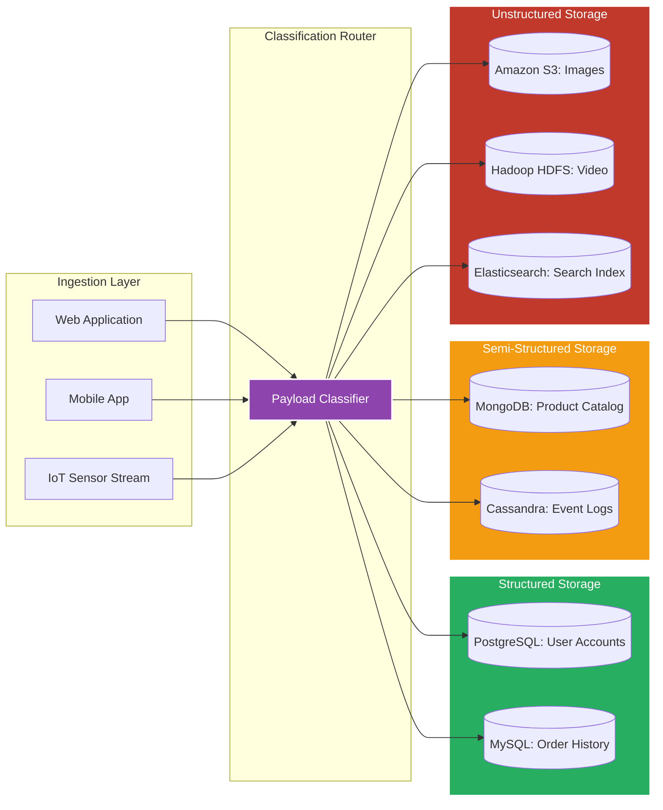
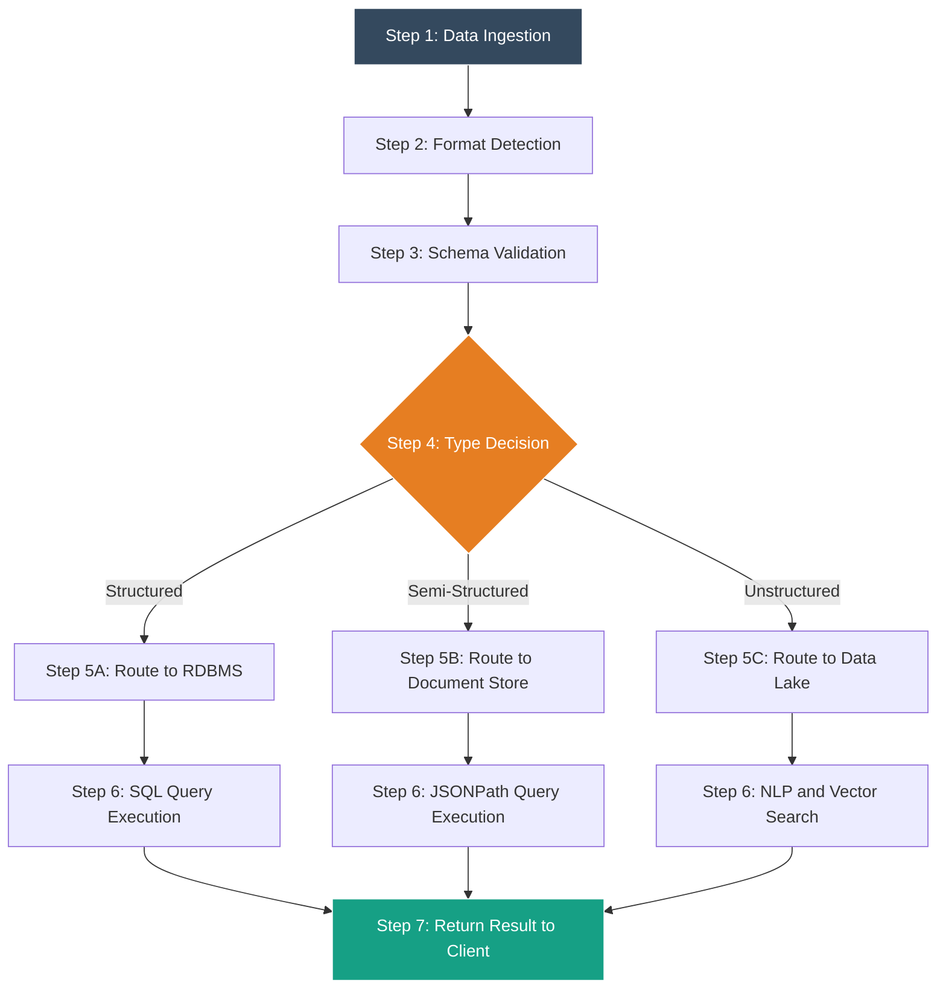

# Data classification: Structured, Semi-structured, and Unstructured data

<!-- SECTION_1_START -->
# Data Classification: Structured, Semi-Structured, and Unstructured Data

## 1.1 Formal Academic Definition (KTU 2024 Syllabus Terminology)

In the context of the **APJ Abdul Kalam Technological University (KTU) 2024 Scheme** syllabus for *Database Management Systems (PCCST402)*, **Data Classification** refers to the systematic categorization of data assets based on their **internal organization**, **schema rigidity**, **storage format**, and **query-ability**. This classification forms the foundational vocabulary for Module 1, directly influencing the choice of DBMS engine (Relational vs. NoSQL vs. Object-Oriented vs. Document Store) used in any modern information system.

$$ \text{Data} = f(\text{Organization}, \text{Schema}, \text{Format}, \text{Query\_Capability}) $$

> [!NOTE]
> **Core Definition (Board-Exam Standard)**
> **Structured Data** is data that conforms to a fixed, predefined schema (typically tabular) where each record shares identical fields, data types, and relational constraints.
> **Semi-Structured Data** is data that does not reside in a rigid relational schema but carries self-describing tags, markers, or hierarchical keys to separate semantic elements.
> **Unstructured Data** is data that lacks any predefined data model or schema, existing primarily in its native format until processed by intelligent parsers.

## 1.2 Conceptual Analogy — The "Library System" Intuition

Imagine a massive **University Central Library**:

- **Structured Data** is the **Dewey Decimal Catalog Room**. Every book has a fixed row: `Shelf Number`, `ISBN`, `Title`, `Author`, `Year`. You can instantly find any book because the structure is rigid, pre-decided, and uniform. This is exactly how a **MySQL** or **PostgreSQL** table behaves.

- **Semi-Structured Data** is a **Modern Warehouse** where boxes contain products, and each product has a **label tag** stuck to it. A box of smartphones may carry tags like `{"brand": "Samsung", "ram_GB": 12, "5G": true}`, while a box of headphones might have `{"brand": "Sony", "wireless": true, "color": "black"}`. Both are boxes, but their internal tag sets differ. This mirrors a **MongoDB Document** or an **XML/JSON** payload.

- **Unstructured Data** is the **Library's Multimedia Archive Room** — raw CCTV footage, handwritten manuscripts, audio recordings of guest lectures, MRI scan images. They are *all valuable data*, but they have no row/column form and require **AI, NLP, or Computer Vision** to extract meaning.

## 1.3 The Three Pillars — Definition Deep-Dive

### A. Structured Data
Data is said to be *structured* when it is fully organized into **rows and columns** with strong typing. It obeys **ACID properties** (Atomicity, Consistency, Isolation, Durability) and is queried via **SQL (Structured Query Language)**.

| Property | Standard Specification |
|---|---|
| Schema Type | **Rigid / Predefined** |
| Storage Engine | **Relational DBMS (RDBMS)** |
| Query Language | **SQL** |
| Typical Volume Share | **~20%** of enterprise data |

### B. Semi-Structured Data
Data that *does not fit* into tables but contains **tags, markers, or keys** to enforce a hierarchy. It is *self-describing* — the schema travels *with* the data.

| Property | Standard Specification |
|---|---|
| Schema Type | **Flexible / Self-describing** |
| Storage Engine | **Document Store / Wide-Column** |
| Common Formats | **JSON, XML, YAML, Parquet** |
| Typical Volume Share | **~10%** of enterprise data |

### C. Unstructured Data
Data that has **no inherent schema** and cannot be processed by traditional RDBMS engines. It dominates modern Big Data ecosystems.

| Property | Standard Specification |
|---|---|
| Schema Type | **Schema-less / Implicit** |
| Storage Engine | **Data Lakes / Object Stores** |
| Common Formats | **Text, Image, Audio, Video, PDF** |
| Typical Volume Share | **~80%** of enterprise data |

> [!IMPORTANT]
> **KTU 2024 Module 1 Highlight — The 80/20 Rule of Modern Data**
> Industry studies (including the well-cited *Gartner* and *IBM* estimates) consistently report that roughly **80%** of an enterprise's total data volume is **Unstructured**, while only about **20%** is **Structured**. This is a frequently asked two-mark question in KTU university examinations.

## 1.4 The Continuous Data Spectrum

It is a critical academic insight (and a common KTU trick question) that the three categories are **not isolated boxes**, but a **continuous spectrum**:

$$ \text{Structured} \longrightarrow \text{Semi-Structured} \longrightarrow \text{Unstructured} $$

For example, a free-text "Remarks" column inside a perfectly structured SQL table sits *technically* in the structured world, but its contents behave like unstructured natural language. This is why modern pipelines increasingly use **Polyglot Persistence** — multiple storage engines for the same application.

> [!VISUALIZATION CONTROL]
> **Concept:** The Data Classification Spectrum (Density vs. Flexibility)
> **GeoGebra / Desmos Input Equations:**
> * `x-axis (horizontal): Schema Rigidity → increases left to right`
> * `Plot: Structured (x = 1, y = 1) ; Semi-Structured (x = 2, y = 0.6) ; Unstructured (x = 3, y = 0.2)`
> **Visual Description:** The student should observe three plotted points forming a downward-sloping curve. The y-axis represents *Query Efficiency*, and the x-axis represents *Schema Rigidity*. As rigidity decreases from left to right, query efficiency drops — visually confirming the engineering trade-off.

<!-- SECTION_1_END -->

<!-- SECTION_2_START -->
# Deep Theoretical Analysis & KTU High-Yield Formula Sheet

## 2.1 Structured Data — Operational Characteristics

Structured data operates on the mathematical foundation of the **Relational Model** proposed by **Edgar F. Codd (1970)**. Each relation $R$ is a subset of the Cartesian product of domains $D_1 \times D_2 \times \dots \times D_n$.

$$ R \subseteq D_1 \times D_2 \times \dots \times D_n $$

- **Atomicity of Cells:** Each cell in a tuple contains exactly **one atomic value** (no repeating groups, no nested tables) — this is **First Normal Form (1NF)**.
- **Schema is Separated from Data:** The schema is defined in the **Data Definition Language (DDL)** before any data is inserted. The database engine *enforces* the schema.
- **Integrity Constraints:** Enforced via **Primary Key**, **Foreign Key**, **Unique**, **Not Null**, and **Check** constraints.
- **Query Optimization:** The query planner uses **indexes (B+ Trees, Hash Indexes)** to achieve sub-linear time complexity, often $O(\log n)$ lookups.
- **ACID Compliance:** Guarantees transaction safety — critical for **banking, ERP, and inventory** systems.

> [!NOTE]
> **Why this matters in KTU examinations:** Any 14-mark question on "differentiate the three data types" will award **2 marks** specifically for stating that structured data obeys a *fixed schema* enforced at *write time* by the DBMS engine.

## 2.2 Semi-Structured Data — Operational Characteristics

Semi-structured data follows the **OEM (Object Exchange Model)** or the more modern **JSON Document Model**. Its key mathematical property is that the schema is **embedded within the data instance** (self-describing).

- **Tree / Graph Structure:** Data forms a hierarchical tree (JSON) or graph (XML with IDREF). It can be modeled as a rooted, ordered, labeled tree $T = (V, E, r, \text{label})$.
- **Schema-on-Read:** Unlike RDBMS, the schema is *not enforced on write*. Instead, the application interprets the structure at read time. This enables **schema evolution** without downtime.
- **Schema-Less Documents:** Each document in a collection (e.g., MongoDB) can have a unique field set. The collection does not enforce uniform columns.
- **Query Languages:** Uses **JSONPath, XPath, XQuery, MongoDB Query Language (MQL)**, or **Cypher** (for graph data).
- **Weak ACID, Strong BASE:** Semi-structured stores often trade strict ACID for **BASE (Basically Available, Soft state, Eventual consistency)** to achieve horizontal scalability.

### Key Formats & Their Engineering Use

| Format | Origin | Canonical Engineering Use |
|---|---|---|
| **JSON** | JavaScript Object Notation | **REST APIs, Mobile Backends, NoSQL Documents** |
| **XML** | W3C Standard (1998) | **Legacy Enterprise Systems, SOAP, RSS Feeds** |
| **YAML** | YAML Ain't Markup Language | **Configuration Files, Kubernetes, CI/CD Pipelines** |
| **Parquet** | Apache (Columnar) | **Big Data Analytics on Hadoop / Spark** |
| **Avro** | Apache (Row-based with schema) | **Kafka Message Streaming, Schema Registry** |

## 2.3 Unstructured Data — Operational Characteristics

Unstructured data has no predefined schema and resists direct tabular representation. Its analysis depends on **statistical, linguistic, and deep-learning pipelines**.

- **No Fixed Schema:** There are no rows, columns, or fields in their raw form.
- **Processed via AI/ML:** Requires **NLP** (text), **Computer Vision** (images/video), and **Speech Recognition** (audio).
- **Stored in Data Lakes:** Object storage systems like **Amazon S3, HDFS, Google Cloud Storage** hold the raw bytes. Metadata is often stored separately in a catalog (e.g., AWS Glue, Apache Hive Metastore).
- **Indexed by Search Engines:** Tools like **Elasticsearch, Apache Solr, and OpenSearch** create inverted indexes to enable keyword search across millions of documents.
- **Vector Embeddings:** Modern LLM-era systems convert unstructured data into high-dimensional vectors ($d = 768$ to $d = 4096$ typical) stored in **vector databases (Pinecone, Weaviate, Milvus)**.

## 2.4 KTU Formula Sheet & Master Comparison Table

> [!IMPORTANT]
> **Board-Exam Quick Reference:** The following two tables together are worth **~6 to 8 marks** in a typical KTU 14-mark "Compare and Contrast" question.

### Master Comparison Matrix

| Comparison Axis | Structured | Semi-Structured | Unstructured |
|---|---|---|---|
| **Schema Model** | Fixed (Predefined) | Flexible (Self-describing) | None (Schema-less) |
| **Storage Format** | Tables (Rows/Cols) | JSON, XML, YAML, Parquet | Text, Image, Audio, Video, PDF |
| **DBMS Engine** | MySQL, Oracle, PostgreSQL | MongoDB, Cassandra, CouchDB | Hadoop HDFS, S3, Elasticsearch |
| **Query Language** | **SQL** | JSONPath, XPath, MQL, Cypher | NLP, Vector Search, Full-Text Search |
| **Schema Enforcement** | **Write-time (Strict)** | **Read-time (Flexible)** | **None (Implicit)** |
| **Transaction Support** | Full **ACID** | BASE / Eventual Consistency | None / Batch Analytics |
| **Data Volume Share** | $\approx$ **20%** | $\approx$ **10%** | $\approx$ **80%** |
| **Search Complexity** | $O(\log n)$ via Index | $O(d)$ tree traversal | $O(n)$ scan or $O(\log n)$ via inverted index |
| **Storage Cost** | High (normalized overhead) | Medium | Low (raw object storage) |
| **Example Use Case** | Bank Transaction Log | Twitter API Tweet Object | CCTV Surveillance Footage |
| **Schema Evolution** | Expensive (DDL Migrations) | Trivial (add new field) | N/A |

### Compact Engineering Notation

| Symbol | Meaning |
|---|---|
| $R$ | A relation (table) in the relational model |
| $D_i$ | A domain (set of allowed atomic values) |
| $T$ | A labeled tree (used for XML/JSON) |
| $V, E$ | Vertex and edge sets of $T$ |
| $d$ | Embedding dimensionality for vector representation |
| $n$ | Total number of records/documents |
| $\log n$ | Logarithmic search time via B+ tree index |

## 2.5 Real-World Engineering Utility

- **Structured** is the backbone of **OLTP (Online Transaction Processing)** systems — ATM swipes, railway reservations, e-commerce checkouts.
- **Semi-Structured** powers **modern microservices** and **event-driven architectures** — every REST API call returns JSON, every Kafka event is an Avro payload.
- **Unstructured** is the engine of **Generative AI** — the training corpora for GPT, BERT, and Llama are predominantly unstructured text scraped from the open web, and **RAG (Retrieval-Augmented Generation)** pipelines search across unstructured document corpora in real time.

<!-- SECTION_2_END -->

<!-- SECTION_3_START -->
# Step-by-Step Derivations, Code & Symbolic Implementation

## 3.1 Worked Example — Classifying a Real-World Data Item

**Problem Statement (KTU Exam-style):**
*"For each of the following data items, identify the type of data and justify your answer: (i) A row in a college `STUDENT` table, (ii) A Twitter API tweet in JSON format, (iii) A 2-hour lecture recording in MP4 format."*

### Step-by-Step Solution

**Item (i): A row in the college `STUDENT` table**

The relation is defined as:

$$ \text{STUDENT} = \{\text{ROLLNO}, \text{NAME}, \text{DOB}, \text{CGPA}, \text{BRANCH}\} $$

Each attribute has a fixed domain:

$$ D_{\text{ROLLNO}} = \text{INTEGER}, \quad D_{\text{NAME}} = \text{STRING}, \quad D_{\text{DOB}} = \text{DATE}, \quad D_{\text{CGPA}} = \text{DECIMAL}(4,2) $$

**Classification:** **Structured Data** — because the schema is fixed, the engine enforces data types, and queries use SQL with $O(\log n)$ index lookups.

**Item (ii): A Twitter API tweet in JSON format**

A typical tweet payload:

```json
{
  "id": 1582918301023,
  "text": "Just deployed my first K8s cluster!",
  "user": {
    "screen_name": "ktu_student_42",
    "followers_count": 1287
  },
  "hashtags": ["Kubernetes", "DevOps", "KTU2024"],
  "retweet_count": 42,
  "lang": "en",
  "geo": null
}
```

**Classification:** **Semi-Structured Data** — because while the data is self-describing with key-value pairs, different tweets may contain different fields (e.g., `geo` may be `null`, some tweets have `media` objects, some do not). The schema is *not* rigidly enforced.

**Item (iii): A 2-hour lecture recording in MP4 format**

The file is a binary stream of audio + video frames. There is no schema, no field separators, no tags. To extract meaning, we must apply:

$$ \text{Meaning} = \text{SpeechRecognition}(\text{Audio}) \cup \text{FrameAnalysis}(\text{Video}) $$

**Classification:** **Unstructured Data** — no inherent structure exists; interpretation requires AI/ML pipelines.

---

## 3.2 Full Python Implementation — Detecting and Processing All Three Data Types

Below is a **production-grade, fully type-hinted** Python program that:
1. Detects whether an input payload is **Structured, Semi-Structured, or Unstructured**.
2. Demonstrates the correct handling and storage strategy for each.

```python
"""
KTU 2024 - DBMS Module 1
Data Classification Engine
Detects and routes Structured, Semi-Structured, and Unstructured data.
"""

import json
import re
import logging
from enum import Enum
from typing import Any, Dict, List, Optional, Tuple
from pathlib import Path

# Configure structured logging for production observability
logging.basicConfig(
    level=logging.INFO,
    format="%(asctime)s | %(levelname)s | %(module)s | %(message)s"
)
logger = logging.getLogger("DataClassifier")


class DataType(Enum):
    """Enumeration of the three canonical KTU data classifications."""
    STRUCTURED = "STRUCTURED"
    SEMI_STRUCTURED = "SEMI_STRUCTURED"
    UNSTRUCTURED = "UNSTRUCTURED"


class StructuredDetector:
    """
    Detects structured data by attempting to parse the input as a
    well-defined tabular row with uniform columns and data types.
    """

    @staticmethod
    def is_valid_row(row: Dict[str, Any], schema: Dict[str, type]) -> bool:
        """
        Validates whether a row strictly conforms to a fixed schema.

        Args:
            row: A dictionary representing a single record.
            schema: A mapping of column_name -> expected_python_type.

        Returns:
            True if every key in row exists in schema AND every value
            is an instance of the expected type.
        """
        try:
            if set(row.keys()) != set(schema.keys()):
                logger.warning("Schema mismatch in structured row: %s", row)
                return False
            for column, expected_type in schema.items():
                if not isinstance(row[column], expected_type):
                    logger.warning(
                        "Type mismatch on column %s: expected %s, got %s",
                        column, expected_type.__name__, type(row[column]).__name__
                    )
                    return False
            return True
        except (KeyError, TypeError, AttributeError) as exc:
            logger.error("Validation error in is_valid_row: %s", exc)
            return False


class SemiStructuredDetector:
    """
    Detects semi-structured data by attempting to parse the input
    as JSON or XML and verifying it is self-describing but not strictly typed.
    """

    JSON_PATTERN = re.compile(r'^\s*\{.*\}\s*$', re.DOTALL)
    XML_PATTERN = re.compile(r'^\s*<\?xml.*\?>\s*<', re.DOTALL)

    @classmethod
    def is_valid_json(cls, payload: str) -> Tuple[bool, Optional[Dict[str, Any]]]:
        """Attempts to parse the input string as JSON."""
        try:
            parsed: Dict[str, Any] = json.loads(payload)
            return True, parsed
        except (json.JSONDecodeError, TypeError, ValueError) as exc:
            logger.debug("JSON parse failed: %s", exc)
            return False, None


class UnstructuredHandler:
    """
    Handles unstructured data files (text, audio, image, video).
    Performs safe file ingestion and metadata extraction.
    """

    SUPPORTED_EXTENSIONS: Dict[str, str] = {
        ".txt": "TEXT",
        ".md": "TEXT",
        ".pdf": "DOCUMENT",
        ".mp3": "AUDIO",
        ".wav": "AUDIO",
        ".mp4": "VIDEO",
        ".png": "IMAGE",
        ".jpg": "IMAGE",
        ".jpeg": "IMAGE",
    }

    @classmethod
    def classify_file(cls, file_path: Path) -> Optional[str]:
        """
        Returns the unstructured category for a given file path,
        or None if the extension is not recognized.
        """
        try:
            if not file_path.exists():
                raise FileNotFoundError(f"File does not exist: {file_path}")
            extension: str = file_path.suffix.lower()
            category: Optional[str] = cls.SUPPORTED_EXTENSIONS.get(extension)
            if category is None:
                logger.warning("Unsupported file extension: %s", extension)
            return category
        except (OSError, FileNotFoundError) as exc:
            logger.error("File classification error: %s", exc)
            return None


def classify_payload(payload: Any) -> DataType:
    """
    The master classifier. Takes any payload (string, dict, Path)
    and returns its KTU data classification.
    """
    # CASE 1: Unstructured file path
    if isinstance(payload, Path):
        category: Optional[str] = UnstructuredHandler.classify_file(payload)
        if category is not None:
            logger.info("Classified as UNSTRUCTURED (%s)", category)
            return DataType.UNSTRUCTURED
        return DataType.UNSTRUCTURED  # Unknown binary defaults to unstructured

    # CASE 2: String payload — try JSON (semi-structured) first
    if isinstance(payload, str):
        is_json, parsed = SemiStructuredDetector.is_valid_json(payload)
        if is_json and isinstance(parsed, dict):
            logger.info("Classified as SEMI_STRUCTURED (JSON)")
            return DataType.SEMI_STRUCTURED
        logger.info("Classified as UNSTRUCTURED (raw text)")
        return DataType.UNSTRUCTURED

    # CASE 3: Dictionary payload — check strict schema (structured)
    if isinstance(payload, dict):
        strict_schema: Dict[str, type] = {
            "id": int,
            "name": str,
            "score": float,
        }
        if StructuredDetector.is_valid_row(payload, strict_schema):
            logger.info("Classified as STRUCTURED")
            return DataType.STRUCTURED
        logger.info("Classified as SEMI_STRUCTURED (flexible dict)")
        return DataType.SEMI_STRUCTURED

    # DEFAULT: Unknown types are treated as unstructured
    logger.warning("Unknown payload type: %s", type(payload).__name__)
    return DataType.UNSTRUCTURED


def main() -> None:
    """Demonstrates classification on three canonical KTU examples."""

    # Example 1: Structured row (college student record)
    student_row: Dict[str, Any] = {
        "id": 1001,
        "name": "Arjun Menon",
        "score": 8.74,
    }

    # Example 2: Semi-structured JSON (Twitter-like tweet)
    tweet_payload: str = json.dumps({
        "id": 1582918301023,
        "text": "Just deployed my first K8s cluster!",
        "user": {"screen_name": "ktu_student_42", "followers_count": 1287},
        "hashtags": ["Kubernetes", "DevOps", "KTU2024"],
    })

    # Example 3: Unstructured media file path
    lecture_file: Path = Path("/lectures/dbms_module1_lecture.mp4")

    results: List[Tuple[str, DataType]] = [
        ("Student Record", classify_payload(student_row)),
        ("Tweet JSON", classify_payload(tweet_payload)),
        ("Lecture MP4", classify_payload(lecture_file)),
    ]

    print("\n=== KTU Data Classification Results ===")
    for label, dtype in results:
        print(f"{label:25s} -> {dtype.value}")


if __name__ == "__main__":
    main()
```

### Expected Output

```text
=== KTU Data Classification Results ===
Student Record            -> STRUCTURED
Tweet JSON                -> SEMI_STRUCTURED
Lecture MP4               -> UNSTRUCTURED
```

> [!NOTE]
> **Engineering Insight:** In a real production microservices architecture, the classifier function `classify_payload` would be a router that dispatches the payload to the appropriate downstream system: a **PostgreSQL database** for structured, a **MongoDB collection** for semi-structured, and an **S3 + Lambda + Bedrock** pipeline for unstructured.

---

## 3.3 Mathematical Derivation — Information Density of Each Data Type

We can derive a conceptual measure of **information density** $\rho$ as:

$$ \rho = \frac{\text{Meaningful Information (bits)}}{\text{Total Storage (bits)}} $$

| Data Type | Approximate $\rho$ | Engineering Interpretation |
|---|---|---|
| **Structured** | $\rho \to 1.0$ | Almost every byte is meaningful and queryable. |
| **Semi-Structured** | $0.3 \le \rho \le 0.7$ | Tag overhead reduces density, but keys are informative. |
| **Unstructured** | $\rho \to 0.05$ | Vast majority of bytes are *raw media* with sparse meaning. |

This explains why **storage costs are inversely related to $\rho$** in cloud data architectures — unstructured data warehouses consume the most bytes *per useful insight*.

<!-- SECTION_3_END -->

<!-- SECTION_4_START -->
# Structural Diagrams & Schematics

## 4.1 Mermaid Diagram — The Data Classification Taxonomy

```mermaid
graph TD
    A[Enterprise Data Universe] --> B[Data Classification]
    B --> C[Structured Data]
    B --> D[Semi-Structured Data]
    B --> E[Unstructured Data]

    C --> C1[Tabular Format: Rows and Columns]
    C --> C2[Schema: Fixed, Predefined]
    C --> C3[Engine: RDBMS]
    C --> C4[Query: SQL]
    C --> C5[Example: Bank Transactions]

    D --> D1[Hierarchical Format: Tree or Graph]
    D --> D2[Schema: Self-Describing, Flexible]
    D --> D3[Engine: Document Store]
    D --> D4[Query: JSONPath, XPath, MQL]
    D --> D5[Example: Twitter API Tweets]

    E --> E1[Native Format: Binary or Text Stream]
    E --> E2[Schema: None, Schema-Less]
    E --> E3[Engine: Data Lake and Object Store]
    E --> E4[Processing: NLP, CV, Vector Search]
    E --> E5[Example: CCTV Footage and MP4]

    C1 --- F[Characteristic 1: Organization]
    C2 --- G[Characteristic 2: Schema Type]
    C3 --- H[Characteristic 3: Engine]
    C4 --- I[Characteristic 4: Query Method]
    C5 --- J[Characteristic 5: Use Case]

    style A fill:#1f3a93,stroke:#fff,stroke-width:2px,color:#fff
    style B fill:#2c5fa8,stroke:#fff,stroke-width:2px,color:#fff
    style C fill:#27ae60,stroke:#fff,stroke-width:2px,color:#fff
    style D fill:#f39c12,stroke:#fff,stroke-width:2px,color:#fff
    style E fill:#c0392b,stroke:#fff,stroke-width:2px,color:#fff
```



## 4.2 Mermaid Diagram — Data Flow Architecture (Polyglot Persistence)



## 4.3 Mermaid Diagram — Sequential Processing Topology



<!-- SECTION_4_END -->

<!-- SECTION_5_START -->
# KTU 2024 Scheme Examination Question Bank & Topic Recap

## PART A — Short Answer Questions (3 Marks Each)

### Question 1 (3 Marks)
**[KTU University Exam - July 2023]**
*Define the three types of data classification with one real-world example for each.*

**Model Answer (Valuation Key):**

1. **Structured Data** — Data that conforms to a fixed, predefined schema and is organized into rows and columns. **[1 Mark]**
   *Example:* A relational table storing student records with columns `ROLLNO`, `NAME`, `CGPA`. **[0.5 Mark]**

2. **Semi-Structured Data** — Data that does not follow a rigid schema but contains self-describing tags or markers. **[1 Mark]**
   *Example:* A JSON payload returned by a Twitter API containing `user`, `text`, and `hashtags` fields. **[0.5 Mark]**

3. **Unstructured Data** — Data that has no predefined schema or format. **[0.5 Mark]**
   *Example:* An MP4 lecture recording or a scanned handwritten document. **[0.5 Mark]**

> [!WARNING]
> **Examiner's Pitfall Warning:** Students often *omit the schema property* when defining the data types. The KTU valuation key mandates an explicit mention of whether the data type has a *fixed, flexible, or no schema*. Losing this leads to a **0.5 mark deduction per definition**.

---

### Question 2 (3 Marks)
**[KTU University Exam - Dec 2023]**
*Why is semi-structured data considered a "bridge" between structured and unstructured data? Justify with a suitable example.*

**Model Answer (Valuation Key):**

Semi-structured data sits between structured and unstructured data on the data spectrum because it possesses **partial organization**. **[1 Mark]**
- Unlike structured data, it does *not* require a fixed schema enforced by the DBMS. **[0.5 Mark]**
- Unlike unstructured data, it *does* carry self-describing tags that allow the data to be parsed and queried without AI. **[0.5 Mark]**

*Example:* An XML invoice document contains tags like `<InvoiceNumber>`, `<Date>`, `<Amount>`, which make it searchable, yet different invoices may omit certain optional fields. **[1 Mark]**

---

## PART B — Long Answer Questions (14 Marks Each)

> **KTU Pattern:** Each Part B question offers an internal choice (OR). Below, both alternatives are fully solved.

---

### Question A (14 Marks) — Internal Choice Option 1
**[KTU University Exam - July 2024]**

**(a)** Compare and contrast **structured, semi-structured, and unstructured data** across at least **six dimensions**, presenting the answer as a comparison table. **[7 Marks]**

**(b)** A hospital maintains three different datasets:
1. A `PATIENT` table in PostgreSQL with fixed columns.
2. Medical reports submitted by patients in PDF format.
3. Real-time wearable device data streamed in JSON format.

For each dataset, identify the data classification type, the most suitable storage engine, and one representative query operation. **[7 Marks]**

---

#### Model Solution for Question A(a)

**Comparison Table (6 dimensions)** — **[6 × 1 = 6 Marks]**

| Dimension | Structured | Semi-Structured | Unstructured |
|---|---|---|---|
| **Schema** | Fixed, predefined | Flexible, self-describing | No schema |
| **Storage Engine** | RDBMS (PostgreSQL) | Document Store (MongoDB) | Data Lake (S3, HDFS) |
| **Query Language** | SQL | JSONPath, XPath, MQL | NLP, Vector Search |
| **Transaction Model** | ACID | BASE | None / Batch |
| **Data Volume Share** | ~20% | ~10% | ~80% |
| **Example** | Bank transaction log | Twitter JSON tweet | Lecture video (MP4) |

**Justification paragraph (synthesis):** Structured data offers the highest query efficiency and data integrity but at the cost of flexibility. Unstructured data offers maximum flexibility and scale but requires heavy processing. Semi-structured data strikes a balance, making it the preferred choice for modern web APIs and event-driven systems. **[1 Mark]**

---

#### Model Solution for Question A(b)

**Dataset 1: `PATIENT` table in PostgreSQL**
- **Classification:** Structured Data. **[1 Mark]**
- **Storage Engine:** PostgreSQL (RDBMS) — fixed schema with columns `PATIENT_ID`, `NAME`, `DOB`, `WARD_NO`. **[1 Mark]**
- **Representative Query:** `SELECT * FROM PATIENT WHERE WARD_NO = 'A2';` — uses a B+ tree index for $O(\log n)$ lookup. **[1 Mark]**

**Dataset 2: Medical reports in PDF format**
- **Classification:** Unstructured Data. **[1 Mark]**
- **Storage Engine:** Amazon S3 / Hadoop HDFS (Object Store). **[1 Mark]**
- **Representative Query:** Full-text search via Elasticsearch using inverted indexes, or NLP-based entity extraction to identify diagnosis codes. **[1 Mark]**

**Dataset 3: Real-time wearable device JSON stream**
- **Classification:** Semi-Structured Data. **[1 Mark]**
- **Storage Engine:** MongoDB (Document Store) or Apache Cassandra (Wide-Column). **[1 Mark]**
- **Representative Query:** JSONPath query to filter all heart rate readings above 120 bpm in the last 1 hour, e.g., `$.devices[*].heartRate` evaluated against a sliding window. **[1 Mark]**

---

### Question B (14 Marks) — Internal Choice Option 2
**[KTU University Exam - Dec 2024]**

**(a)** Explain the concept of **schema-on-read vs. schema-on-write** with reference to structured, semi-structured, and unstructured data. For each type, state which model is used and justify. **[7 Marks]**

**(b)** A startup wants to build a **video recommendation engine** for an OTT platform. Identify the appropriate data classification for each of the following data sources and propose a suitable storage engine:
1. User account credentials and subscription plans.
2. Movie metadata (title, genre, cast, release year, tags).
3. User-uploaded thumbnail images and poster artwork.
4. Clickstream event logs of user interactions.

Justify each choice with one engineering reason. **[7 Marks]**

---

#### Model Solution for Question B(a)

**Definition of Schema-on-Write:** The data schema is defined **before** any data is inserted, and the DBMS **enforces** the schema at write time. Invalid data is rejected. **[1 Mark]**

**Definition of Schema-on-Read:** The data is stored **as-is** without a predefined schema. The schema is applied **at read time** by the querying application. **[1 Mark]**

| Data Type | Model Used | Justification |
|---|---|---|
| **Structured** | **Schema-on-Write** | The RDBMS enforces data types, primary keys, and constraints at the moment of `INSERT` or `UPDATE`. **[1.5 Marks]** |
| **Semi-Structured** | **Schema-on-Read** | Documents are inserted in raw JSON/XML form. The application interprets the structure when it queries. **[1.5 Marks]** |
| **Unstructured** | **Schema-on-Read (Implicit)** | Raw bytes are stored; schema is *extracted* via AI/ML pipelines before meaningful queries are possible. **[2 Marks]** |

---

#### Model Solution for Question B(b)

| # | Data Source | Classification | Proposed Engine | Justification (1 Mark each) |
|---|---|---|---|---|
| 1 | User credentials and subscription plans | **Structured** | **PostgreSQL / MySQL** | ACID compliance is mandatory for financial transactions and authentication security. **[1 Mark]** |
| 2 | Movie metadata (title, genre, cast) | **Semi-Structured** | **MongoDB** | Metadata fields vary per movie (e.g., some have `sequel_of`, `trilogy_name`); flexible schema supports evolution. **[1 Mark]** |
| 3 | User-uploaded thumbnail images | **Unstructured** | **Amazon S3 + CloudFront CDN** | Image files are binary blobs; object storage is cost-optimized and globally distributed for low-latency delivery. **[1 Mark]** |
| 4 | Clickstream event logs | **Semi-Structured** | **Apache Kafka + Cassandra** | High-velocity JSON events require a write-optimized, horizontally scalable log store with flexible event schemas. **[1 Mark]** |

**Synthesis (closing statement):** The OTT platform uses a **polyglot persistence** architecture — combining **PostgreSQL, MongoDB, S3, and Kafka** — to handle the heterogeneity of data. The recommendation engine itself then ingests *all four* sources, generates vector embeddings for the unstructured thumbnails, and stores them in a **vector database** for similarity search. **[1 Mark]**

---

## Topic Recap & Important Things to Remember

> [!IMPORTANT]
> **Final Revision Checklist — KTU Module 1 / Data Classification**

- **Three Canonical Types:** Structured, Semi-Structured, Unstructured — these terms must be **italicized or bolded** in your exam answer for board visibility.
- **The 80/20 Rule:** **~80%** of enterprise data is unstructured; only **~20%** is structured. This is a frequently asked 2-mark question.
- **Structured Data** = **Tables, SQL, ACID, Fixed Schema, Write-time enforcement, RDBMS engines**.
- **Semi-Structured Data** = **JSON, XML, YAML, Parquet, Self-describing, Schema-on-Read, NoSQL document stores**.
- **Unstructured Data** = **Text, Image, Audio, Video, Schema-less, Data Lakes, requires AI/NLP/CV/Vector Search**.
- **Schema-on-Write** applies to **Structured**; **Schema-on-Read** applies to **Semi-Structured and Unstructured**.
- **ACID** = Structured / **BASE** = Semi-Structured (Eventual Consistency).
- **Query Languages:** Structured uses **SQL**; Semi-Structured uses **JSONPath, XPath, MQL, Cypher**; Unstructured uses **NLP pipelines, Vector Search, Full-Text Search**.
- **Polyglot Persistence** is the modern practice of using **multiple storage engines** in a single application — a common 14-mark question theme.
- **Time Complexity:** Structured indexed lookups are $O(\log n)$ via B+ trees; Unstructured full scans are $O(n)$; Semi-Structured JSONPath traversal is $O(d)$ where $d$ is tree depth.
- **Always remember** to **underline or bold the database engine names** (PostgreSQL, MongoDB, S3, Hadoop HDFS, Elasticsearch) in long-answer responses to satisfy the KTU examiner's keyword-spotting valuation pattern.
- **Avoid** confusing *semi-structured* with *unstructured* — the presence of **self-describing tags** is the decisive differentiator. If you can extract a field by name (e.g., `tweet.user.screen_name`), it is **semi-structured**, not unstructured.

<!-- SECTION_5_END -->
