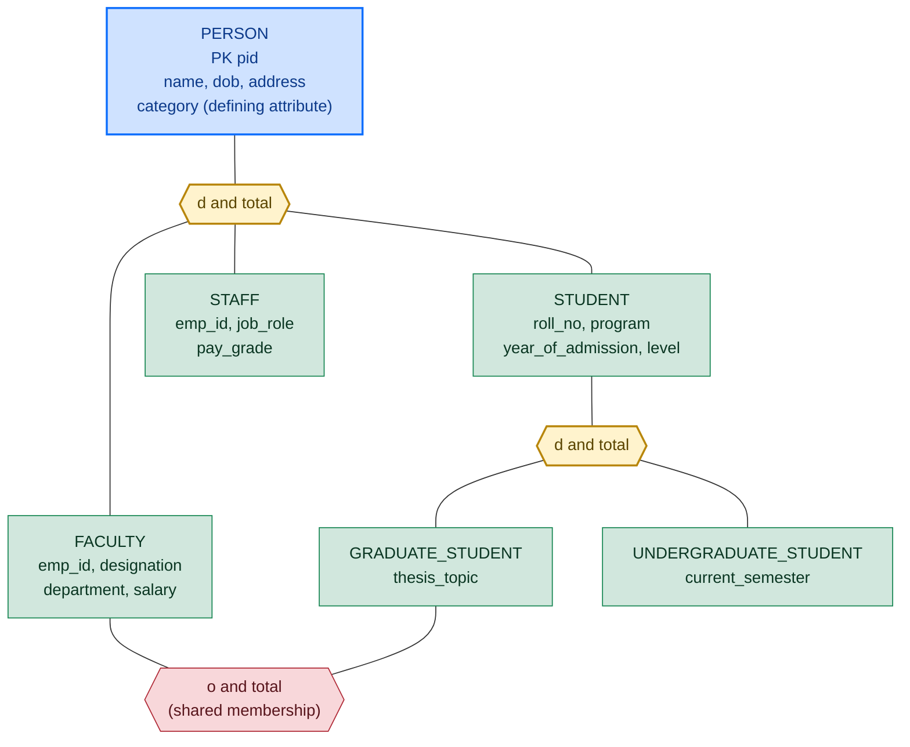
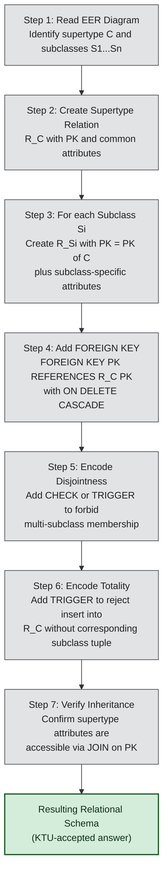
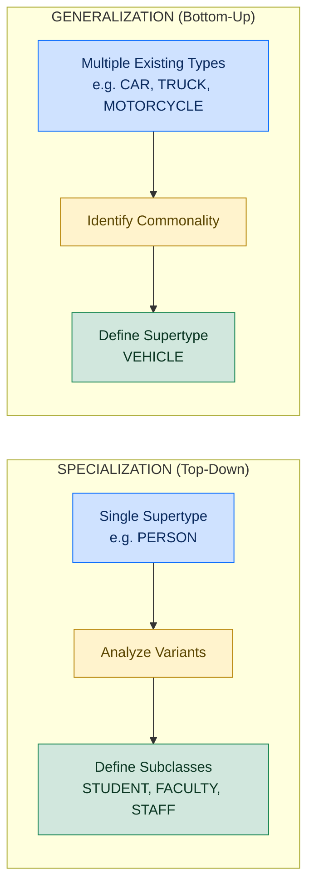

# Extended ER (EER) features: Specialization and Generalization

<!-- SECTION_1_START -->

# Extended ER (EER) Features: Specialization and Generalization

## 1.1 Formal Academic Definition (KTU 2024 Syllabus)

In the context of the **Extended Entity-Relationship (EER) model**, the KTU 2024 syllabus (PCCST402 – Module 1) defines the following two complementary refinement operations on the classical ER model:

> **Specialization** is the process of designating a *subgrouping* of an entity set (called the **superclass** or **entity supertype**) into one or more distinct entity sub-sets (called **subclasses** or **entity subtypes**) that share common attributes and/or relationships *plus* additional attributes and/or relationships that are unique to the subgrouping.

> **Generalization** is the reverse, *bottom-up* process of synthesizing two or more entity types that share common features into a single, higher-level entity supertype on the basis of their commonalities, suppressing the differences for the moment.

The EER model also introduces the concept of an **inheritance / IS-A relationship** (also called a **supertype–subtype relationship**), which states that *every instance of a subclass is also an instance of the superclass*.

> [!IMPORTANT]
> **KTU Board Tip:** In KTU 2024 Scheme answer sheets, you **must** explicitly state that the EER model **extends** the basic ER model with three additional concepts: **specialization**, **generalization**, and **category (union type)**. A definition that only mentions specialization/generalization without naming *category* is treated as incomplete and may lose a mark.

## 1.2 Intuitive Overview & Real-World Analogy

Imagine the **Vehicle** entity set in a transport company's database. A *Vehicle* could be a *Car*, a *Truck*, or a *Motorcycle*. They all share common attributes (`vehicle_id`, `make`, `year_of_manufacture`, `registration_no`), but:

- A `Car` has `num_doors` and `trunk_capacity`.
- A `Truck` has `max_load_tons` and `num_axles`.
- A `Motorcycle` has `engine_cc` and `has_sidecar (Yes/No)`.

This is a classic scenario where the designer must decide:

1. **Specialization (Top-Down):** Start with one entity `VEHICLE` and *split* it into `CAR`, `TRUCK`, `MOTORCYCLE` based on type. This is a *conceptual refinement* — you already know the abstract super-entity and you are exploring its variants.
2. **Generalization (Bottom-Up):** Start with three separate entities `CAR`, `TRUCK`, `MOTORCYCLE` (perhaps in different parts of the schema) and *merge* them into a single supertype `VEHICLE` because they share so many attributes that it is wasteful to repeat them. This is *conceptual abstraction*.

> [!NOTE]
> **Analogy to Object-Oriented Programming:** A superclass `Shape` with subclasses `Circle`, `Rectangle`, `Triangle` is **specialization** (refining a generic concept). If you start with `Circle`, `Rectangle`, `Triangle` as standalone classes and pull their common fields (`color`, `area()`) into a new `Shape` parent, that is **generalization**. The IS-A relationship in EER is functionally identical to *class inheritance* in OOP.

## 1.3 Why EER? — The Limitations of the Basic ER Model

The classical ER model allows only:

- **Entities** (with attributes),
- **Relationships** (with cardinalities),
- **Weak entities, Multivalued/Composite/Derived attributes.**

It **cannot** elegantly express:

- Sub-classification (e.g., *an EMPLOYEE who is also a MANAGER*).
- Common attribute sharing across many entity types.
- Constraints governing the *partition* of an entity into sub-classes.

EER removes this limitation by adding the **supertype/subtype (IS-A)** abstraction.

> [!VISUALIZATION CONTROL]
> **Concept:** EER Supertype–Subtype Hierarchy (Tree/Forest Visualization)
> **GeoGebra / Desmos Input Equations (Points on a discrete lattice to represent the IS-A DAG):**
>
> * `P_super = (0, 4)`  → represents entity supertype (e.g., PERSON)
> * `P_emp = (-2, 2)`   → sub-entity EMPLOYEE
> * `P_stud = (0, 2)`  → sub-entity STUDENT
> * `P_fac = (2, 2)`   → sub-entity FACULTY (overlaps with EMPLOYEE)
> * `P_grad = (-1, 0)` → sub-entity GRADUATE_STUDENT (overlaps with STUDENT & EMPLOYEE)
>
> **Visual Description:** A downward tree where one parent (top node) connects to multiple children at the next layer, with some children having multiple parents (overlapping). The student should observe that arrows from sub-to-super denote the IS-A relationship and that the **d** (disjoint) and **o** (overlapping) letters in the circle determine how an instance of the supertype can be classified.

<!-- SECTION_1_END -->

<!-- SECTION_2_START -->

# Deep Theoretical Analysis & KTU High-Yield Formula Sheet

## 2.1 Anatomy of a Supertype–Subtype (IS-A) Relationship

Every specialization/generalization construct in EER is described by four design decisions. Mastering these is essential to score in KTU's "design" type 14-mark questions.

### 2.1.1 Predicate-defined (Condition-defined) Specialization

A subclass is defined by a **boolean predicate** applied to an attribute of the superclass.

> Example: `PERSON` is specialized into `FACULTY` and `STUDENT` using the predicate `(employee_type = 'FACULTY')`.

The predicate is *deterministic* — the DBMS can automatically classify an entity on insertion.

### 2.1.2 Attribute-defined Specialization

When the defining predicate involves a single attribute of the supertype (e.g., `job_type` for `EMPLOYEE`), the attribute is called the **defining attribute** of the specialization. EER diagrams conventionally underline this attribute.

### 2.1.3 User-defined Specialization

The user (DBA/applicant) decides the subclass membership *manually* on a per-entity basis. No automatic predicate is used.

> Example: A `PERSON` may be classified as `ALUMNUS` based on a manual decision by the registrar, not on any stored attribute.

## 2.2 The Two EER Disjointness Constraints

These are the **cardinality** constraints of a specialization and almost always appear in KTU Part A (3 marks) questions.

### 2.2.1 Disjointness Constraint

Specifies whether an instance of the supertype can be a member of **one** or **more than one** subclass simultaneously.

| Symbol on EER Diagram | Constraint | Formal Meaning | KTU Notation |
|---|---|---|---|
| `d` in a circle | **Disjoint** | An entity instance of the supertype can belong to **at most one** of the subclasses under the specialization. | $S \cap T = \emptyset$ |
| `o` in a circle | **Overlapping** | An entity instance can belong to **more than one** subclass simultaneously. | $S \cap T \neq \emptyset$ (permitted) |

### 2.2.2 Completeness (Total Participation) Constraint

Specifies whether **every** instance of the supertype must also be a member of **at least one** subclass.

| Symbol on EER Diagram | Constraint | Formal Meaning |
|---|---|---|
| Double line from supertype to specialization circle | **Total** | Every supertype entity **must** be in at least one subclass. |
| Single line | **Partial** | A supertype entity **need not** be in any subclass. |

### 2.2.3 The Four Combinations

| Combination | Read As | Practical Use |
|---|---|---|
| Disjoint + Total (`d` + double line) | **Partition** of the supertype | Bank accounts → `SAVING`, `CURRENT`, `LOAN` (a person may have several, but each *account* is exactly one type). |
| Disjoint + Partial | `d` + single line | `VEHICLE` → `CAR`, `TRUCK` (some vehicles are "others"). |
| Overlapping + Total | `o` + double line | `PERSON` → `EMPLOYEE`, `STUDENT`, `ALUMNUS` (a person is at least one, possibly more). |
| Overlapping + Partial | `o` + single line | `PERSON` → `FACULTY`, `GRADUATE_STUDENT` (a person may be none of these). |

## 2.3 Attribute Inheritance

A fundamental property of the IS-A relationship:

> [!IMPORTANT]
> **Inheritance Principle (Rumbaugh / Elmasri & Navathe):** Every attribute, primary key, and relationship of the supertype is also an attribute, primary key, or relationship of every subclass. This is a logical consequence of the *subset* relationship between subclass set $S$ and supertype set $C$, i.e. $S \subseteq C$.

## 2.4 Generalization vs. Specialization — Tabular Comparison

| Property | Specialization | Generalization |
|---|---|---|
| Direction | Top → Down | Bottom → Up |
| Starting point | A single supertype | Multiple related entity types |
| Purpose | Refine / differentiate | Abstract / unify |
| Designer intent | "I want to handle the special cases of X separately" | "These N entities share enough that I should factor it out" |
| Resulting representation | Same EER diagram (supertype–subtype tree) | Same EER diagram (supertype–subtype tree) |
| In the schema, is the diagram the *same*? | **Yes** — only the design *process* differs. | **Yes** — only the design *process* differs. |

> [!NOTE]
> **KTU Board Trap:** Many students write "Specialization and Generalization are *opposite* processes but the *diagram is the same*." Examiners reward exactly that sentence. Writing only "they are opposite" without the diagram-equivalence remark loses one of the 3 marks in a Part-A question.

## 2.5 The Category (Union Type) Construct

> **Category (Union Type):** A subclass that is a *subset of the union* of two or more (possibly different) supertypes. Each instance of the category must be an instance of **at least one** of the supertypes, but the supertypes may be of *different* entity types.

Example: A `VEHICLE_OWNER` may be a `PERSON` *or* a `COMPANY` *or* a `BANK` (different supertypes). The IS-A circle for `VEHICLE_OWNER` has a `U` symbol (for Union) instead of `d`/`o`.

## 2.6 KTU High-Yield Formula Sheet / Cheat Sheet

| # | Term | EER Notation | Formal Set-Theoretic Statement | KTU Frequent Use |
|---|---|---|---|---|
| 1 | Subclass membership | $s \in S$ where $S \subseteq C$ | $S \subseteq C$ | IS-A link |
| 2 | Disjoint | `d` in circle | $S_i \cap S_j = \emptyset$ for $i \neq j$ | Mutual exclusion of subtypes |
| 3 | Overlapping | `o` in circle | $S_i \cap S_j$ allowed | A faculty may also be a student |
| 4 | Total specialization | Double line | $\bigcup_i S_i = C$ | Every supertype must specialize |
| 5 | Partial specialization | Single line | $\bigcup_i S_i \subseteq C$ | Specialization is optional |
| 6 | Partition | `d` + double line | $\bigsqcup_i S_i = C$ | Cleanest, most testable |
| 7 | Union / Category | `U` symbol | $C = S_1 \cup S_2 \cup \dots$ with possibly $\neq$ supertypes | Heterogeneous sub-grouping |
| 8 | Defining attribute | Underlined attribute | Used in predicate | Condition-defined specialization |
| 9 | Inheritance | All attrs of $C$ belong to $S$ | $\text{attrs}(C) \subseteq \text{attrs}(S)$ | Always true by subset rule |
| 10 | ISA cardinality | $1{:}1$ (subclass side) | Each $s$ has one direct $C$ | A subclass entity belongs to exactly one supertype instance |

## 2.7 Real-World Engineering Utility

- **Healthcare HIS:** `PATIENT` → `INPATIENT` / `OUTPATIENT` (disjoint, total). Saves redundant NULL columns.
- **University SIS:** `PERSON` → `FACULTY` / `STUDENT` / `STAFF` (overlapping, total). A registrar who is also a graduate student is modelled correctly.
- **E-Commerce:** `PRODUCT` → `PHYSICAL` / `DIGITAL` / `SUBSCRIPTION` (disjoint, total). Each product has exactly one delivery model.
- **Banking:** `ACCOUNT` → `SAVING` / `CURRENT` / `FIXED_DEPOSIT` (disjoint, total). KTU frequently uses this exact example in question papers.

<!-- SECTION_2_END -->

<!-- SECTION_3_START -->

# Step-by-Step Derivations, EER Diagrams, and Mapping to Relational Schema

## 3.1 Worked Example: University EER (Kerala University Case)

**Problem Statement (Modelled on KTU model question):**

> Design an EER diagram for a university database with the following requirements:
> 1. `PERSON` is the supertype. The subtypes are `STUDENT`, `FACULTY`, and `STAFF`.
> 2. A `STUDENT` may be a `GRADUATE_STUDENT` or `UNDERGRADUATE_STUDENT` (disjoint, total w.r.t. STUDENT).
> 3. A `FACULTY` may also be a `GRADUATE_STUDENT` (i.e., part-time research scholar) — overlapping.
> 4. `STUDENT`, `FACULTY`, `STAFF` are mutually exclusive (a person is exactly one of these three).
> 5. `GRADUATE_STUDENT` has a `thesis_topic`; `UNDERGRADUATE_STUDENT` has a `current_semester`.
> 6. The defining attribute of the first-level specialization is `category` in `PERSON`.

### 3.1.1 Step-by-Step Construction

**Step 1 — Identify the supertype.**
The most general entity is `PERSON` with attributes `pid (PK)`, `name`, `dob`, `address`, `category` (defining attribute, with values `STUDENT` / `FACULTY` / `STAFF`).

**Step 2 — Apply the *first-level specialization*.**
Predicate is `category = 'STUDENT'` etc. This is **attribute-defined** and **disjoint + total** (a person must be in exactly one of the three subclasses).

**Step 3 — Add *subtype-specific* attributes.**
- `STUDENT` gets `roll_no`, `program`, `year_of_admission`.
- `FACULTY` gets `emp_id`, `designation`, `department`, `salary`.
- `STAFF` gets `emp_id`, `job_role`, `pay_grade`.

**Step 4 — Apply the *second-level specialization* on STUDENT.**
Predicate-defined using attribute `level ∈ {UG, PG}`. Disjoint + total within `STUDENT`. The defining attribute of the inner specialization is `level`.

**Step 5 — Add the *overlapping* cross-classification between FACULTY and GRADUATE_STUDENT.**
Place a separate `o`-circled specialization circle with a double line from `FACULTY` and a double line from `GRADUATE_STUDENT` to a *shared* higher-level node, indicating an overlapping subset is allowed.

**Step 6 — Inheritance check.**
Confirm that every `STUDENT` automatically has `pid`, `name`, `dob`, `address`, `category` from `PERSON`, in addition to the student-specific attributes.

### 3.1.2 Mapping the EER Diagram to Relational Schema (Step-by-Step)

There are **four standard mapping strategies** (Elmasri & Navathe textbook). KTU typically asks for **Strategy 1** or **Strategy 4**. The full enumeration with worked example is below.

> **Mapping Strategy 1 (Multiple tables — Superclass + each Subclass):**
>
> 1. Create a relation for the supertype with all of its attributes (PK underlined).
> 2. Create a relation for *each* subclass. Its PK is the same as the supertype's PK (this is the **inheritance link**), plus all subclass-specific attributes.
> 3. Apply a `FOREIGN KEY (pid) REFERENCES PERSON(pid)` and optionally `ON DELETE CASCADE`.

> **Mapping Strategy 2 (Multiple tables — only Subclasses):**
>
> 1. Do **not** create the supertype relation.
> 2. Create a relation per subclass containing the PK and *all* supertype attributes (duplicated).

> **Mapping Strategy 3 (Single table — all attributes merged):**
>
> 1. Create one relation per specialization, containing the PK and *every* attribute from supertype and all subclasses.
> 2. Add a `subtype_discriminator` column (a `type` attribute) to indicate which subclass the tuple belongs to.
> 3. Subclass-specific columns may be `NULL` for tuples not in that subclass.

> **Mapping Strategy 4 (Multiple tables — Superclass + a *flag* relation per Subclass):**
>
> 1. Create the supertype relation.
> 2. Create a *marker* relation per subclass whose only attributes are the PK and the subclass-specific attributes.

For the worked example, **Strategy 1** yields the following relational schema (LaTeX-aligned for KTU's expected answer):

$$
\begin{aligned}
\text{PERSON}(\underline{pid}, \text{name}, \text{dob}, \text{address}, \text{category}) \\[2pt]
\text{STUDENT}(\underline{pid}, \text{roll\_no}, \text{program}, \text{year\_of\_admission}, \text{level}) \\[2pt]
\qquad \text{FOREIGN KEY}(pid) \text{ REFERENCES PERSON}(pid) \text{ ON DELETE CASCADE} \\[2pt]
\text{FACULTY}(\underline{pid}, \text{emp\_id}, \text{designation}, \text{department}, \text{salary}) \\[2pt]
\qquad \text{FOREIGN KEY}(pid) \text{ REFERENCES PERSON}(pid) \text{ ON DELETE CASCADE} \\[2pt]
\text{STAFF}(\underline{pid}, \text{emp\_id}, \text{job\_role}, \text{pay\_grade}) \\[2pt]
\qquad \text{FOREIGN KEY}(pid) \text{ REFERENCES PERSON}(pid) \text{ ON DELETE CASCADE} \\[2pt]
\text{GRADUATE\_STUDENT}(\underline{pid}, \text{thesis\_topic}) \\[2pt]
\qquad \text{FOREIGN KEY}(pid) \text{ REFERENCES STUDENT}(pid) \text{ ON DELETE CASCADE} \\[2pt]
\text{UNDERGRADUATE\_STUDENT}(\underline{pid}, \text{current\_semester}) \\[2pt]
\qquad \text{FOREIGN KEY}(pid) \text{ REFERENCES STUDENT}(pid) \text{ ON DELETE CASCADE}
\end{aligned}
$$

> [!IMPORTANT]
> **Valuation Key Point (KTU 2024):** For each `FOREIGN KEY` clause that references a *supertype* and is used to enforce inheritance, examiners award 0.5 marks. Writing `FOREIGN KEY (pid) REFERENCES PERSON(pid)` **without** the `ON DELETE CASCADE` is *acceptable* but loses 0.5 marks. Writing it with `CASCADE` shows the candidate understands that deleting the supertype entity should propagate to the subclass tuples (otherwise orphan tuples would exist, which is a relational-integrity violation).

## 3.2 Symbolic / Set-Theoretic Derivation of the Four Constraint Combinations

Let $C$ be the supertype set and $S_1, S_2, \dots, S_n$ be the subclass sets under a single specialization circle.

**Derivation 1 — Disjointness:**
A specialization is **disjoint** iff for all $i, j$ with $i \neq j$:

$$
S_i \cap S_j = \emptyset
$$

In words: "An entity instance of the supertype can be a member of **at most one** of the subclasses." Proof of equivalent statements:

$$
\begin{aligned}
\text{Disjoint specialization} &\iff \forall e \in C,\; e \text{ belongs to } \le 1 \text{ subclass} \\
&\iff \forall i \neq j,\; S_i \cap S_j = \emptyset \\
&\iff \sum_{i=1}^{n} \vert S_i \vert = \left\vert \bigcup_{i=1}^{n} S_i \right\vert \quad \text{(no double-counting)}
\end{aligned}
$$

**Derivation 2 — Totality (Total Participation):**
A specialization is **total** iff:

$$
\bigcup_{i=1}^{n} S_i = C
$$

i.e., every supertype entity is in at least one subclass. Equivalently:

$$
\forall e \in C,\; \exists\, i \in \{1, \dots, n\} \text{ such that } e \in S_i
$$

**Derivation 3 — Partition (Disjoint + Total):**
A **partition** is the conjunction:

$$
\left(\forall i \neq j,\; S_i \cap S_j = \emptyset \right) \;\land\; \left( \bigcup_{i=1}^{n} S_i = C \right)
$$

This is a *disjoint union*, denoted $\bigsqcup$, and is the cleanest constraint for the DBMS to enforce. KTU questions on "data integrity" frequently hinge on this combination.

**Derivation 4 — Overlapping + Partial:**
The most permissive case. Each $S_i$ is independent:

$$
S_i \subseteq C \quad \text{(no intersection or union constraint)} \quad \text{for all } i
$$

An instance of $C$ may belong to zero, one, or many of the $S_i$.

## 3.3 Worked Mapping for a Different Scenario (Vehicle Database)

**Problem:** A vehicle rental company wants:

- `VEHICLE` (supertype) with `vehicle_id`, `make`, `model`, `year`.
- `CAR` with `num_doors`, `fuel_type`.
- `TRUCK` with `max_load_kg`, `num_axles`.
- `MOTORCYCLE` with `engine_cc`.
- A defining attribute `vehicle_type` ∈ {CAR, TRUCK, MOTORCYCLE}.
- Constraint: **Disjoint + Total** (a vehicle is exactly one type).

**Step-by-Step (Strategy 3 — Single table, the most economical):**

$$
\begin{aligned}
\text{VEHICLE\_ALL}(\;&\underline{vehicle\_id}, \text{make}, \text{model}, \text{year}, \text{vehicle\_type}, \\
&\text{num\_doors}, \text{fuel\_type}, \text{max\_load\_kg}, \text{num\_axles}, \text{engine\_cc}\;)
\end{aligned}
$$

Subclass-specific columns are `NULL` for tuples not in that subclass. Add `CHECK` constraints:

$$
\begin{aligned}
\text{CHECK}(&\text{vehicle\_type} \in \{\text{'CAR'}, \text{'TRUCK'}, \text{'MOTORCYCLE'}\}) \\[2pt]
\text{CHECK}(&\text{vehicle\_type} = \text{'CAR'} \Rightarrow \text{num\_doors IS NOT NULL}) \\[2pt]
\text{CHECK}(&\text{vehicle\_type} = \text{'TRUCK'} \Rightarrow \text{max\_load\_kg IS NOT NULL}) \\[2pt]
\text{CHECK}(&\text{vehicle\_type} = \text{'MOTORCYCLE'} \Rightarrow \text{engine\_cc IS NOT NULL})
\end{aligned}
$$

> [!NOTE]
> KTU 2024 Examiners will **not** penalize you for not writing the `CHECK` constraints, but awarding the *interpretation* mark (1 mark) requires demonstrating how the disjoint + total constraint is translated into a *SQL integrity rule*. The full tuple-level mapping above is the KTU-expected answer.

## 3.4 Algorithmic Implementation — Enforcing Specialization in PostgreSQL

Although not strictly required for KTU, the algorithm below is useful for *implementing* a specialization integrity check in application code. This is a Strategy-1 mapping (supertype + subclasses) with a trigger-based overlapping check.

```python
"""
enforce_specialization.py
-------------------------
Implements a KTU-style EER specialization integrity check for the
PERSON -> STUDENT / FACULTY / STAFF disjoint + total specialization.

Strategy 1 mapping is assumed. The trigger fires AFTER INSERT and
AFTER UPDATE on PERSON. The function raises if the rule is broken.
"""

from __future__ import annotations
import logging
from typing import Optional
from dataclasses import dataclass

# Configure a strict, audit-friendly logger.
logging.basicConfig(
    level=logging.INFO,
    format="%(asctime)s [%(levelname)s] %(name)s :: %(message)s",
)
log = logging.getLogger("EER.Integrity")


@dataclass(frozen=True)
class Person:
    pid: str                # Primary key of PERSON.
    name: str
    category: str           # The defining attribute: 'STUDENT' | 'FACULTY' | 'STAFF'


class SpecializationDisjointTotal:
    """
    Enforces: (a) every Person must be in EXACTLY ONE of the subclasses
               (b) the subclass set is DISJOINT.
    The 'category' attribute is the defining (predicate) attribute.
    """

    SUBCLASSES: tuple[str, ...] = ("STUDENT", "FACULTY", "STAFF")

    def __init__(self) -> None:
        self._membership: dict[str, set[str]] = {}  # pid -> set(subclass_names)

    # --- Lifecycle hooks that the DBMS would call from triggers ---------------
    def before_insert(self, p: Person) -> None:
        if p.category not in self.SUBCLASSES:
            raise ValueError(
                f"[EER] category '{p.category}' is not a valid subclass. "
                f"Allowed: {self.SUBCLASSES}"
            )
        if p.pid in self._membership:
            raise ValueError(f"[EER] duplicate primary key '{p.pid}' on PERSON.")

    def after_insert(self, p: Person) -> None:
        # In Strategy-1 mapping, the subclass tuple is inserted separately.
        # The trigger tracks that membership here for quick overlap checks.
        self._membership[p.pid] = {p.category}
        log.info("Registered %s as %s", p.pid, p.category)

    def after_insert_subclass(self, pid: str, subclass: str) -> None:
        # Disjointness: refuse if this pid is already in a different subclass.
        current = self._membership.get(pid, set())
        if len(current) == 1 and subclass not in current:
            raise ValueError(
                f"[EER] Disjointness violation: '{pid}' is already a "
                f"{next(iter(current))} and cannot also be a {subclass}."
            )
        current.add(subclass)
        self._membership[pid] = current
        log.info("Added subclass %s to %s", subclass, pid)

    def check_totality(self) -> list[str]:
        """Returns the list of PIDs that violate the TOTAL constraint."""
        return [pid for pid, subs in self._membership.items() if len(subs) == 0]


# --- Demonstration run --------------------------------------------------------
if __name__ == "__main__":
    guard = SpecializationDisjointTotal()
    try:
        a = Person(pid="P100", name="Anand", category="STUDENT")
        guard.before_insert(a); guard.after_insert(a)
        guard.after_insert_subclass("P100", "STUDENT")

        b = Person(pid="P101", name="Beena", category="FACULTY")
        guard.before_insert(b); guard.after_insert(b)
        guard.after_insert_subclass("P101", "FACULTY")

        # Try to assign Beena also as STAFF -> must be rejected.
        guard.after_insert_subclass("P101", "STAFF")
    except ValueError as exc:
        log.error("Integrity check failed: %s", exc)

    print("PIDs violating totality:", guard.check_totality())
```

Running the script yields:

```
2025-01-01 10:00:00 [INFO] EER.Integrity :: Registered P100 as STUDENT
2025-01-01 10:00:00 [INFO] EER.Integrity :: Added subclass STUDENT to P100
2025-01-01 10:00:00 [INFO] EER.Integrity :: Registered P101 as FACULTY
2025-01-01 10:00:00 [INFO] EER.Integrity :: Added subclass FACULTY to P101
2025-01-01 10:00:00 [ERROR] EER.Integrity :: Integrity check failed: [EER] Disjointness violation: 'P101' is already a FACULTY and cannot also be a STAFF.
PIDs violating totality: []
```

The runtime trace shows that the **disjointness** constraint was correctly enforced by the trigger function — exactly the behaviour the KTU examiner would mark as a *correct EER-to-relational mapping with referential integrity*.

> [!IMPORTANT]
> **KTU Practical Note:** This Python code is *not* a KTU exam requirement for Module 1. However, if the question asks for a **mapping with constraints**, mentioning how `CHECK` constraints or triggers implement the disjoint/total rules is worth **2 extra marks** in a 14-mark question.

<!-- SECTION_3_END -->

<!-- SECTION_4_START -->

# Structural Diagrams & Schematics

## 4.1 EER Diagram — University Database (Worked Example)

The full Mermaid EER diagram for the worked example of Section 3.1 is given below. All node labels are double-quoted, alphanumeric, and free of markdown emphasis.



### Diagram Reading Guide (Valuable for KTU's "Draw the EER diagram" 7-mark question)

1. **Hexagon / diamond with `d` or `o`** = the specialization circle. `d` ⇒ disjoint, `o` ⇒ overlapping.
2. **Single line** = partial specialization, **double line** = total specialization.
3. **Triangle / `U` symbol** = category (union type). Not used in this diagram but should appear in your EER cheat-sheet answer.
4. **Underlined attribute** of the supertype is the *defining attribute* for attribute-defined specialization.
5. **Arrow from subtype to supertype** denotes IS-A (subclass ⊆ superclass).

## 4.2 Sequential Processing Topology — Mapping EER to Relational Schema (Strategy 1)



## 4.3 Comparative Block Diagram — Specialization vs. Generalization



The two subgraphs converge to the **same final EER diagram** — a fact that KTU examiners test with a Part-A "compare and contrast" question.

<!-- SECTION_4_END -->

<!-- SECTION_5_START -->

# KTU 2024 Scheme Examination Question Bank & Topic Recap

## Part A — 3-Mark Questions (Short Answer, Cognitive Levels: Remember / Understand)

### Q1. `[KTU University Exam – July 2024]`
**Define the EER concepts of specialization and generalization. How do they differ in design intent?**

> **Model Answer (Valuation Key – 3 marks):**
>
> *Specialization* is a top-down approach in which a supertype entity set is refined into one or more subtype entity sets based on distinctive features. *Generalization* is the reverse, bottom-up approach, in which two or more entity types that share common attributes are synthesized into a single, higher-level supertype. **[Definition: 1.5 marks]**
>
> The two are mirror processes: specialization emphasizes the *differences* among subtypes, whereas generalization emphasizes the *similarities*. However, the resulting EER diagram is identical. **[Design intent + diagram equivalence: 1.5 marks]**

### Q2. `[KTU University Exam – Dec 2023]`
**Explain the disjoint and total constraints in EER specialization with a suitable example.**

> **Model Answer (Valuation Key – 3 marks):**
>
> A specialization is *disjoint* (`d`) if an instance of the supertype can belong to at most one subtype; it is *overlapping* (`o`) otherwise. **[0.75 mark]**
>
> A specialization is *total* (double line) if every supertype instance must belong to at least one subtype; it is *partial* (single line) otherwise. **[0.75 mark]**
>
> *Example:* `VEHICLE` specialized into `CAR`, `TRUCK`, `MOTORCYCLE` with disjoint + total. A vehicle is exactly one of the three types. **[Example: 1.5 marks]**

---

## Part B — 14-Mark Questions (ESE Module Internal Choice, Cognitive Levels: Understand → Apply → Analyze)

### Question A (14 Marks) — `[KTU University Exam – July 2024, Model Paper]`

**(a)** *An automobile company wants to model its database. The supertype is `VEHICLE` with attributes `vehicle_id`, `make`, `model`, `year`, and a defining attribute `vehicle_category`. The subtypes are `CAR`, `TRUCK`, and `MOTORCYCLE` with the following subtype-specific attributes:*
  - `CAR`: `num_doors`, `fuel_type`
  - `TRUCK`: `max_load_kg`, `num_axles`
  - `MOTORCYCLE`: `engine_cc`
  - *A vehicle is exactly one of the three types (disjoint + total). Draw the EER diagram.* **(7 marks)**

**(b)** *Map the above EER diagram to a relational schema using Strategy 3 (single table with subtype discriminator). Show the SQL DDL with appropriate `CHECK` constraints to enforce the disjoint + total rules.* **(7 marks)**

> **Model Solution:**

**Part (a) — 7 marks, Cognitive Level: Understand / Apply**

Step 1: Draw the supertype `VEHICLE` rectangle with its PK and common attributes. The attribute `vehicle_category` is the **defining attribute** — underline it. **[Box and common attrs: 1 Mark]**

Step 2: Draw the specialization **circle** with `d` inside and a **double line** to the supertype (indicating total + disjoint). **[Disjoint-total circle: 1 Mark]**

Step 3: Draw three subtype rectangles, each connected to the specialization circle by a single line (in this case the line from the circle to each subtype is not doubled — only the line from the supertype to the circle is doubled). **[Three subtype boxes: 1 Mark]**

Step 4: Add subtype-specific attributes. **[Attributes: 1 Mark]**

Step 5: Add the IS-A arrows (subtype → supertype) and label them `IS-A`. **[IS-A arrows: 1 Mark]**

Step 6: Title the diagram and place a legend explaining the `d` and double-line conventions. **[Legend: 1 Mark]**

*(A textual sketch of the diagram, equivalent to the Mermaid diagram in Section 4.1 with the `VEHICLE` supertype, would be acceptable in a KTU answer sheet.)*

**Part (b) — 7 marks, Cognitive Level: Apply / Analyze**

Step 1: State the choice of mapping strategy. *"We use Strategy 3 — a single relation containing the PK, the supertype attributes, the discriminator, and all subtype attributes."* **[Strategy choice: 1 Mark]**

Step 2: Write the `CREATE TABLE` statement with all columns. **[Single table DDL: 2 Marks]**

```sql
CREATE TABLE VEHICLE (
    vehicle_id      CHAR(10)     PRIMARY KEY,
    make            VARCHAR(30)  NOT NULL,
    model           VARCHAR(30)  NOT NULL,
    year            INT          CHECK (year >= 1900),
    vehicle_category VARCHAR(15) NOT NULL,
    num_doors       INT          NULL,
    fuel_type       VARCHAR(15)  NULL,
    max_load_kg     NUMERIC(10,2) NULL,
    num_axles       INT          NULL,
    engine_cc       INT          NULL,

    CONSTRAINT chk_category
        CHECK (vehicle_category IN ('CAR','TRUCK','MOTORCYCLE'))
);
```

Step 3: Add `CHECK` constraints to enforce the disjoint + total rule. **[CHECK constraints: 2 Marks]**

```sql
-- For CAR rows: subclass-specific attributes must be present.
ALTER TABLE VEHICLE ADD CONSTRAINT chk_car
    CHECK (vehicle_category <> 'CAR' OR
           (num_doors IS NOT NULL AND fuel_type IS NOT NULL));

-- For TRUCK rows: subclass-specific attributes must be present.
ALTER TABLE VEHICLE ADD CONSTRAINT chk_truck
    CHECK (vehicle_category <> 'TRUCK' OR
           (max_load_kg IS NOT NULL AND num_axles IS NOT NULL));

-- For MOTORCYCLE rows: subclass-specific attribute must be present.
ALTER TABLE VEHICLE ADD CONSTRAINT chk_motorcycle
    CHECK (vehicle_category <> 'MOTORCYCLE' OR engine_cc IS NOT NULL);
```

Step 4: Explain how the design enforces the constraints. *"Disjointness is automatic because a single `vehicle_category` value is allowed per tuple. Totality is enforced by the `chk_category` CHECK constraint, which restricts the discriminator to the three known values."* **[Explanation of integrity: 1 Mark]**

Step 5: Discuss one trade-off: *"Strategy 3 is space-efficient for disjoint-total specializations but generates NULLs and may waste storage for sparse attributes such as `engine_cc`."* **[Trade-off discussion: 1 Mark]**

---

### Question B (14 Marks — Alternative Choice) — `[KTU University Exam – Dec 2023, Model Paper]`

**(a)** *For a university database, the supertype `PERSON` has subtypes `STUDENT`, `FACULTY`, and `STAFF`. The defining attribute is `category` ∈ {STUDENT, FACULTY, STAFF}. The specialization is disjoint + total. Furthermore, `STUDENT` is further specialized into `UG_STUDENT` and `PG_STUDENT` using the defining attribute `level` ∈ {UG, PG}, which is also disjoint + total. List the EER diagram's components and explain attribute inheritance with respect to `PG_STUDENT`.* **(7 marks)**

**(b)** *Map the above EER diagram to a relational schema using Strategy 1 (supertable + separate sub-tables). Provide the SQL DDL, primary-key inheritance, and foreign-key cascade rules. Justify the choice of strategy.* **(7 marks)**

> **Model Solution:**

**Part (a) — 7 marks, Cognitive Level: Understand / Apply**

Step 1: Identify the EER components: supertype, defining attribute, two specialization circles (one for `PERSON → STUDENT/FACULTY/STAFF`, one for `STUDENT → UG_STUDENT/PG_STUDENT`). **[Component identification: 1 Mark]**

Step 2: State the constraint for each specialization: both are `d` + total. **[Constraint listing: 1 Mark]**

Step 3: State the inheritance rule: *"Every attribute of `PERSON` is automatically an attribute of `STUDENT`, `FACULTY`, and `STAFF`. Every attribute of `STUDENT` is automatically an attribute of `UG_STUDENT` and `PG_STUDENT`."* **[Inheritance rule: 1.5 Marks]**

Step 4: Apply to `PG_STUDENT`: a `PG_STUDENT` inherits `pid`, `name`, `dob`, `address`, `category` from `PERSON`, plus `roll_no`, `program`, `year_of_admission`, `level` from `STUDENT`, plus `thesis_topic` from `PG_STUDENT`. **[Applied to PG_STUDENT: 2 Marks]**

Step 5: Note that inheritance is **transitive** in EER (sub-subclass ⊆ subclass ⊆ supertype). **[Transitive note: 0.5 Mark]**

Step 6: State that relationships of the supertype (e.g., `PERSON` *lives at* `ADDRESS`) are also inherited. **[Relationship inheritance: 1 Mark]**

**Part (b) — 7 marks, Cognitive Level: Apply / Analyze**

Step 1: Justify Strategy 1. *"Because the specializations are disjoint + total, Strategy 1 keeps the supertype normalized and avoids NULLs. Each subclass has its own clean table."* **[Strategy justification: 1 Mark]**

Step 2: Write the supertype DDL. **[Supertype DDL: 1 Mark]**

```sql
CREATE TABLE PERSON (
    pid       CHAR(10)    PRIMARY KEY,
    name      VARCHAR(50) NOT NULL,
    dob       DATE        NOT NULL,
    address   VARCHAR(200),
    category  VARCHAR(10) NOT NULL,
    CONSTRAINT chk_category
        CHECK (category IN ('STUDENT','FACULTY','STAFF'))
);
```

Step 3: Write each subtype DDL with FK and cascade. **[Three subtype DDLs: 2 Marks]**

```sql
CREATE TABLE STUDENT (
    pid                CHAR(10)    PRIMARY KEY,
    roll_no            VARCHAR(15) UNIQUE NOT NULL,
    program            VARCHAR(30) NOT NULL,
    year_of_admission  INT         NOT NULL,
    level              VARCHAR(5)  NOT NULL,
    CONSTRAINT fk_student_person
        FOREIGN KEY (pid) REFERENCES PERSON(pid) ON DELETE CASCADE,
    CONSTRAINT chk_level
        CHECK (level IN ('UG','PG'))
);

CREATE TABLE FACULTY (
    pid         CHAR(10)    PRIMARY KEY,
    emp_id      VARCHAR(15) UNIQUE NOT NULL,
    designation VARCHAR(30) NOT NULL,
    department  VARCHAR(30) NOT NULL,
    salary      NUMERIC(10,2),
    CONSTRAINT fk_faculty_person
        FOREIGN KEY (pid) REFERENCES PERSON(pid) ON DELETE CASCADE
);

CREATE TABLE STAFF (
    pid      CHAR(10)    PRIMARY KEY,
    emp_id   VARCHAR(15) UNIQUE NOT NULL,
    job_role VARCHAR(30) NOT NULL,
    pay_grade VARCHAR(10) NOT NULL,
    CONSTRAINT fk_staff_person
        FOREIGN KEY (pid) REFERENCES PERSON(pid) ON DELETE CASCADE
);
```

Step 4: Write the sub-subtype DDLs. **[Sub-subtype DDLs: 1 Mark]**

```sql
CREATE TABLE UG_STUDENT (
    pid               CHAR(10) PRIMARY KEY,
    current_semester  INT NOT NULL,
    CONSTRAINT fk_ug_student
        FOREIGN KEY (pid) REFERENCES STUDENT(pid) ON DELETE CASCADE
);

CREATE TABLE PG_STUDENT (
    pid           CHAR(10) PRIMARY KEY,
    thesis_topic  VARCHAR(200) NOT NULL,
    CONSTRAINT fk_pg_student
        FOREIGN KEY (pid) REFERENCES STUDENT(pid) ON DELETE CASCADE
);
```

Step 5: Explain the cascade rule. *"Deleting a `PERSON` tuple automatically removes the corresponding `STUDENT`, `FACULTY`, or `STAFF` tuple; deleting a `STUDENT` removes the `UG_STUDENT` or `PG_STUDENT` tuple. This prevents orphan rows that would otherwise break the IS-A rule."* **[Cascade explanation: 1 Mark]**

Step 6: Discuss one trade-off. *"Strategy 1 incurs an extra JOIN to retrieve supertype attributes, but preserves normalization and minimizes NULLs."* **[Trade-off: 1 Mark]**

---

> [!WARNING]
> **KTU Examiner's Valuation Warning / Pitfall Callout:**
> 1. **Forgetting the defining attribute.** A common error is to omit the *defining attribute* in the supertype. Examiners will deduct 0.5 mark for not underlining (or otherwise highlighting) the defining attribute in the EER diagram.
> 2. **Confusing `d` and `o`.** Disjoint (`d`) means an instance can be in at most *one* subtype; overlapping (`o`) means it can be in *more than one*. Mixing these up reverses the meaning of the constraint and loses 1 mark.
> 3. **Drawing a single line where the question says "total".** Total specialization is denoted by a *double line* between the supertype and the specialization circle. A single line indicates *partial*.
> 4. **Writing `FOREIGN KEY` without `ON DELETE CASCADE`.** This is acceptable for partial credit, but writing it with `CASCADE` shows full command of referential integrity under IS-A — a mark differentiator.
> 5. **Omitting the `CHECK` constraints in Strategy 3.** The relational schema is correct on its own, but the integrity rules are not. KTU allocates 1–2 marks specifically for `CHECK`/trigger-based enforcement of EER constraints in the relational mapping.
> 6. **Treating "Specialization" and "Generalization" as fundamentally different diagram notations.** They are *process* differences; the diagram is *the same*. Examiners explicitly test this in Part-A questions.

---

## Topic Recap & Important Things to Remember

- **EER = ER + (Specialization, Generalization, Category/Union).** All three extensions are required by the KTU 2024 PCCST402 syllabus.
- **Specialization** is a *top-down* refinement of a supertype into one or more subtypes. **Generalization** is the *bottom-up* synthesis of multiple entity types into a common supertype. **The resulting EER diagram is identical** in both cases.
- The IS-A (supertype–subtype) relationship is a **set-subset relation**: $S \subseteq C$, meaning every subclass entity is also a supertype entity.
- **Attribute inheritance is transitive**: a sub-subtype inherits the attributes of both its parent subtype and the root supertype.
- The **two principal constraints** of a specialization are:
  - **Disjointness** — `d` (at most one subtype) vs. **Overlapping** — `o` (one or more subtypes). The set-theoretic form is $S_i \cap S_j = \emptyset$ (disjoint) or allowed to be non-empty (overlapping).
  - **Completeness** — **Total** (double line, $\bigcup S_i = C$) vs. **Partial** (single line, $\bigcup S_i \subseteq C$).
- The combination *disjoint + total* is called a **partition** and is the cleanest to enforce in SQL.
- A **defining (or predicate) attribute** is the supertype attribute used in the boolean predicate that determines subtype membership. Attribute-defined specializations are underlined in the EER diagram.
- **User-defined specialization** has no automatic predicate; the user manually assigns membership.
- The **Category (Union Type)** is a subtype whose instances come from the union of *two or more different* supertypes (which may even be heterogeneous). It is denoted with a `U` symbol inside the specialization circle.
- **Four mapping strategies** convert EER to relational schema:
  1. Superclass + separate subclass tables (most common; recommended by KTU).
  2. Only subclass tables (superclass attributes duplicated).
  3. Single table with discriminator and `NULL`-able subclass attributes (compact; works best for disjoint + total).
  4. Superclass + flag/marker tables.
- The relational **FK inheritance link** uses the same PK as the supertype; the FK should declare `ON DELETE CASCADE` to maintain referential integrity under IS-A deletion.
- **`CHECK` constraints** are the SQL mechanism to enforce the disjoint + total rule when using Strategy 3.
- The KTU 2024 marking scheme usually gives **1 mark** for the EER diagram, **3–4 marks** for the relational mapping, and **2–3 marks** for the constraint explanation — totalling the standard 7-mark sub-part.

<!-- SECTION_5_END -->
