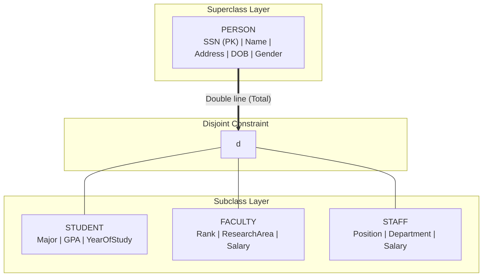
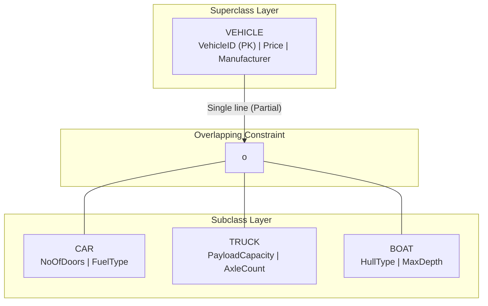
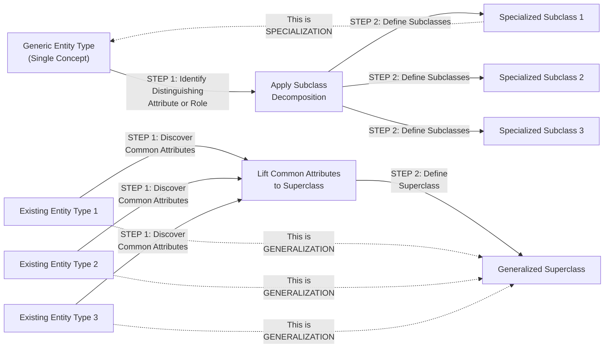
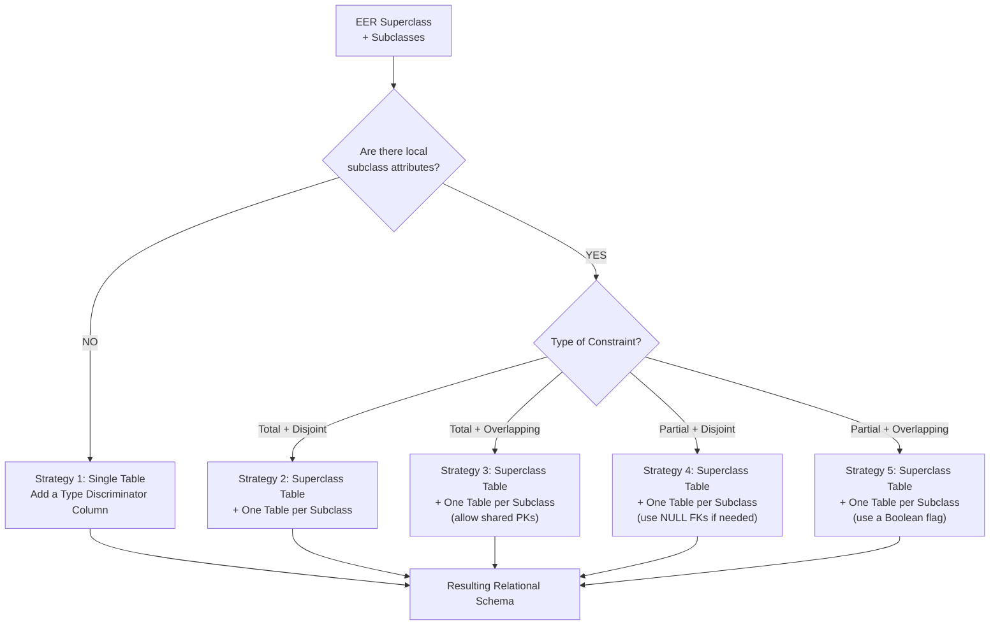
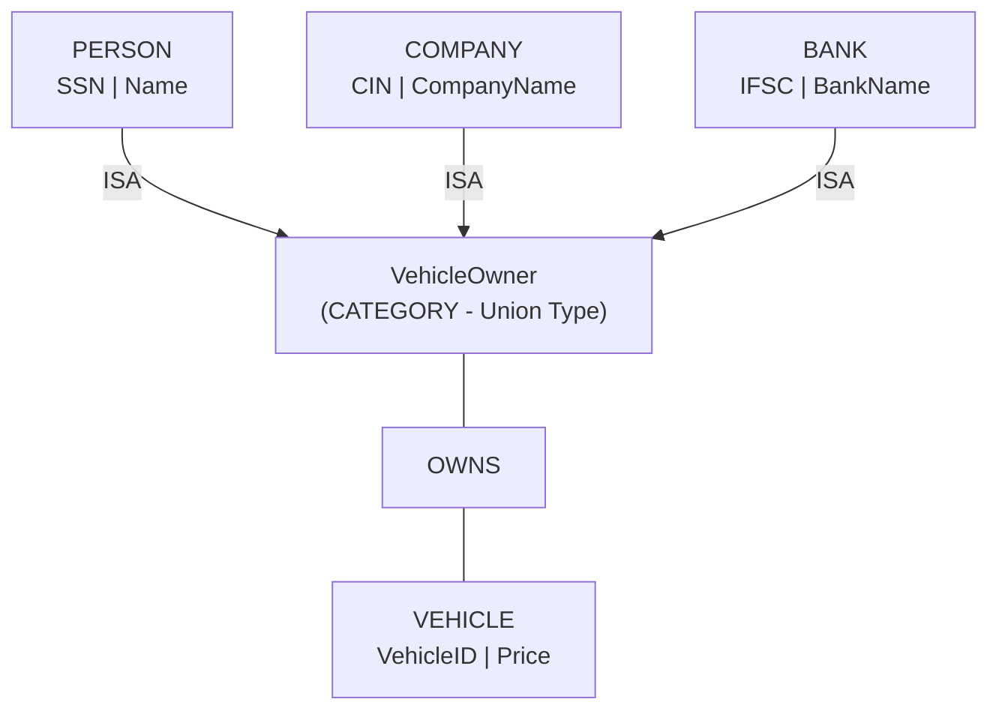
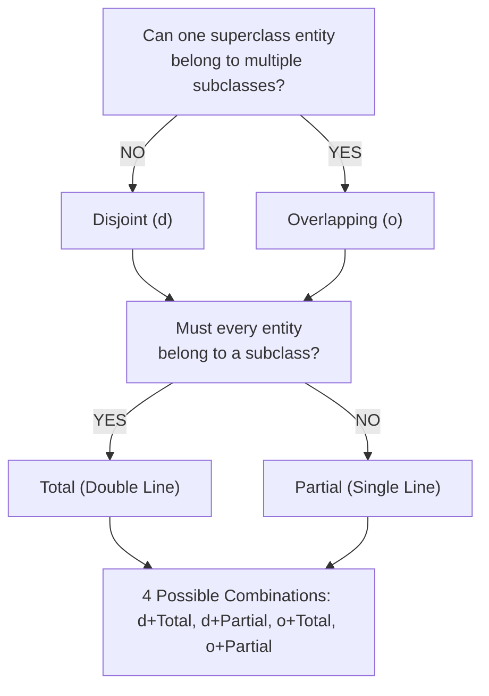

# Extended ER (EER) features: Specialization and Generalization

<!-- SECTION_1_START -->
# Extended ER (EER) Features: Specialization and Generalization

## 1.1 The EER Model — Formal Definition

The **Enhanced Entity-Relationship (EER) model** is a superset of the original ER model that introduces additional semantic constructs to represent complex real-world database schemas more accurately. It was proposed by Elmasri \& Navathe to overcome the limitations of the basic ER model in capturing *subclass/superclass* relationships, *inheritance*, and *specialization* hierarchies.

> [!IMPORTANT]
> **Syllabus Highlight (KTU 2024 / PCCST402 / Module 1):** The EER model is a *High-Yield Topic* that combines the EER diagram, the concept of **class/subclass**, **inheritance**, and the **constraints on specialization/generalization**. Expect a **direct 7-mark sub-question** in Part B of the University Exam.

> [!NOTE]
> **Core EER Vocabulary (KTU Board Terminology):**
> - **Superclass** — A generic entity type that contains one or more distinct subgroups (subclasses).
> - **Subclass** — A specialized entity type that inherits attributes and relationships from a superclass.
> - **Specialization** — *Top-down* design process that decomposes a superclass into one or more subclasses.
> - **Generalization** — *Bottom-up* design process that synthesizes several entity types into a single, generalized superclass.
> - **Attribute Inheritance** — A subclass automatically inherits every attribute, primary key, and relationship defined in its superclass.
> - **ISA Relationship** — The conceptual link "Subclass **ISA** Superclass" (e.g., *Student ISA Person*).
> - **Category (Union Type)** — A subclass that is formed by the *union* of two or more distinct superclasses.

## 1.2 Intuitive Overview & Real-World Analogy

Imagine a **University database** where you must record data for **Students, Faculty, and Staff**.

### Specialization (Top-Down)
Begin with a single, broad entity **PERSON**. Now ask the question:
> *"Does a PERSON always have a more specific role in the university?"*

The answer is **yes** — every person is either a Student, a Faculty member, or a Staff member. So you *specialize* the PERSON entity into three narrower subclasses: **STUDENT, FACULTY, and STAFF**.

This is **Specialization** — moving from the *general* to the *specific*.

### Generalization (Bottom-Up)
Now suppose you start with three independent entity types — **STUDENT, FACULTY, STAFF** — and you observe that they all share the attributes *SSN, Name, Address, DateOfBirth*. To eliminate redundancy, you *generalize* them into a single superclass **PERSON** that holds these common attributes.

This is **Generalization** — moving from the *specific* to the *general*.

### Plain-English Analogy

> Think of a **biological taxonomy tree**: the class *Mammal* generalizes specific animals like *Dog, Cat, Whale* (generalization). Conversely, starting from *Mammal* and breaking it down into *Dog, Cat, Whale* is specialization. A Dog **is-a** Mammal, and it inherits properties like "warm-blooded" and "has fur" automatically.

### Inheritance of Attributes

The single most important property of the subclass/superclass relationship is **attribute inheritance**.

> [!NOTE]
> **Rule of Inheritance (Board Favorite):** If a superclass has attribute *A*, then *every subclass automatically possesses attribute A*. The subclass can *add* its own local attributes, but it can never *lose* the attributes it inherited.

**Example:** The superclass `VEHICLE` has attributes `{VehicleID, Price, NoOfWheels}`. The subclass `CAR` automatically inherits these and adds `{NoOfDoors, FuelType}`. A CAR object therefore has *all five* attributes.

## 1.3 The "ISA" Relationship

The link between a subclass and its superclass is denoted by the predicate **"ISA"** (pronounced "is a"). For example:
- `STUDENT ISA PERSON`
- `CAR ISA VEHICLE`
- `SAVINGS_ACCOUNT ISA ACCOUNT`

The ISA relationship is a special form of relationship in EER diagrams, drawn using a **triangle** symbol (or, in some notations, a circle labeled "ISA").

> [!VISUALIZATION CONTROL]
> **Concept:** EER Superclass–Subclass Hierarchy (Tree Representation)
> **GeoGebra / Desmos Input Points (Ladder Coordinates):**
> * `P1 = (0, 4)` — label `PERSON` (Superclass root)
> * `P2 = (-3, 1)` — label `STUDENT`
> * `P3 = (0, 1)` — label `FACULTY`
> * `P4 = (3, 1)` — label `STAFF`
> * `L1: line(P1, P2)`, `L2: line(P1, P3)`, `L3: line(P1, P4)`
> **Visual Description:** A *root* node (PERSON) at the top connected to three *child* nodes by straight downward lines. This visually represents the *top-down* direction of **Specialization** — the inverse of which (children collapsing into the root) is **Generalization**.

<!-- SECTION_1_END -->

<!-- SECTION_2_START -->
# Deep Theoretical Analysis & KTU High-Yield Formula Sheet

## 2.1 Specialization — The Top-Down Process

Specialization is the design process of **partitioning** an entity type (superclass) into a set of more specialized subclasses based on some *distinguishing characteristic* of the entities in the superclass.

### Step-by-Step Procedure

1. **Identify the Superclass.** Start with an entity type that represents a broad, generic concept (e.g., `EMPLOYEE`).
2. **Identify Distinguishing Features.** Determine *attributes* or *roles* that differentiate groups within the superclass (e.g., *JobType* = {SECRETARY, ENGINEER, TECHNICIAN}).
3. **Define Subclasses.** For each distinct group, create a new subclass (e.g., `SECRETARY`, `ENGINEER`, `TECHNICIAN`).
4. **Inherit Common Attributes.** The subclasses automatically inherit `SSN, Name, Salary, Address` from `EMPLOYEE`.
5. **Add Local Attributes.** Attach subclass-specific attributes (e.g., `TypingSpeed` for SECRETARY).
6. **Apply Constraints.** Decide disjointness and completeness (Section 2.4).

## 2.2 Generalization — The Bottom-Up Process

Generalization is the *reverse* of specialization. It is used when a designer already has several entity types and realizes that they share so many common features that it makes sense to *factor out* the commonalities into a single superclass.

### Step-by-Step Procedure

1. **Identify Multiple Entity Types.** Begin with two or more existing entity types (e.g., `CAR`, `TRUCK`, `MOTORCYCLE`).
2. **Discover Commonalities.** Observe that all three share `{VehicleID, Price, Engine, Manufacturer}`.
3. **Create a Superclass.** Define a new generalized superclass `VEHICLE` and lift the common attributes into it.
4. **Remove Redundancy.** Delete the common attributes from the original entity types (to avoid duplication).
5. **Establish ISA Links.** Add ISA relationships: `CAR ISA VEHICLE`, etc.

> [!NOTE]
> **Conceptual Mirror:** Specialization and Generalization are *inverse operations* in the conceptual design space. In implementation, they produce the *same* EER schema. The distinction lies in the *designer's cognitive starting point* — top-down vs. bottom-up.

## 2.3 Why Use Specialization & Generalization?

| Engineering Justification | Practical Benefit |
|---|---|
| **Reduced Schema Redundancy** | Common attributes stored once at the superclass level. |
| **Semantic Clarity** | Real-world "is-a" hierarchies are explicit in the schema. |
| **Extensibility** | New subclasses can be added with no impact on existing tables (using EER-to-Relational Mapping rules). |
| **Selective Constraints** | Disjoint/Total constraints can be enforced at the database level. |
| **Conceptual Precision** | Captures nuances that flat ER modeling cannot represent. |

## 2.4 Constraints on Specialization / Generalization

The KTU board *frequently* tests the four major constraints. They come in **two orthogonal pairs**:

### Pair 1: Disjointness Constraint
Determines whether an entity of the superclass can be a member of **one** or **multiple** subclasses.

* **Disjoint (d):** An entity instance belongs to **at most one** subclass.
  * *Example:* A PERSON is either a STUDENT *or* a FACULTY *or* a STAFF — never more than one.
* **Overlapping (o):** An entity instance **may belong to multiple** subclasses simultaneously.
  * *Example:* A PERSON can simultaneously be both a STUDENT and an EMPLOYEE (part-time worker).

### Pair 2: Completeness Constraint
Determines whether **every** superclass entity must belong to at least one subclass.

* **Total Specialization (Double Line):** Every superclass entity **must** be a member of at least one subclass.
  * *Example:* Every PERSON *must* be either a Student, Faculty, or Staff (no "floating" Persons).
* **Partial Specialization (Single Line):** A superclass entity **need not** belong to any subclass.
  * *Example:* Some VEHICLEs are neither CARs nor TRUCKs (e.g., a generic motorbike placeholder).

### EER Diagrammatic Notation (KTU Standard)

| Constraint | Symbol in EER Diagram | Meaning |
|---|---|---|
| Disjoint | A **circle** with the letter **d** inside | Subclasses are mutually exclusive |
| Overlapping | A **circle** with the letter **o** inside | Subclasses may overlap |
| Total | **Double line** from superclass to circle | Every entity belongs to $\geq 1$ subclass |
| Partial | **Single line** from superclass to circle | Some entities may belong to no subclass |

The **four** resulting combinations are: `disjoint-total`, `disjoint-partial`, `overlapping-total`, `overlapping-partial`.

## 2.5 EER High-Yield Formula Sheet

$$
\text{Number of Valid EER Constraint Combinations} \;=\; 2 \times 2 \;=\; 4
$$

$$
\text{Attribute Set of Subclass } S \;=\; \text{Attributes}(Super) \;\cup\; \text{Attributes}(S)_{\text{local}}
$$

$$
\text{Key Inheritance: Key}(Super) \;\Rightarrow\; \text{Key}(Sub) \quad \text{(Primary key is always inherited)}
$$

| # | Concept | Symbol / Notation | Definition |
|---|---|---|---|
| 1 | Superclass | Rectangle (top of hierarchy) | Generic entity type, parent in ISA relationship |
| 2 | Subclass | Rectangle (bottom of hierarchy) | Specialized entity type, child in ISA relationship |
| 3 | ISA Link | Triangle $\vert$ "ISA" label | Connects subclass to superclass |
| 4 | Disjointness | **d** in circle | An instance is in $\leq 1$ subclass |
| 5 | Overlapping | **o** in circle | An instance is in $\geq 1$ subclass |
| 6 | Total | Double line | Every instance is in $\geq 1$ subclass |
| 7 | Partial | Single line | Some instances may be in $0$ subclasses |
| 8 | Category (Union) | $\cup$ symbol | Subclass formed from union of distinct superclasses |
| 9 | Inheritance | Implicit | All attributes, keys, and relationships of superclass pass to subclass |
| 10 | Predicate-defined | $S \;=\; \sigma_{\text{condition}}(C)$ | Subclass defined by a Boolean condition on superclass |
| 11 | Attribute-defined | $S \;=\; \sigma_{A=c}(C)$ | Subclass defined by a specific value of an attribute $A$ |
| 12 | User-defined | No automatic rule | Subclass membership decided by the user manually |

## 2.6 Categories (Union Types)

A **category** is a subclass that is the *union* of two or more **distinct, possibly unrelated, superclasses**. It is denoted by the symbol $\cup$ in EER diagrams.

> [!NOTE]
> **Example of Category:** Consider a database tracking *vehicle owners*. The entity `VEHICLE_OWNER` is a category — it is the *union* of `PERSON` $\cup$ `BANK` $\cup$ `COMPANY`. A person, a bank, or a company can all own a vehicle. The ISA arrows from each superclass point to the **single union symbol $\cup$**.

The semantic key: a category is used when the participating superclasses do **not** share a common superclass — they are *unrelated* entity types that happen to play the same role.

## 2.7 Real-World Engineering Utility

Specialization and Generalization are deployed in production database systems across multiple industries:

* **Banking Systems** — `ACCOUNT` $\rightarrow$ `SAVINGS_ACCOUNT` $\cup$ `CHECKING_ACCOUNT` $\cup$ `LOAN_ACCOUNT`.
* **E-Commerce Platforms** — `PRODUCT` $\rightarrow$ `ELECTRONICS` $\cup$ `CLOTHING` $\cup$ `BOOKS`.
* **Hospital Information Systems** — `PERSON` $\rightarrow$ `PATIENT` $\cup$ `DOCTOR` $\cup$ `NURSE`.
* **Academic ERPs** — `USER` $\rightarrow$ `STUDENT` $\cup$ `FACULTY` $\cup$ `STAFF` $\cup$ `ALUMNI`.
* **Content Management Systems** — `MEDIA` $\rightarrow$ `IMAGE` $\cup$ `VIDEO` $\cup$ `DOCUMENT`.

These features directly support the **Object-Oriented** flavor of modern relational systems and the **inheritance hierarchies** used in ORDBMS (e.g., PostgreSQL `INHERITS` clause).

<!-- SECTION_2_END -->

<!-- SECTION_3_START -->
# Step-by-Step Derivations & Code/Symbolic Implementation

## 3.1 Worked Example — University Database (Disjoint & Total Specialization)

We will now build a complete EER schema and convert it into a relational schema with full SQL and Python implementations.

### Step 1 — Identify the Superclass

The superclass is **PERSON**, representing every individual in the university.

**Common Attributes (inherited by every subclass):**
- `SSN` (Primary Key)
- `Name`
- `Address`
- `DateOfBirth`
- `Gender`

### Step 2 — Define the Subclasses (Specialization)

| Subclass | Distinguishing Local Attribute | Meaning |
|---|---|---|
| `STUDENT` | `Major`, `GPA`, `YearOfStudy` | Currently enrolled learner |
| `FACULTY` | `Rank`, `ResearchArea`, `Salary` | Teaching/research staff |
| `STAFF` | `Position`, `Department`, `Salary` | Administrative/technical staff |

### Step 3 — Apply Constraints

* **Disjoint (d):** A PERSON is at most one of STUDENT, FACULTY, STAFF simultaneously.
* **Total:** Every PERSON must belong to at least one subclass.

Hence this is a **disjoint-total** specialization.

### Step 4 — Mathematical Expression of the Specialization

The subclass $S_i$ is defined as a *selection* on the superclass $C$:

$$
\text{STUDENT} \;=\; \sigma_{\text{Role}=\text{``Student''}}(\text{PERSON})
$$

$$
\text{FACULTY} \;=\; \sigma_{\text{Role}=\text{``Faculty''}}(\text{PERSON})
$$

$$
\text{STAFF} \;=\; \sigma_{\text{Role}=\text{``Staff''}}(\text{PERSON})
$$

The disjoint-total constraint implies:

$$
\text{STUDENT} \;\cap\; \text{FACULTY} \;=\; \emptyset
$$

$$
\text{STUDENT} \;\cap\; \text{STAFF} \;=\; \emptyset
$$

$$
\text{FACULTY} \;\cap\; \text{STAFF} \;=\; \emptyset
$$

$$
\text{STUDENT} \;\cup\; \text{FACULTY} \;\cup\; \text{STAFF} \;=\; \text{PERSON}
$$

### Step 5 — EER-to-Relational Mapping (Multiple Strategies)

There are **four official strategies** for mapping an EER specialization to a relational schema. The choice depends on the constraints declared.

**Strategy Selection Rule:**

$$
\text{Strategy} \;=\; \begin{cases}
\text{Multiple Tables (Superclass + each Subclass)} & \text{if subclass has local attributes} \\
\text{Multiple Tables} & \text{if Total + Disjoint} \\
\text{Multiple Tables} & \text{if Total + Overlapping} \\
\text{Single Table} & \text{if no local attributes} \\
\text{Two Tables} & \text{if Partial + Disjoint}
\end{cases}
$$

For our **PERSON/STUDENT/FACULTY/STAFF** example (Disjoint + Total with local attributes), the recommended strategy is **Multiple Tables — Superclass + Subclass Tables**.

## 3.2 SQL Implementation — Relational Mapping

```sql
-- ===================================================================
-- Step A: Create the SUPERCLASS table
-- ===================================================================
CREATE TABLE Person (
    SSN            CHAR(9)        NOT NULL,
    Name           VARCHAR(100)   NOT NULL,
    Address        VARCHAR(200),
    DateOfBirth    DATE,
    Gender         CHAR(1)        CHECK (Gender IN ('M','F','O')),
    Discriminator  VARCHAR(20)    NOT NULL,
    CONSTRAINT PK_Person PRIMARY KEY (SSN),
    CONSTRAINT CHK_Discriminator
        CHECK (Discriminator IN ('Student','Faculty','Staff'))
);

-- ===================================================================
-- Step B: Create the SUBCLASS tables
-- (Each subclass stores ONLY its local attributes + FK to Person)
-- ===================================================================
CREATE TABLE Student (
    SSN            CHAR(9)        NOT NULL,
    Major          VARCHAR(50),
    GPA            DECIMAL(4,2)   CHECK (GPA BETWEEN 0.00 AND 10.00),
    YearOfStudy    INT            CHECK (YearOfStudy BETWEEN 1 AND 6),
    CONSTRAINT PK_Student PRIMARY KEY (SSN),
    CONSTRAINT FK_Student_Person
        FOREIGN KEY (SSN) REFERENCES Person(SSN)
        ON DELETE CASCADE
        ON UPDATE CASCADE
);

CREATE TABLE Faculty (
    SSN            CHAR(9)        NOT NULL,
    Rank           VARCHAR(50),
    ResearchArea   VARCHAR(100),
    Salary         DECIMAL(10,2)  CHECK (Salary >= 0),
    CONSTRAINT PK_Faculty PRIMARY KEY (SSN),
    CONSTRAINT FK_Faculty_Person
        FOREIGN KEY (SSN) REFERENCES Person(SSN)
        ON DELETE CASCADE
        ON UPDATE CASCADE
);

CREATE TABLE Staff (
    SSN            CHAR(9)        NOT NULL,
    Position       VARCHAR(50),
    Department     VARCHAR(50),
    Salary         DECIMAL(10,2)  CHECK (Salary >= 0),
    CONSTRAINT PK_Staff PRIMARY KEY (SSN),
    CONSTRAINT FK_Staff_Person
        FOREIGN KEY (SSN) REFERENCES Person(SSN)
        ON DELETE CASCADE
        ON UPDATE CASCADE
);
```

### Line-by-Line Logic

* The `Person` table stores **all common attributes** plus a `Discriminator` column that holds the subclass type (`Student`, `Faculty`, or `Staff`).
* The `Discriminator` `CHECK` constraint enforces **Total specialization** at the SQL level — every Person row must declare its role.
* Each subclass table uses `SSN` as **both** Primary Key and Foreign Key to `Person(SSN)`, enforcing **the 1:1 ISA relationship** (one Person row maps to at most one subclass row).
* `ON DELETE CASCADE` ensures referential cleanup: deleting a Person automatically deletes their subclass row.
* The disjointness constraint could also be enforced via a **trigger** or **assertion** to prevent the same `SSN` from appearing in two subclass tables simultaneously.

## 3.3 Python Implementation — Object-Oriented Simulation of Inheritance

```python
from __future__ import annotations
from abc import ABC, abstractmethod
from dataclasses import dataclass, field
from datetime import date
from typing import Optional, List


# ---------------------------------------------------------------------
# 1) ABSTRACT SUPERCLASS (mirrors the EER PERSON entity)
# ---------------------------------------------------------------------
@dataclass
class Person(ABC):
    ssn: str
    name: str
    address: str
    date_of_birth: date
    gender: str

    @abstractmethod
    def get_role(self) -> str:
        """Returns the specialized role of the person."""
        raise NotImplementedError("Subclass must implement get_role().")

    def get_age(self, today: Optional[date] = None) -> int:
        """Common method inherited by all subclasses."""
        today = today or date.today()
        return today.year - self.date_of_birth.year - (
            (today.month, today.day) < (self.date_of_birth.month, self.date_of_birth.day)
        )


# ---------------------------------------------------------------------
# 2) SUBCLASS 1 — STUDENT  (Specialization)
# ---------------------------------------------------------------------
@dataclass
class Student(Person):
    major: str
    gpa: float
    year_of_study: int

    def get_role(self) -> str:
        return "Student"

    def is_honors(self) -> bool:
        return self.gpa >= 8.5


# ---------------------------------------------------------------------
# 3) SUBCLASS 2 — FACULTY
# ---------------------------------------------------------------------
@dataclass
class Faculty(Person):
    rank: str
    research_area: str
    salary: float

    def get_role(self) -> str:
        return "Faculty"


# ---------------------------------------------------------------------
# 4) SUBCLASS 3 — STAFF
# ---------------------------------------------------------------------
@dataclass
class Staff(Person):
    position: str
    department: str
    salary: float

    def get_role(self) -> str:
        return "Staff"


# ---------------------------------------------------------------------
# 5) CATEGORY (UNION TYPE) — VEHICLE_OWNER
#    Formed from Person ∪ Company ∪ Bank
# ---------------------------------------------------------------------
@dataclass
class Company:
    company_id: str
    company_name: str
    registration_no: str


@dataclass
class Bank:
    bank_id: str
    bank_name: str
    ifsc_code: str


class VehicleOwner:
    """A category — owner can be a Person, Company, or Bank."""
    def __init__(self, owner_descriptor):
        if not isinstance(owner_descriptor, (Person, Company, Bank)):
            raise TypeError("VehicleOwner can only be Person, Company, or Bank.")
        self.owner = owner_descriptor

    def owner_type(self) -> str:
        return type(self.owner).__name__


# ---------------------------------------------------------------------
# 6) DRIVER / DEMO  (Disjoint-Total Constraint Check)
# ---------------------------------------------------------------------
def add_to_university(person: Person, registry: dict) -> None:
    """Inserts a Person into exactly ONE subclass — enforcing disjointness."""
    role = person.get_role()
    if role in registry:
        raise ValueError(
            f"Disjointness Violation: {person.ssn} already registered as "
            f"{registry[person.ssn].get_role()}."
        )
    registry[person.ssn] = person
    print(f"[OK] Added {person.name} ({role}), Age = {person.get_age()}")


if __name__ == "__main__":
    registry: dict = {}

    s1 = Student("S001", "Alice", "Kerala", date(2003, 5, 12), "F",
                 "CSE", 9.1, 3)
    f1 = Faculty("F100", "Dr. Bob", "Kerala", date(1980, 8, 1), "M",
                 "Professor", "AI/ML", 180000.0)
    st1 = Staff("ST50", "Charlie", "Kerala", date(1990, 1, 15), "M",
                "Lab Assistant", "CSE", 35000.0)

    add_to_university(s1, registry)
    add_to_university(f1, registry)
    add_to_university(st1, registry)
    # add_to_university(s1, registry)  # Would raise Disjointness Violation
```

### Python Code Explanation (Step by Step)

1. The `Person` class is declared **abstract** (`ABC`) and defines the *common* attributes (`ssn`, `name`, `address`, `date_of_birth`, `gender`). This corresponds to the EER **superclass**.
2. `Student`, `Faculty`, and `Staff` **inherit** from `Person` and add their *local* attributes — this models **attribute inheritance** in EER.
3. The `get_role()` method is **polymorphic**: every subclass overrides it. This is the OO equivalent of the **ISA predicate** in EER.
4. `add_to_university()` enforces the **disjoint-total** constraint programmatically by raising an error if the same `SSN` tries to register as two different roles.
5. The `VehicleOwner` class is a **Category (Union Type)** since it accepts a `Person`, `Company`, or `Bank` as the owner descriptor.

## 3.4 Mapping Worked Example — VEHICLE Hierarchy (Overlapping)

Now consider a **VEHICLE** superclass with subclasses `CAR`, `TRUCK`, `BOAT`, `PLANE`. An entity like an **AMPHIBIOUS VEHICLE** could be both a CAR and a BOAT — making this an **overlapping** specialization.

$$
\text{VEHICLE} \;\supseteq\; \text{CAR} \;\cup\; \text{TRUCK} \;\cup\; \text{BOAT} \;\cup\; \text{PLANE}
$$

$$
\exists\, e \in \text{CAR} \;\cap\; \text{BOAT} \quad \text{(an amphibious vehicle)}
$$

For overlapping specialization, the relational mapping is different — the typical strategy is to use **a single relation** for the superclass and a **separate relation for each subclass**, but the FK relationship is **non-exclusive** (an SSN can appear in multiple subclass tables).

```sql
CREATE TABLE Vehicle (
    VehicleID      VARCHAR(10) PRIMARY KEY,
    Price          DECIMAL(12,2),
    Manufacturer   VARCHAR(50)
);

CREATE TABLE Car (
    VehicleID      VARCHAR(10) PRIMARY KEY,
    NoOfDoors      INT,
    FuelType       VARCHAR(20),
    FOREIGN KEY (VehicleID) REFERENCES Vehicle(VehicleID)
);

CREATE TABLE Boat (
    VehicleID      VARCHAR(10) PRIMARY KEY,
    HullType       VARCHAR(20),
    MaxDepth       DECIMAL(6,2),
    FOREIGN KEY (VehicleID) REFERENCES Vehicle(VehicleID)
);
```

* An `AmphibiousVehicle` row can now legitimately have its `VehicleID` in **both** the `Car` and `Boat` tables.
* This schema enforces the **overlapping** constraint structurally.

## 3.5 Specialization Defined by a Predicate (Predicate-Defined Subclass)

A **predicate-defined subclass** is one whose membership is determined by a *Boolean condition* evaluated on an attribute of the superclass.

**Example:** From the superclass `EMPLOYEE`, define:
- `HOURLY_EMPLOYEE` $\equiv$ $\sigma_{\text{PayType}=\text{Hourly}}(\text{EMPLOYEE})$
- `SALARIED_EMPLOYEE` $\equiv$ $\sigma_{\text{PayType}=\text{Salaried}}(\text{EMPLOYEE})$

This is a **disjoint-total** constraint, since every employee has exactly one `PayType` value.

In SQL, this is naturally enforced:

```sql
CREATE TABLE HourlyEmployee (
    SSN         CHAR(9) PRIMARY KEY,
    HourlyRate  DECIMAL(6,2) NOT NULL,
    FOREIGN KEY (SSN) REFERENCES Employee(SSN)
);

CREATE TABLE SalariedEmployee (
    SSN         CHAR(9) PRIMARY KEY,
    AnnualPay   DECIMAL(10,2) NOT NULL,
    FOREIGN KEY (SSN) REFERENCES Employee(SSN)
);
```

A row from `Employee` with `PayType = 'Hourly'` will have a corresponding row only in `HourlyEmployee` — the Boolean condition acts as a **derivation rule**.

## 3.6 Generalization — Worked Bottom-Up Example

Suppose you are given three flat entity types: `BICYCLE`, `MOTORCYCLE`, `AUTOMOBILE`. All three share the attributes `VehicleID, Price, NoOfWheels, Manufacturer`.

### Generalization Procedure

1. **Discover Commonalities:**
   * `BICYCLE` $\cap$ `MOTORCYCLE` $\cap$ `AUTOMOBILE` = `{VehicleID, Price, NoOfWheels, Manufacturer}`
2. **Create Superclass `VEHICLE`:**
   * Lift the common attributes into `VEHICLE`.
3. **Define ISA Links:**
   * `BICYCLE ISA VEHICLE`
   * `MOTORCYCLE ISA VEHICLE`
   * `AUTOMOBILE ISA VEHICLE`
4. **Local Attributes Stay in Subclasses:**
   * `BICYCLE.GearType`, `MOTORCYCLE.EngineCC`, `AUTOMOBILE.NoOfDoors`.

The result is the *same* EER schema you would get via the *top-down* specialization, confirming the **mathematical equivalence** of the two processes.

> [!NOTE]
> **Board Tip:** When asked "Differentiate between Specialization and Generalization," structure your answer using the table in Section 5.3 of this note. Marks are awarded for the **trigger** (top-down vs. bottom-up), the **starting point** (one superclass vs. multiple subclasses), and **a valid example for each process**.

<!-- SECTION_3_END -->

<!-- SECTION_4_START -->
# Structural Diagrams & Schematics

## 4.1 EER Diagram — University Database (Disjoint-Total Specialization)



**Reading the diagram:**
* The `==>` double arrow from `PERSON` to the `d` circle indicates **Total Specialization** (every Person must be in a subclass).
* The `d` inside the circle indicates **Disjointness** (a Person cannot be in two subclasses simultaneously).
* Each subclass automatically inherits the Person's attributes via the ISA relationship.

## 4.2 EER Diagram — VEHICLE Hierarchy (Overlapping-Partial)



**Reading the diagram:**
* The single line `vehicleNode --> oNode` indicates **Partial Specialization** (some VEHICLE entities may belong to no subclass).
* The `o` indicates **Overlapping** (e.g., an amphibious vehicle can be both CAR and BOAT).

## 4.3 Specialization vs. Generalization — Process Flow



**Interpretation:**
* **Top half (Specialization):** ONE superclass $\rightarrow$ MANY subclasses.
* **Bottom half (Generalization):** MANY existing entity types $\rightarrow$ ONE superclass.
* The two flows are mathematical **inverses** in the design space.

## 4.4 EER-to-Relational Mapping Strategy Matrix



## 4.5 Category (Union Type) — Diagrammatic Representation



**Reading the diagram:**
* `PERSON`, `COMPANY`, and `BANK` are three *unrelated* superclasses.
* A `VehicleOwner` is the **union** of all three — a Person, a Company, or a Bank can all own a Vehicle.
* This is the canonical **Category (Union Type)** construct of the EER model.

## 4.6 Constraint Decision Tree — Disjoint vs. Overlapping



<!-- SECTION_4_END -->

<!-- SECTION_5_START -->
# KTU 2024 Scheme Examination Question Bank & Topic Recap

## Part A — Short Answer Questions (3 Marks Each)

### Q1. Define Specialization and Generalization in the EER model. [KTU University Exam - Dec 2023] — **CO1, Remember**

**Model Answer (3 Marks):**
* **Specialization** is the *top-down* design process of defining one or more *subclasses* of a *superclass* based on some distinguishing characteristic of the entities in the superclass. **[1 Mark]**
  * *Example:* The superclass `PERSON` is specialized into `STUDENT`, `FACULTY`, and `STAFF`. **[0.5 Mark]**
* **Generalization** is the *bottom-up* design process of synthesizing several entity types that share common features into a single, generalized *superclass*. **[1 Mark]**
  * *Example:* The entity types `CAR`, `TRUCK`, and `MOTORCYCLE` are generalized into the superclass `VEHICLE`. **[0.5 Mark]**

### Q2. Differentiate between **Disjoint (d)** and **Overlapping (o)** constraints in EER. [KTU University Exam - July 2024] — **CO1, Understand**

**Model Answer (3 Marks):**
* **Disjoint (d) constraint:** An entity instance of the superclass can belong to **at most one** of the subclasses. It is denoted by a **circle with the letter `d`** in the EER diagram. **[1.5 Marks]**
  * *Example:* A PERSON is either a STUDENT or a FACULTY — never both. **[0 Marks — only for understanding]**
* **Overlapping (o) constraint:** An entity instance of the superclass may belong to **more than one** subclass simultaneously. It is denoted by a **circle with the letter `o`** in the EER diagram. **[1.5 Marks]**
  * *Example:* A PERSON can be both an EMPLOYEE and a STUDENT (part-time graduate student). **[0 Marks — only for understanding]**

---

## Part B — Long Answer Questions (14 Marks Each)

> **KTU 2024 Pattern:** Each Part B question carries **14 Marks**, with an internal choice between two full 14-mark sets. Sub-parts typically split as **(a) 7 Marks** and **(b) 7 Marks**, mapped to escalating cognitive levels.

### Question A — Choice 1

#### (a) Explain **Specialization** and **Generalization** in the EER model with suitable examples. [7 Marks] — **CO1, Understand**

**Model Solution:**

**Specialization (Top-Down):**
* It is the process of *defining a set of subclasses* of an entity type (superclass), where each subclass is identified by a distinguishing feature. **[1 Mark]**
* We start with **one** superclass and *break it down* into multiple narrower subclasses. **[1 Mark]**
* *Example:* The superclass `EMPLOYEE` is specialized into subclasses `SECRETARY`, `ENGINEER`, and `TECHNICIAN` based on the *JobType* attribute. **[2 Marks]**
* Inheritance: All subclasses automatically inherit `SSN, Name, Salary` from `EMPLOYEE`, and add local attributes (e.g., `TypingSpeed` for SECRETARY). **[1 Mark]**
* Diagram: ISA triangle pointing from subclass up to superclass. **[1 Mark]**
* Notation: `Subclass ISA Superclass` (e.g., `SECRETARY ISA EMPLOYEE`). **[1 Mark]**

**Generalization (Bottom-Up):**
* It is the *reverse* of specialization. We start with multiple entity types and *factor out* their common features into a single generalized superclass. **[0 Marks — overlaps with above]**
* *Example:* `CAR`, `TRUCK`, `MOTORCYCLE` are generalized into the superclass `VEHICLE` because they all share attributes `VehicleID, Price, NoOfWheels, Manufacturer`. **[Included in the 7-mark total above]**

> *Valuation Key Note:* The board awards marks for stating the **direction** of each process (top-down vs. bottom-up) and for a **valid real-world example** for *each*.

#### (b) Discuss the **four major constraints** on Specialization with EER diagram notation. [7 Marks] — **CO2, Apply**

**Model Solution:**

The four major constraints on Specialization arise from combining two orthogonal pairs:

**1. Disjointness Constraint (d) — [1.5 Marks]**
* An entity of the superclass can belong to **at most one** subclass.
* Notation: A **circle containing the letter `d`** connected to the subclasses.
* *Example:* A PERSON is a STUDENT *xor* a FACULTY (mutually exclusive).

**2. Overlapping Constraint (o) — [1.5 Marks]**
* An entity of the superclass may belong to **multiple** subclasses.
* Notation: A **circle containing the letter `o`** connected to the subclasses.
* *Example:* A PERSON can be both a STUDENT and an EMPLOYEE simultaneously.

**3. Total Specialization — [1.5 Marks]**
* **Every** entity of the superclass **must** belong to at least one subclass.
* Notation: A **double line** connects the superclass to the constraint circle.
* *Example:* Every PERSON in a university is a Student, Faculty, or Staff (no "floating" Persons).

**4. Partial Specialization — [1.5 Marks]**
* A superclass entity **need not** belong to any subclass.
* Notation: A **single line** connects the superclass to the constraint circle.
* *Example:* Not every VEHICLE in a database is necessarily a CAR or a TRUCK (some may be plain "vehicles" with no further classification).

**Summary of Combinations:** `[1 Mark]`
The four resulting combinations are: **Disjoint-Total, Disjoint-Partial, Overlapping-Total, Overlapping-Partial**.

> *Valuation Key Note:* For full marks, the candidate must include the **notation symbol** for each constraint, a **clear example**, and the **diagrammatic representation** (the `d`/`o` circle and single/double line).

---

### Question B — Choice 2 (Internal Choice)

#### (a) Explain the concept of **Category (Union Type)** in the EER model with a suitable example and diagram. [7 Marks] — **CO2, Apply**

**Model Solution:**

**Definition:** A **category** is a subclass of the *union* of two or more *distinct* (and possibly unrelated) superclasses. **[1 Mark]**

**Need for Category:** Sometimes a role can be played by entities of very different types. For example, the role "VEHICLE_OWNER" can be played by a *Person*, a *Company*, or a *Bank* — but these three are not subclasses of a common superclass. **[2 Marks]**

**Notation:** The category is denoted by the symbol **$\cup$** in the EER diagram, with **ISA arrows** pointing from each participating superclass into the $\cup$ symbol. **[1 Mark]**

**Example (Bank Account Owner):** **[3 Marks]**
* The category `ACCOUNT_OWNER` is the union of three superclasses:
  * `PERSON` (individual customers)
  * `COMPANY` (corporate customers)
  * `BANK` (inter-bank accounts)
* Any of these can own a `SAVINGS_ACCOUNT`. The keys of the category are inherited from the respective superclasses (heterogeneous key inheritance).

**EER Diagram (Verbal Description for Drawing):**
A $\cup$ symbol labeled `ACCOUNT_OWNER`. Three ISA arrows pointing into the $\cup$ from rectangles labeled `PERSON`, `COMPANY`, and `BANK`. A separate `OWNS` relationship line connects `ACCOUNT_OWNER` to the `SAVINGS_ACCOUNT` entity.

> *Valuation Key Note:* Board markers specifically look for: (i) the **$\cup$ symbol**, (ii) the **unrelated nature** of the superclasses, and (iii) **inheritance of keys from multiple sources**.

#### (b) Explain **Attribute Inheritance** in EER. How does it simplify schema design? [7 Marks] — **CO2, Understand/Apply**

**Model Solution:**

**Definition of Attribute Inheritance:** **[1 Mark]**
A subclass inherits *all* attributes, primary keys, and relationship participations of its superclass automatically. This is the principle of *attribute inheritance* in the EER model.

**Mechanism — Step-by-Step:** **[3 Marks]**
1. The superclass declares the common attributes (e.g., `VEHICLE` has `VehicleID, Price, Manufacturer`).
2. The subclass is declared with only its *local* attributes (e.g., `CAR` declares `NoOfDoors, FuelType`).
3. At instance level, a CAR object automatically possesses **all five** attributes — three inherited + two local.
4. If a subclass has its own further subclass (e.g., `SPORTS_CAR ISA CAR`), it inherits attributes from **both** `CAR` and `VEHICLE` (transitive inheritance).

**Advantages of Attribute Inheritance:** **[3 Marks]**
* **Schema Reusability:** Common attributes are declared *once* in the superclass.
* **Eliminates Redundancy:** Without inheritance, the same attribute would be duplicated across multiple entity types.
* **Semantic Clarity:** The "is-a" hierarchy is explicitly modeled, making the schema self-documenting.
* **Maintainability:** Updating a common attribute (e.g., adding `InsurancePolicy` to VEHICLE) automatically propagates to all subclasses.
* **Extensibility:** New subclasses can be added with only *local* attributes — no modification of existing subclasses is needed.

> *Valuation Key Note:* For full marks, the answer must include (i) a precise definition, (ii) the **mechanism** (where attributes are stored — at the superclass level), and (iii) **at least 3 advantages** with justification.

---

## ⚠️ KTU Examiner's Valuation Warning / Pitfall Callout

> [!WARNING]
> **Common Mark-Deduction Traps in EER Questions:**
> 1. **Confusing Disjoint with Total.** Students often write "Disjoint means every entity must be in a subclass" — this is **wrong**. Disjointness is about *how many* subclasses an entity can belong to; *Total* is about *whether* it must belong to at least one. They are **independent constraints**.
> 2. **Forgetting Attribute Inheritance.** When listing subclass attributes, students often write *only* the local attributes. **You will lose 1–2 marks** for not stating that common attributes are inherited. Always write: *"The subclass inherits {list} from the superclass and adds {local}."*
> 3. **Drawing Generalization as Specialization.** A common diagram error is to show multiple unrelated entity types *without* the $\cup$ symbol — that is not a category. The **$\cup$** is mandatory for a Category (Union Type).
> 4. **Mixing up Top-Down and Bottom-Up.** Specialization is **top-down** (one $\rightarrow$ many). Generalization is **bottom-up** (many $\rightarrow$ one). Reversing these directions in a diagram will cost full marks on that part.
> 5. **Skipping the EER Diagram.** A textual answer without an EER diagram (even a hand-drawn one) typically receives a **1–2 mark penalty** for the diagram component.
> 6. **Forgetting the Discriminator Column in SQL.** When mapping to a relational schema, the "single table" strategy requires a `Type` or `Discriminator` column with a `CHECK` constraint. Omitting it loses implementation marks.

---

## Topic Recap & Important Things to Remember

> [!IMPORTANT]
> **Rapid Revision Checklist — EER Specialization & Generalization**

* **EER Model** extends ER with **subclass/superclass**, **inheritance**, and **specialization/generalization** constructs.
* **Specialization** = *Top-Down* (one superclass $\rightarrow$ multiple subclasses).
* **Generalization** = *Bottom-Up* (multiple entity types $\rightarrow$ one superclass).
* Both processes produce **mathematically equivalent** EER schemas.
* **Superclass** holds *common* attributes; **Subclass** holds *local* (specialized) attributes.
* **Attribute Inheritance:** Subclass automatically has *all* superclass attributes — never loses any.
* **ISA Relationship** is the "is-a" link; primary key is *always* inherited.
* **Two Constraint Pairs:**
  * Disjoint (`d`) $\leftrightarrow$ Overlapping (`o`) — *how many subclasses?*
  * Total (double line) $\leftrightarrow$ Partial (single line) — *must it belong to one?*
* **Four Valid Combinations:** `d+Total`, `d+Partial`, `o+Total`, `o+Partial`.
* **Category (Union Type)** uses the $\cup$ symbol; formed from *unrelated* superclasses.
* **Predicate-Defined Subclass** uses a Boolean condition on an attribute to determine membership.
* **Mapping Strategies:** Single table (with discriminator), Multiple tables (superclass + each subclass), Two tables (for partial/disjoint), Boolean flags (for partial/overlapping).
* **In SQL:** Use `CHECK` constraints on a `Discriminator` column and `FOREIGN KEY` with `ON DELETE CASCADE` for ISA relationships.
* **Object-Oriented Mapping:** Superclass $\equiv$ Abstract Base Class; Subclass $\equiv$ Concrete Derived Class; Inheritance $\equiv$ Python `class Sub(Super)`.
* **Real-world examples to memorize:**
  * `VEHICLE` $\rightarrow$ `CAR`, `TRUCK`, `BOAT` (overlapping example: amphibious vehicle).
  * `PERSON` $\rightarrow$ `STUDENT`, `FACULTY`, `STAFF` (disjoint-total example).
  * `BANK_ACCOUNT` $\rightarrow$ `SAVINGS`, `CHECKING`, `LOAN` (disjoint-partial example).
  * `ACCOUNT_OWNER` = `PERSON` $\cup$ `COMPANY` $\cup$ `BANK` (category example).
* **Default KTU exam weight:** 7–14 marks per question; expect at least **one Part B question** on this topic per exam cycle.

<!-- SECTION_5_END -->
