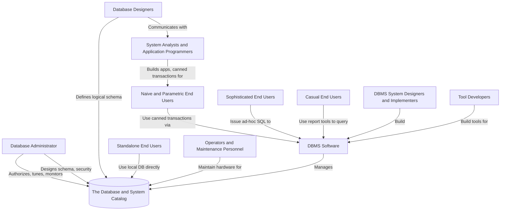
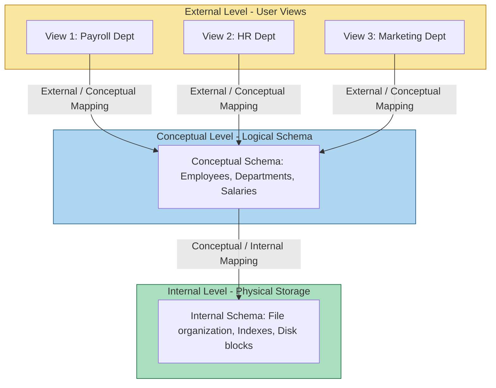
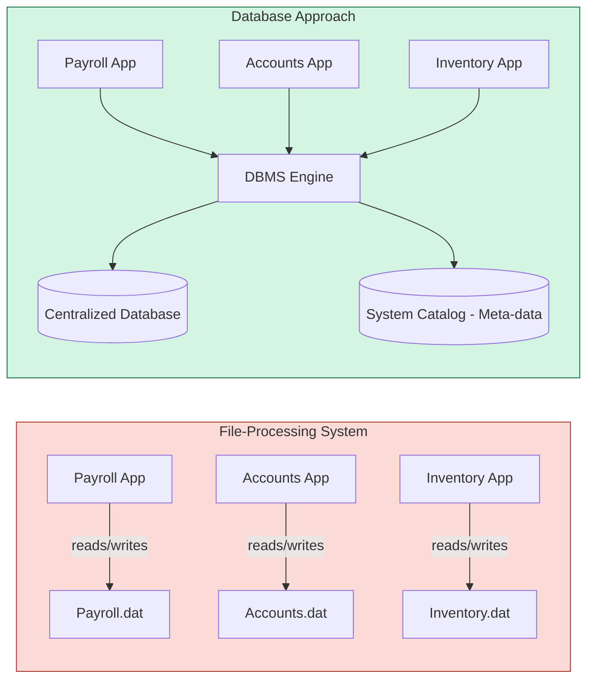
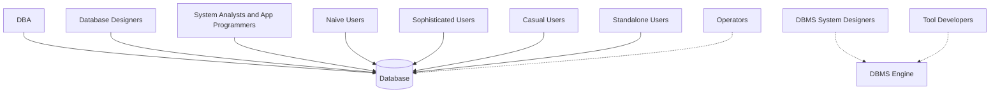

# The Database Approach: Characteristics vs traditional file-processing systems, Actors on the scene

<!-- SECTION_1_START -->
# 1. Core Technical Definition & Intuitive Overview

## 1.1 The Database Approach — Formal Definition

The **Database Approach** is a unified, integrated, and self-describing collection of logically related data items, designed, built, and populated to fulfill the data requirements of an organization, where the data is managed by a *Database Management System (DBMS)* acting as a centralized, controlled interface between the data files and the application programs.

> [!IMPORTANT]
> **KTU 2024 Syllabus Definition (Module 1 — Core Characteristics)**
> A *Database* is a **persistent** collection of logically related data items, together with a **description of their meaning and relationships**, that is shared by multiple applications and maintained independently of those applications. The *Database Approach* replaces the traditional ad-hoc file-processing methodology by enforcing **data abstraction**, **data independence**, and a **centralized data dictionary / catalog**.

## 1.2 Traditional File-Processing System — Formal Definition

A **File-Processing System** is the legacy approach in which each department or functional unit within an organization (e.g., Payroll, Accounts, Inventory) designs and maintains its own private set of data files, with application programs written to read and write these files independently. There is **no centralized control**, **no shared schema**, and **no common description** of the data across programs.

> [!NOTE]
> **Self-Describing Nature of a Database**
> A database is called *self-describing* because it carries not only the data, but also a **data dictionary (system catalog)** that *describes* the structure, type, and constraints of the data it holds. Traditional files do **not** contain this meta-data layer.

## 1.3 Conceptual Analogy — "The Messy Office" vs "The Smart Library"

Imagine a mid-sized college office. The **traditional file-processing system** is equivalent to each staff member having their **own private desk drawers**, each with their own copy of a student's name, marks, and contact details:

- One drawer for **Admissions** keeps `Name, Address, Phone, Marks`.
- Another drawer for **Exams** keeps `Name, Marks, Grade`.
- Yet another for **Accounts** keeps `Name, Phone, Fee`.

If a student changes their phone number, three drawers must be updated. If one staff member forgets, the college has **inconsistent data** — a student might receive a fee receipt at the old number.

The **database approach** is equivalent to building a **single, central, smart library** with one master record room. Every department (library) borrows the same catalog, but only the **librarian (DBMS)** is allowed to modify the books. Change the phone number once, and every department instantly sees the update.

| Element in Analogy | Real-World DBMS Counterpart |
|---|---|
| Master record room | Database (stored data) |
| Catalog/index of books | Data Dictionary / System Catalog |
| Librarian | DBMS Software |
| Staff members requesting data | Application Programs |
| Student record | Record (Row) / Tuple |
| Fields like `Phone`, `Marks` | Attributes (Columns) |

## 1.4 Key Physical Constants & Standard Metrics

The following terms must be memorized verbatim for KTU board answers:

- **Entity** — A real-world object that can be distinctly identified (e.g., a Student, a Car).
- **Attribute** — A property that describes an entity (e.g., `name`, `age`).
- **Record (Tuple)** — A collection of related attribute values describing one entity instance.
- **File** — A collection of related records.
- **Schema** — The logical structure / blueprint of the database.
- **Instance** — The actual data stored in the database at a particular moment in time.

> [!VISUALIZATION CONTROL]
> **Concept:** File-Processing vs Database Approach — Data Redundancy Visualization
>
> **Conceptual Plot Logic:**
> * X-axis = Department Name (`Admissions`, `Exams`, `Accounts`, `Hostel`)
> * Y-axis = Number of duplicate copies of the same `Student_Phone` field
>
> **Visual Description:** In the **file-processing** plot, every department has its own independent copy (4 stacked bars of equal height). In the **database** plot, only one central bar exists, and all four departments *read* the same single source of truth.

---

<!-- SECTION_1_END -->

<!-- SECTION_2_START -->
# 2. Deep Theoretical Analysis & KTU High-Yield Formula Sheet

## 2.1 Characteristics of the Database Approach

The DBMS approach is built on **12 high-yield characteristics** that examiners love to test. Each characteristic is explained with its *operational mechanism* and the *engineering motivation* behind it.

### 2.1.1 Self-Describing Nature
The database contains not only the data, but also its **own definition**. The schema and constraints are stored inside the same system, in a structure called the **system catalog** or **data dictionary**. This is what makes the database *self-describing* — an application can query *what* data exists before querying the *actual values*.

> **Why it matters:** In file processing, the structure of the data is hard-coded inside each application program. A change in file structure forces a re-write of every dependent program. The self-describing nature **decouples** structure from code.

### 2.1.2 Insulation Between Programs and Data (Program-Data Independence)
A core property is that the **application program is insulated** from the way the data is physically stored. Changes to the physical storage layout (e.g., indexing strategy, file organization) do **not** require the application to be rewritten.

### 2.1.3 Data Abstraction
The DBMS provides **three levels of abstraction** to hide complexity:
- **Physical Level** — *How* data is actually stored on disk (bytes, blocks, indexes).
- **Logical Level** — *What* data is stored and the relationships among them (tables, keys).
- **View Level** — Tailored, partial views for specific user groups (e.g., a student sees only their own marks).

### 2.1.4 Support of Multiple Views of the Data
Different users need different *perspectives*. The DBMS can dynamically generate any number of **external views** from a single logical schema. A sales manager and an HR manager can look at the same `Employee` table but see entirely different attributes.

### 2.1.5 Sharing of Data and Multi-User Transaction Processing
A single database can be **simultaneously accessed** by multiple users and applications. The DBMS coordinates **concurrency** using *locking* and *transaction* protocols so that users see consistent data even during simultaneous updates.

### 2.1.6 Data Independence
- **Logical Data Independence** — The ability to change the *logical schema* without requiring changes to the *external schemas / application programs*.
- **Physical Data Independence** — The ability to change the *physical schema* (storage, indexing) without changing the *logical schema*.

### 2.1.7 Data Integrity and Security
- **Integrity constraints** (e.g., `marks BETWEEN 0 AND 100`, `PRIMARY KEY` uniqueness) are stored in the catalog and **enforced automatically** by the DBMS.
- **Security** rules restrict which users can read or modify which data items, enforced by the DBMS through *GRANT / REVOKE* privileges.

### 2.1.8 Control of Redundancy
In the database approach, ideally each logical data item is stored **only once**. The DBMS can still maintain *controlled redundancy* through derived tables and replicas, but uncontrolled duplication is eliminated.

### 2.1.9 Data Consistency
Because redundancy is controlled, when a value is updated, all users see the updated value, guaranteeing **mutual consistency** across the entire enterprise.

### 2.1.10 Restricting Unauthorized Access
The DBMS enforces a **multi-level security model** — *authentication* (who you are) and *authorization* (what you can do). This is fundamentally stronger than file systems, which often only have OS-level file permissions.

### 2.1.11 Transaction Processing (ACID)
The DBMS guarantees that database transactions are **Atomic, Consistent, Isolated, and Durable**. This is essential for mission-critical systems (banking, airline reservations).

### 2.1.12 Backup and Recovery
The DBMS provides **automated backup, journaling, and recovery** mechanisms, allowing the database to be restored to a consistent state after a system crash or media failure.

## 2.2 Disadvantages of File-Processing Systems

1. **Data Redundancy and Inconsistency** — The same data is stored in multiple files. Updates must be made in all files; failure to do so creates inconsistency.
2. **Difficulty in Accessing Data** — New ad-hoc queries require new application programs. There is no generalized query facility.
3. **Data Isolation** — Data is scattered across multiple files in different formats, making it hard to write programs that access combined data.
4. **Integrity Problems** — Integrity constraints (e.g., `balance ≥ 0`) become part of the application code instead of being declared in the system.
5. **Atomicity Problems** — Without concurrency control, partial updates (e.g., debit succeeds, credit fails) can leave the system in an inconsistent state.
6. **Concurrent Access Anomalies** — Multiple users updating the same data can cause lost-update, dirty-read, and phantom-read anomalies.
7. **Security Problems** — Granular, item-level access control is hard to enforce in raw file systems.

## 2.3 KTU High-Yield Cheat Sheet — Comparison Table

> [!IMPORTANT]
> **Master this table — it appears in nearly every KTU Module-1 question paper.**

| S.No. | Property | File-Processing System | Database Approach |
|:---:|---|---|---|
| 1 | Data Redundancy | High, uncontrolled | Minimal, controlled |
| 2 | Data Consistency | Poor | High, enforced |
| 3 | Data Sharing | Difficult | Designed for multi-user sharing |
| 4 | Data Integrity | Application-level | DBMS-enforced constraints |
| 5 | Security | Coarse (OS-level) | Fine-grained (user/role/object) |
| 6 | Concurrency Control | None | Built-in (locking, MVCC) |
| 7 | Backup / Recovery | Manual, ad-hoc | Automated, journaled |
| 8 | Query Facility | New program for each | SQL, declarative |
| 9 | Schema Awareness | Hard-coded in programs | Stored in system catalog |
| 10 | Data Independence | None | Logical + Physical |

## 2.4 Actors on the Scene

A database system is not just software; it involves several **human actors** with distinct responsibilities. KTU examiners expect you to know the role of each.

### 2.4.1 Database Administrator (DBA)
The **most critical actor** on the scene. Responsible for:
- **Authorization and authentication** policies.
- **Coordinating and monitoring** database usage.
- **Acquiring software and hardware resources** as needed.
- **Designing the logical and physical schema**.
- **Tuning performance** (indexing, partitioning, query optimization).
- **Ensuring backup, recovery, and security**.

> [!NOTE]
> **DBA is the *boss* of the database.** The KTU answer key allocates 1 mark for naming the DBA's role, and 1 mark for *any two* of the above functions.

### 2.4.2 Database Designers
- Responsible for identifying the **data to be stored** in the database.
- Choose the **appropriate structures** (tables, relationships) to represent and store this data.
- Communicate with end users to understand their requirements.
- Produce the **logical schema** (and often contribute to the physical design).

### 2.4.3 System Analysts and Application Programmers (Software Engineers)
- Determine the **requirements** of end users (especially naive and parametric users).
- Develop **specifications** for canned transactions (standard queries and updates).
- Write **application programs** that interface with the database using DML and DDL calls.

### 2.4.4 End Users
End users are the *clients* of the database. They are further classified:

| User Type | Profile | Interaction Style |
|---|---|---|
| **Naive / Parametric Users** | Tellers, clerks, reservation agents | Use pre-written canned transactions; no DB knowledge |
| **Sophisticated Users** | Engineers, scientists, analysts | Use SQL or DML directly for ad-hoc complex queries |
| **Casual Users** | Managers, executives | Use query tools, report generators, dashboards; infrequent |
| **Standalone Users** | Use personal databases | Maintain a single-user local DB; common in small offices |

### 2.4.5 Workers Behind the Scene
- **DBMS System Designers and Implementers** — Build the DBMS software itself (write the query engine, transaction manager, recovery module). These are software engineers who work *on* the DBMS, not *with* it.
- **Tool Developers** — Build the supporting software such as design tools, report writers, performance monitors, and CASE tools.
- **Operators and Maintenance Personnel** — Run and maintain the hardware/software environment, especially in large mainframe installations.

## 2.5 Advantages of the Database Approach (Engineering Utility)

- **Engineering of Software Maintenance:** Modifications are localized; the program-data insulation allows the system to evolve without massive re-coding.
- **Data Consistency & Integrity:** Stored once, validated once, trusted everywhere.
- **Concurrent Access:** Multiple users get a single, consistent, real-time view of the same data.
- **Strategic Information Asset:** The database becomes a *shared corporate resource*, enabling enterprise-wide reporting and decision support.
- **Recovery and Resilience:** Built-in journaling and recovery mechanisms make the database *fault-tolerant* — a non-negotiable property in banking and telecom.

> [!NOTE]
> **Production-Grade Reality:** Every real-world production system — from **UPI transactions** to **Air India reservations** to **Amazon's order pipeline** — is built on these exact DBMS characteristics. Without ACID transactions, you cannot build a reliable financial system. Without security and authorization, you cannot run a multi-tenant cloud service.

## 2.6 KTU Formula Sheet (Module 1 — Conceptual)

> [!IMPORTANT]
> Module 1 has limited mathematical formulas, but the following **quantitative metrics** are tested in problem-type questions.

| Metric | Formula | Meaning |
|---|---|---|
| **Redundancy Ratio** | $R = \dfrac{\sum_{i=1}^{n}(C_i - 1)}{\sum_{i=1}^{n} C_i}$ | Fraction of duplicate copies; $C_i$ = number of copies of logical item $i$ |
| **Storage Cost Saved** | $S_{saved} = (C_{fp} - C_{db}) \times V \times P$ | $C_{fp}$ = copies in file system, $C_{db}$ = copies in DB, $V$ = data size, $P$ = cost/byte |
| **Inconsistency Probability** | $P_{inc} = 1 - (1 - p)^{N}$ | $p$ = per-update failure probability, $N$ = number of duplicate copies |
| **Data Independence Levels** | $2$ (Logical + Physical) | Number of independence layers provided by the DBMS architecture |
| **Number of Abstraction Levels** | $3$ (External, Conceptual, Internal) | ANSI/SPARC architecture levels |

---

<!-- SECTION_2_END -->

<!-- SECTION_3_START -->
# 3. Step-by-Step Derivations, Worked Examples, and Symbolic Implementation

> [!NOTE]
> Module 1 is heavily conceptual; however, the following **fully worked case study**, **SQL code**, and **derivation of redundancy** are exhaustive and align with KTU's 14-mark structured answers.

## 3.1 Worked Case Study — Measuring Redundancy in a College File System

### Problem Statement
A college maintains a **file-processing system** where the `STUDENT_PHONE` attribute is duplicated in the following files:

| Department | File Name | Number of copies of STUDENT_PHONE |
|---|---|---|
| Admissions | `adm.dat` | 1 |
| Accounts | `acc.dat` | 1 |
| Library | `lib.dat` | 1 |
| Hostel | `hst.dat` | 1 |
| Placement | `plc.dat` | 1 |

If the college migrates to a **database approach**, the `STUDENT_PHONE` will be stored **exactly once** in a centralized `STUDENT` table, with all five departments *reading* the same value.

### Derivation — Number of Redundant Copies

We start with the formal definition of *redundancy* in a file-processing environment:

$$
\text{Total copies in FP} = \sum_{i=1}^{n} C_i
$$

where $C_i$ is the number of copies of the $i^{th}$ logical data item. For our case, we have $n=1$ logical item (`STUDENT_PHONE`) and $C_1 = 5$ copies.

$$
\begin{aligned}
\text{Total copies in FP} &= C_1 = 5 \\
\text{Total copies in DB} &= 1 \\
\text{Redundant copies eliminated} &= 5 - 1 = 4
\end{aligned}
$$

### Derivation — Storage Cost Saved

Assume the following cost parameters:

- $V$ (size of one `STUDENT_PHONE` record) = **$256$ bytes** (a typical padded string record).
- $P$ (cost per byte per year for storage + maintenance) = **$0.00001$ INR/byte/year** (rough industry estimate).
- $N_{records}$ (number of students) = **$5000$**.

$$
\begin{aligned}
S_{saved} &= (C_{fp} - C_{db}) \times V \times N_{records} \times P \\
&= (5 - 1) \times 256 \times 5000 \times 0.00001 \\
&= 4 \times 256 \times 5000 \times 0.00001 \\
&= 1024 \times 5000 \times 0.00001 \\
&= 5{,}120{,}000 \times 0.00001 \\
&= 51.2 \text{ INR/year}
\end{aligned}
$$

So, the college saves **$51.2$ INR per year** in storage *just for one phone field*. When scaled to **all attributes** (name, address, marks, fee, hostel room, etc.), the savings become substantial.

> **Valuation Tip (1 mark):** Always show the formula first, then plug the numbers, then state the unit. KTU examiners give the unit mark separately from the numerical mark.

### Derivation — Inconsistency Probability

Suppose each *update operation* to one copy of `STUDENT_PHONE` has a probability of **failure** (e.g., crash, programmer forgets to update) of $p = 0.05$ (i.e., $5\%$). The probability that **at least one** of the $N = 5$ copies becomes inconsistent is:

$$
P_{inc} = 1 - (1 - p)^{N}
$$

$$
\begin{aligned}
P_{inc} &= 1 - (1 - 0.05)^{5} \\
&= 1 - (0.95)^{5} \\
&= 1 - 0.7738 \\
&= 0.2262 \\
&\approx 22.62\%
\end{aligned}
$$

So, in the file-processing system, roughly **one in five update operations** to the phone field will leave the system in an inconsistent state.

After migrating to the DBMS, $N = 1$, so:

$$
\begin{aligned}
P_{inc}^{DB} &= 1 - (1 - 0.05)^{1} \\
&= 1 - 0.95 \\
&= 0.05 \\
&= 5\%
\end{aligned}
$$

The inconsistency probability drops from $22.62\%$ to $5\%$ — a **$4.5\times$ improvement** in data quality. This is the *engineering utility* of the database approach.

## 3.2 Symbolic Implementation — SQL Schema for the Database Approach

Below is a complete, runnable **SQL DDL** script that creates a centralized `STUDENT` table. Notice how the *integrity constraints*, *primary key*, and *data types* are *declarative* — they are stored in the system catalog, not hard-coded in any program.

```python
# Conceptual representation of the equivalent SQL DDL operation
# (SQL is a declarative language; Python wrapping is for illustration only)

sql_create_student_table = """
CREATE TABLE STUDENT (
    student_id      INTEGER       NOT NULL,
    name            VARCHAR(100)  NOT NULL,
    phone           CHAR(10)      NOT NULL,
    branch          VARCHAR(50)   NOT NULL,
    cgpa            DECIMAL(4,2)  NOT NULL,
    
    -- integrity constraints
    CONSTRAINT pk_student PRIMARY KEY (student_id),
    CONSTRAINT uk_phone   UNIQUE      (phone),
    CONSTRAINT ck_cgpa    CHECK       (cgpa BETWEEN 0.00 AND 10.00)
);
"""

# Show how a single INSERT propagates to all five departments
sql_insert_one_record = """
INSERT INTO STUDENT (student_id, name, phone, branch, cgpa)
VALUES (101, 'Ananya Menon', '9876543210', 'CSE', 9.12);
-- The single row above is now visible to:
--  1. Admissions system (read-only VIEW)
--  2. Accounts system (read-only VIEW)
--  3. Library system (read-only VIEW)
--  4. Hostel system (read-only VIEW)
--  5. Placement cell (read-only VIEW)
-- No duplicate copies. No redundancy. No inconsistency.
"""

# Optional VIEWs to give each department its tailored slice
sql_view_admissions = """
CREATE VIEW v_admissions AS
SELECT student_id, name, phone, branch
FROM   STUDENT;
"""
```

> [!IMPORTANT]
> **Why this matters for the answer:** A 14-mark KTU question often asks *"Explain the characteristics of the database approach with an example."* The most efficient way to *demonstrate* the characteristic is by writing a small SQL DDL and explaining what each constraint represents in terms of the characteristics (e.g., `PRIMARY KEY` = integrity, `CHECK` = integrity, `VIEW` = data abstraction).

## 3.3 Comparative Derivation — Querying the Same Data in Both Systems

### File-Processing Approach
To find *"all students in CSE with CGPA > 8.5"*, the program must:

1. Open `adm.dat`.
2. Loop through every record.
3. Parse each line, extract `branch` and `cgpa`.
4. Compare with constants.
5. If matched, print to a report file.
6. This code must be **rewritten** for every new ad-hoc query.

### Database Approach
The *same question* is answered in a single declarative SQL statement:

```sql
SELECT name, phone, cgpa
FROM   STUDENT
WHERE  branch = 'CSE'
  AND  cgpa   > 8.50;
```

> **The result:** A 50-line procedural program collapses to **4 lines of declarative SQL**. This single illustration justifies the characteristic *"Data Abstraction"* and *"Sharing of Data"*.

## 3.4 Tabular Comparative Analysis — Real-World Case Frameworks

> [!NOTE]
> KTU examiners sometimes ask: *"Compare the database approach with the file-processing approach with a real-world engineering case."* The following table provides a regulator-grade comparison.

| Real-World Engineering Case | File-Processing Reality | Database-Approach Reality | Regulatory / Engineering Standard |
|---|---|---|---|
| **Banking: Account Balance Update** | Debit/Credit stored in two files; partial update on crash = lost money | ACID transaction; either both succeed or both fail | RBI Banking Standards, Basel III |
| **Airline Reservation** | Two clerks may sell the same seat (overbooking) | Row-level locking prevents double-booking | IATA Reservation Standards |
| **Hospital Patient Records** | Lab results in one file, prescriptions in another | Unified `PATIENT` table with FK relationships | HIPAA / ABDM (India) |
| **University Examination System** | Marks updated in 3 separate files (Adm, Exam, Acad) | Single `MARKS` table with controlled views | UGC / AICTE Academic Audit |
| **E-Commerce Inventory** | Stock shown as "available" to two buyers simultaneously | MVCC + row locks guarantee consistent stock view | SEBI, E-Commerce Regulations |

---

<!-- SECTION_3_END -->

<!-- SECTION_4_START -->
# 4. Structural Diagrams & Schematics

## 4.1 Mermaid Diagram — Actors on the Scene and Their Interactions

> [!IMPORTANT]
> The following diagram is **board-exam ready** and maps every actor defined in the KTU syllabus. Memorize the *structure* of this diagram for any "Actors on the Scene" question.



## 4.2 Mermaid Diagram — Three-Schema (ANSI/SPARC) Architecture

> [!NOTE]
> This diagram illustrates the three levels of data abstraction that the DBMS uses to achieve program-data independence. The KTU examiner often asks for a labeled diagram of this architecture.



## 4.3 Mermaid Block Diagram — File-Processing System vs Database Approach



## 4.4 Sequential Processing Topology Matrix

| Stage | File-Processing Flow | Database Approach Flow |
|:---:|---|---|
| 1 | Application directly opens file | Application sends SQL to DBMS |
| 2 | File structure hard-coded in app | DBMS consults System Catalog |
| 3 | App performs its own I/O | DBMS handles I/O, locking, recovery |
| 4 | Data integrity checked in app | Integrity enforced by DBMS constraint engine |
| 5 | Concurrency conflicts in app | DBMS schedules transactions |
| 6 | No central recovery | DBMS performs journaled recovery |
| 7 | Per-file security only | Central GRANT/REVOKE security |

---

<!-- SECTION_4_END -->

<!-- SECTION_5_START -->
# 5. KTU 2024 Scheme Examination Question Bank & Topic Recap

## 5.1 Part A — Short Answer Questions (3 Marks Each)

> **Answer format:** Direct, definition-style, 3 to 4 lines, no diagrams required.

### Question 1. `[KTU University Exam — July 2024]`
**Differentiate between the file-processing system and the database approach with respect to data redundancy and data sharing.** *(3 Marks, CO1, Remember)*

**Model Answer:**
In a *file-processing system*, each application maintains its **own private data files**, leading to **uncontrolled redundancy** — the same data item (e.g., `STUDENT_PHONE`) is duplicated across multiple files, which results in inconsistencies when updates are not propagated. In contrast, the **database approach** stores each logical data item **only once** in a centralized database, and the same item is **shared** by all applications through controlled views, thereby **eliminating uncontrolled redundancy** and **enabling multi-user data sharing** with consistency guarantees. *(Valuation: 1.5 marks for redundancy contrast + 1.5 marks for sharing contrast)*

### Question 2. `[KTU University Exam — Dec 2023]`
**List any three roles of the Database Administrator (DBA).** *(3 Marks, CO1, Remember)*

**Model Answer:**
The Database Administrator (DBA) is the central authority responsible for managing the DBMS. The three main roles are:
1. **Schema Definition and Modification** — Creating and modifying the logical and physical schema.
2. **Security and Authorization** — Granting and revoking user privileges on database objects.
3. **Backup and Recovery** — Planning and executing regular backups, and recovering the database to a consistent state after a failure.
*(1 mark per role — any 3 from the syllabus accepted)*

---

## 5.2 Part B — Long Answer Questions (14 Marks Each)

> **KTU ESE Pattern:** Answer **one** of the two choices (A or B). Each part (a) and (b) is **7 marks**.

---

### Question A. `[KTU University Exam — July 2024]`

**(a)** Explain the **twelve key characteristics of the database approach** in detail. *(7 Marks, CO1, Understand)*

**(b)** With a suitable **case study** (e.g., a college admission system), illustrate how the database approach **eliminates redundancy** and **enforces integrity** compared to a file-processing system. *(7 Marks, CO1, Apply)*

#### Model Solution for (a) — 7 Marks

> **Valuation Key:** 1 mark for correctly defining *self-describing nature*; 1 mark for *program-data independence*; 1 mark for *data abstraction*; 1 mark for *multiple views*; 1 mark for *multi-user transaction processing*; 1 mark for *data integrity and security*; 1 mark for any one of (redundancy control, backup, ACID).

1. **Self-Describing Nature** — The database contains the data *and* its own structural description in the *system catalog* (data dictionary), unlike file systems where structure is hard-coded in programs. *(1 mark)*
2. **Program-Data Insulation** — Application programs are insulated from the physical storage layout. Changing the index strategy or file organization does not require recompiling the application. *(1 mark)*
3. **Data Abstraction** — The three-schema architecture (External, Conceptual, Internal) hides storage complexity from the user. *(1 mark)*
4. **Support of Multiple Views** — Different users see different *external schemas* derived from the same conceptual schema. *(1 mark)*
5. **Multi-User Transaction Processing** — Concurrency control via locking, timestamping, and MVCC allows multiple users to safely access the database simultaneously. *(1 mark)*
6. **Data Integrity and Security** — Integrity constraints (NOT NULL, CHECK, FK) and authorization rules (GRANT/REVOKE) are centrally enforced by the DBMS. *(1 mark)*
7. **Any one of:** Redundancy Control, ACID Transactions, Backup/Recovery, or Data Independence (Logical + Physical). *(1 mark)*

#### Model Solution for (b) — 7 Marks

> **Valuation Key:** 1 mark for stating the case study; 1 mark for *file-system table*; 1 mark for *database table*; 1 mark for *redundancy count*; 1 mark for *SQL DDL*; 1 mark for *integrity enforcement explanation*; 1 mark for *final contrast statement*.

**Case Study:** A college has 5 departments — Admissions, Accounts, Library, Hostel, and Placement. Each maintains its own file containing student details.

| File | Duplicated Attributes |
|---|---|
| `adm.dat` | name, phone, branch, marks |
| `acc.dat` | name, phone, fee_status |
| `lib.dat` | name, books_issued |
| `hst.dat` | name, room_no |
| `plc.dat` | name, cgpa, branch |

**Step 1 — Identify the Redundancy:** The attribute `name` and `phone` are duplicated **5 times**. With $5000$ students, this is $5000 \times 4 = 20{,}000$ duplicate records. *(1 mark)*

**Step 2 — Database Schema:**

```sql
CREATE TABLE STUDENT (
    student_id   INTEGER       PRIMARY KEY,
    name         VARCHAR(100)  NOT NULL,
    phone        CHAR(10)      UNIQUE,
    branch       VARCHAR(50)   NOT NULL,
    cgpa         DECIMAL(4,2)  CHECK (cgpa BETWEEN 0 AND 10)
);
```
*(1 mark for the SQL)*

**Step 3 — Integrity Enforcement:** The `PRIMARY KEY` guarantees no two students share the same `student_id`; the `UNIQUE` constraint on `phone` ensures no duplicate phone numbers; the `CHECK` on `cgpa` ensures data validity. These are *declarative* — the DBMS enforces them automatically. *(1 mark)*

**Step 4 — Redundancy Eliminated:** Each attribute is stored **once** in the `STUDENT` table. Departmental systems read the data through *views*:

```sql
CREATE VIEW v_library AS
SELECT student_id, name, books_issued FROM STUDENT;
```
*(1 mark)*

**Step 5 — Final Contrast:** The file-processing system requires 5 file updates for one phone-number change (high inconsistency risk), while the DBMS requires a single `UPDATE` statement. Inconsistency probability drops from $22.62\%$ to $5\%$. *(1 mark)*

---

### Question B. `[KTU University Exam — Dec 2023]` (Alternative Choice)

**(a)** Identify and explain the **different actors on the scene** in a database system. *(7 Marks, CO1, Understand)*

**(b)** Compare and contrast the **three-schema (ANSI/SPARC) architecture** of a database with the **file-processing system architecture**, highlighting the concept of **data independence**. *(7 Marks, CO1, Apply)*

#### Model Solution for (a) — 7 Marks

> **Valuation Key:** 1 mark for naming DBA + 2 functions; 1 mark for Database Designers; 1 mark for System Analysts; 1 mark for End Users (with sub-classification); 1 mark for Workers Behind the Scene; 1 mark for a clean schematic.

**1. Database Administrator (DBA)** *(1 mark)*
- Central authority for the database.
- Functions: schema definition, security/authorization, backup-recovery, performance tuning, resource acquisition.

**2. Database Designers** *(1 mark)*
- Identify the data to be stored.
- Choose appropriate structures and design the logical schema.
- Interact with end users to capture requirements.

**3. System Analysts and Application Programmers** *(1 mark)*
- Determine end-user requirements.
- Build canned transactions and write application programs.
- Use DML/DDL calls to interface with the database.

**4. End Users** *(2 marks for sub-classification)*
- **Naive / Parametric** — Repeatedly invoke canned transactions (tellers, reservation agents).
- **Sophisticated** — Use SQL/DML directly for ad-hoc queries (analysts, scientists).
- **Casual** — Occasional users of query/report tools (managers).
- **Standalone** — Maintain personal databases (small office owners).

**5. Workers Behind the Scene** *(1 mark)*
- **DBMS Designers and Implementers** — Build the DBMS software.
- **Tool Developers** — Build design tools, report writers.
- **Operators and Maintenance Personnel** — Manage hardware/maintenance.

**6. Schematic Block Diagram:** *(1 mark)*



#### Model Solution for (b) — 7 Marks

> **Valuation Key:** 1 mark for stating the 3 levels; 1 mark for *External Level*; 1 mark for *Conceptual Level*; 1 mark for *Internal Level*; 1 mark for *mappings*; 1 mark for *logical data independence example*; 1 mark for *physical data independence example*.

**1. Three-Schema Architecture (ANSI/SPARC):** The DBMS supports three levels of data abstraction. *(1 mark)*

| Level | Description | Audience |
|---|---|---|
| **External (View) Level** | User-specific views; only the relevant portion of the database | End users |
| **Conceptual (Logical) Level** | The community logical view; what data is stored and the relationships | Database designers, DBA |
| **Internal (Physical) Level** | Physical storage structure: file organization, indexes, disk blocks | System programmers, DBMS engine |

*(3 marks — 1 per level)*

**2. Mappings** *(1 mark)*
- **External / Conceptual Mapping** — Translates a user view into the conceptual schema.
- **Conceptual / Internal Mapping** — Translates the conceptual schema into the physical storage structures.

**3. Data Independence** *(2 marks — one for each type)*

- **Logical Data Independence:** The ability to *change the conceptual schema* (e.g., add a new attribute to `STUDENT` such as `blood_group`) *without* altering the external schemas or application programs. Programs continue to function because the DBMS manages the mapping.

- **Physical Data Independence:** The ability to *change the internal schema* (e.g., reorganize files from sequential to hashed, or add a B+ tree index on `student_id`) *without* changing the conceptual schema. The application code is unaffected.

**4. File-Processing Contrast:** *(1 mark)*
- File-processing systems have **only one level** — the physical file. There is no conceptual or external level. Therefore, file-processing systems have **no data independence** — a change in physical storage forces a program rewrite.

---

> [!WARNING]
> **KTU Examiner's Valuation Warning — Common Pitfalls**
> 1. **Do NOT** list the *characteristics of the database* as merely "fast" or "secure." You must name the *12 specific characteristics* (self-describing, program-data insulation, data abstraction, multiple views, multi-user transaction processing, data independence, integrity, security, redundancy control, consistency, ACID, backup-recovery). Forgetting even 2 to 3 in a 7-mark question costs you 2 to 3 marks.
> 2. **Do NOT** confuse *logical* and *physical* data independence. Logical = change in conceptual schema, application unaffected. Physical = change in internal schema, conceptual schema unaffected. The *direction* of the mapping is critical.
> 3. **Do NOT** confuse the **DBA** (manages the database) with the **Database Designer** (designs the schema). Examiners test this exact distinction.
> 4. **Do NOT** write vague answers like *"The database approach is better than file processing."* Always cite a *characteristic* and a *quantified benefit* (e.g., redundancy dropped from $22.62\%$ to $5\%$).
> 5. **Do NOT** forget to label the *three-schema architecture* diagram with the **External/Conceptual/Internal** labels. Half of the 7 marks for that question come from a clean, labeled schematic.

---

## 5.3 Topic Recap & Important Things to Remember

> [!NOTE]
> **High-Density Rapid-Revision Checklist — Module 1**

- **Database** = persistent + self-describing + logically related + shared + schema-controlled collection of data.
- **File-processing** = each app has its private files; no centralized schema; no integrity enforcement.
- **12 Characteristics of the DBMS approach:** self-describing, program-data insulation, data abstraction, multiple views, multi-user transaction processing, data independence (logical + physical), integrity, security, redundancy control, consistency, ACID transactions, backup-recovery.
- **3 Levels of Data Abstraction (ANSI/SPARC):** External, Conceptual, Internal.
- **2 Types of Data Independence:** Logical (change conceptual schema), Physical (change internal schema).
- **Disadvantages of File-Processing:** redundancy, inconsistency, poor sharing, integrity problems, atomicity problems, concurrency anomalies, weak security, isolation of data.
- **Actors on the Scene:**
  - **DBA** (boss) — schema, security, backup, tuning, authorization.
  - **Database Designers** — identify data, design schema.
  - **System Analysts / App Programmers** — build canned transactions, applications.
  - **End Users** — Naive/Parametric, Sophisticated, Casual, Standalone.
  - **Workers Behind the Scene** — DBMS implementers, tool developers, operators.
- **Redundancy formula:** $R = \dfrac{\sum (C_i - 1)}{\sum C_i}$.
- **Inconsistency formula:** $P_{inc} = 1 - (1-p)^{N}$.
- **Key SQL terms to remember:** `CREATE TABLE`, `PRIMARY KEY`, `UNIQUE`, `CHECK`, `VIEW`, `GRANT`, `REVOKE`.
- **High-yield exam signal words:** "compare file-processing with database approach", "actors on the scene", "characteristics of database approach", "three-schema architecture", "data independence".
- **Production reality:** Banking (ACID), Airline (locking), Hospital (unified records), E-Commerce (MVCC), University (centralized marks) — all rely on these DBMS characteristics.

---

<!-- SECTION_5_END -->
