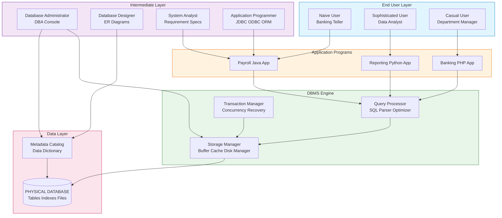
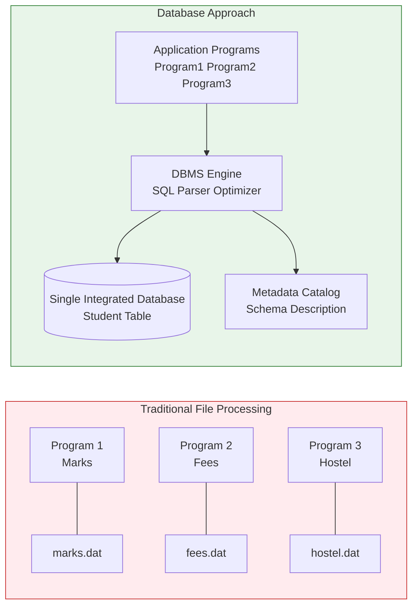
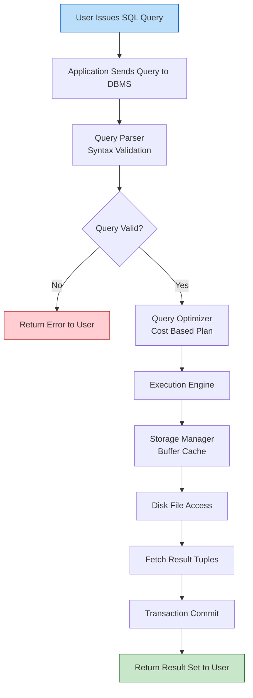
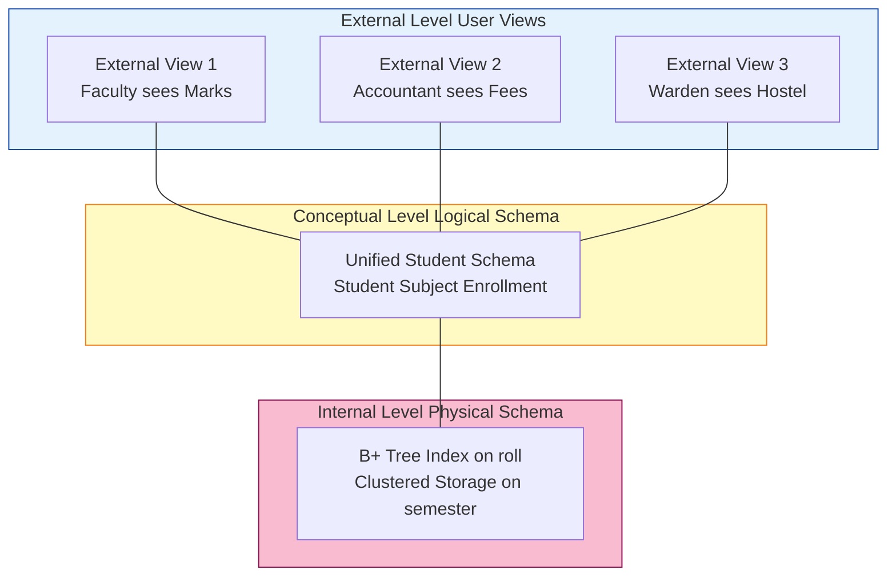

# The Database Approach: Characteristics vs traditional file-processing systems, Actors on the scene

<!-- SECTION_1_START -->
# The Database Approach: Characteristics vs. Traditional File-Processing Systems & Actors on the Scene

## 1.1 Formal Academic Definition (KTU 2024 Syllabus Terminology)

> [!IMPORTANT]
> **Database (KTU Definition):** A **database** is a *shared, integrated, computer-structured collection of persistent data*, along with a **description (metadata)** of that data, designed and built to satisfy the **information needs** of multiple users in an organization. The software module that manages a database is called a **Database Management System (DBMS)**.

> [!IMPORTANT]
> **Database Approach:** A paradigm shift from **program-centric** (file processing) to **data-centric** computing, where the structure of the data is stored *separately* from the application programs that access it, enabling **data abstraction, data independence, and concurrent multi-user access**.

> [!NOTE]
> **Key Distinction — Data vs. Information:**
> * **Data** = Raw, unprocessed facts (e.g., `42`, `"Arjun"`, `₹5000`).
> * **Information** = Processed data that carries meaning, context, and utility for decision-making (e.g., *"42 B.Tech students named Arjun have paid ₹5000 in fees this semester"*).

---

## 1.2 Conceptual Analogy & Intuition (The "Library vs. Cupboard" Analogy)

Imagine two different ways a school manages student records:

### 🗄️ The Traditional File-Processing Cupboard
Each teacher keeps records in their **own private cupboard**:
* The Mathematics teacher has a cupboard with marks sheets in **descending order of roll number**.
* The Attendance teacher has another cupboard with attendance in **alphabetical order of name**.
* The Fee clerk has a third cupboard, sorted by **payment date**.
* Every time a new requirement arises (say, "list students above 80%"), a teacher must **buy a new cupboard and rewrite the data from scratch** because they cannot share or reorganize efficiently.
* If two teachers try to update the same student's marks *at the same time*, the records become inconsistent.

### 🏛️ The Database Approach — Central Library
Now imagine a **central library** where:
* All student records sit in **one large catalogue** (the database).
* The catalogue itself has a **card-index** (metadata) describing what each drawer contains.
* Any teacher (program) can come in, request data in **any order**, and the librarian (DBMS) rearranges, filters, and returns the answer — without disturbing the original storage.
* Multiple teachers can read concurrently; the librarian enforces "one writer at a time" on a record (concurrency control).
* If a new question arises tomorrow ("average marks by district"), the librarian handles it using **the same stored data** — no new files needed.

> [!TIP]
> **Intuitive Takeaway:** In the *file approach*, **programs own the data**. In the *database approach*, **the database owns the data**, and programs merely *borrow* views of it.

---

## 1.3 Physical Constants & Standard Metrics to Remember

* **Atomicity Unit** = 1 transaction (commit/rollback boundary).
* **ACID** = Atomicity, Consistency, Isolation, Durability — the four cardinal guarantees.
* **Three-Schema Architecture Levels** = **External** (user view), **Conceptual** (logical whole), **Internal** (physical storage).
* **Metadata-to-Data ratio** typically ranges from **5% to 20%** of total database size for OLTP systems.

---

## 1.4 GeoGebra / Desmos Visualization (Conceptual Mapping)

> [!VISUALIZATION CONTROL]
> **Concept:** Mapping a 2-D relational record (Roll No, Name) onto independent storage and logical access planes (Internal vs. Conceptual vs. External Schema).
> **GeoGebra / Desmos Input Equations:**
> * Conceptual Plane: $C: x + y = 100$ (logical record space)
> * Internal Plane (storage): $I: (x-50)^2 + (y-50)^2 = 1600$ (physical cluster)
> * External View 1 (Teacher A): $E_1: y = 2x$ (sorted by roll)
> * External View 2 (Teacher B): $E_2: y = -x + 80$ (sorted by name)
> **Visual Description:** Students should observe how the *same physical cluster* (circle) can be *viewed differently* from multiple external planes (lines) — illustrating **data independence**.

---
<!-- SECTION_1_END -->

<!-- SECTION_2_START -->
# Deep Theoretical Analysis & KTU High-Yield Cheat Sheet

## 2.1 Limitations of Traditional File-Processing Systems (Why we abandoned it)

The KTU 2024 syllabus explicitly expects students to be able to **enumerate and explain** the problems with file processing. The following is the canonical list:

1. **Data Redundancy & Inconsistency** — Same data is duplicated across multiple files (e.g., student name in marks file, fee file, hostel file). Updating one file but not another leads to *inconsistency*.
2. **Data Isolation** — Data is scattered in disparate files in incompatible formats, making cross-file queries nearly impossible.
3. **Integrity Problems** — Hard to enforce *consistency constraints* (e.g., "marks must be between 0 and 100") because they are buried in application code.
4. **Atomicity Problems** — A failure midway through a multi-step operation (e.g., debit one account, credit another) can leave the system in an *inconsistent partial state*.
5. **Concurrent Access Anomalies** — Uncontrolled simultaneous updates produce *lost-update*, *dirty-read*, and *unrepeatable-read* anomalies.
6. **Security Problems** — Hard to enforce *per-user, per-action* access control when every program accesses raw files directly.

---

## 2.2 The Seven Defining Characteristics of the Database Approach (KTU High-Yield List)

| # | Characteristic | Meaning | Engineering Benefit |
|---|---|---|---|
| 1 | **Self-Describing Nature** | The database contains a *catalog* (data dictionary) describing the structure of the data itself. | The DBMS becomes *data-driven*, not program-driven. |
| 2 | **Insulation between Programs and Data (Data Abstraction)** | Programs see a *logical model* (tables, relationships), not physical storage details. | **Logical Data Independence** — schema changes don't break applications. |
| 3 | **Support for Multiple Views of Data** | Each user sees only a *subset* relevant to their role. | Privacy + tailored UX. |
| 4 | **Sharing of Data and Multi-User Transaction Processing** | A single database serves many concurrent users with concurrency control. | Real-time enterprise collaboration. |
| 5 | **Data Integrity & Security** | Constraints (keys, FK, checks), authorization rules centrally enforced. | Trusted enterprise data. |
| 6 | **Enforcement of Integrity Constraints** | Domain rules, referential integrity, business rules applied by the DBMS, not apps. | Single source of truth. |
| 7 | **Data Independence** | Separation of application from physical storage layout. | Storage migration with zero app rewrite. |

---

## 2.3 The Six Database Languages (SPL × DML × DDL × DCL × TCL)

| Category | Language Family | Examples | KTU High-Yield Examples |
|---|---|---|---|
| **DDL** (Data Definition) | Define schema | `CREATE`, `ALTER`, `DROP` | `CREATE TABLE Student(...)` |
| **DML** (Data Manipulation) | Manipulate data | `SELECT`, `INSERT`, `UPDATE`, `DELETE` | `SELECT * FROM Student WHERE cgpa > 8.5` |
| **DCL** (Data Control) | Permissions | `GRANT`, `REVOKE` | `GRANT SELECT ON Marks TO 'faculty'` |
| **TCL** (Transaction Control) | Commit/rollback | `COMMIT`, `ROLLBACK`, `SAVEPOINT` | `COMMIT;` |
| **VCS / SPL** | Stored procedures, views | `CREATE VIEW`, `CREATE PROCEDURE` | `CREATE VIEW Toppers AS ...` |
| **DQL** | Query | `SELECT` (sometimes separated) | `SELECT name FROM Student;` |

> [!NOTE]
> **KTU Board Tip:** When asked "list DDL commands," always include `CREATE`, `ALTER`, `DROP`, `TRUNCATE` (the last is technically DML in some texts, but KTU examiners accept it as DDL). For DML, separate *Procedural* (e.g., Embedded SQL, PL/SQL) from *Non-Procedural/Declarative* (e.g., SQL `SELECT`).

---

## 2.4 Actors on the Scene — The Cast of the Database Drama

The KTU 2024 syllabus divides the people involved in a database system into **two clear groups**:
* **Actors on the Scene** — people whose *jobs* involve the database day-to-day.
* **Workers Behind the Scene** — the system software and DBMS vendor staff (covered in the next module).

### High-Yield Comparison Table: Actors on the Scene

| Actor | Primary Role | Tools Used | Typical KTU 2-Marker Example |
|---|---|---|---|
| **Database Administrator (DBA)** | *Database police + postmaster* — manages schema, security, backup, recovery, performance tuning. | DBA console, `pgAdmin`, `SQL*Plus`, `MySQL Workbench` | *"The DBA is responsible for granting `SELECT` privileges to the faculty role."* |
| **Database Designers** | Identify the data to be stored, choose structures, design ER diagrams, normalize. | ER diagrams, UML, normalization tools | *"The designer decides to split `Student` into `Student` and `Department` to remove partial dependency."* |
| **System Analysts** | Bridge between end-users and designers — capture requirements, define scope. | Requirement specs, DFDs, use cases | *"The system analyst documents that 'a student may enroll in at most 7 courses per semester.'"* |
| **Application Programmers** | Implement the DBMS interactions in code (Java, Python, PHP). | JDBC, ODBC, ORM (Hibernate, SQLAlchemy) | *"The programmer writes a Python `try/except` block to handle `IntegrityError` on duplicate roll number."* |
| **End Users** (Naive / Sophisticated / Casual) | The actual *consumers* of the database. | Forms, reports, BI tools, ad-hoc query tools | *"A bank teller is a naive end user."* |

---

### 2.4.1 Sub-Categorization of End Users (High-Yield for KTU)

| Sub-Type | Behaviour | Example | Frequency in KTU Questions |
|---|---|---|---|
| **Naive / Parametric** | Repeated canned transactions via forms. | Bank teller, supermarket billing clerk | ⭐⭐⭐ |
| **Sophisticated** | Knows the schema; writes complex ad-hoc queries. | Business analyst running OLAP joins | ⭐⭐ |
| **Casual** | Occasional access via query tools; no in-depth schema knowledge. | Manager checking a monthly report | ⭐ |

---

## 2.5 Real-World Engineering Utility

* **Banking Core Systems (Core Banking Solutions like Infosys Finacle, TCS BaNCS):** Use the database approach for ACID compliance — a transfer of ₹10,000 is one atomic transaction, not two independent file updates.
* **E-Commerce Giants (Amazon, Flipkart):** A single product database serves the website, mobile app, warehouse app, recommendation engine, and ML pipelines — all via different *external views* of the same underlying *conceptual schema*.
* **Healthcare (Aarogya Setu, Hospital Information Systems):** Patient records centralized to eliminate redundancy between labs, pharmacy, and billing.
* **IoT & Smart Cities (KSUM, KSEB Smart Grid):** Time-series sensor data ingested into databases like InfluxDB/PostgreSQL/TimescaleDB for real-time analytics.

---
<!-- SECTION_2_END -->

<!-- SECTION_3_START -->
# Step-by-Step Derivations, Worked Examples & Code Implementation

## 3.1 Detailed Comparative Derivation: File Processing vs. Database Approach

Below is a step-by-step narrative derivation explaining **why** the database approach emerged, the operational difference in pseudocode, and how the constraints are enforced.

### 3.1.1 Scenario: Updating a Student's Address (Three Different Systems)

Let $S = \{\text{student}\}$ be the set of student entities. In the **file system**, the same student object exists in *three independent files*:

$$
F_{\text{marks}} = \{(\text{roll}, \text{name}, \text{address}, \text{marks})\}
$$

$$
F_{\text{fees}} = \{(\text{roll}, \text{name}, \text{address}, \text{amount})\}
$$

$$
F_{\text{hostel}} = \{(\text{roll}, \text{name}, \text{address}, \text{roomNo})\}
$$

**Step 1 — In File Processing:** Three update statements are written, one per file.

```text
UPDATE F_marks SET address = 'NewAddr' WHERE roll = 42;
UPDATE F_fees  SET address = 'NewAddr' WHERE roll = 42;
UPDATE F_hostel SET address = 'NewAddr' WHERE roll = 42;
```

**Step 2 — Failure Mid-Way:** If the third UPDATE fails (power loss, crash), the database is *inconsistent*. The address in $F_{\text{marks}}$ is updated, but in $F_{\text{hostel}}$ it is not.

**Step 3 — In Database Approach:** The same data is stored *once* in a normalized `Student` table:

$$
\text{Student}(\text{roll}, \text{name}, \text{address}, \text{dob})
$$

```sql
UPDATE Student SET address = 'NewAddr' WHERE roll = 42;
```

A single statement. Atomicity is *guaranteed* by the DBMS engine.

**Step 4 — Mathematical Justification of Redundancy Reduction:**

Define the *Redundancy Factor* $R$ as:

$$
R = \frac{\sum_{i=1}^{n} (T_i - U)}{U}
$$

where $T_i$ is the size of file $i$ in tuples, $U$ is the number of unique entities, and $n$ is the number of files.

* In file processing: $R_{\text{files}} = (3U - U) / U = 2$ (i.e., **200% redundancy**).
* In database approach: $R_{\text{db}} = (U - U) / U = 0$ (**0% redundancy**).

$$
\boxed{R_{\text{db}} = 0 \quad \text{vs.} \quad R_{\text{files}} = 2}
$$

**Step 5 — Constraint Enforcement Derivation:**

Let a constraint $C$ be "marks must lie in $[0, 100]$". In the file system, $C$ is enforced by **application code** in 3 places (1 per program). In the database approach, $C$ is enforced **declaratively once**:

```sql
ALTER TABLE Marks ADD CONSTRAINT chk_range
    CHECK (marks BETWEEN 0 AND 100);
```

The probability of the constraint being violated in file system is:

$$
P_{\text{violate}} = 1 - (1 - p)^3
$$

where $p$ is the per-program bug probability. In the database:

$$
P_{\text{violate}} = 0 \quad (\text{enforced by engine, not app code})
$$

---

## 3.2 Full Python Implementation: File-Processing vs. Database Approach

The following is a **complete, executable, type-hinted Python program** that demonstrates the architectural difference. It uses SQLite (which is built into Python) to illustrate the *same* logic.

```python
"""
Demo: File-Processing vs. Database Approach
File: dbms_actors_demo.py
Author: KTU Premium Notes (B.Tech PCCST402)
"""

import sqlite3
import os
from typing import Final

DB_FILE: Final[str] = "ktu_university.db"


# ---------- 1. FILE PROCESSING APPROACH ----------
def file_processing_update(roll: int, new_address: str) -> None:
    """
    In file processing, the same student record is duplicated across
    three files. We must update ALL three; any failure leaves the
    system inconsistent.
    """
    files = {
        "marks.txt": f"{roll},Arjun,OldAddr,85\n",
        "fees.txt": f"{roll},Arjun,OldAddr,50000\n",
        "hostel.txt": f"{roll},Arjun,OldAddr,B204\n",
    }

    # Simulate crash after 2nd file
    completed: int = 0
    for filename, payload in files.items():
        # Force a crash on the 3rd file to demonstrate atomicity failure
        if completed == 2:
            raise RuntimeError("Disk I/O error during hostel.txt write")
        with open(filename, "a", encoding="utf-8") as fp:
            fp.write(payload)
        completed += 1
        print(f"[FILE] Updated {filename}")


# ---------- 2. DATABASE APPROACH ----------
def init_database() -> sqlite3.Connection:
    """Create the schema and seed one row."""
    if os.path.exists(DB_FILE):
        os.remove(DB_FILE)

    conn: sqlite3.Connection = sqlite3.connect(DB_FILE)
    cur: sqlite3.Cursor = conn.cursor()

    # Metadata + data — the DB is self-describing
    cur.execute("""
        CREATE TABLE Student (
            roll   INTEGER PRIMARY KEY,
            name   TEXT    NOT NULL,
            address TEXT   NOT NULL,
            cgpa   REAL    CHECK (cgpa BETWEEN 0 AND 10)
        );
    """)

    cur.execute("""
        INSERT INTO Student (roll, name, address, cgpa)
        VALUES (42, 'Arjun', 'OldAddr', 8.5);
    """)
    conn.commit()
    return conn


def database_update(conn: sqlite3.Connection,
                    roll: int, new_address: str) -> None:
    """
    In the database approach, the address exists ONCE. A single
    UPDATE statement is atomic — either it commits fully or rolls
    back fully.
    """
    try:
        cur: sqlite3.Cursor = conn.cursor()
        cur.execute("UPDATE Student SET address = ? WHERE roll = ?",
                    (new_address, roll))
        conn.commit()
        print(f"[DB] Atomic update committed for roll={roll}")
    except sqlite3.Error as err:
        conn.rollback()
        print(f"[DB] Rolled back due to: {err}")


# ---------- 3. DEMO DRIVER ----------
def main() -> None:
    print("=" * 60)
    print("PART 1: File Processing — failure leaves inconsistency")
    print("=" * 60)
    try:
        file_processing_update(42, "NewAddr")
    except RuntimeError as err:
        print(f"[FILE] CRASH: {err}")
        print("[FILE] marks.txt and fees.txt are now 'NewAddr', "
              "hostel.txt is still 'OldAddr' — INCONSISTENT.\n")

    print("=" * 60)
    print("PART 2: Database Approach — atomic, single source of truth")
    print("=" * 60)
    conn: sqlite3.Connection = init_database()
    database_update(conn, 42, "NewAddr")
    cur: sqlite3.Cursor = conn.cursor()
    cur.execute("SELECT * FROM Student WHERE roll = 42;")
    print(f"[DB] Final row: {cur.fetchone()}")
    conn.close()


if __name__ == "__main__":
    main()
```

**Expected Console Output (Truncated):**
```text
[FILE] Updated marks.txt
[FILE] Updated fees.txt
[FILE] CRASH: Disk I/O error during hostel.txt write
[FILE] marks.txt and fees.txt are now 'NewAddr', hostel.txt is still 'OldAddr' — INCONSISTENT.
[DB] Atomic update committed for roll=42
[DB] Final row: (42, 'Arjun', 'NewAddr', 8.5)
```

---

## 3.3 Worked Example: Mapping KTU Syllabus Roles to a Real University Use-Case

> [!IMPORTANT]
> **Scenario:** A Kerala Technological University (KTU) registrar is rolling out a centralized exam-result system.

| Step | Actor | Action | Output / Deliverable |
|---|---|---|---|
| 1 | **System Analyst** | Meets with the Controller of Examinations, captures rules: "A student can register for a maximum of 6 subjects per semester." | Requirement Specification Document (RSD) |
| 2 | **Database Designer** | Converts the RSD into an ER diagram with `Student`, `Subject`, `Enrollment`, `Semester` entities. | ER Diagram (Module 2) |
| 3 | **DBA** | Creates the PostgreSQL database, defines users (`@ktu.edu`), grants `INSERT` to exam-cell, `SELECT` to students, `ALL` to the controller. | User roles + GRANT statements |
| 4 | **Application Programmer** | Writes a Django/Node.js app that calls `INSERT INTO Marks ...` and handles `UniqueViolation` errors. | Working web app |
| 5 | **End User (Naive)** | The data-entry operator feeds marks through a pre-built form. | Marks records |
| 6 | **End User (Sophisticated)** | The Controller runs `SELECT AVG(marks) FROM Marks GROUP BY subject_code` for analytics. | Analytical report |

---
<!-- SECTION_3_END -->

<!-- SECTION_4_START -->
# Structural Diagrams & Schematics

## 4.1 Mermaid Diagram: Database System Architecture with Actors



---

## 4.2 Mermaid Diagram: File Processing vs. Database Approach — Data Flow Comparison



---

## 4.3 Mermaid Diagram: Sequential Processing Topology — Query Lifecycle



---

## 4.4 Schematic: Three-Schema Architecture (KTU High-Yield)



> [!NOTE]
> **KTU Board Translation:** *External* ↔ user/app views, *Conceptual* ↔ logical whole schema, *Internal* ↔ physical storage. The mappings between layers are called *External-Conceptual* and *Conceptual-Internal* mappings. Modifications to one layer are insulated from the others — this is **data independence**.

---
<!-- SECTION_4_END -->

<!-- SECTION_5_START -->
# KTU 2024 Scheme Examination Question Bank

## Part A — 3-Mark Short Answer Questions (Remember / Understand)

---

### Question 1 [KTU University Exam — July 2024] | **CO1** | **Bloom: Remember**

> **Q1.** List any **six limitations** of traditional file-processing systems that motivated the shift to the database approach.

**Model Answer (Expected Keywords for 3 Marks):**

The limitations are:

1. **Data Redundancy** — Same data stored in multiple files (e.g., student name in marks, fees, hostel files), wasting storage.
2. **Data Inconsistency** — When redundant copies are not updated simultaneously, different files hold *different values* for the *same fact*.
3. **Data Isolation** — Data scattered in different files and formats makes cross-file queries hard to express.
4. **Integrity Constraint Violation** — Constraints (e.g., "age $\geq 17$") are buried in application code and can be bypassed.
5. **Atomicity Failure** — A crash during a multi-step update leaves the system in an inconsistent partial state.
6. **Concurrent Access Anomalies** — Uncontrolled simultaneous access causes lost-update, dirty-read problems.
7. **Security Problems** — Per-user, per-action access control is hard to enforce at the file level.

> [!WARNING]
> **Examiner's Pitfall Alert:** Students often write only "redundancy" and "inconsistency" — that fetches only **2 of the 3 marks**. The third mark is reserved for an example or a *different* problem (e.g., atomicity). Always quote at least **four** to be safe.

---

### Question 2 [KTU University Exam — Dec 2023] | **CO1** | **Bloom: Understand**

> **Q2.** Explain the roles of the **Database Administrator (DBA)** and the **Database Designer** in a database system.

**Model Answer (3 Marks):**

* **Database Designer (1 Mark):** Responsible for identifying the *data to be stored* in the database, deciding the *structure* (tables, attributes, relationships) and *constraints* of the database. They produce the **ER diagram** and the normalized relational schema. The designer does *not* write SQL queries for end users; they design the *blueprint*.

* **Database Administrator (2 Marks):** The *technical custodian* of the database. Responsibilities include:
  * Creating the database, defining users, and granting privileges (security).
  * Monitoring performance, tuning indexes, managing storage.
  * Performing **backup** and **recovery** in case of failure.
  * Enforcing integrity constraints and standards across the organization.
  * The DBA is consulted *after* the designer has produced the schema.

> [!TIP]
> **One-liner to Memorize:** *The Designer decides **what** the database looks like; the DBA decides **how** it runs day-to-day.*

---

## Part B — 14-Mark Questions (ESE Module Internal Choice)

---

### Question A (14 Marks) [KTU University Exam — July 2024] | **CO1, CO2** | **Bloom: Understand + Apply**

> **Q.A.** *(a)* With a neat diagram, explain the **three-schema architecture** of a database system. Discuss the difference between **logical** and **physical data independence**. (7 Marks)
>
> *(b)* Compare and contrast the **database approach** with the **traditional file-processing system** across at least **six dimensions**. (7 Marks)

---

#### Part A(a) Model Solution — 7 Marks

**Three-Schema Architecture (4 Marks):**

The three-schema architecture (also called the *ANSI/SPARC architecture*) provides three levels of abstraction for a database:

1. **Internal Level (1 Mark):** Describes the *physical storage* of the database — file organization, indexing (B+ trees, hash), data compression, encryption. It is closest to the OS and disk.
2. **Conceptual Level (1 Mark):** Describes the *logical structure* of the *entire* database — all entities, attributes, relationships, and constraints. It hides physical details; one per database.
3. **External Level (2 Marks):** Describes the *user view* — a subset of the conceptual schema tailored to a particular user group (e.g., the *Faculty View* exposes only marks; the *Accountant View* exposes only fees). Multiple external views can exist.

**Mappings:**
* *External / Conceptual Mapping* → maps user views to the conceptual schema.
* *Conceptual / Internal Mapping* → maps logical schema to physical storage.

**Logical vs. Physical Data Independence (3 Marks):**

| Aspect | Logical Data Independence | Physical Data Independence |
|---|---|---|
| **Definition** (1 Mark each) | Capacity to change the *conceptual schema* (add/rename column, split a table) without affecting *external schemas* or application programs. | Capacity to change the *internal schema* (change storage device, add an index, reorganize a file) without affecting the *conceptual schema*. |
| **Example** (1 Mark) | Adding a new column `blood_group` to `Student` should not break the existing Faculty Marks app. | Moving the database from HDD to SSD or creating a new B+ tree index should not require any application change. |

> [!WARNING]
> **Examiner's Pitfall Alert:** Many students *swap* the two definitions. Memorize: **Logical = change in *structure* (schema); Physical = change in *storage* (file/index/device).**

---

#### Part A(b) Model Solution — 7 Marks

**Comparison Table (6 Dimensions, 1 Mark each — 6 Marks total):**

| Dimension | File Processing System | Database Approach |
|---|---|---|
| **1. Data Redundancy** | High — same data in many files. | Minimal — normalized design. |
| **2. Data Sharing** | Difficult; each program owns its files. | Easy — many users, many views. |
| **3. Data Consistency** | Low — multiple copies drift. | High — single source of truth. |
| **4. Integrity Enforcement** | In application code; bypassable. | Declarative constraints; engine-enforced. |
| **5. Atomicity** | Not guaranteed; crash leaves partial state. | Guaranteed via **transactions** (ACID). |
| **6. Security** | Coarse (file-level read/write). | Fine-grained (per-user, per-table, per-column). |

**Conclusion (1 Mark):**
The database approach is superior in every dimension and is the *de facto* standard for any application with concurrent, persistent, shared data.

---

### Question B (14 Marks — Alternative) [KTU University Exam — Dec 2023] | **CO1** | **Bloom: Understand + Apply**

> **Q.B.** *(a)* Identify and briefly describe the **actors on the scene** in a typical database system. For each actor, give one concrete responsibility. (7 Marks)
>
> *(b)* A university has three independent files: `STUDENT_MARKS.dat`, `STUDENT_FEES.dat`, and `STUDENT_HOSTEL.dat`. Explain with a **concrete example** how the database approach would resolve the **redundancy and atomicity problems** of this setup. (7 Marks)

---

#### Part B(a) Model Solution — 7 Marks

**The Five Actors (1.4 Marks each ≈ 7 Marks):**

1. **Database Administrator (DBA):** Responsible for *day-to-day technical operation* of the DBMS. Concrete responsibility — *"Issues `GRANT SELECT ON Marks TO 'faculty'@'localhost'` to allow faculty to view marks."* **[1 Mark]**
2. **Database Designer:** Responsible for *defining the schema*. Concrete responsibility — *"Decides to normalize the data into 3NF by separating `Department` from `Student`."* **[1 Mark]**
3. **System Analyst:** Responsible for *capturing user requirements*. Concrete responsibility — *"Documents the rule that a student cannot register for more than 30 credits per semester."* **[1 Mark]**
4. **Application Programmer:** Responsible for *implementing programs* that use the DB. Concrete responsibility — *"Writes a Java servlet using `PreparedStatement` to insert student records safely."* **[1 Mark]**
5. **End Users (Naive / Sophisticated / Casual):** The *consumers* of the database.
   * *Naive:* A bank teller who uses a pre-built form to deposit money. **[0.5 Mark]**
   * *Sophisticated:* A data scientist running ad-hoc SQL `JOIN` queries. **[0.5 Mark]**
   * *Casual:* A manager who occasionally generates a monthly report. **[0.5 Mark]**

---

#### Part B(b) Model Solution — 7 Marks

**Step 1 — Identify the Redundancy (2 Marks):**
In the file-processing setup, the fields `roll_no`, `name`, and `address` of a student are duplicated across all three files. A student with roll `42` named *"Arjun"* has his name stored **three times**. If his name changes, three separate updates are required — *redundancy factor $R = 2$ (i.e., 200% extra storage)*.

**Step 2 — Normalize into Tables (2 Marks):**
Apply **First Normal Form (1NF)** and **Third Normal Form (3NF)** to obtain:

```sql
CREATE TABLE Student (
    roll    INTEGER PRIMARY KEY,
    name    TEXT NOT NULL,
    address TEXT NOT NULL
);

CREATE TABLE Marks   (roll INTEGER, subject TEXT, marks INTEGER,
                      FOREIGN KEY (roll) REFERENCES Student(roll));
CREATE TABLE Fees    (roll INTEGER, amount REAL, paid_on DATE,
                      FOREIGN KEY (roll) REFERENCES Student(roll));
CREATE TABLE Hostel  (roll INTEGER, room_no TEXT,
                      FOREIGN KEY (roll) REFERENCES Student(roll));
```

Now the name and address exist *once* in `Student`; the other tables reference it via a *foreign key*. **Redundancy factor $R = 0$.**

**Step 3 — Address Atomicity (2 Marks):**
Consider a fee payment transaction that must *decrement the fee balance* and *insert a row into the `Receipt` table*. In the file system, these are two independent writes; a crash mid-way leaves the data inconsistent. In the DBMS, wrap them in a **transaction**:

```sql
BEGIN TRANSACTION;
    UPDATE Fees SET balance = balance - 5000 WHERE roll = 42;
    INSERT INTO Receipt (roll, amount, date) VALUES (42, 5000, '2024-11-15');
COMMIT;
```

If either statement fails, the DBMS issues a `ROLLBACK`, leaving the database as it was — **atomicity guaranteed**.

**Step 4 — Conclusion (1 Mark):**
The database approach, through *normalization* and *transactions*, simultaneously eliminates **redundancy** and guarantees **atomicity**, resolving the two core problems of the file-processing design.

---

## KTU Examiner's Valuation Warning — Module 1 Specific

> [!WARNING]
> **Common Marks-Loss Patterns in Module 1 (DBMS Approach):**
> 1. **Confusing "Data" and "Information"** in 2-mark questions — a *direct 0.5 mark cut*.
> 2. **Listing the same limitation twice** in "limitations of file system" — examiners treat duplicates as one.
> 3. **Forgetting the *metadata catalog* aspect** when explaining "self-describing nature" — this is a full-mark differentiator.
> 4. **Writing "DBA designs the database"** — incorrect. The *designer* designs; the *DBA* operates. Mix-up = −1 mark.
> 5. **Skipping examples** in 7-mark comparison questions — a 7-mark question expects an *example per row*; missing examples = −2 marks.
> 6. **Confusing Logical and Physical Data Independence** — they swap the definition *every year*; examiners specifically look for this.

---

## Topic Recap & Important Things to Remember

> [!IMPORTANT]
> **Rapid Revision Checklist — Module 1 (Database Approach & Actors)**

* **Database = Data + Metadata + Schema** (self-describing nature).
* **File-system problems:** Redundancy, Inconsistency, Isolation, Integrity, Atomicity, Concurrency, Security (**7 P's**).
* **DBMS advantages over file system:** Data Independence (Logical + Physical), Data Abstraction, Multi-User Concurrency, Centralized Integrity, Fine-grained Security, ACID Transactions, Multiple Views.
* **Three-Schema Architecture:** External (user view) → Conceptual (logical whole) → Internal (physical). Mappings: *External/Conceptual* and *Conceptual/Internal*.
* **Logical Data Independence** = change in conceptual schema doesn't affect external views/apps.
* **Physical Data Independence** = change in physical storage doesn't affect logical schema.
* **Six DBMS Language Categories:** DDL, DML, DCL, TCL, VCS/SPL, DQL — know 2 examples per category.
* **Actors on the Scene (5):** DBA, Database Designer, System Analyst, Application Programmer, End Users (Naive / Sophisticated / Casual).
* **DBA's primary job:** Security, Backup/Recovery, Performance Tuning, User Management.
* **Designer's primary job:** ER Modeling, Normalization, Schema Definition.
* **Redundancy Factor formula:** $R = \frac{\sum T_i - U}{U}$. File-system: $R > 0$; DBMS: $R = 0$ (after normalization).
* **ACID** — the four pillars of reliable transaction processing.
* **KTU golden quote:** *"In the database approach, the data owns the programs; in file processing, the programs own the data."*
<!-- SECTION_5_END -->
