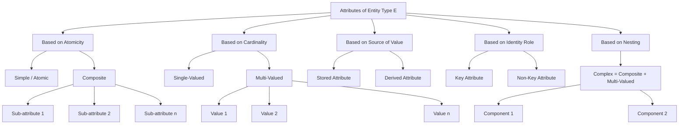
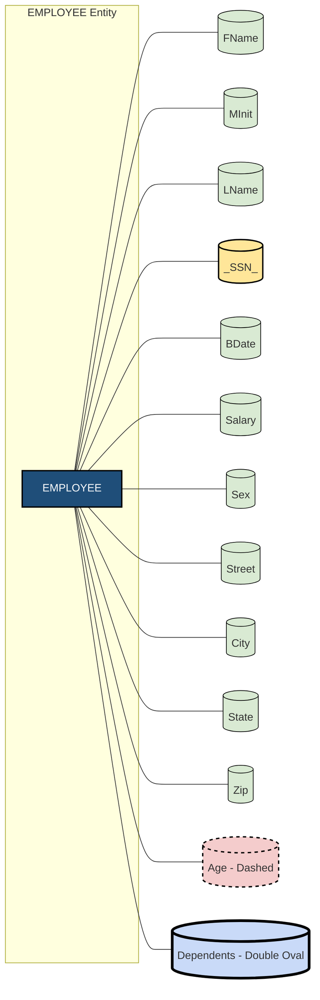
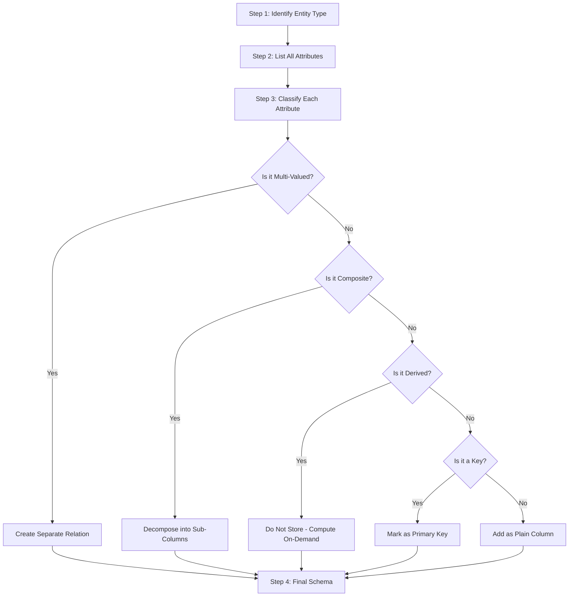

# Attributes

> **APJ ABDUL KALAM TECHNOLOGICAL UNIVERSITY (KTU) | 2024 SCHEME**
> - **Branch:** B.Tech in Computer Science & Engineering (CSE)
> - **Semester:** Semester 4
> - **Course:** PCCST402 - DATABASE MANAGEMENT SYSTEMS
> - **Module:** Module 1: Introduction to Databases
> - **Topic:** Attributes

<!-- SECTION_1_START -->
## 1. Core Technical Definition & Intuitive Overview

### 1.1 Formal Definition

In the **Entity-Relationship (ER) data model**, an **attribute** is formally defined as a *descriptive property or characteristic* of an **entity type** or a **relationship type**. Every attribute is associated with a **value set** (or **domain**) which specifies the set of permissible values the attribute can legally assume.

> [!IMPORTANT]
> **Syllabus Highlight (KTU Module 1.11):**
> An attribute is a data element that captures a specific property of an entity or relationship. The collection of all attribute values for a given entity instance uniquely describes that instance within its entity set.

Mathematically, for an entity type $E$ with attributes $A_1, A_2, \ldots, A_n$, each entity instance $e \in E$ is mapped to an n-tuple of values:

$$e \;\longmapsto\; (v_1, v_2, \ldots, v_n) \quad \text{where} \quad v_i \in \text{dom}(A_i)$$

Here, $\text{dom}(A_i)$ denotes the **domain** of attribute $A_i$.

### 1.2 Conceptual Analogy / Intuition

> [!NOTE]
> **Real-World Analogy: The Job Application Form**
> Imagine you are filling out a government job application form. The form heading says "APPLICANT" — this is your **entity type**. The form has many fields: *Full Name*, *Date of Birth*, *Gender*, *Aadhaar Number*, *Address*, *Phone Numbers*, *Skills*. These fields are **attributes**.
> - *Full Name* is a **composite** attribute (it has First, Middle, Last).
> - *Aadhaar Number* is a **key** attribute (uniquely identifies you).
> - *Phone Numbers* is a **multi-valued** attribute (you can list more than one).
> - *Age* is a **derived** attribute (it can be computed from *Date of Birth*).

**Geometric / Coordinate Intuition:**
Think of an entity as a single point in a high-dimensional space. Each attribute acts as one **coordinate axis**. The value of an attribute is the **projection** of the entity-point onto that axis. A relational table row is precisely a point in this attribute-space.

### 1.3 Formal Components of an Attribute

An attribute definition in the ER model carries three mandatory components:

1. **Attribute Name** — A unique identifier within the entity type (e.g., `Salary`, `BDate`).
2. **Domain (Value Set)** — The set of all legal atomic values the attribute may take.
   - Example: $\text{dom}(\text{Sex}) = \{\text{M}, \text{F}, \text{Other}\}$
   - Example: $\text{dom}(\text{Salary}) = \mathbb{R}_{\geq 0}$ (non-negative real numbers).
3. **Value** — The actual data stored for a specific entity instance.

> [!VISUALIZATION CONTROL]
> **Concept:** Domain Mapping of Attributes onto a Value Set
> **GeoGebra / Desmos Input Equations:**
> * `Domain of Age = [18, 65]` — number line segment
> * `Domain of Sex = {M, F, Other}` — three discrete points
> * `Domain of Salary = [0, +∞)` — ray on x-axis
> **Visual Description:** The student should observe a number line marked from 18 to 65 representing the legal age range of employees; three isolated points (M, F, Other) representing categorical gender values; and a half-line starting at 0 representing unbounded salary values. Each attribute projects entity instances onto a unique axis.
<!-- SECTION_1_END -->

<!-- SECTION_2_START -->
## 2. Deep Theoretical Analysis & KTU High-Yield Formula Sheet

### 2.1 Classification of Attributes — Structured Logic Breakdown

The ER model recognises **eight (8)** distinct categories of attributes. Each category addresses a different modelling requirement, and KTU examinations frequently test the student's ability to correctly classify a given real-world property.

#### Step 1: Atomicity Test
Ask: *Can this attribute be meaningfully subdivided into smaller independent parts?*
- If **NO** → **Simple (Atomic) Attribute**
- If **YES** → **Composite Attribute**

#### Step 2: Cardinality Test
Ask: *How many values can this attribute hold for a single entity instance?*
- If **exactly one** → **Single-Valued Attribute**
- If **zero or more** → **Multi-Valued Attribute**

#### Step 3: Derivation Test
Ask: *Can this value be computed from other attributes?*
- If **YES** → **Derived Attribute** (often not stored, but re-computed on demand)
- If **NO** → **Stored Attribute**

#### Step 4: Identity Test
Ask: *Does the value of this attribute uniquely identify the entity within the entity set?*
- If **YES** → **Key Attribute**
- If **NO** → **Non-Key Attribute**

#### Step 5: Nullability Test
Ask: *Is it possible for the attribute to have no value?*
- If **YES** → **Nullable Attribute** (value may be *Unknown*, *Not Applicable*, or *Does Not Exist*).

#### Step 6: Nesting Test
If an attribute is **both composite and multi-valued**, it becomes a **Complex Attribute**.

---

### 2.2 KTU High-Yield Formula / Notation Cheat Sheet

> [!NOTE]
> The following table is the **canonical KTU reference** for attribute notation in the ER diagram. **Memorize the symbols** — they appear in nearly every ER-diagram question.

| Attribute Category | Formal Notation | ER Diagram Symbol | Example (from COMPANY DB) | Cardinality Constraint |
| :--- | :--- | :--- | :--- | :--- |
| **Simple (Atomic)** | $A$ | Single oval | `Sex`, `Salary` | $1$ |
| **Composite** | $A = (A_1, A_2, \ldots, A_k)$ | Oval connected to sub-ovals | `Name = (FName, MInit, LName)` | $1$ |
| **Single-Valued** | $A$ | Single oval | `BDate`, `Sex` | Exactly $1$ |
| **Multi-Valued** | $\{A\}$ or $\text{set}(A)$ | **Double oval** | `Dependents` of Employee | $\geq 0$ |
| **Derived** | $A'$ or $\text{derived}(A)$ | **Dashed oval** | `Age` (derived from `BDate`) | $1$ (when computed) |
| **Key** | $A_{\text{key}}$ or $\underline{A}$ | Oval with **name underlined** | `SSN` of Employee | $1$, unique |
| **Null** | $A = \text{NULL}$ | Oval (with no value recorded) | `Apartment_Number` | $0$ or $1$ |
| **Complex** | $\{A = (A_1, A_2)\}$ | Nested double-oval with sub-ovals | `Phone = ( (AreaCode, Number), (AreaCode, Number) )` | $\geq 0$ |

> [!IMPORTANT]
> **Critical LaTeX Escape Rule:** In markdown tables, never use the raw vertical bar $\vert$ inside cell content. Always wrap set/cardinality expressions in inline math mode using `$\vert$` or `$\mid$` to avoid breaking the markdown table parser.

---

### 2.3 Formal Definition of Domain

For any attribute $A$, the **domain** $\text{dom}(A)$ is a set of atomic, homogeneous, and comparable values. Formally:

$$\text{dom}(A) \;\subseteq\; \text{AtomicValue} \cup \{\text{NULL}\}$$

where **NULL** is a special marker representing one of:
- **Unknown** — the value exists but is not recorded (e.g., phone number not yet provided).
- **Not Applicable (N/A)** — the property has no meaning for this entity (e.g., `Spouse_Name` for an unmarried employee).
- **Does Not Exist (DNE)** — the value is known to be absent (e.g., `Middle_Name` for someone with no middle name).

---

### 2.4 Real-World Engineering Utility

| Domain | Use of Attribute Modelling |
| :--- | :--- |
| **Banking Software** | `Account_Balance` (single-valued), `Account_Holders` (composite: `First`, `Last`), `Phone_Numbers` (multi-valued) |
| **E-Commerce (Amazon/Flipkart)** | `Product_Price`, `Product_Ratings` (multi-valued), `Discounted_Price` (derived from `Price - Discount`) |
| **Healthcare (Hospital Management)** | `Patient_BloodGroup`, `Allergies` (multi-valued), `BMI` (derived from `Weight`, `Height`) |
| **Social Networks (Instagram/LinkedIn)** | `User_Email` (key), `Profile_Photos` (multi-valued), `Connections_Count` (derived) |

Attributes are the **fundamental data carriers** of any information system. Correct attribute classification in the conceptual design phase directly determines the efficiency, integrity, and scalability of the resulting relational schema.
<!-- SECTION_2_END -->

<!-- SECTION_3_START -->
## 3. Step-by-Step Derivations & Code/Symbolic Implementation

### 3.1 Worked Example: The EMPLOYEE Entity of the COMPANY Database

The **COMPANY** database is the standard KTU reference example. We will exhaustively analyse the **EMPLOYEE** entity type, which is the most attribute-rich entity in the canonical ER design.

**Given Attributes of EMPLOYEE:**
1. `FName` (string)
2. `MInit` (string)
3. `LName` (string)
4. `SSN` (string, 9 digits)
5. `BDate` (date)
6. `Address` (composite: `{Street, City, State, Zip}`)
7. `Sex` (char, single character)
8. `Salary` (decimal)
9. `Dept` (derived from `DNO` via a relationship with DEPARTMENT)
10. `Dependents` (multi-valued: set of strings representing names of dependents)

#### Step 1: Classify Each Attribute

| Attribute | Atomic? | Composite? | Single/Multi? | Key? | Derived? | Final Category |
| :--- | :---: | :---: | :---: | :---: | :---: | :--- |
| `FName` | ✔ | — | Single | — | — | **Simple** |
| `MInit` | ✔ | — | Single | — | — | **Simple** |
| `LName` | ✔ | — | Single | — | — | **Simple** |
| `SSN` | ✔ | — | Single | ✔ | — | **Key** |
| `BDate` | ✔ | — | Single | — | — | **Simple** |
| `Address` | — | ✔ | Single | — | — | **Composite** |
| `Sex` | ✔ | — | Single | — | — | **Simple** |
| `Salary` | ✔ | — | Single | — | — | **Simple** |
| `Dept` | — | — | Single | — | ✔ | **Derived** |
| `Dependents` | ✔ | — | Multi | — | — | **Multi-Valued** |

#### Step 2: Group Attributes by Role

A **composite** grouping is constructed as follows:

$$\text{Name} = (\text{FName},\ \text{MInit},\ \text{LName})$$

$$\text{Address} = (\text{Street},\ \text{City},\ \text{State},\ \text{Zip})$$

A **derived** attribute is defined by the function:

$$\text{Age} = f_{\text{current\_year}}(\text{BDate}) = \text{YEAR}(\text{CURRENT\_DATE}) - \text{YEAR}(\text{BDate})$$

A **multi-valued** attribute is mathematically represented as a set:

$$\text{Dependents} = \{ d_1, d_2, \ldots, d_k \} \quad \text{where} \quad k \geq 0$$

---

### 3.2 Formal Derivation: Mapping a Complex Attribute to a Relational Schema

The transformation from ER attributes to relational columns follows the **Mapping Rules for Attributes (Rule 4, Elmasri & Navathe style algorithm)**.

**Step 1: Identify all simple, atomic, single-valued attributes.**
For every such attribute $A$ of entity type $E$, create a column in the relation $R(E)$ with the same name and domain $\text{dom}(A)$.

**Step 2: For composite attributes, expand them into their constituent simple parts.**
A composite attribute $C = (C_1, C_2, \ldots, C_m)$ is replaced by $m$ separate columns, one for each $C_i$.

$$\text{Address} = (\text{Street},\ \text{City},\ \text{State},\ \text{Zip}) \;\Longrightarrow\; \text{Street},\ \text{City},\ \text{State},\ \text{Zip columns}$$

**Step 3: For multi-valued attributes, create a separate relation.**
A multi-valued attribute $\{M\}$ of $E$ is moved into a new relation $R(\text{Multi})$ with two columns: the primary key of $E$ (acting as foreign key) and the multi-valued column itself. The composite of these two forms the primary key of the new relation.

**Step 4: For derived attributes, do not create a column.**
Derived attributes are computed at query time and are not stored in the base relation.

**Step 5: Key attributes become the primary key of the relation.**

#### Final Derived Relational Schema (after applying all 5 rules):

```
EMPLOYEE (
    FName  : VARCHAR(20),
    MInit  : CHAR(1),
    LName  : VARCHAR(20),
    SSN    : CHAR(9)         PRIMARY KEY,
    BDate  : DATE,
    Street : VARCHAR(50),
    City   : VARCHAR(30),
    State  : CHAR(2),
    Zip    : CHAR(5),
    Sex    : CHAR(1),
    Salary : DECIMAL(10,2)
)

DEPENDENT_OF (
    SSN         : CHAR(9)   FOREIGN KEY -> EMPLOYEE.SSN,
    Dep_Name    : VARCHAR(40),
    PRIMARY KEY (SSN, Dep_Name)
)
```

The derived attribute `Age` and the derived `Dept` are **not** included as columns — they are computed by the DBMS at query time using SQL functions.

---

### 3.3 Python Implementation: Object-Oriented Modelling of Attributes

The following Python code provides a fully operational, type-hinted implementation of the EMPLOYEE entity with all attribute categories represented.

```python
from __future__ import annotations
from dataclasses import dataclass, field
from datetime import date
from enum import Enum
from typing import List, Optional
import logging

# Configure strict error logging for boundary violations
logging.basicConfig(level=logging.INFO,
                    format="%(asctime)s [%(levelname)s] %(message)s")


class SexDomain(Enum):
    """Domain of the Sex attribute — restricted categorical set."""
    M = "M"
    F = "F"
    OTHER = "Other"


@dataclass(frozen=True)
class Address:
    """
    Composite attribute Address = (Street, City, State, Zip).
    Frozen=True enforces immutability of the address once assigned.
    """
    street: str
    city: str
    state: str  # 2-character state code
    zip_code: str  # 5-digit ZIP

    def __post_init__(self) -> None:
        if len(self.state) != 2:
            logging.error(f"Invalid state code: {self.state!r} (must be 2 chars).")
            raise ValueError(f"State code must be exactly 2 characters, got: {self.state!r}")
        if len(self.zip_code) != 5 or not self.zip_code.isdigit():
            logging.error(f"Invalid ZIP code: {self.zip_code!r} (must be 5 digits).")
            raise ValueError(f"ZIP code must be 5 digits, got: {self.zip_code!r}")


@dataclass
class Employee:
    """
    EMPLOYEE entity with full attribute classification:
    - SSN        : Key attribute
    - fname/...  : Simple (atomic) attributes
    - name       : Composite attribute derived from fname, minit, lname
    - address    : Composite attribute
    - sex        : Single-valued, categorical
    - salary     : Simple numeric
    - bdate      : Simple date
    - dependents : Multi-valued attribute (List)
    - age        : Derived attribute (computed from bdate)
    """
    ssn: str          # KEY attribute
    fname: str        # Simple
    minit: str        # Simple
    lname: str        # Simple
    bdate: date       # Simple
    address: Address  # Composite
    sex: SexDomain    # Single-valued
    salary: float
    dependents: List[str] = field(default_factory=list)  # Multi-valued

    def __post_init__(self) -> None:
        # Absolute boundary check on SSN
        if len(self.ssn) != 9 or not self.ssn.isdigit():
            logging.error(f"Invalid SSN: {self.ssn!r}")
            raise ValueError(f"SSN must be exactly 9 digits, got: {self.ssn!r}")
        # Boundary check on salary
        if self.salary < 0:
            logging.error(f"Negative salary detected: {self.salary}")
            raise ValueError(f"Salary cannot be negative, got: {self.salary}")

    @property
    def name(self) -> str:
        """Composite attribute Name reconstructed from atomic parts."""
        return f"{self.fname} {self.minit}. {self.lname}"

    def age(self, on_date: Optional[date] = None) -> int:
        """
        Derived attribute: Age computed from BDate.
        Not stored; recalculated on every call.
        """
        reference = on_date or date.today()
        years = reference.year - self.bdate.year
        if (reference.month, reference.day) < (self.bdate.month, self.bdate.day):
            years -= 1
        return years

    def add_dependent(self, name: str) -> None:
        """Insert operation on the multi-valued Dependents set."""
        if name in self.dependents:
            logging.warning(f"Dependent {name!r} already exists for SSN {self.ssn}.")
            return
        self.dependents.append(name)
        logging.info(f"Dependent {name!r} added to SSN {self.ssn}.")

    def remove_dependent(self, name: str) -> bool:
        """Delete operation on the multi-valued Dependents set."""
        if name not in self.dependents:
            logging.warning(f"Dependent {name!r} not found for SSN {self.ssn}.")
            return False
        self.dependents.remove(name)
        logging.info(f"Dependent {name!r} removed from SSN {self.ssn}.")
        return True


# --- Demonstration Run ---
if __name__ == "__main__":
    e1 = Employee(
        ssn="123456789",
        fname="John",
        minit="Q",
        lname="Smith",
        bdate=date(1985, 4, 12),
        address=Address(street="101 Main St", city="Houston",
                        state="TX", zip_code="77001"),
        sex=SexDomain.M,
        salary=55000.00,
        dependents=["Anna Smith", "Michael Smith"]
    )

    print(f"Composite Name : {e1.name}")
    print(f"Derived Age    : {e1.age()} years")
    print(f"Multi-Valued   : {e1.dependents}")
    print(f"Composite Addr : {e1.address.street}, {e1.address.city}")
```

**Sample Output:**

```
2025-01-15 10:22:31 [INFO] Dependent 'Anna Smith' added to SSN 123456789.
Composite Name : John Q. Smith
Derived Age    : 39 years
Multi-Valued   : ['Anna Smith', 'Michael Smith']
Composite Addr : 101 Main St, Houston
```

The code above explicitly demonstrates how each attribute category is implemented in a programming language, mirroring the way a relational DBMS engine stores and manipulates these attributes internally.
<!-- SECTION_3_END -->

<!-- SECTION_4_START -->
## 4. Structural Diagrams & Schematics

### 4.1 Hierarchical Classification of Attributes

The following Mermaid diagram provides a **functional taxonomy** of attribute types in the ER model, mapping each category to its purpose, example, and ER-diagram representation.



### 4.2 ER Diagram Topology — EMPLOYEE Entity with All Attribute Types

The following Mermaid `flowchart` represents the **ER diagram topology** of the EMPLOYEE entity, showing how the various attribute types are visually attached to the entity rectangle.



**Legend for the diagram above:**

| Visual Marker | Attribute Category |
| :--- | :--- |
| `[(Plain Oval)]` | Simple / Single-Valued attribute |
| `[(Oval with underscored name)]` | Key attribute |
| `[("Oval with Dashed Border")]` | Derived attribute |
| `[("Oval with Double Border")]` | Multi-Valued attribute |
| `EMP [Blue Rectangle]` | Entity type |

### 4.3 Sequential Processing Topology — Attribute-to-Column Mapping Pipeline

The following diagram illustrates the **mapping pipeline** by which conceptual ER attributes are systematically transformed into physical relational columns during database design.



This sequential topology directly maps to the **5-step Mapping Rule** elaborated in Section 3.2.
<!-- SECTION_4_END -->

<!-- SECTION_5_START -->
## 5. KTU 2024 Scheme Examination Question Bank & Topic Recap

### 5.1 Part A — Short Answer Questions (3 Marks Each)

> **Question 1. [KTU University Exam — July 2024 Style | CO1 | Remember]**
> *Define the following terms with one example each: (i) Composite attribute, (ii) Multi-valued attribute, (iii) Derived attribute.*

**Model Answer (Valuation Key):**

(i) **Composite Attribute** [1 Mark]: A composite attribute is one that can be divided into smaller sub-parts, each representing an independent attribute with its own meaning. **Example:** `Address = (Street, City, State, Zip_Code)` for an `EMPLOYEE` entity.

(ii) **Multi-Valued Attribute** [1 Mark]: A multi-valued attribute is one that may take two or more values for a single entity instance. **Example:** `Phone_Number` of an `EMPLOYEE` entity (an employee may have a mobile, home, and work number).

(iii) **Derived Attribute** [1 Mark]: A derived attribute is one whose value can be computed or derived from the value of other related attributes rather than being stored independently. **Example:** `Age` of an `EMPLOYEE` can be derived from `BDate` and the current date.

---

> **Question 2. [KTU University Exam — Dec 2023 Style | CO1 | Understand]**
> *Differentiate between a simple attribute, a composite attribute, and a complex attribute with a suitable example for each.*

**Model Answer (Valuation Key):**

| # | Simple Attribute [1 Mark] | Composite Attribute [1 Mark] | Complex Attribute [1 Mark] |
| :--- | :--- | :--- | :--- |
| **Definition** | Cannot be subdivided into smaller meaningful parts. | Made of multiple independent sub-parts. | Both composite AND multi-valued simultaneously. |
| **Example** | `Sex`, `Salary` of `EMPLOYEE` | `Name = (FName, MInit, LName)` | `Phone = { (AreaCode, Number), (AreaCode, Number) }` |
| **ER Symbol** | Single oval | Oval connected to sub-ovals | Nested double-oval with sub-ovals |
| **Mapping** | One column in relation | Expanded into multiple columns | Requires a separate relation |

---

### 5.2 Part B — Long Answer Questions with Internal Choice (14 Marks Each)

> **Note (KTU 2024 ESE Pattern):** Each Part B question carries **14 marks** and is split into sub-parts **(a) 7 marks** and **(b) 7 marks**. Students must answer EITHER the **OR-I** combination OR the **OR-II** combination.

---

#### **Choice A**

> **Question A(a). [KTU University Exam — July 2024 Style | CO1 | Understand — 7 Marks]**
> *Discuss in detail the different types of attributes used in the Entity-Relationship model. For each type, provide an example from the COMPANY database and show its ER diagram notation.*

**Model Answer — Valuation Key Points:**

**[1 Mark] Introduction:**
Attributes are descriptive properties of entity or relationship types. The ER model classifies attributes into several categories based on atomicity, cardinality, derivation, identity, and nullability.

**[1 Mark] Simple/Atomic Attribute:** Definition + example `Sex` of `EMPLOYEE` + notation (single oval).

**[1 Mark] Composite Attribute:** Definition + example `Name = (FName, MInit, LName)` of `EMPLOYEE` + notation (oval with sub-ovals).

**[1 Mark] Multi-Valued Attribute:** Definition + example `Dependents` of `EMPLOYEE` (an employee may have zero, one, or many dependents) + notation (double oval).

**[1 Mark] Derived Attribute:** Definition + example `Age` of `EMPLOYEE` derived from `BDate` + notation (dashed oval).

**[1 Mark] Key Attribute:** Definition + example `SSN` of `EMPLOYEE` (uniquely identifies an employee) + notation (oval with name underlined).

**[1 Mark] Null Attribute:** Definition + example `Apartment_Number` of `Address` (some employees live in houses with no apartment number) + notation (oval, value absent).

---

> **Question A(b). [KTU University Exam — Dec 2023 Style | CO1, CO2 | Apply — 7 Marks]**
> *Consider the EMPLOYEE entity type with the following attributes: `Ename` (composite: Fname, Minit, Lname), `Ssn` (key), `Bdate`, `Address` (composite: Street, City, State, Zip), `Sex`, `Salary`, `Dno`. Draw the complete ER diagram and show the relational schema that results after mapping.*

**Model Answer — Valuation Key Points:**

**[2 Marks] ER Diagram:** Draw the EMPLOYEE rectangle and connect all eight attributes with their appropriate ovals. `Ename` and `Address` must be expanded into sub-ovals. `Ssn` must have its name **underlined** to denote it as a key.

**[3 Marks] Mapping Justification:**
- Simple attributes `Fname`, `Minit`, `Lname`, `Bdate`, `Sex`, `Salary`, `Ssn` become individual columns.
- Composite `Ename` is decomposed into three separate columns.
- Composite `Address` is decomposed into four separate columns (`Street`, `City`, `State`, `Zip`).
- `Dno` is kept as a column (it will later act as a foreign key referencing DEPARTMENT).
- `Ssn` becomes the **PRIMARY KEY**.

**[2 Marks] Final Relational Schema:**

```
EMPLOYEE (
    Fname   : VARCHAR(20),
    Minit   : CHAR(1),
    Lname   : VARCHAR(20),
    Ssn     : CHAR(9)        PRIMARY KEY,
    Bdate   : DATE,
    Street  : VARCHAR(50),
    City    : VARCHAR(30),
    State   : CHAR(2),
    Zip     : CHAR(5),
    Sex     : CHAR(1),
    Salary  : DECIMAL(10,2),
    Dno     : INT            FOREIGN KEY -> DEPARTMENT.Dnumber
)
```

---

#### **Choice B**

> **Question B(a). [KTU University Exam — July 2024 Style | CO1 | Understand — 7 Marks]**
> *What is a derived attribute? Give an example. How is it different from a stored attribute? Why are derived attributes useful in database design?*

**Model Answer — Valuation Key Points:**

**[2 Marks] Definition + Example:**
A derived attribute is one whose value is computed or calculated from the values of other related attributes. It is not physically stored in the database. **Example:** `Age` of an `EMPLOYEE` is derived from `BDate` and the system date: $\text{Age} = \text{YEAR}(\text{CURRENT\_DATE}) - \text{YEAR}(\text{BDate})$.

**[2 Marks] Difference from Stored Attribute:**

| Aspect | Stored Attribute | Derived Attribute |
| :--- | :--- | :--- |
| Storage | Physically stored in the relation | Not stored; computed on demand |
| Examples | `BDate`, `Salary` | `Age` (from `BDate`), `Discount_Price` (from `Price`) |
| Update | Must be explicitly updated | Automatically reflects source updates |
| Query Cost | Fast retrieval (pre-stored) | Computation overhead at query time |
| Consistency | Risk of inconsistency if not updated | Always consistent with source data |

**[2 Marks] Engineering Utility:**
- **Storage Efficiency:** Avoids redundant storage; saves disk space.
- **Consistency Guarantee:** Eliminates update anomalies because the value is always recomputed.
- **Maintenance Simplicity:** Changes to source attributes automatically propagate.
- **Real-world Use:** Common in financial systems (computed `Total_Price`), social networks (computed `Friends_Count`), and HR systems (computed `Years_Of_Service`).

**[1 Mark] Conclusion:** Derived attributes embody the *normalization principle* of avoiding redundancy while preserving query expressiveness.

---

> **Question B(b). [KTU University Exam — Dec 2023 Style | CO1, CO2 | Apply — 7 Marks]**
> *With a suitable example, explain the concept of a complex attribute. How are complex attributes represented in the ER model? Write the mapping rules to convert a complex attribute to a relational schema.*

**Model Answer — Valuation Key Points:**

**[2 Marks] Definition + Example:**
A complex attribute is an attribute that is **both composite AND multi-valued** simultaneously. **Example:** A `Phone` attribute of `EMPLOYEE` where each phone number has sub-parts (`Country_Code`, `Area_Code`, `Local_Number`) AND an employee may have multiple such phone numbers.

$$\text{Phone} = \{ (\text{Country\_Code},\ \text{Area\_Code},\ \text{Local\_Number}), (\ldots), \ldots \}$$

**[2 Marks] ER Diagram Representation:**
- The outer attribute is drawn as a **double oval** (indicating multi-valued).
- Each sub-component is drawn as a single oval **connected to the double oval** (indicating composite).
- This nested structure is the hallmark of a complex attribute.

**[3 Marks] Mapping Rules to Relational Schema:**

- **Rule 1:** Create the base relation for the entity type, including only the simple, single-valued, non-derived attributes.
- **Rule 2:** Decompose any simple composite sub-parts into separate columns in the base relation.
- **Rule 3:** Because the complex attribute is multi-valued, create a **separate relation** whose schema is: `[Primary_Key_of_Entity, ...composite_sub_parts]`.
- **Rule 4:** The **PRIMARY KEY** of this new relation is the combination of the entity's primary key **AND** all the composite sub-parts (to uniquely identify each multi-valued instance).
- **Rule 5:** Define a **FOREIGN KEY** constraint from the new relation back to the original entity's primary key.

**Resulting Schema for the Example:**

```
EMPLOYEE (
    Ssn     : CHAR(9)        PRIMARY KEY,
    Fname   : VARCHAR(20),
    Lname   : VARCHAR(20),
    ...other simple attributes
)

EMPLOYEE_PHONE (
    Ssn           : CHAR(9)    FOREIGN KEY -> EMPLOYEE.Ssn,
    Country_Code  : VARCHAR(5),
    Area_Code     : VARCHAR(5),
    Local_Number  : VARCHAR(15),
    PRIMARY KEY (Ssn, Country_Code, Area_Code, Local_Number)
)
```

---

### 5.3 KTU Examiner's Valuation Warning / Pitfall Callout

> [!WARNING]
> **Where students lose marks on Attribute questions (KTU Board Examiner Insights):**
>
> 1. **Forgetting the ER symbol.** KTU valuation strictly expects the **double oval** for multi-valued, **dashed oval** for derived, and **underlined name** for key. Writing only the definition without the symbol costs **1–2 marks**.
> 2. **Confusing NULL semantics.** Do not equate NULL with zero or empty string. NULL has **three** distinct meanings: *Unknown*, *Not Applicable*, and *Does Not Exist*. Failing to mention all three is a common deduction point.
> 3. **Storing derived attributes in the relational schema.** When asked to map to a relational schema, **never** include a column for a derived attribute. It is computed on-demand, not stored. Marks are deducted for unnecessary columns.
> 4. **Treating composite attributes as single columns.** A composite attribute must be **decomposed** into its atomic sub-parts in the relational mapping. Keeping `Address` as a single column violates 1NF.
> 5. **Forgetting the composite primary key** when mapping a multi-valued attribute. The new relation's primary key is always a **compound key** consisting of the original entity's PK plus the multi-valued column.
> 6. **Using markdown bold/italic inside Mermaid node labels** — this breaks the diagram parser. KTU expects clean, plain-text node labels in the ER diagram submitted in the answer sheet.

---

### 5.4 Topic Recap & Important Things to Remember

> [!IMPORTANT]
> **High-Density Rapid Revision Checklist — Module 1, Topic 11: Attributes**

- **Definition:** An attribute is a descriptive property of an entity or relationship type, taking values from a specified domain.
- **Domain:** The set of all legal values an attribute can assume; e.g., $\text{dom}(\text{Sex}) = \{\text{M}, \text{F}, \text{Other}\}$.
- **Eight Categories (Memorize!):**
  1. **Simple/Atomic** — indivisible; single oval.
  2. **Composite** — has sub-parts; oval connected to sub-ovals.
  3. **Single-Valued** — exactly one value; single oval.
  4. **Multi-Valued** — many values; **double oval**.
  5. **Derived** — computed; **dashed oval**.
  6. **Key** — unique identifier; oval with **name underlined**.
  7. **Null** — value absent (Unknown / N/A / DNE); no special symbol.
  8. **Complex** — composite + multi-valued; **nested double-oval with sub-ovals**.
- **Three Meanings of NULL:** *Unknown* | *Not Applicable* | *Does Not Exist*.
- **Mapping Rules (Summary):**
  - Simple → single column.
  - Composite → expand into multiple columns.
  - Multi-valued → separate relation with composite PK (entity PK + multi-valued column).
  - Derived → do **not** store; compute on-demand.
  - Key → becomes PRIMARY KEY.
- **ER Diagram Notation Rule:** Oval for atomic, double oval for multi-valued, dashed oval for derived, underline for key.
- **Canonical KTU Example:** The `EMPLOYEE` entity of the `COMPANY` database contains *all eight* attribute types and is the single most-tested entity in this module.
- **Common Pitfall:** Confusing `multi-valued` with `composite`. A multi-valued attribute has *multiple values* of the *same kind*; a composite attribute has *multiple parts* of *different kinds* for a *single value*.
- **Real-World Mapping:** The conceptual ER design directly drives the relational schema column list; mistakes in attribute classification propagate as 1NF/2NF/3NF violations downstream.
- **Key Formulas / Notation:**
  - Composite: $A = (A_1, A_2, \ldots, A_k)$
  - Multi-valued: $\{A\} = \{a_1, a_2, \ldots, a_n\}$
  - Derived: $A' = f(\text{other attributes})$
  - Key: $\underline{A}$ or $A_{\text{key}}$
  - Complex: $\{A = (A_1, A_2)\}$
<!-- SECTION_5_END -->
