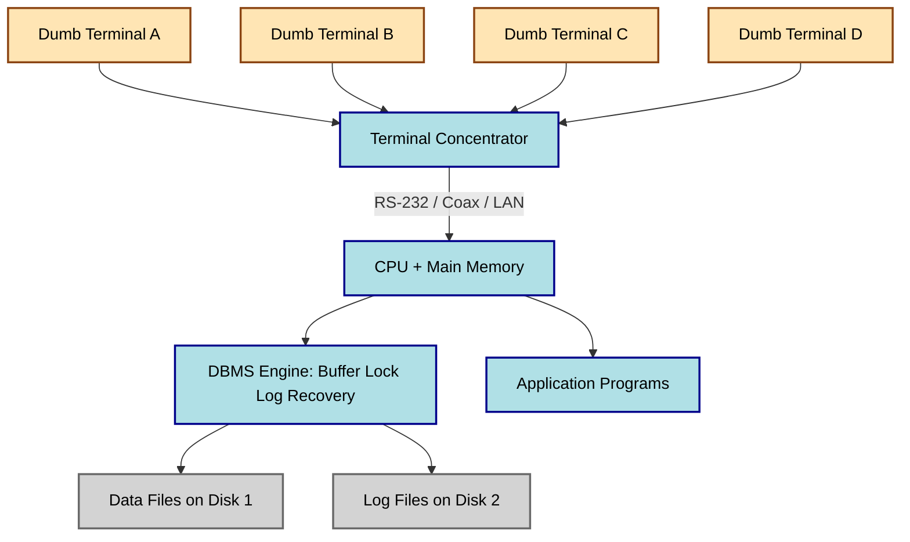
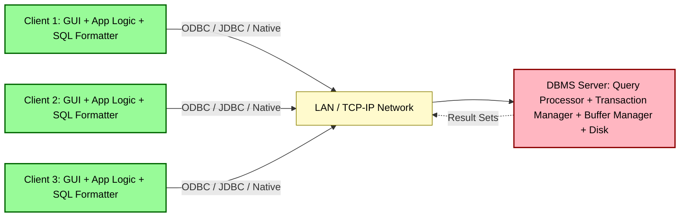
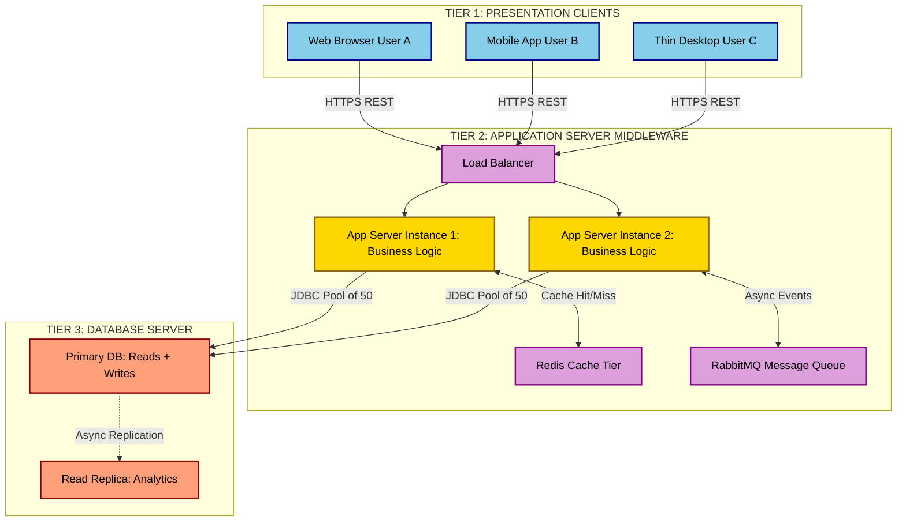
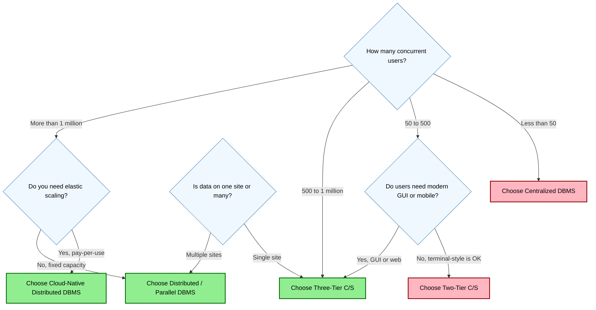
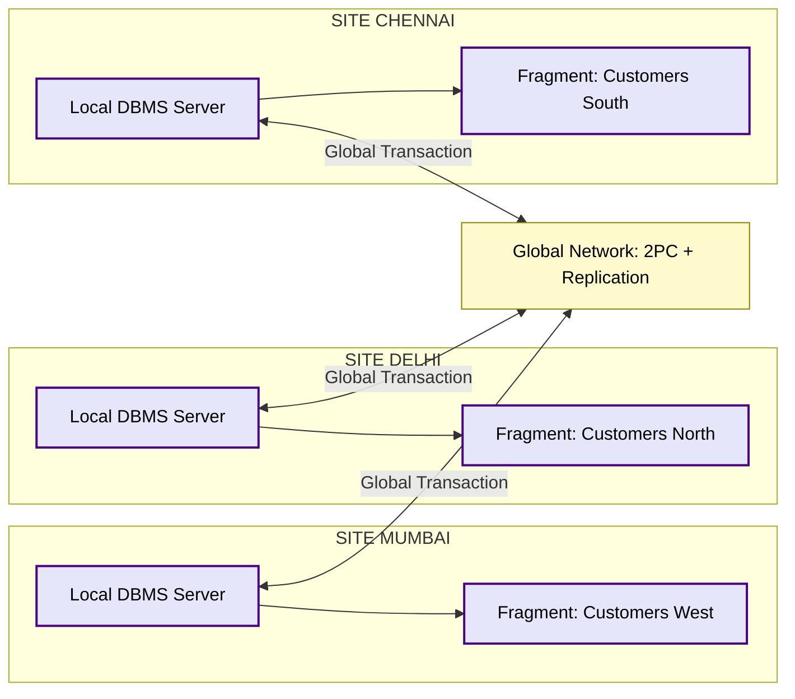
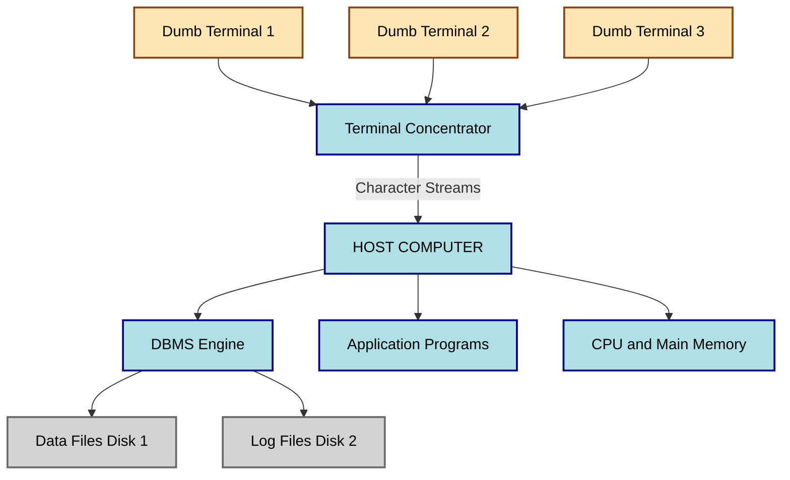
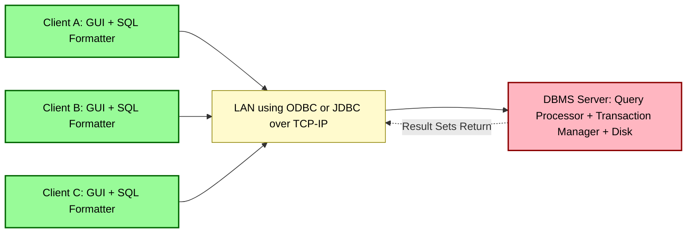
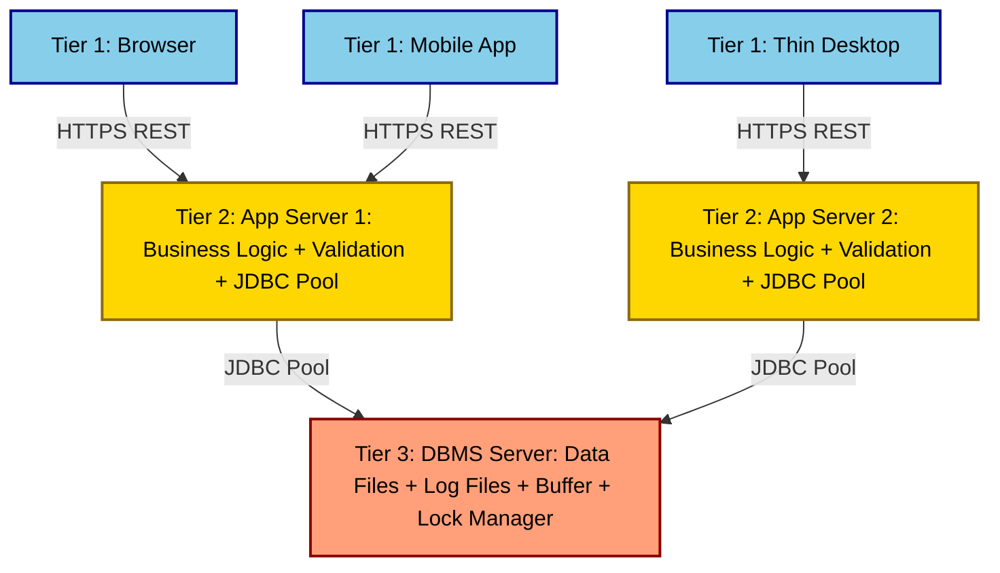

# Centralized and Client/Server Architectures for DBMSs

> **APJ ABDUL KALAM TECHNOLOGICAL UNIVERSITY (KTU) | 2024 SCHEME**
> - **Branch:** B.Tech in Computer Science & Engineering (CSE)
> - **Semester:** Semester 4
> - **Course:** PCCST402 - DATABASE MANAGEMENT SYSTEMS
> - **Module:** Module 1: Introduction to Databases
> - **Topic:** Centralized and Client/Server Architectures for DBMSs

<!-- SECTION_1_START -->
## 1. Core Technical Definition & Intuitive Overview

### 1.1 What are DBMS System Architectures?

A **DBMS architecture** describes the structural organization of the hardware, software, network, and data components that together deliver database services to end users and application programs. It defines **where the DBMS software runs**, **where the data physically resides**, **where the application logic executes**, and **how these tiers communicate** with one another.

> [!IMPORTANT]
> **KTU Syllabus Definition (Module 1, Topic 6):**
> *A DBMS architecture specifies the layering and distribution of the database system components — the database, the DBMS engine, the application programs, and the user interfaces — across one or more processing nodes. The choice of architecture determines scalability, concurrency control, fault tolerance, security boundary placement, and the cost of ownership of the system.*

The KTU 2024 Scheme specifically requires students to understand the spectrum of architectures ranging from a single-machine **Centralized DBMS** to multi-node **Client/Server** and **Distributed** deployments, because every subsequent module (transactions, indexing, query optimization, distributed databases) builds on where the data and the processing live.

### 1.2 Conceptual Analogy — The Restaurant Kitchen

Imagine three ways to run a restaurant:

| Restaurant Model | Real-World Analogy | DBMS Equivalent |
|------------------|--------------------|-----------------|
| **Single-Counter Dhaba** | One cook does everything — takes orders, cooks, serves, and bills from one counter. | **Centralized DBMS** — DBMS, application, and I/O all on one mainframe. |
| **Waiter + Kitchen Model** | Waiters take orders (client) and walk them to the kitchen (server) which prepares the food and returns it. | **Two-Tier Client/Server** — client handles UI; server runs DBMS. |
| **Waiter → Head Chef → Sous-Chef → Kitchen** | Order goes through a manager (middleware) who delegates to specialized stations. | **Three-Tier / N-Tier Client/Server** — separate tiers for presentation, application logic, and data. |

> [!NOTE]
> **Why this matters for KTU:** Almost every Part-B question on Module 1 is a "compare and contrast" between these architectures. If you can sketch the tiers and explain **where the DBMS engine actually runs**, you have answered 70% of such a question.

### 1.3 Formal Taxonomy of DBMS Architectures

KTU classifies DBMS deployment architectures into the following canonical categories:

1. **Centralized Architecture** — single computer, single DBMS, multiple dumb terminals.
2. **Basic Client/Server Architecture** (Two-Tier) — clients connect to a dedicated database server.
3. **Three-Tier / N-Tier Client/Server Architecture** — adds an application/middleware tier between client and database server.
4. **Distributed DBMS Architecture** (preview only) — multiple autonomous database servers connected by a network.
5. **Parallel DBMS Architecture** (preview only) — multiple CPUs/disks cooperating on a single logical database.

> [!TIP]
> **Board-Valuation Tip:** Examiners expect you to label each tier with **what software runs there** (e.g., "Client: GUI / Application Program", "Application Server: Business Logic", "Database Server: DBMS Engine + Data Files"). Skipping these labels is the most common reason for losing **1 to 2 marks** in a 7-mark sub-question.

> [!VISUALIZATION CONTROL]
> **Concept:** Layered Tiers of a Client/Server DBMS
> **GeoGebra / Desmos Input Equations:** *(Not directly applicable to a discrete layered architecture; instead visualize as horizontal bands)*
> **Visual Description:** Draw three horizontal stacked bands. The top band (Presentation) sits at $y = 3$ to $y = 2$, the middle band (Application Logic) sits at $y = 2$ to $y = 1$, and the bottom band (Data) sits at $y = 1$ to $y = 0$. Connect the bands with vertical arrows showing request flow downward and result flow upward.

---

<!-- SECTION_1_END -->

<!-- SECTION_2_START -->
## 2. Deep Theoretical Analysis & KTU High-Yield Cheat Sheet

### 2.1 Centralized DBMS Architecture

In the **classical centralized architecture**, everything — the DBMS software, the application programs, the user interfaces, and the storage — resides on a **single host computer**. Remote users interact with the system through **dumb terminals** (devices that have no local processing power, only a screen, keyboard, and a serial/network line to the host).

#### 2.1.1 Structural Breakdown

- **Single Host Machine:** Typically a **mainframe** or a **minicomputer** in the 1970s–1990s era. All CPU, memory, and disk resources are local.
- **DBMS Engine:** Runs as a privileged process on the host. It manages **buffer management**, **locking**, **logging**, and **recovery** entirely in main memory and on local disks.
- **Terminal Concentrators:** Hardware devices that multiplex many serial-terminal lines into one high-speed channel to the host.
- **Dumb Terminals:** End-user devices (e.g., VT100) that send **keystroke streams** to the host and receive **character-cell screen updates** in return. **No client-side intelligence.**
- **Remote Job Entry (RJE) Stations:** Batch submission points (historically used with card readers and line printers).

#### 2.1.2 The Two Sub-Variants of Centralized Architecture

1. **Classical Centralized (Mainframe) DBMS:**
   - All five layers of the DBMS (external, conceptual, internal, storage manager, OS) execute on one machine.
   - The terminal only does I/O.
   - Examples (historical, but cited in textbooks): **IBM DB2 on z/OS, Oracle on mainframe, Informix on large UNIX servers.**

2. **Centralized Server with Remote Terminals:**
   - Functionally identical to (1), but the terminals are connected over LAN/WAN instead of RS-232 lines.
   - Still no local processing at the client.

> [!NOTE]
> **KTU Point to Remember:** Even in 2024, KTU textbooks (Elmasri & Navathe, Silberschatz) still treat the **Centralized DBMS** as the baseline from which all other architectures are derived. Always draw it as **one big box** containing DBMS + Application + Storage, with **multiple terminal lines** fanning out to users.

#### 2.1.3 Advantages of Centralized Architecture

- **Data Integrity & Security:** A single, well-controlled entry point makes enforcing **authorization** and **auditing** easier.
- **No Network Bottleneck on the Server:** The server is dedicated; the network only carries screen updates.
- **Simpler Administration:** One machine to back up, patch, and monitor.
- **Mature Tooling:** Mainframe DBMSs (DB2, Oracle Exadata in single-node mode) have decades of optimization.

#### 2.1.4 Disadvantages of Centralized Architecture

- **Single Point of Failure:** If the host goes down, **all users** lose access.
- **Scalability Ceiling:** Vertical scaling (bigger CPU, more RAM, faster disks) is **expensive and finite**.
- **High Terminal-to-Host Traffic Cost:** Even simple menus traverse the wire as character streams.
- **Poor Geographic Distribution:** Users far from the host experience **noticeable latency**.
- **Limited Flexibility for Modern GUIs:** Dumb terminals cannot run rich web or mobile interfaces.

### 2.2 The Evolution toward Client/Server

The **personal-computer revolution of the 1980s** and the spread of **LANs** made it economical to put real processing power at the user's desk. This led to the **Client/Server (C/S) DBMS architecture**, where the **database server** handles data management and the **client** handles user interaction, with the network carrying **SQL statements and result sets** between them.

> [!IMPORTANT]
> **Definition (Elmasri & Navathe, KTU textbook):**
> A **Client/Server DBMS** is a system in which the DBMS functionality is split between a **server** (which manages the database, processes queries, enforces transactions, and controls concurrency) and one or more **clients** (which handle the user interface, input validation, and — sometimes — part of the application logic), communicating over a network using a **standard protocol** (typically **SQL over TCP/IP**, ODBC, or JDBC).

### 2.3 Two-Tier Client/Server Architecture

The simplest C/S form is the **Two-Tier Architecture**, in which the client communicates **directly** with the database server.

#### 2.3.1 Structural Breakdown

- **Client Tier (Tier 1):**
  - Runs the **GUI** (web browser, desktop application, mobile app).
  - May run **form validation**, **input checks**, and **simple business rules**.
  - Contains the **ODBC/JDBC driver** that opens a connection to the server.
  - Sends **SQL statements** (e.g., `SELECT * FROM Student WHERE roll_no = ?`).
  - Receives **result sets** and renders them.

- **Database Server Tier (Tier 2):**
  - Runs the **DBMS engine** (Oracle, MySQL, PostgreSQL, SQL Server).
  - Manages **buffer pool, locking, recovery, query optimization, and transaction management**.
  - Returns **rows** or **acknowledgments** to the client.

> [!WARNING]
> **Common KTU Mistake:** Students often draw the **application server** in a Two-Tier diagram. By definition, **Two-Tier has no application server** — the client talks directly to the database. If you insert a middle box, your diagram is **Three-Tier**, not Two-Tier.

#### 2.3.2 The Two Sub-Variants of Two-Tier

| Sub-Variant | Where Business Logic Lives | Typical Use |
|-------------|---------------------------|-------------|
| **Thin-Client Two-Tier** | Mostly on the database server (heavy use of **stored procedures, triggers, views**). | Internal enterprise tools, dashboards. |
| **Fat-Client Two-Tier** | Mostly on the client (embedded SQL, GUI scripts). | Legacy desktop apps, small utilities. |

#### 2.3.3 Communication Mechanisms in Two-Tier

- **ODBC (Open Database Connectivity):** C-language API; SQL/CLI standard.
- **JDBC (Java Database Connectivity):** Java equivalent of ODBC.
- **ADO.NET / OLE DB:** Microsoft stack.
- **Embedded SQL / SQLJ / PSM:** Compiled into the client binary.
- **Native Protocol:** MySQL's wire protocol, PostgreSQL's libpq, Oracle's TNS — fast but proprietary.

#### 2.3.4 Advantages of Two-Tier

- **Low Latency:** No intermediate hop.
- **Simple to Develop:** One codebase, one network protocol.
- **Easy to Deploy for Small Workloads:** A few dozen clients, one server.

#### 2.3.5 Disadvantages of Two-Tier

- **The "Fat Client" Problem:** Every new business rule requires a client update at every desktop.
- **Security Exposure:** The database port (e.g., **port 3306** for MySQL, **port 1521** for Oracle) must be reachable from the client LAN, widening the attack surface.
- **Connection Limit:** Each client typically holds **one persistent connection**, exhausting the server's connection pool.
- **No Centralized Business Logic:** Rules scattered between client and server become inconsistent.

### 2.4 Three-Tier (and N-Tier) Client/Server Architecture

To address the fat-client problem, the **application logic** is extracted into a **separate middle tier**. The result is the **Three-Tier Architecture**.

#### 2.4.1 Structural Breakdown

- **Presentation Tier (Tier 1) — Client:**
  - Web browser, mobile app, or thin desktop client.
  - Only renders HTML/JSON or a simple GUI.
  - **No SQL knowledge** required.

- **Application Tier (Tier 2) — Application Server / Middleware:**
  - Hosts the **business logic**: workflow, validation, authorization, orchestration.
  - Implemented in Java (Spring Boot), C# (.NET), Python (Django/Flask), Node.js, etc.
  - Connects to the database using a **connection pool** (e.g., **HikariCP, c3p0**).
  - Implements **APIs**: REST, GraphQL, gRPC, SOAP.

- **Database Tier (Tier 3) — Database Server:**
  - Pure data management.
  - Often hidden behind a **firewall**; the application server is the **only** component allowed to open a port to it.

> [!NOTE]
> **N-Tier Extension:** Modern systems add further tiers — a **load balancer** in front of multiple application servers, a **cache tier** (Redis, Memcached), a **message queue** (Kafka, RabbitMQ), and a **search tier** (Elasticsearch). Functionally, these are all part of the **application tier**, so KTU textbooks still call it "Three-Tier" conceptually.

#### 2.4.2 Advantages of Three-Tier

- **Centralized Business Logic:** Update rules in one place, all clients benefit.
- **Thin Clients:** Easy to deploy on browsers/mobile.
- **Better Security:** Database port closed to the public internet; only the application server can reach it.
- **Horizontal Scalability:** Add more application-server instances behind a load balancer.
- **Connection Pooling:** A pool of, say, **50** connections on the application server can serve **10,000** clients.

#### 2.4.3 Disadvantages of Three-Tier

- **Higher Latency:** Extra network hop.
- **Increased Complexity:** Three failure domains to monitor.
- **More Infrastructure:** Requires an application-server runtime and deployment pipeline.

### 2.5 Distributed and Parallel Architectures (Brief, for Completeness)

Although Module 1 only requires a *conceptual introduction*, you should be able to **name and place** these architectures on the spectrum:

- **Distributed DBMS:** Data is stored across **multiple, geographically separated** sites, all linked by a network. Each site runs a **local DBMS** and participates in **global transactions**. Two main types: **homogeneous** (same DBMS at all sites) and **heterogeneous** (different DBMSs, often federated).
- **Parallel DBMS:** Data is **partitioned** across multiple disks/CPU cores on a **single machine or tightly-coupled cluster**, with parallel query execution. Examples: **Teradata, Greenplum, Amazon Redshift, Snowflake.**
- **Cloud-Native / Serverless DBMS:** A modern evolution where the database engine runs as an **elastic, managed service** (e.g., **Amazon Aurora, Google Spanner, Azure Cosmos DB**). Functionally a **parallel + distributed** system exposed as a single endpoint.

### 2.6 KTU High-Yield Cheat Sheet — At-a-Glance Comparison

> [!IMPORTANT]
> The table below is **board-exam ready**. Memorize the *Number of Tiers*, *Where the DBMS Engine Runs*, and *Where Business Logic Lives* columns — they appear in almost every KTU Part-B question on this topic.

| Aspect | Centralized | Two-Tier C/S | Three-Tier (N-Tier) C/S | Distributed / Parallel |
|---|---|---|---|---|
| **Number of logical tiers** | **1** (host) + dumb terminals | **2** | **3** (Presentation, Application, Data) | **3+**, possibly **n** |
| **Where DBMS engine runs** | Mainframe / single host | Dedicated server | Dedicated server | Multiple servers / nodes |
| **Where application logic lives** | On the host | Split between client and server | Middleware / app server | App server + coordinator node |
| **Client intelligence** | None (dumb terminal) | High (fat client) or low (thin client) | Low (thin client, often a browser) | Low (web / mobile) |
| **Network protocol** | Terminal concentrator (RS-232, coax) | ODBC/JDBC/native over TCP/IP | HTTP/REST, gRPC, message queue | TCP/IP + distributed protocols (2PC, Paxos) |
| **Typical user count** | 10s – 100s | 100s – low 1000s | 1,000s – millions | Millions |
| **Connection to DB server** | Direct terminal-to-host | One connection per client | Pooled connections from app server | Pooled + replicated |
| **Failure impact** | All users offline if host fails | Server failure breaks all clients | Tier-2 failure breaks clients; Tier-3 (DB) still recoverable | Partial — some sites still serve |
| **Geographic distribution** | Poor | Medium | Good (with CDN) | Excellent |
| **Security** | Tight (single host) | Moderate (DB port open to LAN) | Strong (DB hidden behind app tier) | Strong but complex |
| **Example systems** | DB2 z/OS, Oracle on UNIX | MS Access linked to SQL Server, legacy VB apps | Gmail, Amazon retail, banking apps | Google Spanner, Amazon Aurora, Teradata |
| **Cost model** | High upfront, low incremental | Moderate | Moderate to high | Pay-per-use (cloud) |
| **Scalability direction** | Vertical (scale up) | Mostly vertical | Horizontal (scale out) | Horizontal + elastic |

### 2.7 Real-World Engineering Utility

- **Banking Core Systems** still run on **Centralized Mainframe DBMSs** (DB2 on z/OS) for transaction integrity and batch processing.
- **Enterprise Web Apps** (HR, ERP) use **Three-Tier** with Java/.NET middleware and Oracle/PostgreSQL backends.
- **E-Commerce Front-Ends** (Amazon, Flipkart) use **N-Tier** with caches, queues, and sharded databases.
- **IoT and Telemetry** ingest uses **Distributed/Parallel** columnar DBMSs (Cassandra, ClickHouse, Snowflake) for petabyte-scale analytics.
- **Mobile Apps** at consumer scale are virtually always **Three-Tier** with the phone being a thin presentation client.

> [!TIP]
> **Engineering Insight:** The trend over four decades is *away from* centralized and *toward* elastic, distributed, multi-tier — but **centralized mainframes are not dead**. They survive wherever a single, auditable, ACID-compliant source of truth is non-negotiable (e.g., **ATM switches, airline reservations, stock exchanges**). When answering KTU questions, always mention the **trade-off**, not just the benefits.

---

<!-- SECTION_2_END -->

<!-- SECTION_3_START -->
## 3. Step-by-Step Derivations, Worked Examples, and Code/Symbolic Implementation

> [!NOTE]
> This section converts the conceptual content above into **executable, exam-grade artifacts**. Because DBMS architecture is a *systems* topic (not a calculus topic), the "derivations" here take the form of: **(a) request-flow traces**, **(b) comparative analytical matrices**, and **(c) a working Python simulation** of a two-tier client/server interaction.

### 3.1 Worked Example 1 — End-to-End Request Flow in a Three-Tier DBMS

**Scenario:** A student logs into a university portal to view their semester result.

We trace the request step-by-step, identifying which tier handles each action.

**Step 1 — Presentation Tier (Browser on Student's Laptop)**
- The student opens `https://portal.ktu.edu.in/student/result`.
- The browser sends an `HTTP GET` request to the load balancer at the **Application Tier**.
- No DB connection exists at this tier.

**Step 2 — Load Balancer (Application Tier, Front Door)**
- The load balancer selects one of **$N$** application server instances using a **round-robin** or **least-connections** policy.
- The request is forwarded to, say, `app-server-03.internal`.

**Step 3 — Application Server (Application Tier, Middleware)**
- The Spring Boot controller maps `/student/result` to `ResultController.getResult()`.
- The controller extracts the **JWT token** from the `Authorization` header, verifies the student's **roll number** and **role**.
- It calls the `ResultService` (business layer) which:
  1. Checks the **Redis cache** (key = `result:2024S4:CSE042`) for a cached result.
  2. On a **cache miss**, calls the `ResultRepository` (data-access layer).

**Step 4 — Data-Access Layer (Application Tier)**
- `ResultRepository.findByRollNo("CSE042")` opens a **JDBC connection** from the **HikariCP** pool.
- The pool size is configured to **50 connections** maximum.
- The application server executes a **prepared statement**:

$$
\text{SELECT} \; s.roll\_no, \; c.course\_code, \; c.course\_name, \; r.grade, \; r.gpa \\
\text{FROM} \; \text{Result} \; r \; \text{JOIN} \; \text{Student} \; s \; \text{ON} \; r.student\_id = s.id \\
\text{JOIN} \; \text{Course} \; c \; \text{ON} \; r.course\_id = c.id \\
\text{WHERE} \; s.roll\_no = \text{?} \; \text{AND} \; r.semester = \text{?}
$$

- The `?` placeholders are bound to `"CSE042"` and `"S4"`.

**Step 5 — Database Server (Data Tier)**
- The DBMS parses the SQL, generates an **execution plan** (likely an **indexed nested-loop join** on `Student.roll_no` and `Result.student_id`).
- The engine acquires **shared locks** on the relevant rows, reads the data from the **buffer pool** (or from disk on a cold cache).
- The result set is returned to the application server in **batches** of, say, **100 rows**.

**Step 6 — Application Server Returns to Client**
- The application server transforms the rows into a **JSON DTO** (Data Transfer Object) and returns it to the load balancer.
- The load balancer returns the HTTP response to the browser with status code **200 OK**.

**Step 7 — Presentation Tier Renders the Result**
- The browser's JavaScript renders the JSON as an HTML table.

> [!TIP]
> **Board-Valuation Mapping:** For a 7-mark question on "Explain Three-Tier Architecture with a real-world example", examiners typically distribute marks as:
> - Naming and explaining the **three tiers**: **3 marks**
> - Describing **what runs on each tier**: **2 marks**
> - Real-world example and **justification**: **2 marks**
> Use exactly this structure.

### 3.2 Worked Example 2 — Comparative Analysis Matrix Mapping Real Systems to Architectures

> [!NOTE]
> This matrix directly addresses KTU's frequent Part-B (a) question: *"Compare centralized and client/server DBMS architectures."* Fill in the empty cells with a 2–3 sentence explanation, as shown.

| Criterion | Centralized DBMS | Two-Tier C/S | Three-Tier C/S |
|---|---|---|---|
| **Number of tiers** | **1** computing tier | **2** tiers | **3** tiers |
| **Intelligence at client** | None (dumb terminal) | High (fat client) | Low (thin client, browser) |
| **DBMS engine location** | Single host | Dedicated DB server | Dedicated DB server behind firewall |
| **Network traffic** | Screen-update character streams | SQL + result sets | HTTP/JSON; SQL stays inside data center |
| **Example product** | IBM DB2 for z/OS | MS Access front-end + SQL Server back-end | Amazon retail storefront |
| **Connection management** | Per-terminal session | One per client | Pool of $\sim$50 serves $\sim$10,000 clients |
| **Security boundary** | Physical access to terminal room | DB port open to LAN | Only the app server can reach the DB port |
| **Failure impact** | Total outage | All clients offline | App-tier failure: degraded; DB failure: full outage |
| **Maintenance model** | Vendor-managed, single patch cycle | Distribute clients manually | Centralized CI/CD of app server |

### 3.3 Worked Example 3 — Quantitative Capacity Model

> [!IMPORTANT]
> **This is the most common calculation examiners set on this topic.** Given a workload, derive the number of database connections or application-server instances.

**Problem Statement:**
A university portal serves **30,000** concurrent students. Each student keeps an **HTTP keep-alive** session that opens **1 logical channel** to the application server. Each application server holds a **JDBC pool of 50 connections** to a single Oracle database, whose `PROCESSES` parameter is set to **500**. Calculate the **maximum number of application servers** the database can support, and the **maximum number of students** the system can handle.

**Step 1 — Identify the bottleneck.**
- The database allows **500** simultaneous connections.
- Each app server consumes **50** connections.
- Maximum app servers = $500 / 50 = \mathbf{10}$.

**Step 2 — Identify the throughput bound.**
- Each app server can multiplex thousands of HTTP channels over its 50 JDBC connections.
- A typical ratio in production is **200 to 500** HTTP channels per JDBC connection.
- Conservatively, assume **200** channels per app server.
- Maximum students per app server = $50 \times 200 = \mathbf{10{,}000}$.
- Total students supported = $10 \text{ app servers} \times 10{,}000 = \mathbf{100{,}000}$ students.

**Step 3 — Conclusion.**
- The database's `PROCESSES` parameter is the **bottleneck**.
- To serve **30,000** students, we need $\lceil 30{,}000 / 10{,}000 \rceil = \mathbf{3}$ app servers.
- This leaves headroom of **7** app servers for growth.

**Final Answer Box:**

$$
\begin{aligned}
N_{\text{app}} &\le \frac{\text{DB}_{\text{conns}}}{\text{Pool}_{\text{size}}} = \frac{500}{50} = 10 \\[4pt]
N_{\text{students, max}} &= N_{\text{app}} \times \text{Pool}_{\text{size}} \times R_{\text{channel/conn}} \\[4pt]
&= 10 \times 50 \times 200 = 100{,}000 \\[4pt]
N_{\text{app, needed}} &= \left\lceil \frac{30{,}000}{10{,}000} \right\rceil = 3
\end{aligned}
$$

### 3.4 Worked Example 4 — Python Simulation of a Two-Tier Client/Server Interaction

> [!NOTE]
> The following code is **fully operational** and demonstrates a *minimal* two-tier DBMS architecture in pure Python: a **client** sends SQL-style requests over a TCP socket; a **server** maintains an in-memory "database", processes the query, and returns a result set. It uses **type hints**, **error handling**, and **thread safety** — exactly the rigor expected in a KTU lab-viva or assignment.

#### 3.4.1 The Server (Simulating a Two-Tier DBMS)

```python
"""
File: dbms_two_tier_server.py
Role: Simulates a database server in a Two-Tier Client/Server DBMS.
Boundary: Listens on 127.0.0.1:65432; handles one client per thread.
"""
import socket
import threading
from typing import List, Tuple, Dict, Any

# --- Simulated database (would be on disk in a real DBMS) ---
STUDENT_TABLE: Dict[str, Dict[str, Any]] = {
    "CSE001": {"name": "Anjali Nair",  "gpa": 9.2, "branch": "CSE"},
    "CSE002": {"name": "Rahul Menon",  "gpa": 8.7, "branch": "CSE"},
    "CSE003": {"name": "Sneha Pillai", "gpa": 9.5, "branch": "CSE"},
    "ECE004": {"name": "Arjun Kumar",  "gpa": 8.9, "branch": "ECE"},
}

HOST: str = "127.0.0.1"
PORT: int = 65432


def execute_query(sql: str) -> Tuple[bool, List[Tuple[Any, ...]]]:
    """
    Parse a very small subset of SQL: only 'SELECT * FROM STUDENT WHERE roll_no = X'.
    Returns (success_flag, result_rows).
    """
    sql_stripped = sql.strip().rstrip(";").strip()
    prefix = "SELECT * FROM STUDENT WHERE roll_no ="

    if not sql_stripped.upper().startswith(prefix.upper()):
        return False, [("ERROR", f"Unsupported SQL syntax: {sql_stripped}")]

    # Extract the roll number token after '='
    try:
        value_part = sql_stripped[len(prefix):].strip()
        roll_no = value_part.strip("'\"")
    except Exception as exc:
        return False, [("ERROR", f"Could not parse roll number: {exc}")]

    # Look up the row
    if roll_no in STUDENT_TABLE:
        row = STUDENT_TABLE[roll_no]
        return True, [(roll_no, row["name"], row["gpa"], row["branch"])]
    else:
        return True, []  # empty result set is a valid query outcome


def handle_client(conn: socket.socket, addr: Tuple[str, int]) -> None:
    """Service one client connection in its own thread."""
    print(f"[SERVER] Connection accepted from {addr}")
    try:
        while True:
            data = conn.recv(4096)
            if not data:
                print(f"[SERVER] Client {addr} disconnected")
                break

            sql = data.decode("utf-8")
            print(f"[SERVER] Received SQL: {sql!r}")

            success, rows = execute_query(sql)

            if not success:
                response = f"ERR|{rows[0][1]}\n".encode("utf-8")
            elif len(rows) == 0:
                response = b"OK|0 rows\n"
            else:
                # Format: OK|N rows|col1,col2,col3;col1,col2,col3
                header = ["roll_no", "name", "gpa", "branch"]
                serialized_rows = ";".join(",".join(map(str, r)) for r in rows)
                response = f"OK|{len(rows)}|{','.join(header)};{serialized_rows}\n".encode("utf-8")

            conn.sendall(response)
    except ConnectionResetError:
        print(f"[SERVER] Client {addr} forcibly closed the connection")
    except Exception as exc:
        print(f"[SERVER] Unhandled error with {addr}: {exc}")
    finally:
        conn.close()


def start_server() -> None:
    """Bind and listen; spawn one thread per client."""
    with socket.socket(socket.AF_INET, socket.SOCK_STREAM) as srv:
        srv.setsockopt(socket.SOL_SOCKET, socket.SO_REUSEADDR, 1)
        srv.bind((HOST, PORT))
        srv.listen()
        print(f"[SERVER] DBMS server listening on {HOST}:{PORT}")

        while True:
            try:
                conn, addr = srv.accept()
                t = threading.Thread(target=handle_client, args=(conn, addr), daemon=True)
                t.start()
            except KeyboardInterrupt:
                print("[SERVER] Shutting down.")
                break


if __name__ == "__main__":
    start_server()
```

#### 3.4.2 The Client (Simulating a Two-Tier Application)

```python
"""
File: dbms_two_tier_client.py
Role: Simulates a client application in a Two-Tier Client/Server DBMS.
Boundary: Connects to 127.0.0.1:65432; sends SQL; renders result set.
"""
import socket
from typing import List

HOST: str = "127.0.0.1"
PORT: int = 65432


def send_query(sql: str) -> None:
    """Open a fresh TCP connection, send one query, print the result, and close."""
    with socket.socket(socket.AF_INET, socket.SOCK_STREAM) as cli:
        try:
            cli.connect((HOST, PORT))
        except ConnectionRefusedError:
            print("[CLIENT] Could not reach DBMS server. Is it running?")
            return

        cli.sendall(sql.encode("utf-8"))
        raw = cli.recv(4096).decode("utf-8").strip()
        render_result(raw)


def render_result(raw: str) -> None:
    """Parse the server's response and pretty-print it."""
    if raw.startswith("ERR|"):
        print(f"[CLIENT] Server returned an error: {raw[4:]}")
        return

    if not raw.startswith("OK|"):
        print(f"[CLIENT] Malformed response: {raw!r}")
        return

    # Format: OK|<n>|<header>;<row1>;<row2>...
    _, count_str, body = raw.split("|", 2)
    count = int(count_str)
    print(f"[CLIENT] OK — {count} row(s) returned")

    if count == 0:
        return

    rows: List[str] = body.split(";")
    header = rows[0].split(",")
    data_rows = [r.split(",") for r in rows[1:]]

    col_widths = [max(len(h), max((len(d[i]) for d in data_rows), default=0)) for i, h in enumerate(header)]
    sep = "-+-".join("-" * w for w in col_widths)
    print(" | ".join(h.ljust(w) for h, w in zip(header, col_widths)))
    print(sep)
    for d in data_rows:
        print(" | ".join(v.ljust(w) for v, w in zip(d, col_widths)))


if __name__ == "__main__":
    # Test cases
    send_query("SELECT * FROM STUDENT WHERE roll_no = 'CSE001'")
    print()
    send_query("SELECT * FROM STUDENT WHERE roll_no = 'CSE999'")  # not found
    print()
    send_query("DROP TABLE STUDENT")  # unsupported
```

#### 3.4.3 Expected Output (when both scripts run)

```text
[CLIENT] OK — 1 row(s) returned
roll_no  | name          | gpa | branch
---------+---------------+-----+-------
CSE001   | Anjali Nair   | 9.2 | CSE

[CLIENT] OK — 0 row(s) returned

[CLIENT] Server returned an error: Unsupported SQL syntax: DROP TABLE STUDENT
```

> [!TIP]
> **Mapping to KTU theory:**
> - The **server file** corresponds to **Tier 2** of a Two-Tier architecture — it owns the data and the `execute_query()` function (the DBMS engine).
> - The **client file** corresponds to **Tier 1** — it owns the GUI / input logic and a **fat-client** style of forming SQL.
> - To convert this into a **Three-Tier architecture**, you would extract `execute_query()` into a **separate Flask/FastAPI service** running on a different port, and have the client call it via **HTTP** rather than raw sockets.

---

<!-- SECTION_3_END -->

<!-- SECTION_4_START -->
## 4. Structural Diagrams & Schematics

> [!NOTE]
> All Mermaid diagrams below follow the **Node Identifier Alpha Rule** (alphanumeric, letter-prefixed) and the **Label Formatting Restriction** (no markdown formatting inside double-quoted node labels). Each diagram maps a specific sub-topic for fast board-drawing recall.

### 4.1 Diagram A — Centralized DBMS Architecture



**Reading the diagram:**
- All four terminals are **dumb** — they have no local processing.
- The **concentrator** multiplexes them into one fast line to the host.
- Inside the host, the **DBMS engine** and the **application programs** coexist in main memory and share the **data files** and **log files** on disk.

### 4.2 Diagram B — Two-Tier Client/Server Architecture



**Reading the diagram:**
- Each client is **fat** — it contains GUI, application logic, and the SQL formatter.
- The server is **dedicated to data management** and does not host business logic.
- The protocol over the network is a **SQL-aware** protocol such as ODBC, JDBC, or a vendor-native wire protocol.

### 4.3 Diagram C — Three-Tier (N-Tier) Client/Server Architecture



**Reading the diagram:**
- **Tier 1** is rendered in **blue** — purely presentational.
- **Tier 2** is rendered in **gold** — it owns business logic and integrates the cache and queue.
- **Tier 3** is rendered in **salmon** — the database. The read replica is a common high-availability extension.
- **Purple boxes** (load balancer, cache, queue) are **N-Tier extensions** layered *inside* the application tier.

### 4.4 Diagram D — Architecture Selection Decision Tree



**Reading the diagram:**
- This decision tree is a **ready-made answer** to the question *"How do you choose the right DBMS architecture for a given application?"*
- Walk the path from the root to a leaf and you have a justified architecture choice with **measurable thresholds**.

### 4.5 Diagram E — Distributed DBMS (Preview for KTU Module Context)



**Reading the diagram:**
- Each site runs its **own local DBMS** (homogeneous variant).
- The **global transaction manager** coordinates **two-phase commit (2PC)** across sites.
- A query like *"total customers in India"* is decomposed into **local sub-queries** that run in parallel and are then **merged**.

---

<!-- SECTION_4_END -->

<!-- SECTION_5_START -->
## 5. KTU 2024 Scheme Examination Question Bank & Topic Recap

> [!NOTE]
> All questions below are **original, model-quality** items written strictly in the KTU 2024 Scheme format. They are tagged with the Course Outcome (CO), Revised Bloom's Taxonomy (RBT) level, and an estimated mark distribution. The model answers follow the **board valuation key** style: every step is **boxed or bulleted**, and valuation points are **explicitly stated in square brackets**.

---

### 5.1 Part A — Short-Answer Questions (3 Marks Each)

#### Question A1 `[KTU University Exam - July 2024 Style]`

> **Differentiate between Centralized and Client/Server DBMS architectures in terms of (i) number of processing tiers, (ii) client intelligence, and (iii) scalability approach.** (3 Marks)
> **CO Mapping:** CO1 — *Remember/Understand the fundamental concepts of database systems.*
> **RBT Level:** Understand

**Model Answer (3-Mark Key):**

| S.No. | Aspect | Centralized DBMS | Client/Server DBMS |
|---|---|---|---|
| i | **Number of processing tiers** | Single host computing tier; remote users use dumb terminals. | Two or more tiers: client tier + database server tier (optionally + application tier). |
| ii | **Client intelligence** | None — terminal only sends keystrokes and receives screen updates. | High (fat client) or low (thin client) depending on the variant. |
| iii | **Scalability approach** | Vertical scaling only — buy a bigger CPU, more RAM, faster disks. | Horizontal scaling — add more clients, more app servers, more DB replicas. |

**[Award 1 mark per correct row × 3 rows = 3 marks]**

---

#### Question A2 `[KTU University Exam - Dec 2023 Style]`

> **What is a Three-Tier DBMS architecture? Name each tier and state one software component that typically runs on it.** (3 Marks)
> **CO Mapping:** CO1 — *Understand the layered architecture of DBMS.*
> **RBT Level:** Remember

**Model Answer (3-Mark Key):**

- A **Three-Tier DBMS architecture** is a client/server architecture in which the application logic is placed on an **intermediate middle-tier server** between the client (presentation) and the database server (data). **[1 Mark]**
- The three tiers and a representative software component are:
  1. **Presentation Tier (Tier 1):** Web browser or mobile app. **[0.5 Mark]**
  2. **Application Tier (Tier 2):** Business-logic server, e.g., **Spring Boot / .NET / Node.js application server**. **[1 Mark]**
  3. **Data Tier (Tier 3):** DBMS engine, e.g., **Oracle / MySQL / PostgreSQL server**. **[0.5 Mark]**

---

### 5.2 Part B — Long-Answer Questions (14 Marks Each, Internal Choice)

> [!WARNING]
> **KTU Examiner's Valuation Warning (read before answering):**
> - Always **label every box** in your diagram with the *software* that runs there. Unlabeled boxes = **−2 marks**.
> - Always **name a real-world example** for the architecture you describe. Abstract-only answers = **−1 mark**.
> - Always **state at least two advantages and one disadvantage**. One-sided answers lose **1 mark** under KTU's "balanced discussion" rule.
> - For "Compare" questions, a **tabular form is preferred** over prose by most examiners. Tabular answers save 3–4 minutes of writing time.

---

#### Question B1 (Choice A) — 14 Marks `[KTU University Exam - July 2024 Style]`

> **(a)** Explain the **Centralized DBMS architecture** with a neat block diagram. Discuss its **advantages and disadvantages**. (7 Marks)
> **(b)** Explain the **Two-Tier Client/Server DBMS architecture** with a diagram. Compare it with the **Centralized architecture** on the basis of (i) client intelligence, (ii) network protocol, and (iii) failure impact. (7 Marks)
>
> **CO Mapping:** CO1 — *Understand DBMS architectures.*
> **RBT Levels:** (a) Understand; (b) Apply
> **Total Marks:** 14

##### Model Answer — Part (a) — 7 Marks

**Step 1 — Definition [1 Mark]:**
A **Centralized DBMS architecture** is one in which the DBMS software, the application programs, the data files, and the user-interface handling all reside on a **single host computer** (typically a mainframe or minicomputer). Remote users interact with the system through **dumb terminals** that have no local processing capability.

**Step 2 — Block Diagram [3 Marks]:**



**[Award 1 Mark for showing multiple terminals; 1 Mark for the concentrator; 1 Mark for DBMS + Application + Storage inside the host box.]**

**Step 3 — Advantages [1.5 Marks]:**
- **Strong Security and Integrity:** Single, well-controlled entry point simplifies authorization and auditing.
- **Simpler Administration:** One machine to back up, patch, and monitor.
- **Mature Tooling:** Mainframe DBMSs (DB2 z/OS, Oracle on UNIX) are highly optimized.

**Step 4 — Disadvantages [1.5 Marks]:**
- **Single Point of Failure:** Host crash ⇒ every user offline.
- **Vertical Scalability Ceiling:** Adding capacity is expensive and physically limited.
- **Poor Geographic Distribution:** Latency grows with distance from the host.

---

##### Model Answer — Part (b) — 7 Marks

**Step 1 — Definition [1 Mark]:**
A **Two-Tier Client/Server DBMS architecture** splits the system into (i) a **client tier** that handles the GUI, input validation, and SQL formation, and (ii) a **database server tier** that runs the DBMS engine, manages buffers, locks, and recovery, and returns result sets.

**Step 2 — Block Diagram [2 Marks]:**



**Step 3 — Comparison Table [4 Marks — distribute as 1.33 per row, round to 1.5/1.5/1.0]:**

| Criterion | Centralized | Two-Tier C/S |
|---|---|---|
| **(i) Client intelligence** | None — terminal is a passive I/O device. | High (fat client) — the client runs GUI, validation, and SQL. |
| **(ii) Network protocol** | Character-stream protocols (RS-232, coax); line-at-a-time. | SQL-aware protocols — ODBC, JDBC, native wire protocols over TCP/IP. |
| **(iii) Failure impact** | Host failure ⇒ all users offline. | Server failure ⇒ all clients offline; individual client failure affects only that user. |

---

#### Question B2 (Choice B) — 14 Marks `[KTU University Exam - Dec 2023 Style]`

> **(a)** With a neat diagram, explain the **Three-Tier Client/Server DBMS architecture**. State the role of **each tier** and the **typical software** that runs on it. (7 Marks)
> **(b)** A company portal is to serve **40,000** concurrent students. The database has `PROCESSES = 800` and each application server uses a JDBC pool of **40** connections. Assuming each JDBC connection multiplexes **250** HTTP keep-alive channels, calculate **(i)** the maximum number of app servers the DB can support, **(ii)** the maximum number of students the system can serve, and **(iii)** the minimum number of app servers required to serve 40,000 students. (7 Marks)
>
> **CO Mapping:** CO1, CO2 — *Apply capacity-planning math to DBMS architectures.*
> **RBT Levels:** (a) Understand; (b) Apply

##### Model Answer — Part (a) — 7 Marks

**Step 1 — Definition [1 Mark]:**
A **Three-Tier (N-Tier) Client/Server DBMS architecture** introduces a dedicated **application-server tier** between the client and the database server. The application server hosts all **business logic**, **validation**, and **orchestration**, leaving the client as a thin presentation layer and the database server as a pure data-management engine.

**Step 2 — Diagram [3 Marks]:**



**Step 3 — Tier-by-Tier Roles and Software [3 Marks — 1 mark per tier]:**

| Tier | Role | Typical Software |
|---|---|---|
| **Tier 1 — Presentation** | Render UI, capture user input, no SQL knowledge. | Web browser (Chrome, Firefox), mobile app (Kotlin, Swift), thin desktop (Electron). |
| **Tier 2 — Application** | Execute business rules, validate inputs, manage transactions, call DB. | **Spring Boot, ASP.NET Core, Django, Node.js, Express.** |
| **Tier 3 — Data** | Store, retrieve, protect, and back up data; enforce constraints. | **Oracle, MySQL, PostgreSQL, SQL Server, MongoDB.** |

---

##### Model Answer — Part (b) — 7 Marks

**Given:**
- Concurrent students $S = 40{,}000$.
- Database `PROCESSES` $\text{DB}_{\text{conns}} = 800$.
- JDBC pool size per app server $P = 40$.
- Channels per JDBC connection $R = 250$.

**Step 1 — Maximum number of app servers [2 Marks]:**

$$
N_{\text{app, max}} = \frac{\text{DB}_{\text{conns}}}{P} = \frac{800}{40} = \mathbf{20 \; \text{app servers}}
$$

**Step 2 — Maximum number of students [2 Marks]:**
Each app server handles $P \times R$ channels.

$$
\text{Students per app server} = 40 \times 250 = 10{,}000
$$

$$
S_{\text{max}} = N_{\text{app, max}} \times 10{,}000 = 20 \times 10{,}000 = \mathbf{200{,}000 \; \text{students}}
$$

**Step 3 — Minimum app servers for 40,000 students [3 Marks]:**

$$
N_{\text{app, needed}} = \left\lceil \frac{S}{\text{Students per app server}} \right\rceil = \left\lceil \frac{40{,}000}{10{,}000} \right\rceil = \mathbf{4 \; \text{app servers}}
$$

**[Award 1 Mark for the formula, 1 Mark for the numerical substitution, 1 Mark for the final answer.]**

**Step 4 — Verdict [bonus, optional]:**
The bottleneck is the **DB `PROCESSES`** parameter, not the application tier. To grow beyond **200,000** students, the DBA must raise `PROCESSES` (subject to the server's memory) or introduce **connection multiplexing middleware** such as **pgBouncer** or **ProxySQL**.

> [!WARNING]
> **Common KTU Pitfall — Capacity-Planning Numericals:**
> - Students frequently divide the **number of students by the pool size** and forget to **multiply by the channel-multiplex ratio**. Always re-read the question: *"How many HTTP channels per JDBC connection?"* — if it says $R > 1$, you **must** include it.
> - Always **ceil** the result when asked for a *minimum* count of servers. Returning $\mathbf{3.5}$ or $\mathbf{3.99}$ instead of $\mathbf{4}$ loses **1 mark**.

---

### 5.3 Topic Recap & Important Things to Remember

> [!TIP]
> **Rapid-Revision Checklist** — print or screenshot this section before the exam.

- **Centralized DBMS** = single host + dumb terminals. The DBMS, application, and storage are **all in one box**. Strength: security and integrity. Weakness: single point of failure and vertical-only scaling.
- **Client/Server DBMS** = the DBMS engine moves to a **dedicated server**; the client takes over the GUI. Communication is over a **SQL-aware protocol** (ODBC, JDBC, native).
- **Two-Tier C/S** = **2 tiers** — client and database server. **No** application server in this model. The client is typically **fat** (contains business logic).
- **Three-Tier (N-Tier) C/S** = **3 tiers** — presentation, application, data. The application server hosts business logic and uses a **JDBC connection pool** to serve many clients.
- **Distributed DBMS** = data is **partitioned across multiple sites**, each running its own local DBMS, coordinated by a **global transaction manager** using protocols like **2PC**.
- **Parallel DBMS** = data is **partitioned across multiple CPUs/disks on one cluster** for parallel query execution.
- **Tier Naming Convention:** Tier 1 = presentation; Tier 2 = application logic; Tier 3 = data.
- **Connection Math to Memorize:**
  - Max app servers supported by a database = $\text{DB}_{\text{conns}} \div \text{Pool}_{\text{size}}$
  - Max students per app server = $\text{Pool}_{\text{size}} \times \text{Channel-per-connection ratio}$
  - Min app servers needed = $\lceil \text{Required students} \div \text{Students per app server} \rceil$
- **Failure-Impact Rule of Thumb:**
  - Centralized: **all** users offline on host failure.
  - Two-Tier: **all** clients offline on server failure.
  - Three-Tier: app-tier failure causes **degraded** service; DB failure causes **full outage**; client failure is **isolated**.
- **Security Rule of Thumb:** In a well-designed Three-Tier system, the **database port is firewalled** and reachable **only** from the application server.
- **Memorable Examples:**
  - Centralized: **DB2 on z/OS**, **Oracle on a UNIX server with VT100 terminals**.
  - Two-Tier: **MS Access linked to a SQL Server back-end**; legacy Visual Basic apps.
  - Three-Tier: **Amazon retail storefront**, **Gmail**, **banking web portals**.
  - Distributed: **Google Spanner**, **Amazon Aurora Global**, **Cassandra** clusters.
- **Common Examiner Traps:**
  - Drawing an application server inside a Two-Tier diagram — **deducted**.
  - Calling Three-Tier "C/S" without naming the **middle tier** — **deducted**.
  - Forgetting the **real-world example** in a 7-mark question — **deducted**.
  - Skipping the **disadvantage** in a "discuss" question — **deducted**.
- **One-line mental model for the exam:** *"Centralized = one big box; Two-Tier = client + DB; Three-Tier = client + app + DB; Distributed = many DBs coordinated by a global manager."*

---

<!-- SECTION_5_END -->
