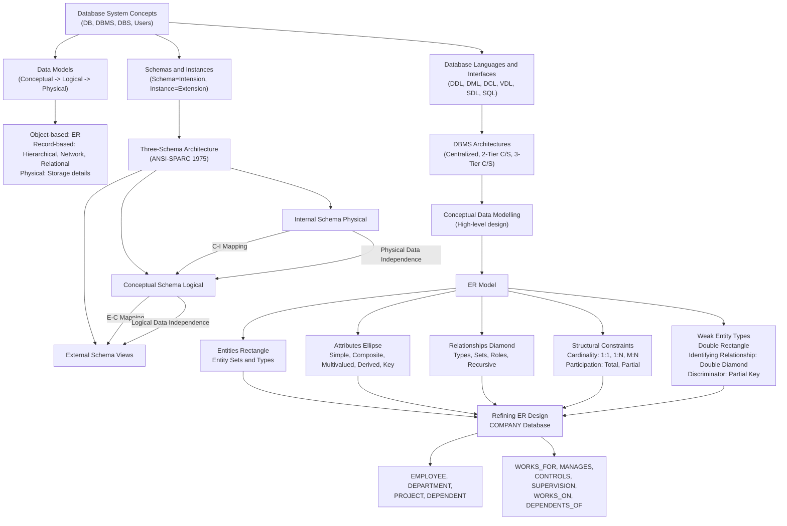

# MODULE CHEAT SHEET: Introduction to Databases

---

## 1. Core Concept Matrix

| **Topic** | **Core Definition** | **BTL Level** | **Primary Utility** |
|-----------|--------------------|--------------|--------------------|
| **Database (DB)** | Persistent, logically coherent collection of meaningfully related data representing some aspect of real world | L1 (Remember) | Foundation of data storage |
| **DBMS** | General-purpose, integrated software providing facilities for defining, constructing, manipulating & sharing DB | L2 (Understand) | Manages database operations |
| **Database System (DBS)** | DB $\oplus$ DBMS $\oplus$ Application Programs $\oplus$ Users (DBA, Designers, End Users) | L2 (Understand) | Complete data management ecosystem |
| **File System Drawbacks** | Data redundancy, inconsistency, isolation, integrity violations, atomicity failures, security weakness | L4 (Analyze) | Justifies DBMS adoption |
| **Database Approach Benefits** | Data sharing, redundancy control, integrity, security, independence, backup/recovery | L3 (Apply) | Motivation for DBMS |
| **Database Users** | DBA, Database Designers, System Analysts, Programmers, End Users (Naïve, Sophisticated, Casual, Online) | L2 (Understand) | Role-based access |
| **Conceptual Data Model** | High-level, user-view oriented; entity-based (e.g., ER) | L2 (Understand) | Requirement gathering |
| **Logical/Representational Data Model** | Implementation model, hides physical details (Relational, Network, Hierarchical) | L2 (Understand) | Schema design |
| **Physical Data Model** | Low-level, describes storage (file/record/index structures) | L2 (Understand) | Performance optimization |
| **Hierarchical Model** | Tree structure; one parent per child; uses physical pointers; **IMS (1960s)** | L1 (Remember) | Historical DB context |
| **Network Model** | Graph structure; M:N via *sets*; **CODASYL DBTG (1971)** | L1 (Remember) | Historical DB context |
| **Relational Model** | Tables (relations); mathematical foundation; **E.F. Codd (1970)**, System R, INGRES | L1 (Remember) | Modern dominant model |
| **Object-Oriented Model** | Objects with encapsulation, identity, inheritance; **OODBMS** | L2 (Understand) | Complex data |
| **Object-Relational Model** | Hybrid extending relational with OO features; e.g., PostgreSQL | L2 (Understand) | Modern hybrid systems |
| **NoSQL Models** | Document, Key-Value, Column-family, Graph; 2000s onward | L2 (Understand) | Big data / Web-scale |
| **Schema** | Description of structure (intension); rarely changes | L2 (Understand) | Logical blueprint |
| **Instance / State** | Snapshot of data (extension); changes frequently | L2 (Understand) | Current data |
| **Three-Schema Architecture** | **ANSI-SPARC (1975)**: Internal, Conceptual, External levels | L3 (Apply) | Data independence |
| **External Schema** | User/application-specific view; multiple per DB | L2 (Understand) | Customization & security |
| **Conceptual Schema** | Community logical view of entire DB; one only | L2 (Understand) | Unified design |
| **Internal Schema** | Physical storage details; one only | L2 (Understand) | Storage tuning |
| **Logical Data Independence** | External schemas immune to changes in conceptual schema | L4 (Analyze) | Schema evolution |
| **Physical Data Independence** | Conceptual schema immune to changes in internal schema | L4 (Analyze) | Storage flexibility |
| **DDL** | Data Definition Language — *CREATE, ALTER, DROP* | L1 (Remember) | Define structures |
| **DML** | Data Manipulation Language — *SELECT, INSERT, UPDATE, DELETE* | L1 (Remember) | Data operations |
| **DCL** | Data Control Language — *GRANT, REVOKE* | L1 (Remember) | Authorization |
| **VDL / SDL** | View Definition / Storage Definition Language | L1 (Remember) | Views & storage |
| **SQL** | Combines DDL + DML + DCL + integrity + view definition | L2 (Understand) | Standard DB language |
| **Centralized Architecture** | DB, DBMS, application all on one machine | L2 (Understand) | Legacy setup |
| **Two-Tier C/S** | Client (app) $\leftrightarrow$ Server (DBMS) | L2 (Understand) | Basic distribution |
| **Three-Tier C/S** | Client $\leftrightarrow$ App Server $\leftrightarrow$ DB Server | L3 (Apply) | Web-based systems |
| **N-Tier / Distributed DBMS** | Multiple DB servers networked; transparent distribution | L3 (Apply) | Scalable systems |
| **Entity** | Real-world distinguishable object (existence-independent) | L2 (Understand) | ER building block |
| **Entity Type** | Set of entities sharing same attributes (intension) | L2 (Understand) | ER structure |
| **Entity Set** | Collection of all entities of given type (extension) | L2 (Understand) | ER population |
| **Attribute** | Descriptive property of an entity/relationship | L1 (Remember) | Characteristic data |
| **Key Attribute** | Uniquely identifies an entity (e.g., SSN) | L3 (Apply) | Entity identity |
| **Composite Attribute** | Decomposed into sub-parts (e.g., *Name $\to$ FName, MInit, LName*) | L2 (Understand) | Hierarchical data |
| **Multivalued Attribute** | Holds a set of values (e.g., *Phone_Numbers*) | L2 (Understand) | Repeating data |
| **Derived Attribute** | Computed from other attributes (e.g., *Age* from *BDate*) | L3 (Apply) | Computed values |
| **NULL** | Unknown / Not applicable / Undefined | L2 (Understand) | Missing data |
| **Relationship Type** | Meaningful association among entity types | L2 (Understand) | Inter-entity link |
| **Relationship Set** | Current instances of a relationship type | L2 (Understand) | Active associations |
| **Role** | Function an entity plays in recursive relationship | L3 (Apply) | Self-reference clarity |
| **Cardinality Ratio** | 1:1, 1:N, M:N — max participation count | L4 (Analyze) | Structural constraint |
| **Participation Constraint** | **Total** (mandatory, double line) or **Partial** (optional) | L4 (Analyze) | Existence constraint |
| **Weak Entity Type** | Existence-dependent; cannot be uniquely identified by own attributes | L4 (Analyze) | Dependent entities |
| **Identifying Relationship** | Links weak entity to owner; **double diamond** | L4 (Analyze) | Provides weak ID |
| **Discriminator / Partial Key** | Dashed underline; uniquely identifies weak entity relative to owner | L3 (Apply) | Partial identification |
| **Recursive (Unary) Relationship** | Entity type participates with itself (e.g., *SUPERVISION*) | L3 (Apply) | Self-reference |
| **COMPANY Database** | Canonical ER example: 4 entities, 6 relationships | L6 (Create) | Design application |

---

## 2. The Master Formula Sheet

| **Identity / Concept** | **Formula / Notation** | **Parameters & Definitions** |
|------------------------|------------------------|------------------------------|
| **Attribute Schema of Entity** | $E = \{A_1, A_2, \ldots, A_n\}$ | $A_i$ = i-th attribute of entity type $E$ |
| **Entity Membership** | $e \in E$ | $e$ = entity instance, $E$ = entity type/set |
| **Attribute Value Tuple** | $e = (v_1, v_2, \ldots, v_n)$ | $v_i \in \text{dom}(A_i)$ for each attribute |
| **Domain of Attribute** | $\text{dom}(A_i)$ | Permitted set of values for $A_i$ |
| **Composite Attribute** | $A = \{A_{1s}, A_{2s}, \ldots, A_{ks}\}$ | $A$ decomposes into $k$ sub-attributes |
| **Multivalued Attribute** | $\text{val}(A) = \{v \mid v \in \text{dom}(A)\}$ | Set-valued; not a single scalar |
| **Derived Attribute** | $A' = f(A_1, A_2, \ldots)$ | $A'$ computed deterministically |
| **Schema Definition (Logical)** | $S(E) = \{A_1, A_2, \ldots, A_n\}$ | Static structure (intension) |
| **Instance at Time t** | $I_t(E) = \{e_1, e_2, \ldots, e_m\}$ | Dynamic data (extension) |
| **Degree of Relationship** | $\text{deg}(R) = n$ | $n$ = number of participating entity types |
| **Binary Relationship** | $R \subseteq E_1 \times E_2$ | Most common; $(e_1, e_2) \in R$ |
| **Ternary Relationship** | $R \subseteq E_1 \times E_2 \times E_3$ | 3-way association |
| **Recursive Relationship** | $R \subseteq E \times E$ | $E$ participates with itself |
| **Cardinality Ratio (Binary)** | $\text{card}(R) \in \{1:1, 1:N, M:N\}$ | Max participation per entity |
| **Cardinality Function 1:N** | $f: E_1 \rightarrow E_2$ (functional) | Each $e_1 \in E_1$ maps to exactly one $e_2$ |
| **Cardinality Function M:N** | $R \subseteq E_1 \times E_2$ (no function) | Any combination possible |
| **Total Participation** | $\forall e \in E,\ \exists r \in R : e \in \text{parts}(r)$ | Existence-dependent |
| **Partial Participation** | $\exists e \in E : \neg\exists r \in R,\ e \in \text{parts}(r)$ | Optional membership |
| **Weak Entity Existence Rule** | $w \in W \Rightarrow \exists o \in O : (w, o) \in R_{\text{id}}$ | $w$ must be linked to owner $o$ |
| **Weak Entity Primary Key** | $\text{PK}(W) = \text{PK}(O) \cup K_{\text{partial}}$ | Owner key + partial key |
| **Discriminator Uniqueness** | $\forall w_1, w_2 \in W : K_{\text{partial}}(w_1) = K_{\text{partial}}(w_2) \Rightarrow w_1 = w_2$ | Within same owner |
| **E-C Mapping** | $\text{map}_{EC} : \text{Ext}_i \rightarrow \text{Conc}$ | External to Conceptual |
| **C-I Mapping** | $\text{map}_{CI} : \text{Conc} \rightarrow \text{Int}$ | Conceptual to Internal |
| **Logical Data Independence** | $\Delta \text{Conc} \Rightarrow \text{map}_{EC}$ re-defined; $\text{Ext}_i$ stable | External immune to conceptual changes |
| **Physical Data Independence** | $\Delta \text{Int} \Rightarrow \text{map}_{CI}$ re-defined; $\text{Conc}$ stable | Conceptual immune to physical changes |
| **n-ary Relationship Cardinality** | $\text{card}(R) = (a_1, a_2, \ldots, a_n)$ for n-ary | $a_i \in \{1, \text{M}\}$ |
| **Aggregation** | $R_{\text{agg}} = (R, E_{\text{extra}})$ | Treat relationship as higher-level entity |
| **ER Notations** | $\square$=Entity, $\bigcirc$=Attribute, $\Diamond$=Relationship, $\square\square$=Weak, $\bigcirc\bigcirc$=Multivalued, $\bigcirc$- - - =Derived, $\underline{A}$=Key, $\Diamond\Diamond$=Identifying | Standard Chen notation |
| **Number of Entities in COMPANY** | $\vert\{E\}\vert = 4$ | EMPLOYEE, DEPARTMENT, PROJECT, DEPENDENT |
| **Number of Relationships in COMPANY** | $\vert\{R\}\vert = 6$ | WORKS_FOR, MANAGES, CONTROLS, SUPERVISION, WORKS_ON, DEPENDENTS_OF |

---

## 3. High-Yield Exam Checkpoints

> 🎯 **Most Frequently Tested Topics**

### A. Concepts & Architecture
- **DBS = DB + DBMS + Software + Users + Data** — define each precisely.
- **File System vs DBMS**: 7 drawbacks (redundancy, inconsistency, isolation, integrity, atomicity, security, concurrent access anomalies).
- **Database Users roles** — clearly distinguish **Naïve, Sophisticated, Casual, Online** end users.
- **ANSI-SPARC Three-Schema Architecture (1975)** with two mappings: E-C and C-I.
- **Logical vs Physical Data Independence** — direction of immunity is critical.

### B. Data Models & Schemas
- **Categories of Data Models**: Conceptual $\to$ Logical $\to$ Physical.
- **Record-based Logical Models**: Hierarchical, Network, Relational — list their **key characteristics** (tree/graph/table).
- **Schema vs Instance**: Schema is type (intension); Instance is value (extension).
- **Schema evolves slowly**; **Instance changes every transaction**.
- **Database state = instance** at a given moment in time.

### C. Languages & Interfaces
- **SQL combines DDL + DML + DCL + VDL + SDL** in one language.
- **DCL** handles authorization; **TCL** (COMMIT, ROLLBACK) handles transactions.
- **DB Interfaces**: Menu-driven, Forms-based, GUI, Natural Language, Speech-based, Search engines, Parametric.

### D. Architectures
- **Centralized**: Everything on one machine.
- **Two-Tier C/S**: Client (app) $\leftrightarrow$ Server (DBMS).
- **Three-Tier C/S**: Client (presentation) $\to$ App Server (business logic) $\to$ DB Server.
- **N-Tier / Distributed DBMS**: Multiple sites; **DDBMS** handles fragmentation, replication, transparency.

### E. ER Model
- **ER Symbols Table** — memorize Chen notation completely.
- **Attribute Types**: Simple, Composite, Single-valued, Multivalued, Stored, Derived, Key, Complex, NULL.
- **Composite vs Multivalued**: Composite is *nested*; Multivalued is *repeating set*.
- **Key Attribute always underlined**; Multivalued = double ellipse; Derived = dashed ellipse.
- **Cardinality Ratios**: 
  - $1:1$ — MANAGES (Dept $\leftrightarrow$ Manager)
  - $1:N$ — WORKS_FOR (Dept $\to$ Employees)
  - $M:N$ — WORKS_ON (Employees $\to$ Projects)
- **Participation**: Total (double line) vs Partial (single line). 
- **Recursive Relationship** needs **role labels** (e.g., *supervisor*, *supervisee* in SUPERVISION).
- **Weak Entity**:
  - Double rectangle
  - Identifying relationship = **double diamond**
  - Partial key = **dashed underline**
  - Total participation in identifying relationship
  - Key = Owner's PK + Partial Key
- **Ternary Relationship** $R \subseteq E_1 \times E_2 \times E_3$: one instance per triple combination.

### F. Refining ER Design — COMPANY Database
- **4 Entity Types**: EMPLOYEE, DEPARTMENT, PROJECT, DEPENDENT.
- **6 Relationship Types**:
  - **WORKS_FOR** — 1:N (Dept $\to$ Employees); Total participation of EMPLOYEE.
  - **MANAGES** — 1:1; Total participation of DEPARTMENT; partial for EMPLOYEE.
  - **CONTROLS** — 1:N (Dept $\to$ Projects).
  - **SUPERVISION** — 1:N recursive; role labels *supervisor/supervisee*; *Start_Date* as attribute.
  - **WORKS_ON** — M:N; *Hours* as relationship attribute.
  - **DEPENDENTS_OF** — 1:N identifying relationship; DEPENDENT is **weak entity**.
- **Multivalued**: DEPARTMENT.Locations, PROJECT.Plocation.
- **Composite**: EMPLOYEE.Name $\to$ FName, MInit, LName; EMPLOYEE.Address.
- **Derived**: EMPLOYEE.Age from BDate.
- **DEPENDENT Key**: *SSN* (from EMPLOYEE) + *Dependent_Name* (partial key).

---

## 4. Examiner's Warning Guide (Valuation Insights)

| **#** | **⚠ Common Mistake** | **✅ Correct Approach** |
|-------|----------------------|------------------------|
| 1 | Treating *Schema* and *Instance* as synonyms | Schema = **structure** (intension); Instance = **data snapshot** (extension) |
| 2 | Confusing *Total Participation* with *Cardinality Ratio* | Cardinality = **how many**; Participation = **whether all entities join** |
| 3 | Drawing weak entity as single rectangle | Weak entity = **double rectangle**; identifying relationship = **double diamond** |
| 4 | Forgetting role labels in recursive relationship | Always label both ends (e.g., *supervisor*, *supervisee*) |
| 5 | Wrong direction of Data Independence | **Logical**: external immune to conceptual change. **Physical**: conceptual immune to internal change |
| 6 | Using single underline for weak entity's partial key | Partial key = **dashed underline**; owner key = solid underline |
| 7 | Storing multivalued attribute in single column of one table | Multivalued attributes require **separate relation** during mapping |
| 8 | M:N cardinality drawn as two separate 1:N relations | One M:N relationship is one diamond; **do not split it** |
| 9 | Mixing up DDL, DML, DCL, VDL, SDL | DDL=structure, DML=data, DCL=access, VDL=view, SDL=storage |
| 10 | Drawing ternary relationship as binary chains | Ternary $R \subseteq E_1 \times E_2 \times E_3$ is a **single diamond** linking all three |
| 11 | Weak entity given primary key directly | Weak entity has **no independent primary key**; PK = owner PK $\cup$ partial key |
| 12 | Not specifying cardinality on ER diagram | Always label **1, N, M** on each edge of a relationship |
| 13 | Confusing *Database System* with *DBMS* | DBMS = software only; DBS = DB + DBMS + Apps + Users |
| 14 | Writing "Database is collection of data" as definition | Must mention: **logically related, persistent, shared, integrated, minimal redundancy** |
| 15 | Recursive relationship drawn as 1:1 (always) | SUPERVISION is **1:N** recursive (one supervisor $\to$ many supervisees) |
| 16 | In COMPANY DB, drawing DEPENDENT as strong entity | DEPENDENT is **weak**; identifying relationship **DEPENDENTS_OF** has **double diamond** |
| 17 | Adding *Address* to DEPENDENT as a regular attribute | DEPENDENT shares address with EMPLOYEE — typically *not duplicated* |
| 18 | Writing DCL examples with SELECT | DCL = **GRANT, REVOKE**; SELECT is DML |
| 19 | Calling *view* part of Internal schema | Views belong to **External** schema |
| 20 | Forgetting E-C and C-I mappings in three-schema answers | Two mappings are **mandatory**: External-Conceptual and Conceptual-Internal |

---

## 5. Quick-Revision Diagram (Mermaid)

---

> 📌 **Last-Mile Tips for the ESE Hall**:
> 1. **Draw ER diagrams with all notations** — partial marks are awarded for arrows, ellipses, diamonds, underlines.
> 2. **Always state the cardinality AND participation** in the same answer for full marks.
> 3. **Memorize the COMPANY database** in one sitting — it carries 60% of the Module 1 questions.
> 4. **Three-schema architecture questions** are *guaranteed* — rehearse the diagram and the two data independences.
> 5. For 10-mark questions, use **tables** to compare (e.g., Schema vs Instance, 1:1 vs 1:N vs M:N, Total vs Partial).
