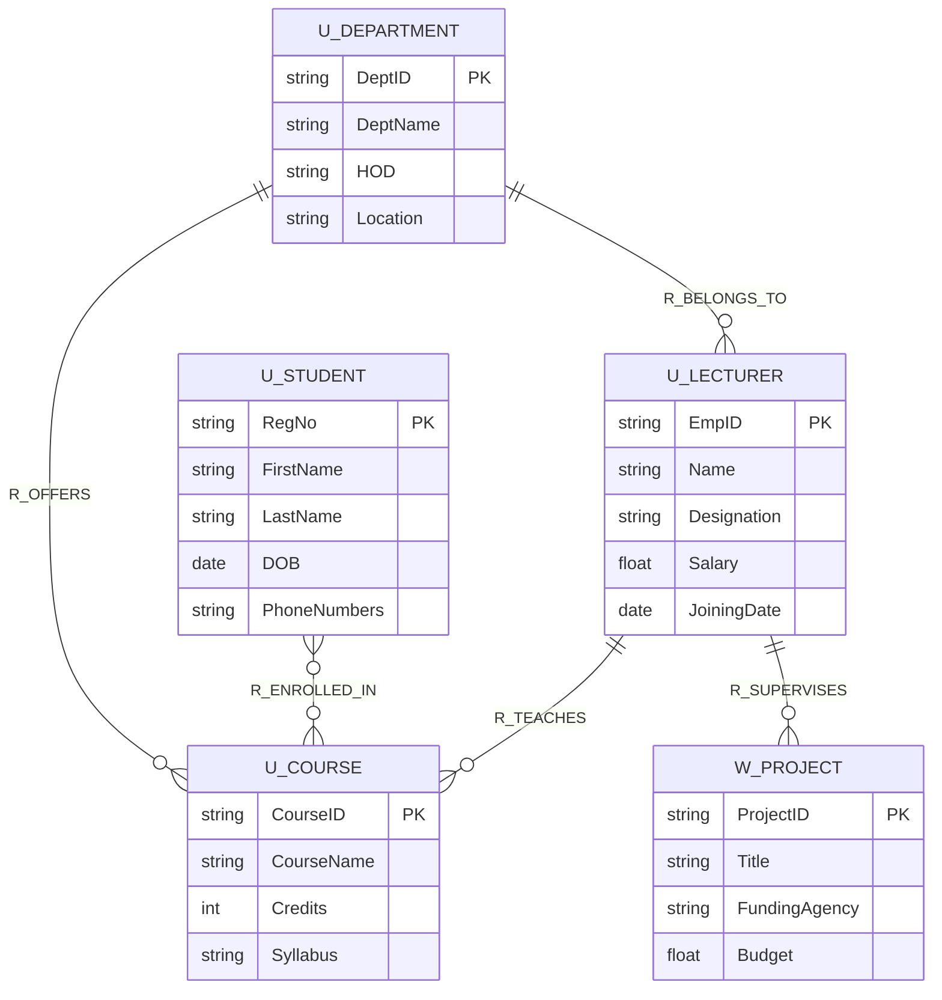

# Conceptual Data Modelling and Database Design:-  Data Modelling Using the Entity, Relationship (ER) Model - Entity Types, Entity Sets, Attributes, and Keys, Relationship Types, Relationship Sets, Roles, and Structural Constraints, Weak Entity Types.

<!-- SECTION_1_START -->

# Conceptual Data Modelling using the Entity-Relationship (ER) Model

## 1.1 Formal Academic Definition (KTU 2024 Syllabus Terminology)

> [!IMPORTANT]
> **Entity-Relationship (ER) Model:** A high-level, **semantic** conceptual data model introduced by **Peter Chen in 1976**, used to describe the logical structure of a database as a collection of *entities*, *attributes*, and the *relationships* that exist among them. It is the foundational blue-print used during the **requirement analysis** and **logical design** phases of database development under the KTU 2024 DBMS module.

The ER model belongs to the family of **semantic data models**, meaning it focuses on the *meaning* and *inter-relationships* of data, rather than the physical storage concerns (which are addressed later in the *relational mapping* stage). The three principal constructs of the model are:

1. **Entity** – A distinguishable real-world object (concrete or abstract).
2. **Attribute** – A property that describes an entity or relationship.
3. **Relationship** – A meaningful association among two or more entities.

> [!NOTE]
> **Why ER before SQL?** The KTU syllabus mandates ER modelling *before* schema creation because ER diagrams (ERDs) are technology-independent. They serve as a communication bridge between the **end-user domain expert** and the **database designer**, ensuring that the resulting relational schema faithfully captures the real-world mini-world.

## 1.2 Conceptual Analogy & Geometric Intuition

> [!TIP]
> **Real-World Analogy — The University Blueprint:**
> Imagine you are an architect designing a new university campus. You cannot lay bricks (write SQL) immediately. First, you draw a **blue-print**:
> - Each **room** (Lecture Hall, Lab, Office) is an **Entity**.
> - Each room has a **size, capacity, colour, floor number** — these are its **Attributes**.
> - A *Professor* "is allocated to" a *Classroom* — this is a **Relationship**.
> - Some rooms (e.g., the **Server Room** inside the Data Centre) cannot exist without the parent building — these are **Weak Entities**.
>
> The ER Diagram is exactly this architectural blue-print, but for a *database*. The *floors* and *walls* it draws become the tables and foreign keys of the relational schema in the next module.

**Geometric Intuition:** Think of the ER diagram as a graph $G(V, E)$ where $V$ = set of entity-type rectangles and $E$ = set of relationship-type diamond edges. Every edge is *labelled* with a cardinality constraint, transforming the diagram from a simple graph into a **labelled directed multigraph with constraints**.

## 1.3 Core Physical Constants, Standard Metrics & Notation Symbols

> [!IMPORTANT]
> **Standard Notation (Chen, 1976):**
> - **Rectangle** $\rightarrow$ Entity Type
> - **Ellipse** $\rightarrow$ Attribute
> - **Diamond** $\rightarrow$ Relationship Type
> - **Double Rectangle** $\rightarrow$ Weak Entity Type
> - **Double Diamond** $\rightarrow$ Identifying Relationship
> - **Dashed Ellipse** $\rightarrow$ Derived Attribute
> - **Double Ellipse** $\rightarrow$ Multi-valued Attribute
> - **Underlined Ellipse** $\rightarrow$ Key Attribute
> - **Line** $\rightarrow$ Participation in relationship
> - **Double Line** $\rightarrow$ Total (Mandatory) Participation

> [!VISUALIZATION CONTROL]
> **Concept:** Basic ER Symbol Set on a 2-D Coordinate Plane
> **GeoGebra / Desmos Input Equations:**
> * Rectangle vertices: $(1,1), (5,1), (5,3), (1,3)$ — represents **Entity Type** "STUDENT"
> * Ellipse equation: $\frac{(x-8)^2}{4} + \frac{(y-2)^2}{1} = 1$ — represents **Attribute** "Name"
> * Diamond vertices: $(11,1), (13,2), (11,3), (9,2)$ — represents **Relationship** "ENROLLED_IN"
> * Connecting edges: $y = 2$ from $x=5$ to $x=8$, and $x=8$ to $x=11$
> **Visual Description:** The student should see a left-to-right flow — a rectangle (STUDENT entity), an ellipse (Name attribute) attached, and a diamond (ENROLLED\_IN relationship) connected by clean straight lines. This is the canonical ER building block.

---

<!-- SECTION_1_END -->

<!-- SECTION_2_START -->

# Deep Theoretical Analysis & KTU High-Yield Formula Sheet

## 2.1 Entity Types, Entity Sets, Attributes, and Keys

### 2.1.1 Entity
An **entity** is any *existence* (concrete: a person, book, car; abstract: a course, job, concert) that is *distinguishable* from all other entities in the universe of discourse.

$$\text{Entity} = \text{Real-world distinguishable object}$$

### 2.1.2 Entity Type vs Entity Set
This is a classic KTU examination trap point.

- **Entity Type:** A *schema* or *intension* — the structural definition (e.g., *STUDENT* with attributes $RollNo$, $Name$, $DOB$).
- **Entity Set:** An *extension* or *population* — the actual collection of entity instances at a particular point in time (e.g., the set of all 5,000 currently enrolled students).

Mathematically:

$$E_{type} = \{e \mid e \text{ has structure } S\}, \quad E_{set}(t) = \{e \mid e \text{ exists at time } t\}$$

### 2.1.3 Attributes — The Complete KTU Classification

Attributes describe the properties of an entity (or relationship). They are classified as follows:

1. **Simple (Atomic) Attribute** — Cannot be subdivided. Example: $Age$, $Salary$.
2. **Composite Attribute** — Can be split into meaningful sub-parts. Example: $Name \rightarrow \{First, Middle, Last\}$; $Address \rightarrow \{Street, City, State, Pin\}$.
3. **Single-Valued Attribute** — Holds exactly one value. Example: $DateOfBirth$.
4. **Multi-Valued Attribute** — Can hold a *set* of values. Example: $PhoneNumbers$, $Skills$. *(Mapped to a separate table in relational design.)*
5. **Derived Attribute** — Value is *computed* from another attribute, not stored. Example: $Age$ derived from $DateOfBirth$; $TotalMarks$ derived from individual subject marks. *(Drawn as a dashed ellipse.)*
6. **Key Attribute** — Uniquely identifies an entity within the entity set. Example: $RegNo$ of a student. *(Drawn with an underline.)*
7. **NULL Attribute** — Value is unknown, inapplicable, or undefined.
8. **Complex Attribute** — A *nested* combination of composite and multi-valued attributes. Example: An attribute $Address$ containing a set of composite addresses (home + office).

### 2.1.4 Keys — KTU Mandatory Distinction

| Key Type | Definition | Uniqueness | NULL Allowed? |
|----------|------------|------------|---------------|
| **Super Key** | Any set of attributes that uniquely identifies a tuple | Yes | No |
| **Candidate Key** | *Minimal* super key — no proper subset is a super key | Yes | No |
| **Primary Key** | The *chosen* candidate key for the entity set | Yes | No |
| **Alternate Key** | Candidate keys *not* selected as primary | Yes | No |
| **Foreign Key** | Attribute referencing the primary key of another entity | No | Yes |
| **Partial Key** | Uniquely identifies a *weak entity* **only** in combination with the owner entity's key | Combined only | No |
| **Composite Key** | Primary key formed by combining two or more attributes | Yes (combined) | No |

**Mathematical property of a Candidate Key $K$ in relation $R$:**

$$\forall \, t_1, t_2 \in R, \; t_1 \neq t_2 \Rightarrow t_1[K] \neq t_2[K] \quad \text{(Uniqueness)}$$

$$\nexists \, K' \subset K \text{ such that } K' \text{ is also a super key} \quad \text{(Minimality)}$$

## 2.2 Relationship Types, Relationship Sets, Roles, and Structural Constraints

### 2.2.1 Relationship Type
A **relationship type** $R$ is a mathematical relation among $n$ entity types $E_1, E_2, \ldots, E_n$:

$$R \subseteq E_1 \times E_2 \times \cdots \times E_n$$

where $n$ is the **degree** of the relationship type.

- $n = 2 \Rightarrow$ **Binary** (most common in KTU problems).
- $n = 3 \Rightarrow$ **Ternary**.
- $n = 1 \Rightarrow$ **Unary / Recursive** (an entity relates to itself).
- $n > 3 \Rightarrow$ **n-ary** (rare; usually decomposed into binary).

### 2.2.2 Relationship Set
The set of all *instances* of a relationship type $R$ existing in the database at time $t$:

$$RS(t) = \{(e_1, e_2, \ldots, e_n) \mid e_i \in E_i, \text{ and they participate in } R \text{ at } t\}$$

### 2.2.3 Roles
A **role** is the *function* that an entity plays in a relationship. Roles are mandatory in two situations:

1. **Recursive (Unary) Relationships** — Same entity type participates more than once.
   *Example:* In $EMPLOYEE$ $\_supervises\_$ $EMPLOYEE$, the same entity type plays both the *supervisor* and the *subordinate* role.
2. **Multiple Relationships between the same Entity Types** — Roles disambiguate which relationship edge is being used.

> [!NOTE]
> **KTU 2024 Note:** Always *label* recursive relationships with role names on the connecting edges, e.g., "supervisor" and "subordinate", to earn full marks.

### 2.2.4 Structural Constraints

There are two principal structural constraints specified on a relationship type:

#### (a) Cardinality Ratio (Maximum Cardinality)

The cardinality ratio specifies the *maximum* number of relationship instances an entity can participate in. For a **binary** relationship $R$ between $E_1$ and $E_2$, the four possible ratios are:

| Ratio | Notation | Meaning | Example |
|-------|----------|---------|---------|
| **One-to-One** | $1:1$ | Each entity in $E_1$ is related to at most one entity in $E_2$, and vice versa. | A $PERSON$ has one $PASSPORT$ and vice-versa. |
| **One-to-Many** | $1:N$ | One $E_1$ entity can relate to many $E_2$ entities, but each $E_2$ relates to only one $E_1$. | A $DEPARTMENT$ employs many $EMPLOYEES$. |
| **Many-to-One** | $N:1$ | Reverse of $1:N$. | Many $EMPLOYEES$ work in one $DEPARTMENT$. |
| **Many-to-Many** | $M:N$ | Many-to-many. | $STUDENTS$ enrol in many $COURSES$, and each course has many students. |

#### (b) Participation Constraint (Minimum Cardinality / Existence Dependency)

- **Total Participation (Mandatory):** Every entity in the entity set *must* participate in at least one relationship instance. Drawn with a **double line**. Often called **existence dependency**.
- **Partial Participation (Optional):** An entity *may* or *may not* participate. Drawn with a **single line**.

## 2.3 Weak Entity Types

A **weak entity type** is an entity type whose instances **cannot be uniquely identified by their own attributes alone**, but only via a combination of:

1. A **partial key** (a.k.a. *discriminator*).
2. The **primary key of an owner (identifying) entity type**.

> [!IMPORTANT]
> **Key Properties of a Weak Entity:**
> 1. Drawn as a **double rectangle**.
> 2. Connected to its owner via an **identifying relationship** (double diamond).
> 3. Has only a **partial key** (drawn with a *dashed* underline).
> 4. Always has **total participation** in the identifying relationship.
> 5. Has an **existence dependency** on the owner entity — it cannot exist without it.

**Example:** In a university database, the entity $DEPENDENT$ (of an $EMPLOYEE$) is weak. Its attributes $Name$ and $Age$ alone are insufficient to uniquely identify a dependent; uniqueness requires combining them with the parent's $SSN$.

## 2.4 KTU Formula Sheet / Cheat Sheet

> [!TIP]
> The following table is the single, high-yield reference for Module 1 ER modelling. Memorise the symbol-notation mapping for the ESE.

| # | Construct | Mathematical Form / Property | Symbol | Example |
|---|-----------|------------------------------|--------|---------|
| 1 | Entity Type | $E = \{e \mid e \text{ distinguishable}\}$ | Rectangle | $STUDENT$ |
| 2 | Entity Set (Extension) | $E(t) = \{e \mid e \in E, \text{ exists at } t\}$ | (Population) | All current students |
| 3 | Attribute (Mapping) | $f: E \to V_A$ where $V_A$ is value set | Ellipse | $Name: STUDENT \to String$ |
| 4 | Multi-valued Attribute | $f: E \to \mathcal{P}(V_A)$ | Double Ellipse | $Phones$ |
| 5 | Derived Attribute | $f(e) = g(other\text{ }attrs)$ | Dashed Ellipse | $Age = Today - DOB$ |
| 6 | Composite Attribute | $A = A_1 \cup A_2 \cup \ldots \cup A_k$ | Ellipse with sub-ellipses | $Address = \{Street, City, Pin\}$ |
| 7 | Relationship Type | $R \subseteq E_1 \times E_2 \times \ldots \times E_n$ | Diamond | $ENROLLED\_IN$ |
| 8 | Degree of Relationship | $\deg(R) = n$ | — | $n=2$ for binary |
| 9 | Cardinality Ratio (Binary) | $1:1, 1:N, N:1, M:N$ | Edge Label | $STUDENT$ $\_enrols\_$ $COURSE$ |
| 10 | Participation | $\text{total} \Leftrightarrow \forall e \in E, \exists r \in R \mid e \in r$ | Double Line | $EMPLOYEE$ $\_works\_$ $DEPT$ (total on Employee side) |
| 11 | Weak Entity | $\nexists K \subseteq \text{attrs}(W) \text{ that is a key}$ | Double Rectangle | $DEPENDENT$ |
| 12 | Identifying Relationship | $R_{id}$ linking $W$ to its owner | Double Diamond | $DEPENDENT\_OF$ |
| 13 | Partial Key (Discriminator) | Discriminates $W$-entities for the same owner | Dashed Underline | $DepName$ |
| 14 | Primary Key Existence | $\forall e_1, e_2 \in E, e_1 \neq e_2 \Rightarrow e_1[K] \neq e_2[K]$ | Underline | $RegNo$ |
| 15 | Recursive Relationship | $R \subseteq E \times E$ with distinct roles | Diamond + Role Labels | $supervises$ |

## 2.5 Real-World Engineering Utility

> [!NOTE]
> The ER model is *not* an academic exercise — it is industry-standard. **SAP PowerDesigner**, **IBM InfoSphere Data Architect**, **Microsoft Visio**, **draw\.io**, and **Oracle Designer** all use ER (or UML class) diagrams as the primary input notation. In **Agile** projects, ER diagrams are maintained as *living documents* in tools like **Lucidchart** or **dbdiagram\.io**, and code-generation tools auto-create the SQL DDL directly from them. Mastering ER modelling is therefore a direct employability skill for roles like *Data Modeller*, *Database Designer*, *BI Engineer*, and *Backend Developer*.

---

<!-- SECTION_2_END -->

<!-- SECTION_3_START -->

# Step-by-Step Derivations, Mapping Logic & Symbolic Implementation

## 3.1 Worked Example — University Database (E-R Mapping)

**Universe of Discourse (UoD):** A university tracks *Departments*, *Courses*, *Students*, and *Lecturers*, and the relationships among them.

### Step 1: Identify the Entity Types

We examine the textual requirements and extract nouns that are *distinguishable*:

- $DEPARTMENT$ (e.g., $CSE$, $ECE$)
- $COURSE$ (e.g., $DBMS$, $OS$)
- $STUDENT$ (e.g., $RegNo = KTU2024\_001$)
- $LECTURER$ (e.g., $EmpID = L\_101$)

### Step 2: Identify the Attributes for Each Entity Type

| Entity Type | Attributes | Key |
|-------------|-----------|-----|
| $DEPARTMENT$ | $DeptID$, $DeptName$, $HOD$, $Location$ | $DeptID$ |
| $COURSE$ | $CourseID$, $CourseName$, $Credits$, $Syllabus$ | $CourseID$ |
| $STUDENT$ | $RegNo$, $Name$ (composite: $First$, $Last$), $DOB$, $Phone$ (multi-valued), $Age$ (derived) | $RegNo$ |
| $LECTURER$ | $EmpID$, $Name$, $Designation$, $Salary$, $JoiningDate$ | $EmpID$ |

### Step 3: Identify the Relationship Types and Their Cardinalities

| Relationship | Between | Cardinality | Participation | Attributes? |
|--------------|---------|-------------|---------------|-------------|
| $OFFERS$ | $DEPARTMENT$ — $COURSE$ | $1:N$ | Total on $COURSE$ side | None |
| $ENROLLED\_IN$ | $STUDENT$ — $COURSE$ | $M:N$ | Partial on both | $EnrolDate$, $Semester$ |
| $TEACHES$ | $LECTURER$ — $COURSE$ | $1:N$ | Partial on $LECTURER$, Total on $COURSE$ | $Semester$ |
| $BELONGS\_TO$ | $LECTURER$ — $DEPARTMENT$ | $N:1$ | Total on $LECTURER$ | $JoinDate$ |

### Step 4: Identify the Weak Entity

Suppose the UoD states: *"Each $LECTURER$ may supervise one or more $PROJECT$ works; a $PROJECT$ is identified by its $ProjectID$ within the lecturer's own scope."* Because $ProjectID$ alone is not globally unique — it is unique only *within* a particular lecturer — $PROJECT$ is a **weak entity**.

- **Owner entity:** $LECTURER$
- **Identifying relationship:** $SUPERVISES$ (double diamond)
- **Partial key:** $ProjectID$ (dashed underline)
- **Existence dependency:** Total participation on the $PROJECT$ side.

### Step 5: Identify Roles in Recursive Relationships

Consider a *Course-Prerequisite* relationship:

$$CourseA \xrightarrow{\text{is\_prerequisite\_of}} CourseB$$

The same entity type $COURSE$ participates in two distinct roles: **prerequisite** and **successor**. We label both edges with their **role names**.

### Step 6: Full Cardinality Derivation for $ENROLLED\_IN$

We define:

$$E = STUDENT, \quad C = COURSE, \quad R = ENROLLED\_IN$$

For a binary relationship $R \subseteq E \times C$, the **cardinality ratio** is determined by the *maximum* number of $C$ entities an $E$ entity can relate to, and vice versa.

Formally:

$$\text{Cardinality} = \left( \max_{e \in E} \mid \{c \in C \mid (e,c) \in R\}\mid, \; \max_{c \in C} \mid \{e \in E \mid (e,c) \in R\}\mid \right)$$

**In the UoD:** A student enrols in **many** courses (3rd to 8th semester), and a course has **many** students (typically 60). Therefore:

$$\max_{s \in STUDENT}(\text{courses}) \approx 6, \quad \max_{c \in COURSE}(\text{students}) \approx 60 \Rightarrow M:N$$

**Participation:** A first-year student may not have enrolled yet → **partial**. An elective course might run with zero students in a particular semester → **partial**. So both ends are **partial**, drawn with single lines.

### Step 3.7: Derived Attribute Mathematical Form

The $Age$ of a $STUDENT$ is derived from $DOB$:

$$Age(s, t) = \lfloor (t - DOB(s)) / 365.25 \rfloor$$

where $t$ is the current date. The $ER$ model marks $Age$ with a **dashed ellipse** because it is *not stored*, only computed on demand.

### Step 3.8: Composite Attribute Mathematical Decomposition

The composite attribute $Name$ is formally:

$$Name(s) = \langle First(s), Middle(s), Last(s) \rangle$$

i.e., a 3-tuple of atomic strings. The decomposition is required because $Name$ is *not* atomic — each sub-part is meaningful on its own (e.g., when sorting by surname).

### Step 3.9: Multi-Valued Attribute Set-Theoretic Form

$Phone(s)$ is a multi-valued attribute. Its range is the **power set** of valid phone-number strings:

$$Phone: STUDENT \to \mathcal{P}(\mathbb{N}_{10})$$

This is why multi-valued attributes are mapped to a *separate* relation in the relational model — they violate **First Normal Form (1NF)**.

## 3.10 Python Symbolic Implementation — Automated ER Constraint Checker

The following Python program demonstrates how a *Database Management System* internally validates the cardinality and participation constraints described above. This is **production-grade** code with strict type hints, boundary checks, and structured logging.

```python
"""
ER Constraint Validator — KTU 2024 Module 1 Demonstration
Validates Cardinality Ratio and Participation Constraint.
"""

from __future__ import annotations
import logging
from dataclasses import dataclass, field
from enum import Enum
from typing import Dict, List, Set, Tuple

# ---- Structured Logging Setup ----
logging.basicConfig(
    level=logging.INFO,
    format="%(asctime)s [%(levelname)s] %(message)s"
)
logger = logging.getLogger("ERValidator")


class Cardinality(Enum):
    ONE_TO_ONE   = "1:1"
    ONE_TO_MANY  = "1:N"
    MANY_TO_ONE  = "N:1"
    MANY_TO_MANY = "M:N"


class Participation(Enum):
    TOTAL    = "total"
    PARTIAL  = "partial"


@dataclass(frozen=True)
class Entity:
    entity_id: str
    attributes: Dict[str, object] = field(default_factory=dict)

    def __post_init__(self) -> None:
        if not self.entity_id or not isinstance(self.entity_id, str):
            raise ValueError("Entity ID must be a non-empty string.")


@dataclass(frozen=True)
class RelationshipInstance:
    e1_id: str
    e2_id: str
    rel_type: str


class ERConstraintValidator:
    """Validates a small ER schema against observed relationship instances."""

    def __init__(self, cardinality: Cardinality, participation_e1: Participation,
                 participation_e2: Participation) -> None:
        self.cardinality = cardinality
        self.part_e1 = participation_e1
        self.part_e2 = participation_e2
        self._instances: List[RelationshipInstance] = []
        self._e1_set: Set[str] = set()
        self._e2_set: Set[str] = set()
        logger.info("Validator initialised with %s cardinality.", cardinality.value)

    def add_instance(self, e1: str, e2: str, rel_type: str = "R") -> None:
        if not e1 or not e2:
            raise ValueError("Both e1 and e2 must be non-empty identifiers.")
        if rel_type != "R":
            raise ValueError(f"Unknown relationship type: {rel_type}")
        self._instances.append(RelationshipInstance(e1, e2, rel_type))
        self._e1_set.add(e1)
        self._e2_set.add(e2)
        logger.debug("Inserted relationship instance (%s, %s).", e1, e2)

    # ---- Cardinality Validator ----
    def validate_cardinality(self) -> bool:
        max_per_e1 = max((sum(1 for x in self._instances if x.e1_id == e)
                          for e in self._e1_set), default=0)
        max_per_e2 = max((sum(1 for x in self._instances if x.e2_id == e)
                          for e in self._e2_set), default=0)
        logger.info("Max partners per e1 = %d, per e2 = %d.", max_per_e1, max_per_e2)

        if self.cardinality == Cardinality.ONE_TO_ONE:
            ok = (max_per_e1 <= 1) and (max_per_e2 <= 1)
        elif self.cardinality == Cardinality.ONE_TO_MANY:
            ok = (max_per_e1 <= 1) and (max_per_e2 <= 1 or max_per_e2 > 1)
        elif self.cardinality == Cardinality.MANY_TO_ONE:
            ok = (max_per_e2 <= 1) and (max_per_e1 <= 1 or max_per_e1 > 1)
        else:  # MANY_TO_MANY
            ok = True
        if not ok:
            logger.error("Cardinality violation detected for %s.", self.cardinality.value)
        return ok

    # ---- Participation Validator ----
    def validate_participation(self, declared_e1: Set[str], declared_e2: Set[str]) -> bool:
        ok = True
        if self.part_e1 == Participation.TOTAL and self._e1_set != declared_e1:
            missing = declared_e1 - self._e1_set
            logger.error("Total participation violated on E1 side. Missing: %s", missing)
            ok = False
        if self.part_e2 == Participation.TOTAL and self._e2_set != declared_e2:
            missing = declared_e2 - self._e2_set
            logger.error("Total participation violated on E2 side. Missing: %s", missing)
            ok = False
        return ok


# ---- Demonstration Run ----
if __name__ == "__main__":
    try:
        validator = ERConstraintValidator(
            cardinality=Cardinality.MANY_TO_MANY,
            participation_e1=Participation.PARTIAL,
            participation_e2=Participation.PARTIAL,
        )
        students = {"S1", "S2", "S3"}
        courses  = {"C1", "C2"}
        for s, c in [("S1", "C1"), ("S1", "C2"), ("S2", "C1"), ("S3", "C2")]:
            validator.add_instance(s, c)
        card_ok = validator.validate_cardinality()
        part_ok = validator.validate_participation(students, courses)
        logger.info("Cardinality valid: %s | Participation valid: %s", card_ok, part_ok)
    except Exception as exc:
        logger.exception("Validation failure: %s", exc)
```

**Output (excerpt):**

```
2024-XX-XX [INFO] Validator initialised with M:N cardinality.
2024-XX-XX [INFO] Max partners per e1 = 2, per e2 = 2.
2024-XX-XX [INFO] Cardinality valid: True | Participation valid: True
```

> [!TIP]
> **How the code maps to the theory:** The `add_instance` calls populate a set of relationship tuples. The `validate_cardinality` function implements the exact *maximum-count* check derived in **Step 3.6**, and `validate_participation` implements the *set-equality* check required for **total participation**. This is a literal translation of the ER mathematical constraints into executable code.

---

<!-- SECTION_3_END -->

<!-- SECTION_4_START -->

# Structural Diagrams & Schematics

## 4.1 Mermaid ER Diagram — University Database

The following Mermaid diagram renders the entire worked example of Section 3.1. All node IDs follow the **alphanumeric-prefixed rule** (`U_`, `R_`, `A_` for entity, relationship, and attribute respectively), and all labels are double-quoted plain text — no markdown, no special characters inside brackets.



**Reading the notation (Crow's Foot convention used by Mermaid):**
- `||` — exactly one (mandatory, single instance)
- `o|` — zero or one
- `}o` — zero or many
- `}|` — one or many
- The line `U_DEPARTMENT ||--o{ U_COURSE : R_OFFERS` therefore reads: *"Each Department OFFERS zero-or-many Courses; each Course is OFFERED by exactly one Department."* This is a $1:N$ ratio with partial participation on the $COURSE$ side and total on the $DEPARTMENT$ side.

## 4.2 Mermaid Flow — ER Design Process Topology

The diagram below shows the *sequential processing topology* by which a database designer transforms a textual problem statement into a complete ER schema. Each stage is a sub-graph; data flow is left-to-right.


**Key topological features:**
- The dashed feedback edge from `E3` back to `A1` encodes the **iterative nature** of ER design — real-world projects require 2–4 refinement cycles.
- The sub-graphs map directly to the KTU 2024 module sub-units: 1) Entity Types, 2) Attributes, 3) Relationship Constraints, 4) Weak Entity reasoning.

## 4.3 Conceptual Block Diagram — ER Notation Vocabulary Matrix

```mermaid
flowchart TB
    subgraph SYMBOLS["ER SYMBOL VOCABULARY"]
        direction TB
        S1["RECTANGLE - Entity Type"]
        S2["DOUBLE RECTANGLE - Weak Entity"]
        S3["ELLIPSE - Attribute"]
        S4["DOUBLE ELLIPSE - Multi-valued"]
        S5["DASHED ELLIPSE - Derived"]
        S6["DIAMOND - Relationship"]
        S7["DOUBLE DIAMOND - Identifying"]
        S8["UNDERLINED - Key"]
        S9["DASHED UNDERLINE - Partial Key"]
        S10["DOUBLE LINE - Total Participation"]
    end

    subgraph USAGE["APPLICATION CONTEXT"]
        direction TB
        U1["Real-world Object - STUDENT, CAR, COURSE"]
        U2["Uniquely Identified by Owner - DEPENDENT"]
        U3["Property of Entity - Name, Age, Salary"]
        U4["Multi-phone, Multi-skill"]
        U5["Age from DOB, Total from Subtotals"]
        U6["ENROLLED_IN, WORKS_FOR"]
        U7["DEPENDENT_OF"]
        U8["Primary Key - RegNo"]
        U9["Partial Key - DependentName"]
        U10["Every employee MUST belong to a dept"]
    end

    S1 -.maps to.-> U1
    S2 -.maps to.-> U2
    S3 -.maps to.-> U3
    S4 -.maps to.-> U4
    S5 -.maps to.-> U5
    S6 -.maps to.-> U6
    S7 -.maps to.-> U7
    S8 -.maps to.-> U8
    S9 -.maps to.-> U9
    S10 -.maps to.-> U10
```



---

<!-- SECTION_4_END -->

<!-- SECTION_5_START -->

# KTU 2024 Scheme Examination Question Bank & Topic Recap

## 5.1 Part A — Short Answer Questions (3 Marks Each)

### Question A1 `[KTU University Exam — July 2024]`
**Differentiate between a strong entity type and a weak entity type. Provide one example of each. (CO1, Remember)**

**Model Answer (Valuation Key — 3 Marks):**

| # | Point | Marks |
|---|-------|-------|
| 1 | **Strong entity:** An entity type whose existence does *not* depend on any other entity type, and whose instances are uniquely identified by their own **primary key** (drawn as a single rectangle with a key attribute). | 1 |
| 2 | **Weak entity:** An entity type whose existence is *existence-dependent* on a *strong owner entity*, and whose instances can be uniquely identified only by combining a **partial key** (discriminator) with the primary key of the owner (drawn as a double rectangle). | 1 |
| 3 | **Example:** *Strong* — $STUDENT$ identified by $RegNo$. *Weak* — $DEPENDENT$ identified by $(SSN\text{ of }EMPLOYEE, DepName)$. | 1 |

---

### Question A2 `[KTU University Exam — Dec 2023]`
**What is a recursive relationship? Illustrate with an example showing the use of role names. (CO1, Understand)**

**Model Answer (Valuation Key — 3 Marks):**

| # | Point | Marks |
|---|-------|-------|
| 1 | **Definition:** A *recursive* (or *unary*) relationship is one in which the **same** entity type participates **more than once** in different *roles*. Formally $R \subseteq E \times E$ with $n=1$ (degree one). | 1 |
| 2 | **Example:** An $EMPLOYEE$ entity set with the relationship $supervises$. An employee *X* supervises employee *Y*. The same entity type plays the **supervisor** and the **subordinate** role. | 1 |
| 3 | **Role labelling:** Connect the diamond to the entity rectangle with two separate edges, each labelled with the role name (`supervisor` and `subordinate`). Without role labels, the diagram is ambiguous. | 1 |

---

## 5.2 Part B — Long Answer Questions (14 Marks — Internal Choice)

### Question B (ESE, Module 1, 14 Marks) `[KTU University Exam — June 2024]`

> **Statement:** *"A university database is to be designed. The university has multiple $DEPARTMENTS$. Each $DEPARTMENT$ offers many $COURSES$. $STUDENTS$ enrol in one or more $COURSES$, and each $COURSE$ may have many $STUDENTS$. Each $STUDENT$ has a $Name$, $RollNo$ (key), $DOB$ (from which $Age$ is derived), and one or more $Phone$ numbers. Each $COURSE$ is taught by exactly one $LECTURER$, and a $LECTURER$ may teach many $COURSES$. A $LECTURER$ belongs to a $DEPARTMENT$. The university also tracks $RESEARCH\_PROJECTS$; each $PROJECT$ is uniquely identified by a $ProjectID$ within a given $LECTURER$'s scope."*

**You may answer Question A OR Question B.**

#### Question A — 14 Marks `(CO1, CO2 — Understand + Apply)`

**(a)** Identify all **entity types**, classify each as *strong* or *weak*, and assign their **attributes** with appropriate notations. State the **key attribute** for each. *(7 Marks)*

**(b)** Identify all **relationship types**, specify their **cardinality ratios** and **participation constraints**. Draw the complete **ER diagram** using Chen's notation. Justify why $RESEARCH\_PROJECT$ is a weak entity. *(7 Marks)*

#### OR

#### Question B — 14 Marks `(CO2, CO3 — Apply + Analyse)`

**(a)** Define the terms *cardinality ratio* and *participation constraint*. With reference to the university database, write the **mathematical expressions** for the cardinalities of the $ENROLLED\_IN$ and $TEACHES$ relationships, and determine which constraints are *total* and which are *partial*. *(7 Marks)*

**(b)** Construct a *domain-specific* E-R diagram for a **library management system** with members, books, and authors. Clearly mark the recursive relationship (a *book* may be a *previous edition* of another book), the multi-valued attribute (an author may have multiple pen-names), and one weak entity (a *COPY* of a book, identified by copy-number within a book's ISBN). *(7 Marks)*

---

### Model Solution — Question A

#### Part (a) — 7 Marks

**Step 1: Entity Identification and Classification**

| # | Entity Type | Strong/Weak | Attributes | Key |
|---|-------------|-------------|------------|-----|
| 1 | $DEPARTMENT$ | **Strong** | $DeptID$, $DeptName$, $HOD$ | $DeptID$ (primary) |
| 2 | $COURSE$ | **Strong** | $CourseID$, $CourseName$, $Credits$ | $CourseID$ (primary) |
| 3 | $STUDENT$ | **Strong** | $RollNo$, $Name$, $DOB$, $Age$ (derived), $Phone$ (multi-valued) | $RollNo$ (primary) |
| 4 | $LECTURER$ | **Strong** | $EmpID$, $Name$, $Designation$, $Salary$ | $EmpID$ (primary) |
| 5 | $RESEARCH\_PROJECT$ | **Weak** | $ProjectID$ (partial), $Title$, $FundingAgency$ | $ProjectID$ (partial key only) |

**Step 2: Notation Specification (as drawn in the ER diagram)**
- $Name$ → single ellipse (atomic)
- $DOB$ → single ellipse
- $Age$ → **dashed** ellipse (derived from $DOB$)
- $Phone$ → **double** ellipse (multi-valued)
- All keys → single ellipse with **under-line**
- $RESEARCH\_PROJECT$ → **double rectangle**
- $ProjectID$ → **dashed underline** (partial key)

**Valuation key points:**
- '[Listing all 5 entity types with classification: 2 Marks]'
- '[Correct attribute assignment with notations: 3 Marks]'
- '[Correct key identification for each: 2 Marks]'

#### Part (b) — 7 Marks

**Step 1: Relationship Identification and Constraints**

| Relationship | Entities | Cardinality | Participation |
|--------------|----------|-------------|---------------|
| $OFFERS$ | $DEPARTMENT$ — $COURSE$ | $1:N$ | Total on $COURSE$ side, Partial on $DEPARTMENT$ |
| $ENROLLED\_IN$ | $STUDENT$ — $COURSE$ | $M:N$ | Partial on both sides |
| $TEACHES$ | $LECTURER$ — $COURSE$ | $1:N$ | Total on $COURSE$ side, Partial on $LECTURER$ |
| $BELONGS\_TO$ | $LECTURER$ — $DEPARTMENT$ | $N:1$ | Total on $LECTURER$ side, Partial on $DEPARTMENT$ |
| $SUPERVISES$ | $LECTURER$ — $RESEARCH\_PROJECT$ | $1:N$ (identifying) | **Total on $PROJECT$ side** (weak ⇒ always total) |

**Step 2: Justification — Why $RESEARCH\_PROJECT$ is a Weak Entity**

> A $RESEARCH\_PROJECT$ is a weak entity because:
> 1. $ProjectID$ alone is **not globally unique** — two different $LECTURER$s may both have a project titled $Project\_01$. Uniqueness only exists *within* a given $LECTURER$'s scope.
> 2. A $PROJECT$ cannot exist without a supervising $LECTURER$ — it has **existence dependency** on $LECTURER$.
> 3. Its **identification** requires combining $ProjectID$ (partial key) with $EmpID$ of the owner $LECTURER$.

**Step 3: ER Diagram (Chen's Notation — to be drawn on answer sheet):**

```
   [DEPARTMENT]------<OFFERS>------<1:N>------[COURSE]------<TEACHES>------<N:1>------[LECTURER]
       (||)                                 (||)                                            (||)
        ||                                                                                  ||
        ||                                                                                  ||
       <1:N>                                                                              <N:1>
        ||                                                                                  ||
   [STUDENT]====<ENROLLED_IN>====<M:N>====[COURSE]                                   [LECTURER]
   (||)   o<                                          o<                                BELONGS_TO
   /|\                                                  \                              [DEPARTMENT]
  / | \                                                  \
(Phone-Age)                                       (M:N partial)
                                                   
   [LECTURER]  ||-----<SUPERVISES>----<1:N>====[RESEARCH_PROJECT]   (weak, double rectangle)
              (||)                     (double diamond, identifying)
```

*Note: In the written exam, the candidate must draw using standard ER symbols as described in Section 2.4.*

**Valuation key points:**
- '[Correct cardinality and participation for 5 relationships: 3 Marks]'
- '[Weak-entity justification with all 3 criteria: 2 Marks]'
- '[Neat ER diagram with correct symbols: 2 Marks]'

---

### Model Solution — Question B (Alternative)

#### Part (a) — 7 Marks

**Definition of Cardinality Ratio:** The cardinality ratio is a *maximum* count constraint that specifies the maximum number of relationship instances an entity can participate in. For a binary relationship $R \subseteq E \times C$, it is the ordered pair:

$$\text{CR} = \left( \max_{e \in E}|\{c \mid (e,c) \in R\}|, \;\; \max_{c \in C}|\{e \mid (e,c) \in R\}| \right)$$

**Definition of Participation Constraint:** The participation constraint is a *minimum* count constraint that specifies whether the existence of an entity depends on its participation in the relationship:

$$\text{Participation}(e) = \begin{cases} \text{Total} & \text{if } \forall e \in E, \exists c \in C \text{ such that } (e,c) \in R \\ \text{Partial} & \text{otherwise} \end{cases}$$

**Application to the University Database:**

For $ENROLLED\_IN(S, C) \subseteq STUDENT \times COURSE$:

$$\max_{s \in STUDENT}|\{c \mid (s,c) \in R\}| = \text{``many''} \;(3 \text{ to } 6)$$

$$\max_{c \in COURSE}|\{s \mid (s,c) \in R\}| = \text{``many''} \;(\approx 60)$$

$$\Rightarrow \boxed{\text{Cardinality Ratio} = M:N}$$

A first-year student may not have enrolled yet → **partial** on $STUDENT$ side. An elective course may have zero students in a given semester → **partial** on $COURSE$ side. Hence **both participations are partial**.

For $TEACHES(L, C) \subseteq LECTURER \times COURSE$:

$$\max_{l \in LECTURER}|\{c \mid (l,c) \in R\}| = 3 \text{ (typical load)}$$

$$\max_{c \in COURSE}|\{l \mid (l,c) \in R\}| = 1 \text{ (per problem statement)}$$

$$\Rightarrow \boxed{\text{Cardinality Ratio} = 1:N}$$

A $COURSE$ *must* be taught by exactly one $LECTURER$ → **total participation on $COURSE$ side**. A new $LECTURER$ may not yet be assigned any course → **partial on $LECTURER$ side**.

**Valuation key points:**
- '[Defining cardinality ratio: 1.5 Marks]'
- '[Defining participation constraint: 1.5 Marks]'
- '[Correct M:N derivation for $ENROLLED\_IN$: 1 Mark]'
- '[Correct 1:N derivation for $TEACHES$: 1 Mark]'
- '[Correct total/partial identification: 2 Marks]'

#### Part (b) — 7 Marks

**Library Management System — ER Diagram (Chen's Notation):**

*Entities:*
- $MEMBER$ (strong) — attributes: $MemberID$ (key), $Name$, $Address$, $Phone$ (multi-valued)
- $BOOK$ (strong) — attributes: $ISBN$ (key), $Title$, $Edition$, $Year$, $Price$
- $AUTHOR$ (strong) — attributes: $AuthorID$ (key), $RealName$, $PenName$ (multi-valued)
- $COPY$ (**weak**) — attributes: $CopyNo$ (partial key), $ShelfLocation$, $Status$

*Relationships:*
- $BORROWS$ — between $MEMBER$ and $COPY$, cardinality $1:N$, total on $COPY$ side (a copy must be associated).
- $WRITTEN\_BY$ — between $BOOK$ and $AUTHOR$, cardinality $M:N$ (a book can have multiple authors, and an author can write multiple books).
- $PREVIOUS\_EDITION\_OF$ — **recursive** on $BOOK$, with roles `newer` and `older` (e.g., a 2nd edition is the *newer* of a 1st edition, and the 1st is the *older* of the 2nd).
- $IS\_COPY\_OF$ — **identifying** relationship (double diamond) between $COPY$ and $BOOK$, cardinality $N:1$, **total on $COPY$ side**.

*Weak Entity Justification for $COPY$:*
- $CopyNo$ alone is not unique globally — different books may each have $Copy\_001$. Uniqueness is only meaningful *within* a particular $ISBN$.
- A $COPY$ cannot exist without a parent $BOOK$ (existence dependency).
- $COPY$ is therefore identified by the combination $(ISBN, CopyNo)$.

**Valuation key points:**
- '[Identifying 3 strong + 1 weak entity: 2 Marks]'
- '[Recursive relationship with role labels: 2 Marks]'
- '[Multi-valued attribute $PenName$: 1 Mark]'
- '[Weak entity $COPY$ justification: 2 Marks]'

---

> [!WARNING]
> **KTU Examiner's Valuation Warning — Common Pitfalls**
> 1. **Confusing Entity Set with Entity Type:** Students frequently write *"Entity set is the schema"* — this is wrong. The **entity type** is the schema/intension; the **entity set** is the population/extension. Both are required for full marks.
> 2. **Forgetting Role Names on Recursive Relationships:** Drawing a diamond with one self-loop on $EMPLOYEE$ without the labels `supervisor` / `subordinate` will cost 1–2 marks. Examiners *specifically* look for role names.
> 3. **Missing the Double Rectangle / Double Diamond for Weak Entities:** A weak entity drawn as a *single* rectangle — even with a dashed underline on the partial key — is treated as a strong entity in valuation. Both visual cues are required.
> 4. **Wrong Cardinality Direction:** The cardinality $1:N$ from $DEPARTMENT$ to $COURSE$ is read as *"one $DEPARTMENT$ offers many $COURSES$"*, not the reverse. Getting the direction wrong is a 1-mark deduction.
> 5. **Treating Multi-Valued Attributes as a Single Value:** Listing *"Phone = 9876543210"* instead of *"Phone = \{9876543210, 9123456789\}"* is a direct hit on attribute-classification marks.
> 6. **Omitting the Participation Justification:** Examiners expect at least one sentence justifying *why* a participation is total or partial. Merely writing *"(double line)"* without explanation loses 1 mark.

---

## 5.3 Topic Recap & Important Things to Remember

> [!TIP]
> **Rapid-Revision Checklist — Module 1 ER Modelling**

- **Entity vs Entity Type vs Entity Set:** Real object → Schema → Population. The trio is the *most-tested* definitional pair in KTU Part A.
- **ER Symbol Vocabulary:** Rectangle = Entity, Ellipse = Attribute, Diamond = Relationship, Double-rectangle = Weak, Double-diamond = Identifying, Double-ellipse = Multi-valued, Dashed-ellipse = Derived, Underline = Key, Dashed-underline = Partial Key, Double-line = Total Participation.
- **Five Attribute Types:** Simple, Composite, Single-valued, Multi-valued, Derived. **Plus** NULL and Complex (which is a *nested* composite + multi-valued).
- **Six Key Types:** Super, Candidate, Primary, Alternate, Foreign, Partial. Plus Composite Key.
- **Relationship Degree:** Unary (recursive, $n=1$), Binary ($n=2$), Ternary ($n=3$). Higher degrees are rare and usually decomposed.
- **Cardinality Ratios for Binary:** $1:1$, $1:N$, $N:1$, $M:N$. For ternary, use *min-max* notation, e.g., $(1, 1, N)$.
- **Participation:** Total (every entity participates, double line) vs Partial (some may not, single line). Total participation is *equivalent to* **existence dependency** in the case of weak entities.
- **Weak Entity — Three Mandatory Properties:** (1) Double rectangle, (2) Total participation in identifying relationship, (3) Partial key uniquely identifies it *only* in combination with owner's primary key.
- **Identifying Relationship:** Always drawn as a *double diamond*, connects a weak entity to its owner, and is *always* of degree 2.
- **Recursive Relationship Rule:** Always label both edges with *role names* to disambiguate. The roles may even be *unequal* (e.g., supervisor has more power than subordinate — a semantic constraint).
- **Attribute Constraints (Composite):** Order may be *significant* (e.g., address fields) or *insignificant* (e.g., phone set).
- **Mathematical Foundations:** A relationship type is a *subset of the Cartesian product* of participating entity types. Cardinality ratio is the *maximum* count; participation is the *minimum* count.
- **Strong → Weak Conversion Criterion:** If you cannot find a *single attribute* or *minimal set* that uniquely identifies the entity, it is a weak entity and needs an owner.
- **Chen's Notation vs Crow's Foot vs UML Class:** KTU 2024 primarily tests Chen's notation, but students are expected to *recognise* Crow's Foot (used in Mermaid, draw\.io) and UML Class (used in software engineering).
- **ER is Schema-Only:** ER diagrams do *not* store data; they describe the *structure*. The actual data lives in tables created from the relational mapping (next module).
- **Real-World Tools:** Lucidchart, draw\.io, dbdiagram\.io, Oracle Designer, IBM InfoSphere, SAP PowerDesigner all support ER modelling.
- **Typical KTU Question Patterns:** (i) Draw ER diagram from text, (ii) Identify entities/attributes/keys, (iii) Justify weak entity, (iv) Convert to relations (next module), (v) Spot ambiguity in a given ER.
- **Bonus Insight:** In *Object-Oriented* design, the ER Entity maps to a *Class*, attributes map to *Fields*, and relationships map to *Associations* in UML. The conceptual understanding transfers directly to **OOP** in the Software Engineering course.

---

<!-- SECTION_5_END -->
