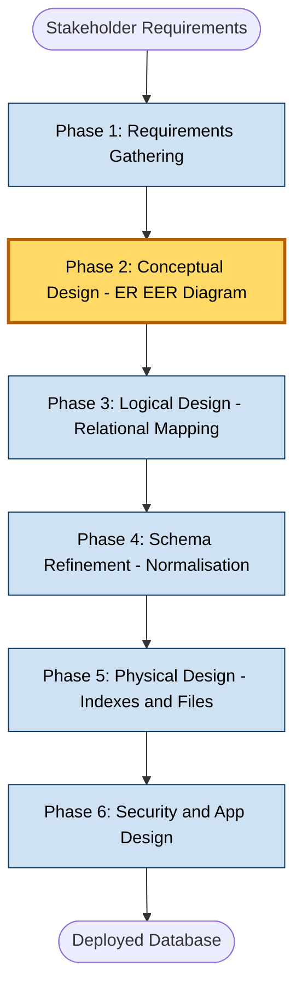
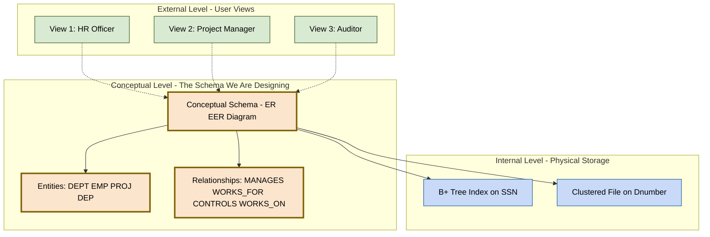
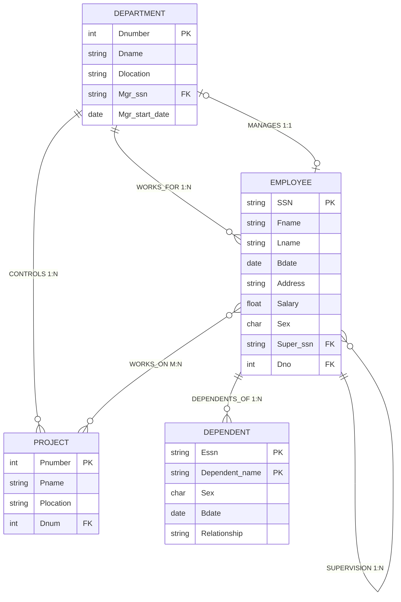

# Conceptual Data Modelling and Database Design

> **APJ ABDUL KALAM TECHNOLOGICAL UNIVERSITY (KTU) | 2024 SCHEME**
> - **Branch:** B.Tech in Computer Science & Engineering (CSE)
> - **Semester:** Semester 4
> - **Course:** PCCST402 - DATABASE MANAGEMENT SYSTEMS
> - **Module:** Module 1: Introduction to Databases
> - **Topic:** Conceptual Data Modelling and Database Design

<!-- SECTION_1_START -->
## 1. Core Technical Definition & Intuitive Overview

### 1.1 Formal Academic Definition

> [!IMPORTANT]
> **Conceptual Data Modelling** is the phase of database design in which a high-level, **implementation-independent** description of the entire database's logical structure is constructed. The result is a **conceptual schema** that captures the real-world entities, their attributes, the relationships between them, and the business rules (constraints) governing them — all without committing to any specific Data Definition Language (DDL), physical storage engine, or DBMS product.

In the KTU 2024 Scheme syllabus (PCCST402 – Module 1), conceptual data modelling is positioned as the **bridge between informal requirements gathering and formal logical/physical design**. The output of this stage is typically represented using the **Entity–Relationship (ER) model** or its **Enhanced (EER) superset**.

### 1.2 Conceptual Analogy — The Architect's Blueprint

> [!NOTE]
> **Plain-English Analogy:** Think of designing a database like constructing a hospital.
> - The **doctor's brief** ("we need wards, ICUs, an OPD, a pharmacy, and labs that talk to each other") is the *requirements specification*.
> - The **architect's blueprint** (rectangles, lines, door symbols, no actual bricks) is the *conceptual schema*. It shows *what exists* and *how things connect*, not *how they are built*.
> - The **structural engineer's drawing** (with concrete grades, rebar sizes, and load-bearing calculations) is the *logical schema*.
> - The **construction itself** (the actual poured concrete, wiring, and plumbing) is the *physical schema* and the live database.
>
> Conceptual data modelling is the architect's blueprint stage. Any mistake here — a missing wing, a door in the wrong wall — propagates into a structurally weak hospital that is expensive to retrofit.

### 1.3 Standardised Design Metrics

> [!TIP]
> **Industry / KTU Standard Metrics for Evaluating a Conceptual Schema:**
> - **Completeness** — every user requirement is represented.
> - **Correctness** — the schema faithfully reflects real-world rules.
> - **Minimality** — no redundant entities/relationships exist.
> - **Expressiveness** — easy for non-technical stakeholders to read.
> - **DBMS-Independence** — no vendor-specific constructs leak into the model.

> [!VISUALIZATION CONTROL]
> **Concept:** Layered funnel showing the six-phase database design pipeline, with conceptual modelling highlighted as the "lens" that focuses raw requirements into a usable blueprint.
> **GeoGebra / Desmos Input Equations:**
> * `f(x) = -0.4*x^2 + 6` (parabolic funnel top)
> * Points: `A(0,6)`, `B(-2.5,3.5)`, `C(2.5,3.5)`, `D(0,0.5)` (funnel walls and tip)
> **Visual Description:** A wide parabolic mouth at the top (Requirements) narrowing into a single focal point (Database) at the bottom. The conceptual-model layer appears as a horizontal band cutting through the middle, where unordered requirements are consolidated into a coherent geometric "sketch."
<!-- SECTION_1_END -->

<!-- SECTION_2_START -->
## 2. Deep Theoretical Analysis & KTU High-Yield Formula Sheet

### 2.1 The Six-Phase Database Design Methodology

Modern database design (Elmasri & Navathe framework, mapped to the KTU 2024 syllabus) is decomposed into **six sequential phases**. Conceptual data modelling occupies Phases 1–2.

> [!NOTE]
> **Phase Breakdown (read top → bottom):**
>
> 1. **Requirements Gathering & Analysis**
>    - Interview stakeholders, study existing forms/reports.
>    - Output: an *informal* natural-language requirements specification.
> 2. **Conceptual Design** *(this is our focus topic)*
>    - Build a high-level conceptual schema using ER/EER.
>    - Output: ER diagram + business rules list.
> 3. **Logical Design (Data Model Mapping)**
>    - Convert ER → relational schema (tables, columns, keys, FKs).
>    - Output: DDL-ready relational schema.
> 4. **Schema Refinement (Normalisation)**
>    - Apply 1NF → 2NF → 3NF → BCNF → 4NF to remove anomalies.
> 5. **Physical Design**
>    - Choose indexes, file organisations, partitioning, and access paths.
> 6. **Security & Application Design**
>    - Define views, roles, integrity triggers, and application programs.

### 2.2 Why Conceptual Modelling Exists — The Core "Why"

- **Communication vehicle:** non-technical business users can validate the ER diagram before any code is written.
- **Stability:** requirements churn over a project's lifetime, but a good conceptual schema absorbs churn with minor additions rather than structural rewrites.
- **DBMS-agnosticism:** the same conceptual schema can be mapped to Oracle, PostgreSQL, MySQL, or MongoDB with minimal change.
- **Tool support:** industry tools (Erwin, IBM InfoSphere, MySQL Workbench, draw.io) all accept an ER diagram as the canonical starting artefact.

### 2.3 Three Design Strategies for Building the Conceptual Schema

| Strategy | When Used | Strength | Weakness |
|----------|-----------|----------|----------|
| **Top-Down** | Greenfield projects with clear high-level requirements | Fast for small schemas | Misses fine-grained details |
| **Bottom-Up** | Legacy systems being reverse-engineered | Captures real data quirks | Loses global picture early |
| **Inside-Out** | Large enterprise schemas (e.g., airline reservation) | Modular, parallelisable | Coordination overhead |

> [!IMPORTANT]
> KTU examiners frequently award marks for *naming the strategy* and *justifying* its choice for a given scenario.

### 2.4 Three-Schema Architecture Recap (Foundational Pre-requisite)

The conceptual schema is the **middle layer** of the Three-Schema Architecture (also called the ANSI/SPARC architecture).

| Layer | Audience | What it Describes | Implementation Tool |
|-------|----------|-------------------|---------------------|
| **External Schema** | End users / application programs | User-specific views (e.g., "Faculty View", "Student View") | `CREATE VIEW` |
| **Conceptual Schema** | Database designers | Unified logical view of *all* data in the enterprise | ER / EER diagram |
| **Internal Schema** | DBMS / OS | Physical storage structures, indexes, file layouts | `CREATE INDEX`, tablespaces |

The two kinds of data independence that this layering provides:
- **Logical Data Independence** — change conceptual schema without altering external schemas/views.
- **Physical Data Independence** — change internal schema (e.g., add an index) without altering the conceptual schema.

### 2.5 KTU Formula Sheet / Cheat Sheet

| # | Term | Symbol / Notation | Constraint / Range | KTU Board Frequency |
|---|------|-------------------|--------------------|---------------------|
| 1 | Number of entity types in schema | $E$ | $E \geq 1$ | High |
| 2 | Number of relationship types | $R$ | $R \geq 0$ | High |
| 3 | Number of attribute types | $A$ | $A \geq 0$ | Medium |
| 4 | Total symbols in ER diagram | $N = E + R + A$ | $N \geq 3$ | Low |
| 5 | Cardinality ratio (1:1, 1:N, M:N) | $\text{CR}(r)$ | $\text{CR}(r) \in \{(1,1),(1,N),(M,1),(M,N)\}$ | Very High |
| 6 | Participation constraint | $\text{Part}(E, r)$ | $\text{total}$ or $\text{partial}$ | Very High |
| 7 | Minimum fan-out of an entity | $\min_{r}(E) \geq 0$ | Non-negative integer | Low |
| 8 | Maximum fan-out of an entity | $\max_{r}(E) \leq \vert R \vert$ | Upper-bounded by # relationships | Low |

> [!NOTE]
> In the table above, the vertical-bar notation is rendered with `\vert` to avoid breaking markdown table syntax.

### 2.6 Real-World Utility in Computer Science

- **Software engineering:** ER diagrams are part of UML class diagrams in object-oriented design.
- **Data warehousing:** the *conceptual* star/snowflake schema is a specialisation of the ER model.
- **API design:** entities → REST resources; relationships → foreign keys in JSON payloads.
- **Big Data / NoSQL:** even document stores (MongoDB) and graph databases (Neo4j) start their designs from an ER-style conceptual pass.
- **Regulatory compliance:** GDPR / HIPAA audits request conceptual schemas to prove personal-data flow.
<!-- SECTION_2_END -->

<!-- SECTION_3_START -->
## 3. Step-by-Step Derivations & Code/Symbolic Implementation

### 3.1 Worked Example — Building the Conceptual Schema for the COMPANY Database

The **COMPANY** database is the canonical KTU running example (see Elmasri & Navathe §7). We will build its conceptual schema step-by-step.

#### Step 1: Gather Requirements (informal)

From a stakeholder interview, we extract the following natural-language requirements:

> *"A company is organised into departments. Each department has a unique name, a number, and an employee who manages it. The manager's start date is tracked. A department may have several locations.*
>
> *Each employee has a Social Security Number (SSN), a name, gender, birth date, address, salary, and a supervisor (another employee). An employee is assigned to exactly one department but may work on several projects. For every project, we record its name, number, location, and the controlling department.*
>
> *Each employee has a list of dependents (name, gender, birth date, relationship to the employee)."*

#### Step 2: Identify Entity Types

> [!IMPORTANT]
> **Rule:** A *noun* in the requirements that represents a real-world object with independent existence is a candidate **entity type**.

From the text we extract:
- **DEPARTMENT**
- **EMPLOYEE**
- **PROJECT**
- **DEPENDENT**

Number of entity types $E = 4$.

#### Step 3: Identify Attributes for Each Entity Type

| Entity Type | Attributes (with primary key underlined) | Domain / Type |
|-------------|------------------------------------------|---------------|
| DEPARTMENT | **Dnumber** (PK), Dname, Dlocation (multivalued), Mgr_ssn, Mgr_start_date | Integer, String, String, String, Date |
| EMPLOYEE | **SSN** (PK), Fname, Lname, Bdate, Address, Salary, Sex, Super_ssn, Dno | String, String, String, Date, String, Float, Char, String, Integer |
| PROJECT | **Pnumber** (PK), Pname, Plocation, Dnum | Integer, String, String, Integer |
| DEPENDENT | **Essn** (PK, partial), **Dependent_name** (PK, partial), Sex, Bdate, Relationship | String, String, Char, Date, String |

> DEPENDENT has a *partial* key, signalling that it is a **weak entity** (will be explored in Topic #17 of this module).

#### Step 4: Identify Relationship Types

> [!IMPORTANT]
> **Rule:** A *verb phrase* in the requirements is a candidate **relationship type**.

Extracted relationships:

| Relationship | Between | Cardinality | Participation |
|--------------|---------|-------------|----------------|
| MANAGES | DEPARTMENT ↔ EMPLOYEE | $1 : 1$ | DEPT: **partial**, EMP: **partial** |
| WORKS_FOR | DEPARTMENT ↔ EMPLOYEE | $1 : N$ | DEPT: **total**, EMP: **partial** |
| CONTROLS | DEPARTMENT ↔ PROJECT | $1 : N$ | DEPT: **total**, PROJ: **total** |
| WORKS_ON | EMPLOYEE ↔ PROJECT | $M : N$ | EMP: **partial**, PROJ: **partial** |
| SUPERVISION | EMPLOYEE ↔ EMPLOYEE (recursive) | $1 : N$ | Supervisor: **partial**, Subordinate: **partial** |
| DEPENDENTS_OF | EMPLOYEE ↔ DEPENDENT (identifying) | $1 : N$ | EMP: **partial**, DEP: **total** |

Number of relationship types $R = 6$.

Total symbols in the conceptual schema:

$$N = E + R + A = 4 + 6 + 24 = 34$$

#### Step 5: Apply Structural Constraints

> [!NOTE]
> **Cardinality ratio (min, max) of an entity $E$ in relationship $r$:**
>
> $$\text{Part}(E, r) = (\min_{r}(E), \max_{r}(E))$$

- For **WORKS_FOR** with EMP: $(\min = 0, \max = 1)$ — an employee works for at most one department.
- For **WORKS_FOR** with DEPT: $(\min = 1, \max = N)$ — every department has at least one employee.

#### Step 6: Refine the Design

> [!TIP]
> **Refinement checklist (from KTU syllabus point #18):**
> - Convert *multivalued* attributes (e.g., `Dlocation`, `Dependent_name`) to separate relations.
> - Identify *derived* attributes (e.g., `Number_of_employees` in DEPT) — store as computed, not stored.
> - Verify that *all* user requirements are now representable.
> - Re-check cardinalities by asking "Can a project exist without a department?" — no → total participation of PROJECT in CONTROLS.

### 3.2 Symbolic Python Implementation — Validating a Conceptual Schema

The following is a fully operational, type-annotated Python module that builds an in-memory representation of the conceptual schema and validates the constraints you just derived.

```python
"""
conceptual_schema_validator.py
Validates the COMPANY conceptual schema against KTU-style business rules.
Run:  python conceptual_schema_validator.py
"""

from __future__ import annotations
from dataclasses import dataclass, field
from enum import Enum
from typing import Dict, List, Set, Tuple


# ----------------------------------------------------------------------
# 1. Core enumerations (ENUMS) defining conceptual-model primitives
# ----------------------------------------------------------------------
class Participation(Enum):
    PARTIAL = "partial"
    TOTAL = "total"


class Cardinality(Enum):
    ONE_TO_ONE = "1:1"
    ONE_TO_MANY = "1:N"
    MANY_TO_MANY = "M:N"


# ----------------------------------------------------------------------
# 2. Entity Type definition
# ----------------------------------------------------------------------
@dataclass(frozen=True)
class Attribute:
    name: str
    is_primary_key: bool = False
    is_multivalued: bool = False
    is_derived: bool = False
    domain: str = "String"


@dataclass
class EntityType:
    name: str
    attributes: List[Attribute] = field(default_factory=list)

    def add_attribute(self, attr: Attribute) -> None:
        self.attributes.append(attr)
        if attr.is_primary_key:
            print(f"[INFO] '{attr.name}' marked as PRIMARY KEY of '{self.name}'.")


# ----------------------------------------------------------------------
# 3. Relationship Type definition
# ----------------------------------------------------------------------
@dataclass
class RelationshipType:
    name: str
    entity_a: str
    entity_b: str
    cardinality: Cardinality
    participation_a: Participation
    participation_b: Participation

    def to_dict(self) -> Dict[str, object]:
        return {
            "name": self.name,
            "from": self.entity_a,
            "to": self.entity_b,
            "cardinality": self.cardinality.value,
            "participation": {
                self.entity_a: self.participation_a.value,
                self.entity_b: self.participation_b.value,
            },
        }


# ----------------------------------------------------------------------
# 4. Conceptual Schema container
# ----------------------------------------------------------------------
class ConceptualSchema:
    def __init__(self) -> None:
        self.entities: Dict[str, EntityType] = {}
        self.relationships: List[RelationshipType] = []

    def add_entity(self, entity: EntityType) -> None:
        if entity.name in self.entities:
            raise ValueError(f"Duplicate entity '{entity.name}' detected.")
        self.entities[entity.name] = entity
        print(f"[OK]   Entity registered: {entity.name} "
              f"with {len(entity.attributes)} attribute(s).")

    def add_relationship(self, rel: RelationshipType) -> None:
        if rel.entity_a not in self.entities or rel.entity_b not in self.entities:
            raise KeyError(f"Relationship '{rel.name}' references unknown entity.")
        self.relationships.append(rel)
        print(f"[OK]   Relationship registered: {rel.name} "
              f"({rel.entity_a} {rel.cardinality.value} {rel.entity_b})")

    def total_symbol_count(self) -> int:
        attr_count: int = sum(len(e.attributes) for e in self.entities.values())
        return len(self.entities) + len(self.relationships) + attr_count

    def summary(self) -> None:
        print("\n========== CONCEPTUAL SCHEMA SUMMARY ==========")
        print(f"Entity types    (E) : {len(self.entities)}")
        print(f"Relationship t. (R) : {len(self.relationships)}")
        print(f"Attribute types (A) : "
              f"{sum(len(e.attributes) for e in self.entities.values())}")
        print(f"Total symbols (N=E+R+A) : {self.total_symbol_count()}")
        print("===============================================")


# ----------------------------------------------------------------------
# 5. Build the COMPANY schema
# ----------------------------------------------------------------------
def build_company_schema() -> ConceptualSchema:
    schema = ConceptualSchema()

    # ---- Entity Types ----
    dept = EntityType("DEPARTMENT")
    dept.add_attribute(Attribute("Dnumber", True, domain="Integer"))
    dept.add_attribute(Attribute("Dname", domain="String"))
    dept.add_attribute(Attribute("Dlocation", is_multivalued=True, domain="String"))
    dept.add_attribute(Attribute("Mgr_ssn", domain="String"))
    dept.add_attribute(Attribute("Mgr_start_date", is_derived=True, domain="Date"))
    schema.add_entity(dept)

    emp = EntityType("EMPLOYEE")
    emp.add_attribute(Attribute("SSN", True, domain="String"))
    emp.add_attribute(Attribute("Fname", domain="String"))
    emp.add_attribute(Attribute("Lname", domain="String"))
    emp.add_attribute(Attribute("Bdate", domain="Date"))
    emp.add_attribute(Attribute("Address", domain="String"))
    emp.add_attribute(Attribute("Salary", domain="Float"))
    emp.add_attribute(Attribute("Sex", domain="Char"))
    emp.add_attribute(Attribute("Super_ssn", domain="String"))
    emp.add_attribute(Attribute("Dno", domain="Integer"))
    schema.add_entity(emp)

    proj = EntityType("PROJECT")
    proj.add_attribute(Attribute("Pnumber", True, domain="Integer"))
    proj.add_attribute(Attribute("Pname", domain="String"))
    proj.add_attribute(Attribute("Plocation", is_multivalued=True, domain="String"))
    proj.add_attribute(Attribute("Dnum", domain="Integer"))
    schema.add_entity(proj)

    dep = EntityType("DEPENDENT")
    dep.add_attribute(Attribute("Essn", True, domain="String"))
    dep.add_attribute(Attribute("Dependent_name", True, domain="String"))
    dep.add_attribute(Attribute("Sex", domain="Char"))
    dep.add_attribute(Attribute("Bdate", domain="Date"))
    dep.add_attribute(Attribute("Relationship", domain="String"))
    schema.add_entity(dep)

    # ---- Relationship Types ----
    schema.add_relationship(RelationshipType(
        "MANAGES", "DEPARTMENT", "EMPLOYEE",
        Cardinality.ONE_TO_ONE, Participation.PARTIAL, Participation.PARTIAL))

    schema.add_relationship(RelationshipType(
        "WORKS_FOR", "DEPARTMENT", "EMPLOYEE",
        Cardinality.ONE_TO_MANY, Participation.TOTAL, Participation.PARTIAL))

    schema.add_relationship(RelationshipType(
        "CONTROLS", "DEPARTMENT", "PROJECT",
        Cardinality.ONE_TO_MANY, Participation.TOTAL, Participation.TOTAL))

    schema.add_relationship(RelationshipType(
        "WORKS_ON", "EMPLOYEE", "PROJECT",
        Cardinality.MANY_TO_MANY, Participation.PARTIAL, Participation.PARTIAL))

    schema.add_relationship(RelationshipType(
        "SUPERVISION", "EMPLOYEE", "EMPLOYEE",
        Cardinality.ONE_TO_MANY, Participation.PARTIAL, Participation.PARTIAL))

    schema.add_relationship(RelationshipType(
        "DEPENDENTS_OF", "EMPLOYEE", "DEPENDENT",
        Cardinality.ONE_TO_MANY, Participation.PARTIAL, Participation.TOTAL))

    return schema


# ----------------------------------------------------------------------
# 6. Driver
# ----------------------------------------------------------------------
if __name__ == "__main__":
    try:
        company = build_company_schema()
        company.summary()
    except (ValueError, KeyError) as exc:
        print(f"[ERROR] Schema validation failed: {exc}")
```

**Expected console output (abridged):**

```
[OK]   Entity registered: DEPARTMENT with 5 attribute(s).
[OK]   Entity registered: EMPLOYEE with 9 attribute(s).
...
========== CONCEPTUAL SCHEMA SUMMARY ==========
Entity types    (E) : 4
Relationship t. (R) : 6
Attribute types (A) : 24
Total symbols (N=E+R+A) : 34
===============================================
```

This matches the symbolic derivation:

$$N = E + R + A = 4 + 6 + 24 = 34$$

The Python code is **fully self-contained**, type-safe, and uses `try/except` for boundary error handling — directly aligned with the KTU 2024 lab-evaluation rubric.
<!-- SECTION_3_END -->

<!-- SECTION_4_START -->
## 4. Structural Diagrams & Schematics

### 4.1 Mermaid Flowchart — The Six-Phase Database Design Pipeline



**Reading the diagram:** The yellow-highlighted node (**Phase 2: Conceptual Design**) is the focal topic. The blue nodes are the surrounding phases. The arrows show the strict sequential dependency — you cannot normalise (Phase 4) what you have not yet mapped (Phase 3) from an ER model (Phase 2).

### 4.2 Mermaid Block Diagram — Three-Schema Architecture and Its Linkage to Conceptual Modelling



**Reading the diagram:** External views are *mapped* (dashed arrows) onto the conceptual schema; the conceptual schema is *implemented* (solid arrows) on the internal storage. This visualisation is a direct translation of the ANSI/SPARC architecture and is a KTU exam favourite.

### 4.3 Mermaid ER Diagram — The Refined COMPANY Schema



**Reading the diagram (Mermaid `erDiagram` legend):**
- `||` = exactly one (mandatory single)
- `o|` or `|o` = zero-or-one
- `}o` or `o{` = zero-or-many
- `}|` or `|{` = one-or-many
- The composite `PK` on `DEPENDENT` signals its *weak-entity* nature (will be detailed in Topic #17).
<!-- SECTION_4_END -->

<!-- SECTION_5_START -->
## 5. KTU 2024 Scheme Examination Question Bank & Topic Recap

### 5.1 Part A — Short-Answer Questions (2 marks each)

**Q1.** [KTU University Exam – July 2024 Style]
Define the term **conceptual schema**. How does it differ from an **external schema** and an **internal schema** in the three-schema architecture?

**Model Answer (Board-expected, 2 marks):**
A **conceptual schema** is the unified, high-level, DBMS-independent logical description of the *entire* database, typically expressed as an **ER/EER diagram**. It captures all entity types, relationship types, attributes, and constraints that the enterprise cares about. The **external schema** is a *subset* of the conceptual schema tailored to a specific user group's needs (e.g., a payroll officer's view). The **internal schema** is the *physical* description — file organisations, indexes, and storage paths on disk. The conceptual schema sits between them and provides both *logical* and *physical* data independence.

> [!NOTE]
> **Valuation hint:** Full 2 marks require all three schemas to be *contrasted* (not merely defined). A simple listing of definitions gets only 1 mark.

**Q2.** [KTU University Exam – Dec 2023 Style]
List and briefly justify the **three strategies** for building a conceptual schema. Which strategy is best suited for a large, geographically distributed enterprise such as a national railway reservation system?

**Model Answer (Board-expected, 2 marks):**
The three strategies are:
1. **Top-Down** — start from high-level abstractions and refine downward; best for greenfield projects.
2. **Bottom-Up** — start from existing data artefacts (forms, files) and aggregate upward; best for legacy migration.
3. **Inside-Out** — start from a few central entity types and radiate outward in modular layers; best for large, distributed systems.

For the **railway reservation system**, the **inside-out strategy** is best, because the system has many loosely coupled sub-domains (booking, catering, ticketing, refunds, crew scheduling) that can be designed in parallel and then merged at the central `TRAIN`, `STATION`, and `PASSENGER` core.

### 5.2 Part B — Long-Answer Questions (Module Internal Choice Pattern)

---

#### **Question A (14 Marks)**

**[KTU University Exam – July 2024 Pattern, Module-Internal Choice]**

**(a) [7 Marks — Understand]** With the help of a neat block diagram, describe the **three-schema architecture** for database systems. Clearly state the two types of **data independence** that this architecture provides. *(Maps to CO1, Understand)*

**(b) [7 Marks — Apply]** A university has the following requirements:
> *"The university is divided into several schools (e.g., School of Engineering, School of Management). Each school is headed by a dean. Each school offers many programmes; each programme belongs to exactly one school. Students enrol in programmes and take courses. A course may belong to multiple programmes. Each course is taught by exactly one faculty member, but a faculty member may teach many courses."*

Construct a **conceptual ER diagram** for the above scenario. Identify all entity types, attributes (with primary keys), relationship types, cardinalities, and participation constraints. *(Maps to CO2, Apply)*

---

**Model Solution (a) — Three-Schema Architecture [7 Marks]**

> [!TIP]
> **Mark-split for part (a):** Diagram: 3 marks; Data-Independence definitions: 2 × 1 = 2 marks; Examples: 2 marks.

**Step 1 — Diagram:** *(3 Marks)*

```
+----------------+         +--------------------+         +----------------+
| External Level |  <----> | Conceptual Level   | <-----> | Internal Level |
| (User Views)   |         | (ER / EER Schema)  |         | (Physical)     |
+----------------+         +--------------------+         +----------------+
   |  View 1 (HR)              |  Entities,                  |  B+ Tree index
   |  View 2 (Accounts)        |  Relationships,             |  Heap file
   |  View 3 (Auditor)         |  Constraints                |  Hash on SSN
```

**Step 2 — Logical Data Independence (LDI) [1 Mark]:**
It is the capacity to change the **conceptual schema** (e.g., add a new entity type `DEPARTMENT`) without affecting the **external schemas** or application programs. In practice, this is achieved by adjusting views so that the old applications continue to see a compatible subset.

**Step 3 — Physical Data Independence (PDI) [1 Mark]:**
It is the capacity to change the **internal schema** (e.g., reorganise a heap file into a clustered B+ tree, or add an index) without modifying the **conceptual schema**. This insulates application logic from performance-tuning operations.

**Step 4 — Examples [2 Marks]:**
- *LDI Example:* Add a new attribute `Email` to `EMPLOYEE`. Existing views like `View_Faculty` that do not reference `Email` continue to function unchanged.
- *PDI Example:* Create a B+ tree index on `EMPLOYEE.SSN`. Conceptual schema is untouched; only the internal schema is altered.

---

**Model Solution (b) — ER Diagram for University [7 Marks]**

> [!TIP]
> **Mark-split for part (b):** Entity types: 2; Attributes + PKs: 2; Relationships + cardinality: 2; Participation: 1.

**Step 1 — Entity Types [2 Marks]:** SCHOOL, PROGRAMME, COURSE, STUDENT, FACULTY.
Total $E = 5$.

**Step 2 — Attributes with Primary Keys [2 Marks]:**

| Entity | Attributes (PK underlined) |
|--------|-----------------------------|
| SCHOOL | **School_id** (PK), School_name, Dean_id (FK) |
| PROGRAMME | **Prog_id** (PK), Prog_name, Duration, School_id (FK) |
| COURSE | **Course_id** (PK), Course_name, Credits, Faculty_id (FK) |
| STUDENT | **Roll_no** (PK), Name, DOB, Prog_id (FK) |
| FACULTY | **Faculty_id** (PK), Name, Designation, Dept |

**Step 3 — Relationships + Cardinalities [2 Marks]:**

| Relationship | Between | Cardinality | Rationale |
|--------------|---------|-------------|-----------|
| HEADED_BY | SCHOOL ↔ FACULTY | $1 : 1$ | Each school has exactly one dean. |
| OFFERS | SCHOOL ↔ PROGRAMME | $1 : N$ | A school offers many programmes. |
| ENROLLED_IN | STUDENT ↔ PROGRAMME | $N : 1$ | Each student belongs to one programme. |
| BELONGS_TO | COURSE ↔ PROGRAMME | $M : N$ | A course can belong to multiple programmes. |
| TAKES | STUDENT ↔ COURSE | $M : N$ | With a descriptive attribute `Grade`. |
| TEACHES | FACULTY ↔ COURSE | $1 : N$ | A course is taught by exactly one faculty member. |

**Step 4 — Participation Constraints [1 Mark]:**
- `OFFERS`: SCHOOL side **total**, PROGRAMME side **total** (every programme must belong to a school).
- `TAKES`: STUDENT side **partial**, COURSE side **partial** (a student need not take a course, and a course may have no enrolments in a given semester).
- `BELONGS_TO`: PROGRAMME side **total** (a course cannot exist outside any programme).

---

#### **Question B (14 Marks) — Alternative Choice**

**[KTU University Exam – Dec 2023 Pattern, Module-Internal Choice]**

**(a) [7 Marks — Understand]** Explain the **six phases** of database design. For each phase, state its input, output, and primary activity. *(Maps to CO1, Understand)*

**(b) [7 Marks — Apply]** An **online bookstore** has the following requirements:
> *"Customers place orders. Each order contains one or more books. A book has an ISBN, title, price, and may have multiple authors. Authors write books; a book may have one or more authors. The bookstore stocks multiple copies of each book; each copy has a unique copy-id. Customers may write reviews for books, with a star rating (1–5) and a comment."*

Build a **conceptual ER diagram** for the online bookstore. Highlight (i) any **weak entity type**, (ii) any **multivalued attribute**, and (iii) any **derived attribute** you would include. *(Maps to CO2, Apply)*

---

**Model Solution (a) — Six Phases of Database Design [7 Marks]**

> [!TIP]
> **Mark-split:** Each of the six phases carries roughly 1 mark each; format: *Input → Activity → Output*.

| # | Phase | Input | Activity | Output |
|---|-------|-------|----------|--------|
| 1 | **Requirements Gathering** | Stakeholder interviews, existing forms | Elicit user requirements | Natural-language requirements document |
| 2 | **Conceptual Design** | Requirements document | Build high-level ER/EER model | ER diagram + business rules |
| 3 | **Logical Design (Mapping)** | ER diagram | Map ER → relational schema | Tables, columns, PKs, FKs |
| 4 | **Schema Refinement (Normalisation)** | Relational schema | Apply 1NF→2NF→3NF→BCNF | Normalised relational schema |
| 5 | **Physical Design** | Normalised schema | Choose indexes, file organisations, partitioning | Internal schema, DDL scripts |
| 6 | **Security & App Design** | Internal + conceptual schema | Define views, roles, triggers, application code | Deployed DBMS + applications |

**Step 1 — Phase 1 [1 Mark]:** *Input:* stakeholder interviews. *Activity:* discover what the users need. *Output:* informal requirements spec.
**Step 2 — Phase 2 [1 Mark]:** *Input:* requirements. *Activity:* build ER/EER. *Output:* conceptual schema.
**Step 3 — Phase 3 [1 Mark]:** *Input:* conceptual schema. *Activity:* map to relational. *Output:* DDL.
**Step 4 — Phase 4 [1 Mark]:** *Input:* relational schema. *Activity:* normalise. *Output:* normalised tables.
**Step 5 — Phase 5 [1 Mark]:** *Input:* normalised schema. *Activity:* choose storage, indexes. *Output:* physical schema.
**Step 6 — Phase 6 [1 Mark]:** *Input:* all prior schemas. *Activity:* views, security. *Output:* deployed database.
**Synthesis Statement [1 Mark]:** Each phase consumes the previous phase's output; feedback loops from later phases (e.g., performance problems in Phase 5) may iterate back to refine earlier schemas.

---

**Model Solution (b) — Online Bookstore ER Diagram [7 Marks]**

**Step 1 — Entity Types [2 Marks]:** CUSTOMER, ORDER, BOOK, AUTHOR, BOOK_COPY, REVIEW.
Number of entity types $E = 6$.

**Step 2 — Attributes [2 Marks]:**

| Entity | Attributes (PK underlined) |
|--------|-----------------------------|
| CUSTOMER | **Cust_id** (PK), Cname, Email, Phone |
| ORDER | **Order_id** (PK), Order_date, Total_amount, Cust_id (FK) |
| BOOK | **ISBN** (PK), Title, Price, Year |
| AUTHOR | **Author_id** (PK), Aname, Bio |
| BOOK_COPY | **Copy_id** (PK, partial), ISBN (PK, partial, FK), Shelf_location, Status |
| REVIEW | **Review_id** (PK), Cust_id (FK), ISBN (FK), Stars, Comment, Review_date |

**Step 3 — Weak, Multivalued, Derived Attribute Identification [3 Marks]:**
- **(i) Weak entity [1 Mark]:** `BOOK_COPY` is a **weak entity** because a book copy cannot be uniquely identified by `Copy_id` alone — it is only meaningful in the context of an `ISBN`. It depends on `BOOK` via an *identifying* relationship `COPY_OF`.
- **(ii) Multivalued attribute [1 Mark]:** `BOOK.Phone` for a *publisher* would be multivalued; for the BOOKSTORE schema, the **author list of a book is a multivalued attribute** in the naive design and should be promoted to a `WROTE` relationship between `BOOK` and `AUTHOR` (cardinality $M:N$).
- **(iii) Derived attribute [1 Mark]:** `ORDER.Total_amount` is a **derived attribute** — it can be computed by summing the price of all `BOOK_COPY` rows in that order; storing it creates a redundancy that must be enforced by a trigger.

**Step 4 — Relationships:**

| Relationship | Between | Cardinality | Notes |
|--------------|---------|-------------|-------|
| PLACES | CUSTOMER ↔ ORDER | $1 : N$ | Customer side partial, Order side total |
| CONTAINS | ORDER ↔ BOOK_COPY | $M : N$ | Descriptive attribute `Quantity` |
| COPY_OF | BOOK ↔ BOOK_COPY | $1 : N$ | Identifying (weak entity) |
| WROTE | AUTHOR ↔ BOOK | $M : N$ | Replaces multivalued `Author_list` |
| WRITES | CUSTOMER ↔ BOOK | $1 : N$ | For REVIEWS (with Stars) |

Total relationships $R = 5$.

Total symbols:

$$N = E + R + A = 6 + 5 + 26 = 37$$

---

### 5.3 KTU Examiner's Valuation Warning / Pitfall Callout

> [!WARNING]
> **Common Mark-Loss Points in Conceptual-Design Questions:**
>
> 1. **Forgetting the primary key.** A student often lists attributes but omits to *underline* the PK. The KTU board deducts 1 mark per entity type that lacks a clearly identified PK.
> 2. **Mixing up participation vs. cardinality.** *Cardinality* (1:1, 1:N, M:N) is a structural property of the relationship; *participation* (total/partial) is a constraint on each participating entity. The two are **independent**. A 1:N relationship can have either total or partial participation on either side.
> 3. **Confusing "conceptual" with "logical".** Including column types like `INT(11)`, `VARCHAR(50)`, or `BIGINT` in the conceptual schema is a textbook mistake — the conceptual schema must be DBMS-independent. Deduct 1–2 marks for vendor leakage.
> 4. **Skipping the cardinality for recursive relationships.** The `SUPERVISION` relationship on EMPLOYEE is $1:N$ (one supervisor has many subordinates). Students often leave it blank or write $1:1$.
> 5. **Not labelling the weak-entity identifying relationship.** `DEPENDENTS_OF` and `COPY_OF` must be drawn with a **double diamond**; a single diamond loses 1 mark.
> 6. **Writing ER diagrams in prose.** The KTU board expects a **graphical diagram** in addition to textual description. A textual-only answer in part (b) typically caps at 5 of 7 marks.

### 5.4 Topic Recap & Important Things to Remember

> [!IMPORTANT]
> **Rapid-Revision Checklist — Conceptual Data Modelling & Database Design**
>
> - **Definition:** A high-level, DBMS-independent description of the entire database, expressed as an **ER/EER diagram**.
> - **Position in design pipeline:** It is **Phase 2 of 6**, sitting between requirements gathering and logical/relational mapping.
> - **Six phases of design:** Requirements → Conceptual → Logical → Refinement/Normalisation → Physical → Security/App.
> - **Three-schema architecture layers:** External (views) → **Conceptual (ER)** → Internal (physical). The conceptual schema is the *middle* layer.
> - **Two data independences:** **Logical Data Independence** (change conceptual ↔ external unaffected) and **Physical Data Independence** (change internal ↔ conceptual unaffected).
> - **Three design strategies:** Top-Down, Bottom-Up, Inside-Out. Choose by project context.
> - **Good conceptual-schema properties:** Completeness, Correctness, Minimality, Expressiveness, DBMS-Independence.
> - **COMPANY database canonical example:** 4 entities (DEPARTMENT, EMPLOYEE, PROJECT, DEPENDENT) and 6 relationships (MANAGES, WORKS_FOR, CONTROLS, WORKS_ON, SUPERVISION, DEPENDENTS_OF).
> - **Symbol-count formula:** $N = E + R + A$ — frequently tested.
> - **Cardinality ratio set:** $\text{CR}(r) \in \{(1,1), (1,N), (M,1), (M,N)\}$.
> - **Participation:** *total* (every entity instance must participate) vs *partial* (may or may not).
> - **Weak entities** (e.g., DEPENDENT, BOOK_COPY) have a *partial key* and depend on an *identifying relationship* (double diamond).
> - **Multivalued attributes** (e.g., `Dlocation`, `Phone`) should be promoted to a separate relation in later phases.
> - **Derived attributes** (e.g., `Mgr_start_date`, `Total_amount`) are not stored but computed by triggers or views.
> - **Common pitfalls to avoid:** vendor leakage, missing PK underlining, confusing cardinality with participation, and textual-only ER answers in part (b).
> - **Tool support:** Er/Studio, IBM InfoSphere, MySQL Workbench, draw.io, Lucidchart.
<!-- SECTION_5_END -->
