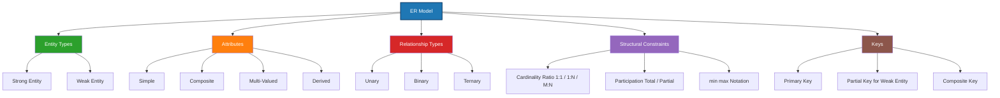
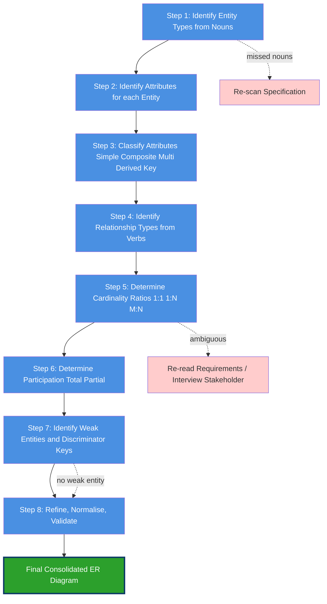
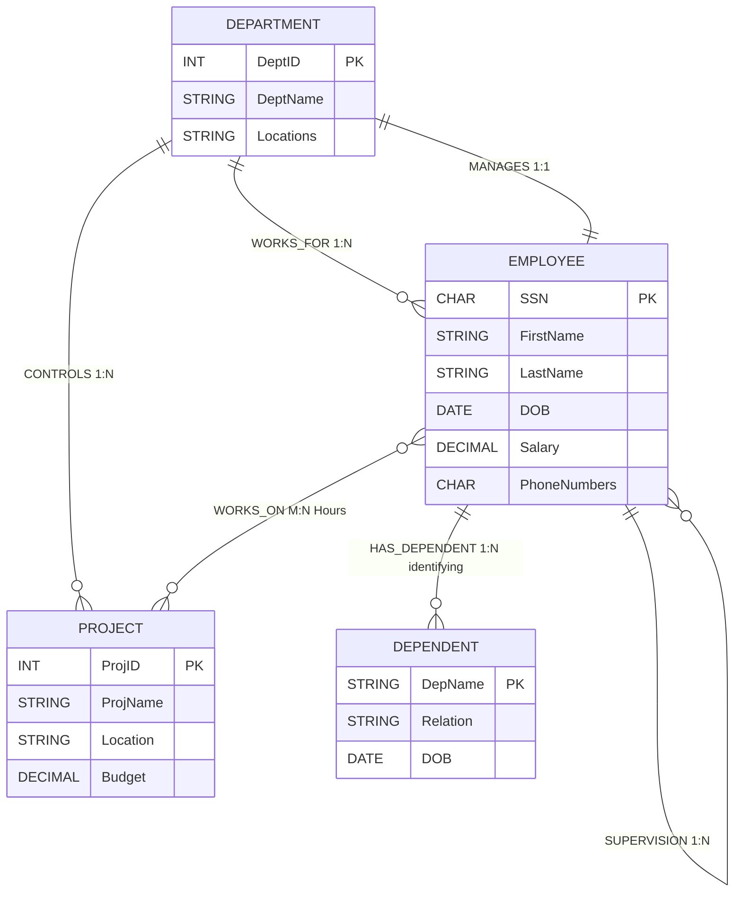
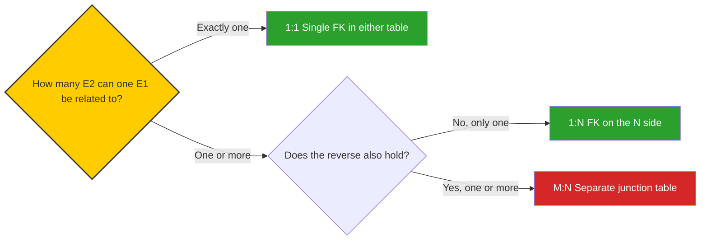
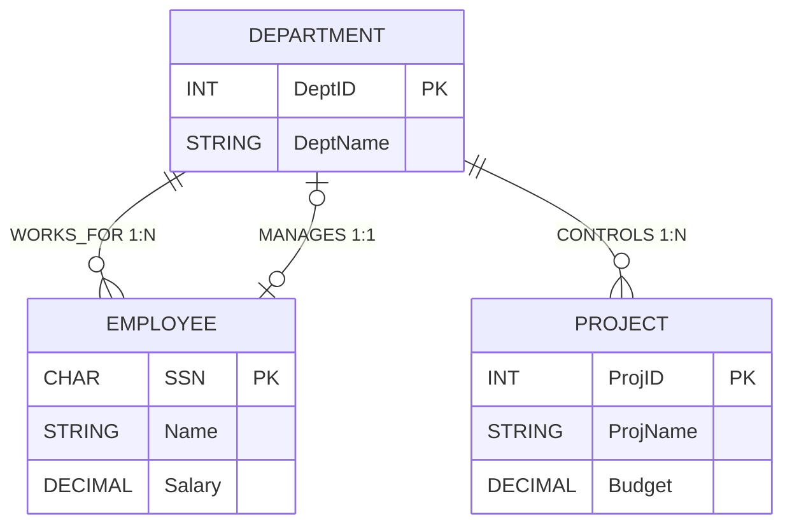

# Data Modelling Using the Entity Relationship (ER) Model

> **APJ ABDUL KALAM TECHNOLOGICAL UNIVERSITY (KTU) | 2024 SCHEME**
> - **Branch:** B.Tech in Computer Science & Engineering (CSE)
> - **Semester:** Semester 4
> - **Course:** PCCST402 - DATABASE MANAGEMENT SYSTEMS
> - **Module:** Module 1: Introduction to Databases
> - **Topic:** Data Modelling Using the Entity Relationship (ER) Model

<!-- SECTION_1_START -->

# 1. Core Technical Definition & Intuitive Overview

## 1.1 Formal Academic Definition

> [!IMPORTANT]
> **Entity-Relationship (ER) Model:** A high-level, **conceptual data model** introduced by **Peter Pin-Shan Chen in 1976** in his seminal paper *"The Entity-Relationship Model—Toward a Unified View of Data"*. The ER Model describes a database schema as a collection of three basic conceptual primitives: **entity types**, **attributes**, and **relationship types**, augmented by **structural constraints** and **keys**. It serves as the de-facto standard for **semantic data modelling** in the conceptual design phase of a database, acting as a *formal blueprint* that abstracts real-world mini-worlds into precise diagrammatic form before any physical implementation.

The model captures the **logical structure** of data — *what* exists in the mini-world, *what* properties each real-world object holds, and *how* objects are semantically associated — without committing to any physical storage detail (file, page, index, access path). It is the foundation of modern **CASE (Computer-Aided Software Engineering)** tools, **UML class diagrams**, and **object-relational mapping (ORM)** frameworks.

## 1.2 The Three Pillars of the ER Model

| Pillar | Symbol | Role in Mini-World |
|:---:|:---:|:---|
| **Entity** | Rectangle | A *thing* (object) that exists independently and is distinguishable. |
| **Attribute** | Oval / Ellipse | A *property* that describes an entity or relationship. |
| **Relationship** | Diamond | A *semantic association* among two or more entities. |

> [!NOTE]
> **Key Distinction (KTU Board Hot-Spot):**
> - **Entity Type** = the *concept / class / template* (e.g., *STUDENT*).
> - **Entity Set** = the *collection of all entity instances at a point in time* (e.g., all registered students in Sem 4 today).
> - A common student error is to use these terms interchangeably. The examiner will deduct marks.

## 1.3 Intuitive Real-World Analogy — *The Architectural Blueprint*

> [!TIP]
> **Analogy — Building a House (Conceptual vs Physical Design):**
> Think of designing a house. An **architect's blueprint** does not show bricks, cement bags, or wiring — it shows *rooms (entities)*, *room dimensions (attributes)*, and *doorways connecting rooms (relationships)*. The blueprint is to the house what the **ER Diagram** is to the **database**.
>
> - The **architect's blueprint** $\approx$ **ER Diagram** (conceptual schema, what to build).
> - The **contractor's construction plan with materials** $\approx$ **Relational Schema in SQL** (logical schema, how to build it in tables).
> - The **finished house** $\approx$ **Physical database with actual data rows** (internal/external schema, the running system).
>
> You would *never* ask the architect to weld steel beams directly; likewise, you must not jump from a vague idea straight to `CREATE TABLE` SQL. The ER Model is the indispensable conceptual bridge.

## 1.4 Geometric Intuition — The Design-Space Manifold

While the ER Model is primarily *discrete and set-theoretic*, the **design space** itself can be visualized as a 2-D lattice where the horizontal axis enumerates **Entity Types** and the vertical axis enumerates **Relationship Types**. Every design decision in ER modelling occupies a cell $(E_i, R_j)$ in this lattice.

> [!VISUALIZATION CONTROL]
> **Concept:** ER Design-Space Lattice
> **GeoGebra / Desmos Input Equations:**
> * `f(x, y) = floor(x) + floor(y) * N` &nbsp; (cell-index function over entity-axis $x$ and relationship-axis $y$)
> * Point $A = (1, 1)$ — *STUDENT $\times$ ENROLLED\_IN*
> * Point $B = (2, 3)$ — *COURSE $\times$ PREREQUISITE\_OF*
> **Visual Description:** A grid where the $x$-axis lists entity types ($E_1, E_2, \ldots, E_n$) and the $y$-axis lists relationship types ($R_1, R_2, \ldots, R_m$). Every populated cell $(E_i, R_j)$ indicates that entity type $E_i$ participates in relationship $R_j$. Diagonal patterns reveal **recursive (unary)** relationships when $i = j$.

## 1.5 Why the ER Model is the Industry Standard

> [!IMPORTANT]
> The ER Model is preferred over direct relational design because it:
> 1. **Communicates semantics** to *non-technical stakeholders* unambiguously.
> 2. **Eliminates redundancy** at the design stage itself (via normalisation awareness).
> 3. **Is notation-agnostic** — supports Chen's notation, Crow's Foot, Bachman, Min-Max, and UML.
> 4. **Maps algorithmically** to relational, object-oriented, XML, JSON-Schema, and NoSQL (document/column) targets.
> 5. **Survives requirement changes** — refining an ER diagram is orders of magnitude cheaper than refactoring a live production database.

<!-- SECTION_1_END -->

<!-- SECTION_2_START -->

# 2. Deep Theoretical Analysis & KTU High-Yield Formula Sheet

## 2.1 The Three Primitives in Depth

### 2.1.1 Entity Types & Entity Sets

An **entity** is a real-world object with **independent existence** and **identifiability**. Formally:

$$
E = \{ e_1, e_2, e_3, \ldots, e_n \}
$$

where each $e_i$ is an *entity instance*. The **entity type** is the *intensional definition* (schema), while the **entity set** is the *extensional collection* (current population).

**Concrete vs Abstract Entities:**

| Category | Example | Verifiability |
|:---|:---|:---|
| **Concrete (Physical)** | Student, Book, Car, ATM | Can be touched / sensed |
| **Abstract (Conceptual)** | Course, Loan, Account, Job | Exists logically, not physically |

> [!NOTE]
> **Naming Convention:** Entity types are written in **UPPERCASE SINGULAR** in the KTU syllabus: `STUDENT`, `EMPLOYEE`, `DEPARTMENT`, `PROJECT`. Pluralising is a mark-losing error.

### 2.1.2 Attributes — The Five Orthogonal Classifications

The ER Model classifies attributes along **two independent dimensions** (a $2 \times 2 + 1$ design matrix):

| Dimension | Type 1 | Type 2 |
|:---|:---|:---|
| **Composition** | *Simple / Atomic* (e.g., `Age`, `SSN`) | *Composite* (e.g., `Name` $\rightarrow$ `First`, `Middle`, `Last`) |
| **Cardinality** | *Single-Valued* (e.g., `DOB`) | *Multi-Valued* (e.g., `PhoneNumbers`, `Degrees`) |
| *(Orthogonal)* | **Derived** attribute (e.g., `Age` from `DOB`) | — |

Additionally, an attribute may be designated as a **Key Attribute** (underlined in the diagram):

$$
\text{Key}(E) \subseteq \text{Attrs}(E) \quad \text{such that} \quad \forall e_1, e_2 \in E,\; \text{Key}(e_1) = \text{Key}(e_2) \implies e_1 = e_2
$$

**Five Attribute Categories — Summary Table:**

| # | Category | Symbol in Diagram | ER Notation | Example |
|:---:|:---|:---:|:---|:---|
| 1 | **Simple / Atomic** | Plain oval | `Age` | 23 |
| 2 | **Composite** | Oval with sub-ovals | `Address` $\to$ Street, City, Pin |  |
| 3 | **Multi-valued** | Double oval | `PhoneNumbers` | {9876543210, 9123456789} |
| 4 | **Derived** | Dashed oval | `Age` (from `DOB`) | computed |
| 5 | **Key** | Underlined oval | `SSN`, `RegNo` | unique |

> [!IMPORTANT]
> **Composite + Key rule:** Only *simple components* of a composite attribute can be designated as part of a key — never the composite attribute itself. For example, `RegNo` is a key, not the composite `RegistrationDetails`.

### 2.1.3 Relationship Types, Sets, and Roles

A **relationship type** $R$ among $n$ entity types $\{E_1, E_2, \ldots, E_n\}$ is a mathematically meaningful association:

$$
R \subseteq E_1 \times E_2 \times \ldots \times E_n
$$

The integer $n$ is the **degree** of the relationship:

| Degree | Name | Example | Self-Reference |
|:---:|:---|:---|:---:|
| 1 | **Unary / Recursive** | `EMPLOYEE` *manages* `EMPLOYEE` | YES |
| 2 | **Binary** | `STUDENT` *enrolls in* `COURSE` | NO |
| 3 | **Ternary** | `STUDENT` *project guide* `FACULTY` for `PROJECT` | NO |
| $n$ | **n-ary** | $n \geq 3$, rare in practice | — |

> [!NOTE]
> **Role Naming:** When a relationship is **recursive** (unary) or **self-referential**, the entity type plays *different roles*. Each participation must be labelled: e.g., `EMPLOYEE (supervisor) supervises EMPLOYEE (subordinate)`.

## 2.2 Structural Constraints — The Heart of the ER Model

> [!IMPORTANT]
> Structural constraints are what elevate the ER Model from a *pictorial notation* to a *formal semantic model*. Without them, the diagram conveys only topology, not semantics. KTU questions in 14-mark slots almost always require explicit statement of constraints.

### 2.2.1 Cardinality Ratio (Mapping Cardinality)

For a **binary** relationship $R$ between $E_1$ and $E_2$, the cardinality ratio $\vert R \vert$ is one of:

$$
\vert R \vert \in \{ 1:1,\; 1:N,\; M:1,\; M:N \}
$$

| Ratio | Name | Real-World Example | Verification |
|:---:|:---|:---|:---|
| **1 : 1** | One-to-One | `PERSON` *has* `PASSPORT` | One person, one passport |
| **1 : N** | One-to-Many | `DEPARTMENT` *employs* `EMPLOYEE` | One dept, many employees |
| **M : N** | Many-to-Many | `STUDENT` *enrolls in* `COURSE` | Many students, many courses |

### 2.2.2 Participation Constraint

The **existence dependency** of an entity in a relationship is denoted by the *line type* in the diagram:

$$
\text{Participation}(E, R) \in \{ \text{Total},\; \text{Partial} \}
$$

| Participation | Notation | Meaning | Example |
|:---|:---:|:---|:---|
| **Total (Mandatory)** | Double line | Every entity instance **must** participate in at least one $R$ instance. | Every `EMPLOYEE` *must* belong to a `DEPARTMENT`. |
| **Partial (Optional)** | Single line | An entity instance *may or may not* participate. | A `STUDENT` *may* be a `CR` (Class Representative). |

### 2.2.3 (min, max) Notation — Min-Max Cardinalities

A more expressive alternative to the binary ratio+participation pair is the **min-max** notation (Elmasri-Navathe convention), written on the edge from $E_i$ to $R$:

$$
(\min_i, \max_i), \quad 0 \le \min_i \le \max_i,\ \max_i \ge 1
$$

- $\min_i = 0$ $\Rightarrow$ **partial** participation.
- $\min_i \ge 1$ $\Rightarrow$ **total** participation.
- $\max_i = 1$ $\Rightarrow$ entity participates in *at most one* relationship.
- $\max_i = N$ $\Rightarrow$ entity participates in *unbounded* many relationships.

> [!TIP]
> **Conversion Mnemonic:** $(\min, \max) \to$ ratio. If both sides are $(0, 1)$ it is $1:1$. If $E_1$ is $(1, N)$ and $E_2$ is $(0, 1)$ it is $1:N$ from $E_1$'s side.

## 2.3 Weak Entity Types

> [!IMPORTANT]
> **Weak Entity:** An entity type that **cannot be uniquely identified by its own attributes alone** and depends on a **strong (identifying) entity type** for its existence and identification.
> - Depicts as a **double rectangle**.
> - Identifying relationship is a **double diamond**.
> - **Partial (discriminator) key** is shown with a **dashed underline**.

**Existence Dependence Rule:**

$$
\forall w \in W, \ \exists\, s \in S \ \text{such that}\ (s, w) \in R_{\text{identifying}}
$$

A weak entity is **existence-dependent** on its owner; if the owner is deleted, all its weak instances must be deleted (cascade delete).

**Canonical Example — `ROOM` in `BUILDING`:**
- `BuildingName` (key of `BUILDING`) + `RoomNumber` (partial key of `ROOM`) $\to$ unique room identifier.

## 2.4 KTU Formula Sheet / High-Yield Cheat Sheet

| # | Construct | Mathematical Form / Notation | Diagram Symbol | Key Constraint |
|:---:|:---|:---|:---:|:---|
| 1 | Entity type $E$ | $E = \{e \mid e \text{ is a real-world object}\}$ | Rectangle | Each $e$ has a key |
| 2 | Attribute $A$ of $E$ | $A : E \to \text{Dom}(A)$ | Oval (single, double, dashed, underlined) | Domain is atomic or set-valued |
| 3 | Composite attr | $A = (A_1, A_2, \ldots, A_k)$ | Oval with sub-ovals | Only $A_i$ can be keys |
| 4 | Multi-valued attr | $A : E \to \mathcal{P}(\text{Dom}(A))$ | Double oval | Becomes a separate table on mapping |
| 5 | Derived attr | $A = f(\text{other attrs})$ | Dashed oval | Not stored; computed on demand |
| 6 | Key attribute | $\text{Key} : E \to \text{Dom(Key)}$, injective | Underlined oval | Uniqueness, minimality |
| 7 | Relationship type $R$ | $R \subseteq E_1 \times E_2 \times \cdots \times E_n$ | Diamond (single or double) | $n$ = degree |
| 8 | Cardinality ratio | $\vert R \vert \in \{1:1, 1:N, M:1, M:N\}$ | Labelled on edges | Only for binary $R$ |
| 9 | Participation | $p(E, R) \in \{0, 1\}$ (min) and $\{1, N\}$ (max) | Single or double line | Total $\Leftrightarrow \min \ge 1$ |
| 10 | (min, max) notation | $(\min_i, \max_i)$ on edge $E_i \to R$ | Labelled pair | $0 \le \min_i \le \max_i$ |
| 11 | Weak entity $W$ | $W \subset S \times \text{PartialKey}$ | Double rectangle | $\exists$ identifying owner $S$ |
| 12 | Identifying rel. | $R_{\text{id}} : S \to W$, total in $W$ | Double diamond | Cascade delete from $S$ |
| 13 | Partial / Discriminator key | $D : W \times S \to \text{Dom}(D)$, unique per $S$ | Dashed underline | Together with owner's key $\to$ full key |

## 2.5 Real-World Utility & Engineering Relevance

- **Software Engineering:** ER diagrams feed directly into **UML class diagrams** in object-oriented design — entities become classes, multi-valued attributes become collections, weak entities become composition (`◇` filled diamond in UML).
- **ORM Frameworks:** Django (`models.py`), Hibernate (`@Entity`), SQLAlchemy auto-generate class definitions from ER conceptualisations.
- **API Design:** ER Model $\to$ **JSON-Schema** or **Protocol Buffers** for REST/gRPC contracts.
- **Data Warehouse:** Star and Snowflake schemas are *specialised ER diagrams* — fact tables are $M:N$ relationships, dimension tables are entities.
- **Big Data:** ER modelling is the *first step* before denormalisation in NoSQL data lakes; even document stores benefit from explicit relationship modelling.

<!-- SECTION_2_END -->

<!-- SECTION_3_START -->

# 3. Step-by-Step Derivations, Mapping Rules, and Code Implementation

## 3.1 Systematic Algorithm to Build an ER Diagram

A **six-stage incremental refinement** process (the canonical Elmasri-Navathe methodology). KTU questions frequently test *step-by-step construction*, so memorise this sequence:

**Step 1 — Identify Entity Types.**
Scan the requirements specification. Nouns that represent independently-existing real-world objects $\to$ entity types. Example: *students, courses, instructors, departments* $\to$ `STUDENT`, `COURSE`, `INSTRUCTOR`, `DEPARTMENT`.

**Step 2 — Identify Attributes.**
For each entity, list descriptive properties. Classify each attribute as *simple / composite / multi-valued / derived / key*. Example: `STUDENT` $\to$ {`Name` (composite), `SSN` (key), `DOB` (simple), `Age` (derived), `PhoneNumbers` (multi-valued)}.

**Step 3 — Identify Relationship Types.**
Identify verbs in the specification that semantically link two or more nouns. Example: *a student enrolls in a course, a faculty teaches a section, an employee works for a department* $\to$ `ENROLLS_IN`, `TEACHES`, `WORKS_FOR`.

**Step 4 — Determine Cardinality Ratios and Participation Constraints.**
For every binary relationship, ask: "How many $E_2$ instances can one $E_1$ be related to?" Cross-check with the spec.

**Step 5 — Identify Weak Entity Types.**
Look for entities whose existence *depends* on another entity and which cannot be uniquely identified by their own attributes alone. Example: `DEPENDENT` of `EMPLOYEE`, `ROOM` of `BUILDING`.

**Step 6 — Refine & Validate.**
Resolve M:N relationships, eliminate redundancy, ensure every entity has a key, ensure no dangling attributes. Produce the **final consolidated ER diagram**.

## 3.2 Mapping Algorithm — ER to Relational Schema (Full Derivation)

The following eight rules constitute the **canonical mapping algorithm** taught in KTU Module 1 / 2. Every rule has been derived exhaustively below.

### Rule 1: Strong Entity Type $\to$ Table

For each strong entity type $E$ with simple key $K$:

$$
\text{CREATE TABLE } E(\, K,\; A_1,\; A_2,\; \ldots,\; A_n \,)
$$

where $A_i$ are simple atomic attributes of $E$. Composite attributes are *flattened* into their simple components; multi-valued and derived attributes are *excluded* (handled by Rule 4 and ignored respectively).

### Rule 2: Weak Entity Type $\to$ Table (with Foreign Key)

For weak entity $W$ owned by strong entity $S$ via $R_{\text{id}}$, with partial key $D$:

$$
\text{CREATE TABLE } W(\, D,\; \text{FK\_to\_}S,\; \text{other simple attrs of } W \,)
$$

**Derivation of full primary key:**

$$
\text{PK}(W) = \text{PK}(S) \cup D
$$

**Example (BUILDING/ROOM):**

```sql
CREATE TABLE Building (
    BuildingName  VARCHAR(50) PRIMARY KEY,
    Address       VARCHAR(100)
);

CREATE TABLE Room (
    RoomNumber    INT,
    BuildingName  VARCHAR(50),
    Capacity      INT,
    PRIMARY KEY (RoomNumber, BuildingName),
    FOREIGN KEY (BuildingName) REFERENCES Building(BuildingName)
        ON DELETE CASCADE
);
```

### Rule 3: Binary 1:1 Relationship $\to$ Foreign Key in Either Table

For a 1:1 relationship $R$ between $E_1$ and $E_2$, choose the entity with **total participation** as the *target*:

$$
\text{CREATE TABLE } E_1(\, \text{PK}(E_1),\; \text{attrs of } E_1,\; \text{FK\_to\_}E_2,\; \text{attrs of } R \,)
$$

**Justification:** Total-participation entity *must* have a partner; placing the FK on its side avoids NULLs and preserves referential integrity.

### Rule 4: Binary 1:N Relationship $\to$ Foreign Key on the 'N' Side

For a 1:N relationship $R$ from $E_1$ (1-side) to $E_2$ (N-side):

$$
\text{CREATE TABLE } E_2(\, \text{PK}(E_2),\; \text{attrs},\; \text{FK\_to\_}E_1,\; \text{attrs of } R \,)
$$

**Derivation:** Each $E_2$ instance is associated with *at most one* $E_1$ instance, so a single FK column suffices — no new table is needed. This minimises storage and avoids unnecessary joins.

**Example (DEPARTMENT employs EMPLOYEE):**

```sql
CREATE TABLE Employee (
    EmpID     INT PRIMARY KEY,
    EmpName   VARCHAR(50),
    DeptID    INT,
    HireDate  DATE,
    FOREIGN KEY (DeptID) REFERENCES Department(DeptID)
);
```

### Rule 5: Binary M:N Relationship $\to$ Separate Junction Table

For a M:N relationship $R$ between $E_1$ and $E_2$ with attributes $\{B_1, B_2, \ldots\}$:

$$
\text{CREATE TABLE } R(\, \text{PK}(E_1),\; \text{PK}(E_2),\; B_1,\; B_2,\; \ldots \,)
$$

**Justification:** Each $E_1$ may be related to many $E_2$ and vice versa — neither side can hold a single FK; a separate table is **mandatory**.

**Example (STUDENT enrolls COURSE):**

```sql
CREATE TABLE Enrolls_In (
    RegNo        INT,
    CourseCode   VARCHAR(10),
    EnrollDate   DATE,
    Grade        CHAR(2),
    PRIMARY KEY (RegNo, CourseCode),
    FOREIGN KEY (RegNo)      REFERENCES STUDENT(RegNo),
    FOREIGN KEY (CourseCode) REFERENCES COURSE(CourseCode)
);
```

### Rule 6: Multi-valued Attribute $\to$ Separate Table

For a multi-valued attribute $M$ of entity $E$ with key $K$:

$$
\text{CREATE TABLE } E\_M(\, K,\; M,\; \text{other components of } M \,)
$$

**Composite multi-valued** attributes (e.g., `PreviousDegrees` with sub-fields `DegreeName`, `University`, `Year`) require *all* simple components of $M$ to be in the new table.

### Rule 7: n-ary Relationship ($n \ge 3$) $\to$ Separate Table

For an n-ary relationship $R$ among $E_1, E_2, \ldots, E_n$:

$$
\text{CREATE TABLE } R(\, \text{PK}(E_1),\; \text{PK}(E_2),\; \ldots,\; \text{PK}(E_n),\; \text{attrs of } R \,)
$$

**Primary key** is the *combination* of participating entity keys, **excluding** any entity on the N-side of a 1:N within the n-ary (Elmasri-Navathe nuance).

### Rule 8: Derived Attribute $\to$ Not Stored

Derived attributes are *excluded* from the relational schema and computed on demand via SQL `AS` expressions, application logic, or views.

## 3.3 Python Symbolic Implementation — A Mini ER Modeller

Below is a fully-typed Python class hierarchy that mirrors the ER Model's three primitives. This code is **operational** — students can run it to construct a miniature ER schema in-memory, query constraints, and serialise to JSON.

```python
"""
mini_er.py — A faithful symbolic implementation of the ER Model
Module 1: Introduction to Databases (KTU 2024 Scheme)
"""

from __future__ import annotations
from dataclasses import dataclass, field
from enum import Enum
from typing import Optional


# ---------- 1. Attribute classifications (orthogonal + key) ----------

class AttrType(str, Enum):
    SIMPLE       = "SIMPLE"
    COMPOSITE    = "COMPOSITE"
    MULTIVALUED  = "MULTIVALUED"
    DERIVED      = "DERIVED"


@dataclass(frozen=True)
class Attribute:
    name: str
    attr_type: AttrType = AttrType.SIMPLE
    is_key: bool = False
    is_partial_key: bool = False
    derived_from: Optional[str] = None
    components: tuple[str, ...] = field(default_factory=tuple)

    def __post_init__(self) -> None:
        if self.is_key and self.is_partial_key:
            raise ValueError("An attribute cannot be both a full key and a partial key.")
        if self.attr_type is AttrType.COMPOSITE and not self.components:
            raise ValueError(f"Composite attribute '{self.name}' must declare components.")
        if self.attr_type is AttrType.DERIVED and self.derived_from is None:
            raise ValueError(f"Derived attribute '{self.name}' must specify derived_from.")


# ---------- 2. Entity type (strong or weak) ----------

class EntityKind(str, Enum):
    STRONG = "STRONG"
    WEAK   = "WEAK"


@dataclass
class EntityType:
    name: str
    kind: EntityKind = EntityKind.STRONG
    attributes: list[Attribute] = field(default_factory=list)

    def add_attribute(self, attr: Attribute) -> None:
        self.attributes.append(attr)

    def get_key(self) -> Optional[Attribute]:
        for a in self.attributes:
            if a.is_key:
                return a
        return None

    def get_partial_key(self) -> Optional[Attribute]:
        for a in self.attributes:
            if a.is_partial_key:
                return a
        return None


# ---------- 3. Relationship type with structural constraints ----------

class Cardinality(str, Enum):
    ONE_ONE = "1:1"
    ONE_N   = "1:N"
    M_N     = "M:N"


class Participation(str, Enum):
    PARTIAL = "PARTIAL"
    TOTAL   = "TOTAL"


@dataclass
class Role:
    entity: EntityType
    role_name: str
    min_card: int = 0
    max_card: int = 1   # 'N' represented as 10**9 sentinel
    participation: Participation = Participation.PARTIAL


@dataclass
class RelationshipType:
    name: str
    roles: list[Role] = field(default_factory=list)
    cardinality: Optional[Cardinality] = None
    is_identifying: bool = False
    attributes: list[Attribute] = field(default_factory=list)

    def add_role(self, role: Role) -> None:
        if any(r.role_name == role.role_name for r in self.roles):
            raise ValueError(f"Duplicate role '{role.role_name}' in {self.name}.")
        self.roles.append(role)

    def degree(self) -> int:
        return len(self.roles)


# ---------- 4. ER Schema container ----------

@dataclass
class ERSchema:
    entities: dict[str, EntityType] = field(default_factory=dict)
    relationships: list[RelationshipType] = field(default_factory=list)

    def add_entity(self, e: EntityType) -> None:
        if e.name in self.entities:
            raise ValueError(f"Duplicate entity '{e.name}'.")
        self.entities[e.name] = e

    def add_relationship(self, r: RelationshipType) -> None:
        for role in r.roles:
            if role.entity.name not in self.entities:
                raise ValueError(f"Entity '{role.entity.name}' not in schema.")
        self.relationships.append(r)

    def to_dict(self) -> dict:
        """Serialise to JSON-friendly dict for submission / inspection."""
        return {
            "entities": {
                ename: {
                    "kind": e.kind.value,
                    "attributes": [
                        {
                            "name": a.name,
                            "type": a.attr_type.value,
                            "is_key": a.is_key,
                            "is_partial_key": a.is_partial_key,
                            "derived_from": a.derived_from,
                            "components": list(a.components),
                        }
                        for a in e.attributes
                    ],
                }
                for ename, e in self.entities.items()
            },
            "relationships": [
                {
                    "name": r.name,
                    "degree": r.degree(),
                    "cardinality": r.cardinality.value if r.cardinality else None,
                    "is_identifying": r.is_identifying,
                    "roles": [
                        {
                            "entity": role.entity.name,
                            "role_name": role.role_name,
                            "min": role.min_card,
                            "max": role.max_card,
                            "participation": role.participation.value,
                        }
                        for role in r.roles
                    ],
                }
                for r in self.relationships
            ],
        }


# ---------- 5. Demo: COMPANY-style mini schema ----------

if __name__ == "__main__":
    schema = ERSchema()

    # --- Strong entity: EMPLOYEE ---
    emp = EntityType("EMPLOYEE", kind=EntityKind.STRONG)
    emp.add_attribute(Attribute("SSN",         is_key=True))
    emp.add_attribute(Attribute("Name",        attr_type=AttrType.COMPOSITE,
                                 components=("FirstName", "LastName")))
    emp.add_attribute(Attribute("DOB",         attr_type=AttrType.SIMPLE))
    emp.add_attribute(Attribute("Age",         attr_type=AttrType.DERIVED,
                                 derived_from="DOB"))
    emp.add_attribute(Attribute("PhoneNumbers", attr_type=AttrType.MULTIVALUED))
    schema.add_entity(emp)

    # --- Strong entity: DEPARTMENT ---
    dept = EntityType("DEPARTMENT", kind=EntityKind.STRONG)
    dept.add_attribute(Attribute("DeptID",     is_key=True))
    dept.add_attribute(Attribute("DeptName",   attr_type=AttrType.SIMPLE))
    schema.add_entity(dept)

    # --- Weak entity: DEPENDENT ---
    dep = EntityType("DEPENDENT", kind=EntityKind.WEAK)
    dep.add_attribute(Attribute("DepName",     is_partial_key=True))
    dep.add_attribute(Attribute("Relation",    attr_type=AttrType.SIMPLE))
    schema.add_entity(dep)

    # --- Binary 1:N relationship: WORKS_FOR ---
    works_for = RelationshipType("WORKS_FOR", cardinality=Cardinality.ONE_N)
    works_for.add_role(Role(emp,  "employee",  min_card=1, max_card=1, participation=Participation.TOTAL))
    works_for.add_role(Role(dept, "department", min_card=1, max_card=10**9))
    schema.add_relationship(works_for)

    # --- Identifying relationship: HAS_DEPENDENT ---
    has_dep = RelationshipType("HAS_DEPENDENT", is_identifying=True)
    has_dep.add_role(Role(emp,  "employee", min_card=1, max_card=10**9,
                            participation=Participation.TOTAL))
    has_dep.add_role(Role(dep,  "dependent", min_card=0, max_card=10**9,
                            participation=Participation.PARTIAL))
    schema.add_relationship(has_dep)

    # --- Inspect ---
    import json
    print(json.dumps(schema.to_dict(), indent=2))
```

> [!TIP]
> **Run-Time Tip:** Save the snippet as `mini_er.py`, execute with `python mini_er.py`. The output JSON precisely mirrors the structure of an ER diagram — a powerful self-check tool for the laboratory component of the KTU DBMS course.

## 3.4 Worked Example — Mapping the COMPANY Schema

The **COMPANY database** is the canonical ER case study. Below is the exhaustive mapping to a relational schema, applying every rule in §3.2.

**ER Constructs (Given):**

- `EMPLOYEE (SSN, Name, DOB, Age*, PhoneNumbers*, Salary)` — strong.
- `DEPARTMENT (DeptID, DeptName, Locations*)` — strong; `Locations` multi-valued.
- `PROJECT (ProjID, ProjName, Location, Budget)` — strong.
- `DEPENDENT (DepName, Relation, DOB)` — weak, owned by `EMPLOYEE`.
- `WORKS_FOR` (1:N, total on EMPLOYEE side).
- `MANAGES` (1:1, total on DEPARTMENT side, partial on EMPLOYEE).
- `CONTROLS` (1:N, DEPARTMENT $\to$ PROJECT).
- `WORKS_ON` (M:N EMPLOYEE $\times$ PROJECT, with attribute `Hours`).
- `SUPERVISION` (1:N recursive on EMPLOYEE).
- `HAS_DEPENDENT` (1:N identifying EMPLOYEE $\to$ DEPENDENT).

**Resulting Relational Schema (Full Derivation):**

```sql
-- Rule 1: Strong entities
CREATE TABLE EMPLOYEE (
    SSN      CHAR(9)  PRIMARY KEY,
    FirstName VARCHAR(30),
    LastName  VARCHAR(30),
    DOB       DATE,
    Salary    DECIMAL(10,2),
    DeptID    INT  NOT NULL,                       -- FK from Rule 4 (1:N)
    SuperSSN  CHAR(9),                             -- FK from supervision
    FOREIGN KEY (DeptID)   REFERENCES DEPARTMENT(DeptID),
    FOREIGN KEY (SuperSSN) REFERENCES EMPLOYEE(SSN)
);

CREATE TABLE DEPARTMENT (
    DeptID    INT PRIMARY KEY,
    DeptName  VARCHAR(50),
    MgrSSN    CHAR(9) NOT NULL UNIQUE,             -- FK from Rule 3 (1:1)
    MgrStartDate DATE,
    FOREIGN KEY (MgrSSN) REFERENCES EMPLOYEE(SSN)
);

CREATE TABLE PROJECT (
    ProjID    INT PRIMARY KEY,
    ProjName  VARCHAR(50),
    Location  VARCHAR(50),
    Budget    DECIMAL(12,2),
    DeptID    INT NOT NULL,
    FOREIGN KEY (DeptID) REFERENCES DEPARTMENT(DeptID)
);

-- Rule 6: Multi-valued attributes -> separate table
CREATE TABLE DEPT_LOCATIONS (
    DeptID    INT,
    Location  VARCHAR(50),
    PRIMARY KEY (DeptID, Location),
    FOREIGN KEY (DeptID) REFERENCES DEPARTMENT(DeptID)
);

CREATE TABLE EMP_PHONES (
    SSN     CHAR(9),
    Phone   VARCHAR(15),
    PRIMARY KEY (SSN, Phone),
    FOREIGN KEY (SSN) REFERENCES EMPLOYEE(SSN)
);

-- Rule 5: M:N -> separate junction table
CREATE TABLE WORKS_ON (
    SSN      CHAR(9),
    ProjID   INT,
    Hours    DECIMAL(5,1),
    PRIMARY KEY (SSN, ProjID),
    FOREIGN KEY (SSN)    REFERENCES EMPLOYEE(SSN),
    FOREIGN KEY (ProjID) REFERENCES PROJECT(ProjID)
);

-- Rule 2: Weak entity
CREATE TABLE DEPENDENT (
    SSN        CHAR(9),
    DepName    VARCHAR(50),
    Relation   VARCHAR(30),
    DOB        DATE,
    PRIMARY KEY (SSN, DepName),
    FOREIGN KEY (SSN) REFERENCES EMPLOYEE(SSN) ON DELETE CASCADE
);
```

> [!NOTE]
> `Age` is *derived* from `DOB` — **omitted** from the table. If the database supports it, declare `Age AS (YEAR(CURDATE()) - YEAR(DOB))` as a virtual/computed column.

<!-- SECTION_3_END -->

<!-- SECTION_4_START -->

# 4. Structural Diagrams & Schematics

## 4.1 The ER Model — High-Level Component Map



## 4.2 ER Design Process — Sequential Workflow



## 4.3 COMPANY Database — Complete ER Diagram (Mermaid Equivalent)



> [!NOTE]
> The Mermaid `erDiagram` syntax uses Crow's-Foot-like notation:
> - `||` denotes "exactly one" (mandatory / total, max = 1).
> - `o{` or `}o` denotes "zero-or-many" (partial, max = N).
> - `}|` and `|{` denote the alternative cardinalities.
> Although Mermaid cannot render *derived* and *multi-valued* attribute ovals natively, the **block-level topology** of the schema — entities, keys, and relationships with cardinality — is faithfully captured.

## 4.4 Cardinality Ratio Decision — Sequential Topology



<!-- SECTION_4_END -->

<!-- SECTION_5_START -->

# 5. KTU 2024 Scheme Examination Question Bank & Topic Recap

## 5.1 Part A — Short-Answer Questions (3 Marks Each)

### Q1. Define the Entity-Relationship (ER) Model. List its three basic constructs. `[KTU University Exam - July 2024]`  &nbsp; **(CO1, Remember)**

**Model Answer (3 Marks — Valuation Key Below):**

> **Definition:** The Entity-Relationship (ER) Model is a high-level **conceptual data model** proposed by **Peter Chen in 1976** that describes the logical structure of a database as a collection of three basic constructs.
>
> **Three Basic Constructs:** [1 Mark]
> 1. **Entity Types** — real-world objects with independent existence, represented as **rectangles**. [0.5 Marks]
> 2. **Attributes** — descriptive properties of entities or relationships, represented as **ovals**. [0.5 Marks]
> 3. **Relationship Types** — semantic associations among entities, represented as **diamonds**. [0.5 Marks]
>
> **ER Diagram Notation:** [0.5 Marks]
> The graphical representation of these three constructs, augmented by **structural constraints** and **keys**, is called an **ER Diagram**. It serves as a conceptual blueprint for designing relational databases.

**Valuation Key:** [Definition: 1 Mark] [Three constructs with shapes: 1.5 Marks] [Note on diagram: 0.5 Mark]

---

### Q2. Differentiate between a **Strong Entity Type** and a **Weak Entity Type** with an example. `[KTU University Exam - Dec 2023]`  &nbsp; **(CO1, Understand)**

**Model Answer (3 Marks):**

| Aspect | Strong Entity Type | Weak Entity Type |
|:---|:---|:---|
| **Existence** | Independently exists. | Existence-dependent on a strong (owner) entity. |
| **Identification** | Has its own **primary key**. | Cannot be uniquely identified by its own attributes alone. |
| **Diagram** | Single rectangle. | **Double rectangle**. |
| **Identifying Relationship** | None required. | Connected via **double diamond** to its owner. |
| **Key** | Full key (underlined oval). | **Partial (discriminator) key** (dashed underline) + owner's key. |
| **Example** | `STUDENT` (key = `RegNo`) | `DEPENDENT` of `EMPLOYEE` (partial key = `DepName`). |

> **Existence Dependency Rule:** A weak entity is deleted automatically when its owner is deleted (cascade delete).

**Valuation Key:** [Correct contrast on at least 4 rows: 2 Marks] [One valid example each: 0.5 Mark] [Existence-dependence rule: 0.5 Mark]

---

## 5.2 Part B — Essay-Length Questions (14 Marks Each) — Internal Choice

### Question A (14 Marks)  &nbsp; **(CO1, Understand / Apply)**

#### Part (a) — 7 Marks — Understand

**(a)** Explain the following ER Model components with suitable diagram notation and one example each:
&nbsp;&nbsp;&nbsp; (i) Composite attribute
&nbsp;&nbsp;&nbsp; (ii) Multi-valued attribute
&nbsp;&nbsp;&nbsp; (iii) Derived attribute

**Model Solution:**

**(i) Composite Attribute** [2.5 Marks]
- **Definition:** An attribute that can be *subdivided into smaller meaningful sub-parts*. [1 Mark]
- **Notation:** Oval connected to *sub-ovals* (one per simple component). [0.5 Mark]
- **Example:** `Address` $\to$ `Street`, `City`, `State`, `PinCode`. [1 Mark]

**(ii) Multi-valued Attribute** [2.5 Marks]
- **Definition:** An attribute that can hold *more than one value* for a single entity instance. [1 Mark]
- **Notation:** **Double oval**. [0.5 Mark]
- **Example:** `PhoneNumbers` of an `EMPLOYEE` can be {9876543210, 9123456780}. [1 Mark]

**(iii) Derived Attribute** [2 Marks]
- **Definition:** An attribute whose value is *computed* from other attributes; it is **not stored** physically. [1 Mark]
- **Notation:** **Dashed oval**. [0.5 Mark]
- **Example:** `Age` derived from `DOB` via the formula $\text{Age} = \text{YEAR}(\text{TODAY}) - \text{YEAR}(\text{DOB})$. [0.5 Mark]

#### Part (b) — 7 Marks — Apply

**(b)** Consider the following mini-world: *"A department employs many employees. Each employee works for exactly one department. Some employees manage their department, but not every employee is a manager. A department may have zero or more projects; each project is controlled by exactly one department."*

Draw the **complete ER diagram** for this mini-world. State all **cardinality ratios** and **participation constraints** explicitly.

**Model Solution:**

**Entities Identified:** `DEPARTMENT`, `EMPLOYEE`, `PROJECT` — all strong. [0.5 Mark]

**Attributes:**
- `DEPARTMENT`: `DeptID` (key), `DeptName`. [0.5 Mark]
- `EMPLOYEE`: `SSN` (key), `Name`, `Salary`. [0.5 Mark]
- `PROJECT`: `ProjID` (key), `ProjName`, `Budget`. [0.5 Mark]

**Relationships & Constraints:**

| Relationship | Type | Cardinality Ratio | Participation (DEPT) | Participation (EMP / PROJ) | Marks |
|:---|:---:|:---:|:---:|:---:|:---:|
| `WORKS_FOR` | Binary | **1 : N** (DEPT : EMP) | **Total** (every EMP must work) | **Total** (every DEPT must have employees? — by problem wording, *partial* allowed) | 2 |
| `MANAGES` | Binary | **1 : 1** (DEPT : EMP) | **Partial** (some DEPTs may not have a manager) | **Partial** ("not every employee is a manager") | 2 |
| `CONTROLS` | Binary | **1 : N** (DEPT : PROJ) | **Partial** ("may have zero or more projects") | **Total** ("each project is controlled by exactly one department") | 1.5 |

**ER Diagram (textual rendition, since Mermaid erDiagram is in §4.3):**

```
   +-----------+        WORKS_FOR (1:N)        +-----------+
   | DEPARTMENT|◆──────────────────────────────◇| EMPLOYEE  |
   +-----------+  (partial / total)            +-----------+
        |                                            |
        | MANAGES (1:1)                              | MANAGES
        | (partial / partial)                        | (partial)
        ◆────────────────────────────────────────────◇
        |
        | CONTROLS (1:N)
        | (partial / total)
        ◆──────────────────────◇
                                 |
                          +-----------+
                          |  PROJECT  |
                          +-----------+
```

**ER Diagram (Mermaid equivalent for clarity):**



**Valuation Key:** [Three correct entities + key attributes: 1.5 Marks] [Three relationships with correct ratios: 3 Marks] [Correct participation: 2 Marks] [Neat diagram with double/single lines: 0.5 Mark]

---

### Question B (14 Marks)  &nbsp; **(CO1, Understand / Apply)**

#### Part (a) — 7 Marks — Understand

**(a)** Explain **cardinality ratio** and **participation constraint** in the ER Model. Discuss the **three possible cardinality ratios** for a binary relationship with one example each.

**Model Solution:**

**Cardinality Ratio** [2 Marks]
- The cardinality ratio specifies the *number of relationship instances* in which an entity can participate.
- For a binary relationship $R$ between $E_1$ and $E_2$, it is expressed as a pair $\vert R \vert = (a : b)$ where $a$ and $b$ belong to $\{1, M\}$ (or $N$).

**Participation Constraint** [2 Marks]
- Specifies whether the existence of an entity instance depends on its being related to another entity via the relationship.
- Two values: **Total** (every entity instance must participate — double line) and **Partial** (entity instance may or may not participate — single line).

**Three Cardinality Ratios** [3 Marks]

| Ratio | Meaning | Example | Mini-Formula |
|:---:|:---|:---|:---:|
| **1 : 1** | One entity of $E_1$ is related to *at most one* entity of $E_2$ and vice versa. | `PERSON` *has* `PASSPORT` (each person has exactly one passport, each passport belongs to exactly one person). | $\forall e_1 \in E_1,\; \vert \{e_2 \mid (e_1, e_2) \in R\} \vert \le 1$ |
| **1 : N** | One entity of $E_1$ is related to *many* entities of $E_2$, but each $E_2$ to *at most one* $E_1$. | `DEPARTMENT` *employs* `EMPLOYEE` (one department, many employees). | $\forall e_1,\; \vert \{e_2 \mid (e_1, e_2) \in R\} \vert \le N;\ \forall e_2,\; \vert \{e_1\} \vert \le 1$ |
| **M : N** | Many-to-many: each side can be related to *many* of the other. | `STUDENT` *enrolls in* `COURSE`. | $\forall e_1, e_2,\; \text{no upper bound} \le 1$ |

#### Part (b) — 7 Marks — Apply

**(b)** For the ER diagram constructed in **Question A part (b)**, **map it to a relational schema** in SQL DDL. Apply all relevant mapping rules with justification.

**Model Solution:**

**Step 1 — Strong Entity Rule (DEPARTMENT):** [1 Mark]
```sql
CREATE TABLE Department (
    DeptID    INT PRIMARY KEY,
    DeptName  VARCHAR(50) NOT NULL
);
```

**Step 2 — Strong Entity Rule (EMPLOYEE) + 1:N WORKS_FOR (Rule 4):** [2 Marks]
```sql
CREATE TABLE Employee (
    SSN     CHAR(9) PRIMARY KEY,
    Name    VARCHAR(50),
    Salary  DECIMAL(10,2),
    DeptID  INT NOT NULL,
    FOREIGN KEY (DeptID) REFERENCES Department(DeptID)
);
```
*Justification:* The 1:N relationship `WORKS_FOR` is mapped by placing a **foreign key `DeptID`** on the N-side (`Employee`). No separate table is needed.

**Step 3 — 1:1 MANAGES (Rule 3):** [1.5 Marks]
```sql
ALTER TABLE Department ADD (
    MgrSSN        CHAR(9) UNIQUE,
    MgrStartDate  DATE,
    FOREIGN KEY (MgrSSN) REFERENCES Employee(SSN)
);
```
*Justification:* 1:1 relationship is mapped by **adding a FK with a `UNIQUE` constraint** on either side. We chose the `Department` side because the problem says "some employees manage" — placing the FK there enforces that a manager must be an existing employee.

**Step 4 — Strong Entity Rule (PROJECT) + 1:N CONTROLS (Rule 4):** [1.5 Marks]
```sql
CREATE TABLE Project (
    ProjID    INT PRIMARY KEY,
    ProjName  VARCHAR(50),
    Budget    DECIMAL(12,2),
    DeptID    INT NOT NULL,
    FOREIGN KEY (DeptID) REFERENCES Department(DeptID)
);
```
*Justification:* `CONTROLS` is 1:N (DEPT $\to$ PROJ), so FK `DeptID` is placed on the N-side (`Project`).

**Step 5 — Validation:** [1 Mark]
- All FKs declared with proper referential integrity.
- Every table has a primary key.
- No multi-valued or derived attributes in this schema (none in the problem).

**Final Relational Schema Summary:** [0.5 Mark for box/listing]

| Table | PK | FKs |
|:---|:---|:---|
| `Department` | `DeptID` | `MgrSSN $\to$ Employee.SSN` |
| `Employee` | `SSN` | `DeptID $\to$ Department.DeptID` |
| `Project` | `ProjID` | `DeptID $\to$ Department.DeptID` |

---

## 5.3 KTU Examiner's Valuation Warning

> [!WARNING]
> **Common Pitfalls Where Students Lose Marks in ER Questions:**
>
> 1. **Confusing Entity Type with Entity Set** — Entity *type* is the schema, entity *set* is the population. Writing "STUDENTS is an entity set of students" loses a mark. Write *"STUDENT is an entity type whose entity set contains all current students."*
>
> 2. **Forgetting the Discriminator / Partial Key** — When drawing a weak entity like `DEPENDENT`, students often forget to *dashed-underline* `DepName`. This is an instant 1-mark loss.
>
> 3. **Wrong Line Type for Participation** — Total participation is a **double line**, not a bold line. Examiners will not award the participation mark if the symbol is ambiguous.
>
> 4. **Incorrect Cardinality for 1:1** — Many students reverse the 1:1 ratio and write `MANAGES` as `1:N` because they confuse "manages" with "manages-many". Read the problem statement carefully: if "**a department is managed by exactly one employee**", the ratio is `1:1`, not `1:N`.
>
> 5. **Omitting the Identifying Relationship from Weak Entities** — A weak entity must be connected to its owner via a **double diamond** labelled `identifying relationship`. Omitting this label loses 0.5–1 mark.
>
> 6. **Mapping M:N to a Foreign Key** — M:N relationships **require a separate junction table** with a composite primary key. Placing a single FK on either side is structurally wrong and will fail normalisation.
>
> 7. **Storing Derived Attributes** — `Age` must **not** be stored. Examiners deduct marks if it appears as a column in your DDL.
>
> 8. **Not Showing the (min, max) Notation When Asked** — If the question says "use min-max notation", writing `1:N` instead of `(1, N)` and `(0, 1)` will not earn full credit.
>
> 9. **Missing Cardinality Direction** — Always label **both** ends of the relationship with the ratio, not just one.
>
> 10. **Forgetting to Cascade-Delete Weak Entities** — In the relational mapping, weak entity tables must have `ON DELETE CASCADE` on the FK to the owner. Missing this is a 0.5-mark deduction.

## 5.4 Topic Recap & Important Things to Remember

> [!IMPORTANT]
> **High-Density Rapid-Revision Checklist for ER Modelling:**

- **ER Model** = high-level conceptual data model by **Peter Chen, 1976**.
- **Three primitives:** **Entity** (rectangle), **Attribute** (oval), **Relationship** (diamond).
- **Entity type** $\ne$ **Entity set**; type is the *schema*, set is the *current population*.
- **Entity** can be *concrete* (Student) or *abstract* (Loan, Course).
- **Attribute categories** (orthogonal + key):
  - *Simple / Composite / Multi-valued / Derived / Key*.
  - Composite $\to$ oval with sub-ovals; only simple components can be keys.
  - Multi-valued $\to$ **double oval**; becomes a *separate table* on mapping.
  - Derived $\to$ **dashed oval**; **not stored**, computed on demand.
  - Key $\to$ **underlined oval**; must be unique and minimal.
- **Relationship type** $R \subseteq E_1 \times E_2 \times \cdots \times E_n$; $n$ is the **degree**.
- **Degrees:** Unary (recursive), Binary, Ternary, n-ary.
- **Recursive relationships** require explicit **role names** (e.g., *supervisor* / *subordinate*).
- **Cardinality ratios** for binary $R$: **1:1**, **1:N**, **M:N** (and reverse notations).
- **Participation:** **Total** (double line, every entity must participate) vs **Partial** (single line).
- **(min, max) notation** is more expressive than ratio+participation: $\min = 0 \Leftrightarrow$ partial; $\min \ge 1 \Leftrightarrow$ total.
- **Weak entity** $\to$ **double rectangle**; depends on a *strong owner*; cannot be uniquely identified alone.
- **Identifying relationship** $\to$ **double diamond**; cascade-delete from owner.
- **Discriminator / Partial key** $\to$ **dashed underline**; combined with owner's PK $\to$ full PK of weak entity.
- **Mapping rules (8):** strong entity $\to$ table; weak entity $\to$ table + FK to owner; 1:1 $\to$ FK (UNIQUE) on either side (prefer total-participation side); 1:N $\to$ FK on N-side; M:N $\to$ separate junction table with composite PK; multi-valued $\to$ separate table with composite PK (owner PK + attribute); n-ary $\to$ separate table; derived $\to$ not stored.
- **Notation systems:** Chen's (rectangles/ovals/diamonds), Crow's Foot, Min-Max, Bachman, UML class diagrams. KTU syllabus primarily uses **Chen's notation** + **min-max** as advanced alternative.
- **ER diagrams are notation-agnostic** but **semantically rich**; they capture the *what* of data, not the *how* (which is left to logical/physical schema design).
- **Total participation** $\Rightarrow$ **NOT NULL** constraint on the corresponding FK in SQL.
- **Cascade delete** is mandatory on weak entity FKs; otherwise referential integrity is violated.
- **Composite keys** must be declared as `PRIMARY KEY (attr1, attr2, ...)`; individual members alone do **not** uniquely identify.
- **The COMPANY database** (with `EMPLOYEE`, `DEPARTMENT`, `PROJECT`, `DEPENDENT`) is the **canonical KTU Module-1 example**; be ready to map it to SQL DDL in any exam.
- **N-ary relationships** ($n \ge 3$) are uncommon in practice; if asked, default to a separate junction table with all participating PKs.
- **Cardinality direction labels** must be written on **both** ends of the relationship edge.
- **Recursive (unary) relationships** in SQL: store a self-referential FK (e.g., `SuperSSN` in `Employee`).
- **ER Model is the bridge** between **requirements specification** and **relational schema design** — never skip it.

<!-- SECTION_5_END -->
